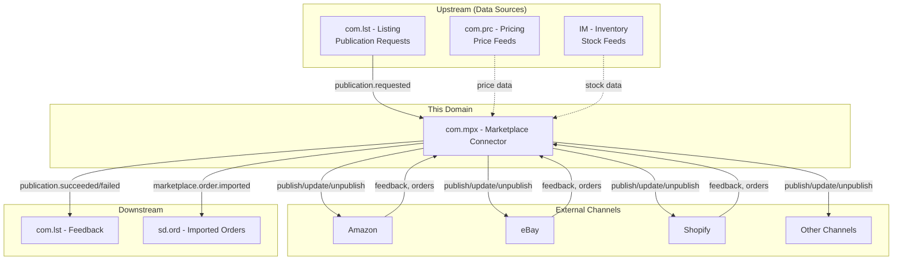
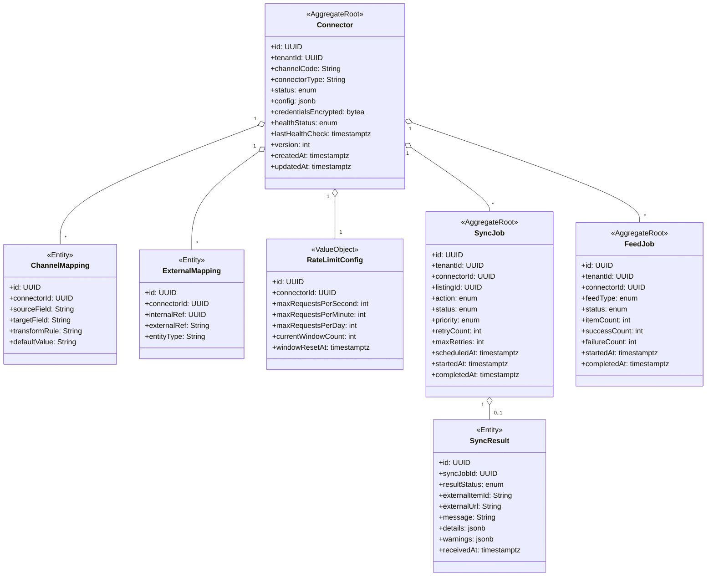
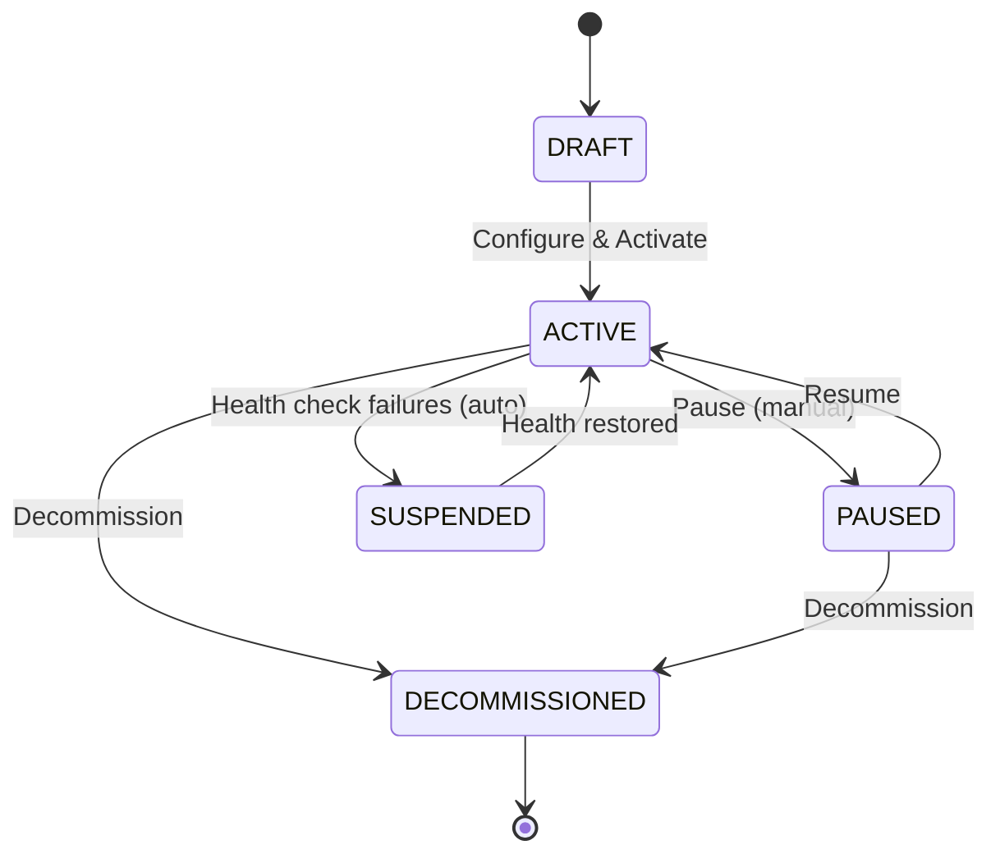
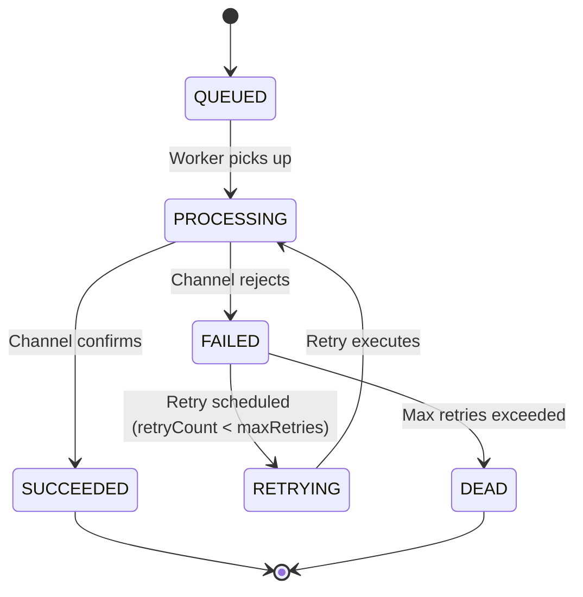
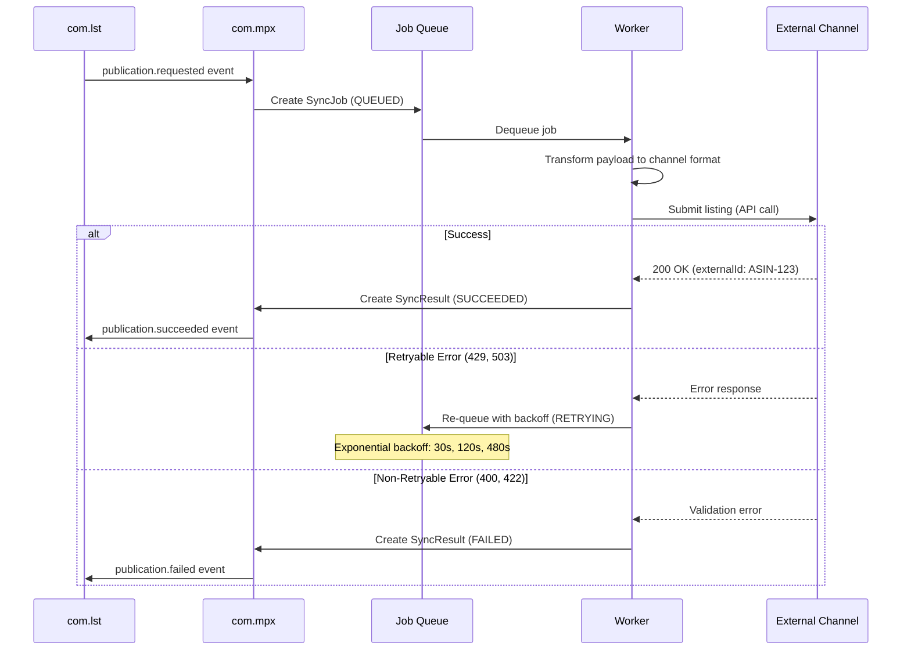
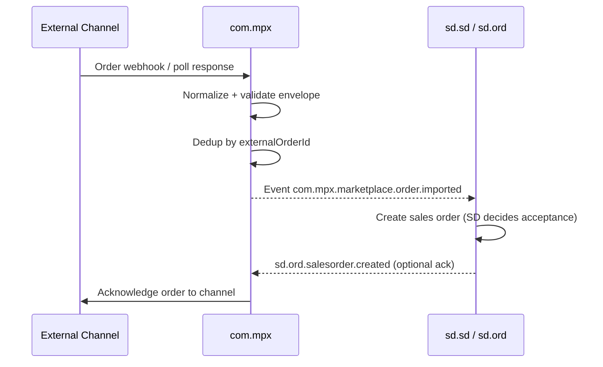
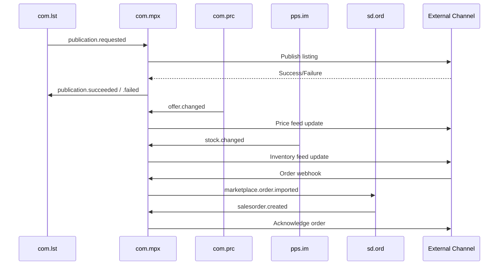
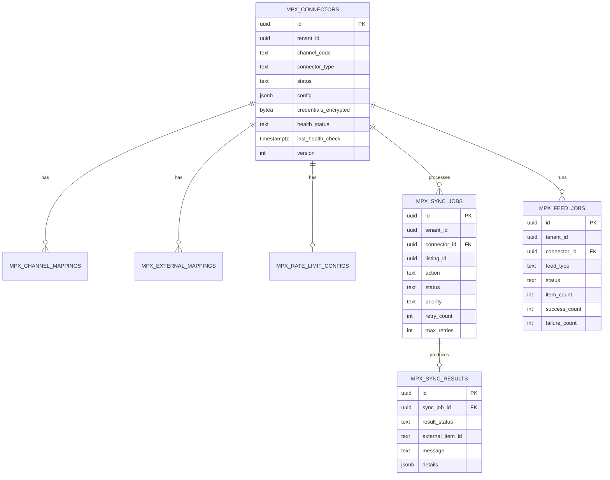

# COM.MPX - Marketplace Connector Domain / Service Specification

> **Conceptual Stack Layer:** Domain / Service
> **Space:** Platform
> **Owner:** Domain Engineering Team
> **Schema alignment:** `service-layer.schema.json`
> **Companion files:** `openapi.yaml`, `*.schema.json` (event contracts)
> **Referenced by:** Platform-Feature Spec SS5 (backend dependencies), BFF Contract
> **Belongs to:** COM Suite Spec (`_com_suite.md`)

> **Meta Information**
> - **Version:** 2026-04-03
> - **Template:** `domain-service-spec.md` v1.0.0
> - **Template Compliance:** ~95%
> - **Author(s):** OpenLeap Architecture Team
> - **Status:** DRAFT
> - **Suite:** `com`
> - **Domain:** `mpx`
> - **Bounded Context Ref:** `bc:marketplace-connector`
> - **Service ID:** `com-mpx-svc`
> - **basePackage:** `io.openleap.com.mpx`
> - **API Base Path:** `/api/com/mpx/v1`
> - **OpenLeap Starter Version:** `v1`
> - **Port:** OPEN QUESTION
> - **Repository:** OPEN QUESTION
> - **Tags:** `com`, `marketplace`, `channel-connector`, `adapter`, `integration`, `order-import`
> - **Team:**
>   - Name: `team-com`
>   - Email: `com-team@openleap.io`
>   - Slack: `#com-team`

---

## Specification Guidelines Compliance

>
> ### Non-Negotiables
> - Never invent facts. If required info is missing, add an **OPEN QUESTION** entry.
> - Preserve intent and decisions. Only change meaning when explicitly requested.
> - Do not remove normative constraints unless they are explicitly replaced.
> - Keep the spec **self-contained**: no "see chat", no implicit context.
>
> ### Source of Truth Priority
> When sources conflict:
> 1. Spec (explicit) wins
> 2. Starter specs (implementation constraints) next
> 3. Guidelines (best practices) last
>
> ### Style Guide
> - Prefer short sentences and lists.
> - Use MUST/SHOULD/MAY for normative statements.
> - Keep terminology consistent (Aggregate, Domain Service, Application Service, Command, Event).
> - Avoid ambiguous words ("often", "maybe") unless explicitly noting uncertainty.

---

## 0. Document Purpose & Scope

### 0.1 Purpose
This specification defines the Marketplace Connector domain within the Commerce Suite. `com.mpx` provides a unified adapter layer for publishing listings to external sales channels (Amazon, eBay, Shopify, etc.), receiving channel feedback, and synchronizing external state (orders, inventory signals, external IDs) back into the platform. It is the authoritative source of truth for connector configuration, external ID mappings, and channel synchronization state.

### 0.2 Target Audience
- Product Owners & Business Stakeholders
- System Architects & Technical Leads
- Integration Engineers
- Channel Managers & Marketplace Operators

### 0.3 Scope
**In Scope:**
- Connector/adapter management per external channel
- Listing publication (publish, unpublish, update) to external APIs
- Channel feedback processing (success, failure, external IDs, warnings)
- Inventory feed synchronization to channels
- Price feed synchronization to channels
- Inbound order import from channels (forwarded to SD as intent events)
- External mapping management (internal identifiers to channel identifiers)
- Channel health monitoring and rate limit management
- Retry, backoff, and dead-letter handling for channel operations

**Out of Scope:**
- Listing lifecycle and eligibility (-> com.lst)
- Product master data (-> com.cat)
- Pricing rules and resolution (-> com.prc)
- Sales order processing and commitment (-> sd.ord / sd.sd — MPX forwards imported orders as intents)
- Financial accounting (-> FI Suite)
- Billing/invoicing/posting (-> fi)

### 0.4 Related Documents
- `_com_suite.md` - Commerce Suite overview
- `com_lst-spec.md` - Listing specification
- `com_prc-spec.md` - Pricing specification
- `_sd_suite.md` - Sales & Distribution Suite
- `domain-service-spec.md` - Domain specification template

---

## 1. Business Context

### 1.1 Domain Purpose
`com.mpx` abstracts the complexity of integrating with multiple external marketplaces behind a uniform adapter interface. Each marketplace has its own API, data formats, rate limits, authentication, and error models. MPX normalizes these differences so that `com.lst` can publish to any channel through a single event-driven contract. Channel orders ingested by MPX are **intents** — SD decides commitment.

### 1.2 Business Value
- **Multi-channel reach:** Sell on Amazon, eBay, Shopify, Zalando, etc. through one platform
- **Reduced integration cost:** New channels added as adapter plugins without changing core COM
- **Operational reliability:** Centralized retry, rate limiting, and error handling per channel
- **Bidirectional sync:** Import marketplace orders into SD for unified order-to-cash processing
- **Real-time visibility:** Channel health dashboards, sync status, error tracking
- **Faster rollout:** Standardized adapter interface accelerates new channel onboarding

### 1.3 Key Stakeholders

| Role | Responsibility | Primary Use Cases |
|------|----------------|-------------------|
| Channel Manager | Configure channels, monitor sync status, review errors | UC-MPX-001, UC-MPX-005 |
| E-Commerce Operations | Review publication errors, resolve failures | UC-MPX-003, UC-MPX-004 |
| Platform Engineer | Develop and deploy new connector adapters | UC-MPX-006 |
| Sales Operations | Monitor inbound marketplace orders | UC-MPX-007 |
| Integration Engineer | Build connectors, manage external mappings | UC-MPX-006, UC-MPX-008 |

### 1.4 Strategic Positioning



### 1.5 Service Context

| Field | Value |
|-------|-------|
| Suite | `com` (Commerce) |
| Domain | `mpx` (Marketplace Connector) |
| Bounded Context | `bc:marketplace-connector` |
| Service ID | `com-mpx-svc` |
| Base Package | `io.openleap.com.mpx` |
| Authoritative Sources | COM Suite Spec (`_com_suite.md`), Amazon SP-API, eBay REST API, Shopify Admin API |

---

## 2. Service Identity

| Field | Value |
|-------|-------|
| **Service ID** | `com-mpx-svc` |
| **Display Name** | Marketplace Connector Service |
| **Suite** | `com` |
| **Domain** | `mpx` |
| **Bounded Context Ref** | `bc:marketplace-connector` |
| **Version** | 2026-04-03 |
| **Status** | DRAFT |
| **API Base Path** | `/api/com/mpx/v1` |
| **Repository** | OPEN QUESTION |
| **Tags** | `com`, `marketplace`, `channel-connector`, `adapter`, `integration`, `order-import` |
| **Team Name** | `team-com` |
| **Team Email** | `com-team@openleap.io` |
| **Team Slack** | `#com-team` |

---

## 3. Domain Model

### 3.1 Conceptual Overview

MPX manages **Connectors** (configured channel integrations), processes **SyncJobs** (publish/unpublish/update tasks), and tracks **SyncResults** (channel responses). Each connector encapsulates the channel-specific logic (API client, mapping, authentication) as a pluggable adapter. **FeedJobs** handle bulk inventory and price synchronization. **ExternalMappings** track the bidirectional relationship between internal and channel-specific identifiers.



### 3.2 Core Concepts

| Concept | Owner | Description | Glossary Ref |
|---------|-------|-------------|--------------|
| Connector | com-mpx-svc | Configured integration with an external sales channel | Connector (Channel Integration) |
| SyncJob | com-mpx-svc | Discrete publish/unpublish/update task for a single listing | Sync Job (Publication Job) |
| SyncResult | com-mpx-svc | Channel response to a sync job (success/failure + external IDs) | Sync Result |
| FeedJob | com-mpx-svc | Batch inventory or price update to a channel | Feed Job (Bulk Feed) |
| ExternalMapping | com-mpx-svc | Bidirectional mapping between internal and channel-specific identifiers | External Mapping |
| ChannelMapping | com-mpx-svc | Field-level transformation rules for channel data format | Channel Mapping |
| RateLimitConfig | com-mpx-svc | Channel-specific rate limiting configuration | Rate Limit Config |

### 3.3 Aggregate Definitions

#### 3.3.1 Aggregate: Connector

**Aggregate ID:** `agg:connector`
**Business Purpose:** Represents a configured integration with an external sales channel. Encapsulates authentication, field mapping, rate limits, and health status. Each connector uses a pluggable adapter implementing the `ChannelAdapter` interface.

**Aggregate Root Attributes:**

| Attribute | Type | Format | Required | Description | Example | Constraints |
|-----------|------|--------|----------|-------------|---------|-------------|
| id | UUID | uuid | Yes | Unique identifier | `a1b2c3d4-...` | Immutable after create, `OlUuid.create()` |
| tenantId | UUID | uuid | Yes | Tenant ownership | `t1-uuid` | Immutable, RLS-enforced |
| channelCode | String | — | Yes | Channel identifier | `AMAZON_DE` | Required, unique per (tenantId, status=ACTIVE) |
| connectorType | String | — | Yes | Adapter type | `AMAZON_SP_API` | Required, must match registered adapter |
| status | Enum | — | Yes | Connector lifecycle state | `ACTIVE` | DRAFT, ACTIVE, PAUSED, SUSPENDED, DECOMMISSIONED |
| config | JSONB | — | No | Channel-specific config (seller ID, marketplace) | `{"sellerId": "A1X..."}` | Validated per connectorType schema |
| credentialsEncrypted | bytea | — | No | Encrypted credentials (API keys, OAuth tokens) | — | AES-256-GCM encrypted at rest |
| healthStatus | Enum | — | Yes | Current health status | `HEALTHY` | HEALTHY, DEGRADED, UNHEALTHY, UNKNOWN |
| lastHealthCheck | Timestamptz | ISO 8601 | No | Last health check timestamp | `2026-03-15T10:05:00Z` | Updated by health check scheduler |
| version | Integer | — | Yes | Optimistic locking version | `1` | Auto-incremented |
| createdAt | Timestamptz | ISO 8601 | Yes | Creation timestamp | `2026-03-15T08:30:00Z` | System-managed |
| updatedAt | Timestamptz | ISO 8601 | Yes | Last update timestamp | `2026-03-15T10:00:00Z` | System-managed |

**Lifecycle States:**



**State Transitions:**

| From | To | Trigger | Guard / Precondition | Side Effects |
|------|----|---------|---------------------|--------------|
| — | DRAFT | Create | Valid tenantId, channelCode, connectorType | — |
| DRAFT | ACTIVE | Activate | Config + credentials valid, connectivity test passed (BR-001) | Starts health check schedule; emits `connector.activated` |
| ACTIVE | PAUSED | Pause | Manual operator action | Stops job processing; emits `connector.paused` |
| PAUSED | ACTIVE | Resume | — | Resumes job processing; emits `connector.resumed` |
| ACTIVE | SUSPENDED | AutoSuspend | 10 consecutive failures (BR-004) | Stops job processing; emits `connector.suspended` |
| SUSPENDED | ACTIVE | Restore | Manual resolution + connectivity test | Resumes job processing; emits `connector.restored` |
| ACTIVE | DECOMMISSIONED | Decommission | — | Cancels pending jobs; emits `connector.decommissioned` |
| PAUSED | DECOMMISSIONED | Decommission | — | Cancels pending jobs; emits `connector.decommissioned` |

**Invariants:**
- INV-C-001: Only one ACTIVE connector per `(tenantId, channelCode)` (BR-001)
- INV-C-002: All credential fields MUST be encrypted at rest with AES-256-GCM (BR-005)
- INV-C-003: DECOMMISSIONED connectors are terminal — no state changes allowed
- INV-C-004: Health check MUST run every 5 minutes for ACTIVE connectors (BR-004)

**Domain Events Emitted:**

| Event | Routing Key | When | Key Payload |
|-------|-------------|------|-------------|
| ConnectorActivated | `com.mpx.connector.activated` | DRAFT -> ACTIVE | connectorId, channelCode, connectorType |
| ConnectorPaused | `com.mpx.connector.paused` | ACTIVE -> PAUSED | connectorId, channelCode |
| ConnectorSuspended | `com.mpx.connector.suspended` | ACTIVE -> SUSPENDED | connectorId, channelCode, reason |
| ConnectorDecommissioned | `com.mpx.connector.decommissioned` | -> DECOMMISSIONED | connectorId, channelCode |

#### 3.3.2 Aggregate: SyncJob

**Aggregate ID:** `agg:sync-job`
**Business Purpose:** A discrete work unit to publish, unpublish, or update a listing on an external channel. Managed with retry logic, priority queuing, and exponential backoff.

**Aggregate Root Attributes:**

| Attribute | Type | Format | Required | Description | Example | Constraints |
|-----------|------|--------|----------|-------------|---------|-------------|
| id | UUID | uuid | Yes | Unique identifier | `sj-uuid` | Immutable, `OlUuid.create()` |
| tenantId | UUID | uuid | Yes | Tenant ownership | `t1-uuid` | Immutable, RLS-enforced |
| connectorId | UUID | uuid | Yes | Target connector | `conn-uuid` | FK to Connector, must be ACTIVE |
| listingId | UUID | uuid | Yes | Source listing from com.lst | `lst-uuid` | FK logical to com.lst |
| action | Enum | — | Yes | Job action type | `PUBLISH` | PUBLISH, UNPUBLISH, UPDATE, PRICE_UPDATE, STOCK_UPDATE |
| status | Enum | — | Yes | Job lifecycle state | `QUEUED` | QUEUED, PROCESSING, SUCCEEDED, FAILED, RETRYING, DEAD |
| priority | Enum | — | Yes | Job priority | `NORMAL` | HIGH, NORMAL, LOW; default NORMAL |
| retryCount | Integer | — | Yes | Current retry attempt | `0` | Default 0 |
| maxRetries | Integer | — | Yes | Maximum retry attempts | `3` | Default 3 (BR-003) |
| scheduledAt | Timestamptz | ISO 8601 | No | Scheduled execution time | `2026-03-15T10:00:00Z` | For delayed/retry scheduling |
| startedAt | Timestamptz | ISO 8601 | No | Actual start time | `2026-03-15T10:00:05Z` | Set when worker picks up |
| completedAt | Timestamptz | ISO 8601 | No | Completion time | `2026-03-15T10:00:08Z` | Set on success or final failure |
| createdAt | Timestamptz | ISO 8601 | Yes | Creation timestamp | `2026-03-15T09:59:00Z` | System-managed |

**Lifecycle States:**



**State Transitions:**

| From | To | Trigger | Guard / Precondition | Side Effects |
|------|----|---------|---------------------|--------------|
| — | QUEUED | Create | Connector ACTIVE, dedup check (BR-006) | — |
| QUEUED | PROCESSING | WorkerPickup | Rate limit not exceeded (BR-002) | Sets startedAt |
| PROCESSING | SUCCEEDED | ChannelSuccess | Channel returns success | Creates SyncResult; emits `publication.succeeded` |
| PROCESSING | FAILED | ChannelFailure | Channel returns error | Creates SyncResult with error details |
| FAILED | RETRYING | RetrySchedule | retryCount < maxRetries, retryable error (BR-003) | Increments retryCount; schedules with backoff |
| RETRYING | PROCESSING | RetryExecute | — | — |
| FAILED | DEAD | MaxRetriesExceeded | retryCount >= maxRetries | Emits `publication.failed`; moves to DLQ |

**Invariants:**
- INV-SJ-001: SyncJob idempotency via `(listingId, connectorId, action)` dedup within time window (BR-006)
- INV-SJ-002: SUCCEEDED and DEAD are terminal states
- INV-SJ-003: Retry backoff follows exponential schedule: 30s, 120s, 480s (BR-003)

**Domain Events Emitted:**

| Event | Routing Key | When | Key Payload |
|-------|-------------|------|-------------|
| PublicationSucceeded | `com.mpx.publication.succeeded` | PROCESSING -> SUCCEEDED | tenantId, listingId, connectorId, externalItemId, channel |
| PublicationFailed | `com.mpx.publication.failed` | FAILED -> DEAD | tenantId, listingId, connectorId, errorCode, message, retryable |

#### 3.3.3 Aggregate: FeedJob

**Aggregate ID:** `agg:feed-job`
**Business Purpose:** Batch inventory or price update to a channel. Handles bulk synchronization within channel-specific rate limits and batch size constraints.

**Aggregate Root Attributes:**

| Attribute | Type | Format | Required | Description | Example | Constraints |
|-----------|------|--------|----------|-------------|---------|-------------|
| id | UUID | uuid | Yes | Unique identifier | `fj-uuid` | Immutable, `OlUuid.create()` |
| tenantId | UUID | uuid | Yes | Tenant ownership | `t1-uuid` | Immutable, RLS-enforced |
| connectorId | UUID | uuid | Yes | Target connector | `conn-uuid` | FK to Connector, must be ACTIVE |
| feedType | Enum | — | Yes | Feed type | `INVENTORY` | INVENTORY, PRICE |
| status | Enum | — | Yes | Feed lifecycle state | `PENDING` | PENDING, PROCESSING, COMPLETED, FAILED |
| itemCount | Integer | — | No | Total items in feed | `5000` | Set at creation |
| successCount | Integer | — | No | Successfully synced items | `4998` | Updated during processing |
| failureCount | Integer | — | No | Failed items | `2` | Updated during processing |
| startedAt | Timestamptz | ISO 8601 | No | Processing start | `2026-03-15T02:00:00Z` | — |
| completedAt | Timestamptz | ISO 8601 | No | Processing end | `2026-03-15T02:15:00Z` | — |
| createdAt | Timestamptz | ISO 8601 | Yes | Creation timestamp | — | System-managed |

**Domain Events Emitted:**

| Event | Routing Key | When | Key Payload |
|-------|-------------|------|-------------|
| SyncCompleted | `com.mpx.sync.completed` | Feed completes | tenantId, connectorId, feedType, successCount, failureCount |

#### 3.3.4 Entity: SyncResult (child of SyncJob)

**Business Purpose:** Channel response to a sync job — captures success/failure details, external identifiers, and warnings.

| Attribute | Type | Format | Required | Description | Constraints |
|-----------|------|--------|----------|-------------|-------------|
| id | UUID | uuid | Yes | Unique identifier | Immutable |
| syncJobId | UUID | uuid | Yes | Parent sync job | FK to SyncJob |
| resultStatus | Enum | — | Yes | SUCCESS, FAILURE, PARTIAL | — |
| externalItemId | String | — | No | Channel's identifier (e.g., ASIN) | Set on success |
| externalUrl | String | URL | No | Channel listing URL | — |
| message | String | — | No | Channel response message | Max 4000 chars |
| details | JSONB | — | No | Structured error/success details | — |
| warnings | JSONB | — | No | Non-fatal channel warnings | — |
| receivedAt | Timestamptz | ISO 8601 | Yes | Response timestamp | System-managed |

**Relationship:** SyncJob `1` -> `0..1` SyncResult

#### 3.3.5 Entity: ExternalMapping (child of Connector)

**Business Purpose:** Bidirectional mapping between internal product/variant/listing IDs and channel-specific identifiers. Source of truth for "which internal entity maps to which external ID on which channel."

| Attribute | Type | Format | Required | Description | Constraints |
|-----------|------|--------|----------|-------------|-------------|
| id | UUID | uuid | Yes | Unique identifier | Immutable |
| connectorId | UUID | uuid | Yes | Parent connector | FK to Connector |
| internalRef | UUID | uuid | Yes | Internal entity ID (listing, product, variant) | — |
| externalRef | String | — | Yes | Channel-specific ID (ASIN, eBay Item ID) | — |
| entityType | String | — | Yes | LISTING, PRODUCT, VARIANT | — |
| createdAt | Timestamptz | ISO 8601 | Yes | Creation timestamp | System-managed |

**Relationship:** Connector `1` -> `0..*` ExternalMapping

### 3.4 Enumerations

| Enum | Values | Description |
|------|--------|-------------|
| ConnectorStatus | DRAFT, ACTIVE, PAUSED, SUSPENDED, DECOMMISSIONED | Connector lifecycle |
| HealthStatus | HEALTHY, DEGRADED, UNHEALTHY, UNKNOWN | Channel health |
| SyncAction | PUBLISH, UNPUBLISH, UPDATE, PRICE_UPDATE, STOCK_UPDATE | Sync job action types |
| SyncJobStatus | QUEUED, PROCESSING, SUCCEEDED, FAILED, RETRYING, DEAD | Sync job lifecycle |
| FeedType | INVENTORY, PRICE | Bulk feed types |
| FeedJobStatus | PENDING, PROCESSING, COMPLETED, FAILED | Feed job lifecycle |
| JobPriority | HIGH, NORMAL, LOW | Job priority levels |
| EntityType | LISTING, PRODUCT, VARIANT | External mapping entity types |

---

## 4. Business Rules & Constraints

### 4.1 Business Rules Catalog

| ID | Rule Name | Description | Scope | Enforcement | Error Code |
|----|-----------|-------------|-------|-------------|------------|
| BR-001 | One Connector Per Channel | Only one ACTIVE connector per (tenantId, channelCode) | Connector | Create/Activate | `MPX-BIZ-001` |
| BR-002 | Rate Limit Compliance | Respect channel-specific rate limits; queue excess requests | SyncJob | Worker | `MPX-BIZ-002` |
| BR-003 | Retry Policy | Retryable errors retry with exponential backoff (30s, 120s, 480s); max 3 retries | SyncJob | Worker | `MPX-BIZ-003` |
| BR-004 | Auto-Suspend | 10 consecutive failures triggers connector SUSPENDED; alert emitted | Connector | Health Monitor | `MPX-BIZ-004` |
| BR-005 | Credential Encryption | All channel credentials MUST be encrypted at rest (AES-256-GCM) | Connector | Storage | `MPX-SEC-005` |
| BR-006 | Idempotent Publish | SyncJob idempotency via (listingId, connectorId, action) dedup within time window | SyncJob | Create | `MPX-BIZ-006` |
| BR-007 | Feed Batching | Inventory/price feeds batched per channel limits (e.g., Amazon max 10K per feed) | FeedJob | Feed Processor | `MPX-BIZ-007` |
| BR-008 | Channel Order as Intent | Inbound channel orders are intents; MPX MUST NOT confirm as commercial truth | SyncJob | Order Import | `MPX-BIZ-008` |
| BR-009 | Connector Active for Jobs | SyncJobs and FeedJobs MUST only be created for ACTIVE connectors | SyncJob/FeedJob | Create | `MPX-BIZ-009` |

### 4.2 Detailed Rule Definitions

#### BR-001: One Connector Per Channel
**Context:** Prevents duplicate integrations which would cause double-publication and order import conflicts.
**Rule Statement:** Only one connector in ACTIVE status per `(tenantId, channelCode)` combination.
**Applies To:** Connector aggregate
**Enforcement:** Unique partial index on `(tenant_id, channel_code)` WHERE `status = 'ACTIVE'`.
**Validation Logic:** `if existsActive(tenantId, channelCode) throw DuplicateConnectorException`
**Error Handling:**
- Code: `MPX-BIZ-001`
- Message: `"An active connector for channel {channelCode} already exists for this tenant."`
- HTTP: 409 Conflict

#### BR-003: Retry Policy
**Context:** External channel APIs are inherently unreliable. Retryable errors (429 Too Many Requests, 503 Service Unavailable) should be retried with backoff to avoid overwhelming the channel.
**Rule Statement:** Retryable errors retry with exponential backoff schedule: 30s, 120s, 480s. Maximum 3 retries. Non-retryable errors (400, 422) fail immediately.
**Applies To:** SyncJob aggregate
**Enforcement:** Worker evaluates error category and schedules retry or marks DEAD.
**Validation Logic:** `if (retryable && retryCount < maxRetries) scheduleRetry(backoff[retryCount]); else markDead()`

#### BR-004: Auto-Suspend
**Context:** Persistent channel failures indicate systemic issues (API outage, revoked credentials). Continued attempts waste resources and may trigger channel-side rate limits.
**Rule Statement:** If a connector accumulates 10 consecutive job failures, it MUST be automatically suspended.
**Applies To:** Connector aggregate
**Enforcement:** Health monitor tracks consecutive failure count.
**Error Handling:**
- Code: `MPX-BIZ-004`
- Message: `"Connector {id} suspended after {count} consecutive failures. Reason: {reason}"`
- Emits: `connector.suspended` event

### 4.3 Data Validation Rules

| Field | Validation Rule | Error Code | Error Message |
|-------|----------------|------------|---------------|
| channelCode | Required, non-blank | `MPX-VAL-001` | `"Channel code is required"` |
| connectorType | Required, must match registered adapter | `MPX-VAL-002` | `"Unknown connector type: {type}"` |
| config | Must pass connector-type-specific schema validation | `MPX-VAL-003` | `"Invalid config for connector type {type}: {details}"` |
| listingId | Required for SyncJob, valid UUID | `MPX-VAL-004` | `"Valid listing ID is required"` |
| connectorId | Required, must reference ACTIVE connector | `MPX-VAL-005` | `"Connector {id} is not in ACTIVE state"` |
| feedType | Required for FeedJob, valid enum | `MPX-VAL-006` | `"Valid feed type required (INVENTORY, PRICE)"` |
| action | Required for SyncJob, valid enum | `MPX-VAL-007` | `"Valid action required (PUBLISH, UNPUBLISH, UPDATE, PRICE_UPDATE, STOCK_UPDATE)"` |

### 4.4 Reference Data Dependencies

| Catalog | Usage | Provider Service | Validation |
|---------|-------|-----------------|------------|
| Channel Adapter Registry | `connectorType` field | com-mpx-svc (internal) | Adapter existence check |
| Listing IDs | `listingId` field | com-lst-svc (T3) | Logical FK (eventual consistency) |
| ISO 4217 Currencies | Order import normalization | ref-data-svc (T1) | Code existence check |

---

## 5. Use Cases

### 5.1 Business Logic Placement

| Layer | Responsibilities |
|-------|-----------------|
| Application Service | Command validation, aggregate loading, event publishing, orchestration (retry scheduling, feed triggering) |
| Domain Service | Rate limit enforcement, adapter selection, payload transformation, health monitoring |
| Aggregate | State transitions, invariant enforcement, attribute validation |

### 5.2 Use Cases

#### UC-MPX-001: Configure New Channel Connector

| Field | Value |
|-------|-------|
| **ID** | UC-MPX-001 |
| **Type** | WRITE |
| **Trigger** | REST |
| **Aggregate** | Connector |
| **Domain Operation** | `Connector.create()` |
| **Inputs** | channelCode, connectorType, config?, credentials? |
| **Outputs** | Created Connector in DRAFT state |
| **Events** | — (no event on DRAFT creation) |
| **REST** | `POST /api/com/mpx/v1/connectors` -> 201 Created |
| **Idempotency** | Client-generated `Idempotency-Key` header |
| **Errors** | 400 (validation), 409 (BR-001 duplicate active connector) |

#### UC-MPX-002: Activate Connector

| Field | Value |
|-------|-------|
| **ID** | UC-MPX-002 |
| **Type** | WRITE |
| **Trigger** | REST |
| **Aggregate** | Connector |
| **Domain Operation** | `Connector.activate()` |
| **Inputs** | connectorId |
| **Outputs** | Connector in ACTIVE state |
| **Events** | `ConnectorActivated` -> `com.mpx.connector.activated` |
| **REST** | `POST /api/com/mpx/v1/connectors/{id}:activate` -> 200 OK |
| **Idempotency** | Idempotent (re-activate of ACTIVE is no-op) |
| **Errors** | 404 (not found), 409 (not in DRAFT, or BR-001 duplicate), 422 (config/credentials invalid) |

#### UC-MPX-003: Publish Listing to Channel

| Field | Value |
|-------|-------|
| **ID** | UC-MPX-003 |
| **Type** | WRITE |
| **Trigger** | Event (`com.lst.publication.requested`) |
| **Aggregate** | SyncJob |
| **Domain Operation** | `SyncJob.create(action=PUBLISH)` -> Worker processes |
| **Inputs** | listingId, connectorId (from event routing), listing payload |
| **Outputs** | SyncJob (QUEUED -> PROCESSING -> SUCCEEDED/FAILED) |
| **Events** | `PublicationSucceeded` or `PublicationFailed` |
| **REST** | — (event-triggered) |
| **Idempotency** | Dedup via (listingId, connectorId, action) within time window (BR-006) |
| **Errors** | BR-002 (rate limit), BR-009 (connector not ACTIVE) |

#### UC-MPX-004: Handle Publication Failure with Retry

| Field | Value |
|-------|-------|
| **ID** | UC-MPX-004 |
| **Type** | WRITE |
| **Trigger** | System (channel error response) |
| **Aggregate** | SyncJob |
| **Domain Operation** | `SyncJob.fail()` -> `SyncJob.scheduleRetry()` or `SyncJob.markDead()` |
| **Inputs** | syncJobId, channel error response |
| **Outputs** | SyncJob in RETRYING or DEAD state |
| **Events** | `PublicationFailed` (on DEAD) |
| **REST** | `POST /api/com/mpx/v1/jobs/{jobId}:retry` (manual retry of FAILED/DEAD) |
| **Idempotency** | Idempotent retry scheduling |
| **Errors** | 404 (job not found), 409 (not in FAILED/DEAD state) |

#### UC-MPX-005: Bulk Inventory/Price Feed

| Field | Value |
|-------|-------|
| **ID** | UC-MPX-005 |
| **Type** | WRITE |
| **Trigger** | Scheduler or REST (manual) |
| **Aggregate** | FeedJob |
| **Domain Operation** | `FeedJob.create(feedType)` -> batch processing |
| **Inputs** | connectorId, feedType (INVENTORY or PRICE) |
| **Outputs** | FeedJob with success/failure counts |
| **Events** | `SyncCompleted` -> `com.mpx.sync.completed` |
| **REST** | `POST /api/com/mpx/v1/connectors/{id}/feeds` -> 201 Created |
| **Idempotency** | Idempotency-Key header |
| **Errors** | 422 (connector not ACTIVE, BR-009) |

#### UC-MPX-006: Monitor Channel Health

| Field | Value |
|-------|-------|
| **ID** | UC-MPX-006 |
| **Type** | READ/WRITE |
| **Trigger** | Scheduler (every 5 minutes for ACTIVE connectors) |
| **Aggregate** | Connector |
| **Domain Operation** | `Connector.updateHealth(status)` |
| **Inputs** | connectorId |
| **Outputs** | Updated healthStatus |
| **Events** | `ConnectorSuspended` (if auto-suspend triggered, BR-004) |
| **REST** | `GET /api/com/mpx/v1/connectors/{id}/health` (read) |
| **Idempotency** | Inherently idempotent |
| **Errors** | — |

#### UC-MPX-007: Import Marketplace Order

| Field | Value |
|-------|-------|
| **ID** | UC-MPX-007 |
| **Type** | WRITE |
| **Trigger** | Webhook or Poll (external channel) |
| **Aggregate** | — (stateless normalization, then event emission) |
| **Domain Operation** | Normalize channel order -> emit intent event |
| **Inputs** | Channel-specific order payload |
| **Outputs** | Normalized order intent event |
| **Events** | `OrderImported` -> `com.mpx.marketplace.order.imported` |
| **REST** | `POST /api/com/mpx/v1/connectors/{id}/webhooks/orders` (webhook endpoint) |
| **Idempotency** | Dedup by external order ID per connector |
| **Errors** | 422 (normalization failure), 409 (duplicate order) |

#### UC-MPX-008: List / Search Sync Jobs (READ)

| Field | Value |
|-------|-------|
| **ID** | UC-MPX-008 |
| **Type** | READ |
| **Trigger** | REST |
| **Aggregate** | SyncJob |
| **Domain Operation** | Query projection |
| **Inputs** | connectorId?, status?, action?, from?, to?, page, size |
| **Outputs** | Paginated sync job list with results |
| **Events** | — |
| **REST** | `GET /api/com/mpx/v1/connectors/{id}/jobs?...` -> 200 OK |
| **Idempotency** | Inherently idempotent (GET) |
| **Errors** | 400 (invalid filter params) |

#### UC-MPX-009: Dashboard Overview (READ)

| Field | Value |
|-------|-------|
| **ID** | UC-MPX-009 |
| **Type** | READ |
| **Trigger** | REST |
| **Aggregate** | — (cross-aggregate projection) |
| **Domain Operation** | Query projection |
| **Inputs** | — |
| **Outputs** | Aggregated view: connector count, job success/failure rates, feed status |
| **Events** | — |
| **REST** | `GET /api/com/mpx/v1/dashboard` -> 200 OK |
| **Idempotency** | Inherently idempotent (GET) |
| **Errors** | — |

### 5.3 Process Flow Diagrams

#### Publication with Retry



#### Marketplace Order Import



### 5.4 Cross-Domain Workflows

**Does this domain participate in multi-service workflows?** Yes

#### Workflow: Marketplace Order Import -> SD Order (SAG-COM-MPX-001)

**Business Purpose:** Orders placed on external marketplaces are imported into SD for unified order-to-cash processing.

**Orchestration Pattern:** Choreography (EDA)
**Pattern Rationale:** Sequential flow, each step independent. MPX normalizes and emits; SD decides acceptance. No distributed transaction coordination needed.

**Participating Services:**

| Service | Role | Responsibilities |
|---------|------|------------------|
| com.mpx | Producer | Imports and normalizes marketplace order, emits intent event |
| sd.ord | Consumer | Creates sales order from imported data |
| com.mpx | Participant | Acknowledges order to channel after SD confirmation |

**Workflow Steps:**
1. **Step 1:** MPX receives order from channel (webhook or poll)
2. **Step 2:** MPX normalizes order, emits `mpx.marketplace.order.imported`
3. **Step 3:** sd.ord creates sales order, emits `sd.ord.salesorder.created`
4. **Step 4:** MPX acknowledges order to channel

#### Workflow: Listing Publication (SAG-COM-MPX-002)

**Business Purpose:** Listings managed by com.lst are published to external channels via MPX adapters.

**Orchestration Pattern:** Choreography (EDA)

**Participating Services:**

| Service | Role | Responsibilities |
|---------|------|------------------|
| com.lst | Producer | Emits publication request when listing is ready |
| com.mpx | Processor | Transforms and publishes to channel, reports success/failure |
| com.lst | Consumer | Updates listing status based on MPX feedback |

---

## 6. REST API

### 6.1 API Overview

| Field | Value |
|-------|-------|
| Base Path | `/api/com/mpx/v1` |
| Authentication | OAuth2/JWT (Bearer token) |
| Authorization | Scopes: `com.mpx:read`, `com.mpx:write`, `com.mpx:admin` |
| Content Type | `application/json` |
| Versioning | URL path (`v1`) |

### 6.2 Resource Operations

#### Connector Resource

| Endpoint | Method | Path | Summary | Role Required | Events Published |
|----------|--------|------|---------|---------------|-----------------|
| Create Connector | POST | `/connectors` | Create connector (DRAFT) | `com.mpx:write` | — |
| Get Connector | GET | `/connectors/{id}` | Retrieve connector by ID | `com.mpx:read` | — |
| List Connectors | GET | `/connectors` | Filter by channelCode, status | `com.mpx:read` | — |
| Update Connector | PUT | `/connectors/{id}` | Update config/credentials | `com.mpx:write` | — |
| Test Connectivity | POST | `/connectors/{id}:test` | Test channel connectivity | `com.mpx:write` | — |

**Create Connector -- Request:**
```json
{
  "channelCode": "AMAZON_DE",
  "connectorType": "AMAZON_SP_API",
  "config": {
    "sellerId": "A1XAMPLE",
    "marketplaceId": "A1PA6795UKMFR9"
  },
  "credentials": {
    "clientId": "amzn1.app.xxx",
    "clientSecret": "***",
    "refreshToken": "***"
  }
}
```

**Create Connector -- Response (201 Created):**
```json
{
  "id": "conn-uuid",
  "status": "DRAFT",
  "channelCode": "AMAZON_DE",
  "connectorType": "AMAZON_SP_API",
  "healthStatus": "UNKNOWN",
  "version": 1,
  "createdAt": "2026-03-15T08:30:00Z"
}
```

**Update Connector -- Headers:** `If-Match: "{version}"` (optimistic locking, 412 on conflict)

### 6.3 Business Operations

| Endpoint | Method | Path | Summary | Role Required | Events Published |
|----------|--------|------|---------|---------------|-----------------|
| Activate | POST | `/connectors/{id}:activate` | Activate connector | `com.mpx:write` | `ConnectorActivated` |
| Pause | POST | `/connectors/{id}:pause` | Pause connector | `com.mpx:write` | `ConnectorPaused` |
| Resume | POST | `/connectors/{id}:resume` | Resume connector | `com.mpx:write` | — |
| Decommission | POST | `/connectors/{id}:decommission` | Decommission connector | `com.mpx:admin` | `ConnectorDecommissioned` |

#### SyncJob Resource

| Endpoint | Method | Path | Summary | Role Required | Events Published |
|----------|--------|------|---------|---------------|-----------------|
| List Jobs | GET | `/connectors/{id}/jobs` | Filter by status, action, date range | `com.mpx:read` | — |
| Get Job | GET | `/jobs/{jobId}` | Get job details with result | `com.mpx:read` | — |
| Retry Job | POST | `/jobs/{jobId}:retry` | Manual retry of failed job | `com.mpx:write` | — |

#### FeedJob Resource

| Endpoint | Method | Path | Summary | Role Required | Events Published |
|----------|--------|------|---------|---------------|-----------------|
| Trigger Feed | POST | `/connectors/{id}/feeds` | Trigger manual feed (inventory, price) | `com.mpx:write` | — |
| List Feeds | GET | `/connectors/{id}/feeds` | List feed history | `com.mpx:read` | — |
| Get Feed | GET | `/feeds/{feedId}` | Get feed details | `com.mpx:read` | — |

#### Health & Monitoring

| Endpoint | Method | Path | Summary | Role Required | Events Published |
|----------|--------|------|---------|---------------|-----------------|
| Connector Health | GET | `/connectors/{id}/health` | Current health status | `com.mpx:read` | — |
| Dashboard | GET | `/dashboard` | Aggregated connector/job/feed overview | `com.mpx:read` | — |

#### Webhook Endpoint

| Endpoint | Method | Path | Summary | Role Required | Events Published |
|----------|--------|------|---------|---------------|-----------------|
| Order Webhook | POST | `/connectors/{id}/webhooks/orders` | Receive marketplace order | Channel-specific auth | `OrderImported` |

### 6.4 Error Responses

| HTTP Status | Error Code | Description |
|-------------|------------|-------------|
| 400 | `MPX-VAL-*` | Validation error (field-level) |
| 401 | — | Authentication required |
| 403 | — | Forbidden (insufficient role/scope) |
| 404 | — | Resource not found |
| 409 | `MPX-BIZ-001` | Conflict (duplicate active connector, invalid state transition) |
| 412 | — | Precondition failed (optimistic lock version mismatch) |
| 422 | `MPX-BIZ-*` | Business rule violation |
| 429 | — | Rate limited (channel-side, forwarded) |

### 6.5 OpenAPI Specification
**Location:** `contracts/http/com/mpx/openapi.yaml`
**OpenAPI Version:** 3.1.0

---

## 7. Events & Integration

### 7.1 Event-Driven Architecture Pattern
**Pattern Decision:** Choreography (EDA)
**Rationale:** MPX acts as a bridge between internal domains and external channels. Event-driven integration allows decoupled publication triggers, feedback propagation, and order import. At-least-once delivery with idempotent consumers.

### 7.2 Published Events

**Exchange:** `com.mpx.events` (topic)

#### PublicationSucceeded
- **Routing Key:** `com.mpx.publication.succeeded`
- **Business Meaning:** A listing has been successfully published to an external channel
- **When Published:** SyncJob PROCESSING -> SUCCEEDED
- **Payload Schema:**
```json
{
  "tenantId": "uuid",
  "listingId": "uuid",
  "connectorId": "uuid",
  "externalItemId": "ASIN-B09EXAMPLE",
  "channel": "AMAZON_DE",
  "externalUrl": "https://amazon.de/dp/B09EXAMPLE"
}
```
- **Consumers:** com.lst (update listing status to PUBLISHED)

#### PublicationFailed
- **Routing Key:** `com.mpx.publication.failed`
- **Business Meaning:** A listing publication permanently failed after all retries
- **When Published:** SyncJob FAILED -> DEAD
- **Payload Schema:**
```json
{
  "tenantId": "uuid",
  "listingId": "uuid",
  "connectorId": "uuid",
  "errorCode": "MISSING_REQUIRED_FIELD",
  "message": "Category attribute 'bullet_points' is required for Amazon DE",
  "retryable": false
}
```
- **Consumers:** com.lst (update listing status to FAILED)

#### SyncCompleted
- **Routing Key:** `com.mpx.sync.completed`
- **Business Meaning:** A bulk feed (inventory or price) has completed processing
- **When Published:** FeedJob completes
- **Payload Schema:**
```json
{
  "tenantId": "uuid",
  "connectorId": "uuid",
  "feedType": "INVENTORY",
  "successCount": 4998,
  "failureCount": 2
}
```
- **Consumers:** Operations dashboard, monitoring

#### OrderImported
- **Routing Key:** `com.mpx.marketplace.order.imported`
- **Business Meaning:** A marketplace order has been normalized and is ready for SD acceptance
- **When Published:** Order webhook/poll processed successfully
- **Payload Schema:**
```json
{
  "tenantId": "uuid",
  "channelCode": "AMAZON_DE",
  "externalOrderId": "302-1234567-8901234",
  "normalizedOrder": {
    "items": [],
    "shippingAddress": {},
    "currency": "EUR",
    "totalAmount": 49.99
  }
}
```
- **Consumers:** sd.ord (create sales order with source reference)

#### ConnectorSuspended
- **Routing Key:** `com.mpx.connector.suspended`
- **Business Meaning:** A connector has been auto-suspended due to consecutive failures
- **When Published:** ACTIVE -> SUSPENDED (BR-004 trigger)
- **Payload Schema:** `{ "tenantId": "uuid", "connectorId": "uuid", "channelCode": "AMAZON_DE", "reason": "10 consecutive failures" }`
- **Consumers:** Notification service, operations dashboard

### 7.3 Consumed Events

| Source Event | Source Service | Handler | Purpose | Queue |
|-------------|---------------|---------|---------|-------|
| `com.lst.publication.requested` | com.lst | PublicationRequestedHandler | Create SyncJob for target connector(s) | `com.mpx.in.com.lst.publication` |
| `com.lst.listing.unpublished` | com.lst | UnpublishRequestedHandler | Create SyncJob (action=UNPUBLISH) | `com.mpx.in.com.lst.unpublish` |
| `com.prc.offer.changed` | com.prc | OfferChangedHandler | Queue price update feed item | `com.mpx.in.com.prc.offer` |
| `pps.im.stock.changed` | pps.im | StockChangedHandler | Queue inventory update feed item | `com.mpx.in.pps.im.stock` |
| `sd.ord.salesorder.created` | sd.ord | OrderCreatedHandler | Acknowledge order to external channel | `com.mpx.in.sd.ord.salesorder` |

### 7.4 Event Flow Diagrams



### 7.5 Integration Points Summary

**Upstream Dependencies:**

| Service | Tier | Purpose | Type | Criticality | Fallback |
|---------|------|---------|------|-------------|----------|
| com-lst-svc | T3 | Listing data for publication | Event | High | Queue jobs; process when available |
| com-prc-svc | T3 | Price data for feeds | Event | Medium | Use last known price |
| pps-im-svc | T3 | Stock data for inventory feeds | Event | Medium | Use last known stock level |
| ref-data-svc | T1 | Currency codes for normalization | REST + Cache | Low | Use cached data |

**Downstream Consumers:**

| Service | Tier | Purpose | Type | SLA |
|---------|------|---------|------|-----|
| com.lst | T3 | Publication feedback (success/failure) | Event | < 5s processing |
| sd.ord | T3 | Marketplace order import | Event | < 10s processing |
| Notification | T1 | Connector suspension alerts | Event | < 30s processing |

---

## 8. Data Model

### 8.1 Storage Technology

| Aspect | Choice |
|--------|--------|
| Database | PostgreSQL 16+ |
| Multi-tenancy | `tenant_id` column + PostgreSQL RLS |
| Soft Delete | No — connectors are DECOMMISSIONED (logical), jobs are retained for history |
| Audit Trail | All status transitions logged via iam.audit events |
| Outbox | `mpx_outbox_events` table for reliable event publishing (ADR-013) |

### 8.2 Conceptual Data Model



### 8.3 Table Definitions

#### Table: `mpx_connectors`

| Column | Type | Nullable | Default | Description | Constraints |
|--------|------|----------|---------|-------------|-------------|
| id | uuid | NOT NULL | `OlUuid.create()` | Primary key | PK |
| tenant_id | uuid | NOT NULL | — | Tenant discriminator | RLS policy |
| channel_code | text | NOT NULL | — | Channel identifier (e.g., AMAZON_DE) | — |
| connector_type | text | NOT NULL | — | Adapter type (e.g., AMAZON_SP_API) | — |
| status | text | NOT NULL | `'DRAFT'` | Lifecycle state | CHECK(status IN ('DRAFT','ACTIVE','PAUSED','SUSPENDED','DECOMMISSIONED')) |
| config | jsonb | NULL | — | Channel-specific configuration | — |
| credentials_encrypted | bytea | NULL | — | AES-256-GCM encrypted credentials | — |
| health_status | text | NOT NULL | `'UNKNOWN'` | Current health | CHECK(health_status IN ('HEALTHY','DEGRADED','UNHEALTHY','UNKNOWN')) |
| last_health_check | timestamptz | NULL | — | Last health check timestamp | — |
| consecutive_failures | integer | NOT NULL | 0 | Consecutive job failure count | For auto-suspend (BR-004) |
| version | integer | NOT NULL | 1 | Optimistic lock | — |
| created_at | timestamptz | NOT NULL | `now()` | Creation timestamp | — |
| updated_at | timestamptz | NOT NULL | `now()` | Last update | — |

**Indexes:**

| Index Name | Columns | Type | Condition |
|------------|---------|------|-----------|
| idx_mpx_conn_tenant_channel_active | (tenant_id, channel_code) | btree unique | WHERE status = 'ACTIVE' |
| idx_mpx_conn_tenant_status | (tenant_id, status) | btree | — |

#### Table: `mpx_channel_mappings`

| Column | Type | Nullable | Default | Description | Constraints |
|--------|------|----------|---------|-------------|-------------|
| id | uuid | NOT NULL | `OlUuid.create()` | Primary key | PK |
| connector_id | uuid | NOT NULL | — | Parent connector | FK to mpx_connectors |
| source_field | text | NOT NULL | — | Internal field name | — |
| target_field | text | NOT NULL | — | Channel field name | — |
| transform_rule | text | NULL | — | Transformation expression | — |
| default_value | text | NULL | — | Default value if source is null | — |

#### Table: `mpx_external_mappings`

| Column | Type | Nullable | Default | Description | Constraints |
|--------|------|----------|---------|-------------|-------------|
| id | uuid | NOT NULL | `OlUuid.create()` | Primary key | PK |
| connector_id | uuid | NOT NULL | — | Parent connector | FK to mpx_connectors |
| internal_ref | uuid | NOT NULL | — | Internal entity ID | — |
| external_ref | text | NOT NULL | — | Channel-specific ID | — |
| entity_type | text | NOT NULL | — | LISTING, PRODUCT, VARIANT | CHECK(entity_type IN (...)) |
| created_at | timestamptz | NOT NULL | `now()` | Creation timestamp | — |

**Indexes:**

| Index Name | Columns | Type | Condition |
|------------|---------|------|-----------|
| idx_mpx_ext_map_conn_internal | (connector_id, internal_ref, entity_type) | btree unique | — |
| idx_mpx_ext_map_conn_external | (connector_id, external_ref) | btree | — |

#### Table: `mpx_sync_jobs`

| Column | Type | Nullable | Default | Description | Constraints |
|--------|------|----------|---------|-------------|-------------|
| id | uuid | NOT NULL | `OlUuid.create()` | Primary key | PK |
| tenant_id | uuid | NOT NULL | — | Tenant discriminator | RLS policy |
| connector_id | uuid | NOT NULL | — | Target connector | FK to mpx_connectors |
| listing_id | uuid | NOT NULL | — | Source listing | Logical FK to com.lst |
| action | text | NOT NULL | — | PUBLISH/UNPUBLISH/UPDATE/PRICE_UPDATE/STOCK_UPDATE | CHECK(action IN (...)) |
| status | text | NOT NULL | `'QUEUED'` | Lifecycle state | CHECK(status IN ('QUEUED','PROCESSING','SUCCEEDED','FAILED','RETRYING','DEAD')) |
| priority | text | NOT NULL | `'NORMAL'` | Job priority | CHECK(priority IN ('HIGH','NORMAL','LOW')) |
| retry_count | integer | NOT NULL | 0 | Current retry attempt | — |
| max_retries | integer | NOT NULL | 3 | Maximum retries | — |
| scheduled_at | timestamptz | NULL | — | Scheduled execution time | — |
| started_at | timestamptz | NULL | — | Actual start time | — |
| completed_at | timestamptz | NULL | — | Completion time | — |
| created_at | timestamptz | NOT NULL | `now()` | Creation timestamp | — |

**Indexes:**

| Index Name | Columns | Type | Condition |
|------------|---------|------|-----------|
| idx_mpx_job_tenant_conn_status | (tenant_id, connector_id, status, scheduled_at) | btree | — |
| idx_mpx_job_dedup | (listing_id, connector_id, action, created_at) | btree | — |
| idx_mpx_job_tenant_status | (tenant_id, status) | btree | WHERE status IN ('QUEUED','PROCESSING','RETRYING') |

#### Table: `mpx_sync_results`

| Column | Type | Nullable | Default | Description | Constraints |
|--------|------|----------|---------|-------------|-------------|
| id | uuid | NOT NULL | `OlUuid.create()` | Primary key | PK |
| sync_job_id | uuid | NOT NULL | — | Parent sync job | FK to mpx_sync_jobs |
| result_status | text | NOT NULL | — | SUCCESS/FAILURE/PARTIAL | — |
| external_item_id | text | NULL | — | Channel identifier | — |
| external_url | text | NULL | — | Channel listing URL | — |
| message | text | NULL | — | Response message | MAX 4000 |
| details | jsonb | NULL | — | Structured details | — |
| warnings | jsonb | NULL | — | Non-fatal warnings | — |
| received_at | timestamptz | NOT NULL | `now()` | Response timestamp | — |

**Indexes:**

| Index Name | Columns | Type | Condition |
|------------|---------|------|-----------|
| idx_mpx_result_job | (sync_job_id) | btree unique | — |

#### Table: `mpx_feed_jobs`

| Column | Type | Nullable | Default | Description | Constraints |
|--------|------|----------|---------|-------------|-------------|
| id | uuid | NOT NULL | `OlUuid.create()` | Primary key | PK |
| tenant_id | uuid | NOT NULL | — | Tenant discriminator | RLS policy |
| connector_id | uuid | NOT NULL | — | Target connector | FK to mpx_connectors |
| feed_type | text | NOT NULL | — | INVENTORY/PRICE | CHECK(feed_type IN ('INVENTORY','PRICE')) |
| status | text | NOT NULL | `'PENDING'` | Lifecycle state | CHECK(status IN ('PENDING','PROCESSING','COMPLETED','FAILED')) |
| item_count | integer | NULL | — | Total items in feed | — |
| success_count | integer | NULL | 0 | Successfully synced | — |
| failure_count | integer | NULL | 0 | Failed items | — |
| started_at | timestamptz | NULL | — | Processing start | — |
| completed_at | timestamptz | NULL | — | Processing end | — |
| created_at | timestamptz | NOT NULL | `now()` | Creation timestamp | — |

**Indexes:**

| Index Name | Columns | Type | Condition |
|------------|---------|------|-----------|
| idx_mpx_feed_tenant_conn_type | (tenant_id, connector_id, feed_type, started_at DESC) | btree | — |

#### Table: `mpx_rate_limit_configs`

| Column | Type | Nullable | Default | Description | Constraints |
|--------|------|----------|---------|-------------|-------------|
| id | uuid | NOT NULL | `OlUuid.create()` | Primary key | PK |
| connector_id | uuid | NOT NULL | — | Parent connector | FK to mpx_connectors, unique |
| max_rps | integer | NOT NULL | — | Max requests per second | — |
| max_rpm | integer | NOT NULL | — | Max requests per minute | — |
| max_rpd | integer | NULL | — | Max requests per day | — |
| current_window_count | integer | NOT NULL | 0 | Current window request count | — |
| window_reset_at | timestamptz | NULL | — | Window reset timestamp | — |

#### Table: `mpx_outbox_events`

Standard outbox pattern per platform guidelines (ADR-013).

### 8.4 Reference Data Dependencies

| Reference Data | Source | Usage |
|----------------|--------|-------|
| ISO 4217 currencies | ref-data-svc (T1) | Order import normalization |
| Channel adapter registry | com-mpx-svc (internal config) | `connector_type` validation |
| Listing IDs | com-lst-svc (T3) | `listing_id` logical FK |

### 8.5 Data Retention

| Entity | Retention Period | Legal Basis | Action After Expiry |
|--------|-----------------|-------------|---------------------|
| Connectors | Indefinite (DECOMMISSIONED retained) | Operational | — |
| SyncJobs + Results | 90 days | Operational troubleshooting | Archive then delete |
| FeedJobs | 30 days | Operational troubleshooting | Delete |
| ExternalMappings | As long as connector exists | Operational | Delete with connector |
| Outbox Events | 30 days after publish | Operational | Delete |

---

## 9. Security & Compliance

### 9.1 Data Classification

| Data Element | Classification | Protection |
|--------------|----------------|------------|
| Connector ID, status, channelCode | Public | None |
| Connector config (seller IDs, marketplace IDs) | Internal | RLS, access control |
| Channel credentials (API keys, tokens, secrets) | Restricted | AES-256-GCM encryption at rest, HSM key management, RBAC |
| Sync job data, external item IDs | Internal | Tenant isolation |
| Marketplace order data | Confidential | Encryption in transit, tenant isolation, audit trail |

### 9.2 Access Control

**Roles & Permissions Matrix:**

| Role | Read Connectors | Manage Connectors | View Jobs/Feeds | Trigger Feeds | Retry Jobs | Admin |
|------|----------------|-------------------|-----------------|---------------|------------|-------|
| MPX_VIEWER | ✓ | ✗ | ✓ | ✗ | ✗ | ✗ |
| MPX_OPERATOR | ✓ | ✗ | ✓ | ✓ | ✓ | ✗ |
| MPX_ADMIN | ✓ | ✓ | ✓ | ✓ | ✓ | ✓ |

### 9.3 Compliance Requirements

| Regulation | Requirement | Implementation |
|------------|-------------|----------------|
| GDPR | Marketplace order data may contain customer PII | Forwarded to SD immediately; not retained in MPX beyond sync window. GDPR export via IAM suite. |
| PCI-DSS | No payment card data stored | Payment handled by channel; MPX does not process or store card data |
| Data Retention | SyncJobs 90 days, FeedJobs 30 days | Automated cleanup jobs |
| Credential Security | Channel API credentials are sensitive | AES-256-GCM at rest, never logged, never returned in API responses |

### 9.4 Audit Trail

| Aspect | Implementation |
|--------|----------------|
| Who | `currentPrincipal` from JWT token |
| What | Connector state transitions, job creation/completion |
| When | Timestamped event |
| Old/New Value | Captured in domain event payload |
| Retention | 90 days (aligned with job retention) |
| Legal Basis | Operational audit, channel compliance |

---

## 10. Quality Attributes

### 10.1 Performance Requirements

| Operation | Target (p95) | Notes |
|-----------|-------------|-------|
| Read (GET single connector) | < 100ms | — |
| List (GET with filters) | < 300ms | Paginated, max 100 per page |
| Write (connector create/update) | < 200ms | — |
| SyncJob creation | < 100ms | Just queuing, not channel call |
| Channel API call (publish) | 1-5s | Varies per channel; external dependency |
| Dashboard aggregation | < 500ms | Pre-computed counters |

### 10.2 Throughput

| Metric | Target |
|--------|--------|
| SyncJob processing rate | 50 jobs/sec (across all connectors) |
| Inventory feed batch size | 10K items per batch |
| Peak events/second | 200 |
| Concurrent connectors | 500 per tenant |

### 10.3 Availability

| Metric | Target |
|--------|--------|
| Uptime SLA (internal APIs) | 99.9% |
| External channel availability | Out of scope (handled by retry/suspend) |
| Planned maintenance window | Sunday 02:00-04:00 UTC |

### 10.4 Recovery Objectives

| Metric | Target |
|--------|--------|
| RTO (Recovery Time Objective) | < 15 minutes |
| RPO (Recovery Point Objective) | < 5 minutes |
| Failure mode | Idempotent events + reliable outbox pattern |

### 10.5 Scalability

| Aspect | Strategy |
|--------|----------|
| Horizontal scaling | Stateless application instances behind load balancer |
| Database scaling | Read replicas for query load, partitioning by tenant_id for large tenants |
| Event throughput | Partitioned topic by tenant_id |
| Worker scaling | Worker pool scales with connector count; independent workers per channel type |

### 10.6 Maintainability

| Aspect | Implementation |
|--------|----------------|
| API versioning | URL path versioning (`/v1`), backward-compatible changes within version |
| Schema evolution | Event schema versioning with backward compatibility |
| Monitoring | Trace: connectorId -> syncJobId -> externalItemId |
| Key metrics | Job success rate, retry rate, feed completion rate, connector health distribution |
| Alerts | Job failure rate > 5%, connector suspended, DLQ depth > 0, feed failure count > threshold |

---

## 11. Feature Dependencies

### 11.1 Purpose
This section answers: "Which features depend on this service?" It is the inverse of Platform-Feature Spec SS5 and helps the domain team assess the blast radius of API changes.

### 11.2 Feature Dependency Register

> **OPEN QUESTION:** Feature dependencies will be populated when feature specs (Phase 3) are authored for the COM suite. The following is a preliminary mapping based on expected feature compositions.

| Feature ID | Feature Name | Suite | Tier | Dependency Type | Status |
|------------|-------------|-------|------|-----------------|--------|
| F-COM-TBD | Channel Management | com | core | sync_api | planned |
| F-COM-TBD | Listing Publication | com | core | async_event | planned |
| F-COM-TBD | Marketplace Order Import | com | core | async_event + webhook | planned |
| F-COM-TBD | Inventory Sync | com | supporting | async_event | planned |
| F-COM-TBD | Price Sync | com | supporting | async_event | planned |
| F-COM-TBD | Channel Health Dashboard | com | supporting | sync_api | planned |

---

## 12. Extension Points

### 12.1 Purpose
Extension points follow the Open-Closed Principle: the service is open for extension via events, hooks, and the adapter plugin architecture but closed for direct modification.

### 12.2 Adapter Plugin Architecture

Each channel connector implements a standard adapter interface. New channels are added by implementing `ChannelAdapter` and registering the adapter type:

```
ChannelAdapter
├── authenticate(config, credentials) -> AuthContext
├── publishListing(authCtx, payload) -> ChannelResponse
├── unpublishListing(authCtx, externalItemId) -> ChannelResponse
├── updateListing(authCtx, externalItemId, payload) -> ChannelResponse
├── submitInventoryFeed(authCtx, items[]) -> FeedResponse
├── submitPriceFeed(authCtx, items[]) -> FeedResponse
├── pollOrders(authCtx, since) -> Order[]
├── acknowledgeOrder(authCtx, externalOrderId) -> void
└── healthCheck(authCtx) -> HealthResponse
```

**Planned Adapters:**

| Adapter | connectorType | Channel Codes | Priority |
|---------|--------------|---------------|----------|
| Shopify Admin API | `SHOPIFY_ADMIN` | `SHOP_*` | P1 |
| Amazon SP-API | `AMAZON_SP_API` | `AMAZON_DE`, `AMAZON_FR`, `AMAZON_US`, ... | P1 |
| eBay REST API | `EBAY_REST` | `EBAY_DE`, `EBAY_FR`, ... | P2 |
| Zalando ZFS | `ZALANDO_ZFS` | `ZALANDO_DE` | P2 |
| WooCommerce REST | `WOOCOMMERCE_REST` | `WOO_*` | P3 |
| Generic REST | `GENERIC_REST` | Custom | P3 |

### 12.3 Extension Events

| Event ID | Routing Key | Trigger | Payload | Purpose |
|----------|-------------|---------|---------|---------|
| EXT-MPX-001 | `com.mpx.publication.succeeded` | Listing published | Full sync result snapshot | External systems can react to publications (e.g., analytics, CRM update) |
| EXT-MPX-002 | `com.mpx.marketplace.order.imported` | Order imported | Normalized order | External systems can enrich or validate imported orders |
| EXT-MPX-003 | `com.mpx.connector.suspended` | Connector suspended | Connector details + reason | External alerting and incident management |

### 12.4 Aggregate Hooks

| Hook ID | Aggregate | Lifecycle Point | Hook Type | Description |
|---------|-----------|-----------------|-----------|-------------|
| HOOK-MPX-001 | SyncJob | Pre-Publish | enrichment | Custom payload enrichment per tenant/channel (e.g., append marketing tags) |
| HOOK-MPX-002 | SyncJob | Post-Publish | notification | Custom notification on publication success (SMS, email, webhook) |
| HOOK-MPX-003 | Connector | Pre-Activate | validation | Custom connectivity/config validation rules per tenant |
| HOOK-MPX-004 | FeedJob | Pre-Submit | enrichment | Custom feed data enrichment (e.g., promotional pricing overrides) |

**Design Rules:**
- Hooks are fire-and-forget (notification) or bounded-timeout (validation: 2s, enrichment: 5s)
- Validation hooks fail-closed (block on timeout)
- Notification hooks fail-open (log and continue)
- Hooks do not modify aggregate state directly

### 12.5 Extension Points Summary

| ID | Type | Aggregate | Lifecycle Point | Fail Mode | Timeout |
|----|------|-----------|-----------------|-----------|---------|
| EXT-MPX-001 | event | SyncJob | succeeded | n/a | n/a |
| EXT-MPX-002 | event | — | order imported | n/a | n/a |
| EXT-MPX-003 | event | Connector | suspended | n/a | n/a |
| HOOK-MPX-001 | enrichment | SyncJob | pre-publish | fail-open | 5s |
| HOOK-MPX-002 | notification | SyncJob | post-publish | fail-open | 5s |
| HOOK-MPX-003 | validation | Connector | pre-activate | fail-closed | 2s |
| HOOK-MPX-004 | enrichment | FeedJob | pre-submit | fail-open | 5s |

---

## 13. Migration & Evolution

### 13.1 Data Migration

**Legacy Source:** No direct legacy migration. New greenfield service.

### 13.2 Deprecation & Sunset

| Deprecated Feature | Replacement | Removal Timeline | Communication Plan |
|-------------------|-------------|------------------|-------------------|
| — | — | — | — |

### 13.3 Future Extensions

- Adapter hot-reload: deploy new adapters without service restart (OSGi or classloader isolation)
- Per-adapter microservice deployment for high-volume channels (evolve from classpath plugin)
- Channel-specific variant grouping (e.g., Amazon parent-child ASIN)
- Credential rotation automation (Vault integration, automatic OAuth token refresh)
- Channel analytics: conversion tracking, listing performance metrics per channel
- Bidirectional return/refund synchronization with external channels
- Multi-region channel support with region-aware rate limiting

---

## 14. Decisions & Open Questions

### 14.1 Consistency Checks

| Check | Status | Notes |
|-------|--------|-------|
| Every WRITE endpoint maps to exactly one use case | ✓ | UC-MPX-001 through UC-MPX-009 |
| Events in use cases appear in §7 with schema refs | ✓ | All events documented |
| Business rules referenced in aggregate invariants | ✓ | BR-001 through BR-009 |
| All aggregates have lifecycle states + transitions | ✓ | Connector, SyncJob, FeedJob |

### 14.2 Decisions & Conflicts

| ID | Conflict Description | Resolution | Rationale |
|----|---------------------|------------|-----------|
| D-001 | Channel orders as truth vs. intent | Intent only — SD decides commitment | MPX is a connector, not commercial authority |
| D-002 | Adapters as separate services vs. in-process plugins | In-process classpath plugins (Phase 1) | Reduced operational overhead; can evolve to separate services later |
| D-003 | Webhook vs. polling for order import | Per-adapter decision | Some channels support webhooks (Shopify), others require polling (Amazon) |

### 14.3 Open Questions

| ID | Question | Why It Matters | Suggested Options | Owner |
|----|----------|----------------|-------------------|-------|
| OQ-001 | Which channels are in scope for Phase 1? | Prioritizes adapter development | 1) Amazon + Shopify, 2) Amazon + eBay, 3) Shopify only | Product Owner |
| OQ-002 | How are secrets/credentials managed (Vault, KMS, etc.)? | Security architecture | 1) HashiCorp Vault, 2) AWS KMS, 3) Application-level AES | Architecture Team |
| OQ-003 | Should adapters be separately deployable later? | Scaling, fault isolation | 1) Always in-process, 2) Evolve per channel volume | Architecture Team |
| OQ-004 | How to handle channel-specific variant grouping (e.g., Amazon parent-child ASIN)? | Data mapping complexity | 1) Flatten, 2) Model in ChannelMapping | Product Owner |
| OQ-005 | Port assignment for com-mpx-svc | Deployment | Follow platform port registry | Architecture Team |

### 14.4 Architecture Decision Records

#### ADR-COM-MPX-001: Adapter Plugin Architecture

**Status:** Accepted

**Context:**
Channel adapters vary greatly in complexity and update frequency. Amazon's SP-API changes frequently while a generic REST adapter is stable.

**Decision:**
Each adapter is a separate Spring Boot module loaded as a classpath plugin. The MPX core provides the job queue, retry logic, and event handling; adapters implement the `ChannelAdapter` interface.

**Rationale:**
- Independent adapter development and testing
- Easy to add new channels without modifying core
- Shared JVM reduces operational overhead at early stage

**Consequences:**
- Positive: Independent adapter development and testing; easy to add new channels
- Negative: Shared JVM; misbehaving adapter could affect others
- Alternative considered: Separate microservice per adapter (rejected for operational overhead at early stage; can evolve later)

#### ADR-COM-MPX-002: Channel Orders as Intents

**Status:** Accepted

**Context:**
Marketplace orders arrive from external channels. The question is whether MPX should create committed sales orders or emit intent events for SD to decide.

**Decision:**
Channel orders ingested by MPX are intents. MPX normalizes and emits `marketplace.order.imported`. SD decides acceptance and creates the committed sales order.

**Rationale:**
- Separation of concerns: MPX is a connector, not commercial authority
- SD owns order validation, credit checks, and commitment
- Reduces coupling between COM and SD suites

---

## 15. Appendix

### 15.1 Glossary

| Term | Definition | Aliases |
|------|------------|---------|
| Connector | Configured integration with an external sales channel | Channel Integration |
| SyncJob | Discrete publish/unpublish/update task for a single listing | Publication Job |
| SyncResult | Channel's response to a sync job (success/failure + external IDs) | Channel Response |
| FeedJob | Batch inventory or price update to a channel | Bulk Feed |
| ExternalMapping | Bidirectional mapping between internal and channel-specific identifiers | Channel ID Mapping |
| ChannelMapping | Field-level transformation rules for channel data format | Field Mapping |
| Adapter | Channel-specific implementation of the `ChannelAdapter` interface | Plugin, Driver |
| External Item ID | Channel's identifier for a listing (e.g., ASIN, eBay Item ID) | Channel ID |
| Channel Order | An order payload received from a channel; not yet accepted/committed | Order Intent |
| Dead Letter | A sync job that has exhausted all retries | DLQ Entry |

### 15.2 References

| Type | Reference |
|------|-----------|
| Business | COM Suite Spec (`_com_suite.md`) |
| Technical | OpenLeap Starter (ADR-002 CQRS, ADR-013 Outbox, ADR-014 At-least-once) |
| External | Amazon SP-API documentation, eBay REST API documentation, Shopify Admin API documentation |
| External | ISO 4217 (Currencies), BCP 47 (Locales), OAuth 2.0 (Channel authentication) |
| Schema | `contracts/http/com/mpx/openapi.yaml`, `contracts/events/com/mpx/*.schema.json` |

### 15.3 Change Log

| Date | Version | Author | Changes |
|------|---------|--------|---------|
| 2026-04-03 | 3.0 | Architecture Team | Full template compliance restructure -- consolidated com_mpx.md and com_mpx-spec.md; added §2 Service Identity, canonical UC format, §11 Feature Dependencies, §12 Extension Points, formal table definitions in §8, error codes, §13 Migration |
| 2026-02-22 | 2.0 | Architecture Team | Extended spec with adapter architecture, feed jobs, retry logic, cross-domain workflows |
| 2026-01-18 | 1.0 | Architecture Team | Initial specification |

### 15.4 Document Review & Approval

**Status:** DRAFT

| Role | Reviewer | Date | Status |
|------|----------|------|--------|
| Product Owner | — | — | Pending |
| Architecture Lead | — | — | Pending |
| CTO/VP Engineering | — | — | Pending |

**Approval:**
- [ ] Product Owner approved
- [ ] Architecture Lead approved
