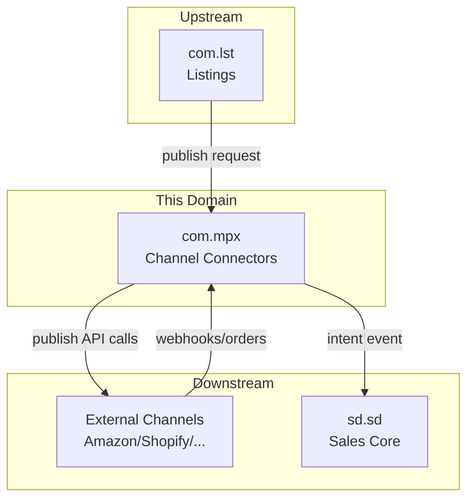
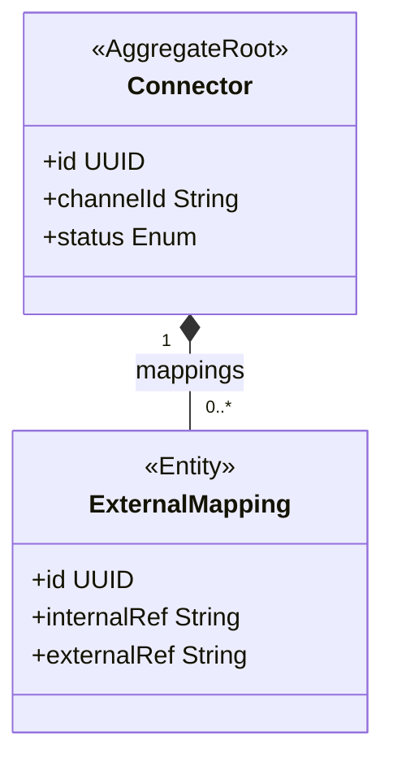
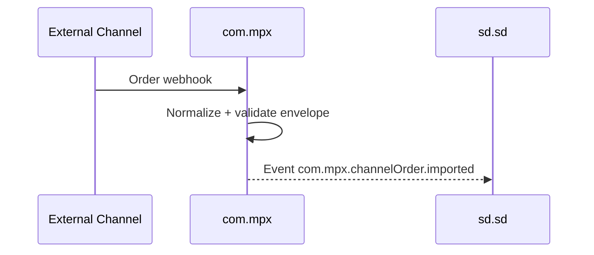

<!-- TEMPLATE COMPLIANCE: ~40%
Template: domain-service-spec.md v1.0.0
Present sections: §0 (purpose, audience, scope, related docs), §1 (business context, value, stakeholders, positioning), §3 (domain model, class diagram), §6 (REST API), §7 (events — outbound/inbound), §9 (security/roles), §14 (decisions, open questions)
Missing sections: §2 (service identity table), §4 (business rules), §5 (use cases), §8 (data model/persistence), §10 (quality attributes), §11 (feature dependencies), §12 (extension points), §13 (migration), §15 (appendix)
Naming issues: none — but see duplicate below
Duplicates: com_mpx.md and com_mpx-spec.md cover the same domain — consolidate into com_mpx-spec.md
Priority: MEDIUM — duplicate should be resolved
-->
# Service Domain Specification — `com.mpx` (Marketplace & Channel Connectors)

> **Meta Information**
> - **Version:** 2026-01-18
> - **Template:** `domain-service-spec.md` v1.0.0
> - **Template Compliance:** ~40% — §2 (service identity table), §4 (business rules), §5 (use cases), §8 (data model/persistence), §10 (quality attributes), §11 (feature dependencies), §12 (extension points), §13 (migration), §15 (appendix) missing
> - **Author(s):** OpenLeap Architecture Team
> - **Status:** DRAFT
> - **Tier:** T3
> - **Suite:** `com`
> - **Domain:** `mpx`
> - **Service ID:** `com-mpx-svc`
> - **basePackage:** `io.openleap.com.mpx`
> - **API Base Path:** `/api/com/mpx/v1`

---

## Specification Guidelines Compliance

> **This specification MUST comply with the project-wide specification guidelines.**
>
> #### Non-negotiables
> - Never invent facts. If information is missing, add an **OPEN QUESTION** entry.
> - Use **MUST/SHOULD/MAY** for normative statements.
> - Keep the spec **self-contained**: no references to chat context.
> - Record decisions and boundaries explicitly (see Section 12).

---

## 0. Document Purpose & Scope

### 0.1 Purpose
`com.mpx` specifies the **external channel connector** domain: it publishes listings to external marketplaces/shop systems and ingests inbound channel orders as **intent payloads**.

### 0.2 Target Audience
- Integrations- und Plattform-Team
- Marketplace/Channel Operations
- Architekt:innen / Tech Leads

### 0.3 Scope

**In Scope (MUST):**
- MUST publish listing data to external channel APIs (push).
- MUST maintain external mappings (internal identifiers ↔ channel identifiers).
- MUST ingest inbound channel order payloads and emit an intent event for SD to decide acceptance.
- SHOULD provide monitoring and retry for failed publications.

**Out of Scope (MUST NOT):**
- MUST NOT confirm orders as commercial truth → `sd.sd`.
- MUST NOT implement pricing authority or contract terms → `sd.sd`.
- MUST NOT implement billing/invoicing/posting → `fi`.

### 0.4 Terms & Acronyms
- **Channel Connector:** Integration component specific to a channel (Amazon/Shopify/etc.).
- **External Mapping:** Mapping between internal product/variant/listing IDs and external identifiers.
- **Channel Order:** An order payload received from a channel; not yet accepted/committed.

### 0.5 Related Documents
- Suite-Architektur: `platform/tmpT3_Domains/COM/_com_suite.md`
- Neighbor: `com_lst.md`, `com_chk.md`
- SD baseline: `platform/T3_Domains/SD/SD_sales.md`

---

## 1. Business Context

### 1.1 Domain Purpose
Allow COM to scale to multiple sales channels without embedding channel-specific APIs and constraints into internal domains.

### 1.2 Business Value
- Faster rollout of new channels.
- Controlled publication and reconciliation.

### 1.3 Stakeholders & Roles
| Rolle | Verantwortung | Primäre Use-Cases |
|------|----------------|-------------------|
| Marketplace Operator | Run publication | Publish listings, handle failures |
| Integration Engineer | Build connectors | Add new channel connector |
| SD Owner | Order acceptance | Consume channel order intents |

### 1.4 Strategic Positioning (Context Diagram)

---

## 2. Domain Boundaries & Responsibilities

### 2.1 Verantwortlichkeiten (Responsibilities)
- MUST translate internal listing representations into channel-specific API requests.
- MUST normalize inbound channel order payloads into a stable event payload.
- SHOULD ensure idempotency for inbound order ingestion and outbound publish attempts.

### 2.2 Nicht-Verantwortlichkeiten (Non-Goals)
- MUST NOT perform commercial validation or credit checks (owned by `sd.sd`).

### 2.3 Ownership von Daten & „Source of Truth“ 
- **Source of Truth für:** External mapping + connector configuration → `com.mpx`.
- **Referenziert (nur IDs):** `com.lst` listing IDs; `sd.sd` order IDs after acceptance.

---

## 3. Domänenmodell

### 3.1 Überblick (Mermaid `classDiagram`)

---

## 6. Öffentliche Schnittstellen (APIs)

### 6.1 REST API (OpenAPI-friendly)
**Base Path:** `/api/com/mpx/v1`

#### 6.1.1 Publish
- `POST /channels/{channelId}/publish`
  - SHOULD be async and return a publication job id.

#### 6.1.2 Connector administration
- `POST /connectors`
- `PATCH /connectors/{id}`

---

## 7. Events & Messaging

### 7.1 Konventionen
- **Exchange/Topic:** `com.mpx.events`
- **Routing Key:** `com.mpx.<aggregate>.<event>`

### 7.2 Outbound Events
- `com.mpx.publication.succeeded`
- `com.mpx.publication.failed`
- `com.mpx.channelOrder.imported` – MUST be emitted for inbound channel order payloads.

### 7.3 Inbound Events
- `com.lst.listing.ready` – MAY be consumed to trigger publication.

---

## 8. Typische Interaktionen (Sequenzen)

### 8.1 Happy Path

---

## 9. Sicherheit & Berechtigungen

### 9.1 Rollenmodell
- `COM_MPX_ADMIN`

---

## 12. Entscheidungen, Konflikte, Open Questions

### 12.1 Entscheidungen (Decisions)
- **DEC-001:** Channel orders ingested by `com.mpx` are **intents**; SD decides commitment.

### 12.3 OPEN QUESTIONS
- **OQ-001:** Which channels are in scope for the first iteration?
- **OQ-002:** How are secrets/credentials managed (Vault, KMS, etc.)?

---

## 13. Änderungsverlauf
- Created: 2026-01-18
