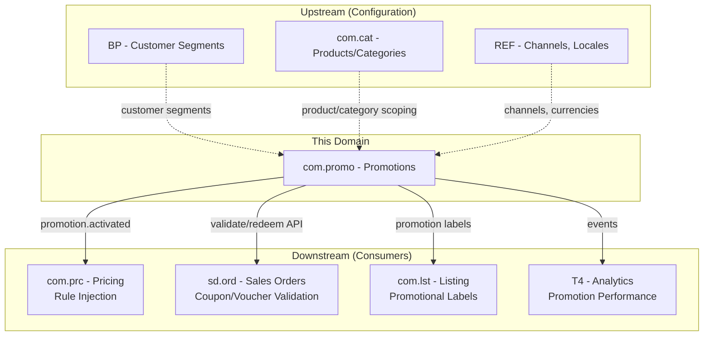
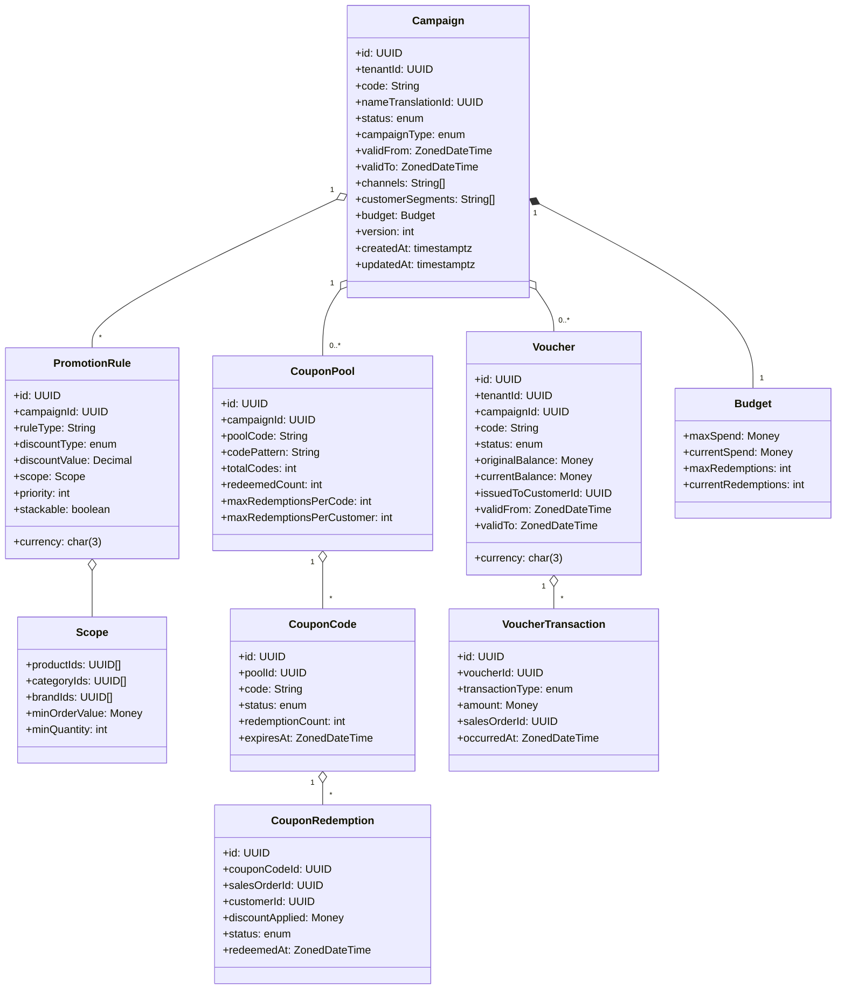
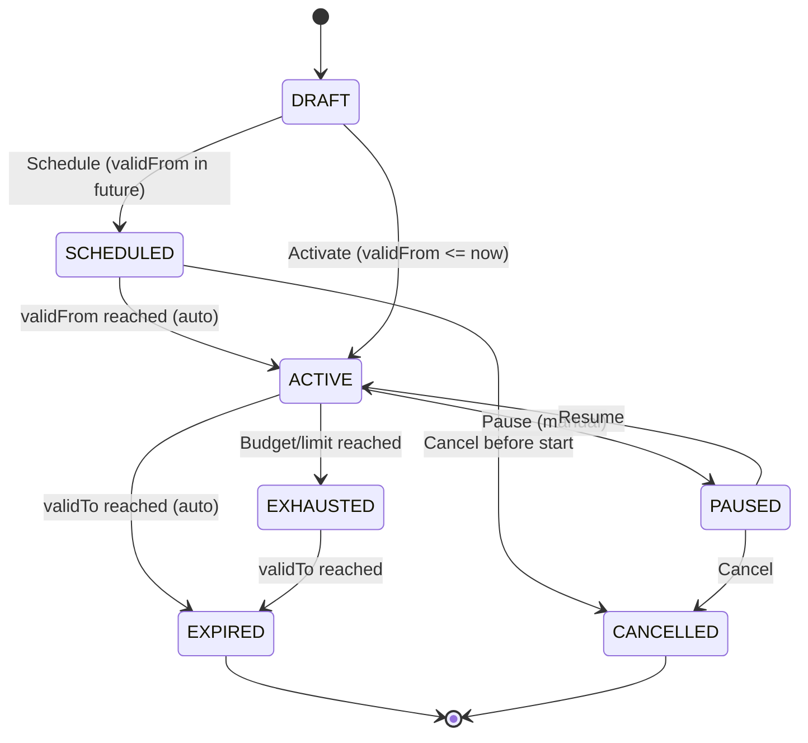
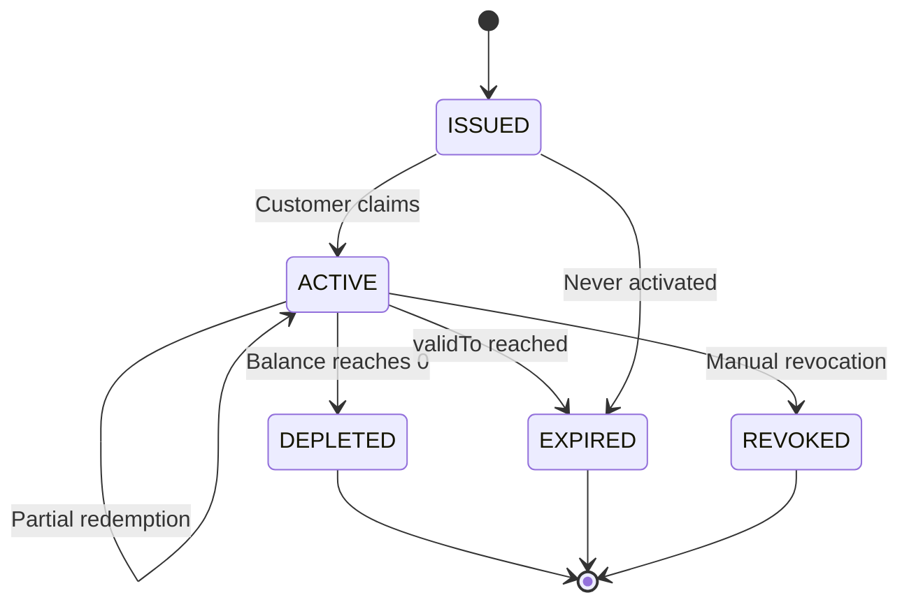
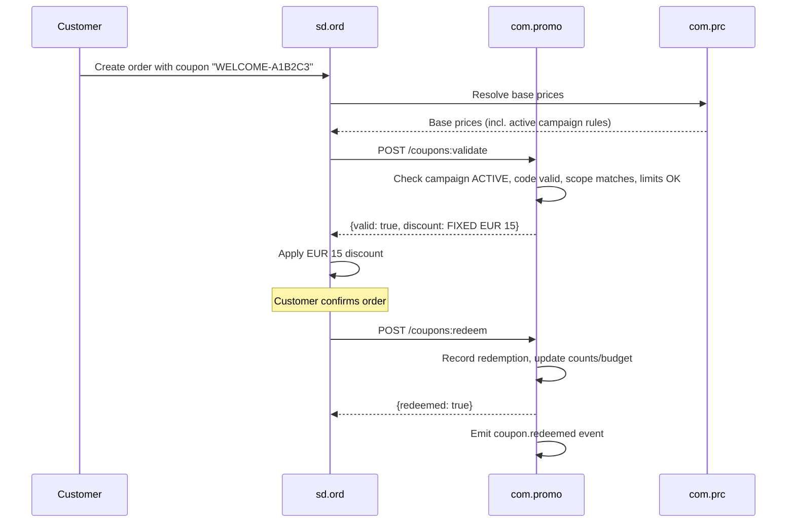
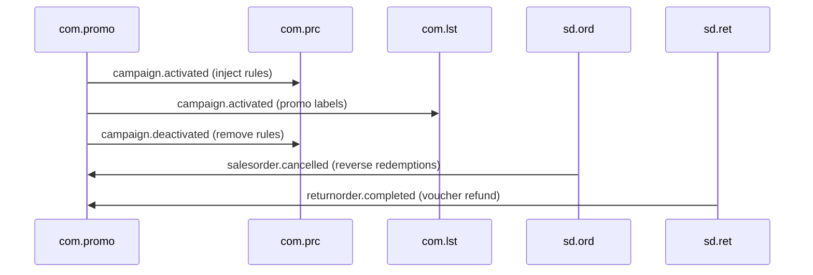
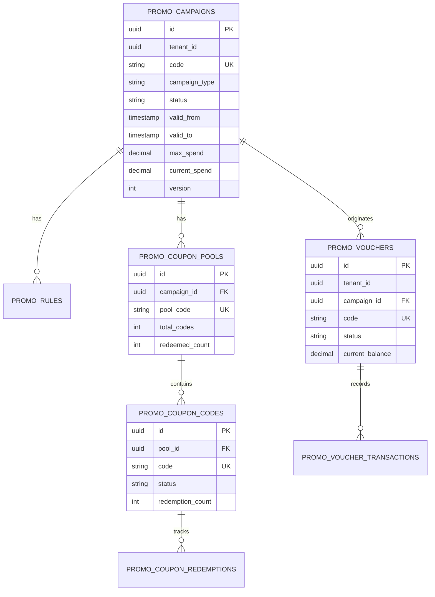

# COM.PROMO - Promotions & Campaigns Domain / Service Specification

> **Conceptual Stack Layer:** Domain / Service
> **Space:** Platform
> **Owner:** Domain Engineering Team
> **Schema alignment:** `service-layer.schema.json`
> **Companion files:** `openapi.yaml`, `*.schema.json` (event contracts)
> **Referenced by:** Platform-Feature Spec SS5 (backend dependencies), BFF Contract
> **Belongs to:** COM Suite Spec (`_com_suite.md`)

> **Meta Information**
> - **Version:** 2026-04-03
> - **Template:** `domain-service-spec.md` v1.0.0
> - **Template Compliance:** ~95%
> - **Author(s):** OpenLeap Architecture Team
> - **Status:** DRAFT
> - **Suite:** `com`
> - **Domain:** `promo`
> - **Bounded Context Ref:** `bc:promotions-campaigns`
> - **Service ID:** `com-promo-svc`
> - **basePackage:** `io.openleap.com.promo`
> - **API Base Path:** `/api/com/promo/v1`
> - **OpenLeap Starter Version:** `v1`
> - **Port:** OPEN QUESTION
> - **Repository:** OPEN QUESTION
> - **Tags:** `com`, `promotions`, `campaigns`, `coupons`, `vouchers`, `discounts`
> - **Team:**
>   - Name: `team-com`
>   - Email: `com-team@openleap.io`
>   - Slack: `#com-team`

---

## Specification Guidelines Compliance

>
> ### Non-Negotiables
> - Never invent facts. If required info is missing, add an **OPEN QUESTION** entry.
> - Preserve intent and decisions. Only change meaning when explicitly requested.
> - Do not remove normative constraints unless they are explicitly replaced.
> - Keep the spec **self-contained**: no "see chat", no implicit context.
>
> ### Source of Truth Priority
> When sources conflict:
> 1. Spec (explicit) wins
> 2. Starter specs (implementation constraints) next
> 3. Guidelines (best practices) last
>
> ### Style Guide
> - Prefer short sentences and lists.
> - Use MUST/SHOULD/MAY for normative statements.
> - Keep terminology consistent (Aggregate, Domain Service, Application Service, Command, Event).
> - Avoid ambiguous words ("often", "maybe") unless explicitly noting uncertainty.

---

## 0. Document Purpose & Scope

### 0.1 Purpose
This specification defines the Promotions & Campaigns domain within the Commerce Suite. COM.PROMO manages time-bound promotional offers — campaigns, coupons, vouchers, and promotional pricing rules — that feed into the pricing engine (COM.PRC) and are validated during sales order creation (SD.ORD).

### 0.2 Target Audience
- Product Owners & Business Stakeholders
- System Architects & Technical Leads
- Integration Engineers
- Marketing & Merchandising Teams

### 0.3 Scope
**In Scope:**
- Campaign lifecycle management (plan, activate, monitor, expire)
- Coupon code generation, distribution, and redemption tracking
- Voucher issuance, balance management, and redemption
- Promotional pricing rules fed into COM.PRC
- Promotion eligibility evaluation (customer segments, products, channels, time)
- Usage limits and budget tracking
- Promotion analytics events

**Out of Scope:**
- Base pricing rules and price lists (com.prc — PROMO feeds rules *into* PRC)
- Long-term rebate agreements (sd.agr — rebates are volume-based, settlement-driven)
- Marketing content and creative (CMS / external systems)
- Customer segmentation master data (BP / CRM)
- Financial accounting of promotional costs (FI / CO)
- Loyalty programs and points (future separate domain)

### 0.4 Related Documents
- `_com_suite.md` - Commerce Suite overview
- `com_prc-spec.md` - Pricing specification
- `sd_ord-spec.md` - Sales Orders specification
- `sd_agr-spec.md` - Sales Agreements specification
- `BP_business_partner.md` - Business Partner
- `domain-service-spec.md` - Domain specification template

---

## 1. Business Context

### 1.1 Domain Purpose
COM.PROMO addresses the need for **time-bound, targeted promotional offers** that influence pricing and purchasing behavior. While PRC handles base prices, price lists, and standing rules, PROMO manages the *promotional layer*: campaigns with start/end dates, coupons with usage limits, and vouchers with monetary balances. PROMO rules are injected into PRC's rule evaluation pipeline so that all price resolution remains centralized in PRC.

### 1.2 Business Value
- **Revenue growth:** Drive sales through targeted promotions (flash sales, seasonal discounts, bundle deals)
- **Customer acquisition & retention:** Coupon codes for first-time buyers, loyalty vouchers for repeat customers
- **Channel-specific offers:** Promotions scoped to specific marketplaces or storefronts
- **Budget control:** Usage limits, redemption caps, and budget tracking prevent over-spending
- **Measurability:** Promotion performance tracked via events and analytics

### 1.3 Key Stakeholders

| Role | Responsibility | Primary Use Cases |
|------|----------------|-------------------|
| Marketing Manager | Design and schedule campaigns | UC-PROMO-001, UC-PROMO-002 |
| Merchandising Team | Create product-specific promotions | UC-PROMO-003 |
| E-Commerce Operations | Generate and distribute coupon codes | UC-PROMO-004 |
| Finance / Controlling | Monitor promotional spend and budget | UC-PROMO-008 |
| Customer (indirect) | Redeem coupons/vouchers during checkout | UC-PROMO-005, UC-PROMO-006 |

### 1.4 Strategic Positioning



### 1.5 Service Context

| Field | Value |
|-------|-------|
| Suite | `com` (Commerce) |
| Domain | `promo` (Promotions & Campaigns) |
| Bounded Context | `bc:promotions-campaigns` |
| Service ID | `com-promo-svc` |
| Base Package | `io.openleap.com.promo` |
| Authoritative Sources | COM Suite Spec (`_com_suite.md`), Promotional pricing best practices |

---

## 2. Service Identity

| Field | Value |
|-------|-------|
| **Service ID** | `com-promo-svc` |
| **Display Name** | Promotions & Campaigns Service |
| **Suite** | `com` |
| **Domain** | `promo` |
| **Bounded Context Ref** | `bc:promotions-campaigns` |
| **Version** | 2026-04-03 |
| **Status** | DRAFT |
| **API Base Path** | `/api/com/promo/v1` |
| **Repository** | OPEN QUESTION |
| **Tags** | `com`, `promotions`, `campaigns`, `coupons`, `vouchers`, `discounts` |
| **Team Name** | `team-com` |
| **Team Email** | `com-team@openleap.io` |
| **Team Slack** | `#com-team` |

---

## 3. Domain Model

### 3.1 Conceptual Overview

PROMO manages three core concepts: **Campaigns** (containers for promotional offers with lifecycle), **Coupons** (code-based discount instruments with usage tracking), and **Vouchers** (prepaid monetary instruments with balance management). Campaigns contain **PromotionRules** that are injected into PRC's pricing pipeline when active.



### 3.2 Core Concepts

| Concept | Owner | Description | Glossary Ref |
|---------|-------|-------------|--------------|
| Campaign | com-promo-svc | Time-bound container for promotional offers with lifecycle | Campaign (Aktion) |
| PromotionRule | com-promo-svc | Discount logic injected into PRC's pricing pipeline | Promotional Price Rule |
| CouponPool | com-promo-svc | Batch of generated discount codes associated with a campaign | Coupon Pool |
| CouponCode | com-promo-svc | Individual redeemable discount code with usage tracking | Coupon Code, Promo Code |
| CouponRedemption | com-promo-svc | Record of a coupon code applied to a sales order | Redemption |
| Voucher | com-promo-svc | Prepaid monetary instrument with balance management | Gift Card, Store Credit |
| VoucherTransaction | com-promo-svc | Ledger entry tracking voucher balance changes | Voucher Transaction |

### 3.3 Aggregate Definitions

#### 3.3.1 Aggregate: Campaign

**Aggregate ID:** `agg:campaign`
**Business Purpose:** A time-bound promotional initiative that groups promotion rules, coupon pools, and/or vouchers. The campaign lifecycle controls when promotional pricing is active.

**Aggregate Root Attributes:**

| Attribute | Type | Format | Required | Description | Example | Constraints |
|-----------|------|--------|----------|-------------|---------|-------------|
| id | UUID | uuid | Yes | Unique identifier | `camp-uuid` | Immutable after create, `OlUuid.create()` |
| tenantId | UUID | uuid | Yes | Tenant ownership | `t1-uuid` | Immutable, RLS-enforced |
| code | String | — | Yes | Human-readable campaign code | `SUMMER2026` | Unique per tenant, max 50 chars |
| nameTranslationId | UUID | uuid | Yes | Campaign name (i18n) | `trans-uuid` | FK to i18n-svc |
| campaignType | Enum | — | Yes | Type of campaign | `FLASH_SALE` | PERCENTAGE_DISCOUNT, FIXED_DISCOUNT, BUY_X_GET_Y, FREE_SHIPPING, BUNDLE, FLASH_SALE |
| status | Enum | — | Yes | Lifecycle state | `DRAFT` | DRAFT, SCHEDULED, ACTIVE, PAUSED, EXHAUSTED, EXPIRED, CANCELLED |
| validFrom | ZonedDateTime | ISO 8601 | Yes | Campaign start | `2026-06-01T00:00:00Z` | Not retroactively changeable after creation (BR-010) |
| validTo | ZonedDateTime | ISO 8601 | Yes | Campaign end | `2026-06-30T23:59:59Z` | Must be > validFrom, min duration 1 hour (BR-001) |
| channels | String[] | — | No | Applicable channels (empty = all) | `["SHOP_DE","SHOP_AT"]` | Must be known channel codes |
| customerSegments | String[] | — | No | Target segments from BP (empty = all) | `["VIP","NEW"]` | Must exist in BP |
| maxSpend | Money | (18,2) | Yes | Maximum promotional spend | `10000.00` | Part of budget, >= 0 |
| currentSpend | Money | (18,2) | Yes | Current promotional spend | `4500.00` | System-managed, >= 0 |
| maxRedemptions | Integer | — | Yes | Maximum redemption count | `500` | >= 0 |
| currentRedemptions | Integer | — | Yes | Current redemption count | `230` | System-managed, >= 0 |
| version | Integer | — | Yes | Optimistic locking version | `1` | Auto-incremented |
| createdAt | Timestamptz | ISO 8601 | Yes | Creation timestamp | `2026-05-01T10:00:00Z` | System-managed |
| updatedAt | Timestamptz | ISO 8601 | Yes | Last update timestamp | `2026-05-15T14:30:00Z` | System-managed |

**Lifecycle States:**



**State Transitions:**

| From | To | Trigger | Guard / Precondition | Side Effects |
|------|----|---------|---------------------|--------------|
| — | DRAFT | Create | Valid validFrom/validTo (BR-001), valid channels/segments | — |
| DRAFT | SCHEDULED | Schedule | validFrom in future | — |
| SCHEDULED | ACTIVE | Auto (scheduler) | validFrom reached | Emits `campaign.activated`, PRC injects rules |
| DRAFT | ACTIVE | Activate | validFrom <= now | Emits `campaign.activated`, PRC injects rules |
| ACTIVE | PAUSED | Pause | — | Emits `campaign.deactivated` (reason=PAUSED), PRC suspends rules |
| PAUSED | ACTIVE | Resume | — | Emits `campaign.activated`, PRC re-injects rules |
| ACTIVE | EXHAUSTED | Auto | currentSpend >= maxSpend OR currentRedemptions >= maxRedemptions (BR-002) | Emits `campaign.exhausted`, PRC removes rules |
| ACTIVE | EXPIRED | Auto (scheduler) | validTo reached | Emits `campaign.deactivated` (reason=EXPIRED), PRC removes rules |
| SCHEDULED | CANCELLED | Cancel | — | — |
| PAUSED | CANCELLED | Cancel | — | Emits `campaign.deactivated` (reason=CANCELLED) |
| EXHAUSTED | EXPIRED | Auto (scheduler) | validTo reached | Emits `campaign.deactivated` (reason=EXPIRED) |

**Invariants:**
- INV-C-001: `validTo` MUST be after `validFrom`; minimum duration 1 hour (BR-001)
- INV-C-002: When `currentSpend >= maxSpend` or `currentRedemptions >= maxRedemptions`, campaign transitions to EXHAUSTED (BR-002)
- INV-C-003: If `channels` is non-empty, promotion only applies on those channels (BR-003)
- INV-C-004: If `customerSegments` is non-empty, only matching customers qualify (BR-004)
- INV-C-005: Cannot set `validFrom` to a past date after creation (BR-010)
- INV-C-006: Campaign MUST be in DRAFT or SCHEDULED to modify rules, pools, or config

**Domain Events Emitted:**

| Event | Routing Key | When | Key Payload |
|-------|-------------|------|-------------|
| CampaignActivated | `com.promo.campaign.activated` | DRAFT/SCHEDULED/PAUSED -> ACTIVE | tenantId, campaignId, code, rules[], validFrom, validTo, channels |
| CampaignDeactivated | `com.promo.campaign.deactivated` | ACTIVE -> PAUSED/EXPIRED/CANCELLED | tenantId, campaignId, code, reason |
| CampaignExhausted | `com.promo.campaign.exhausted` | ACTIVE -> EXHAUSTED | tenantId, campaignId, code, budget |

#### 3.3.2 Aggregate: CouponPool / CouponCode

**Aggregate ID:** `agg:coupon-pool`
**Business Purpose:** CouponPool defines a batch of discount codes associated with a campaign. CouponCode is an individual redeemable code with usage tracking.

**Aggregate Root Attributes (CouponPool):**

| Attribute | Type | Format | Required | Description | Example | Constraints |
|-----------|------|--------|----------|-------------|---------|-------------|
| id | UUID | uuid | Yes | Unique identifier | `pool-uuid` | Immutable, `OlUuid.create()` |
| campaignId | UUID | uuid | Yes | Parent campaign | `camp-uuid` | FK to Campaign |
| poolCode | String | — | Yes | Pool identifier | `WELCOME_POOL` | Unique per tenant |
| codePattern | String | — | Yes | Code generation pattern | `WELCOME-{6ALPHA}` | — |
| totalCodes | Integer | — | Yes | Number of codes generated | `10000` | > 0 |
| redeemedCount | Integer | — | Yes | Codes redeemed so far | `3200` | System-managed |
| maxRedemptionsPerCode | Integer | — | Yes | Max uses per code | `1` | >= 1 |
| maxRedemptionsPerCustomer | Integer | — | Yes | Max uses per customer across pool | `1` | >= 1 |

**CouponCode Attributes:**

| Attribute | Type | Format | Required | Description | Example | Constraints |
|-----------|------|--------|----------|-------------|---------|-------------|
| id | UUID | uuid | Yes | Unique identifier | `code-uuid` | Immutable, `OlUuid.create()` |
| poolId | UUID | uuid | Yes | Parent pool | `pool-uuid` | FK to CouponPool |
| code | String | — | Yes | Redeemable code | `WELCOME-A1B2C3` | Unique per tenant (BR-003) |
| status | Enum | — | Yes | Code status | `ACTIVE` | ACTIVE, EXHAUSTED, REVOKED, EXPIRED |
| redemptionCount | Integer | — | Yes | Times redeemed | `0` | System-managed |
| expiresAt | Timestamptz | ISO 8601 | No | Code-level expiry | `2026-12-31T23:59:59Z` | Overrides campaign validTo if earlier |

**Invariants:**
- INV-CP-001: Coupon codes MUST be globally unique within a tenant (BR-003)
- INV-CP-002: `redemptionCount < maxRedemptionsPerCode` to accept redemption (BR-004)
- INV-CP-003: A customer MUST NOT exceed `maxRedemptionsPerCustomer` across the pool (BR-004)
- INV-CP-004: Coupons only redeemable when parent campaign is ACTIVE (BR-005)
- INV-CP-005: Redemption is transactional — decrement count + create record atomically

**Domain Events Emitted:**

| Event | Routing Key | When | Key Payload |
|-------|-------------|------|-------------|
| CouponRedeemed | `com.promo.coupon.redeemed` | Coupon successfully applied | tenantId, campaignId, code, salesOrderId, customerId, discount |
| CouponReversed | `com.promo.coupon.reversed` | Order cancelled, redemption reversed | tenantId, campaignId, code, salesOrderId |

#### 3.3.3 Aggregate: Voucher

**Aggregate ID:** `agg:voucher`
**Business Purpose:** A prepaid monetary instrument (gift card, store credit, compensation voucher) with a balance that can be partially redeemed across multiple orders.

**Aggregate Root Attributes:**

| Attribute | Type | Format | Required | Description | Example | Constraints |
|-----------|------|--------|----------|-------------|---------|-------------|
| id | UUID | uuid | Yes | Unique identifier | `vch-uuid` | Immutable, `OlUuid.create()` |
| tenantId | UUID | uuid | Yes | Tenant ownership | `t1-uuid` | Immutable, RLS-enforced |
| campaignId | UUID | uuid | No | Originating campaign | `camp-uuid` | FK to Campaign, nullable for standalone vouchers |
| code | String | — | Yes | Voucher code | `GC-2026-X7Y8Z9` | Unique per tenant |
| status | Enum | — | Yes | Lifecycle state | `ACTIVE` | ISSUED, ACTIVE, DEPLETED, EXPIRED, REVOKED |
| originalBalance | Money | (18,2) | Yes | Initial balance | `50.00` | > 0, immutable |
| currentBalance | Money | (18,2) | Yes | Remaining balance | `20.00` | >= 0 (BR-006) |
| currency | Char(3) | ISO 4217 | Yes | Currency code | `EUR` | Immutable after issuance (BR-007) |
| issuedToCustomerId | UUID | uuid | No | Bound customer | `cust-uuid` | If set, only this customer can redeem (BR-011) |
| validFrom | ZonedDateTime | ISO 8601 | Yes | Voucher start | `2026-01-01T00:00:00Z` | — |
| validTo | ZonedDateTime | ISO 8601 | Yes | Voucher expiry | `2026-12-31T23:59:59Z` | Must be > validFrom |
| version | Integer | — | Yes | Optimistic locking version | `1` | Auto-incremented |
| createdAt | Timestamptz | ISO 8601 | Yes | Creation timestamp | — | System-managed |
| updatedAt | Timestamptz | ISO 8601 | Yes | Last update timestamp | — | System-managed |

**Lifecycle States:**



**State Transitions:**

| From | To | Trigger | Guard / Precondition | Side Effects |
|------|----|---------|---------------------|--------------|
| — | ISSUED | Issue | Valid balance, currency, validFrom/validTo | Emits `voucher.issued` |
| ISSUED | ACTIVE | Claim | Customer action | — |
| ACTIVE | ACTIVE | Redeem (partial) | currentBalance >= amount (BR-006), currency match (BR-007), not expired | Emits `voucher.redeemed`, creates VoucherTransaction |
| ACTIVE | DEPLETED | Redeem (full) | currentBalance - amount == 0 | Emits `voucher.redeemed` |
| ACTIVE | ACTIVE | Refund | Valid salesOrderId | Emits `voucher.refunded`, creates VoucherTransaction (REFUND) |
| ACTIVE | EXPIRED | Auto (scheduler) | validTo reached | — |
| ISSUED | EXPIRED | Auto (scheduler) | validTo reached | — |
| ACTIVE | REVOKED | Revoke | Manual admin action | — |

**Invariants:**
- INV-V-001: Currency MUST NOT change after issuance (BR-007)
- INV-V-002: `currentBalance` MUST NOT be negative (BR-006)
- INV-V-003: Refund topup via cancelled orders MUST create a REFUND transaction (BR-009)
- INV-V-004: Expired vouchers MUST NOT be redeemed regardless of remaining balance
- INV-V-005: If `issuedToCustomerId` is set, only that customer can redeem (BR-011)

**Domain Events Emitted:**

| Event | Routing Key | When | Key Payload |
|-------|-------------|------|-------------|
| VoucherIssued | `com.promo.voucher.issued` | New voucher created | tenantId, voucherId, code, balance, currency, customerId |
| VoucherRedeemed | `com.promo.voucher.redeemed` | Balance deducted | tenantId, voucherId, code, amount, remainingBalance, salesOrderId |
| VoucherRefunded | `com.promo.voucher.refunded` | Balance credited back | tenantId, voucherId, code, amount, newBalance, salesOrderId |

### 3.4 Enumerations

| Enum | Values | Description |
|------|--------|-------------|
| CampaignType | PERCENTAGE_DISCOUNT, FIXED_DISCOUNT, BUY_X_GET_Y, FREE_SHIPPING, BUNDLE, FLASH_SALE | Type of promotional offer |
| CampaignStatus | DRAFT, SCHEDULED, ACTIVE, PAUSED, EXHAUSTED, EXPIRED, CANCELLED | Campaign lifecycle |
| DiscountType | PERCENTAGE, FIXED_AMOUNT, FREE_ITEM, FREE_SHIPPING | How the discount is calculated |
| CouponCodeStatus | ACTIVE, EXHAUSTED, REVOKED, EXPIRED | Coupon code lifecycle |
| VoucherStatus | ISSUED, ACTIVE, DEPLETED, EXPIRED, REVOKED | Voucher lifecycle |
| VoucherTransactionType | REDEMPTION, REFUND, ADJUSTMENT | Voucher balance change type |
| RedemptionStatus | CONFIRMED, REVERSED | Whether a redemption is still valid |

---

## 4. Business Rules & Constraints

### 4.1 Business Rules Catalog

| ID | Rule Name | Description | Scope | Enforcement | Error Code |
|----|-----------|-------------|-------|-------------|------------|
| BR-001 | Campaign Validity | validTo > validFrom, minimum 1 hour duration | Campaign | Create/Update | `PROMO-VAL-001` |
| BR-002 | Budget Exhaustion | currentSpend >= maxSpend OR currentRedemptions >= maxRedemptions -> EXHAUSTED | Campaign | On each redemption | `PROMO-BIZ-002` |
| BR-003 | Coupon Uniqueness | Code must be unique across tenant | CouponCode | Create | `PROMO-VAL-003` |
| BR-004 | Redemption Limits | Per-code and per-customer limits enforced atomically | CouponCode | Redeem | `PROMO-BIZ-004` |
| BR-005 | Campaign Active Gate | Coupons/vouchers only redeemable when campaign ACTIVE | Coupon/Voucher | Validate | `PROMO-BIZ-005` |
| BR-006 | Voucher Balance | currentBalance >= redemption amount | Voucher | Redeem | `PROMO-BIZ-006` |
| BR-007 | Voucher Currency Match | Redemption currency must match voucher currency | Voucher | Redeem | `PROMO-VAL-007` |
| BR-008 | Stackability | Non-stackable promotions cannot combine with other discounts | PromotionRule | PRC evaluation | `PROMO-BIZ-008` |
| BR-009 | Scope Matching | Discount applies only to products/categories/brands in scope | PromotionRule | Validate/PRC | `PROMO-BIZ-009` |
| BR-010 | No Retroactive Dates | validFrom cannot be set to past after creation | Campaign | Update | `PROMO-VAL-010` |
| BR-011 | Voucher Customer Binding | If issuedToCustomerId is set, only that customer can redeem | Voucher | Redeem | `PROMO-BIZ-011` |

### 4.2 Detailed Rule Definitions

#### BR-002: Budget Exhaustion
**Context:** Promotional budgets MUST be enforced in real-time to prevent unplanned spend.
**Rule Statement:** When `currentSpend >= maxSpend` or `currentRedemptions >= maxRedemptions`, campaign MUST transition to EXHAUSTED.
**Applies To:** Campaign aggregate
**Enforcement:** After each redemption, application service checks budget and transitions if exceeded.
**Validation Logic:** `if (campaign.currentSpend >= campaign.maxSpend || campaign.currentRedemptions >= campaign.maxRedemptions) campaign.exhaust()`
**Error Handling:**
- Code: `PROMO-BIZ-002`
- Message: `"Campaign {code} budget exhausted. No further redemptions accepted."`
- HTTP: 409 Conflict

#### BR-004: Redemption Limits
**Context:** Per-code and per-customer limits prevent abuse and ensure fair distribution.
**Rule Statement:** A coupon code's `redemptionCount` MUST be less than `maxRedemptionsPerCode`. A customer's total redemptions across the pool MUST be less than `maxRedemptionsPerCustomer`.
**Applies To:** CouponCode / CouponPool
**Enforcement:** Atomic database-level check during redemption (serializable isolation on coupon row).
**Validation Logic:** `if (code.redemptionCount >= pool.maxRedemptionsPerCode) reject(); if (customerRedemptionCount >= pool.maxRedemptionsPerCustomer) reject()`
**Error Handling:**
- Code: `PROMO-BIZ-004`
- Message: `"Coupon {code} redemption limit exceeded."` or `"Customer has exceeded maximum redemptions for this promotion."`
- HTTP: 422 Unprocessable Entity

#### BR-006: Voucher Balance
**Context:** Voucher redemption MUST NOT exceed available balance. Pessimistic locking on voucher balance prevents double-spend.
**Rule Statement:** `currentBalance >= redemptionAmount`. Partial redemptions are allowed.
**Applies To:** Voucher aggregate
**Enforcement:** Pessimistic locking (SELECT ... FOR UPDATE) on voucher row during redemption.
**Validation Logic:** `if (voucher.currentBalance < redemptionAmount) reject()`
**Error Handling:**
- Code: `PROMO-BIZ-006`
- Message: `"Voucher {code} has insufficient balance. Available: {currentBalance}, Requested: {amount}"`
- HTTP: 422 Unprocessable Entity

### 4.3 Data Validation Rules

| Field | Validation Rule | Error Code | Error Message |
|-------|----------------|------------|---------------|
| code (Campaign) | Required, max 50 chars, unique per tenant | `PROMO-VAL-020` | `"Campaign code is required and must be unique"` |
| validFrom | Required, ISO 8601 datetime | `PROMO-VAL-021` | `"Valid start date is required"` |
| validTo | Required, > validFrom, min 1h duration | `PROMO-VAL-001` | `"Valid end date must be after start date (min 1 hour)"` |
| campaignType | Required, valid enum value | `PROMO-VAL-022` | `"Valid campaign type required"` |
| maxSpend | Required, >= 0 | `PROMO-VAL-023` | `"Maximum spend must be non-negative"` |
| discountValue | Required, > 0 | `PROMO-VAL-024` | `"Discount value must be positive"` |
| currency | Required where monetary, valid ISO 4217 | `PROMO-VAL-025` | `"Valid ISO 4217 currency code required"` |
| code (CouponCode) | Required, unique per tenant | `PROMO-VAL-003` | `"Coupon code must be unique within tenant"` |
| originalBalance (Voucher) | Required, > 0 | `PROMO-VAL-026` | `"Original balance must be positive"` |

### 4.4 Reference Data Dependencies

| Catalog | Usage | Provider Service | Validation |
|---------|-------|-----------------|------------|
| Channels | `channels[]` field | ref-data-svc / com.lst (T1) | Code existence check |
| Currencies (ISO 4217) | `currency` fields | ref-data-svc (T1) | Code existence check |
| Customer Segments | `customerSegments[]` | bp-party-svc (T2) | Must exist in BP |
| Product Categories | `scope.categoryIds` | com.cat (T3) | Must exist in catalog |
| Products | `scope.productIds` | com.cat (T3) | Must exist in catalog |

---

## 5. Use Cases

### 5.1 Business Logic Placement

| Layer | Responsibilities |
|-------|-----------------|
| Application Service | Command validation, aggregate loading, event publishing, orchestration (campaign activation scheduler, code generation) |
| Domain Service | Eligibility evaluation (cross-aggregate: campaign + coupon + scope), budget tracking |
| Aggregate | State transitions, invariant enforcement, attribute validation |

### 5.2 Use Cases

#### UC-PROMO-001: Create and Schedule Campaign

| Field | Value |
|-------|-------|
| **ID** | UC-PROMO-001 |
| **Type** | WRITE |
| **Trigger** | REST |
| **Aggregate** | Campaign |
| **Domain Operation** | `Campaign.create()` then `Campaign.schedule()` |
| **Inputs** | code, nameTranslationId, campaignType, validFrom, validTo, channels?, customerSegments?, maxSpend, maxRedemptions |
| **Outputs** | Created Campaign in DRAFT state, optionally SCHEDULED |
| **Events** | — (no event on DRAFT/SCHEDULED) |
| **REST** | `POST /api/com/promo/v1/campaigns` -> 201 Created, then `POST /campaigns/{id}:schedule` -> 200 OK |
| **Idempotency** | Client-generated `Idempotency-Key` header |
| **Errors** | 400 (validation), 409 (duplicate code), 422 (BR-001 invalid dates) |

#### UC-PROMO-002: Activate Campaign (Flash Sale)

| Field | Value |
|-------|-------|
| **ID** | UC-PROMO-002 |
| **Type** | WRITE |
| **Trigger** | REST or Scheduler |
| **Aggregate** | Campaign |
| **Domain Operation** | `Campaign.activate()` |
| **Inputs** | campaignId |
| **Outputs** | Campaign in ACTIVE state |
| **Events** | `CampaignActivated` -> `com.promo.campaign.activated` |
| **REST** | `POST /api/com/promo/v1/campaigns/{id}:activate` -> 200 OK |
| **Idempotency** | Idempotent (re-activate of ACTIVE is no-op) |
| **Errors** | 404 (not found), 409 (not in DRAFT/SCHEDULED) |

#### UC-PROMO-003: Add Promotion Rules to Campaign

| Field | Value |
|-------|-------|
| **ID** | UC-PROMO-003 |
| **Type** | WRITE |
| **Trigger** | REST |
| **Aggregate** | Campaign (child: PromotionRule) |
| **Domain Operation** | `Campaign.addRule(rule)` |
| **Inputs** | campaignId, ruleType, discountType, discountValue, currency, scope, priority, stackable |
| **Outputs** | Created PromotionRule |
| **Events** | — |
| **REST** | `POST /api/com/promo/v1/campaigns/{id}/rules` -> 201 Created |
| **Idempotency** | Idempotency-Key header |
| **Errors** | 404, 409 (campaign not in DRAFT/SCHEDULED), 422 (BR-009 invalid scope) |

#### UC-PROMO-004: Generate Coupon Pool and Codes

| Field | Value |
|-------|-------|
| **ID** | UC-PROMO-004 |
| **Type** | WRITE |
| **Trigger** | REST |
| **Aggregate** | CouponPool |
| **Domain Operation** | `CouponPool.create(pool, count)` |
| **Inputs** | campaignId, poolCode, codePattern, totalCodes, maxRedemptionsPerCode, maxRedemptionsPerCustomer |
| **Outputs** | Created CouponPool with generated codes |
| **Events** | — |
| **REST** | `POST /api/com/promo/v1/campaigns/{id}/coupon-pools` -> 201 Created |
| **Idempotency** | Idempotency-Key header |
| **Errors** | 404, 409 (campaign not DRAFT/SCHEDULED), 422 (duplicate poolCode) |

#### UC-PROMO-005: Validate Coupon at Checkout

| Field | Value |
|-------|-------|
| **ID** | UC-PROMO-005 |
| **Type** | READ (with side-effect validation) |
| **Trigger** | REST (called by sd.ord) |
| **Aggregate** | CouponCode, Campaign |
| **Domain Operation** | `CouponEligibilityService.validate(code, orderContext)` |
| **Inputs** | code, customerId, channel, orderLines[], orderTotal |
| **Outputs** | Validation result: valid/invalid, discount details, message |
| **Events** | — |
| **REST** | `POST /api/com/promo/v1/coupons:validate` -> 200 OK |
| **Idempotency** | Inherently idempotent (no state change) |
| **Errors** | 422 (BR-003 unknown code, BR-004 limit exceeded, BR-005 campaign inactive, BR-009 scope mismatch) |

#### UC-PROMO-006: Redeem Coupon (Order Confirmed)

| Field | Value |
|-------|-------|
| **ID** | UC-PROMO-006 |
| **Type** | WRITE |
| **Trigger** | REST (called by sd.ord) |
| **Aggregate** | CouponCode, Campaign |
| **Domain Operation** | `CouponCode.redeem(customerId, salesOrderId, discount)` |
| **Inputs** | code, customerId, salesOrderId, discountApplied |
| **Outputs** | Redemption confirmation |
| **Events** | `CouponRedeemed` -> `com.promo.coupon.redeemed` |
| **REST** | `POST /api/com/promo/v1/coupons:redeem` -> 200 OK |
| **Idempotency** | Idempotent on salesOrderId + code (re-redeem is no-op) |
| **Errors** | 409 (already redeemed for this order), 422 (BR-004, BR-005) |

#### UC-PROMO-007: Validate and Redeem Voucher at Checkout

| Field | Value |
|-------|-------|
| **ID** | UC-PROMO-007 |
| **Type** | WRITE |
| **Trigger** | REST (called by sd.ord) |
| **Aggregate** | Voucher |
| **Domain Operation** | `Voucher.validate(orderContext)` then `Voucher.redeem(amount, salesOrderId)` |
| **Inputs** | code, customerId, amount, currency, salesOrderId |
| **Outputs** | Validation: balance available; Redemption: new balance |
| **Events** | `VoucherRedeemed` -> `com.promo.voucher.redeemed` |
| **REST** | `POST /api/com/promo/v1/vouchers:validate` -> 200, `POST /vouchers:redeem` -> 200 |
| **Idempotency** | Redeem idempotent on salesOrderId + voucherId |
| **Errors** | 422 (BR-006 insufficient balance, BR-007 currency mismatch, BR-011 wrong customer) |

#### UC-PROMO-008: Monitor Promotional Budget

| Field | Value |
|-------|-------|
| **ID** | UC-PROMO-008 |
| **Type** | READ |
| **Trigger** | REST |
| **Aggregate** | Campaign |
| **Domain Operation** | Query projection |
| **Inputs** | campaignId?, status?, page, size |
| **Outputs** | Dashboard: campaigns with budget usage, redemption counts, performance metrics |
| **Events** | — |
| **REST** | `GET /api/com/promo/v1/dashboard/campaigns` -> 200 OK |
| **Idempotency** | Inherently idempotent (GET) |
| **Errors** | 400 (invalid filter params) |

#### UC-PROMO-009: Reverse Coupon Redemption (Order Cancelled)

| Field | Value |
|-------|-------|
| **ID** | UC-PROMO-009 |
| **Type** | WRITE |
| **Trigger** | REST or Event (sd.ord.salesorder.cancelled) |
| **Aggregate** | CouponCode, Campaign |
| **Domain Operation** | `CouponCode.reverseRedemption(salesOrderId)` |
| **Inputs** | code, salesOrderId |
| **Outputs** | Reversal confirmation, updated redemption count |
| **Events** | `CouponReversed` -> `com.promo.coupon.reversed` |
| **REST** | `POST /api/com/promo/v1/coupons:reverse` -> 200 OK |
| **Idempotency** | Idempotent on salesOrderId (re-reverse is no-op) |
| **Errors** | 404 (no redemption found for salesOrderId) |

#### UC-PROMO-010: Refund Voucher Balance (Order Cancelled/Returned)

| Field | Value |
|-------|-------|
| **ID** | UC-PROMO-010 |
| **Type** | WRITE |
| **Trigger** | REST or Event |
| **Aggregate** | Voucher |
| **Domain Operation** | `Voucher.refund(amount, salesOrderId)` |
| **Inputs** | voucherId or code, amount, salesOrderId |
| **Outputs** | Refund confirmation, updated balance |
| **Events** | `VoucherRefunded` -> `com.promo.voucher.refunded` |
| **REST** | `POST /api/com/promo/v1/vouchers:refund` -> 200 OK |
| **Idempotency** | Idempotent on salesOrderId + voucherId |
| **Errors** | 404, 422 (voucher REVOKED/EXPIRED) |

### 5.3 Process Flow Diagrams



### 5.4 Cross-Domain Workflows

**Does this domain participate in multi-service workflows?** Yes

#### Workflow: Campaign Activation -> PRC Rule Injection (SAG-PROMO-001)

**Orchestration Pattern:** Choreography (EDA)
**Pattern Rationale:** Sequential flow, PRC autonomously reacts to campaign events. No distributed transaction needed — PRC rule registration is idempotent.

| Service | Role | Responsibilities |
|---------|------|------------------|
| com.promo | Producer | Activates campaign, emits event with rules |
| com.prc | Consumer | Registers promotional rules in pricing pipeline |

**Steps:**
1. PROMO activates campaign -> emits `promo.campaign.activated` with PromotionRules
2. PRC creates temporary PriceRules (tagged `source=PROMO, campaignId=X`)
3. PRC includes in future resolve calls
4. Campaign expires -> PROMO emits `promo.campaign.deactivated`
5. PRC removes PROMO-sourced rules for that campaignId

**Compensation:**
- If sd.ord cancels order after coupon redemption -> sd.ord calls `POST /coupons:reverse`
- PROMO decrements redemptionCount, reverses budget impact

---

## 6. REST API

### 6.1 API Overview

| Field | Value |
|-------|-------|
| Base Path | `/api/com/promo/v1` |
| Authentication | OAuth2/JWT (Bearer token) |
| Authorization | Scopes: `com.promo:read`, `com.promo:write`, `com.promo:validate`, `com.promo:admin` |
| Content Type | `application/json` |
| Versioning | URL path (`v1`) |

### 6.2 Resource Operations

#### Campaign Resource

| Endpoint | Method | Path | Summary | Role Required | Events Published |
|----------|--------|------|---------|---------------|-----------------|
| Create Campaign | POST | `/campaigns` | Create campaign (DRAFT) | `com.promo:write` | — |
| Get Campaign | GET | `/campaigns/{id}` | Get campaign with rules, pools, budget | `com.promo:read` | — |
| List Campaigns | GET | `/campaigns` | Filter by status, channel, type, date | `com.promo:read` | — |
| Update Campaign | PUT | `/campaigns/{id}` | Update (DRAFT/SCHEDULED only) | `com.promo:write` | — |

**Create Campaign — Request:**
```json
{
  "code": "SUMMER2026",
  "nameTranslationId": "trans-uuid",
  "campaignType": "PERCENTAGE_DISCOUNT",
  "validFrom": "2026-06-01T00:00:00Z",
  "validTo": "2026-06-30T23:59:59Z",
  "channels": ["SHOP_DE"],
  "customerSegments": [],
  "maxSpend": 10000.00,
  "maxRedemptions": 500
}
```

**Create Campaign — Response (201 Created):**
```json
{
  "id": "camp-uuid",
  "code": "SUMMER2026",
  "status": "DRAFT",
  "version": 1,
  "createdAt": "2026-05-01T10:00:00Z"
}
```

**Update Campaign — Headers:** `If-Match: "{version}"` (optimistic locking, 412 on conflict)

### 6.3 Business Operations

| Endpoint | Method | Path | Summary | Role Required | Events Published |
|----------|--------|------|---------|---------------|-----------------|
| Schedule | POST | `/campaigns/{id}:schedule` | Schedule campaign | `com.promo:write` | — |
| Activate | POST | `/campaigns/{id}:activate` | Manually activate | `com.promo:write` | `CampaignActivated` |
| Pause | POST | `/campaigns/{id}:pause` | Pause active campaign | `com.promo:write` | `CampaignDeactivated` |
| Resume | POST | `/campaigns/{id}:resume` | Resume paused campaign | `com.promo:write` | `CampaignActivated` |
| Cancel | POST | `/campaigns/{id}:cancel` | Cancel campaign | `com.promo:admin` | `CampaignDeactivated` |

#### Promotion Rule Resource

| Endpoint | Method | Path | Summary | Role Required | Events Published |
|----------|--------|------|---------|---------------|-----------------|
| Add Rule | POST | `/campaigns/{id}/rules` | Add promotion rule | `com.promo:write` | — |
| Update Rule | PUT | `/campaigns/{id}/rules/{ruleId}` | Update rule | `com.promo:write` | — |
| Delete Rule | DELETE | `/campaigns/{id}/rules/{ruleId}` | Remove rule | `com.promo:write` | — |

#### Coupon Pool & Code Resource

| Endpoint | Method | Path | Summary | Role Required | Events Published |
|----------|--------|------|---------|---------------|-----------------|
| Create Pool | POST | `/campaigns/{id}/coupon-pools` | Create pool and generate codes | `com.promo:write` | — |
| List Pools | GET | `/campaigns/{id}/coupon-pools` | List pools | `com.promo:read` | — |
| List Codes | GET | `/coupon-pools/{poolId}/codes` | List codes (paginated) | `com.promo:read` | — |
| Export Codes | POST | `/coupon-pools/{poolId}/codes:export` | Export codes (CSV) | `com.promo:write` | — |
| Revoke Codes | POST | `/coupon-pools/{poolId}/codes:revoke` | Bulk revoke codes | `com.promo:admin` | — |

#### Coupon Validation & Redemption (called by sd.ord)

| Endpoint | Method | Path | Summary | Role Required | Events Published |
|----------|--------|------|---------|---------------|-----------------|
| Validate Coupon | POST | `/coupons:validate` | Validate coupon for order context | `com.promo:validate` | — |
| Redeem Coupon | POST | `/coupons:redeem` | Record redemption (order confirmed) | `com.promo:validate` | `CouponRedeemed` |
| Reverse Coupon | POST | `/coupons:reverse` | Reverse redemption (order cancelled) | `com.promo:validate` | `CouponReversed` |

**Validate Coupon — Request:**
```json
{
  "code": "WELCOME-A1B2C3",
  "customerId": "cust-uuid",
  "channel": "SHOP_DE",
  "orderLines": [
    { "productId": "prod-uuid", "categoryCode": "electronics", "quantity": 1, "lineTotal": { "amount": 89.99, "currency": "EUR" } }
  ],
  "orderTotal": { "amount": 89.99, "currency": "EUR" }
}
```

**Validate Coupon — Response (200 OK):**
```json
{
  "valid": true,
  "campaignId": "camp-uuid",
  "discount": { "type": "FIXED", "amount": 15.00, "currency": "EUR", "appliesTo": "ORDER" },
  "message": null
}
```

#### Voucher Resource

| Endpoint | Method | Path | Summary | Role Required | Events Published |
|----------|--------|------|---------|---------------|-----------------|
| Issue Voucher | POST | `/vouchers` | Issue voucher | `com.promo:write` | `VoucherIssued` |
| Get Voucher | GET | `/vouchers/{id}` | Get voucher with balance and transactions | `com.promo:read` | — |
| Lookup by Code | GET | `/vouchers?code={code}` | Lookup voucher | `com.promo:read` | — |
| Validate Voucher | POST | `/vouchers:validate` | Validate for order context | `com.promo:validate` | — |
| Redeem Voucher | POST | `/vouchers:redeem` | Deduct balance | `com.promo:validate` | `VoucherRedeemed` |
| Refund Voucher | POST | `/vouchers:refund` | Credit back balance | `com.promo:validate` | `VoucherRefunded` |
| Revoke Voucher | POST | `/vouchers/{id}:revoke` | Revoke voucher | `com.promo:admin` | — |

#### Dashboard Resource

| Endpoint | Method | Path | Summary | Role Required | Events Published |
|----------|--------|------|---------|---------------|-----------------|
| Campaign Dashboard | GET | `/dashboard/campaigns` | Active campaigns with budget usage | `com.promo:read` | — |
| Campaign Performance | GET | `/dashboard/campaigns/{id}/performance` | Redemption metrics, revenue impact | `com.promo:read` | — |

### 6.4 Error Responses

| HTTP Status | Error Code | Description |
|-------------|------------|-------------|
| 400 | `PROMO-VAL-*` | Validation error (field-level) |
| 401 | — | Authentication required |
| 403 | — | Forbidden (insufficient role) |
| 404 | — | Resource not found |
| 409 | `PROMO-BIZ-002` | Conflict (budget exhausted, duplicate code, invalid state transition) |
| 412 | — | Precondition failed (optimistic lock version mismatch) |
| 422 | `PROMO-BIZ-*` | Business rule violation (limits exceeded, insufficient balance, scope mismatch) |

### 6.5 OpenAPI Specification
**Location:** `contracts/http/com/promo/openapi.yaml`
**OpenAPI Version:** 3.1.0

---

## 7. Events & Integration

### 7.1 Event-Driven Architecture Pattern
**Pattern Decision:** Choreography (EDA)
**Rationale:** Campaign lifecycle events drive PRC rule injection/removal. Redemption events drive analytics and budget tracking. At-least-once delivery with idempotent consumers. No distributed transaction coordination needed.

### 7.2 Published Events

**Exchange:** `com.promo.events` (topic)

#### CampaignActivated
- **Routing Key:** `com.promo.campaign.activated`
- **Business Meaning:** A campaign has become active — PRC should inject promotional rules
- **When Published:** DRAFT/SCHEDULED/PAUSED -> ACTIVE transition
- **Payload Schema:**
```json
{
  "tenantId": "uuid",
  "campaignId": "uuid",
  "code": "SUMMER2026",
  "rules": [
    {
      "ruleId": "uuid",
      "ruleType": "PERCENTAGE_DISCOUNT",
      "discountType": "PERCENTAGE",
      "discountValue": 20.00,
      "currency": "EUR",
      "scope": { "categoryIds": ["cat-uuid"], "minOrderValue": 50.00 },
      "priority": 10,
      "stackable": false
    }
  ],
  "validFrom": "2026-06-01T00:00:00Z",
  "validTo": "2026-06-30T23:59:59Z",
  "channels": ["SHOP_DE"]
}
```
- **Consumers:** com.prc (rule injection), com.lst (promotional labels)

#### CampaignDeactivated
- **Routing Key:** `com.promo.campaign.deactivated`
- **Business Meaning:** A campaign has stopped — PRC should remove promotional rules
- **When Published:** ACTIVE -> PAUSED/EXPIRED/CANCELLED transition
- **Payload Schema:**
```json
{
  "tenantId": "uuid",
  "campaignId": "uuid",
  "code": "SUMMER2026",
  "reason": "EXPIRED"
}
```
- **Consumers:** com.prc (rule removal), com.lst (remove promotional labels)

#### CampaignExhausted
- **Routing Key:** `com.promo.campaign.exhausted`
- **Business Meaning:** A campaign's budget or redemption limit has been reached
- **When Published:** ACTIVE -> EXHAUSTED transition
- **Payload Schema:** `{ "tenantId": "uuid", "campaignId": "uuid", "code": "string", "budget": { "maxSpend": 10000.00, "currentSpend": 10000.00, "maxRedemptions": 500, "currentRedemptions": 500 } }`
- **Consumers:** Analytics, notification service (alert finance)

#### CouponRedeemed
- **Routing Key:** `com.promo.coupon.redeemed`
- **Business Meaning:** A coupon code has been successfully redeemed on an order
- **When Published:** Successful coupon redemption
- **Payload Schema:**
```json
{
  "tenantId": "uuid",
  "campaignId": "uuid",
  "code": "WELCOME-A1B2C3",
  "salesOrderId": "uuid",
  "customerId": "uuid",
  "discount": { "type": "FIXED", "amount": 15.00, "currency": "EUR" }
}
```
- **Consumers:** Analytics, budget tracking

#### CouponReversed
- **Routing Key:** `com.promo.coupon.reversed`
- **Business Meaning:** A coupon redemption has been reversed due to order cancellation
- **When Published:** Successful coupon reversal
- **Payload Schema:** `{ "tenantId": "uuid", "campaignId": "uuid", "code": "string", "salesOrderId": "uuid" }`
- **Consumers:** Budget adjustment, analytics

#### VoucherIssued
- **Routing Key:** `com.promo.voucher.issued`
- **Business Meaning:** A new voucher has been issued
- **When Published:** Voucher creation
- **Payload Schema:** `{ "tenantId": "uuid", "voucherId": "uuid", "code": "string", "balance": { "amount": 50.00, "currency": "EUR" }, "customerId": "uuid | null" }`
- **Consumers:** Analytics, notification service

#### VoucherRedeemed
- **Routing Key:** `com.promo.voucher.redeemed`
- **Business Meaning:** Voucher balance has been deducted for an order
- **When Published:** Successful voucher redemption
- **Payload Schema:**
```json
{
  "tenantId": "uuid",
  "voucherId": "uuid",
  "code": "GC-2026-X7Y8Z9",
  "amount": { "amount": 30.00, "currency": "EUR" },
  "remainingBalance": { "amount": 20.00, "currency": "EUR" },
  "salesOrderId": "uuid"
}
```
- **Consumers:** Analytics, balance tracking

#### VoucherRefunded
- **Routing Key:** `com.promo.voucher.refunded`
- **Business Meaning:** Voucher balance has been credited back due to order cancellation/return
- **When Published:** Successful voucher refund
- **Payload Schema:** `{ "tenantId": "uuid", "voucherId": "uuid", "code": "string", "amount": { "amount": 30.00, "currency": "EUR" }, "newBalance": { "amount": 50.00, "currency": "EUR" }, "salesOrderId": "uuid" }`
- **Consumers:** Balance tracking, analytics

### 7.3 Consumed Events

| Source Event | Source Service | Handler | Purpose | Queue |
|-------------|---------------|---------|---------|-------|
| `sd.ord.salesorder.cancelled` | sd.ord | SalesOrderCancelledHandler | Auto-reverse coupon/voucher redemptions for that order | `com.promo.in.sd.ord.salesorder` |
| `sd.ret.returnorder.completed` | sd.ret | ReturnCompletedHandler | Consider voucher refund for returned items | `com.promo.in.sd.ret.returnorder` |

### 7.4 Event Flow Diagrams



### 7.5 Integration Points Summary

**Upstream Dependencies:**

| Service | Tier | Purpose | Type | Criticality | Fallback |
|---------|------|---------|------|-------------|----------|
| ref-data-svc | T1 | Channel and currency validation | REST + Cache | Low | Use cached data |
| bp-party-svc | T2 | Customer segment validation | REST + Cache | Low | Use cached data |
| com-cat-svc | T3 | Product/category scope validation | REST + Cache | Medium | Use cached data |
| i18n-svc | T1 | Translation for campaign names | REST + Cache | Low | Use cached data |

**Downstream Consumers:**

| Service | Tier | Purpose | Type | SLA |
|---------|------|---------|------|-----|
| com.prc | T3 | Promotional rule injection/removal | Event | < 5s processing |
| com.lst | T3 | Promotional labels on listings | Event | < 10s processing |
| sd.ord | T3 | Coupon/voucher validation & redemption | REST (sync) | < 50ms response |
| T4 Analytics | T4 | Promotion performance tracking | Event | < 30s processing |

---

## 8. Data Model

### 8.1 Storage Technology

| Aspect | Choice |
|--------|--------|
| Database | PostgreSQL 16+ |
| Multi-tenancy | `tenant_id` column + PostgreSQL RLS |
| Soft Delete | No — campaigns expire naturally; vouchers have explicit lifecycle states |
| Audit Trail | All status transitions logged via iam.audit events |
| Outbox | `promo_outbox_events` table for reliable event publishing (ADR-013) |

### 8.2 Conceptual Data Model



### 8.3 Table Definitions

#### Table: `promo_campaigns`

| Column | Type | Nullable | Default | Description | Constraints |
|--------|------|----------|---------|-------------|-------------|
| id | uuid | NOT NULL | `OlUuid.create()` | Primary key | PK |
| tenant_id | uuid | NOT NULL | — | Tenant discriminator | RLS policy |
| code | text | NOT NULL | — | Human-readable campaign code | UNIQUE(tenant_id, code) |
| name_translation_id | uuid | NOT NULL | — | Campaign name (i18n) | FK logical to i18n-svc |
| campaign_type | text | NOT NULL | — | Type of campaign | CHECK(campaign_type IN ('PERCENTAGE_DISCOUNT','FIXED_DISCOUNT','BUY_X_GET_Y','FREE_SHIPPING','BUNDLE','FLASH_SALE')) |
| status | text | NOT NULL | `'DRAFT'` | Lifecycle state | CHECK(status IN ('DRAFT','SCHEDULED','ACTIVE','PAUSED','EXHAUSTED','EXPIRED','CANCELLED')) |
| valid_from | timestamptz | NOT NULL | — | Campaign start | — |
| valid_to | timestamptz | NOT NULL | — | Campaign end | CHECK(valid_to > valid_from) |
| channels | text[] | NULL | — | Applicable channels | — |
| customer_segments | text[] | NULL | — | Target customer segments | — |
| max_spend | numeric(18,2) | NOT NULL | — | Maximum promotional spend | CHECK(max_spend >= 0) |
| current_spend | numeric(18,2) | NOT NULL | `0` | Current promotional spend | CHECK(current_spend >= 0) |
| max_redemptions | integer | NOT NULL | — | Maximum redemption count | CHECK(max_redemptions >= 0) |
| current_redemptions | integer | NOT NULL | `0` | Current redemption count | CHECK(current_redemptions >= 0) |
| version | integer | NOT NULL | `1` | Optimistic lock | — |
| created_at | timestamptz | NOT NULL | `now()` | Creation timestamp | — |
| updated_at | timestamptz | NOT NULL | `now()` | Last update | — |

**Indexes:**
| Index Name | Columns | Type | Condition |
|------------|---------|------|-----------|
| idx_promo_camp_tenant_code | (tenant_id, code) | btree unique | — |
| idx_promo_camp_tenant_status | (tenant_id, status, valid_from, valid_to) | btree | — |
| idx_promo_camp_tenant_type | (tenant_id, campaign_type) | btree | — |

#### Table: `promo_rules`

| Column | Type | Nullable | Default | Description | Constraints |
|--------|------|----------|---------|-------------|-------------|
| id | uuid | NOT NULL | `OlUuid.create()` | Primary key | PK |
| campaign_id | uuid | NOT NULL | — | Parent campaign | FK to promo_campaigns |
| rule_type | text | NOT NULL | — | Rule classification | — |
| discount_type | text | NOT NULL | — | How discount is calculated | CHECK(discount_type IN ('PERCENTAGE','FIXED_AMOUNT','FREE_ITEM','FREE_SHIPPING')) |
| discount_value | numeric(18,4) | NOT NULL | — | Discount amount/percentage | CHECK(discount_value > 0) |
| currency | char(3) | NULL | — | Currency for fixed amounts | ISO 4217 |
| priority | integer | NOT NULL | `0` | Rule evaluation priority | — |
| stackable | boolean | NOT NULL | `false` | Can combine with other discounts | — |
| scope | jsonb | NOT NULL | `'{}'` | Product/category/brand targeting | — |

**Indexes:**
| Index Name | Columns | Type | Condition |
|------------|---------|------|-----------|
| idx_promo_rules_campaign | (campaign_id) | btree | — |

#### Table: `promo_coupon_pools`

| Column | Type | Nullable | Default | Description | Constraints |
|--------|------|----------|---------|-------------|-------------|
| id | uuid | NOT NULL | `OlUuid.create()` | Primary key | PK |
| campaign_id | uuid | NOT NULL | — | Parent campaign | FK to promo_campaigns |
| pool_code | text | NOT NULL | — | Pool identifier | UNIQUE(tenant_id, pool_code) |
| code_pattern | text | NOT NULL | — | Code generation pattern | — |
| total_codes | integer | NOT NULL | — | Number of codes generated | CHECK(total_codes > 0) |
| redeemed_count | integer | NOT NULL | `0` | Codes redeemed so far | CHECK(redeemed_count >= 0) |
| max_per_code | integer | NOT NULL | `1` | Max redemptions per code | CHECK(max_per_code >= 1) |
| max_per_customer | integer | NOT NULL | `1` | Max redemptions per customer | CHECK(max_per_customer >= 1) |
| tenant_id | uuid | NOT NULL | — | Tenant discriminator | RLS policy |

**Indexes:**
| Index Name | Columns | Type | Condition |
|------------|---------|------|-----------|
| idx_promo_pool_tenant_code | (tenant_id, pool_code) | btree unique | — |
| idx_promo_pool_campaign | (campaign_id) | btree | — |

#### Table: `promo_coupon_codes`

| Column | Type | Nullable | Default | Description | Constraints |
|--------|------|----------|---------|-------------|-------------|
| id | uuid | NOT NULL | `OlUuid.create()` | Primary key | PK |
| pool_id | uuid | NOT NULL | — | Parent pool | FK to promo_coupon_pools |
| tenant_id | uuid | NOT NULL | — | Tenant discriminator | RLS policy |
| code | text | NOT NULL | — | Redeemable code | UNIQUE(tenant_id, code) |
| status | text | NOT NULL | `'ACTIVE'` | Code status | CHECK(status IN ('ACTIVE','EXHAUSTED','REVOKED','EXPIRED')) |
| redemption_count | integer | NOT NULL | `0` | Times redeemed | CHECK(redemption_count >= 0) |
| expires_at | timestamptz | NULL | — | Code-level expiry | — |

**Indexes:**
| Index Name | Columns | Type | Condition |
|------------|---------|------|-----------|
| idx_promo_code_tenant_code | (tenant_id, code) | btree unique | — |
| idx_promo_code_pool_status | (pool_id, status) | btree | — |

#### Table: `promo_coupon_redemptions`

| Column | Type | Nullable | Default | Description | Constraints |
|--------|------|----------|---------|-------------|-------------|
| id | uuid | NOT NULL | `OlUuid.create()` | Primary key | PK |
| coupon_code_id | uuid | NOT NULL | — | Redeemed code | FK to promo_coupon_codes |
| sales_order_id | uuid | NOT NULL | — | Order that used the coupon | — |
| customer_id | uuid | NOT NULL | — | Customer who redeemed | — |
| discount_amount | numeric(18,2) | NOT NULL | — | Discount applied | CHECK(discount_amount > 0) |
| currency | char(3) | NOT NULL | — | Currency | ISO 4217 |
| status | text | NOT NULL | `'CONFIRMED'` | Redemption status | CHECK(status IN ('CONFIRMED','REVERSED')) |
| redeemed_at | timestamptz | NOT NULL | `now()` | When redeemed | — |

**Indexes:**
| Index Name | Columns | Type | Condition |
|------------|---------|------|-----------|
| idx_promo_redemption_code_cust | (coupon_code_id, customer_id) | btree | — |
| idx_promo_redemption_order | (sales_order_id) | btree | — |

#### Table: `promo_vouchers`

| Column | Type | Nullable | Default | Description | Constraints |
|--------|------|----------|---------|-------------|-------------|
| id | uuid | NOT NULL | `OlUuid.create()` | Primary key | PK |
| tenant_id | uuid | NOT NULL | — | Tenant discriminator | RLS policy |
| campaign_id | uuid | NULL | — | Originating campaign | FK to promo_campaigns |
| code | text | NOT NULL | — | Voucher code | UNIQUE(tenant_id, code) |
| status | text | NOT NULL | `'ISSUED'` | Lifecycle state | CHECK(status IN ('ISSUED','ACTIVE','DEPLETED','EXPIRED','REVOKED')) |
| original_balance | numeric(18,2) | NOT NULL | — | Initial balance | CHECK(original_balance > 0) |
| current_balance | numeric(18,2) | NOT NULL | — | Remaining balance | CHECK(current_balance >= 0) |
| currency | char(3) | NOT NULL | — | Currency | ISO 4217, immutable |
| issued_to_customer_id | uuid | NULL | — | Bound customer | — |
| valid_from | timestamptz | NOT NULL | — | Voucher start | — |
| valid_to | timestamptz | NOT NULL | — | Voucher expiry | CHECK(valid_to > valid_from) |
| version | integer | NOT NULL | `1` | Optimistic lock | — |
| created_at | timestamptz | NOT NULL | `now()` | Creation timestamp | — |
| updated_at | timestamptz | NOT NULL | `now()` | Last update | — |

**Indexes:**
| Index Name | Columns | Type | Condition |
|------------|---------|------|-----------|
| idx_promo_voucher_tenant_code | (tenant_id, code) | btree unique | — |
| idx_promo_voucher_customer | (tenant_id, issued_to_customer_id) | btree | WHERE issued_to_customer_id IS NOT NULL |

#### Table: `promo_voucher_transactions`

| Column | Type | Nullable | Default | Description | Constraints |
|--------|------|----------|---------|-------------|-------------|
| id | uuid | NOT NULL | `OlUuid.create()` | Primary key | PK |
| voucher_id | uuid | NOT NULL | — | Parent voucher | FK to promo_vouchers |
| transaction_type | text | NOT NULL | — | Transaction type | CHECK(transaction_type IN ('REDEMPTION','REFUND','ADJUSTMENT')) |
| amount | numeric(18,2) | NOT NULL | — | Transaction amount | CHECK(amount > 0) |
| sales_order_id | uuid | NULL | — | Related order | — |
| occurred_at | timestamptz | NOT NULL | `now()` | When occurred | — |

**Indexes:**
| Index Name | Columns | Type | Condition |
|------------|---------|------|-----------|
| idx_promo_vtx_voucher_date | (voucher_id, occurred_at) | btree | — |

#### Table: `promo_outbox_events`

Standard outbox pattern per platform guidelines (ADR-013).

### 8.4 Reference Data Dependencies

| Reference Data | Source | Usage |
|----------------|--------|-------|
| Channel codes | ref-data-svc / com.lst (T1) | `channels` validation |
| ISO 4217 currencies | ref-data-svc (T1) | `currency` validation |
| Customer segments | bp-party-svc (T2) | `customer_segments` validation |
| Product categories | com-cat-svc (T3) | `scope.categoryIds` validation |

### 8.5 Data Retention

| Entity | Retention Period | Legal Basis | Action After Expiry |
|--------|-----------------|-------------|---------------------|
| Campaigns | 2 years after expiry | Business analytics | Archive then delete |
| Coupon Codes | 2 years after campaign expiry | Audit trail | Archive then delete |
| Coupon Redemptions | 7 years | Financial audit | Archive then delete |
| Vouchers | 7 years after expiry | Financial audit | Archive then delete |
| Voucher Transactions | 7 years | Financial audit | Archive then delete |
| Outbox Events | 30 days after publish | Operational | Delete |

---

## 9. Security & Compliance

### 9.1 Data Classification

| Data Element | Classification | Protection |
|--------------|----------------|------------|
| Campaign config (code, type, dates) | Internal | Multi-tenancy isolation, RLS |
| Coupon codes | Confidential | Not logged in plaintext; lookup by hash |
| Voucher balances | Restricted | Encryption at rest, audit trail, financial-grade integrity |
| Customer IDs in redemptions | Confidential | GDPR: erasable, exportable |
| Promotional spend data | Restricted | RBAC, encryption at rest |

### 9.2 Access Control

**Roles & Permissions Matrix:**

| Role | Read | Manage Campaigns | Generate Codes | View Redemptions | Validate/Redeem | Admin |
|------|------|-----------------|----------------|-----------------|-----------------|-------|
| PROMO_VIEWER | Yes | No | No | No | No | No |
| PROMO_MARKETING | Yes | Yes | Yes | Yes | No | No |
| PROMO_FINANCE | Yes | No | No | Yes | No | No |
| PROMO_ADMIN | Yes | Yes | Yes | Yes | Yes | Yes |
| SD_ORD_SYSTEM | No | No | No | No | Yes | No |

### 9.3 Compliance Requirements

| Regulation | Requirement | Implementation |
|------------|-------------|----------------|
| GDPR | Customer IDs in redemptions/vouchers are personal data references | Tenant-scoped RLS, GDPR export via IAM suite, `DELETE /gdpr/erase/{customerId}` anonymizes |
| SOX | Voucher balances may have financial audit requirements | Immutable transaction history, audit trail |
| Tax | Voucher issuance/redemption may have VAT implications | 7-year retention, immutable transaction records |

### 9.4 Audit Trail

| Aspect | Implementation |
|--------|----------------|
| Who | `currentPrincipal` from JWT token |
| What | Status transition (from -> to) + changed fields |
| When | Timestamped event |
| Old/New Value | Captured in domain event payload |
| Retention | 7 years (aligned with financial data retention) |
| Legal Basis | Financial audit requirements |

---

## 10. Quality Attributes

### 10.1 Performance Requirements

| Operation | Target (p95) | Notes |
|-----------|-------------|-------|
| Coupon validate | < 50ms | Checkout critical path |
| Coupon redeem | < 100ms | Checkout critical path |
| Voucher validate/redeem | < 100ms | Checkout critical path |
| Campaign CRUD | < 200ms | — |
| Code generation (10K codes) | < 30 seconds | Async (background job) |
| Dashboard queries | < 500ms | Read replica |

### 10.2 Throughput

| Metric | Target |
|--------|--------|
| Peak coupon validations/sec | 200 (flash sale scenario) |
| Peak redemptions/sec | 100 |
| Peak voucher operations/sec | 50 |
| Concurrent users | 5,000 |

### 10.3 Availability

| Metric | Target |
|--------|--------|
| Uptime SLA | 99.95% (checkout critical path) |
| Planned maintenance window | Sunday 02:00-04:00 UTC |

### 10.4 Recovery Objectives

| Metric | Target |
|--------|--------|
| RTO (Recovery Time Objective) | < 15 minutes |
| RPO (Recovery Point Objective) | < 5 minutes |
| Failure mode | Idempotent events + reliable outbox pattern |

### 10.5 Scalability

| Aspect | Strategy |
|--------|----------|
| Horizontal scaling | Stateless application instances behind load balancer |
| Database scaling | Read replicas for dashboard queries, partitioning by tenant_id for large tenants |
| Event throughput | Partitioned topic by tenant_id |
| Coupon code lookup | B-tree index on (tenant_id, code) with high selectivity |

### 10.6 Maintainability

| Aspect | Implementation |
|--------|----------------|
| API versioning | URL path versioning (`/v1`), backward-compatible changes within version |
| Schema evolution | Event schema versioning with backward compatibility |
| Monitoring | Trace: campaignId -> couponCode -> redemptionId -> salesOrderId |
| Key metrics | Redemption rate, budget utilization, validation latency, rejection rate |
| Alerts | Budget > 90%, validation latency > 100ms, DLQ depth > 0, failed redemptions > 1% |

**Failure Scenarios:**

| Scenario | Impact | Mitigation |
|----------|--------|------------|
| PROMO service down | Cannot validate coupons at checkout | Circuit breaker in sd.ord; allow order without coupon |
| Database failure | All operations unavailable | Automatic failover to replica |
| Double redemption race | Budget overrun | DB-level serializable isolation on redemption |
| PRC not consuming campaign events | Promotional prices not applied | Dead-letter queue monitoring, manual replay |

---

## 11. Feature Dependencies

### 11.1 Purpose
This section answers: "Which features depend on this service?" It is the inverse of Platform-Feature Spec SS5 and helps the domain team assess the blast radius of API changes.

### 11.2 Feature Dependency Register

> **OPEN QUESTION:** Feature dependencies will be populated when feature specs (Phase 3) are authored for the COM suite. The following is a preliminary mapping based on expected feature compositions.

| Feature ID | Feature Name | Suite | Tier | Dependency Type | Status |
|------------|-------------|-------|------|-----------------|--------|
| F-COM-TBD | Campaign Management | com | core | sync_api | planned |
| F-COM-TBD | Coupon Redemption | com | core | sync_api | planned |
| F-COM-TBD | Voucher Management | com | supporting | sync_api | planned |
| F-COM-TBD | Promotional Pricing | com | core | async_event | planned |
| F-COM-TBD | Promotion Dashboard | com | supporting | sync_api | planned |
| F-SD-TBD | Checkout Discounts | sd | core | sync_api (validate/redeem) | planned |

---

## 12. Extension Points

### 12.1 Purpose
Extension points follow the Open-Closed Principle: the service is open for extension via events and hooks but closed for direct modification.

### 12.2 Extension Events

| Event ID | Routing Key | Trigger | Payload | Purpose |
|----------|-------------|---------|---------|---------|
| EXT-PROMO-001 | `com.promo.campaign.activated` | Campaign activated | Full campaign + rules snapshot | External systems can react to new promotions (e.g., marketing automation, push notifications) |
| EXT-PROMO-002 | `com.promo.coupon.redeemed` | Coupon redeemed | Redemption details | External analytics, loyalty systems can track promotional engagement |
| EXT-PROMO-003 | `com.promo.voucher.redeemed` | Voucher redeemed | Voucher transaction details | External systems can track voucher usage patterns |

### 12.3 Aggregate Hooks

| Hook ID | Aggregate | Lifecycle Point | Hook Type | Description |
|---------|-----------|-----------------|-----------|-------------|
| HOOK-PROMO-001 | Campaign | Pre-Activate | validation | Custom validation rules per tenant (e.g., budget approval workflow, minimum lead time) |
| HOOK-PROMO-002 | CouponCode | Pre-Redeem | validation | Custom eligibility checks (e.g., external loyalty tier verification, fraud detection) |
| HOOK-PROMO-003 | Campaign | Post-Exhaust | notification | Custom notification channels (SMS, email, webhook to marketing team) |
| HOOK-PROMO-004 | Voucher | Pre-Redeem | validation | Custom voucher validation (e.g., geographic restrictions, external balance check) |

**Design Rules:**
- Hooks are fire-and-forget (notification) or bounded-timeout (validation: 2s, enrichment: 5s)
- Validation hooks fail-closed (block on timeout)
- Notification hooks fail-open (log and continue)
- Hooks do not modify aggregate state directly

### 12.4 Extension Points Summary

| ID | Type | Aggregate | Lifecycle Point | Fail Mode | Timeout |
|----|------|-----------|-----------------|-----------|---------|
| EXT-PROMO-001 | event | Campaign | activated | n/a | n/a |
| EXT-PROMO-002 | event | CouponCode | redeemed | n/a | n/a |
| EXT-PROMO-003 | event | Voucher | redeemed | n/a | n/a |
| HOOK-PROMO-001 | validation | Campaign | pre-activate | fail-closed | 2s |
| HOOK-PROMO-002 | validation | CouponCode | pre-redeem | fail-closed | 2s |
| HOOK-PROMO-003 | notification | Campaign | post-exhaust | fail-open | 5s |
| HOOK-PROMO-004 | validation | Voucher | pre-redeem | fail-closed | 2s |

---

## 13. Migration & Evolution

### 13.1 Data Migration

**Legacy Source:** No direct legacy migration. New greenfield service.

### 13.2 Deprecation & Sunset

| Deprecated Feature | Replacement | Removal Timeline | Communication Plan |
|-------------------|-------------|------------------|-------------------|
| — | — | — | — |

### 13.3 Future Extensions

- **Loyalty Programs:** Points accumulation/redemption (separate `com.loyalty` domain)
- **A/B Testing:** Campaign variants with split testing for conversion optimization
- **AI-Driven Promotions:** Personalized offers via T4 integration and ML models
- **Referral Codes:** Customer-generated referral codes with reward tracking
- **Tiered Discounts:** Volume-based promotional tiers (buy 5 get 10%, buy 10 get 20%)

### 13.4 PROMO vs. sd.agr Boundary
- **PROMO:** Short-term, campaign-driven (days to weeks); coupons and vouchers; feeds PRC
- **sd.agr:** Long-term contractual agreements (months to years); volume rebates; settlement-driven
- No overlap: PROMO rules are campaign-scoped; AGR rules are agreement-scoped

---

## 14. Decisions & Open Questions

### 14.1 Consistency Checks

| Check | Status | Notes |
|-------|--------|-------|
| Every WRITE endpoint maps to exactly one use case | OK | UC-PROMO-001 through UC-PROMO-010 |
| Events in use cases appear in section 7 with schema refs | OK | All events documented |
| Business rules referenced in aggregate invariants | OK | BR-001 through BR-011 |
| All aggregates have lifecycle states + transitions | OK | Campaign, CouponCode, Voucher |

### 14.2 Decisions & Conflicts

| ID | Conflict Description | Resolution | Rationale |
|----|---------------------|------------|-----------|
| D-001 | PROMO resolves prices vs. feeds PRC | Feeds PRC (rule injection) | Single price resolution path; no conflicting prices; stackability handled by PRC |
| D-002 | Coupon validation sync vs. async | Synchronous HTTP | Checkout critical path requires immediate response |
| D-003 | Voucher balance: simple field vs. double-entry ledger | Simple field + transaction log | Sufficient for current requirements; can evolve to double-entry if needed |

### 14.3 Open Questions

| ID | Question | Why It Matters | Suggested Options | Owner |
|----|----------|----------------|-------------------|-------|
| OQ-001 | Should coupon codes be hashed in DB for security? | Security vs. search performance | 1) Hash + lookup index, 2) Plaintext + encryption at rest, 3) Configurable | Architecture Team |
| OQ-002 | Timezone handling for campaign activation? | Global campaigns across timezones | 1) UTC only, 2) Tenant-local timezone, 3) Per-campaign timezone | Product Owner |
| OQ-003 | Should voucher balance use double-entry ledger? | Financial integrity, audit compliance | 1) Current model (field + tx log), 2) Full double-entry | Finance Team |
| OQ-004 | BUY_X_GET_Y: how to model free item in sd.ord? | Order line pricing complexity | 1) Zero-price line, 2) Discount line, 3) Separate promo line type | Architecture Team |
| OQ-005 | Port assignment for com-promo-svc | Deployment | Follow platform port registry | Architecture Team |

### 14.4 Architecture Decision Records

#### ADR-PROMO-001: PROMO Feeds PRC (Not Parallel Pricing)

**Status:** Accepted

**Context:** Promotional pricing could be resolved by PROMO independently or by injecting rules into PRC's pipeline.

**Decision:** PROMO injects rules into PRC. PRC remains the single source of truth for effective price resolution. PROMO emits `campaign.activated` with rule definitions; PRC registers them as external rules tagged with `source=PROMO, campaignId=X`.

**Rationale:**
- Single price resolution path; no conflicting prices
- Stackability handled by PRC's rule engine
- Follows separation of concerns: PROMO owns campaigns, PRC owns pricing

**Consequences:**
- Positive: Single price resolution path, no data loss, supports complex stackability
- Negative: PRC must support external rule injection interface

#### ADR-PROMO-002: Coupon Validation is Synchronous

**Status:** Accepted

**Context:** Coupon validation during checkout requires immediate response.

**Decision:** `/coupons:validate` and `/coupons:redeem` are synchronous HTTP calls from sd.ord.

**Rationale:**
- Checkout UX requires sub-second validation feedback
- Async validation would require polling or websockets, adding complexity

**Consequences:**
- Positive: Immediate validation, no checkout delay
- Negative: PROMO is on checkout critical path (must be highly available, 99.95%)

---

## 15. Appendix

### 15.1 Glossary

| Term | Definition | Aliases |
|------|------------|---------|
| Campaign | Time-bound container for promotional offers | Promotion, Offer, Aktion |
| Coupon | Code-based discount instrument with usage limits | Discount Code, Promo Code |
| Voucher | Prepaid monetary instrument with balance | Gift Card, Store Credit |
| PromotionRule | Discount logic injected into PRC | Promotional Price Rule |
| Redemption | Act of using a coupon or voucher on an order | Usage |
| Scope | Product/category/brand/channel filter for rule applicability | Targeting |
| Budget | Spend and redemption limits for a campaign | Promotional Budget |
| Stackability | Whether a promotion can combine with other discounts | Combinability |

### 15.2 References

| Type | Reference |
|------|-----------|
| Business | COM Suite Spec (`_com_suite.md`) |
| Technical | OpenLeap Starter (ADR-002 CQRS, ADR-013 Outbox, ADR-014 At-least-once) |
| External | ISO 4217 (Currencies), ISO 8601 (Date/Time), GS1 (Product identification) |
| Schema | `contracts/http/com/promo/openapi.yaml`, `contracts/events/com/promo/*.schema.json` |
| Related Specs | `com_prc-spec.md` (Pricing), `sd_ord-spec.md` (Sales Orders), `sd_agr-spec.md` (Agreements) |

### 15.3 Change Log

| Date | Version | Author | Changes |
|------|---------|--------|---------|
| 2026-04-03 | 2.0 | Architecture Team | Full template compliance restructure — added §2 Service Identity, Spec Guidelines Compliance, canonical UC format, §11 Feature Dependencies, §12 Extension Points, formal table definitions in §8, error codes, §1.5 Service Context |
| 2026-02-22 | 1.0 | OpenLeap Architecture Team | Initial version |

### 15.4 Document Review & Approval

**Status:** DRAFT

| Role | Reviewer | Date | Status |
|------|----------|------|--------|
| Product Owner | — | — | Pending |
| Architecture Lead | — | — | Pending |
| Marketing Lead | — | — | Pending |
| CTO/VP Engineering | — | — | Pending |

**Approval:**
- [ ] Product Owner approved
- [ ] Architecture Lead approved
