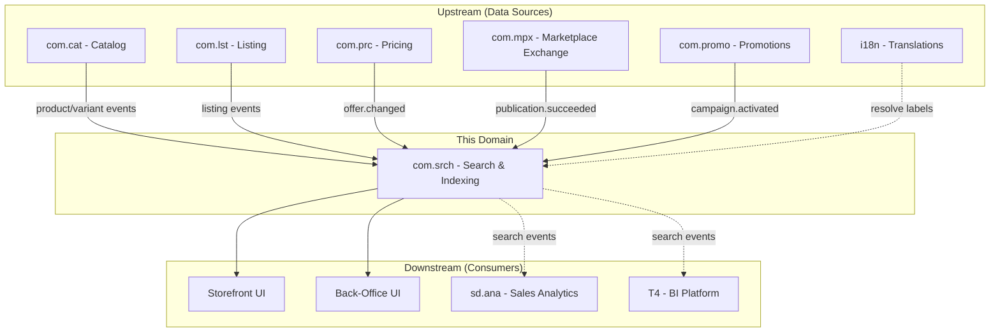
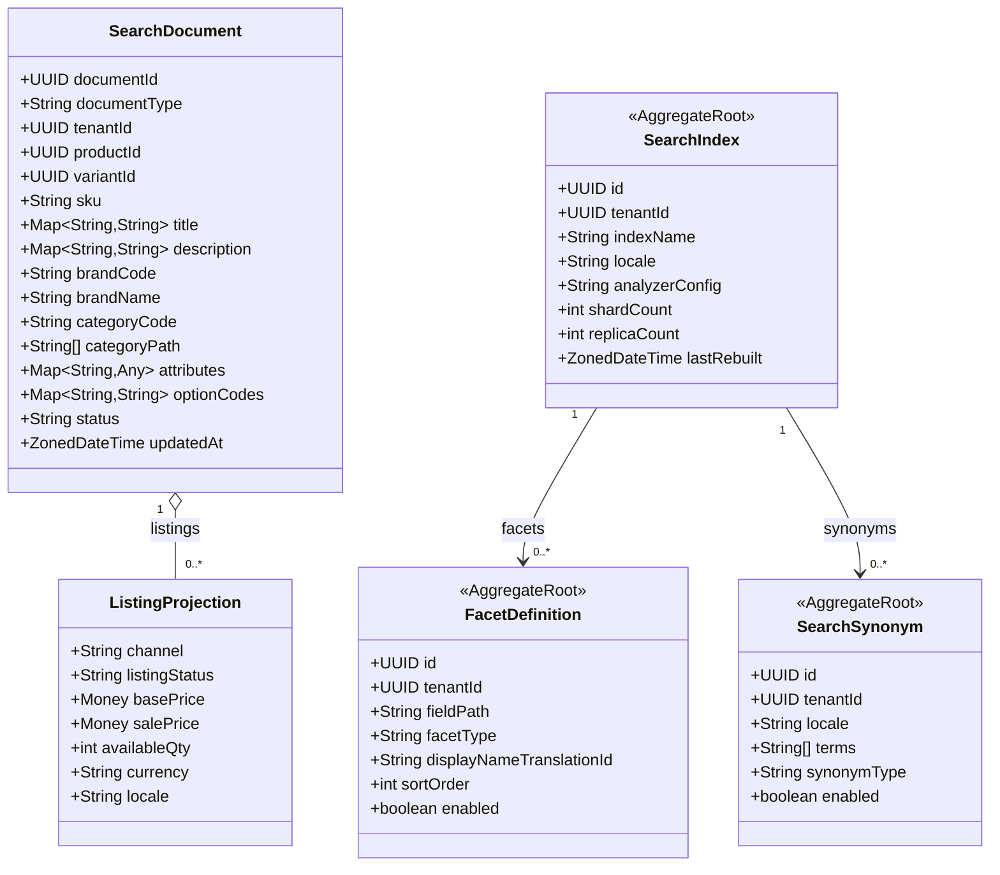
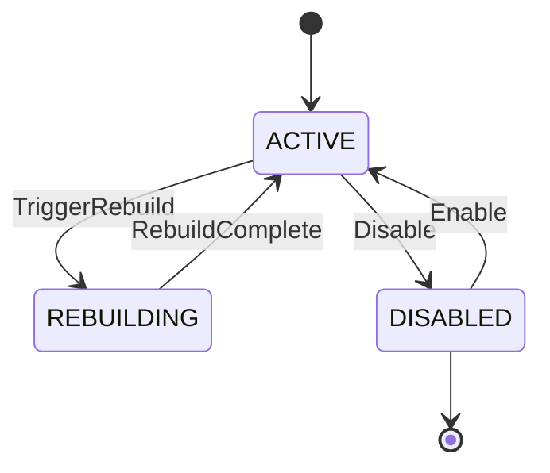
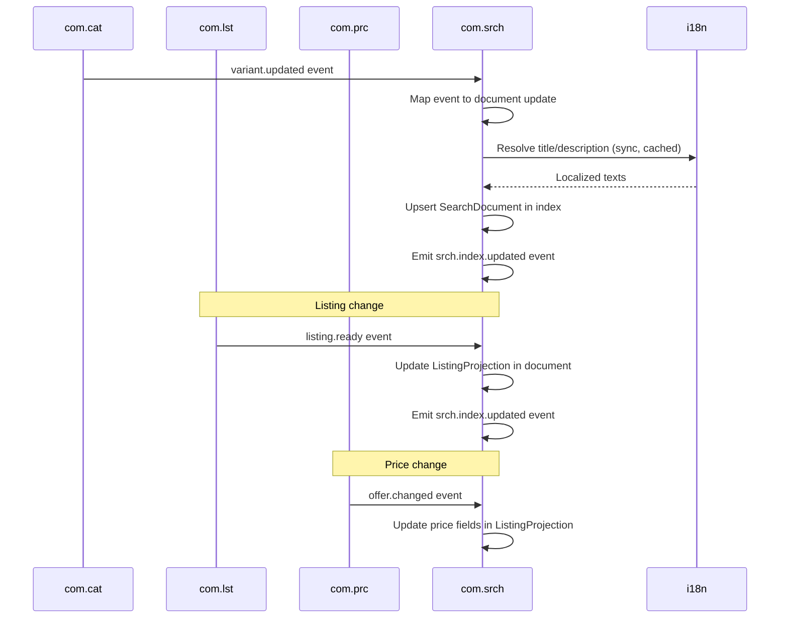
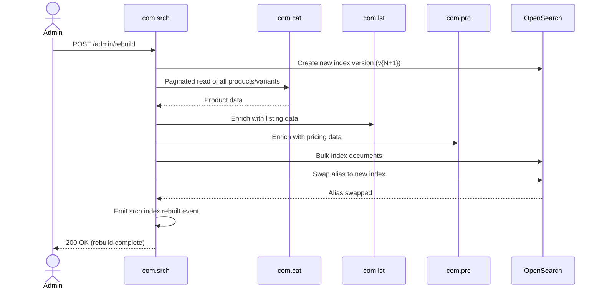
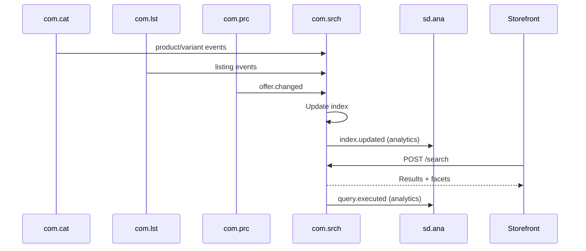
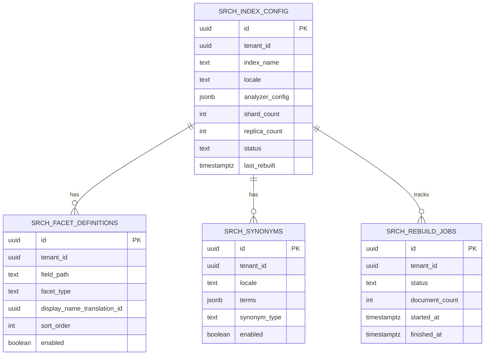

# COM.SRCH - Search & Indexing Domain / Service Specification

> **Conceptual Stack Layer:** Domain / Service
> **Space:** Platform
> **Owner:** Domain Engineering Team
> **Schema alignment:** `service-layer.schema.json`
> **Companion files:** `openapi.yaml`, `*.schema.json` (event contracts)
> **Referenced by:** Platform-Feature Spec SS5 (backend dependencies), BFF Contract
> **Belongs to:** COM Suite Spec (`_com_suite.md`)

> **Meta Information**
> - **Version:** 2026-04-03
> - **Template:** `domain-service-spec.md` v1.0.0
> - **Template Compliance:** ~95%
> - **Author(s):** OpenLeap Architecture Team
> - **Status:** DRAFT
> - **Suite:** `com`
> - **Domain:** `srch`
> - **Bounded Context Ref:** `bc:search-indexing`
> - **Service ID:** `com-srch-svc`
> - **basePackage:** `io.openleap.com.srch`
> - **API Base Path:** `/api/com/srch/v1`
> - **OpenLeap Starter Version:** `v1`
> - **Port:** OPEN QUESTION
> - **Repository:** OPEN QUESTION
> - **Tags:** `com`, `search`, `indexing`, `facets`, `opensearch`, `read-projection`
> - **Team:**
>   - Name: `team-com`
>   - Email: `com-team@openleap.io`
>   - Slack: `#com-team`

---

## Specification Guidelines Compliance

>
> ### Non-Negotiables
> - Never invent facts. If required info is missing, add an **OPEN QUESTION** entry.
> - Preserve intent and decisions. Only change meaning when explicitly requested.
> - Do not remove normative constraints unless they are explicitly replaced.
> - Keep the spec **self-contained**: no "see chat", no implicit context.
>
> ### Source of Truth Priority
> When sources conflict:
> 1. Spec (explicit) wins
> 2. Starter specs (implementation constraints) next
> 3. Guidelines (best practices) last
>
> ### Style Guide
> - Prefer short sentences and lists.
> - Use MUST/SHOULD/MAY for normative statements.
> - Keep terminology consistent (Aggregate, Domain Service, Application Service, Command, Event).
> - Avoid ambiguous words ("often", "maybe") unless explicitly noting uncertainty.

---

## 0. Document Purpose & Scope

### 0.1 Purpose
This specification defines the Search & Indexing domain within the Commerce Suite. `com.srch` maintains a denormalized, queryable index of catalog products and channel listings, providing fast keyword search, faceted browsing, and filtered discovery APIs for storefronts, internal dashboards, and downstream consumers. It is a read-optimized projection service fed by catalog, listing, and pricing events.

### 0.2 Target Audience
- Product Owners & Business Stakeholders
- System Architects & Technical Leads
- Integration Engineers
- Frontend / Storefront Engineers

### 0.3 Scope
**In Scope:**
- Denormalized search index built from CAT and LST events
- Keyword search with relevance ranking
- Faceted browse (category, brand, price range, attributes, channel, status)
- Filter and sort APIs
- Suggest / autocomplete
- Index lifecycle (build, incremental update, rebuild)
- i18n-aware indexing (locale-specific analyzers)
- Synonym management for relevance tuning
- Search analytics event emission

**Out of Scope:**
- Product master data management (-> com.cat)
- Price rule management (-> com.prc)
- Listing lifecycle and publication (-> com.lst)
- Order search and sales analytics (-> sd.ana)
- BI / strategic analytics (-> T4)
- Customer/contract entitlement enforcement as system of record

### 0.4 Related Documents
- `_com_suite.md` - Commerce Suite overview
- `com_cat-spec.md` - Catalog / PIM specification
- `com_lst-spec.md` - Listing specification
- `com_prc-spec.md` - Pricing specification
- `com_mpx-spec.md` - Marketplace Exchange specification

---

## 1. Business Context

### 1.1 Domain Purpose
`com.srch` solves the problem of **fast, flexible product discovery** across large catalogs and multi-channel listings. Relational queries against normalized CAT and LST tables cannot efficiently support keyword search with relevance, faceted navigation, or sub-100ms response times at scale. SRCH maintains a purpose-built search index optimized for these access patterns.

### 1.2 Business Value
- Sub-100ms product discovery for storefronts and internal tools
- Faceted navigation enabling customers to drill down by category, brand, price, attributes
- Autocomplete / suggest improving conversion rates
- Channel-filtered views (show only PUBLISHED listings for a given marketplace)
- Operational dashboards: find products by compliance status, listing gaps, price issues
- Consistent discovery experience across all sales channels

### 1.3 Key Stakeholders

| Role | Responsibility | Primary Use Cases |
|------|----------------|-------------------|
| Storefront / E-Commerce Team | Integrate search into customer-facing UIs | UC-SRCH-001, UC-SRCH-002 |
| Product Manager | Find products, identify catalog gaps | UC-SRCH-003 |
| Channel Manager | Search listings by channel and status | UC-SRCH-004 |
| Merchandiser | Manage synonyms and relevance tuning | UC-SRCH-007 |
| Data / Platform Team | Monitor index health, trigger rebuilds | UC-SRCH-005 |

### 1.4 Strategic Positioning



### 1.5 Service Context

| Field | Value |
|-------|-------|
| Suite | `com` (Commerce) |
| Domain | `srch` (Search & Indexing) |
| Bounded Context | `bc:search-indexing` |
| Service ID | `com-srch-svc` |
| Base Package | `io.openleap.com.srch` |
| Authoritative Sources | COM Suite Spec (`_com_suite.md`), OpenSearch documentation |

---

## 2. Service Identity

| Field | Value |
|-------|-------|
| **Service ID** | `com-srch-svc` |
| **Display Name** | Search & Indexing Service |
| **Suite** | `com` |
| **Domain** | `srch` |
| **Bounded Context Ref** | `bc:search-indexing` |
| **Version** | 2026-04-03 |
| **Status** | DRAFT |
| **API Base Path** | `/api/com/srch/v1` |
| **Repository** | OPEN QUESTION |
| **Tags** | `com`, `search`, `indexing`, `facets`, `opensearch`, `read-projection` |
| **Team Name** | `team-com` |
| **Team Email** | `com-team@openleap.io` |
| **Team Slack** | `#com-team` |

---

## 3. Domain Model

### 3.1 Conceptual Overview

SRCH does not own business entities -- it maintains **read-only projections** (search documents) built from events emitted by CAT, LST, and PRC. The core concept is the **SearchDocument**, a denormalized JSON structure optimized for search engine indexing. Configuration aggregates (SearchIndex, FacetDefinition, SearchSynonym) are the only mutable state owned by this service.



### 3.2 Core Concepts

| Concept | Owner | Description | Glossary Ref |
|---------|-------|-------------|--------------|
| SearchDocument | com-srch-svc | Denormalized projection of a product/variant for search | Index Document |
| ListingProjection | com-srch-svc | Nested per-channel listing data within a SearchDocument | Channel View |
| SearchIndex | com-srch-svc | Configuration for a tenant/locale search index | Index Config |
| FacetDefinition | com-srch-svc | Configures which attributes appear as navigable facets | Facet |
| SearchSynonym | com-srch-svc | Synonym mappings for relevance tuning | Synonym |

### 3.3 Aggregate Definitions

#### 3.3.1 Aggregate: SearchIndex

**Aggregate ID:** `agg:search-index`
**Business Purpose:** Configuration for a tenant/locale search index. Controls sharding, replication, analyzer settings, and tracks rebuild state.

**Aggregate Root Attributes:**

| Attribute | Type | Format | Required | Description | Example | Constraints |
|-----------|------|--------|----------|-------------|---------|-------------|
| id | UUID | uuid | Yes | Unique identifier | `idx-uuid` | Immutable after create, `OlUuid.create()` |
| tenantId | UUID | uuid | Yes | Tenant ownership | `t1-uuid` | Immutable, RLS-enforced |
| indexName | String | — | Yes | OpenSearch index name | `com_srch_t1_de-de` | Unique per tenant+locale |
| locale | String | BCP 47 | Yes | Index locale | `de-DE` | Valid locale code |
| analyzerConfig | JSONB | — | Yes | Analyzer settings (stemming, stop words) | `{...}` | Valid JSON |
| shardCount | Integer | — | Yes | Number of primary shards | `3` | > 0, default 3 |
| replicaCount | Integer | — | Yes | Number of replicas | `1` | >= 0, default 1 |
| lastRebuilt | Timestamptz | ISO 8601 | No | Last full rebuild timestamp | `2026-03-15T02:00:00Z` | System-managed |
| status | Enum | — | Yes | Index state | `ACTIVE` | ACTIVE, REBUILDING, DISABLED |
| version | Integer | — | Yes | Optimistic locking version | `1` | Auto-incremented |
| createdAt | Timestamptz | ISO 8601 | Yes | Creation timestamp | — | System-managed |
| updatedAt | Timestamptz | ISO 8601 | Yes | Last update timestamp | — | System-managed |

**Lifecycle States:**



**Invariants:**
- INV-IDX-001: One index per tenant+locale combination (unique constraint)
- INV-IDX-002: REBUILDING index MUST NOT accept another rebuild request
- INV-IDX-003: DISABLED index MUST NOT serve search queries

**Domain Events Emitted:**

| Event | Routing Key | When | Key Payload |
|-------|-------------|------|-------------|
| IndexRebuilt | `com.srch.index.rebuilt` | REBUILDING -> ACTIVE | tenantId, indexName, documentCount, duration |

#### 3.3.2 Aggregate: FacetDefinition

**Aggregate ID:** `agg:facet-definition`
**Business Purpose:** Configures which product attributes appear as navigable facets in search results. Tenant-configurable to support different catalog structures.

**Aggregate Root Attributes:**

| Attribute | Type | Format | Required | Description | Example | Constraints |
|-----------|------|--------|----------|-------------|---------|-------------|
| id | UUID | uuid | Yes | Unique identifier | `fac-uuid` | Immutable, `OlUuid.create()` |
| tenantId | UUID | uuid | Yes | Tenant ownership | `t1-uuid` | Immutable, RLS-enforced |
| fieldPath | String | — | Yes | Path in SearchDocument | `attributes.color` | Required, dot-notation |
| facetType | Enum | — | Yes | Aggregation type | `TERM` | TERM, RANGE, HIERARCHICAL, BOOLEAN |
| displayNameTranslationId | UUID | uuid | Yes | i18n label reference | `i18n-uuid` | FK to i18n |
| sortOrder | Integer | — | Yes | Display order in UI | `1` | Default 0 |
| enabled | Boolean | — | Yes | Active/inactive toggle | `true` | Default true |
| version | Integer | — | Yes | Optimistic locking version | `1` | Auto-incremented |
| createdAt | Timestamptz | ISO 8601 | Yes | Creation timestamp | — | System-managed |
| updatedAt | Timestamptz | ISO 8601 | Yes | Last update timestamp | — | System-managed |

**Invariants:**
- INV-FAC-001: `fieldPath` MUST be unique per tenant (no duplicate facet definitions)
- INV-FAC-002: Only enabled facets are returned in search results (BR-005)

**Domain Events Emitted:**

| Event | Routing Key | When | Key Payload |
|-------|-------------|------|-------------|
| FacetConfigChanged | `com.srch.facet.changed` | Create/Update/Delete | tenantId, facetId, fieldPath, enabled |

#### 3.3.3 Aggregate: SearchSynonym

**Aggregate ID:** `agg:search-synonym`
**Business Purpose:** Manages synonym mappings for relevance tuning. Synonyms improve search recall by mapping related terms (e.g., "sneakers" -> "trainers", "running shoes").

**Aggregate Root Attributes:**

| Attribute | Type | Format | Required | Description | Example | Constraints |
|-----------|------|--------|----------|-------------|---------|-------------|
| id | UUID | uuid | Yes | Unique identifier | `syn-uuid` | Immutable, `OlUuid.create()` |
| tenantId | UUID | uuid | Yes | Tenant ownership | `t1-uuid` | Immutable, RLS-enforced |
| locale | String | BCP 47 | Yes | Applicable locale | `de-DE` | Valid locale |
| terms | String[] | — | Yes | Synonym terms | `["sneakers", "trainers"]` | Min 2 terms |
| synonymType | Enum | — | Yes | Type of synonym rule | `EQUIVALENT` | EQUIVALENT, ONE_WAY |
| enabled | Boolean | — | Yes | Active/inactive toggle | `true` | Default true |
| version | Integer | — | Yes | Optimistic locking version | `1` | Auto-incremented |
| createdAt | Timestamptz | ISO 8601 | Yes | Creation timestamp | — | System-managed |
| updatedAt | Timestamptz | ISO 8601 | Yes | Last update timestamp | — | System-managed |

**Invariants:**
- INV-SYN-001: `terms` MUST contain at least 2 entries
- INV-SYN-002: ONE_WAY synonyms have a directional source -> target mapping

**Domain Events Emitted:**

| Event | Routing Key | When | Key Payload |
|-------|-------------|------|-------------|
| SynonymConfigChanged | `com.srch.synonym.changed` | Create/Update/Delete | tenantId, synonymId, locale |

### 3.4 Enumerations

| Enum | Values | Description |
|------|--------|-------------|
| DocumentType | PRODUCT, LISTING | Type of search document |
| IndexStatus | ACTIVE, REBUILDING, DISABLED | Search index lifecycle |
| FacetType | TERM, RANGE, HIERARCHICAL, BOOLEAN | Aggregation type for facets |
| SynonymType | EQUIVALENT, ONE_WAY | Type of synonym rule |
| ListingStatus | DRAFT, READY, PUBLISHED, ARCHIVED | Listing states (projected from com.lst) |

---

## 4. Business Rules & Constraints

### 4.1 Business Rules Catalog

| ID | Rule Name | Description | Scope | Enforcement | Error Code |
|----|-----------|-------------|-------|-------------|------------|
| BR-001 | Tenant Isolation | All search queries MUST include tenantId filter | Query | Always | `SRCH-BIZ-001` |
| BR-002 | Eventual Consistency SLA | Incremental index updates within 5 seconds of source event | Indexing | Monitored | `SRCH-OPS-002` |
| BR-003 | No Direct Writes | SRCH does not accept create/update of business entities (products, listings) | API | No write endpoints for documents | `SRCH-BIZ-003` |
| BR-004 | Locale-Specific Analysis | Text fields MUST use locale-appropriate analyzers (stemming, stop words, synonyms) | Indexing | Per-locale index settings | `SRCH-CFG-004` |
| BR-005 | Facet Configuration | Only enabled FacetDefinitions are returned in search results | Query | FacetDefinition lookup | `SRCH-BIZ-005` |
| BR-006 | Zero-Downtime Rebuild | Full rebuild MUST use index aliasing with no search interruption | Rebuild | Index swap strategy | `SRCH-OPS-006` |
| BR-007 | Synonym Min Terms | Synonym definitions MUST have at least 2 terms | Synonym | Create/Update | `SRCH-VAL-007` |
| BR-008 | Index Uniqueness | One index per tenant+locale combination | Index Config | Create | `SRCH-VAL-008` |

### 4.2 Detailed Rule Definitions

#### BR-001: Tenant Isolation
**Context:** Multi-tenancy requires strict data isolation. Cross-tenant search MUST never be permitted.
**Rule Statement:** Every search query, suggest request, and admin operation MUST include the `tenantId` derived from the authenticated JWT token. The search engine enforces this via a mandatory filter clause.
**Applies To:** All query and admin endpoints
**Enforcement:** Application Service injects `tenantId` filter before query execution.
**Validation Logic:** `if (!query.hasFilter("tenantId")) throw MissingTenantFilterException`
**Error Handling:**
- Code: `SRCH-BIZ-001`
- Message: `"Tenant context required for all search operations"`
- HTTP: 400 Bad Request

#### BR-006: Zero-Downtime Rebuild
**Context:** Search availability MUST NOT be interrupted during full index rebuilds. Storefronts depend on continuous search availability.
**Rule Statement:** Full rebuild creates a new index version (`com_srch_{tenantId}_{locale}_v{N+1}`), populates it completely, then atomically swaps the alias to point to the new index.
**Applies To:** SearchIndex aggregate, rebuild operation
**Enforcement:** Index management service uses OpenSearch alias swap.
**Validation Logic:** Alias swap is atomic; old index is deleted only after successful swap and a configurable grace period.

### 4.3 Data Validation Rules

| Field | Validation Rule | Error Code | Error Message |
|-------|----------------|------------|---------------|
| tenantId | Required, valid UUID, present in JWT | `SRCH-VAL-001` | `"Valid tenant context required"` |
| query (search) | Max 500 characters | `SRCH-VAL-010` | `"Search query exceeds maximum length"` |
| locale | Required for search, valid BCP 47 | `SRCH-VAL-011` | `"Valid locale required"` |
| page.size | 1-100, default 24 | `SRCH-VAL-012` | `"Page size must be between 1 and 100"` |
| fieldPath (facet) | Required, valid dot-notation path | `SRCH-VAL-013` | `"Valid field path required"` |
| facetType | Required, valid enum | `SRCH-VAL-014` | `"Valid facet type required (TERM, RANGE, HIERARCHICAL, BOOLEAN)"` |
| terms (synonym) | Min 2 entries, each non-blank | `SRCH-VAL-007` | `"Synonym must have at least 2 terms"` |

### 4.4 Reference Data Dependencies

| Catalog | Usage | Provider Service | Validation |
|---------|-------|-----------------|------------|
| Categories | categoryCode, categoryPath | ref-data-svc (T1) | Must exist |
| Locales | locale | ref-data-svc (T1) | Must be supported |
| Currencies | currency | ref-data-svc (T1) | ISO 4217 |
| Translation keys | displayNameTranslationId | i18n-svc (T1) | Must exist |

---

## 5. Use Cases

### 5.1 Business Logic Placement

| Layer | Responsibilities |
|-------|-----------------|
| Application Service | Query construction, index management orchestration, event handling, facet/synonym CRUD |
| Domain Service | Index rebuild coordination, synonym application, relevance tuning |
| Aggregate | Configuration state management (SearchIndex, FacetDefinition, SearchSynonym) |

### 5.2 Use Cases

#### UC-SRCH-001: Keyword Search

| Field | Value |
|-------|-------|
| **ID** | UC-SRCH-001 |
| **Type** | READ |
| **Trigger** | REST |
| **Aggregate** | SearchDocument (projection) |
| **Domain Operation** | Query pipeline: tokenize, analyze, execute, aggregate facets |
| **Inputs** | query, locale, filters?, facets?, sort?, page? |
| **Outputs** | Ranked results with facet counts, pagination cursor |
| **Events** | `com.srch.query.executed` (analytics, async) |
| **REST** | `POST /api/com/srch/v1/search` -> 200 OK |
| **Idempotency** | Inherently idempotent (read) |
| **Errors** | 400 (invalid query/filters), 503 (search engine unavailable) |

#### UC-SRCH-002: Faceted Browse

| Field | Value |
|-------|-------|
| **ID** | UC-SRCH-002 |
| **Type** | READ |
| **Trigger** | REST |
| **Aggregate** | SearchDocument (projection) |
| **Domain Operation** | Category-scoped search with facet aggregation |
| **Inputs** | categoryCode, filters?, facets?, sort?, page? |
| **Outputs** | Category-filtered results with facet counts |
| **Events** | `com.srch.query.executed` (analytics, async) |
| **REST** | `POST /api/com/srch/v1/search` (with categoryCode filter) -> 200 OK |
| **Idempotency** | Inherently idempotent (read) |
| **Errors** | 400 (invalid category/filters) |

#### UC-SRCH-003: Product Discovery (Back-Office)

| Field | Value |
|-------|-------|
| **ID** | UC-SRCH-003 |
| **Type** | READ |
| **Trigger** | REST |
| **Aggregate** | SearchDocument (projection) |
| **Domain Operation** | Attribute-gap search (find products with missing attributes) |
| **Inputs** | status, attribute existence filters, page |
| **Outputs** | Products needing enrichment |
| **Events** | -- |
| **REST** | `POST /api/com/srch/v1/search` (with attribute filters) -> 200 OK |
| **Idempotency** | Inherently idempotent (read) |
| **Errors** | 400 (invalid filters) |

#### UC-SRCH-004: Channel Listing Search

| Field | Value |
|-------|-------|
| **ID** | UC-SRCH-004 |
| **Type** | READ |
| **Trigger** | REST |
| **Aggregate** | SearchDocument (projection) |
| **Domain Operation** | Nested listing filter by channel and status |
| **Inputs** | listingChannel, listingStatus, page |
| **Outputs** | Listings matching channel/status criteria |
| **Events** | -- |
| **REST** | `POST /api/com/srch/v1/search` (with listing filters) -> 200 OK |
| **Idempotency** | Inherently idempotent (read) |
| **Errors** | 400 (invalid channel/status) |

#### UC-SRCH-005: Index Rebuild

| Field | Value |
|-------|-------|
| **ID** | UC-SRCH-005 |
| **Type** | WRITE |
| **Trigger** | REST |
| **Aggregate** | SearchIndex |
| **Domain Operation** | `SearchIndex.triggerRebuild()` |
| **Inputs** | tenantId, locale? (optional, all locales if omitted) |
| **Outputs** | Rebuild job ID, estimated duration |
| **Events** | `com.srch.index.rebuilt` on completion |
| **REST** | `POST /api/com/srch/v1/admin/rebuild` -> 202 Accepted |
| **Idempotency** | Idempotent (rejects if REBUILDING) |
| **Errors** | 409 (already rebuilding), 403 (insufficient role) |

#### UC-SRCH-006: Suggest / Autocomplete

| Field | Value |
|-------|-------|
| **ID** | UC-SRCH-006 |
| **Type** | READ |
| **Trigger** | REST |
| **Aggregate** | SearchDocument (projection) |
| **Domain Operation** | Prefix-based completion query |
| **Inputs** | prefix, locale, maxSuggestions?, filters? |
| **Outputs** | Suggestion list (text, type, reference) |
| **Events** | -- |
| **REST** | `POST /api/com/srch/v1/suggest` -> 200 OK |
| **Idempotency** | Inherently idempotent (read) |
| **Errors** | 400 (invalid prefix/locale) |

#### UC-SRCH-007: Manage Facet Configuration

| Field | Value |
|-------|-------|
| **ID** | UC-SRCH-007 |
| **Type** | WRITE |
| **Trigger** | REST |
| **Aggregate** | FacetDefinition |
| **Domain Operation** | `FacetDefinition.create()`, `FacetDefinition.update()`, `FacetDefinition.delete()` |
| **Inputs** | fieldPath, facetType, displayNameTranslationId, sortOrder, enabled |
| **Outputs** | Created/updated FacetDefinition |
| **Events** | `com.srch.facet.changed` |
| **REST** | `POST /api/com/srch/v1/admin/facets` -> 201, `PUT ./{id}` -> 200, `DELETE ./{id}` -> 204 |
| **Idempotency** | Idempotency-Key on create |
| **Errors** | 400 (validation), 404 (not found), 409 (duplicate fieldPath) |

#### UC-SRCH-008: Manage Synonyms

| Field | Value |
|-------|-------|
| **ID** | UC-SRCH-008 |
| **Type** | WRITE |
| **Trigger** | REST |
| **Aggregate** | SearchSynonym |
| **Domain Operation** | `SearchSynonym.create()`, `SearchSynonym.update()`, `SearchSynonym.delete()` |
| **Inputs** | locale, terms, synonymType, enabled |
| **Outputs** | Created/updated SearchSynonym |
| **Events** | `com.srch.synonym.changed` |
| **REST** | `POST /api/com/srch/v1/admin/synonyms` -> 201, `PUT ./{id}` -> 200, `DELETE ./{id}` -> 204 |
| **Idempotency** | Idempotency-Key on create |
| **Errors** | 400 (validation, BR-007 min terms), 404 (not found) |

### 5.3 Process Flow Diagrams

#### Incremental Indexing Flow



#### Full Rebuild Flow



### 5.4 Cross-Domain Workflows

**Does this domain participate in multi-service workflows?** Yes

#### Workflow: Listing Publication Indexing (WF-SRCH-001)
**Orchestration Pattern:** Choreography (EDA)
**Pattern Rationale:** Event-driven, loosely coupled. SRCH reacts to upstream events with no coordination needed. Eventual consistency is acceptable.

**Participating Services:**

| Service | Role | Responsibilities |
|---------|------|------------------|
| com.lst | Producer | Emits listing lifecycle events |
| com.mpx | Producer | Emits publication success events |
| com.srch | Consumer | Updates search index from events |

**Workflow Steps:**
1. LST transitions listing to READY -> emits `lst.listing.ready`
2. SRCH consumes event, upserts document with listing projection
3. MPX publishes to marketplace -> emits `mpx.publication.succeeded`
4. SRCH updates listing status to PUBLISHED in document

---

## 6. REST API

### 6.1 API Overview

| Field | Value |
|-------|-------|
| Base Path | `/api/com/srch/v1` |
| Authentication | OAuth2/JWT (Bearer token) |
| Authorization | Scopes: `com.srch:read`, `com.srch:admin` |
| Content Type | `application/json` |
| Versioning | URL path (`v1`) |

### 6.2 Search Endpoints

| Endpoint | Method | Path | Summary | Role Required | Events Published |
|----------|--------|------|---------|---------------|-----------------|
| Search | POST | `/search` | Full-text search with filters, facets, sorting | `com.srch:read` | `query.executed` (analytics) |
| Suggest | POST | `/suggest` | Autocomplete / type-ahead suggestions | `com.srch:read` | -- |
| Get Facets | GET | `/facets` | Return configured facet definitions | `com.srch:read` | -- |

**Search -- Request:**
```json
{
  "query": "blue running shoes",
  "locale": "de-DE",
  "filters": {
    "categoryCode": "shoes-running",
    "brandCode": ["NIKE", "ADIDAS"],
    "priceRange": { "min": 50, "max": 150, "currency": "EUR" },
    "attributes": {
      "color": ["BLUE", "NAVY"],
      "size": ["42"]
    },
    "listingChannel": "SHOP_DE",
    "listingStatus": "PUBLISHED"
  },
  "facets": ["brandCode", "attributes.color", "attributes.size", "priceRange"],
  "sort": { "field": "price", "order": "asc" },
  "page": { "cursor": null, "size": 24 }
}
```

**Search -- Response (200 OK):**
```json
{
  "totalHits": 142,
  "results": [
    {
      "documentId": "var-uuid-001",
      "productId": "prod-uuid-001",
      "variantId": "var-uuid-001",
      "sku": "NK-RUN-BLU-42",
      "title": "Nike Air Zoom Pegasus - Blau",
      "brandCode": "NIKE",
      "categoryCode": "shoes-running",
      "optionCodes": { "color": "BLUE", "size": "42" },
      "listing": {
        "channel": "SHOP_DE",
        "status": "PUBLISHED",
        "basePrice": { "amount": 119.99, "currency": "EUR" },
        "salePrice": null,
        "availableQty": 23
      },
      "score": 12.45
    }
  ],
  "facets": {
    "brandCode": [
      { "value": "NIKE", "count": 87 },
      { "value": "ADIDAS", "count": 55 }
    ],
    "attributes.color": [
      { "value": "BLUE", "count": 98 },
      { "value": "NAVY", "count": 44 }
    ],
    "priceRange": [
      { "from": 50, "to": 100, "count": 62 },
      { "from": 100, "to": 150, "count": 80 }
    ]
  },
  "nextCursor": "eyJzb3J0IjpbMTE5Ljk5XX0="
}
```

**Suggest -- Request:**
```json
{
  "prefix": "run",
  "locale": "de-DE",
  "maxSuggestions": 5,
  "filters": {
    "listingChannel": "SHOP_DE",
    "listingStatus": "PUBLISHED"
  }
}
```

**Suggest -- Response (200 OK):**
```json
{
  "suggestions": [
    { "text": "Running Shoes", "type": "category", "code": "shoes-running" },
    { "text": "Runfalcon Adidas", "type": "product", "productId": "prod-uuid-002" },
    { "text": "Running Tights", "type": "category", "code": "apparel-tights" }
  ]
}
```

### 6.3 Admin Endpoints

| Endpoint | Method | Path | Summary | Role Required | Events Published |
|----------|--------|------|---------|---------------|-----------------|
| Trigger Rebuild | POST | `/admin/rebuild` | Full index rebuild | `com.srch:admin` | `index.rebuilt` |
| Index Status | GET | `/admin/status` | Index health and metrics | `com.srch:admin` | -- |
| Create Facet | POST | `/admin/facets` | Create facet definition | `com.srch:admin` | `facet.changed` |
| Update Facet | PUT | `/admin/facets/{id}` | Update facet definition | `com.srch:admin` | `facet.changed` |
| Delete Facet | DELETE | `/admin/facets/{id}` | Remove facet definition | `com.srch:admin` | `facet.changed` |
| Create Synonym | POST | `/admin/synonyms` | Create synonym rule | `com.srch:admin` | `synonym.changed` |
| Update Synonym | PUT | `/admin/synonyms/{id}` | Update synonym rule | `com.srch:admin` | `synonym.changed` |
| Delete Synonym | DELETE | `/admin/synonyms/{id}` | Remove synonym rule | `com.srch:admin` | `synonym.changed` |

**Update Facet -- Headers:** `If-Match: "{version}"` (optimistic locking, 412 on conflict)

### 6.4 Error Responses

| HTTP Status | Error Code | Description |
|-------------|------------|-------------|
| 400 | `SRCH-VAL-*` | Validation error (field-level) |
| 401 | -- | Authentication required |
| 403 | -- | Forbidden (insufficient role) |
| 404 | -- | Resource not found |
| 409 | `SRCH-BIZ-*` | Conflict (duplicate fieldPath, already rebuilding) |
| 412 | -- | Precondition failed (optimistic lock version mismatch) |
| 503 | `SRCH-OPS-001` | Search engine unavailable |

### 6.5 OpenAPI Specification
**Location:** `contracts/http/com/srch/openapi.yaml`
**OpenAPI Version:** 3.1.0

---

## 7. Events & Integration

### 7.1 Event-Driven Architecture Pattern
**Pattern Decision:** Choreography (EDA)
**Rationale:** SRCH is a read-projection service. It consumes upstream events to build its index and emits thin notification events for downstream analytics. No distributed transaction coordination is needed. At-least-once delivery with idempotent consumers.

### 7.2 Published Events

**Exchange:** `com.srch.events` (topic)

#### IndexUpdated
- **Routing Key:** `com.srch.index.updated`
- **Business Meaning:** A search document has been created, updated, or deleted in the index
- **When Published:** After any incremental index update
- **Payload Schema:**
```json
{
  "tenantId": "uuid",
  "documentId": "uuid",
  "documentType": "PRODUCT | LISTING",
  "action": "UPSERT | DELETE",
  "timestamp": "2026-03-15T10:00:00Z"
}
```
- **Consumers:** sd.ana (search analytics), T4 (BI)

#### IndexRebuilt
- **Routing Key:** `com.srch.index.rebuilt`
- **Business Meaning:** A full index rebuild has completed
- **When Published:** REBUILDING -> ACTIVE transition
- **Payload Schema:**
```json
{
  "tenantId": "uuid",
  "indexName": "com_srch_t1_de-de_v2",
  "documentCount": 500000,
  "durationMs": 1800000,
  "locale": "de-DE"
}
```
- **Consumers:** Monitoring, alerting

#### FacetConfigChanged
- **Routing Key:** `com.srch.facet.changed`
- **Business Meaning:** Facet configuration has been modified
- **When Published:** FacetDefinition create/update/delete
- **Payload Schema:** `{ "tenantId": "uuid", "facetId": "uuid", "fieldPath": "string", "enabled": true, "action": "CREATE | UPDATE | DELETE" }`
- **Consumers:** Storefront UI (facet refresh)

#### SynonymConfigChanged
- **Routing Key:** `com.srch.synonym.changed`
- **Business Meaning:** Synonym configuration has been modified
- **When Published:** SearchSynonym create/update/delete
- **Payload Schema:** `{ "tenantId": "uuid", "synonymId": "uuid", "locale": "string", "action": "CREATE | UPDATE | DELETE" }`
- **Consumers:** Index reload (triggers analyzer update)

#### QueryExecuted
- **Routing Key:** `com.srch.query.executed`
- **Business Meaning:** A search query was executed (for analytics)
- **When Published:** After each search request (async, fire-and-forget)
- **Payload Schema:**
```json
{
  "tenantId": "uuid",
  "query": "blue running shoes",
  "locale": "de-DE",
  "totalHits": 142,
  "responseTimeMs": 45,
  "filters": { "brandCode": ["NIKE"] },
  "timestamp": "2026-03-15T10:00:00Z"
}
```
- **Consumers:** sd.ana (conversion analytics), T4 (BI)

### 7.3 Consumed Events

| Source Event | Source Service | Handler | Purpose | Queue |
|-------------|---------------|---------|---------|-------|
| `com.cat.product.created` | com.cat | ProductEventHandler | Index new product | `com.srch.in.com.cat.product` |
| `com.cat.product.updated` | com.cat | ProductEventHandler | Update product fields | `com.srch.in.com.cat.product` |
| `com.cat.variant.created` | com.cat | VariantEventHandler | Index new variant | `com.srch.in.com.cat.variant` |
| `com.cat.variant.updated` | com.cat | VariantEventHandler | Update variant fields | `com.srch.in.com.cat.variant` |
| `com.cat.media.changed` | com.cat | MediaEventHandler | Update media URLs | `com.srch.in.com.cat.media` |
| `com.cat.attribute.changed` | com.cat | AttributeEventHandler | Update attribute values | `com.srch.in.com.cat.attribute` |
| `com.lst.listing.created` | com.lst | ListingEventHandler | Add listing projection | `com.srch.in.com.lst.listing` |
| `com.lst.listing.updated` | com.lst | ListingEventHandler | Update listing projection | `com.srch.in.com.lst.listing` |
| `com.lst.listing.ready` | com.lst | ListingEventHandler | Update listing status | `com.srch.in.com.lst.listing` |
| `com.mpx.publication.succeeded` | com.mpx | PublicationEventHandler | Mark listing PUBLISHED | `com.srch.in.com.mpx.publication` |
| `com.prc.offer.changed` | com.prc | PriceEventHandler | Update price fields | `com.srch.in.com.prc.offer` |
| `com.promo.campaign.activated` | com.promo | PromotionEventHandler | Flag promotional products | `com.srch.in.com.promo.campaign` |

### 7.4 Event Flow Diagrams



### 7.5 Integration Points Summary

**Upstream Dependencies:**

| Service | Tier | Purpose | Type | Criticality | Fallback |
|---------|------|---------|------|-------------|----------|
| com-cat-svc | T3 | Product/variant data | Event + REST (rebuild) | High | Stale index, queue events for replay |
| com-lst-svc | T3 | Listing data | Event + REST (rebuild) | High | Stale listing projections |
| com-prc-svc | T3 | Pricing data | Event | Medium | Stale prices, flag for refresh |
| com-mpx-svc | T3 | Publication status | Event | Medium | Listing status may lag |
| i18n-svc | T1 | Localized labels | REST + Cache | Medium | Use cached translations |
| ref-data-svc | T1 | Category/locale/currency refs | REST + Cache | Low | Use cached data |

**Downstream Consumers:**

| Service | Tier | Purpose | Type | SLA |
|---------|------|---------|------|-----|
| Storefront UI | — | Product search and discovery | REST API | < 100ms p95 |
| Back-Office UI | — | Product management search | REST API | < 200ms p95 |
| sd.ana | T3 | Search analytics | Event | < 10s processing |
| T4 BI | T4 | Search behavior analytics | Event | < 30s processing |

---

## 8. Data Model

### 8.1 Storage Technology

| Aspect | Choice |
|--------|--------|
| Search Engine | OpenSearch 2.x (preferred, Apache 2.0) or Elasticsearch 8.x |
| Database | PostgreSQL 16+ (configuration and admin state only) |
| Multi-tenancy | Separate indices per tenant+locale (OpenSearch); `tenant_id` column + RLS (PostgreSQL) |
| Soft Delete | No -- search documents are projections; source deletion removes from index |
| Audit Trail | Configuration changes logged via iam.audit events |
| Outbox | `srch_outbox_events` table for reliable event publishing |

### 8.2 Conceptual Data Model



### 8.3 Table Definitions

#### Table: `srch_index_config`

| Column | Type | Nullable | Default | Description | Constraints |
|--------|------|----------|---------|-------------|-------------|
| id | uuid | NOT NULL | `OlUuid.create()` | Primary key | PK |
| tenant_id | uuid | NOT NULL | -- | Tenant discriminator | RLS policy |
| index_name | text | NOT NULL | -- | OpenSearch index name | UNIQUE(tenant_id, locale) |
| locale | text | NOT NULL | -- | BCP 47 locale code | -- |
| analyzer_config | jsonb | NOT NULL | `'{}'` | Analyzer settings JSON | Valid JSON |
| shard_count | integer | NOT NULL | `3` | Primary shard count | CHECK(shard_count > 0) |
| replica_count | integer | NOT NULL | `1` | Replica count | CHECK(replica_count >= 0) |
| status | text | NOT NULL | `'ACTIVE'` | Index lifecycle state | CHECK(status IN ('ACTIVE','REBUILDING','DISABLED')) |
| last_rebuilt | timestamptz | NULL | -- | Last rebuild completion | System-managed |
| version | integer | NOT NULL | `1` | Optimistic lock | -- |
| created_at | timestamptz | NOT NULL | `now()` | Creation timestamp | -- |
| updated_at | timestamptz | NOT NULL | `now()` | Last update | -- |

**Indexes:**
| Index Name | Columns | Type | Condition |
|------------|---------|------|-----------|
| idx_srch_idx_tenant_locale | (tenant_id, locale) | btree unique | -- |
| idx_srch_idx_status | (tenant_id, status) | btree | -- |

#### Table: `srch_facet_definitions`

| Column | Type | Nullable | Default | Description | Constraints |
|--------|------|----------|---------|-------------|-------------|
| id | uuid | NOT NULL | `OlUuid.create()` | Primary key | PK |
| tenant_id | uuid | NOT NULL | -- | Tenant discriminator | RLS policy |
| field_path | text | NOT NULL | -- | Dot-notation field path | UNIQUE(tenant_id, field_path) |
| facet_type | text | NOT NULL | -- | TERM/RANGE/HIERARCHICAL/BOOLEAN | CHECK(facet_type IN (...)) |
| display_name_translation_id | uuid | NOT NULL | -- | i18n label reference | FK logical to i18n |
| sort_order | integer | NOT NULL | `0` | Display ordering | -- |
| enabled | boolean | NOT NULL | `true` | Active toggle | -- |
| version | integer | NOT NULL | `1` | Optimistic lock | -- |
| created_at | timestamptz | NOT NULL | `now()` | Creation timestamp | -- |
| updated_at | timestamptz | NOT NULL | `now()` | Last update | -- |

**Indexes:**
| Index Name | Columns | Type | Condition |
|------------|---------|------|-----------|
| idx_srch_fac_tenant_field | (tenant_id, field_path) | btree unique | -- |
| idx_srch_fac_tenant_enabled | (tenant_id, enabled) | btree | WHERE enabled = true |

#### Table: `srch_synonyms`

| Column | Type | Nullable | Default | Description | Constraints |
|--------|------|----------|---------|-------------|-------------|
| id | uuid | NOT NULL | `OlUuid.create()` | Primary key | PK |
| tenant_id | uuid | NOT NULL | -- | Tenant discriminator | RLS policy |
| locale | text | NOT NULL | -- | BCP 47 locale code | -- |
| terms | jsonb | NOT NULL | -- | Synonym terms array | CHECK(jsonb_array_length(terms) >= 2) |
| synonym_type | text | NOT NULL | -- | EQUIVALENT/ONE_WAY | CHECK(synonym_type IN (...)) |
| enabled | boolean | NOT NULL | `true` | Active toggle | -- |
| version | integer | NOT NULL | `1` | Optimistic lock | -- |
| created_at | timestamptz | NOT NULL | `now()` | Creation timestamp | -- |
| updated_at | timestamptz | NOT NULL | `now()` | Last update | -- |

**Indexes:**
| Index Name | Columns | Type | Condition |
|------------|---------|------|-----------|
| idx_srch_syn_tenant_locale | (tenant_id, locale) | btree | -- |
| idx_srch_syn_tenant_enabled | (tenant_id, enabled) | btree | WHERE enabled = true |

#### Table: `srch_rebuild_jobs`

| Column | Type | Nullable | Default | Description | Constraints |
|--------|------|----------|---------|-------------|-------------|
| id | uuid | NOT NULL | `OlUuid.create()` | Primary key | PK |
| tenant_id | uuid | NOT NULL | -- | Tenant discriminator | RLS policy |
| index_config_id | uuid | NOT NULL | -- | Parent index config | FK to srch_index_config |
| status | text | NOT NULL | `'RUNNING'` | Job state | CHECK(status IN ('RUNNING','COMPLETED','FAILED')) |
| document_count | integer | NULL | -- | Documents indexed | -- |
| started_at | timestamptz | NOT NULL | `now()` | Job start | -- |
| finished_at | timestamptz | NULL | -- | Job completion | -- |
| error_message | text | NULL | -- | Error details if failed | -- |

**Indexes:**
| Index Name | Columns | Type | Condition |
|------------|---------|------|-----------|
| idx_srch_job_tenant_status | (tenant_id, status) | btree | WHERE status = 'RUNNING' |

#### Table: `srch_outbox_events`

Standard outbox pattern per platform guidelines (ADR-013).

### 8.4 OpenSearch Index Mapping

**Index Strategy:**
- One index per tenant per locale: `com_srch_{tenantId}_{locale}` (e.g., `com_srch_t1_de-de`)
- Alias: `com_srch_{tenantId}_{locale}_live` -> points to active index version
- Rebuild creates `com_srch_{tenantId}_{locale}_v{N+1}`, then swaps alias

**Mapping (simplified):**
```json
{
  "mappings": {
    "properties": {
      "tenantId": { "type": "keyword" },
      "productId": { "type": "keyword" },
      "variantId": { "type": "keyword" },
      "sku": { "type": "keyword" },
      "title": { "type": "text", "analyzer": "locale_analyzer" },
      "description": { "type": "text", "analyzer": "locale_analyzer" },
      "brandCode": { "type": "keyword" },
      "categoryCode": { "type": "keyword" },
      "categoryPath": { "type": "keyword" },
      "attributes": { "type": "object", "dynamic": true },
      "optionCodes": { "type": "object" },
      "status": { "type": "keyword" },
      "listings": {
        "type": "nested",
        "properties": {
          "channel": { "type": "keyword" },
          "listingStatus": { "type": "keyword" },
          "basePrice": { "type": "scaled_float", "scaling_factor": 100 },
          "salePrice": { "type": "scaled_float", "scaling_factor": 100 },
          "availableQty": { "type": "integer" },
          "currency": { "type": "keyword" }
        }
      },
      "updatedAt": { "type": "date" }
    }
  }
}
```

### 8.5 Reference Data Dependencies

| Reference Data | Source | Usage |
|----------------|--------|-------|
| Category codes | ref-data-svc (T1) | `categoryCode`, `categoryPath` validation |
| Locale codes | ref-data-svc (T1) | `locale` validation (BCP 47) |
| Currency codes | ref-data-svc (T1) | `currency` validation (ISO 4217) |
| Translation keys | i18n-svc (T1) | `displayNameTranslationId` for facets |

### 8.6 Data Retention

| Entity | Retention Period | Legal Basis | Action After Expiry |
|--------|-----------------|-------------|---------------------|
| Search Index Documents | As long as source exists | Projection of catalog data | Deleted when source deleted |
| Index Config | Indefinite | Service configuration | Archive on tenant decommission |
| Facet Definitions | Indefinite | Service configuration | Archive on tenant decommission |
| Synonyms | Indefinite | Service configuration | Archive on tenant decommission |
| Rebuild Jobs | 90 days | Operational | Delete |
| Outbox Events | 30 days after publish | Operational | Delete |

---

## 9. Security & Compliance

### 9.1 Data Classification

| Data Element | Classification | Protection |
|--------------|----------------|------------|
| Search queries | Internal | RLS, access control |
| Product data (title, price) | Internal | Tenant-scoped indices, RBAC |
| Facet/synonym config | Internal | RBAC, audit |
| Search analytics | Internal | Anonymized where possible |

### 9.2 Access Control

**Roles & Permissions Matrix:**

| Role | Search | Suggest | Facet Read | Admin (Rebuild) | Facet Config | Synonym Config |
|------|--------|---------|------------|-----------------|-------------|----------------|
| SRCH_PUBLIC | X | X | X | -- | -- | -- |
| SRCH_USER | X | X | X | -- | -- | -- |
| SRCH_ADMIN | X | X | X | X | X | X |

### 9.3 Compliance Requirements

| Regulation | Requirement | Implementation |
|------------|-------------|----------------|
| GDPR | No personal data in search index | Product data only; no PII stored |
| GDPR | Search query logs may contain personal intent | Anonymize query logs after 30 days |
| SOX | Not applicable | No financial data in search index |

### 9.4 Audit Trail

| Aspect | Implementation |
|--------|----------------|
| Who | `currentPrincipal` from JWT token |
| What | Configuration changes (facet, synonym, index config) |
| When | Timestamped event |
| Old/New Value | Captured in domain event payload |
| Retention | 1 year (configuration audit) |
| Legal Basis | Operational traceability |

---

## 10. Quality Attributes

### 10.1 Performance Requirements

| Operation | Target (p95) | Notes |
|-----------|-------------|-------|
| Search query | < 100ms | Full-text with facets |
| Suggest / autocomplete | < 50ms | Prefix completion |
| Facet aggregation | < 150ms | Complex multi-facet |
| Index rebuild (100K documents) | < 30 minutes | Full rebuild |
| Incremental index update | < 5 seconds | Event-to-searchable latency |

### 10.2 Throughput

| Metric | Target |
|--------|--------|
| Peak search requests/sec (per tenant) | 500 |
| Peak suggest requests/sec (per tenant) | 1,000 |
| Event processing (incremental) | 200 events/sec |

### 10.3 Availability

| Metric | Target |
|--------|--------|
| Uptime SLA | 99.9% |
| Planned maintenance window | Sunday 02:00-04:00 UTC |

### 10.4 Recovery Objectives

| Metric | Target |
|--------|--------|
| RTO (Recovery Time Objective) | < 10 minutes |
| RPO (Recovery Point Objective) | 0 (index can always be rebuilt from source events) |
| Failure mode | Rebuild from source; stale data acceptable briefly |

### 10.5 Scalability

| Aspect | Strategy |
|--------|----------|
| Search engine | Horizontal scaling of OpenSearch nodes |
| Event consumers | Multiple consumer instances for parallel indexing |
| Query throughput | OpenSearch read replicas |
| Capacity planning | ~1 KB per document; 100K products x 5 channels = 500K docs -> ~500 MB index |
| Growth | ~50K documents/month |

### 10.6 Maintainability

| Aspect | Implementation |
|--------|----------------|
| API versioning | URL path versioning (`/v1`), backward-compatible changes within version |
| Index versioning | Mapping versions; backward-compatible = add field; breaking = full rebuild |
| Monitoring | Index health, query latency, event consumer lag, document count |
| Key metrics | search latency p50/p95/p99, indexing lag, rebuild duration, query rate |
| Alerts | Search latency > 200ms, consumer lag > 30s, rebuild failure, DLQ depth > 0 |

---

## 11. Feature Dependencies

### 11.1 Purpose
This section answers: "Which features depend on this service?" It is the inverse of Platform-Feature Spec SS5 and helps the domain team assess the blast radius of API changes.

### 11.2 Feature Dependency Register

> **OPEN QUESTION:** Feature dependencies will be populated when feature specs (Phase 3) are authored for the COM suite. The following is a preliminary mapping based on expected feature compositions.

| Feature ID | Feature Name | Suite | Tier | Dependency Type | Status |
|------------|-------------|-------|------|-----------------|--------|
| F-COM-TBD | Product Search | com | core | sync_api | planned |
| F-COM-TBD | Faceted Browse | com | core | sync_api | planned |
| F-COM-TBD | Autocomplete | com | supporting | sync_api | planned |
| F-COM-TBD | Back-Office Product Discovery | com | supporting | sync_api | planned |
| F-COM-TBD | Search Admin (Rebuild/Facets/Synonyms) | com | supporting | sync_api | planned |

---

## 12. Extension Points

### 12.1 Purpose
Extension points follow the Open-Closed Principle: the service is open for extension via events and hooks but closed for direct modification.

### 12.2 Extension Events

| Event ID | Routing Key | Trigger | Payload | Purpose |
|----------|-------------|---------|---------|---------|
| EXT-SRCH-001 | `com.srch.index.updated` | Document indexed | Document ID, type, action | External systems can react to index changes (e.g., cache invalidation) |
| EXT-SRCH-002 | `com.srch.query.executed` | Search executed | Query, hits, latency | External analytics, A/B testing, relevance monitoring |
| EXT-SRCH-003 | `com.srch.index.rebuilt` | Rebuild complete | Index name, doc count | External monitoring, downstream cache warming |

### 12.3 Aggregate Hooks

| Hook ID | Aggregate | Lifecycle Point | Hook Type | Description |
|---------|-----------|-----------------|-----------|-------------|
| HOOK-SRCH-001 | SearchDocument | Pre-Index | enrichment | Custom field enrichment before indexing (e.g., computed scores, external data) |
| HOOK-SRCH-002 | SearchDocument | Post-Query | transformation | Custom result transformation (e.g., boosting, re-ranking) |
| HOOK-SRCH-003 | FacetDefinition | Post-Create | notification | Notify downstream UIs of new facet availability |

**Design Rules:**
- Hooks are fire-and-forget (notification) or bounded-timeout (enrichment: 2s, transformation: 1s)
- Enrichment hooks fail-open (log and continue with base data)
- Transformation hooks fail-open (return unmodified results)
- Hooks do not modify aggregate state directly

### 12.4 Extension Points Summary

| ID | Type | Aggregate | Lifecycle Point | Fail Mode | Timeout |
|----|------|-----------|-----------------|-----------|---------|
| EXT-SRCH-001 | event | SearchDocument | indexed | n/a | n/a |
| EXT-SRCH-002 | event | Query | executed | n/a | n/a |
| EXT-SRCH-003 | event | SearchIndex | rebuilt | n/a | n/a |
| HOOK-SRCH-001 | enrichment | SearchDocument | pre-index | fail-open | 2s |
| HOOK-SRCH-002 | transformation | SearchDocument | post-query | fail-open | 1s |
| HOOK-SRCH-003 | notification | FacetDefinition | post-create | fail-open | 5s |

---

## 13. Migration & Evolution

### 13.1 Data Migration

**Legacy Source:** No direct legacy migration. New greenfield service. On first deployment, SRCH performs a full rebuild by paginating through com.cat products/variants and enriching with LST and PRC data.

### 13.2 Deprecation & Sunset

| Deprecated Feature | Replacement | Removal Timeline | Communication Plan |
|-------------------|-------------|------------------|-------------------|
| -- | -- | -- | -- |

### 13.3 Future Extensions

- A/B testing of relevance algorithms for conversion optimization
- Personalized search ranking based on user behavior
- Visual search (image-based product discovery)
- Voice search query processing
- Federated search across multiple indices (cross-tenant marketplace)
- Machine-learned ranking (MLR) integration
- Per-tenant synonym management vs. global synonyms (see OQ-002)

---

## 14. Decisions & Open Questions

### 14.1 Consistency Checks

| Check | Status | Notes |
|-------|--------|-------|
| Every WRITE endpoint maps to exactly one use case | OK | UC-SRCH-005 through UC-SRCH-008 |
| Events in use cases appear in SS7 with schema refs | OK | All events documented |
| Business rules referenced in aggregate invariants | OK | BR-001 through BR-008 |
| All aggregates have lifecycle states + transitions | OK | SearchIndex has states; FacetDefinition/SearchSynonym are simple CRUD |

### 14.2 Decisions & Conflicts

| ID | Conflict Description | Resolution | Rationale |
|----|---------------------|------------|-----------|
| D-001 | Search engine choice: OpenSearch vs. Elasticsearch | OpenSearch (preferred) | Apache 2.0 license, no vendor lock-in |
| D-002 | SRCH indexes derived COM projections; it does not own product content | Accepted | Read-projection pattern, CAT is source of truth |
| D-003 | Event-driven indexing vs. synchronous indexing | Event-driven (async) | Decoupled, no write-path latency impact, eventual consistency bounded by SLA |

### 14.3 Open Questions

| ID | Question | Why It Matters | Suggested Options | Owner |
|----|----------|----------------|-------------------|-------|
| OQ-001 | OpenSearch vs. Elasticsearch final decision? | License, features, operational support | 1) OpenSearch 2.x, 2) Elasticsearch 8.x | Architecture Team |
| OQ-002 | Synonym management: per-tenant or global? | Search quality, maintenance burden | 1) Per-tenant only, 2) Global + tenant override, 3) Configurable | Product Owner |
| OQ-003 | Should SRCH support A/B testing of relevance algorithms? | Conversion optimization | 1) Phase 3, 2) Not needed | Product Owner |
| OQ-004 | How are ranking rules/merchandising boosts managed? | Search relevance | 1) Within com.srch, 2) External merchandising service | Architecture Team |
| OQ-005 | Port assignment for com-srch-svc | Deployment | Follow platform port registry | Architecture Team |

### 14.4 Architecture Decision Records

#### ADR-SRCH-001: Separate Search Engine (Not In-DB Search)

**Status:** Accepted

**Context:** Full-text search with facets, relevance ranking, and sub-100ms latency cannot be achieved with PostgreSQL full-text search at scale.

**Decision:** Use a dedicated search engine (OpenSearch/Elasticsearch) for the search index, with PostgreSQL only for SRCH configuration.

**Rationale:**
- Superior search performance, rich query DSL, facets
- Locale-specific analyzers for multi-language support
- Horizontal scaling independent of relational DB

**Consequences:**
- Positive: Superior search performance, rich query DSL, facets
- Negative: Additional infrastructure component, operational complexity
- Risks: Eventual consistency between source and index

#### ADR-SRCH-002: Event-Driven Indexing (Not Sync)

**Status:** Accepted

**Context:** Synchronous indexing on every CAT/LST/PRC write would add latency to those services and create tight coupling.

**Decision:** SRCH consumes events asynchronously. Full rebuild available as fallback.

**Rationale:**
- Decoupled architecture, no write-path latency impact
- Full rebuild provides safety net for data drift

**Consequences:**
- Positive: Decoupled, no write-path latency impact
- Negative: Eventual consistency (bounded by 5-second SLA)

---

## 15. Appendix

### 15.1 Glossary

| Term | Definition | Aliases |
|------|------------|---------|
| SearchDocument | Denormalized projection of a product/variant for search | Index Document |
| Facet | Aggregation dimension for filtering (e.g., brand, color) | Filter, Navigation |
| ListingProjection | Nested per-channel data within a SearchDocument | Channel View |
| Suggest | Autocomplete / type-ahead functionality | Autocomplete |
| SearchIndex | Configuration for a tenant/locale search index | Index Config |
| Synonym | Related term mapping for improved search recall | -- |
| Alias | OpenSearch pointer to an active index version | Index Alias |
| Relevance | Score indicating how well a document matches a query | Score, Ranking |

### 15.2 References

| Type | Reference |
|------|-----------|
| Business | COM Suite Spec (`_com_suite.md`) |
| Technical | OpenLeap Starter (ADR-002 CQRS, ADR-013 Outbox, ADR-014 At-least-once) |
| External | OpenSearch documentation (https://opensearch.org/docs/latest/) |
| External | BCP 47 / ISO 639 (Locales), ISO 4217 (Currencies), UCUM (Units) |
| Schema | `contracts/http/com/srch/openapi.yaml`, `contracts/events/com/srch/*.schema.json` |

### 15.3 Change Log

| Date | Version | Author | Changes |
|------|---------|--------|---------|
| 2026-04-03 | 3.0 | Architecture Team | Full template compliance restructure -- added SS2 Service Identity, canonical UC format, SS3 full aggregate definitions, SS8 column-level table defs, SS11 Feature Dependencies, SS12 Extension Points, SS4 detailed business rules, SS7 consumed event handlers |
| 2026-02-22 | 2.0 | Architecture Team | Expanded to ~70% compliance: detailed domain model, API contracts, events, data architecture |
| 2026-01-18 | 1.0 | Architecture Team | Initial specification |

### 15.4 Document Review & Approval

**Status:** DRAFT

| Role | Reviewer | Date | Status |
|------|----------|------|--------|
| Product Owner | -- | -- | Pending |
| Architecture Lead | -- | -- | Pending |
| CTO/VP Engineering | -- | -- | Pending |

**Approval:**
- [ ] Product Owner approved
- [ ] Architecture Lead approved
