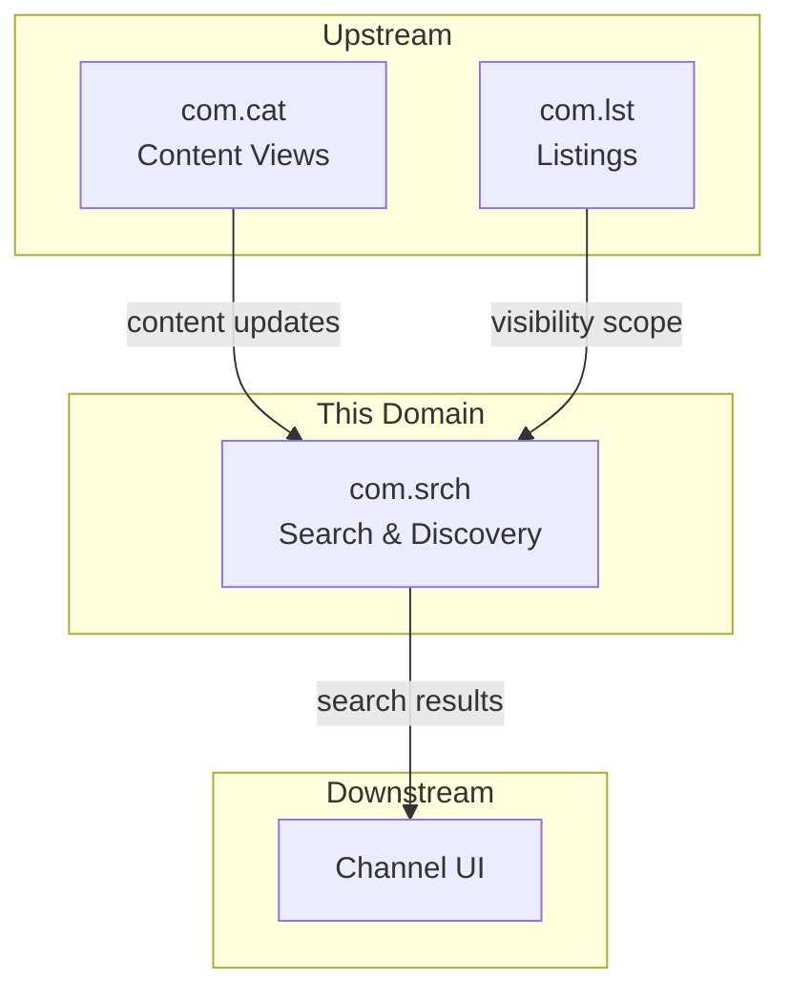
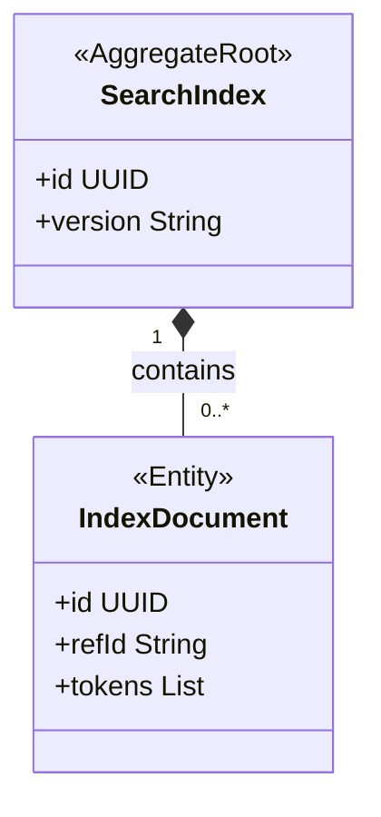
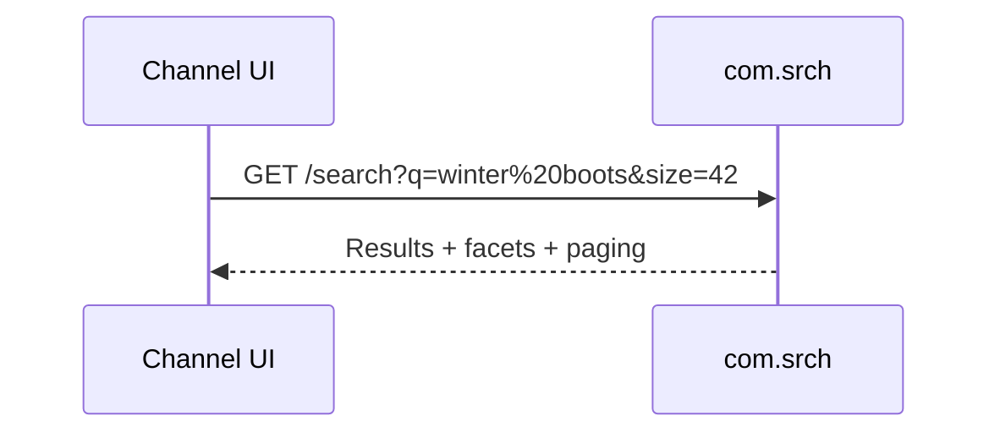

<!-- TEMPLATE COMPLIANCE: ~40%
Template: domain-service-spec.md v1.0.0
Present sections: §0 (purpose, audience, scope, related docs), §1 (business context, value, stakeholders, positioning), §3 (domain model, class diagram, UBL concepts), §6 (REST API), §7 (events — outbound/inbound), §8 (persistence — partial, storage question), §9 (security/roles), §14 (decisions, open questions)
Missing sections: §2 (service identity table), §4 (business rules), §5 (use cases), §8 (no ER diagram, no indexes), §10 (quality attributes), §11 (feature dependencies), §12 (extension points), §13 (migration), §15 (appendix)
Naming issues: none — but see duplicate below
Duplicates: com_srch.md and com_srch-spec.md cover the same domain — consolidate into com_srch-spec.md
Priority: MEDIUM — duplicate should be resolved
-->
# Service Domain Specification — `com.srch` (Search & Discovery)

> **Meta Information**
> - **Version:** 2026-01-18
> - **Template:** `domain-service-spec.md` v1.0.0
> - **Template Compliance:** ~40% — §2 (service identity table), §4 (business rules), §5 (use cases), §8 (ER diagram, indexes), §10 (quality attributes), §11 (feature dependencies), §12 (extension points), §13 (migration), §15 (appendix) missing
> - **Author(s):** OpenLeap Architecture Team
> - **Status:** DRAFT
> - **Tier:** T3
> - **Suite:** `com`
> - **Domain:** `srch`
> - **Service ID:** `com-srch-svc`
> - **basePackage:** `io.openleap.com.srch`
> - **API Base Path:** `/api/com/srch/v1`

---

## Specification Guidelines Compliance

> **This specification MUST comply with the project-wide specification guidelines.**
>
> #### Non-negotiables
> - Never invent facts. If information is missing, add an **OPEN QUESTION** entry.
> - Use **MUST/SHOULD/MAY** for normative statements.
> - Keep the spec **self-contained**: no references to chat context.
> - Record decisions and boundaries explicitly (see Section 12).

---

## 0. Document Purpose & Scope

### 0.1 Purpose
`com.srch` specifies the **search & discovery** domain within COM. It provides channel-facing search capabilities (query, facets, sorting, ranking) backed by a denormalized index derived from `com.cat` and channel visibility from `com.lst`.

### 0.2 Target Audience
- Product Owner / Fachbereich
- Architekt:innen / Tech Leads
- Integrations- und Plattform-Team
- Channel UI / Experience teams

### 0.3 Scope

**In Scope (MUST):**
- MUST provide keyword search, filters/facets, and sorting for channel product discovery.
- MUST maintain a search index derived from COM projections (`com.cat`) and listing scope (`com.lst`).
- SHOULD provide basic recommendation endpoints (e.g., related items) if required.

**Out of Scope (MUST NOT):**
- MUST NOT be authoritative for product content → `com.cat`.
- MUST NOT be authoritative for listing publication state → `com.lst`.
- MUST NOT be authoritative for pricing → `sd.sd`.
- MUST NOT implement customer/contract entitlement enforcement as system of record (signals may influence visibility).

### 0.4 Terms & Acronyms
- **Index Document:** A normalized searchable representation of a product/variant.
- **Facet:** A filterable attribute used for search refinement.

### 0.5 Related Documents
- Suite-Architektur: `platform/tmpspec/T3_Domains/COM/_com_suite.md`
- Nachbar-Spezifikationen: `com_cat.md`, `com_lst.md`

---

## 1. Business Context

### 1.1 Domain Purpose
Allow shoppers (and channel operators) to find relevant items quickly and reliably across large catalogs with low latency.

### 1.2 Business Value
- Higher conversion (fast discovery).
- Consistent discovery across channels.

### 1.3 Stakeholders & Roles
| Rolle | Verantwortung | Primäre Use-Cases |
|------|----------------|-------------------|
| Shopper | Discover items | Search, filter, sort |
| Channel UI | Consume search APIs | Render search results |
| Merchandiser | Influence discovery | Ranking rules, synonyms (OPEN QUESTION) |
| Platform | Feed index | Subscribe to changes |

### 1.4 Strategic Positioning (Context Diagram)

---

## 2. Domain Boundaries & Responsibilities

### 2.1 Verantwortlichkeiten (Responsibilities)
- MUST expose search APIs suitable for channel traffic.
- MUST maintain an index that reflects channel publish scope.
- SHOULD support incremental indexing driven by events.

### 2.2 Nicht-Verantwortlichkeiten (Non-Goals)
- MUST NOT provide authoritative “in stock” truth; may return snapshot-based messaging.

### 2.3 Ownership von Daten & „Source of Truth“ 
- **Source of Truth für:** Search index configuration and query behavior → `com.srch`.
- **Referenziert (nur IDs):** `com.cat` product/variant view IDs, `com.lst` listing IDs.

---

## 3. Domänenmodell

### 3.1 Überblick (Mermaid `classDiagram`)

### 3.2 Kern-Konzepte (Ubiquitous Language)
- **IndexDocument:** Unit of retrieval (product or variant) used for ranking and faceting.

---

## 5. Datenhaltung (Persistence)

### 5.1 Storage-Entscheidung
- (OPEN QUESTION) Search backend (Elasticsearch/OpenSearch/SQL FTS/etc.).

---

## 6. Öffentliche Schnittstellen (APIs)

### 6.1 REST API (OpenAPI-friendly)
**Base Path:** `/api/com/srch/v1`

#### 6.1.1 Search
- `GET /search?q=...`
  - SHOULD support filters/facets and pagination.

#### 6.1.2 Suggestions / Recommendations
- `GET /suggest?q=...` (optional)
- `GET /recommendations?refId=...` (optional)

---

## 7. Events & Messaging

### 7.1 Konventionen
- **Exchange/Topic:** `com.srch.events`
- **Routing Key:** `com.srch.<aggregate>.<event>`

### 7.2 Outbound Events
- `com.srch.index.updated` – MAY be emitted after a successful indexing job.

### 7.3 Inbound Events
- `com.cat.productView.updated` – SHOULD trigger incremental reindex.
- `com.lst.listing.published` – SHOULD affect visibility scope.

---

## 8. Typische Interaktionen (Sequenzen)

### 8.1 Happy Path

---

## 9. Sicherheit & Berechtigungen

### 9.1 Rollenmodell
- `COM_SRCH_VIEWER`
- `COM_SRCH_ADMIN`

---

## 12. Entscheidungen, Konflikte, Open Questions

### 12.1 Entscheidungen (Decisions)
- **DEC-001:** `com.srch` indexes derived COM projections; it does not own product content.

### 12.3 OPEN QUESTIONS
- **OQ-001:** What search backend is used and how is reindexing orchestrated?
- **OQ-002:** How are ranking rules/merchandising boosts managed (within `com.srch` vs external)?

---

## 13. Änderungsverlauf
- Created: 2026-01-18
