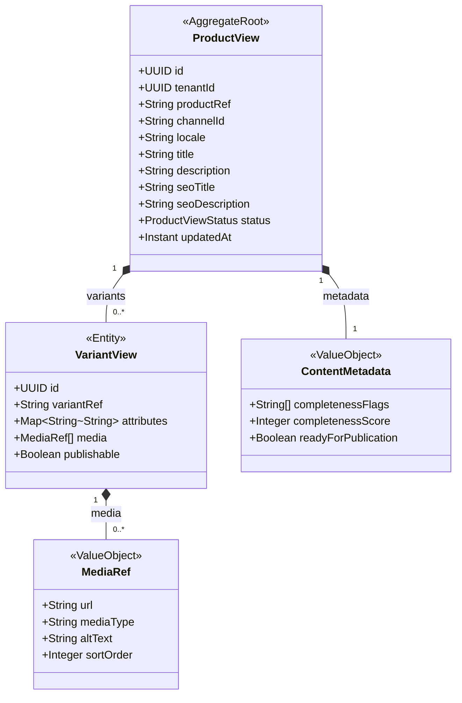

# COM - Channel Catalog & Content (cat) Domain / Service Specification

> **Conceptual Stack Layer:** Domain / Service
> **Space:** Platform
> **Owner:** COM Domain Engineering Team
> **Schema alignment:** `service-layer.schema.json`
> **Companion files:** `contracts/http/com/cat/openapi.yaml`, `contracts/events/com/cat/*.schema.json`
> **Belongs to:** COM Suite Spec (`_com_suite.md`)

> **Meta Information**
> - **Version:** 2026-04-04
> - **Template:** `domain-service-spec.md` v1.0.0
> - **Template Compliance:** ~92%
> - **Author(s):** OpenLeap Architecture Team
> - **Status:** DRAFT
> - **Suite:** `com`
> - **Domain:** `cat`
> - **Bounded Context Ref:** `bc:channel-catalog`
> - **Service ID:** `com-cat-svc`
> - **basePackage:** `io.openleap.com.cat`
> - **API Base Path:** `/api/com/cat/v1`
> - **Port:** `8101`
> - **Repository:** `io.openleap.com.cat`
> - **Tags:** `com`, `catalog`, `channel`, `product-view`, `content`

---

## 0. Document Purpose & Scope

### 0.1 Purpose

`com.cat` provides **channel-ready, read-optimized product and variant views** for storefronts and publishing pipelines. This is *presentation data*, not the authoritative product master. It maintains denormalized `ProductView`/`VariantView` projections from upstream product sources (PPS), enriched with media, locale-aware content, and channel-specific attributes.

### 0.2 Scope

**In Scope (MUST):**
- Maintain denormalized ProductView/VariantView projections per channel
- Manage media references (images, videos, documents) with media server URLs
- Provide locale-aware content (via i18n service references)
- Validate content completeness for publication readiness (not compliance — that is com.cmp)
- Emit `com.cat.productview.updated` to trigger com.srch re-indexing and com.lst snapshot refresh

**Out of Scope (MUST NOT):**
- Authoritative product engineering (BOM, routings, product master) → PPS suite
- Commercial pricing authority → SD suite
- Inventory/stock management → PPS suite
- Compliance/regulatory checking → com.cmp
- Listing snapshot management → com.lst

---

## 1. Business Context

### 1.1 Domain Purpose

`com.cat` is the **channel content engine** — it ensures every storefront and publishing pipeline has high-quality, locale-appropriate, channel-optimized product presentations without querying the operational product master on every request.

### 1.2 Business Value

- Decouples storefront performance from operational product systems
- Enables channel-specific content variants (different SEO titles, images per channel)
- Reduces time-to-publish for new products through content completeness validation
- Supports multi-locale content without frontend complexity

### 1.3 Stakeholders

| Role | Responsibility |
|------|----------------|
| Merchandiser | Maintain product content, images, descriptions per channel |
| Channel Manager | Configure channel-specific attributes, validate readiness |
| Search Analyst | Monitor content quality signals for index health |
| Integration Engineer | Configure upstream product feed ingestion |

---

## 2. Service Identity

| Property | Value |
|----------|-------|
| **Service ID** | `com-cat-svc` |
| **Suite** | `com` |
| **Domain** | `cat` |
| **Bounded Context** | `bc:channel-catalog` |
| **API Base Path** | `/api/com/cat/v1` |
| **Port** | `8101` |

---

## 3. Domain Model

### 3.1 Aggregate Overview

### 3.2 ProductViewStatus

- `DRAFT` — Content being authored, not ready for listing
- `READY` — Content complete; can be listed
- `PUBLISHED` — Referenced by at least one active listing
- `ARCHIVED` — No longer active

---

## 4. Business Rules & Constraints

| ID | Rule | Severity |
|----|------|----------|
| BR-CAT-001 | ProductView MUST reference a valid productRef from PPS or upstream source | HARD |
| BR-CAT-002 | ProductView title MUST be non-empty and ≤ 255 characters | HARD |
| BR-CAT-003 | At least one VariantView MUST have a primary media item (image) to be READY | HARD |
| BR-CAT-004 | Locale MUST be a valid BCP-47 language tag (e.g., de-DE, en-GB) | HARD |
| BR-CAT-005 | com.cat MUST NOT store pricing data — no price fields on ProductView/VariantView | HARD |
| BR-CAT-006 | productview.updated event MUST be emitted after any content change | HARD |
| BR-CAT-007 | ProductView per (tenantId, productRef, channelId, locale) MUST be unique | HARD |

---

## 5. Use Cases

### UC-CAT-001: Create/Update ProductView from Upstream Feed

**Trigger:** PPS product event or manual content ingestion
**Flow:**
1. Receive product data (productRef, base attributes)
2. Create/update ProductView projection for target channel + locale
3. Evaluate content completeness (title, description, media)
4. Set status to DRAFT or READY based on completeness
5. Emit `com.cat.productview.updated`

### UC-CAT-002: Upload Media to ProductView

**Trigger:** Merchandiser uploads image via UI
**Flow:**
1. Upload image to media server (via CDN integration)
2. Create MediaRef with URL, type, alt text
3. Associate with VariantView
4. Re-evaluate completeness; update status if now READY
5. Emit `com.cat.productview.updated`

### UC-CAT-003: Manage Channel-Specific Content

**Trigger:** Merchandiser edits channel-specific title/description
**Flow:**
1. Load ProductView for channel + locale
2. Update title, description, SEO fields
3. Validate completeness constraints
4. Save and emit `com.cat.productview.updated`

### UC-CAT-004: Get ProductView for Storefront

**Trigger:** Storefront `GET /productviews/{id}`
**Flow:**
1. Return ProductView with all VariantViews, media, and metadata
2. Include content completeness score
3. Never include pricing (authoritative pricing from SD)

---

## 6. REST API

**Base Path:** `/api/com/cat/v1`

| Method | Path | Description |
|--------|------|-------------|
| GET | `/productviews` | List product views (channel, locale, status filters) |
| GET | `/productviews/{id}` | Get product view detail |
| POST | `/productviews` | Create product view |
| PUT | `/productviews/{id}` | Full update (content management) |
| PATCH | `/productviews/{id}` | Partial update |
| DELETE | `/productviews/{id}` | Archive product view |
| GET | `/productviews/{id}/variants` | Get variant views |
| POST | `/productviews/{id}/variants/{vId}/media` | Upload media |

Full OpenAPI contract: `contracts/http/com/cat/openapi.yaml`

---

## 7. Events & Integration

### 7.1 Outbound Events

| Event | Routing Key | Consumers |
|-------|-------------|-----------|
| productview.updated | `com.cat.productview.updated` | com.srch (re-index), com.lst (refresh snapshot) |

### 7.2 Inbound Events

| Source | Event | Action |
|--------|-------|--------|
| PPS | `pps.product.updated` | Update ProductView projections |
| SD | `sd.pricing.updated` | IGNORED — com.cat does not store pricing |

---

## 8. Data Model

### 8.1 Tables (prefix: `cat_`)

**`cat_product_view`** — ProductView aggregate  
**`cat_variant_view`** — VariantView entities  
**`cat_media_ref`** — Media references per variant  
**`cat_content_metadata`** — Completeness metadata  

UNIQUE constraint: `(tenant_id, product_ref, channel_id, locale)` on `cat_product_view`

---

## 9. Security & Compliance

| Role | Permissions |
|------|-------------|
| `COM_CAT_VIEWER` | Read product views |
| `COM_CAT_EDITOR` | Create/update product views and media |
| `COM_CAT_ADMIN` | All permissions + archive |

---

## 10. Quality Attributes

- Product view retrieval: MUST respond < 100ms (storefront critical path — cache-backed)
- Content update propagation: SHOULD reach com.srch within 30 seconds

---

## 11. Feature Dependencies

| Feature | Dependency |
|---------|-----------|
| F-COM-001-01 (Channel Catalog) | Requires IAM, i18n service |

---

## 12. Extension Points

- **AI content generation:** ML-assisted product description generation
- **Multi-channel content variants:** Different content per channel without full duplication (content inheritance)
- **Video support:** Embed video media alongside images

---

## 13. Migration & Evolution

- **From flat catalog:** Import existing product data as ProductViews with status DRAFT; merchandisers complete content
- **v2.0:** Content inheritance (base + channel overrides), AI content assist

---

## 14. Decisions & Open Questions

### Decisions
- **DEC-CAT-001:** com.cat stores NO pricing data — pricing is always from SD
- **DEC-CAT-002:** ProductView is per (tenant, product, channel, locale) — fine-grained channel/locale control

### Open Questions
- **OQ-CAT-001:** What upstream system triggers product creation in com.cat — PPS, SD, or external PIM?
- **OQ-CAT-002:** How are channel-specific attribute schemas defined and validated?

---

## 15. Appendix

### 15.1 Content Completeness Score

| Flag | Description | Required for READY |
|------|-------------|-------------------|
| HAS_TITLE | Non-empty title ≤ 255 chars | Yes |
| HAS_DESCRIPTION | Non-empty description ≥ 50 chars | Yes |
| HAS_PRIMARY_IMAGE | At least one image media ref | Yes |
| HAS_SEO_TITLE | SEO title populated | No (but scored) |
| HAS_ALL_VARIANTS_IMAGED | All variants have ≥ 1 image | No (but scored) |
