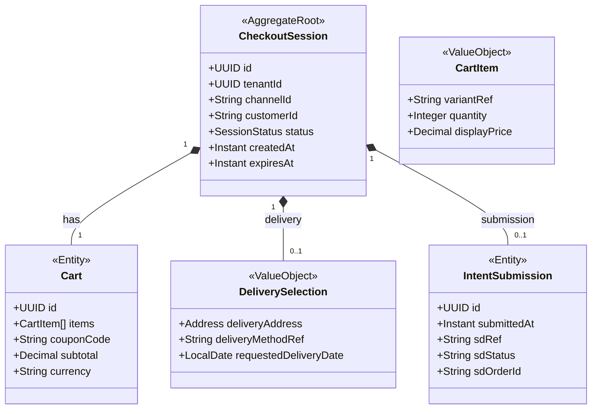

# COM - Cart, Checkout & Intent Submission (chk) Domain / Service Specification

> **Meta Information**
> - **Version:** 2026-04-04
> - **Template:** `domain-service-spec.md` v1.0.0
> - **Template Compliance:** ~92%
> - **Author(s):** OpenLeap Architecture Team
> - **Status:** DRAFT
> - **Suite:** `com`
> - **Domain:** `chk`
> - **Bounded Context Ref:** `bc:checkout-intent`
> - **Service ID:** `com-chk-svc`
> - **basePackage:** `io.openleap.com.chk`
> - **API Base Path:** `/api/com/chk/v1`
> - **Port:** `8106`
> - **Repository:** `io.openleap.com.chk`
> - **Tags:** `com`, `checkout`, `cart`, `intent`, `session`

---

## 0. Document Purpose & Scope

### 0.1 Purpose

`com.chk` runs the **channel checkout experience** and submits a **checkout intent** to SD. It manages cart state, checkout session steps (address, delivery, payment UI), and hands off the completed session to SD for commercial commitment creation.

**Core rule:** COM submits intent; SD creates commercial truth.

### 0.2 Scope

**In Scope (MUST):**
- Cart state management (items, quantities, coupon codes)
- Checkout session (delivery address, delivery method selection, payment UI orchestration)
- Checkout intent submission to SD
- Store mapping `checkoutSessionId → sdOrderId/sdContractId`
- Listen to SD events for UI continuity (order confirmed / cancelled)
- Apply promotions from com.promo at checkout time

**Out of Scope (MUST NOT):**
- Determine commercial validity (credit blocks, contract rules) → SD suite
- Execute fulfillment → SD suite
- Payment posting/reconciliation → FI suite
- Price authority for commercial documents → SD suite

---

## 1. Business Context

### 1.1 Domain Purpose

`com.chk` converts shopper intent into a structured submission that SD can evaluate and commit. It handles all the UI complexity of a multi-step checkout while remaining stateless about commercial outcomes — those belong to SD.

### 1.2 Business Value

- Reduces cart abandonment through streamlined multi-step checkout UX
- Decouples channel UI complexity from commercial processing
- Supports multiple checkout flows (B2C, B2B, subscription, booking-like)

### 1.3 Stakeholders

| Role | Responsibility |
|------|----------------|
| End Customer (Shopper) | Complete checkout | 
| E-commerce Manager | Configure checkout flow options |
| SD Team | Receive and process checkout intents |

---

## 2. Service Identity

| Property | Value |
|----------|-------|
| **Service ID** | `com-chk-svc` |
| **Domain** | `chk` |
| **API Base Path** | `/api/com/chk/v1` |
| **Port** | `8106` |

---

## 3. Domain Model

### 3.1 Aggregate Overview



### 3.2 SessionStatus State Machine

```
ACTIVE → SUBMITTED → CONFIRMED (SD confirms)
ACTIVE → EXPIRED (timeout)
SUBMITTED → FAILED (SD rejects)
```

---

## 4. Business Rules & Constraints

| ID | Rule | Severity |
|----|------|----------|
| BR-CHK-001 | CheckoutSession MUST expire after configurable timeout (default: 30 minutes) | HARD |
| BR-CHK-002 | Cart items MUST reference valid variantRef from com.cat | HARD |
| BR-CHK-003 | Checkout MUST call SD for authoritative pricing before submission (not use display price) | HARD |
| BR-CHK-004 | Intent submission MUST be idempotent (retry-safe) | HARD |
| BR-CHK-005 | COM MUST store `checkoutSessionId → sdOrderId` mapping for UI continuity | HARD |
| BR-CHK-006 | COM MUST NOT confirm an order — only display SD's confirmation | HARD |
| BR-CHK-007 | Promotions applied at checkout MUST be validated by com.promo | SOFT |

---

## 5. Use Cases

### UC-CHK-001: Add to Cart

**Trigger:** Shopper adds variant to cart
**Flow:**
1. Create or retrieve active CheckoutSession
2. Add CartItem with variantRef, quantity, display price (from com.lst snapshot)
3. Apply coupon if provided (validate via com.promo)
4. Return updated cart summary

### UC-CHK-002: Submit Checkout Intent

**Trigger:** Shopper clicks "Place Order"
**Flow:**
1. Validate session complete (delivery address, payment method selected)
2. Call SD pricing API for authoritative net price
3. Call SD to create order/contract: `POST /api/sd/sd/v1/orders`
4. Record IntentSubmission with `sdOrderId`
5. Set session status → SUBMITTED
6. Emit `com.chk.checkoutSession.submitted`

### UC-CHK-003: Handle SD Order Confirmation

**Trigger:** `sd.sd.order.confirmed` event
**Flow:**
1. Look up CheckoutSession by `sdOrderId`
2. Update status → CONFIRMED
3. Trigger confirmation page render in UI

### UC-CHK-004: Handle SD Order Failure

**Trigger:** SD returns error on intent submission
**Flow:**
1. Set status → FAILED
2. Record failure reason
3. Emit `com.chk.checkoutSession.failed`
4. Allow session to remain ACTIVE for retry

---

## 6. REST API

**Base Path:** `/api/com/chk/v1`

| Method | Path | Description |
|--------|------|-------------|
| POST | `/sessions` | Create checkout session |
| GET | `/sessions/{id}` | Get session state |
| PATCH | `/sessions/{id}/cart` | Update cart (add/remove/update items) |
| PATCH | `/sessions/{id}/delivery` | Set delivery details |
| POST | `/sessions/{id}:submit` | Submit checkout intent to SD |
| GET | `/sessions/{id}/confirmation` | Get confirmation state (SD order ref) |

---

## 7. Events & Integration

### 7.1 Outbound Events

| Event | Routing Key | Payload |
|-------|-------------|---------|
| checkoutSession.submitted | `com.chk.checkoutSession.submitted` | sessionId, sdOrderId, channelId, customerId |
| checkoutSession.failed | `com.chk.checkoutSession.failed` | sessionId, failureReason |

### 7.2 Inbound Events

| Source | Event | Action |
|--------|-------|--------|
| SD | `sd.sd.order.confirmed` | Update session → CONFIRMED |
| SD | `sd.sd.order.cancelled` | Update session UI state |

### 7.3 Synchronous Calls

| Target | Purpose |
|--------|---------|
| com.promo | Coupon/promotion validation |
| SD pricing API | Authoritative price at checkout |
| SD orders API | Intent submission |

---

## 8–14. Data / Security / Decisions

**Tables (prefix: `chk_`):** `chk_checkout_session`, `chk_cart`, `chk_cart_item`, `chk_delivery`, `chk_intent_submission`

**Roles:** `COM_CHK_VIEWER` (customer service), `COM_CHK_EDITOR` (shopper-facing)

**Session storage:** Sessions MAY be stored in Redis for active state; persisted to PostgreSQL on submission.

### Decisions
- **DEC-CHK-001:** SD is always called for authoritative pricing before submission — never rely on display price
- **DEC-CHK-002:** COM never stores commercial truth — only the sessionId → sdOrderId mapping

### Open Questions
- **OQ-COM-004:** Booking-like checkout (time slot selection) — does com.chk call SRV directly or route via SD?

---

## 15. Appendix

### 15.1 SessionStatus Reference

| Status | Description |
|--------|-------------|
| ACTIVE | Shopper has open cart/session |
| SUBMITTED | Intent submitted to SD; awaiting confirmation |
| CONFIRMED | SD confirmed order; checkout complete |
| FAILED | Submission failed; session available for retry |
| EXPIRED | Session timed out without submission |
