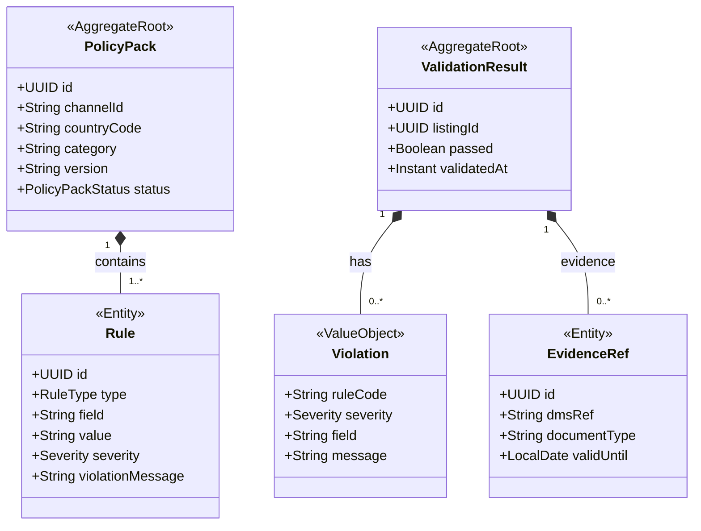

# COM - Compliance for Publishing (cmp) Domain / Service Specification

> **Meta Information**
> - **Version:** 2026-04-04
> - **Template:** `domain-service-spec.md` v1.0.0
> - **Template Compliance:** ~92%
> - **Author(s):** OpenLeap Architecture Team
> - **Status:** DRAFT
> - **Suite:** `com`
> - **Domain:** `cmp`
> - **Bounded Context Ref:** `bc:compliance-publishing`
> - **Service ID:** `com-cmp-svc`
> - **basePackage:** `io.openleap.com.cmp`
> - **API Base Path:** `/api/com/cmp/v1`
> - **Port:** `8105`
> - **Repository:** `io.openleap.com.cmp`
> - **Tags:** `com`, `compliance`, `publishing`, `policy`, `validation`

---

## 0. Document Purpose & Scope

### 0.1 Purpose

`com.cmp` blocks publication of channel listings that violate **legal, safety, or channel-specific rules**. It manages compliance policy packs per channel/country/category, validates listings against these rules, records violation evidence, and returns structured compliance results to com.lst.

### 0.2 Scope

**In Scope (MUST):**
- Manage PolicyPack definitions (channel × country × category)
- Validate listings against applicable PolicyPacks
- Return structured violations (code, severity, field, description)
- Manage evidence references (certificates stored in DMS)
- Support policy versioning

**Out of Scope (MUST NOT):**
- Tax compliance posting/journaling (→ FI suite)
- Contract terms or refund policy (→ SD suite)
- Regulatory legal advice (external legal counsel)

---

## 1. Business Context

### 1.1 Domain Purpose

"Block bad listings before they go live." `com.cmp` prevents marketplace bans, fines, and product recalls by systematically checking that every listing meets applicable rules before publication.

### 1.2 Key Concepts

- **PolicyPack:** A versioned ruleset applicable to a (channel, country, category) combination
- **Rule:** An individual check within a PolicyPack (required field, prohibited term, document required, etc.)
- **Violation:** A rule breach with severity (CRITICAL blocks publication; WARNING allows with review)
- **Evidence:** A reference to a document (certificate, safety sheet, declaration) stored in DMS

---

## 2. Service Identity

| Property | Value |
|----------|-------|
| **Service ID** | `com-cmp-svc` |
| **Domain** | `cmp` |
| **API Base Path** | `/api/com/cmp/v1` |
| **Port** | `8105` |

---

## 3. Domain Model

---

## 4. Business Rules & Constraints

| ID | Rule | Severity |
|----|------|----------|
| BR-CMP-001 | CRITICAL violation MUST block listing publication | HARD |
| BR-CMP-002 | WARNING violation SHOULD be shown to Channel Manager but MUST NOT block | SOFT |
| BR-CMP-003 | PolicyPack version MUST be recorded with each ValidationResult for audit | HARD |
| BR-CMP-004 | Expired evidence (validUntil < today) MUST trigger re-validation | HARD |
| BR-CMP-005 | Policy changes MUST create new PolicyPack version (existing results remain valid against previous version) | HARD |

---

## 5. Use Cases

### UC-CMP-001: Validate Listing

**Trigger:** `POST /validate` from com.lst (synchronous)
**Flow:**
1. Determine applicable PolicyPacks (channel × country × category)
2. Run all rules against listing content
3. Collect violations
4. Return ValidationResult (passed/failed + violations)
5. Store ValidationResult for audit

### UC-CMP-002: Manage PolicyPack

**Trigger:** Compliance Officer creates/updates policy
**Flow:**
1. Create PolicyPack version with rules
2. Activate on effective date
3. Previous version archived

---

## 6. REST API

| Method | Path | Description |
|--------|------|-------------|
| POST | `/validate` | Validate a listing (synchronous) |
| GET | `/policy-packs` | List policy packs |
| POST | `/policy-packs` | Create policy pack |
| GET | `/validation-results/{listingId}` | Get validation history |

---

## 7. Events & Integration

- **Outbound:** `com.cmp.policy.updated` (when policy pack changes, triggers re-validation for affected listings)
- **No significant inbound events** (operates synchronously via REST for validation)

---

## 8–14. Data Model / Security / Quality

**Tables (prefix: `cmp_`):** `cmp_policy_pack`, `cmp_rule`, `cmp_validation_result`, `cmp_violation`, `cmp_evidence_ref`

**Roles:** `COM_CMP_VIEWER`, `COM_CMP_EDITOR`, `COM_CMP_ADMIN`

**Performance:** Validation MUST complete < 2 seconds for standard listing (< 50 rules)

---

## 15. Appendix

### 15.1 RuleType Reference

| Type | Description |
|------|-------------|
| REQUIRED_FIELD | Field must be non-empty |
| PROHIBITED_TERM | Field must not contain specified term |
| MAX_LENGTH | Field must not exceed length |
| DOCUMENT_REQUIRED | Named document evidence must be provided |
| CATEGORY_RESTRICTED | Product category restricted for channel/country |
| HAZMAT_FLAG | Hazardous material restrictions |
| AGE_RESTRICTION | Age-restricted product requires verification |
