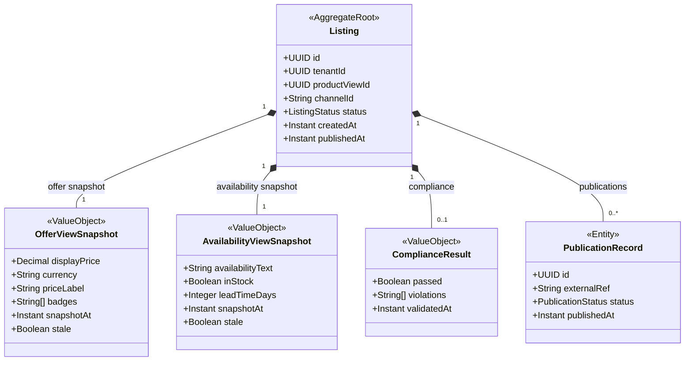

# COM - Listings & Publication Snapshots (lst) Domain / Service Specification

> **Meta Information**
> - **Version:** 2026-04-04
> - **Template:** `domain-service-spec.md` v1.0.0
> - **Template Compliance:** ~92%
> - **Author(s):** OpenLeap Architecture Team
> - **Status:** DRAFT
> - **Suite:** `com`
> - **Domain:** `lst`
> - **Bounded Context Ref:** `bc:listings`
> - **Service ID:** `com-lst-svc`
> - **basePackage:** `io.openleap.com.lst`
> - **API Base Path:** `/api/com/lst/v1`
> - **Port:** `8102`
> - **Repository:** `io.openleap.com.lst`
> - **Tags:** `com`, `listings`, `publication`, `channel`, `snapshots`

---

## 0. Document Purpose & Scope

### 0.1 Purpose

`com.lst` creates and manages **channel-specific listings** — combining catalog content with deterministic presentation snapshots (what the shopper sees right now). It manages listing lifecycle, triggers compliance validation, and coordinates publication to external channels via com.mpx.

### 0.2 Scope

**In Scope (MUST):**
- Maintain Listing objects per channel (combining content from com.cat with channel-specific metadata)
- Store presentation snapshots: `OfferViewSnapshot` (display price / badges) and `AvailabilityViewSnapshot` (stock / lead time)
- Manage listing lifecycle: DRAFT → READY → PUBLISHED / FAILED / ARCHIVED
- Coordinate compliance validation with com.cmp before publication
- Trigger publication via com.mpx for external channels
- Invalidate and refresh snapshots on upstream signals

**Out of Scope (MUST NOT):**
- Legal compliance decisions (→ com.cmp)
- Order acceptance or commercial truth (→ SD suite)
- Authoritative pricing for commercial documents (→ SD suite)

---

## 1. Business Context

### 1.1 Domain Purpose

`com.lst` ensures that shoppers always see accurate, validated product listings. It decouples the upstream data pipeline from the real-time storefront query by maintaining stable, refreshable snapshots.

### 1.2 Business Value

- Storefront queries hit listing snapshots (< 50ms) instead of live product/inventory systems
- Compliance-gate prevents non-compliant listings from going live
- Listing lifecycle provides clear audit trail for channel publication decisions

### 1.3 Stakeholders

| Role | Responsibility |
|------|----------------|
| Channel Manager | Review listing status, approve publication |
| Merchandiser | Create listings, manage channel visibility |
| Compliance Officer | Review compliance failures |
| E-commerce Manager | Monitor publication success rates |

---

## 2. Service Identity

| Property | Value |
|----------|-------|
| **Service ID** | `com-lst-svc` |
| **Domain** | `lst` |
| **API Base Path** | `/api/com/lst/v1` |
| **Port** | `8102` |

---

## 3. Domain Model

### 3.1 Aggregate Overview



### 3.2 ListingStatus State Machine

```
DRAFT → COMPLIANCE_PENDING → READY → PUBLISHING → PUBLISHED
COMPLIANCE_PENDING → COMPLIANCE_FAILED
PUBLISHED → ARCHIVED
Any → ARCHIVED (manual)
```

---

## 4. Business Rules & Constraints

| ID | Rule | Severity |
|----|------|----------|
| BR-LST-001 | Listing MUST reference a ProductView in READY status | HARD |
| BR-LST-002 | Listing MUST pass compliance check before publication | HARD |
| BR-LST-003 | OfferViewSnapshot MUST be marked stale after SD pricing change event | HARD |
| BR-LST-004 | AvailabilityViewSnapshot MUST be marked stale after PPS inventory change event | HARD |
| BR-LST-005 | Stale snapshots SHOULD be refreshed within 5 minutes (configurable) | SOFT |
| BR-LST-006 | Listing (tenantId, productViewId, channelId) MUST be unique | HARD |
| BR-LST-007 | Failed compliance results MUST NOT proceed to publication | HARD |

---

## 5. Use Cases

### UC-LST-001: Create Listing

**Trigger:** Channel Manager creates listing via UI
**Flow:**
1. Validate ProductView exists and is READY
2. Create Listing in DRAFT status
3. Trigger compliance check: request `com.cmp` validation
4. Set status to COMPLIANCE_PENDING

### UC-LST-002: Compliance Check Result

**Trigger:** com.cmp returns compliance result
**Flow:**
1. Record ComplianceResult on Listing
2. If passed: status → READY; emit `com.lst.listing.ready`
3. If failed: status → COMPLIANCE_FAILED; notify Channel Manager

### UC-LST-003: Publish Listing

**Trigger:** Channel Manager triggers publication (or auto-publish on READY)
**Flow:**
1. Validate status = READY
2. Set status → PUBLISHING
3. Emit `com.lst.listing.ready` → triggers com.mpx publication
4. On com.mpx confirmation: status → PUBLISHED; emit `com.lst.listing.published`
5. On com.mpx failure: status → FAILED; emit `com.lst.listing.failed`

### UC-LST-004: Refresh Snapshots

**Trigger:** SD pricing change or PPS inventory change event
**Flow:**
1. Mark relevant snapshot(s) as stale
2. Schedule snapshot refresh (synchronous or background job)
3. Call SD/PPS APIs to get fresh display price / availability
4. Update snapshot; clear stale flag
5. Emit `com.lst.listing.updated`

---

## 6. REST API

**Base Path:** `/api/com/lst/v1`

| Method | Path | Description |
|--------|------|-------------|
| GET | `/listings` | List listings with filters |
| GET | `/listings/{id}` | Listing detail with snapshots |
| POST | `/listings` | Create listing |
| POST | `/listings/{id}:publish` | Trigger publication |
| POST | `/listings/{id}:archive` | Archive listing |
| GET | `/listings/{id}/snapshots` | Get current snapshots |
| POST | `/listings/{id}/snapshots:refresh` | Force snapshot refresh |

---

## 7. Events & Integration

### 7.1 Outbound Events

| Event | Routing Key | Payload |
|-------|-------------|---------|
| listing.ready | `com.lst.listing.ready` | listingId, channelId, productViewId |
| listing.published | `com.lst.listing.published` | listingId, externalRef |
| listing.failed | `com.lst.listing.failed` | listingId, reason |
| listing.archived | `com.lst.listing.archived` | listingId |

### 7.2 Inbound Events

| Source | Event | Action |
|--------|-------|--------|
| com.cat | `com.cat.productview.updated` | Refresh snapshots |
| com.mpx | `com.mpx.publication.succeeded` | Update listing status → PUBLISHED |
| com.mpx | `com.mpx.publication.failed` | Update listing status → FAILED |
| SD | `sd.pricing.updated` | Mark OfferViewSnapshot stale |
| PPS | `pps.inventory.updated` | Mark AvailabilityViewSnapshot stale |

---

## 8. Data Model

**Tables (prefix: `lst_`):**
- `lst_listing` — Listing aggregate
- `lst_offer_snapshot` — Display price snapshots
- `lst_availability_snapshot` — Availability snapshots
- `lst_compliance_result` — Compliance validation results
- `lst_publication_record` — Publication history

UNIQUE: `(tenant_id, product_view_id, channel_id)`

---

## 9. Security & Compliance

| Role | Permissions |
|------|-------------|
| `COM_LST_VIEWER` | Read listings and snapshots |
| `COM_LST_EDITOR` | Create/update listings, trigger publication |
| `COM_LST_ADMIN` | Archive listings |

---

## 10. Quality Attributes

- Listing snapshot read: MUST respond < 50ms (cache-backed)
- Snapshot staleness resolution: SHOULD complete < 5 minutes

---

## 11. Feature Dependencies

| Feature | Dependency |
|---------|-----------|
| F-COM-001 (Catalog Mgmt) | Requires com.cat (ProductView) + com.cmp (compliance) |

---

## 12–14. Extension Points / Migration / Decisions

### Decisions
- **DEC-LST-001:** Snapshots are display-only; authoritative pricing/inventory always queried from SD/PPS at checkout
- **DEC-LST-002:** Compliance is always synchronous before publication (per ADR-COM-004)

### Open Questions
- **OQ-LST-001:** Should auto-publish be configurable per channel or global setting?
- **OQ-LST-002:** How are stale snapshot refresh jobs scheduled (cron vs. event-driven)?

---

## 15. Appendix

### 15.1 Listing Status Reference

| Status | Description |
|--------|-------------|
| DRAFT | Created, awaiting compliance check |
| COMPLIANCE_PENDING | Waiting for compliance validation result |
| COMPLIANCE_FAILED | Compliance check failed; manual review needed |
| READY | Compliance passed; ready to publish |
| PUBLISHING | Publication in progress via com.mpx |
| PUBLISHED | Active on channel |
| FAILED | Publication failed; retry available |
| ARCHIVED | Inactive; no longer published |
