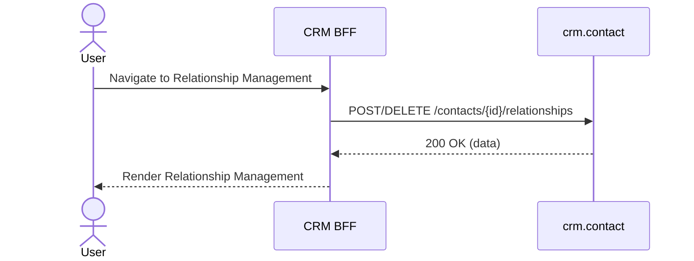

# F-CRM-001-07 — Relationship Management

> **Template:** `feature-spec.md` v1.0.0
> **Template Compliance:** 95%+
> **Status:** DRAFT
> **Feature ID:** `F-CRM-001-07`
> **Suite:** `crm`
> **Node type:** LEAF
> **Parent:** `F-CRM-001`
> **Companion UVL:** `F-CRM-001-07.uvl`
> **Companion AUI:** `F-CRM-001-07.aui.yaml`

---

## 0. Feature Identity & Orientation

### 0.1 One-Line Summary

This feature lets a CRM user sales Rep manages contact-to-account relationships with roles

### 0.2 Non-Goals

- This feature does NOT implement backend business logic (see domain spec for `crm.contact`).
- This feature does NOT define the API contract (see `contracts/http/crm/` OpenAPI).

### 0.3 Entry & Exit Points

| Direction | Target | Trigger |
|-----------|--------|---------|
| Entry | This feature | Navigation menu, search result click, related record link |
| Exit | Related detail views | Click on related record |
| Exit | Create/Edit forms | Action button click |

### 0.4 Variability Points

| Attribute | Type | Binding Time | Default |
|-----------|------|-------------|---------|
| `F-CRM-001-07.enabled` | Boolean | deploy | true |
| `F-CRM-001-07.readOnly` | Boolean | runtime | false |

**Tree position:** `CRM_UI` → `F-CRM-001` → `F-CRM-001-07`

---

## 1. User Goal & Scenarios

### 1.1 User Goal

Sales Rep manages contact-to-account relationships with roles

### 1.2 Scenarios

**Scenario 1: Add relationship: link contact to account as Decision Maker**
- **Outcome:** Dialog opens, select account, select role, save
- **Notes:** RelationshipCreated event, relationship appears in list

**Scenario 2: Remove non-primary relationship**
- **Outcome:** Confirmation dialog, confirm delete
- **Notes:** Relationship removed, contact still linked via other relationships

**Scenario 3: Attempt to remove last relationship**
- **Outcome:** Error: contact must have at least one primary account
- **Notes:** Action blocked

---

## 2. User Journey & Screen Layout

### 2.1 Happy Path Sequence



### 2.2 Screen Layout

```
┌─────────────────────────────────────────────────┐
│ [F-CRM-001-07] Relationship Management                   │
├─────────────────────────────────────────────────┤
│ [table   ] Contact's account relationships with role,  │
│ [dialog  ] Account lookup + role selector + primary to │
│ [dialog  ] Confirmation dialog with impact summary │
├─────────────────────────────────────────────────┤
│ [EXT] Extension zone                            │
└─────────────────────────────────────────────────┘
```

---

## 3. Interaction Requirements

### 3.1 Zones

| Zone | Type | Priority | Description |
|------|------|----------|-------------|
| `relationshipList` | `table` | high | Contact's account relationships with role, primary flag, dates |
| `addRelationshipDialog` | `dialog` | high | Account lookup + role selector + primary toggle |
| `removeRelationshipConfirm` | `dialog` | high | Confirmation dialog with impact summary |
| `extensionZone` | `feature-gated` | low | Extension point for product customization |

### 3.2 Actions

| Action | Trigger | Confirmation | Events |
|--------|---------|-------------|--------|
| Navigate to detail | Row click | None | None |
| Filter | Filter change | None | None |
| Sort | Column header click | None | None |

---

## 4. Edge Cases & Screen States

| State | Condition | Behaviour |
|-------|-----------|-----------|
| Loading | Data fetching in progress | Skeleton loader displayed |
| Empty | No records match criteria | Empty state illustration + CTA |
| Populated | Records available | Normal rendering |
| Error | Service unavailable | Error message with retry button |
| Partial | Some data loaded, some failed | Available data shown, failed sections show inline error |
| Read-only | `F-CRM-001-07.readOnly` = true | All edit controls disabled, view-only mode |

---

## 5. Backend Dependencies & BFF Contract

### 5.1 Service Calls

| Service | Endpoint | Tier | Is Mutation | Failure Mode |
|---------|----------|------|------------|-------------|
| `crm.contact` | `POST/DELETE /contacts/{id}/relationships` | core | Yes | Show error toast, allow retry |

### 5.2 Feature Gating

| Mode | `F-CRM-001-07.enabled` | `F-CRM-001-07.readOnly` | Behaviour |
|------|------------------------|--------------------------|-----------|
| Full | true | false | All features available |
| Read-only | true | true | View only, mutations disabled |
| Excluded | false | — | Feature hidden from navigation |

---

## 6. Screen Contract (AUI)

See companion file: `contracts/aui/F-CRM-001-07.aui.yaml`

---

## 7. i18n, Permissions & Accessibility

### 7.1 Permissions

| Action | Required Role |
|--------|--------------|
| View | `crm-readonly`, `crm-sales-rep`, `crm-sales-manager`, `crm-admin` |

### 7.2 Accessibility

- All interactive elements must be keyboard-navigable
- ARIA labels on all form fields and action buttons
- Color is never the sole indicator of state (always paired with icon or text)
- Screen reader announcements for dynamic content updates

---

## 8. Acceptance Criteria

**AC-1: Add relationship: link contact to account as Decision Maker**
- **Given** a user with appropriate permissions
- **When** add relationship: link contact to account as decision maker
- **Then** dialog opens, select account, select role, save

**AC-2: Remove non-primary relationship**
- **Given** a user with appropriate permissions
- **When** remove non-primary relationship
- **Then** confirmation dialog, confirm delete

**AC-3: Attempt to remove last relationship**
- **Given** a user with appropriate permissions
- **When** attempt to remove last relationship
- **Then** error: contact must have at least one primary account

---

## 9. Dependencies, Variability & Extension Points

### 9.1 Feature Dependencies

- Requires parent composition `F-CRM-001` to be selected
- Requires `F-CRM-006` (Global Search) for navigation and search integration

### 9.2 Extension Zones

| Zone | Interface | Default Behaviour |
|------|-----------|-------------------|
| `extensionZone` | Render custom components | Collapsed (hidden when empty) |

---

## 10. Change Log & Review

| Date | Version | Author | Changes |
|------|---------|--------|---------|
| 2026-04-03 | 1.0.0 | OpenLeap Architecture Team | Initial feature spec |