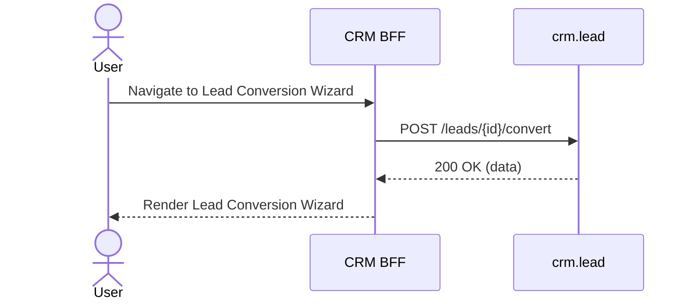

# F-CRM-002-05 — Lead Conversion Wizard

> **Template:** `feature-spec.md` v1.0.0
> **Template Compliance:** 95%+
> **Status:** DRAFT
> **Feature ID:** `F-CRM-002-05`
> **Suite:** `crm`
> **Node type:** LEAF
> **Parent:** `F-CRM-002`
> **Companion UVL:** `F-CRM-002-05.uvl`
> **Companion AUI:** `F-CRM-002-05.aui.yaml`

---

## 0. Feature Identity & Orientation

### 0.1 One-Line Summary

This feature lets a CRM user sales Rep converts a qualified lead into Contact + Account + Opportunity via guided wizard

### 0.2 Non-Goals

- This feature does NOT implement backend business logic (see domain spec for `crm.lead`).
- This feature does NOT define the API contract (see `contracts/http/crm/` OpenAPI).

### 0.3 Entry & Exit Points

| Direction | Target | Trigger |
|-----------|--------|---------|
| Entry | This feature | Navigation menu, search result click, related record link |
| Exit | Related detail views | Click on related record |
| Exit | Create/Edit forms | Action button click |

### 0.4 Variability Points

| Attribute | Type | Binding Time | Default |
|-----------|------|-------------|---------|
| `F-CRM-002-05.enabled` | Boolean | deploy | true |
| `F-CRM-002-05.readOnly` | Boolean | runtime | false |

**Tree position:** `CRM_UI` → `F-CRM-002` → `F-CRM-002-05`

---

## 1. User Goal & Scenarios

### 1.1 User Goal

Sales Rep converts a qualified lead into Contact + Account + Opportunity via guided wizard

### 1.2 Scenarios

**Scenario 1: Convert qualified lead — create new account**
- **Outcome:** 3-step wizard, all fields mapped, new account created
- **Notes:** LeadConverted event, Contact+Account+Opportunity created

**Scenario 2: Convert lead — link to existing account**
- **Outcome:** Step 2 shows account lookup, user selects existing
- **Notes:** Contact linked to existing account

**Scenario 3: Convert lead — skip opportunity creation**
- **Outcome:** Step 3: user unchecks Create Opportunity
- **Notes:** Only Contact + Account created

---

## 2. User Journey & Screen Layout

### 2.1 Happy Path Sequence



### 2.2 Screen Layout

```
┌─────────────────────────────────────────────────┐
│ [F-CRM-002-05] Lead Conversion Wizard                    │
├─────────────────────────────────────────────────┤
│ [form    ] Map lead fields to Contact: confirm name, e │
│ [form    ] Map to Account: company name (lookup existi │
│ [form    ] Create Opportunity (optional): name, amount │
│ [display ] Review all three records before confirming  │
│ [display ] Success summary with links to created Conta │
├─────────────────────────────────────────────────┤
│ [EXT] Extension zone                            │
└─────────────────────────────────────────────────┘
```

---

## 3. Interaction Requirements

### 3.1 Zones

| Zone | Type | Priority | Description |
|------|------|----------|-------------|
| `conversionStep1` | `form` | high | Map lead fields to Contact: confirm name, email, phone, title |
| `conversionStep2` | `form` | high | Map to Account: company name (lookup existing or create new), industry, website |
| `conversionStep3` | `form` | high | Create Opportunity (optional): name, amount, expected close date, stage |
| `conversionReview` | `display` | high | Review all three records before confirming conversion |
| `conversionResult` | `display` | high | Success summary with links to created Contact, Account, Opportunity |
| `extensionZone` | `feature-gated` | low | Extension point for product customization |

### 3.2 Actions

| Action | Trigger | Confirmation | Events |
|--------|---------|-------------|--------|
| Save | Button click | None (optimistic) | State change event |
| Cancel | Button click | Unsaved changes guard | None |

---

## 4. Edge Cases & Screen States

| State | Condition | Behaviour |
|-------|-----------|-----------|
| Loading | Data fetching in progress | Skeleton loader displayed |
| Empty | No records match criteria | Empty state illustration + CTA |
| Populated | Records available | Normal rendering |
| Error | Service unavailable | Error message with retry button |
| Partial | Some data loaded, some failed | Available data shown, failed sections show inline error |
| Read-only | `F-CRM-002-05.readOnly` = true | All edit controls disabled, view-only mode |

---

## 5. Backend Dependencies & BFF Contract

### 5.1 Service Calls

| Service | Endpoint | Tier | Is Mutation | Failure Mode |
|---------|----------|------|------------|-------------|
| `crm.lead` | `POST /leads/{id}/convert` | core | Yes | Show error toast, allow retry |

### 5.2 Feature Gating

| Mode | `F-CRM-002-05.enabled` | `F-CRM-002-05.readOnly` | Behaviour |
|------|------------------------|--------------------------|-----------|
| Full | true | false | All features available |
| Read-only | true | true | View only, mutations disabled |
| Excluded | false | — | Feature hidden from navigation |

---

## 6. Screen Contract (AUI)

See companion file: `contracts/aui/F-CRM-002-05.aui.yaml`

---

## 7. i18n, Permissions & Accessibility

### 7.1 Permissions

| Action | Required Role |
|--------|--------------|
| View | `crm-readonly`, `crm-sales-rep`, `crm-sales-manager`, `crm-admin` |
| Create/Edit | `crm-sales-rep`, `crm-sales-manager`, `crm-admin` |
| Delete | `crm-sales-manager`, `crm-admin` |

### 7.2 Accessibility

- All interactive elements must be keyboard-navigable
- ARIA labels on all form fields and action buttons
- Color is never the sole indicator of state (always paired with icon or text)
- Screen reader announcements for dynamic content updates

---

## 8. Acceptance Criteria

**AC-1: Convert qualified lead — create new account**
- **Given** a user with appropriate permissions
- **When** convert qualified lead — create new account
- **Then** 3-step wizard, all fields mapped, new account created

**AC-2: Convert lead — link to existing account**
- **Given** a user with appropriate permissions
- **When** convert lead — link to existing account
- **Then** step 2 shows account lookup, user selects existing

**AC-3: Convert lead — skip opportunity creation**
- **Given** a user with appropriate permissions
- **When** convert lead — skip opportunity creation
- **Then** step 3: user unchecks create opportunity

---

## 9. Dependencies, Variability & Extension Points

### 9.1 Feature Dependencies

- Requires parent composition `F-CRM-002` to be selected
- Requires `F-CRM-006` (Global Search) for navigation and search integration

### 9.2 Extension Zones

| Zone | Interface | Default Behaviour |
|------|-----------|-------------------|
| `extensionZone` | Render custom components | Collapsed (hidden when empty) |

---

## 10. Change Log & Review

| Date | Version | Author | Changes |
|------|---------|--------|---------|
| 2026-04-03 | 1.0.0 | OpenLeap Architecture Team | Initial feature spec |