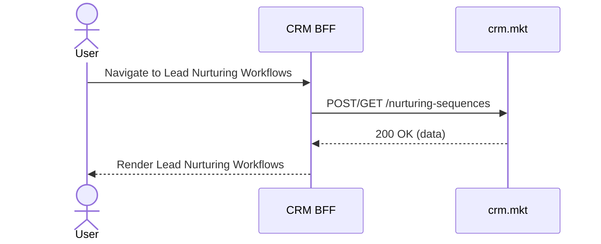

# F-CRM-015-04 — Lead Nurturing Workflows

> **Template:** `feature-spec.md` v1.0.0
> **Template Compliance:** 95%+
> **Status:** DRAFT
> **Feature ID:** `F-CRM-015-04`
> **Suite:** `crm`
> **Node type:** LEAF
> **Parent:** `F-CRM-015`
> **Companion UVL:** `F-CRM-015-04.uvl`
> **Companion AUI:** `F-CRM-015-04.aui.yaml`

---

## 0. Feature Identity & Orientation

### 0.1 One-Line Summary

This feature lets a CRM user marketing creates multi-step email drip sequences

### 0.2 Non-Goals

- This feature does NOT implement backend business logic (see domain spec for `crm.mkt`).
- This feature does NOT define the API contract (see `contracts/http/crm/` OpenAPI).

### 0.3 Entry & Exit Points

| Direction | Target | Trigger |
|-----------|--------|---------|
| Entry | This feature | Navigation menu, search result click, related record link |
| Exit | Related detail views | Click on related record |
| Exit | Create/Edit forms | Action button click |

### 0.4 Variability Points

| Attribute | Type | Binding Time | Default |
|-----------|------|-------------|---------|
| `F-CRM-015-04.enabled` | Boolean | deploy | true |
| `F-CRM-015-04.readOnly` | Boolean | runtime | false |

**Tree position:** `CRM_UI` → `F-CRM-015` → `F-CRM-015-04`

---

## 1. User Goal & Scenarios

### 1.1 User Goal

Marketing creates multi-step email drip sequences

### 1.2 Scenarios

**Scenario 1: Create 5-step nurturing sequence**
- **Outcome:** Build steps with delays and conditions
- **Notes:** Sequence activated for enrolled leads

**Scenario 2: View sequence performance**
- **Outcome:** Open/click rates per step
- **Notes:** Optimize underperforming steps

---

## 2. User Journey & Screen Layout

### 2.1 Happy Path Sequence



### 2.2 Screen Layout

```
┌─────────────────────────────────────────────────┐
│ [F-CRM-015-04] Lead Nurturing Workflows                  │
├─────────────────────────────────────────────────┤
│ [builder ] Visual multi-step builder: step → delay → s │
│ [form    ] Email template, delay (days/hours), conditi │
│ [display ] Timeline preview of all steps with delays │
├─────────────────────────────────────────────────┤
│ [EXT] Extension zone                            │
└─────────────────────────────────────────────────┘
```

---

## 3. Interaction Requirements

### 3.1 Zones

| Zone | Type | Priority | Description |
|------|------|----------|-------------|
| `sequenceBuilder` | `builder` | high | Visual multi-step builder: step → delay → step → condition → branch |
| `stepConfig` | `form` | high | Email template, delay (days/hours), condition (field check) |
| `sequencePreview` | `display` | high | Timeline preview of all steps with delays |
| `extensionZone` | `feature-gated` | low | Extension point for product customization |

### 3.2 Actions

| Action | Trigger | Confirmation | Events |
|--------|---------|-------------|--------|
| Save | Button click | None (optimistic) | State change event |
| Cancel | Button click | Unsaved changes guard | None |

---

## 4. Edge Cases & Screen States

| State | Condition | Behaviour |
|-------|-----------|-----------|
| Loading | Data fetching in progress | Skeleton loader displayed |
| Empty | No records match criteria | Empty state illustration + CTA |
| Populated | Records available | Normal rendering |
| Error | Service unavailable | Error message with retry button |
| Partial | Some data loaded, some failed | Available data shown, failed sections show inline error |
| Read-only | `F-CRM-015-04.readOnly` = true | All edit controls disabled, view-only mode |

---

## 5. Backend Dependencies & BFF Contract

### 5.1 Service Calls

| Service | Endpoint | Tier | Is Mutation | Failure Mode |
|---------|----------|------|------------|-------------|
| `crm.mkt` | `POST/GET /nurturing-sequences` | core | Yes | Show error toast, allow retry |

### 5.2 Feature Gating

| Mode | `F-CRM-015-04.enabled` | `F-CRM-015-04.readOnly` | Behaviour |
|------|------------------------|--------------------------|-----------|
| Full | true | false | All features available |
| Read-only | true | true | View only, mutations disabled |
| Excluded | false | — | Feature hidden from navigation |

---

## 6. Screen Contract (AUI)

See companion file: `contracts/aui/F-CRM-015-04.aui.yaml`

---

## 7. i18n, Permissions & Accessibility

### 7.1 Permissions

| Action | Required Role |
|--------|--------------|
| View | `crm-readonly`, `crm-sales-rep`, `crm-sales-manager`, `crm-admin` |
| Create/Edit | `crm-sales-rep`, `crm-sales-manager`, `crm-admin` |
| Delete | `crm-sales-manager`, `crm-admin` |

### 7.2 Accessibility

- All interactive elements must be keyboard-navigable
- ARIA labels on all form fields and action buttons
- Color is never the sole indicator of state (always paired with icon or text)
- Screen reader announcements for dynamic content updates

---

## 8. Acceptance Criteria

**AC-1: Create 5-step nurturing sequence**
- **Given** a user with appropriate permissions
- **When** create 5-step nurturing sequence
- **Then** build steps with delays and conditions

**AC-2: View sequence performance**
- **Given** a user with appropriate permissions
- **When** view sequence performance
- **Then** open/click rates per step

---

## 9. Dependencies, Variability & Extension Points

### 9.1 Feature Dependencies

- Requires parent composition `F-CRM-015` to be selected
- Requires `F-CRM-006` (Global Search) for navigation and search integration

### 9.2 Extension Zones

| Zone | Interface | Default Behaviour |
|------|-----------|-------------------|
| `extensionZone` | Render custom components | Collapsed (hidden when empty) |

---

## 10. Change Log & Review

| Date | Version | Author | Changes |
|------|---------|--------|---------|
| 2026-04-03 | 1.0.0 | OpenLeap Architecture Team | Initial feature spec |