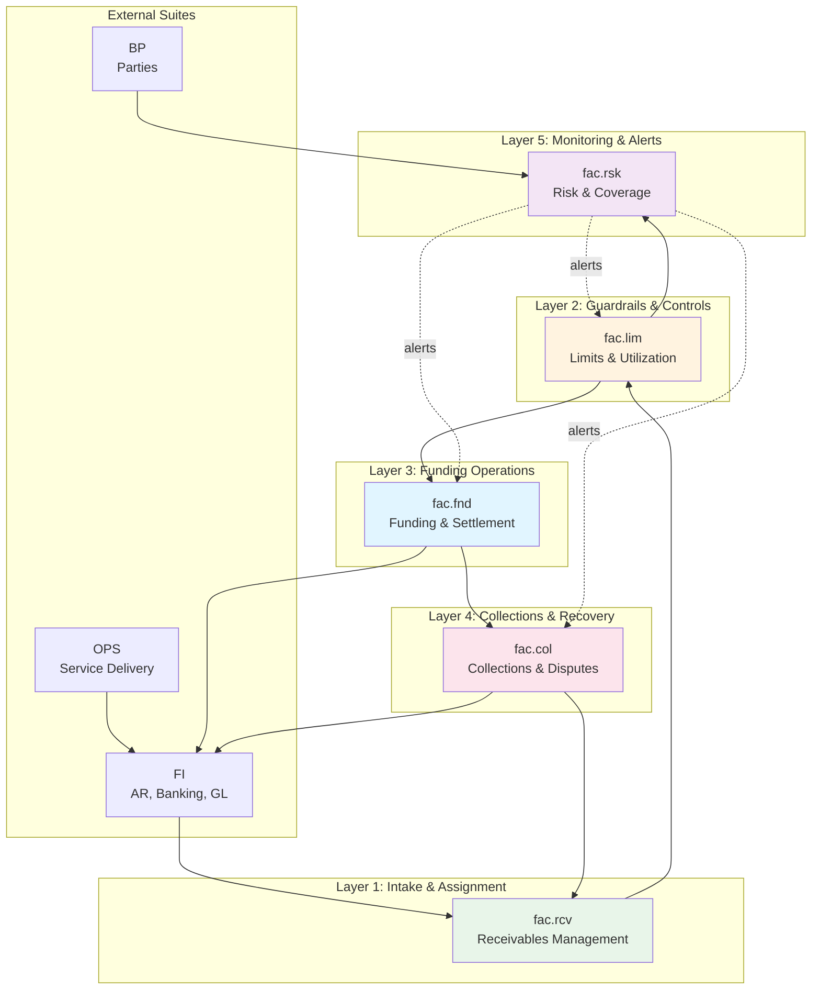
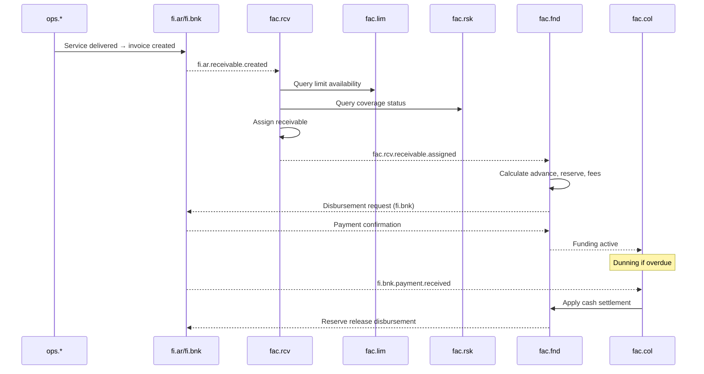
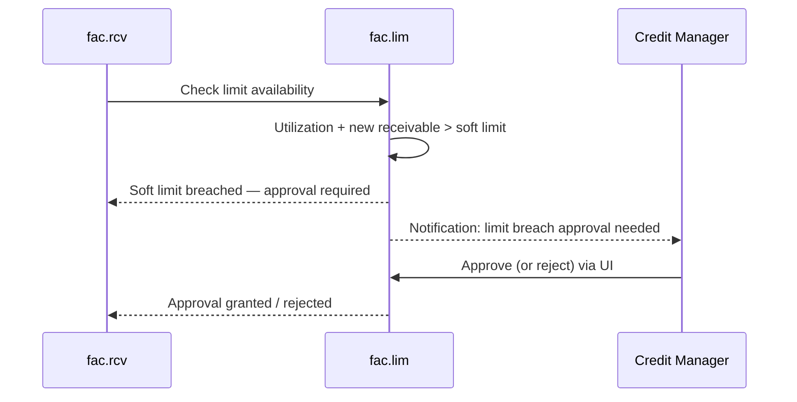
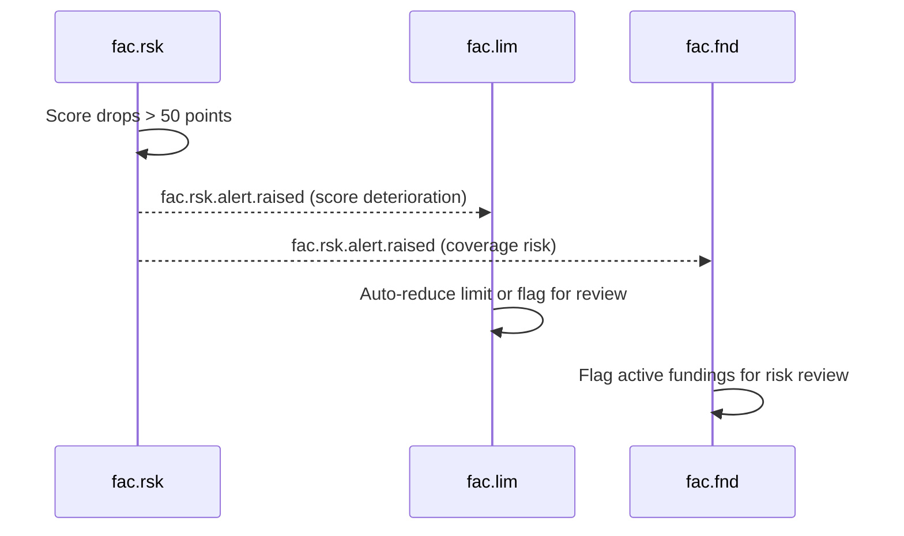

# Factoring (FAC) Suite Specification

> **Conceptual Stack Layer:** Suite
> **Space:** Platform
> **Owner:** FAC Domain Engineering Team
> **Schema alignment:** `suite-layer.schema.json`
> **Companion files:** `fac.catalog.uvl` (referenced in SS6)
> **Contains:** Domain/Service Specs, Platform-Feature Specs, Feature Catalog

> **Meta Information**
> - **Version:** 2026-04-04
> - **Template:** `suite-spec.md` v1.0.0
> - **Template Compliance:** ~97% — fully compliant
> - **Author(s):** Dr. Sören Kemmann, OpenLeap Architecture Team
> - **Status:** DRAFT
> - **Suite ID:** `fac`
> - **Suite Name:** Factoring
> - **Description:** End-to-end service-based receivables financing suite covering receivable intake, funding operations, credit limits, risk scoring, and collections management.
> - **Semantic Version:** `1.2.0`
> - **Team:**
>   - Name: `team-fac`
>   - Email: `fac-team@openleap.io`
>   - Slack: `#fac-team`
> - **Bounded Contexts:** `bc:receivables-financing`, `bc:funding`, `bc:credit-limits`, `bc:risk-coverage`, `bc:collections`

---

## Specification Guidelines

> **This specification MUST comply with the OpenLeap specification guidelines.**
>
> ### Non-Negotiables
> - Never invent facts. If required info is missing, add an **OPEN QUESTION** entry.
> - Preserve intent and decisions. Only change meaning when explicitly requested.
> - Keep the spec **self-contained**: no "see chat", no implicit context.
>
> ### Style Guide
> - Prefer short sentences and lists.
> - Use MUST/SHOULD/MAY for normative statements.
> - Keep terminology consistent with the Ubiquitous Language defined in SS1.

---

## 0. Suite Identity & Purpose

### 0.1 Suite Identity

| Field | Value |
|-------|-------|
| id | `fac` |
| name | Factoring |
| description | End-to-end service-based receivables financing suite covering receivable intake, funding operations, credit limits, risk scoring, and collections management. |
| version | `1.2.0` |
| status | `draft` |
| owner.team | `team-fac` |
| owner.email | `fac-team@openleap.io` |
| owner.slack | `#fac-team` |
| boundedContexts | `bc:receivables-financing`, `bc:funding`, `bc:credit-limits`, `bc:risk-coverage`, `bc:collections` |

### 0.2 Business Purpose

The Factoring (FAC) Suite provides **end-to-end service-based receivables financing** capabilities. It finances receivables that originate from delivered services (consulting, professional services, education, field service) rather than physical goods. The suite manages the complete lifecycle of factored receivables: intake and eligibility validation, advance funding to service providers, credit limit enforcement, risk scoring and insurance coverage, and multi-stage collections from debtors.

**Key architectural principle:**
> Receivable origin is metadata, not the structural foundation of FAC. FAC finances receivables; OPS/SRV/PPS/SD/FI determine how receivables are created.

The golden flow:
```
Service Delivered (OPS) → Billed (FI) → Factored (FAC) → Collected (FAC) → Settled (FI)
```

### 0.3 In Scope

- **Receivable Intake & Assignment:** Ingest receivables from FI.AR, validate eligibility (credit limits, coverage, age, proof), transfer ownership from client to factor
- **Funding Operations:** Calculate advances (80–90%), hold reserves (10–20%), compute fees, accrue interest, orchestrate disbursements via banking, apply payments, release reserves
- **Credit Limits & Guardrails:** Enforce per-debtor, per-client, and portfolio-wide limits; monitor concentration risk; approval workflows for breaches
- **Risk Assessment & Coverage:** Calculate credit scores (PD/LGD/EAD), manage credit insurance coverage, generate risk alerts
- **Collections & Dispute Management:** Multi-stage dunning, cash application, dispute tracking, payment plans, legal escalation
- **Real-time Utilization Tracking:** Aggregate exposure views, concentration monitoring, risk-based limit adjustments
- **Approval Workflows:** Maker-checker for limit breaches and large fundings

### 0.4 Out of Scope

- Service delivery capture and approval (→ OPS Suite)
- Billing and invoice generation (→ FI Suite, fi.bil)
- Accounts receivable master records (→ FI Suite, fi.ar)
- Banking and payment processing (→ FI Suite, fi.bnk)
- General ledger accounting (→ FI Suite, fi.gl)
- Client/debtor master data (→ BP Suite)
- Contract management (→ SD Suite)
- Credit scoring algorithms — external providers (integrated via API, not owned by FAC)
- Insurance underwriting — external insurers (policy data managed in FAC, but underwriting is external)
- Legal collection actions — external collection agencies (escalated from FAC)
- Strategic analytics and BI (→ T4 Analytics Tier)

### 0.5 Target Users

| Role | Interest |
|------|----------|
| Factoring Operations Manager | Receivable intake review, portfolio overview, funding approvals |
| Credit Manager | Limit policy management, breach approvals, concentration monitoring |
| Risk Manager | Score reviews, coverage status, risk alert management |
| Collections Specialist | Dunning execution, cash application, dispute handling |
| Finance Controller | FI integration, accounting postings, period reconciliation |
| Auditor | Assignment trail, funding audit, compliance evidence |
| Service Provider (Client) | Advance disbursement status, reserve release status |

### 0.6 Business Value

- **Liquidity for Service Providers:** Immediate cash flow (80–90% advance within 24–48 hours) instead of waiting 30–90 days
- **Risk Transfer:** Non-recourse factoring transfers credit risk from service provider to factor
- **Revenue for Factoring Company:** Service fees (1–3%), del credere fees (0.5–2%), and interest on outstanding advances
- **Controlled Risk Exposure:** Real-time credit limits and insurance coverage prevent over-exposure
- **Professional Collections:** Standardized dunning improves recovery rates and preserves debtor relationships
- **Audit Compliance:** Full traceability from invoice to receivable assignment to settlement satisfies regulatory requirements

---

## 1. Ubiquitous Language

### 1.1 Glossary

| ID | Term | Aliases | Definition |
|----|------|---------|------------|
| fac:glossary:receivable | Receivable | Factored Receivable | A factored invoice claim registered in FAC with a debtor, amount, due date, and lifecycle status. Not to confuse with fi.ar AR record — FAC Receivable is the factoring-layer view of the same invoice. |
| fac:glossary:assignment | Assignment | Ownership Transfer | The legal and commercial act of transferring receivable ownership from the service provider (client) to the factor. Assignment is irreversible (except for dispute-driven reversal). |
| fac:glossary:funding | Funding | Advance Package | A funding container grouping one or more assigned receivables being financed together, with calculated advance, reserve, fees, and interest. |
| fac:glossary:funding-line | FundingLine | — | A single receivable within a Funding, tracking its individual advance, reserve, fee, and settlement status. |
| fac:glossary:advance | Advance | — | The cash disbursed to the client immediately upon assignment, typically 80–90% of the face value of the receivable. |
| fac:glossary:reserve | Reserve | Holdback | The portion of the receivable value held back until debtor payment is received; released to the client after clearing (typically 10–20%). |
| fac:glossary:del-credere-fee | Del Credere Fee | Non-Recourse Premium | An additional fee for non-recourse factoring that compensates the factor for absorbing the debtor's default risk. |
| fac:glossary:limit-policy | LimitPolicy | Credit Limit Rule | A rule defining maximum exposure for a scope (per debtor, per client, or portfolio-wide) with hard/soft enforcement modes. |
| fac:glossary:utilization | Utilization | Limit Utilization | Real-time aggregated exposure for a given scope (debtor/client/portfolio), calculated from funded and pending receivables. |
| fac:glossary:risk-profile | RiskProfile | Credit Score | A scored view of a debtor's creditworthiness including PD, LGD, EAD, external rating, and internal score (0–1000). |
| fac:glossary:coverage | Coverage | Insurance Coverage | A credit insurance policy that covers a defined percentage of debtor exposure up to a cap, with a deductible. |
| fac:glossary:collection-case | CollectionCase | Dunning Case | A container for managing collection of an overdue receivable through dunning steps, dispute handling, and escalation. |
| fac:glossary:dunning-step | DunningStep | Collection Reminder | A single collection communication (email, letter, SMS, phone, portal) sent at a defined stage (D+0, D+7, D+14, D+30, D+60). |
| fac:glossary:dispute | Dispute | Receivable Dispute | A formal contestation raised by a debtor against a receivable, tracked with reason, evidence references, and resolution outcome. |
| fac:glossary:settlement | Settlement | Cash Application | The recording of a debtor payment against funding lines, applying allocation priority (Fees → Interest → Principal). |
| fac:glossary:pd | PD | Probability of Default | The statistical probability (0–100%) that a debtor will fail to pay within a defined horizon. |
| fac:glossary:lgd | LGD | Loss Given Default | The expected percentage loss (0–100%) of outstanding balance if the debtor defaults. |
| fac:glossary:ead | EAD | Exposure at Default | The estimated outstanding balance at the time of default. |
| fac:glossary:concentration-risk | Concentration Risk | — | The portfolio risk created when a single debtor represents too large a share (configurable; baseline 20%) of the total funded portfolio. |
| fac:glossary:eligibility | Eligibility | — | The set of conditions a receivable must satisfy to be assigned to FAC: credit limit available, insurance coverage active, service proof exists, receivable age within policy. |
| fac:glossary:non-recourse | Non-Recourse | — | A factoring mode where the factor absorbs debtor default risk; the client is not liable if the debtor fails to pay. |
| fac:glossary:recourse | Recourse | — | A factoring mode where the factor can demand repayment from the client if the debtor fails to pay. |

### 1.2 UBL Boundary Test

**FAC vs. FI (Finance):**
In FAC, a `Receivable` is a factoring-layer entity tracking eligibility, assignment, and funding status — it references a FI invoice ID but is FAC's own aggregate. In FI, the same financial claim is an `ARRecord` / `OpenItem` in the accounts receivable subledger (fi.ar), tracking the accounting balance and payment posting. The same invoice produces two distinct objects in two different suites with different lifecycles and owners.

**FAC vs. OPS/SRV:**
In FAC, a service proof is a read-only reference (`serviceDeliveryRef`) used to validate eligibility. In OPS/SRV, the service delivery is the operational aggregate with time tracking, sign-off, and execution status. FAC consumes proof references but never owns service data.

---

## 2. FAC Domain Architecture

### 2.1 Five-Layer Architecture

The FAC Suite follows a specialized five-layer architecture optimized for receivables financing:



### 2.2 Domain Responsibilities Summary

| Domain | Layer | Key Responsibility | Key Aggregates |
|--------|-------|-------------------|----------------|
| `fac.rcv` | 1 — Intake | Receivable lifecycle, assignment gateway | Receivable, Assignment |
| `fac.lim` | 2 — Guardrails | Credit limit enforcement, utilization tracking | LimitPolicy, Utilization, Breach |
| `fac.fnd` | 3 — Funding | Cash advances, fees, interest, settlement | Funding, FundingLine, Disbursement |
| `fac.col` | 4 — Collections | Dunning, cash application, dispute resolution | CollectionCase, DunningStep, Dispute |
| `fac.rsk` | 5 — Risk | Credit scoring, insurance coverage, risk alerts | RiskProfile, Coverage, Alert |

---

## 3. FAC Domain Catalog

### 3.1 Complete Domain List

| # | Domain | Service ID | Purpose | Status |
|---|--------|-----------|---------|--------|
| 1 | **fac.rcv** | `fac-rcv-svc` | Receivable intake, eligibility validation, ownership transfer | P1 Core |
| 2 | **fac.fnd** | `fac-fnd-svc` | Advance funding, fees, interest accrual, settlement, disbursements | P1 Core |
| 3 | **fac.lim** | `fac-lim-svc` | Credit limit policies, real-time utilization, breach approvals | P1 Core |
| 4 | **fac.rsk** | `fac-rsk-svc` | Credit scoring, PD/LGD/EAD, insurance coverage, risk alerts | P1 Core |
| 5 | **fac.col** | `fac-col-svc` | Multi-stage dunning, cash application, dispute management, payment plans | P1 Core |

All 5 domains are **mandatory** — FAC only works as a complete system.

### 3.2 API Base Paths

| Domain | Base Path | Port |
|--------|-----------|------|
| fac.rcv | `/api/fac/rcv/v1` | 8201 |
| fac.fnd | `/api/fac/fnd/v1` | 8202 |
| fac.lim | `/api/fac/lim/v1` | 8203 |
| fac.rsk | `/api/fac/rsk/v1` | 8204 |
| fac.col | `/api/fac/col/v1` | 8205 |

### 3.3 Domain Detail Specs

| Domain | Spec File |
|--------|-----------|
| fac.rcv | `domain-specs/fac_rcv-spec.md` |
| fac.fnd | `domain-specs/fac_fnd-spec.md` |
| fac.lim | `domain-specs/fac_lim-spec.md` |
| fac.rsk | `domain-specs/fac_rsk-spec.md` |
| fac.col | `domain-specs/fac_col-spec.md` |

---

## 4. Cross-Domain Integration Patterns

### 4.1 Event-Driven Communication

**Primary Pattern:** Event-Driven Architecture (Choreography) with domain events.

**Event Exchange:** `fac.{domain}.events` (per-domain topics)

| Domain | Exchange | Key Events |
|--------|----------|-----------|
| fac.rcv | `fac.rcv.events` | `receivable.created`, `receivable.assigned`, `receivable.rejected`, `receivable.closed` |
| fac.fnd | `fac.fnd.events` | `funding.created`, `funding.activated`, `disbursement.requested`, `settlement.recorded`, `funding.closed` |
| fac.lim | `fac.lim.events` | `utilization.changed`, `limit.breached`, `limit.approved`, `limit.uplifted` |
| fac.rsk | `fac.rsk.events` | `score.updated`, `coverage.updated`, `coverage.dropped`, `alert.raised` |
| fac.col | `fac.col.events` | `case.opened`, `case.resolved`, `case.escalated`, `dunning.step.sent`, `cash.applied` |

**Event Envelope Standard:**
```json
{
  "eventId": "uuid",
  "occurredAt": "ISO-8601",
  "tenantId": "uuid",
  "traceId": "uuid",
  "correlationId": "uuid",
  "causationId": "uuid",
  "aggregateType": "fac.rcv.Receivable",
  "aggregateId": "uuid",
  "eventType": "assigned",
  "payload": { }
}
```

### 4.2 Key Integration Flows

#### Flow 1: Service-to-Cash (End-to-End Factoring)



#### Flow 2: Limit Breach Approval



#### Flow 3: Risk Alert → Limit Adjustment



### 4.3 Inbound Events from External Suites

| Source | Event | Consumer |
|--------|-------|----------|
| fi.ar | `fi.ar.receivable.created` | fac.rcv |
| fi.bnk | `fi.bnk.payment.received` | fac.col, fac.fnd |
| bp | `bp.party.updated` (credit data) | fac.rsk |
| ops.* / srv.* | service proof references (query) | fac.rcv |

---

## 5. Event Conventions

### 5.1 Routing Key Pattern

```
fac.{domain}.{aggregate}.{event}
```

Examples:
- `fac.rcv.receivable.assigned`
- `fac.fnd.disbursement.requested`
- `fac.lim.limit.breached`
- `fac.rsk.score.updated`
- `fac.col.case.opened`

### 5.2 Event Schema Location

Event JSON schemas are in `contracts/events/fac/{domain}/{aggregate}.{event}.schema.json`.

### 5.3 At-Least-Once Delivery

All FAC events follow at-least-once delivery with idempotent consumers (duplicate detection via `eventId`).

---

## 6. Feature Catalog

Full catalog in `fac.catalog.uvl`. Feature compositions in `features/compositions/`.

| Feature ID | Name | Type | Domain Coverage | Leaf Count |
|------------|------|------|-----------------|------------|
| F-FAC-001 | Receivables Management | COMPOSITION | fac.rcv | 3 leaves |
| F-FAC-002 | Funding & Settlement | COMPOSITION | fac.fnd | 3 leaves |
| F-FAC-003 | Collections & Risk | COMPOSITION | fac.col, fac.lim, fac.rsk | 3 leaves |

### 6.1 F-FAC-001: Receivables Management

Covers receivable intake, eligibility validation, and assignment lifecycle.

**Leaves:**
- `F-FAC-001-01`: Receivable Intake & Worklist
- `F-FAC-001-02`: Eligibility Validation & Assignment
- `F-FAC-001-03`: Receivable Lifecycle Tracking

### 6.2 F-FAC-002: Funding & Settlement

Covers advance calculation, disbursement, interest accrual, and settlement.

**Leaves:**
- `F-FAC-002-01`: Funding Creation & Advance Calculation
- `F-FAC-002-02`: Disbursement Tracking
- `F-FAC-002-03`: Settlement & Reserve Release

### 6.3 F-FAC-003: Collections & Risk

Covers dunning, cash application, dispute management, credit scoring, limit management.

**Leaves:**
- `F-FAC-003-01`: Dunning & Collection Cases
- `F-FAC-003-02`: Credit Limit Management
- `F-FAC-003-03`: Risk Scoring & Coverage

---

## 7. Cross-Cutting Concerns

### 7.1 Multi-Tenancy

All FAC aggregates include `tenantId`. Row-Level Security (RLS) in PostgreSQL enforces tenant isolation. Tenant context propagated via JWT claim.

### 7.2 Audit Trail

All state transitions recorded as append-only domain events (event sourcing for audit trail). Every assignment, funding, settlement, and collection action has a traceable `causationId` and `correlationId`.

### 7.3 Approval Workflows

Maker-checker approval for:
- Limit breach > 10% of policy limit
- Any concentration breach
- Funding disbursement > configurable threshold (OPEN QUESTION: amount)
- Write-offs from dispute resolution

### 7.4 Data Architecture Principles

- **Command/Query Separation:** Write models optimized for consistency; read models for query performance.
- **Outbox Pattern:** All domain events published via transactional outbox to guarantee at-least-once delivery.
- **Dual-Key Pattern:** Internal `OlUuid` + external reference (invoice ID, debtor ID) for all aggregates.
- **Soft Delete:** No hard deletes; records cancelled with status + reason.

---

## 8. External Interfaces

### 8.1 Inbound Integrations

| Source System | Protocol | Purpose |
|---------------|----------|---------|
| fi.ar | Event (RabbitMQ) | Receivable creation/update signals |
| fi.bnk | Event (RabbitMQ) | Payment received signals |
| bp | Event (RabbitMQ) | Party (client/debtor) update signals |
| Credit Bureaus | REST (webhook) | External credit score updates |
| External Insurers | REST (webhook) | Coverage policy updates |
| ops.* / srv.* | REST (query) | Service proof reference validation |

### 8.2 Outbound Integrations

| Target System | Protocol | Purpose |
|---------------|----------|---------|
| fi.bnk | Event (RabbitMQ) | Disbursement requests (pain.001) |
| fi.gl | Event (RabbitMQ) | Accounting journal entries |
| DMS | REST | Dispute evidence storage/retrieval |
| External Collection Agencies | REST | Legal escalation handoff |
| Notification Service | Event | Dunning communications (email/SMS) |

---

## 9. Architecture Decisions

### ADR-FAC-001: All 5 FAC domains are mandatory (no optional domains)

**Status:** Accepted  
**Context:** FAC's risk model requires all guardrail layers (limits, risk) to be active before funding. The funding engine cannot run without limit checks and risk scores.  
**Decision:** All 5 FAC domains are P1 mandatory — FAC Suite is only deployed as a complete system.  
**Consequences:** Higher initial implementation cost; lower operational risk.

### ADR-FAC-002: Receivable origin is metadata, not structural foundation

**Status:** Accepted  
**Context:** FAC was initially designed for service-based factoring only.  
**Decision:** FAC is generic — receivable origin (service, goods, invoice) is stored as metadata. Domain decomposition does not change for different receivable types.  
**Consequences:** FAC can support invoice discounting, reverse factoring, and BNPL in future phases without structural changes.

### ADR-FAC-003: FAC does not post directly to GL — uses fi.slc posting rules

**Status:** Accepted  
**Context:** Direct GL posting would create tight coupling between FAC and FI.  
**Decision:** FAC publishes accounting events consumed by fi.slc, which applies posting rules to produce GL journals.  
**Consequences:** FAC remains decoupled from accounting logic; FI owns all GL postings.

### ADR-FAC-004: Event-driven choreography within FAC, not orchestration

**Status:** Accepted  
**Context:** FAC domains (rcv → lim → fnd → col) have clear sequential dependencies.  
**Decision:** Use event-driven choreography for inter-domain communication. No central orchestrator within FAC.  
**Consequences:** Each domain is independently deployable; failure isolation between domains. Trade-off: distributed transaction visibility requires event tracing.

### ADR-FAC-005: Non-recourse factoring covered by del credere fee, not a separate domain

**Status:** Accepted  
**Context:** Non-recourse vs. recourse factoring could be modeled as separate products.  
**Decision:** Non-recourse is modeled as a policy flag on `FundingPolicy` + `del credere fee` calculation in fac.fnd + coverage management in fac.rsk. No separate domain.  
**Consequences:** Simpler domain model; funding policy drives recourse mode.

---

## 10. Implementation Roadmap

### Phase 1 (Weeks 1–12): Core Factoring
- fac.rcv: Receivable intake, assignment, lifecycle
- fac.lim: Credit limits, utilization tracking
- fac.fnd: Advance calculation, disbursement, settlement
- FI integration: Disbursement (fi.bnk) + accounting events (fi.slc)

### Phase 2 (Weeks 13–20): Risk & Collections
- fac.rsk: Credit scoring, coverage management, alerts
- fac.col: Dunning, cash application, dispute management
- BP integration: Party updates triggering rescoring
- External credit bureau webhook integration

### Phase 3 (Weeks 21–24): Advanced Features
- Multi-currency funding
- Payment plan management
- Legal escalation to external agencies
- T4 Analytics integration (portfolio reporting, KPIs)

---

## 11. Open Questions

| ID | Question | Owner | Priority |
|----|----------|-------|----------|
| OQ-FAC-001 | Exact upstream event names and payload contract from `fi.ar` | FI Team | HIGH |
| OQ-FAC-002 | Is receivable ingestion event-only or also synchronous API-driven? | Architecture | MEDIUM |
| OQ-FAC-003 | Dispute-driven ownership reversal: allowed and under what conditions? | Business | HIGH |
| OQ-FAC-004 | Which operational suite is authoritative for service proof: `ops.*` or `srv.*`? | Architecture | HIGH |
| OQ-FAC-005 | Disbursement threshold above which maker-checker approval is required | Business | MEDIUM |
| OQ-FAC-006 | Maximum advance disbursement batch size and scheduling (daily vs. real-time) | Operations | LOW |
| OQ-FAC-007 | External credit bureau API integration details (provider selection, rate limits) | Tech | LOW |
