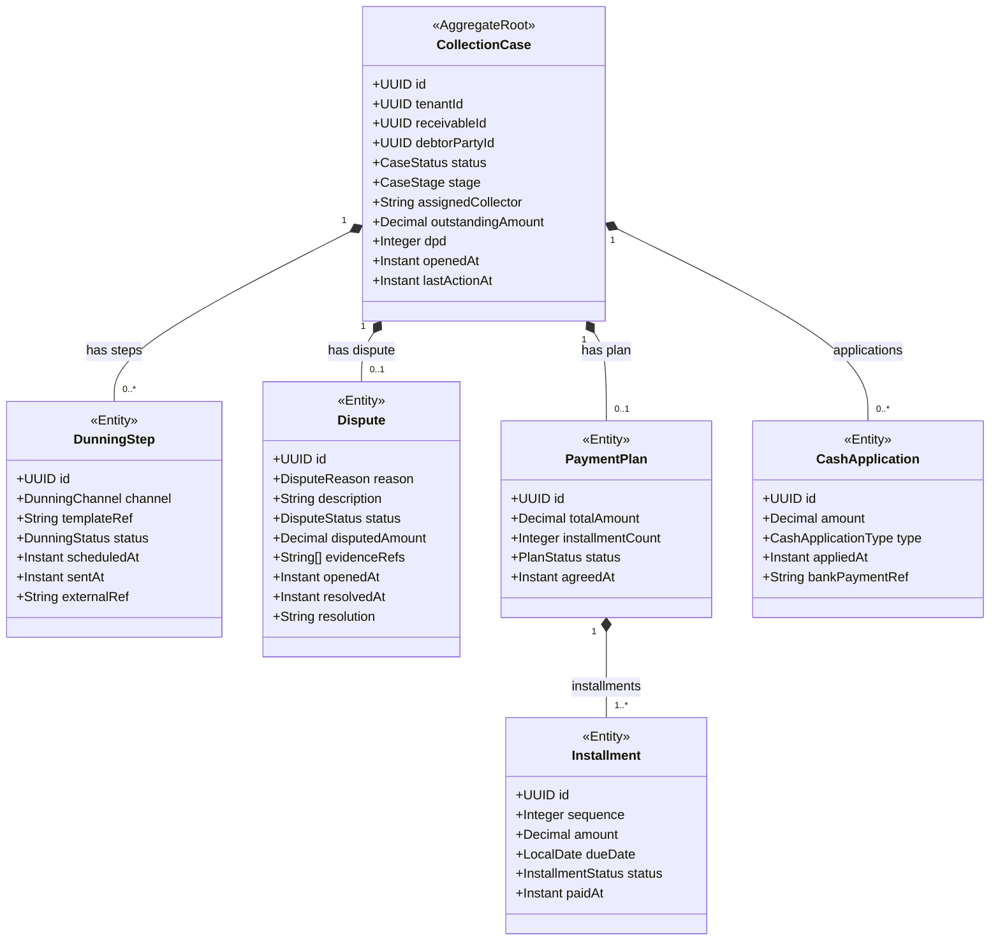

# FAC - Collections & Disputes (col) Domain / Service Specification

> **Conceptual Stack Layer:** Domain / Service
> **Space:** Platform
> **Owner:** FAC Domain Engineering Team
> **Schema alignment:** `service-layer.schema.json`
> **Companion files:** `contracts/http/fac/col/openapi.yaml`, `contracts/events/fac/col/*.schema.json`
> **Belongs to:** FAC Suite Spec (`_fac_suite.md`)

> **Meta Information**
> - **Version:** 2026-04-04
> - **Template:** `domain-service-spec.md` v1.0.0
> - **Template Compliance:** ~92%
> - **Author(s):** OpenLeap Architecture Team
> - **Status:** DRAFT
> - **Suite:** `fac`
> - **Domain:** `col`
> - **Bounded Context Ref:** `bc:collections`
> - **Service ID:** `fac-col-svc`
> - **basePackage:** `io.openleap.fac.col`
> - **API Base Path:** `/api/fac/col/v1`
> - **Port:** `8205`
> - **Repository:** `io.openleap.fac.col`
> - **Tags:** `factoring`, `collections`, `dunning`, `disputes`, `cash-application`

---

## 0. Document Purpose & Scope

### 0.1 Purpose

`fac.col` manages **collections and dispute resolution** for factored receivables. It executes multi-stage dunning campaigns, applies incoming cash to receivables, handles short/over payments, tracks disputes with evidence management, manages payment plans, and escalates unresolved cases to external agencies.

### 0.2 Scope

**In Scope (MUST):**
- Open and manage CollectionCases for overdue receivables
- Execute multi-stage dunning (D+0, D+7, D+14, D+30, D+60)
- Multi-channel communications (email, letter, SMS, phone, portal)
- Cash application (match debtor payments to receivables/fundings)
- Short-pay and over-pay handling
- Dispute tracking with reason categorization and evidence references (DMS)
- Payment plans (installment agreements with debtors)
- Legal escalation workflows to external agencies
- KPI reporting for collections performance

**Out of Scope (MUST NOT):**
- Create or assign receivables (→ fac.rcv)
- Calculate advance/reserve/interest accrual (→ fac.fnd)
- Post accounting entries as system of record (→ fi suite)
- Underwrite credit insurance (→ fac.rsk)

---

## 1. Business Context

### 1.1 Domain Purpose

"Professional Recovery." `fac.col` maximizes cash recovery from overdue receivables while maintaining productive debtor relationships through professional, escalating collection processes.

### 1.2 Business Value

- Standardized dunning policies reduce manual collection overhead by 70%+
- Evidence-backed dispute resolution reduces write-offs
- Payment plans improve recovery vs. legal action in ~60% of cases
- Structured escalation path ensures DPD > 90 cases are promptly escalated

### 1.3 Stakeholders

| Role | Responsibility |
|------|----------------|
| Collections Specialist | Execute dunning, manage cases, negotiate payment plans |
| Dispute Manager | Handle formal disputes, collect evidence, decide outcomes |
| Finance Controller | Cash application reconciliation, write-off approval |
| Factoring Operations | Monitor portfolio delinquency, KPI review |

---

## 2. Service Identity

| Property | Value |
|----------|-------|
| **Service ID** | `fac-col-svc` |
| **Suite** | `fac` |
| **Domain** | `col` |
| **Bounded Context** | `bc:collections` |
| **API Base Path** | `/api/fac/col/v1` |
| **Port** | `8205` |

---

## 3. Domain Model

### 3.1 Aggregate Overview



### 3.2 CaseStatus State Machine

```
OPEN → IN_PROGRESS → RESOLVED
OPEN|IN_PROGRESS → ESCALATED (legal/agency)
OPEN|IN_PROGRESS → DISPUTED
DISPUTED → IN_PROGRESS (dispute resolved)
ESCALATED → RESOLVED (agency recovers)
ESCALATED → WRITTEN_OFF
```

### 3.3 CaseStage (Dunning Escalation)

| Stage | Trigger | Action |
|-------|---------|--------|
| D+0 | Receivable becomes overdue | Friendly reminder |
| D+7 | 7 days past due | First escalation |
| D+14 | 14 days past due | Second escalation |
| D+30 | 30 days past due | Final notice |
| D+60 | 60 days past due | Legal referral / external agency |

---

## 4. Business Rules & Constraints

| ID | Rule | Severity |
|----|------|----------|
| BR-COL-001 | CollectionCase MUST be opened automatically when receivable DPD > 0 | HARD |
| BR-COL-002 | Dunning stages MUST be escalated per schedule (D+0/7/14/30/60) unless paused by dispute or plan | HARD |
| BR-COL-003 | Payment allocation priority: Fees → Interest → Principal (oldest receivable first) | HARD |
| BR-COL-004 | Short pay tolerance: If payment ≥ 95% of outstanding, accept and close | SOFT |
| BR-COL-005 | Over pay MUST create credit memo; surplus returned or applied to next receivable | HARD |
| BR-COL-006 | Dispute MUST pause dunning steps until resolved | HARD |
| BR-COL-007 | Payment plan MUST not exceed 12 installments; fees/interest paid first | HARD |
| BR-COL-008 | Escalation to legal/agency: MUST require DPD > 90 AND outstanding amount > €5,000 (configurable) | HARD |
| BR-COL-009 | Cash application MUST be idempotent (bank payment ref as idempotency key) | HARD |
| BR-COL-010 | Write-off MUST require dual approval (maker-checker) | HARD |

---

## 5. Use Cases

### UC-COL-001: Open Collection Case on Overdue Receivable

**Trigger:** `fac.fnd.funding.activated` + receivable DPD > 0 (scheduled daily check)
**Flow:**
1. Check all FUNDED receivables for DPD > 0
2. If no active case exists: open CollectionCase
3. Stage = D+0; schedule first dunning step
4. Assign to collections team (round-robin or rule-based)
5. Emit `fac.col.case.opened`

### UC-COL-002: Execute Dunning Step

**Trigger:** Scheduled job or manual trigger
**Flow:**
1. Load scheduled DunningStep (channel, template)
2. Render template with receivable data
3. Send via channel (email service, SMS gateway, letter queue)
4. Record delivery status and external reference
5. Schedule next dunning step per stage schedule
6. Emit `fac.col.dunning.step.sent`

### UC-COL-003: Apply Cash Payment

**Trigger:** `fi.bnk.payment.received` event
**Flow:**
1. Match payment to debtor (debtorPartyId + amount + reference)
2. Identify matching CollectionCase(s)
3. Allocate by priority: Fees → Interest → Principal
4. Record CashApplication
5. Notify fac.fnd (settle funding lines)
6. If fully paid: resolve case
7. Emit `fac.col.cash.applied`

### UC-COL-004: Open and Manage Dispute

**Trigger:** `POST /cases/{id}/disputes`
**Flow:**
1. Create Dispute with reason, description, disputed amount
2. Pause all pending dunning steps for this case
3. Notify disputing debtor (acknowledgement)
4. Collections Specialist uploads evidence to DMS; records DMS refs
5. Dispute resolved: close with outcome (accept/partial/reject)
6. If rejected: resume dunning; if accepted: adjust or write off
7. Emit `fac.col.dispute.resolved`

### UC-COL-005: Setup Payment Plan

**Trigger:** `POST /cases/{id}/payment-plans`
**Flow:**
1. Verify debtor eligibility (no active dispute, first-time plan or credit manager approval)
2. Create PaymentPlan with N installments (max 12)
3. Fees/interest MUST be included in first installments
4. Pause regular dunning; generate installment reminders
5. Track adherence: missed installment → resume dunning
6. Emit `fac.col.payment-plan.created`

### UC-COL-006: Escalate to External Agency

**Trigger:** DPD > 90 AND amount > threshold (configurable)
**Flow:**
1. Credit Manager approves escalation
2. Transfer case data to external agency via integration
3. Update case status to ESCALATED
4. Continue to track agency recovery updates
5. Emit `fac.col.case.escalated`

---

## 6. REST API

**Base Path:** `/api/fac/col/v1`

| Method | Path | Description |
|--------|------|-------------|
| GET | `/cases` | List collection cases |
| GET | `/cases/{id}` | Case detail |
| GET | `/cases/{id}/dunning-steps` | Dunning history |
| POST | `/cases/{id}/dunning-steps` | Manually trigger dunning step |
| POST | `/cases/{id}/disputes` | Open dispute |
| PATCH | `/cases/{id}/disputes/{dId}` | Update dispute |
| POST | `/cases/{id}/disputes/{dId}:resolve` | Resolve dispute |
| POST | `/cases/{id}/payment-plans` | Create payment plan |
| GET | `/cases/{id}/payment-plans/{pId}` | Payment plan detail |
| POST | `/cases/{id}:escalate` | Escalate to agency |
| POST | `/cases/{id}:write-off` | Write off (dual approval) |
| GET | `/kpis` | Collections KPI summary |

---

## 7. Events & Integration

### 7.1 Outbound Events

| Event | Routing Key | Key Payload |
|-------|-------------|-------------|
| case.opened | `fac.col.case.opened` | caseId, receivableId, debtorPartyId, dpd |
| case.resolved | `fac.col.case.resolved` | caseId, resolution |
| case.escalated | `fac.col.case.escalated` | caseId, agencyRef |
| dunning.step.sent | `fac.col.dunning.step.sent` | caseId, stage, channel |
| cash.applied | `fac.col.cash.applied` | caseId, amount, appliedBreakdown |
| dispute.opened | `fac.col.dispute.opened` | caseId, disputeId, reason |
| dispute.resolved | `fac.col.dispute.resolved` | caseId, disputeId, outcome |
| payment-plan.created | `fac.col.payment-plan.created` | caseId, planId, installmentCount |

### 7.2 Inbound Events

| Source | Event | Action |
|--------|-------|--------|
| fac.fnd | `fac.fnd.funding.activated` | Monitor for overdue (daily DPD check) |
| fi.bnk | `fi.bnk.payment.received` | Apply cash (UC-COL-003) |
| fac.rcv | `fac.rcv.receivable.disputed` | Coordinate with case dispute status |

---

## 8. Data Model

### 8.1 Tables (prefix: `col_`)

**`col_collection_case`** — Case container  
**`col_dunning_step`** — Individual dunning actions  
**`col_dispute`** — Formal disputes  
**`col_payment_plan`** — Installment agreements  
**`col_installment`** — Individual installment records  
**`col_cash_application`** — Payment allocations  
**`col_escalation`** — External agency escalation records  

All tables include `tenant_id UUID NOT NULL` with RLS.

**Key Indexes:**
- `(tenant_id, status, dpd)` — operational worklist query
- `(tenant_id, debtor_party_id)` — debtor view
- `(col_cash_application, bank_payment_ref)` UNIQUE — idempotency

---

## 9. Security & Compliance

| Role | Permissions |
|------|-------------|
| `FAC_COL_VIEWER` | Read cases, dunning steps, disputes |
| `FAC_COL_EDITOR` | Execute dunning, manage disputes, create plans |
| `FAC_COL_APPROVER` | Approve write-offs, authorize escalation |
| `FAC_COL_ADMIN` | All permissions |

- Dispute evidence: stored in DMS (GDPR-compliant); FAC stores only DMS reference IDs
- Collections communications: archived for regulatory compliance

---

## 10. Quality Attributes

- Dunning step scheduling: MUST trigger within 1 hour of stage threshold crossing
- Cash application: SHOULD complete within 30 seconds of payment event
- Dispute acknowledgement: MUST send to debtor within 4 business hours
- Case worklist: SHOULD load < 500ms for 10,000 open cases

---

## 11. Feature Dependencies

| Feature | Dependency |
|---------|-----------|
| F-FAC-003-01 (Dunning & Collections) | Requires notification service (email, SMS, letter) |
| F-FAC-003-01 | Requires DMS for evidence storage |

---

## 12. Extension Points

- **AI-assisted dispute classification:** ML model classifies dispute reasons and suggests resolution
- **Debtor portal:** Self-service portal for debtors to view invoices, raise disputes, set up payment plans
- **Multi-language dunning templates:** Template localization for international debtors

---

## 13. Migration & Evolution

- v1.0.0: Email/letter/SMS dunning, manual cash application, basic disputes
- v2.0.0: Debtor portal, AI dispute classification, advanced payment plan management

---

## 14. Decisions & Open Questions

### Decisions
- **DEC-COL-001:** Cash application via event from fi.bnk (not direct bank polling)
- **DEC-COL-002:** Evidence stored in DMS (not in fac.col) — only DMS reference IDs stored
- **DEC-COL-003:** Short pay tolerance 5% configurable per client policy

### Open Questions
- **OQ-COL-001:** Which notification service is used for dunning communications?
- **OQ-COL-002:** External agency integration API contract (varies by country/agency)
- **OQ-COL-003:** Escalation thresholds (DPD days, amount) — configurable per product or global?

---

## 15. Appendix

### 15.1 DisputeReason Reference

| Code | Description |
|------|-------------|
| SERVICE_QUALITY | Service not delivered as agreed |
| PRICING_DISCREPANCY | Invoiced amount differs from agreed price |
| QUANTITY_DISCREPANCY | Invoiced quantity differs from delivered |
| DUPLICATE_INVOICE | Invoice already paid under another reference |
| NOT_ORDERED | Service was not ordered by the debtor |
| EARLY_PAYMENT | Already paid before factoring assignment |
| OTHER | Other reason (free text required) |

### 15.2 Collections KPI Definitions

| KPI | Definition |
|-----|-----------|
| DSO | Days Sales Outstanding — weighted average collection days |
| Recovery Rate | Collected / Total Outstanding × 100% |
| Dispute Rate | Disputed receivables / Total receivables × 100% |
| Escalation Rate | Cases escalated to legal/agency / Total cases × 100% |
| Plan Adherence | On-time installment payments / Total installments × 100% |
