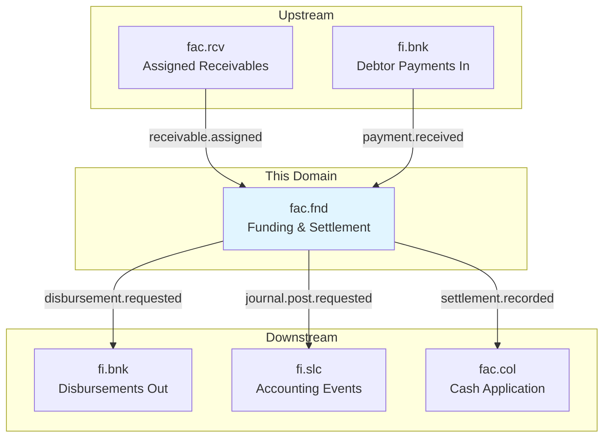
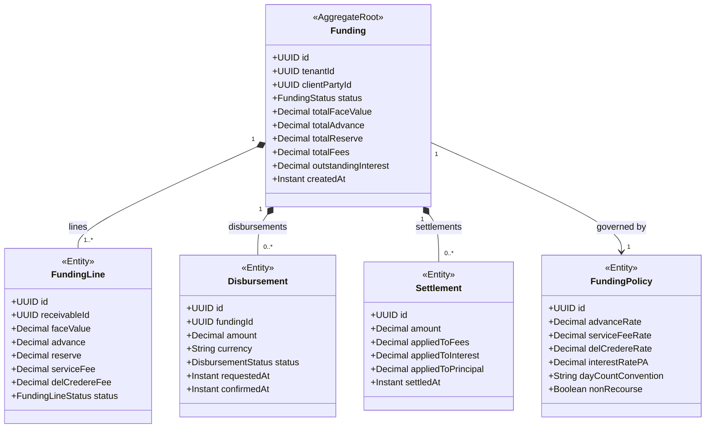

# FAC - Funding & Settlement (fnd) Domain / Service Specification

> **Conceptual Stack Layer:** Domain / Service
> **Space:** Platform
> **Owner:** FAC Domain Engineering Team
> **Schema alignment:** `service-layer.schema.json`
> **Companion files:** `contracts/http/fac/fnd/openapi.yaml`, `contracts/events/fac/fnd/*.schema.json`
> **Belongs to:** FAC Suite Spec (`_fac_suite.md`)

> **Meta Information**
> - **Version:** 2026-04-04
> - **Template:** `domain-service-spec.md` v1.0.0
> - **Template Compliance:** ~92%
> - **Author(s):** OpenLeap Architecture Team
> - **Status:** DRAFT
> - **Suite:** `fac`
> - **Domain:** `fnd`
> - **Bounded Context Ref:** `bc:funding`
> - **Service ID:** `fac-fnd-svc`
> - **basePackage:** `io.openleap.fac.fnd`
> - **API Base Path:** `/api/fac/fnd/v1`
> - **Port:** `8202`
> - **Repository:** `io.openleap.fac.fnd`
> - **Tags:** `factoring`, `funding`, `advance`, `settlement`, `disbursement`

---

## Specification Guidelines Compliance

> ### Non-Negotiables
> - Never invent facts. If required info is missing, add an **OPEN QUESTION** entry.
> - Use MUST/SHOULD/MAY for normative statements.

---

## 0. Document Purpose & Scope

### 0.1 Purpose

`fac.fnd` is the **cash engine of factoring**. It groups assigned receivables into fundings, calculates advances and reserves, computes fees and interest, orchestrates disbursements via banking, applies incoming debtor payments, releases reserves, and produces accounting events for GL posting.

### 0.2 Target Audience
- Factoring Operations (funding management)
- Finance Controllers (accounting integration)
- System Architects & Integration Engineers
- Auditors (funding trail)

### 0.3 Scope

**In Scope (MUST):**
- Create Fundings from assigned receivables (received via events from fac.rcv)
- Calculate advances (80–90% of face value), reserves (10–20%), fees (service fee, del credere), interest (daily accrual)
- Orchestrate advance disbursements to clients via fi.bnk
- Apply incoming debtor payments against funding lines (settlement)
- Release reserves upon full settlement
- Produce accounting events for fi.slc (GL posting)
- Close fundings when all lines are settled

**Out of Scope (MUST NOT):**
- Validate eligibility or manage receivable assignment (→ fac.rcv)
- Manage credit limit policies (→ fac.lim)
- Execute dunning or dispute resolution (→ fac.col)
- Post GL journals directly (→ fi.slc handles account determination)
- Execute bank payments directly (→ fi.bnk)

### 0.4 Related Documents
- Suite: `_fac_suite.md`
- Neighbors: `fac_rcv-spec.md`, `fac_lim-spec.md`, `fac_col-spec.md`

---

## 1. Business Context

### 1.1 Domain Purpose

`fac.fnd` ensures that every euro in the factoring portfolio is traced from advance disbursement to final settlement with a complete audit trail. It implements the "Follow the Money" principle: every financial movement is recorded with causation and correlation IDs.

### 1.2 Business Value

- **Client Liquidity:** Advance disbursement within 24–48 hours of receivable assignment
- **Revenue Tracking:** Fee and interest calculation drives factoring company revenue
- **Cash Optimization:** Reserve release timing management
- **Accounting Accuracy:** Automated posting rules produce correct GL entries without manual journals
- **Portfolio Transparency:** Real-time view of outstanding advances, reserves, and expected settlements

### 1.3 Key Stakeholders

| Role | Responsibility | Use Cases |
|------|----------------|-----------|
| Factoring Operations | Fund management | Create fundings, track disbursements, monitor settlements |
| Finance Controller | Accounting integration | Review accounting events, period reconciliation |
| Treasury Manager | Disbursement execution | Approve/monitor payment batches |
| Auditor | Financial audit | Trace advance to settlement to GL |

### 1.4 Strategic Positioning



---

## 2. Service Identity

| Property | Value |
|----------|-------|
| **Service ID** | `fac-fnd-svc` |
| **Suite** | `fac` |
| **Domain** | `fnd` |
| **Bounded Context** | `bc:funding` |
| **Version** | `1.0.0` |
| **API Base Path** | `/api/fac/fnd/v1` |
| **Repository** | `io.openleap.fac.fnd` |
| **Port** | `8202` |

---

## 3. Domain Model

### 3.1 Aggregate Overview



### 3.2 FundingStatus State Machine

```
DRAFT → ACTIVE → PARTLY_SETTLED → CLOSED
ACTIVE → DISPUTED (if receivable disputed)
```

### 3.3 Payment Allocation Priority

All incoming payments allocated in this order:
1. **Fees** (service fee + del credere)
2. **Accrued Interest**
3. **Principal** (advance outstanding)
4. **Reserve Release** (after full principal cleared)

---

## 4. Business Rules & Constraints

| ID | Rule | Severity |
|----|------|----------|
| BR-FND-001 | Funding MUST be created only for receivables in ASSIGNED status | HARD |
| BR-FND-002 | Advance rate MUST be taken from FundingPolicy (default 80%; configurable per client) | HARD |
| BR-FND-003 | Interest MUST accrue daily on outstanding advance balance (ACT/360 or ACT/365 per FundingPolicy) | HARD |
| BR-FND-004 | Payment allocation priority MUST follow: Fees → Interest → Principal → Reserve | HARD |
| BR-FND-005 | Reserve MUST NOT be released until all fees and interest are cleared | HARD |
| BR-FND-006 | Funding MUST NOT be closed if any FundingLine has outstanding balance | HARD |
| BR-FND-007 | Disbursement MUST be submitted via fi.bnk (ISO 20022 pain.001 format) | HARD |
| BR-FND-008 | Every financial movement MUST produce an accounting event to fi.slc | HARD |
| BR-FND-009 | Short pay tolerance: If payment within 5% of outstanding, accept and close | SOFT |
| BR-FND-010 | Large disbursements (> configurable threshold) MUST require maker-checker approval | HARD |

---

## 5. Use Cases

### UC-FND-001: Create Funding from Assigned Receivables

**Trigger:** `fac.rcv.receivable.assigned` event
**Flow:**
1. Consume event; load FundingPolicy for client
2. Calculate advance = faceValue × advanceRate
3. Calculate fees (service fee, del credere if non-recourse)
4. Create Funding aggregate with FundingLine
5. Transition to ACTIVE
6. Emit `fac.fnd.funding.created`

### UC-FND-002: Disburse Advance to Client

**Trigger:** Funding transitions to ACTIVE
**Flow:**
1. Create Disbursement record
2. Publish `fac.fnd.disbursement.requested` → fi.bnk
3. Await `fi.bnk.payment.executed` confirmation
4. Confirm disbursement; emit `fac.fnd.disbursement.confirmed`
5. Produce accounting event: debit Advance Account / credit Bank Account (fi.slc)

### UC-FND-003: Accrue Daily Interest

**Trigger:** Scheduled job (daily midnight)
**Flow:**
1. For each ACTIVE Funding: calculate interest on outstanding advance × daily rate
2. Add to `outstandingInterest`
3. Produce accounting event (interest accrual journal)
4. Emit `fac.fnd.interest.accrued` (if configurable alerting enabled)

### UC-FND-004: Apply Debtor Payment (Settlement)

**Trigger:** `fi.bnk.payment.received` event
**Flow:**
1. Match payment to Funding/FundingLine (by debtorPartyId + amount or reference)
2. Allocate by priority: Fees → Interest → Principal → Reserve
3. Record Settlement entity
4. Update FundingLine status (PARTLY_SETTLED or SETTLED)
5. If all lines settled: close Funding, release reserve
6. Produce accounting events (posting via fi.slc)
7. Emit `fac.fnd.settlement.recorded`

### UC-FND-005: Release Reserve

**Trigger:** All FundingLines in SETTLED status
**Flow:**
1. Verify all fees and interest cleared
2. Calculate reserve to release (face value - advance - fees)
3. Create reserve disbursement request to fi.bnk
4. Produce accounting event (reserve release)
5. Close Funding; emit `fac.fnd.funding.closed`

---

## 6. REST API

**Base Path:** `/api/fac/fnd/v1`

| Method | Path | Description |
|--------|------|-------------|
| GET | `/fundings` | List fundings (paginated) |
| GET | `/fundings/{id}` | Get funding detail |
| GET | `/fundings/{id}/lines` | Get funding lines |
| GET | `/fundings/{id}/disbursements` | Get disbursements |
| GET | `/fundings/{id}/settlements` | Get settlements |
| POST | `/fundings/{id}:close` | Manual close (admin, if all settled) |
| GET | `/fundings/{id}/accounting-events` | Get accounting events generated |

Full OpenAPI contract: `contracts/http/fac/fnd/openapi.yaml`

---

## 7. Events & Integration

### 7.1 Outbound Events

| Event | Routing Key | Key Payload |
|-------|-------------|-------------|
| funding.created | `fac.fnd.funding.created` | fundingId, clientPartyId, totalAdvance |
| funding.activated | `fac.fnd.funding.activated` | fundingId, receivableIds |
| disbursement.requested | `fac.fnd.disbursement.requested` | fundingId, amount, clientPartyId |
| disbursement.confirmed | `fac.fnd.disbursement.confirmed` | fundingId, disbursementId, confirmedAt |
| settlement.recorded | `fac.fnd.settlement.recorded` | fundingId, settledAmount, remaining |
| funding.closed | `fac.fnd.funding.closed` | fundingId, closedAt |

### 7.2 Inbound Events

| Source | Event | Action |
|--------|-------|--------|
| fac.rcv | `fac.rcv.receivable.assigned` | Create Funding |
| fi.bnk | `fi.bnk.payment.executed` | Confirm disbursement |
| fi.bnk | `fi.bnk.payment.received` | Apply settlement (UC-FND-004) |
| fac.rcv | `fac.rcv.receivable.disputed` | Pause reserve release |

---

## 8. Data Model

### 8.1 Tables (prefix: `fnd_`)

**`fnd_funding`** — Funding container  
**`fnd_funding_line`** — Per-receivable funding detail  
**`fnd_funding_policy`** — Advance/fee/interest configuration  
**`fnd_disbursement`** — Payment instruction records  
**`fnd_settlement`** — Cash application records  
**`fnd_interest_accrual`** — Daily interest accrual log  
**`fnd_accounting_event`** — Accounting events produced for fi.slc

All tables include `tenant_id UUID NOT NULL` with RLS enforced.

---

## 9. Security & Compliance

| Role | Permissions |
|------|-------------|
| `FAC_FND_VIEWER` | Read fundings, lines, disbursements, settlements |
| `FAC_FND_EDITOR` | All VIEWER + manual close, disbursement approval |
| `FAC_FND_ADMIN` | All EDITOR + policy management |

- All financial data: **CONFIDENTIAL** classification
- Accounting events: immutable, retained 10 years (regulatory)

---

## 10. Quality Attributes

- Interest accrual MUST complete within 5 minutes for entire active portfolio (daily job)
- Disbursement request MUST be idempotent (retry-safe via disbursement reference)
- Settlement matching: SHOULD complete within 10 seconds of payment event receipt

---

## 11. Feature Dependencies

| Feature | Dependency |
|---------|-----------|
| F-FAC-002-01 (Funding Creation) | Requires F-FAC-001-02 (receivable assignment) |
| F-FAC-002-02 (Disbursement) | Requires fi.bnk integration |
| F-FAC-002-03 (Settlement) | Requires F-FAC-002-01 + fi.bnk payment events |

---

## 12. Extension Points

- **Multi-currency funding:** Support mixed-currency portfolios with FX rate snapshot at funding date
- **Tranche funding:** Split a single receivable across multiple funding tranches
- **Early payment discount:** Calculate discount for debtors who pay before due date

---

## 13. Migration & Evolution

- v1.0.0: Service-based factoring, single-currency, single-tranche
- v2.0.0 (Phase 2): Multi-currency, tranche funding, advanced fee schedules

---

## 14. Decisions & Open Questions

### Decisions
- **DEC-FND-001:** FAC does not post directly to GL — uses fi.slc posting rules (per ADR-FAC-003)
- **DEC-FND-002:** Daily interest accrual via scheduled job (not real-time) for performance
- **DEC-FND-003:** Disbursement via fi.bnk (ISO 20022 pain.001) — FAC never holds bank credentials

### Open Questions
- **OQ-FAC-005:** Disbursement threshold above which maker-checker approval is required
- **OQ-FAC-006:** Disbursement scheduling: daily batch vs. real-time?

---

## 15. Appendix

### 15.1 Funding Calculation Example

Invoice face value: €10,000  
Advance rate: 85% → Advance: €8,500  
Service fee rate: 2% → Service fee: €200  
Del credere rate: 1% (non-recourse) → Del credere: €100  
Reserve: €10,000 - €8,500 - €200 - €100 = €1,200  

Interest (30 days at 6% p.a., ACT/360): €10,000 × 6% / 360 × 30 = €50

**Total cost to client:** €350 (fees) + €50 (interest) = €400 for 30 days of financing.
