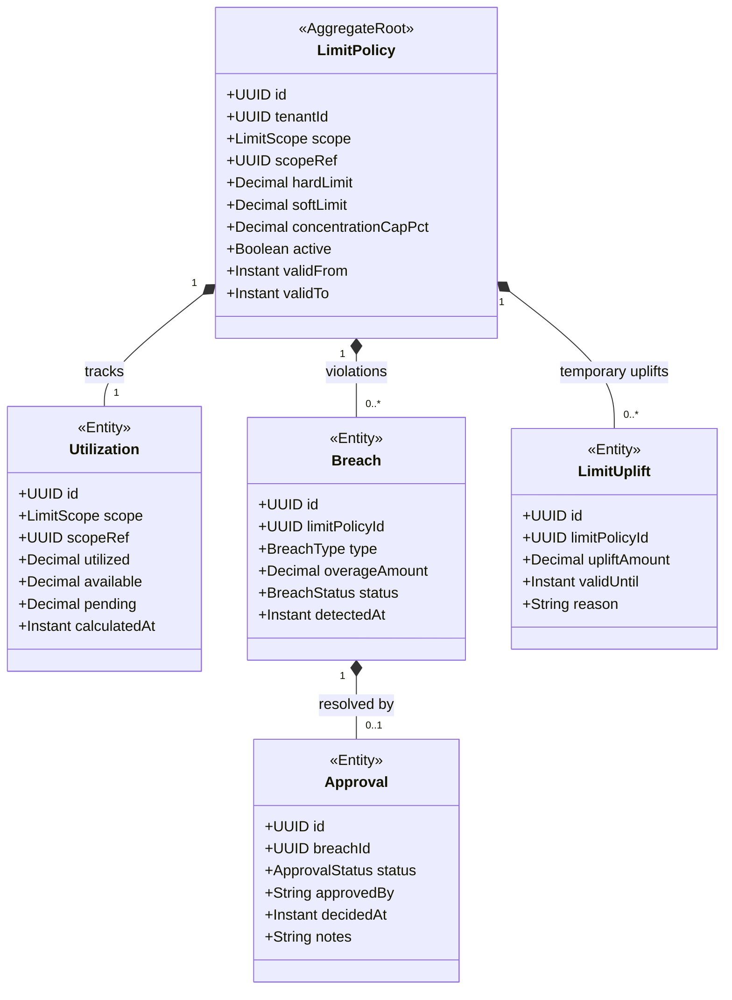

# FAC - Limits & Utilization (lim) Domain / Service Specification

> **Conceptual Stack Layer:** Domain / Service
> **Space:** Platform
> **Owner:** FAC Domain Engineering Team
> **Schema alignment:** `service-layer.schema.json`
> **Companion files:** `contracts/http/fac/lim/openapi.yaml`, `contracts/events/fac/lim/*.schema.json`
> **Belongs to:** FAC Suite Spec (`_fac_suite.md`)

> **Meta Information**
> - **Version:** 2026-04-04
> - **Template:** `domain-service-spec.md` v1.0.0
> - **Template Compliance:** ~92%
> - **Author(s):** OpenLeap Architecture Team
> - **Status:** DRAFT
> - **Suite:** `fac`
> - **Domain:** `lim`
> - **Bounded Context Ref:** `bc:credit-limits`
> - **Service ID:** `fac-lim-svc`
> - **basePackage:** `io.openleap.fac.lim`
> - **API Base Path:** `/api/fac/lim/v1`
> - **Port:** `8203`
> - **Repository:** `io.openleap.fac.lim`
> - **Tags:** `factoring`, `credit-limits`, `utilization`, `concentration`

---

## 0. Document Purpose & Scope

### 0.1 Purpose

`fac.lim` enforces **credit limits and concentration rules** to protect the factor from over-exposure. It maintains limit policies per debtor/client/portfolio, calculates real-time utilization, manages approval workflows for limit breaches, and tracks temporary limit uplifts.

### 0.2 Scope

**In Scope (MUST):**
- Maintain LimitPolicy records (per debtor, per client, portfolio-wide)
- Calculate real-time utilization (funded + pending receivables for each scope)
- Enforce hard limits (reject) and soft limits (require approval)
- Manage approval workflows for limit breaches
- Track temporary limit uplifts (time-bound)
- Provide synchronous availability query to fac.rcv
- Auto-adjust limits based on risk score changes from fac.rsk

**Out of Scope (MUST NOT):**
- Perform receivable assignment (→ fac.rcv)
- Calculate credit scores or insurance coverage (→ fac.rsk)
- Execute funding or disbursements (→ fac.fnd)

---

## 1. Business Context

### 1.1 Domain Purpose

"No Funding Without Capacity." `fac.lim` ensures that every receivable assigned to the factor fits within pre-approved exposure limits. It prevents the factor from inadvertently concentrating risk on a single debtor or client.

### 1.2 Business Value

- Prevents over-exposure to individual debtors (default protection)
- Concentration risk monitoring protects portfolio quality
- Approval workflows provide governance and accountability
- Auto-adjustment from risk scores enables dynamic limit management

### 1.3 Stakeholders

| Role | Responsibility |
|------|----------------|
| Credit Manager | Define limit policies, approve breaches |
| Risk Manager | Monitor concentration, review risk-triggered adjustments |
| Factoring Operations | Review limit availability before assignment |
| Auditor | Trace limit decisions and approvals |

---

## 2. Service Identity

| Property | Value |
|----------|-------|
| **Service ID** | `fac-lim-svc` |
| **Suite** | `fac` |
| **Domain** | `lim` |
| **Bounded Context** | `bc:credit-limits` |
| **API Base Path** | `/api/fac/lim/v1` |
| **Port** | `8203` |

---

## 3. Domain Model

### 3.1 Aggregate Overview

### 3.2 LimitScope Enumeration

| Scope | Description |
|-------|-------------|
| DEBTOR | Maximum exposure across all clients for a single debtor |
| CLIENT | Maximum exposure from all receivables of a single client |
| PORTFOLIO | Total factoring portfolio cap |

---

## 4. Business Rules & Constraints

| ID | Rule | Severity |
|----|------|----------|
| BR-LIM-001 | Hard limit breach MUST reject assignment immediately | HARD |
| BR-LIM-002 | Soft limit breach MUST trigger an approval workflow before assignment proceeds | HARD |
| BR-LIM-003 | No single debtor MUST exceed concentration cap (default 20% of portfolio) | HARD |
| BR-LIM-004 | Temporary uplift MUST be time-bound (max 30 days; configurable) | HARD |
| BR-LIM-005 | Approval MUST follow maker-checker: requester ≠ approver | HARD |
| BR-LIM-006 | Utilization MUST be recalculated on every assignment event from fac.rcv | HARD |
| BR-LIM-007 | Utilization recalculation MUST complete within 200ms (synchronous path) | PERF |
| BR-LIM-008 | Risk-score improvement MUST auto-trigger limit review (not auto-increase without approval) | SOFT |
| BR-LIM-009 | LimitPolicy changes MUST be versioned with effective date | HARD |

---

## 5. Use Cases

### UC-LIM-001: Check Limit Availability (Synchronous)

**Trigger:** `GET /api/fac/lim/v1/availability?debtorId=&clientId=&amount=`
**Flow:**
1. Load LimitPolicies for debtorId (DEBTOR scope) and clientId (CLIENT scope)
2. Calculate current utilization for each scope
3. Add pending amount to utilization
4. Compare against hard and soft limits
5. Return: `{ available: true/false, limitType: HARD/SOFT, availableAmount, utilizationPct }`

**Performance:** MUST respond < 200ms

### UC-LIM-002: Update Utilization on Assignment

**Trigger:** `fac.rcv.receivable.assigned` event
**Flow:**
1. Add receivable amount to Utilization for DEBTOR scope + CLIENT scope + PORTFOLIO scope
2. Check for concentration breach
3. If breach detected, emit `fac.lim.limit.breached`

### UC-LIM-003: Approve Limit Breach

**Trigger:** Credit Manager approves via UI
**Flow:**
1. Credit Manager reviews Breach record
2. Approve → create Approval record; emit `fac.lim.limit.approved`
3. Reject → assignment proceeds to rejection; emit `fac.lim.limit.rejected`

### UC-LIM-004: Temporary Limit Uplift

**Trigger:** Credit Manager creates uplift via `POST /limit-policies/{id}/uplifts`
**Flow:**
1. Create LimitUplift with amount and validUntil
2. Utilization checks include uplift until expiry
3. On expiry: uplift automatically de-activates; emit `fac.lim.limit.uplift.expired`

### UC-LIM-005: Risk-Triggered Limit Review

**Trigger:** `fac.rsk.score.updated` event with score improvement
**Flow:**
1. Look up active LimitPolicies for debtor
2. Create limit review task for Credit Manager (notification)
3. OPEN QUESTION: Auto-increase allowed or always requires approval?

---

## 6. REST API

**Base Path:** `/api/fac/lim/v1`

| Method | Path | Description |
|--------|------|-------------|
| GET | `/availability` | Synchronous limit check (debtorId, clientId, amount params) |
| GET | `/limit-policies` | List all limit policies |
| GET | `/limit-policies/{id}` | Get policy detail |
| POST | `/limit-policies` | Create new policy |
| PATCH | `/limit-policies/{id}` | Update policy (new version) |
| GET | `/limit-policies/{id}/utilization` | Current utilization |
| GET | `/breaches` | List active/pending breaches |
| GET | `/breaches/{id}` | Breach detail |
| POST | `/breaches/{id}/approvals` | Approve or reject breach |
| POST | `/limit-policies/{id}/uplifts` | Create temporary uplift |

---

## 7. Events & Integration

### 7.1 Outbound Events

| Event | Routing Key | Key Payload |
|-------|-------------|-------------|
| utilization.changed | `fac.lim.utilization.changed` | scope, scopeRef, utilized, utilizationPct |
| limit.breached | `fac.lim.limit.breached` | policyId, breachType, overageAmount |
| limit.approved | `fac.lim.limit.approved` | breachId, approvedBy |
| limit.rejected | `fac.lim.limit.rejected` | breachId, reason |
| limit.uplift.created | `fac.lim.limit.uplift.created` | policyId, upliftAmount, validUntil |
| limit.uplift.expired | `fac.lim.limit.uplift.expired` | policyId, upliftId |

### 7.2 Inbound Events

| Source | Event | Action |
|--------|-------|--------|
| fac.rcv | `fac.rcv.receivable.assigned` | Add to utilization (UC-LIM-002) |
| fac.rcv | `fac.rcv.receivable.closed` | Reduce utilization |
| fac.rsk | `fac.rsk.score.updated` | Trigger limit review (UC-LIM-005) |

---

## 8. Data Model

### 8.1 Tables (prefix: `lim_`)

**`lim_limit_policy`** — Limit rules per scope  
**`lim_utilization`** — Current utilization snapshot  
**`lim_breach`** — Limit violations  
**`lim_approval`** — Maker-checker approvals  
**`lim_uplift`** — Temporary limit uplifts  
**`lim_audit_log`** — Immutable audit trail of all limit decisions  

All tables include `tenant_id UUID NOT NULL` with RLS.

---

## 9. Security & Compliance

| Role | Permissions |
|------|-------------|
| `FAC_LIM_VIEWER` | Read policies, utilization, breaches |
| `FAC_LIM_EDITOR` | Create/update policies, create uplifts |
| `FAC_LIM_APPROVER` | Approve/reject breaches (cannot be same user who triggered) |
| `FAC_LIM_ADMIN` | All permissions |

- All limit decisions: immutable, retained for regulatory audit (7 years minimum)

---

## 10. Quality Attributes

- Availability query: MUST respond < 200ms (P99)
- Utilization update: SHOULD complete < 500ms after event receipt
- Availability: 99.9% (blocking path for receivable assignment)

---

## 11. Feature Dependencies

| Feature | Dependency |
|---------|-----------|
| F-FAC-003-02 (Credit Limit Management) | Requires IAM for approval workflow |

---

## 12. Extension Points

- **Risk-based auto-limits:** Automatically set debtor limit based on risk score tier
- **Industry concentration caps:** Additional concentration rules per industry sector
- **Multi-currency limit policies:** Limits in local currency with FX conversion

---

## 13. Migration & Evolution

- v1.0.0: Per-debtor, per-client, portfolio-wide limits
- v2.0.0: Industry/geographic concentration rules, auto-limits from risk scoring

---

## 14. Decisions & Open Questions

### Decisions
- **DEC-LIM-001:** Synchronous availability query (not event-based) for blocking assignment path
- **DEC-LIM-002:** Utilization recalculated on every assignment event (no caching for correctness)

### Open Questions
- **OQ-LIM-001:** Auto-increase limit on risk improvement — allowed without approval, or always requires approval?
- **OQ-LIM-002:** Should portfolio-wide limit include pending (pre-assignment) receivables?

---

## 15. Appendix

### 15.1 BreachType Reference

| Type | Description |
|------|-------------|
| HARD_DEBTOR | Debtor hard limit exceeded |
| SOFT_DEBTOR | Debtor soft limit exceeded (requires approval) |
| HARD_CLIENT | Client hard limit exceeded |
| SOFT_CLIENT | Client soft limit exceeded |
| CONCENTRATION | Single debtor > concentration cap % of portfolio |
| PORTFOLIO | Total portfolio hard limit exceeded |
