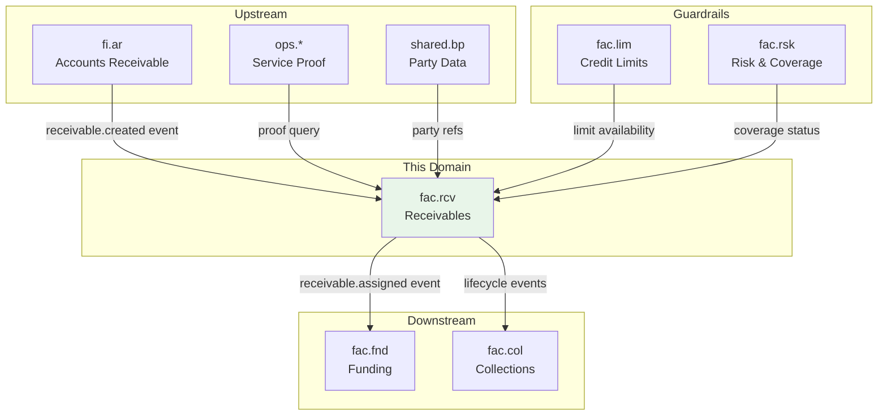
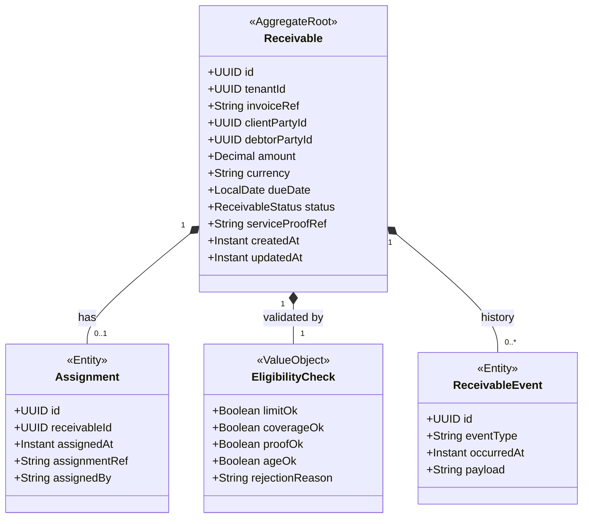

# FAC - Receivables Management (rcv) Domain / Service Specification

> **Conceptual Stack Layer:** Domain / Service
> **Space:** Platform
> **Owner:** FAC Domain Engineering Team
> **Schema alignment:** `service-layer.schema.json`
> **Companion files:** `contracts/http/fac/rcv/openapi.yaml`, `contracts/events/fac/rcv/*.schema.json`
> **Referenced by:** Suite Feature Catalog (`_fac_suite.md` §6)
> **Belongs to:** FAC Suite Spec (`_fac_suite.md`)

> **Meta Information**
> - **Version:** 2026-04-04
> - **Template:** `domain-service-spec.md` v1.0.0
> - **Template Compliance:** ~92%
> - **Author(s):** OpenLeap Architecture Team
> - **Status:** DRAFT
> - **Suite:** `fac`
> - **Domain:** `rcv`
> - **Bounded Context Ref:** `bc:receivables-financing`
> - **Service ID:** `fac-rcv-svc`
> - **basePackage:** `io.openleap.fac.rcv`
> - **API Base Path:** `/api/fac/rcv/v1`
> - **OpenLeap Starter Version:** `v1.0`
> - **Port:** `8201`
> - **Repository:** `io.openleap.fac.rcv`
> - **Tags:** `factoring`, `receivables`, `assignment`, `eligibility`
> - **Team:**
>   - Name: `team-fac`
>   - Email: `fac-team@openleap.io`
>   - Slack: `#fac-team`

---

## Specification Guidelines Compliance

> ### Non-Negotiables
> - Never invent facts. If required info is missing, add an **OPEN QUESTION** entry.
> - Use MUST/SHOULD/MAY for normative statements.
> - Keep the spec **self-contained**: no references to chat context.

---

## 0. Document Purpose & Scope

### 0.1 Purpose

`fac.rcv` specifies the **receivable intake and lifecycle** domain of the Factoring (FAC) suite. It is the **gateway into factoring operations**: it ingests receivables originating from `fi.ar`, validates factoring eligibility (limits, coverage, proof), assigns receivables to the factor, and maintains a traceable receivable lifecycle.

### 0.2 Target Audience
- Product Owners & Business Stakeholders (Factoring Operations)
- Architects / Tech Leads
- Integration & Platform Engineers
- Risk & Credit Managers
- Compliance & Audit

### 0.3 Scope

**In Scope (MUST):**
- Ingest receivable inputs from `fi.ar` (event-driven baseline)
- Maintain the receivable lifecycle (OPEN → ASSIGNED → FUNDED → PARTLY_PAID → CLOSED / REJECTED / DISPUTED)
- Create and persist an immutable ownership transfer record (`Assignment`)
- Validate eligibility: credit limits (`fac.lim`), risk/coverage signals (`fac.rsk`), service proof references (OPS/SRV)
- Emit domain events for downstream (fac.fnd, fac.lim, fac.col)

**Out of Scope (MUST NOT):**
- Execute funding, disbursements, interest accrual (→ `fac.fnd`)
- Define or approve limit policies (→ `fac.lim`)
- Implement credit scoring or insurance underwriting (→ `fac.rsk`)
- Post invoices or manage AR subledger (→ `fi` suite)
- Capture underlying service delivery (→ `ops.*` / `srv.*`)

### 0.4 Related Documents
- Suite architecture: `_fac_suite.md`
- Neighbor specs: `fac_fnd-spec.md`, `fac_lim-spec.md`, `fac_rsk-spec.md`, `fac_col-spec.md`
- Related suites: FI suite (`_fi_suite.md`), OPS/SRV suites

---

## 1. Business Context

### 1.1 Domain Purpose

`fac.rcv` ensures factoring operations are **safe and auditable** by gating only eligible receivables into the funded portfolio and maintaining a consistent lifecycle for those that qualify. Nothing gets funded without passing through `fac.rcv` validation.

### 1.2 Business Value

- Reduces operational risk by blocking ineligible receivables before funding
- Ensures traceability from invoice to receivable assignment (audit trail)
- Enables downstream domains (fac.fnd, fac.col) to operate deterministically on stable identifiers
- Enforces eligibility rules consistently, reducing manual review overhead

### 1.3 Key Stakeholders

| Role | Responsibility | Primary Use Cases |
|------|----------------|-------------------|
| Factoring Operations | Run receivable intake | Ingest, review, assign, reject receivables |
| Credit Manager | Ensure exposure limits | Review exceptions, approve overrides (in fac.lim) |
| Risk Manager | Ensure coverage eligibility | Interpret risk/coverage outcomes |
| Auditor | Traceability | Verify assignment trail and decisions |

### 1.4 Strategic Positioning



---

## 2. Service Identity

| Property | Value | Schema Field |
|----------|-------|-------------|
| **Service ID** | `fac-rcv-svc` | `metadata.id` |
| **Display Name** | Receivables Management | `metadata.name` |
| **Suite** | `fac` | `metadata.suite` |
| **Domain** | `rcv` | `metadata.domain` |
| **Bounded Context** | `bc:receivables-financing` | `metadata.bounded_context_ref` |
| **Version** | `1.0.0` | `metadata.version` |
| **Status** | DRAFT | `metadata.status` |
| **API Base Path** | `/api/fac/rcv/v1` | `metadata.api_base_path` |
| **Repository** | `io.openleap.fac.rcv` | `metadata.repository` |
| **Port** | `8201` | `metadata.port` |
| **Tags** | `factoring`, `receivables`, `assignment` | `metadata.tags` |

---

## 3. Domain Model

### 3.1 Aggregate Overview



### 3.2 ReceivableStatus State Machine

```
OPEN → ASSIGNED → FUNDED → PARTLY_PAID → CLOSED
OPEN → REJECTED
OPEN|ASSIGNED|FUNDED|PARTLY_PAID → DISPUTED
DISPUTED → PARTLY_PAID|CLOSED (after resolution)
```

| From | To | Trigger |
|------|----|---------|
| OPEN | ASSIGNED | Eligibility check passed; ownership transferred |
| OPEN | REJECTED | Eligibility check failed |
| ASSIGNED | FUNDED | fac.fnd activates funding |
| FUNDED | PARTLY_PAID | Partial payment received |
| PARTLY_PAID | CLOSED | Full settlement complete |
| FUNDED | CLOSED | Full payment in one settlement |
| Any active | DISPUTED | Dispute raised by debtor |
| DISPUTED | Preceding state | Dispute resolved without write-off |

### 3.3 Core Concepts

- **Receivable lifecycle:** State machine tracking factoring progress from intake to settlement
- **Eligibility validation:** Gate that checks 4 conditions before assignment (limit, coverage, proof, age)
- **Proof linkage:** Reference to service delivery evidence in OPS/SRV (read-only, not owned by FAC)
- **Assignment immutability:** Once assigned, ownership transfer cannot be reversed (except dispute-driven reversal — see OQ-FAC-003)

---

## 4. Business Rules & Constraints

| ID | Rule | Enforcement | Severity |
|----|------|-------------|----------|
| BR-RCV-001 | Receivable MUST reference a valid invoice identifier from fi.ar | Pre-assignment validation | HARD |
| BR-RCV-002 | Receivable MUST reference a valid debtor and client party in shared.bp | Pre-assignment validation | HARD |
| BR-RCV-003 | Credit limit MUST be available in fac.lim before assignment | Pre-assignment validation | HARD |
| BR-RCV-004 | Insurance coverage MUST be active in fac.rsk for non-recourse factoring | Pre-assignment validation | HARD (non-recourse) / SOFT (recourse) |
| BR-RCV-005 | Service proof reference MUST exist in OPS/SRV (approved delivery) | Pre-assignment validation | HARD |
| BR-RCV-006 | Receivable age MUST be within policy maximum (OPEN QUESTION: default value) | Pre-assignment validation | HARD |
| BR-RCV-007 | A receivable MUST NOT be assigned if already funded or disputed | Pre-assignment state check | HARD |
| BR-RCV-008 | Assignment record MUST be immutable after completion | Post-assignment invariant | HARD |
| BR-RCV-009 | Ingestion MUST be idempotent: duplicate events from fi.ar detected by invoiceRef + tenantId | Event processing | HARD |
| BR-RCV-010 | Rejection MUST record an explicit rejection reason | Post-rejection | HARD |
| BR-RCV-011 | All state transitions MUST produce an append-only ReceivableEvent | State machine | HARD |

---

## 5. Use Cases

### UC-RCV-001: Ingest Receivable from fi.ar

**Actor:** System (fi.ar event)
**Trigger:** `fi.ar.receivable.created` event received
**Preconditions:** Invoice exists in fi.ar with valid debtor and client party references
**Flow:**
1. Consume event; extract invoiceRef, clientPartyId, debtorPartyId, amount, currency, dueDate
2. Check for duplicate (idempotency: invoiceRef + tenantId)
3. If duplicate: ack without processing
4. Create Receivable in OPEN status
5. Record ReceivableEvent (CREATED)
6. Emit `fac.rcv.receivable.created` event

**Postconditions:** Receivable exists in OPEN status; event published

### UC-RCV-002: Assign Receivable to Factor

**Actor:** Factoring Operations (manual trigger) or System (auto-assign policy)
**Trigger:** `POST /receivables/{id}:assign`
**Preconditions:** Receivable in OPEN status
**Flow:**
1. Validate status = OPEN
2. Run EligibilityCheck:
   - Query fac.lim: `GET /api/fac/lim/v1/availability?debtorId=&amount=`
   - Query fac.rsk: `GET /api/fac/rsk/v1/coverage?debtorId=`
   - Query OPS/SRV: Validate serviceProofRef exists and is APPROVED
   - Check receivable age against policy
3. If any check fails: transition to REJECTED, record reason, emit `receivable.rejected`
4. If all pass: create Assignment record, transition to ASSIGNED
5. Record ReceivableEvent (ASSIGNED)
6. Emit `fac.rcv.receivable.assigned`

**Postconditions:** Receivable in ASSIGNED status; Assignment record created; fac.fnd notified

### UC-RCV-003: Reject Receivable

**Actor:** System (eligibility check failure) or Factoring Operations (manual rejection)
**Trigger:** Failed eligibility check or `POST /receivables/{id}:reject`
**Preconditions:** Receivable in OPEN status
**Flow:**
1. Validate status = OPEN
2. Record rejection reason (from EligibilityCheck or manual input)
3. Transition to REJECTED
4. Record ReceivableEvent (REJECTED)
5. Emit `fac.rcv.receivable.rejected` with reason
6. Notify upstream (fi.ar) of rejection via event

**Postconditions:** Receivable in REJECTED status; rejection audited

### UC-RCV-004: View Receivable Worklist

**Actor:** Factoring Operations, Credit Manager
**Trigger:** `GET /receivables` with filters
**Preconditions:** User authenticated with FAC_RCV_VIEWER role
**Flow:**
1. Apply filters: status, clientPartyId, debtorPartyId, dueDateRange, amountRange
2. Return paginated list with summary fields
3. Include eligibility status summary (pending / passed / failed)

### UC-RCV-005: Escalate Receivable to Disputed

**Actor:** fac.col (collection escalation) or Factoring Operations
**Trigger:** `POST /receivables/{id}:dispute`
**Preconditions:** Receivable in ASSIGNED, FUNDED, or PARTLY_PAID status
**Flow:**
1. Validate receivable exists and is in active state
2. Transition to DISPUTED
3. Record ReceivableEvent (DISPUTED)
4. Emit `fac.rcv.receivable.disputed`
5. Notify fac.fnd (freeze reserve release) and fac.col (open dispute case)

---

## 6. REST API

**Base Path:** `/api/fac/rcv/v1`

### Receivable Endpoints

| Method | Path | Description | Auth |
|--------|------|-------------|------|
| GET | `/receivables` | List receivables (paginated, filtered) | FAC_RCV_VIEWER |
| GET | `/receivables/{id}` | Get receivable by ID | FAC_RCV_VIEWER |
| POST | `/receivables/{id}:assign` | Trigger assignment (eligibility check + assign) | FAC_RCV_EDITOR |
| POST | `/receivables/{id}:reject` | Manually reject receivable with reason | FAC_RCV_EDITOR |
| POST | `/receivables/{id}:dispute` | Escalate receivable to disputed | FAC_RCV_EDITOR |
| GET | `/receivables/{id}/events` | Get audit trail (ReceivableEvents) | FAC_RCV_VIEWER |
| GET | `/receivables/{id}/assignment` | Get assignment record | FAC_RCV_VIEWER |
| GET | `/receivables/{id}/eligibility` | Get last eligibility check result | FAC_RCV_VIEWER |

### Query Parameters (GET /receivables)

| Parameter | Type | Description |
|-----------|------|-------------|
| status | enum | Filter by ReceivableStatus |
| clientPartyId | UUID | Filter by client |
| debtorPartyId | UUID | Filter by debtor |
| dueDateFrom | date | Filter by due date range start |
| dueDateTo | date | Filter by due date range end |
| page | int | Page number (0-based) |
| size | int | Page size (default 20, max 100) |

Full OpenAPI contract: `contracts/http/fac/rcv/openapi.yaml`

---

## 7. Events & Integration

### 7.1 Outbound Events

| Event | Routing Key | Trigger | Key Payload |
|-------|-------------|---------|-------------|
| receivable.created | `fac.rcv.receivable.created` | New receivable ingested | receivableId, invoiceRef, amount, clientPartyId, debtorPartyId |
| receivable.assigned | `fac.rcv.receivable.assigned` | Ownership transferred | receivableId, assignmentId, assignedAt |
| receivable.rejected | `fac.rcv.receivable.rejected` | Eligibility failed | receivableId, rejectionReason, failedChecks |
| receivable.closed | `fac.rcv.receivable.closed` | Full settlement | receivableId, closedAt |
| receivable.disputed | `fac.rcv.receivable.disputed` | Dispute raised | receivableId, disputeRef |

Event schemas: `contracts/events/fac/rcv/`

### 7.2 Inbound Events

| Source | Event | Action |
|--------|-------|--------|
| fi.ar | `fi.ar.receivable.created` | Ingest new receivable (UC-RCV-001) |
| fi.ar | `fi.ar.receivable.updated` | Update receivable amount/dueDate if not yet assigned |
| fac.fnd | `fac.fnd.funding.activated` | Transition receivable ASSIGNED → FUNDED |
| fac.fnd | `fac.fnd.settlement.recorded` | Transition FUNDED → PARTLY_PAID or CLOSED |

### 7.3 Synchronous Calls

| Target | Endpoint | Purpose |
|--------|----------|---------|
| fac.lim | `GET /api/fac/lim/v1/availability` | Check credit limit availability |
| fac.rsk | `GET /api/fac/rsk/v1/coverage` | Validate insurance coverage status |
| ops.* / srv.* | Service proof query API | Validate service delivery proof |

---

## 8. Data Model

### 8.1 Tables

All tables prefixed `rcv_`.

**`rcv_receivable`**

| Column | Type | Constraints |
|--------|------|-------------|
| id | UUID | PK, NOT NULL |
| tenant_id | UUID | NOT NULL, FK (IAM) |
| invoice_ref | VARCHAR(255) | NOT NULL |
| client_party_id | UUID | NOT NULL |
| debtor_party_id | UUID | NOT NULL |
| amount | NUMERIC(18,4) | NOT NULL |
| currency | CHAR(3) | NOT NULL |
| due_date | DATE | NOT NULL |
| status | VARCHAR(20) | NOT NULL |
| service_proof_ref | VARCHAR(255) | NULLABLE |
| created_at | TIMESTAMPTZ | NOT NULL |
| updated_at | TIMESTAMPTZ | NOT NULL |

**Indexes:** `(tenant_id, status)`, `(tenant_id, debtor_party_id)`, `(tenant_id, invoice_ref)` UNIQUE

**`rcv_assignment`**

| Column | Type | Constraints |
|--------|------|-------------|
| id | UUID | PK, NOT NULL |
| tenant_id | UUID | NOT NULL |
| receivable_id | UUID | NOT NULL, FK rcv_receivable |
| assigned_at | TIMESTAMPTZ | NOT NULL |
| assignment_ref | VARCHAR(255) | NOT NULL |
| assigned_by | VARCHAR(255) | NOT NULL |

**`rcv_receivable_event`** (append-only audit log)

| Column | Type | Constraints |
|--------|------|-------------|
| id | UUID | PK, NOT NULL |
| receivable_id | UUID | NOT NULL, FK rcv_receivable |
| tenant_id | UUID | NOT NULL |
| event_type | VARCHAR(50) | NOT NULL |
| occurred_at | TIMESTAMPTZ | NOT NULL |
| payload | JSONB | NULLABLE |

**Indexes:** `(receivable_id, occurred_at)`

### 8.2 Storage Decision
- Database: PostgreSQL 17 (suite baseline)
- Tenancy: Multi-tenant with `tenant_id` + Row-Level Security (RLS)
- Idempotency: UNIQUE constraint on `(tenant_id, invoice_ref)` in `rcv_receivable`

---

## 9. Security & Compliance

### 9.1 Roles

| Role | Permissions |
|------|-------------|
| `FAC_RCV_VIEWER` | Read receivables, assignments, events, eligibility checks |
| `FAC_RCV_EDITOR` | All VIEWER permissions + assign, reject, dispute |
| `FAC_RCV_ADMIN` | All EDITOR permissions + configuration |

### 9.2 Authentication / Authorization
- OAuth2/JWT with tenant claim in JWT
- Service-to-service: mTLS (suite baseline)
- All mutations require authenticated user identity in audit trail

### 9.3 Data Classification
- **CONFIDENTIAL**: Amount, debtor/client identity, assignment details
- PII (party data) referenced by ID; detailed party info from `shared.bp`
- Assignment records: immutable, retained for regulatory compliance (min. 7 years)

---

## 10. Quality Attributes

### 10.1 Performance
- Receivable ingestion: SHOULD handle up to 1,000 events/minute from fi.ar
- Eligibility check: SHOULD complete within 500ms (synchronous calls to fac.lim + fac.rsk + OPS)
- Worklist query: SHOULD return in < 200ms for paginated results

### 10.2 Availability & Resilience
- Target availability: 99.9% (same as FI suite)
- MUST tolerate transient upstream event retries (idempotency via invoiceRef + tenantId)
- SHOULD use Dead Letter Queue (DLQ) for failed event processing
- Graceful degradation: If fac.lim or fac.rsk is unreachable, queue assignment attempts rather than fail immediately

### 10.3 Consistency Model
- Strong consistency within `fac.rcv` aggregate (single PostgreSQL instance)
- Eventual consistency for downstream consumers via event publishing

---

## 11. Feature Dependencies

| Feature | Type | Dependency |
|---------|------|-----------|
| F-FAC-001-01 (Receivable Intake & Worklist) | LEAF | Requires IAM authentication (F-IAM-001) |
| F-FAC-001-02 (Eligibility Validation) | LEAF | Requires fac.lim (F-FAC-003-02), fac.rsk (F-FAC-003-03) |
| F-FAC-001-03 (Lifecycle Tracking) | LEAF | Requires fac.fnd events (F-FAC-002) |

---

## 12. Extension Points

### 12.1 Auto-Assignment Policies
- Policy engine to auto-assign receivables meeting all eligibility criteria without manual intervention
- Policy configuration: advance rate threshold, minimum eligibility score, debtor whitelist

### 12.2 Bulk Ingestion API
- `POST /receivables/bulk` for batch ingestion from non-event sources
- OPEN QUESTION: Required for non-event-driven upstream integrations?

### 12.3 Custom Eligibility Rules
- Plugin interface for custom eligibility checks beyond the 4 standard checks
- Useful for product-specific rules (e.g., geographic restrictions, industry limits)

---

## 13. Migration & Evolution

### 13.1 v1.0.0 → Future
- Adding service proof type enumeration (once OPS/SRV event contract is finalized)
- Bulk assignment API (Phase 2, if needed)
- Eligibility plugin interface (Phase 3)

### 13.2 Legacy Data Migration
- If migrating from a legacy factoring system, import historical assignments with `CLOSED` status
- Historical receivables do not need eligibility re-validation

---

## 14. Decisions & Open Questions

### 14.1 Decisions
- **DEC-RCV-001:** `fac.rcv` is the gateway domain — all factored receivables MUST pass through it (per ADR-FAC-001)
- **DEC-RCV-002:** Eligibility validation calls fac.lim and fac.rsk synchronously (latency < 500ms acceptable for assignment flow)
- **DEC-RCV-003:** Idempotency enforced at DB level via UNIQUE constraint on (tenant_id, invoice_ref)

### 14.2 Open Questions
- **OQ-FAC-001:** Exact upstream event names and payload contract from `fi.ar`
- **OQ-FAC-002:** Is receivable ingestion event-only or also synchronous API-driven?
- **OQ-FAC-003:** How are dispute-driven ownership reversals modeled?
- **OQ-FAC-004:** Which operational suite is authoritative for service proof: `ops.*` or `srv.*`?

---

## 15. Appendix

### 15.1 ReceivableStatus Reference

| Status | Description | Terminal |
|--------|-------------|----------|
| OPEN | Receivable ingested, awaiting assignment | No |
| ASSIGNED | Ownership transferred to factor | No |
| FUNDED | Advance disbursed by fac.fnd | No |
| PARTLY_PAID | Partial debtor payment received | No |
| CLOSED | Fully settled; receivable lifecycle complete | Yes |
| REJECTED | Failed eligibility check; not financed | Yes |
| DISPUTED | Active dispute; lifecycle paused | No |

### 15.2 Rejection Reasons Reference

| Code | Reason |
|------|--------|
| LIMIT_EXCEEDED | Credit limit not available (fac.lim) |
| COVERAGE_INACTIVE | Insurance coverage not active (fac.rsk) |
| NO_SERVICE_PROOF | Service delivery proof not found or not approved |
| AGE_EXCEEDED | Receivable too old per policy |
| ALREADY_FUNDED | Receivable already in funded/closed state |
| DUPLICATE | Duplicate receivable (same invoice already registered) |
| MANUAL | Manual rejection by operations |
