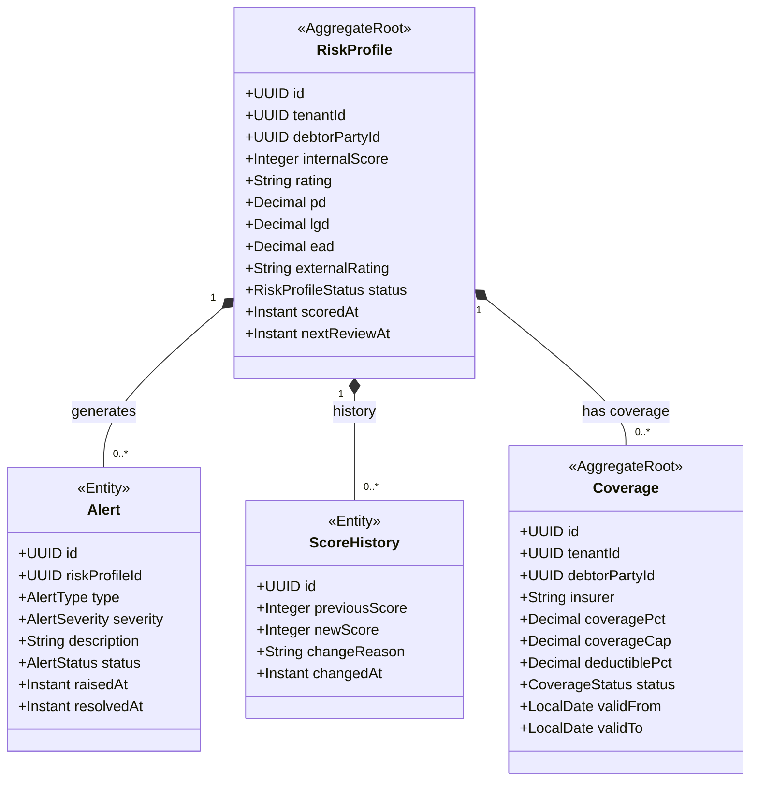

# FAC - Risk & Coverage (rsk) Domain / Service Specification

> **Conceptual Stack Layer:** Domain / Service
> **Space:** Platform
> **Owner:** FAC Domain Engineering Team
> **Schema alignment:** `service-layer.schema.json`
> **Companion files:** `contracts/http/fac/rsk/openapi.yaml`, `contracts/events/fac/rsk/*.schema.json`
> **Belongs to:** FAC Suite Spec (`_fac_suite.md`)

> **Meta Information**
> - **Version:** 2026-04-04
> - **Template:** `domain-service-spec.md` v1.0.0
> - **Template Compliance:** ~92%
> - **Author(s):** OpenLeap Architecture Team
> - **Status:** DRAFT
> - **Suite:** `fac`
> - **Domain:** `rsk`
> - **Bounded Context Ref:** `bc:risk-coverage`
> - **Service ID:** `fac-rsk-svc`
> - **basePackage:** `io.openleap.fac.rsk`
> - **API Base Path:** `/api/fac/rsk/v1`
> - **Port:** `8204`
> - **Repository:** `io.openleap.fac.rsk`
> - **Tags:** `factoring`, `risk`, `credit-scoring`, `insurance-coverage`, `alerts`

---

## 0. Document Purpose & Scope

### 0.1 Purpose

`fac.rsk` provides **risk intelligence** for factoring decisions. It calculates credit scores for debtors, computes PD/LGD/EAD risk metrics, manages credit insurance coverage policies, monitors exposure, and generates risk alerts for deterioration, fraud indicators, or concentration issues.

### 0.2 Scope

**In Scope (MUST):**
- Maintain RiskProfile per debtor (internal score + external bureau data)
- Compute PD, LGD, EAD metrics
- Manage credit insurance Coverage policies (per debtor, per industry)
- Monitor coverage caps and deductibles
- Generate risk alerts (score deterioration, coverage drops, concentration)
- Provide synchronous coverage validation to fac.rcv

**Out of Scope (MUST NOT):**
- Execute credit scoring algorithms (→ external providers; fac.rsk is the integration facade)
- Underwrite insurance policies (→ external insurers; fac.rsk manages policy data)
- Manage credit limits directly (→ fac.lim)
- Assign or fund receivables (→ fac.rcv, fac.fnd)

---

## 1. Business Context

### 1.1 Domain Purpose

"Know Your Risk." `fac.rsk` provides continuous early-warning signals that prevent the factor from funding receivables against deteriorating debtors or uncovered exposure, thereby minimizing portfolio losses.

### 1.2 Business Value

- Early warning prevents new funding against high-risk debtors
- Coverage management ensures insurance is always active before funding
- PD/LGD/EAD metrics support regulatory capital calculations
- Risk score feeds into limit management for dynamic limit adjustment

### 1.3 Stakeholders

| Role | Responsibility |
|------|----------------|
| Risk Manager | Monitor scores, review alerts, manage coverage |
| Credit Manager | Use risk data for limit decisions |
| Finance Controller | Regulatory reporting (ECL calculations) |
| Factoring Operations | View coverage status for eligibility checks |

---

## 2. Service Identity

| Property | Value |
|----------|-------|
| **Service ID** | `fac-rsk-svc` |
| **Suite** | `fac` |
| **Domain** | `rsk` |
| **Bounded Context** | `bc:risk-coverage` |
| **API Base Path** | `/api/fac/rsk/v1` |
| **Port** | `8204` |

---

## 3. Domain Model

### 3.1 Aggregate Overview

### 3.2 Rating Scale

| Score Range | Rating | Risk Level |
|-------------|--------|-----------|
| 900–1000 | AAA | Minimal |
| 800–899 | AA | Very Low |
| 700–799 | A | Low |
| 600–699 | BBB | Moderate |
| 500–599 | BB | Elevated |
| 400–499 | B | High |
| 300–399 | CCC | Very High |
| 200–299 | CC | Near Default |
| 100–199 | C | Default Imminent |
| 0–99 | D | Default |

---

## 4. Business Rules & Constraints

| ID | Rule | Severity |
|----|------|----------|
| BR-RSK-001 | RiskProfile MUST exist for every debtor with active receivables | HARD |
| BR-RSK-002 | Coverage MUST be active for non-recourse factoring before assignment | HARD |
| BR-RSK-003 | Score drop > 50 points MUST trigger alert and notify fac.lim | HARD |
| BR-RSK-004 | Coverage cap reached MUST block new non-recourse assignments | HARD |
| BR-RSK-005 | Deductible MUST be accounted for in loss calculation | HARD |
| BR-RSK-006 | Score MUST be refreshed at least monthly for active debtors | SOFT |
| BR-RSK-007 | External score data MUST NOT be modified by FAC (read-only integration) | HARD |
| BR-RSK-008 | Alert MUST be acknowledged within SLA (OPEN QUESTION: define SLA days) | SOFT |
| BR-RSK-009 | Fraud indicator alerts MUST trigger immediate review (SLA: 1 business day) | HARD |

---

## 5. Use Cases

### UC-RSK-001: Validate Coverage for Assignment (Synchronous)

**Trigger:** `GET /api/fac/rsk/v1/coverage?debtorId=`
**Flow:**
1. Load active Coverage policies for debtorId
2. Calculate utilized coverage vs. cap
3. Return: `{ covered: true/false, coveragePct, remainingCap, deductiblePct }`

### UC-RSK-002: Update Risk Score (Event-Driven)

**Trigger:** External credit bureau webhook or `bp.party.updated` event
**Flow:**
1. Receive new score data
2. Calculate change from previous score
3. If change > 50 points: generate Alert
4. Update RiskProfile
5. Emit `fac.rsk.score.updated`
6. If significant deterioration: emit `fac.rsk.alert.raised`

### UC-RSK-003: Manage Coverage Policy

**Trigger:** Risk Manager creates/updates coverage via UI
**Flow:**
1. Create or update Coverage aggregate
2. Set coveragePct, coverageCap, deductiblePct, validFrom/validTo
3. Emit `fac.rsk.coverage.updated`
4. If coverage drops or expires: emit `fac.rsk.coverage.dropped`

### UC-RSK-004: Generate Concentration Alert

**Trigger:** Portfolio concentration calculation (scheduled or triggered by fac.lim)
**Flow:**
1. Aggregate EAD per industry/geography
2. If concentration > threshold: generate CONCENTRATION alert
3. Emit `fac.rsk.alert.raised`

### UC-RSK-005: Acknowledge / Resolve Alert

**Trigger:** Risk Manager acknowledges alert via UI
**Flow:**
1. Risk Manager reviews alert, takes action (reduce exposure, adjust limit)
2. Mark Alert as RESOLVED with resolution notes
3. Emit `fac.rsk.alert.resolved`

---

## 6. REST API

**Base Path:** `/api/fac/rsk/v1`

| Method | Path | Description |
|--------|------|-------------|
| GET | `/coverage` | Synchronous coverage check (debtorId param) |
| GET | `/risk-profiles` | List risk profiles |
| GET | `/risk-profiles/{id}` | Get risk profile |
| GET | `/risk-profiles/{id}/history` | Score history |
| GET | `/coverage-policies` | List coverage policies |
| POST | `/coverage-policies` | Create coverage policy |
| PATCH | `/coverage-policies/{id}` | Update coverage policy |
| GET | `/alerts` | List alerts (filter by status, type, severity) |
| POST | `/alerts/{id}:acknowledge` | Acknowledge alert |
| POST | `/alerts/{id}:resolve` | Resolve alert with notes |

---

## 7. Events & Integration

### 7.1 Outbound Events

| Event | Routing Key | Key Payload |
|-------|-------------|-------------|
| score.updated | `fac.rsk.score.updated` | debtorPartyId, previousScore, newScore, rating |
| coverage.updated | `fac.rsk.coverage.updated` | debtorPartyId, coveragePct, cap |
| coverage.dropped | `fac.rsk.coverage.dropped` | debtorPartyId, reason |
| alert.raised | `fac.rsk.alert.raised` | debtorPartyId, alertType, severity, description |
| alert.resolved | `fac.rsk.alert.resolved` | alertId, resolvedBy, notes |

### 7.2 Inbound Events

| Source | Event | Action |
|--------|-------|--------|
| bp | `bp.party.updated` | Trigger score refresh for debtor |
| fac.rcv | `fac.rcv.receivable.assigned` | Update EAD in RiskProfile |
| fac.rcv | `fac.rcv.receivable.closed` | Reduce EAD |
| External bureaus | Webhook | Update external rating data |
| External insurers | Webhook | Update coverage policy data |

---

## 8. Data Model

### 8.1 Tables (prefix: `rsk_`)

**`rsk_risk_profile`** — Debtor risk profile and metrics  
**`rsk_score_history`** — Immutable score change history  
**`rsk_coverage`** — Insurance coverage policies  
**`rsk_alert`** — Generated risk alerts  
**`rsk_external_rating`** — External bureau rating snapshots  

All tables include `tenant_id UUID NOT NULL` with RLS.

---

## 9. Security & Compliance

| Role | Permissions |
|------|-------------|
| `FAC_RSK_VIEWER` | Read risk profiles, coverage, alerts |
| `FAC_RSK_EDITOR` | Create/update coverage policies, acknowledge alerts |
| `FAC_RSK_ADMIN` | All permissions |

- Risk data: **CONFIDENTIAL** (financial + potentially personal credit data)
- External rating data: licensed; access limited to authorized roles

---

## 10. Quality Attributes

- Coverage query: MUST respond < 150ms (critical path for assignment)
- Score refresh: SHOULD complete within 30 seconds of external webhook receipt
- Alert generation: MUST be generated within 1 minute of score change

---

## 11. Feature Dependencies

| Feature | Dependency |
|---------|-----------|
| F-FAC-003-03 (Risk Scoring) | Requires external credit bureau integration |

---

## 12. Extension Points

- **Multi-model scoring:** Support multiple scoring models per debtor segment
- **ESG scoring:** Add environmental/social/governance dimensions to risk profiles
- **Real-time coverage tracking:** Live coverage utilization dashboard

---

## 13. Migration & Evolution

- v1.0.0: Internal scoring + single external bureau + single coverage policy per debtor
- v2.0.0: Multi-model scoring, multiple coverage layers, ESG dimensions

---

## 14. Decisions & Open Questions

### Decisions
- **DEC-RSK-001:** FAC.RSK is an integration facade for external risk providers — it does NOT implement scoring algorithms internally
- **DEC-RSK-002:** Coverage is per-debtor (not per-receivable) to reduce configuration overhead

### Open Questions
- **OQ-RSK-001:** Which external credit bureau(s) are integrated? API contract needed.
- **OQ-RSK-002:** Alert SLA definition for non-fraud alerts?
- **OQ-RSK-003:** How are disputes factored into PD calculation?

---

## 15. Appendix

### 15.1 AlertType Reference

| Type | Trigger | Severity |
|------|---------|----------|
| SCORE_DETERIORATION | Score drops > 50 points | HIGH |
| COVERAGE_DROPPED | Coverage policy expired or cancelled | CRITICAL |
| COVERAGE_CAP_REACHED | Coverage cap 90%+ utilized | HIGH |
| CONCENTRATION | Single debtor > concentration threshold | HIGH |
| FRAUD_INDICATOR | Unusual payment pattern detected | CRITICAL |
| DELINQUENCY_SPIKE | DPD > 30 increasing trend | MEDIUM |
| EXTERNAL_RATING_DOWNGRADE | External agency downgrades debtor | HIGH |
