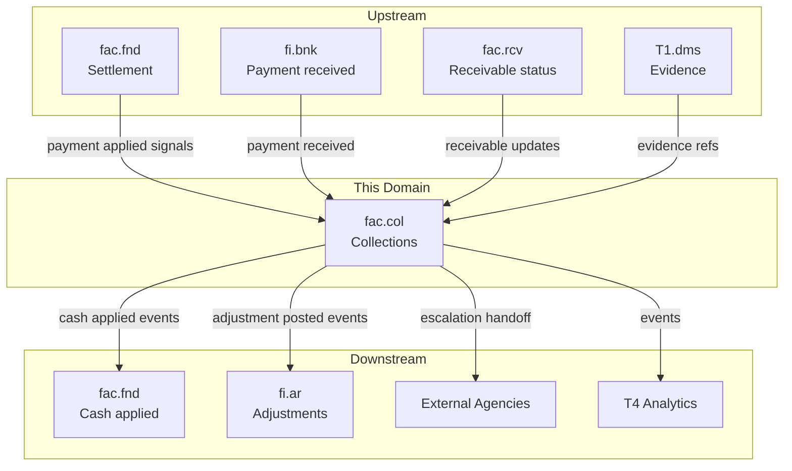
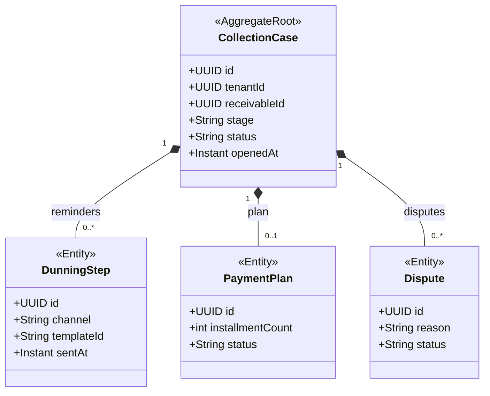
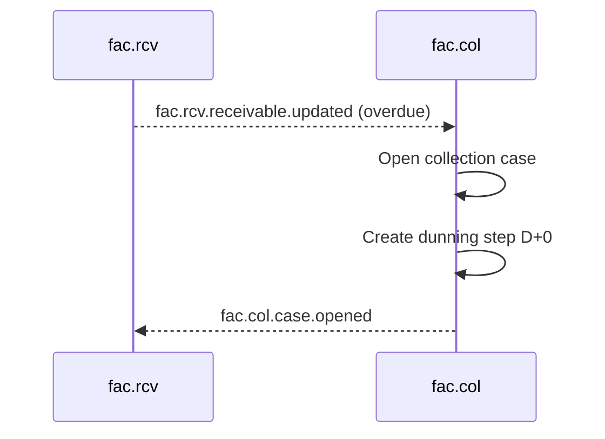

<!-- TEMPLATE COMPLIANCE: ~55%
Template: domain-service-spec.md v1.0.0
Present sections: §0 (purpose, audience, scope, related docs), §1 (business context, value, stakeholders, positioning), §3 (domain model, class diagram), §4 (aggregates, lifecycle, invariants), §6 (REST API), §7 (events — outbound/inbound), §8 (persistence — storage, tables), §9 (security/roles), §10 (NFR), §14 (decisions, open questions)
Missing sections: §2 (service identity table), §4 (no formal BR catalog), §5 (use cases), §8 (no ER diagram, no indexes), §11 (feature dependencies), §12 (extension points), §13 (migration), §15 (appendix)
Naming issues: file should be fac_col-spec.md per convention
Duplicates: none
Priority: LOW
-->
# Service Domain Specification — `fac.col` (Collections & Disputes)

> **Meta Information**
> - **Version:** 2026-01-19
> - **Template:** `domain-service-spec.md` v1.0.0
> - **Template Compliance:** ~55% — §2 (service identity table), §4 (formal BR catalog), §5 (use cases), §8 (ER diagram, indexes), §11 (feature dependencies), §12 (extension points), §13 (migration), §15 (appendix) missing
> - **Author(s):** OpenLeap Architecture Team
> - **Status:** DRAFT
> - **Tier:** T3
> - **Suite:** `fac`
> - **Domain:** `col`
> - **Service ID:** `fac-col-svc`
> - **basePackage:** `io.openleap.fac.col`
> - **API Base Path:** `/api/fac/col/v1`

---

## Specification Guidelines Compliance

> **This specification MUST comply with the project-wide specification guidelines.**
>
> #### Non-negotiables
> - Never invent facts. If information is missing, add an **OPEN QUESTION** entry.
> - Use **MUST/SHOULD/MAY** for normative statements.
> - Keep the spec **self-contained**: no references to chat context.
> - Record decisions and boundaries explicitly (see Section 12).

---

## 0. Document Purpose & Scope

### 0.1 Purpose
`fac.col` specifies the **collections, dunning, and dispute management** domain of the Factoring (FAC) suite.

`fac.col` manages overdue receivables through dunning steps, payment plans, and escalations, and provides dispute tracking with evidence references.

### 0.2 Target Audience
- Collections & Dunning Managers
- Factoring Operations
- Architects / Tech Leads
- Integration & Platform Engineers
- Compliance & Audit

### 0.3 Scope

**In Scope (MUST):**
- MUST open and manage `CollectionCase` entities for overdue receivables.
- MUST execute multi-stage dunning flows (suite baseline example stages: D+0, D+7, D+14, D+30, D+60).
- MUST support multi-channel communication (suite baseline: email, letter, SMS, phone, portal).
- MUST apply incoming cash to receivables (in coordination with `fac.fnd`) and handle short/over payments.
- MUST manage disputes with reason, evidence references, and resolution outcomes.
- MUST manage payment plans with constraints (suite baseline: max 12 installments, fees/interest first).
- SHOULD support escalation to legal/external agencies with traceability.

**Out of Scope (MUST NOT):**
- MUST NOT create or assign receivables → `fac.rcv`.
- MUST NOT calculate advance/reserve/interest accrual → `fac.fnd`.
- MUST NOT post accounting entries as a system of record → `fi` suite.

### 0.4 Terms & Acronyms
- **Dunning:** A staged reminder/escalation process to collect overdue payments.
- **Short pay:** Payment lower than invoice amount.
- **Over pay:** Payment higher than invoice amount.

### 0.5 Related Documents
- Suite architecture: `platform/T3_Domains/FAC/_fac_suite.md`
- Neighbor specs: `fac_rcv.md`, `fac_fnd.md`, `fac_lim.md`, `fac_rsk.md`
- Related foundations: `platform/T1_Platform/dms` (evidence storage; exact spec path OPEN QUESTION)

---

## 1. Business Context

### 1.1 Domain Purpose
`fac.col` ensures cash recovery through governed collections processes and reduces loss given default through early dispute detection and structured escalation.

### 1.2 Business Value
- Standardized dunning policies.
- Improved recovery rates and lower operational effort.
- Evidence-backed dispute handling.

### 1.3 Stakeholders & Roles
| Role | Responsibility | Primary Use Cases |
|------|----------------|-------------------|
| Collector | Run dunning | Create steps, record calls, negotiate plans |
| Dispute Manager | Resolve disputes | Collect evidence, decide outcomes |
| Operations | Monitor payments | Match payments, handle exceptions |

### 1.4 Strategic Positioning (Context Diagram)

---

## 2. Domain Boundaries & Responsibilities

### 2.1 Responsibilities
- MUST open collection cases when receivables become overdue.
- MUST enforce dunning stage progression and track sent steps.
- MUST allocate payments according to suite baseline priority (fees → interest → principal, oldest first).
- SHOULD enforce dispute window (suite baseline: 30 days from invoice date).

### 2.3 Data Ownership and “Source of Truth”
- **Source of truth for:** Collection cases, dunning steps, disputes, payment plans → `fac.col`.
- **References (IDs only):** Receivables (`fac.rcv`), fundings (`fac.fnd`), parties (`shared.bp`), evidence documents (`T1.dms`).

---

## 3. Domain Model

### 3.1 Overview (Mermaid `classDiagram`)

---

## 4. Aggregates, Lifecycle & Invariants

### 4.1 Aggregate List
- `CollectionCase`

### 4.2 Invariants (MUST/SHOULD)
- MUST follow dunning stages (suite baseline): D+0, D+7, D+14, D+30, D+60 (configurability OPEN QUESTION).
- MUST apply payment allocation priority: fees → interest → principal (oldest first) (suite baseline).
- SHOULD accept short pay within tolerance (suite baseline example: within 5%) and close.
- SHOULD create a credit memo for over pay (suite baseline) (posting mechanics OPEN QUESTION).
- MUST enforce escalation criteria (suite baseline example: DPD > 90 days and amount > 5,000 EUR).

---

## 5. Persistence & Storage Design

### 5.1 Storage Decision
- Database: PostgreSQL
- Tenancy model: Multi-tenant with `tenant_id` + RLS (suite baseline)

### 5.2 Tables / Collections
**Naming:** tables MUST be prefixed with `col_`.

Example (illustrative):
- `col_collection_case`
- `col_dunning_step`
- `col_payment_plan`
- `col_dispute`

---

## 6. Public Interfaces (APIs)

### 6.1 REST API (OpenAPI-friendly)
**Base Path:** `/api/fac/col/v1`

#### 6.1.1 Collection cases
- `GET /collection-cases`
- `GET /collection-cases/{id}`
- `POST /collection-cases/{id}/dunning-steps` (suite example)
- `POST /collection-cases/{id}:escalate`

---

## 7. Events & Messaging

### 7.1 Conventions
- **Exchange/Topic:** `fac.events` (suite baseline)
- **Routing key pattern:** `fac.col.<aggregate>.<event>`

### 7.2 Outbound Events (baseline)
- `fac.col.case.opened`
- `fac.col.case.updated`
- `fac.col.case.resolved`
- `fac.col.case.escalated`
- `fac.col.dunning.step.sent`
- `fac.col.cash.applied`
- `fac.col.payment.planned`
- `fac.col.payment.received`

### 7.3 Inbound Events (baseline)
- `fac.fnd.payment.applied`
- `fi.bnk.payment.received` (exact routing key OPEN QUESTION)
- `fac.rcv.receivable.updated`

---

## 8. Typical Interactions (Sequences)

### 8.1 Happy Path: Overdue receivable triggers dunning

---

## 9. Security & Authorization

### 9.1 Roles
- `FAC_COL_VIEWER`
- `FAC_COL_EDITOR`
- `FAC_COL_ADMIN`

---

## 10. Non-Functional Requirements (NFR)

### 10.2 Availability & Resilience
- SHOULD support retries for outbound notifications and external agency integration.

---

## 11. Operability & Observability

### 11.2 Metrics
- Case aging distribution, dunning success rate, payment plan adherence rate, dispute rate.

---

## 12. Decisions, Conflicts, Open Questions

### 12.1 Decisions
- **DEC-001:** Collections and disputes are centralized in `fac.col` and integrate with settlement in `fac.fnd` (suite baseline, Section 3.2.5).

### 12.3 OPEN QUESTIONS
- **OQ-001:** Exact integration contract to `fi.ar` for adjustments and credit memos.
- **OQ-002:** Where dunning templates are stored and how they are versioned (suite baseline mentions templates and multi-language).
- **OQ-003:** Which communications are synchronous API calls vs async notifications.

---

## 13. Change Log
- Created: 2026-01-19
