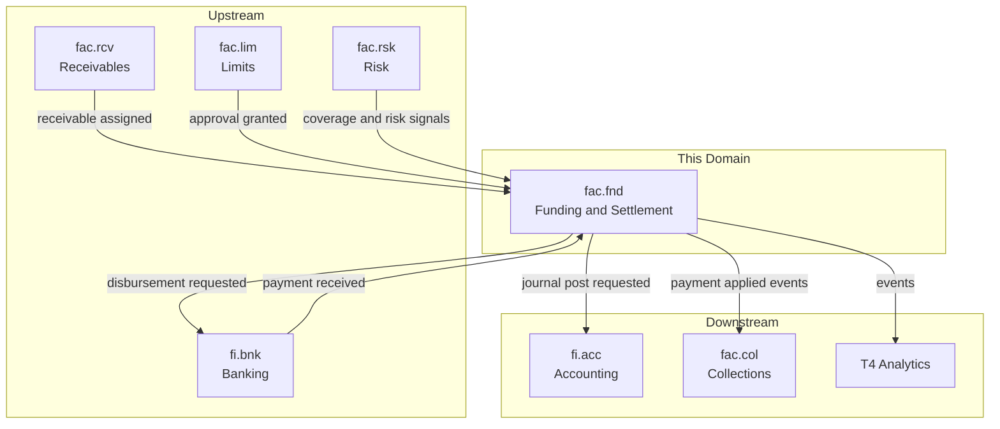
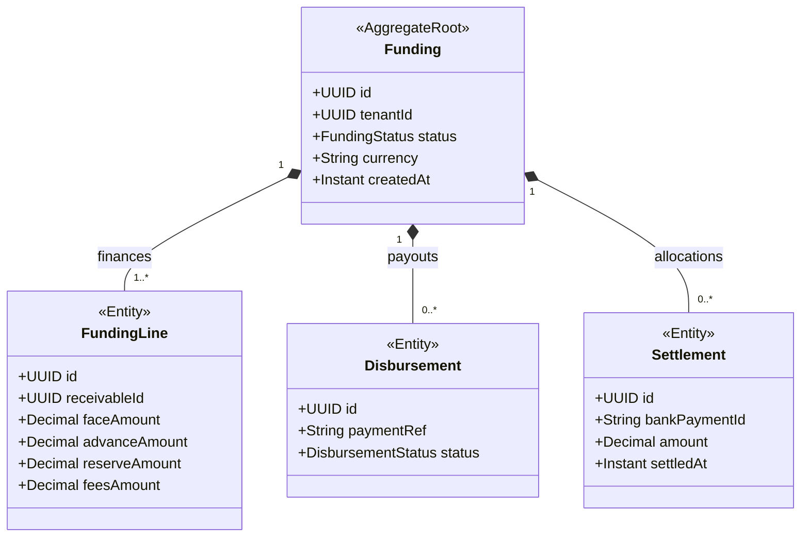
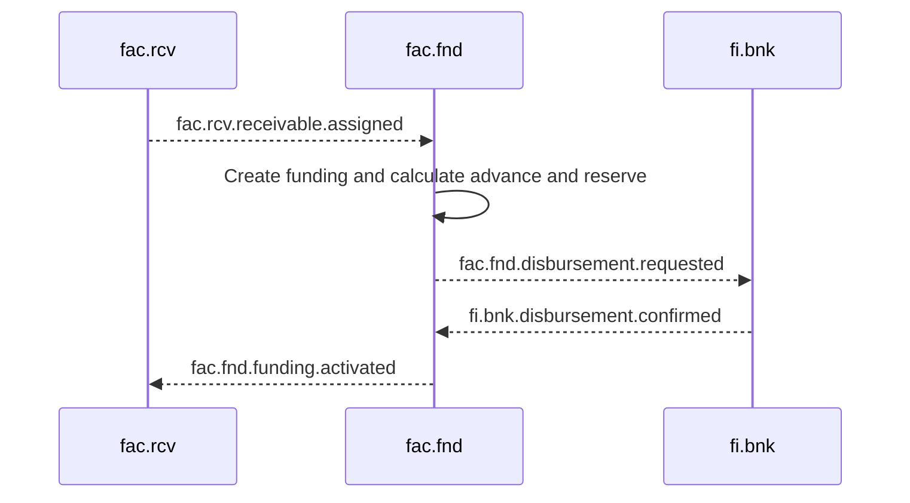

<!-- TEMPLATE COMPLIANCE: ~55%
Template: domain-service-spec.md v1.0.0
Present sections: §0 (purpose, audience, scope, related docs), §1 (business context, value, stakeholders, positioning), §3 (domain model, class diagram), §4 (aggregates, lifecycle, invariants), §6 (REST API), §7 (events — outbound/inbound), §8 (persistence — storage, tables), §9 (security/roles), §10 (NFR), §14 (decisions, open questions)
Missing sections: §2 (service identity table), §4 (no formal BR catalog), §5 (use cases), §8 (no ER diagram, no indexes), §11 (feature dependencies), §12 (extension points), §13 (migration), §15 (appendix)
Naming issues: file should be fac_fnd-spec.md per convention
Duplicates: none
Priority: LOW
-->
# Service Domain Specification — `fac.fnd` (Funding & Settlement)

> **Meta Information**
> - **Version:** 2026-01-19
> - **Template:** `domain-service-spec.md` v1.0.0
> - **Template Compliance:** ~55% — §2 (service identity table), §4 (formal BR catalog), §5 (use cases), §8 (ER diagram, indexes), §11 (feature dependencies), §12 (extension points), §13 (migration), §15 (appendix) missing
> - **Author(s):** OpenLeap Architecture Team
> - **Status:** DRAFT
> - **Tier:** T3
> - **Suite:** `fac`
> - **Domain:** `fnd`
> - **Service ID:** `fac-fnd-svc`
> - **basePackage:** `io.openleap.fac.fnd`
> - **API Base Path:** `/api/fac/fnd/v1`

---

## Specification Guidelines Compliance

> **This specification MUST comply with the project-wide specification guidelines.**
>
> #### Non-negotiables
> - Never invent facts. If information is missing, add an **OPEN QUESTION** entry.
> - Use **MUST/SHOULD/MAY** for normative statements.
> - Keep the spec **self-contained**: no references to chat context.
> - Record decisions and boundaries explicitly (see Section 12).

---

## 0. Document Purpose & Scope

### 0.1 Purpose
`fac.fnd` specifies the **funding and settlement** domain of the Factoring (FAC) suite.

`fac.fnd` is the **money engine**: it groups assigned receivables into fundings, calculates advance/reserve/fees/interest, orchestrates disbursements via banking, applies incoming debtor payments, releases reserves, and produces accounting-relevant events for posting.

### 0.2 Target Audience
- Factoring Operations
- Architects / Tech Leads
- Integration & Platform Engineers
- Finance / Treasury stakeholders

### 0.3 Scope

**In Scope (MUST):**
- MUST create and maintain `Funding` aggregates for one or more assigned receivables.
- MUST calculate:
  - advance payout (suite baseline: typically 80-90%),
  - reserve amount (suite baseline: typically 10-20%),
  - fees (service fee, del credere fee, minimum fees),
  - interest accrual on outstanding advances.
- MUST orchestrate disbursement instructions to banking (suite baseline references ISO 20022 `pain.001`).
- MUST apply incoming payments from debtors and allocate them according to suite baseline priority: fees → interest → principal → reserve release.
- MUST release reserves after payment is confirmed and cleared.
- SHOULD support reversals and corrections as append-only transactions (suite baseline “append-only”).

**Out of Scope (MUST NOT):**
- MUST NOT decide receivable eligibility and assignment → `fac.rcv`.
- MUST NOT define limit policies and approvals → `fac.lim`.
- MUST NOT compute risk scores / coverage underwriting → `fac.rsk` (risk may influence fee policy but scoring is external/baseline).
- MUST NOT run dunning workflows → `fac.col`.
- MUST NOT post journal entries directly as a system of record → `fi` suite.

### 0.4 Terms & Acronyms
- **Funding:** A container grouping one or more receivables for financing.
- **Advance:** The amount paid out immediately to the client.
- **Reserve:** The held-back amount released after successful debtor payment.
- **Settlement:** The allocation of debtor payments to funded receivables.
- **Day count convention:** Rule for interest accrual (suite baseline: ACT/360, ACT/365, 30/360).

### 0.5 Related Documents
- Suite architecture: `platform/T3_Domains/FAC/_fac_suite.md`
- Neighbor specs: `fac_rcv.md`, `fac_lim.md`, `fac_rsk.md`, `fac_col.md`
- Related suites: `platform/T3_Domains/FI/_fi_suite.md`

---

## 1. Business Context

### 1.1 Domain Purpose
`fac.fnd` enables the core commercial promise of factoring: **immediate liquidity** for clients and **controlled settlement** over time.

### 1.2 Business Value
- Automates funding calculation and payment orchestration.
- Provides deterministic payment allocation and reserve release.
- Produces auditable, finance-consumable signals for postings.

### 1.3 Stakeholders & Roles
| Role | Responsibility | Primary Use Cases |
|------|----------------|-------------------|
| Funding Operations | Run funding lifecycle | Create fundings, trigger disbursements, monitor settlement |
| Treasury/Banking Ops | Execute payments | Approve or monitor disbursement batches |
| Finance | Accounting postings | Consume accounting events for GL posting |

### 1.4 Strategic Positioning (Context Diagram)

---

## 2. Domain Boundaries & Responsibilities

### 2.1 Responsibilities
- MUST calculate advance, reserve, fees, and interest based on `FundingPolicy`.
- MUST ensure payment allocation order: fees → interest → principal → reserve release (suite baseline).
- MUST publish events for disbursement, settlement, and funding lifecycle changes.

### 2.2 Non-Responsibilities (Non-Goals)
- MUST NOT manage receivable dispute evidence (owned by `fac.col`).

### 2.3 Data Ownership and “Source of Truth”
- **Source of truth for:** Funding lifecycle, settlement allocations, disbursement instructions (as FAC intent) → `fac.fnd`.
- **References (IDs only):** Receivables from `fac.rcv`, parties from `shared.bp`, bank execution in `fi.bnk`.

---

## 3. Domain Model

### 3.1 Overview (Mermaid `classDiagram`)

### 3.2 Core Concepts (Ubiquitous Language)
- **FundingPolicy:** The parameterization controlling advance rates, fees, and interest calculations.
- **Settlement allocation:** Rules that define how incoming cash is allocated.

---

## 4. Aggregates, Lifecycle & Invariants

### 4.1 Aggregate List
- `Funding`

### 4.2 Invariants (MUST/SHOULD)
- MUST only fund receivables that have been assigned (input from `fac.rcv`).
- MUST ensure reserve is released only after payment is confirmed and cleared (suite baseline).
- MUST NOT close a funding if any lines are unpaid (suite baseline).
- SHOULD model corrections via reversal plus new record (suite baseline “append-only”).

### 4.3 State Machines
OPEN QUESTION: Exact `FundingStatus` states and transitions are not fully specified in `_fac_suite.md` (examples include created, activated, settled, closed).

---

## 5. Persistence & Storage Design

### 5.1 Storage Decision
- Database: PostgreSQL
- Tenancy model: Multi-tenant with `tenant_id` + RLS (suite baseline)

### 5.2 Tables / Collections
**Naming:** tables MUST be prefixed with `fnd_`.

Example (illustrative):
- `fnd_funding`
- `fnd_funding_line`
- `fnd_disbursement`
- `fnd_settlement`

---

## 6. Public Interfaces (APIs)

### 6.1 REST API (OpenAPI-friendly)
**Base Path:** `/api/fac/fnd/v1`

#### 6.1.1 Funding lifecycle
- `POST /fundings`
- `GET /fundings/{id}`
- `POST /fundings/{id}:activate`
- `POST /fundings/{id}:close`

OPEN QUESTION: Which operations are fully synchronous vs. event-driven triggers from `fac.rcv`.

---

## 7. Events & Messaging

### 7.1 Conventions
- **Exchange/Topic:** `fac.events` (suite baseline)
- **Routing key pattern:** `fac.fnd.<aggregate>.<event>`

### 7.2 Outbound Events (baseline)
- `fac.fnd.funding.created`
- `fac.fnd.funding.activated`
- `fac.fnd.funding.settled`
- `fac.fnd.funding.closed`
- `fac.fnd.disbursement.requested`
- `fac.fnd.disbursement.sent`
- `fac.fnd.disbursement.confirmed`
- `fac.fnd.disbursement.failed`
- `fac.fnd.settlement.recorded`
- `fac.fnd.settlement.completed`

### 7.3 Inbound Events (baseline)
- `fac.rcv.receivable.assigned`
- `fi.bnk.payment.received` (exact routing key OPEN QUESTION)

---

## 8. Typical Interactions (Sequences)

### 8.1 Happy Path: Assigned receivable to advance payout

### 8.2 Failure / Retry / Idempotency
OPEN QUESTION: Required idempotency boundaries for disbursement requests and bank confirmations.

---

## 9. Security & Authorization

### 9.1 Roles
- `FAC_FND_VIEWER`
- `FAC_FND_EDITOR`
- `FAC_FND_ADMIN`

### 9.2 AuthN/AuthZ Policies
- OAuth2/JWT, mTLS service-to-service (suite baseline)

---

## 10. Non-Functional Requirements (NFR)

### 10.1 Performance
- MUST support daily interest accrual runs (batch) (suite baseline).

### 10.2 Availability & Resilience
- MUST support retries for bank confirmations and settlement events.

---

## 11. Operability & Observability

### 11.1 Logging
- MUST include `traceId`, `tenantId`, and payment reference ids.

### 11.2 Metrics
- Funding creation rate, disbursement success rate, settlement latency, reserve release lag.

---

## 12. Decisions, Conflicts, Open Questions

### 12.1 Decisions
- **DEC-001:** Allocation order is fees → interest → principal → reserve release (suite baseline, Section 3.2.2).

### 12.3 OPEN QUESTIONS
- **OQ-001:** Exact boundary to `fi.bnk` and `fi.acc` APIs and event names.
- **OQ-002:** Where the “pricing service” for fee calculation lives (suite baseline mentions it; location not specified).
- **OQ-003:** Full funding state machine and correction mechanics.

---

## 13. Change Log
- Created: 2026-01-19
