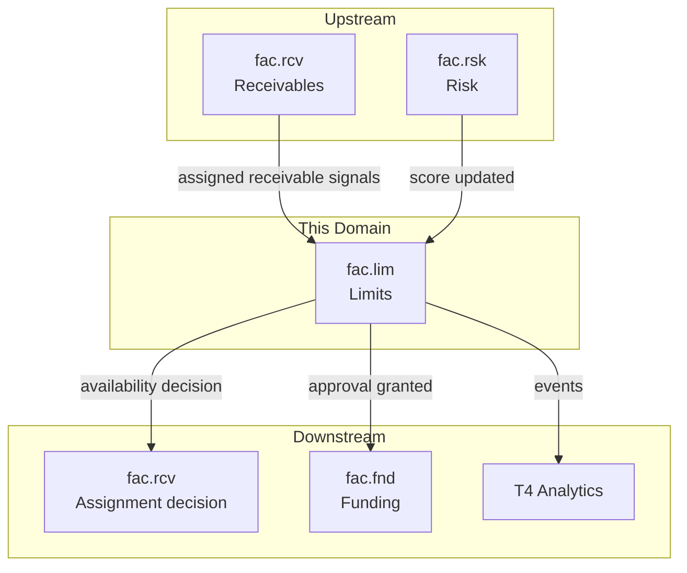
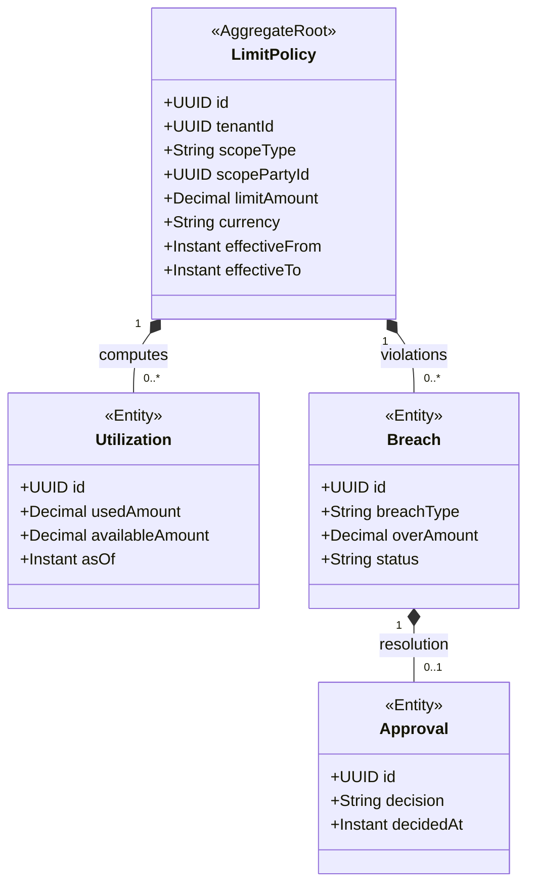
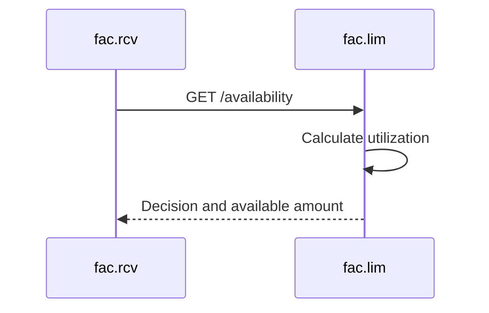

<!-- TEMPLATE COMPLIANCE: ~55%
Template: domain-service-spec.md v1.0.0
Present sections: §0 (purpose, audience, scope, related docs), §1 (business context, value, stakeholders, positioning), §3 (domain model, class diagram), §4 (aggregates, lifecycle, invariants), §6 (REST API), §7 (events — outbound/inbound), §8 (persistence — storage, tables), §9 (security/roles), §10 (NFR), §14 (decisions, open questions)
Missing sections: §2 (service identity table), §4 (no formal BR catalog), §5 (use cases), §8 (no ER diagram, no indexes), §11 (feature dependencies), §12 (extension points), §13 (migration), §15 (appendix)
Naming issues: file should be fac_lim-spec.md per convention
Duplicates: none
Priority: LOW
-->
# Service Domain Specification — `fac.lim` (Limits & Utilization)

> **Meta Information**
> - **Version:** 2026-01-19
> - **Template:** `domain-service-spec.md` v1.0.0
> - **Template Compliance:** ~55% — §2 (service identity table), §4 (formal BR catalog), §5 (use cases), §8 (ER diagram, indexes), §11 (feature dependencies), §12 (extension points), §13 (migration), §15 (appendix) missing
> - **Author(s):** OpenLeap Architecture Team
> - **Status:** DRAFT
> - **Tier:** T3
> - **Suite:** `fac`
> - **Domain:** `lim`
> - **Service ID:** `fac-lim-svc`
> - **basePackage:** `io.openleap.fac.lim`
> - **API Base Path:** `/api/fac/lim/v1`

---

## Specification Guidelines Compliance

> **This specification MUST comply with the project-wide specification guidelines.**
>
> #### Non-negotiables
> - Never invent facts. If information is missing, add an **OPEN QUESTION** entry.
> - Use **MUST/SHOULD/MAY** for normative statements.
> - Keep the spec **self-contained**: no references to chat context.
> - Record decisions and boundaries explicitly (see Section 12).

---

## 0. Document Purpose & Scope

### 0.1 Purpose
`fac.lim` specifies the **credit limits, utilization tracking, and approval workflows** domain of the Factoring (FAC) suite.

`fac.lim` enforces credit guardrails to protect the factor from over-exposure by maintaining limit policies and real-time utilization views, and by providing approval workflows for breaches.

### 0.2 Target Audience
- Risk & Credit Managers
- Factoring Operations
- Architects / Tech Leads
- Integration & Platform Engineers

### 0.3 Scope

**In Scope (MUST):**
- MUST maintain `LimitPolicy` definitions with scopes (debtor, client, portfolio) and caps.
- MUST calculate real-time `Utilization` for limit scopes.
- MUST enforce hard/soft limit semantics:
  - hard limit → reject,
  - soft limit → require approval.
- MUST record breaches and their resolution (`approved`, `rejected`, `expired`).
- MUST support temporary uplifts that are time-bound (suite baseline example: 30 days).
- SHOULD monitor concentration risk (suite baseline: no single debtor above configured percentage) and raise alerts.
- SHOULD auto-adjust limits based on risk score signals (suite baseline).

**Out of Scope (MUST NOT):**
- MUST NOT ingest and own receivable lifecycle → `fac.rcv`.
- MUST NOT fund, disburse, or apply payments → `fac.fnd`.
- MUST NOT compute risk scores or underwrite coverage → `fac.rsk`.
- MUST NOT implement external credit scoring algorithms → external providers (suite baseline).

### 0.4 Terms & Acronyms
- **LimitPolicy:** A rule that defines allowed maximum exposure.
- **Utilization:** Current exposure against a limit.
- **Concentration:** A rule limiting exposure concentration to a single debtor.
- **Maker-checker:** Approval separation model.

### 0.5 Related Documents
- Suite architecture: `platform/T3_Domains/FAC/_fac_suite.md`
- Neighbor specs: `fac_rcv.md`, `fac_fnd.md`, `fac_rsk.md`, `fac_col.md`

---

## 1. Business Context

### 1.1 Domain Purpose
`fac.lim` provides real-time answers to: “Is credit available to assign and fund this receivable?”

### 1.2 Business Value
- Prevents over-exposure and limit violations.
- Enables auditable approvals for exceptions.
- Provides guardrails for automated ingestion and assignment flows.

### 1.3 Stakeholders & Roles
| Role | Responsibility | Primary Use Cases |
|------|----------------|-------------------|
| Credit Manager | Define and approve limits | Create policies, approve uplifts |
| Risk Committee | Governance | Define concentration thresholds |
| Operations | Intake execution | Request approvals during assignment |

### 1.4 Strategic Positioning (Context Diagram)

---

## 2. Domain Boundaries & Responsibilities

### 2.1 Responsibilities
- MUST provide real-time availability queries used by `fac.rcv` during assignment.
- MUST record approvals for soft-limit and concentration breaches.
- MUST emit utilization change events.

### 2.2 Non-Responsibilities (Non-Goals)
- MUST NOT decide fee pricing (owned by `fac.fnd` policy/pricing).

### 2.3 Data Ownership and “Source of Truth”
- **Source of truth for:** Limit policies, utilization calculations, approvals → `fac.lim`.
- **References (IDs only):** Debtor and client party ids (`shared.bp`), receivable ids (`fac.rcv`).

---

## 3. Domain Model

### 3.1 Overview (Mermaid `classDiagram`)

---

## 4. Aggregates, Lifecycle & Invariants

### 4.1 Aggregate List
- `LimitPolicy`

### 4.2 Invariants (MUST/SHOULD)
- MUST calculate utilization as exposure across funded receivables plus pending (suite baseline).
- MUST enforce concentration rule (suite baseline example: no single debtor above 20% of portfolio, configurable).
- MUST require approval for:
  - breach above 10% of limit,
  - any concentration breach (suite baseline).
- SHOULD support automatic limit adjustment driven by risk score updates (suite baseline).

---

## 5. Persistence & Storage Design

### 5.1 Storage Decision
- Database: PostgreSQL
- Tenancy model: Multi-tenant with `tenant_id` + RLS (suite baseline)

### 5.2 Tables / Collections
**Naming:** tables MUST be prefixed with `lim_`.

Example (illustrative):
- `lim_limit_policy`
- `lim_utilization`
- `lim_breach`
- `lim_approval`

---

## 6. Public Interfaces (APIs)

### 6.1 REST API (OpenAPI-friendly)
**Base Path:** `/api/fac/lim/v1`

#### 6.1.1 Availability
- `GET /availability`
  - MUST return available amount and decision (`ALLOW`, `REQUIRE_APPROVAL`, `REJECT`) (decision semantics OPEN QUESTION).

#### 6.1.2 Policy management
- `POST /limit-policies`
- `GET /limit-policies/{id}`
- `PUT /limit-policies/{id}/approve` (suite example)

---

## 7. Events & Messaging

### 7.1 Conventions
- **Exchange/Topic:** `fac.events` (suite baseline)
- **Routing key pattern:** `fac.lim.<aggregate>.<event>`

### 7.2 Outbound Events (baseline)
- `fac.lim.utilization.changed`
- `fac.lim.limit.breached`
- `fac.lim.limit.approved`
- `fac.lim.limit.increased` (suite baseline event bus list)

### 7.3 Inbound Events (baseline)
- `fac.rcv.receivable.assigned`
- `fac.rsk.score.updated`

---

## 8. Typical Interactions (Sequences)

### 8.1 Happy Path: Availability check during assignment

---

## 9. Security & Authorization

### 9.1 Roles
- `FAC_LIM_VIEWER`
- `FAC_LIM_EDITOR`
- `FAC_LIM_ADMIN`

---

## 10. Non-Functional Requirements (NFR)

### 10.1 Performance
- MUST answer availability queries in real time for assignment flows (suite baseline).

OPEN QUESTION: Concrete latency SLOs are not specified.

---

## 11. Operability & Observability

### 11.1 Metrics
- Availability query latency, breach rate, approval cycle time, utilization recalculation lag.

---

## 12. Decisions, Conflicts, Open Questions

### 12.1 Decisions
- **DEC-001:** Concentration and limit enforcement is centralized in `fac.lim` (suite baseline, Section 3.2.3).

### 12.3 OPEN QUESTIONS
- **OQ-001:** Exact decision model returned by `GET /availability` and how it is consumed by `fac.rcv`.
- **OQ-002:** How portfolio-level concentration is computed across tenants for the factor (suite baseline mentions factor sees all tenants).

---

## 13. Change Log
- Created: 2026-01-19
