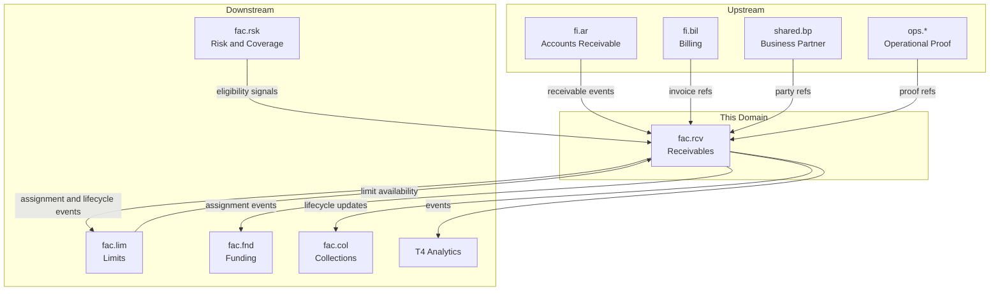
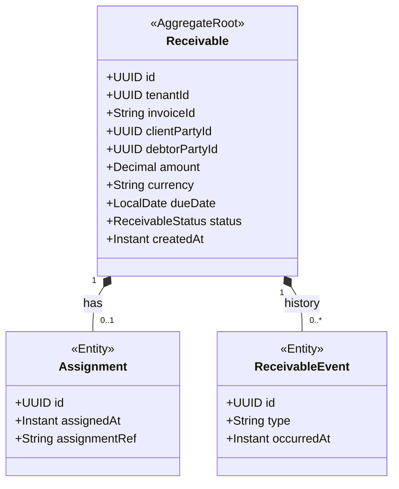
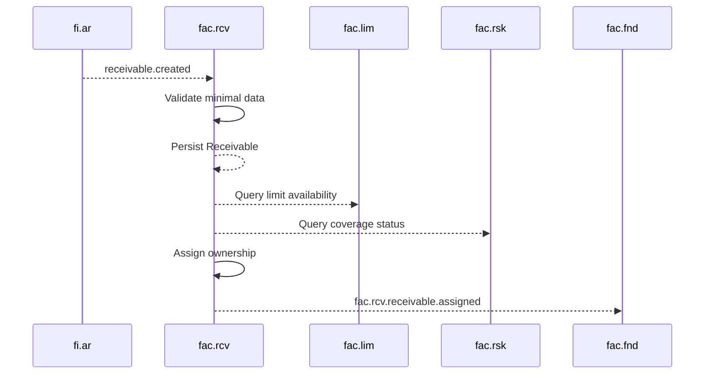
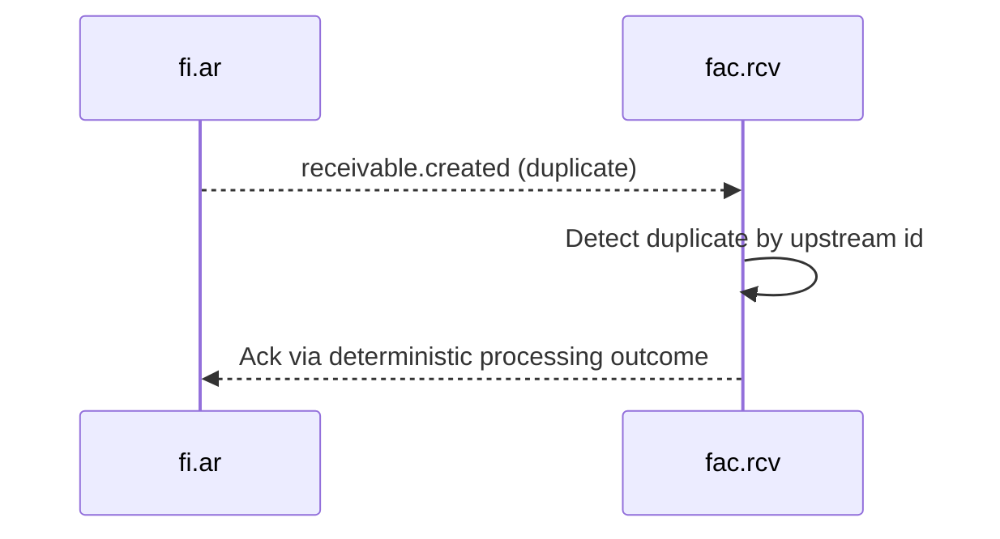

<!-- TEMPLATE COMPLIANCE: ~55%
Template: domain-service-spec.md v1.0.0
Present sections: §0 (purpose, audience, scope, related docs), §1 (business context, value, stakeholders, positioning), §3 (domain model, class diagram), §4 (aggregates, lifecycle, invariants), §6 (REST API), §7 (events — outbound/inbound), §8 (persistence — storage, tables), §9 (security/roles), §10 (NFR), §14 (decisions, open questions)
Missing sections: §2 (service identity table), §4 (no formal BR catalog), §5 (use cases), §8 (no ER diagram, no indexes), §11 (feature dependencies), §12 (extension points), §13 (migration), §15 (appendix)
Naming issues: file should be fac_rcv-spec.md per convention
Duplicates: none
Priority: LOW
-->
# Service Domain Specification — `fac.rcv` (Receivables Management)

> **Meta Information**
> - **Version:** 2026-01-19
> - **Template:** `domain-service-spec.md` v1.0.0
> - **Template Compliance:** ~55% — §2 (service identity table), §4 (formal BR catalog), §5 (use cases), §8 (ER diagram, indexes), §11 (feature dependencies), §12 (extension points), §13 (migration), §15 (appendix) missing
> - **Author(s):** OpenLeap Architecture Team
> - **Status:** DRAFT
> - **Tier:** T3
> - **Suite:** `fac`
> - **Domain:** `rcv`
> - **Service ID:** `fac-rcv-svc`
> - **basePackage:** `io.openleap.fac.rcv`
> - **API Base Path:** `/api/fac/rcv/v1`

---

## Specification Guidelines Compliance

> **This specification MUST comply with the project-wide specification guidelines.**
>
> #### Non-negotiables
> - Never invent facts. If information is missing, add an **OPEN QUESTION** entry.
> - Use **MUST/SHOULD/MAY** for normative statements.
> - Keep the spec **self-contained**: no references to chat context.
> - Record decisions and boundaries explicitly (see Section 12).

---

## 0. Document Purpose & Scope

### 0.1 Purpose
`fac.rcv` specifies the **receivable intake and lifecycle** domain of the Factoring (FAC) suite.

`fac.rcv` is the **gateway into factoring operations**: it ingests receivables originating from invoicing/accounting, validates factoring eligibility (limits, coverage, proof), assigns receivables to the factor, and maintains a traceable receivable lifecycle.

### 0.2 Target Audience
- Product Owners / Business Stakeholders (Factoring Operations)
- Architects / Tech Leads
- Integration & Platform Engineers
- Risk & Credit Managers
- Compliance & Audit

### 0.3 Scope

**In Scope (MUST):**
- MUST ingest receivable inputs from upstream accounting/billing systems (suite baseline: `fi.ar`).
- MUST maintain the receivable lifecycle and state transitions (e.g., `OPEN`, `FUNDED`, `PARTLY_PAID`, `CLOSED`, `DISPUTED`).
- MUST create and persist a traceable ownership transfer record (`Assignment`).
- MUST validate eligibility for assignment using:
  - credit limits and utilization from `fac.lim`,
  - risk/coverage signals from `fac.rsk`,
  - service delivery proof references from the operational execution suite (suite baseline: `OPS`).
- SHOULD reject or quarantine receivables that are not eligible and provide explainable rejection reasons.
- SHOULD emit domain events for downstream domains (`fac.fnd`, `fac.lim`, `fac.col`) and for auditability.

**Out of Scope (MUST NOT):**
- MUST NOT post invoices, manage accounts receivable subledger, or perform accounting postings → `fi` suite.
- MUST NOT execute funding, disbursements, interest accrual, or settlement calculations → `fac.fnd`.
- MUST NOT define or approve limit policies → `fac.lim`.
- MUST NOT implement credit scoring algorithms or insurance underwriting → external providers (suite baseline) and/or `fac.rsk` only as consumer.
- MUST NOT capture the underlying service delivery itself → `ops` and/or `srv` suites.

### 0.4 Terms & Acronyms
- **Receivable:** A factored invoice claim with debtor, amount, due date, and lifecycle state.
- **Assignment:** The legal/commercial act of transferring the receivable ownership from client to factor.
- **Eligibility:** The rule set that determines whether a receivable can be assigned.
- **DPD:** Days Past Due.

### 0.5 Related Documents
- Suite architecture: `platform/T3_Domains/FAC/_fac_suite.md`
- Neighbor specs: `fac_fnd.md`, `fac_lim.md`, `fac_rsk.md`, `fac_col.md`
- Related suites: `platform/T3_Domains/FI/_fi_suite.md`, `platform/tmpspec/T3_Domains/OPS/_ops_suite.md`, `platform/T3_Domains/SRV/_srv_suite.md`

---

## 1. Business Context

### 1.1 Domain Purpose
`fac.rcv` exists to make factoring **operationally safe** and **auditable** by ensuring that only eligible receivables enter the funded portfolio and by maintaining a consistent lifecycle for the receivables that do.

### 1.2 Business Value
- Reduces operational risk by blocking ineligible receivables before funding.
- Ensures traceability from invoice to receivable assignment.
- Enables downstream domains to run deterministically on stable receivable identifiers.

### 1.3 Stakeholders & Roles
| Role | Responsibility | Primary Use Cases |
|------|----------------|-------------------|
| Factoring Operations | Run receivable intake | Ingest, review, assign, reject |
| Credit Manager | Ensure exposure limits | Review exceptions, approve overrides (in `fac.lim`) |
| Risk Manager | Ensure coverage eligibility | Interpret risk/coverage outcomes |
| Auditor | Traceability | Verify assignment trail and decisions |

### 1.4 Strategic Positioning (Context Diagram)

---

## 2. Domain Boundaries & Responsibilities

### 2.1 Responsibilities
- MUST ingest receivables from `fi.ar` and create corresponding `Receivable` aggregates.
- MUST validate assignment eligibility using `fac.lim` (limits) and `fac.rsk` (coverage/risk).
- MUST produce an immutable assignment record (`Assignment`) when ownership is transferred.
- MUST publish events for:
  - receivable creation and updates,
  - assignment completion,
  - rejections/closures,
  - dispute escalation state changes.
- SHOULD maintain a receivable audit trail of state transitions (`ReceivableEvent`) consistent with suite audit requirements.

### 2.2 Non-Responsibilities (Non-Goals)
- MUST NOT calculate advance/reserve/fees/interest (owned by `fac.fnd`).
- MUST NOT decide dunning strategy or execute dunning steps (owned by `fac.col`).

### 2.3 Data Ownership and “Source of Truth”
- **Source of truth for:** Factoring receivable lifecycle and assignment trail → `fac.rcv`.
- **References (IDs only):**
  - invoice/AR references → `fi` suite (exact domain references depend on FI decomposition).
  - client and debtor parties → `shared.bp`.
  - service proof references → operational execution suite (suite baseline: OPS).

---

## 3. Domain Model

### 3.1 Overview (Mermaid `classDiagram`)

### 3.2 Core Concepts (Ubiquitous Language)
- **Receivable lifecycle:** The state machine that tracks receivable progress through factoring.
- **Eligibility validation:** A set of checks gating assignment.
- **Proof linkage:** References to underlying delivered service evidence.

---

## 4. Aggregates, Lifecycle & Invariants

### 4.1 Aggregate List
- `Receivable`

### 4.2 Invariants (MUST/SHOULD)
- MUST reference a valid invoice/AR identifier as provided by upstream (`fi`).
- MUST reference a debtor and client party (`shared.bp`).
- MUST NOT assign a receivable if it is already funded or disputed (suite baseline).
- SHOULD be idempotent on ingestion when receiving duplicate upstream events.
- SHOULD treat assignment as irreversible except for dispute handling semantics (suite baseline; details OPEN QUESTION).

### 4.3 State Machines
**ReceivableStatus (proposal):**
- `OPEN` → `ASSIGNED` → `FUNDED` → `PARTLY_PAID` → `CLOSED`
- `OPEN|ASSIGNED|FUNDED|PARTLY_PAID` → `DISPUTED`
- `OPEN` → `REJECTED`

OPEN QUESTION: Which transitions are allowed once disputed and resolved (e.g., `DISPUTED` → `PARTLY_PAID`)?

---

## 5. Persistence & Storage Design

### 5.1 Storage Decision
- Database: PostgreSQL (suite baseline)
- Tenancy model: Multi-tenant with `tenant_id` + Row-Level Security (RLS) (suite baseline)

### 5.2 Tables / Collections
**Naming:** tables MUST be prefixed with `rcv_`.

Example (illustrative):
- `rcv_receivable`
- `rcv_assignment`
- `rcv_receivable_event`

OPEN QUESTION: Exact table schemas and indexing strategy (invoiceId uniqueness, composite keys) are not defined in the suite spec.

### 5.3 Append-only / Immutability
- Receivable state transitions SHOULD be recorded as append-only `ReceivableEvent` entries (suite baseline “event sourcing for audit trail”).
- Assignment SHOULD be immutable after completion.

---

## 6. Public Interfaces (APIs)

### 6.1 REST API (OpenAPI-friendly)
**Base Path:** `/api/fac/rcv/v1`

#### 6.1.1 Receivable intake and lifecycle
- `GET /receivables`
- `GET /receivables/{id}`
- `POST /receivables/{id}:assign`
  - MUST validate eligibility via `fac.lim` and `fac.rsk`.
  - MUST be idempotent (OPEN QUESTION: idempotency mechanism).
- `POST /receivables/{id}:reject`
  - MUST record a rejection reason.

OPEN QUESTION: Is receivable ingestion exclusively event-driven from FI, or do we also need a synchronous `POST /receivables` API?

### 6.2 Read Models / UI Use-Cases
- Receivable worklist (filter by status, due date, client, debtor).
- Eligibility explanation view (why rejected/blocked).

---

## 7. Events & Messaging

### 7.1 Conventions
- **Exchange/Topic:** `fac.events` (suite baseline)
- **Routing key pattern:** `fac.rcv.<aggregate>.<event>`
- Envelope: suite provides an example JSON envelope in Section 4 of `_fac_suite.md`.

OPEN QUESTION: Do we also need per-domain exchanges `fac.rcv.events` in addition to the shared `fac.events` exchange?

### 7.2 Outbound Events (baseline)
- `fac.rcv.receivable.created`
- `fac.rcv.receivable.updated`
- `fac.rcv.receivable.assigned`
- `fac.rcv.receivable.closed`
- `fac.rcv.receivable.rejected`
- `fac.rcv.assignment.completed`

### 7.3 Inbound Events (baseline)
- `fi.ar.receivable.created` (wording per suite baseline; exact FI event names are OPEN QUESTION)
- `fi.ar.receivable.updated`

---

## 8. Typical Interactions (Sequences)

### 8.1 Happy Path: Ingest and assign receivable

### 8.2 Failure / Retry / Idempotency

OPEN QUESTION: The exact idempotency key and replay response strategy are not defined.

---

## 9. Security & Authorization

### 9.1 Roles
- `FAC_RCV_VIEWER`
- `FAC_RCV_EDITOR`
- `FAC_RCV_ADMIN`

### 9.2 AuthN/AuthZ Policies
- OAuth2/JWT (suite baseline)
- Service-to-service calls SHOULD use mTLS (suite baseline)

### 9.3 Privacy / PII
- Data classification: CONFIDENTIAL (financial exposure; party references)
- PII (party data) SHOULD be referenced by IDs; detailed party info MUST come from `shared.bp`.

---

## 10. Non-Functional Requirements (NFR)

### 10.1 Performance
- SHOULD support high-volume event ingestion from FI.

OPEN QUESTION: Targets for RPS/event rate are not specified.

### 10.2 Availability & Resilience
- MUST tolerate transient upstream event retries.
- SHOULD use DLQ for failed event processing (suite baseline).

### 10.3 Consistency Model
- Strong consistency within `fac.rcv`.
- Eventual consistency for downstream consumers.

---

## 11. Operability & Observability

### 11.1 Logging
- Logs MUST include `traceId` and `tenantId` (suite baseline event envelope).

### 11.2 Metrics
- Ingest rate, rejection rate, assignment latency.

---

## 12. Decisions, Conflicts, Open Questions

### 12.1 Decisions
- **DEC-001:** `fac.rcv` is the gateway domain that owns receivable lifecycle and assignment trail (based on `_fac_suite.md`, Section 3.2.1).

### 12.2 Conflicts (Sources/Constraints)
- FAC suite baseline references OPS for service proof; OPS naming and boundary may evolve (OPEN QUESTION).

### 12.3 OPEN QUESTIONS
- **OQ-001:** Exact upstream event names and payload contract from `fi.ar`.
- **OQ-002:** Is receivable ingestion event-only or also synchronous API-driven?
- **OQ-003:** How are dispute-driven ownership reversals modeled, if allowed?
- **OQ-004:** Which operational suite is authoritative for service proof references: `ops.*` or `srv.*`?

---

## 13. Change Log
- Created: 2026-01-19
