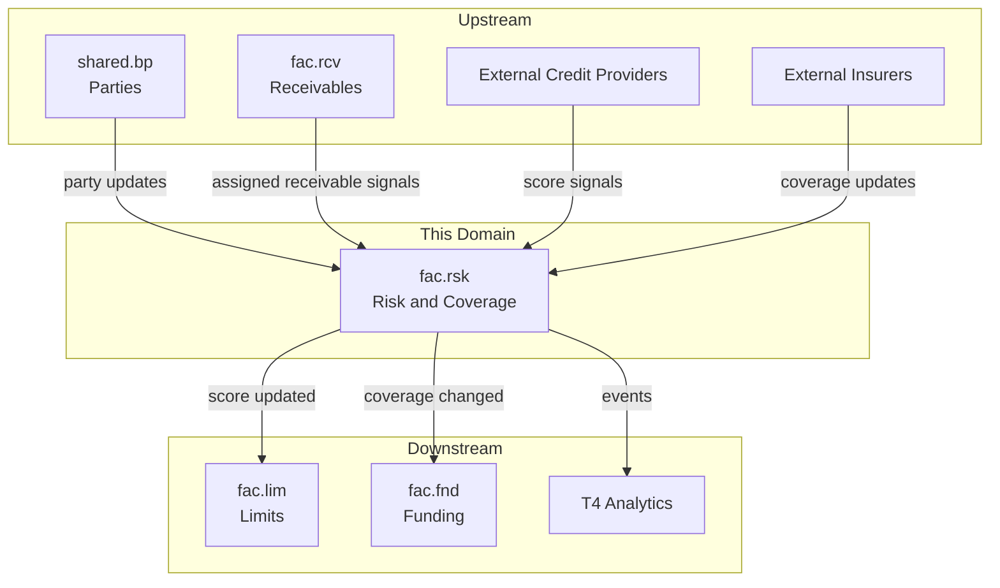
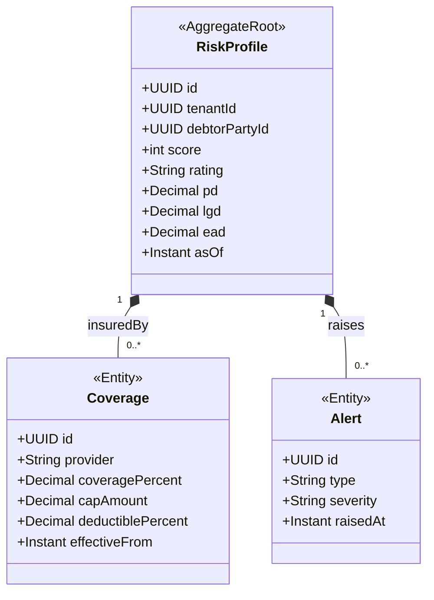
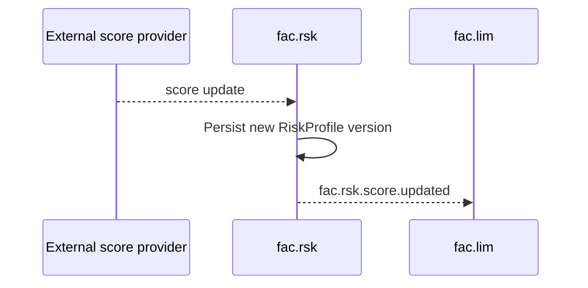

<!-- TEMPLATE COMPLIANCE: ~55%
Template: domain-service-spec.md v1.0.0
Present sections: §0 (purpose, audience, scope, related docs), §1 (business context, value, stakeholders, positioning), §3 (domain model, class diagram), §4 (aggregates, lifecycle, invariants), §6 (REST API), §7 (events — outbound/inbound), §8 (persistence — storage, tables), §9 (security/roles), §10 (NFR), §14 (decisions, open questions)
Missing sections: §2 (service identity table), §4 (no formal BR catalog), §5 (use cases), §8 (no ER diagram, no indexes), §11 (feature dependencies), §12 (extension points), §13 (migration), §15 (appendix)
Naming issues: file should be fac_rsk-spec.md per convention
Duplicates: none
Priority: LOW
-->
# Service Domain Specification — `fac.rsk` (Risk & Coverage)

> **Meta Information**
> - **Version:** 2026-01-19
> - **Template:** `domain-service-spec.md` v1.0.0
> - **Template Compliance:** ~55% — §2 (service identity table), §4 (formal BR catalog), §5 (use cases), §8 (ER diagram, indexes), §11 (feature dependencies), §12 (extension points), §13 (migration), §15 (appendix) missing
> - **Author(s):** OpenLeap Architecture Team
> - **Status:** DRAFT
> - **Tier:** T3
> - **Suite:** `fac`
> - **Domain:** `rsk`
> - **Service ID:** `fac-rsk-svc`
> - **basePackage:** `io.openleap.fac.rsk`
> - **API Base Path:** `/api/fac/rsk/v1`

---

## Specification Guidelines Compliance

> **This specification MUST comply with the project-wide specification guidelines.**
>
> #### Non-negotiables
> - Never invent facts. If information is missing, add an **OPEN QUESTION** entry.
> - Use **MUST/SHOULD/MAY** for normative statements.
> - Keep the spec **self-contained**: no references to chat context.
> - Record decisions and boundaries explicitly (see Section 12).

---

## 0. Document Purpose & Scope

### 0.1 Purpose
`fac.rsk` specifies the **risk intelligence and insurance coverage** domain of the Factoring (FAC) suite.

`fac.rsk` provides the data and signals needed to make safe factoring decisions: debtor risk profiles, PD/LGD/EAD metrics, insurance coverage policies, exposure monitoring, and risk alerts.

### 0.2 Target Audience
- Risk & Credit Managers
- Architects / Tech Leads
- Integration & Platform Engineers
- Compliance & Audit

### 0.3 Scope

**In Scope (MUST):**
- MUST maintain `RiskProfile` for debtors including score, rating, PD/LGD/EAD signals (suite baseline).
- MUST manage `Coverage` information for credit insurance policies (coverage percent, cap, deductible) (suite baseline).
- MUST monitor exposure (covered vs uncovered vs disputed) and raise alerts.
- MUST emit risk/coverage update events for `fac.lim` and `fac.fnd`.
- SHOULD ingest external score signals from credit bureaus/score providers (suite baseline mentions external providers).

**Out of Scope (MUST NOT):**
- MUST NOT provide underwriting as the insurer system of record → external insurers (suite baseline).
- MUST NOT implement credit scoring algorithms as a primary system of record → external providers (suite baseline).
- MUST NOT own receivable lifecycle or assignment decisions → `fac.rcv`.

### 0.4 Terms & Acronyms
- **PD:** Probability of Default.
- **LGD:** Loss Given Default.
- **EAD:** Exposure at Default.
- **Coverage cap:** Maximum insured amount.

### 0.5 Related Documents
- Suite architecture: `platform/T3_Domains/FAC/_fac_suite.md`
- Neighbor specs: `fac_rcv.md`, `fac_lim.md`, `fac_fnd.md`, `fac_col.md`

---

## 1. Business Context

### 1.1 Domain Purpose
`fac.rsk` enables continuous “know your risk” monitoring and supplies eligibility signals used during receivable assignment and funding.

### 1.2 Business Value
- Prevents funding of uncovered or deteriorating exposures.
- Improves limit policies via risk-based updates.
- Provides explainable alerts for operational intervention.

### 1.3 Stakeholders & Roles
| Role | Responsibility | Primary Use Cases |
|------|----------------|-------------------|
| Risk Analyst | Monitor portfolio risk | Review alerts, adjust thresholds |
| Credit Manager | Decide limits | Use risk signals for limit changes |
| Operations | Intake decisions | See coverage validation and risk score |

### 1.4 Strategic Positioning (Context Diagram)

---

## 2. Domain Boundaries & Responsibilities

### 2.1 Responsibilities
- MUST provide risk score and coverage validation APIs.
- MUST raise alerts for configured triggers (suite baseline examples: score drop, coverage drops, concentration, fraud indicators).
- SHOULD keep historical versions of risk scores (suite baseline “versioned”).

### 2.3 Data Ownership and “Source of Truth”
- **Source of truth for:** Risk profiles and coverage policy projections used by FAC → `fac.rsk`.
- **References (IDs only):** Debtor parties (`shared.bp`), receivables (`fac.rcv`).

---

## 3. Domain Model

### 3.1 Overview (Mermaid `classDiagram`)

---

## 4. Aggregates, Lifecycle & Invariants

### 4.1 Aggregate List
- `RiskProfile`

### 4.2 Invariants (MUST/SHOULD)
- MUST treat score range as 0-1000 (suite baseline).
- SHOULD implement configured alert triggers (suite baseline examples: score drop > 50pts, coverage drops > 20%, concentration > 25%).

OPEN QUESTION: Which triggers are mandatory for MVP and how they are configured per tenant.

---

## 5. Persistence & Storage Design

### 5.1 Storage Decision
- Database: PostgreSQL
- Tenancy model: Multi-tenant with `tenant_id` + RLS (suite baseline)

### 5.2 Tables / Collections
**Naming:** tables MUST be prefixed with `rsk_`.

Example (illustrative):
- `rsk_risk_profile`
- `rsk_coverage`
- `rsk_alert`

---

## 6. Public Interfaces (APIs)

### 6.1 REST API (OpenAPI-friendly)
**Base Path:** `/api/fac/rsk/v1`

#### 6.1.1 Risk profiles
- `GET /risk-profiles/{party_id}?as_of=...` (suite example)

#### 6.1.2 Coverage validation
- `GET /coverage/{party_id}` (path and shape OPEN QUESTION)

---

## 7. Events & Messaging

### 7.1 Conventions
- **Exchange/Topic:** `fac.events` (suite baseline)
- **Routing key pattern:** `fac.rsk.<aggregate>.<event>`

### 7.2 Outbound Events (baseline)
- `fac.rsk.score.updated`
- `fac.rsk.coverage.updated`
- `fac.rsk.coverage.dropped`
- `fac.rsk.alert.raised`

### 7.3 Inbound Events (baseline)
- `bp.bp.party.updated` (exact BP event names are OPEN QUESTION)
- `fac.rcv.receivable.assigned`
- External credit bureau webhooks (transport and contract OPEN QUESTION)

---

## 8. Typical Interactions (Sequences)

### 8.1 Happy Path: Score update triggers limit adjustment

---

## 9. Security & Authorization

### 9.1 Roles
- `FAC_RSK_VIEWER`
- `FAC_RSK_EDITOR`
- `FAC_RSK_ADMIN`

---

## 10. Non-Functional Requirements (NFR)

### 10.2 Availability & Resilience
- SHOULD tolerate intermittent external provider failures.
- SHOULD keep last-known-good risk profile and clearly mark staleness (OPEN QUESTION: staleness rules).

---

## 11. Operability & Observability

### 11.2 Metrics
- Alert rate, score update frequency, coverage change frequency, staleness distribution.

---

## 12. Decisions, Conflicts, Open Questions

### 12.1 Decisions
- **DEC-001:** `fac.rsk` supplies risk and coverage signals; underwriting and scoring algorithms are external (suite baseline, Section 0.1 and 3.2.4).

### 12.3 OPEN QUESTIONS
- **OQ-001:** External provider integration patterns (pull vs push) and event schema.
- **OQ-002:** Coverage policy management lifecycle: which system is authoritative for updates.
- **OQ-003:** How exposures are computed and fed into EAD values.

---

## 13. Change Log
- Created: 2026-01-19
