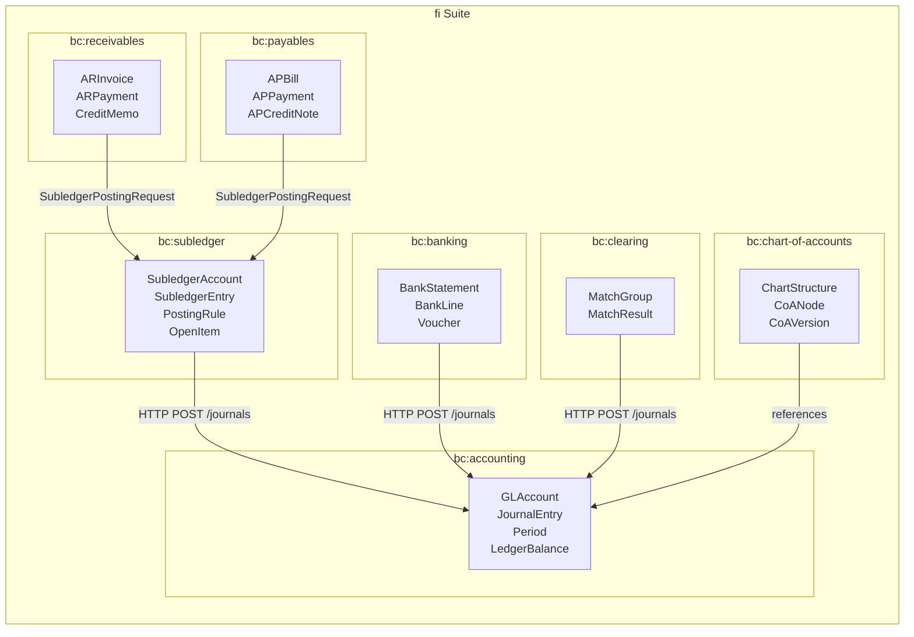
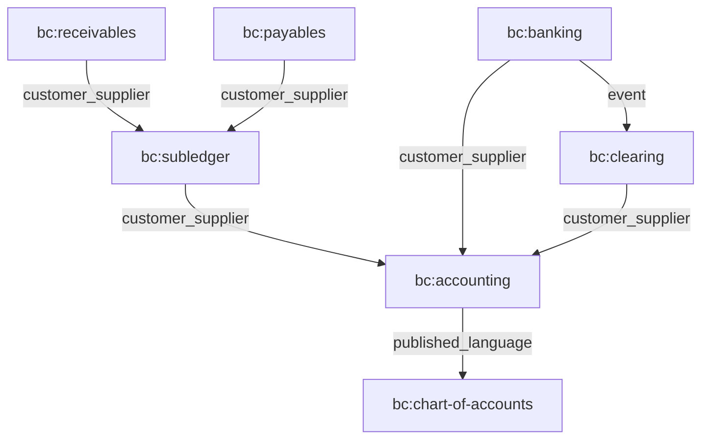
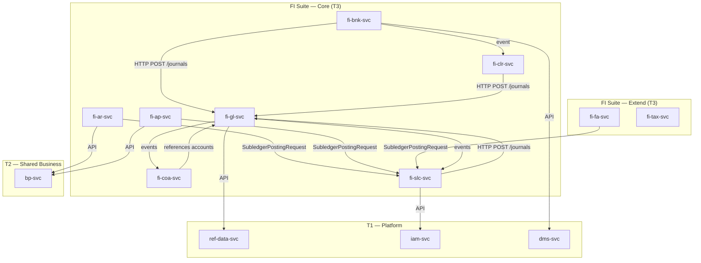
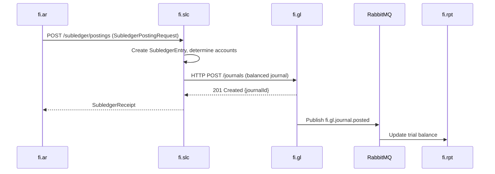
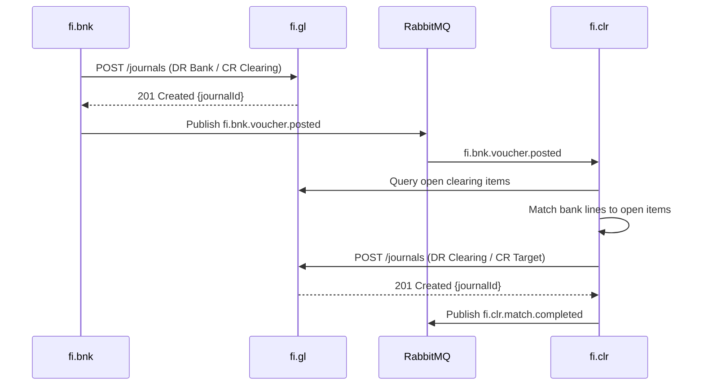
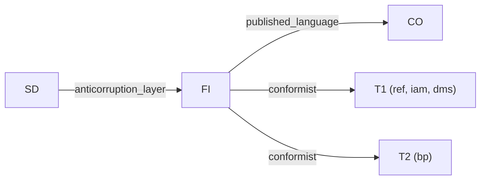

# Finance (FI) Suite Specification

> **Conceptual Stack Layer:** Suite
> **Space:** Platform
> **Owner:** FI Domain Engineering Team
> **Schema alignment:** `suite-layer.schema.json`
> **Companion files:** `fi.catalog.uvl` (referenced in SS6)
> **Contains:** Domain/Service Specs, Platform-Feature Specs, Feature Catalog

> **Meta Information**
> - **Version:** 2026-04-01
> - **Template:** `suite-spec.md` v1.0.0
> - **Template Compliance:** ~96% — canonical layout applied, §7 Open Questions added
> - **Author(s):** OpenLeap Architecture Team
> - **Status:** DRAFT
> - **Suite ID:** `fi`
> - **Suite Name:** Finance
> - **Description:** End-to-end financial accounting suite covering general ledger, subledgers, banking, clearing, reporting, and regulatory compliance.
> - **Semantic Version:** `3.0.0`
> - **Team:**
>   - Name: `team-fi`
>   - Email: `fi-team@openleap.io`
>   - Slack: `#fi-team`
> - **Bounded Contexts:** `bc:accounting`, `bc:receivables`, `bc:payables`, `bc:banking`, `bc:clearing`, `bc:subledger`, `bc:chart-of-accounts`, `bc:reporting`, `bc:fixed-assets`, `bc:tax`, `bc:consolidation`, `bc:intercompany`, `bc:revenue-recognition`, `bc:inventory-valuation`, `bc:project-accounting`

---

## Specification Guidelines

> **This specification MUST comply with the OpenLeap specification guidelines.**
>
> ### Non-Negotiables
> - Never invent facts. If required info is missing, add an **OPEN QUESTION** entry.
> - Preserve intent and decisions. Only change meaning when explicitly requested.
> - Keep the spec **self-contained**: no "see chat", no implicit context.
>
> ### Style Guide
> - Prefer short sentences and lists.
> - Use MUST/SHOULD/MAY for normative statements.
> - Keep terminology consistent with the Ubiquitous Language defined in SS1.
> - Avoid ambiguous words ("often", "maybe") unless explicitly noting uncertainty.

---

<!-- ═══════════════════════════════════════════════════════════════════
     SS0  SUITE IDENTITY & PURPOSE
     Schema alignment: metadata + purpose
     ═══════════════════════════════════════════════════════════════════ -->

## 0. Suite Identity & Purpose

### 0.1 Suite Identity

| Field | Value |
|-------|-------|
| id | `fi` |
| name | Finance |
| description | End-to-end financial accounting suite covering general ledger, subledgers, banking, clearing, reporting, and regulatory compliance. |
| version | `3.0.0` |
| status | `draft` |
| owner.team | `team-fi` |
| owner.email | `fi-team@openleap.io` |
| owner.slack | `#fi-team` |
| boundedContexts | `bc:accounting`, `bc:receivables`, `bc:payables`, `bc:banking`, `bc:clearing`, `bc:subledger`, `bc:chart-of-accounts`, `bc:reporting`, `bc:fixed-assets`, `bc:tax`, `bc:consolidation`, `bc:intercompany`, `bc:revenue-recognition`, `bc:inventory-valuation`, `bc:project-accounting` |

### 0.2 Business Purpose

The Finance (FI) suite provides the complete financial accounting backbone for the OpenLeap ERP platform. It implements **General Ledger–owned posting accounts** with strict audit-grade separation of responsibilities. The suite records every financial transaction in accordance with double-entry bookkeeping principles, ensures statutory and regulatory compliance (IFRS, GAAP, SOX, local tax regulations), and provides the foundation for all financial reporting and analysis.

Key architectural decision:
> **All posting accounts (GLAccounts) are owned and managed by `fi.gl`.** `fi.coa` provides only structural, reporting, and grouping views on top of GL-owned accounts.

### 0.3 In Scope

- General Ledger: double-entry bookkeeping, period management, journal entries, ledger balances
- GLAccount lifecycle: create, activate, block, deactivate posting accounts (owned by fi.gl)
- Chart of Accounts: structural trees, reporting hierarchies, multi-framework views (IFRS, Local, Mgmt)
- Accounts Receivable: customer invoices, payments, cash application, aging, collections
- Accounts Payable: vendor bills, payments, payment execution, procurement matching
- Banking: bank statement import, normalization, initial postings
- Clearing & Matching: match bank lines to open items, reclassification postings
- Subledger Core: posting rules, account determination, subledger accounts/entries/balances, open items, aging
- Reporting: Trial Balance, Balance Sheet, Profit & Loss, Cash Flow, aging, audit views
- Fixed Assets: asset lifecycle, depreciation, disposals, revaluations
- Tax: tax calculation, compliance, returns
- Revenue Recognition: contract revenue, performance obligations (IFRS 15 / ASC 606)
- Consolidation: multi-entity consolidation, eliminations, currency translation
- Intercompany: IC transactions, matching, netting, settlements
- Inventory Valuation: cost methods, revaluation, period-end valuation
- Project Accounting: project costs, revenue, WIP, billing

### 0.4 Out of Scope

- Dunning / collections workflows (-> future credit.collections domain)
- Commercial contracts and sales orders (-> SD suite)
- Service execution proof (-> SRV suite)
- Channel checkout (-> COM suite)
- Cost accounting and management reporting (-> CO suite)
- Budget and planning (-> future Planning suite)
- Full procurement workflows (-> PUR suite)
- Customer and vendor master data (-> bp, T2 Business Partner)

### 0.5 Target Users

| Role | Interest |
|------|----------|
| Controller | Period closing, financial statements, reconciliation, compliance |
| CFO / Finance Leadership | Financial position, strategic planning, board reporting |
| Staff Accountant | Day-to-day accounting, manual journals, reconciliation |
| AP Clerk | Vendor bill processing, payment runs, PO matching |
| AR Clerk | Customer invoicing, cash application, collections |
| Treasury Manager | Cash position, payment execution, bank reconciliation |
| External Auditor | Audit trail, journal review, balance validation |
| Tax Accountant | Tax calculation, returns, compliance |
| Asset Manager | Fixed asset lifecycle, depreciation schedules |
| System Administrator | Account management, period configuration, posting rules |

### 0.6 Business Value

- **Compliance:** Meet statutory and regulatory reporting requirements (IFRS, GAAP, SOX, local regulations)
- **Financial Truth:** Single source of truth for all financial transactions via double-entry bookkeeping
- **Audit Trail:** Complete traceability from source document to financial statement
- **Automation:** Rule-based posting reduces manual journal entries by 90%+
- **Cash Management:** Optimize DPO, DSO, and cash position through integrated AR/AP/Banking
- **Multi-Dimensional Accounting:** Support multiple charts, currencies, legal entities, and reporting frameworks

---

<!-- ═══════════════════════════════════════════════════════════════════
     SS1  UBIQUITOUS LANGUAGE
     Schema alignment: ubiquitous_language[]
     ═══════════════════════════════════════════════════════════════════ -->

## 1. Ubiquitous Language

### 1.1 Glossary

| ID | Term | Aliases | Definition |
|----|------|---------|------------|
| fi:glossary:general-ledger | General Ledger | GL | The complete record of all financial transactions for a legal entity, maintained via double-entry bookkeeping. |
| fi:glossary:gl-account | GLAccount | Posting Account | An account owned by fi.gl used in journal lines; carries full lifecycle (ACTIVE, BLOCKED, DEACTIVATED) and audit trail. |
| fi:glossary:journal-entry | Journal Entry | Journal, Posting | An immutable, balanced double-entry transaction (DR = CR) recorded in the General Ledger. |
| fi:glossary:journal-line | Journal Line | Posting Line | A single debit or credit entry within a journal entry, referencing a GLAccount. |
| fi:glossary:period | Period | Fiscal Period | A fiscal time boundary (typically a month) within which financial transactions are recorded. |
| fi:glossary:chart-of-accounts | Chart of Accounts | CoA | A hierarchical structure providing reporting views on GL-owned accounts; owned by fi.coa. |
| fi:glossary:subledger | Subledger | — | A detailed transaction ledger for a specific domain (AR, AP, FA, INV) that feeds into the General Ledger. |
| fi:glossary:subledger-account | Subledger Account | — | A customer, vendor, asset, or inventory account managed by fi.slc with entries, balances, and open items. |
| fi:glossary:posting-rule | Posting Rule | Account Determination Rule | A configurable rule in fi.slc that maps business events to GL accounts (debit/credit). |
| fi:glossary:open-item | Open Item | — | An outstanding invoice or bill that has not been fully matched to a payment. |
| fi:glossary:control-account | Control Account | Reconciliation Account | A GL account that summarizes a subledger (e.g., total AR, total AP); rejects manual postings. |
| fi:glossary:voucher-receipt | Voucher Receipt | VR | Confirmation from fi.gl after journal posting; immutable posting evidence. |
| fi:glossary:subledger-receipt | Subledger Receipt | SLR | Confirmation from fi.slc after subledger entry creation. |
| fi:glossary:bank-statement | Bank Statement | — | An electronic document from a bank listing transactions on an account (CAMT/MT940/CSV). |
| fi:glossary:match-group | Match Group | — | An audit link connecting source bank lines to resulting reclassification postings in fi.clr. |
| fi:glossary:clearing | Clearing | — | The process of matching bank lines to open items and creating reclassification postings. |
| fi:glossary:reversal | Reversal | — | A cancellation journal that mirrors the original (DR <-> CR swapped); the only way to correct posted journals. |
| fi:glossary:trial-balance | Trial Balance | TB | A list of all account balances that should sum to zero (total DR = total CR). |
| fi:glossary:idempotency-key | Idempotency Key | — | A unique key on journal entries ensuring the same posting request is not processed twice. |
| fi:glossary:double-entry | Double-Entry | — | The accounting principle that every transaction has equal debits and credits. |

### 1.2 UBL Boundary Test

**FI vs. CO (Controlling):**
FI uses "Journal Entry" to mean an immutable, balanced double-entry financial transaction with legal significance. CO uses "Cost Allocation" to mean an internal management accounting distribution that has no legal standing. Both reference the same GLAccounts, but FI records the legal truth while CO provides management views. This confirms FI and CO are separate suites.

**FI vs. SD (Sales & Distribution):**
FI uses "Invoice" to mean a financial document representing money owed by a customer (AR) or owed to a vendor (AP). SD uses "Sales Order" to mean a commercial commitment to deliver goods/services. The SD order.completed event triggers AR invoice creation, but the semantics differ. This confirms FI and SD are separate suites.

---

<!-- ═══════════════════════════════════════════════════════════════════
     SS2  DOMAIN MODEL
     Schema alignment: domain_model
     ═══════════════════════════════════════════════════════════════════ -->

## 2. Domain Model

### 2.1 Conceptual Overview



### 2.2 Core Concepts

| Concept | Owner (Service) | Description | Glossary Ref |
|---------|----------------|-------------|-------------|
| GLAccount | `fi-gl-svc` | Posting account with full lifecycle management | `fi:glossary:gl-account` |
| JournalEntry | `fi-gl-svc` | Immutable, balanced double-entry transaction | `fi:glossary:journal-entry` |
| Period | `fi-gl-svc` | Fiscal time boundary for transaction recording | `fi:glossary:period` |
| LedgerBalance | `fi-gl-svc` | Aggregated balance per account, period, currency | `fi:glossary:trial-balance` |
| ChartStructure | `fi-coa-svc` | Hierarchical reporting view on GL-owned accounts | `fi:glossary:chart-of-accounts` |
| SubledgerAccount | `fi-slc-svc` | Customer/vendor/asset/inventory account | `fi:glossary:subledger-account` |
| PostingRule | `fi-slc-svc` | Account determination rule | `fi:glossary:posting-rule` |
| ARInvoice | `fi-ar-svc` | Customer invoice document | `fi:glossary:open-item` |
| APBill | `fi-ap-svc` | Vendor bill document | `fi:glossary:open-item` |
| BankStatement | `fi-bnk-svc` | Imported bank statement facts | `fi:glossary:bank-statement` |
| MatchGroup | `fi-clr-svc` | Audit link from bank lines to reclassification postings | `fi:glossary:match-group` |

### 2.3 Shared Kernel

| Concept | Owner | Shared With | Mechanism |
|---------|-------|-------------|-----------|
| GLAccount (ID/code/status) | `fi-gl-svc` | `fi-slc-svc`, `fi-coa-svc`, `fi-bnk-svc`, `fi-clr-svc` | `event` (account.created, account.status.changed) + `api` (GET /accounts) |
| Period (ID/status) | `fi-gl-svc` | `fi-slc-svc`, `fi-ar-svc`, `fi-ap-svc`, `fi-rpt-svc` | `event` (period.closed) |
| SubledgerReceipt | `fi-slc-svc` | `fi-ar-svc`, `fi-ap-svc` | `api` (POST /subledger/postings response) |
| OpenItem | `fi-slc-svc` | `fi-ar-svc`, `fi-ap-svc`, `fi-clr-svc` | `api` (GET /open-items) |

### 2.4 Bounded Context Map (Intra-Suite)

| Upstream | Downstream | Pattern | Description |
|----------|-----------|---------|-------------|
| `bc:accounting` (fi.gl) | `bc:subledger` (fi.slc) | `customer_supplier` | fi.slc submits balanced journals to fi.gl; fi.gl is the authority |
| `bc:receivables` (fi.ar) | `bc:subledger` (fi.slc) | `customer_supplier` | fi.ar sends SubledgerPostingRequests to fi.slc |
| `bc:payables` (fi.ap) | `bc:subledger` (fi.slc) | `customer_supplier` | fi.ap sends SubledgerPostingRequests to fi.slc |
| `bc:banking` (fi.bnk) | `bc:accounting` (fi.gl) | `customer_supplier` | fi.bnk posts directly to fi.gl |
| `bc:clearing` (fi.clr) | `bc:accounting` (fi.gl) | `customer_supplier` | fi.clr posts reclassification journals directly to fi.gl |
| `bc:accounting` (fi.gl) | `bc:chart-of-accounts` (fi.coa) | `published_language` | fi.coa references GL-owned accounts; fi.gl publishes account events |



---

<!-- ═══════════════════════════════════════════════════════════════════
     SS3  SERVICE LANDSCAPE
     Schema alignment: service_landscape
     ═══════════════════════════════════════════════════════════════════ -->

## 3. Service Landscape

### 3.1 Service Catalog

**FI-Core:**

| Service ID | Name | Bounded Context | Status | Responsibility | Spec |
|-----------|------|----------------|--------|----------------|------|
| `fi-gl-svc` | General Ledger | `bc:accounting` | `development` | Double-entry bookkeeping, GLAccount lifecycle, period management, journal posting | `fi_gl.md` |
| `fi-coa-svc` | Chart of Accounts | `bc:chart-of-accounts` | `development` | Structural trees, reporting hierarchies, CoA versioning | `fi_coa.md` |
| `fi-ar-svc` | Accounts Receivable | `bc:receivables` | `development` | Customer invoices, payments, cash application, aging | `fi_ar.md` |
| `fi-ap-svc` | Accounts Payable | `bc:payables` | `development` | Vendor bills, payments, payment execution, PO matching | `fi_ap.md` |
| `fi-bnk-svc` | Banking | `bc:banking` | `development` | Bank statement import, normalization, initial postings | `fi_bnk.md` |
| `fi-clr-svc` | Clearing & Matching | `bc:clearing` | `development` | Match bank lines to open items, reclassification postings | `fi_clr.md` |
| `fi-slc-svc` | Subledger Core | `bc:subledger` | `development` | Posting rules, account determination, subledger ledger, GL posting | `fi_slc.md` |
| `fi-cls-svc` | Close & Settlement | `bc:accounting` | `planned` | Period-end closing orchestration, settlement runs | `fi_cls.md` |
| `fi-rpt-svc` | Reporting | `bc:reporting` | `planned` | Trial Balance, BS, P&L, CF, aging, audit views | — |

**FI-Extend:**

| Service ID | Name | Bounded Context | Status | Responsibility | Spec |
|-----------|------|----------------|--------|----------------|------|
| `fi-fa-svc` | Fixed Assets | `bc:fixed-assets` | `planned` | Asset lifecycle, depreciation, disposals, revaluations | `fi_fa.md` |
| `fi-tax-svc` | Tax | `bc:tax` | `planned` | Tax calculation, compliance, returns | `ext/fi_tax.md` |
| `fi-rvrc-svc` | Revenue Recognition | `bc:revenue-recognition` | `planned` | Contract revenue, performance obligations (IFRS 15 / ASC 606) | `ext/fi_rvrc.md` |
| `fi-cnsl-svc` | Consolidation | `bc:consolidation` | `planned` | Multi-entity consolidation, eliminations, currency translation | `ext/fi_cnsl.md` |
| `fi-ic-svc` | Intercompany | `bc:intercompany` | `planned` | IC transactions, matching, netting, settlements | `ext/fi_ic.md` |
| `fi-inv-svc` | Inventory Valuation | `bc:inventory-valuation` | `planned` | Cost methods, revaluation, period-end valuation | `ext/fi_inv.md` |
| `fi-prj-svc` | Project Accounting | `bc:project-accounting` | `planned` | Project costs, revenue, WIP, billing | `ext/fi_prj.md` |

### 3.2 Responsibility Matrix

| Responsibility | Service |
|---------------|---------|
| Double-entry bookkeeping and journal posting | `fi-gl-svc` |
| GLAccount lifecycle (create, activate, deactivate) | `fi-gl-svc` |
| Fiscal period management and closing | `fi-gl-svc` |
| Chart of Accounts structures and reporting hierarchies | `fi-coa-svc` |
| Customer invoices, payments, cash application | `fi-ar-svc` |
| Vendor bills, payments, payment execution | `fi-ap-svc` |
| Bank statement import and initial postings | `fi-bnk-svc` |
| Clearing and matching of bank lines to open items | `fi-clr-svc` |
| Account determination and subledger bookkeeping | `fi-slc-svc` |
| GL posting on behalf of subledger domains | `fi-slc-svc` |
| Open item management and aging analysis | `fi-slc-svc` |
| Fixed asset lifecycle and depreciation | `fi-fa-svc` |
| Tax calculation and compliance | `fi-tax-svc` |
| Revenue recognition (IFRS 15 / ASC 606) | `fi-rvrc-svc` |
| Multi-entity consolidation | `fi-cnsl-svc` |
| Intercompany transactions | `fi-ic-svc` |
| Inventory valuation | `fi-inv-svc` |
| Project accounting | `fi-prj-svc` |

### 3.3 Service Dependency Diagram



---

<!-- ═══════════════════════════════════════════════════════════════════
     SS4  INTEGRATION PATTERNS
     Schema alignment: integration_patterns
     ═══════════════════════════════════════════════════════════════════ -->

## 4. Integration Patterns

### 4.1 Pattern Decision

| Field | Value |
|-------|-------|
| **Pattern** | `hybrid` |

**Rationale:**
- **Synchronous (HTTP POST):** Subledger domains and direct posters submit balanced journals to fi.gl via HTTP. This is synchronous because the caller needs immediate confirmation that the journal was accepted.
- **Asynchronous (Events):** fi.gl publishes domain events after successful posting. Downstream consumers (fi.rpt, co.cca, t4.bi, fi.slc, fi.coa) react independently. No multi-service transaction coordination is needed.
- **Two posting paths:** Subledger path (fi.ar/fi.ap/fi.fa → fi.slc → fi.gl) and direct path (fi.bnk/fi.clr → fi.gl).

### 4.2 Key Event Flows

#### Flow 1: Subledger Posting (AR Invoice → GL)

**Trigger:** Customer invoice created in fi.ar



#### Flow 2: Direct Posting (Bank Statement → Clearing)

**Trigger:** Bank statement imported in fi.bnk



### 4.3 Sync vs. Async Decisions

| Integration | Type | Reason |
|------------|------|--------|
| Subledger domains → fi.slc | `sync` | Caller needs immediate SubledgerReceipt confirmation |
| fi.slc → fi.gl (journal posting) | `sync` | Caller needs immediate journalId confirmation for audit trail |
| fi.bnk/fi.clr → fi.gl (journal posting) | `sync` | Caller needs immediate confirmation for idempotency tracking |
| fi.gl → fi.rpt (reporting update) | `async` | Eventual consistency is acceptable for reporting |
| fi.gl → fi.slc (account status) | `async` | fi.slc can react to account changes asynchronously |
| fi.bnk → fi.clr (voucher posted) | `async` | Clearing can process in background after bank import |

### 4.4 Error Handling

| Scenario | Handling |
|----------|---------|
| fi.gl rejects unbalanced journal | Synchronous 400 error returned to caller; caller MUST fix and retry |
| fi.gl rejects posting to closed period | Synchronous 403 error; caller MUST select correct period |
| Event consumer fails | Dead-letter queue + manual retry; at-least-once delivery via outbox pattern |
| fi.slc cannot reach fi.gl | Circuit breaker, 3 retries with exponential backoff, then fail the posting request |
| Duplicate idempotency key with same payload | fi.gl returns 200 OK with existing journal (safe replay) |
| Duplicate idempotency key with different payload | fi.gl returns 409 Conflict |

---

<!-- ═══════════════════════════════════════════════════════════════════
     SS5  EVENT CONVENTIONS
     Schema alignment: event_conventions
     ═══════════════════════════════════════════════════════════════════ -->

## 5. Event Conventions

### 5.1 Routing Key Pattern

**Pattern:** `fi.{domain}.{aggregate}.{action}`

| Segment | Description | Examples |
|---------|-------------|---------|
| `fi` | Always `fi` | `fi` |
| `{domain}` | Domain short code | gl, ar, ap, bnk, clr, slc, coa, fa, tax |
| `{aggregate}` | Aggregate root name (lowercase) | journal, account, period, invoice, bill, voucher, match |
| `{action}` | Past-tense verb | `created`, `posted`, `reversed`, `closed`, `settled`, `completed` |

**Examples:**
- `fi.gl.journal.posted`
- `fi.gl.account.created`
- `fi.gl.period.closed`
- `fi.ar.invoice.posted`
- `fi.ap.bill.posted`
- `fi.bnk.voucher.posted`
- `fi.clr.match.completed`

### 5.2 Payload Envelope

```json
{
  "eventId": "uuid",
  "eventType": "fi.{domain}.{aggregate}.{action}",
  "timestamp": "ISO-8601",
  "tenantId": "string",
  "correlationId": "uuid",
  "causationId": "uuid",
  "producer": "fi-{domain}-svc",
  "schemaVersion": "{major}.{minor}.{patch}",
  "payload": { }
}
```

### 5.3 Versioning Strategy

| Field | Value |
|-------|-------|
| **Strategy** | Schema evolution with backward compatibility |
| **Description** | New optional fields are additive. Removing fields requires a new major version with parallel publishing during migration. |

### 5.4 Event Catalog

| Routing Key | Producer | Consumer(s) | Description |
|------------|----------|-------------|-------------|
| `fi.gl.journal.posted` | `fi-gl-svc` | `fi-rpt-svc`, `fi-slc-svc`, `co-cca-svc`, `t4-bi-svc` | Journal entry successfully posted |
| `fi.gl.journal.reversed` | `fi-gl-svc` | `fi-rpt-svc`, `fi-slc-svc` | Journal cancelled via reversal |
| `fi.gl.period.closed` | `fi-gl-svc` | `fi-slc-svc`, `fi-ar-svc`, `fi-ap-svc`, `fi-rpt-svc` | Period transitioned to CLOSED |
| `fi.gl.ledger.snapshot.created` | `fi-gl-svc` | `fi-rpt-svc`, `t4-bi-svc` | Ledger snapshot frozen at period close |
| `fi.gl.ledger.coa.bound` | `fi-gl-svc` | `fi-coa-svc`, `fi-rpt-svc`, `fi-slc-svc` | COA version bound to ledger |
| `fi.gl.account.created` | `fi-gl-svc` | `fi-coa-svc`, `fi-slc-svc`, `fi-rpt-svc` | New GLAccount created |
| `fi.gl.account.status.changed` | `fi-gl-svc` | `fi-slc-svc`, `fi-coa-svc`, `fi-rpt-svc` | GLAccount status changed |
| `fi.gl.account.deactivated` | `fi-gl-svc` | `fi-coa-svc`, `fi-slc-svc`, `fi-rpt-svc` | GLAccount permanently deactivated |
| `fi.ar.invoice.posted` | `fi-ar-svc` | `fi-slc-svc` | Customer invoice posted |
| `fi.ar.payment.received` | `fi-ar-svc` | `fi-slc-svc` | Customer payment received |
| `fi.ap.bill.posted` | `fi-ap-svc` | `fi-slc-svc` | Vendor bill posted |
| `fi.ap.payment.instructed` | `fi-ap-svc` | treasury | Payment instruction sent to treasury |
| `fi.ap.payment.settled` | `fi-ap-svc` | `fi-slc-svc` | Payment settled (after treasury confirmation) |
| `fi.bnk.voucher.posted` | `fi-bnk-svc` | `fi-clr-svc` | Bank voucher posted, ready for clearing |
| `fi.clr.match.completed` | `fi-clr-svc` | `fi-rpt-svc` | Clearing match completed |

---

<!-- ═══════════════════════════════════════════════════════════════════
     SS6  FEATURE CATALOG
     Schema alignment: (references companion fi.catalog.uvl)
     ═══════════════════════════════════════════════════════════════════ -->

## 6. Feature Catalog

> OPEN QUESTION: The feature tree for the FI suite has not been authored yet. Feature IDs (F-FI-NNN) and the companion `fi.catalog.uvl` file need to be defined.

### 6.1 Feature Tree

> OPEN QUESTION: Content for this section has not been authored yet.

### 6.2 Mandatory Features

> OPEN QUESTION: Content for this section has not been authored yet.

### 6.3 Cross-Suite Feature Dependencies

> OPEN QUESTION: Content for this section has not been authored yet.

### 6.4 Feature Register

> OPEN QUESTION: Content for this section has not been authored yet.

### 6.5 Variability Summary

> OPEN QUESTION: Content for this section has not been authored yet.

---

<!-- ═══════════════════════════════════════════════════════════════════
     SS7  CROSS-CUTTING CONCERNS
     Schema alignment: cross_cutting_concerns
     ═══════════════════════════════════════════════════════════════════ -->

## 7. Cross-Cutting Concerns

### 7.1 Compliance

| Regulation | Requirement | Implementation |
|-----------|-------------|----------------|
| SOX (Sarbanes-Oxley) | Financial data integrity, segregation of duties | Immutable journals, role-based access (poster != approver), complete audit trail |
| IFRS | International Financial Reporting Standards | Multi-framework CoA support, IFRS 15 revenue recognition, IFRS 16 lease accounting |
| GAAP | US Generally Accepted Accounting Principles | Parallel CoA structures, standard journal types |
| GDPR | Right to erasure (limited for financial data) | Aggregate financial data exempt; personal data in vendor/customer master (bp suite) |
| HGB §257 | German retention requirements for accounting documents | 10-year retention for journals, 6-year retention for correspondence |
| Local Tax Regulations | Country-specific tax compliance | Tax engine (fi.tax) with configurable rules per jurisdiction |

### 7.2 Security

| Aspect | Approach |
|--------|---------|
| **Authentication** | OAuth2 / OIDC via T1 iam-svc |
| **Authorization** | RBAC via T1 iam-svc; roles defined per service (GL_VIEWER, GL_POSTER, GL_ADMIN, GL_SYSTEM, etc.) |
| **Data Classification** | Confidential — financial transaction data requires encryption, audit trail, RBAC |

### 7.3 Multi-Tenancy

| Aspect | Value |
|--------|-------|
| **Model** | `shared_schema` |
| **Isolation** | Row-Level Security via `tenant_id` on all tables |
| **Tenant ID Propagation** | JWT claim `tenant_id` -> propagated in event envelope and `X-Tenant-ID` header |

**Rules:**
- All queries MUST include `tenant_id` filter (enforced by RLS policies)
- Cross-tenant data access is forbidden at the API level
- Each tenant has its own GeneralLedger configuration, periods, and accounts

### 7.4 Audit

**Audit Requirements:**
- All state changes on aggregates MUST be audit-logged
- Audit log entries MUST include: who, when, what, old value, new value
- Posted journals are immutable and append-only; corrections only via reversals
- Complete traceability: BankLine -> MatchGroup -> VoucherReceipt -> JournalEntry -> GLAccount -> CoA Structure

**Retention Policies:**

| Entity / Data Class | Retention Period | Legal Basis | Action After Expiry |
|--------------------|-----------------|-------------|-------------------|
| Journal Entry | 10 years | HGB §257, SOX | `archive` |
| Ledger Snapshot | Permanent | Internal policy | — |
| Audit Log | 10 years | SOX, HGB §257 | `archive` |
| Bank Statements (raw) | 10 years | HGB §257 | `archive` |
| Subledger Entries | 10 years | HGB §257 | `archive` |

---

<!-- ═══════════════════════════════════════════════════════════════════
     SS8  EXTERNAL INTERFACES
     Schema alignment: external_interfaces
     ═══════════════════════════════════════════════════════════════════ -->

## 8. External Interfaces

### 8.1 Outbound Interfaces (FI -> Other Suites)

| Target Suite | Interface Type | Interface Name | Description |
|-------------|---------------|----------------|-------------|
| CO | `event` | `fi.gl.journal.posted` | CO reacts to posted journals for cost allocation and management reporting |
| T4 BI | `event` | `fi.gl.journal.posted`, `fi.gl.ledger.snapshot.created` | BI consumes financial events for analytics |
| SD | `api` | `GET /api/fi/ar/v1/invoices` | SD may query AR invoice status |

### 8.2 Inbound Interfaces (Other Suites -> FI)

| Source Suite | Interface Type | Interface Name | Description |
|-------------|---------------|----------------|-------------|
| SD | `event` | `sd.order.completed` | fi.ar creates invoice when sales order is completed |
| PUR | `event` | `pur.procurement.goods.received` | fi.ap matches goods receipt to vendor bill (3-way match) |
| Treasury | `event` | `treasury.payment.executed` | fi.ap settles payment after treasury execution |
| T1 ref | `api` | `GET /api/ref/ref/v1/catalogs/{catalog}` | Reference data lookup (currencies, countries) |
| T2 bp | `api` | `GET /api/shared/bp/v1/parties/{id}` | Business partner lookup (customers, vendors) |

### 8.3 External Context Mapping

| Upstream | Downstream | Pattern | Description |
|----------|-----------|---------|-------------|
| `fi` | `co` | `published_language` | FI publishes journal events; CO consumes using shared event schema |
| `sd` | `fi` | `anticorruption_layer` | FI translates SD order events into AR invoices |
| `fi` | `t1 (ref, iam)` | `conformist` | FI conforms to platform reference data and IAM |
| `fi` | `t2 (bp)` | `conformist` | FI conforms to shared business partner model |



---

<!-- ═══════════════════════════════════════════════════════════════════
     SS9  ARCHITECTURE DECISIONS
     Schema alignment: adrs[]
     ═══════════════════════════════════════════════════════════════════ -->

## 9. Architecture Decisions

### ADR-FI-001: Single Source of Double-Entry Truth

| Field | Value |
|-------|-------|
| **ID** | `ADR-FI-001` |
| **Status** | `accepted` |
| **Scope** | All FI services |

**Context:** Financial accounting requires a single, authoritative record of all transactions. Multiple services must contribute postings, but only one service can be the system of record.

**Decision:** Only `fi.gl` performs double-entry bookkeeping and persists journals. All other services either post via fi.slc (subledger path) or directly to fi.gl (direct path).

**Rationale:**
- Simplifies audit: one place to verify DR = CR
- Eliminates distributed transaction coordination for posting
- Clear ownership of period closing and balance integrity

**Consequences:**

| Positive | Negative |
|----------|----------|
| Single audit point for all financial transactions | fi.gl is a critical path dependency |
| No distributed posting coordination | All posting paths must handle fi.gl unavailability |

**Affected Services:** All FI services

---

### ADR-FI-002: GL Owns GLAccounts, CoA Owns Structures

| Field | Value |
|-------|-------|
| **ID** | `ADR-FI-002` |
| **Status** | `accepted` |
| **Scope** | `fi-gl-svc`, `fi-coa-svc` |

**Context:** The Chart of Accounts needs hierarchical structures for reporting, but account lifecycle (create, activate, deactivate) requires audit-grade control.

**Decision:** GL owns posting accounts (creation, activation, deactivation, audit trail). CoA (`fi.coa`) owns structures (trees, hierarchies, reporting views). CoA references GLAccounts by ID/code but never creates or deletes them.

**Rationale:**
- Clear audit ownership for account lifecycle
- Multiple parallel CoA views without duplicating accounts
- CoA can be restructured without affecting posting accounts

**Consequences:**

| Positive | Negative |
|----------|----------|
| Clear audit ownership | Coordination needed when creating new accounts |
| Multiple parallel CoA views | Two-step process for account creation (GL + CoA) |

**Affected Services:** `fi-gl-svc`, `fi-coa-svc`

---

### ADR-FI-003: Append-Only Accounting with Reversals

| Field | Value |
|-------|-------|
| **ID** | `ADR-FI-003` |
| **Status** | `accepted` |
| **Scope** | All FI services |

**Context:** Financial regulations require that posted transactions cannot be modified or deleted.

**Decision:** No mutation of posted facts. Corrections MUST be made via reversing postings that create mirror journal entries (DR <-> CR swapped).

**Rationale:**
- Legal requirement (SOX, HGB, IFRS)
- Simplifies audit trail (every change is visible)
- Enables time-travel queries

**Consequences:**

| Positive | Negative |
|----------|----------|
| Complete audit trail | Storage grows with corrections |
| Regulatory compliance | Users must understand reversal workflows |

**Affected Services:** All FI services

---

### ADR-FI-004: fi.slc as Unified Posting Service (fi.pst Deprecated)

| Field | Value |
|-------|-------|
| **ID** | `ADR-FI-004` |
| **Status** | `accepted` |
| **Scope** | `fi-slc-svc`, all subledger services |

**Context:** The v2.1 architecture introduced fi.pst as a separate posting orchestration service. After analysis, fi.pst had no domain model of its own — it was a technical routing layer without business semantics.

**Decision:**
- `fi.slc` is the unified posting service for subledger-based flows (handles subledger bookkeeping, account determination, validation, and journal submission to GL)
- `fi.bnk`, `fi.clr` post directly to fi.gl (no subledger needed)
- `fi.pst` is deprecated

**Rationale:**
- One service instead of two; clear domain ownership
- Consistent with Audit Tracing spec
- fi.slc already owned subledger accounts, entries, balances, and posting rules

**Consequences:**

| Positive | Negative |
|----------|----------|
| Fewer services, simpler architecture | fi.slc is somewhat larger (but well-scoped) |
| Single posting orchestration point | — |

**Affected Services:** `fi-slc-svc`, `fi-ar-svc`, `fi-ap-svc`, `fi-fa-svc`

---

### ADR-FI-005: Two Posting Paths (Subledger and Direct)

| Field | Value |
|-------|-------|
| **ID** | `ADR-FI-005` |
| **Status** | `accepted` |
| **Scope** | All FI services |

**Context:** Some domains (AR, AP, FA) require subledger bookkeeping (customer/vendor/asset accounts), while others (Banking, Clearing) post simple journals that do not need subledger tracking.

**Decision:** Two posting paths coexist:
1. **Subledger path:** fi.ar, fi.ap, fi.fa, fi.inv → fi.slc → fi.gl
2. **Direct path:** fi.bnk, fi.clr, Manual UI → fi.gl

**Rationale:**
- Avoids unnecessary complexity for domains that do not need subledger accounts
- Keeps fi.slc focused on domains that genuinely need account determination and open item tracking

**Consequences:**

| Positive | Negative |
|----------|----------|
| Clean separation of concerns | Two integration patterns to maintain |
| Direct path is simpler and faster | Callers must know which path to use |

**Affected Services:** All FI services

---

<!-- ═══════════════════════════════════════════════════════════════════
     SS10  ROADMAP
     Schema alignment: roadmap[]
     ═══════════════════════════════════════════════════════════════════ -->

## 10. Roadmap

| Phase | Timeframe | Items |
|-------|-----------|-------|
| MVP 1 — Foundation | Q2 2026 | fi.gl (journals, GLAccounts, periods), fi.bnk (bank import, direct posting), fi.clr (clearing, matching), fi.coa (chart structures) |
| Phase 2 — Subledgers | Q3 2026 | fi.slc (posting rules, subledger ledger), fi.ar (invoices, payments), fi.ap (bills, payments), fi.rpt (reporting) |
| Phase 3 — Extensions | Q4 2026 | fi.fa (fixed assets), fi.tax (tax engine), fi.cls (period-end closing orchestration) |
| Phase 4 — Advanced | 2027 | fi.rvrc (revenue recognition), fi.cnsl (consolidation), fi.ic (intercompany), fi.inv (inventory valuation), fi.prj (project accounting) |

---

<!-- ═══════════════════════════════════════════════════════════════════
     SS11  APPENDIX
     ═══════════════════════════════════════════════════════════════════ -->

## 11. Appendix

### 11.1 Change Log

| Date | Version | Author | Changes |
|------|---------|--------|---------|
| 2026-01-19 | 2.1 | Architecture Team | Initial suite specification with GL-owned accounts model |
| 2026-04-01 | 3.0.0 | Architecture Team | Restructured to template compliance (§0-§11), added Ubiquitous Language, Domain Model, Service Landscape, Integration Patterns, Event Conventions, Cross-Cutting Concerns, External Interfaces, Architecture Decisions, Roadmap |

### 11.2 Core Principles

The following core principles govern all FI suite services:

1. **Single Source of Double-Entry Truth** — Only `fi.gl` performs double-entry bookkeeping and legal close.
2. **GL owns posting accounts** — Creation, activation, deactivation and audit of GLAccounts are owned by `fi.gl`. Account lifecycle actions MAY be initiated from `fi.coa`, but `fi.gl` is the authority.
3. **CoA is structural and reporting-only** — `fi.coa` structures and groups GLAccounts but never owns them.
4. **Append-only & Reversals only** — No mutation of posted facts; corrections via reversing postings.
5. **End-to-End Auditability** — BankLine -> VoucherReceipt -> JournalEntry -> Subledger -> MatchGroup.
