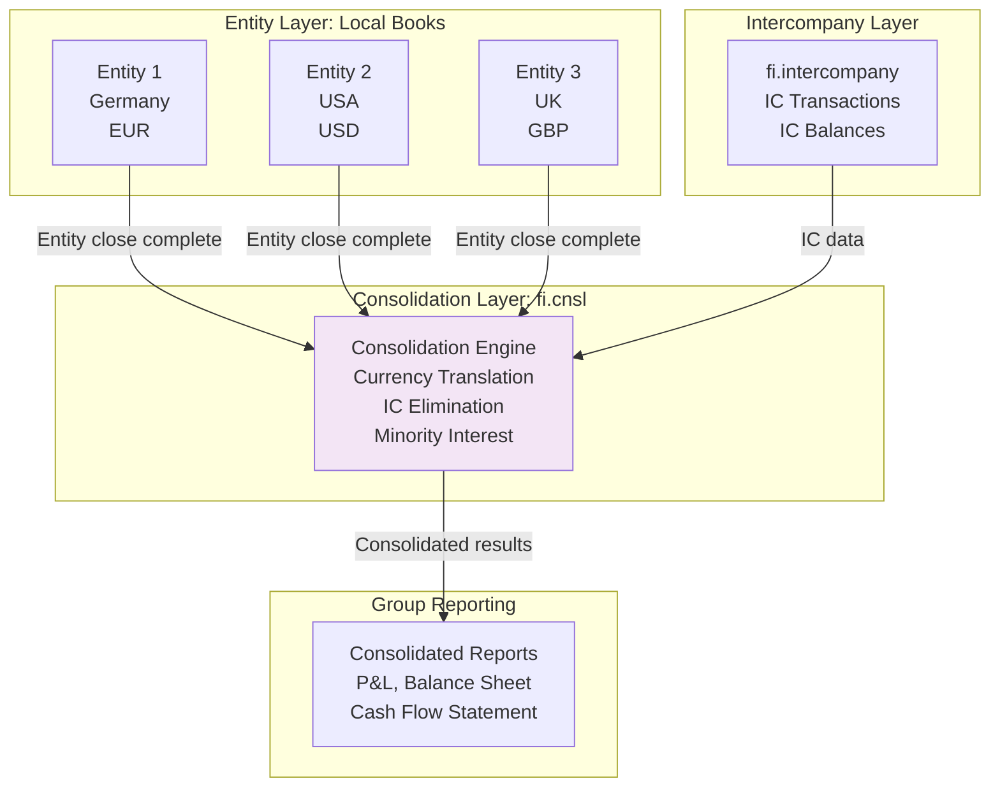
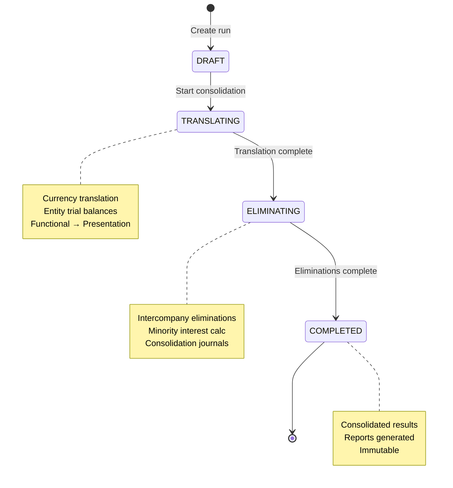
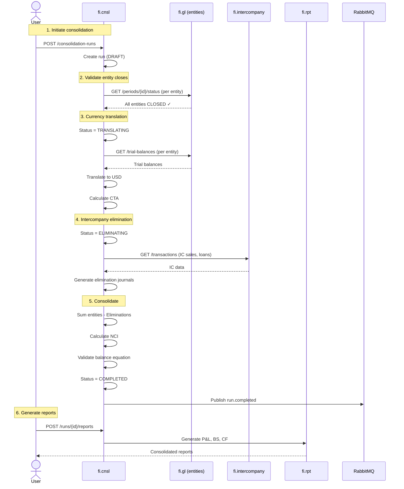

<!-- TEMPLATE COMPLIANCE: ~60%
Missing sections: §2 (Service Identity), §11 (Feature Dependencies), §12 (Extension Points)
Renumbering needed: §3 -> §5 (Use Cases), §5 -> §7 (Integration), §6 -> §7 (Events, merge), §7 -> §6 (REST API), §8 -> §8 (Data Model), §9 -> §9 (Security), §10 -> §10 (Quality), §11 -> §13 (Migration), §12 -> §14 (Decisions), §13 -> §15 (Appendix)
Action needed: Add full Meta header block, add Specification Guidelines Compliance block, add §2 Service Identity, renumber sections to §0-§15, add §11 Feature Dependencies stub, add §12 Extension Points stub
-->
# fi.cnsl - Consolidation Domain Specification

> **Meta Information**
> - **Version:** 2025-12-05
> - **Template:** `domain-service-spec.md` v1.0.0
> - **Template Compliance:** ~60% — §2, §11, §12 missing
> - **Author(s):** OpenLeap Architecture Team
> - **Status:** DRAFT
> - **Suite:** `fi`
> - **Domain:** `cnsl`
> - **Service Name:** `fi-cnsl-svc`

---

## 0. Document Purpose & Scope

### 0.1 Purpose

This document specifies the **Consolidation (fi.cnsl)** domain, which aggregates financial results from multiple legal entities into consolidated group financial statements. It handles intercompany eliminations, currency translation, minority interest calculations, and produces consolidated trial balances, income statements, and balance sheets for group reporting.

### 0.2 Target Audience
- Product Owners & Business Stakeholders (Finance, Group Accounting, Corporate Reporting)
- System Architects & Technical Leads
- Integration Engineers
- Group Controllers and Consolidation Managers
- Corporate Accountants
- External Auditors
- CFOs and Finance Leadership

### 0.3 Scope

**In Scope:**
- **Entity Hierarchy:** Define parent-subsidiary relationships, ownership percentages
- **Consolidation Scope:** Include/exclude entities, define reporting groups
- **Currency Translation:** Translate subsidiary currencies to group currency (CTA method)
- **Intercompany Eliminations:** Eliminate intercompany transactions and balances
- **Minority Interest:** Calculate non-controlling interest (NCI) in subsidiaries
- **Consolidation Journals:** Post consolidation adjustments
- **Consolidated Reports:** Generate consolidated P&L, Balance Sheet, Cash Flow
- **Equity Method:** Account for associates and joint ventures
- **Goodwill & Fair Value:** Track acquisition accounting adjustments
- **Multi-Period:** Support comparative periods, opening balances

**Out of Scope:**
- Local entity accounting → Individual FI domains (fi.gl, fi.ar, fi.ap, etc.)
- Intercompany transaction recording → fi.intercompany
- Tax consolidation → Separate tax domain
- Segment reporting → Reporting domain extensions
- Push-down accounting → Local entity level
- Pro forma consolidations → Separate planning domain

### 0.4 Related Documents
- `_fi_suite.md` - FI Suite architecture
- `fi_gl.md` - General Ledger specification
- `fi_intercompany.md` - Intercompany Accounting
- `fi_rpt.md` - Financial Reporting
- `fi_closing.md` - Period Close Orchestration

---

## 1. Business Context

### 1.1 Domain Purpose

**fi.cnsl** produces consolidated financial statements for multi-entity organizations. When a parent company owns subsidiaries, accounting standards (IFRS 10, ASC 810) require consolidated financial statements that present the group as a single economic entity. This domain aggregates entity results, eliminates intercompany transactions, translates currencies, and calculates minority interest.

**Core Business Problems Solved:**
- **Group Reporting:** Provide consolidated view of group financial position
- **Compliance:** Meet IFRS 10/ASC 810 consolidation requirements
- **Intercompany Elimination:** Remove internal transactions (sales, loans, dividends)
- **Currency Translation:** Present results in single reporting currency
- **Ownership Accounting:** Handle partial ownership, minority interest
- **Acquisition Accounting:** Track goodwill, fair value adjustments
- **Audit Trail:** Document consolidation adjustments

### 1.2 Business Value

**For the Organization:**
- **Regulatory Compliance:** Meet IFRS/GAAP consolidation requirements
- **Investor Relations:** Provide accurate consolidated financials
- **Decision Making:** Understand group performance vs. individual entities
- **Efficiency:** Automate consolidation (reduce from weeks to days)
- **Accuracy:** Eliminate manual errors in eliminations and translations
- **Scalability:** Support M&A, new subsidiary additions

**For Users:**
- **Group Controller:** Automated consolidation, real-time group results
- **Consolidation Manager:** Manage eliminations, translation rates, journals
- **Corporate Accountant:** Review entity data, post adjustments
- **CFO:** Consolidated results, segment analysis
- **External Auditor:** Complete audit trail, consolidation documentation

### 1.3 Key Stakeholders

| Role | Responsibility | Primary Use Cases |
|------|----------------|-------------------|
| Group Controller | Overall consolidation | Review consolidated results, approve consolidation |
| Consolidation Manager | Execute consolidation | Run consolidation, post eliminations, translate currencies |
| Corporate Accountant | Consolidation adjustments | Review entity data, post consolidation journals |
| Entity Controller | Local entity close | Ensure entity close complete before consolidation |
| CFO | Group reporting | Review consolidated P&L, Balance Sheet, present to board |
| External Auditor | Financial audit | Verify consolidation process, eliminations, translations |

### 1.4 Strategic Positioning

**fi.cnsl** sits **above** individual entity accounting, consuming closed entity results.



**Key Insight:** fi.cnsl waits for all entities to close, then consolidates.

---

## 2. Domain Model

### 2.1 Conceptual Overview

The consolidation domain model consists of seven main pillars:

1. **Entity Hierarchy:** Parent-subsidiary relationships, ownership
2. **Consolidation Scope:** Which entities to consolidate
3. **Currency Translation:** Convert entity currencies to group currency
4. **Intercompany Elimination:** Remove internal transactions/balances
5. **Minority Interest:** Calculate NCI for partial ownership
6. **Consolidation Journals:** Consolidation adjustments
7. **Consolidated Results:** Group financial statements

**Key Principles:**
- **Full Consolidation:** Parent + subsidiaries = single entity
- **Control:** Parent controls subsidiary (>50% ownership typical)
- **Elimination:** Remove 100% of intercompany, not just parent's share
- **Translation:** Functional currency → presentation currency
- **NCI:** Report minority shareholders' interest separately

### 2.2 Core Concepts


### 2.3 Aggregate Definitions

#### 2.3.1 ConsolidationGroup

**Business Purpose:**  
Defines a consolidation group (parent + subsidiaries). Represents the reporting entity.

**Key Attributes:**

| Attribute | Type | Description | Constraints |
|-----------|------|-------------|-------------|
| groupId | UUID | Unique identifier | Required, immutable, PK |
| tenantId | UUID | Tenant ownership | Required, immutable |
| groupName | String | Group name | Required, e.g., "ACME Corp Consolidated" |
| parentEntityId | UUID | Ultimate parent entity | Required, FK to entities |
| presentationCurrency | String | Reporting currency | Required, ISO 4217, e.g., "USD" |
| fiscalYearEnd | String | Fiscal year end | Required, e.g., "12-31" |
| consolidationStandard | Standard | Accounting standard | Required, enum(IFRS, US_GAAP, LOCAL) |
| isActive | Boolean | Active for use | Required, default true |
| createdAt | Timestamp | Creation timestamp | Auto-generated |

**Example Consolidation Group:**
```json
{
  "groupName": "ACME Corporation Consolidated",
  "parentEntityId": "entity-parent-uuid",
  "presentationCurrency": "USD",
  "fiscalYearEnd": "12-31",
  "consolidationStandard": "IFRS",
  "isActive": true
}
```

---

#### 2.3.2 GroupEntity

**Business Purpose:**  
Member of consolidation group. Defines entity relationships and ownership.

**Key Attributes:**

| Attribute | Type | Description | Constraints |
|-----------|------|-------------|-------------|
| groupEntityId | UUID | Unique identifier | Required, immutable, PK |
| groupId | UUID | Consolidation group | Required, FK to consolidation_groups |
| entityId | UUID | Legal entity | Required, FK to entities |
| parentEntityId | UUID | Immediate parent | Optional, FK to entities |
| ownershipPercent | Decimal | Ownership percentage | Required, 0-100 |
| consolidationMethod | Method | Consolidation method | Required, enum(FULL, EQUITY, PROPORTIONATE) |
| effectiveFrom | Date | Start date | Required |
| effectiveTo | Date | End date | Optional, null = active |
| votingRightsPercent | Decimal | Voting rights | Optional, may differ from ownership |
| isActive | Boolean | Active in group | Required, default true |

**Consolidation Methods:**

| Method | Description | Ownership Range | Treatment |
|--------|-------------|----------------|-----------|
| FULL | Full consolidation | >50% (control) | 100% assets/liabilities, NCI for minority |
| EQUITY | Equity method | 20-50% (significant influence) | Single line investment, share of income |
| PROPORTIONATE | Proportionate consolidation | Various | Share of assets/liabilities/income |

**Business Rules:**

1. **BR-ENT-001: Ownership Range**
   - *Rule:* ownershipPercent >= 0 AND ownershipPercent <= 100
   - *Rationale:* Valid percentage
   - *Enforcement:* CHECK constraint

2. **BR-ENT-002: Method Selection**
   - *Rule:* If ownershipPercent > 50, consolidationMethod should be FULL
   - *Rationale:* Control presumption (IFRS 10)
   - *Enforcement:* Validation warning (can be overridden)

**Example Group Structure:**

```
ACME Corp (Parent) - USA (100%)
  ├── ACME Germany GmbH (100% owned) - FULL consolidation
  ├── ACME UK Ltd (80% owned) - FULL consolidation (20% NCI)
  ├── ACME France SAS (100% owned) - FULL consolidation
  └── Associated Co. (30% owned) - EQUITY method
```

---

#### 2.3.3 ConsolidationRun

**Business Purpose:**  
Represents a single consolidation execution for a period. Produces consolidated financials.

**Key Attributes:**

| Attribute | Type | Description | Constraints |
|-----------|------|-------------|-------------|
| runId | UUID | Unique identifier | Required, immutable, PK |
| tenantId | UUID | Tenant ownership | Required, immutable |
| runNumber | String | Sequential run number | Required, unique per tenant |
| groupId | UUID | Consolidation group | Required, FK to consolidation_groups |
| periodId | UUID | Fiscal period | Required, FK to fi.gl.periods |
| fiscalMonth | String | Period | Required, e.g., "2025-12" |
| status | RunStatus | Current state | Required, enum(DRAFT, TRANSLATING, ELIMINATING, COMPLETED) |
| baseCurrency | String | Presentation currency | Required, ISO 4217 |
| runDate | Date | Consolidation date | Required |
| entityCount | Int | Number of entities | Required, >= 0 |
| eliminationCount | Int | Number of eliminations | Required, >= 0 |
| totalAssets | Decimal | Consolidated assets | Required, >= 0 |
| totalLiabilities | Decimal | Consolidated liabilities | Required, >= 0 |
| totalEquity | Decimal | Consolidated equity | Required, >= 0 |
| totalRevenue | Decimal | Consolidated revenue | Required |
| totalExpenses | Decimal | Consolidated expenses | Required |
| netIncome | Decimal | Consolidated net income | Required |
| minorityInterest | Decimal | Total NCI | Required, >= 0 |
| createdBy | UUID | User who created | Required |
| createdAt | Timestamp | Creation timestamp | Auto-generated |
| completedAt | Timestamp | Completion timestamp | Optional, set when COMPLETED |

**Lifecycle States:**



**Business Rules:**

1. **BR-RUN-001: Period Uniqueness**
   - *Rule:* One COMPLETED run per (group, period)
   - *Rationale:* Prevent duplicate consolidations
   - *Enforcement:* Unique constraint

2. **BR-RUN-002: Balance Equation**
   - *Rule:* totalAssets = totalLiabilities + totalEquity
   - *Rationale:* Fundamental accounting equation
   - *Enforcement:* Validation on completion

---

#### 2.3.4 EntityData

**Business Purpose:**  
Stores entity trial balance and translated balances for consolidation.

**Key Attributes:**

| Attribute | Type | Description | Constraints |
|-----------|------|-------------|-------------|
| dataId | UUID | Unique identifier | Required, immutable, PK |
| runId | UUID | Consolidation run | Required, FK to consolidation_runs |
| entityId | UUID | Legal entity | Required, FK to entities |
| localCurrency | String | Entity currency | Required, ISO 4217 |
| trialBalance | JSONB | Local trial balance | Required, {accountId: balance} |
| exchangeRate | Decimal | Translation rate | Required, > 0 |
| translationMethod | TransMethod | Translation method | Required, enum(CURRENT_RATE, TEMPORAL) |
| translatedBalance | JSONB | Translated trial balance | Required, {accountId: balance} |
| translationAdjustment | Decimal | CTA (Cumulative Translation Adjustment) | Required, balancing amount |
| closedAt | Timestamp | Entity close timestamp | Required |

**Translation Methods:**

| Method | Description | When Used | Treatment |
|--------|-------------|-----------|-----------|
| CURRENT_RATE | Current rate method | Functional currency = local | Assets/Liabilities at closing rate, Equity at historical, Income at average |
| TEMPORAL | Temporal method | Functional currency ≠ local | Monetary at current, Non-monetary at historical |

**Business Rules:**

1. **BR-DATA-001: Entity Close Required**
   - *Rule:* Entity period must be CLOSED before consolidation
   - *Rationale:* Ensure complete data
   - *Enforcement:* Validation on run start

**Example Entity Data:**

```json
{
  "entityId": "entity-germany-uuid",
  "localCurrency": "EUR",
  "trialBalance": {
    "1000-Cash": 500000.00,
    "1200-AR": 300000.00,
    "4000-Revenue": 1000000.00,
    "5000-Expenses": 700000.00
  },
  "exchangeRate": 1.10,
  "translationMethod": "CURRENT_RATE",
  "translatedBalance": {
    "1000-Cash": 550000.00,
    "1200-AR": 330000.00,
    "4000-Revenue": 1100000.00,
    "5000-Expenses": 770000.00
  },
  "translationAdjustment": -10000.00
}
```

---

#### 2.3.5 EliminationJournal

**Business Purpose:**  
Records consolidation adjustments and intercompany eliminations.

**Key Attributes:**

| Attribute | Type | Description | Constraints |
|-----------|------|-------------|-------------|
| journalId | UUID | Unique identifier | Required, immutable, PK |
| runId | UUID | Consolidation run | Required, FK to consolidation_runs |
| journalNumber | String | Sequential number | Required, unique per run |
| eliminationType | EliminationType | Type of elimination | Required, enum(IC_REVENUE, IC_PAYABLE, IC_LOAN, IC_DIVIDEND, IC_INVESTMENT, GOODWILL, FAIR_VALUE) |
| description | String | Journal description | Required |
| debitAccountId | UUID | Debit account | Required, FK to accounts |
| debitAmount | Decimal | Debit amount | Required, > 0 |
| creditAccountId | UUID | Credit account | Required, FK to accounts |
| creditAmount | Decimal | Credit amount | Required, > 0 |
| currency | String | Journal currency | Required, ISO 4217 |
| sourceEntityId | UUID | Source entity | Optional |
| targetEntityId | UUID | Target entity | Optional |
| referenceId | UUID | Reference transaction | Optional, FK to fi.intercompany |
| createdAt | Timestamp | Creation timestamp | Auto-generated |

**Elimination Types:**

| Type | Description | Example |
|------|-------------|---------|
| IC_REVENUE | Eliminate intercompany sales | Parent sells to subsidiary: Eliminate revenue/expense |
| IC_PAYABLE | Eliminate intercompany payables/receivables | Parent owes subsidiary: Eliminate AR/AP |
| IC_LOAN | Eliminate intercompany loans | Parent loan to subsidiary: Eliminate asset/liability |
| IC_DIVIDEND | Eliminate intercompany dividends | Subsidiary dividend to parent: Eliminate income |
| IC_INVESTMENT | Eliminate investment in subsidiary | Replace investment with subsidiary's equity |
| GOODWILL | Record goodwill from acquisition | Acquisition cost > fair value of net assets |
| FAIR_VALUE | Record fair value adjustments | Adjust subsidiary assets to fair value at acquisition |

**Example Eliminations:**

**Elimination 1: Intercompany Sales**
```
Parent sold $100K to Subsidiary (not yet resold to 3rd party)

Elimination:
  DR 4000 Revenue (Parent) $100K
  CR 5000 COGS (Subsidiary) $100K

Rationale: No sale to external party, eliminate internal revenue
```

**Elimination 2: Intercompany Payable/Receivable**
```
Parent has $50K AR from Subsidiary
Subsidiary has $50K AP to Parent

Elimination:
  DR 2100 AP (Subsidiary) $50K
  CR 1200 AR (Parent) $50K

Rationale: Internal balances, not owed to external party
```

**Elimination 3: Investment in Subsidiary (Equity Elimination)**
```
Parent owns 100% of Subsidiary
Investment: $500K
Subsidiary Equity: $500K

Elimination:
  DR Subsidiary Equity $500K
  CR Investment in Subsidiary $500K

Rationale: Replace investment with underlying net assets
```

---

#### 2.3.6 MinorityInterest (NCI)

**Business Purpose:**  
Calculates non-controlling interest for partially-owned subsidiaries.

**Key Attributes:**

| Attribute | Type | Description | Constraints |
|-----------|------|-------------|-------------|
| nciId | UUID | Unique identifier | Required, immutable, PK |
| runId | UUID | Consolidation run | Required, FK to consolidation_runs |
| entityId | UUID | Subsidiary | Required, FK to entities |
| ownershipPercent | Decimal | Parent's ownership | Required, 0-100 |
| nciPercent | Decimal | NCI percentage | Required, = 100 - ownershipPercent |
| entityEquity | Decimal | Subsidiary total equity | Required |
| entityNetIncome | Decimal | Subsidiary net income | Required |
| nciEquity | Decimal | NCI share of equity | Required, = entityEquity × nciPercent |
| nciIncome | Decimal | NCI share of income | Required, = entityNetIncome × nciPercent |

**Calculation Example:**

```
Subsidiary: ACME UK Ltd
Parent Ownership: 80%
NCI: 20%

Subsidiary Equity: $1,000,000
Subsidiary Net Income (this period): $200,000

NCI Equity: $1,000,000 × 20% = $200,000
NCI Income: $200,000 × 20% = $40,000

Consolidated Presentation:
  Total Equity: $1,000,000
    Attributable to parent: $800,000
    Non-controlling interest: $200,000
  
  Net Income: $200,000
    Attributable to parent: $160,000
    Non-controlling interest: $40,000
```

---

#### 2.3.7 ConsolidatedResult

**Business Purpose:**  
Stores final consolidated trial balance after eliminations and adjustments.

**Key Attributes:**

| Attribute | Type | Description | Constraints |
|-----------|------|-------------|-------------|
| resultId | UUID | Unique identifier | Required, immutable, PK |
| runId | UUID | Consolidation run | Required, FK to consolidation_runs |
| accountId | UUID | GL account | Required, FK to accounts |
| accountNumber | String | Account number | Required, denormalized |
| accountName | String | Account name | Required, denormalized |
| amount | Decimal | Consolidated balance | Required |
| currency | String | Presentation currency | Required, ISO 4217 |

**Example Consolidated Results:**

```
Consolidated Trial Balance (USD)

Assets:
  1000 Cash                     $2,000,000
  1200 Accounts Receivable      $1,500,000
  1600 Fixed Assets            $10,000,000
  Total Assets                 $13,500,000

Liabilities:
  2100 Accounts Payable          $800,000
  2400 Long-term Debt          $5,000,000
  Total Liabilities            $5,800,000

Equity:
  3000 Share Capital           $5,000,000
  3100 Retained Earnings       $2,500,000
  3200 NCI (20% of UK sub)       $200,000
  Total Equity                 $7,700,000

Balance Check: $13,500,000 = $5,800,000 + $7,700,000 ✓
```

---

## 3. Business Processes & Use Cases

### 3.1 Primary Use Cases

#### UC-001: Create Consolidation Group

**Actor:** Group Controller

**Preconditions:**
- Parent entity exists
- User has CONSOL_ADMIN role

**Main Flow:**
1. User creates consolidation group (POST /consolidation-groups)
2. User specifies:
   - groupName = "ACME Corp Consolidated"
   - parentEntityId (parent company)
   - presentationCurrency = "USD"
3. System creates ConsolidationGroup
4. User adds entities (POST /consolidation-groups/{id}/entities)
   - Entity 1: ACME Germany (100% owned, FULL consolidation)
   - Entity 2: ACME UK (80% owned, FULL consolidation)
   - Entity 3: Associated Co. (30% owned, EQUITY method)
5. System creates GroupEntity records
6. System validates: No circular ownership

**Postconditions:**
- Consolidation group created
- Entities added to group
- Ready for consolidation runs

---

#### UC-002: Run Consolidation

**Actor:** Consolidation Manager

**Preconditions:**
- All entities closed for period
- User has CONSOL_ADMIN role

**Main Flow:**

**Phase 1: Initiate Run**
1. User creates consolidation run (POST /consolidation-runs)
2. User specifies: groupId, periodId = "2025-12"
3. System creates ConsolidationRun (status = DRAFT)
4. System validates: All group entities closed for period ✓

**Phase 2: Currency Translation**
5. System updates status = TRANSLATING
6. For each entity:
   a. Retrieve entity trial balance (from fi.gl)
   b. Retrieve exchange rate (closing rate, average rate)
   c. Translate balances:
      - Assets/Liabilities: Closing rate
      - Equity: Historical rate
      - Income/Expenses: Average rate
   d. Calculate CTA (balancing amount)
   e. Create EntityData with translated balances
7. Example translation (ACME Germany):
   ```
   Local (EUR) → Group (USD) @ 1.10
   
   Cash: €500,000 × 1.10 = $550,000
   AR: €300,000 × 1.10 = $330,000
   Revenue: €1,000,000 × 1.09 (avg) = $1,090,000
   
   CTA: Balancing difference = -$10,000 (loss)
   ```

**Phase 3: Intercompany Elimination**
8. System updates status = ELIMINATING
9. System queries fi.intercompany for IC transactions
10. For each IC transaction:
    a. Determine elimination type
    b. Create EliminationJournal
11. Example eliminations:
    - IC Sales: Parent → Subsidiary $100K
      DR Revenue (Parent) $100K, CR COGS (Subsidiary) $100K
    - IC Payable: Parent AR $50K, Subsidiary AP $50K
      DR AP $50K, CR AR $50K
    - Investment Elimination: Parent investment $1M = Subsidiary equity
      DR Equity $1M, CR Investment $1M

**Phase 4: Minority Interest**
12. For entities with ownership < 100%:
    a. Calculate NCI percentage (ACME UK: 20%)
    b. Calculate NCI equity: $1M × 20% = $200K
    c. Calculate NCI income: $200K × 20% = $40K
    d. Create MinorityInterest record

**Phase 5: Consolidation**
13. System aggregates:
    - Sum translated entity balances
    - Subtract elimination journals
    - Separate NCI from parent equity/income
14. System creates ConsolidatedResult (one per account)
15. System validates: Assets = Liabilities + Equity ✓
16. System updates ConsolidationRun:
    - status = COMPLETED
    - totalAssets, totalLiabilities, totalEquity
    - netIncome, minorityInterest
17. System publishes fi.cnsl.run.completed event

**Postconditions:**
- Consolidation complete
- Consolidated trial balance ready
- Reports can be generated

---

#### UC-003: Generate Consolidated Financial Statements

**Actor:** Group Controller

**Preconditions:**
- Consolidation run COMPLETED
- User has CONSOL_VIEWER role

**Main Flow:**
1. User requests consolidated reports (POST /consolidation-runs/{id}/reports)
2. System retrieves ConsolidatedResult
3. System generates:
   
   **Consolidated Income Statement:**
   ```
   Revenue                              $5,000,000
   Cost of Goods Sold                  (3,000,000)
   Gross Profit                         2,000,000
   Operating Expenses                  (1,200,000)
   Operating Income                       800,000
   Interest Expense                      (100,000)
   Income Before Tax                      700,000
   Income Tax                            (200,000)
   Net Income                             500,000
   
   Attributable to:
     Parent shareholders                  460,000
     Non-controlling interest              40,000
   ```
   
   **Consolidated Balance Sheet:**
   ```
   Assets:
     Current Assets                    $3,500,000
     Fixed Assets                      10,000,000
   Total Assets                       $13,500,000
   
   Liabilities:
     Current Liabilities               $2,000,000
     Long-term Debt                     3,800,000
   Total Liabilities                   $5,800,000
   
   Equity:
     Share Capital                     $5,000,000
     Retained Earnings                  2,500,000
     Cumulative Translation Adj.          (50,000)
   Total Parent Equity                  7,450,000
     Non-controlling Interest             250,000
   Total Equity                        $7,700,000
   ```

4. System exports reports to PDF
5. System uploads to DMS (10-year retention)

**Postconditions:**
- Consolidated statements generated
- Reports available for review
- Archived in DMS

---

### 3.2 Process Flow Diagrams

#### Process: Consolidation Execution



---

## 4. Business Rules & Constraints

### 4.1 Business Rules Catalog

| ID | Rule Name | Description | Scope | Enforcement |
|----|-----------|-------------|-------|-------------|
| BR-ENT-001 | Ownership Range | 0 <= ownership <= 100 | GroupEntity | Create |
| BR-ENT-002 | Method Selection | >50% ownership → FULL consolidation | GroupEntity | Validate |
| BR-RUN-001 | Period Uniqueness | One completed run per (group, period) | ConsolidationRun | Complete |
| BR-RUN-002 | Balance Equation | Assets = Liabilities + Equity | ConsolidationRun | Complete |
| BR-DATA-001 | Entity Close Required | Entity must be CLOSED | EntityData | Run |

---

## 5. Integration Architecture

### 5.1 Integration Pattern Decision

**Does this domain use orchestration (Saga/Temporal)?** [X] YES [ ] NO

**Pattern Used:** Orchestration (Workflow)

**Rationale:**

fi.cnsl uses **Orchestration** because:

✅ **Multi-Entity Coordination:**
- Calls fi.gl for each entity trial balance
- Calls fi.intercompany for elimination data
- Needs to coordinate multiple data sources

✅ **Complex Multi-Step Process:**
- Translation → Elimination → Consolidation (sequential)
- Cannot parallelize (eliminations depend on translation)
- Long-running (minutes to hours)

✅ **Central Control:**
- fi.cnsl orchestrates entire process
- Manages state, progress, rollback

**Technology:** Temporal (workflow orchestration)

### 5.2 Orchestration Flow

**Temporal Workflow:**
```python
@workflow
async def consolidation_workflow(run_id, group_id, period_id):
    # Phase 1: Validate entity closes
    entities = await get_group_entities(group_id)
    for entity in entities:
        await validate_entity_closed(entity.id, period_id)
    
    # Phase 2: Currency translation (parallel)
    translation_tasks = [
        translate_entity(entity.id, period_id)
        for entity in entities
    ]
    await asyncio.gather(*translation_tasks)
    
    # Phase 3: Intercompany elimination (sequential)
    ic_transactions = await get_ic_transactions(group_id, period_id)
    for transaction in ic_transactions:
        await create_elimination(transaction)
    
    # Phase 4: Consolidate (sequential)
    await aggregate_balances(run_id)
    await calculate_nci(run_id)
    await validate_balance_equation(run_id)
    
    # Phase 5: Complete
    await complete_consolidation(run_id)
```

**Outbound Events (Published):**

| Event | When | Purpose | Consumers |
|-------|------|---------|-----------|
| fi.cnsl.run.completed | Consolidation complete | Consolidated results ready | fi.rpt, notifications |

---

## 6. Event Catalog

### 6.1 Outbound Events

**Exchange:** `fi.cnsl.events` (RabbitMQ topic exchange)

#### Event: run.completed

**Routing Key:** `fi.cnsl.run.completed`

**When Published:** Consolidation run successfully completed

**Business Meaning:** Consolidated financial statements available

**Consumers:**
- fi.rpt (generate consolidated reports)
- Notifications (notify stakeholders)

**Payload:**
```json
{
  "eventId": "evt-uuid",
  "tenantId": "tenant-uuid",
  "occurredAt": "2026-01-10T15:00:00Z",
  "traceId": "trace-uuid",
  "producer": "fi.cnsl",
  "aggregateType": "consolidation_run",
  "changeType": "completed",
  "entityIds": ["run-uuid"],
  "version": 1,
  "payload": {
    "runId": "run-uuid",
    "runNumber": "CONSOL-2025-12",
    "groupId": "group-uuid",
    "groupName": "ACME Corp Consolidated",
    "periodId": "period-uuid",
    "fiscalMonth": "2025-12",
    "entityCount": 5,
    "eliminationCount": 23,
    "totalAssets": 13500000.00,
    "totalLiabilities": 5800000.00,
    "totalEquity": 7700000.00,
    "netIncome": 500000.00,
    "minorityInterest": 50000.00,
    "currency": "USD"
  }
}
```

---

## 7. API Specification

### 7.1 REST API

**Base Path:** `/api/fi/consol/v1`

**Authentication:** OAuth 2.0 Bearer Token

**Content Type:** `application/json`

#### 7.1.1 Consolidation Groups

**POST /consolidation-groups** - Create group
- **Role:** CONSOL_ADMIN
- **Request Body:**
  ```json
  {
    "groupName": "ACME Corp Consolidated",
    "parentEntityId": "entity-uuid",
    "presentationCurrency": "USD",
    "fiscalYearEnd": "12-31",
    "consolidationStandard": "IFRS"
  }
  ```
- **Response:** 201 Created

**POST /consolidation-groups/{id}/entities** - Add entity
- **Role:** CONSOL_ADMIN
- **Request Body:**
  ```json
  {
    "entityId": "entity-uuid",
    "parentEntityId": "parent-uuid",
    "ownershipPercent": 80.0,
    "consolidationMethod": "FULL"
  }
  ```
- **Response:** 201 Created

---

#### 7.1.2 Consolidation Runs

**POST /consolidation-runs** - Create run
- **Role:** CONSOL_ADMIN
- **Request Body:**
  ```json
  {
    "groupId": "group-uuid",
    "periodId": "period-uuid"
  }
  ```
- **Response:** 201 Created

**GET /consolidation-runs** - List runs
- **Role:** CONSOL_VIEWER
- **Query Params:** `groupId`, `periodId`, `status`
- **Response:** 200 OK

**GET /consolidation-runs/{id}** - Get run details
- **Role:** CONSOL_VIEWER
- **Response:** 200 OK

**POST /consolidation-runs/{id}/reports** - Generate reports
- **Role:** CONSOL_VIEWER
- **Response:** 200 OK

---

### 7.2 Error Responses

| HTTP Status | Error Code | Description |
|-------------|------------|-------------|
| 400 | ENTITY_NOT_CLOSED | Cannot consolidate, entity period not closed |
| 400 | BALANCE_EQUATION_FAILED | Assets ≠ Liabilities + Equity |
| 404 | GROUP_NOT_FOUND | Consolidation group does not exist |
| 409 | RUN_ALREADY_EXISTS | Run already completed for period |

---

## 8. Data Model

### 8.1 Storage Schema (PostgreSQL)

#### Schema: fi_cnsl

#### Table: cnsl_groups
```sql
CREATE TABLE fi_cnsl.cnsl_groups (
  group_id UUID PRIMARY KEY,
  tenant_id UUID NOT NULL,
  group_name VARCHAR(200) NOT NULL,
  parent_entity_id UUID NOT NULL,
  presentation_currency CHAR(3) NOT NULL,
  fiscal_year_end VARCHAR(5) NOT NULL,
  consolidation_standard VARCHAR(20) NOT NULL,
  is_active BOOLEAN NOT NULL DEFAULT TRUE,
  created_at TIMESTAMP NOT NULL DEFAULT NOW(),
  CHECK (consolidation_standard IN ('IFRS', 'US_GAAP', 'LOCAL'))
);

CREATE INDEX idx_groups_tenant ON fi_cnsl.cnsl_groups(tenant_id);
```

#### Table: cnsl_runs
```sql
CREATE TABLE fi_cnsl.cnsl_runs (
  run_id UUID PRIMARY KEY,
  tenant_id UUID NOT NULL,
  run_number VARCHAR(50) NOT NULL,
  group_id UUID NOT NULL,
  period_id UUID NOT NULL,
  fiscal_month VARCHAR(7) NOT NULL,
  status VARCHAR(20) NOT NULL DEFAULT 'DRAFT',
  base_currency CHAR(3) NOT NULL,
  run_date DATE NOT NULL,
  entity_count INT NOT NULL DEFAULT 0,
  elimination_count INT NOT NULL DEFAULT 0,
  total_assets NUMERIC(19,4) NOT NULL DEFAULT 0,
  total_liabilities NUMERIC(19,4) NOT NULL DEFAULT 0,
  total_equity NUMERIC(19,4) NOT NULL DEFAULT 0,
  net_income NUMERIC(19,4) NOT NULL DEFAULT 0,
  minority_interest NUMERIC(19,4) NOT NULL DEFAULT 0,
  created_by UUID NOT NULL,
  created_at TIMESTAMP NOT NULL DEFAULT NOW(),
  completed_at TIMESTAMP,
  UNIQUE (tenant_id, run_number),
  UNIQUE (tenant_id, group_id, period_id) WHERE status = 'COMPLETED',
  CHECK (status IN ('DRAFT', 'TRANSLATING', 'ELIMINATING', 'COMPLETED')),
  CHECK (total_assets = total_liabilities + total_equity)
);

CREATE INDEX idx_runs_group ON fi_cnsl.cnsl_runs(group_id);
CREATE INDEX idx_runs_period ON fi_cnsl.cnsl_runs(period_id);
```

---

## 9. Security & Compliance

### 9.1 Access Control

**Roles & Permissions:**

| Role | Read | Create | Update | Delete | Admin Operations |
|------|------|--------|--------|--------|------------------|
| CONSOL_VIEWER | ✓ (all) | ✗ | ✗ | ✗ | ✗ |
| CONSOL_ADMIN | ✓ (all) | ✓ (all) | ✓ (drafts) | ✓ (drafts) | ✓ (run, approve) |

---

## 10. Quality Attributes

### 10.1 Performance Requirements

**Response Time (95th percentile):**
- POST /consolidation-runs: < 1 sec (initiate)
- Consolidation execution: < 10 min (for 10 entities)
- GET /consolidation-runs/{id}: < 500ms

---

## 11. Migration & Evolution

### 11.1 Data Migration

**From Legacy:**
- Export consolidation groups
- Export entity hierarchies
- Import opening balances
- Validate first consolidated run

---

## 12. Open Questions & Decisions

### 12.1 ADRs

#### ADR-001: Full vs. Proportionate Consolidation

**Status:** Accepted

**Decision:** Support FULL consolidation (100% of subsidiary) with NCI

**Rationale:**
- IFRS 10 requires full consolidation for control
- Most common method
- Proportionate deprecated under IFRS (except joint ventures)

---

## 13. Appendix

### 13.1 Glossary

| Term | Definition |
|------|------------|
| NCI | Non-Controlling Interest (minority interest) |
| CTA | Cumulative Translation Adjustment |
| IC | Intercompany |
| Functional Currency | Currency of primary economic environment |
| Presentation Currency | Currency for group reporting |

