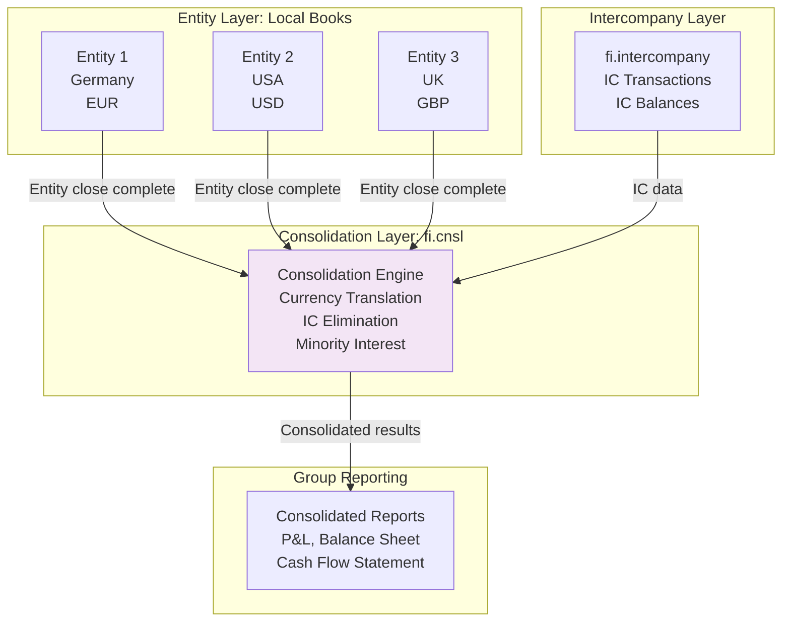
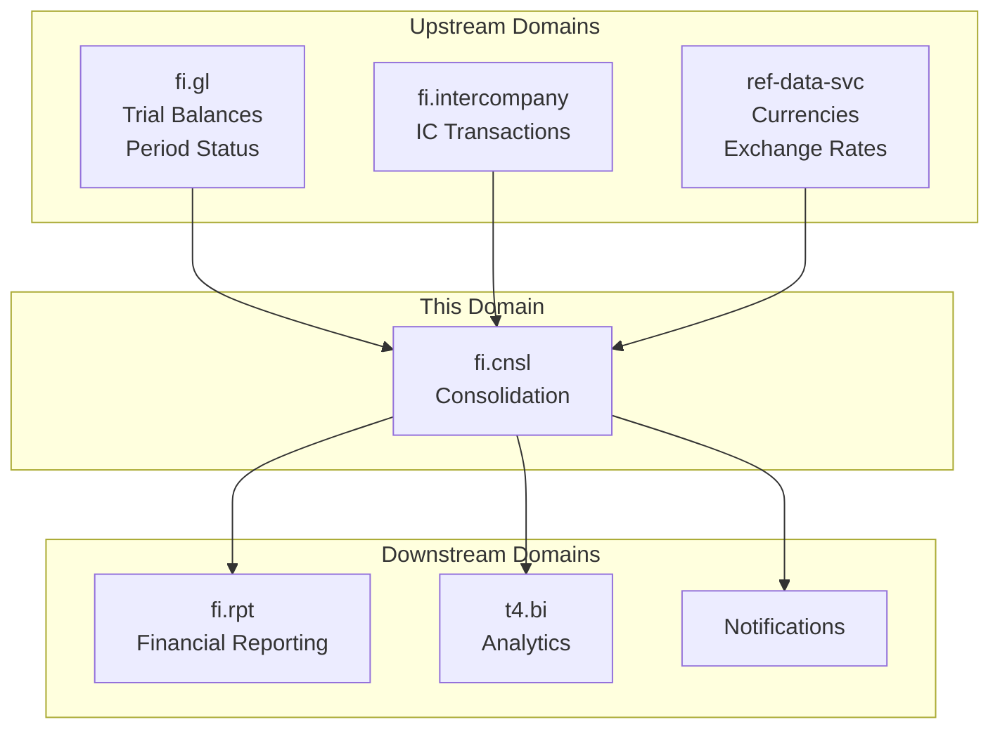
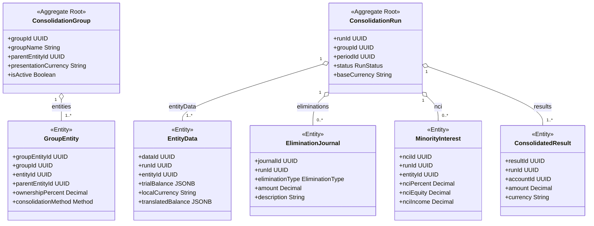
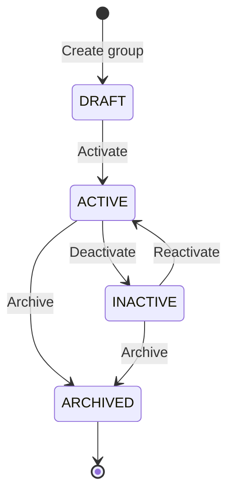
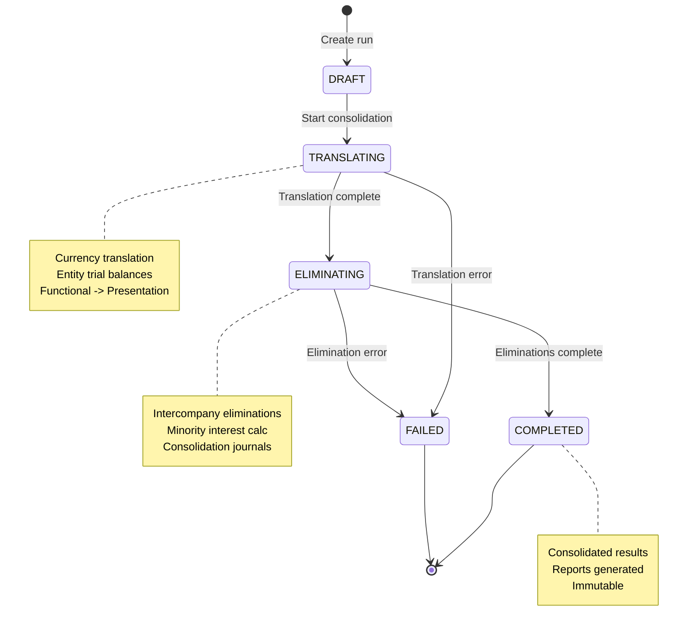
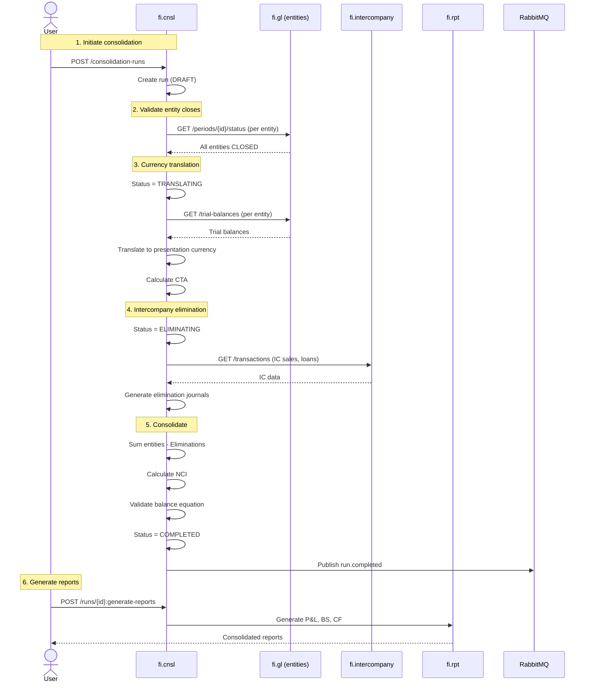
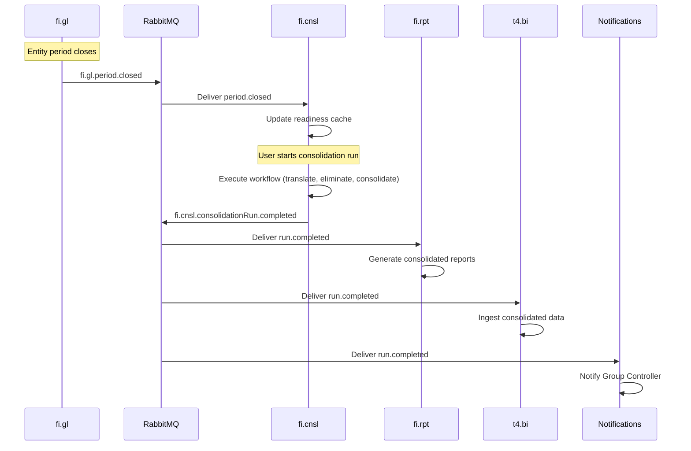
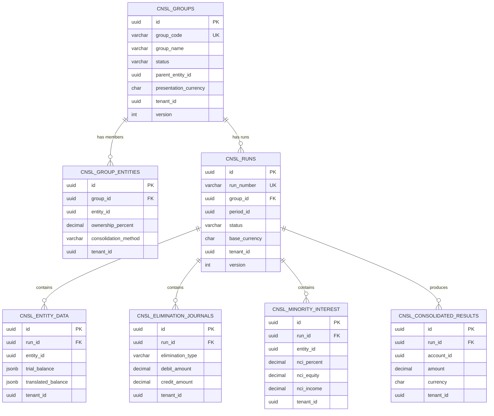

# fi.cnsl - Consolidation Domain / Service Specification

> **Conceptual Stack Layer:** Domain / Service
> **Space:** Platform
> **Owner:** FI Domain Engineering Team
> **Schema alignment:** `service-layer.schema.json`
> **Companion files:** `openapi.yaml`, `*.schema.json` (event contracts)
> **Referenced by:** Platform-Feature Spec SS5 (backend dependencies), BFF Contract
> **Belongs to:** FI Suite Spec (`_fi_suite.md`)

> **Meta Information**
> - **Version:** 2026-04-04
> - **Template:** `domain-service-spec.md` v1.0.0
> - **Template Compliance:** ~92% -- minor gaps in feature dependency detail (no feature specs yet) and extension action candidates
> - **Author(s):** OpenLeap Architecture Team
> - **Status:** DRAFT
> - **Suite:** `fi`
> - **Domain:** `cnsl`
> - **Bounded Context Ref:** `bc:consolidation`
> - **Service ID:** `fi-cnsl-svc`
> - **basePackage:** `io.openleap.fi.cnsl`
> - **API Base Path:** `/api/fi/cnsl/v1`
> - **OpenLeap Starter Version:** `v4.1.0`
> - **Port:** `8490`
> - **Repository:** `io.openleap.fi.cnsl`
> - **Tags:** `consolidation`, `group-reporting`, `elimination`, `currency-translation`, `nci`
> - **Team:**
>   - Name: `team-fi`
>   - Email: `fi-team@openleap.io`
>   - Slack: `#fi-team`

---

## Specification Guidelines Compliance

> ### Non-Negotiables
> - Never invent facts. If required info is missing, add an **OPEN QUESTION** entry.
> - Preserve intent and decisions. Only change meaning when explicitly requested.
> - Do not remove normative constraints unless they are explicitly replaced.
> - Keep the spec **self-contained**: no "see chat", no implicit context.
>
> ### Source of Truth Priority
> When sources conflict:
> 1. Spec (explicit) wins
> 2. Starter specs (implementation constraints) next
> 3. Guidelines (best practices) last
>
> Record conflicts in the **Decisions & Conflicts** section (see Section 14).
>
> ### Style Guide
> - Prefer short sentences and lists.
> - Use MUST/SHOULD/MAY for normative statements.
> - Keep terminology consistent (Aggregate, Domain Service, Application Service, Command, Event).
> - Avoid ambiguous words ("often", "maybe") unless explicitly noting uncertainty.
> - Keep examples minimal and clearly marked as examples.
> - Do not add implementation code unless the chapter explicitly requires it.

---

## 0. Document Purpose & Scope

### 0.1 Purpose

This document specifies the **Consolidation (fi.cnsl)** domain, which aggregates financial results from multiple legal entities into consolidated group financial statements. It handles intercompany eliminations, currency translation, minority interest calculations, and produces consolidated trial balances, income statements, and balance sheets for group reporting. The domain implements requirements from IFRS 10 (Consolidated Financial Statements) and ASC 810 (Consolidation).

### 0.2 Target Audience
- Product Owners & Business Stakeholders (Finance, Group Accounting, Corporate Reporting)
- System Architects & Technical Leads
- Integration Engineers
- Group Controllers and Consolidation Managers
- Corporate Accountants
- External Auditors
- CFOs and Finance Leadership

### 0.3 Scope

**In Scope:**
- **Entity Hierarchy:** Define parent-subsidiary relationships, ownership percentages
- **Consolidation Scope:** Include/exclude entities, define reporting groups
- **Currency Translation:** Translate subsidiary currencies to group currency (CTA method)
- **Intercompany Eliminations:** Eliminate intercompany transactions and balances
- **Minority Interest:** Calculate non-controlling interest (NCI) in subsidiaries
- **Consolidation Journals:** Post consolidation adjustments
- **Consolidated Reports:** Generate consolidated P&L, Balance Sheet, Cash Flow
- **Equity Method:** Account for associates and joint ventures
- **Goodwill & Fair Value:** Track acquisition accounting adjustments
- **Multi-Period:** Support comparative periods, opening balances

**Out of Scope:**
- Local entity accounting -- Individual FI domains (fi.gl, fi.ar, fi.ap, etc.)
- Intercompany transaction recording -- fi.intercompany
- Tax consolidation -- Separate tax domain
- Segment reporting -- Reporting domain extensions
- Push-down accounting -- Local entity level
- Pro forma consolidations -- Separate planning domain

### 0.4 Related Documents
- `_fi_suite.md` - FI Suite architecture
- `fi_gl.md` - General Ledger specification
- `fi_intercompany.md` - Intercompany Accounting
- `fi_rpt.md` - Financial Reporting
- `fi_closing.md` - Period Close Orchestration
- `CONCEPTUAL_STACK.md` - Platform architecture overview
- `EVENT_STANDARDS.md` - Event envelope and routing conventions
- `TECHNICAL_STANDARDS.md` - Cross-cutting technical standards

---

## 1. Business Context

### 1.1 Domain Purpose

**fi.cnsl** produces consolidated financial statements for multi-entity organizations. When a parent company owns subsidiaries, accounting standards (IFRS 10, ASC 810) require consolidated financial statements that present the group as a single economic entity. This domain aggregates entity results, eliminates intercompany transactions, translates currencies, and calculates minority interest.

**Core Business Problems Solved:**
- **Group Reporting:** Provide consolidated view of group financial position
- **Compliance:** Meet IFRS 10/ASC 810 consolidation requirements
- **Intercompany Elimination:** Remove internal transactions (sales, loans, dividends)
- **Currency Translation:** Present results in single reporting currency
- **Ownership Accounting:** Handle partial ownership, minority interest
- **Acquisition Accounting:** Track goodwill, fair value adjustments
- **Audit Trail:** Document consolidation adjustments

### 1.2 Business Value

**For the Organization:**
- **Regulatory Compliance:** Meet IFRS/GAAP consolidation requirements
- **Investor Relations:** Provide accurate consolidated financials
- **Decision Making:** Understand group performance vs. individual entities
- **Efficiency:** Automate consolidation (reduce from weeks to days)
- **Accuracy:** Eliminate manual errors in eliminations and translations
- **Scalability:** Support M&A, new subsidiary additions

**For Users:**
- **Group Controller:** Automated consolidation, real-time group results
- **Consolidation Manager:** Manage eliminations, translation rates, journals
- **Corporate Accountant:** Review entity data, post adjustments
- **CFO:** Consolidated results, segment analysis
- **External Auditor:** Complete audit trail, consolidation documentation

### 1.3 Key Stakeholders

| Role | Responsibility | Primary Use Cases |
|------|----------------|-------------------|
| Group Controller | Overall consolidation | Review consolidated results, approve consolidation |
| Consolidation Manager | Execute consolidation | Run consolidation, post eliminations, translate currencies |
| Corporate Accountant | Consolidation adjustments | Review entity data, post consolidation journals |
| Entity Controller | Local entity close | Ensure entity close complete before consolidation |
| CFO | Group reporting | Review consolidated P&L, Balance Sheet, present to board |
| External Auditor | Financial audit | Verify consolidation process, eliminations, translations |

### 1.4 Strategic Positioning

**fi.cnsl** sits **above** individual entity accounting, consuming closed entity results.



**Key Insight:** fi.cnsl waits for all entities to close, then consolidates. It is the SAP FI-LC / EC-CS equivalent.

### 1.5 Service Context

| Property | Value |
|----------|-------|
| **Suite** | `fi` |
| **Domain** | `cnsl` |
| **Bounded Context** | `bc:consolidation` |
| **Service ID** | `fi-cnsl-svc` |
| **Base Package** | `io.openleap.fi.cnsl` |

**Responsibilities:**
- Define and manage consolidation groups (entity hierarchies, ownership percentages)
- Execute consolidation runs (currency translation, IC elimination, NCI calculation)
- Produce consolidated trial balances and financial results
- Manage consolidation journals (elimination entries, adjustment entries)
- Orchestrate multi-step consolidation workflow

**Authoritative Sources:**
| Source Type | Description | Access Pattern |
|-------------|-------------|----------------|
| REST API | Consolidation groups, runs, entity data, results | Synchronous |
| Database | All consolidation data (groups, runs, journals, results) | Direct (owner) |
| Events | Consolidation run lifecycle events | Asynchronous |



---

## 2. Service Identity

| Property | Value | Schema Field |
|----------|-------|-------------|
| **Service ID** | `fi-cnsl-svc` | `metadata.id` |
| **Display Name** | `Consolidation Service` | `metadata.name` |
| **Suite** | `fi` | `metadata.suite` |
| **Domain** | `cnsl` | `metadata.domain` |
| **Bounded Context** | `bc:consolidation` | `metadata.bounded_context_ref` |
| **Version** | `0.1.0` | `metadata.version` |
| **Status** | DRAFT | `metadata.status` |
| **API Base Path** | `/api/fi/cnsl/v1` | `metadata.api_base_path` |
| **Repository** | `io.openleap.fi.cnsl` | `metadata.repository` |
| **Tags** | `consolidation`, `group-reporting`, `elimination`, `currency-translation` | `metadata.tags` |

**Team:**
| Property | Value |
|----------|-------|
| **Name** | `team-fi` |
| **Email** | `fi-team@openleap.io` |
| **Slack Channel** | `#fi-team` |

---

## 3. Domain Model

### 3.1 Conceptual Overview

The consolidation domain model consists of seven main pillars:

1. **Entity Hierarchy:** Parent-subsidiary relationships, ownership
2. **Consolidation Scope:** Which entities to consolidate
3. **Currency Translation:** Convert entity currencies to group currency
4. **Intercompany Elimination:** Remove internal transactions/balances
5. **Minority Interest:** Calculate NCI for partial ownership
6. **Consolidation Journals:** Consolidation adjustments
7. **Consolidated Results:** Group financial statements

**Key Principles:**
- **Full Consolidation:** Parent + subsidiaries = single entity
- **Control:** Parent controls subsidiary (>50% ownership typical)
- **Elimination:** Remove 100% of intercompany, not just parent's share
- **Translation:** Functional currency --> presentation currency
- **NCI:** Report minority shareholders' interest separately

### 3.2 Core Concepts



### 3.3 Aggregate Definitions

#### 3.3.1 ConsolidationGroup

| Property | Value |
|----------|-------|
| **Aggregate ID** | `agg:consolidation-group` |
| **Name** | `ConsolidationGroup` |

**Business Purpose:**
Defines a consolidation group (parent + subsidiaries). Represents the reporting entity for group financial statements. Equivalent to SAP EC-CS consolidation unit or group.

##### Aggregate Root

**Key Attributes:**
| Attribute | Type | Format | Description | Constraints | Required | Read-Only |
|-----------|------|--------|-------------|-------------|----------|-----------|
| groupId | string | uuid | Unique identifier for the consolidation group | Immutable | Yes | Yes |
| tenantId | string | uuid | Tenant ownership for multi-tenancy isolation | Immutable | Yes | Yes |
| groupCode | string | -- | Business key for the consolidation group | max_length: 20, pattern: `^[A-Z0-9_-]+$` | Yes | No |
| groupName | string | -- | Human-readable name of the consolidation group | max_length: 200, min_length: 1 | Yes | No |
| parentEntityId | string | uuid | Ultimate parent entity (top of ownership tree) | Must reference a valid legal entity | Yes | No |
| presentationCurrency | string | -- | Group reporting currency (ISO 4217) | pattern: `^[A-Z]{3}$` | Yes | No |
| fiscalYearEnd | string | -- | Fiscal year end month-day | pattern: `^(0[1-9]|1[0-2])-(0[1-9]|[12][0-9]|3[01])$` | Yes | No |
| consolidationStandard | string | -- | Accounting standard used | enum_ref: `ConsolidationStandard` | Yes | No |
| status | string | -- | Current lifecycle state | enum_ref: `GroupStatus` | Yes | No |
| description | string | -- | Optional description of the group | max_length: 1000 | No | No |
| version | integer | int64 | Optimistic locking version | Auto-incremented | Yes | Yes |
| createdAt | string | date-time | Creation timestamp | Auto-generated | Yes | Yes |
| updatedAt | string | date-time | Last update timestamp | Auto-generated | Yes | Yes |

**Lifecycle States:**

| Property | Value |
|----------|-------|
| **Initial State** | `DRAFT` |
| **Terminal States** | `ARCHIVED` |



**State Descriptions:**
| State | Description | Business Meaning |
|-------|-------------|------------------|
| DRAFT | Initial creation state | Being configured, entities being added |
| ACTIVE | Operational state | Available for consolidation runs |
| INACTIVE | Suspended state | Temporarily disabled (e.g., restructuring) |
| ARCHIVED | Final state | Historical record, read-only |

**Allowed Transitions:**
| From State | To State | Trigger | Guard / Business Preconditions |
|------------|----------|---------|-------------------------------|
| DRAFT | ACTIVE | Activation by admin | At least one group entity added |
| ACTIVE | INACTIVE | Manual deactivation | No in-progress consolidation runs |
| INACTIVE | ACTIVE | Manual reactivation | At least one group entity still active |
| ACTIVE | ARCHIVED | Archive request | No in-progress runs, inactive for > 90 days |
| INACTIVE | ARCHIVED | Archive request | No in-progress runs |

**Invariants:**
| Rule ID | Description |
|---------|-------------|
| BR-GRP-001 | Group MUST have a unique groupCode per tenant |
| BR-GRP-002 | Group MUST have at least one GroupEntity before activation |
| BR-GRP-003 | presentationCurrency MUST be a valid ISO 4217 currency |
| BR-GRP-004 | No circular ownership within group entities |

**Domain Events Emitted:**
- `fi.cnsl.consolidationGroup.created`
- `fi.cnsl.consolidationGroup.updated`
- `fi.cnsl.consolidationGroup.statusChanged`

##### Child Entities

###### Entity: GroupEntity

| Property | Value |
|----------|-------|
| **Entity ID** | `ent:group-entity` |
| **Name** | `GroupEntity` |
| **Relationship to Root** | one_to_many |

**Business Purpose:**
Member of a consolidation group. Defines entity relationships, ownership percentages, and the consolidation method to apply. Equivalent to SAP EC-CS consolidation unit assignment.

**Attributes:**
| Attribute | Type | Format | Description | Constraints | Required |
|-----------|------|--------|-------------|-------------|----------|
| groupEntityId | string | uuid | Unique identifier | Immutable | Yes |
| groupId | string | uuid | Parent consolidation group | FK to ConsolidationGroup | Yes |
| entityId | string | uuid | Legal entity reference | FK to legal entities | Yes |
| entityCode | string | -- | Business code for the entity | max_length: 20 | Yes |
| entityName | string | -- | Name of the entity (denormalized) | max_length: 200 | Yes |
| parentEntityId | string | uuid | Immediate parent in ownership chain | Optional, FK to entities | No |
| ownershipPercent | number | decimal | Parent's direct ownership percentage | minimum: 0, maximum: 100, precision: 4 | Yes |
| votingRightsPercent | number | decimal | Voting rights percentage (may differ from ownership) | minimum: 0, maximum: 100, precision: 4 | No |
| consolidationMethod | string | -- | Method of consolidation | enum_ref: `ConsolidationMethod` | Yes |
| functionalCurrency | string | -- | Entity's functional currency (ISO 4217) | pattern: `^[A-Z]{3}$` | Yes |
| effectiveFrom | string | date | Date entity joined group | -- | Yes |
| effectiveTo | string | date | Date entity left group (null = active) | minimum: effectiveFrom | No |
| isActive | boolean | -- | Active in group | default: true | Yes |

**Collection Constraints:**
- Minimum items: 1 (a group MUST have at least one entity)
- Maximum items: 500

**Invariants:**
| Rule ID | Description |
|---------|-------------|
| BR-ENT-001 | ownershipPercent MUST be between 0 and 100 |
| BR-ENT-002 | If ownershipPercent > 50, consolidationMethod SHOULD be FULL |
| BR-ENT-003 | No duplicate entityId within the same group |
| BR-ENT-004 | effectiveTo MUST be >= effectiveFrom if set |

##### Value Objects

###### Value Object: Money

| Property | Value |
|----------|-------|
| **VO ID** | `vo:money` |
| **Name** | `Money` |

**Description:**
Represents a monetary amount with currency. Used throughout consolidation for balances, elimination amounts, and NCI calculations.

**Attributes:**
| Attribute | Type | Format | Description | Constraints |
|-----------|------|--------|-------------|-------------|
| amount | number | decimal | Monetary amount | precision: 19, scale: 4 |
| currencyCode | string | -- | ISO 4217 currency code | pattern: `^[A-Z]{3}$` |

**Validation Rules:**
- currencyCode MUST be a valid ISO 4217 code
- amount precision MUST NOT exceed 4 decimal places

###### Value Object: ExchangeRateSet

| Property | Value |
|----------|-------|
| **VO ID** | `vo:exchange-rate-set` |
| **Name** | `ExchangeRateSet` |

**Description:**
Collection of exchange rates used for currency translation within a consolidation run. Contains closing rate, average rate, and historical rate per source currency.

**Attributes:**
| Attribute | Type | Format | Description | Constraints |
|-----------|------|--------|-------------|-------------|
| sourceCurrency | string | -- | Source currency code | pattern: `^[A-Z]{3}$` |
| targetCurrency | string | -- | Target (presentation) currency | pattern: `^[A-Z]{3}$` |
| closingRate | number | decimal | Rate at period end (for B/S items) | minimum: 0 (exclusive), precision: 10, scale: 6 |
| averageRate | number | decimal | Average rate for the period (for P&L items) | minimum: 0 (exclusive), precision: 10, scale: 6 |
| historicalRate | number | decimal | Historical rate (for equity items) | minimum: 0 (exclusive), precision: 10, scale: 6 |
| rateDate | string | date | Date of the rate | -- |

**Validation Rules:**
- closingRate, averageRate, historicalRate MUST be positive
- sourceCurrency MUST differ from targetCurrency

---

#### 3.3.2 ConsolidationRun

| Property | Value |
|----------|-------|
| **Aggregate ID** | `agg:consolidation-run` |
| **Name** | `ConsolidationRun` |

**Business Purpose:**
Represents a single consolidation execution for a specific period and group. Contains all translation data, elimination journals, NCI calculations, and produces consolidated financial results. Equivalent to SAP EC-CS consolidation monitor run.

##### Aggregate Root

**Key Attributes:**
| Attribute | Type | Format | Description | Constraints | Required | Read-Only |
|-----------|------|--------|-------------|-------------|----------|-----------|
| runId | string | uuid | Unique identifier | Immutable | Yes | Yes |
| tenantId | string | uuid | Tenant ownership | Immutable | Yes | Yes |
| runNumber | string | -- | Sequential business key | max_length: 50, pattern: `^CNSL-\d{4}-\d{2}(-\d+)?$` | Yes | Yes |
| groupId | string | uuid | Consolidation group | FK to ConsolidationGroup | Yes | No |
| periodId | string | uuid | Fiscal period reference | FK to fi.gl periods | Yes | No |
| fiscalMonth | string | -- | Period label | pattern: `^\d{4}-(0[1-9]|1[0-2])$` | Yes | No |
| status | string | -- | Current lifecycle state | enum_ref: `RunStatus` | Yes | No |
| baseCurrency | string | -- | Presentation currency | pattern: `^[A-Z]{3}$` | Yes | No |
| runDate | string | date | Date consolidation was executed | -- | Yes | No |
| entityCount | integer | int32 | Number of entities consolidated | minimum: 0 | Yes | No |
| eliminationCount | integer | int32 | Number of elimination journals created | minimum: 0 | Yes | No |
| totalAssets | number | decimal | Consolidated total assets | precision: 19, scale: 4 | Yes | No |
| totalLiabilities | number | decimal | Consolidated total liabilities | precision: 19, scale: 4 | Yes | No |
| totalEquity | number | decimal | Consolidated total equity | precision: 19, scale: 4 | Yes | No |
| totalRevenue | number | decimal | Consolidated total revenue | precision: 19, scale: 4 | Yes | No |
| totalExpenses | number | decimal | Consolidated total expenses | precision: 19, scale: 4 | Yes | No |
| netIncome | number | decimal | Consolidated net income | precision: 19, scale: 4 | Yes | No |
| minorityInterest | number | decimal | Total NCI amount | minimum: 0, precision: 19, scale: 4 | Yes | No |
| createdBy | string | uuid | User who initiated the run | -- | Yes | Yes |
| createdAt | string | date-time | Creation timestamp | Auto-generated | Yes | Yes |
| updatedAt | string | date-time | Last update timestamp | Auto-generated | Yes | Yes |
| completedAt | string | date-time | Completion timestamp | Set when COMPLETED | No | Yes |
| version | integer | int64 | Optimistic locking version | Auto-incremented | Yes | Yes |

**Lifecycle States:**

| Property | Value |
|----------|-------|
| **Initial State** | `DRAFT` |
| **Terminal States** | `COMPLETED`, `FAILED` |



**State Descriptions:**
| State | Description | Business Meaning |
|-------|-------------|------------------|
| DRAFT | Run created but not started | Pending initiation, can be deleted |
| TRANSLATING | Currency translation in progress | Converting entity balances to group currency |
| ELIMINATING | Elimination processing | Creating IC eliminations, NCI calculations |
| COMPLETED | Successfully finished | Consolidated results available, immutable |
| FAILED | Processing error occurred | Error details logged, can be retried |

**Allowed Transitions:**
| From State | To State | Trigger | Guard / Business Preconditions |
|------------|----------|---------|-------------------------------|
| DRAFT | TRANSLATING | StartConsolidation command | All group entities closed for period |
| TRANSLATING | ELIMINATING | Translation workflow step complete | All entity data translated |
| TRANSLATING | FAILED | Translation error | Exchange rates missing, entity data unavailable |
| ELIMINATING | COMPLETED | Consolidation workflow complete | Balance equation validated |
| ELIMINATING | FAILED | Elimination error | IC data inconsistent, balance equation fails |

**Invariants:**
| Rule ID | Description |
|---------|-------------|
| BR-RUN-001 | One COMPLETED run per (group, period) per tenant |
| BR-RUN-002 | totalAssets MUST equal totalLiabilities + totalEquity on completion |
| BR-RUN-003 | All entities in group MUST be closed for the period before start |
| BR-RUN-004 | COMPLETED runs are immutable |

**Domain Events Emitted:**
- `fi.cnsl.consolidationRun.created`
- `fi.cnsl.consolidationRun.statusChanged`
- `fi.cnsl.consolidationRun.completed`
- `fi.cnsl.consolidationRun.failed`

##### Child Entities

###### Entity: EntityData

| Property | Value |
|----------|-------|
| **Entity ID** | `ent:entity-data` |
| **Name** | `EntityData` |
| **Relationship to Root** | one_to_many |

**Business Purpose:**
Stores entity trial balance data (local and translated) for a consolidation run. Captures exchange rates used and cumulative translation adjustment (CTA).

**Attributes:**
| Attribute | Type | Format | Description | Constraints | Required |
|-----------|------|--------|-------------|-------------|----------|
| dataId | string | uuid | Unique identifier | Immutable | Yes |
| runId | string | uuid | Parent consolidation run | FK to ConsolidationRun | Yes |
| entityId | string | uuid | Legal entity reference | FK to entities | Yes |
| entityCode | string | -- | Entity business code (denormalized) | max_length: 20 | Yes |
| localCurrency | string | -- | Entity's functional currency | pattern: `^[A-Z]{3}$` | Yes |
| trialBalance | object | jsonb | Local trial balance ({accountId: balance}) | Non-empty | Yes |
| closingRate | number | decimal | Exchange rate at period end | minimum: 0 (exclusive) | Yes |
| averageRate | number | decimal | Average exchange rate for period | minimum: 0 (exclusive) | Yes |
| historicalRate | number | decimal | Historical rate for equity items | minimum: 0 (exclusive) | Yes |
| translationMethod | string | -- | Translation method applied | enum_ref: `TranslationMethod` | Yes |
| translatedBalance | object | jsonb | Translated trial balance in group currency | Non-empty | Yes |
| translationAdjustment | number | decimal | CTA (Cumulative Translation Adjustment) | Balancing amount | Yes |
| closedAt | string | date-time | Entity period close timestamp | -- | Yes |

**Collection Constraints:**
- Minimum items: 1 (at least one entity must be consolidated)
- Maximum items: 500

**Invariants:**
| Rule ID | Description |
|---------|-------------|
| BR-DATA-001 | Entity period MUST be CLOSED before data can be loaded |
| BR-DATA-002 | Sum of translatedBalance + translationAdjustment MUST balance |

**Translation Methods:**

| Method | Description | When Used | Treatment |
|--------|-------------|-----------|-----------|
| CURRENT_RATE | Current rate method | Functional currency = local | Assets/Liabilities at closing rate, Equity at historical, Income at average |
| TEMPORAL | Temporal method | Functional currency != local | Monetary at current, Non-monetary at historical |

###### Entity: EliminationJournal

| Property | Value |
|----------|-------|
| **Entity ID** | `ent:elimination-journal` |
| **Name** | `EliminationJournal` |
| **Relationship to Root** | one_to_many |

**Business Purpose:**
Records consolidation adjustments and intercompany eliminations. Each journal represents a balanced debit/credit entry that removes internal transactions from the consolidated view.

**Attributes:**
| Attribute | Type | Format | Description | Constraints | Required |
|-----------|------|--------|-------------|-------------|----------|
| journalId | string | uuid | Unique identifier | Immutable | Yes |
| runId | string | uuid | Parent consolidation run | FK to ConsolidationRun | Yes |
| journalNumber | string | -- | Sequential number within run | max_length: 20 | Yes |
| eliminationType | string | -- | Type of elimination | enum_ref: `EliminationType` | Yes |
| description | string | -- | Human-readable description | max_length: 500 | Yes |
| debitAccountId | string | uuid | Account to debit | FK to GL accounts | Yes |
| debitAccountCode | string | -- | Account code (denormalized) | max_length: 20 | Yes |
| debitAmount | number | decimal | Debit amount | minimum: 0 (exclusive), precision: 19, scale: 4 | Yes |
| creditAccountId | string | uuid | Account to credit | FK to GL accounts | Yes |
| creditAccountCode | string | -- | Account code (denormalized) | max_length: 20 | Yes |
| creditAmount | number | decimal | Credit amount | minimum: 0 (exclusive), precision: 19, scale: 4 | Yes |
| currency | string | -- | Journal currency | pattern: `^[A-Z]{3}$` | Yes |
| sourceEntityId | string | uuid | Source entity in IC transaction | -- | No |
| targetEntityId | string | uuid | Target entity in IC transaction | -- | No |
| referenceId | string | uuid | Reference to IC transaction | FK to fi.intercompany | No |
| createdAt | string | date-time | Creation timestamp | Auto-generated | Yes |

**Collection Constraints:**
- Minimum items: 0 (no eliminations if no IC transactions)
- Maximum items: 10000

**Invariants:**
| Rule ID | Description |
|---------|-------------|
| BR-ELIM-001 | debitAmount MUST equal creditAmount (balanced journal) |
| BR-ELIM-002 | journalNumber MUST be unique within a run |

###### Entity: MinorityInterest

| Property | Value |
|----------|-------|
| **Entity ID** | `ent:minority-interest` |
| **Name** | `MinorityInterest` |
| **Relationship to Root** | one_to_many |

**Business Purpose:**
Calculates non-controlling interest (NCI) for partially-owned subsidiaries. The NCI represents the portion of equity and income not attributable to the parent company.

**Attributes:**
| Attribute | Type | Format | Description | Constraints | Required |
|-----------|------|--------|-------------|-------------|----------|
| nciId | string | uuid | Unique identifier | Immutable | Yes |
| runId | string | uuid | Parent consolidation run | FK to ConsolidationRun | Yes |
| entityId | string | uuid | Subsidiary entity | FK to entities | Yes |
| entityCode | string | -- | Entity code (denormalized) | max_length: 20 | Yes |
| ownershipPercent | number | decimal | Parent's ownership percentage | minimum: 0, maximum: 100 | Yes |
| nciPercent | number | decimal | NCI percentage (100 - ownership) | minimum: 0, maximum: 100 | Yes |
| entityEquity | number | decimal | Subsidiary's total equity | precision: 19, scale: 4 | Yes |
| entityNetIncome | number | decimal | Subsidiary's net income for period | precision: 19, scale: 4 | Yes |
| nciEquity | number | decimal | NCI share of equity | precision: 19, scale: 4 | Yes |
| nciIncome | number | decimal | NCI share of income | precision: 19, scale: 4 | Yes |

**Collection Constraints:**
- Minimum items: 0 (all fully owned = no NCI)
- Maximum items: 500

**Invariants:**
| Rule ID | Description |
|---------|-------------|
| BR-NCI-001 | nciPercent MUST equal 100 - ownershipPercent |
| BR-NCI-002 | nciEquity MUST equal entityEquity * nciPercent / 100 |
| BR-NCI-003 | nciIncome MUST equal entityNetIncome * nciPercent / 100 |

###### Entity: ConsolidatedResult

| Property | Value |
|----------|-------|
| **Entity ID** | `ent:consolidated-result` |
| **Name** | `ConsolidatedResult` |
| **Relationship to Root** | one_to_many |

**Business Purpose:**
Stores the final consolidated trial balance line items after all translations, eliminations, and adjustments. One record per GL account in the consolidated output.

**Attributes:**
| Attribute | Type | Format | Description | Constraints | Required |
|-----------|------|--------|-------------|-------------|----------|
| resultId | string | uuid | Unique identifier | Immutable | Yes |
| runId | string | uuid | Parent consolidation run | FK to ConsolidationRun | Yes |
| accountId | string | uuid | GL account reference | FK to fi.gl accounts | Yes |
| accountNumber | string | -- | Account number (denormalized) | max_length: 20 | Yes |
| accountName | string | -- | Account name (denormalized) | max_length: 200 | Yes |
| accountType | string | -- | Account classification | enum_ref: `AccountType` | Yes |
| sumOfEntities | number | decimal | Sum of translated entity balances | precision: 19, scale: 4 | Yes |
| eliminationAmount | number | decimal | Net elimination adjustments | precision: 19, scale: 4 | Yes |
| nciAmount | number | decimal | NCI attribution amount | precision: 19, scale: 4 | Yes |
| amount | number | decimal | Final consolidated balance | precision: 19, scale: 4 | Yes |
| currency | string | -- | Presentation currency | pattern: `^[A-Z]{3}$` | Yes |

**Collection Constraints:**
- Minimum items: 1
- Maximum items: 50000

**Invariants:**
| Rule ID | Description |
|---------|-------------|
| BR-RES-001 | amount MUST equal sumOfEntities + eliminationAmount - nciAmount |
| BR-RES-002 | Sum of all ASSET results MUST equal sum of LIABILITY + EQUITY results |

### 3.4 Enumerations

#### ConsolidationStandard

**Description:** Accounting standard framework governing the consolidation process.

| Value | Description | Deprecated |
|-------|-------------|------------|
| `IFRS` | International Financial Reporting Standards (IFRS 10, IAS 21, IAS 27) | No |
| `US_GAAP` | US Generally Accepted Accounting Principles (ASC 810, ASC 830) | No |
| `LOCAL` | Local statutory consolidation rules (country-specific) | No |

#### GroupStatus

**Description:** Lifecycle states for a consolidation group.

| Value | Description | Deprecated |
|-------|-------------|------------|
| `DRAFT` | Group is being configured, not yet available for consolidation runs | No |
| `ACTIVE` | Group is operational and available for consolidation runs | No |
| `INACTIVE` | Group is temporarily suspended (e.g., during restructuring) | No |
| `ARCHIVED` | Group is historical, read-only, no longer used | No |

#### RunStatus

**Description:** Lifecycle states for a consolidation run.

| Value | Description | Deprecated |
|-------|-------------|------------|
| `DRAFT` | Run created but not yet started | No |
| `TRANSLATING` | Currency translation phase in progress | No |
| `ELIMINATING` | Intercompany elimination and NCI calculation in progress | No |
| `COMPLETED` | Run successfully completed, results immutable | No |
| `FAILED` | Run encountered an error, can be retried | No |

#### ConsolidationMethod

**Description:** Method used to consolidate a subsidiary entity.

| Value | Description | Deprecated |
|-------|-------------|------------|
| `FULL` | Full consolidation: 100% of subsidiary assets/liabilities included, NCI reported separately. Used when parent has control (>50% ownership). | No |
| `EQUITY` | Equity method: Single-line investment on balance sheet, share of income on P&L. Used for significant influence (20-50% ownership). | No |
| `PROPORTIONATE` | Proportionate consolidation: Pro-rata share of assets/liabilities/income. Deprecated under IFRS except for joint ventures. | No |

#### TranslationMethod

**Description:** Currency translation method applied to entity trial balances.

| Value | Description | Deprecated |
|-------|-------------|------------|
| `CURRENT_RATE` | Current rate method (IAS 21 / ASC 830): Assets/Liabilities at closing rate, Equity at historical rate, Income/Expenses at average rate. CTA goes to OCI. | No |
| `TEMPORAL` | Temporal method: Monetary items at current rate, non-monetary items at historical rate. Translation gains/losses go to P&L. | No |

#### EliminationType

**Description:** Classification of intercompany elimination entries.

| Value | Description | Deprecated |
|-------|-------------|------------|
| `IC_REVENUE` | Eliminate intercompany sales revenue and corresponding cost of goods sold | No |
| `IC_PAYABLE` | Eliminate intercompany receivables and payables | No |
| `IC_LOAN` | Eliminate intercompany loan assets and liabilities | No |
| `IC_DIVIDEND` | Eliminate intercompany dividend income | No |
| `IC_INVESTMENT` | Eliminate parent's investment in subsidiary against subsidiary equity | No |
| `GOODWILL` | Record goodwill from acquisition (purchase price > fair value of net assets) | No |
| `FAIR_VALUE` | Record fair value adjustments to subsidiary assets at acquisition date | No |

#### AccountType

**Description:** Classification of GL accounts for consolidation reporting.

| Value | Description | Deprecated |
|-------|-------------|------------|
| `ASSET` | Balance sheet asset account | No |
| `LIABILITY` | Balance sheet liability account | No |
| `EQUITY` | Balance sheet equity account | No |
| `REVENUE` | Income statement revenue account | No |
| `EXPENSE` | Income statement expense account | No |

### 3.5 Shared Types

#### Money

| Property | Value |
|----------|-------|
| **Type ID** | `type:money` |
| **Name** | `Money` |

**Description:** Represents a monetary amount with associated currency. Standard value object for all financial amounts.

**Attributes:**
| Attribute | Type | Format | Description | Constraints |
|-----------|------|--------|-------------|-------------|
| amount | number | decimal | Monetary amount | precision: 19, scale: 4 |
| currencyCode | string | -- | ISO 4217 currency code | pattern: `^[A-Z]{3}$` |

**Validation Rules:**
- currencyCode MUST be a valid, active ISO 4217 currency code
- amount precision MUST NOT exceed 4 decimal places

**Used By:**
- `agg:consolidation-run` (totalAssets, totalLiabilities, totalEquity, netIncome, minorityInterest)
- `ent:elimination-journal` (debitAmount, creditAmount)
- `ent:minority-interest` (nciEquity, nciIncome)
- `ent:consolidated-result` (amount)

---

## 4. Business Rules & Constraints

### 4.1 Business Rules Catalog

| ID | Rule Name | Description | Scope | Enforcement | Error Code |
|----|-----------|-------------|-------|-------------|------------|
| BR-GRP-001 | Group Code Uniqueness | groupCode MUST be unique per tenant | ConsolidationGroup | Create | `DUPLICATE_GROUP_CODE` |
| BR-GRP-002 | Minimum Entity | Group MUST have >= 1 entity before activation | ConsolidationGroup | StatusChange | `NO_ENTITIES_IN_GROUP` |
| BR-GRP-003 | Valid Currency | presentationCurrency MUST be valid ISO 4217 | ConsolidationGroup | Create, Update | `INVALID_CURRENCY` |
| BR-GRP-004 | No Circular Ownership | No circular parent-child relationships allowed | ConsolidationGroup | Create Entity | `CIRCULAR_OWNERSHIP` |
| BR-ENT-001 | Ownership Range | 0 <= ownershipPercent <= 100 | GroupEntity | Create, Update | `INVALID_OWNERSHIP_PERCENT` |
| BR-ENT-002 | Method Selection | >50% ownership implies FULL consolidation | GroupEntity | Create, Update | `METHOD_OWNERSHIP_MISMATCH` |
| BR-ENT-003 | Unique Entity per Group | No duplicate entityId within same group | GroupEntity | Create | `DUPLICATE_ENTITY` |
| BR-ENT-004 | Date Range Valid | effectiveTo >= effectiveFrom | GroupEntity | Create, Update | `INVALID_DATE_RANGE` |
| BR-RUN-001 | Period Uniqueness | One COMPLETED run per (group, period) | ConsolidationRun | Complete | `DUPLICATE_COMPLETED_RUN` |
| BR-RUN-002 | Balance Equation | Assets = Liabilities + Equity on completion | ConsolidationRun | Complete | `BALANCE_EQUATION_FAILED` |
| BR-RUN-003 | Entity Close Required | All entities MUST be closed for period | ConsolidationRun | Start | `ENTITY_NOT_CLOSED` |
| BR-RUN-004 | Immutable Completed | COMPLETED runs cannot be modified | ConsolidationRun | Update | `RUN_IMMUTABLE` |
| BR-ELIM-001 | Balanced Journal | debitAmount MUST equal creditAmount | EliminationJournal | Create | `UNBALANCED_JOURNAL` |
| BR-NCI-001 | NCI Calculation | nciPercent MUST equal 100 - ownershipPercent | MinorityInterest | Create | `NCI_CALCULATION_ERROR` |
| BR-RES-001 | Result Accuracy | amount = sumOfEntities + eliminationAmount - nciAmount | ConsolidatedResult | Create | `RESULT_CALCULATION_ERROR` |

### 4.2 Detailed Rule Definitions

#### BR-GRP-001: Group Code Uniqueness

**Business Context:**
Each consolidation group needs a unique business identifier within a tenant to prevent confusion and duplicate consolidation structures.

**Rule Statement:** The groupCode attribute MUST be unique across all ConsolidationGroup instances within the same tenant.

**Applies To:**
- Aggregate: ConsolidationGroup
- Operations: Create

**Enforcement:** Database unique constraint on (tenant_id, group_code)

**Validation Logic:** Before creating a new group, check that no existing group in the same tenant has the same groupCode.

**Error Handling:**
- **Error Code:** `DUPLICATE_GROUP_CODE`
- **Error Message:** "A consolidation group with code '{groupCode}' already exists."
- **User action:** Choose a different group code.

**Examples:**
- **Valid:** Creating group "ACME_CONSOL" when no other group has that code
- **Invalid:** Creating group "ACME_CONSOL" when another active group already uses that code

#### BR-RUN-002: Balance Equation

**Business Context:**
The fundamental accounting equation (Assets = Liabilities + Equity) MUST hold for consolidated results. This is a legal and regulatory requirement.

**Rule Statement:** On consolidation run completion, totalAssets MUST equal totalLiabilities + totalEquity.

**Applies To:**
- Aggregate: ConsolidationRun
- Operations: Complete (status transition to COMPLETED)

**Enforcement:** Validation check before status transition to COMPLETED.

**Validation Logic:** Calculate abs(totalAssets - (totalLiabilities + totalEquity)). If difference > 0.01 (rounding tolerance), the equation fails.

**Error Handling:**
- **Error Code:** `BALANCE_EQUATION_FAILED`
- **Error Message:** "Balance equation failed: Assets ({totalAssets}) != Liabilities ({totalLiabilities}) + Equity ({totalEquity}). Difference: {diff}."
- **User action:** Review elimination journals and entity data for errors.

**Examples:**
- **Valid:** Assets = 13,500,000 and Liabilities + Equity = 5,800,000 + 7,700,000 = 13,500,000
- **Invalid:** Assets = 13,500,000 and Liabilities + Equity = 5,800,000 + 7,600,000 = 13,400,000

#### BR-RUN-003: Entity Close Required

**Business Context:**
Consolidation can only proceed with complete, finalized entity financial data. If an entity's period is still open, its trial balance may change.

**Rule Statement:** All entities in the consolidation group MUST have their fiscal period CLOSED before a consolidation run can start.

**Applies To:**
- Aggregate: ConsolidationRun
- Operations: Start (status transition DRAFT --> TRANSLATING)

**Enforcement:** Synchronous validation via fi.gl period status API.

**Validation Logic:** For each GroupEntity, call fi.gl GET /periods/{periodId}/status and verify status = CLOSED.

**Error Handling:**
- **Error Code:** `ENTITY_NOT_CLOSED`
- **Error Message:** "Entity '{entityCode}' has not closed period '{fiscalMonth}'. Cannot start consolidation."
- **User action:** Complete period close for the identified entity.

**Examples:**
- **Valid:** All 5 group entities show period status = CLOSED for 2025-12
- **Invalid:** Entity "ACME_DE" still has period status = OPEN for 2025-12

#### BR-ELIM-001: Balanced Journal

**Business Context:**
Every elimination journal MUST be a balanced double-entry. Unbalanced eliminations would corrupt the consolidated trial balance.

**Rule Statement:** For every EliminationJournal, debitAmount MUST equal creditAmount.

**Applies To:**
- Aggregate: EliminationJournal
- Operations: Create

**Enforcement:** Domain object validation in EliminationJournal constructor.

**Validation Logic:** Verify debitAmount == creditAmount.

**Error Handling:**
- **Error Code:** `UNBALANCED_JOURNAL`
- **Error Message:** "Elimination journal is unbalanced: Debit ({debitAmount}) != Credit ({creditAmount})."
- **User action:** Review the elimination calculation.

**Examples:**
- **Valid:** DR Revenue 100,000 / CR COGS 100,000
- **Invalid:** DR Revenue 100,000 / CR COGS 95,000

### 4.3 Data Validation Rules

**Field-Level Validations:**
| Field | Validation Rule | Error Message |
|-------|----------------|---------------|
| groupName | Required, max 200 chars | "Group name is required and cannot exceed 200 characters" |
| groupCode | Required, max 20 chars, alphanumeric + hyphens + underscores | "Group code must be 1-20 alphanumeric characters" |
| presentationCurrency | Required, exactly 3 uppercase letters | "Currency must be a valid ISO 4217 code" |
| fiscalYearEnd | Required, MM-DD format | "Fiscal year end must be in MM-DD format" |
| ownershipPercent | Required, 0-100 | "Ownership percentage must be between 0 and 100" |
| fiscalMonth | Required, YYYY-MM format | "Fiscal month must be in YYYY-MM format" |
| debitAmount | Required, > 0 | "Debit amount must be positive" |
| creditAmount | Required, > 0 | "Credit amount must be positive" |

**Cross-Field Validations:**
- effectiveTo MUST be >= effectiveFrom if set
- debitAmount MUST equal creditAmount within an EliminationJournal
- nciPercent MUST equal 100 - ownershipPercent for MinorityInterest
- totalAssets MUST equal totalLiabilities + totalEquity for completed runs
- baseCurrency on ConsolidationRun MUST match presentationCurrency on ConsolidationGroup

### 4.4 Reference Data Dependencies

**Required Reference Data:**
| Catalog | Source Service | Fields Referencing | Validation |
|---------|----------------|-------------------|------------|
| Currencies (ISO 4217) | ref-data-svc | presentationCurrency, baseCurrency, localCurrency, currency | Must exist and be active |
| Exchange Rates | ref-data-svc | closingRate, averageRate, historicalRate | Must exist for source/target currency pair and period |
| Legal Entities | Entity management | entityId, parentEntityId | Must exist |
| GL Accounts | fi-gl-svc | accountId, debitAccountId, creditAccountId | Must exist and be active |
| Fiscal Periods | fi-gl-svc | periodId | Must exist and be CLOSED |

---

## 5. Use Cases

> This section defines explicit use cases (WRITE/READ), mapping to domain operations/services.
> Each use case MUST follow the canonical format for code generation.

### 5.1 Business Logic Placement

| Logic Type | Placement | Examples |
|------------|-----------|----------|
| Aggregate invariants | Domain Object | Ownership validation, balance equation check, NCI calculation |
| Cross-aggregate logic | Domain Service | Currency translation, IC elimination matching |
| Orchestration & transactions | Application Service | Consolidation run workflow, multi-entity data collection |

### 5.2 Use Cases (Canonical Format)

#### UC-001: CreateConsolidationGroup

| Field | Value |
|-------|-------|
| **id** | `CreateConsolidationGroup` |
| **type** | WRITE |
| **trigger** | REST |
| **aggregate** | `ConsolidationGroup` |
| **domainOperation** | `ConsolidationGroup.create` |
| **inputs** | `groupCode: String`, `groupName: String`, `parentEntityId: UUID`, `presentationCurrency: String`, `fiscalYearEnd: String`, `consolidationStandard: ConsolidationStandard` |
| **outputs** | `ConsolidationGroup` |
| **events** | `ConsolidationGroupCreated` |
| **rest** | `POST /api/fi/cnsl/v1/consolidation-groups` |
| **idempotency** | required |
| **errors** | `DUPLICATE_GROUP_CODE`: Group code already exists, `INVALID_CURRENCY`: Currency not found |

**Actor:** Group Controller

**Preconditions:**
- User has CNSL_ADMIN role
- Parent entity exists in entity management

**Main Flow:**
1. Actor submits consolidation group creation request
2. System validates groupCode uniqueness within tenant
3. System validates presentationCurrency against ref-data-svc
4. System validates parentEntityId exists
5. System creates ConsolidationGroup in DRAFT status
6. System publishes `fi.cnsl.consolidationGroup.created` event

**Postconditions:**
- ConsolidationGroup is in DRAFT status
- Group is ready for entity additions

**Business Rules Applied:**
- BR-GRP-001: Group Code Uniqueness
- BR-GRP-003: Valid Currency

**Alternative Flows:**
- **Alt-1:** If groupCode already exists, return 409 Conflict

**Exception Flows:**
- **Exc-1:** If presentationCurrency is invalid, return 422 Unprocessable Entity

---

#### UC-002: AddGroupEntity

| Field | Value |
|-------|-------|
| **id** | `AddGroupEntity` |
| **type** | WRITE |
| **trigger** | REST |
| **aggregate** | `ConsolidationGroup` |
| **domainOperation** | `ConsolidationGroup.addEntity` |
| **inputs** | `groupId: UUID`, `entityId: UUID`, `entityCode: String`, `entityName: String`, `parentEntityId: UUID?`, `ownershipPercent: Decimal`, `consolidationMethod: ConsolidationMethod`, `functionalCurrency: String`, `effectiveFrom: Date` |
| **outputs** | `GroupEntity` |
| **events** | `ConsolidationGroupUpdated` |
| **rest** | `POST /api/fi/cnsl/v1/consolidation-groups/{groupId}/entities` |
| **idempotency** | required |
| **errors** | `DUPLICATE_ENTITY`: Entity already in group, `INVALID_OWNERSHIP_PERCENT`: Ownership out of range, `CIRCULAR_OWNERSHIP`: Circular ownership detected |

**Actor:** Group Controller

**Preconditions:**
- User has CNSL_ADMIN role
- Consolidation group exists
- Entity not already in the group

**Main Flow:**
1. Actor submits entity addition request with ownership and method
2. System validates entity does not already exist in group (BR-ENT-003)
3. System validates ownershipPercent range (BR-ENT-001)
4. System validates no circular ownership (BR-GRP-004)
5. System warns if ownership >50% but method is not FULL (BR-ENT-002)
6. System creates GroupEntity record
7. System publishes `fi.cnsl.consolidationGroup.updated` event

**Postconditions:**
- GroupEntity record created and linked to group
- Group entity count incremented

**Business Rules Applied:**
- BR-ENT-001: Ownership Range
- BR-ENT-002: Method Selection (warning)
- BR-ENT-003: Unique Entity per Group
- BR-GRP-004: No Circular Ownership

**Alternative Flows:**
- **Alt-1:** If ownership >50% but method != FULL, return 200 with warning header

**Exception Flows:**
- **Exc-1:** If entity already in group, return 409 Conflict

---

#### UC-003: StartConsolidationRun

| Field | Value |
|-------|-------|
| **id** | `StartConsolidationRun` |
| **type** | WRITE |
| **trigger** | REST |
| **aggregate** | `ConsolidationRun` |
| **domainOperation** | `ConsolidationRun.create` + `ConsolidationWorkflow.start` |
| **inputs** | `groupId: UUID`, `periodId: UUID`, `fiscalMonth: String` |
| **outputs** | `ConsolidationRun` |
| **events** | `ConsolidationRunCreated`, `ConsolidationRunStatusChanged` |
| **rest** | `POST /api/fi/cnsl/v1/consolidation-runs` |
| **idempotency** | required |
| **errors** | `ENTITY_NOT_CLOSED`: Entity period not closed, `DUPLICATE_COMPLETED_RUN`: Run already completed for period, `GROUP_NOT_FOUND`: Group does not exist |

**Actor:** Consolidation Manager

**Preconditions:**
- User has CNSL_ADMIN role
- All entities in group are closed for the period
- No COMPLETED run exists for this group/period combination

**Main Flow:**
1. Actor initiates consolidation run for a group and period
2. System validates group exists and is ACTIVE
3. System checks no COMPLETED run exists for (group, period) (BR-RUN-001)
4. System creates ConsolidationRun in DRAFT status
5. System validates all group entities are closed for period (BR-RUN-003)
6. System transitions to TRANSLATING and starts Temporal workflow
7. System publishes `fi.cnsl.consolidationRun.created` event

**Postconditions:**
- ConsolidationRun created and workflow initiated
- Asynchronous consolidation process running

**Business Rules Applied:**
- BR-RUN-001: Period Uniqueness
- BR-RUN-003: Entity Close Required

**Alternative Flows:**
- **Alt-1:** If a previous FAILED run exists for same (group, period), allow new run

**Exception Flows:**
- **Exc-1:** If any entity not closed, return 400 with list of unclosed entities

---

#### UC-004: GetConsolidationRunDetails

| Field | Value |
|-------|-------|
| **id** | `GetConsolidationRunDetails` |
| **type** | READ |
| **trigger** | REST |
| **aggregate** | `ConsolidationRun` |
| **domainOperation** | `ConsolidationRunQuery.findById` |
| **inputs** | `runId: UUID` |
| **outputs** | `ConsolidationRunDetailView` (run + entity data + eliminations + NCI + results) |
| **rest** | `GET /api/fi/cnsl/v1/consolidation-runs/{runId}` |
| **idempotency** | none |
| **errors** | `RUN_NOT_FOUND`: Run does not exist |

**Actor:** Consolidation Manager, Group Controller, External Auditor

**Preconditions:**
- User has CNSL_VIEWER or CNSL_ADMIN role

**Main Flow:**
1. Actor requests run details by ID
2. System retrieves ConsolidationRun with all child entities
3. System returns read model with entity data, eliminations, NCI, and results

**Postconditions:**
- No state change

---

#### UC-005: ListConsolidationRuns

| Field | Value |
|-------|-------|
| **id** | `ListConsolidationRuns` |
| **type** | READ |
| **trigger** | REST |
| **aggregate** | `ConsolidationRun` |
| **domainOperation** | `ConsolidationRunQuery.list` |
| **inputs** | `groupId: UUID?`, `periodId: UUID?`, `status: RunStatus?`, `page: Int`, `size: Int` |
| **outputs** | `Page<ConsolidationRunSummaryView>` |
| **rest** | `GET /api/fi/cnsl/v1/consolidation-runs` |
| **idempotency** | none |
| **errors** | -- |

**Actor:** Consolidation Manager, Group Controller

**Preconditions:**
- User has CNSL_VIEWER or CNSL_ADMIN role

**Main Flow:**
1. Actor requests list of consolidation runs with optional filters
2. System queries runs matching filters with pagination
3. System returns paginated summary list

**Postconditions:**
- No state change

---

#### UC-006: GenerateConsolidatedReports

| Field | Value |
|-------|-------|
| **id** | `GenerateConsolidatedReports` |
| **type** | WRITE |
| **trigger** | REST |
| **aggregate** | `ConsolidationRun` |
| **domainOperation** | `ReportGenerationService.generate` |
| **inputs** | `runId: UUID`, `reportTypes: List<ReportType>` |
| **outputs** | `List<ReportReference>` |
| **events** | `ConsolidationReportGenerated` |
| **rest** | `POST /api/fi/cnsl/v1/consolidation-runs/{runId}:generate-reports` |
| **idempotency** | optional |
| **errors** | `RUN_NOT_COMPLETED`: Run is not in COMPLETED status |

**Actor:** Group Controller

**Preconditions:**
- User has CNSL_VIEWER role
- Consolidation run is in COMPLETED status

**Main Flow:**
1. Actor requests report generation for a completed run
2. System validates run is COMPLETED
3. System retrieves ConsolidatedResult data
4. System generates Consolidated Income Statement, Balance Sheet, Cash Flow
5. System exports reports to PDF
6. System uploads to DMS (10-year retention)
7. System returns report references

**Postconditions:**
- Consolidated reports generated and archived in DMS
- Reports available for review and download

**Business Rules Applied:**
- BR-RUN-004: Run must be COMPLETED

**Alternative Flows:**
- **Alt-1:** If specific reportTypes not provided, generate all standard reports

**Exception Flows:**
- **Exc-1:** If run is not COMPLETED, return 422 Unprocessable Entity

---

#### UC-007: ListConsolidationGroups

| Field | Value |
|-------|-------|
| **id** | `ListConsolidationGroups` |
| **type** | READ |
| **trigger** | REST |
| **aggregate** | `ConsolidationGroup` |
| **domainOperation** | `ConsolidationGroupQuery.list` |
| **inputs** | `status: GroupStatus?`, `page: Int`, `size: Int` |
| **outputs** | `Page<ConsolidationGroupSummaryView>` |
| **rest** | `GET /api/fi/cnsl/v1/consolidation-groups` |
| **idempotency** | none |
| **errors** | -- |

**Actor:** Group Controller, Consolidation Manager

**Preconditions:**
- User has CNSL_VIEWER or CNSL_ADMIN role

**Main Flow:**
1. Actor requests list of consolidation groups
2. System returns paginated list filtered by tenant and optional status

**Postconditions:**
- No state change

---

#### UC-008: GetConsolidationGroup

| Field | Value |
|-------|-------|
| **id** | `GetConsolidationGroup` |
| **type** | READ |
| **trigger** | REST |
| **aggregate** | `ConsolidationGroup` |
| **domainOperation** | `ConsolidationGroupQuery.findById` |
| **inputs** | `groupId: UUID` |
| **outputs** | `ConsolidationGroupDetailView` (group + entities) |
| **rest** | `GET /api/fi/cnsl/v1/consolidation-groups/{groupId}` |
| **idempotency** | none |
| **errors** | `GROUP_NOT_FOUND`: Group does not exist |

**Actor:** Group Controller, Consolidation Manager

**Preconditions:**
- User has CNSL_VIEWER or CNSL_ADMIN role

**Main Flow:**
1. Actor requests group details by ID
2. System returns group with all GroupEntity children

**Postconditions:**
- No state change

### 5.3 Process Flow Diagrams

#### Process: Consolidation Execution



### 5.4 Cross-Domain Workflows

**Does this domain participate in multi-service workflows?** [X] YES

#### Workflow: Consolidation Run Orchestration

**Business Purpose:**
Execute end-to-end consolidation by collecting data from multiple entity GL instances, querying intercompany transactions, performing translations and eliminations, and producing consolidated results.

**Orchestration Pattern:** [X] Orchestration (Saga)

**Pattern Rationale:**
fi.cnsl uses orchestration because:
- Multi-entity coordination: Calls fi.gl for each entity trial balance and fi.intercompany for elimination data
- Sequential dependencies: Translations must complete before eliminations
- Long-running process: Minutes to hours depending on entity count
- Central state management: fi.cnsl tracks progress through workflow phases

**Technology:** Temporal (workflow orchestration, per ADR-029)

**Participating Services:**
| Service | Role | Responsibilities |
|---------|------|------------------|
| fi-cnsl-svc | Orchestrator | Coordinate workflow steps, manage state, produce results |
| fi-gl-svc | Participant | Provide entity trial balances and period status |
| fi-ic-svc | Participant | Provide intercompany transaction data |
| ref-data-svc | Participant | Provide exchange rates for currency translation |
| fi-rpt-svc | Participant | Generate consolidated financial reports |

**Workflow Steps:**
1. **Step 1:** fi.cnsl validates all entity periods are closed via fi.gl
   - Success: Proceed to translation
   - Failure: Mark run as FAILED, list unclosed entities

2. **Step 2:** fi.cnsl retrieves trial balances from fi.gl (parallel per entity)
   - Success: Store EntityData with local balances
   - Failure: Retry 3x with backoff, then mark FAILED

3. **Step 3:** fi.cnsl retrieves exchange rates from ref-data-svc and translates balances
   - Success: EntityData updated with translated balances and CTA
   - Failure: Mark FAILED if rates unavailable

4. **Step 4:** fi.cnsl retrieves IC transactions from fi.ic and creates elimination journals
   - Success: EliminationJournal records created
   - Failure: Mark FAILED if IC data inconsistent

5. **Step 5:** fi.cnsl calculates NCI and aggregates results
   - Success: ConsolidatedResult records created, run COMPLETED
   - Failure: Mark FAILED if balance equation fails

**Business Implications:**
- **Success Path:** Consolidated financial statements available for reporting
- **Failure Path:** Run marked FAILED with error details; user can fix issues and retry
- **Compensation:** No compensation needed (consolidation is read-aggregation, not transaction mutation)

---

## 6. REST API

### 6.1 API Overview

**Base Path:** `/api/fi/cnsl/v1`

**Authentication:** OAuth2/JWT (Bearer token)

**Authorization:**
- Read operations: Requires scope `fi.cnsl:read`
- Write operations: Requires scope `fi.cnsl:write`
- Admin operations: Requires scope `fi.cnsl:admin`

### 6.2 Resource Operations

#### 6.2.1 ConsolidationGroup - Create

```http
POST /api/fi/cnsl/v1/consolidation-groups
Authorization: Bearer {token}
Content-Type: application/json
```

**Request Body:**
```json
{
  "groupCode": "ACME_CONSOL",
  "groupName": "ACME Corp Consolidated",
  "parentEntityId": "550e8400-e29b-41d4-a716-446655440000",
  "presentationCurrency": "USD",
  "fiscalYearEnd": "12-31",
  "consolidationStandard": "IFRS"
}
```

**Success Response:** `201 Created`
```json
{
  "groupId": "7c9e6679-7425-40de-944b-e07fc1f90ae7",
  "version": 1,
  "groupCode": "ACME_CONSOL",
  "groupName": "ACME Corp Consolidated",
  "parentEntityId": "550e8400-e29b-41d4-a716-446655440000",
  "presentationCurrency": "USD",
  "fiscalYearEnd": "12-31",
  "consolidationStandard": "IFRS",
  "status": "DRAFT",
  "createdAt": "2026-01-10T09:00:00Z",
  "_links": {
    "self": { "href": "/api/fi/cnsl/v1/consolidation-groups/7c9e6679-7425-40de-944b-e07fc1f90ae7" },
    "entities": { "href": "/api/fi/cnsl/v1/consolidation-groups/7c9e6679-7425-40de-944b-e07fc1f90ae7/entities" }
  }
}
```

**Response Headers:**
- `Location: /api/fi/cnsl/v1/consolidation-groups/7c9e6679-7425-40de-944b-e07fc1f90ae7`
- `ETag: "1"`

**Business Rules Checked:**
- BR-GRP-001: Group Code Uniqueness
- BR-GRP-003: Valid Currency

**Events Published:**
- `fi.cnsl.consolidationGroup.created`

**Error Responses:**
- `400 Bad Request` -- Validation error (missing required fields)
- `409 Conflict` -- Duplicate groupCode
- `422 Unprocessable Entity` -- Invalid currency or entity reference

#### 6.2.2 ConsolidationGroup - Retrieve

```http
GET /api/fi/cnsl/v1/consolidation-groups/{groupId}
Authorization: Bearer {token}
```

**Success Response:** `200 OK`
```json
{
  "groupId": "7c9e6679-7425-40de-944b-e07fc1f90ae7",
  "version": 3,
  "groupCode": "ACME_CONSOL",
  "groupName": "ACME Corp Consolidated",
  "parentEntityId": "550e8400-e29b-41d4-a716-446655440000",
  "presentationCurrency": "USD",
  "fiscalYearEnd": "12-31",
  "consolidationStandard": "IFRS",
  "status": "ACTIVE",
  "entities": [
    {
      "groupEntityId": "uuid-1",
      "entityCode": "ACME_DE",
      "entityName": "ACME Germany GmbH",
      "ownershipPercent": 100.0,
      "consolidationMethod": "FULL",
      "functionalCurrency": "EUR",
      "isActive": true
    }
  ],
  "createdAt": "2026-01-10T09:00:00Z",
  "updatedAt": "2026-01-10T10:30:00Z",
  "_links": {
    "self": { "href": "/api/fi/cnsl/v1/consolidation-groups/7c9e6679-7425-40de-944b-e07fc1f90ae7" },
    "entities": { "href": "/api/fi/cnsl/v1/consolidation-groups/7c9e6679-7425-40de-944b-e07fc1f90ae7/entities" },
    "runs": { "href": "/api/fi/cnsl/v1/consolidation-runs?groupId=7c9e6679-7425-40de-944b-e07fc1f90ae7" }
  }
}
```

**Response Headers:**
- `ETag: "3"`
- `Cache-Control: private, max-age=300`

**Error Responses:**
- `404 Not Found` -- Group does not exist

#### 6.2.3 ConsolidationGroup - List

```http
GET /api/fi/cnsl/v1/consolidation-groups?page=0&size=50&status=ACTIVE
Authorization: Bearer {token}
```

**Query Parameters:**
| Parameter | Type | Description | Default |
|-----------|------|-------------|---------|
| page | integer | Page number (0-based) | 0 |
| size | integer | Page size (max 200) | 50 |
| sort | string | Sort field and direction | createdAt,desc |
| status | string | Filter by group status | (all) |

**Success Response:** `200 OK`
```json
{
  "content": [
    {
      "groupId": "uuid-1",
      "groupCode": "ACME_CONSOL",
      "groupName": "ACME Corp Consolidated",
      "presentationCurrency": "USD",
      "status": "ACTIVE",
      "entityCount": 5
    }
  ],
  "page": {
    "size": 50,
    "totalElements": 3,
    "totalPages": 1,
    "number": 0
  }
}
```

#### 6.2.4 GroupEntity - Add to Group

```http
POST /api/fi/cnsl/v1/consolidation-groups/{groupId}/entities
Authorization: Bearer {token}
Content-Type: application/json
```

**Request Body:**
```json
{
  "entityId": "entity-uuid",
  "entityCode": "ACME_DE",
  "entityName": "ACME Germany GmbH",
  "parentEntityId": "parent-uuid",
  "ownershipPercent": 100.0,
  "consolidationMethod": "FULL",
  "functionalCurrency": "EUR",
  "effectiveFrom": "2020-01-01"
}
```

**Success Response:** `201 Created`
```json
{
  "groupEntityId": "new-uuid",
  "groupId": "group-uuid",
  "entityCode": "ACME_DE",
  "entityName": "ACME Germany GmbH",
  "ownershipPercent": 100.0,
  "consolidationMethod": "FULL",
  "functionalCurrency": "EUR",
  "effectiveFrom": "2020-01-01",
  "isActive": true,
  "_links": {
    "self": { "href": "/api/fi/cnsl/v1/consolidation-groups/group-uuid/entities/new-uuid" },
    "group": { "href": "/api/fi/cnsl/v1/consolidation-groups/group-uuid" }
  }
}
```

**Response Headers:**
- `Location: /api/fi/cnsl/v1/consolidation-groups/{groupId}/entities/{groupEntityId}`

**Business Rules Checked:**
- BR-ENT-001: Ownership Range
- BR-ENT-002: Method Selection (warning)
- BR-ENT-003: Unique Entity per Group
- BR-GRP-004: No Circular Ownership

**Events Published:**
- `fi.cnsl.consolidationGroup.updated`

**Error Responses:**
- `400 Bad Request` -- Validation error
- `404 Not Found` -- Group does not exist
- `409 Conflict` -- Entity already in group
- `422 Unprocessable Entity` -- Circular ownership or invalid method

#### 6.2.5 ConsolidationRun - Create

```http
POST /api/fi/cnsl/v1/consolidation-runs
Authorization: Bearer {token}
Content-Type: application/json
```

**Request Body:**
```json
{
  "groupId": "group-uuid",
  "periodId": "period-uuid",
  "fiscalMonth": "2025-12"
}
```

**Success Response:** `202 Accepted`
```json
{
  "runId": "run-uuid",
  "version": 1,
  "runNumber": "CNSL-2025-12",
  "groupId": "group-uuid",
  "fiscalMonth": "2025-12",
  "status": "DRAFT",
  "createdBy": "user-uuid",
  "createdAt": "2026-01-10T14:00:00Z",
  "_links": {
    "self": { "href": "/api/fi/cnsl/v1/consolidation-runs/run-uuid" },
    "group": { "href": "/api/fi/cnsl/v1/consolidation-groups/group-uuid" }
  }
}
```

**Response Headers:**
- `Location: /api/fi/cnsl/v1/consolidation-runs/run-uuid`

**Business Rules Checked:**
- BR-RUN-001: Period Uniqueness
- BR-RUN-003: Entity Close Required

**Events Published:**
- `fi.cnsl.consolidationRun.created`

**Error Responses:**
- `400 Bad Request` -- Entity not closed for period
- `404 Not Found` -- Group or period does not exist
- `409 Conflict` -- Completed run already exists for (group, period)

#### 6.2.6 ConsolidationRun - Retrieve

```http
GET /api/fi/cnsl/v1/consolidation-runs/{runId}
Authorization: Bearer {token}
```

**Success Response:** `200 OK`
```json
{
  "runId": "run-uuid",
  "version": 5,
  "runNumber": "CNSL-2025-12",
  "groupId": "group-uuid",
  "groupName": "ACME Corp Consolidated",
  "fiscalMonth": "2025-12",
  "status": "COMPLETED",
  "baseCurrency": "USD",
  "entityCount": 5,
  "eliminationCount": 23,
  "totalAssets": 13500000.00,
  "totalLiabilities": 5800000.00,
  "totalEquity": 7700000.00,
  "netIncome": 500000.00,
  "minorityInterest": 50000.00,
  "createdAt": "2026-01-10T14:00:00Z",
  "completedAt": "2026-01-10T14:45:00Z",
  "_links": {
    "self": { "href": "/api/fi/cnsl/v1/consolidation-runs/run-uuid" },
    "entityData": { "href": "/api/fi/cnsl/v1/consolidation-runs/run-uuid/entity-data" },
    "eliminations": { "href": "/api/fi/cnsl/v1/consolidation-runs/run-uuid/eliminations" },
    "results": { "href": "/api/fi/cnsl/v1/consolidation-runs/run-uuid/results" },
    "reports": { "href": "/api/fi/cnsl/v1/consolidation-runs/run-uuid:generate-reports" }
  }
}
```

**Response Headers:**
- `ETag: "5"`

**Error Responses:**
- `404 Not Found` -- Run does not exist

#### 6.2.7 ConsolidationRun - List

```http
GET /api/fi/cnsl/v1/consolidation-runs?groupId={groupId}&status=COMPLETED&page=0&size=50
Authorization: Bearer {token}
```

**Query Parameters:**
| Parameter | Type | Description | Default |
|-----------|------|-------------|---------|
| page | integer | Page number (0-based) | 0 |
| size | integer | Page size (max 200) | 50 |
| sort | string | Sort field and direction | createdAt,desc |
| groupId | uuid | Filter by consolidation group | (all) |
| periodId | uuid | Filter by fiscal period | (all) |
| status | string | Filter by run status | (all) |

**Success Response:** `200 OK`
```json
{
  "content": [
    {
      "runId": "run-uuid",
      "runNumber": "CNSL-2025-12",
      "groupName": "ACME Corp Consolidated",
      "fiscalMonth": "2025-12",
      "status": "COMPLETED",
      "entityCount": 5,
      "netIncome": 500000.00,
      "completedAt": "2026-01-10T14:45:00Z"
    }
  ],
  "page": {
    "size": 50,
    "totalElements": 12,
    "totalPages": 1,
    "number": 0
  }
}
```

### 6.3 Business Operations

#### Operation: GenerateReports

```http
POST /api/fi/cnsl/v1/consolidation-runs/{runId}:generate-reports
Authorization: Bearer {token}
Content-Type: application/json
```

**Business Purpose:**
Generate consolidated financial statements (P&L, Balance Sheet, Cash Flow) from a completed consolidation run. Reports are exported to PDF and archived in DMS.

**Request Body:**
```json
{
  "reportTypes": ["INCOME_STATEMENT", "BALANCE_SHEET", "CASH_FLOW"],
  "format": "PDF",
  "comparativePeriod": "2024-12"
}
```

**Success Response:** `200 OK`
```json
{
  "reports": [
    {
      "reportType": "INCOME_STATEMENT",
      "format": "PDF",
      "documentId": "dms-doc-uuid",
      "generatedAt": "2026-01-10T15:00:00Z",
      "_links": {
        "download": { "href": "/api/fi/cnsl/v1/consolidation-runs/run-uuid/reports/dms-doc-uuid" }
      }
    }
  ]
}
```

**Business Rules Checked:**
- BR-RUN-004: Run must be COMPLETED

**Events Published:**
- `fi.cnsl.consolidationRun.reportGenerated`

**Side Effects:**
- Reports uploaded to DMS with 10-year retention
- Notification sent to Group Controller

**Error Responses:**
- `404 Not Found` -- Run does not exist
- `422 Unprocessable Entity` -- Run is not in COMPLETED status

### 6.4 OpenAPI Specification

**Location:** `contracts/http/fi/cnsl/openapi.yaml`

**Version:** OpenAPI 3.1

**Documentation URL:** `https://api.openleap.io/docs/fi/cnsl`

---

## 7. Events & Integration

### 7.1 Event-Driven Architecture Pattern

**Pattern Used:** [X] Hybrid

**Follows Suite Pattern:** [X] YES

**Pattern Rationale:**
- **Synchronous (REST):** fi.cnsl calls fi.gl and fi.ic synchronously during the consolidation workflow to retrieve trial balances and IC data. Immediate response required for workflow progression.
- **Asynchronous (Events):** fi.cnsl publishes lifecycle events (run.completed, run.failed) so downstream consumers (fi.rpt, t4.bi, notifications) can react independently.
- **Orchestration:** The consolidation run itself is orchestrated via Temporal workflow (per ADR-029).

**Message Broker:** RabbitMQ

### 7.2 Published Events

**Exchange:** `fi.cnsl.events` (topic)

#### Event: ConsolidationRun.Created

**Routing Key:** `fi.cnsl.consolidationRun.created`

**Business Purpose:** Signals that a new consolidation run has been initiated.

**When Published:**
- Emitted when: ConsolidationRun is created in DRAFT status
- After: Successful transaction commit

**Payload Structure:**
```json
{
  "aggregateType": "fi.cnsl.consolidationRun",
  "changeType": "created",
  "entityIds": ["run-uuid"],
  "version": 1,
  "occurredAt": "2026-01-10T14:00:00Z"
}
```

**Event Envelope:**
```json
{
  "eventId": "evt-uuid",
  "traceId": "trace-uuid",
  "tenantId": "tenant-uuid",
  "occurredAt": "2026-01-10T14:00:00Z",
  "producer": "fi.cnsl",
  "schemaRef": "https://schemas.openleap.io/fi/cnsl/consolidationRun-created.schema.json",
  "payload": {
    "aggregateType": "fi.cnsl.consolidationRun",
    "changeType": "created",
    "entityIds": ["run-uuid"],
    "version": 1,
    "occurredAt": "2026-01-10T14:00:00Z"
  }
}
```

**Known Consumers:**
| Consumer Service | Handler | Purpose | Processing Type |
|-----------------|---------|---------|-----------------|
| Notifications | ConsolidationRunCreatedHandler | Notify stakeholders of run initiation | Async/Immediate |

#### Event: ConsolidationRun.Completed

**Routing Key:** `fi.cnsl.consolidationRun.completed`

**Business Purpose:** Signals that consolidated financial statements are ready for the specified group and period.

**When Published:**
- Emitted when: ConsolidationRun transitions to COMPLETED status
- After: Successful transaction commit with validated balance equation

**Payload Structure:**
```json
{
  "aggregateType": "fi.cnsl.consolidationRun",
  "changeType": "completed",
  "entityIds": ["run-uuid"],
  "version": 5,
  "occurredAt": "2026-01-10T14:45:00Z"
}
```

**Event Envelope:**
```json
{
  "eventId": "evt-uuid",
  "traceId": "trace-uuid",
  "tenantId": "tenant-uuid",
  "occurredAt": "2026-01-10T14:45:00Z",
  "producer": "fi.cnsl",
  "schemaRef": "https://schemas.openleap.io/fi/cnsl/consolidationRun-completed.schema.json",
  "payload": {
    "aggregateType": "fi.cnsl.consolidationRun",
    "changeType": "completed",
    "entityIds": ["run-uuid"],
    "version": 5,
    "occurredAt": "2026-01-10T14:45:00Z",
    "runNumber": "CNSL-2025-12",
    "groupId": "group-uuid",
    "fiscalMonth": "2025-12",
    "entityCount": 5,
    "eliminationCount": 23,
    "currency": "USD"
  }
}
```

**Known Consumers:**
| Consumer Service | Handler | Purpose | Processing Type |
|-----------------|---------|---------|-----------------|
| fi-rpt-svc | ConsolidationRunCompletedHandler | Trigger consolidated report generation | Async/Immediate |
| t4.bi | ConsolidationCompletedHandler | Ingest consolidated data for analytics | Async/Batch |
| Notifications | NotifyGroupControllerHandler | Notify Group Controller of completion | Async/Immediate |

#### Event: ConsolidationRun.Failed

**Routing Key:** `fi.cnsl.consolidationRun.failed`

**Business Purpose:** Signals that a consolidation run has failed and requires user attention.

**When Published:**
- Emitted when: ConsolidationRun transitions to FAILED status
- After: Error detected during translation or elimination phase

**Payload Structure:**
```json
{
  "aggregateType": "fi.cnsl.consolidationRun",
  "changeType": "failed",
  "entityIds": ["run-uuid"],
  "version": 3,
  "occurredAt": "2026-01-10T14:30:00Z"
}
```

**Event Envelope:**
```json
{
  "eventId": "evt-uuid",
  "traceId": "trace-uuid",
  "tenantId": "tenant-uuid",
  "occurredAt": "2026-01-10T14:30:00Z",
  "producer": "fi.cnsl",
  "schemaRef": "https://schemas.openleap.io/fi/cnsl/consolidationRun-failed.schema.json",
  "payload": {
    "aggregateType": "fi.cnsl.consolidationRun",
    "changeType": "failed",
    "entityIds": ["run-uuid"],
    "version": 3,
    "occurredAt": "2026-01-10T14:30:00Z",
    "failurePhase": "TRANSLATING",
    "errorCode": "EXCHANGE_RATE_MISSING",
    "errorMessage": "Missing exchange rate for EUR/USD on 2025-12-31"
  }
}
```

**Known Consumers:**
| Consumer Service | Handler | Purpose | Processing Type |
|-----------------|---------|---------|-----------------|
| Notifications | ConsolidationFailedHandler | Alert Consolidation Manager of failure | Async/Immediate |

#### Event: ConsolidationGroup.StatusChanged

**Routing Key:** `fi.cnsl.consolidationGroup.statusChanged`

**Business Purpose:** Signals that a consolidation group's lifecycle status has changed.

**When Published:**
- Emitted when: ConsolidationGroup transitions between states (DRAFT->ACTIVE, etc.)
- After: Successful transaction commit

**Payload Structure:**
```json
{
  "aggregateType": "fi.cnsl.consolidationGroup",
  "changeType": "statusChanged",
  "entityIds": ["group-uuid"],
  "version": 2,
  "occurredAt": "2026-01-10T10:00:00Z"
}
```

**Event Envelope:**
```json
{
  "eventId": "evt-uuid",
  "traceId": "trace-uuid",
  "tenantId": "tenant-uuid",
  "occurredAt": "2026-01-10T10:00:00Z",
  "producer": "fi.cnsl",
  "schemaRef": "https://schemas.openleap.io/fi/cnsl/consolidationGroup-statusChanged.schema.json",
  "payload": {
    "aggregateType": "fi.cnsl.consolidationGroup",
    "changeType": "statusChanged",
    "entityIds": ["group-uuid"],
    "version": 2,
    "occurredAt": "2026-01-10T10:00:00Z",
    "previousStatus": "DRAFT",
    "newStatus": "ACTIVE"
  }
}
```

**Known Consumers:**
| Consumer Service | Handler | Purpose | Processing Type |
|-----------------|---------|---------|-----------------|
| Notifications | GroupStatusHandler | Notify administrators | Async/Immediate |

### 7.3 Consumed Events

#### Event: fi.gl.period.closed

**Source Service:** `fi.gl`

**Routing Key:** `fi.gl.period.closed`

**Handler:** `PeriodClosedEventHandler`

**Business Purpose:**
fi.cnsl listens for period close events to know when entities are ready for consolidation. This enables automatic readiness checks and optional auto-trigger of consolidation runs.

**Processing Strategy:** [X] Background Enrichment

**Business Logic:**
- Update internal entity readiness cache for the specified period
- If all entities in a consolidation group are closed, optionally notify Consolidation Manager

**Queue Configuration:**
- Name: `fi.cnsl.in.fi.gl.period-closed`
- Durable: Yes
- Auto-delete: No

**Failure Handling:**
- Retry: Up to 3 times with exponential backoff (1s, 4s, 16s)
- Dead Letter: After max retries, move to DLQ `fi.cnsl.in.fi.gl.period-closed.dlq`

### 7.4 Event Flow Diagrams



### 7.5 Integration Points Summary

**Upstream Dependencies (Services this domain calls):**
| Service | Purpose | Integration Type | Criticality | Endpoints Used | Fallback |
|---------|---------|------------------|-------------|----------------|----------|
| fi-gl-svc | Entity trial balances, period status | sync_api | critical | `GET /api/fi/gl/v1/trial-balances`, `GET /api/fi/gl/v1/periods/{id}` | None (required for consolidation) |
| fi-ic-svc | Intercompany transaction data | sync_api | critical | `GET /api/fi/ic/v1/transactions` | None (required for elimination) |
| ref-data-svc | Currency codes, exchange rates | sync_api | critical | `GET /api/ref/currencies`, `GET /api/ref/exchange-rates` | Cached exchange rates (stale for max 24h) |
| dms-svc | Report storage (PDF archive) | sync_api | medium | `POST /api/dms/v1/documents` | Queue for later upload |
| iam-svc | User authentication & authorization | sync_api | critical | OAuth2 token validation | None |

**Downstream Consumers (Services that call this domain):**
| Service | Purpose | Integration Type | SLA |
|---------|---------|------------------|-----|
| fi-rpt-svc | Consolidated report generation | async_event | < 30 seconds |
| t4.bi | Analytics data ingestion | async_event | Best effort |
| Notifications | Stakeholder notifications | async_event | < 5 seconds |

---

## 8. Data Model

### 8.1 Storage Technology

**Database:** PostgreSQL (per ADR-016)

**Schema:** `fi_cnsl`

**Row-Level Security:** Enabled via `tenant_id` column on all tables.

### 8.2 Conceptual Data Model



### 8.3 Table Definitions

#### Table: cnsl_groups

**Business Description:** Stores consolidation group definitions. Each group represents a reporting entity consisting of a parent and its subsidiaries.

**Columns:**
| Column | Type | Nullable | PK | FK | Description |
|--------|------|----------|----|----|-------------|
| id | UUID | No | Yes | -- | Unique identifier (OlUuid.create()) |
| tenant_id | UUID | No | -- | -- | Tenant ownership (RLS) |
| group_code | VARCHAR(20) | No | -- | -- | Business key for the group |
| group_name | VARCHAR(200) | No | -- | -- | Human-readable group name |
| parent_entity_id | UUID | No | -- | -- | Ultimate parent entity reference |
| presentation_currency | CHAR(3) | No | -- | -- | ISO 4217 reporting currency |
| fiscal_year_end | VARCHAR(5) | No | -- | -- | Fiscal year end (MM-DD) |
| consolidation_standard | VARCHAR(20) | No | -- | -- | Accounting standard (IFRS, US_GAAP, LOCAL) |
| status | VARCHAR(20) | No | -- | -- | Lifecycle state |
| description | VARCHAR(1000) | Yes | -- | -- | Optional group description |
| custom_fields | JSONB | No | -- | -- | Product-specific extension fields (default '{}') |
| version | INTEGER | No | -- | -- | Optimistic locking |
| created_at | TIMESTAMPTZ | No | -- | -- | Creation timestamp |
| updated_at | TIMESTAMPTZ | No | -- | -- | Last update timestamp |

**Indexes:**
| Index Name | Columns | Unique |
|------------|---------|--------|
| pk_cnsl_groups | id | Yes |
| uk_cnsl_groups_tenant_code | tenant_id, group_code | Yes |
| idx_cnsl_groups_tenant_status | tenant_id, status | No |
| idx_cnsl_groups_custom_fields | custom_fields (GIN) | No |

**Relationships:**
- To cnsl_group_entities: One-to-many via group_id FK
- To cnsl_runs: One-to-many via group_id FK

**Data Retention:**
- Soft delete: Status changed to ARCHIVED
- Hard delete: After 10 years in ARCHIVED state (financial record retention)
- Audit trail: Retained indefinitely

#### Table: cnsl_group_entities

**Business Description:** Stores entity membership within consolidation groups, including ownership percentages and consolidation method.

**Columns:**
| Column | Type | Nullable | PK | FK | Description |
|--------|------|----------|----|----|-------------|
| id | UUID | No | Yes | -- | Unique identifier (OlUuid.create()) |
| tenant_id | UUID | No | -- | -- | Tenant ownership (RLS) |
| group_id | UUID | No | -- | cnsl_groups.id | Parent consolidation group |
| entity_id | UUID | No | -- | -- | Legal entity reference |
| entity_code | VARCHAR(20) | No | -- | -- | Entity business code (denormalized) |
| entity_name | VARCHAR(200) | No | -- | -- | Entity name (denormalized) |
| parent_entity_id | UUID | Yes | -- | -- | Immediate parent in ownership chain |
| ownership_percent | NUMERIC(7,4) | No | -- | -- | Direct ownership percentage |
| voting_rights_percent | NUMERIC(7,4) | Yes | -- | -- | Voting rights percentage |
| consolidation_method | VARCHAR(20) | No | -- | -- | FULL, EQUITY, or PROPORTIONATE |
| functional_currency | CHAR(3) | No | -- | -- | Entity's functional currency |
| effective_from | DATE | No | -- | -- | Date entity joined group |
| effective_to | DATE | Yes | -- | -- | Date entity left group |
| is_active | BOOLEAN | No | -- | -- | Active in group (default true) |
| created_at | TIMESTAMPTZ | No | -- | -- | Creation timestamp |
| updated_at | TIMESTAMPTZ | No | -- | -- | Last update timestamp |

**Indexes:**
| Index Name | Columns | Unique |
|------------|---------|--------|
| pk_cnsl_group_entities | id | Yes |
| uk_cnsl_group_entities_group_entity | tenant_id, group_id, entity_id | Yes |
| idx_cnsl_group_entities_group | group_id | No |

**Relationships:**
- To cnsl_groups: Many-to-one via group_id FK

**Data Retention:**
- Soft delete: is_active set to false, effectiveTo set
- Hard delete: With parent group after 10 years

#### Table: cnsl_runs

**Business Description:** Stores consolidation run records with status tracking and summary financial results.

**Columns:**
| Column | Type | Nullable | PK | FK | Description |
|--------|------|----------|----|----|-------------|
| id | UUID | No | Yes | -- | Unique identifier (OlUuid.create()) |
| tenant_id | UUID | No | -- | -- | Tenant ownership (RLS) |
| run_number | VARCHAR(50) | No | -- | -- | Sequential business key |
| group_id | UUID | No | -- | cnsl_groups.id | Consolidation group |
| period_id | UUID | No | -- | -- | Fiscal period reference |
| fiscal_month | VARCHAR(7) | No | -- | -- | Period label (YYYY-MM) |
| status | VARCHAR(20) | No | -- | -- | Run lifecycle state |
| base_currency | CHAR(3) | No | -- | -- | Presentation currency |
| run_date | DATE | No | -- | -- | Consolidation execution date |
| entity_count | INTEGER | No | -- | -- | Number of entities consolidated |
| elimination_count | INTEGER | No | -- | -- | Number of elimination journals |
| total_assets | NUMERIC(19,4) | No | -- | -- | Consolidated total assets |
| total_liabilities | NUMERIC(19,4) | No | -- | -- | Consolidated total liabilities |
| total_equity | NUMERIC(19,4) | No | -- | -- | Consolidated total equity |
| total_revenue | NUMERIC(19,4) | No | -- | -- | Consolidated total revenue |
| total_expenses | NUMERIC(19,4) | No | -- | -- | Consolidated total expenses |
| net_income | NUMERIC(19,4) | No | -- | -- | Consolidated net income |
| minority_interest | NUMERIC(19,4) | No | -- | -- | Total NCI amount |
| custom_fields | JSONB | No | -- | -- | Product-specific extension fields (default '{}') |
| created_by | UUID | No | -- | -- | User who created the run |
| version | INTEGER | No | -- | -- | Optimistic locking |
| created_at | TIMESTAMPTZ | No | -- | -- | Creation timestamp |
| updated_at | TIMESTAMPTZ | No | -- | -- | Last update timestamp |
| completed_at | TIMESTAMPTZ | Yes | -- | -- | Completion timestamp |

**Indexes:**
| Index Name | Columns | Unique |
|------------|---------|--------|
| pk_cnsl_runs | id | Yes |
| uk_cnsl_runs_tenant_number | tenant_id, run_number | Yes |
| uk_cnsl_runs_completed | tenant_id, group_id, period_id (WHERE status = 'COMPLETED') | Yes (partial) |
| idx_cnsl_runs_group | group_id | No |
| idx_cnsl_runs_period | period_id | No |
| idx_cnsl_runs_status | tenant_id, status | No |
| idx_cnsl_runs_custom_fields | custom_fields (GIN) | No |

**Relationships:**
- To cnsl_groups: Many-to-one via group_id FK
- To cnsl_entity_data: One-to-many via run_id FK
- To cnsl_elimination_journals: One-to-many via run_id FK
- To cnsl_minority_interest: One-to-many via run_id FK
- To cnsl_consolidated_results: One-to-many via run_id FK

**Data Retention:**
- No deletion: Consolidation runs are immutable financial records
- Retention: 10 years minimum (financial regulatory requirement)
- Audit trail: Retained indefinitely

#### Table: cnsl_entity_data

**Business Description:** Stores entity trial balance data (local and translated) for each entity within a consolidation run.

**Columns:**
| Column | Type | Nullable | PK | FK | Description |
|--------|------|----------|----|----|-------------|
| id | UUID | No | Yes | -- | Unique identifier (OlUuid.create()) |
| tenant_id | UUID | No | -- | -- | Tenant ownership (RLS) |
| run_id | UUID | No | -- | cnsl_runs.id | Parent consolidation run |
| entity_id | UUID | No | -- | -- | Legal entity reference |
| entity_code | VARCHAR(20) | No | -- | -- | Entity code (denormalized) |
| local_currency | CHAR(3) | No | -- | -- | Entity functional currency |
| trial_balance | JSONB | No | -- | -- | Local trial balance |
| closing_rate | NUMERIC(16,6) | No | -- | -- | Exchange rate at period end |
| average_rate | NUMERIC(16,6) | No | -- | -- | Average rate for period |
| historical_rate | NUMERIC(16,6) | No | -- | -- | Historical rate for equity |
| translation_method | VARCHAR(20) | No | -- | -- | CURRENT_RATE or TEMPORAL |
| translated_balance | JSONB | No | -- | -- | Translated trial balance |
| translation_adjustment | NUMERIC(19,4) | No | -- | -- | CTA amount |
| closed_at | TIMESTAMPTZ | No | -- | -- | Entity period close timestamp |
| created_at | TIMESTAMPTZ | No | -- | -- | Creation timestamp |

**Indexes:**
| Index Name | Columns | Unique |
|------------|---------|--------|
| pk_cnsl_entity_data | id | Yes |
| uk_cnsl_entity_data_run_entity | tenant_id, run_id, entity_id | Yes |
| idx_cnsl_entity_data_run | run_id | No |

**Relationships:**
- To cnsl_runs: Many-to-one via run_id FK

**Data Retention:**
- Retained with parent consolidation run (10 years)

#### Table: cnsl_elimination_journals

**Business Description:** Stores intercompany elimination entries and consolidation adjustments as balanced debit/credit journal entries.

**Columns:**
| Column | Type | Nullable | PK | FK | Description |
|--------|------|----------|----|----|-------------|
| id | UUID | No | Yes | -- | Unique identifier (OlUuid.create()) |
| tenant_id | UUID | No | -- | -- | Tenant ownership (RLS) |
| run_id | UUID | No | -- | cnsl_runs.id | Parent consolidation run |
| journal_number | VARCHAR(20) | No | -- | -- | Sequential number within run |
| elimination_type | VARCHAR(20) | No | -- | -- | Type of elimination |
| description | VARCHAR(500) | No | -- | -- | Human-readable description |
| debit_account_id | UUID | No | -- | -- | GL account to debit |
| debit_account_code | VARCHAR(20) | No | -- | -- | Account code (denormalized) |
| debit_amount | NUMERIC(19,4) | No | -- | -- | Debit amount |
| credit_account_id | UUID | No | -- | -- | GL account to credit |
| credit_account_code | VARCHAR(20) | No | -- | -- | Account code (denormalized) |
| credit_amount | NUMERIC(19,4) | No | -- | -- | Credit amount |
| currency | CHAR(3) | No | -- | -- | Journal currency |
| source_entity_id | UUID | Yes | -- | -- | Source entity in IC transaction |
| target_entity_id | UUID | Yes | -- | -- | Target entity in IC transaction |
| reference_id | UUID | Yes | -- | -- | Reference to fi.intercompany |
| created_at | TIMESTAMPTZ | No | -- | -- | Creation timestamp |

**Indexes:**
| Index Name | Columns | Unique |
|------------|---------|--------|
| pk_cnsl_elimination_journals | id | Yes |
| uk_cnsl_elim_run_number | tenant_id, run_id, journal_number | Yes |
| idx_cnsl_elim_run | run_id | No |
| idx_cnsl_elim_type | elimination_type | No |

**Relationships:**
- To cnsl_runs: Many-to-one via run_id FK

**Data Retention:**
- Retained with parent consolidation run (10 years)

#### Table: cnsl_minority_interest

**Business Description:** Stores NCI (non-controlling interest) calculations for partially-owned subsidiaries.

**Columns:**
| Column | Type | Nullable | PK | FK | Description |
|--------|------|----------|----|----|-------------|
| id | UUID | No | Yes | -- | Unique identifier (OlUuid.create()) |
| tenant_id | UUID | No | -- | -- | Tenant ownership (RLS) |
| run_id | UUID | No | -- | cnsl_runs.id | Parent consolidation run |
| entity_id | UUID | No | -- | -- | Subsidiary entity |
| entity_code | VARCHAR(20) | No | -- | -- | Entity code (denormalized) |
| ownership_percent | NUMERIC(7,4) | No | -- | -- | Parent's ownership percentage |
| nci_percent | NUMERIC(7,4) | No | -- | -- | NCI percentage |
| entity_equity | NUMERIC(19,4) | No | -- | -- | Subsidiary total equity |
| entity_net_income | NUMERIC(19,4) | No | -- | -- | Subsidiary net income |
| nci_equity | NUMERIC(19,4) | No | -- | -- | NCI share of equity |
| nci_income | NUMERIC(19,4) | No | -- | -- | NCI share of income |
| created_at | TIMESTAMPTZ | No | -- | -- | Creation timestamp |

**Indexes:**
| Index Name | Columns | Unique |
|------------|---------|--------|
| pk_cnsl_minority_interest | id | Yes |
| uk_cnsl_nci_run_entity | tenant_id, run_id, entity_id | Yes |
| idx_cnsl_nci_run | run_id | No |

**Relationships:**
- To cnsl_runs: Many-to-one via run_id FK

**Data Retention:**
- Retained with parent consolidation run (10 years)

#### Table: cnsl_consolidated_results

**Business Description:** Stores the final consolidated trial balance line items after all translations, eliminations, and NCI calculations.

**Columns:**
| Column | Type | Nullable | PK | FK | Description |
|--------|------|----------|----|----|-------------|
| id | UUID | No | Yes | -- | Unique identifier (OlUuid.create()) |
| tenant_id | UUID | No | -- | -- | Tenant ownership (RLS) |
| run_id | UUID | No | -- | cnsl_runs.id | Parent consolidation run |
| account_id | UUID | No | -- | -- | GL account reference |
| account_number | VARCHAR(20) | No | -- | -- | Account number (denormalized) |
| account_name | VARCHAR(200) | No | -- | -- | Account name (denormalized) |
| account_type | VARCHAR(20) | No | -- | -- | ASSET, LIABILITY, EQUITY, REVENUE, EXPENSE |
| sum_of_entities | NUMERIC(19,4) | No | -- | -- | Sum of translated entity balances |
| elimination_amount | NUMERIC(19,4) | No | -- | -- | Net elimination adjustments |
| nci_amount | NUMERIC(19,4) | No | -- | -- | NCI attribution |
| amount | NUMERIC(19,4) | No | -- | -- | Final consolidated balance |
| currency | CHAR(3) | No | -- | -- | Presentation currency |
| created_at | TIMESTAMPTZ | No | -- | -- | Creation timestamp |

**Indexes:**
| Index Name | Columns | Unique |
|------------|---------|--------|
| pk_cnsl_consolidated_results | id | Yes |
| uk_cnsl_results_run_account | tenant_id, run_id, account_id | Yes |
| idx_cnsl_results_run | run_id | No |
| idx_cnsl_results_type | account_type | No |

**Relationships:**
- To cnsl_runs: Many-to-one via run_id FK

**Data Retention:**
- Retained with parent consolidation run (10 years)

#### Table: cnsl_outbox_events

**Business Description:** Outbox table for reliable event publishing (per ADR-013). Events are written transactionally with aggregate changes and published asynchronously.

**Columns:**
| Column | Type | Nullable | PK | FK | Description |
|--------|------|----------|----|----|-------------|
| id | UUID | No | Yes | -- | Event identifier |
| tenant_id | UUID | No | -- | -- | Tenant ownership |
| aggregate_type | VARCHAR(100) | No | -- | -- | Aggregate type (e.g., fi.cnsl.consolidationRun) |
| aggregate_id | UUID | No | -- | -- | Aggregate identifier |
| event_type | VARCHAR(100) | No | -- | -- | Event type (e.g., completed) |
| routing_key | VARCHAR(200) | No | -- | -- | AMQP routing key |
| payload | JSONB | No | -- | -- | Event payload |
| created_at | TIMESTAMPTZ | No | -- | -- | When event was created |
| published_at | TIMESTAMPTZ | Yes | -- | -- | When event was published (null = pending) |

**Indexes:**
| Index Name | Columns | Unique |
|------------|---------|--------|
| pk_cnsl_outbox_events | id | Yes |
| idx_cnsl_outbox_pending | published_at (WHERE published_at IS NULL) | No |

### 8.4 Reference Data Dependencies

**External Catalogs Required:**
| Catalog | Source Service | Fields Referencing | Validation |
|---------|----------------|-------------------|------------|
| Currencies (ISO 4217) | ref-data-svc | presentation_currency, base_currency, local_currency, currency | Must exist and be active |
| Exchange Rates | ref-data-svc | closing_rate, average_rate, historical_rate | Must exist for currency pair and date |
| GL Accounts | fi-gl-svc | debit_account_id, credit_account_id, account_id | Must exist and be active |
| Fiscal Periods | fi-gl-svc | period_id | Must exist |

**Internal Code Lists:**
| Catalog | Managed By | Usage |
|---------|-----------|-------|
| cnsl_status (GroupStatus) | This service | ConsolidationGroup lifecycle |
| cnsl_run_status (RunStatus) | This service | ConsolidationRun lifecycle |
| cnsl_method (ConsolidationMethod) | This service | Entity consolidation method |
| cnsl_elim_type (EliminationType) | This service | Elimination journal classification |
| cnsl_translation_method (TranslationMethod) | This service | Currency translation method |

---

## 9. Security & Compliance

### 9.1 Data Classification

**Overall Classification:** Restricted (financial consolidation data)

**Sensitivity Levels:**
| Data Element | Classification | Rationale | Protection Measures |
|--------------|----------------|-----------|---------------------|
| Group/Run IDs | Internal | Technical identifiers | Multi-tenancy isolation |
| Group Name | Internal | Business name | Multi-tenancy isolation |
| Ownership Percentages | Confidential | Corporate structure information | Encryption at rest, RBAC |
| Consolidated Financial Amounts | Restricted | Material non-public financial data | Encryption at rest, RBAC, audit trail |
| Elimination Journals | Restricted | Audit-critical consolidation adjustments | Encryption at rest, RBAC, immutability |
| Exchange Rates | Internal | Market data | Multi-tenancy isolation |

### 9.2 Access Control

**Roles & Permissions:**
| Role | Permissions | Description |
|------|------------|-------------|
| CNSL_VIEWER | `read` | Read-only access to groups, runs, and results |
| CNSL_ADMIN | `read`, `create`, `update`, `delete`, `admin` | Full access: create groups, run consolidations, manage entities |

**Permission Matrix (expanded):**
| Role | Read Groups | Create Groups | Modify Groups | Read Runs | Create Runs | Generate Reports | Delete Drafts |
|------|------------|--------------|---------------|-----------|------------|-----------------|--------------|
| CNSL_VIEWER | Y | N | N | Y | N | Y | N |
| CNSL_ADMIN | Y | Y | Y (drafts) | Y | Y | Y | Y |

**Data Isolation:**
- Multi-tenancy: Row-Level Security (RLS) via `tenant_id` on all tables
- Users can only access consolidation data within their tenant
- COMPLETED consolidation runs are immutable regardless of role

### 9.3 Compliance Requirements

**Regulations:**
- [X] SOX (Financial) -- Consolidated financial statements subject to SOX audit requirements
- [X] IFRS 10 -- Consolidation accounting standards
- [X] GDPR (EU) -- Limited PII (createdBy user references)
- [ ] HIPAA -- Not applicable

**Suite Compliance References:**
- FI Suite compliance policy (see `_fi_suite.md` SS5)

**Compliance Controls:**
1. **Data Retention:**
   - Consolidation data: 10 years minimum (financial regulatory requirement)
   - Audit trail: Retained indefinitely

2. **Immutability:**
   - COMPLETED consolidation runs MUST NOT be modified
   - All elimination journals are append-only
   - No deletion of completed run data

3. **Audit Trail:**
   - All consolidation run actions logged (created, status changes, completion)
   - All access to restricted financial data logged
   - Logs retained for 10 years
   - Includes: who, what, when, from where

4. **Segregation of Duties:**
   - Entity close (fi.gl) and consolidation run (fi.cnsl) SHOULD be performed by different users

---

## 10. Quality Attributes

### 10.1 Performance Requirements

**Response Time (95th percentile):**
- POST /consolidation-groups: < 500ms
- POST /consolidation-runs: < 1s (initiate only)
- GET /consolidation-runs/{id}: < 500ms
- GET /consolidation-groups: < 300ms
- Consolidation execution (workflow): < 10 min for 10 entities, < 30 min for 50 entities

**Throughput:**
- Peak read requests: 50 req/sec
- Peak write requests: 10 req/sec
- Event processing: 20 events/sec

**Concurrency:**
- Simultaneous users: 20
- Concurrent consolidation runs: 5 per tenant (throttled)

### 10.2 Availability & Reliability

**Availability Target:** 99.9% (excludes planned maintenance)

**Recovery Objectives:**
- RTO (Recovery Time Objective): < 15 minutes
- RPO (Recovery Point Objective): < 5 minutes

**Failure Scenarios:**
| Scenario | Impact | Mitigation |
|----------|--------|------------|
| Database failure | Service unavailable | Automatic failover to replica |
| Message broker outage | Event publishing paused | Outbox retries when broker available |
| fi.gl unavailable | Cannot start new consolidation runs | Circuit breaker, retry after recovery |
| fi.ic unavailable | Cannot perform eliminations | Circuit breaker, workflow pauses and retries |
| Temporal unavailable | Cannot execute consolidation workflow | Run stays in current state, resumes when Temporal recovers |

### 10.3 Scalability

**Scaling Strategy:**
- Horizontal scaling: Add instances behind load balancer for API traffic
- Database scaling: Read replicas for query operations
- Workflow scaling: Temporal workers can scale independently
- Event processing: Multiple consumers on same queue

**Capacity Planning:**
- Data growth: ~50 consolidation runs per month per tenant
- Storage: ~500 MB per year per tenant (10 entities, monthly consolidation)
- Event volume: ~200 events per day per tenant

### 10.4 Maintainability

**Versioning Strategy:**
- API versioning: `/v1`, `/v2` in URL path
- Backward compatibility: Maintained for 12 months
- Deprecation notice: 6 months before removal

**Monitoring & Alerting:**
- Health checks: `/actuator/health` endpoint
- Metrics: Consolidation run duration, error rates, queue depths, entity count per run
- Alerts: Error rate > 5%, consolidation run duration > 60 min, DLQ messages > 0

---

## 11. Feature Dependencies

### 11.1 Purpose

This section tracks all platform-features that call this service's endpoints or consume its events.
It is the inverse of the Platform-Feature Spec SS5 (Backend Dependencies & BFF Contract).

### 11.2 Feature Dependency Register

> OPEN QUESTION: See Q-CNSL-001 in SS14.3 -- No feature specs exist yet for the FI consolidation domain.

| Feature ID | Feature Name | Suite | Tier | Dependency Type | Status |
|------------|-------------|-------|------|-----------------|--------|
| TBD | Consolidation Group Management | fi | core | sync_api | planned |
| TBD | Consolidation Run Execution | fi | core | sync_api + async_event | planned |
| TBD | Consolidated Report Viewer | fi | supporting | sync_api | planned |

### 11.3 Endpoints Used per Feature

> OPEN QUESTION: See Q-CNSL-001 -- Feature-to-endpoint mapping will be populated when feature specs are created.

### 11.4 BFF Aggregation Hints

| Feature ID | BFF View-Model Field | Source Endpoint | Caching | Notes |
|------------|---------------------|-----------------|---------|-------|
| TBD | `consolidationGroup` | `GET /api/fi/cnsl/v1/consolidation-groups/{id}` | 5 min | Combine with entity details |
| TBD | `consolidationRunSummary` | `GET /api/fi/cnsl/v1/consolidation-runs/{id}` | No cache (real-time status) | Include progress during execution |

### 11.5 Impact Assessment

| Endpoint / Event | Breaking Change Planned | Affected Features | Migration Plan |
|-----------------|------------------------|-------------------|----------------|
| None planned | -- | -- | -- |

---

## 12. Extension Points

### 12.1 Purpose

This section defines all hooks available for product-level customization of this service.
Products can listen to extension events, register aggregate hooks, or call extension API
endpoints to inject custom behaviour. Extension points follow the Open-Closed Principle:
the service is open for extension but closed for modification.

### 12.2 Custom Fields

#### Custom Fields: ConsolidationGroup

**Extensible:** Yes
**Rationale:** Different organizations may need additional metadata on consolidation groups (e.g., regulatory jurisdiction, internal reporting hierarchy codes, regional identifiers).

**Storage:** `custom_fields JSONB` column on `cnsl_groups`

**API Contract:**
- Custom fields included in aggregate REST responses under `customFields: { ... }`
- Custom fields accepted in create/update request bodies under `customFields: { ... }`
- Validation failures return HTTP 422

**Field-Level Security:** Custom field definitions carry `readPermission` and `writePermission`.
The BFF MUST filter custom fields based on the user's permissions.

**Event Propagation:** Custom field values included in event payload under `customFields`.

**Extension Candidates:**
- Regulatory jurisdiction code (e.g., SEC, BaFin, FCA)
- Internal reporting segment codes
- Consolidation group tier (e.g., sub-group, regional, global)

#### Custom Fields: ConsolidationRun

**Extensible:** Yes
**Rationale:** Product teams may need to attach additional context to consolidation runs (e.g., approval workflow references, notes, external audit references).

**Storage:** `custom_fields JSONB` column on `cnsl_runs`

**API Contract:**
- Custom fields included in aggregate REST responses under `customFields: { ... }`
- Custom fields accepted in create request bodies under `customFields: { ... }`
- Validation failures return HTTP 422

**Field-Level Security:** Custom field definitions carry `readPermission` and `writePermission`.

**Event Propagation:** Custom field values included in event payload under `customFields`.

**Extension Candidates:**
- External audit reference number
- Approval workflow ID
- Consolidation notes / comments
- Reviewer sign-off reference

### 12.3 Extension Events

| Event ID | Routing Key | Trigger | Payload | Extension Purpose |
|----------|-------------|---------|---------|-------------------|
| ext-001 | `fi.cnsl.ext.pre-consolidation-start` | Before consolidation workflow begins | runId, groupId, periodId, entityList | Product can validate additional preconditions or inject pre-processing |
| ext-002 | `fi.cnsl.ext.post-translation-complete` | After all entity translations complete | runId, entityDataSummary | Product can add custom translation adjustments |
| ext-003 | `fi.cnsl.ext.post-elimination-complete` | After all eliminations are created | runId, eliminationSummary | Product can add custom elimination journals |
| ext-004 | `fi.cnsl.ext.post-consolidation-complete` | After consolidation run completes | runId, resultSummary | Product can trigger custom post-processing (e.g., export to legacy system) |

**Extension Event Contract:**
```json
{
  "eventId": "uuid",
  "extensionPoint": "pre-consolidation-start",
  "tenantId": "uuid",
  "occurredAt": "2026-01-10T14:00:00Z",
  "producer": "fi.cnsl",
  "payload": {
    "aggregateId": "run-uuid",
    "aggregateType": "ConsolidationRun",
    "context": {
      "groupId": "group-uuid",
      "periodId": "period-uuid",
      "entityCount": 5
    }
  }
}
```

**Design Rules:**
- Extension events MUST be fire-and-forget (no blocking the core flow)
- Extension events SHOULD include enough context for the consumer to act without callbacks
- Extension events MUST NOT carry sensitive data beyond what the consumer role can access

### 12.4 Extension Rules

| Rule Slot ID | Aggregate | Lifecycle Point | Default Behavior | Product Override |
|-------------|-----------|----------------|-----------------|-----------------|
| rule-001 | ConsolidationGroup | pre-activate | Validate >= 1 entity | Add custom entity eligibility checks |
| rule-002 | ConsolidationRun | pre-start | Validate all entities closed | Add custom consolidation precondition checks |
| rule-003 | EliminationJournal | post-create | No additional validation | Add custom elimination validation rules |

### 12.5 Extension Actions

> OPEN QUESTION: See Q-CNSL-002 -- Specific extension action candidates depend on product UI requirements.

Potential extension actions:
- "Export to Legacy Consolidation System" on completed run
- "Generate Custom Report Format" on completed run
- "Submit for Approval" workflow trigger on completed run

### 12.6 Aggregate Hooks

| Hook ID | Aggregate | Lifecycle Point | Hook Type | Description |
|---------|-----------|----------------|-----------|-------------|
| hook-001 | ConsolidationGroup | pre-create | validation | Validate additional group creation preconditions |
| hook-002 | ConsolidationGroup | post-create | notification | Notify external systems of new group |
| hook-003 | ConsolidationRun | pre-start | validation | Additional validation before consolidation workflow |
| hook-004 | ConsolidationRun | post-complete | enrichment | Enrich completed run with product-specific data |
| hook-005 | EliminationJournal | post-create | notification | Notify external systems of elimination entries |

**Hook Contract:**

```
Hook ID:       hook-003
Aggregate:     ConsolidationRun
Trigger:       pre-start
Input:         ConsolidationRun (runId, groupId, periodId, entityList)
Output:        ValidationResult (errors[], warnings[])
Timeout:       2000ms
Failure Mode:  fail-closed (must pass to proceed)
```

```
Hook ID:       hook-004
Aggregate:     ConsolidationRun
Trigger:       post-complete
Input:         ConsolidationRun (runId, resultSummary)
Output:        void
Timeout:       5000ms
Failure Mode:  fail-open (logged but does not block completion)
```

**Design Rules:**
- Hooks MUST have a bounded timeout to prevent degrading core service performance
- `fail-open` hooks: failure is logged but does not block the operation
- `fail-closed` hooks: failure aborts the operation and returns an error
- Hooks MUST NOT modify aggregate state directly; they return instructions to the core

### 12.7 Extension API Endpoints

| Endpoint | Method | Purpose | Auth Scope | Notes |
|----------|--------|---------|------------|-------|
| `/api/fi/cnsl/v1/extensions/{hook-name}` | POST | Register extension handler | `fi.cnsl:admin` | Product registers its callback |
| `/api/fi/cnsl/v1/extensions/{hook-name}/config` | GET/PUT | Extension configuration | `fi.cnsl:admin` | Per-tenant extension settings |

### 12.8 Extension Points Summary & Guidelines

| ID | Type | Aggregate | Lifecycle Point | Fail Mode | Timeout |
|----|------|-----------|----------------|-----------|---------|
| ext-001 | event | ConsolidationRun | pre-start | fire-and-forget | N/A |
| ext-002 | event | ConsolidationRun | post-translation | fire-and-forget | N/A |
| ext-003 | event | ConsolidationRun | post-elimination | fire-and-forget | N/A |
| ext-004 | event | ConsolidationRun | post-complete | fire-and-forget | N/A |
| hook-001 | hook | ConsolidationGroup | pre-create | fail-open | 500ms |
| hook-002 | hook | ConsolidationGroup | post-create | fail-open | 500ms |
| hook-003 | hook | ConsolidationRun | pre-start | fail-closed | 2000ms |
| hook-004 | hook | ConsolidationRun | post-complete | fail-open | 5000ms |
| hook-005 | hook | EliminationJournal | post-create | fail-open | 500ms |
| rule-001 | rule | ConsolidationGroup | pre-activate | fail-closed | 1000ms |
| rule-002 | rule | ConsolidationRun | pre-start | fail-closed | 2000ms |
| rule-003 | rule | EliminationJournal | post-create | fail-open | 1000ms |

**Guidelines for Product Teams:**
1. **Prefer extension events** for asynchronous reactions that do not need to influence the core operation result.
2. **Use aggregate hooks** when the product needs to validate, enrich, or gate a core operation.
3. **Register via extension API** to enable/disable extensions per tenant at runtime.
4. **Test extensions in isolation** using the extension event contracts and hook contracts defined above.
5. **Version your extensions** -- when the core service publishes a new extension event schema version, adapt accordingly.

---

## 13. Migration & Evolution

### 13.1 Data Migration

**From Legacy System (SAP FI-LC / EC-CS):**
| Source | Target | Mapping | Data Quality Issues |
|--------|--------|---------|---------------------|
| SAP T_ECCS_GROUP (Consolidation Groups) | cnsl_groups | Group key -> groupCode, currency -> presentationCurrency | Legacy groups may have inconsistent currency assignments |
| SAP T_ECCS_SCOPE (Consolidation Scope) | cnsl_group_entities | Unit -> entityId, ownership -> ownershipPercent | Historical ownership changes need temporal resolution |
| SAP ECMCA (Consolidation Monitor) | cnsl_runs | Period -> fiscalMonth, status mapping | Legacy statuses need manual mapping |
| SAP ECMCT (Totals Records) | cnsl_consolidated_results | Account -> accountId, amount -> amount | Currency conversion differences possible |

**Migration Strategy:**
1. Export consolidation group definitions from SAP EC-CS
2. Map entity codes to OpenLeap legal entity IDs
3. Import group structures with ownership percentages
4. Validate ownership chains (no circular references)
5. Import historical consolidation results (last 3 years for comparison)
6. Run parallel consolidations (legacy + OpenLeap) for 2 periods
7. Reconciliation report comparing results

**Rollback Plan:**
- Keep SAP EC-CS available for 12 months post-migration
- Ability to revert to legacy if critical discrepancies found

### 13.2 Deprecation & Sunset

**Deprecated Features:**
| Feature | Deprecated Date | Removal Date | Alternative |
|---------|----------------|--------------|-------------|
| None currently | -- | -- | -- |

**Communication Plan:**
- 12 months notice to consumers before API changes
- Quarterly reminders
- Migration guide provided

---

## 14. Decisions & Open Questions

### 14.1 Consistency Checks

| Check | Status | Notes |
|-------|--------|-------|
| Every REST WRITE endpoint maps to exactly one WRITE use case | Pass | UC-001 (CreateGroup), UC-002 (AddEntity), UC-003 (StartRun), UC-006 (GenerateReports) |
| Every WRITE use case maps to exactly one domain operation | Pass | Each UC maps to aggregate method or domain service |
| Events listed in use cases appear in SS7 with schema refs | Pass | run.completed, run.created, run.failed all documented in SS7 |
| Persistence and multitenancy assumptions consistent | Pass | All tables have tenant_id, RLS enabled |
| No chapter contradicts another | Pass | Orchestration pattern consistent between SS5.4 and SS7.1 |
| Feature dependencies (SS11) align with Platform-Feature Spec SS5 references | Fail | No feature specs exist yet (Q-CNSL-001) |
| Extension points (SS12) do not duplicate integration events (SS7) | Pass | Extension events use `ext.` prefix, integration events do not |

### 14.2 Decisions & Conflicts

> Source priority: 1) Spec (explicit) -> 2) Starter specs -> 3) Guidelines

| ID | Conflict Description | Resolution | Rationale |
|----|---------------------|------------|-----------|
| DC-001 | Full vs. Proportionate Consolidation default | Support FULL consolidation with NCI as primary method | IFRS 10 requires full consolidation for control; proportionate deprecated under IFRS (except joint ventures under IFRS 11) |
| DC-002 | API base path: `/api/fi/consol/v1` vs `/api/fi/cnsl/v1` | Use `/api/fi/cnsl/v1` (matching domain short code) | Consistent with platform naming convention (domain short code in path) |
| DC-003 | Temporal vs Saga for workflow | Use Temporal for consolidation workflow orchestration | Long-running process (minutes to hours), complex multi-step with retries, better visibility and debugging than message-based saga |

### 14.3 Open Questions

| ID | Question | Why It Matters | Suggested Options | Owner |
|----|----------|----------------|-------------------|-------|
| Q-CNSL-001 | Which product features depend on fi.cnsl endpoints? | SS11 feature dependency register cannot be populated without feature specs | Wait for feature specs to be created for FI consolidation | Product Team |
| Q-CNSL-002 | What custom extension actions should be available on completed consolidation runs? | SS12.5 extension actions need product UI context | Export to legacy, custom report format, approval workflow | Product Team |
| Q-CNSL-003 | Should fi.cnsl support incremental consolidation (re-run only changed entities)? | Performance optimization for large groups | A) Always full re-run, B) Incremental with delta detection | Architecture Team |
| Q-CNSL-004 | How should goodwill impairment testing be handled? | Goodwill from acquisitions may need annual impairment review | A) Separate goodwill service, B) Within fi.cnsl as sub-process | Domain Team |
| Q-CNSL-005 | What is the correct port assignment for fi-cnsl-svc? | Service identity metadata requires assigned port | Check port registry for next available port in FI range | Platform Team |
| Q-CNSL-006 | Should fi.cnsl support multi-level sub-consolidation? | Large groups consolidate regionally first, then globally | A) Flat consolidation only, B) Support sub-group consolidation with cascading | Architecture Team |
| Q-CNSL-007 | How should exchange rates be sourced -- ref-data-svc or manual entry? | Currency translation requires reliable rate data | A) ref-data-svc only, B) Manual override capability, C) Both with manual taking priority | Domain Team |
| Q-CNSL-008 | Should equity method associates be modeled as a separate aggregate? | Equity method accounting (IAS 28) has different lifecycle than full consolidation | A) Within ConsolidationRun, B) Separate EquityMethodInvestment aggregate | Architecture Team |

### 14.4 Architectural Decision Records (ADRs)

#### ADR-CNSL-001: Full vs. Proportionate Consolidation

**Status:** Accepted

**Context:**
IFRS 10 and ASC 810 define different consolidation methods. The system needs to decide which methods to support and which to recommend as default.

**Decision:**
Support FULL consolidation (100% of subsidiary assets/liabilities, NCI reported separately) as the primary method. EQUITY method for associates. PROPORTIONATE method available but discouraged.

**Rationale:**
- IFRS 10 requires full consolidation when control exists
- Proportionate consolidation is deprecated under IFRS (except joint ventures under IFRS 11)
- Full consolidation with NCI is the most common and well-understood approach

**Consequences:**
- **Positive:**
  - Compliance with current IFRS and US GAAP standards
  - Simpler default configuration for most organizations
- **Negative:**
  - Proportionate consolidation may still be needed for specific jurisdictions

**Alternatives Considered:**
1. Proportionate only -- Rejected because not compliant with current IFRS
2. No equity method -- Rejected because associates/JVs are common in group structures

#### ADR-CNSL-002: Temporal Workflow for Consolidation

**Status:** Accepted

**Context:**
Consolidation runs are long-running, multi-step processes that require coordination across multiple services.

**Decision:**
Use Temporal workflow orchestration for the consolidation run execution.

**Rationale:**
- Long-running (minutes to hours depending on entity count)
- Multi-step with sequential dependencies (translate -> eliminate -> consolidate)
- Needs reliable retry and state management
- Better visibility and debugging than message-based saga

**Consequences:**
- **Positive:**
  - Reliable execution with built-in retry
  - Clear workflow visibility and history
  - Easy to add compensation steps
- **Negative:**
  - Temporal dependency adds infrastructure complexity

**Alternatives Considered:**
1. Message-based saga -- Rejected because of poor visibility for long-running financial processes
2. Synchronous REST chain -- Rejected because process can take minutes to hours

### 14.5 Suite-Level ADR References

| Suite ADR | Title | Relevance to This Service |
|-----------|-------|---------------------------|
| ADR-FI-001 | Hybrid Integration Pattern | fi.cnsl follows hybrid pattern: sync REST for data collection, async events for completion notification |
| ADR-FI-002 | GL-Owned Posting Accounts | fi.cnsl references GL accounts for elimination journals but does not own them |

---

## 15. Appendix

### 15.1 Glossary

| Term | Definition | Aliases |
|------|------------|---------|
| NCI | Non-Controlling Interest: the portion of equity and income in a subsidiary not attributable to the parent | Minority Interest |
| CTA | Cumulative Translation Adjustment: balancing amount from currency translation, reported in OCI | Translation Reserve |
| IC | Intercompany: transactions between entities within the same consolidation group | -- |
| Functional Currency | The currency of the primary economic environment in which an entity operates (IAS 21) | -- |
| Presentation Currency | The currency in which consolidated financial statements are presented | Group Currency, Reporting Currency |
| Consolidation Group | A set of related legal entities consolidated as a single reporting unit | Consolidation Unit |
| Elimination | A consolidation adjustment that removes intercompany transactions and balances | IC Elimination |
| Equity Method | Accounting for associates where the investment is a single line item adjusted for share of profit/loss | -- |
| Goodwill | The excess of acquisition cost over fair value of net identifiable assets acquired | -- |
| Fair Value Adjustment | Adjustment of subsidiary assets/liabilities to fair value at acquisition date | PPA (Purchase Price Allocation) |
| OCI | Other Comprehensive Income: items of income and expense not recognized in profit or loss | -- |

### 15.2 References

**Business Documents:**
- IFRS 10 -- Consolidated Financial Statements
- IAS 21 -- The Effects of Changes in Foreign Exchange Rates
- IAS 27 -- Separate Financial Statements
- IAS 28 -- Investments in Associates and Joint Ventures
- IFRS 11 -- Joint Arrangements
- ASC 810 -- Consolidation (US GAAP)
- ASC 830 -- Foreign Currency Matters (US GAAP)

**Technical Standards:**
- `TECHNICAL_STANDARDS.md` -- Cross-cutting technical conventions
- `EVENT_STANDARDS.md` -- Event structure and routing
- `microservice-developer-guideline.md` -- Implementation guidelines
- `orchestration.md` -- Orchestration patterns (Temporal)

**External Standards:**
- ISO 4217 (Currencies)
- RFC 3339 (Date/Time format)

**Schema:**
- `service-layer.schema.json` -- Telos service layer schema

**Companion Files:**
- `contracts/http/fi/cnsl/openapi.yaml` -- OpenAPI contract
- `contracts/events/fi/cnsl/*.schema.json` -- Event contracts

### 15.3 Status Output Requirements

**Required Output Files:**
| File | Purpose | When Required |
|------|---------|---------------|
| Updated spec file | The modified specification | Always |
| `status/spec-changelog.md` | Structured change log | Always |
| `status/spec-open-questions.md` | Open questions list | If any open questions exist |

### 15.4 Change Log

| Date | Version | Author | Changes |
|------|---------|--------|---------|
| 2025-12-05 | 0.1.0 | OpenLeap Architecture Team | Initial draft |
| 2026-04-04 | 0.2.0 | OpenLeap Architecture Team | Upgraded to full TPL-SVC v1.0.0 compliance |
