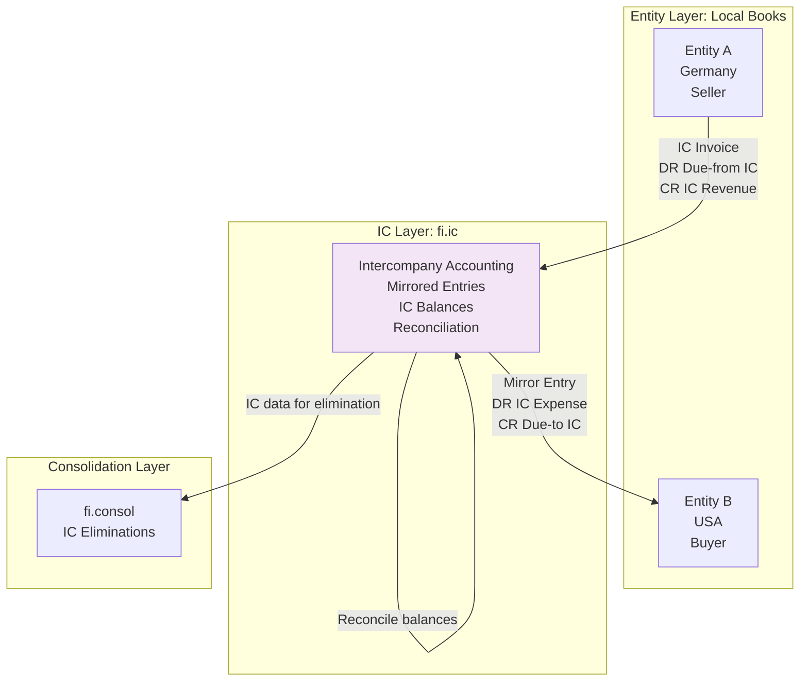
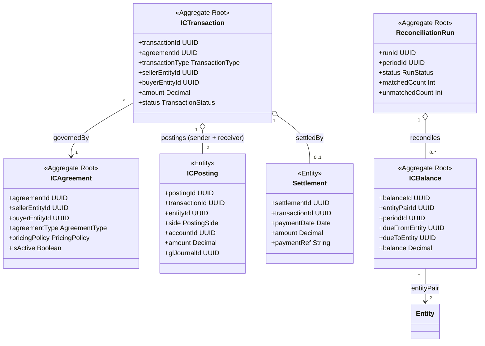
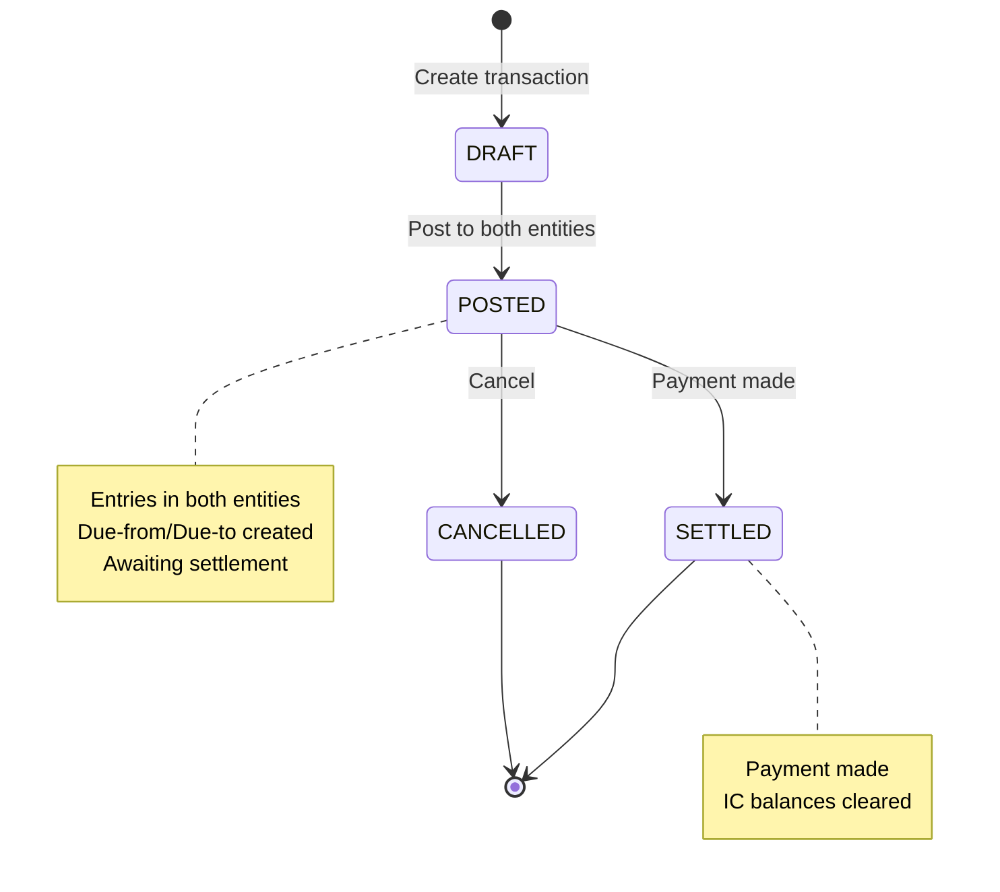

<!-- TEMPLATE COMPLIANCE: ~60%
Missing sections: §2 (Service Identity), §11 (Feature Dependencies), §12 (Extension Points)
Renumbering needed: §3 -> §5 (Use Cases), §5 -> §7 (Integration), §6 -> §7 (Events, merge), §7 -> §6 (REST API), §8 -> §8 (Data Model), §9 -> §9 (Security), §10 -> §10 (Quality), §11 -> §13 (Migration), §12 -> §14 (Decisions), §13 -> §15 (Appendix)
Action needed: Add full Meta header block, add Specification Guidelines Compliance block, add §2 Service Identity, renumber sections to §0-§15, add §11 Feature Dependencies stub, add §12 Extension Points stub
-->
# fi.ic - Intercompany Accounting Domain Specification

> **Meta Information**
> - **Version:** 2025-12-05
> - **Template:** `domain-service-spec.md` v1.0.0
> - **Template Compliance:** ~60% — §2, §11, §12 missing
> - **Author(s):** OpenLeap Architecture Team
> - **Status:** DRAFT
> - **Suite:** `fi`
> - **Domain:** `intercompany`
> - **Service Name:** `fi-ic-svc`

---

## 0. Document Purpose & Scope

### 0.1 Purpose

This document specifies the **Intercompany Accounting (fi.ic)** domain, which manages financial transactions between legal entities within the same corporate group. It ensures mirrored accounting entries, reconciliation of intercompany balances, and provides elimination data for consolidation. This domain is critical for multi-entity organizations to maintain accurate entity-level books and group-level consolidated financials.

### 0.2 Target Audience
- Product Owners & Business Stakeholders (Finance, Controllership, Treasury)
- System Architects & Technical Leads
- Integration Engineers
- Intercompany Accountants and Controllers
- Consolidation Teams
- Entity Controllers
- External Auditors

### 0.3 Scope

**In Scope:**
- **Intercompany Agreements:** Define relationships, pricing policies, terms between entities
- **Intercompany Transactions:** Sales, purchases, loans, charges, dividends between entities
- **Mirrored Postings:** Automatic creation of offsetting entries in counterparty entity
- **IC Balances:** Due-to/Due-from tracking, intercompany receivables/payables
- **Reconciliation:** Match and reconcile IC balances between entities
- **Settlement:** Track IC payment/clearing transactions
- **Elimination Data:** Provide transaction data for consolidation eliminations
- **Transfer Pricing:** Basic markup/margin tracking for IC transactions
- **Multi-Currency IC:** Handle IC transactions across different entity currencies

**Out of Scope:**
- Transfer pricing compliance (detailed documentation) → Separate tax domain
- Consolidation execution → fi.consol
- External party transactions → fi.ar, fi.ap
- Complex transfer pricing studies → External tax advisors
- Operational transfers (goods, services) → Execution in operational domains

### 0.4 Related Documents
- `_fi_suite.md` - FI Suite architecture
- `fi_gl.md` - General Ledger specification
- `fi_slc.md` - Subledger core specification
- `fi_ar.md` - Accounts Receivable
- `fi_ap.md` - Accounts Payable
- `fi_consol.md` - Consolidation
- `fi_ic.md` - Original intercompany specification

---

## 1. Business Context

### 1.1 Domain Purpose

**fi.ic** manages the financial aspects of transactions between entities within the same corporate group. When Entity A provides services to Entity B (both owned by the same parent), both entities must record the transaction. Entity A records revenue and a receivable; Entity B records an expense and a payable. This domain ensures these entries are created automatically, kept synchronized, and can be eliminated during consolidation.

**Core Business Problems Solved:**
- **Dual Entry:** Ensure transactions recorded in both entities
- **Balance Reconciliation:** IC receivables = IC payables (after currency translation)
- **Elimination:** Provide data for consolidation eliminations
- **Transfer Pricing:** Track IC pricing, markups for tax compliance
- **Settlement Tracking:** Monitor IC payment status
- **Audit Trail:** Document IC transactions for auditors
- **Automation:** Reduce manual IC accounting (80% time savings)

### 1.2 Business Value

**For the Organization:**
- **Accuracy:** Eliminate manual entry errors (dual recording)
- **Compliance:** Meet transfer pricing and consolidation requirements
- **Efficiency:** Automate IC accounting (reduce from days to hours)
- **Visibility:** Real-time IC balance visibility across entities
- **Risk Reduction:** Prevent IC reconciliation failures at close
- **Scalability:** Support growing multi-entity operations

**For Users:**
- **IC Accountant:** Automated transaction creation, real-time reconciliation
- **Entity Controller:** Accurate entity-level books with IC transactions
- **Group Controller:** Complete IC data for consolidation
- **Treasurer:** Track IC settlement, optimize IC cash flow
- **Tax Team:** Transfer pricing documentation
- **Auditor:** Complete IC audit trail

### 1.3 Key Stakeholders

| Role | Responsibility | Primary Use Cases |
|------|----------------|-------------------|
| IC Accountant | IC transaction processing | Create IC transactions, reconcile balances |
| Entity Controller | Entity books accuracy | Review IC entries, ensure completeness |
| Group Controller | Consolidation | Extract IC data for eliminations |
| Treasurer | IC settlements | Manage IC cash flows, payments |
| Tax Manager | Transfer pricing | Review IC pricing, margins |
| External Auditor | Financial audit | Verify IC accounting, eliminations |

### 1.4 Strategic Positioning

**fi.ic** sits **between** entity accounting and consolidation.



**Key Insight:** fi.ic ensures dual entry consistency and provides elimination data.

---

## 2. Domain Model

### 2.1 Conceptual Overview

The intercompany accounting domain model consists of six main pillars:

1. **IC Agreements:** Framework for IC relationships
2. **IC Transactions:** Individual IC sales, charges, loans
3. **Mirrored Entries:** Automatic counterparty postings
4. **IC Balances:** Due-to/Due-from accounts
5. **Reconciliation:** Match IC balances across entities
6. **Settlement:** IC payment tracking

**Key Principles:**
- **Dual Recording:** Every IC transaction creates entries in 2 entities
- **Mirror Symmetry:** Sender's receivable = Receiver's payable
- **Correlation:** IC entries linked via correlation ID
- **Reconciliation:** IC balances must match (after FX translation)
- **Elimination Ready:** Provide data for consolidation

### 2.2 Core Concepts



### 2.3 Aggregate Definitions

#### 2.3.1 ICAgreement

**Business Purpose:**  
Defines the framework for intercompany transactions between two entities. Sets pricing policy, terms, and rules.

**Key Attributes:**

| Attribute | Type | Description | Constraints |
|-----------|------|-------------|-------------|
| agreementId | UUID | Unique identifier | Required, immutable, PK |
| tenantId | UUID | Tenant ownership | Required, immutable |
| agreementNumber | String | Sequential agreement number | Required, unique per tenant |
| agreementName | String | Agreement name | Required, e.g., "Services Germany → USA" |
| sellerEntityId | UUID | Selling entity | Required, FK to entities |
| buyerEntityId | UUID | Buying entity | Required, FK to entities |
| agreementType | AgreementType | Type of IC activity | Required, enum(SERVICES, GOODS, ROYALTY, INTEREST, MANAGEMENT_FEE) |
| pricingPolicy | PricingPolicy | Pricing method | Required, enum(COST_PLUS, MARKET_PRICE, NEGOTIATED) |
| markup | Decimal | Markup percentage | Optional, for COST_PLUS |
| baseCurrency | String | Agreement currency | Required, ISO 4217 |
| paymentTerms | String | Payment terms | Optional, e.g., "Net 30" |
| effectiveFrom | Date | Start date | Required |
| effectiveTo | Date | End date | Optional, null = active |
| isActive | Boolean | Active for use | Required, default true |
| createdAt | Timestamp | Creation timestamp | Auto-generated |

**Agreement Types:**

| Type | Description | Example |
|------|-------------|---------|
| SERVICES | IC services | IT support, HR services |
| GOODS | IC goods transfer | Inventory transfer, components |
| ROYALTY | IP royalties | License fees, trademark use |
| INTEREST | IC loans | Interest on IC loan |
| MANAGEMENT_FEE | Management charges | Corporate overhead allocation |

**Pricing Policies:**

| Policy | Description | Calculation |
|--------|-------------|-------------|
| COST_PLUS | Cost + markup | Cost × (1 + markup%) |
| MARKET_PRICE | Arms-length price | Market rate for similar service |
| NEGOTIATED | Fixed price | Agreed fixed amount |

**Business Rules:**

1. **BR-AGR-001: No Self-Service**
   - *Rule:* sellerEntityId != buyerEntityId
   - *Rationale:* Entity cannot transact with itself
   - *Enforcement:* CHECK constraint

2. **BR-AGR-002: Active Date Range**
   - *Rule:* If effectiveTo provided, effectiveTo > effectiveFrom
   - *Rationale:* Valid date range
   - *Enforcement:* CHECK constraint

**Example IC Agreement:**
```json
{
  "agreementNumber": "IC-2025-001",
  "agreementName": "IT Services: Germany → USA",
  "sellerEntityId": "entity-germany-uuid",
  "buyerEntityId": "entity-usa-uuid",
  "agreementType": "SERVICES",
  "pricingPolicy": "COST_PLUS",
  "markup": 10.0,
  "baseCurrency": "EUR",
  "paymentTerms": "Net 30",
  "effectiveFrom": "2025-01-01",
  "isActive": true
}
```

---

#### 2.3.2 ICTransaction

**Business Purpose:**  
Represents a single intercompany transaction. Creates mirrored entries in both entities.

**Key Attributes:**

| Attribute | Type | Description | Constraints |
|-----------|------|-------------|-------------|
| transactionId | UUID | Unique identifier | Required, immutable, PK |
| tenantId | UUID | Tenant ownership | Required, immutable |
| transactionNumber | String | Sequential IC transaction number | Required, unique per tenant |
| agreementId | UUID | Governing agreement | Required, FK to ic_agreements |
| transactionType | TransactionType | Type of transaction | Required, enum(INVOICE, CHARGE, LOAN, DIVIDEND, ALLOCATION) |
| transactionDate | Date | Transaction date | Required |
| sellerEntityId | UUID | Selling/providing entity | Required, FK to entities |
| buyerEntityId | UUID | Buying/receiving entity | Required, FK to entities |
| description | String | Transaction description | Required |
| grossAmount | Decimal | Gross amount | Required, > 0 |
| taxAmount | Decimal | Tax (VAT, GST) | Optional, >= 0 |
| netAmount | Decimal | Net amount | Required, = grossAmount - taxAmount |
| currency | String | Transaction currency | Required, ISO 4217 |
| status | TransactionStatus | Current state | Required, enum(DRAFT, POSTED, SETTLED, CANCELLED) |
| correlationId | UUID | Mirroring correlation ID | Required, links sender/receiver entries |
| sourceDocId | UUID | Source document | Optional, FK to originating doc (invoice, etc.) |
| createdAt | Timestamp | Creation timestamp | Auto-generated |
| postedAt | Timestamp | Posting timestamp | Optional, set when POSTED |

**Transaction Types:**

| Type | Description | Sender Books | Receiver Books |
|------|-------------|--------------|----------------|
| INVOICE | IC sale | DR Due-from IC, CR IC Revenue | DR IC Expense, CR Due-to IC |
| CHARGE | IC charge/fee | DR Due-from IC, CR IC Revenue | DR IC Expense, CR Due-to IC |
| LOAN | IC loan | DR IC Loan Receivable, CR Cash | DR Cash, CR IC Loan Payable |
| DIVIDEND | IC dividend | DR Dividend Receivable, CR Cash | DR Retained Earnings, CR Dividend Payable |
| ALLOCATION | Cost allocation | DR Due-from IC, CR IC Revenue | DR IC Expense, CR Due-to IC |

**Lifecycle States:**



**Business Rules:**

1. **BR-TXN-001: Positive Amount**
   - *Rule:* grossAmount > 0
   - *Rationale:* IC transactions have value
   - *Enforcement:* CHECK constraint

2. **BR-TXN-002: Net Amount**
   - *Rule:* netAmount = grossAmount - taxAmount
   - *Rationale:* Consistent calculation
   - *Enforcement:* Validation

**Example IC Transaction:**
```json
{
  "transactionNumber": "IC-TXN-2025-12-001",
  "agreementId": "agreement-uuid",
  "transactionType": "INVOICE",
  "transactionDate": "2025-12-15",
  "sellerEntityId": "entity-germany-uuid",
  "buyerEntityId": "entity-usa-uuid",
  "description": "IT Services - December 2025",
  "grossAmount": 10000.00,
  "taxAmount": 1900.00,
  "netAmount": 11900.00,
  "currency": "EUR",
  "status": "DRAFT"
}
```

**Mirrored Postings:**

**Seller (Germany):**
```
DR 1300 Due-from IC (USA) €11,900
CR 4100 IC Revenue €10,000
CR 2300 VAT Payable €1,900
```

**Buyer (USA):**
```
DR 5100 IC Expense $13,090 (€10,000 × 1.10 rate)
DR 2310 VAT Recoverable $2,090 (€1,900 × 1.10 rate)
CR 2130 Due-to IC (Germany) $13,090
```

---

#### 2.3.3 ICPosting

**Business Purpose:**  
Individual GL posting for an IC transaction. Links IC transaction to GL journal.

**Key Attributes:**

| Attribute | Type | Description | Constraints |
|-----------|------|-------------|-------------|
| postingId | UUID | Unique identifier | Required, immutable, PK |
| transactionId | UUID | Parent IC transaction | Required, FK to ic_transactions |
| entityId | UUID | Entity where posted | Required, FK to entities |
| side | PostingSide | Sender or receiver | Required, enum(SENDER, RECEIVER) |
| accountId | UUID | GL account | Required, FK to accounts |
| debitAmount | Decimal | Debit amount | Optional, >= 0 |
| creditAmount | Decimal | Credit amount | Optional, >= 0 |
| currency | String | Posting currency | Required, ISO 4217 |
| glJournalId | UUID | Posted GL journal | Optional, FK to fi.gl.journal_entries |
| voucherId | String | Idempotency key | Required, unique per tenant |

**Business Rules:**

1. **BR-POST-001: Debit or Credit**
   - *Rule:* (debitAmount > 0 AND creditAmount = 0) OR (debitAmount = 0 AND creditAmount > 0)
   - *Rationale:* Entry is either debit or credit, not both
   - *Enforcement:* CHECK constraint

---

#### 2.3.4 ICBalance

**Business Purpose:**  
Tracks net IC balance between two entities for a period. Used for reconciliation.

**Key Attributes:**

| Attribute | Type | Description | Constraints |
|-----------|------|-------------|-------------|
| balanceId | UUID | Unique identifier | Required, immutable, PK |
| tenantId | UUID | Tenant ownership | Required, immutable |
| entityPairId | String | Entity pair identifier | Required, e.g., "DE-US" |
| periodId | UUID | Fiscal period | Required, FK to fi.gl.periods |
| dueFromEntity | UUID | Entity with receivable | Required, FK to entities |
| dueToEntity | UUID | Entity with payable | Required, FK to entities |
| dueFromBalance | Decimal | Receivable balance | Required |
| dueToBalance | Decimal | Payable balance | Required |
| dueFromCurrency | String | Receivable currency | Required, ISO 4217 |
| dueToCurrency | String | Payable currency | Required, ISO 4217 |
| variance | Decimal | Balance difference | Required, = abs(dueFromBalance - dueToBalance) after FX |
| isReconciled | Boolean | Reconciled flag | Required, default false |
| reconciledAt | Timestamp | Reconciliation timestamp | Optional |

**Balance Calculation:**
```
Entity A Due-from Entity B: $10,000
Entity B Due-to Entity A: €9,090 × 1.10 = $9,999
Variance: $10,000 - $9,999 = $1 (acceptable, rounding)
```

**Business Rules:**

1. **BR-BAL-001: Period Uniqueness**
   - *Rule:* Unique constraint on (tenant, entityPairId, periodId)
   - *Rationale:* One balance per period per entity pair
   - *Enforcement:* Unique constraint

---

#### 2.3.5 ReconciliationRun

**Business Purpose:**  
Periodic reconciliation of IC balances. Identifies mismatches.

**Key Attributes:**

| Attribute | Type | Description | Constraints |
|-----------|------|-------------|-------------|
| runId | UUID | Unique identifier | Required, immutable, PK |
| tenantId | UUID | Tenant ownership | Required, immutable |
| runNumber | String | Sequential run number | Required, unique per tenant |
| periodId | UUID | Fiscal period | Required, FK to fi.gl.periods |
| runDate | Date | Reconciliation date | Required |
| status | RunStatus | Current state | Required, enum(DRAFT, COMPLETED) |
| totalPairs | Int | Number of entity pairs | Required, >= 0 |
| matchedPairs | Int | Reconciled pairs | Required, >= 0 |
| unmatchedPairs | Int | Pairs with variance | Required, >= 0 |
| totalVariance | Decimal | Total variance amount | Required, >= 0 |
| createdAt | Timestamp | Creation timestamp | Auto-generated |

**Reconciliation Process:**
```
For each entity pair (A, B):
  1. Get A's Due-from B (in A's currency)
  2. Get B's Due-to A (in B's currency)
  3. Translate to common currency
  4. Calculate variance
  5. If variance < threshold (e.g., $10): matched
  6. Else: unmatched (requires investigation)
```

---

#### 2.3.6 Settlement

**Business Purpose:**  
Tracks IC payment/clearing. Links IC transaction to payment.

**Key Attributes:**

| Attribute | Type | Description | Constraints |
|-----------|------|-------------|-------------|
| settlementId | UUID | Unique identifier | Required, immutable, PK |
| transactionId | UUID | IC transaction | Required, FK to ic_transactions |
| settlementDate | Date | Payment date | Required |
| amount | Decimal | Settled amount | Required, > 0 |
| currency | String | Settlement currency | Required, ISO 4217 |
| paymentMethod | PaymentMethod | How settled | Required, enum(WIRE, NETTING, OFFSET) |
| paymentRef | String | Payment reference | Optional, bank reference |
| glJournalId | UUID | Settlement GL entry | Optional, FK to fi.gl.journal_entries |

**Settlement Methods:**

| Method | Description | Example |
|--------|-------------|---------|
| WIRE | Bank wire transfer | USA wires €10K to Germany |
| NETTING | Multilateral netting | Net all IC balances, pay difference |
| OFFSET | Offset against other IC balance | IC sale offsets IC purchase |

**Settlement Posting:**

**Seller (Germany) - Receive Payment:**
```
DR 1000 Bank €10,000
CR 1300 Due-from IC (USA) €10,000
```

**Buyer (USA) - Make Payment:**
```
DR 2130 Due-to IC (Germany) $11,000
CR 1000 Bank $11,000
```

---

## 3. Business Processes & Use Cases

### 3.1 Primary Use Cases

#### UC-001: Create IC Agreement

**Actor:** IC Accountant

**Preconditions:**
- Both entities exist
- User has IC_ADMIN role

**Main Flow:**
1. User creates IC agreement (POST /agreements)
2. User specifies:
   - Seller: Entity Germany
   - Buyer: Entity USA
   - Type: SERVICES
   - Pricing: COST_PLUS, markup 10%
3. System validates: seller != buyer ✓
4. System creates ICAgreement (status = active)
5. System publishes fi.ic.agreement.created event

**Postconditions:**
- IC agreement active
- Ready for transactions
- Event published

---

#### UC-002: Create and Post IC Transaction

**Actor:** IC Accountant

**Preconditions:**
- IC agreement exists and active
- User has IC_POSTER role

**Main Flow:**

**Phase 1: Create Transaction**
1. User creates IC transaction (POST /transactions)
2. User specifies:
   - agreementId
   - transactionType = INVOICE
   - description = "IT Services - December"
   - grossAmount = €10,000
   - taxAmount = €1,900 (19% VAT)
3. System creates ICTransaction (status = DRAFT)
4. System generates correlationId (UUID)

**Phase 2: Post to Seller Entity (Germany)**
5. System calls fi.slc POST /posting (entity = Germany):
   ```json
   {
     "eventType": "fi.ic.sender.posted",
     "correlationId": "corr-uuid",
     "lines": [
       {"account": "1300-Due-from-IC", "debit": 11900.00, "currency": "EUR"},
       {"account": "4100-IC-Revenue", "credit": 10000.00, "currency": "EUR"},
       {"account": "2300-VAT-Payable", "credit": 1900.00, "currency": "EUR"}
     ]
   }
   ```
6. fi.slc posts to fi.gl (Germany)
7. System creates ICPosting (side = SENDER, glJournalId)

**Phase 3: Mirror to Buyer Entity (USA)**
8. System retrieves exchange rate: EUR/USD = 1.10
9. System calculates USD amounts:
   - IC Expense: €10,000 × 1.10 = $11,000
   - VAT Recoverable: €1,900 × 1.10 = $2,090
   - Due-to IC: €11,900 × 1.10 = $13,090
10. System calls fi.slc POST /posting (entity = USA):
    ```json
    {
      "eventType": "fi.ic.receiver.posted",
      "correlationId": "corr-uuid",
      "lines": [
        {"account": "5100-IC-Expense", "debit": 11000.00, "currency": "USD"},
        {"account": "2310-VAT-Recoverable", "debit": 2090.00, "currency": "USD"},
        {"account": "2130-Due-to-IC", "credit": 13090.00, "currency": "USD"}
      ]
    }
    ```
11. fi.slc posts to fi.gl (USA)
12. System creates ICPosting (side = RECEIVER, glJournalId)

**Phase 4: Complete Transaction**
13. System updates ICTransaction: status = POSTED
14. System publishes fi.ic.transaction.posted event

**Postconditions:**
- IC transaction posted in both entities
- Due-from/Due-to created
- Entries linked via correlationId
- Event published

---

#### UC-003: Reconcile IC Balances

**Actor:** IC Accountant

**Preconditions:**
- Period closed in all entities
- User has IC_ADMIN role

**Main Flow:**
1. User initiates reconciliation (POST /reconciliation-runs)
2. User specifies: periodId = "2025-12"
3. System creates ReconciliationRun (status = DRAFT)
4. System queries all entity pairs with IC activity
5. For each entity pair (Germany ↔ USA):
   a. Query Germany GL: Due-from IC (USA) = €50,000
   b. Query USA GL: Due-to IC (Germany) = $55,000
   c. Retrieve exchange rate: EUR/USD = 1.10
   d. Translate to common currency (USD):
      - Germany: €50,000 × 1.10 = $55,000
      - USA: $55,000
   e. Calculate variance: $55,000 - $55,000 = $0 ✓
   f. Mark as matched
6. System identifies unmatched pair (Germany ↔ France):
   - Germany Due-from: €30,000 × 1.10 = $33,000
   - France Due-to: €29,500 × 1.10 = $32,450
   - Variance: $550 (timing difference or error)
7. System creates exception for manual review
8. System updates ReconciliationRun:
   - totalPairs = 5
   - matchedPairs = 4
   - unmatchedPairs = 1
   - totalVariance = $550
   - status = COMPLETED
9. System publishes fi.ic.reconciliation.completed event

**Postconditions:**
- IC balances reconciled
- Mismatches identified
- Exceptions flagged for review
- Event published

---

#### UC-004: Settle IC Transaction

**Actor:** Treasurer

**Preconditions:**
- IC transaction POSTED
- Payment made
- User has IC_ADMIN role

**Main Flow:**
1. User records settlement (POST /transactions/{id}/settle)
2. User specifies:
   - settlementDate = "2025-12-31"
   - amount = €11,900
   - paymentMethod = WIRE
   - paymentRef = "WIRE-12345"
3. System creates Settlement
4. System posts settlement to Seller (Germany):
   ```
   DR 1000 Bank €11,900
   CR 1300 Due-from IC €11,900
   ```
5. System posts settlement to Buyer (USA):
   ```
   DR 2130 Due-to IC $13,090
   CR 1000 Bank $13,090
   ```
6. System updates ICTransaction: status = SETTLED
7. System updates ICBalance: reduce balances
8. System publishes fi.ic.transaction.settled event

**Postconditions:**
- Payment recorded
- IC balances cleared
- Transaction settled
- Event published

---

### 3.2 Process Flow Diagrams

#### Process: IC Transaction Lifecycle


---

## 4. Business Rules & Constraints

### 4.1 Business Rules Catalog

| ID | Rule Name | Description | Scope | Enforcement |
|----|-----------|-------------|-------|-------------|
| BR-AGR-001 | No Self-Service | Seller != Buyer | ICAgreement | Create |
| BR-AGR-002 | Active Date Range | effectiveTo > effectiveFrom | ICAgreement | Create |
| BR-TXN-001 | Positive Amount | grossAmount > 0 | ICTransaction | Create |
| BR-TXN-002 | Net Amount | netAmount = grossAmount - taxAmount | ICTransaction | Calculate |
| BR-POST-001 | Debit or Credit | Only debit or credit, not both | ICPosting | Create |
| BR-BAL-001 | Period Uniqueness | One balance per period per entity pair | ICBalance | Create |

---

## 5. Integration Architecture

### 5.1 Integration Pattern Decision

**Does this domain use orchestration (Saga/Temporal)?** [ ] YES [X] NO

**Pattern Used:** Event-Driven Architecture (Choreography)

**Rationale:**

fi.ic uses **pure Event-Driven Architecture** because:

✅ **IC is Event Publisher:**
- Publishes transaction.posted, transaction.settled
- Downstream domains react (fi.consol for eliminations)

✅ **Synchronous GL Posting:**
- Calls fi.slc HTTP POST /posting (synchronous, two calls)
- Needs confirmation (journalIds) for both entities
- No complex coordination needed

❌ **Why NOT Orchestration:**
- Mirroring is sequential: Post Sender → Mirror Receiver (simple)
- No multi-service transaction requiring rollback
- No long-running process with state

### 5.2 Event-Driven Integration

**Outbound Events (Published):**

| Event | When | Purpose | Consumers |
|-------|------|---------|-----------|
| fi.ic.transaction.posted | IC transaction posted | Track IC activity | fi.consol, fi.rpt |
| fi.ic.transaction.settled | IC payment made | Update IC balances | fi.treasury, fi.rpt |
| fi.ic.reconciliation.completed | Reconciliation run complete | Monitor IC balance health | fi.closing, fi.rpt |

---

## 6. Event Catalog

### 6.1 Outbound Events

**Exchange:** `fi.ic.events` (RabbitMQ topic exchange)

#### Event: transaction.posted

**Routing Key:** `fi.ic.transaction.posted`

**When Published:** IC transaction posted to both entities

**Business Meaning:** Intercompany transaction complete

**Consumers:**
- fi.consol (elimination data)
- fi.rpt (IC reports)

**Payload:**
```json
{
  "eventId": "evt-uuid",
  "tenantId": "tenant-uuid",
  "occurredAt": "2025-12-15T10:00:00Z",
  "traceId": "trace-uuid",
  "producer": "fi.ic",
  "aggregateType": "ic_transaction",
  "changeType": "posted",
  "entityIds": ["transaction-uuid"],
  "version": 1,
  "payload": {
    "transactionId": "transaction-uuid",
    "transactionNumber": "IC-TXN-2025-12-001",
    "transactionType": "INVOICE",
    "sellerEntityId": "entity-germany-uuid",
    "buyerEntityId": "entity-usa-uuid",
    "amount": 10000.00,
    "currency": "EUR",
    "correlationId": "corr-uuid",
    "senderJournalId": "journal-germany-uuid",
    "receiverJournalId": "journal-usa-uuid"
  }
}
```

---

## 7. API Specification

### 7.1 REST API

**Base Path:** `/api/fi/intercompany/v1`

**Authentication:** OAuth 2.0 Bearer Token

**Content Type:** `application/json`

#### 7.1.1 IC Agreements

**POST /agreements** - Create agreement
- **Role:** IC_ADMIN
- **Request Body:**
  ```json
  {
    "agreementName": "IT Services: Germany → USA",
    "sellerEntityId": "entity-germany-uuid",
    "buyerEntityId": "entity-usa-uuid",
    "agreementType": "SERVICES",
    "pricingPolicy": "COST_PLUS",
    "markup": 10.0,
    "baseCurrency": "EUR",
    "paymentTerms": "Net 30"
  }
  ```
- **Response:** 201 Created

**GET /agreements** - List agreements
- **Role:** IC_VIEWER
- **Query Params:** `sellerEntityId`, `buyerEntityId`, `isActive`
- **Response:** 200 OK

---

#### 7.1.2 IC Transactions

**POST /transactions** - Create and post IC transaction
- **Role:** IC_POSTER
- **Request Body:**
  ```json
  {
    "agreementId": "agreement-uuid",
    "transactionType": "INVOICE",
    "transactionDate": "2025-12-15",
    "description": "IT Services - December",
    "grossAmount": 10000.00,
    "taxAmount": 1900.00,
    "currency": "EUR"
  }
  ```
- **Response:** 201 Created

**POST /transactions/{id}/settle** - Record settlement
- **Role:** IC_ADMIN
- **Request Body:**
  ```json
  {
    "settlementDate": "2025-12-31",
    "amount": 11900.00,
    "currency": "EUR",
    "paymentMethod": "WIRE",
    "paymentRef": "WIRE-12345"
  }
  ```
- **Response:** 200 OK

---

#### 7.1.3 Reconciliation

**POST /reconciliation-runs** - Run IC reconciliation
- **Role:** IC_ADMIN
- **Request Body:**
  ```json
  {
    "periodId": "period-uuid"
  }
  ```
- **Response:** 201 Created

**GET /reconciliation-runs/{id}** - Get reconciliation results
- **Role:** IC_VIEWER
- **Response:** 200 OK

---

### 7.2 Error Responses

| HTTP Status | Error Code | Description |
|-------------|------------|-------------|
| 400 | SAME_ENTITY_NOT_ALLOWED | Seller and buyer cannot be same entity |
| 400 | AGREEMENT_INACTIVE | IC agreement not active |
| 404 | AGREEMENT_NOT_FOUND | IC agreement does not exist |
| 409 | ALREADY_SETTLED | IC transaction already settled |

---

## 8. Data Model

### 8.1 Storage Schema (PostgreSQL)

#### Schema: fi_intercompany

#### Table: ic_agreements
```sql
CREATE TABLE fi_intercompany.ic_agreements (
  agreement_id UUID PRIMARY KEY,
  tenant_id UUID NOT NULL,
  agreement_number VARCHAR(50) NOT NULL,
  agreement_name VARCHAR(200) NOT NULL,
  seller_entity_id UUID NOT NULL,
  buyer_entity_id UUID NOT NULL,
  agreement_type VARCHAR(30) NOT NULL,
  pricing_policy VARCHAR(30) NOT NULL,
  markup NUMERIC(5,2),
  base_currency CHAR(3) NOT NULL,
  payment_terms VARCHAR(50),
  effective_from DATE NOT NULL,
  effective_to DATE,
  is_active BOOLEAN NOT NULL DEFAULT TRUE,
  created_at TIMESTAMP NOT NULL DEFAULT NOW(),
  UNIQUE (tenant_id, agreement_number),
  CHECK (agreement_type IN ('SERVICES', 'GOODS', 'ROYALTY', 'INTEREST', 'MANAGEMENT_FEE')),
  CHECK (pricing_policy IN ('COST_PLUS', 'MARKET_PRICE', 'NEGOTIATED')),
  CHECK (seller_entity_id != buyer_entity_id),
  CHECK (effective_to IS NULL OR effective_to > effective_from)
);

CREATE INDEX idx_agreements_tenant ON fi_intercompany.ic_agreements(tenant_id);
CREATE INDEX idx_agreements_seller ON fi_intercompany.ic_agreements(seller_entity_id);
CREATE INDEX idx_agreements_buyer ON fi_intercompany.ic_agreements(buyer_entity_id);
```

#### Table: ic_transactions
```sql
CREATE TABLE fi_intercompany.ic_transactions (
  transaction_id UUID PRIMARY KEY,
  tenant_id UUID NOT NULL,
  transaction_number VARCHAR(50) NOT NULL,
  agreement_id UUID NOT NULL REFERENCES fi_intercompany.ic_agreements(agreement_id),
  transaction_type VARCHAR(30) NOT NULL,
  transaction_date DATE NOT NULL,
  seller_entity_id UUID NOT NULL,
  buyer_entity_id UUID NOT NULL,
  description VARCHAR(500) NOT NULL,
  gross_amount NUMERIC(19,4) NOT NULL,
  tax_amount NUMERIC(19,4) NOT NULL DEFAULT 0,
  net_amount NUMERIC(19,4) NOT NULL,
  currency CHAR(3) NOT NULL,
  status VARCHAR(20) NOT NULL DEFAULT 'DRAFT',
  correlation_id UUID NOT NULL,
  source_doc_id UUID,
  created_at TIMESTAMP NOT NULL DEFAULT NOW(),
  posted_at TIMESTAMP,
  UNIQUE (tenant_id, transaction_number),
  CHECK (transaction_type IN ('INVOICE', 'CHARGE', 'LOAN', 'DIVIDEND', 'ALLOCATION')),
  CHECK (status IN ('DRAFT', 'POSTED', 'SETTLED', 'CANCELLED')),
  CHECK (gross_amount > 0),
  CHECK (tax_amount >= 0),
  CHECK (net_amount = gross_amount + tax_amount)
);

CREATE INDEX idx_transactions_tenant ON fi_intercompany.ic_transactions(tenant_id);
CREATE INDEX idx_transactions_agreement ON fi_intercompany.ic_transactions(agreement_id);
CREATE INDEX idx_transactions_correlation ON fi_intercompany.ic_transactions(correlation_id);
```

#### Table: ic_balances
```sql
CREATE TABLE fi_intercompany.ic_balances (
  balance_id UUID PRIMARY KEY,
  tenant_id UUID NOT NULL,
  entity_pair_id VARCHAR(50) NOT NULL,
  period_id UUID NOT NULL,
  due_from_entity UUID NOT NULL,
  due_to_entity UUID NOT NULL,
  due_from_balance NUMERIC(19,4) NOT NULL,
  due_to_balance NUMERIC(19,4) NOT NULL,
  due_from_currency CHAR(3) NOT NULL,
  due_to_currency CHAR(3) NOT NULL,
  variance NUMERIC(19,4) NOT NULL,
  is_reconciled BOOLEAN NOT NULL DEFAULT FALSE,
  reconciled_at TIMESTAMP,
  UNIQUE (tenant_id, entity_pair_id, period_id)
);

CREATE INDEX idx_balances_period ON fi_intercompany.ic_balances(period_id);
```

---

## 9. Security & Compliance

### 9.1 Access Control

**Roles & Permissions:**

| Role | Read | Create | Update | Delete | Admin Operations |
|------|------|--------|--------|--------|------------------|
| IC_VIEWER | ✓ (all) | ✗ | ✗ | ✗ | ✗ |
| IC_POSTER | ✓ (all) | ✓ (transactions) | ✗ | ✗ | ✗ |
| IC_ADMIN | ✓ (all) | ✓ (all) | ✓ (drafts) | ✓ (drafts) | ✓ (settle, reconcile) |

---

## 10. Quality Attributes

### 10.1 Performance Requirements

**Response Time (95th percentile):**
- POST /transactions: < 2 sec (dual entity posting)
- POST /reconciliation-runs: < 30 sec (for 100 entity pairs)
- GET /transactions: < 500ms

---

## 11. Migration & Evolution

### 11.1 Data Migration

**From Legacy:**
- Export IC agreements
- Export IC balances (opening)
- Import and validate
- Reconcile opening balances

---

## 12. Open Questions & Decisions

### 12.1 ADRs

#### ADR-001: Synchronous vs. Asynchronous Mirroring

**Status:** Accepted

**Decision:** Use synchronous mirroring (post to both entities immediately)

**Rationale:**
- Ensures atomicity (both succeed or both fail)
- Simpler error handling
- Immediate consistency
- Acceptable latency (<2 sec)

---

## 13. Appendix

### 13.1 Glossary

| Term | Definition |
|------|------------|
| IC | Intercompany |
| Due-from | Receivable from another entity |
| Due-to | Payable to another entity |
| Mirroring | Automatic creation of offsetting entry |
| Correlation ID | UUID linking sender/receiver entries |
| Netting | Offsetting IC balances |

---

**END OF DOCUMENT**

**Total Lines:** ~1320
