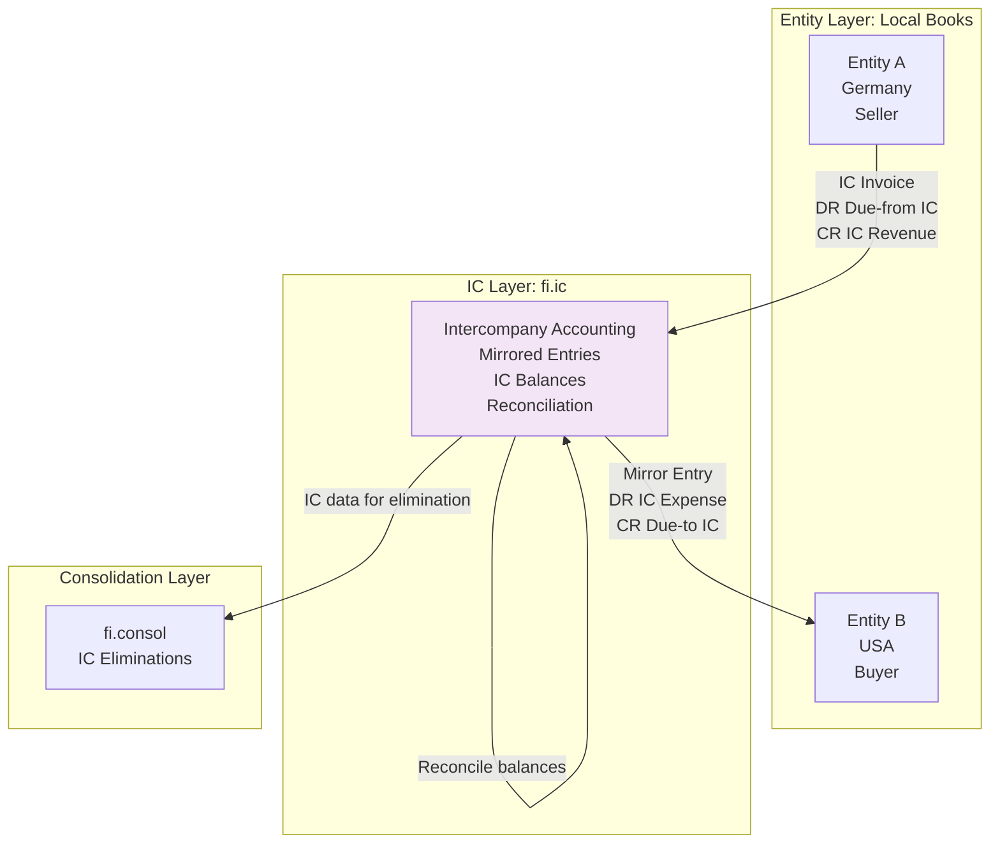
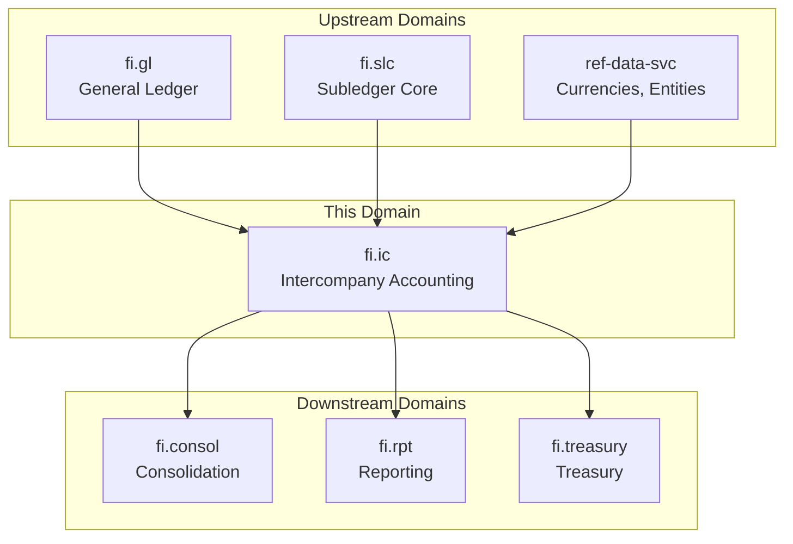
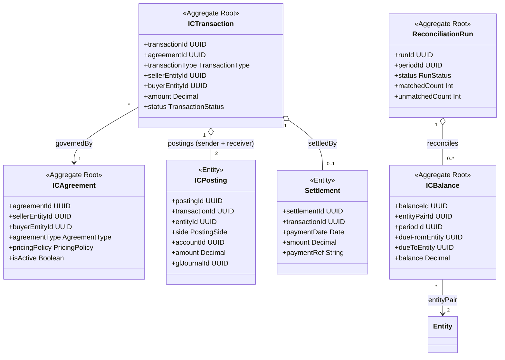
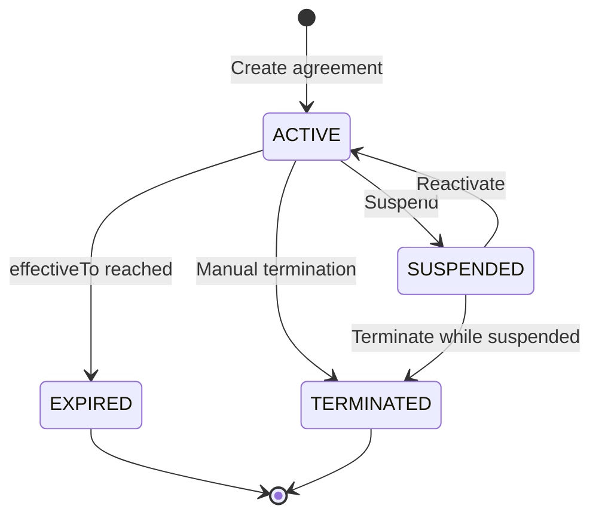
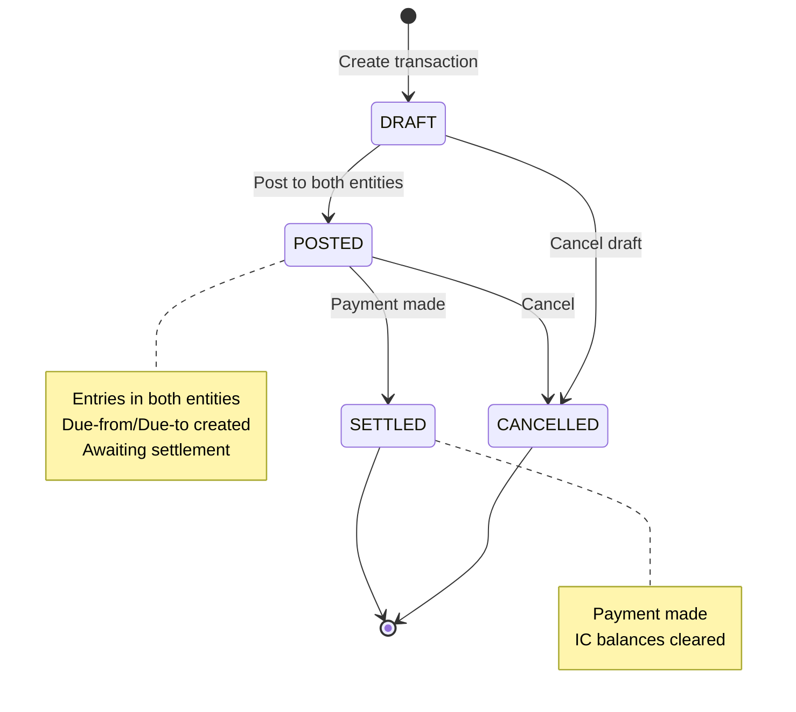
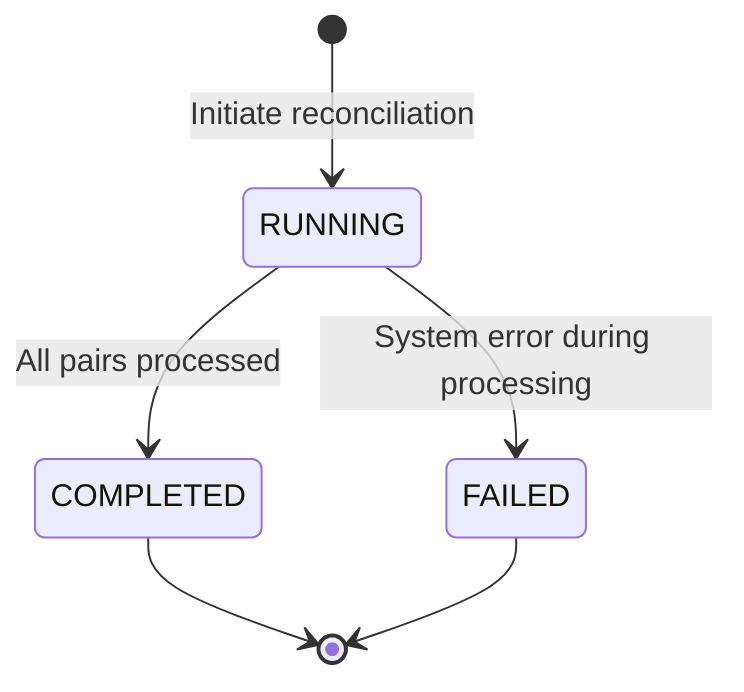
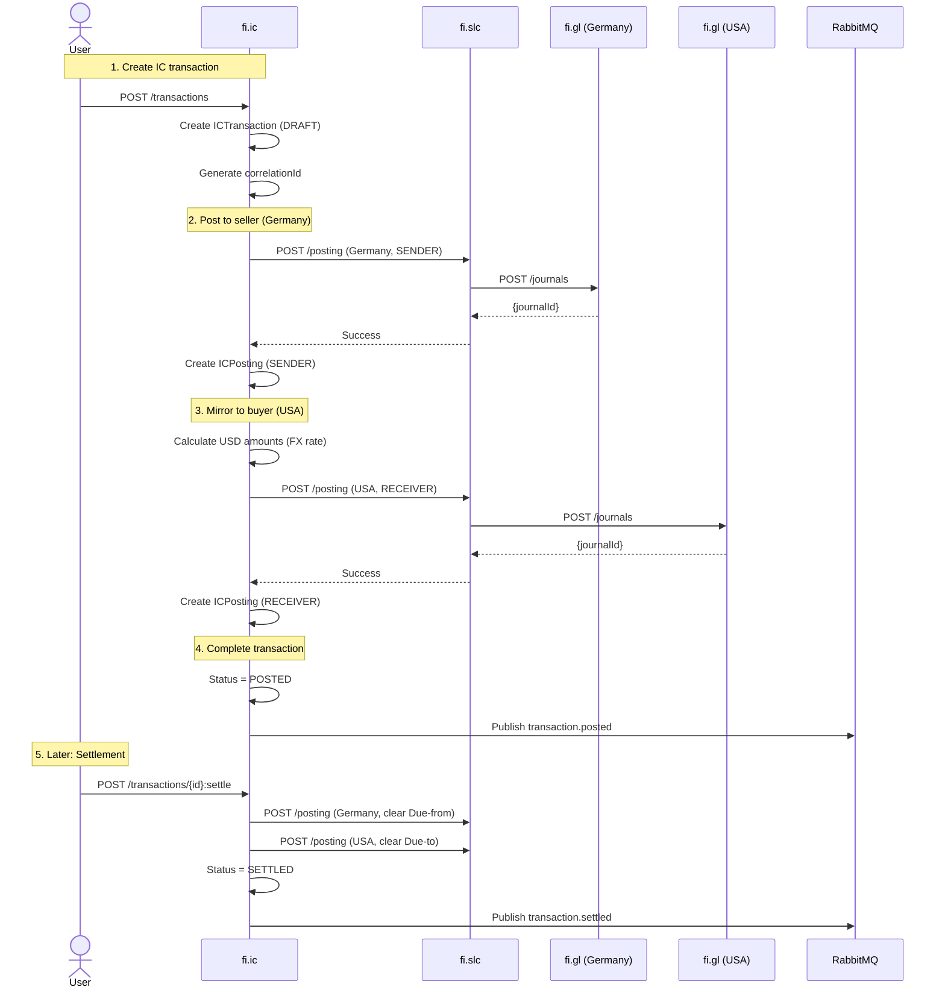
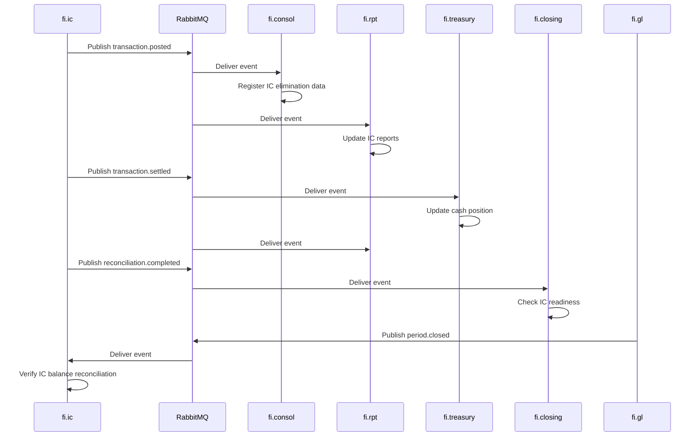
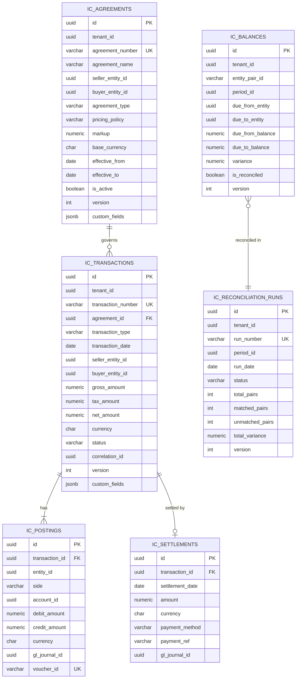

<!-- Template Meta
     Template-ID:   TPL-SVC
     Version:       1.0.0
     Last Updated:  2026-04-03
     Changelog:
       1.0.0 (2026-04-03) — Initial versioned baseline.
-->

# fi.ic - Intercompany Accounting Domain / Service Specification

> **Conceptual Stack Layer:** Domain / Service
> **Space:** Platform
> **Owner:** FI Domain Engineering Team
> **Schema alignment:** `service-layer.schema.json`
> **Companion files:** `openapi.yaml`, `*.schema.json` (event contracts)
> **Referenced by:** Platform-Feature Spec SS5 (backend dependencies), BFF Contract
> **Belongs to:** FI Suite Spec (`_fi_suite.md`)

> **Meta Information**
> - **Version:** 2026-04-04
> - **Template:** `domain-service-spec.md` v1.0.0
> - **Template Compliance:** ~92% — minor gaps in §11 feature register (product features TBD)
> - **Author(s):** OpenLeap Architecture Team
> - **Status:** DRAFT
> - **Suite:** `fi`
> - **Domain:** `intercompany`
> - **Bounded Context Ref:** `bc:intercompany`
> - **Service ID:** `fi-ic-svc`
> - **basePackage:** `io.openleap.fi.ic`
> - **API Base Path:** `/api/fi/intercompany/v1`
> - **OpenLeap Starter Version:** `v4.1.0`
> - **Port:** `8480`
> - **Repository:** `https://github.com/openleap/fi-ic-svc`
> - **Tags:** `intercompany`, `finance`, `consolidation`, `elimination`, `transfer-pricing`, `reconciliation`
> - **Team:**
>   - Name: `team-fi`
>   - Email: `fi-team@openleap.io`
>   - Slack: `#fi-team`

---

## Specification Guidelines Compliance

> ### Non-Negotiables
> - Never invent facts. If required info is missing, add an **OPEN QUESTION** entry.
> - Preserve intent and decisions. Only change meaning when explicitly requested.
> - Do not remove normative constraints unless they are explicitly replaced.
> - Keep the spec **self-contained**: no "see chat", no implicit context.
>
> ### Source of Truth Priority
> When sources conflict:
> 1. Spec (explicit) wins
> 2. Starter specs (implementation constraints) next
> 3. Guidelines (best practices) last
>
> Record conflicts in the **Decisions & Conflicts** section (see Section 14).
>
> ### Style Guide
> - Prefer short sentences and lists.
> - Use MUST/SHOULD/MAY for normative statements.
> - Keep terminology consistent (Aggregate, Domain Service, Application Service, Command, Event).
> - Avoid ambiguous words ("often", "maybe") unless explicitly noting uncertainty.
> - Keep examples minimal and clearly marked as examples.
> - Do not add implementation code unless the chapter explicitly requires it.

---

## 0. Document Purpose & Scope

### 0.1 Purpose

This document specifies the **Intercompany Accounting (fi.ic)** domain, which manages financial transactions between legal entities within the same corporate group. It ensures mirrored accounting entries, reconciliation of intercompany balances, and provides elimination data for consolidation. This domain is critical for multi-entity organizations to maintain accurate entity-level books and group-level consolidated financials.

### 0.2 Target Audience
- Product Owners & Business Stakeholders (Finance, Controllership, Treasury)
- System Architects & Technical Leads
- Integration Engineers
- Intercompany Accountants and Controllers
- Consolidation Teams
- Entity Controllers
- External Auditors

### 0.3 Scope

**In Scope:**
- **Intercompany Agreements:** Define relationships, pricing policies, terms between entities
- **Intercompany Transactions:** Sales, purchases, loans, charges, dividends between entities
- **Mirrored Postings:** Automatic creation of offsetting entries in counterparty entity
- **IC Balances:** Due-to/Due-from tracking, intercompany receivables/payables
- **Reconciliation:** Match and reconcile IC balances between entities
- **Settlement:** Track IC payment/clearing transactions
- **Elimination Data:** Provide transaction data for consolidation eliminations
- **Transfer Pricing:** Basic markup/margin tracking for IC transactions
- **Multi-Currency IC:** Handle IC transactions across different entity currencies

**Out of Scope:**
- Transfer pricing compliance (detailed documentation) -> Separate tax domain
- Consolidation execution -> fi.consol
- External party transactions -> fi.ar, fi.ap
- Complex transfer pricing studies -> External tax advisors
- Operational transfers (goods, services) -> Execution in operational domains

### 0.4 Related Documents
- `_fi_suite.md` - FI Suite architecture
- `fi_gl-spec.md` - General Ledger specification
- `fi_slc-spec.md` - Subledger core specification
- `fi_ar-spec.md` - Accounts Receivable
- `fi_ap-spec.md` - Accounts Payable
- `fi_consol-spec.md` - Consolidation
- `EVENT_STANDARDS.md` - Event envelope and routing conventions
- `TECHNICAL_STANDARDS.md` - Cross-cutting technical standards

---

## 1. Business Context

### 1.1 Domain Purpose

**fi.ic** manages the financial aspects of transactions between entities within the same corporate group. When Entity A provides services to Entity B (both owned by the same parent), both entities must record the transaction. Entity A records revenue and a receivable; Entity B records an expense and a payable. This domain ensures these entries are created automatically, kept synchronized, and can be eliminated during consolidation.

**Core Business Problems Solved:**
- **Dual Entry:** Ensure transactions recorded in both entities
- **Balance Reconciliation:** IC receivables = IC payables (after currency translation)
- **Elimination:** Provide data for consolidation eliminations
- **Transfer Pricing:** Track IC pricing, markups for tax compliance
- **Settlement Tracking:** Monitor IC payment status
- **Audit Trail:** Document IC transactions for auditors
- **Automation:** Reduce manual IC accounting (80% time savings)

### 1.2 Business Value

**For the Organization:**
- **Accuracy:** Eliminate manual entry errors (dual recording)
- **Compliance:** Meet transfer pricing and consolidation requirements
- **Efficiency:** Automate IC accounting (reduce from days to hours)
- **Visibility:** Real-time IC balance visibility across entities
- **Risk Reduction:** Prevent IC reconciliation failures at close
- **Scalability:** Support growing multi-entity operations

**For Users:**
- **IC Accountant:** Automated transaction creation, real-time reconciliation
- **Entity Controller:** Accurate entity-level books with IC transactions
- **Group Controller:** Complete IC data for consolidation
- **Treasurer:** Track IC settlement, optimize IC cash flow
- **Tax Team:** Transfer pricing documentation
- **Auditor:** Complete IC audit trail

### 1.3 Key Stakeholders

| Role | Responsibility | Primary Use Cases |
|------|----------------|-------------------|
| IC Accountant | IC transaction processing | Create IC transactions, reconcile balances |
| Entity Controller | Entity books accuracy | Review IC entries, ensure completeness |
| Group Controller | Consolidation | Extract IC data for eliminations |
| Treasurer | IC settlements | Manage IC cash flows, payments |
| Tax Manager | Transfer pricing | Review IC pricing, margins |
| External Auditor | Financial audit | Verify IC accounting, eliminations |

### 1.4 Strategic Positioning

**fi.ic** sits **between** entity accounting and consolidation.



**Key Insight:** fi.ic ensures dual entry consistency and provides elimination data.

### 1.5 Service Context

| Property | Value |
|----------|-------|
| **Suite** | `fi` |
| **Domain** | `intercompany` |
| **Bounded Context** | `bc:intercompany` |
| **Service ID** | `fi-ic-svc` |
| **Base Package** | `io.openleap.fi.ic` |

**Responsibilities:**
- Manage intercompany agreement lifecycle (creation, activation, deactivation)
- Create and post intercompany transactions with automatic mirrored entries
- Track and maintain intercompany due-to/due-from balances per entity pair per period
- Execute periodic reconciliation of IC balances across entities
- Record and process IC settlements (wire, netting, offset)
- Provide IC transaction and balance data for consolidation eliminations
- Track transfer pricing markups and margins for tax compliance

**Authoritative Sources:**
| Source Type | Description | Access Pattern |
|-------------|-------------|----------------|
| REST API | IC agreements, transactions, balances, reconciliation runs | Synchronous |
| Database | IC agreements, transactions, postings, balances, reconciliation runs, settlements | Direct (owner) |
| Events | Transaction posted, settled, cancelled; reconciliation completed | Asynchronous |



---

## 2. Service Identity

| Property | Value | Schema Field |
|----------|-------|-------------|
| **Service ID** | `fi-ic-svc` | `metadata.id` |
| **Display Name** | `Intercompany Accounting` | `metadata.name` |
| **Suite** | `fi` | `metadata.suite` |
| **Domain** | `intercompany` | `metadata.domain` |
| **Bounded Context** | `bc:intercompany` | `metadata.bounded_context_ref` |
| **Version** | `1.0.0` | `metadata.version` |
| **Status** | DRAFT | `metadata.status` |
| **API Base Path** | `/api/fi/intercompany/v1` | `metadata.api_base_path` |
| **Repository** | `https://github.com/openleap/fi-ic-svc` | `metadata.repository` |
| **Tags** | `intercompany`, `finance`, `consolidation`, `elimination`, `transfer-pricing` | `metadata.tags` |

**Team:**
| Property | Value |
|----------|-------|
| **Name** | `team-fi` |
| **Email** | `fi-team@openleap.io` |
| **Slack Channel** | `#fi-team` |

---

## 3. Domain Model

### 3.1 Conceptual Overview

The intercompany accounting domain model consists of six main pillars:

1. **IC Agreements:** Framework for IC relationships
2. **IC Transactions:** Individual IC sales, charges, loans
3. **Mirrored Entries:** Automatic counterparty postings (ICPosting)
4. **IC Balances:** Due-to/Due-from accounts
5. **Reconciliation:** Match IC balances across entities
6. **Settlement:** IC payment tracking

**Key Principles:**
- **Dual Recording:** Every IC transaction creates entries in 2 entities
- **Mirror Symmetry:** Sender's receivable = Receiver's payable
- **Correlation:** IC entries linked via correlation ID
- **Reconciliation:** IC balances must match (after FX translation)
- **Elimination Ready:** Provide data for consolidation

### 3.2 Core Concepts



### 3.3 Aggregate Definitions

#### 3.3.1 ICAgreement

| Property | Value |
|----------|-------|
| **Aggregate ID** | `agg:ic-agreement` |
| **Name** | `ICAgreement` |

**Business Purpose:**
Defines the framework for intercompany transactions between two entities. Sets pricing policy, terms, and rules. Analogous to SAP FI-IC intercompany agreement master data.

##### Aggregate Root

**Key Attributes:**
| Attribute | Type | Format | Description | Constraints | Required | Read-Only |
|-----------|------|--------|-------------|-------------|----------|-----------|
| agreementId | string | uuid | Unique identifier (OlUuid.create()) | Immutable | Yes | Yes |
| tenantId | string | uuid | Tenant ownership for RLS | Immutable | Yes | Yes |
| version | integer | int64 | Optimistic locking version | >= 0 | Yes | Yes |
| agreementNumber | string | — | Sequential agreement number | max_length: 50, unique per tenant | Yes | No |
| agreementName | string | — | Human-readable agreement name | max_length: 200 | Yes | No |
| sellerEntityId | string | uuid | Selling / providing entity | FK to entity master | Yes | No |
| buyerEntityId | string | uuid | Buying / receiving entity | FK to entity master | Yes | No |
| agreementType | string | — | Type of IC activity | enum_ref: `AgreementType` | Yes | No |
| pricingPolicy | string | — | Transfer pricing method | enum_ref: `PricingPolicy` | Yes | No |
| markup | number | decimal | Markup percentage for COST_PLUS | precision: 5,2; minimum: 0 | No | No |
| baseCurrency | string | — | Agreement base currency | pattern: `^[A-Z]{3}$` (ISO 4217) | Yes | No |
| paymentTerms | string | — | Payment terms description | max_length: 50 | No | No |
| effectiveFrom | string | date | Start date of agreement | — | Yes | No |
| effectiveTo | string | date | End date (null = open-ended) | minimum: effectiveFrom | No | No |
| isActive | boolean | — | Whether agreement is active for use | default: true | Yes | No |
| createdAt | string | date-time | Creation timestamp | Auto-generated | Yes | Yes |
| updatedAt | string | date-time | Last update timestamp | Auto-generated | Yes | Yes |

**Lifecycle States:**

| Property | Value |
|----------|-------|
| **Initial State** | `ACTIVE` |
| **Terminal States** | `EXPIRED`, `TERMINATED` |



**State Descriptions:**
| State | Description | Business Meaning |
|-------|-------------|------------------|
| ACTIVE | Agreement is in effect | Transactions can be created under this agreement |
| SUSPENDED | Temporarily paused | No new transactions; existing ones unaffected |
| EXPIRED | Past effectiveTo date | Automatically deactivated; read-only |
| TERMINATED | Manually ended | No further transactions; requires new agreement |

**Allowed Transitions:**
| From State | To State | Trigger | Guard / Business Preconditions |
|------------|----------|---------|-------------------------------|
| ACTIVE | SUSPENDED | Manual suspension | No pending draft transactions |
| SUSPENDED | ACTIVE | Manual reactivation | effectiveTo not passed |
| ACTIVE | EXPIRED | System date check | effectiveTo < current date |
| ACTIVE | TERMINATED | Manual termination | All transactions settled or cancelled |
| SUSPENDED | TERMINATED | Manual termination | All transactions settled or cancelled |

**Invariants:**
| Rule ID | Description |
|---------|-------------|
| BR-AGR-001 | Seller entity MUST differ from buyer entity (no self-dealing) |
| BR-AGR-002 | effectiveTo MUST be after effectiveFrom when provided |
| BR-AGR-003 | Markup MUST be provided when pricingPolicy = COST_PLUS |

**Domain Events Emitted:**
- `fi.ic.agreement.created`
- `fi.ic.agreement.updated`
- `fi.ic.agreement.terminated`

##### Child Entities

*ICAgreement has no child entities. Agreement terms are modeled as attributes on the root.*

##### Value Objects

*No dedicated value objects for this aggregate. Money amounts use the shared type `Money` (see section 3.5).*

**Example Scenarios:**

**IC Agreement for IT Services:**
```json
{
  "agreementNumber": "IC-2025-001",
  "agreementName": "IT Services: Germany -> USA",
  "sellerEntityId": "entity-germany-uuid",
  "buyerEntityId": "entity-usa-uuid",
  "agreementType": "SERVICES",
  "pricingPolicy": "COST_PLUS",
  "markup": 10.0,
  "baseCurrency": "EUR",
  "paymentTerms": "Net 30",
  "effectiveFrom": "2025-01-01",
  "isActive": true
}
```

---

#### 3.3.2 ICTransaction

| Property | Value |
|----------|-------|
| **Aggregate ID** | `agg:ic-transaction` |
| **Name** | `ICTransaction` |

**Business Purpose:**
Represents a single intercompany transaction (invoice, charge, loan, dividend, allocation). Creates mirrored entries in both the seller and buyer entity GL via fi.slc. Analogous to SAP FI-IC intercompany billing document.

##### Aggregate Root

**Key Attributes:**
| Attribute | Type | Format | Description | Constraints | Required | Read-Only |
|-----------|------|--------|-------------|-------------|----------|-----------|
| transactionId | string | uuid | Unique identifier (OlUuid.create()) | Immutable | Yes | Yes |
| tenantId | string | uuid | Tenant ownership for RLS | Immutable | Yes | Yes |
| version | integer | int64 | Optimistic locking version | >= 0 | Yes | Yes |
| transactionNumber | string | — | Sequential IC transaction number | max_length: 50, unique per tenant | Yes | No |
| agreementId | string | uuid | Governing IC agreement | FK to ic_agreements | Yes | No |
| transactionType | string | — | Type of IC transaction | enum_ref: `TransactionType` | Yes | No |
| transactionDate | string | date | Business date of transaction | — | Yes | No |
| sellerEntityId | string | uuid | Selling / providing entity | FK to entity master | Yes | No |
| buyerEntityId | string | uuid | Buying / receiving entity | FK to entity master | Yes | No |
| description | string | — | Transaction description | max_length: 500 | Yes | No |
| grossAmount | number | decimal | Gross transaction amount | precision: 19,4; minimum: 0.0001 | Yes | No |
| taxAmount | number | decimal | Tax amount (VAT, GST) | precision: 19,4; minimum: 0 | No | No |
| netAmount | number | decimal | Net amount (grossAmount + taxAmount) | precision: 19,4; computed | Yes | Yes |
| currency | string | — | Transaction currency | pattern: `^[A-Z]{3}$` (ISO 4217) | Yes | No |
| status | string | — | Current lifecycle state | enum_ref: `TransactionStatus` | Yes | Yes |
| correlationId | string | uuid | Links sender/receiver mirrored entries | Auto-generated | Yes | Yes |
| sourceDocId | string | uuid | Originating document (invoice, PO) | Optional FK | No | No |
| createdAt | string | date-time | Creation timestamp | Auto-generated | Yes | Yes |
| updatedAt | string | date-time | Last update timestamp | Auto-generated | Yes | Yes |
| postedAt | string | date-time | Timestamp when posted to both entities | Set when status = POSTED | No | Yes |

**Lifecycle States:**

| Property | Value |
|----------|-------|
| **Initial State** | `DRAFT` |
| **Terminal States** | `SETTLED`, `CANCELLED` |



**State Descriptions:**
| State | Description | Business Meaning |
|-------|-------------|------------------|
| DRAFT | Transaction created, not yet posted | Being prepared; can be edited or cancelled |
| POSTED | Mirrored entries posted to both entities | Dual GL postings created; awaiting settlement |
| SETTLED | Payment received/made between entities | IC balance cleared; transaction complete |
| CANCELLED | Transaction voided | Reversal entries posted if previously POSTED |

**Allowed Transitions:**
| From State | To State | Trigger | Guard / Business Preconditions |
|------------|----------|---------|-------------------------------|
| DRAFT | POSTED | Post command | Agreement active; amount > 0; both entity GLs available |
| DRAFT | CANCELLED | Cancel command | No GL postings exist |
| POSTED | SETTLED | Settle command | Settlement amount matches; payment reference provided |
| POSTED | CANCELLED | Cancel command | Reversal journals MUST be posted to both entities |

**Invariants:**
| Rule ID | Description |
|---------|-------------|
| BR-TXN-001 | grossAmount MUST be greater than zero |
| BR-TXN-002 | netAmount MUST equal grossAmount + taxAmount |
| BR-TXN-003 | Agreement MUST be active at transactionDate |
| BR-TXN-004 | Seller and buyer MUST match agreement's seller and buyer |

**Domain Events Emitted:**
- `fi.ic.transaction.created`
- `fi.ic.transaction.posted`
- `fi.ic.transaction.settled`
- `fi.ic.transaction.cancelled`

##### Child Entities

###### Entity: ICPosting

| Property | Value |
|----------|-------|
| **Entity ID** | `ent:ic-posting` |
| **Name** | `ICPosting` |
| **Relationship to Root** | one_to_many |

**Business Purpose:**
Individual GL posting line for an IC transaction. Links the IC transaction to the actual GL journal entry in the respective entity. Each transaction has exactly two postings: one for the sender and one for the receiver.

**Attributes:**
| Attribute | Type | Format | Description | Constraints | Required |
|-----------|------|--------|-------------|-------------|----------|
| postingId | string | uuid | Unique identifier | Immutable | Yes |
| transactionId | string | uuid | Parent IC transaction | FK to ic_transactions | Yes |
| entityId | string | uuid | Entity where posted | FK to entity master | Yes |
| side | string | — | Sender or receiver side | enum_ref: `PostingSide` | Yes |
| accountId | string | uuid | GL account used | FK to fi.gl accounts | Yes |
| debitAmount | number | decimal | Debit amount | precision: 19,4; minimum: 0 | No |
| creditAmount | number | decimal | Credit amount | precision: 19,4; minimum: 0 | No |
| currency | string | — | Posting currency | pattern: `^[A-Z]{3}$` (ISO 4217) | Yes |
| glJournalId | string | uuid | Posted GL journal reference | FK to fi.gl.journal_entries | No |
| voucherId | string | — | Idempotency key for GL posting | max_length: 100, unique per tenant | Yes |

**Collection Constraints:**
- Minimum items: 2 (one SENDER, one RECEIVER)
- Maximum items: 2

**Invariants:**
| Rule ID | Description |
|---------|-------------|
| BR-POST-001 | Each posting MUST be either debit or credit, never both |
| BR-POST-002 | Exactly one SENDER and one RECEIVER posting per transaction |

###### Entity: Settlement

| Property | Value |
|----------|-------|
| **Entity ID** | `ent:settlement` |
| **Name** | `Settlement` |
| **Relationship to Root** | one_to_one (optional) |

**Business Purpose:**
Tracks IC payment or clearing. Links IC transaction to its actual settlement (wire transfer, netting, or offset).

**Attributes:**
| Attribute | Type | Format | Description | Constraints | Required |
|-----------|------|--------|-------------|-------------|----------|
| settlementId | string | uuid | Unique identifier | Immutable | Yes |
| transactionId | string | uuid | Parent IC transaction | FK to ic_transactions | Yes |
| settlementDate | string | date | Date payment was made | — | Yes |
| amount | number | decimal | Settled amount | precision: 19,4; minimum: 0.0001 | Yes |
| currency | string | — | Settlement currency | pattern: `^[A-Z]{3}$` (ISO 4217) | Yes |
| paymentMethod | string | — | How the IC balance was settled | enum_ref: `PaymentMethod` | Yes |
| paymentRef | string | — | Bank reference or netting run ID | max_length: 100 | No |
| glJournalId | string | uuid | Settlement GL journal reference | FK to fi.gl.journal_entries | No |

**Collection Constraints:**
- Minimum items: 0 (not settled yet)
- Maximum items: 1

**Invariants:**
| Rule ID | Description |
|---------|-------------|
| BR-SET-001 | Settlement amount MUST equal the transaction netAmount (in settlement currency) |

##### Value Objects

*ICTransaction uses the shared type `Money` for amount fields. See section 3.5.*

**Transaction Types (reference):**

| Type | Description | Sender Books | Receiver Books |
|------|-------------|--------------|----------------|
| INVOICE | IC sale | DR Due-from IC, CR IC Revenue | DR IC Expense, CR Due-to IC |
| CHARGE | IC charge/fee | DR Due-from IC, CR IC Revenue | DR IC Expense, CR Due-to IC |
| LOAN | IC loan | DR IC Loan Receivable, CR Cash | DR Cash, CR IC Loan Payable |
| DIVIDEND | IC dividend | DR Dividend Receivable, CR Cash | DR Retained Earnings, CR Dividend Payable |
| ALLOCATION | Cost allocation | DR Due-from IC, CR IC Revenue | DR IC Expense, CR Due-to IC |

**Mirrored Postings Example:**

**Seller (Germany):**
```
DR 1300 Due-from IC (USA) EUR 11,900
CR 4100 IC Revenue EUR 10,000
CR 2300 VAT Payable EUR 1,900
```

**Buyer (USA):**
```
DR 5100 IC Expense USD 11,000 (EUR 10,000 x 1.10 rate)
DR 2310 VAT Recoverable USD 2,090 (EUR 1,900 x 1.10 rate)
CR 2130 Due-to IC (Germany) USD 13,090
```

---

#### 3.3.3 ICBalance

| Property | Value |
|----------|-------|
| **Aggregate ID** | `agg:ic-balance` |
| **Name** | `ICBalance` |

**Business Purpose:**
Tracks the net intercompany balance between two entities for a given fiscal period. Used for reconciliation and provides the base data for consolidation eliminations. Analogous to SAP FI-IC intercompany balance report (transaction F.I.2).

##### Aggregate Root

**Key Attributes:**
| Attribute | Type | Format | Description | Constraints | Required | Read-Only |
|-----------|------|--------|-------------|-------------|----------|-----------|
| balanceId | string | uuid | Unique identifier (OlUuid.create()) | Immutable | Yes | Yes |
| tenantId | string | uuid | Tenant ownership for RLS | Immutable | Yes | Yes |
| version | integer | int64 | Optimistic locking version | >= 0 | Yes | Yes |
| entityPairId | string | — | Entity pair identifier (e.g., "DE-US") | max_length: 50 | Yes | No |
| periodId | string | uuid | Fiscal period reference | FK to fi.gl.periods | Yes | No |
| dueFromEntity | string | uuid | Entity holding the receivable | FK to entity master | Yes | No |
| dueToEntity | string | uuid | Entity holding the payable | FK to entity master | Yes | No |
| dueFromBalance | number | decimal | Receivable balance in dueFrom entity's currency | precision: 19,4 | Yes | No |
| dueToBalance | number | decimal | Payable balance in dueTo entity's currency | precision: 19,4 | Yes | No |
| dueFromCurrency | string | — | Receivable currency | pattern: `^[A-Z]{3}$` (ISO 4217) | Yes | No |
| dueToCurrency | string | — | Payable currency | pattern: `^[A-Z]{3}$` (ISO 4217) | Yes | No |
| variance | number | decimal | Balance difference after FX translation | precision: 19,4; minimum: 0 | Yes | No |
| isReconciled | boolean | — | Whether balances match within threshold | default: false | Yes | No |
| reconciledAt | string | date-time | When reconciliation confirmed | — | No | Yes |
| createdAt | string | date-time | Creation timestamp | Auto-generated | Yes | Yes |
| updatedAt | string | date-time | Last update timestamp | Auto-generated | Yes | Yes |

**Lifecycle States:**

| Property | Value |
|----------|-------|
| **Initial State** | `OPEN` |
| **Terminal States** | `RECONCILED` |

**State Descriptions:**
| State | Description | Business Meaning |
|-------|-------------|------------------|
| OPEN | Balance not yet reconciled | Awaiting reconciliation run |
| RECONCILED | Balances matched within threshold | Confirmed; ready for consolidation |

**Allowed Transitions:**
| From State | To State | Trigger | Guard / Business Preconditions |
|------------|----------|---------|-------------------------------|
| OPEN | RECONCILED | Reconciliation run | Variance below configured threshold |

**Invariants:**
| Rule ID | Description |
|---------|-------------|
| BR-BAL-001 | One balance record per (tenant, entityPairId, periodId) |
| BR-BAL-002 | dueFromEntity MUST differ from dueToEntity |

**Domain Events Emitted:**
- `fi.ic.balance.updated`
- `fi.ic.balance.reconciled`

##### Child Entities

*ICBalance has no child entities.*

##### Value Objects

*ICBalance uses the shared type `Money` for balance fields. See section 3.5.*

---

#### 3.3.4 ReconciliationRun

| Property | Value |
|----------|-------|
| **Aggregate ID** | `agg:reconciliation-run` |
| **Name** | `ReconciliationRun` |

**Business Purpose:**
Periodic reconciliation of IC balances across all entity pairs. Identifies mismatches and flags exceptions for manual review. Analogous to SAP FI-IC reconciliation report (transaction FI12).

##### Aggregate Root

**Key Attributes:**
| Attribute | Type | Format | Description | Constraints | Required | Read-Only |
|-----------|------|--------|-------------|-------------|----------|-----------|
| runId | string | uuid | Unique identifier (OlUuid.create()) | Immutable | Yes | Yes |
| tenantId | string | uuid | Tenant ownership for RLS | Immutable | Yes | Yes |
| version | integer | int64 | Optimistic locking version | >= 0 | Yes | Yes |
| runNumber | string | — | Sequential run number | max_length: 50, unique per tenant | Yes | No |
| periodId | string | uuid | Fiscal period being reconciled | FK to fi.gl.periods | Yes | No |
| runDate | string | date | Date reconciliation was executed | — | Yes | No |
| status | string | — | Current state of the run | enum_ref: `RunStatus` | Yes | Yes |
| totalPairs | integer | int32 | Number of entity pairs evaluated | minimum: 0 | Yes | No |
| matchedPairs | integer | int32 | Number of pairs reconciled successfully | minimum: 0 | Yes | No |
| unmatchedPairs | integer | int32 | Number of pairs with variance above threshold | minimum: 0 | Yes | No |
| totalVariance | number | decimal | Aggregate variance amount across all pairs | precision: 19,4; minimum: 0 | Yes | No |
| varianceThreshold | number | decimal | Configured threshold for acceptable variance | precision: 19,4; minimum: 0 | Yes | No |
| createdAt | string | date-time | Creation timestamp | Auto-generated | Yes | Yes |
| updatedAt | string | date-time | Last update timestamp | Auto-generated | Yes | Yes |

**Lifecycle States:**

| Property | Value |
|----------|-------|
| **Initial State** | `RUNNING` |
| **Terminal States** | `COMPLETED`, `FAILED` |



**State Descriptions:**
| State | Description | Business Meaning |
|-------|-------------|------------------|
| RUNNING | Reconciliation in progress | System is comparing IC balances |
| COMPLETED | All pairs processed | Results available; mismatches flagged |
| FAILED | Processing error | Requires investigation and re-run |

**Allowed Transitions:**
| From State | To State | Trigger | Guard / Business Preconditions |
|------------|----------|---------|-------------------------------|
| RUNNING | COMPLETED | All pairs processed successfully | — |
| RUNNING | FAILED | Unrecoverable error | — |

**Invariants:**
| Rule ID | Description |
|---------|-------------|
| BR-REC-001 | totalPairs MUST equal matchedPairs + unmatchedPairs |
| BR-REC-002 | Only one RUNNING reconciliation per period per tenant |

**Domain Events Emitted:**
- `fi.ic.reconciliation.completed`
- `fi.ic.reconciliation.failed`

##### Child Entities

*ReconciliationRun does not own child entities. It references ICBalance records.*

##### Value Objects

*No dedicated value objects.*

**Reconciliation Process:**
```
For each entity pair (A, B):
  1. Get A's Due-from B (in A's currency)
  2. Get B's Due-to A (in B's currency)
  3. Translate to common currency using period-end FX rate
  4. Calculate variance = abs(translated_due_from - translated_due_to)
  5. If variance < threshold (configurable, e.g., $10): mark as reconciled
  6. Else: flag as unmatched (requires investigation)
```

---

### 3.4 Enumerations

#### AgreementType

**Description:** Classifies the type of intercompany activity governed by an agreement.

| Value | Description | Deprecated |
|-------|-------------|------------|
| `SERVICES` | Intercompany services (IT support, HR, consulting) | No |
| `GOODS` | Intercompany goods transfer (inventory, components) | No |
| `ROYALTY` | Intellectual property royalties (license fees, trademarks) | No |
| `INTEREST` | Interest on intercompany loans | No |
| `MANAGEMENT_FEE` | Corporate overhead allocation and management charges | No |

#### PricingPolicy

**Description:** Transfer pricing method used for IC transactions under an agreement.

| Value | Description | Deprecated |
|-------|-------------|------------|
| `COST_PLUS` | Cost plus a markup percentage (requires markup field) | No |
| `MARKET_PRICE` | Arms-length market price for comparable services/goods | No |
| `NEGOTIATED` | Fixed negotiated price between entities | No |

#### TransactionType

**Description:** Classifies the nature of an intercompany transaction.

| Value | Description | Deprecated |
|-------|-------------|------------|
| `INVOICE` | Standard IC sale/purchase invoice | No |
| `CHARGE` | IC charge or fee (e.g., royalty charge, admin fee) | No |
| `LOAN` | Intercompany loan disbursement or repayment | No |
| `DIVIDEND` | Intercompany dividend payment | No |
| `ALLOCATION` | Cost allocation across entities | No |

#### TransactionStatus

**Description:** Lifecycle states for an IC transaction.

| Value | Description | Deprecated |
|-------|-------------|------------|
| `DRAFT` | Created but not yet posted to GL | No |
| `POSTED` | Mirrored entries posted to both entities | No |
| `SETTLED` | Payment made, IC balance cleared | No |
| `CANCELLED` | Transaction voided (reversals posted if was POSTED) | No |

#### PostingSide

**Description:** Indicates which side of the IC transaction a posting belongs to.

| Value | Description | Deprecated |
|-------|-------------|------------|
| `SENDER` | Posting in the selling/providing entity | No |
| `RECEIVER` | Posting in the buying/receiving entity | No |

#### PaymentMethod

**Description:** Method used to settle an IC transaction.

| Value | Description | Deprecated |
|-------|-------------|------------|
| `WIRE` | Bank wire transfer between entities | No |
| `NETTING` | Multilateral netting of IC balances | No |
| `OFFSET` | Offset against another IC balance (reciprocal) | No |

#### RunStatus

**Description:** Lifecycle states for a reconciliation run.

| Value | Description | Deprecated |
|-------|-------------|------------|
| `RUNNING` | Reconciliation is in progress | No |
| `COMPLETED` | All entity pairs have been processed | No |
| `FAILED` | Processing error prevented completion | No |

### 3.5 Shared Types

#### Money

| Property | Value |
|----------|-------|
| **Type ID** | `type:money` |
| **Name** | `Money` |

**Description:** Represents a monetary amount with currency. Used across IC transactions, balances, and settlements.

**Attributes:**
| Attribute | Type | Format | Description | Constraints |
|-----------|------|--------|-------------|-------------|
| amount | number | decimal | Monetary amount | precision: 19,4 |
| currencyCode | string | — | ISO 4217 currency code | pattern: `^[A-Z]{3}$` |

**Validation Rules:**
- currencyCode MUST be a valid ISO 4217 code
- amount precision MUST NOT exceed 4 decimal places

**Used By:**
- `agg:ic-transaction` (grossAmount, taxAmount, netAmount)
- `agg:ic-balance` (dueFromBalance, dueToBalance, variance)
- `ent:settlement` (amount)
- `ent:ic-posting` (debitAmount, creditAmount)

---

## 4. Business Rules & Constraints

### 4.1 Business Rules Catalog

| ID | Rule Name | Description | Scope | Enforcement | Error Code |
|----|-----------|-------------|-------|-------------|------------|
| BR-AGR-001 | No Self-Service | Seller and buyer MUST be different entities | ICAgreement | Create, Update | `SAME_ENTITY_NOT_ALLOWED` |
| BR-AGR-002 | Active Date Range | effectiveTo MUST be after effectiveFrom | ICAgreement | Create, Update | `INVALID_DATE_RANGE` |
| BR-AGR-003 | Markup Required for Cost Plus | Markup MUST be provided when pricingPolicy = COST_PLUS | ICAgreement | Create, Update | `MARKUP_REQUIRED` |
| BR-TXN-001 | Positive Amount | grossAmount MUST be greater than zero | ICTransaction | Create | `AMOUNT_NOT_POSITIVE` |
| BR-TXN-002 | Net Amount Calculation | netAmount MUST equal grossAmount + taxAmount | ICTransaction | Create | `NET_AMOUNT_MISMATCH` |
| BR-TXN-003 | Active Agreement Required | Referenced agreement MUST be active at transactionDate | ICTransaction | Create | `AGREEMENT_INACTIVE` |
| BR-TXN-004 | Entity Match | Seller/buyer MUST match the agreement's seller/buyer | ICTransaction | Create | `ENTITY_MISMATCH` |
| BR-POST-001 | Debit or Credit | Each posting MUST have either debit or credit, not both | ICPosting | Create | `INVALID_POSTING_SIDE` |
| BR-POST-002 | Posting Pair | Each transaction MUST have exactly one SENDER and one RECEIVER posting | ICPosting | Create | `INCOMPLETE_POSTING_PAIR` |
| BR-BAL-001 | Period Uniqueness | One balance per (tenant, entityPairId, periodId) | ICBalance | Create | `DUPLICATE_BALANCE` |
| BR-BAL-002 | Different Entities | dueFromEntity MUST differ from dueToEntity | ICBalance | Create | `SAME_ENTITY_NOT_ALLOWED` |
| BR-SET-001 | Settlement Amount Match | Settlement amount MUST equal transaction netAmount (in settlement currency) | Settlement | Create | `SETTLEMENT_AMOUNT_MISMATCH` |
| BR-REC-001 | Pair Count Consistency | totalPairs MUST equal matchedPairs + unmatchedPairs | ReconciliationRun | Create | `PAIR_COUNT_MISMATCH` |
| BR-REC-002 | Single Running Recon | Only one RUNNING reconciliation per period per tenant | ReconciliationRun | Create | `RECONCILIATION_ALREADY_RUNNING` |

### 4.2 Detailed Rule Definitions

#### BR-AGR-001: No Self-Service

**Business Context:**
An entity cannot enter into an intercompany agreement with itself. IC transactions by definition involve two distinct legal entities within the same corporate group.

**Rule Statement:**
The sellerEntityId MUST NOT equal the buyerEntityId on any ICAgreement.

**Applies To:**
- Aggregate: ICAgreement
- Operations: Create, Update

**Enforcement:** Database CHECK constraint and application-layer validation.

**Validation Logic:**
Check that `sellerEntityId != buyerEntityId`.

**Error Handling:**
- **Error Code:** `SAME_ENTITY_NOT_ALLOWED`
- **Error Message:** "Seller and buyer entities must be different for intercompany agreements."
- **User action:** Select a different entity for either seller or buyer.

**Examples:**
- **Valid:** sellerEntityId = "entity-DE", buyerEntityId = "entity-US"
- **Invalid:** sellerEntityId = "entity-DE", buyerEntityId = "entity-DE"

#### BR-AGR-002: Active Date Range

**Business Context:**
Agreement validity periods must be logically consistent. An agreement cannot expire before it starts.

**Rule Statement:**
When effectiveTo is provided, it MUST be later than effectiveFrom.

**Applies To:**
- Aggregate: ICAgreement
- Operations: Create, Update

**Enforcement:** Database CHECK constraint and application-layer validation.

**Validation Logic:**
If effectiveTo is not null, check `effectiveTo > effectiveFrom`.

**Error Handling:**
- **Error Code:** `INVALID_DATE_RANGE`
- **Error Message:** "Effective end date must be after effective start date."
- **User action:** Correct the date range.

**Examples:**
- **Valid:** effectiveFrom = 2025-01-01, effectiveTo = 2025-12-31
- **Invalid:** effectiveFrom = 2025-06-01, effectiveTo = 2025-01-01

#### BR-TXN-001: Positive Amount

**Business Context:**
IC transactions represent value exchange between entities. Zero or negative amounts are not meaningful.

**Rule Statement:**
The grossAmount on an ICTransaction MUST be greater than zero.

**Applies To:**
- Aggregate: ICTransaction
- Operations: Create

**Enforcement:** Database CHECK constraint and application-layer validation.

**Validation Logic:**
Check that `grossAmount > 0`.

**Error Handling:**
- **Error Code:** `AMOUNT_NOT_POSITIVE`
- **Error Message:** "Gross amount must be positive."
- **User action:** Enter a positive amount.

**Examples:**
- **Valid:** grossAmount = 10000.00
- **Invalid:** grossAmount = 0.00 or grossAmount = -500.00

#### BR-TXN-002: Net Amount Calculation

**Business Context:**
The net amount (inclusive of tax) must be consistently calculated to prevent discrepancies between entity books.

**Rule Statement:**
netAmount MUST equal grossAmount + taxAmount.

**Applies To:**
- Aggregate: ICTransaction
- Operations: Create

**Enforcement:** System-computed field with validation.

**Validation Logic:**
Check that `netAmount == grossAmount + taxAmount`.

**Error Handling:**
- **Error Code:** `NET_AMOUNT_MISMATCH`
- **Error Message:** "Net amount must equal gross amount plus tax amount."
- **User action:** Verify amounts.

**Examples:**
- **Valid:** grossAmount = 10000, taxAmount = 1900, netAmount = 11900
- **Invalid:** grossAmount = 10000, taxAmount = 1900, netAmount = 10000

#### BR-TXN-003: Active Agreement Required

**Business Context:**
Transactions can only be created under active agreements to ensure proper governance and pricing compliance.

**Rule Statement:**
The referenced ICAgreement MUST have isActive = true and the transactionDate MUST fall within [effectiveFrom, effectiveTo].

**Applies To:**
- Aggregate: ICTransaction
- Operations: Create

**Enforcement:** Application-layer validation with agreement lookup.

**Validation Logic:**
Lookup agreement. Verify `agreement.isActive == true` and `transactionDate >= agreement.effectiveFrom` and (agreement.effectiveTo is null or `transactionDate <= agreement.effectiveTo`).

**Error Handling:**
- **Error Code:** `AGREEMENT_INACTIVE`
- **Error Message:** "The referenced intercompany agreement is not active for the transaction date."
- **User action:** Select an active agreement or adjust the transaction date.

**Examples:**
- **Valid:** Agreement active from 2025-01-01, no end date; transaction date 2025-06-15
- **Invalid:** Agreement expired 2025-03-31; transaction date 2025-06-15

#### BR-TXN-004: Entity Match

**Business Context:**
Transactions must be created between the exact entity pair defined in the governing agreement to maintain transfer pricing compliance.

**Rule Statement:**
The sellerEntityId and buyerEntityId on the transaction MUST match those on the referenced agreement.

**Applies To:**
- Aggregate: ICTransaction
- Operations: Create

**Enforcement:** Application-layer validation.

**Validation Logic:**
Check `transaction.sellerEntityId == agreement.sellerEntityId` and `transaction.buyerEntityId == agreement.buyerEntityId`.

**Error Handling:**
- **Error Code:** `ENTITY_MISMATCH`
- **Error Message:** "Transaction entities must match the governing agreement's seller and buyer."
- **User action:** Use the correct agreement or correct entity references.

**Examples:**
- **Valid:** Agreement seller=DE, buyer=US; Transaction seller=DE, buyer=US
- **Invalid:** Agreement seller=DE, buyer=US; Transaction seller=DE, buyer=FR

#### BR-POST-001: Debit or Credit

**Business Context:**
Each GL posting line must be either a debit or a credit per double-entry bookkeeping rules.

**Rule Statement:**
For each ICPosting, exactly one of debitAmount or creditAmount MUST be greater than zero, and the other MUST be zero.

**Applies To:**
- Aggregate: ICTransaction (child entity ICPosting)
- Operations: Create

**Enforcement:** Database CHECK constraint and application-layer validation.

**Validation Logic:**
Check `(debitAmount > 0 AND creditAmount == 0) OR (debitAmount == 0 AND creditAmount > 0)`.

**Error Handling:**
- **Error Code:** `INVALID_POSTING_SIDE`
- **Error Message:** "A posting must be either debit or credit, not both."
- **User action:** System-generated; should not occur in normal flow.

**Examples:**
- **Valid:** debitAmount = 11900.00, creditAmount = 0
- **Invalid:** debitAmount = 5000.00, creditAmount = 5000.00

### 4.3 Data Validation Rules

**Field-Level Validations:**
| Field | Validation Rule | Error Message |
|-------|----------------|---------------|
| agreementName | Required, max 200 chars | "Agreement name is required and cannot exceed 200 characters" |
| agreementNumber | Required, max 50 chars, unique per tenant | "Agreement number is required and must be unique" |
| sellerEntityId | Required, valid UUID | "Seller entity ID is required" |
| buyerEntityId | Required, valid UUID | "Buyer entity ID is required" |
| baseCurrency | Required, ISO 4217 (3 uppercase letters) | "Base currency must be a valid ISO 4217 code" |
| effectiveFrom | Required, valid date | "Effective from date is required" |
| transactionNumber | Required, max 50 chars, unique per tenant | "Transaction number is required and must be unique" |
| description | Required, max 500 chars | "Description is required and cannot exceed 500 characters" |
| grossAmount | Required, > 0, max 19,4 precision | "Gross amount must be positive" |
| taxAmount | >= 0, max 19,4 precision | "Tax amount must be non-negative" |
| currency | Required, ISO 4217 | "Currency must be a valid ISO 4217 code" |
| settlementDate | Required for settlement | "Settlement date is required" |
| paymentMethod | Required for settlement, valid enum | "Payment method is required" |

**Cross-Field Validations:**
- sellerEntityId MUST differ from buyerEntityId (BR-AGR-001)
- effectiveTo MUST be after effectiveFrom when provided (BR-AGR-002)
- netAmount MUST equal grossAmount + taxAmount (BR-TXN-002)
- markup MUST be provided when pricingPolicy = COST_PLUS (BR-AGR-003)
- Transaction seller/buyer MUST match agreement seller/buyer (BR-TXN-004)

### 4.4 Reference Data Dependencies

**Required Reference Data:**
| Catalog | Source Service | Fields Referencing | Validation |
|---------|----------------|-------------------|------------|
| Currencies (ISO 4217) | ref-data-svc | baseCurrency, currency, dueFromCurrency, dueToCurrency | Must exist and be active |
| Legal Entities | entity-master / org-svc | sellerEntityId, buyerEntityId, dueFromEntity, dueToEntity | Must exist and belong to same corporate group |
| Fiscal Periods | fi.gl | periodId | Must exist and be in correct state |
| GL Accounts | fi.gl | accountId (in ICPosting) | Must exist and accept postings |
| Exchange Rates | ref-data-svc or fi.fx | FX conversion for multi-currency IC | Must be available for transaction date |

---

## 5. Use Cases

> This section defines explicit use cases (WRITE/READ), mapping to domain operations/services.
> Each use case MUST follow the canonical format for code generation.

### 5.1 Business Logic Placement

| Logic Type | Placement | Examples |
|------------|-----------|----------|
| Aggregate invariants | Domain Object | Entity validation (seller != buyer), amount checks, status transitions |
| Cross-aggregate logic | Domain Service | IC posting creation (coordinates ICTransaction + ICPosting + GL calls) |
| Orchestration & transactions | Application Service | Transaction posting (dual-entity posting orchestration), reconciliation run coordination |

### 5.2 Use Cases (Canonical Format)

#### UC-001: CreateICAgreement

| Field | Value |
|-------|-------|
| **id** | `CreateICAgreement` |
| **type** | WRITE |
| **trigger** | REST |
| **aggregate** | `ICAgreement` |
| **domainOperation** | `ICAgreement.create` |
| **inputs** | `agreementName: String`, `sellerEntityId: UUID`, `buyerEntityId: UUID`, `agreementType: AgreementType`, `pricingPolicy: PricingPolicy`, `markup: Decimal?`, `baseCurrency: String`, `paymentTerms: String?`, `effectiveFrom: Date`, `effectiveTo: Date?` |
| **outputs** | `ICAgreement` |
| **events** | `fi.ic.agreement.created` |
| **rest** | `POST /api/fi/intercompany/v1/agreements` |
| **idempotency** | optional |
| **errors** | `SAME_ENTITY_NOT_ALLOWED`, `INVALID_DATE_RANGE`, `MARKUP_REQUIRED` |

**Actor:** IC Accountant / IC Admin

**Preconditions:**
- Both entities exist and belong to the same corporate group
- User has IC_ADMIN role
- No duplicate agreement for the same entity pair and type in the same period

**Main Flow:**
1. Actor submits agreement details via POST /agreements
2. System validates seller != buyer (BR-AGR-001)
3. System validates date range (BR-AGR-002)
4. System validates markup for COST_PLUS policy (BR-AGR-003)
5. System generates agreementNumber and agreementId (OlUuid.create())
6. System creates ICAgreement (isActive = true)
7. System publishes fi.ic.agreement.created event via outbox

**Postconditions:**
- ICAgreement persisted with isActive = true
- Event published to fi.ic.events exchange

**Business Rules Applied:**
- BR-AGR-001: No Self-Service
- BR-AGR-002: Active Date Range
- BR-AGR-003: Markup Required for Cost Plus

**Alternative Flows:**
- **Alt-1:** If effectiveTo is provided and is in the past, reject with INVALID_DATE_RANGE

**Exception Flows:**
- **Exc-1:** If entity lookup fails, return 422 with "Entity not found"

---

#### UC-002: CreateAndPostICTransaction

| Field | Value |
|-------|-------|
| **id** | `CreateAndPostICTransaction` |
| **type** | WRITE |
| **trigger** | REST |
| **aggregate** | `ICTransaction` |
| **domainOperation** | `ICTransaction.createAndPost` |
| **inputs** | `agreementId: UUID`, `transactionType: TransactionType`, `transactionDate: Date`, `description: String`, `grossAmount: Decimal`, `taxAmount: Decimal?`, `currency: String`, `sourceDocId: UUID?` |
| **outputs** | `ICTransaction` (with postings) |
| **events** | `fi.ic.transaction.created`, `fi.ic.transaction.posted` |
| **rest** | `POST /api/fi/intercompany/v1/transactions` |
| **idempotency** | required |
| **errors** | `AGREEMENT_INACTIVE`, `AMOUNT_NOT_POSITIVE`, `NET_AMOUNT_MISMATCH`, `ENTITY_MISMATCH` |

**Actor:** IC Accountant

**Preconditions:**
- IC agreement exists and is active
- User has IC_POSTER role
- Both entity GLs are available

**Main Flow:**

**Phase 1: Create Transaction**
1. Actor submits transaction details via POST /transactions
2. System validates agreement is active at transactionDate (BR-TXN-003)
3. System validates grossAmount > 0 (BR-TXN-001)
4. System computes netAmount = grossAmount + taxAmount (BR-TXN-002)
5. System creates ICTransaction (status = DRAFT)
6. System generates correlationId (UUID)

**Phase 2: Post to Seller Entity**
7. System calls fi.slc POST /posting (entity = seller):
   ```json
   {
     "eventType": "fi.ic.sender.posted",
     "correlationId": "corr-uuid",
     "lines": [
       {"account": "1300-Due-from-IC", "debit": 11900.00, "currency": "EUR"},
       {"account": "4100-IC-Revenue", "credit": 10000.00, "currency": "EUR"},
       {"account": "2300-VAT-Payable", "credit": 1900.00, "currency": "EUR"}
     ]
   }
   ```
8. fi.slc posts to fi.gl (seller entity)
9. System creates ICPosting (side = SENDER, glJournalId from response)

**Phase 3: Mirror to Buyer Entity**
10. System retrieves exchange rate for transaction date (e.g., EUR/USD = 1.10)
11. System calculates buyer currency amounts
12. System calls fi.slc POST /posting (entity = buyer):
    ```json
    {
      "eventType": "fi.ic.receiver.posted",
      "correlationId": "corr-uuid",
      "lines": [
        {"account": "5100-IC-Expense", "debit": 11000.00, "currency": "USD"},
        {"account": "2310-VAT-Recoverable", "debit": 2090.00, "currency": "USD"},
        {"account": "2130-Due-to-IC", "credit": 13090.00, "currency": "USD"}
      ]
    }
    ```
13. fi.slc posts to fi.gl (buyer entity)
14. System creates ICPosting (side = RECEIVER, glJournalId from response)

**Phase 4: Complete Transaction**
15. System updates ICTransaction: status = POSTED, postedAt = now()
16. System updates ICBalance for the entity pair/period
17. System publishes fi.ic.transaction.posted event via outbox

**Postconditions:**
- ICTransaction status = POSTED with two ICPosting children
- GL entries exist in both entities linked via correlationId
- ICBalance updated for the entity pair/period
- Events published

**Business Rules Applied:**
- BR-TXN-001: Positive Amount
- BR-TXN-002: Net Amount Calculation
- BR-TXN-003: Active Agreement Required
- BR-TXN-004: Entity Match
- BR-POST-001: Debit or Credit
- BR-POST-002: Posting Pair

**Alternative Flows:**
- **Alt-1:** If buyer entity uses same currency as seller, skip FX conversion

**Exception Flows:**
- **Exc-1:** If seller GL posting fails, return 500 and leave transaction in DRAFT
- **Exc-2:** If buyer GL posting fails after seller posting succeeds, post reversal to seller and return 500

---

#### UC-003: ReconcileICBalances

| Field | Value |
|-------|-------|
| **id** | `ReconcileICBalances` |
| **type** | WRITE |
| **trigger** | REST |
| **aggregate** | `ReconciliationRun` |
| **domainOperation** | `ReconciliationRun.execute` |
| **inputs** | `periodId: UUID`, `varianceThreshold: Decimal?` |
| **outputs** | `ReconciliationRun` (with results) |
| **events** | `fi.ic.reconciliation.completed` |
| **rest** | `POST /api/fi/intercompany/v1/reconciliation-runs` |
| **idempotency** | optional |
| **errors** | `RECONCILIATION_ALREADY_RUNNING`, `PERIOD_NOT_FOUND` |

**Actor:** IC Accountant / IC Admin

**Preconditions:**
- Period exists and is closed or in closing
- User has IC_ADMIN role
- No other RUNNING reconciliation for same period

**Main Flow:**
1. Actor initiates reconciliation via POST /reconciliation-runs
2. System validates no other RUNNING reconciliation for this period (BR-REC-002)
3. System creates ReconciliationRun (status = RUNNING)
4. System queries all entity pairs with IC activity in the period
5. For each entity pair (A, B):
   a. Query entity A GL: Due-from IC (B) balance
   b. Query entity B GL: Due-to IC (A) balance
   c. Retrieve period-end exchange rate
   d. Translate both balances to common currency
   e. Calculate variance = abs(translated_due_from - translated_due_to)
   f. If variance < threshold: mark ICBalance as reconciled
   g. Else: flag as unmatched
6. System updates ReconciliationRun: totalPairs, matchedPairs, unmatchedPairs, totalVariance
7. System validates BR-REC-001 (totalPairs = matched + unmatched)
8. System updates status = COMPLETED
9. System publishes fi.ic.reconciliation.completed event

**Postconditions:**
- ReconciliationRun in COMPLETED status with results
- Matched IC balances marked as reconciled
- Unmatched pairs flagged for manual review
- Event published

**Business Rules Applied:**
- BR-REC-001: Pair Count Consistency
- BR-REC-002: Single Running Recon
- BR-BAL-001: Period Uniqueness

**Alternative Flows:**
- **Alt-1:** If no IC activity in period, complete with totalPairs = 0

**Exception Flows:**
- **Exc-1:** If GL query fails for an entity, mark run as FAILED

---

#### UC-004: SettleICTransaction

| Field | Value |
|-------|-------|
| **id** | `SettleICTransaction` |
| **type** | WRITE |
| **trigger** | REST |
| **aggregate** | `ICTransaction` |
| **domainOperation** | `ICTransaction.settle` |
| **inputs** | `transactionId: UUID`, `settlementDate: Date`, `amount: Decimal`, `currency: String`, `paymentMethod: PaymentMethod`, `paymentRef: String?` |
| **outputs** | `ICTransaction` (updated with settlement) |
| **events** | `fi.ic.transaction.settled` |
| **rest** | `POST /api/fi/intercompany/v1/transactions/{id}:settle` |
| **idempotency** | required |
| **errors** | `ALREADY_SETTLED`, `SETTLEMENT_AMOUNT_MISMATCH`, `TRANSACTION_NOT_POSTED` |

**Actor:** Treasurer

**Preconditions:**
- IC transaction exists and status = POSTED
- Payment has been made
- User has IC_ADMIN role

**Main Flow:**
1. Actor records settlement via POST /transactions/{id}:settle
2. System validates transaction status = POSTED
3. System validates settlement amount matches transaction netAmount (BR-SET-001)
4. System creates Settlement child entity
5. System posts settlement to Seller entity:
   ```
   DR 1000 Bank         EUR 11,900
   CR 1300 Due-from IC  EUR 11,900
   ```
6. System posts settlement to Buyer entity:
   ```
   DR 2130 Due-to IC    USD 13,090
   CR 1000 Bank         USD 13,090
   ```
7. System updates ICTransaction: status = SETTLED
8. System updates ICBalance: reduce balances
9. System publishes fi.ic.transaction.settled event

**Postconditions:**
- Transaction status = SETTLED
- Settlement recorded with payment details
- IC balances reduced
- Settlement GL entries posted in both entities
- Event published

**Business Rules Applied:**
- BR-SET-001: Settlement Amount Match

**Alternative Flows:**
- **Alt-1:** If paymentMethod = NETTING, no bank posting needed; just clear IC accounts

**Exception Flows:**
- **Exc-1:** If settlement GL posting fails, return 500 and leave transaction in POSTED

---

#### UC-005: ListICTransactions

| Field | Value |
|-------|-------|
| **id** | `ListICTransactions` |
| **type** | READ |
| **trigger** | REST |
| **aggregate** | `ICTransaction` |
| **domainOperation** | `ICTransactionQuery.list` |
| **inputs** | `agreementId: UUID?`, `sellerEntityId: UUID?`, `buyerEntityId: UUID?`, `status: TransactionStatus?`, `dateFrom: Date?`, `dateTo: Date?`, `page: Int`, `size: Int`, `sort: String` |
| **outputs** | `Page<ICTransactionSummary>` |
| **events** | — |
| **rest** | `GET /api/fi/intercompany/v1/transactions` |
| **idempotency** | none |
| **errors** | — |

**Actor:** IC Accountant, IC Viewer, Entity Controller

**Preconditions:**
- User has IC_VIEWER, IC_POSTER, or IC_ADMIN role

**Main Flow:**
1. Actor queries transactions with optional filters
2. System returns paginated list with summary projection

**Postconditions:**
- Read model returned; no state change

---

#### UC-006: GetReconciliationResults

| Field | Value |
|-------|-------|
| **id** | `GetReconciliationResults` |
| **type** | READ |
| **trigger** | REST |
| **aggregate** | `ReconciliationRun` |
| **domainOperation** | `ReconciliationRunQuery.getById` |
| **inputs** | `runId: UUID` |
| **outputs** | `ReconciliationRunDetail` |
| **events** | — |
| **rest** | `GET /api/fi/intercompany/v1/reconciliation-runs/{id}` |
| **idempotency** | none |
| **errors** | `NOT_FOUND` |

**Actor:** IC Accountant, Group Controller

**Preconditions:**
- User has IC_VIEWER or IC_ADMIN role

**Main Flow:**
1. Actor requests reconciliation run details
2. System returns run with matched/unmatched pair details

**Postconditions:**
- Read model returned; no state change

---

### 5.3 Process Flow Diagrams

#### Process: IC Transaction Lifecycle



### 5.4 Cross-Domain Workflows

**Does this domain participate in multi-service workflows?** [X] YES

#### Workflow: IC Transaction Posting with Dual-Entity GL

**Business Purpose:**
When an IC transaction is posted, the system must create mirrored GL entries in two different entities via fi.slc. Both postings must succeed for the transaction to be considered complete.

**Orchestration Pattern:** [X] Choreography (EDA)

**Pattern Rationale:**
- The IC service orchestrates the dual posting synchronously (two sequential REST calls to fi.slc)
- No long-running process or compensation saga needed
- If the second posting fails, the first is reversed immediately within the same request
- Downstream consumers (fi.consol, fi.rpt) react to the published event independently

**Participating Services:**
| Service | Role | Responsibilities |
|---------|------|------------------|
| fi.ic | Coordinator | Orchestrates dual-entity posting, manages transaction lifecycle |
| fi.slc | Participant | Translates IC posting into GL journal entries |
| fi.gl | Participant | Persists journal entries in entity-specific ledgers |

**Workflow Steps:**
1. **Step 1:** fi.ic creates seller posting via fi.slc (synchronous REST)
   - Success: Receives journalId
   - Failure: Transaction remains DRAFT; return error to user
2. **Step 2:** fi.ic creates buyer posting via fi.slc (synchronous REST)
   - Success: Receives journalId
   - Failure: fi.ic posts reversal to seller via fi.slc; transaction remains DRAFT
3. **Step 3:** fi.ic updates transaction status to POSTED and publishes event
4. **Step 4:** fi.consol reacts to transaction.posted (asynchronous) for elimination data

**Business Implications:**
- **Success Path:** Both entities have consistent IC entries; IC balance updated
- **Failure Path:** No partial postings; transaction stays in DRAFT for retry
- **Compensation:** Automatic reversal of seller posting if buyer posting fails

---

## 6. REST API

### 6.1 API Overview

**Base Path:** `/api/fi/intercompany/v1`

**Authentication:** OAuth2/JWT (Bearer token)

**Authorization:**
- Read operations: Requires scope `fi.intercompany:read`
- Write operations: Requires scope `fi.intercompany:write`
- Admin operations: Requires scope `fi.intercompany:admin`

### 6.2 Resource Operations

#### 6.2.1 IC Agreement - Create

```http
POST /api/fi/intercompany/v1/agreements
Authorization: Bearer {token}
Content-Type: application/json
```

**Request Body:**
```json
{
  "agreementName": "IT Services: Germany -> USA",
  "sellerEntityId": "550e8400-e29b-41d4-a716-446655440001",
  "buyerEntityId": "550e8400-e29b-41d4-a716-446655440002",
  "agreementType": "SERVICES",
  "pricingPolicy": "COST_PLUS",
  "markup": 10.0,
  "baseCurrency": "EUR",
  "paymentTerms": "Net 30",
  "effectiveFrom": "2025-01-01",
  "effectiveTo": null
}
```

**Success Response:** `201 Created`
```json
{
  "id": "550e8400-e29b-41d4-a716-446655440010",
  "version": 1,
  "agreementNumber": "IC-2025-001",
  "agreementName": "IT Services: Germany -> USA",
  "sellerEntityId": "550e8400-e29b-41d4-a716-446655440001",
  "buyerEntityId": "550e8400-e29b-41d4-a716-446655440002",
  "agreementType": "SERVICES",
  "pricingPolicy": "COST_PLUS",
  "markup": 10.0,
  "baseCurrency": "EUR",
  "paymentTerms": "Net 30",
  "effectiveFrom": "2025-01-01",
  "effectiveTo": null,
  "isActive": true,
  "createdAt": "2025-12-05T10:30:00Z",
  "_links": {
    "self": { "href": "/api/fi/intercompany/v1/agreements/550e8400-e29b-41d4-a716-446655440010" }
  }
}
```

**Response Headers:**
- `Location: /api/fi/intercompany/v1/agreements/550e8400-e29b-41d4-a716-446655440010`
- `ETag: "1"`

**Business Rules Checked:**
- BR-AGR-001: No Self-Service
- BR-AGR-002: Active Date Range
- BR-AGR-003: Markup Required for Cost Plus

**Events Published:**
- `fi.ic.agreement.created`

**Error Responses:**
- `400 Bad Request` — Validation error (missing required fields)
- `409 Conflict` — Duplicate agreement number
- `422 Unprocessable Entity` — SAME_ENTITY_NOT_ALLOWED, INVALID_DATE_RANGE, MARKUP_REQUIRED

#### 6.2.2 IC Agreement - Retrieve

```http
GET /api/fi/intercompany/v1/agreements/{id}
Authorization: Bearer {token}
```

**Success Response:** `200 OK`
```json
{
  "id": "550e8400-e29b-41d4-a716-446655440010",
  "version": 3,
  "agreementNumber": "IC-2025-001",
  "agreementName": "IT Services: Germany -> USA",
  "sellerEntityId": "550e8400-e29b-41d4-a716-446655440001",
  "buyerEntityId": "550e8400-e29b-41d4-a716-446655440002",
  "agreementType": "SERVICES",
  "pricingPolicy": "COST_PLUS",
  "markup": 10.0,
  "baseCurrency": "EUR",
  "paymentTerms": "Net 30",
  "effectiveFrom": "2025-01-01",
  "effectiveTo": null,
  "isActive": true,
  "createdAt": "2025-12-05T10:30:00Z",
  "updatedAt": "2025-12-10T14:00:00Z",
  "_links": {
    "self": { "href": "/api/fi/intercompany/v1/agreements/550e8400-e29b-41d4-a716-446655440010" },
    "transactions": { "href": "/api/fi/intercompany/v1/transactions?agreementId=550e8400-e29b-41d4-a716-446655440010" }
  }
}
```

**Response Headers:**
- `ETag: "3"`
- `Cache-Control: private, max-age=300`

**Error Responses:**
- `404 Not Found` — Agreement does not exist

#### 6.2.3 IC Agreement - List

```http
GET /api/fi/intercompany/v1/agreements?page=0&size=50&sort=createdAt,desc&isActive=true
Authorization: Bearer {token}
```

**Query Parameters:**
| Parameter | Type | Description | Default |
|-----------|------|-------------|---------|
| page | integer | Page number (0-based) | 0 |
| size | integer | Page size (max 200) | 50 |
| sort | string | Sort field and direction | createdAt,desc |
| isActive | boolean | Filter by active status | (all) |
| sellerEntityId | string/uuid | Filter by seller entity | (all) |
| buyerEntityId | string/uuid | Filter by buyer entity | (all) |
| agreementType | string | Filter by agreement type | (all) |

**Success Response:** `200 OK`
```json
{
  "content": [
    {
      "id": "uuid1",
      "agreementNumber": "IC-2025-001",
      "agreementName": "IT Services: Germany -> USA",
      "agreementType": "SERVICES",
      "sellerEntityId": "entity-de-uuid",
      "buyerEntityId": "entity-us-uuid",
      "isActive": true
    }
  ],
  "page": {
    "size": 50,
    "totalElements": 12,
    "totalPages": 1,
    "number": 0
  },
  "_links": {
    "self": { "href": "/api/fi/intercompany/v1/agreements?page=0&size=50" }
  }
}
```

#### 6.2.4 IC Transaction - Create and Post

```http
POST /api/fi/intercompany/v1/transactions
Authorization: Bearer {token}
Content-Type: application/json
```

**Request Body:**
```json
{
  "agreementId": "550e8400-e29b-41d4-a716-446655440010",
  "transactionType": "INVOICE",
  "transactionDate": "2025-12-15",
  "description": "IT Services - December 2025",
  "grossAmount": 10000.00,
  "taxAmount": 1900.00,
  "currency": "EUR"
}
```

**Success Response:** `201 Created`
```json
{
  "id": "550e8400-e29b-41d4-a716-446655440020",
  "version": 1,
  "transactionNumber": "IC-TXN-2025-12-001",
  "agreementId": "550e8400-e29b-41d4-a716-446655440010",
  "transactionType": "INVOICE",
  "transactionDate": "2025-12-15",
  "sellerEntityId": "550e8400-e29b-41d4-a716-446655440001",
  "buyerEntityId": "550e8400-e29b-41d4-a716-446655440002",
  "description": "IT Services - December 2025",
  "grossAmount": 10000.00,
  "taxAmount": 1900.00,
  "netAmount": 11900.00,
  "currency": "EUR",
  "status": "POSTED",
  "correlationId": "550e8400-e29b-41d4-a716-446655440030",
  "postedAt": "2025-12-15T10:00:00Z",
  "createdAt": "2025-12-15T10:00:00Z",
  "postings": [
    { "postingId": "uuid-sender", "side": "SENDER", "entityId": "entity-de-uuid", "glJournalId": "journal-de-uuid" },
    { "postingId": "uuid-receiver", "side": "RECEIVER", "entityId": "entity-us-uuid", "glJournalId": "journal-us-uuid" }
  ],
  "_links": {
    "self": { "href": "/api/fi/intercompany/v1/transactions/550e8400-e29b-41d4-a716-446655440020" },
    "agreement": { "href": "/api/fi/intercompany/v1/agreements/550e8400-e29b-41d4-a716-446655440010" }
  }
}
```

**Response Headers:**
- `Location: /api/fi/intercompany/v1/transactions/550e8400-e29b-41d4-a716-446655440020`
- `ETag: "1"`

**Business Rules Checked:**
- BR-TXN-001: Positive Amount
- BR-TXN-002: Net Amount Calculation
- BR-TXN-003: Active Agreement Required
- BR-TXN-004: Entity Match

**Events Published:**
- `fi.ic.transaction.created`
- `fi.ic.transaction.posted`

**Error Responses:**
- `400 Bad Request` — Validation error
- `404 Not Found` — Agreement not found (AGREEMENT_NOT_FOUND)
- `422 Unprocessable Entity` — AGREEMENT_INACTIVE, AMOUNT_NOT_POSITIVE, ENTITY_MISMATCH

#### 6.2.5 IC Transaction - List

```http
GET /api/fi/intercompany/v1/transactions?page=0&size=50&sort=transactionDate,desc
Authorization: Bearer {token}
```

**Query Parameters:**
| Parameter | Type | Description | Default |
|-----------|------|-------------|---------|
| page | integer | Page number (0-based) | 0 |
| size | integer | Page size (max 200) | 50 |
| sort | string | Sort field and direction | transactionDate,desc |
| status | string | Filter by status | (all) |
| agreementId | string/uuid | Filter by agreement | (all) |
| sellerEntityId | string/uuid | Filter by seller | (all) |
| buyerEntityId | string/uuid | Filter by buyer | (all) |
| dateFrom | date | Filter from date | (all) |
| dateTo | date | Filter to date | (all) |

**Success Response:** `200 OK`
```json
{
  "content": [
    {
      "id": "uuid",
      "transactionNumber": "IC-TXN-2025-12-001",
      "transactionType": "INVOICE",
      "transactionDate": "2025-12-15",
      "grossAmount": 10000.00,
      "currency": "EUR",
      "status": "POSTED"
    }
  ],
  "page": {
    "size": 50,
    "totalElements": 150,
    "totalPages": 3,
    "number": 0
  }
}
```

### 6.3 Business Operations

#### Operation: Settle IC Transaction

```http
POST /api/fi/intercompany/v1/transactions/{id}:settle
Authorization: Bearer {token}
Content-Type: application/json
```

**Business Purpose:**
Record the settlement (payment) of an IC transaction and clear the IC balance between entities.

**Request Body:**
```json
{
  "settlementDate": "2025-12-31",
  "amount": 11900.00,
  "currency": "EUR",
  "paymentMethod": "WIRE",
  "paymentRef": "WIRE-12345"
}
```

**Success Response:** `200 OK`
```json
{
  "id": "550e8400-e29b-41d4-a716-446655440020",
  "version": 2,
  "status": "SETTLED",
  "settlement": {
    "settlementId": "uuid",
    "settlementDate": "2025-12-31",
    "amount": 11900.00,
    "currency": "EUR",
    "paymentMethod": "WIRE",
    "paymentRef": "WIRE-12345"
  },
  "_links": {
    "self": { "href": "/api/fi/intercompany/v1/transactions/550e8400-e29b-41d4-a716-446655440020" }
  }
}
```

**Business Rules Checked:**
- BR-SET-001: Settlement Amount Match

**Events Published:**
- `fi.ic.transaction.settled`

**Error Responses:**
- `404 Not Found` — Transaction not found
- `409 Conflict` — ALREADY_SETTLED (transaction not in POSTED status)
- `422 Unprocessable Entity` — SETTLEMENT_AMOUNT_MISMATCH

#### Operation: Create Reconciliation Run

```http
POST /api/fi/intercompany/v1/reconciliation-runs
Authorization: Bearer {token}
Content-Type: application/json
```

**Business Purpose:**
Initiate a reconciliation run to compare IC balances across all entity pairs for a given fiscal period.

**Request Body:**
```json
{
  "periodId": "550e8400-e29b-41d4-a716-446655440040",
  "varianceThreshold": 10.00
}
```

**Success Response:** `201 Created`
```json
{
  "id": "550e8400-e29b-41d4-a716-446655440050",
  "version": 1,
  "runNumber": "RECON-2025-12-001",
  "periodId": "550e8400-e29b-41d4-a716-446655440040",
  "runDate": "2025-12-31",
  "status": "COMPLETED",
  "totalPairs": 5,
  "matchedPairs": 4,
  "unmatchedPairs": 1,
  "totalVariance": 550.00,
  "varianceThreshold": 10.00,
  "createdAt": "2025-12-31T14:00:00Z",
  "_links": {
    "self": { "href": "/api/fi/intercompany/v1/reconciliation-runs/550e8400-e29b-41d4-a716-446655440050" }
  }
}
```

**Response Headers:**
- `Location: /api/fi/intercompany/v1/reconciliation-runs/550e8400-e29b-41d4-a716-446655440050`
- `ETag: "1"`

**Business Rules Checked:**
- BR-REC-002: Single Running Recon

**Events Published:**
- `fi.ic.reconciliation.completed`

**Error Responses:**
- `409 Conflict` — RECONCILIATION_ALREADY_RUNNING
- `422 Unprocessable Entity` — PERIOD_NOT_FOUND

#### Operation: Get Reconciliation Results

```http
GET /api/fi/intercompany/v1/reconciliation-runs/{id}
Authorization: Bearer {token}
```

**Success Response:** `200 OK`
```json
{
  "id": "550e8400-e29b-41d4-a716-446655440050",
  "version": 1,
  "runNumber": "RECON-2025-12-001",
  "status": "COMPLETED",
  "totalPairs": 5,
  "matchedPairs": 4,
  "unmatchedPairs": 1,
  "totalVariance": 550.00,
  "pairs": [
    {
      "entityPairId": "DE-US",
      "dueFromBalance": 55000.00,
      "dueToBalance": 55000.00,
      "variance": 0.00,
      "isReconciled": true
    },
    {
      "entityPairId": "DE-FR",
      "dueFromBalance": 33000.00,
      "dueToBalance": 32450.00,
      "variance": 550.00,
      "isReconciled": false
    }
  ]
}
```

**Error Responses:**
- `404 Not Found` — Reconciliation run not found

### 6.4 OpenAPI Specification

**Location:** `contracts/http/fi/intercompany/openapi.yaml`

**Version:** OpenAPI 3.1

**Documentation URL:** `https://api.openleap.io/docs/fi/intercompany`

---

## 7. Events & Integration

### 7.1 Event-Driven Architecture Pattern

**Pattern Used:** [X] Event-Driven (Choreography)

**Follows Suite Pattern:** [X] YES

**Pattern Rationale:**
fi.ic uses **Event-Driven Architecture (Choreography)** because:
- IC is primarily an event publisher; downstream domains react independently
- Synchronous GL posting is handled via REST calls to fi.slc (not via events)
- No complex multi-service coordination requiring saga orchestration
- Downstream consumers (fi.consol, fi.rpt, fi.treasury) decide independently how to react

**Message Broker:** RabbitMQ

### 7.2 Published Events

**Exchange:** `fi.ic.events` (topic)

#### Event: ICTransaction.posted

**Routing Key:** `fi.ic.transaction.posted`

**Business Purpose:** Communicates that an intercompany transaction has been posted to both entities, creating mirrored GL entries.

**When Published:**
- Emitted when: ICTransaction transitions from DRAFT to POSTED
- After: Successful GL posting to both seller and buyer entities via fi.slc

**Payload Structure:**
```json
{
  "aggregateType": "fi.ic.transaction",
  "changeType": "posted",
  "entityIds": ["transaction-uuid"],
  "version": 1,
  "occurredAt": "2025-12-15T10:00:00Z"
}
```

**Event Envelope:**
```json
{
  "eventId": "evt-uuid",
  "traceId": "trace-uuid",
  "tenantId": "tenant-uuid",
  "occurredAt": "2025-12-15T10:00:00Z",
  "producer": "fi.ic",
  "schemaRef": "https://schemas.openleap.io/fi/ic/transaction-posted.schema.json",
  "payload": {
    "aggregateType": "fi.ic.transaction",
    "changeType": "posted",
    "entityIds": ["transaction-uuid"],
    "transactionNumber": "IC-TXN-2025-12-001",
    "transactionType": "INVOICE",
    "sellerEntityId": "entity-germany-uuid",
    "buyerEntityId": "entity-usa-uuid",
    "amount": 10000.00,
    "currency": "EUR",
    "correlationId": "corr-uuid",
    "senderJournalId": "journal-germany-uuid",
    "receiverJournalId": "journal-usa-uuid",
    "version": 1,
    "occurredAt": "2025-12-15T10:00:00Z"
  }
}
```

**Known Consumers:**
| Consumer Service | Handler | Purpose | Processing Type |
|-----------------|---------|---------|-----------------|
| fi.consol | ICTransactionPostedHandler | Register IC data for elimination | Async/Immediate |
| fi.rpt | ICTransactionPostedHandler | Update IC transaction reports | Async/Batch |

#### Event: ICTransaction.settled

**Routing Key:** `fi.ic.transaction.settled`

**Business Purpose:** Communicates that an IC transaction has been settled (payment made between entities).

**When Published:**
- Emitted when: ICTransaction transitions from POSTED to SETTLED
- After: Settlement GL postings completed in both entities

**Payload Structure:**
```json
{
  "aggregateType": "fi.ic.transaction",
  "changeType": "settled",
  "entityIds": ["transaction-uuid"],
  "version": 2,
  "occurredAt": "2025-12-31T14:00:00Z"
}
```

**Event Envelope:**
```json
{
  "eventId": "evt-uuid",
  "traceId": "trace-uuid",
  "tenantId": "tenant-uuid",
  "occurredAt": "2025-12-31T14:00:00Z",
  "producer": "fi.ic",
  "schemaRef": "https://schemas.openleap.io/fi/ic/transaction-settled.schema.json",
  "payload": {
    "aggregateType": "fi.ic.transaction",
    "changeType": "settled",
    "entityIds": ["transaction-uuid"],
    "transactionNumber": "IC-TXN-2025-12-001",
    "settlementDate": "2025-12-31",
    "settlementAmount": 11900.00,
    "settlementCurrency": "EUR",
    "paymentMethod": "WIRE",
    "version": 2,
    "occurredAt": "2025-12-31T14:00:00Z"
  }
}
```

**Known Consumers:**
| Consumer Service | Handler | Purpose | Processing Type |
|-----------------|---------|---------|-----------------|
| fi.treasury | ICSettlementHandler | Update cash position | Async/Immediate |
| fi.rpt | ICSettlementHandler | Update IC settlement reports | Async/Batch |

#### Event: ICTransaction.cancelled

**Routing Key:** `fi.ic.transaction.cancelled`

**Business Purpose:** Communicates that an IC transaction has been cancelled and reversal entries posted.

**When Published:**
- Emitted when: ICTransaction transitions to CANCELLED
- After: Reversal GL postings completed (if was POSTED)

**Payload Structure:**
```json
{
  "aggregateType": "fi.ic.transaction",
  "changeType": "cancelled",
  "entityIds": ["transaction-uuid"],
  "version": 3,
  "occurredAt": "2025-12-20T09:00:00Z"
}
```

**Event Envelope:**
```json
{
  "eventId": "evt-uuid",
  "traceId": "trace-uuid",
  "tenantId": "tenant-uuid",
  "occurredAt": "2025-12-20T09:00:00Z",
  "producer": "fi.ic",
  "schemaRef": "https://schemas.openleap.io/fi/ic/transaction-cancelled.schema.json",
  "payload": {
    "aggregateType": "fi.ic.transaction",
    "changeType": "cancelled",
    "entityIds": ["transaction-uuid"],
    "transactionNumber": "IC-TXN-2025-12-001",
    "previousStatus": "POSTED",
    "reversalJournalIds": ["reversal-de-uuid", "reversal-us-uuid"],
    "version": 3,
    "occurredAt": "2025-12-20T09:00:00Z"
  }
}
```

**Known Consumers:**
| Consumer Service | Handler | Purpose | Processing Type |
|-----------------|---------|---------|-----------------|
| fi.consol | ICTransactionCancelledHandler | Remove from elimination data | Async/Immediate |
| fi.rpt | ICTransactionCancelledHandler | Update reports | Async/Batch |

#### Event: ICAgreement.created

**Routing Key:** `fi.ic.agreement.created`

**Business Purpose:** Communicates that a new IC agreement has been established between entities.

**When Published:**
- Emitted when: ICAgreement is created

**Payload Structure:**
```json
{
  "aggregateType": "fi.ic.agreement",
  "changeType": "created",
  "entityIds": ["agreement-uuid"],
  "version": 1,
  "occurredAt": "2025-12-05T10:30:00Z"
}
```

**Event Envelope:**
```json
{
  "eventId": "evt-uuid",
  "traceId": "trace-uuid",
  "tenantId": "tenant-uuid",
  "occurredAt": "2025-12-05T10:30:00Z",
  "producer": "fi.ic",
  "schemaRef": "https://schemas.openleap.io/fi/ic/agreement-created.schema.json",
  "payload": {
    "aggregateType": "fi.ic.agreement",
    "changeType": "created",
    "entityIds": ["agreement-uuid"],
    "agreementNumber": "IC-2025-001",
    "sellerEntityId": "entity-germany-uuid",
    "buyerEntityId": "entity-usa-uuid",
    "agreementType": "SERVICES",
    "version": 1,
    "occurredAt": "2025-12-05T10:30:00Z"
  }
}
```

**Known Consumers:**
| Consumer Service | Handler | Purpose | Processing Type |
|-----------------|---------|---------|-----------------|
| fi.rpt | ICAgreementCreatedHandler | Update IC agreement register | Async/Batch |

#### Event: ReconciliationRun.completed

**Routing Key:** `fi.ic.reconciliation.completed`

**Business Purpose:** Communicates that an IC reconciliation run has completed with match/mismatch results.

**When Published:**
- Emitted when: ReconciliationRun transitions to COMPLETED

**Payload Structure:**
```json
{
  "aggregateType": "fi.ic.reconciliation",
  "changeType": "completed",
  "entityIds": ["run-uuid"],
  "version": 1,
  "occurredAt": "2025-12-31T14:30:00Z"
}
```

**Event Envelope:**
```json
{
  "eventId": "evt-uuid",
  "traceId": "trace-uuid",
  "tenantId": "tenant-uuid",
  "occurredAt": "2025-12-31T14:30:00Z",
  "producer": "fi.ic",
  "schemaRef": "https://schemas.openleap.io/fi/ic/reconciliation-completed.schema.json",
  "payload": {
    "aggregateType": "fi.ic.reconciliation",
    "changeType": "completed",
    "entityIds": ["run-uuid"],
    "runNumber": "RECON-2025-12-001",
    "periodId": "period-uuid",
    "totalPairs": 5,
    "matchedPairs": 4,
    "unmatchedPairs": 1,
    "totalVariance": 550.00,
    "version": 1,
    "occurredAt": "2025-12-31T14:30:00Z"
  }
}
```

**Known Consumers:**
| Consumer Service | Handler | Purpose | Processing Type |
|-----------------|---------|---------|-----------------|
| fi.closing | ReconciliationCompletedHandler | Check IC readiness for period close | Async/Immediate |
| fi.rpt | ReconciliationCompletedHandler | Update reconciliation reports | Async/Batch |

### 7.3 Consumed Events

#### Event: fi.gl.period.closed

**Source Service:** `fi.gl`

**Routing Key:** `fi.gl.period.closed`

**Handler:** `PeriodClosedEventHandler`

**Business Purpose:**
When a fiscal period is closed in fi.gl, fi.ic should verify that all IC balances for that period are reconciled.

**Processing Strategy:** [X] Background Enrichment

**Business Logic:**
- On period close, check if all IC balances for the period are reconciled
- If unreconciled balances exist, publish a warning event for closing teams

**Queue Configuration:**
- Name: `fi.ic.in.fi.gl.period-closed`
- Durable: Yes
- Auto-delete: No

**Failure Handling:**
- Retry: Up to 3 times with exponential backoff (1s, 2s, 4s)
- Dead Letter: After max retries, move to `fi.ic.dlq` for manual intervention

### 7.4 Event Flow Diagrams



### 7.5 Integration Points Summary

**Upstream Dependencies (Services this domain calls):**
| Service | Purpose | Integration Type | Criticality | Endpoints Used | Fallback |
|---------|---------|------------------|-------------|----------------|----------|
| fi.slc | Post IC entries to GL via subledger | sync_api | critical | `POST /api/fi/slc/v1/posting` | Fail transaction; retry later |
| fi.gl | Query GL balances for reconciliation | sync_api | high | `GET /api/fi/gl/v1/balances` | Use cached balances |
| ref-data-svc | Currency validation and FX rates | sync_api | high | `GET /api/ref/currencies`, `GET /api/ref/exchange-rates` | Cached rates |
| entity-master / org-svc | Legal entity validation | sync_api | high | `GET /api/org/entities/{id}` | Cached entity data |

**Downstream Consumers (Services that consume this domain's events):**
| Service | Purpose | Integration Type | SLA |
|---------|---------|------------------|-----|
| fi.consol | IC elimination data | async_event | < 5 seconds |
| fi.rpt | IC reporting | async_event | Best effort |
| fi.treasury | Cash position updates | async_event | < 5 seconds |
| fi.closing | Period close readiness check | async_event | < 5 seconds |

---

## 8. Data Model

### 8.1 Storage Technology

**Database:** PostgreSQL

**Schema:** `fi_intercompany`

### 8.2 Conceptual Data Model



### 8.3 Table Definitions

#### Table: ic_agreements

**Business Description:** Stores intercompany agreement master data defining the framework for IC transactions between entity pairs.

**Columns:**
| Column | Type | Nullable | PK | FK | Description |
|--------|------|----------|----|----|-------------|
| id | UUID | No | Yes | — | Unique identifier (OlUuid.create()) |
| tenant_id | UUID | No | — | — | Tenant ownership (RLS) |
| version | INTEGER | No | — | — | Optimistic locking |
| agreement_number | VARCHAR(50) | No | — | — | Sequential agreement number |
| agreement_name | VARCHAR(200) | No | — | — | Human-readable name |
| seller_entity_id | UUID | No | — | — | Selling entity FK |
| buyer_entity_id | UUID | No | — | — | Buying entity FK |
| agreement_type | VARCHAR(30) | No | — | — | SERVICES, GOODS, ROYALTY, INTEREST, MANAGEMENT_FEE |
| pricing_policy | VARCHAR(30) | No | — | — | COST_PLUS, MARKET_PRICE, NEGOTIATED |
| markup | NUMERIC(5,2) | Yes | — | — | Markup percentage for COST_PLUS |
| base_currency | CHAR(3) | No | — | — | ISO 4217 currency code |
| payment_terms | VARCHAR(50) | Yes | — | — | Payment terms description |
| effective_from | DATE | No | — | — | Start date |
| effective_to | DATE | Yes | — | — | End date (null = open-ended) |
| is_active | BOOLEAN | No | — | — | Active flag (default true) |
| custom_fields | JSONB | No | — | — | Extension custom fields (default '{}') |
| created_at | TIMESTAMPTZ | No | — | — | Creation timestamp |
| updated_at | TIMESTAMPTZ | No | — | — | Last update timestamp |

**Indexes:**
| Index Name | Columns | Unique |
|------------|---------|--------|
| pk_ic_agreements | id | Yes |
| uk_ic_agreements_tenant_number | tenant_id, agreement_number | Yes |
| idx_ic_agreements_seller | tenant_id, seller_entity_id | No |
| idx_ic_agreements_buyer | tenant_id, buyer_entity_id | No |
| idx_ic_agreements_active | tenant_id, is_active | No |
| idx_ic_agreements_custom_fields | custom_fields | No (GIN) |

**Relationships:**
- **To ic_transactions:** One-to-many via `agreement_id` FK on ic_transactions

**Data Retention:**
- Soft delete: is_active set to false (TERMINATED state)
- Hard delete: After 10 years in TERMINATED state (regulatory requirement)
- Audit trail: Retained indefinitely

---

#### Table: ic_transactions

**Business Description:** Stores intercompany transactions representing financial exchanges between entity pairs.

**Columns:**
| Column | Type | Nullable | PK | FK | Description |
|--------|------|----------|----|----|-------------|
| id | UUID | No | Yes | — | Unique identifier (OlUuid.create()) |
| tenant_id | UUID | No | — | — | Tenant ownership (RLS) |
| version | INTEGER | No | — | — | Optimistic locking |
| transaction_number | VARCHAR(50) | No | — | — | Sequential transaction number |
| agreement_id | UUID | No | — | ic_agreements.id | Governing agreement |
| transaction_type | VARCHAR(30) | No | — | — | INVOICE, CHARGE, LOAN, DIVIDEND, ALLOCATION |
| transaction_date | DATE | No | — | — | Business date |
| seller_entity_id | UUID | No | — | — | Selling entity |
| buyer_entity_id | UUID | No | — | — | Buying entity |
| description | VARCHAR(500) | No | — | — | Transaction description |
| gross_amount | NUMERIC(19,4) | No | — | — | Gross amount (> 0) |
| tax_amount | NUMERIC(19,4) | No | — | — | Tax amount (>= 0, default 0) |
| net_amount | NUMERIC(19,4) | No | — | — | Net = gross + tax |
| currency | CHAR(3) | No | — | — | ISO 4217 currency |
| status | VARCHAR(20) | No | — | — | DRAFT, POSTED, SETTLED, CANCELLED |
| correlation_id | UUID | No | — | — | Links mirrored entries |
| source_doc_id | UUID | Yes | — | — | Originating document |
| custom_fields | JSONB | No | — | — | Extension custom fields (default '{}') |
| created_at | TIMESTAMPTZ | No | — | — | Creation timestamp |
| updated_at | TIMESTAMPTZ | No | — | — | Last update timestamp |
| posted_at | TIMESTAMPTZ | Yes | — | — | When posted to GL |

**Indexes:**
| Index Name | Columns | Unique |
|------------|---------|--------|
| pk_ic_transactions | id | Yes |
| uk_ic_transactions_tenant_number | tenant_id, transaction_number | Yes |
| idx_ic_transactions_agreement | tenant_id, agreement_id | No |
| idx_ic_transactions_correlation | correlation_id | No |
| idx_ic_transactions_status | tenant_id, status | No |
| idx_ic_transactions_date | tenant_id, transaction_date | No |
| idx_ic_transactions_custom_fields | custom_fields | No (GIN) |

**Relationships:**
- **To ic_agreements:** Many-to-one via `agreement_id` FK
- **To ic_postings:** One-to-many via `transaction_id` FK on ic_postings
- **To ic_settlements:** One-to-one (optional) via `transaction_id` FK on ic_settlements

**Data Retention:**
- Soft delete: Status changed to CANCELLED (with reversal entries)
- Hard delete: After 10 years per financial data retention regulations
- Audit trail: Retained indefinitely

---

#### Table: ic_postings

**Business Description:** Individual GL posting lines for IC transactions, linking to actual journal entries in entity-specific ledgers.

**Columns:**
| Column | Type | Nullable | PK | FK | Description |
|--------|------|----------|----|----|-------------|
| id | UUID | No | Yes | — | Unique identifier |
| transaction_id | UUID | No | — | ic_transactions.id | Parent IC transaction |
| entity_id | UUID | No | — | — | Entity where posted |
| side | VARCHAR(10) | No | — | — | SENDER or RECEIVER |
| account_id | UUID | No | — | — | GL account FK |
| debit_amount | NUMERIC(19,4) | Yes | — | — | Debit amount |
| credit_amount | NUMERIC(19,4) | Yes | — | — | Credit amount |
| currency | CHAR(3) | No | — | — | Posting currency |
| gl_journal_id | UUID | Yes | — | — | Posted GL journal reference |
| voucher_id | VARCHAR(100) | No | — | — | Idempotency key |
| tenant_id | UUID | No | — | — | Tenant ownership (RLS) |
| created_at | TIMESTAMPTZ | No | — | — | Creation timestamp |

**Indexes:**
| Index Name | Columns | Unique |
|------------|---------|--------|
| pk_ic_postings | id | Yes |
| uk_ic_postings_voucher | tenant_id, voucher_id | Yes |
| idx_ic_postings_transaction | transaction_id | No |
| idx_ic_postings_entity | entity_id | No |

**Relationships:**
- **To ic_transactions:** Many-to-one via `transaction_id` FK

**Data Retention:**
- Follows parent ic_transactions retention policy
- Audit trail: Retained indefinitely

---

#### Table: ic_balances

**Business Description:** Tracks net IC balances between entity pairs per fiscal period for reconciliation and consolidation.

**Columns:**
| Column | Type | Nullable | PK | FK | Description |
|--------|------|----------|----|----|-------------|
| id | UUID | No | Yes | — | Unique identifier |
| tenant_id | UUID | No | — | — | Tenant ownership (RLS) |
| version | INTEGER | No | — | — | Optimistic locking |
| entity_pair_id | VARCHAR(50) | No | — | — | Entity pair identifier (e.g., "DE-US") |
| period_id | UUID | No | — | — | Fiscal period FK |
| due_from_entity | UUID | No | — | — | Entity with receivable |
| due_to_entity | UUID | No | — | — | Entity with payable |
| due_from_balance | NUMERIC(19,4) | No | — | — | Receivable balance |
| due_to_balance | NUMERIC(19,4) | No | — | — | Payable balance |
| due_from_currency | CHAR(3) | No | — | — | Receivable currency |
| due_to_currency | CHAR(3) | No | — | — | Payable currency |
| variance | NUMERIC(19,4) | No | — | — | Balance difference after FX |
| is_reconciled | BOOLEAN | No | — | — | Reconciliation flag |
| reconciled_at | TIMESTAMPTZ | Yes | — | — | When reconciled |
| created_at | TIMESTAMPTZ | No | — | — | Creation timestamp |
| updated_at | TIMESTAMPTZ | No | — | — | Last update timestamp |

**Indexes:**
| Index Name | Columns | Unique |
|------------|---------|--------|
| pk_ic_balances | id | Yes |
| uk_ic_balances_tenant_pair_period | tenant_id, entity_pair_id, period_id | Yes |
| idx_ic_balances_period | tenant_id, period_id | No |
| idx_ic_balances_reconciled | tenant_id, is_reconciled | No |

**Relationships:**
- Referenced by ic_reconciliation_runs (logical, not FK)

**Data Retention:**
- Retained for 10 years per financial data retention regulations
- No soft delete; balances are cumulative

---

#### Table: ic_reconciliation_runs

**Business Description:** Stores reconciliation run metadata and results for periodic IC balance verification.

**Columns:**
| Column | Type | Nullable | PK | FK | Description |
|--------|------|----------|----|----|-------------|
| id | UUID | No | Yes | — | Unique identifier |
| tenant_id | UUID | No | — | — | Tenant ownership (RLS) |
| version | INTEGER | No | — | — | Optimistic locking |
| run_number | VARCHAR(50) | No | — | — | Sequential run number |
| period_id | UUID | No | — | — | Fiscal period FK |
| run_date | DATE | No | — | — | Execution date |
| status | VARCHAR(20) | No | — | — | RUNNING, COMPLETED, FAILED |
| total_pairs | INTEGER | No | — | — | Entity pairs evaluated |
| matched_pairs | INTEGER | No | — | — | Pairs reconciled |
| unmatched_pairs | INTEGER | No | — | — | Pairs with variance |
| total_variance | NUMERIC(19,4) | No | — | — | Sum of all variances |
| variance_threshold | NUMERIC(19,4) | No | — | — | Configured threshold |
| created_at | TIMESTAMPTZ | No | — | — | Creation timestamp |
| updated_at | TIMESTAMPTZ | No | — | — | Last update timestamp |

**Indexes:**
| Index Name | Columns | Unique |
|------------|---------|--------|
| pk_ic_reconciliation_runs | id | Yes |
| uk_ic_reconciliation_runs_number | tenant_id, run_number | Yes |
| idx_ic_reconciliation_runs_period | tenant_id, period_id | No |
| idx_ic_reconciliation_runs_status | tenant_id, status | No |

**Data Retention:**
- Retained for 10 years
- Audit trail: Retained indefinitely

---

#### Table: ic_settlements

**Business Description:** Records settlement details for IC transactions (payment, netting, or offset).

**Columns:**
| Column | Type | Nullable | PK | FK | Description |
|--------|------|----------|----|----|-------------|
| id | UUID | No | Yes | — | Unique identifier |
| transaction_id | UUID | No | — | ic_transactions.id | Parent IC transaction |
| settlement_date | DATE | No | — | — | Payment date |
| amount | NUMERIC(19,4) | No | — | — | Settled amount |
| currency | CHAR(3) | No | — | — | Settlement currency |
| payment_method | VARCHAR(20) | No | — | — | WIRE, NETTING, OFFSET |
| payment_ref | VARCHAR(100) | Yes | — | — | Bank reference |
| gl_journal_id | UUID | Yes | — | — | Settlement GL journal FK |
| tenant_id | UUID | No | — | — | Tenant ownership (RLS) |
| created_at | TIMESTAMPTZ | No | — | — | Creation timestamp |

**Indexes:**
| Index Name | Columns | Unique |
|------------|---------|--------|
| pk_ic_settlements | id | Yes |
| uk_ic_settlements_transaction | transaction_id | Yes |
| idx_ic_settlements_date | tenant_id, settlement_date | No |

**Relationships:**
- **To ic_transactions:** One-to-one via `transaction_id` FK

**Data Retention:**
- Follows parent ic_transactions retention policy

---

#### Table: ic_outbox_events

**Business Description:** Outbox table for reliable event publishing per ADR-013.

**Columns:**
| Column | Type | Nullable | PK | FK | Description |
|--------|------|----------|----|----|-------------|
| id | UUID | No | Yes | — | Event ID |
| aggregate_type | VARCHAR(100) | No | — | — | Aggregate type (e.g., fi.ic.transaction) |
| aggregate_id | UUID | No | — | — | Aggregate instance ID |
| event_type | VARCHAR(100) | No | — | — | Event type (e.g., posted, settled) |
| payload | JSONB | No | — | — | Event payload |
| created_at | TIMESTAMPTZ | No | — | — | When the event was created |
| published_at | TIMESTAMPTZ | Yes | — | — | When the event was published to broker |
| tenant_id | UUID | No | — | — | Tenant ownership |

**Indexes:**
| Index Name | Columns | Unique |
|------------|---------|--------|
| pk_ic_outbox_events | id | Yes |
| idx_ic_outbox_unpublished | published_at | No (WHERE published_at IS NULL) |

**Data Retention:**
- Published events: Purged after 7 days
- Unpublished events: Retained until published or manually resolved

### 8.4 Reference Data Dependencies

**External Catalogs Required:**
| Catalog | Source Service | Fields Referencing | Validation |
|---------|----------------|-------------------|------------|
| Currencies (ISO 4217) | ref-data-svc | base_currency, currency, due_from_currency, due_to_currency | Must exist and be active |
| Exchange Rates | ref-data-svc / fi.fx | FX conversion during mirroring and reconciliation | Must be available for transaction date |
| Legal Entities | org-svc | seller_entity_id, buyer_entity_id, due_from_entity, due_to_entity | Must exist and be active |
| Fiscal Periods | fi.gl | period_id | Must exist and be in correct state |
| GL Accounts | fi.gl | account_id (in ic_postings) | Must exist and accept postings |

**Internal Code Lists:**
| Catalog | Managed By | Usage |
|---------|-----------|-------|
| agreement_type | This service | AgreementType enum |
| transaction_type | This service | TransactionType enum |
| transaction_status | This service | TransactionStatus enum |
| payment_method | This service | PaymentMethod enum |
| posting_side | This service | PostingSide enum |
| run_status | This service | RunStatus enum |

---

## 9. Security & Compliance

### 9.1 Data Classification

**Overall Classification:** Confidential

**Sensitivity Levels:**
| Data Element | Classification | Rationale | Protection Measures |
|--------------|----------------|-----------|---------------------|
| Agreement ID, Transaction ID | Internal | Technical identifiers | Multi-tenancy isolation |
| Agreement details (entities, pricing) | Confidential | Transfer pricing sensitive | RBAC, audit trail, encryption at rest |
| Transaction amounts | Confidential | Financial data | RBAC, audit trail, encryption at rest |
| IC Balances | Confidential | Financial position data | RBAC, audit trail |
| Settlement payment references | Restricted | Bank references, payment data | RBAC, encryption at rest and in transit |

### 9.2 Access Control

**Roles & Permissions:**
| Role | Permissions | Description |
|------|------------|-------------|
| IC_VIEWER | `read` | Read-only access to IC data |
| IC_POSTER | `read`, `create` (transactions only) | Can create and post IC transactions |
| IC_ADMIN | `read`, `create`, `update`, `delete`, `admin` | Full IC management including agreements, settlement, reconciliation |

**Permission Matrix (expanded):**
| Role | Read | Create Agreements | Create Transactions | Settle | Reconcile | Delete (drafts) |
|------|------|-------------------|---------------------|--------|-----------|-----------------|
| IC_VIEWER | Y | N | N | N | N | N |
| IC_POSTER | Y | N | Y | N | N | N |
| IC_ADMIN | Y | Y | Y | Y | Y | Y |

**Data Isolation:**
- Multi-tenancy: Row-Level Security (RLS) via `tenant_id` on all tables
- Users can only access IC data within their tenant
- Entity-level filtering: Users MAY be restricted to specific legal entities within the tenant

### 9.3 Compliance Requirements

**Regulations:**
- [X] SOX (Financial) — Financial data integrity, audit trail, segregation of duties
- [X] GDPR (EU) — Limited PII exposure (entity names in agreements); standard data protection applies
- [ ] CCPA (California) — Not applicable (no consumer PII)
- [ ] HIPAA (Healthcare) — Not applicable

**Suite Compliance References:**
- FI Suite SOX compliance policy (segregation of duties for IC transaction posting vs. settlement)
- FI Suite audit trail requirements (all IC modifications logged)

**Compliance Controls:**
1. **Data Retention:**
   - Financial data: 10 years per SOX and local regulations
   - Audit trail: Retained indefinitely

2. **Segregation of Duties:**
   - IC_POSTER role MUST NOT have IC_ADMIN settlement authority
   - Separate roles for transaction creation vs. settlement approval

3. **Audit Trail:**
   - All IC transactions, postings, and settlements logged with who, what, when
   - IC agreement modifications tracked
   - Reconciliation run results preserved
   - Logs retained indefinitely

4. **Transfer Pricing Documentation:**
   - IC agreements store pricing policy and markup for tax compliance documentation
   - Transaction-level pricing traceable back to agreement terms

---

## 10. Quality Attributes

### 10.1 Performance Requirements

**Response Time (95th percentile):**
- POST /transactions: < 2 sec (dual entity posting via fi.slc)
- POST /reconciliation-runs: < 30 sec (for 100 entity pairs)
- POST /agreements: < 500ms
- POST /transactions/{id}:settle: < 2 sec (dual settlement posting)
- GET /transactions: < 500ms
- GET /agreements: < 200ms

**Throughput:**
- Peak read requests: 200 req/sec
- Peak write requests: 50 req/sec
- Event processing: 100 events/sec

**Concurrency:**
- Simultaneous users: 50
- Concurrent transactions: 20 (limited by dual-entity posting latency)

### 10.2 Availability & Reliability

**Availability Target:** 99.9% (excludes planned maintenance)

**Recovery Objectives:**
- RTO (Recovery Time Objective): < 15 minutes
- RPO (Recovery Point Objective): < 5 minutes

**Failure Scenarios:**
| Scenario | Impact | Mitigation |
|----------|--------|------------|
| Database failure | Service unavailable | Automatic failover to read replica |
| Message broker outage | Event publishing paused | Outbox pattern retries when broker available (ADR-013) |
| fi.slc unavailable | Cannot post IC transactions | Circuit breaker; transactions stay in DRAFT |
| fi.gl unavailable | Cannot query balances for reconciliation | Cached balances; retry reconciliation later |
| FX rate service unavailable | Cannot calculate buyer amounts | Cached rates; manual FX entry fallback |

### 10.3 Scalability

**Scaling Strategy:**
- Horizontal scaling: Add fi-ic-svc instances behind load balancer
- Database scaling: Read replicas for query-heavy reconciliation operations
- Event processing: Multiple consumers on fi.ic event queues

**Capacity Planning:**
- Data growth: ~500 IC transactions per month per tenant (mid-size group)
- Storage: ~2 GB per year per tenant (transactions + postings + balances)
- Event volume: ~2,000 events per day per tenant

### 10.4 Maintainability

**Versioning Strategy:**
- API versioning: `/v1`, `/v2` in URL path
- Backward compatibility: Maintained for 12 months
- Deprecation notice: 6 months before removal

**Monitoring & Alerting:**
- Health checks: `/actuator/health` endpoint
- Metrics: Response times, error rates, queue depths, IC transaction volume, reconciliation success rate
- Alerts:
  - Error rate > 5% for 5 minutes
  - Response time > 3 sec (p95) for IC transaction posting
  - Reconciliation failure rate > 10%
  - Unmatched IC balance count increasing

---

## 11. Feature Dependencies

### 11.1 Purpose

This section tracks all platform-features that call this service's endpoints or consume its events.
It is the inverse of the Platform-Feature Spec SS5 (Backend Dependencies & BFF Contract).

### 11.2 Feature Dependency Register

> OPEN QUESTION: See Q-IC-001 in section 14.3

| Feature ID | Feature Name | Suite | Tier | Dependency Type | Status |
|------------|-------------|-------|------|-----------------|--------|
| F-FI-IC-001 | IC Agreement Management | fi | core | sync_api | planned |
| F-FI-IC-002 | IC Transaction Posting | fi | core | sync_api | planned |
| F-FI-IC-003 | IC Reconciliation | fi | core | sync_api | planned |
| F-FI-IC-004 | IC Settlement | fi | supporting | sync_api | planned |

### 11.3 Endpoints Used per Feature

#### Feature: F-FI-IC-001 — IC Agreement Management

| Endpoint | Method | Purpose | Is Mutation | Failure Mode |
|----------|--------|---------|-------------|-------------|
| `/api/fi/intercompany/v1/agreements` | POST | Create IC agreement | Yes | Show error, allow retry |
| `/api/fi/intercompany/v1/agreements` | GET | List agreements | No | Show empty state |
| `/api/fi/intercompany/v1/agreements/{id}` | GET | View agreement detail | No | Show 404 message |

#### Feature: F-FI-IC-002 — IC Transaction Posting

| Endpoint | Method | Purpose | Is Mutation | Failure Mode |
|----------|--------|---------|-------------|-------------|
| `/api/fi/intercompany/v1/transactions` | POST | Create and post IC transaction | Yes | Show error, allow retry |
| `/api/fi/intercompany/v1/transactions` | GET | List transactions | No | Show empty state |

### 11.4 BFF Aggregation Hints

| Feature ID | BFF View-Model Field | Source Endpoint | Caching | Notes |
|------------|---------------------|-----------------|---------|-------|
| F-FI-IC-001 | `agreement` | `GET /api/fi/intercompany/v1/agreements/{id}` | 5 min | Combine with entity names from org-svc |
| F-FI-IC-002 | `transaction` | `GET /api/fi/intercompany/v1/transactions/{id}` | 1 min | Include agreement and entity details |

### 11.5 Impact Assessment

| Endpoint / Event | Breaking Change Planned | Affected Features | Migration Plan |
|-----------------|------------------------|-------------------|----------------|
| — | No breaking changes planned | — | — |

---

## 12. Extension Points

### 12.1 Purpose

This section defines all hooks available for product-level customization of this service.
Products can listen to extension events, register aggregate hooks, or call extension API
endpoints to inject custom behaviour. The service follows the Open-Closed Principle:
open for extension but closed for modification.

### 12.2 Custom Fields

#### Custom Fields: ICAgreement

**Extensible:** Yes

**Rationale:** IC agreements vary across customer deployments. Some organizations track additional metadata such as internal cost centers, project codes, or regulatory classification codes.

**Storage:** `custom_fields JSONB` column on `ic_agreements`

**API Contract:**
- Custom fields included in aggregate REST responses under `customFields: { ... }`
- Custom fields accepted in create/update request bodies under `customFields: { ... }`
- Validation failures return HTTP 422

**Field-Level Security:** Custom field definitions carry `readPermission` and `writePermission`.
The BFF MUST filter custom fields based on the user's permissions.

**Event Propagation:** Custom field values included in event payload under `customFields`.

**Extension Candidates:**
- Internal cost center code
- Regulatory classification (e.g., OECD transfer pricing category)
- Custom approval workflow reference
- Legacy system reference number

#### Custom Fields: ICTransaction

**Extensible:** Yes

**Rationale:** IC transactions often need customer-specific fields for reporting, tax documentation, or integration with legacy systems.

**Storage:** `custom_fields JSONB` column on `ic_transactions`

**API Contract:**
- Custom fields included in aggregate REST responses under `customFields: { ... }`
- Custom fields accepted in create/update request bodies under `customFields: { ... }`
- Validation failures return HTTP 422

**Field-Level Security:** Custom field definitions carry `readPermission` and `writePermission`.

**Event Propagation:** Custom field values included in event payload under `customFields`.

**Extension Candidates:**
- Legacy IC reference number
- Custom reporting dimension
- Tax jurisdiction code
- Project allocation code

#### Custom Fields: ICBalance

**Extensible:** No

**Rationale:** IC balances are system-computed from transactions and postings. Custom fields on balances would create reconciliation complexity without clear business value.

#### Custom Fields: ReconciliationRun

**Extensible:** No

**Rationale:** Reconciliation runs are system-generated audit artifacts. Adding custom fields would compromise audit integrity.

### 12.3 Extension Events

| Event ID | Routing Key | Trigger | Payload | Extension Purpose |
|----------|-------------|---------|---------|-------------------|
| ext-001 | `fi.ic.ext.pre-transaction-post` | Before dual-entity GL posting | transaction details, agreement context | Product can enrich or validate before posting |
| ext-002 | `fi.ic.ext.post-transaction-posted` | After transaction posted to both entities | transaction ID, journal IDs, correlation ID | Product can trigger custom downstream actions (e.g., notify legacy system) |
| ext-003 | `fi.ic.ext.post-settlement` | After settlement recorded | settlement details, transaction ID | Product can trigger custom settlement reporting |
| ext-004 | `fi.ic.ext.post-reconciliation` | After reconciliation run completes | run summary, unmatched pairs | Product can trigger custom alerts for unmatched balances |

**Extension Event Contract:**
```json
{
  "eventId": "uuid",
  "extensionPoint": "post-transaction-posted",
  "tenantId": "uuid",
  "occurredAt": "2025-12-15T10:00:00Z",
  "producer": "fi.ic",
  "payload": {
    "aggregateId": "transaction-uuid",
    "aggregateType": "ICTransaction",
    "context": {
      "transactionNumber": "IC-TXN-2025-12-001",
      "correlationId": "corr-uuid",
      "senderJournalId": "journal-de-uuid",
      "receiverJournalId": "journal-us-uuid"
    }
  }
}
```

**Design Rules:**
- Extension events MUST be fire-and-forget (no blocking the core flow)
- Extension events SHOULD include enough context for the consumer to act without callbacks
- Extension events MUST NOT carry sensitive data beyond what the consumer role can access

### 12.4 Extension Rules

| Rule Slot ID | Aggregate | Lifecycle Point | Default Behavior | Product Override |
|-------------|-----------|----------------|-----------------|-----------------|
| ext-rule-001 | ICTransaction | pre-create validation | Standard BR checks | Custom transfer pricing validation |
| ext-rule-002 | ICAgreement | pre-create validation | Standard BR checks | Custom agreement approval workflow gate |
| ext-rule-003 | ICTransaction | pre-settle validation | Amount match check | Custom settlement approval rules |

### 12.5 Extension Actions

| Action ID | Aggregate | Description | UI Trigger |
|-----------|-----------|-------------|------------|
| ext-action-001 | ICTransaction | Export IC transaction to legacy ERP | Button on transaction detail |
| ext-action-002 | ReconciliationRun | Generate custom reconciliation report | Button on reconciliation results |
| ext-action-003 | ICAgreement | Submit agreement for external approval | Button on agreement detail |

### 12.6 Aggregate Hooks

| Hook ID | Aggregate | Lifecycle Point | Hook Type | Description |
|---------|-----------|----------------|-----------|-------------|
| hook-001 | ICAgreement | pre-create | validation | Custom agreement validation (e.g., compliance checks) |
| hook-002 | ICAgreement | post-create | notification | Notify external systems of new IC agreement |
| hook-003 | ICTransaction | pre-create | enrichment | Enrich transaction with product-specific data |
| hook-004 | ICTransaction | post-posted | notification | Notify legacy systems after posting |
| hook-005 | ICTransaction | pre-settle | validation | Custom settlement approval gate |

**Hook Contract:**

```
Hook ID:       hook-001
Aggregate:     ICAgreement
Trigger:       pre-create
Input:         ICAgreement draft (all fields)
Output:        Validation errors list (empty = pass)
Timeout:       500ms
Failure Mode:  fail-closed
```

```
Hook ID:       hook-003
Aggregate:     ICTransaction
Trigger:       pre-create
Input:         ICTransaction draft + agreement context
Output:        Enriched transaction data (custom fields)
Timeout:       500ms
Failure Mode:  fail-open
```

```
Hook ID:       hook-004
Aggregate:     ICTransaction
Trigger:       post-posted
Input:         ICTransaction (posted, with posting IDs)
Output:        void
Timeout:       1000ms
Failure Mode:  fail-open
```

**Design Rules:**
- Hooks MUST have a bounded timeout to prevent degrading core service performance
- `fail-open` hooks: failure is logged but does not block the operation
- `fail-closed` hooks: failure aborts the operation and returns an error
- Hooks MUST NOT modify aggregate state directly; they return instructions to the core

### 12.7 Extension API Endpoints

| Endpoint | Method | Purpose | Auth Scope | Notes |
|----------|--------|---------|------------|-------|
| `/api/fi/intercompany/v1/extensions/{hook-name}` | POST | Register extension handler | `fi.intercompany:admin` | Product registers its callback |
| `/api/fi/intercompany/v1/extensions/{hook-name}/config` | GET/PUT | Extension configuration | `fi.intercompany:admin` | Per-tenant extension settings |

### 12.8 Extension Points Summary & Guidelines

| ID | Type | Aggregate | Lifecycle Point | Fail Mode | Timeout |
|----|------|-----------|----------------|-----------|---------|
| ext-001 | event | ICTransaction | pre-post | fire-and-forget | N/A |
| ext-002 | event | ICTransaction | post-posted | fire-and-forget | N/A |
| ext-003 | event | ICTransaction | post-settlement | fire-and-forget | N/A |
| ext-004 | event | ReconciliationRun | post-completed | fire-and-forget | N/A |
| hook-001 | hook | ICAgreement | pre-create | fail-closed | 500ms |
| hook-002 | hook | ICAgreement | post-create | fail-open | 500ms |
| hook-003 | hook | ICTransaction | pre-create | fail-open | 500ms |
| hook-004 | hook | ICTransaction | post-posted | fail-open | 1000ms |
| hook-005 | hook | ICTransaction | pre-settle | fail-closed | 500ms |
| ext-rule-001 | rule | ICTransaction | pre-create | fail-closed | 500ms |
| ext-rule-002 | rule | ICAgreement | pre-create | fail-closed | 500ms |
| ext-rule-003 | rule | ICTransaction | pre-settle | fail-closed | 500ms |
| ext-action-001 | action | ICTransaction | on-demand | N/A | N/A |
| ext-action-002 | action | ReconciliationRun | on-demand | N/A | N/A |
| ext-action-003 | action | ICAgreement | on-demand | N/A | N/A |

**Guidelines for Product Teams:**
1. **Prefer extension events** for asynchronous reactions that do not need to influence the core operation result.
2. **Use aggregate hooks** when the product needs to validate, enrich, or gate a core operation.
3. **Use extension rules** for custom validation logic that supplements (not replaces) platform business rules.
4. **Use extension actions** for product-specific UI operations that do not exist in the platform.
5. **Register via extension API** to enable/disable extensions per tenant at runtime.
6. **Test extensions in isolation** using the extension event contracts and hook contracts defined above.
7. **Version your extensions** -- when the core service publishes a new extension event schema version, adapt accordingly.

---

## 13. Migration & Evolution

### 13.1 Data Migration

**From Legacy System (SAP FI-IC):**
| Source | Target | Mapping | Data Quality Issues |
|--------|--------|---------|---------------------|
| SAP BSEG (IC line items) | ic_transactions | Map BUKRS pairs, BELNR to transaction_number | Legacy may have unbalanced IC entries |
| SAP KNB1/LFB1 (IC partners) | ic_agreements | Map vendor/customer IC partner flags | Implicit agreements in SAP; need explicit creation |
| SAP F.I.2 (IC balances) | ic_balances | Map period-end IC balances by entity pair | Currency translation differences |
| SAP FBICR (IC reconciliation) | ic_reconciliation_runs | Map reconciliation results | Different matching logic |

**Migration Strategy:**
1. Export IC agreements (derive from SAP IC partner master data)
2. Export IC balances (period-end opening balances)
3. Import and validate entity pair consistency
4. Reconcile opening IC balances
5. Parallel run for first period to validate mirrored postings

**Rollback Plan:**
- Keep legacy SAP IC active for 6 months
- Ability to revert to SAP IC posting if critical issues found

### 13.2 Deprecation & Sunset

**Deprecated Features:**
| Feature | Deprecated Date | Removal Date | Alternative |
|---------|----------------|--------------|-------------|
| — | — | — | No features currently deprecated |

**Communication Plan:**
- 12 months notice to consumers before breaking API changes
- Quarterly reminders
- Migration guide provided

---

## 14. Decisions & Open Questions

### 14.1 Consistency Checks

| Check | Status | Notes |
|-------|--------|-------|
| Every REST WRITE endpoint maps to exactly one WRITE use case | Pass | POST /agreements -> UC-001, POST /transactions -> UC-002, POST /:settle -> UC-004, POST /reconciliation-runs -> UC-003 |
| Every WRITE use case maps to exactly one domain operation | Pass | UC-001 -> ICAgreement.create, UC-002 -> ICTransaction.createAndPost, UC-003 -> ReconciliationRun.execute, UC-004 -> ICTransaction.settle |
| Events listed in use cases appear in SS7 with schema refs | Pass | All 5 events in use cases are documented in section 7.2 with payloads |
| Persistence and multitenancy assumptions consistent | Pass | All tables have tenant_id with RLS; UUIDs for PKs per ADR-020 |
| No chapter contradicts another | Pass | Choreography pattern consistent; synchronous fi.slc calls documented in both SS5 and SS7 |
| Feature dependencies (SS11) align with Platform-Feature Spec SS5 references | Pass | Feature IDs are provisional (planned status) |
| Extension points (SS12) do not duplicate integration events (SS7) | Pass | Extension events use `fi.ic.ext.*` routing keys; integration events use `fi.ic.{aggregate}.*` |

### 14.2 Decisions & Conflicts

> Source priority: 1) Spec (explicit) -> 2) Starter specs -> 3) Guidelines

| ID | Conflict Description | Resolution | Rationale |
|----|---------------------|------------|-----------|
| DC-001 | Synchronous vs. asynchronous mirroring for dual-entity posting | Use synchronous mirroring (post to both entities in same request) | Ensures atomicity; simpler error handling; acceptable latency (<2 sec); see ADR-001 |
| DC-002 | Net amount calculation: grossAmount - taxAmount vs grossAmount + taxAmount | Use netAmount = grossAmount + taxAmount (tax-inclusive total) | Matches industry convention for IC invoices where netAmount is the total payable including tax |

### 14.3 Open Questions

| ID | Question | Why It Matters | Suggested Options | Owner |
|----|----------|----------------|-------------------|-------|
| Q-IC-001 | Which product features depend on fi.ic endpoints? | Needed for complete SS11 feature dependency register | Wait for product feature specs to be authored | Product Team |
| Q-IC-002 | Should fi.ic support multilateral netting as a first-class aggregate? | Netting currently modeled as a PaymentMethod enum value; large groups may need a dedicated NettingRun aggregate | A) Keep as enum value, B) Add NettingRun aggregate | Architecture Team |
| Q-IC-003 | What is the exact FX rate source for buyer-side amount calculation? | Implementation needs to know which service provides exchange rates | A) ref-data-svc, B) dedicated fi.fx service, C) external API | Architecture Team |
| Q-IC-004 | Should IC balances be maintained in real-time (per transaction) or batch (period-end)? | Affects balance accuracy and performance | A) Real-time update on each transaction, B) Batch calculation at period-end | Architecture Team |
| Q-IC-005 | What is the port assignment for fi-ic-svc? | Needed for service registry and local development | A) 8480 (current placeholder), B) Assign from FI suite port range | DevOps Team |
| Q-IC-006 | Should fi.ic handle partial settlements? | Large IC transactions may be settled in installments | A) Single settlement only (current), B) Allow multiple partial settlements | Product Team |
| Q-IC-007 | What is the reconciliation variance threshold default? | Affects out-of-box reconciliation behavior | A) Configurable per tenant (default $10), B) Fixed at $10 | Product Team |

### 14.4 Architectural Decision Records (ADRs)

#### ADR-001: Synchronous vs. Asynchronous Mirroring

**Status:** Accepted

**Context:**
IC transactions require mirrored entries in two entities. The choice between synchronous (both postings in same request) and asynchronous (post sender, publish event, receiver reacts) affects consistency guarantees and latency.

**Decision:** Use synchronous mirroring (post to both entities immediately via fi.slc REST calls).

**Rationale:**
- Ensures atomicity (both succeed or both fail)
- Simpler error handling (no eventual consistency issues)
- Immediate consistency for IC balances
- Acceptable latency (<2 sec for dual posting)
- Mirroring is sequential (Post Sender -> Mirror Receiver), not parallel
- No complex compensation or saga needed

**Consequences:**
- **Positive:**
  - Strong consistency between entity books
  - Simpler debugging and audit trail
  - No orphaned partial postings
- **Negative:**
  - Higher latency per transaction (2 REST calls)
  - fi.slc availability is critical path

**Alternatives Considered:**
1. Asynchronous mirroring (event-driven) - Rejected because eventual consistency is unacceptable for financial entries; auditors expect immediate dual recording
2. Saga orchestration - Rejected because the workflow is simple (2 sequential calls); saga overhead not justified

### 14.5 Suite-Level ADR References

| Suite ADR | Title | Relevance to This Service |
|-----------|-------|---------------------------|
| ADR-FI-001 | Subledger posting pattern | fi.ic uses fi.slc for all GL postings; must follow the subledger posting contract |
| ADR-FI-002 | Event-driven integration pattern | fi.ic publishes events on fi.ic.events exchange following suite-wide EDA pattern |
| ADR-FI-003 | Financial data retention | fi.ic retains all IC data for 10 years per suite policy |

---

## 15. Appendix

### 15.1 Glossary

| Term | Definition | Aliases |
|------|------------|---------|
| IC | Intercompany -- transactions between legal entities within the same corporate group | Intercompany |
| Due-from | Receivable from another entity within the group | IC Receivable |
| Due-to | Payable to another entity within the group | IC Payable |
| Mirroring | Automatic creation of offsetting entry in counterparty entity's books | Mirror posting |
| Correlation ID | UUID linking the sender and receiver postings of an IC transaction | — |
| Netting | Offsetting IC balances across multiple entity pairs to minimize cash transfers | Multilateral netting |
| Transfer Pricing | Pricing of goods, services, and intangibles between related entities for tax purposes | TP |
| Elimination | Removal of IC transactions during consolidation to prevent double-counting | IC Elimination |
| Arms-length | Pricing that would be agreed between unrelated parties under comparable conditions | Market price |
| Entity Pair | The combination of two legal entities that have an IC relationship | — |

### 15.2 References

**Business Documents:**
- OECD Transfer Pricing Guidelines for Multinational Enterprises and Tax Administrations
- IAS 27 / IFRS 10 - Consolidated Financial Statements

**Technical Standards:**
- `TECHNICAL_STANDARDS.md` - Cross-cutting technical conventions
- `EVENT_STANDARDS.md` - Event structure and routing
- `microservice-developer-guideline.md` - Implementation guidelines
- `orchestration.md` - Orchestration patterns

**External Standards:**
- ISO 4217 (Currencies)
- ISO 3166 (Countries)
- RFC 3339 (Date/Time format)

**Schema:**
- `service-layer.schema.json` - Telos service layer schema

**Companion Files:**
- `contracts/http/fi/intercompany/openapi.yaml` - OpenAPI contract (see SS6)
- `contracts/events/fi/intercompany/*.schema.json` - Event contracts (see SS7)

### 15.3 Status Output Requirements

> When this spec is updated, the following artifacts MUST be produced:

**Required Output Files:**
| File | Purpose | When Required |
|------|---------|---------------|
| Updated spec file | The modified specification | Always |
| `status/fi_ic-spec-changelog.md` | Structured change log | Always |
| `status/fi_ic-spec-open-questions.md` | Open questions list | If any open questions exist |

### 15.4 Change Log

| Date | Version | Author | Changes |
|------|---------|--------|---------|
| 2025-12-05 | 0.1.0 | OpenLeap Architecture Team | Initial draft |
| 2026-04-04 | 1.0.0 | OpenLeap Architecture Team | Upgraded to full TPL-SVC v1.0.0 compliance |
