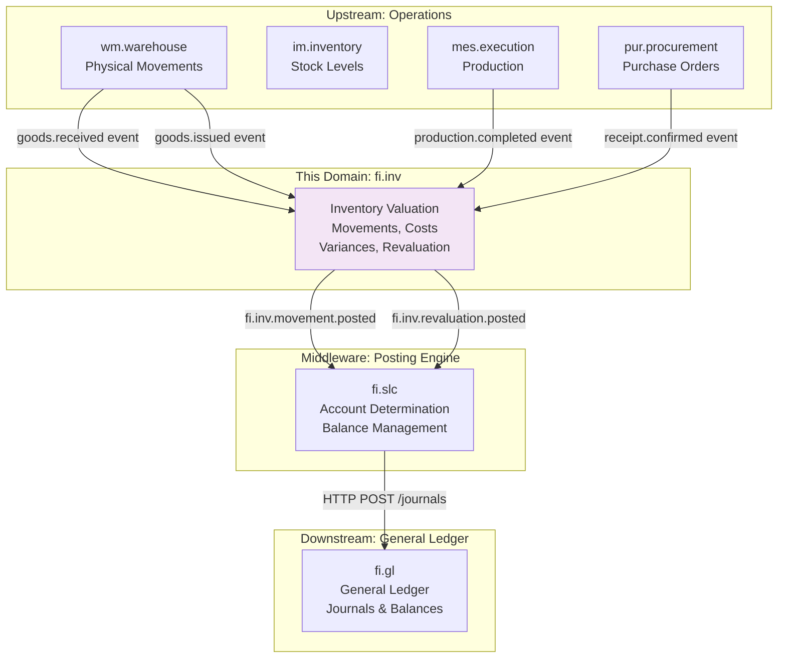
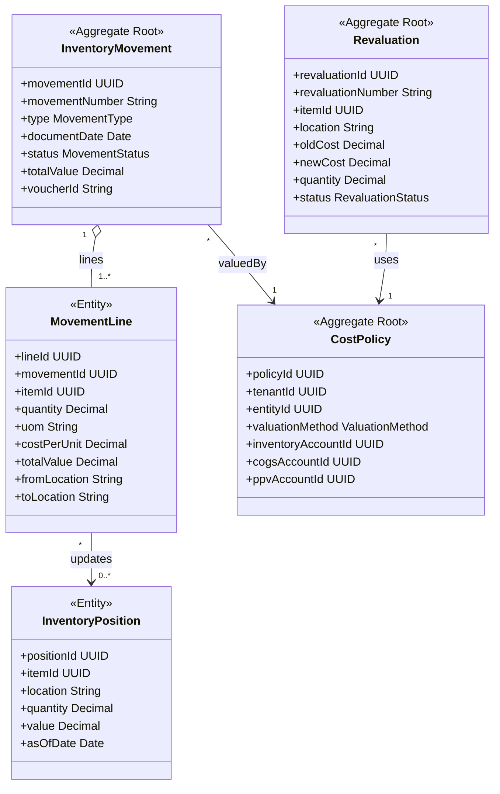
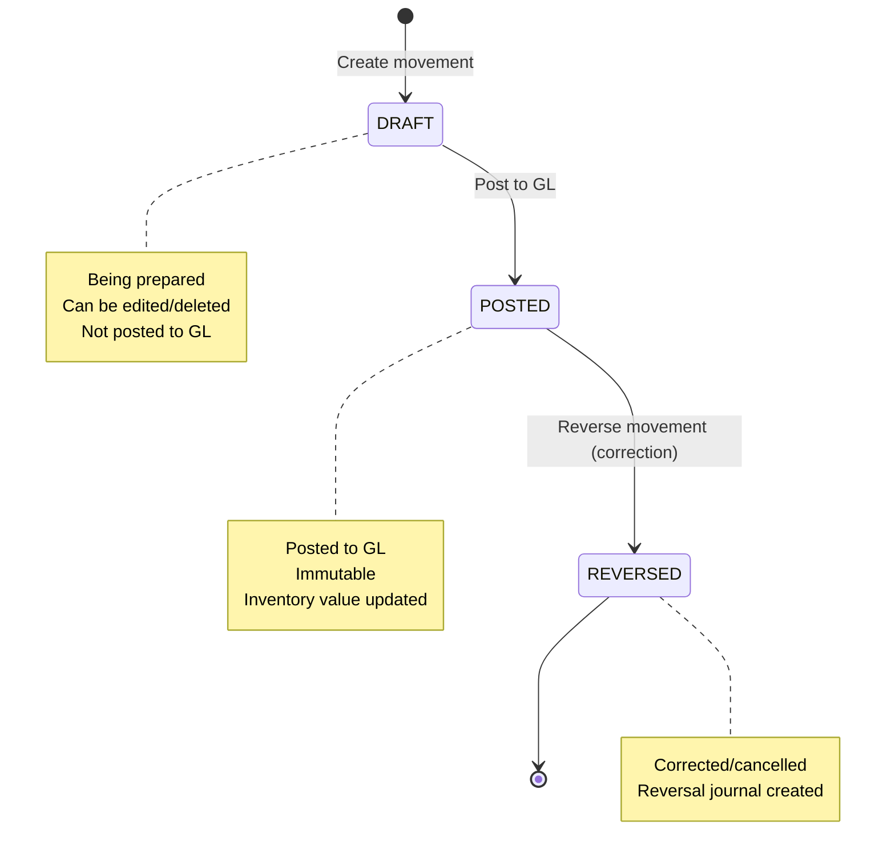
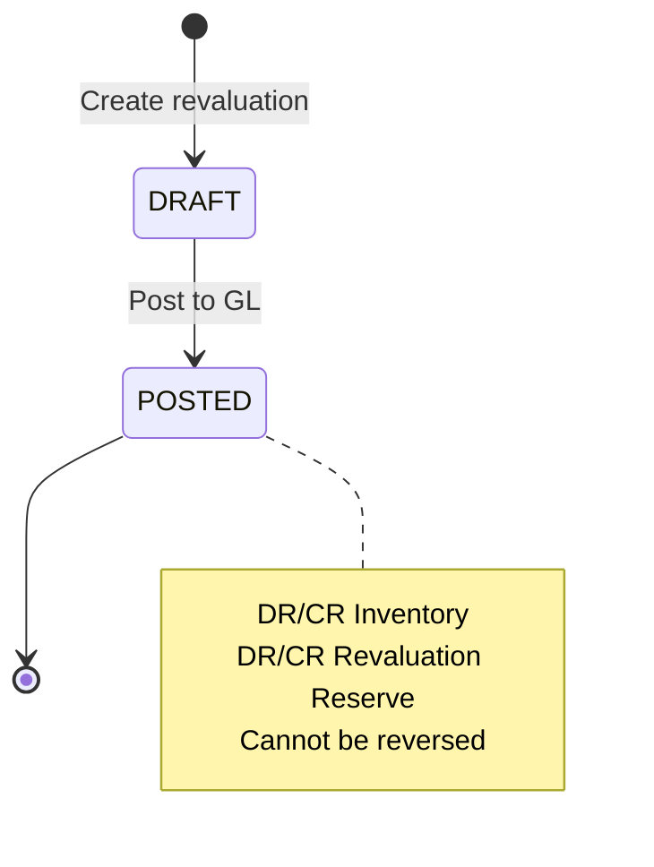
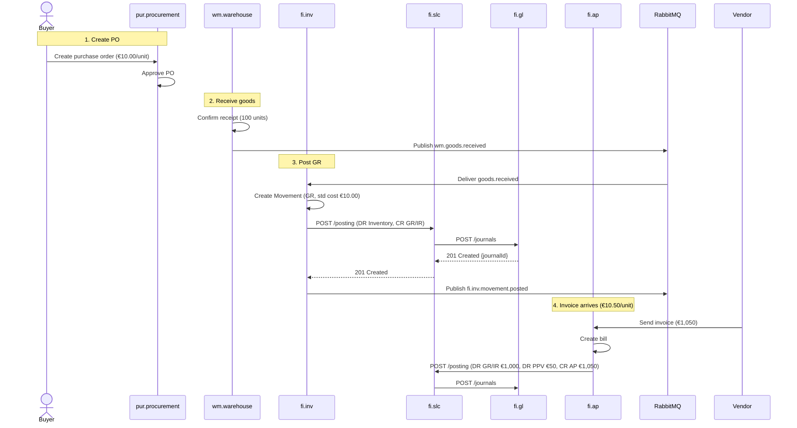

<!-- TEMPLATE COMPLIANCE: ~60%
Missing sections: §2 (Service Identity), §11 (Feature Dependencies), §12 (Extension Points)
Renumbering needed: §3 -> §5 (Use Cases), §5 -> §7 (Integration), §6 -> §7 (Events, merge), §7 -> §6 (REST API), §8 -> §8 (Data Model), §9 -> §9 (Security), §10 -> §10 (Quality), §11 -> §13 (Migration), §12 -> §14 (Decisions), §13 -> §15 (Appendix)
Action needed: Add full Meta header block, add Specification Guidelines Compliance block, add §2 Service Identity, renumber sections to §0-§15, add §11 Feature Dependencies stub, add §12 Extension Points stub
-->
# fi.inv - Inventory Valuation Domain Specification

> **Meta Information**
> - **Version:** 2025-12-05
> - **Template:** `domain-service-spec.md` v1.0.0
> - **Template Compliance:** ~60% — §2, §11, §12 missing
> - **Author(s):** OpenLeap Architecture Team
> - **Status:** DRAFT
> - **Suite:** `fi`
> - **Domain:** `inv`
> - **Service Name:** `fi-inv-svc`

---

## 0. Document Purpose & Scope

### 0.1 Purpose

This document specifies the **Inventory Valuation (fi.inv)** domain, which maintains the financial accounting view of inventory movements and valuations. It records financially relevant inventory transactions (receipts, issues, transfers, adjustments, revaluations), delegates postings to fi.slc, and ensures inventory subledger reconciles to General Ledger control accounts.

### 0.2 Target Audience
- Product Owners & Business Stakeholders (Finance, Accounting, Supply Chain, Manufacturing)
- System Architects & Technical Leads
- Integration Engineers
- Controllers and Cost Accountants
- External Auditors

### 0.3 Scope

**In Scope:**
- **Inventory Movements:** Goods Receipt (GR), Goods Issue (GI), Transfers, Adjustments, Returns
- **Cost Valuation:** Standard Cost, Weighted Average, FIFO, LIFO methods
- **Revaluation:** Standard cost updates, cost layer adjustments
- **Variance Accounting:** Purchase Price Variance (PPV), Manufacturing Usage Variance (MUV)
- **GL Integration:** Post inventory movements to GL via fi.slc
- **Reconciliation:** Inventory subledger balance = GL Inventory control account
- **Multi-Location:** Support multiple warehouses, plants, entities
- **Multi-Entity:** Inter-entity transfers with intercompany accounting

**Out of Scope:**
- Physical inventory management (stock reservations, bin management → im.inventory)
- Warehouse operations (pick, pack, ship → wm.warehouse)
- Product master data → pd.product
- Manufacturing execution → mes.execution
- Procurement and sales workflows → pur.procurement, sd.sales
- Detailed BOM/routing costing → costing (separate domain)

### 0.4 Related Documents
- `_fi_suite.md` - FI Suite architecture
- `fi_gl.md` - General Ledger specification
- `fi_slc.md` - Subledger core specification
- `fi_ap.md` - Accounts Payable (PPV integration)
- `fi_inv.md` - Original inventory specification

---

## 1. Business Context

### 1.1 Domain Purpose

**fi.inv** bridges the gap between physical inventory movements (the operational reality) and financial accounting (the financial reality). Every time inventory moves—received from suppliers, issued to production, shipped to customers, adjusted for counts—there's a financial impact that must be recorded in the books.

**Core Business Problems Solved:**
- **Inventory Valuation:** What's the financial value of our inventory?
- **COGS Recognition:** How much did the goods we sold cost us?
- **Variance Analysis:** Why do actual costs differ from standard costs?
- **Reconciliation:** Does our inventory subledger match the GL?
- **Cost Control:** Track and manage inventory-related expenses
- **Audit Compliance:** Provide complete audit trail from movement to GL

### 1.2 Business Value

**For the Organization:**
- **Accurate COGS:** Proper revenue recognition and gross margin calculation
- **Working Capital:** Optimize inventory levels with accurate valuation
- **Cost Control:** Identify variances, track waste, prevent shrinkage
- **Compliance:** Meet IFRS/GAAP inventory accounting standards
- **Decision Making:** Understand true product profitability

**For Users:**
- **Cost Accountant:** Automated inventory postings, variance analysis
- **Controller:** One-click reconciliation, period close automation
- **Warehouse Manager:** Real-time inventory value visibility
- **CFO:** Accurate balance sheet (inventory = major asset)
- **Auditor:** Complete trace from warehouse transaction to GL

### 1.3 Key Stakeholders

| Role | Responsibility | Primary Use Cases |
|------|----------------|-------------------|
| Cost Accountant | Inventory valuation | Post movements, analyze variances, update standard costs |
| Controller | Month-end close | Reconcile inventory to GL, close inventory period |
| Warehouse Manager | Physical inventory | Confirm movements trigger financial postings |
| Procurement Manager | Purchase price variance | Understand PPV, optimize supplier costs |
| Production Planner | Work-in-process | Track WIP value, manufacturing costs |
| External Auditor | Financial audit | Verify inventory valuation, trace to GL |

### 1.4 Strategic Positioning

**fi.inv** sits **between** operational inventory systems (im.inventory, wm.warehouse) and the General Ledger (fi.gl).



**Key Insight:** fi.inv translates operational inventory events into financial postings.

---

## 2. Domain Model

### 2.1 Conceptual Overview

The inventory valuation domain model consists of four main pillars:

1. **Inventory Documents:** Business truth (movements, revaluations)
2. **Cost Valuation:** Calculate inventory value using valuation methods
3. **GL Integration:** Post to General Ledger via fi.slc
4. **Reconciliation:** Ensure subledger = GL control account

**Key Principles:**
- **Event-Driven:** React to warehouse/production events
- **Cost Methods:** Support STD (Standard), WAVG (Weighted Average), FIFO, LIFO
- **Immutability:** Posted movements cannot be changed, only reversed
- **Subledger Pattern:** Detailed inventory positions, summarized to GL
- **Variance Tracking:** PPV (Purchase Price), MUV (Manufacturing Usage)

### 2.2 Core Concepts



### 2.3 Aggregate Definitions

#### 2.3.1 InventoryMovement

**Business Purpose:**  
Represents a financially relevant inventory transaction. Creates GL journal entries for inventory value changes.

**Key Attributes:**

| Attribute | Type | Description | Constraints |
|-----------|------|-------------|-------------|
| movementId | UUID | Unique identifier | Required, immutable, PK |
| tenantId | UUID | Tenant ownership | Required, immutable |
| movementNumber | String | Sequential movement number | Required, unique per tenant |
| type | MovementType | Movement type | Required, enum(GR, GI, XFER, ADJ, RET) |
| entityId | UUID | Legal entity | Required, FK to entities |
| documentDate | Date | Movement date | Required |
| valueDate | Date | Effective date for valuation | Required, >= documentDate |
| status | MovementStatus | Current state | Required, enum(DRAFT, POSTED, REVERSED) |
| totalValue | Decimal | Total movement value | Required, sum of line values |
| currency | String | Valuation currency | Required, ISO 4217 |
| voucherId | String | Idempotency key | Required, unique per tenant |
| sourcePoId | UUID | Purchase order reference | Optional, FK to pur.orders |
| sourceSoId | UUID | Sales order reference | Optional, FK to sd.orders |
| sourceProductionOrderId | UUID | Production order reference | Optional, FK to mes.production_orders |
| glJournalId | UUID | Posted GL journal | Optional, FK to fi.gl.journal_entries |
| dimensions | JSONB | Analytical attributes | Optional, e.g., {"warehouse": "WH1", "product": "SKU-123"} |
| createdAt | Timestamp | Creation timestamp | Auto-generated |
| postedAt | Timestamp | Posting timestamp | Set when status → POSTED |

**Lifecycle States:**



**Business Rules & Invariants:**

1. **BR-MOV-001: Balance Validation**
   - *Rule:* totalValue = Σ(line.quantity × line.costPerUnit)
   - *Rationale:* Prevent calculation errors
   - *Enforcement:* Validation before posting

2. **BR-MOV-002: Immutability After Posting**
   - *Rule:* Once POSTED, movement cannot be modified or deleted, only reversed
   - *Rationale:* Maintain audit trail
   - *Enforcement:* API blocks UPDATE/DELETE for POSTED movements

3. **BR-MOV-003: Type-Specific Validations**
   - *Rule:* GR requires fromLocation = null, toLocation != null; GI requires fromLocation != null, toLocation = null
   - *Rationale:* Enforce movement direction logic
   - *Enforcement:* Validation on creation

4. **BR-MOV-004: Cost Method Consistency**
   - *Rule:* Cost calculation must use entity's valuation method (STD, WAVG, FIFO, LIFO)
   - *Rationale:* Ensure consistent valuation
   - *Enforcement:* Cost policy lookup on posting

**Movement Types:**

| Type | Description | GL Impact | Example |
|------|-------------|-----------|---------|
| GR | Goods Receipt | DR Inventory, CR GR/IR Clearing | PO receipt from supplier |
| GI | Goods Issue | DR COGS (or WIP), CR Inventory | Ship to customer, issue to production |
| XFER | Transfer | DR Inventory (to), CR Inventory (from) | Warehouse-to-warehouse transfer |
| ADJ | Adjustment | DR/CR Inventory, DR/CR Gain/Loss | Physical count adjustment |
| RET | Return | DR Inventory, CR COGS | Customer return to stock |

**Example Scenarios:**

**Scenario 1: Goods Receipt from PO (Standard Cost)**
```json
{
  "type": "GR",
  "entityId": "entity-uuid",
  "documentDate": "2025-12-05",
  "valueDate": "2025-12-05",
  "sourcePoId": "po-uuid-001",
  "lines": [
    {
      "itemId": "item-uuid-123",
      "quantity": 100.000,
      "uom": "EA",
      "costPerUnit": 10.00,
      "totalValue": 1000.00,
      "toLocation": "WH1",
      "dimensions": {
        "warehouse": "WH1",
        "product": "SKU-123"
      }
    }
  ],
  "totalValue": 1000.00,
  "currency": "EUR"
}
```

**Result:**
- Movement created with status = DRAFT
- User posts movement
- System calls fi.slc to post:
  - DR 1500 Inventory €1,000
  - CR 1510 GR/IR Clearing €1,000
- glJournalId linked to movement
- When AP invoice arrives with different price (€10.50), PPV posted:
  - DR 5200 PPV (Purchase Price Variance) €50
  - CR 2100 Payables €50

---

#### 2.3.2 MovementLine

**Business Purpose:**  
Individual line item within a movement. Represents one item/lot moving from/to location.

**Key Attributes:**

| Attribute | Type | Description | Constraints |
|-----------|------|-------------|-------------|
| lineId | UUID | Unique identifier | Required, immutable, PK |
| movementId | UUID | Parent movement | Required, FK to inventory_movements |
| lineNumber | Int | Line number | Required, unique per movement |
| itemId | UUID | Product/material | Required, FK to pd.items |
| lotNumber | String | Batch/lot identifier | Optional, for lot tracking |
| serialNumber | String | Serial number | Optional, for serialized items |
| quantity | Decimal | Movement quantity | Required, != 0 (sign indicates direction) |
| uom | String | Unit of measure | Required, e.g., "EA", "KG" |
| costPerUnit | Decimal | Unit cost | Required, > 0 |
| totalValue | Decimal | Line value | Required, = quantity × costPerUnit |
| currency | String | Line currency | Required, ISO 4217 |
| fromLocation | String | Source location | Optional, null for GR |
| toLocation | String | Destination location | Optional, null for GI |
| costLayerRef | String | Cost layer reference | Optional, for FIFO/LIFO |
| dimensions | JSONB | Line-level dimensions | Optional |

**Business Rules:**

1. **BR-LINE-001: Quantity Sign**
   - *Rule:* GR/ADJ(gain) → qty > 0; GI/ADJ(loss) → qty < 0 (or always positive with type indicator)
   - *Rationale:* Consistent quantity handling
   - *Enforcement:* Validation on creation

2. **BR-LINE-002: Location Rules**
   - *Rule:* GR requires toLocation only; GI requires fromLocation only; XFER requires both
   - *Rationale:* Enforce movement logic
   - *Enforcement:* Validation based on movement type

---

#### 2.3.3 Revaluation

**Business Purpose:**  
Records a change in inventory cost (e.g., standard cost update). Creates revaluation journal entry.

**Key Attributes:**

| Attribute | Type | Description | Constraints |
|-----------|------|-------------|-------------|
| revaluationId | UUID | Unique identifier | Required, immutable, PK |
| tenantId | UUID | Tenant ownership | Required, immutable |
| revaluationNumber | String | Sequential number | Required, unique per tenant |
| entityId | UUID | Legal entity | Required |
| documentDate | Date | Revaluation date | Required |
| itemId | UUID | Product being revalued | Required, FK to pd.items |
| location | String | Location/warehouse | Required |
| oldCost | Decimal | Previous cost per unit | Required, > 0 |
| newCost | Decimal | New cost per unit | Required, > 0 |
| quantity | Decimal | Quantity on hand | Required, > 0 |
| valueDifference | Decimal | Impact on inventory value | Required, = (newCost - oldCost) × quantity |
| currency | String | Currency | Required, ISO 4217 |
| status | RevaluationStatus | Current state | Required, enum(DRAFT, POSTED) |
| reason | String | Revaluation reason | Optional, e.g., "Annual standard cost update" |
| voucherId | String | Idempotency key | Required, unique per tenant |
| glJournalId | UUID | Posted GL journal | Optional, FK to fi.gl.journal_entries |
| createdAt | Timestamp | Creation timestamp | Auto-generated |

**Lifecycle States:**



**Business Rules:**

1. **BR-REVAL-001: Cost Change Validation**
   - *Rule:* newCost != oldCost (must have actual change)
   - *Rationale:* Prevent pointless revaluations
   - *Enforcement:* Validation on creation

2. **BR-REVAL-002: Posting Direction**
   - *Rule:* If newCost > oldCost → DR Inventory, CR Revaluation Reserve; If newCost < oldCost → DR Revaluation Reserve, CR Inventory
   - *Rationale:* Correct accounting treatment
   - *Enforcement:* Posting logic in service

**Example Scenarios:**

**Scenario 1: Standard Cost Increase**
```json
{
  "entityId": "entity-uuid",
  "documentDate": "2025-12-31",
  "itemId": "item-uuid-123",
  "location": "WH1",
  "oldCost": 10.00,
  "newCost": 11.50,
  "quantity": 500.000,
  "valueDifference": 750.00,
  "currency": "EUR",
  "reason": "Annual standard cost update Q1 2026"
}
```

**Result:**
- Revaluation created with status = DRAFT
- User posts revaluation
- System calls fi.slc to post:
  - DR 1500 Inventory €750
  - CR 3900 Revaluation Reserve €750
- Inventory value increased by €750

---

#### 2.3.4 CostPolicy

**Business Purpose:**  
Defines how inventory is valued (cost method, GL accounts). One policy per entity or entity/category.

**Key Attributes:**

| Attribute | Type | Description | Constraints |
|-----------|------|-------------|-------------|
| policyId | UUID | Unique identifier | Required, immutable, PK |
| tenantId | UUID | Tenant ownership | Required, immutable |
| entityId | UUID | Legal entity | Required |
| itemCategory | String | Optional item category filter | Optional, e.g., "RAW_MATERIAL", "FINISHED_GOODS" |
| valuationMethod | ValuationMethod | Cost calculation method | Required, enum(STD, WAVG, FIFO, LIFO) |
| inventoryAccountId | UUID | Inventory control account | Required, FK to fi.gl.accounts |
| wipAccountId | UUID | Work-in-process account | Optional, FK to fi.gl.accounts |
| cogsAccountId | UUID | Cost of goods sold account | Required, FK to fi.gl.accounts |
| ppvAccountId | UUID | Purchase price variance | Optional, FK to fi.gl.accounts |
| revaluationReserveAccountId | UUID | Revaluation reserve | Optional, FK to fi.gl.accounts |
| inventoryGainAccountId | UUID | Count gain account | Optional, FK to fi.gl.accounts |
| inventoryLossAccountId | UUID | Count loss account | Optional, FK to fi.gl.accounts |
| effectiveFrom | Date | Policy effective date | Required |
| effectiveTo | Date | Policy end date | Optional, null = active |
| createdAt | Timestamp | Creation timestamp | Auto-generated |

**Valuation Methods:**

| Method | Description | Use Case | Cost Calculation |
|--------|-------------|----------|------------------|
| STD | Standard Cost | Manufacturing, stable costs | Fixed cost per item, PPV tracked |
| WAVG | Weighted Average | Commodities, fluctuating prices | Avg cost = Total value / Total qty |
| FIFO | First-In-First-Out | Perishables, high turnover | Cost layers, oldest first |
| LIFO | Last-In-First-Out | Tax optimization (US only) | Cost layers, newest first |

**Business Rules:**

1. **BR-POL-001: Policy Uniqueness**
   - *Rule:* One ACTIVE policy per (entity, itemCategory) at any time
   - *Rationale:* Unambiguous cost method
   - *Enforcement:* Unique constraint on (entity_id, item_category, effective_from) WHERE effective_to IS NULL

---

## 3. Business Processes & Use Cases

### 3.1 Primary Use Cases

#### UC-001: Post Goods Receipt from PO

**Actor:** Cost Accountant (triggered automatically by warehouse event)

**Preconditions:**
- Purchase order exists and confirmed
- Warehouse confirms goods receipt
- Cost policy configured
- User has INV_POSTER role

**Main Flow:**
1. Warehouse confirms receipt (wm.warehouse publishes goods.received event)
2. System consumes goods.received event
3. System retrieves PO line details (item, quantity, price)
4. System retrieves cost policy for entity/item
5. System creates InventoryMovement:
   - type = GR
   - sourcePoId = PO ID
   - lines: [item, quantity, costPerUnit = standard cost]
   - status = DRAFT
6. System auto-posts movement (or user reviews and posts)
7. System calls fi.slc POST /posting:
   - eventType: fi.inv.movement.posted
   - payload: movement data
8. fi.slc applies posting rule:
   - DR 1500 Inventory (std cost × qty)
   - CR 1510 GR/IR Clearing
9. fi.slc posts to fi.gl
10. fi.gl returns journalId
11. System updates InventoryMovement:
    - status = POSTED
    - glJournalId = journalId
12. System creates/updates InventoryPosition (optional read model)
13. System publishes fi.inv.movement.posted event

**When AP Invoice Arrives (with different price):**
14. fi.ap posts bill with actual price (€10.50 vs. std €10.00)
15. System calculates PPV = (€10.50 - €10.00) × 100 = €50
16. System calls fi.slc POST /posting (PPV):
    - DR 5200 PPV €50
    - CR 2100 Payables €50 (or adjusts GR/IR)

**Postconditions:**
- InventoryMovement status = POSTED
- GL journal created (DR Inventory, CR GR/IR)
- PPV recorded (when invoice arrives)
- Inventory value increased
- Event published

**Business Rules Applied:**
- BR-MOV-001: Balance validation
- BR-MOV-002: Immutability after posting
- BR-POL-001: Use correct cost policy

---

#### UC-002: Post Goods Issue to COGS

**Actor:** Cost Accountant (triggered by shipment event)

**Preconditions:**
- Sales order shipped (sd.sales publishes goods.shipped event)
- Inventory available in warehouse
- Cost policy configured

**Main Flow:**
1. Sales/warehouse confirms shipment (goods.shipped event)
2. System consumes event
3. System retrieves SO line details (item, quantity)
4. System retrieves cost policy and current inventory cost
5. System creates InventoryMovement:
   - type = GI
   - sourceSoId = SO ID
   - lines: [item, quantity, costPerUnit = calculated cost]
   - status = DRAFT
6. System determines cost:
   - If STD: use standard cost
   - If WAVG: calculate weighted average
   - If FIFO: consume oldest cost layer
   - If LIFO: consume newest cost layer
7. System posts movement via fi.slc:
   - DR 5100 COGS
   - CR 1500 Inventory
8. System updates InventoryPosition (qty reduced, value reduced)
9. System publishes fi.inv.movement.posted event

**Postconditions:**
- Inventory reduced
- COGS recognized in P&L
- GL journal created
- Event published

---

#### UC-003: Post Cost Revaluation

**Actor:** Cost Accountant

**Preconditions:**
- New standard cost determined (e.g., annual cost roll)
- Inventory on-hand for item
- User has INV_ADMIN role

**Main Flow:**
1. User creates revaluation (POST /revaluations)
2. User specifies:
   - itemId, location
   - oldCost (current), newCost (target)
3. System queries current inventory quantity at location
4. System calculates valueDifference = (newCost - oldCost) × quantity
5. System creates Revaluation (status = DRAFT)
6. User reviews and posts
7. System calls fi.slc POST /posting:
   - eventType: fi.inv.revaluation.posted
   - payload: revaluation data
8. fi.slc applies posting rule:
   - If increase: DR Inventory, CR Revaluation Reserve
   - If decrease: DR Revaluation Reserve, CR Inventory
9. fi.slc posts to fi.gl
10. System updates Revaluation status = POSTED
11. System updates standard cost in cost master (or triggers costing domain)
12. System publishes fi.inv.revaluation.posted event

**Postconditions:**
- Revaluation posted
- Inventory value adjusted
- GL journal created
- Future receipts/issues use new cost

---

#### UC-004: Reconcile Inventory to GL

**Actor:** Controller

**Preconditions:**
- Movements posted for period
- GL journals exist
- User has INV_ADMIN role

**Main Flow:**
1. User requests reconciliation (GET /reconciliation/control-account?periodId={id})
2. System queries:
   a. Sum of inventory positions (subledger) = Total Inventory Value
   b. GL inventory control account balance (from fi.gl ledger)
   c. Variance = GL balance - Subledger total
3. System identifies potential variances:
   - In-transit inventory (GR not yet posted)
   - Pending production costs (WIP not completed)
   - PPV not cleared
   - Timing differences (value date vs. posting date)
4. System returns reconciliation report:
   - GL Balance: €100,000
   - Subledger Total: €99,500
   - Variance: €500
   - Breakdown: €500 in-transit from PO-001
5. Controller investigates variance
6. If OK, controller marks period ready for close

**Postconditions:**
- Reconciliation report generated
- Variances identified and explained
- Period ready for close (if balanced)

---

### 3.2 Process Flow Diagrams

#### Process: Purchase to Inventory (with PPV)



---

## 4. Business Rules & Constraints

### 4.1 Business Rules Catalog

| ID | Rule Name | Description | Scope | Enforcement |
|----|-----------|-------------|-------|-------------|
| BR-MOV-001 | Balance Validation | totalValue = Σ(line values) | InventoryMovement | Create/Update |
| BR-MOV-002 | Immutability After Posting | Posted movements cannot be modified | InventoryMovement | Update/Delete |
| BR-MOV-003 | Type-Specific Validations | GR requires toLocation, GI requires fromLocation | InventoryMovement | Create |
| BR-MOV-004 | Cost Method Consistency | Use entity's valuation method | InventoryMovement | Posting |
| BR-LINE-001 | Quantity Sign | Quantity direction matches movement type | MovementLine | Create |
| BR-LINE-002 | Location Rules | Location requirements by type | MovementLine | Create |
| BR-REVAL-001 | Cost Change Validation | newCost != oldCost | Revaluation | Create |
| BR-REVAL-002 | Posting Direction | Correct DR/CR based on cost change | Revaluation | Posting |
| BR-POL-001 | Policy Uniqueness | One active policy per (entity, category) | CostPolicy | Create |

---

## 5. Integration Architecture

### 5.1 Integration Pattern Decision

**Does this domain use orchestration (Saga/Temporal)?** [ ] YES [X] NO

**Pattern Used:** Event-Driven Architecture (Choreography)

**Rationale:**

fi.inv uses **pure Event-Driven Architecture** because:

✅ **INV is Event Consumer:**
- Consumes wm.goods.received, wm.goods.issued, mes.production.completed
- Reacts to operational events, creates financial postings

✅ **INV is Event Publisher:**
- Publishes movement.posted, revaluation.posted
- Downstream services react (fi.rpt, cost analysis)

✅ **Synchronous GL Posting:**
- Calls fi.slc HTTP POST /posting (synchronous)
- Waits for confirmation (need journalId)
- But this is single-call, not multi-step saga

❌ **Why NOT Orchestration:**
- No multi-service transaction
- Inventory posting is: Event → Movement → fi.slc → fi.gl (linear)
- Each step can be retried independently
- No compensation logic needed

### 5.2 Event-Driven Integration

**Inbound Events (Consumed):**

| Event | Source | Purpose | Handling |
|-------|--------|---------|----------|
| wm.goods.received | wm.warehouse | Create GR movement | Post DR Inventory, CR GR/IR |
| wm.goods.issued | wm.warehouse | Create GI movement | Post DR COGS, CR Inventory |
| mes.production.completed | mes.execution | Create production receipt | Post DR Inventory, CR WIP |
| pur.receipt.confirmed | pur.procurement | Alternative GR trigger | Same as goods.received |
| fi.gl.period.closed | fi.gl | Prevent posting to closed period | Validate period status |
| fi.gl.account.status.changed | fi.gl | React to control account changes | Delegated to fi.slc |

**Outbound Events (Published):**

| Event | When | Purpose | Consumers |
|-------|------|---------|-----------|
| fi.inv.movement.posted | Movement posted to GL | Notify of inventory change | fi.rpt, cost analysis, t4.bi |
| fi.inv.revaluation.posted | Cost revaluation posted | Notify of value change | fi.rpt, costing, t4.bi |
| fi.inv.variance.posted | PPV or MUV posted | Track cost variances | fi.rpt, procurement |

---

## 6. Event Catalog

### 6.1 Outbound Events

**Exchange:** `fi.inv.events` (RabbitMQ topic exchange)

#### Event: movement.posted

**Routing Key:** `fi.inv.movement.posted`

**When Published:** Inventory movement successfully posted to GL

**Business Meaning:** Inventory value changed, COGS or WIP impacted

**Consumers:**
- fi.rpt (update inventory reports)
- costing (update cost layers)
- t4.bi (analytics)

**Payload:**
```json
{
  "eventId": "evt-uuid",
  "tenantId": "tenant-uuid",
  "occurredAt": "2025-12-05T10:00:00Z",
  "traceId": "trace-uuid",
  "producer": "fi.inv",
  "aggregateType": "movement",
  "changeType": "posted",
  "entityIds": ["movement-uuid"],
  "version": 1,
  "payload": {
    "movementId": "movement-uuid",
    "movementNumber": "GR-2025-001",
    "type": "GR",
    "entityId": "entity-uuid",
    "documentDate": "2025-12-05",
    "totalValue": 1000.00,
    "currency": "EUR",
    "glJournalId": "journal-uuid",
    "lines": [
      {
        "itemId": "item-uuid-123",
        "itemCode": "SKU-123",
        "quantity": 100.000,
        "uom": "EA",
        "costPerUnit": 10.00,
        "totalValue": 1000.00,
        "toLocation": "WH1"
      }
    ],
    "dimensions": {
      "warehouse": "WH1",
      "product": "SKU-123"
    }
  }
}
```

---

#### Event: revaluation.posted

**Routing Key:** `fi.inv.revaluation.posted`

**When Published:** Cost revaluation posted to GL

**Business Meaning:** Inventory value adjusted due to cost change

**Consumers:**
- fi.rpt (update inventory valuation reports)
- costing (update standard costs)
- t4.bi (analytics)

**Payload:**
```json
{
  "eventId": "evt-uuid",
  "tenantId": "tenant-uuid",
  "occurredAt": "2025-12-31T10:00:00Z",
  "traceId": "trace-uuid",
  "producer": "fi.inv",
  "aggregateType": "revaluation",
  "changeType": "posted",
  "entityIds": ["revaluation-uuid"],
  "version": 1,
  "payload": {
    "revaluationId": "revaluation-uuid",
    "revaluationNumber": "REVAL-2025-001",
    "entityId": "entity-uuid",
    "documentDate": "2025-12-31",
    "itemId": "item-uuid-123",
    "itemCode": "SKU-123",
    "location": "WH1",
    "oldCost": 10.00,
    "newCost": 11.50,
    "quantity": 500.000,
    "valueDifference": 750.00,
    "currency": "EUR",
    "glJournalId": "journal-uuid"
  }
}
```

---

## 7. API Specification

### 7.1 REST API

**Base Path:** `/api/fi/inv/v1`

**Authentication:** OAuth 2.0 Bearer Token

**Content Type:** `application/json`

#### 7.1.1 Inventory Movements

**POST /movements** - Create and post movement
- **Role:** INV_POSTER
- **Headers:** `Idempotency-Key`, `Trace-Id`
- **Request Body:**
  ```json
  {
    "type": "GR",
    "entityId": "entity-uuid",
    "documentDate": "2025-12-05",
    "valueDate": "2025-12-05",
    "sourcePoId": "po-uuid",
    "lines": [
      {
        "itemId": "item-uuid-123",
        "quantity": 100.000,
        "uom": "EA",
        "costPerUnit": 10.00,
        "toLocation": "WH1",
        "dimensions": {"warehouse": "WH1"}
      }
    ],
    "dimensions": {"warehouse": "WH1"}
  }
  ```
- **Response:** 201 Created
  ```json
  {
    "movementId": "movement-uuid",
    "movementNumber": "GR-2025-001",
    "status": "POSTED",
    "glJournalId": "journal-uuid"
  }
  ```

**GET /movements** - List movements
- **Role:** INV_VIEWER
- **Query Params:** `type`, `entityId`, `fromDate`, `toDate`, `status`, `page`, `size`
- **Response:** 200 OK (array of movements)

**GET /movements/{id}** - Get movement details
- **Role:** INV_VIEWER
- **Response:** 200 OK (movement with lines)

**POST /movements/{id}/reverse** - Reverse movement
- **Role:** INV_ADMIN
- **Request Body:**
  ```json
  {
    "reason": "Incorrect quantity received",
    "reversalDate": "2025-12-06"
  }
  ```
- **Response:** 201 Created (reversal movement)

---

#### 7.1.2 Revaluations

**POST /revaluations** - Create revaluation
- **Role:** INV_ADMIN
- **Request Body:**
  ```json
  {
    "entityId": "entity-uuid",
    "documentDate": "2025-12-31",
    "itemId": "item-uuid-123",
    "location": "WH1",
    "oldCost": 10.00,
    "newCost": 11.50,
    "reason": "Annual standard cost update"
  }
  ```
- **Response:** 201 Created

**GET /revaluations** - List revaluations
- **Role:** INV_VIEWER
- **Query Params:** `entityId`, `itemId`, `fromDate`, `toDate`, `page`, `size`
- **Response:** 200 OK (array of revaluations)

---

#### 7.1.3 Inventory Positions (Read Model)

**GET /positions** - Get inventory positions
- **Role:** INV_VIEWER
- **Query Params:** `itemId`, `location`, `asOfDate`
- **Response:** 200 OK
  ```json
  {
    "positions": [
      {
        "itemId": "item-uuid-123",
        "itemCode": "SKU-123",
        "location": "WH1",
        "quantity": 500.000,
        "value": 5750.00,
        "costPerUnit": 11.50,
        "currency": "EUR",
        "asOfDate": "2025-12-31"
      }
    ]
  }
  ```

---

#### 7.1.4 Reconciliation

**GET /reconciliation/control-account** - Reconcile to GL
- **Role:** INV_ADMIN
- **Query Params:** `entityId`, `periodId`
- **Response:** 200 OK
  ```json
  {
    "entityId": "entity-uuid",
    "periodId": "period-uuid",
    "period": "2025-12",
    "subledgerTotal": 99500.00,
    "glControlAccountBalance": 100000.00,
    "variance": 500.00,
    "currency": "EUR",
    "variances": [
      {
        "type": "IN_TRANSIT",
        "amount": 500.00,
        "description": "PO-001 GR not yet posted"
      }
    ]
  }
  ```

---

### 7.2 Error Responses

| HTTP Status | Error Code | Description |
|-------------|------------|-------------|
| 400 | MOVEMENT_UNBALANCED | Movement line values don't sum to total |
| 400 | INVALID_MOVEMENT_TYPE | Movement type invalid for operation |
| 403 | PERIOD_CLOSED | Cannot post to closed period |
| 404 | ITEM_NOT_FOUND | Item does not exist |
| 404 | LOCATION_NOT_FOUND | Location/warehouse does not exist |
| 409 | IDEMPOTENT_REPLAY | Duplicate idempotency key with different payload |
| 422 | VALIDATION_ERROR | Generic validation failure |

---

## 8. Data Model

### 8.1 Storage Schema (PostgreSQL)

#### Schema: fi_inv

All tables in schema `fi_inv`.

#### Table: inv_movements
```sql
CREATE TABLE fi_inv.inv_movements (
  movement_id UUID PRIMARY KEY,
  tenant_id UUID NOT NULL,
  movement_number VARCHAR(50) NOT NULL,
  type VARCHAR(10) NOT NULL,
  entity_id UUID NOT NULL,
  document_date DATE NOT NULL,
  value_date DATE NOT NULL,
  status VARCHAR(20) NOT NULL DEFAULT 'DRAFT',
  total_value NUMERIC(19,4) NOT NULL,
  currency CHAR(3) NOT NULL,
  voucher_id VARCHAR(100) NOT NULL,
  source_po_id UUID,
  source_so_id UUID,
  source_production_order_id UUID,
  gl_journal_id UUID,
  dimensions JSONB,
  created_at TIMESTAMP NOT NULL DEFAULT NOW(),
  posted_at TIMESTAMP,
  UNIQUE (tenant_id, movement_number),
  UNIQUE (tenant_id, voucher_id),
  CHECK (status IN ('DRAFT', 'POSTED', 'REVERSED')),
  CHECK (type IN ('GR', 'GI', 'XFER', 'ADJ', 'RET')),
  CHECK (value_date >= document_date)
);

CREATE INDEX idx_movements_tenant ON fi_inv.inv_movements(tenant_id);
CREATE INDEX idx_movements_entity ON fi_inv.inv_movements(entity_id);
CREATE INDEX idx_movements_type ON fi_inv.inv_movements(type);
CREATE INDEX idx_movements_date ON fi_inv.inv_movements(document_date);
CREATE INDEX idx_movements_status ON fi_inv.inv_movements(status);
```

#### Table: inv_movement_lines
```sql
CREATE TABLE fi_inv.inv_movement_lines (
  line_id UUID PRIMARY KEY,
  movement_id UUID NOT NULL REFERENCES fi_inv.inv_movements(movement_id) ON DELETE CASCADE,
  line_number INT NOT NULL,
  item_id UUID NOT NULL,
  lot_number VARCHAR(50),
  serial_number VARCHAR(50),
  quantity NUMERIC(19,6) NOT NULL,
  uom VARCHAR(10) NOT NULL,
  cost_per_unit NUMERIC(19,4) NOT NULL,
  total_value NUMERIC(19,4) NOT NULL,
  currency CHAR(3) NOT NULL,
  from_location VARCHAR(50),
  to_location VARCHAR(50),
  cost_layer_ref VARCHAR(100),
  dimensions JSONB,
  UNIQUE (movement_id, line_number),
  CHECK (quantity != 0),
  CHECK (cost_per_unit > 0),
  CHECK (total_value = quantity * cost_per_unit)
);

CREATE INDEX idx_lines_movement ON fi_inv.inv_movement_lines(movement_id);
CREATE INDEX idx_lines_item ON fi_inv.inv_movement_lines(item_id);
CREATE INDEX idx_lines_location ON fi_inv.inv_movement_lines(from_location, to_location);
```

#### Table: inv_revaluations
```sql
CREATE TABLE fi_inv.inv_revaluations (
  revaluation_id UUID PRIMARY KEY,
  tenant_id UUID NOT NULL,
  revaluation_number VARCHAR(50) NOT NULL,
  entity_id UUID NOT NULL,
  document_date DATE NOT NULL,
  item_id UUID NOT NULL,
  location VARCHAR(50) NOT NULL,
  old_cost NUMERIC(19,4) NOT NULL,
  new_cost NUMERIC(19,4) NOT NULL,
  quantity NUMERIC(19,6) NOT NULL,
  value_difference NUMERIC(19,4) NOT NULL,
  currency CHAR(3) NOT NULL,
  status VARCHAR(20) NOT NULL DEFAULT 'DRAFT',
  reason TEXT,
  voucher_id VARCHAR(100) NOT NULL,
  gl_journal_id UUID,
  created_at TIMESTAMP NOT NULL DEFAULT NOW(),
  posted_at TIMESTAMP,
  UNIQUE (tenant_id, revaluation_number),
  UNIQUE (tenant_id, voucher_id),
  CHECK (status IN ('DRAFT', 'POSTED')),
  CHECK (old_cost > 0),
  CHECK (new_cost > 0),
  CHECK (old_cost != new_cost),
  CHECK (quantity > 0),
  CHECK (value_difference = (new_cost - old_cost) * quantity)
);

CREATE INDEX idx_revaluations_tenant ON fi_inv.inv_revaluations(tenant_id);
CREATE INDEX idx_revaluations_entity ON fi_inv.inv_revaluations(entity_id);
CREATE INDEX idx_revaluations_item ON fi_inv.inv_revaluations(item_id);
```

#### Table: inv_cost_policies
```sql
CREATE TABLE fi_inv.inv_cost_policies (
  policy_id UUID PRIMARY KEY,
  tenant_id UUID NOT NULL,
  entity_id UUID NOT NULL,
  item_category VARCHAR(50),
  valuation_method VARCHAR(10) NOT NULL,
  inventory_account_id UUID NOT NULL,
  wip_account_id UUID,
  cogs_account_id UUID NOT NULL,
  ppv_account_id UUID,
  revaluation_reserve_account_id UUID,
  inventory_gain_account_id UUID,
  inventory_loss_account_id UUID,
  effective_from DATE NOT NULL,
  effective_to DATE,
  created_at TIMESTAMP NOT NULL DEFAULT NOW(),
  CHECK (valuation_method IN ('STD', 'WAVG', 'FIFO', 'LIFO')),
  UNIQUE (tenant_id, entity_id, item_category, effective_from) WHERE effective_to IS NULL
);

CREATE INDEX idx_policies_entity ON fi_inv.inv_cost_policies(entity_id);
CREATE INDEX idx_policies_effective ON fi_inv.inv_cost_policies(effective_from, effective_to);
```

#### Table: inv_positions (Optional Read Model)
```sql
CREATE TABLE fi_inv.inv_positions (
  position_id UUID PRIMARY KEY,
  tenant_id UUID NOT NULL,
  entity_id UUID NOT NULL,
  item_id UUID NOT NULL,
  location VARCHAR(50) NOT NULL,
  quantity NUMERIC(19,6) NOT NULL,
  value NUMERIC(19,4) NOT NULL,
  cost_per_unit NUMERIC(19,4) NOT NULL,
  currency CHAR(3) NOT NULL,
  as_of_date DATE NOT NULL,
  updated_at TIMESTAMP NOT NULL DEFAULT NOW(),
  UNIQUE (tenant_id, entity_id, item_id, location, as_of_date)
);

CREATE INDEX idx_positions_item ON fi_inv.inv_positions(item_id);
CREATE INDEX idx_positions_location ON fi_inv.inv_positions(location);
CREATE INDEX idx_positions_date ON fi_inv.inv_positions(as_of_date);
```

---

## 9. Security & Compliance

### 9.1 Access Control

**Roles & Permissions:**

| Role | Read | Create | Update | Delete | Admin Operations |
|------|------|--------|--------|--------|------------------|
| INV_VIEWER | ✓ (all) | ✗ | ✗ | ✗ | ✗ |
| INV_POSTER | ✓ (movements) | ✓ (movements) | ✗ | ✗ | ✗ |
| INV_ADMIN | ✓ (all) | ✓ (all) | ✓ (revaluations) | ✗ | ✓ (reverse) |

### 9.2 Compliance Requirements

**Regulations:**
- [X] SOX - Audit trail, segregation of duties
- [X] IFRS/GAAP - IAS 2 Inventories, inventory valuation methods
- [X] Tax - LIFO reserve disclosure (US GAAP)

**Compliance Controls:**
1. **Immutability:** Posted movements cannot be changed, only reversed
2. **Audit Trail:** Complete trace from warehouse event to GL journal
3. **Segregation of Duties:** Warehouse confirms ≠ Cost accountant posts
4. **Retention:** Inventory movements retained 10 years

---

## 10. Quality Attributes

### 10.1 Performance Requirements

**Response Time (95th percentile):**
- POST /movements: < 300ms (including GL posting)
- GET /positions: < 500ms (for 10K items)
- GET /reconciliation: < 2 sec

**Throughput:**
- Movement posting: 1,000 movements/sec
- Position queries: 5,000 queries/sec

### 10.2 Availability & Reliability

**Availability Target:** 99.9%

**Recovery Objectives:**
- RTO: < 10 minutes
- RPO: < 5 minutes

---

## 11. Migration & Evolution

### 11.1 Data Migration

**From Legacy:**
- Export opening inventory balances (by item, location)
- Import as initial movements (type = ADJ)
- Reconcile to GL opening balance
- Validate: Total inventory = GL control account

---

## 12. Open Questions & Decisions

### 12.1 ADRs

#### ADR-001: Event-Driven vs. Orchestration

**Status:** Accepted

**Decision:** Use Event-Driven Architecture (choreography)

**Rationale:**
- Inventory movements are independent events
- No multi-service transaction requiring compensation
- Warehouse confirms → Inventory posts → GL records (linear flow)
- Each step can be retried independently

**Alternatives Rejected:**
- Orchestration (Saga): Unnecessary complexity for linear flow

---

## 13. Appendix

### 13.1 Glossary

| Term | Definition |
|------|------------|
| GR | Goods Receipt |
| GI | Goods Issue |
| COGS | Cost of Goods Sold |
| PPV | Purchase Price Variance |
| MUV | Manufacturing Usage Variance |
| WIP | Work-in-Process |
| STD | Standard Cost |
| WAVG | Weighted Average |
| FIFO | First-In-First-Out |
| LIFO | Last-In-First-Out |


