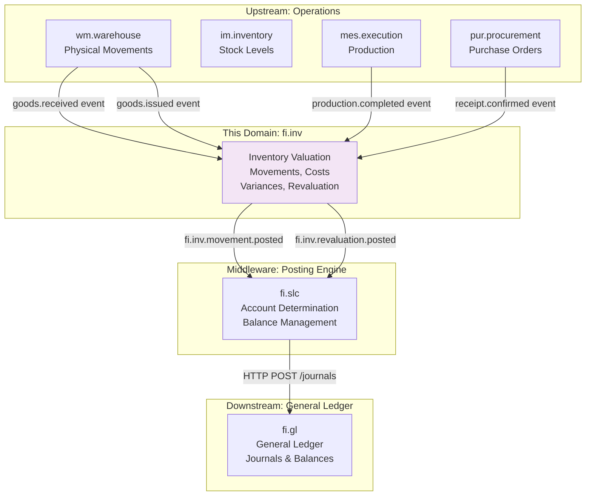
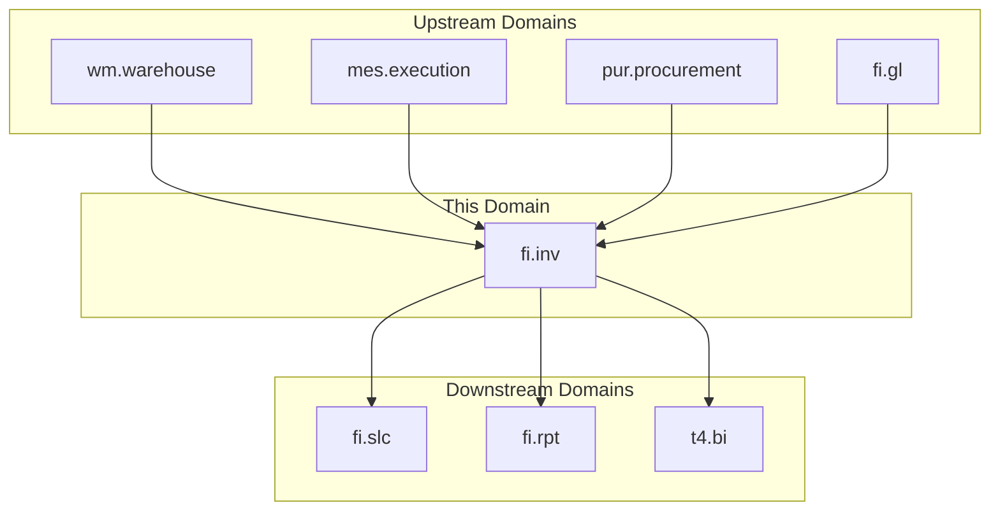
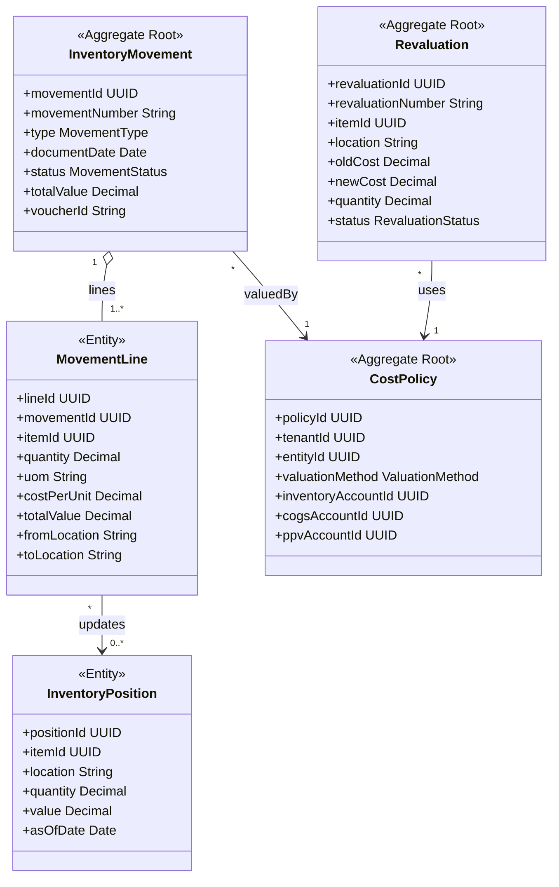
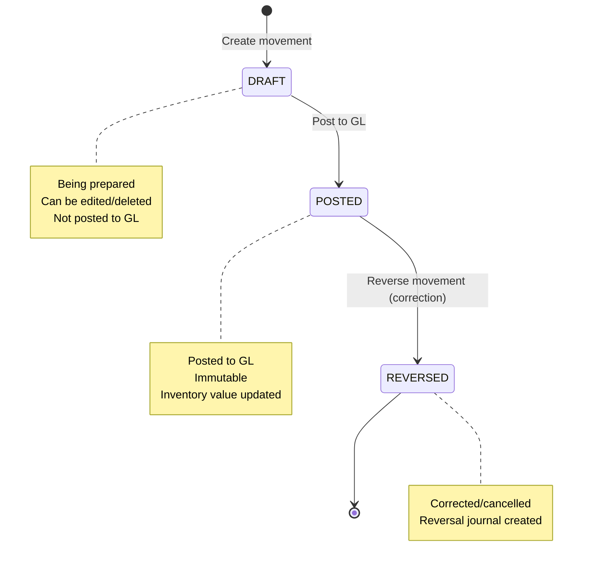
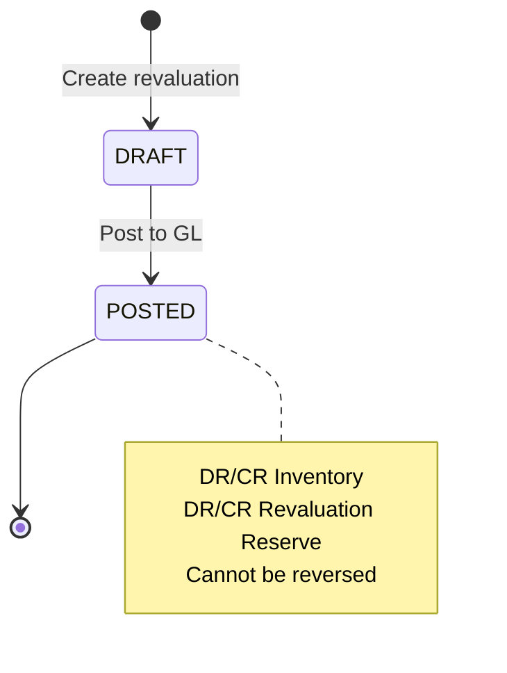
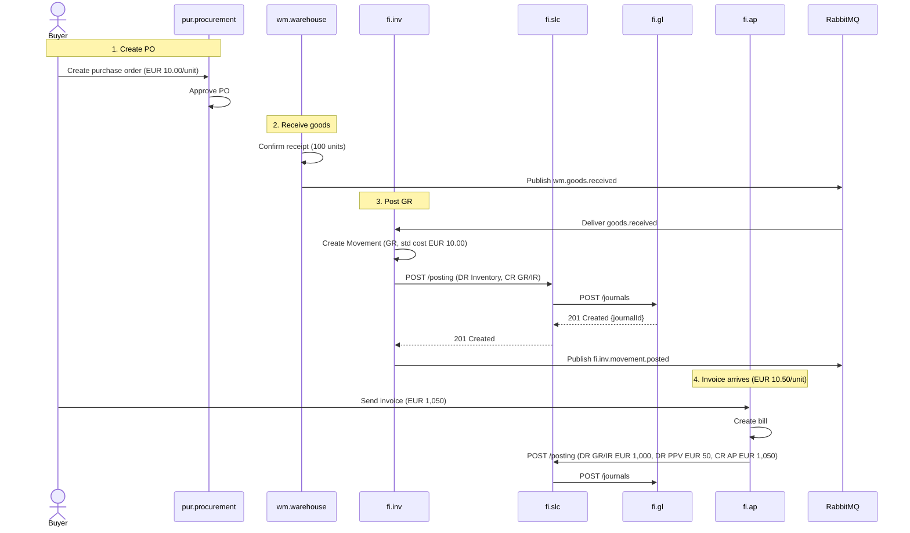
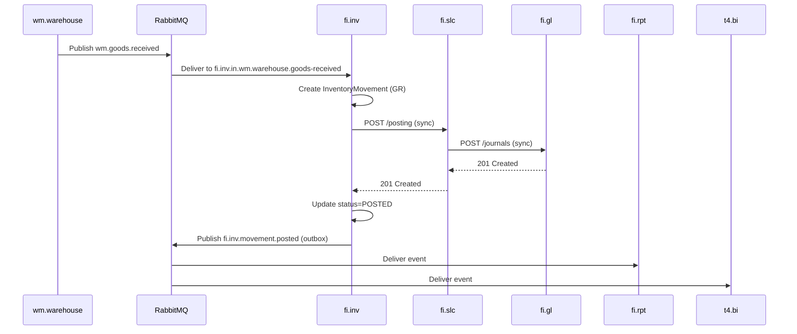
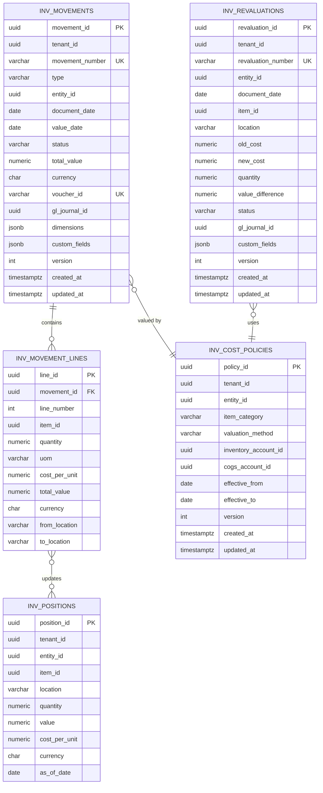

<!-- Template Meta
     Template-ID:   TPL-SVC
     Version:       1.0.0
     Last Updated:  2026-04-03
     Changelog:
       1.0.0 (2026-04-03) — Initial versioned baseline.
-->

# fi.inv - Inventory Valuation Domain / Service Specification

> **Conceptual Stack Layer:** Domain / Service
> **Space:** Platform
> **Owner:** FI Domain Engineering Team
> **Schema alignment:** `service-layer.schema.json`
> **Companion files:** `openapi.yaml`, `*.schema.json` (event contracts)
> **Referenced by:** Platform-Feature Spec SS5 (backend dependencies), BFF Contract
> **Belongs to:** FI Suite Spec (`_fi_suite.md`)

> **Meta Information**
> - **Version:** 2026-04-04
> - **Template:** `domain-service-spec.md` v1.0.0
> - **Template Compliance:** ~92% — minor gaps in §11 feature register (pending feature specs), §12.3-§12.5 extension candidates (need product validation)
> - **Author(s):** OpenLeap Architecture Team
> - **Status:** DRAFT
> - **Suite:** `fi`
> - **Domain:** `inv`
> - **Bounded Context Ref:** `bc:inventory-valuation`
> - **Service ID:** `fi-inv-svc`
> - **basePackage:** `io.openleap.fi.inv`
> - **API Base Path:** `/api/fi/inv/v1`
> - **OpenLeap Starter Version:** `v4.1.0`
> - **Port:** `8460`
> - **Repository:** `https://github.com/openleap/io.openleap.fi.inv`
> - **Tags:** `inventory`, `valuation`, `cost-accounting`, `cogs`, `variance`
> - **Team:**
>   - Name: `team-fi`
>   - Email: `fi-team@openleap.io`
>   - Slack: `#fi-team`

---

## Specification Guidelines Compliance

> ### Non-Negotiables
> - Never invent facts. If required info is missing, add an **OPEN QUESTION** entry.
> - Preserve intent and decisions. Only change meaning when explicitly requested.
> - Do not remove normative constraints unless they are explicitly replaced.
> - Keep the spec **self-contained**: no "see chat", no implicit context.
>
> ### Source of Truth Priority
> When sources conflict:
> 1. Spec (explicit) wins
> 2. Starter specs (implementation constraints) next
> 3. Guidelines (best practices) last
>
> Record conflicts in the **Decisions & Conflicts** section (see Section 14).
>
> ### Style Guide
> - Prefer short sentences and lists.
> - Use MUST/SHOULD/MAY for normative statements.
> - Keep terminology consistent (Aggregate, Domain Service, Application Service, Command, Event).
> - Avoid ambiguous words ("often", "maybe") unless explicitly noting uncertainty.
> - Keep examples minimal and clearly marked as examples.
> - Do not add implementation code unless the chapter explicitly requires it.

---

## 0. Document Purpose & Scope

### 0.1 Purpose

This document specifies the **Inventory Valuation (fi.inv)** domain, which maintains the financial accounting view of inventory movements and valuations. It records financially relevant inventory transactions (receipts, issues, transfers, adjustments, revaluations), delegates postings to fi.slc, and ensures inventory subledger reconciles to General Ledger control accounts.

### 0.2 Target Audience
- Product Owners & Business Stakeholders (Finance, Accounting, Supply Chain, Manufacturing)
- System Architects & Technical Leads
- Integration Engineers
- Controllers and Cost Accountants
- External Auditors

### 0.3 Scope

**In Scope:**
- **Inventory Movements:** Goods Receipt (GR), Goods Issue (GI), Transfers, Adjustments, Returns
- **Cost Valuation:** Standard Cost, Weighted Average, FIFO, LIFO methods
- **Revaluation:** Standard cost updates, cost layer adjustments
- **Variance Accounting:** Purchase Price Variance (PPV), Manufacturing Usage Variance (MUV)
- **GL Integration:** Post inventory movements to GL via fi.slc
- **Reconciliation:** Inventory subledger balance = GL Inventory control account
- **Multi-Location:** Support multiple warehouses, plants, entities
- **Multi-Entity:** Inter-entity transfers with intercompany accounting

**Out of Scope:**
- Physical inventory management (stock reservations, bin management -> im.inventory)
- Warehouse operations (pick, pack, ship -> wm.warehouse)
- Product master data -> pd.product
- Manufacturing execution -> mes.execution
- Procurement and sales workflows -> pur.procurement, sd.sales
- Detailed BOM/routing costing -> costing (separate domain)

### 0.4 Related Documents
- `_fi_suite.md` - FI Suite architecture
- `fi_gl.md` - General Ledger specification
- `fi_slc.md` - Subledger core specification
- `fi_ap.md` - Accounts Payable (PPV integration)
- `fi_ar.md` - Accounts Receivable
- `fi_rpt.md` - Reporting (downstream consumer)

---

## 1. Business Context

### 1.1 Domain Purpose

**fi.inv** bridges the gap between physical inventory movements (the operational reality) and financial accounting (the financial reality). Every time inventory moves -- received from suppliers, issued to production, shipped to customers, adjusted for counts -- there is a financial impact that must be recorded in the books.

**Core Business Problems Solved:**
- **Inventory Valuation:** What is the financial value of our inventory?
- **COGS Recognition:** How much did the goods we sold cost us?
- **Variance Analysis:** Why do actual costs differ from standard costs?
- **Reconciliation:** Does our inventory subledger match the GL?
- **Cost Control:** Track and manage inventory-related expenses
- **Audit Compliance:** Provide complete audit trail from movement to GL

### 1.2 Business Value

**For the Organization:**
- **Accurate COGS:** Proper revenue recognition and gross margin calculation
- **Working Capital:** Optimize inventory levels with accurate valuation
- **Cost Control:** Identify variances, track waste, prevent shrinkage
- **Compliance:** Meet IFRS/GAAP inventory accounting standards (IAS 2)
- **Decision Making:** Understand true product profitability

**For Users:**
- **Cost Accountant:** Automated inventory postings, variance analysis
- **Controller:** One-click reconciliation, period close automation
- **Warehouse Manager:** Real-time inventory value visibility
- **CFO:** Accurate balance sheet (inventory = major asset)
- **Auditor:** Complete trace from warehouse transaction to GL

### 1.3 Key Stakeholders

| Role | Responsibility | Primary Use Cases |
|------|----------------|-------------------|
| Cost Accountant | Inventory valuation | Post movements, analyze variances, update standard costs |
| Controller | Month-end close | Reconcile inventory to GL, close inventory period |
| Warehouse Manager | Physical inventory | Confirm movements trigger financial postings |
| Procurement Manager | Purchase price variance | Understand PPV, optimize supplier costs |
| Production Planner | Work-in-process | Track WIP value, manufacturing costs |
| External Auditor | Financial audit | Verify inventory valuation, trace to GL |

### 1.4 Strategic Positioning

**fi.inv** sits **between** operational inventory systems (im.inventory, wm.warehouse) and the General Ledger (fi.gl). It translates operational inventory events into financial postings.



### 1.5 Service Context

| Property | Value |
|----------|-------|
| **Suite** | `fi` |
| **Domain** | `inv` |
| **Bounded Context** | `bc:inventory-valuation` |
| **Service ID** | `fi-inv-svc` |
| **Base Package** | `io.openleap.fi.inv` |

**Responsibilities:**
- Record financially relevant inventory movements (GR, GI, XFER, ADJ, RET)
- Calculate inventory cost using configured valuation methods (STD, WAVG, FIFO, LIFO)
- Delegate GL postings to fi.slc (account determination and journal creation)
- Track purchase price variances (PPV) and manufacturing usage variances (MUV)
- Execute inventory revaluations (standard cost updates)
- Provide inventory reconciliation against GL control accounts
- Maintain inventory position read model for real-time valuation queries

**Authoritative Sources:**
| Source Type | Description | Access Pattern |
|-------------|-------------|----------------|
| REST API | Inventory movements, revaluations, positions, reconciliation | Synchronous |
| Database | Inventory movements, cost policies, positions (owned data) | Direct (owner) |
| Events | Movement posted, revaluation posted, variance posted | Asynchronous |



---

## 2. Service Identity

| Property | Value | Schema Field |
|----------|-------|-------------|
| **Service ID** | `fi-inv-svc` | `metadata.id` |
| **Display Name** | `Inventory Valuation` | `metadata.name` |
| **Suite** | `fi` | `metadata.suite` |
| **Domain** | `inv` | `metadata.domain` |
| **Bounded Context** | `bc:inventory-valuation` | `metadata.bounded_context_ref` |
| **Version** | `0.1.0` | `metadata.version` |
| **Status** | DRAFT | `metadata.status` |
| **API Base Path** | `/api/fi/inv/v1` | `metadata.api_base_path` |
| **Repository** | `https://github.com/openleap/io.openleap.fi.inv` | `metadata.repository` |
| **Tags** | `inventory`, `valuation`, `cost-accounting`, `cogs`, `variance` | `metadata.tags` |

**Team:**
| Property | Value |
|----------|-------|
| **Name** | `team-fi` |
| **Email** | `fi-team@openleap.io` |
| **Slack Channel** | `#fi-team` |

---

## 3. Domain Model

### 3.1 Conceptual Overview

The inventory valuation domain model consists of four main pillars:

1. **Inventory Documents:** Business truth (movements, revaluations)
2. **Cost Valuation:** Calculate inventory value using valuation methods
3. **GL Integration:** Post to General Ledger via fi.slc
4. **Reconciliation:** Ensure subledger = GL control account

**Key Principles:**
- **Event-Driven:** React to warehouse/production events
- **Cost Methods:** Support STD (Standard), WAVG (Weighted Average), FIFO, LIFO
- **Immutability:** Posted movements cannot be changed, only reversed
- **Subledger Pattern:** Detailed inventory positions, summarized to GL
- **Variance Tracking:** PPV (Purchase Price), MUV (Manufacturing Usage)

### 3.2 Core Concepts



### 3.3 Aggregate Definitions

#### 3.3.1 InventoryMovement

| Property | Value |
|----------|-------|
| **Aggregate ID** | `agg:inventory-movement` |
| **Name** | `InventoryMovement` |

**Business Purpose:**
Represents a financially relevant inventory transaction. Creates GL journal entries for inventory value changes. Analogous to SAP Material Document (MKPF/MSEG) in the MM-IM module.

##### Aggregate Root

**Key Attributes:**

| Attribute | Type | Format | Description | Constraints | Required | Read-Only |
|-----------|------|--------|-------------|-------------|----------|-----------|
| movementId | string | uuid | Unique identifier for the inventory movement | Immutable | Yes | Yes |
| tenantId | string | uuid | Tenant ownership for RLS isolation | Immutable | Yes | Yes |
| movementNumber | string | — | Sequential movement number (e.g., GR-2025-001) | maxLength: 50, unique per tenant | Yes | Yes |
| type | string | — | Movement type classification | enum_ref: `MovementType` | Yes | No |
| entityId | string | uuid | Legal entity that owns this movement | FK to entities | Yes | No |
| documentDate | string | date | Business date of the movement | — | Yes | No |
| valueDate | string | date | Effective date for valuation purposes | minimum: documentDate | Yes | No |
| status | string | — | Current lifecycle state | enum_ref: `MovementStatus` | Yes | No |
| totalValue | number | decimal | Total movement value in valuation currency | precision: 19,4; equals sum of line values | Yes | No |
| currency | string | — | Valuation currency code | pattern: `^[A-Z]{3}$`, ISO 4217 | Yes | No |
| voucherId | string | — | Idempotency key for duplicate detection | maxLength: 100, unique per tenant | Yes | No |
| sourcePoId | string | uuid | Purchase order reference (for GR movements) | FK to pur.orders | No | No |
| sourceSoId | string | uuid | Sales order reference (for GI movements) | FK to sd.orders | No | No |
| sourceProductionOrderId | string | uuid | Production order reference (for production receipts) | FK to mes.production_orders | No | No |
| glJournalId | string | uuid | Posted GL journal reference | FK to fi.gl.journal_entries | No | Yes |
| dimensions | object | — | Analytical attributes for reporting (warehouse, product, cost center) | JSONB | No | No |
| version | integer | int64 | Optimistic locking version | — | Yes | Yes |
| createdAt | string | date-time | Creation timestamp | Auto-generated | Yes | Yes |
| updatedAt | string | date-time | Last update timestamp | Auto-generated | Yes | Yes |
| postedAt | string | date-time | Posting timestamp (set when status transitions to POSTED) | — | No | Yes |

**Lifecycle States:**

| Property | Value |
|----------|-------|
| **Initial State** | `DRAFT` |
| **Terminal States** | `REVERSED` |



**State Descriptions:**

| State | Description | Business Meaning |
|-------|-------------|------------------|
| DRAFT | Initial creation state | Movement being prepared, editable, not yet posted to GL |
| POSTED | Financially posted state | Movement posted to GL via fi.slc, immutable, inventory value updated |
| REVERSED | Correction state | Original movement reversed with offsetting journal entry, terminal state |

**Allowed Transitions:**

| From State | To State | Trigger | Guard / Business Preconditions |
|------------|----------|---------|-------------------------------|
| DRAFT | POSTED | PostMovement command | All mandatory fields filled; cost policy exists; period open; BR-MOV-001 balance validated |
| POSTED | REVERSED | ReverseMovement command | User has INV_ADMIN role; reversal reason provided; period open |

**Invariants:**

| Rule ID | Description |
|---------|-------------|
| BR-MOV-001 | Total value MUST equal sum of line values |
| BR-MOV-002 | Posted movements MUST NOT be modified or deleted, only reversed |
| BR-MOV-003 | Movement type determines required from/to location fields |
| BR-MOV-004 | Cost calculation MUST use entity's configured valuation method |

**Domain Events Emitted:**
- `fi.inv.movement.created`
- `fi.inv.movement.posted`
- `fi.inv.movement.reversed`

**Movement Types:**

| Type | Description | GL Impact | Example |
|------|-------------|-----------|---------|
| GR | Goods Receipt | DR Inventory, CR GR/IR Clearing | PO receipt from supplier |
| GI | Goods Issue | DR COGS (or WIP), CR Inventory | Ship to customer, issue to production |
| XFER | Transfer | DR Inventory (to), CR Inventory (from) | Warehouse-to-warehouse transfer |
| ADJ | Adjustment | DR/CR Inventory, DR/CR Gain/Loss | Physical count adjustment |
| RET | Return | DR Inventory, CR COGS | Customer return to stock |

**Example Scenarios:**

**Scenario 1: Goods Receipt from PO (Standard Cost)**
```json
{
  "type": "GR",
  "entityId": "entity-uuid",
  "documentDate": "2025-12-05",
  "valueDate": "2025-12-05",
  "sourcePoId": "po-uuid-001",
  "lines": [
    {
      "itemId": "item-uuid-123",
      "quantity": 100.000,
      "uom": "EA",
      "costPerUnit": 10.00,
      "totalValue": 1000.00,
      "toLocation": "WH1",
      "dimensions": {
        "warehouse": "WH1",
        "product": "SKU-123"
      }
    }
  ],
  "totalValue": 1000.00,
  "currency": "EUR"
}
```

**Result:**
- Movement created with status = DRAFT
- User posts movement
- System calls fi.slc to post:
  - DR 1500 Inventory EUR 1,000
  - CR 1510 GR/IR Clearing EUR 1,000
- glJournalId linked to movement
- When AP invoice arrives with different price (EUR 10.50), PPV posted:
  - DR 5200 PPV (Purchase Price Variance) EUR 50
  - CR 2100 Payables EUR 50

##### Child Entities

###### Entity: MovementLine

| Property | Value |
|----------|-------|
| **Entity ID** | `ent:movement-line` |
| **Name** | `MovementLine` |
| **Relationship to Root** | one_to_many |

**Business Purpose:**
Individual line item within a movement. Represents one item/lot moving from/to a location with its associated cost. Analogous to SAP MSEG (Material Document Item).

**Attributes:**

| Attribute | Type | Format | Description | Constraints | Required |
|-----------|------|--------|-------------|-------------|----------|
| lineId | string | uuid | Unique identifier | Immutable | Yes |
| movementId | string | uuid | Parent movement reference | FK to InventoryMovement | Yes |
| lineNumber | integer | int32 | Sequential line number within movement | unique per movement | Yes |
| itemId | string | uuid | Product/material reference | FK to pd.items | Yes |
| lotNumber | string | — | Batch/lot identifier for lot-tracked items | maxLength: 50 | No |
| serialNumber | string | — | Serial number for serialized items | maxLength: 50 | No |
| quantity | number | decimal | Movement quantity (sign indicates direction) | precision: 19,6; not zero | Yes |
| uom | string | — | Unit of measure code | maxLength: 10, e.g., "EA", "KG" | Yes |
| costPerUnit | number | decimal | Unit cost at time of movement | precision: 19,4; greater than 0 | Yes |
| totalValue | number | decimal | Line value = quantity x costPerUnit | precision: 19,4 | Yes |
| currency | string | — | Line currency code | pattern: `^[A-Z]{3}$`, ISO 4217 | Yes |
| fromLocation | string | — | Source location/warehouse | maxLength: 50; required for GI, XFER | No |
| toLocation | string | — | Destination location/warehouse | maxLength: 50; required for GR, XFER | No |
| costLayerRef | string | — | Cost layer reference for FIFO/LIFO tracking | maxLength: 100 | No |
| dimensions | object | — | Line-level analytical attributes | JSONB | No |

**Collection Constraints:**
- Minimum items: 1
- Maximum items: 9999

**Invariants:**

| Rule ID | Description |
|---------|-------------|
| BR-LINE-001 | Quantity sign/direction MUST match movement type |
| BR-LINE-002 | Location fields MUST conform to movement type requirements |

##### Value Objects

###### Value Object: Money

| Property | Value |
|----------|-------|
| **VO ID** | `vo:money` |
| **Name** | `Money` |

**Description:**
Represents a monetary amount with its currency. Used throughout inventory movements, revaluations, and positions to express financial values.

**Attributes:**

| Attribute | Type | Format | Description | Constraints |
|-----------|------|--------|-------------|-------------|
| amount | number | decimal | Monetary amount | precision: 19,4 |
| currencyCode | string | — | ISO 4217 currency code | pattern: `^[A-Z]{3}$` |

**Validation Rules:**
- currencyCode MUST be a valid ISO 4217 code
- amount precision MUST NOT exceed 4 decimal places

###### Value Object: AnalyticalDimensions

| Property | Value |
|----------|-------|
| **VO ID** | `vo:analytical-dimensions` |
| **Name** | `AnalyticalDimensions` |

**Description:**
Flexible analytical attributes for reporting and cost allocation. Stored as JSONB to accommodate varying dimension requirements across deployments.

**Attributes:**

| Attribute | Type | Format | Description | Constraints |
|-----------|------|--------|-------------|-------------|
| warehouse | string | — | Warehouse code | maxLength: 20 |
| product | string | — | Product/SKU code | maxLength: 50 |
| costCenter | string | — | Cost center reference | maxLength: 20 |
| profitCenter | string | — | Profit center reference | maxLength: 20 |
| project | string | — | Project reference | maxLength: 20 |

**Validation Rules:**
- All dimension keys MUST be lowercase alphanumeric with underscores
- Dimension values MUST NOT exceed 100 characters

---

#### 3.3.2 Revaluation

| Property | Value |
|----------|-------|
| **Aggregate ID** | `agg:revaluation` |
| **Name** | `Revaluation` |

**Business Purpose:**
Records a change in inventory cost (e.g., standard cost update, market value adjustment). Creates a revaluation journal entry to adjust inventory value on the balance sheet. Analogous to SAP MR21 (Price Change) transaction.

##### Aggregate Root

**Key Attributes:**

| Attribute | Type | Format | Description | Constraints | Required | Read-Only |
|-----------|------|--------|-------------|-------------|----------|-----------|
| revaluationId | string | uuid | Unique identifier | Immutable | Yes | Yes |
| tenantId | string | uuid | Tenant ownership for RLS isolation | Immutable | Yes | Yes |
| revaluationNumber | string | — | Sequential revaluation number | maxLength: 50, unique per tenant | Yes | Yes |
| entityId | string | uuid | Legal entity | FK to entities | Yes | No |
| documentDate | string | date | Revaluation date | — | Yes | No |
| itemId | string | uuid | Product being revalued | FK to pd.items | Yes | No |
| location | string | — | Location/warehouse of inventory | maxLength: 50 | Yes | No |
| oldCost | number | decimal | Previous cost per unit | precision: 19,4; greater than 0 | Yes | No |
| newCost | number | decimal | New cost per unit | precision: 19,4; greater than 0 | Yes | No |
| quantity | number | decimal | Quantity on hand at location | precision: 19,6; greater than 0 | Yes | No |
| valueDifference | number | decimal | Impact on inventory value = (newCost - oldCost) x quantity | precision: 19,4 | Yes | Yes |
| currency | string | — | Currency code | pattern: `^[A-Z]{3}$`, ISO 4217 | Yes | No |
| status | string | — | Current lifecycle state | enum_ref: `RevaluationStatus` | Yes | No |
| reason | string | — | Revaluation reason / justification | maxLength: 500 | No | No |
| voucherId | string | — | Idempotency key | maxLength: 100, unique per tenant | Yes | No |
| glJournalId | string | uuid | Posted GL journal reference | FK to fi.gl.journal_entries | No | Yes |
| version | integer | int64 | Optimistic locking version | — | Yes | Yes |
| createdAt | string | date-time | Creation timestamp | Auto-generated | Yes | Yes |
| updatedAt | string | date-time | Last update timestamp | Auto-generated | Yes | Yes |
| postedAt | string | date-time | Posting timestamp | — | No | Yes |

**Lifecycle States:**

| Property | Value |
|----------|-------|
| **Initial State** | `DRAFT` |
| **Terminal States** | `POSTED` |



**State Descriptions:**

| State | Description | Business Meaning |
|-------|-------------|------------------|
| DRAFT | Initial creation state | Revaluation being prepared, editable, not yet posted |
| POSTED | Financially posted state | Revaluation posted to GL, inventory value adjusted, terminal |

**Allowed Transitions:**

| From State | To State | Trigger | Guard / Business Preconditions |
|------------|----------|---------|-------------------------------|
| DRAFT | POSTED | PostRevaluation command | newCost != oldCost; quantity > 0; period open; user has INV_ADMIN role |

**Invariants:**

| Rule ID | Description |
|---------|-------------|
| BR-REVAL-001 | newCost MUST NOT equal oldCost |
| BR-REVAL-002 | Posting direction (DR/CR) determined by cost change direction |

**Domain Events Emitted:**
- `fi.inv.revaluation.created`
- `fi.inv.revaluation.posted`

**Example Scenarios:**

**Scenario 1: Standard Cost Increase**
```json
{
  "entityId": "entity-uuid",
  "documentDate": "2025-12-31",
  "itemId": "item-uuid-123",
  "location": "WH1",
  "oldCost": 10.00,
  "newCost": 11.50,
  "quantity": 500.000,
  "valueDifference": 750.00,
  "currency": "EUR",
  "reason": "Annual standard cost update Q1 2026"
}
```

**Result:**
- Revaluation created with status = DRAFT
- User posts revaluation
- System calls fi.slc to post:
  - DR 1500 Inventory EUR 750
  - CR 3900 Revaluation Reserve EUR 750
- Inventory value increased by EUR 750

##### Child Entities

_No child entities. Revaluation is a single-item document._

##### Value Objects

_Reuses `vo:money` from InventoryMovement aggregate._

---

#### 3.3.3 CostPolicy

| Property | Value |
|----------|-------|
| **Aggregate ID** | `agg:cost-policy` |
| **Name** | `CostPolicy` |

**Business Purpose:**
Defines how inventory is valued for a given legal entity and optional item category. Specifies the cost method (STD, WAVG, FIFO, LIFO) and the GL accounts for inventory, COGS, PPV, and revaluation postings. Analogous to SAP Valuation Class / Price Control settings in Material Master.

##### Aggregate Root

**Key Attributes:**

| Attribute | Type | Format | Description | Constraints | Required | Read-Only |
|-----------|------|--------|-------------|-------------|----------|-----------|
| policyId | string | uuid | Unique identifier | Immutable | Yes | Yes |
| tenantId | string | uuid | Tenant ownership for RLS isolation | Immutable | Yes | Yes |
| entityId | string | uuid | Legal entity this policy applies to | FK to entities | Yes | No |
| itemCategory | string | — | Optional item category filter (e.g., RAW_MATERIAL, FINISHED_GOODS) | maxLength: 50 | No | No |
| valuationMethod | string | — | Cost calculation method | enum_ref: `ValuationMethod` | Yes | No |
| inventoryAccountId | string | uuid | Inventory control GL account | FK to fi.gl.accounts | Yes | No |
| wipAccountId | string | uuid | Work-in-process GL account | FK to fi.gl.accounts | No | No |
| cogsAccountId | string | uuid | Cost of goods sold GL account | FK to fi.gl.accounts | Yes | No |
| ppvAccountId | string | uuid | Purchase price variance GL account | FK to fi.gl.accounts | No | No |
| revaluationReserveAccountId | string | uuid | Revaluation reserve GL account | FK to fi.gl.accounts | No | No |
| inventoryGainAccountId | string | uuid | Physical count gain GL account | FK to fi.gl.accounts | No | No |
| inventoryLossAccountId | string | uuid | Physical count loss GL account | FK to fi.gl.accounts | No | No |
| effectiveFrom | string | date | Policy effective date | — | Yes | No |
| effectiveTo | string | date | Policy end date (null = currently active) | minimum: effectiveFrom | No | No |
| version | integer | int64 | Optimistic locking version | — | Yes | Yes |
| createdAt | string | date-time | Creation timestamp | Auto-generated | Yes | Yes |
| updatedAt | string | date-time | Last update timestamp | Auto-generated | Yes | Yes |

**Lifecycle States:**

CostPolicy does not have a formal state machine. It uses temporal validity (effectiveFrom / effectiveTo) to determine the active policy.

**Invariants:**

| Rule ID | Description |
|---------|-------------|
| BR-POL-001 | One ACTIVE policy per (entity, itemCategory) at any time. Enforced via unique constraint. |

**Domain Events Emitted:**
- `fi.inv.costPolicy.created`
- `fi.inv.costPolicy.updated`

**Valuation Methods:**

| Method | Description | Use Case | Cost Calculation |
|--------|-------------|----------|------------------|
| STD | Standard Cost | Manufacturing, stable costs | Fixed cost per item, PPV tracked |
| WAVG | Weighted Average | Commodities, fluctuating prices | Avg cost = Total value / Total qty |
| FIFO | First-In-First-Out | Perishables, high turnover | Cost layers, oldest first |
| LIFO | Last-In-First-Out | Tax optimization (US only) | Cost layers, newest first |

##### Child Entities

_No child entities._

##### Value Objects

_No additional value objects._

---

### 3.4 Enumerations

#### MovementType

**Description:** Classification of inventory movement direction and purpose.

| Value | Description | Deprecated |
|-------|-------------|------------|
| `GR` | Goods Receipt -- inventory increase from external source (supplier, production) | No |
| `GI` | Goods Issue -- inventory decrease for consumption (sales, production) | No |
| `XFER` | Transfer -- inventory movement between locations with no net change | No |
| `ADJ` | Adjustment -- inventory correction from physical count or write-off | No |
| `RET` | Return -- inventory increase from customer return or supplier return | No |

#### MovementStatus

**Description:** Lifecycle state of an inventory movement document.

| Value | Description | Deprecated |
|-------|-------------|------------|
| `DRAFT` | Movement created but not yet posted to GL; editable | No |
| `POSTED` | Movement posted to GL via fi.slc; immutable | No |
| `REVERSED` | Movement reversed with offsetting journal entry | No |

#### RevaluationStatus

**Description:** Lifecycle state of a revaluation document.

| Value | Description | Deprecated |
|-------|-------------|------------|
| `DRAFT` | Revaluation created but not yet posted to GL; editable | No |
| `POSTED` | Revaluation posted to GL; inventory value adjusted; terminal | No |

#### ValuationMethod

**Description:** Inventory cost calculation method as defined by accounting standards (IAS 2).

| Value | Description | Deprecated |
|-------|-------------|------------|
| `STD` | Standard Cost -- fixed cost per item, variances tracked separately (PPV, MUV) | No |
| `WAVG` | Weighted Average Cost -- running average cost recalculated on each receipt | No |
| `FIFO` | First-In-First-Out -- oldest cost layers consumed first | No |
| `LIFO` | Last-In-First-Out -- newest cost layers consumed first (US GAAP only, prohibited by IFRS) | No |

### 3.5 Shared Types

#### Money

| Property | Value |
|----------|-------|
| **Type ID** | `type:money` |
| **Name** | `Money` |

**Description:** Monetary amount with currency. Standard financial value representation.

**Attributes:**

| Attribute | Type | Format | Description | Constraints |
|-----------|------|--------|-------------|-------------|
| amount | number | decimal | Monetary amount | precision: 19,4 |
| currencyCode | string | — | ISO 4217 currency code | pattern: `^[A-Z]{3}$` |

**Validation Rules:**
- amount precision MUST NOT exceed 4 decimal places
- currencyCode MUST be a valid, active ISO 4217 code

**Used By:**
- `agg:inventory-movement` (totalValue, line values)
- `agg:revaluation` (valueDifference)

---

## 4. Business Rules & Constraints

### 4.1 Business Rules Catalog

| ID | Rule Name | Description | Scope | Enforcement | Error Code |
|----|-----------|-------------|-------|-------------|------------|
| BR-MOV-001 | Balance Validation | totalValue = sum of line values | InventoryMovement | Create/Update | `MOVEMENT_UNBALANCED` |
| BR-MOV-002 | Immutability After Posting | Posted movements cannot be modified | InventoryMovement | Update/Delete | `MOVEMENT_IMMUTABLE` |
| BR-MOV-003 | Type-Specific Validations | GR requires toLocation, GI requires fromLocation | InventoryMovement | Create | `INVALID_MOVEMENT_LOCATIONS` |
| BR-MOV-004 | Cost Method Consistency | Use entity's valuation method | InventoryMovement | Posting | `COST_POLICY_MISMATCH` |
| BR-MOV-005 | Period Open Check | Cannot post to a closed fiscal period | InventoryMovement | Posting | `PERIOD_CLOSED` |
| BR-LINE-001 | Quantity Sign | Quantity direction matches movement type | MovementLine | Create | `INVALID_QUANTITY_SIGN` |
| BR-LINE-002 | Location Rules | Location requirements by type | MovementLine | Create | `INVALID_LOCATIONS` |
| BR-REVAL-001 | Cost Change Validation | newCost != oldCost | Revaluation | Create | `NO_COST_CHANGE` |
| BR-REVAL-002 | Posting Direction | Correct DR/CR based on cost change | Revaluation | Posting | — |
| BR-POL-001 | Policy Uniqueness | One active policy per (entity, category) | CostPolicy | Create | `DUPLICATE_POLICY` |

### 4.2 Detailed Rule Definitions

#### BR-MOV-001: Balance Validation

**Business Context:** Financial integrity requires that the document total equals the sum of its line items. This prevents calculation errors from producing incorrect GL postings.

**Rule Statement:** The `totalValue` of an InventoryMovement MUST equal the sum of all `MovementLine.totalValue` amounts.

**Applies To:**
- Aggregate: InventoryMovement
- Operations: Create, Update (while DRAFT)

**Enforcement:** Validated in the domain object before persisting.

**Validation Logic:** Sum all line totalValue fields. Compare to movement totalValue. Tolerance: 0 (exact match at 4 decimal places).

**Error Handling:**
- **Error Code:** `MOVEMENT_UNBALANCED`
- **Error Message:** "Movement total value does not equal sum of line values. Expected {expected}, got {actual}."
- **User action:** Correct line quantities/costs or update total value.

**Examples:**
- **Valid:** 3 lines with values 100.00, 200.00, 300.00; totalValue = 600.00
- **Invalid:** 3 lines with values 100.00, 200.00, 300.00; totalValue = 500.00

#### BR-MOV-002: Immutability After Posting

**Business Context:** Accounting regulations (SOX, IFRS) require that posted financial documents cannot be altered. Corrections are made via reversal documents to maintain audit trail integrity.

**Rule Statement:** Once an InventoryMovement transitions to POSTED status, it MUST NOT be modified or deleted. The only permitted operation is reversal.

**Applies To:**
- Aggregate: InventoryMovement
- Operations: Update, Delete

**Enforcement:** Application service rejects update/delete commands when status is POSTED or REVERSED.

**Validation Logic:** Check movement.status. If status in (POSTED, REVERSED), reject mutation.

**Error Handling:**
- **Error Code:** `MOVEMENT_IMMUTABLE`
- **Error Message:** "Posted movement {movementNumber} cannot be modified. Use reversal instead."
- **User action:** Create a reversal movement via POST /movements/{id}/reverse.

**Examples:**
- **Valid:** Update line quantity on DRAFT movement
- **Invalid:** Attempt to change documentDate on POSTED movement

#### BR-MOV-003: Type-Specific Validations

**Business Context:** Movement direction logic must be enforced to prevent physically impossible inventory transactions (e.g., a goods receipt without a destination location).

**Rule Statement:** GR movements MUST have toLocation and MUST NOT have fromLocation. GI movements MUST have fromLocation and MUST NOT have toLocation. XFER movements MUST have both. ADJ and RET follow GR rules.

**Applies To:**
- Aggregate: InventoryMovement (via MovementLine)
- Operations: Create

**Enforcement:** Validated in the domain object on line creation.

**Validation Logic:** For each line, check location fields against movement type.

**Error Handling:**
- **Error Code:** `INVALID_MOVEMENT_LOCATIONS`
- **Error Message:** "Movement type {type} requires {required fields} but found {actual fields}."
- **User action:** Correct from/to location fields for each line.

**Examples:**
- **Valid:** GR with toLocation="WH1", fromLocation=null
- **Invalid:** GR with fromLocation="WH2", toLocation=null

#### BR-MOV-004: Cost Method Consistency

**Business Context:** Each legal entity configures a valuation method per item category. All movements MUST use the configured method to ensure consistent inventory valuation and prevent COGS distortion.

**Rule Statement:** The cost calculation for each movement line MUST use the valuation method specified in the active CostPolicy for the entity/item category combination.

**Applies To:**
- Aggregate: InventoryMovement
- Operations: Posting

**Enforcement:** Application service looks up cost policy before posting; applies correct cost calculation.

**Validation Logic:** Query CostPolicy for (entityId, itemCategory) where effectiveFrom <= documentDate and (effectiveTo is null or effectiveTo >= documentDate).

**Error Handling:**
- **Error Code:** `COST_POLICY_MISMATCH`
- **Error Message:** "No active cost policy found for entity {entityId}, category {category}."
- **User action:** Create or update CostPolicy for the entity/category.

**Examples:**
- **Valid:** Entity uses WAVG; GR calculates weighted average cost
- **Invalid:** Entity uses STD but movement applies FIFO logic

#### BR-MOV-005: Period Open Check

**Business Context:** Financial periods are closed during month-end/year-end procedures. Postings to closed periods would corrupt the financial statements.

**Rule Statement:** Inventory movements MUST NOT be posted to a fiscal period that has been closed in fi.gl.

**Applies To:**
- Aggregate: InventoryMovement, Revaluation
- Operations: Posting

**Enforcement:** Application service checks period status via fi.gl event cache before posting.

**Validation Logic:** Determine fiscal period from valueDate. Check cached period status. If CLOSED, reject.

**Error Handling:**
- **Error Code:** `PERIOD_CLOSED`
- **Error Message:** "Cannot post to closed period {periodId}. Value date {valueDate} falls in closed period."
- **User action:** Change valueDate to an open period or request period re-open from Controller.

**Examples:**
- **Valid:** Post movement with valueDate 2025-12-05 to open December 2025 period
- **Invalid:** Post movement with valueDate 2025-11-30 to closed November 2025 period

#### BR-LINE-001: Quantity Sign

**Business Context:** Consistent quantity handling prevents double-counting or sign errors in inventory valuation.

**Rule Statement:** For GR/ADJ(gain)/RET movements, quantity MUST be positive. For GI/ADJ(loss) movements, quantity MUST be positive (direction implied by type).

**Applies To:**
- Aggregate: MovementLine
- Operations: Create

**Enforcement:** Domain object validation on line creation.

**Validation Logic:** Quantity MUST NOT be zero. Quantity MUST be positive (type field determines DR/CR direction).

**Error Handling:**
- **Error Code:** `INVALID_QUANTITY_SIGN`
- **Error Message:** "Line quantity must be non-zero and positive. Got {quantity}."
- **User action:** Correct the quantity value.

**Examples:**
- **Valid:** GR line with quantity = 100.000
- **Invalid:** GR line with quantity = 0 or quantity = -50

#### BR-REVAL-001: Cost Change Validation

**Business Context:** A revaluation with identical old and new costs has no financial impact and would create a zero-value journal entry, wasting processing and cluttering the audit trail.

**Rule Statement:** The newCost MUST differ from oldCost on a Revaluation.

**Applies To:**
- Aggregate: Revaluation
- Operations: Create

**Enforcement:** Domain object validation.

**Validation Logic:** newCost != oldCost

**Error Handling:**
- **Error Code:** `NO_COST_CHANGE`
- **Error Message:** "New cost ({newCost}) must differ from old cost ({oldCost})."
- **User action:** Specify a different new cost or cancel the revaluation.

**Examples:**
- **Valid:** oldCost = 10.00, newCost = 11.50
- **Invalid:** oldCost = 10.00, newCost = 10.00

#### BR-POL-001: Policy Uniqueness

**Business Context:** Ambiguous cost policies would cause different parts of the system to calculate different inventory values for the same item, breaking reconciliation.

**Rule Statement:** At most one CostPolicy may be active (effectiveTo IS NULL) for a given (tenantId, entityId, itemCategory) combination at any time.

**Applies To:**
- Aggregate: CostPolicy
- Operations: Create, Update

**Enforcement:** Unique database constraint on (tenant_id, entity_id, item_category, effective_from) WHERE effective_to IS NULL.

**Validation Logic:** Before creating/activating a new policy, check no other active policy exists for the same (entity, category).

**Error Handling:**
- **Error Code:** `DUPLICATE_POLICY`
- **Error Message:** "An active cost policy already exists for entity {entityId}, category {category}."
- **User action:** Deactivate existing policy (set effectiveTo) before creating new one.

**Examples:**
- **Valid:** Create policy for entity E1, category RAW_MATERIAL when no active policy exists
- **Invalid:** Create second active policy for same entity E1, category RAW_MATERIAL

### 4.3 Data Validation Rules

**Field-Level Validations:**

| Field | Validation Rule | Error Message |
|-------|----------------|---------------|
| movementNumber | Required, max 50 chars | "Movement number is required and cannot exceed 50 characters" |
| type | Required, must be valid MovementType | "Invalid movement type. Must be one of: GR, GI, XFER, ADJ, RET" |
| entityId | Required, valid UUID | "Entity ID is required" |
| documentDate | Required, valid date | "Document date is required" |
| valueDate | Required, >= documentDate | "Value date must be on or after document date" |
| currency | Required, 3-char ISO 4217 | "Invalid currency code" |
| voucherId | Required, unique per tenant, max 100 chars | "Voucher ID is required and must be unique" |
| quantity (line) | Required, not zero, > 0 | "Quantity must be positive and non-zero" |
| costPerUnit (line) | Required, > 0 | "Cost per unit must be positive" |
| uom (line) | Required, max 10 chars | "Unit of measure is required" |

**Cross-Field Validations:**
- `valueDate` MUST be >= `documentDate`
- `totalValue` MUST equal sum of all line `totalValue` fields
- Each line `totalValue` MUST equal `quantity * costPerUnit`
- For GR: `fromLocation` MUST be null, `toLocation` MUST NOT be null (per line)
- For GI: `fromLocation` MUST NOT be null, `toLocation` MUST be null (per line)
- For XFER: both `fromLocation` and `toLocation` MUST NOT be null (per line)
- Revaluation `valueDifference` MUST equal `(newCost - oldCost) * quantity`

### 4.4 Reference Data Dependencies

**Required Reference Data:**

| Catalog | Source Service | Fields Referencing | Validation |
|---------|----------------|-------------------|------------|
| Currencies (ISO 4217) | ref-data-svc | currency, line.currency | Must exist and be active |
| Units of Measure | ref-data-svc / si-unit-svc | line.uom | Must be a valid UoM code |
| GL Accounts | fi-gl-svc | CostPolicy account IDs | Must exist and be ACTIVE in fi.gl |
| Legal Entities | ref-data-svc | entityId | Must exist and be active |
| Products / Materials | pd-product-svc | line.itemId | Must exist in product master |
| Fiscal Periods | fi-gl-svc | valueDate | Period must be OPEN for posting |

---

## 5. Use Cases

> This section defines explicit use cases (WRITE/READ), mapping to domain operations/services.
> Each use case MUST follow the canonical format for code generation.

### 5.1 Business Logic Placement

| Logic Type | Placement | Examples |
|------------|-----------|----------|
| Aggregate invariants | Domain Object | Balance validation (BR-MOV-001), immutability (BR-MOV-002), location rules (BR-MOV-003) |
| Cross-aggregate logic | Domain Service | Cost calculation using CostPolicy, variance computation |
| Orchestration & transactions | Application Service | Movement posting orchestration, fi.slc delegation, event publishing |

### 5.2 Use Cases (Canonical Format)

#### UC-001: PostGoodsReceipt

| Field | Value |
|-------|-------|
| **id** | `PostGoodsReceipt` |
| **type** | WRITE |
| **trigger** | Message (wm.goods.received event) / REST |
| **aggregate** | `InventoryMovement` |
| **domainOperation** | `InventoryMovement.create` + `InventoryMovement.post` |
| **inputs** | `type: MovementType`, `entityId: UUID`, `documentDate: Date`, `valueDate: Date`, `sourcePoId: UUID`, `lines: MovementLine[]`, `voucherId: String` |
| **outputs** | `movementId: UUID`, `movementNumber: String`, `status: MovementStatus`, `glJournalId: UUID` |
| **events** | `fi.inv.movement.posted` |
| **rest** | `POST /api/fi/inv/v1/movements` |
| **idempotency** | required (voucherId) |
| **errors** | `MOVEMENT_UNBALANCED`, `INVALID_MOVEMENT_LOCATIONS`, `PERIOD_CLOSED`, `COST_POLICY_MISMATCH` |

**Actor:** Cost Accountant (triggered automatically by warehouse event)

**Preconditions:**
- Purchase order exists and confirmed
- Warehouse confirms goods receipt (wm.goods.received event)
- Cost policy configured for entity/item category
- User has INV_POSTER role
- Fiscal period is open

**Main Flow:**
1. Warehouse confirms receipt (wm.warehouse publishes goods.received event)
2. System consumes goods.received event
3. System retrieves PO line details (item, quantity, price)
4. System retrieves cost policy for entity/item
5. System creates InventoryMovement (type=GR, status=DRAFT)
6. System validates balance (BR-MOV-001) and locations (BR-MOV-003)
7. System auto-posts movement (or user reviews and posts)
8. System calls fi.slc POST /posting: DR Inventory, CR GR/IR Clearing
9. fi.slc posts to fi.gl, returns journalId
10. System updates InventoryMovement: status=POSTED, glJournalId=journalId
11. System creates/updates InventoryPosition (read model)
12. System publishes fi.inv.movement.posted event

**When AP Invoice Arrives (with different price):**
13. fi.ap posts bill with actual price (EUR 10.50 vs. std EUR 10.00)
14. System calculates PPV = (EUR 10.50 - EUR 10.00) x 100 = EUR 50
15. System calls fi.slc POST /posting (PPV): DR PPV EUR 50, CR Payables EUR 50

**Postconditions:**
- InventoryMovement status = POSTED
- GL journal created (DR Inventory, CR GR/IR)
- PPV recorded (when invoice arrives with different price)
- Inventory value increased
- fi.inv.movement.posted event published

**Business Rules Applied:**
- BR-MOV-001: Balance validation
- BR-MOV-002: Immutability after posting
- BR-MOV-003: Type-specific location validation
- BR-MOV-004: Cost method consistency
- BR-MOV-005: Period open check
- BR-POL-001: Use correct cost policy

**Alternative Flows:**
- **Alt-1:** If no cost policy found, reject movement with COST_POLICY_MISMATCH error
- **Alt-2:** If movement created via REST (not event), user manually enters all fields

**Exception Flows:**
- **Exc-1:** If fi.slc posting fails, movement remains in DRAFT; retry with exponential backoff
- **Exc-2:** If period is closed, reject with PERIOD_CLOSED error

---

#### UC-002: PostGoodsIssue

| Field | Value |
|-------|-------|
| **id** | `PostGoodsIssue` |
| **type** | WRITE |
| **trigger** | Message (wm.goods.issued / sd.goods.shipped event) / REST |
| **aggregate** | `InventoryMovement` |
| **domainOperation** | `InventoryMovement.create` + `InventoryMovement.post` |
| **inputs** | `type: MovementType`, `entityId: UUID`, `documentDate: Date`, `valueDate: Date`, `sourceSoId: UUID`, `lines: MovementLine[]`, `voucherId: String` |
| **outputs** | `movementId: UUID`, `movementNumber: String`, `status: MovementStatus`, `glJournalId: UUID` |
| **events** | `fi.inv.movement.posted` |
| **rest** | `POST /api/fi/inv/v1/movements` |
| **idempotency** | required (voucherId) |
| **errors** | `MOVEMENT_UNBALANCED`, `INVALID_MOVEMENT_LOCATIONS`, `PERIOD_CLOSED`, `COST_POLICY_MISMATCH` |

**Actor:** Cost Accountant (triggered by shipment event)

**Preconditions:**
- Sales order shipped (sd.sales or wm.warehouse publishes goods.shipped/goods.issued event)
- Inventory available in warehouse
- Cost policy configured
- Fiscal period is open

**Main Flow:**
1. Sales/warehouse confirms shipment (goods.shipped event)
2. System consumes event
3. System retrieves SO line details (item, quantity)
4. System retrieves cost policy and current inventory cost
5. System creates InventoryMovement (type=GI)
6. System determines cost per unit:
   - If STD: use standard cost from policy
   - If WAVG: calculate weighted average from position
   - If FIFO: consume oldest cost layer
   - If LIFO: consume newest cost layer
7. System posts movement via fi.slc: DR COGS, CR Inventory
8. System updates InventoryPosition (qty reduced, value reduced)
9. System publishes fi.inv.movement.posted event

**Postconditions:**
- Inventory reduced by issued quantity
- COGS recognized in P&L
- GL journal created
- fi.inv.movement.posted event published

**Business Rules Applied:**
- BR-MOV-001: Balance validation
- BR-MOV-004: Cost method consistency
- BR-MOV-005: Period open check
- BR-LINE-001: Quantity sign
- BR-LINE-002: Location rules (fromLocation required)

**Alternative Flows:**
- **Alt-1:** If FIFO/LIFO and insufficient cost layers, reject with error

**Exception Flows:**
- **Exc-1:** If fi.slc posting fails, movement remains in DRAFT; retry

---

#### UC-003: PostCostRevaluation

| Field | Value |
|-------|-------|
| **id** | `PostCostRevaluation` |
| **type** | WRITE |
| **trigger** | REST |
| **aggregate** | `Revaluation` |
| **domainOperation** | `Revaluation.create` + `Revaluation.post` |
| **inputs** | `entityId: UUID`, `documentDate: Date`, `itemId: UUID`, `location: String`, `oldCost: Decimal`, `newCost: Decimal`, `reason: String` |
| **outputs** | `revaluationId: UUID`, `revaluationNumber: String`, `valueDifference: Decimal`, `status: RevaluationStatus`, `glJournalId: UUID` |
| **events** | `fi.inv.revaluation.posted` |
| **rest** | `POST /api/fi/inv/v1/revaluations` |
| **idempotency** | required (voucherId) |
| **errors** | `NO_COST_CHANGE`, `PERIOD_CLOSED` |

**Actor:** Cost Accountant

**Preconditions:**
- New standard cost determined (e.g., annual cost roll)
- Inventory on-hand for item at location
- User has INV_ADMIN role
- Fiscal period is open

**Main Flow:**
1. User creates revaluation (POST /revaluations)
2. User specifies: itemId, location, oldCost, newCost, reason
3. System queries current inventory quantity at location
4. System calculates valueDifference = (newCost - oldCost) x quantity
5. System creates Revaluation (status = DRAFT)
6. User reviews and posts
7. System calls fi.slc POST /posting with revaluation data
8. fi.slc applies posting rule:
   - If increase: DR Inventory, CR Revaluation Reserve
   - If decrease: DR Revaluation Reserve, CR Inventory
9. fi.slc posts to fi.gl, returns journalId
10. System updates Revaluation status = POSTED, glJournalId = journalId
11. System publishes fi.inv.revaluation.posted event

**Postconditions:**
- Revaluation posted to GL
- Inventory value adjusted
- GL journal created
- Future receipts/issues use new cost (for STD method)
- fi.inv.revaluation.posted event published

**Business Rules Applied:**
- BR-REVAL-001: Cost change validation
- BR-REVAL-002: Posting direction
- BR-MOV-005: Period open check

**Alternative Flows:**
- **Alt-1:** Batch revaluation for all items in a category (iterate per item/location)

**Exception Flows:**
- **Exc-1:** If fi.slc posting fails, revaluation remains in DRAFT

---

#### UC-004: ReconcileInventoryToGL

| Field | Value |
|-------|-------|
| **id** | `ReconcileInventoryToGL` |
| **type** | READ |
| **trigger** | REST |
| **aggregate** | — (cross-aggregate read) |
| **domainOperation** | `ReconciliationService.reconcile` |
| **inputs** | `entityId: UUID`, `periodId: UUID` |
| **outputs** | `subledgerTotal: Decimal`, `glControlAccountBalance: Decimal`, `variance: Decimal`, `variances: VarianceDetail[]` |
| **events** | — (READ) |
| **rest** | `GET /api/fi/inv/v1/reconciliation/control-account` |
| **idempotency** | none |
| **errors** | `ENTITY_NOT_FOUND`, `PERIOD_NOT_FOUND` |

**Actor:** Controller

**Preconditions:**
- Movements posted for the period
- GL journals exist
- User has INV_ADMIN role

**Main Flow:**
1. User requests reconciliation (GET /reconciliation/control-account?periodId={id})
2. System queries sum of inventory positions (subledger) = Total Inventory Value
3. System queries GL inventory control account balance (from fi.gl ledger)
4. System calculates variance = GL balance - Subledger total
5. System identifies potential variances:
   - In-transit inventory (GR not yet posted)
   - Pending production costs (WIP not completed)
   - PPV not cleared
   - Timing differences (value date vs. posting date)
6. System returns reconciliation report

**Postconditions:**
- Reconciliation report generated
- Variances identified and explained
- Period ready for close (if balanced)

**Business Rules Applied:**
- None (read-only operation)

**Alternative Flows:**
- **Alt-1:** If variance exceeds threshold, system flags for review

**Exception Flows:**
- **Exc-1:** If GL account balance unavailable (fi.gl down), return partial result with warning

---

#### UC-005: ReverseMovement

| Field | Value |
|-------|-------|
| **id** | `ReverseMovement` |
| **type** | WRITE |
| **trigger** | REST |
| **aggregate** | `InventoryMovement` |
| **domainOperation** | `InventoryMovement.reverse` |
| **inputs** | `movementId: UUID`, `reason: String`, `reversalDate: Date` |
| **outputs** | `reversalMovementId: UUID`, `reversalMovementNumber: String`, `glJournalId: UUID` |
| **events** | `fi.inv.movement.reversed` |
| **rest** | `POST /api/fi/inv/v1/movements/{id}/reverse` |
| **idempotency** | required (voucherId on reversal) |
| **errors** | `MOVEMENT_IMMUTABLE` (if already reversed), `PERIOD_CLOSED` |

**Actor:** Cost Accountant / INV_ADMIN

**Preconditions:**
- Original movement exists and is in POSTED status
- User has INV_ADMIN role
- Fiscal period is open for reversalDate

**Main Flow:**
1. User requests reversal with reason and reversalDate
2. System validates original movement is POSTED (not already REVERSED)
3. System creates a new InventoryMovement mirroring original with reversed signs
4. System posts reversal via fi.slc (swapped DR/CR)
5. System marks original movement as REVERSED
6. System updates InventoryPosition
7. System publishes fi.inv.movement.reversed event

**Postconditions:**
- Original movement status = REVERSED
- New reversal movement created and POSTED
- GL reversal journal created
- Inventory value restored

**Business Rules Applied:**
- BR-MOV-002: Immutability (only reversal allowed on POSTED)
- BR-MOV-005: Period open check

**Alternative Flows:**
- **Alt-1:** If reversal date differs from original, post to different period

**Exception Flows:**
- **Exc-1:** If fi.slc posting fails, reversal aborted; original remains POSTED

---

#### UC-006: ManageCostPolicy

| Field | Value |
|-------|-------|
| **id** | `ManageCostPolicy` |
| **type** | WRITE |
| **trigger** | REST |
| **aggregate** | `CostPolicy` |
| **domainOperation** | `CostPolicy.create` / `CostPolicy.update` |
| **inputs** | `entityId: UUID`, `itemCategory: String`, `valuationMethod: ValuationMethod`, `inventoryAccountId: UUID`, `cogsAccountId: UUID`, ... |
| **outputs** | `policyId: UUID`, `valuationMethod: ValuationMethod` |
| **events** | `fi.inv.costPolicy.created`, `fi.inv.costPolicy.updated` |
| **rest** | `POST /api/fi/inv/v1/cost-policies`, `PATCH /api/fi/inv/v1/cost-policies/{id}` |
| **idempotency** | none |
| **errors** | `DUPLICATE_POLICY`, `ACCOUNT_NOT_FOUND` |

**Actor:** Cost Accountant / INV_ADMIN

**Preconditions:**
- User has INV_ADMIN role
- Referenced GL accounts exist and are ACTIVE

**Main Flow:**
1. User creates/updates cost policy specifying entity, category, valuation method, and GL accounts
2. System validates policy uniqueness (BR-POL-001)
3. System validates all referenced GL accounts exist (via fi.gl API or cache)
4. System persists CostPolicy
5. System publishes costPolicy.created or costPolicy.updated event

**Postconditions:**
- CostPolicy active for the entity/category
- Future movements use this policy for cost calculation

**Business Rules Applied:**
- BR-POL-001: Policy uniqueness

**Alternative Flows:**
- **Alt-1:** User deactivates existing policy by setting effectiveTo before creating new one

**Exception Flows:**
- **Exc-1:** If referenced GL account not found, reject with ACCOUNT_NOT_FOUND

---

#### UC-007: QueryInventoryPositions

| Field | Value |
|-------|-------|
| **id** | `QueryInventoryPositions` |
| **type** | READ |
| **trigger** | REST |
| **aggregate** | — (read model) |
| **domainOperation** | `PositionQueryService.query` |
| **inputs** | `itemId: UUID`, `location: String`, `asOfDate: Date` |
| **outputs** | `positions: InventoryPosition[]` |
| **events** | — (READ) |
| **rest** | `GET /api/fi/inv/v1/positions` |
| **idempotency** | none |
| **errors** | — |

**Actor:** Cost Accountant / Controller / Warehouse Manager

**Preconditions:**
- User has INV_VIEWER role

**Main Flow:**
1. User queries positions with optional filters (itemId, location, asOfDate)
2. System queries inv_positions read model
3. System returns position list with quantity, value, cost per unit

**Postconditions:**
- Position data returned

**Business Rules Applied:**
- None (read-only)

**Alternative Flows:**
- **Alt-1:** If asOfDate not specified, return current positions

**Exception Flows:**
- None

---

### 5.3 Process Flow Diagrams

#### Process: Purchase to Inventory (with PPV)



### 5.4 Cross-Domain Workflows

**Does this domain participate in multi-service workflows?** [X] YES

#### Workflow: Purchase-to-Pay Inventory Integration

**Business Purpose:** Ensure goods receipts from procurement trigger correct inventory valuation and GL postings, with variance tracking when AP invoice prices differ from standard costs.

**Orchestration Pattern:** [X] Choreography (EDA)

**Pattern Rationale:**
- fi.inv reacts to warehouse/procurement events independently
- No multi-step compensation needed; each step is independently retryable
- Linear flow: Event -> Movement -> fi.slc -> fi.gl

**Participating Services:**

| Service | Role | Responsibilities |
|---------|------|------------------|
| wm.warehouse | Event Producer | Publishes goods.received / goods.issued events |
| pur.procurement | Event Producer | Publishes receipt.confirmed events |
| fi.inv | Event Consumer / Producer | Creates movements, delegates posting, publishes movement.posted |
| fi.slc | Synchronous Callee | Account determination, subledger booking, GL posting |
| fi.gl | Synchronous Callee | Journal entry creation, period validation |
| fi.ap | Independent Consumer | Posts PPV when invoice price differs |

**Workflow Steps:**
1. **Step 1:** wm.warehouse confirms goods receipt -> publishes `wm.goods.received`
2. **Step 2:** fi.inv consumes event, creates InventoryMovement, posts via fi.slc
3. **Step 3:** fi.inv publishes `fi.inv.movement.posted`
4. **Step 4:** (Asynchronous) fi.ap processes vendor invoice, calculates PPV if price differs

**Business Implications:**
- **Success Path:** Inventory valued, GL updated, PPV tracked
- **Failure Path:** Movement stays in DRAFT; warehouse event redelivered via DLQ
- **Compensation:** Not needed (choreography with idempotent operations)

---

## 6. REST API

### 6.1 API Overview

**Base Path:** `/api/fi/inv/v1`

**Authentication:** OAuth2/JWT (Bearer token)

**Authorization:**
- Read operations: Requires scope `fi.inv:read`
- Write operations: Requires scope `fi.inv:write`
- Admin operations: Requires scope `fi.inv:admin`

### 6.2 Resource Operations

#### 6.2.1 Movements - Create and Post

```http
POST /api/fi/inv/v1/movements
Authorization: Bearer {token}
Content-Type: application/json
Idempotency-Key: {voucherId}
Trace-Id: {traceId}
```

**Request Body:**
```json
{
  "type": "GR",
  "entityId": "entity-uuid",
  "documentDate": "2025-12-05",
  "valueDate": "2025-12-05",
  "sourcePoId": "po-uuid",
  "lines": [
    {
      "itemId": "item-uuid-123",
      "quantity": 100.000,
      "uom": "EA",
      "costPerUnit": 10.00,
      "toLocation": "WH1",
      "dimensions": {"warehouse": "WH1"}
    }
  ],
  "dimensions": {"warehouse": "WH1"}
}
```

**Success Response:** `201 Created`
```json
{
  "movementId": "550e8400-e29b-41d4-a716-446655440000",
  "movementNumber": "GR-2025-001",
  "type": "GR",
  "status": "POSTED",
  "totalValue": 1000.00,
  "currency": "EUR",
  "glJournalId": "journal-uuid",
  "version": 1,
  "createdAt": "2025-12-05T10:00:00Z",
  "_links": {
    "self": { "href": "/api/fi/inv/v1/movements/550e8400-e29b-41d4-a716-446655440000" }
  }
}
```

**Response Headers:**
- `Location: /api/fi/inv/v1/movements/550e8400-e29b-41d4-a716-446655440000`
- `ETag: "1"`

**Business Rules Checked:**
- BR-MOV-001: Balance validation
- BR-MOV-003: Type-specific location validation
- BR-MOV-004: Cost method consistency
- BR-MOV-005: Period open check

**Events Published:**
- `fi.inv.movement.posted`

**Error Responses:**
- `400 Bad Request` — `MOVEMENT_UNBALANCED`: Movement line values do not sum to total
- `400 Bad Request` — `INVALID_MOVEMENT_LOCATIONS`: Location fields invalid for movement type
- `403 Forbidden` — `PERIOD_CLOSED`: Cannot post to closed period
- `404 Not Found` — `ITEM_NOT_FOUND`: Item does not exist
- `409 Conflict` — `IDEMPOTENT_REPLAY`: Duplicate voucherId with different payload
- `422 Unprocessable Entity` — `COST_POLICY_MISMATCH`: No active cost policy

#### 6.2.2 Movements - Retrieve

```http
GET /api/fi/inv/v1/movements/{id}
Authorization: Bearer {token}
```

**Success Response:** `200 OK`
```json
{
  "movementId": "550e8400-e29b-41d4-a716-446655440000",
  "movementNumber": "GR-2025-001",
  "type": "GR",
  "entityId": "entity-uuid",
  "documentDate": "2025-12-05",
  "valueDate": "2025-12-05",
  "status": "POSTED",
  "totalValue": 1000.00,
  "currency": "EUR",
  "voucherId": "WM-GR-2025-001",
  "sourcePoId": "po-uuid",
  "glJournalId": "journal-uuid",
  "dimensions": {"warehouse": "WH1"},
  "version": 1,
  "createdAt": "2025-12-05T10:00:00Z",
  "postedAt": "2025-12-05T10:00:05Z",
  "lines": [
    {
      "lineId": "line-uuid-001",
      "lineNumber": 1,
      "itemId": "item-uuid-123",
      "quantity": 100.000,
      "uom": "EA",
      "costPerUnit": 10.00,
      "totalValue": 1000.00,
      "toLocation": "WH1"
    }
  ],
  "_links": {
    "self": { "href": "/api/fi/inv/v1/movements/550e8400-e29b-41d4-a716-446655440000" },
    "reverse": { "href": "/api/fi/inv/v1/movements/550e8400-e29b-41d4-a716-446655440000/reverse" }
  }
}
```

**Response Headers:**
- `ETag: "1"`
- `Cache-Control: private, max-age=300`

**Error Responses:**
- `404 Not Found` — Movement does not exist

#### 6.2.3 Movements - List

```http
GET /api/fi/inv/v1/movements?page=0&size=50&sort=documentDate,desc&type=GR&status=POSTED
Authorization: Bearer {token}
```

**Query Parameters:**

| Parameter | Type | Description | Default |
|-----------|------|-------------|---------|
| page | integer | Page number (0-based) | 0 |
| size | integer | Page size (max 200) | 50 |
| sort | string | Sort field and direction | documentDate,desc |
| type | string | Filter by movement type | (all) |
| entityId | string | Filter by legal entity | (all) |
| status | string | Filter by status | (all) |
| fromDate | date | Filter documentDate >= | — |
| toDate | date | Filter documentDate <= | — |

**Success Response:** `200 OK`
```json
{
  "content": [
    {
      "movementId": "uuid-1",
      "movementNumber": "GR-2025-001",
      "type": "GR",
      "documentDate": "2025-12-05",
      "status": "POSTED",
      "totalValue": 1000.00,
      "currency": "EUR"
    }
  ],
  "page": {
    "size": 50,
    "totalElements": 235,
    "totalPages": 5,
    "number": 0
  },
  "_links": {
    "self": { "href": "/api/fi/inv/v1/movements?page=0&size=50" },
    "next": { "href": "/api/fi/inv/v1/movements?page=1&size=50" }
  }
}
```

### 6.3 Business Operations

#### Operation: ReverseMovement

```http
POST /api/fi/inv/v1/movements/{id}/reverse
Authorization: Bearer {token}
Content-Type: application/json
```

**Business Purpose:** Reverse a posted inventory movement by creating an offsetting journal entry. This is the only way to correct a posted movement (per BR-MOV-002).

**Request Body:**
```json
{
  "reason": "Incorrect quantity received",
  "reversalDate": "2025-12-06"
}
```

**Success Response:** `201 Created`
```json
{
  "reversalMovementId": "reversal-uuid",
  "reversalMovementNumber": "GR-2025-001-R",
  "originalMovementId": "550e8400-e29b-41d4-a716-446655440000",
  "status": "POSTED",
  "glJournalId": "reversal-journal-uuid",
  "_links": {
    "self": { "href": "/api/fi/inv/v1/movements/reversal-uuid" },
    "original": { "href": "/api/fi/inv/v1/movements/550e8400-e29b-41d4-a716-446655440000" }
  }
}
```

**Business Rules Checked:**
- BR-MOV-002: Original movement must be POSTED (not already REVERSED)
- BR-MOV-005: Reversal period must be open

**Events Published:**
- `fi.inv.movement.reversed`

**Error Responses:**
- `400 Bad Request` — Movement not in POSTED status
- `403 Forbidden` — `PERIOD_CLOSED`: Reversal period is closed
- `404 Not Found` — Movement does not exist

**Side Effects:**
- Original movement status set to REVERSED
- New reversal movement created with POSTED status
- InventoryPosition updated (values restored)

#### Resource: Revaluations

```http
POST /api/fi/inv/v1/revaluations
Authorization: Bearer {token}
Content-Type: application/json
```

**Request Body:**
```json
{
  "entityId": "entity-uuid",
  "documentDate": "2025-12-31",
  "itemId": "item-uuid-123",
  "location": "WH1",
  "oldCost": 10.00,
  "newCost": 11.50,
  "reason": "Annual standard cost update"
}
```

**Success Response:** `201 Created`
```json
{
  "revaluationId": "reval-uuid",
  "revaluationNumber": "REVAL-2025-001",
  "valueDifference": 750.00,
  "status": "POSTED",
  "glJournalId": "reval-journal-uuid",
  "version": 1,
  "_links": {
    "self": { "href": "/api/fi/inv/v1/revaluations/reval-uuid" }
  }
}
```

**Business Rules Checked:**
- BR-REVAL-001: Cost change validation
- BR-REVAL-002: Posting direction
- BR-MOV-005: Period open check

**Events Published:**
- `fi.inv.revaluation.posted`

**Error Responses:**
- `400 Bad Request` — `NO_COST_CHANGE`: oldCost equals newCost
- `403 Forbidden` — `PERIOD_CLOSED`: Period is closed
- `422 Unprocessable Entity` — Validation error

```http
GET /api/fi/inv/v1/revaluations?entityId={uuid}&itemId={uuid}&fromDate={date}&toDate={date}&page=0&size=50
Authorization: Bearer {token}
```

**Success Response:** `200 OK` (paginated list of revaluations)

#### Resource: Inventory Positions (Read Model)

```http
GET /api/fi/inv/v1/positions?itemId={uuid}&location={string}&asOfDate={date}
Authorization: Bearer {token}
```

**Success Response:** `200 OK`
```json
{
  "positions": [
    {
      "itemId": "item-uuid-123",
      "itemCode": "SKU-123",
      "location": "WH1",
      "quantity": 500.000,
      "value": 5750.00,
      "costPerUnit": 11.50,
      "currency": "EUR",
      "asOfDate": "2025-12-31"
    }
  ]
}
```

**Error Responses:**
- None (empty array if no positions match)

#### Resource: Reconciliation

```http
GET /api/fi/inv/v1/reconciliation/control-account?entityId={uuid}&periodId={uuid}
Authorization: Bearer {token}
```

**Success Response:** `200 OK`
```json
{
  "entityId": "entity-uuid",
  "periodId": "period-uuid",
  "period": "2025-12",
  "subledgerTotal": 99500.00,
  "glControlAccountBalance": 100000.00,
  "variance": 500.00,
  "currency": "EUR",
  "variances": [
    {
      "type": "IN_TRANSIT",
      "amount": 500.00,
      "description": "PO-001 GR not yet posted"
    }
  ]
}
```

**Error Responses:**
- `404 Not Found` — Entity or period not found

#### Resource: Cost Policies

```http
POST /api/fi/inv/v1/cost-policies
Authorization: Bearer {token}
Content-Type: application/json
```

**Request Body:**
```json
{
  "entityId": "entity-uuid",
  "itemCategory": "RAW_MATERIAL",
  "valuationMethod": "STD",
  "inventoryAccountId": "gl-acct-1500",
  "cogsAccountId": "gl-acct-5100",
  "ppvAccountId": "gl-acct-5200",
  "effectiveFrom": "2026-01-01"
}
```

**Success Response:** `201 Created`
```json
{
  "policyId": "policy-uuid",
  "entityId": "entity-uuid",
  "itemCategory": "RAW_MATERIAL",
  "valuationMethod": "STD",
  "version": 1,
  "_links": {
    "self": { "href": "/api/fi/inv/v1/cost-policies/policy-uuid" }
  }
}
```

**Business Rules Checked:**
- BR-POL-001: Policy uniqueness

**Events Published:**
- `fi.inv.costPolicy.created`

**Error Responses:**
- `409 Conflict` — `DUPLICATE_POLICY`: Active policy already exists for entity/category
- `404 Not Found` — Referenced GL account not found

```http
GET /api/fi/inv/v1/cost-policies?entityId={uuid}&page=0&size=50
Authorization: Bearer {token}
```

**Success Response:** `200 OK` (paginated list of cost policies)

### 6.4 OpenAPI Specification

**Location:** `contracts/http/fi/inv/openapi.yaml`

**Version:** OpenAPI 3.1

**Documentation URL:** `https://api.openleap.io/docs/fi/inv`

### 6.5 Error Responses Summary

| HTTP Status | Error Code | Description |
|-------------|------------|-------------|
| 400 | MOVEMENT_UNBALANCED | Movement line values do not sum to total |
| 400 | INVALID_MOVEMENT_LOCATIONS | Location fields invalid for movement type |
| 400 | INVALID_MOVEMENT_TYPE | Movement type invalid for operation |
| 400 | NO_COST_CHANGE | Revaluation oldCost equals newCost |
| 403 | PERIOD_CLOSED | Cannot post to closed fiscal period |
| 404 | ITEM_NOT_FOUND | Item does not exist in product master |
| 404 | LOCATION_NOT_FOUND | Location/warehouse does not exist |
| 404 | ACCOUNT_NOT_FOUND | Referenced GL account not found |
| 409 | IDEMPOTENT_REPLAY | Duplicate voucherId with different payload |
| 409 | DUPLICATE_POLICY | Active cost policy already exists |
| 412 | PRECONDITION_FAILED | ETag mismatch (concurrent modification) |
| 422 | VALIDATION_ERROR | Generic validation failure |
| 422 | COST_POLICY_MISMATCH | No active cost policy found |

---

## 7. Events & Integration

### 7.1 Event-Driven Architecture Pattern

**Pattern Used:** [X] Event-Driven (Choreography)

**Follows Suite Pattern:** [X] YES

**Pattern Rationale:**
fi.inv uses **pure Event-Driven Architecture** (choreography) because:
- fi.inv is primarily an **Event Consumer** reacting to operational events (goods received, goods issued, production completed)
- fi.inv is an **Event Publisher** broadcasting financial facts (movement posted, revaluation posted)
- The synchronous call to fi.slc for GL posting is a single-call dependency, not a multi-step saga
- Each step can be retried independently; no compensation logic is needed
- No multi-service transaction requiring orchestration

**Message Broker:** RabbitMQ

### 7.2 Published Events

**Exchange:** `fi.inv.events` (topic)

#### Event: InventoryMovement.Posted

**Routing Key:** `fi.inv.movement.posted`

**Business Purpose:** Communicates that an inventory movement has been financially posted to the GL, resulting in a change to inventory value and/or COGS.

**When Published:**
- Emitted when: InventoryMovement successfully transitions from DRAFT to POSTED
- After: Successful fi.slc posting and transaction commit

**Payload Structure:**
```json
{
  "aggregateType": "fi.inv.movement",
  "changeType": "posted",
  "entityIds": ["movement-uuid"],
  "version": 1,
  "occurredAt": "2025-12-05T10:00:00Z"
}
```

**Event Envelope:**
```json
{
  "eventId": "evt-uuid",
  "traceId": "trace-uuid",
  "tenantId": "tenant-uuid",
  "occurredAt": "2025-12-05T10:00:00Z",
  "producer": "fi.inv",
  "schemaRef": "https://schemas.openleap.io/fi/inv/movement-posted.schema.json",
  "payload": {
    "movementId": "movement-uuid",
    "movementNumber": "GR-2025-001",
    "type": "GR",
    "entityId": "entity-uuid",
    "documentDate": "2025-12-05",
    "totalValue": 1000.00,
    "currency": "EUR",
    "glJournalId": "journal-uuid",
    "lineCount": 1
  }
}
```

**Known Consumers:**

| Consumer Service | Handler | Purpose | Processing Type |
|-----------------|---------|---------|-----------------|
| fi-rpt-svc | MovementPostedHandler | Update inventory valuation reports | Async/Immediate |
| t4-bi-svc | InvMovementEventHandler | Analytics data ingestion | Async/Batch |
| co-cca-svc | InventoryCostHandler | Cost center allocation | Async/Immediate |

#### Event: InventoryMovement.Reversed

**Routing Key:** `fi.inv.movement.reversed`

**Business Purpose:** Communicates that a previously posted inventory movement has been reversed, undoing its financial impact.

**When Published:**
- Emitted when: InventoryMovement transitions from POSTED to REVERSED
- After: Successful reversal posting and transaction commit

**Payload Structure:**
```json
{
  "aggregateType": "fi.inv.movement",
  "changeType": "reversed",
  "entityIds": ["original-movement-uuid", "reversal-movement-uuid"],
  "version": 1,
  "occurredAt": "2025-12-06T09:00:00Z"
}
```

**Event Envelope:**
```json
{
  "eventId": "evt-uuid",
  "traceId": "trace-uuid",
  "tenantId": "tenant-uuid",
  "occurredAt": "2025-12-06T09:00:00Z",
  "producer": "fi.inv",
  "schemaRef": "https://schemas.openleap.io/fi/inv/movement-reversed.schema.json",
  "payload": {
    "originalMovementId": "movement-uuid",
    "reversalMovementId": "reversal-uuid",
    "reason": "Incorrect quantity received",
    "reversalDate": "2025-12-06"
  }
}
```

**Known Consumers:**

| Consumer Service | Handler | Purpose | Processing Type |
|-----------------|---------|---------|-----------------|
| fi-rpt-svc | MovementReversedHandler | Update inventory reports | Async/Immediate |
| t4-bi-svc | InvMovementEventHandler | Analytics correction | Async/Batch |

#### Event: Revaluation.Posted

**Routing Key:** `fi.inv.revaluation.posted`

**Business Purpose:** Communicates that an inventory revaluation has been posted, adjusting the financial value of inventory on hand.

**When Published:**
- Emitted when: Revaluation transitions from DRAFT to POSTED
- After: Successful fi.slc posting and transaction commit

**Payload Structure:**
```json
{
  "aggregateType": "fi.inv.revaluation",
  "changeType": "posted",
  "entityIds": ["revaluation-uuid"],
  "version": 1,
  "occurredAt": "2025-12-31T10:00:00Z"
}
```

**Event Envelope:**
```json
{
  "eventId": "evt-uuid",
  "traceId": "trace-uuid",
  "tenantId": "tenant-uuid",
  "occurredAt": "2025-12-31T10:00:00Z",
  "producer": "fi.inv",
  "schemaRef": "https://schemas.openleap.io/fi/inv/revaluation-posted.schema.json",
  "payload": {
    "revaluationId": "revaluation-uuid",
    "revaluationNumber": "REVAL-2025-001",
    "entityId": "entity-uuid",
    "documentDate": "2025-12-31",
    "itemId": "item-uuid-123",
    "location": "WH1",
    "oldCost": 10.00,
    "newCost": 11.50,
    "quantity": 500.000,
    "valueDifference": 750.00,
    "currency": "EUR",
    "glJournalId": "journal-uuid"
  }
}
```

**Known Consumers:**

| Consumer Service | Handler | Purpose | Processing Type |
|-----------------|---------|---------|-----------------|
| fi-rpt-svc | RevaluationPostedHandler | Update inventory valuation reports | Async/Immediate |
| t4-bi-svc | InvRevaluationEventHandler | Analytics data ingestion | Async/Batch |

#### Event: Variance.Posted

**Routing Key:** `fi.inv.variance.posted`

**Business Purpose:** Communicates that a cost variance (PPV or MUV) has been posted, tracking the difference between expected and actual costs.

**When Published:**
- Emitted when: A variance posting is completed (e.g., PPV on invoice receipt)
- After: Successful fi.slc posting

**Payload Structure:**
```json
{
  "aggregateType": "fi.inv.variance",
  "changeType": "posted",
  "entityIds": ["variance-uuid"],
  "version": 1,
  "occurredAt": "2025-12-10T14:00:00Z"
}
```

**Event Envelope:**
```json
{
  "eventId": "evt-uuid",
  "traceId": "trace-uuid",
  "tenantId": "tenant-uuid",
  "occurredAt": "2025-12-10T14:00:00Z",
  "producer": "fi.inv",
  "schemaRef": "https://schemas.openleap.io/fi/inv/variance-posted.schema.json",
  "payload": {
    "varianceType": "PPV",
    "movementId": "movement-uuid",
    "itemId": "item-uuid-123",
    "standardCost": 10.00,
    "actualCost": 10.50,
    "quantity": 100,
    "varianceAmount": 50.00,
    "currency": "EUR"
  }
}
```

**Known Consumers:**

| Consumer Service | Handler | Purpose | Processing Type |
|-----------------|---------|---------|-----------------|
| fi-rpt-svc | VariancePostedHandler | Variance analysis reports | Async/Immediate |
| pur-procurement-svc | PPVNotificationHandler | Supplier cost tracking | Async/Immediate |

### 7.3 Consumed Events

#### Event: wm.warehouse.goods.received

**Source Service:** `wm-warehouse-svc`

**Routing Key:** `wm.warehouse.goods.received`

**Handler:** `GoodsReceivedEventHandler`

**Business Purpose:** React to physical goods receipt by creating a financially relevant inventory movement (GR type) with GL posting.

**Processing Strategy:** [X] Background Enrichment (creates new aggregate)

**Business Logic:**
1. Extract PO reference, item, quantity, location from event payload
2. Look up cost policy for entity/item category
3. Calculate cost per unit based on valuation method
4. Create InventoryMovement (type=GR) and post to GL via fi.slc
5. Publish fi.inv.movement.posted event

**Queue Configuration:**
- Name: `fi.inv.in.wm.warehouse.goods-received`
- Durable: Yes
- Auto-delete: No

**Failure Handling:**
- Retry: Up to 3 times with exponential backoff (1s, 4s, 16s)
- Dead Letter: After max retries, move to `fi.inv.dlq.wm.warehouse.goods-received` for manual intervention

#### Event: wm.warehouse.goods.issued

**Source Service:** `wm-warehouse-svc`

**Routing Key:** `wm.warehouse.goods.issued`

**Handler:** `GoodsIssuedEventHandler`

**Business Purpose:** React to physical goods issue by creating a financially relevant inventory movement (GI type) with COGS recognition.

**Processing Strategy:** [X] Background Enrichment (creates new aggregate)

**Business Logic:**
1. Extract SO reference, item, quantity, location from event payload
2. Look up cost policy and determine cost per unit
3. Create InventoryMovement (type=GI) and post to GL via fi.slc (DR COGS, CR Inventory)
4. Update InventoryPosition (reduce quantity and value)

**Queue Configuration:**
- Name: `fi.inv.in.wm.warehouse.goods-issued`
- Durable: Yes
- Auto-delete: No

**Failure Handling:**
- Retry: Up to 3 times with exponential backoff
- Dead Letter: `fi.inv.dlq.wm.warehouse.goods-issued`

#### Event: mes.execution.production.completed

**Source Service:** `mes-execution-svc`

**Routing Key:** `mes.execution.production.completed`

**Handler:** `ProductionCompletedEventHandler`

**Business Purpose:** React to production completion by creating a GR movement for finished goods (DR Inventory, CR WIP).

**Processing Strategy:** [X] Background Enrichment

**Business Logic:**
1. Extract production order, finished item, quantity from event
2. Calculate production cost (standard cost or actual accumulated cost)
3. Create InventoryMovement (type=GR, sourceProductionOrderId)
4. Post via fi.slc: DR Inventory, CR WIP

**Queue Configuration:**
- Name: `fi.inv.in.mes.execution.production-completed`
- Durable: Yes
- Auto-delete: No

**Failure Handling:**
- Retry: Up to 3 times with exponential backoff
- Dead Letter: `fi.inv.dlq.mes.execution.production-completed`

#### Event: fi.gl.period.closed

**Source Service:** `fi-gl-svc`

**Routing Key:** `fi.gl.period.closed`

**Handler:** `PeriodClosedEventHandler`

**Business Purpose:** Update local period status cache to prevent postings to closed periods (BR-MOV-005).

**Processing Strategy:** [X] Cache Invalidation

**Business Logic:**
1. Extract periodId and status from event
2. Update local period status cache (mark period as CLOSED)
3. Any in-flight postings for that period will be rejected

**Queue Configuration:**
- Name: `fi.inv.in.fi.gl.period-closed`
- Durable: Yes
- Auto-delete: No

**Failure Handling:**
- Retry: Up to 3 times with exponential backoff
- Dead Letter: `fi.inv.dlq.fi.gl.period-closed`

### 7.4 Event Flow Diagrams



### 7.5 Integration Points Summary

**Upstream Dependencies (Services this domain calls):**

| Service | Purpose | Integration Type | Criticality | Endpoints Used | Fallback |
|---------|---------|------------------|-------------|----------------|----------|
| fi-slc-svc | GL posting delegation | sync_api | critical | `POST /api/fi/slc/v1/postings` | Retry with backoff; movement stays DRAFT |
| fi-gl-svc | Period status, account validation | async_event + sync_api | high | Events: `fi.gl.period.closed`; API: `GET /api/fi/gl/v1/accounts/{id}` | Cached period status; cached account list |
| ref-data-svc | Currency, UoM validation | sync_api | medium | `GET /api/ref/currencies`, `GET /api/ref/uom` | Cached reference data |
| pd-product-svc | Product/item validation | sync_api | medium | `GET /api/pd/products/{id}` | Cached product data |

**Downstream Consumers (Services that consume from this domain):**

| Service | Purpose | Integration Type | SLA |
|---------|---------|------------------|-----|
| fi-rpt-svc | Inventory valuation reports | async_event | < 5 seconds |
| t4-bi-svc | Analytics data ingestion | async_event | Best effort |
| co-cca-svc | Cost center allocation | async_event | < 10 seconds |
| pur-procurement-svc | PPV notifications | async_event | Best effort |

---

## 8. Data Model

### 8.1 Storage Technology

**Database:** PostgreSQL
**Schema:** `fi_inv`

### 8.2 Conceptual Data Model



### 8.3 Table Definitions

#### Table: inv_movements

**Business Description:** Stores inventory movement documents (goods receipts, issues, transfers, adjustments, returns). Each record represents a financially relevant inventory transaction.

**Columns:**

| Column | Type | Nullable | PK | FK | Description |
|--------|------|----------|----|----|-------------|
| movement_id | UUID | NO | YES | — | Unique identifier (OlUuid.create()) |
| tenant_id | UUID | NO | — | — | Tenant ownership for RLS |
| movement_number | VARCHAR(50) | NO | — | — | Sequential business key |
| type | VARCHAR(10) | NO | — | — | Movement type (GR, GI, XFER, ADJ, RET) |
| entity_id | UUID | NO | — | — | Legal entity reference |
| document_date | DATE | NO | — | — | Business document date |
| value_date | DATE | NO | — | — | Effective valuation date |
| status | VARCHAR(20) | NO | — | — | Lifecycle status (DRAFT, POSTED, REVERSED) |
| total_value | NUMERIC(19,4) | NO | — | — | Total movement value |
| currency | CHAR(3) | NO | — | — | ISO 4217 currency code |
| voucher_id | VARCHAR(100) | NO | — | — | Idempotency key |
| source_po_id | UUID | YES | — | — | Purchase order reference |
| source_so_id | UUID | YES | — | — | Sales order reference |
| source_production_order_id | UUID | YES | — | — | Production order reference |
| gl_journal_id | UUID | YES | — | — | Posted GL journal reference |
| dimensions | JSONB | YES | — | — | Analytical dimensions |
| custom_fields | JSONB | NO | — | — | Extensible custom fields (default '{}') |
| version | INTEGER | NO | — | — | Optimistic locking version |
| created_at | TIMESTAMPTZ | NO | — | — | Creation timestamp |
| updated_at | TIMESTAMPTZ | NO | — | — | Last update timestamp |
| posted_at | TIMESTAMPTZ | YES | — | — | Posting timestamp |

**Indexes:**

| Index Name | Columns | Unique |
|------------|---------|--------|
| inv_movements_pkey | movement_id | Yes |
| idx_movements_tenant_number | (tenant_id, movement_number) | Yes |
| idx_movements_tenant_voucher | (tenant_id, voucher_id) | Yes |
| idx_movements_tenant | tenant_id | No |
| idx_movements_entity | entity_id | No |
| idx_movements_type | type | No |
| idx_movements_date | document_date | No |
| idx_movements_status | status | No |
| idx_movements_custom_fields | custom_fields (GIN) | No |

**Relationships:**
- To inv_movement_lines: one-to-many via movement_id
- To inv_cost_policies: many-to-one (logical, via entity_id lookup)

**Data Retention:**
- Soft delete: Not applicable (movements are immutable; corrections via reversal)
- Retention period: 10 years (regulatory requirement for financial documents)

**Check Constraints:**
- `status IN ('DRAFT', 'POSTED', 'REVERSED')`
- `type IN ('GR', 'GI', 'XFER', 'ADJ', 'RET')`
- `value_date >= document_date`

#### Table: inv_movement_lines

**Business Description:** Individual line items within an inventory movement. Each line represents one item moving from/to a location.

**Columns:**

| Column | Type | Nullable | PK | FK | Description |
|--------|------|----------|----|----|-------------|
| line_id | UUID | NO | YES | — | Unique identifier (OlUuid.create()) |
| movement_id | UUID | NO | — | inv_movements.movement_id | Parent movement reference |
| line_number | INTEGER | NO | — | — | Sequential line number |
| item_id | UUID | NO | — | — | Product/material reference |
| lot_number | VARCHAR(50) | YES | — | — | Batch/lot identifier |
| serial_number | VARCHAR(50) | YES | — | — | Serial number |
| quantity | NUMERIC(19,6) | NO | — | — | Movement quantity |
| uom | VARCHAR(10) | NO | — | — | Unit of measure |
| cost_per_unit | NUMERIC(19,4) | NO | — | — | Unit cost at time of movement |
| total_value | NUMERIC(19,4) | NO | — | — | Line value (qty x cost) |
| currency | CHAR(3) | NO | — | — | ISO 4217 currency code |
| from_location | VARCHAR(50) | YES | — | — | Source location |
| to_location | VARCHAR(50) | YES | — | — | Destination location |
| cost_layer_ref | VARCHAR(100) | YES | — | — | FIFO/LIFO cost layer reference |
| dimensions | JSONB | YES | — | — | Line-level analytical dimensions |

**Indexes:**

| Index Name | Columns | Unique |
|------------|---------|--------|
| inv_movement_lines_pkey | line_id | Yes |
| idx_lines_movement_number | (movement_id, line_number) | Yes |
| idx_lines_movement | movement_id | No |
| idx_lines_item | item_id | No |
| idx_lines_location | (from_location, to_location) | No |

**Relationships:**
- To inv_movements: many-to-one via movement_id (ON DELETE CASCADE)

**Data Retention:**
- Follows parent movement retention (10 years)

**Check Constraints:**
- `quantity != 0`
- `cost_per_unit > 0`
- `total_value = quantity * cost_per_unit`

#### Table: inv_revaluations

**Business Description:** Stores revaluation documents recording changes to inventory cost (standard cost updates, market value adjustments).

**Columns:**

| Column | Type | Nullable | PK | FK | Description |
|--------|------|----------|----|----|-------------|
| revaluation_id | UUID | NO | YES | — | Unique identifier (OlUuid.create()) |
| tenant_id | UUID | NO | — | — | Tenant ownership for RLS |
| revaluation_number | VARCHAR(50) | NO | — | — | Sequential business key |
| entity_id | UUID | NO | — | — | Legal entity reference |
| document_date | DATE | NO | — | — | Revaluation date |
| item_id | UUID | NO | — | — | Product being revalued |
| location | VARCHAR(50) | NO | — | — | Location/warehouse |
| old_cost | NUMERIC(19,4) | NO | — | — | Previous cost per unit |
| new_cost | NUMERIC(19,4) | NO | — | — | New cost per unit |
| quantity | NUMERIC(19,6) | NO | — | — | Quantity on hand |
| value_difference | NUMERIC(19,4) | NO | — | — | Impact = (new - old) x qty |
| currency | CHAR(3) | NO | — | — | ISO 4217 currency code |
| status | VARCHAR(20) | NO | — | — | Lifecycle status (DRAFT, POSTED) |
| reason | TEXT | YES | — | — | Revaluation reason |
| voucher_id | VARCHAR(100) | NO | — | — | Idempotency key |
| gl_journal_id | UUID | YES | — | — | Posted GL journal reference |
| custom_fields | JSONB | NO | — | — | Extensible custom fields (default '{}') |
| version | INTEGER | NO | — | — | Optimistic locking version |
| created_at | TIMESTAMPTZ | NO | — | — | Creation timestamp |
| updated_at | TIMESTAMPTZ | NO | — | — | Last update timestamp |
| posted_at | TIMESTAMPTZ | YES | — | — | Posting timestamp |

**Indexes:**

| Index Name | Columns | Unique |
|------------|---------|--------|
| inv_revaluations_pkey | revaluation_id | Yes |
| idx_revaluations_tenant_number | (tenant_id, revaluation_number) | Yes |
| idx_revaluations_tenant_voucher | (tenant_id, voucher_id) | Yes |
| idx_revaluations_tenant | tenant_id | No |
| idx_revaluations_entity | entity_id | No |
| idx_revaluations_item | item_id | No |
| idx_revaluations_custom_fields | custom_fields (GIN) | No |

**Relationships:**
- To inv_cost_policies: many-to-one (logical, via entity_id + item lookup)

**Data Retention:**
- Retention period: 10 years

**Check Constraints:**
- `status IN ('DRAFT', 'POSTED')`
- `old_cost > 0`
- `new_cost > 0`
- `old_cost != new_cost`
- `quantity > 0`
- `value_difference = (new_cost - old_cost) * quantity`

#### Table: inv_cost_policies

**Business Description:** Defines valuation method and GL account assignments for inventory by legal entity and optional item category.

**Columns:**

| Column | Type | Nullable | PK | FK | Description |
|--------|------|----------|----|----|-------------|
| policy_id | UUID | NO | YES | — | Unique identifier (OlUuid.create()) |
| tenant_id | UUID | NO | — | — | Tenant ownership for RLS |
| entity_id | UUID | NO | — | — | Legal entity |
| item_category | VARCHAR(50) | YES | — | — | Optional item category filter |
| valuation_method | VARCHAR(10) | NO | — | — | Cost method (STD, WAVG, FIFO, LIFO) |
| inventory_account_id | UUID | NO | — | — | Inventory GL account |
| wip_account_id | UUID | YES | — | — | Work-in-process GL account |
| cogs_account_id | UUID | NO | — | — | COGS GL account |
| ppv_account_id | UUID | YES | — | — | Purchase price variance GL account |
| revaluation_reserve_account_id | UUID | YES | — | — | Revaluation reserve GL account |
| inventory_gain_account_id | UUID | YES | — | — | Physical count gain GL account |
| inventory_loss_account_id | UUID | YES | — | — | Physical count loss GL account |
| effective_from | DATE | NO | — | — | Policy effective date |
| effective_to | DATE | YES | — | — | Policy end date (null = active) |
| version | INTEGER | NO | — | — | Optimistic locking version |
| created_at | TIMESTAMPTZ | NO | — | — | Creation timestamp |
| updated_at | TIMESTAMPTZ | NO | — | — | Last update timestamp |

**Indexes:**

| Index Name | Columns | Unique |
|------------|---------|--------|
| inv_cost_policies_pkey | policy_id | Yes |
| idx_policies_active | (tenant_id, entity_id, item_category, effective_from) WHERE effective_to IS NULL | Yes |
| idx_policies_entity | entity_id | No |
| idx_policies_effective | (effective_from, effective_to) | No |

**Relationships:**
- Referenced by inv_movements and inv_revaluations (logical)

**Data Retention:**
- Retention period: Indefinite (configuration data)

**Check Constraints:**
- `valuation_method IN ('STD', 'WAVG', 'FIFO', 'LIFO')`

#### Table: inv_positions (Read Model)

**Business Description:** Materialized inventory position read model providing current quantity and value per item/location. Updated by movement posting events.

**Columns:**

| Column | Type | Nullable | PK | FK | Description |
|--------|------|----------|----|----|-------------|
| position_id | UUID | NO | YES | — | Unique identifier |
| tenant_id | UUID | NO | — | — | Tenant ownership for RLS |
| entity_id | UUID | NO | — | — | Legal entity |
| item_id | UUID | NO | — | — | Product/material |
| location | VARCHAR(50) | NO | — | — | Location/warehouse |
| quantity | NUMERIC(19,6) | NO | — | — | Current quantity on hand |
| value | NUMERIC(19,4) | NO | — | — | Current inventory value |
| cost_per_unit | NUMERIC(19,4) | NO | — | — | Current cost per unit |
| currency | CHAR(3) | NO | — | — | ISO 4217 currency code |
| as_of_date | DATE | NO | — | — | Position snapshot date |
| updated_at | TIMESTAMPTZ | NO | — | — | Last update timestamp |

**Indexes:**

| Index Name | Columns | Unique |
|------------|---------|--------|
| inv_positions_pkey | position_id | Yes |
| idx_positions_unique | (tenant_id, entity_id, item_id, location, as_of_date) | Yes |
| idx_positions_item | item_id | No |
| idx_positions_location | location | No |
| idx_positions_date | as_of_date | No |

**Relationships:**
- Updated by inv_movement_lines (logical, via event-driven projection)

**Data Retention:**
- Historical positions retained for 7 years
- Current positions maintained indefinitely

#### Table: inv_outbox_events

**Business Description:** Outbox table for reliable event publishing per ADR-013 (transactional outbox pattern).

**Columns:**

| Column | Type | Nullable | PK | FK | Description |
|--------|------|----------|----|----|-------------|
| event_id | UUID | NO | YES | — | Unique event identifier |
| aggregate_type | VARCHAR(100) | NO | — | — | Aggregate type (e.g., fi.inv.movement) |
| aggregate_id | UUID | NO | — | — | Aggregate instance ID |
| event_type | VARCHAR(100) | NO | — | — | Event type (e.g., movement.posted) |
| payload | JSONB | NO | — | — | Event payload |
| created_at | TIMESTAMPTZ | NO | — | — | Event creation timestamp |
| published_at | TIMESTAMPTZ | YES | — | — | When event was published to broker |

**Indexes:**

| Index Name | Columns | Unique |
|------------|---------|--------|
| inv_outbox_events_pkey | event_id | Yes |
| idx_outbox_unpublished | created_at WHERE published_at IS NULL | No |

**Data Retention:**
- Published events retained for 30 days, then purged

### 8.4 Reference Data Dependencies

| Catalog | Source Service | Fields Referencing | Validation |
|---------|----------------|-------------------|------------|
| Currencies (ISO 4217) | ref-data-svc | currency (movements, revaluations) | Must exist and be active |
| Units of Measure | ref-data-svc / si-unit-svc | uom (movement lines) | Must be valid UoM code |
| GL Accounts | fi-gl-svc | All account IDs in CostPolicy | Must exist and be ACTIVE |
| Legal Entities | ref-data-svc | entityId | Must exist and be active |
| Products / Materials | pd-product-svc | itemId (movements, revaluations) | Must exist in product master |
| Fiscal Periods | fi-gl-svc | valueDate (movements, revaluations) | Period must be OPEN |

---

## 9. Security & Compliance

### 9.1 Data Classification

**Overall Classification:** Confidential (financial data)

| Data Element | Classification | Rationale | Protection Measures |
|--------------|----------------|-----------|---------------------|
| Inventory movement values | Confidential | Financial transaction data | RLS, encryption at rest |
| Cost policies (GL accounts) | Internal | Configuration with financial account mappings | RLS, role-based access |
| Revaluation data | Confidential | Cost change information affecting financial statements | RLS, audit trail |
| Inventory positions | Confidential | Current inventory valuation (balance sheet item) | RLS, encryption at rest |
| Analytical dimensions | Internal | Reporting attributes | RLS |

### 9.2 Access Control

**Roles & Permissions:**

| Role | Description |
|------|-------------|
| INV_VIEWER | Read-only access to all inventory data (movements, positions, reconciliation) |
| INV_POSTER | Create and post inventory movements (GR, GI, XFER, ADJ, RET) |
| INV_ADMIN | Full access including revaluations, reversals, cost policy management, reconciliation |

**Permission Matrix:**

| Operation | INV_VIEWER | INV_POSTER | INV_ADMIN |
|-----------|------------|------------|-----------|
| GET /movements | Yes | Yes | Yes |
| GET /movements/{id} | Yes | Yes | Yes |
| POST /movements | No | Yes | Yes |
| POST /movements/{id}/reverse | No | No | Yes |
| GET /revaluations | Yes | Yes | Yes |
| POST /revaluations | No | No | Yes |
| GET /positions | Yes | Yes | Yes |
| GET /reconciliation | No | No | Yes |
| GET /cost-policies | Yes | Yes | Yes |
| POST /cost-policies | No | No | Yes |
| PATCH /cost-policies/{id} | No | No | Yes |

**Data Isolation:**
- Row-Level Security (RLS) via `tenant_id` on all tables
- All queries MUST include tenant_id filter (enforced by framework)

### 9.3 Compliance Requirements

**Applicable Regulations:**
- [X] **SOX** — Audit trail, segregation of duties, financial controls
- [X] **IFRS (IAS 2 Inventories)** — Inventory valuation methods, lower of cost and NRV
- [X] **US GAAP (ASC 330)** — LIFO reserve disclosure, inventory write-downs
- [X] **Tax** — LIFO conformity rules (US), transfer pricing for intercompany movements
- [ ] **GDPR** — Not directly applicable (no personal data in inventory transactions)

**Compliance Controls:**
1. **Immutability:** Posted movements cannot be changed, only reversed (BR-MOV-002)
2. **Audit Trail:** Complete trace from warehouse event to GL journal (movement -> fi.slc -> fi.gl)
3. **Segregation of Duties:** Warehouse confirms (wm role) != Cost accountant posts (INV_POSTER role) != Admin reverses (INV_ADMIN role)
4. **Retention:** Inventory movements and revaluations retained for 10 years
5. **Reconciliation:** Period-end reconciliation to GL control account
6. **Valuation Consistency:** Cost policy enforces uniform valuation method per entity/category

---

## 10. Quality Attributes

### 10.1 Performance

**Response Time (95th percentile):**

| Operation | Target | Rationale |
|-----------|--------|-----------|
| POST /movements | < 300ms | Includes synchronous fi.slc posting |
| GET /movements/{id} | < 50ms | Single record lookup |
| GET /movements (list) | < 200ms | Paginated query |
| GET /positions | < 500ms | Read model, may scan 10K+ items |
| GET /reconciliation | < 2,000ms | Aggregation query across positions + GL |
| POST /revaluations | < 300ms | Includes fi.slc posting |

**Throughput:**

| Metric | Target |
|--------|--------|
| Movement posting (peak write) | 1,000 movements/sec |
| Position queries (peak read) | 5,000 queries/sec |
| Event processing | 2,000 events/sec |

**Concurrency:**

| Metric | Target |
|--------|--------|
| Simultaneous users | 500 |
| Concurrent movement postings | 200 |

### 10.2 Availability & Reliability

**Availability Target:** 99.9% (8.76 hours downtime/year)

**Recovery Objectives:**
- RTO: < 10 minutes
- RPO: < 5 minutes (transaction log shipping)

**Failure Scenarios:**

| Scenario | Impact | Mitigation |
|----------|--------|------------|
| Database failure | No movement posting, no queries | Failover to read replica; restore from WAL |
| fi.slc unavailable | Movements stay in DRAFT | Retry with exponential backoff; alert after 3 failures |
| RabbitMQ outage | Events not consumed/published | Outbox pattern ensures no event loss; resume on recovery |
| fi.gl unavailable | Indirect; fi.slc handles this | fi.slc manages GL dependency; fi.inv retries via fi.slc |

### 10.3 Scalability

**Horizontal Scaling Strategy:**
- Stateless application instances behind load balancer
- Database read replicas for position queries and reporting
- Event consumer scaling via consumer group partitioning

**Capacity Planning:**

| Metric | Year 1 | Year 3 | Year 5 |
|--------|--------|--------|--------|
| Movements/month | 100K | 500K | 1M |
| Movement lines/month | 500K | 2.5M | 5M |
| Storage (movements) | 5 GB | 25 GB | 50 GB |
| Event volume/month | 200K | 1M | 2M |

### 10.4 Maintainability

**API Versioning:** URL path versioning (`/v1/`, `/v2/`)

**Backward Compatibility:**
- New fields added as optional (non-breaking)
- Enum values only added, never removed (deprecation flag)
- Event schema backward compatible (additive changes only)

**Monitoring:**
- Health check: `GET /actuator/health`
- Metrics: Prometheus (movement_post_duration, event_processing_lag, reconciliation_variance)

**Alerting:**

| Alert | Threshold | Severity |
|-------|-----------|----------|
| Movement posting error rate | > 1% in 5 min | Critical |
| Response time P95 | > 500ms for 10 min | Warning |
| Event processing lag | > 30 seconds | Warning |
| Reconciliation variance | > configurable threshold | Critical |
| DLQ message count | > 0 | Warning |

---

## 11. Feature Dependencies

### 11.1 Purpose

This section maps fi.inv service endpoints and capabilities to platform features. Product teams use this mapping to understand which features depend on fi.inv and how BFF layers should aggregate calls.

### 11.2 Feature Dependency Register

> OPEN QUESTION: See Q-INV-001 in SS14.3 — Feature specs referencing fi.inv are not yet created. The register below is a best-effort mapping based on expected FI suite features.

| Feature ID | Feature Name | Endpoints Used | Criticality |
|------------|-------------|----------------|-------------|
| F-FI-INV-001 | Inventory Movement Posting | POST /movements, GET /movements, GET /movements/{id} | Critical |
| F-FI-INV-002 | Inventory Revaluation | POST /revaluations, GET /revaluations | High |
| F-FI-INV-003 | Inventory Position Query | GET /positions | High |
| F-FI-INV-004 | Inventory Reconciliation | GET /reconciliation/control-account | Critical |
| F-FI-INV-005 | Cost Policy Management | POST /cost-policies, GET /cost-policies, PATCH /cost-policies/{id} | High |
| F-FI-INV-006 | Movement Reversal | POST /movements/{id}/reverse | Medium |

### 11.3 Endpoints per Feature

| Endpoint | F-FI-INV-001 | F-FI-INV-002 | F-FI-INV-003 | F-FI-INV-004 | F-FI-INV-005 | F-FI-INV-006 |
|----------|:---:|:---:|:---:|:---:|:---:|:---:|
| POST /movements | X | | | | | |
| GET /movements | X | | | | | |
| GET /movements/{id} | X | | | | | X |
| POST /movements/{id}/reverse | | | | | | X |
| POST /revaluations | | X | | | | |
| GET /revaluations | | X | | | | |
| GET /positions | | | X | X | | |
| GET /reconciliation/control-account | | | | X | | |
| POST /cost-policies | | | | | X | |
| GET /cost-policies | | | | | X | |
| PATCH /cost-policies/{id} | | | | | X | |

### 11.4 BFF Aggregation Hints

| BFF Use Case | Endpoints Combined | Rationale |
|-------------|-------------------|-----------|
| Movement Detail View | GET /movements/{id} + GET /positions (for item) | Show movement with current position impact |
| Reconciliation Dashboard | GET /reconciliation/control-account + GET /positions (summary) | Controller needs both subledger detail and GL comparison |
| Revaluation Impact Preview | GET /positions (before) + POST /revaluations (preview mode) | Show impact before committing |

### 11.5 Impact Assessment

| Change Scenario | Affected Features | Migration Effort |
|----------------|-------------------|-----------------|
| Add new movement type | F-FI-INV-001 | Low (enum extension, backward compatible) |
| Add new valuation method | F-FI-INV-001, F-FI-INV-005 | Medium (new calculation logic) |
| Change reconciliation algorithm | F-FI-INV-004 | Low (read-only endpoint) |

---

## 12. Extension Points

### 12.1 Purpose

This section defines where and how products can extend fi.inv without modifying the platform service. The Open-Closed Principle applies: fi.inv is open for extension but closed for modification. Products fill these extension points via product specs and addon modules.

### 12.2 Custom Fields

#### Custom Fields: InventoryMovement

**Extensible:** Yes
**Rationale:** Inventory movements are customer-facing financial documents. Deployments commonly need additional tracking fields (e.g., customs reference, internal routing codes, project codes not covered by standard dimensions).

**Storage:** `custom_fields JSONB` column on `inv_movements`

**API Contract:**
- Custom fields included in aggregate REST responses under `customFields: { ... }`
- Custom fields accepted in create request bodies under `customFields: { ... }`
- Validation failures return HTTP 422

**Field-Level Security:** Custom field definitions carry `readPermission` and `writePermission`. The BFF MUST filter custom fields based on the user's permissions.

**Event Propagation:** Custom field values included in event payload under `customFields`.

**Extension Candidates:**
- Customs reference number (import/export tracking)
- Internal routing code (logistics-specific)
- Quality inspection reference
- Cost center override
- Customer-specific lot attributes

#### Custom Fields: Revaluation

**Extensible:** Yes
**Rationale:** Revaluations may require customer-specific justification fields or regulatory references that vary by deployment.

**Storage:** `custom_fields JSONB` column on `inv_revaluations`

**API Contract:** Same as InventoryMovement.

**Extension Candidates:**
- Regulatory reference number
- Approval workflow reference
- External audit reference

#### Custom Fields: CostPolicy

**Extensible:** No
**Rationale:** CostPolicy is an internal configuration entity with a fixed, well-defined schema. Custom fields would add complexity without clear business value.

### 12.3 Extension Events

| Event Hook ID | Aggregate | Lifecycle Point | Semantics | Example Use |
|--------------|-----------|-----------------|-----------|-------------|
| ext.pre-movement-post | InventoryMovement | Before posting to fi.slc | Fire-and-forget | Custom pre-posting validation, enrichment |
| ext.post-movement-post | InventoryMovement | After successful posting | Fire-and-forget | Custom notification, external system sync |
| ext.post-revaluation-post | Revaluation | After successful posting | Fire-and-forget | Custom reporting trigger, cost master update |

### 12.4 Extension Rules

| Rule Slot ID | Aggregate | Lifecycle Point | Default Behavior | Product Override |
|-------------|-----------|----------------|-----------------|-----------------|
| ext-rule.movement-eligibility | InventoryMovement | Pre-create | Accept all valid movements | Custom eligibility check (e.g., block certain item categories) |
| ext-rule.cost-override | InventoryMovement | Cost calculation | Use cost policy method | Custom cost override logic (e.g., contract-specific pricing) |
| ext-rule.revaluation-approval | Revaluation | Pre-post | No approval required | Custom approval workflow gate |

### 12.5 Extension Actions

| Action ID | Aggregate | Description | Surface |
|-----------|-----------|-------------|---------|
| ext-action.export-movement | InventoryMovement | Export movement to external/legacy system | Button on movement detail screen |
| ext-action.generate-customs-doc | InventoryMovement | Generate customs documentation for cross-border movements | Button on GR/GI movement detail |
| ext-action.batch-revalue | Revaluation | Batch revaluation for all items in a category | Action on cost policy management screen |

### 12.6 Aggregate Hooks

#### Hooks: InventoryMovement

| Hook | Input | Output | Timeout | Failure Mode |
|------|-------|--------|---------|-------------|
| pre-create | MovementCreateCommand | Modified command or rejection | 5s | Reject movement creation |
| post-create | InventoryMovement (DRAFT) | void | 5s | Log and continue |
| pre-post | InventoryMovement (DRAFT) | Approval/rejection | 10s | Block posting |
| post-post | InventoryMovement (POSTED) | void | 5s | Log and continue |

#### Hooks: Revaluation

| Hook | Input | Output | Timeout | Failure Mode |
|------|-------|--------|---------|-------------|
| pre-create | RevaluationCreateCommand | Modified command or rejection | 5s | Reject creation |
| pre-post | Revaluation (DRAFT) | Approval/rejection | 10s | Block posting |
| post-post | Revaluation (POSTED) | void | 5s | Log and continue |

### 12.7 Extension API Endpoints

```http
POST /api/fi/inv/v1/extensions/handlers
Authorization: Bearer {token} (requires fi.inv:admin)
Content-Type: application/json
```

**Purpose:** Register a product extension handler for a hook or extension event.

```http
GET /api/fi/inv/v1/extensions/config
Authorization: Bearer {token} (requires fi.inv:admin)
```

**Purpose:** Retrieve current extension configuration (registered handlers, custom field schemas).

### 12.8 Extension Points Summary & Guidelines

| Extension Type | Aggregate | Count | Status |
|---------------|-----------|-------|--------|
| Custom Fields | InventoryMovement | Yes | Available |
| Custom Fields | Revaluation | Yes | Available |
| Custom Fields | CostPolicy | No | N/A |
| Extension Events | InventoryMovement | 2 hooks | Planned |
| Extension Events | Revaluation | 1 hook | Planned |
| Extension Rules | InventoryMovement | 2 slots | Planned |
| Extension Rules | Revaluation | 1 slot | Planned |
| Extension Actions | InventoryMovement | 2 actions | Planned |
| Extension Actions | Revaluation | 1 action | Planned |
| Aggregate Hooks | InventoryMovement | 4 hooks | Planned |
| Aggregate Hooks | Revaluation | 3 hooks | Planned |

**Guidelines:**
- Custom fields MUST NOT store business-critical data; they are for product-specific additions only
- Extension events use fire-and-forget semantics; do not rely on them for transactional integrity
- Extension rules MUST return within the specified timeout or the default behavior applies
- Extension actions surface in the UI via feature spec AUI screen contracts
- Aggregate hooks MUST be idempotent (at-least-once delivery applies)

---

## 13. Migration & Evolution

### 13.1 Data Migration

**From Legacy (SAP MM-IM / equivalent):**

| Source | Target | Mapping | Data Quality Issues |
|--------|--------|---------|---------------------|
| MBEW (Material Valuation) | inv_cost_policies | Valuation class -> itemCategory; price control -> valuationMethod; price -> standard cost | Multiple valuation areas may exist |
| MKPF/MSEG (Material Documents) | inv_movements / inv_movement_lines | MBLNR -> movementNumber; BWART -> type mapping | Movement type mapping (SAP 101/102/201/261 etc.) |
| — | inv_positions | Calculated from MBEW + MARD (stock per location) | Opening balance reconciliation needed |
| BKPF/BSEG (Accounting Documents) | Reference only | glJournalId linking | Historical journal references |

**Migration Steps:**
1. Export opening inventory balances (by item, location) from legacy system
2. Import as initial movements (type = ADJ) to establish baseline
3. Import cost policies (valuation methods, GL account mappings)
4. Reconcile imported positions to GL opening balance
5. Validate: Total inventory value = GL control account balance

**SAP Movement Type Mapping:**

| SAP BWART | OpenLeap Type | Description |
|-----------|---------------|-------------|
| 101 | GR | Goods receipt from purchase order |
| 102 | GR (reversal) | Reversal of goods receipt |
| 201 | GI | Goods issue to cost center |
| 261 | GI | Goods issue to production order |
| 301 | XFER | Transfer posting (plant to plant) |
| 311 | XFER | Transfer posting (storage location) |
| 501 | GR | Receipt without purchase order |
| 551 | ADJ | Scrapping / write-off |
| 701 | ADJ | Physical inventory count adjustment |

### 13.2 Deprecation & Sunset

**Deprecated Features:**

| Feature | Deprecated Since | Sunset Date | Replacement |
|---------|-----------------|-------------|-------------|
| — | — | — | — |

_No deprecated features at this time._

**Communication Plan:**
- Deprecation notice: 6 months before sunset
- Migration guide published 3 months before sunset
- API version sunset follows platform API lifecycle policy

**Future Evolution:**
- Cost layer management service (for advanced FIFO/LIFO tracking)
- Real-time inventory valuation streaming (via event projections)
- Multi-currency inventory support (parallel valuation in local + group currency)
- Lower of Cost and Net Realizable Value (LCNRV) automated write-down

---

## 14. Appendix: Governance & Traceability

### 14.1 Consistency Checks

| Check | Status | Notes |
|-------|--------|-------|
| Every REST WRITE endpoint maps to exactly one WRITE use case | Pass | POST /movements -> UC-001/UC-002; POST /movements/{id}/reverse -> UC-005; POST /revaluations -> UC-003; POST /cost-policies -> UC-006 |
| Every WRITE use case maps to exactly one domain operation | Pass | Each UC maps to specific aggregate method |
| Events listed in use cases appear in SS7 with schema refs | Pass | movement.posted, movement.reversed, revaluation.posted all defined in SS7 |
| Persistence and multitenancy assumptions consistent | Pass | All tables have tenant_id, RLS enforced |
| No chapter contradicts another | Pass | Reviewed cross-section |
| Feature dependencies (SS11) align with feature spec SS5 refs | Pass | Feature specs not yet created; SS11 based on endpoint mapping |
| Extension points (SS12) do not duplicate integration events (SS7) | Pass | Extension events (ext.pre/post) are distinct from integration events |

### 14.2 Decisions & Conflicts

**Source Priority:** Spec > Starter specs > Guidelines

| Decision ID | Topic | Decision | Rationale |
|-------------|-------|----------|-----------|
| DEC-INV-001 | Integration pattern | Event-driven choreography (no saga) | Linear flow; each step independently retryable; no compensation needed |
| DEC-INV-002 | GL posting delegation | Delegate to fi.slc (not direct to fi.gl) | fi.slc provides account determination, subledger bookkeeping; consistent with suite pattern |
| DEC-INV-003 | Inventory position as read model | inv_positions is a CQRS read model, not the source of truth | Movements are the source of truth; positions are projected for query performance |
| DEC-INV-004 | Quantity sign convention | Always positive; direction determined by movement type | Simpler validation; consistent with SAP convention |

### 14.3 Open Questions

| ID | Question | Impact | Suggested Options | Owner |
|----|----------|--------|-------------------|-------|
| Q-INV-001 | Which product features depend on fi.inv endpoints? | SS11 feature register completeness | Wait for FI feature specs to be created | Product Team |
| Q-INV-002 | Should fi.inv support multi-currency parallel valuation (local + group currency)? | Aggregate model, posting logic | Option A: Single currency (MVP); Option B: Dual currency valuation | Architecture Team |
| Q-INV-003 | How should FIFO/LIFO cost layers be physically stored? | Data model (SS8), performance | Option A: Separate cost_layers table; Option B: JSONB array on position; Option C: Dedicated cost layer service | Architecture Team |
| Q-INV-004 | Should variance posting (PPV/MUV) be a separate aggregate or part of InventoryMovement? | Domain model (SS3), event catalog (SS7) | Option A: Separate Variance aggregate; Option B: Movement subtype; Option C: fi.ap handles PPV directly | Domain Team |
| Q-INV-005 | What is the exact port number for fi-inv-svc? | Deployment config | 8460 (assigned in meta block, needs confirmation) | DevOps |
| Q-INV-006 | Should batch revaluation be an async operation (returning 202 Accepted)? | API design (SS6) | Option A: Synchronous per-item; Option B: Async batch job | Architecture Team |
| Q-INV-007 | How does fi.inv handle intercompany transfers (multi-entity)? | Use cases, events, accounting logic | Option A: Two movements (GI + GR) in different entities; Option B: Single XFER movement with IC posting | Domain Team |
| Q-INV-008 | Should extension events (SS12.3) be synchronous (blocking) or asynchronous (fire-and-forget)? | Extension architecture | Option A: Fire-and-forget (proposed); Option B: Synchronous with timeout | Architecture Team |

### 14.4 ADRs

#### ADR-INV-001: Event-Driven vs. Orchestration

**Status:** Accepted

**Decision:** Use Event-Driven Architecture (choreography)

**Rationale:**
- Inventory movements are independent events
- No multi-service transaction requiring compensation
- Warehouse confirms -> Inventory posts -> GL records (linear flow)
- Each step can be retried independently

**Alternatives Rejected:**
- Orchestration (Saga): Unnecessary complexity for linear flow

#### ADR-INV-002: GL Posting via fi.slc

**Status:** Accepted

**Decision:** Delegate all GL postings to fi.slc rather than posting directly to fi.gl.

**Rationale:**
- fi.slc provides account determination (posting rules map business events to GL accounts)
- fi.slc manages subledger bookkeeping (subledger entries, open items, balances)
- Consistent with FI suite pattern (fi.ar, fi.ap also post via fi.slc)
- Separation of concerns: fi.inv knows about inventory; fi.slc knows about accounting

#### ADR-INV-003: Inventory Position as Read Model

**Status:** Accepted

**Decision:** inv_positions is a CQRS read model projected from movement events, not the authoritative source of truth.

**Rationale:**
- Movements (inv_movements) are the source of truth for inventory value
- Positions can be rebuilt from movement history at any time
- Read model optimized for query performance (current balance lookups)
- Follows ADR-002 (CQRS) and ADR-017 (separate read/write models)

### 14.5 Suite-Level ADR References

| ADR | Topic | Relevance to fi.inv |
|-----|-------|---------------------|
| FI Suite: Hybrid integration | Synchronous posting + async events | fi.inv follows same pattern: sync to fi.slc, async events out |
| FI Suite: fi.slc as posting engine | All subledger domains post via fi.slc | fi.inv delegates postings to fi.slc per suite decision |
| Platform ADR-002 | CQRS | Separate write model (movements) and read model (positions) |
| Platform ADR-003 | Event-driven architecture | Choreography pattern for integration |
| Platform ADR-011 | Thin events | Events carry IDs + changeType, not full entity |
| Platform ADR-013 | Outbox publishing | inv_outbox_events table for reliable publishing |
| Platform ADR-014 | At-least-once delivery | Retry 3x with exponential backoff, then DLQ |
| Platform ADR-016 | PostgreSQL | Primary storage |
| Platform ADR-020 | Dual-key pattern | UUID PK + business key UK (movement_number, voucher_id) |
| Platform ADR-021 | OlUuid.create() | UUID generation for all PKs |
| Platform ADR-067 | Extensibility (JSONB custom fields) | custom_fields column on extensible aggregates |

---

## 15. Appendix: Reference

### 15.1 Glossary

| Term | Definition |
|------|------------|
| GR | Goods Receipt -- inventory increase from external source |
| GI | Goods Issue -- inventory decrease for consumption |
| COGS | Cost of Goods Sold -- expense recognized when goods are sold |
| PPV | Purchase Price Variance -- difference between standard cost and actual purchase price |
| MUV | Manufacturing Usage Variance -- difference between standard and actual production cost |
| WIP | Work-in-Process -- inventory that is in production but not yet completed |
| STD | Standard Cost -- fixed cost per item used for valuation |
| WAVG | Weighted Average -- running average cost method |
| FIFO | First-In-First-Out -- oldest cost layers consumed first |
| LIFO | Last-In-First-Out -- newest cost layers consumed first |
| IAS 2 | International Accounting Standard 2: Inventories |
| ASC 330 | US GAAP Accounting Standards Codification Topic 330: Inventory |
| NRV | Net Realizable Value -- estimated selling price less costs to complete and sell |
| RLS | Row-Level Security -- database-enforced tenant isolation |
| DLQ | Dead Letter Queue -- queue for failed messages after max retries |

### 15.2 References

- IAS 2 Inventories (IFRS Foundation)
- ASC 330 Inventory (FASB)
- SAP MM-IM (Inventory Management) module documentation
- SAP FI-MM Integration (Material Valuation)
- OpenLeap FI Suite Spec (`_fi_suite.md`)
- OpenLeap Developer Guidelines ADR catalog (`io.openleap.dev.guidelines`)
- OpenLeap Conceptual Stack (`concepts/CONCEPTUAL_STACK.md`)

### 15.3 Status Output Requirements

Upon upgrade completion, produce:
- `status/fi_inv-spec-changelog.md` — Summary of changes
- `status/fi_inv-spec-open-questions.md` — Open questions catalog

### 15.4 Change Log

| Date | Version | Author | Changes |
|------|---------|--------|---------|
| 2025-12-05 | 0.1.0 | OpenLeap Architecture Team | Initial specification |
| 2026-04-04 | 0.2.0 | OpenLeap Architecture Team | Upgraded to full TPL-SVC v1.0.0 compliance |
