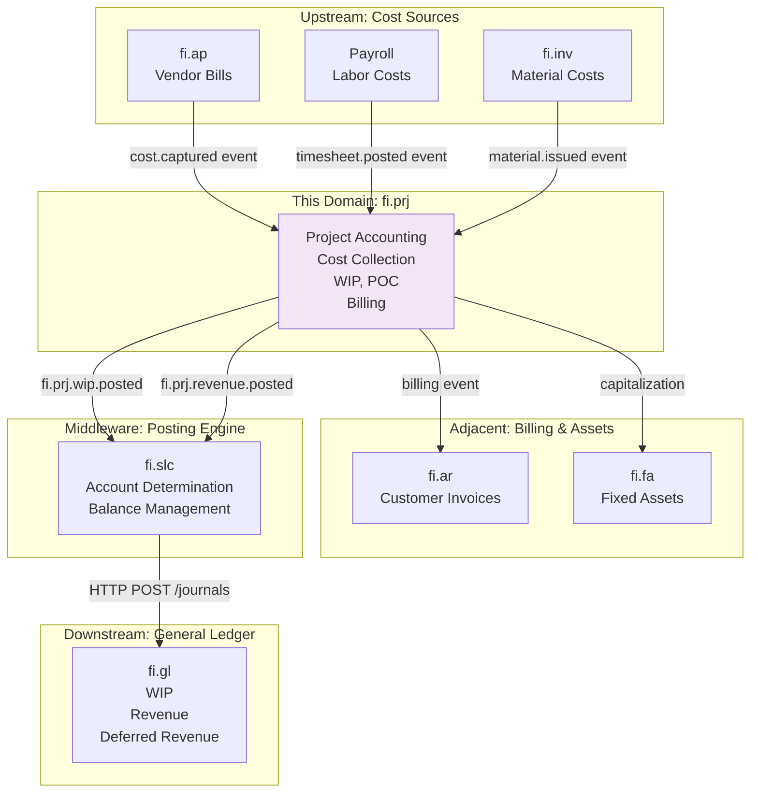
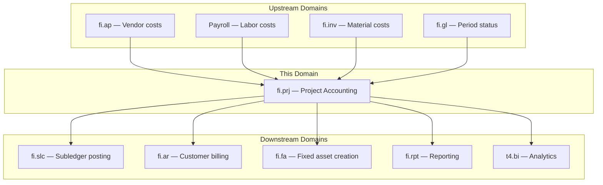
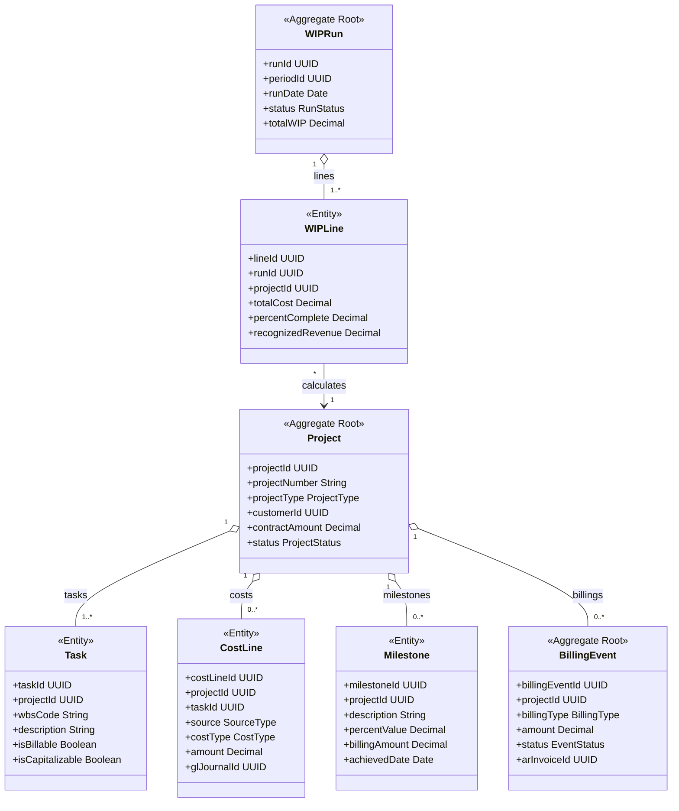
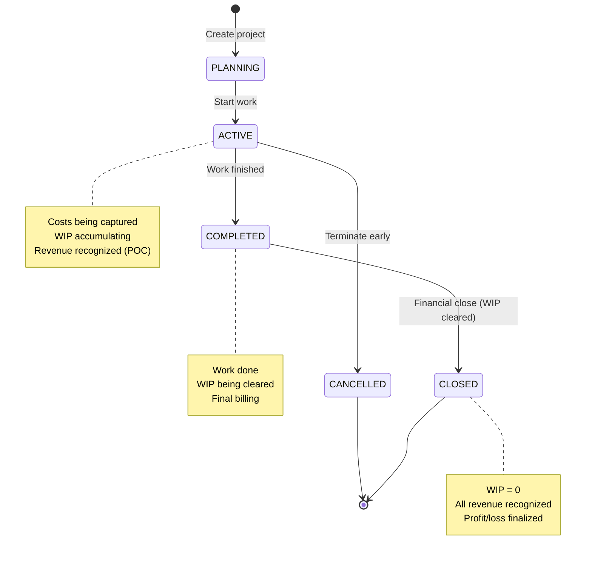
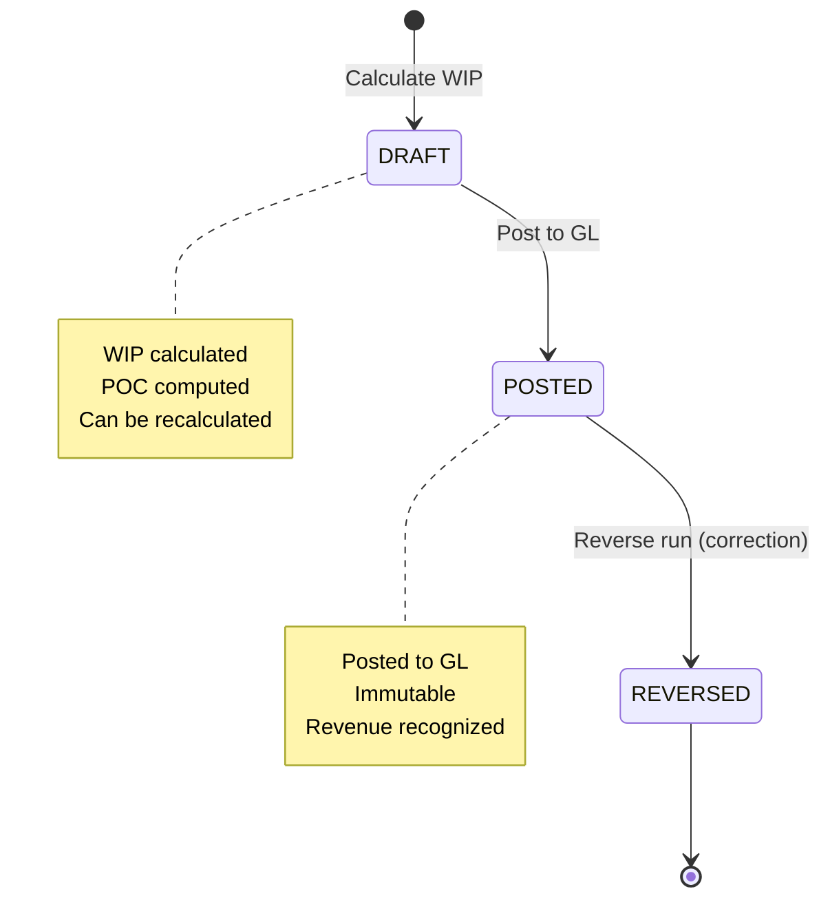
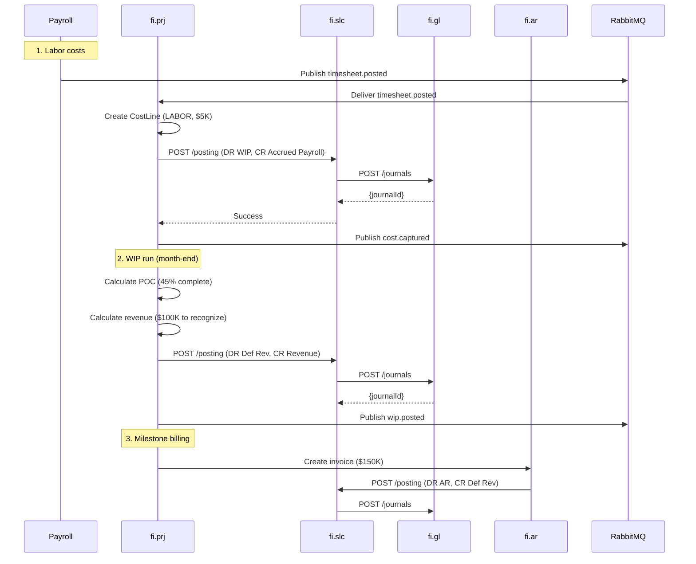
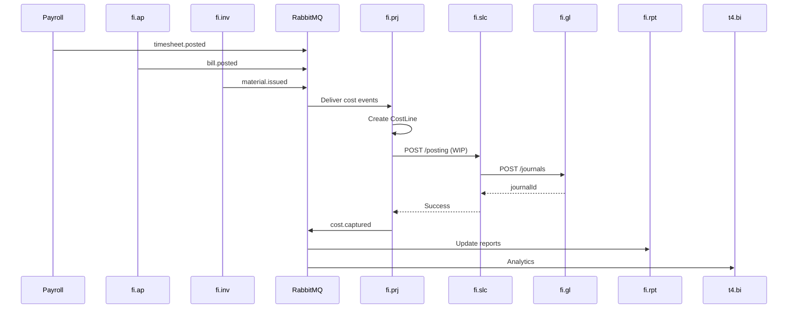
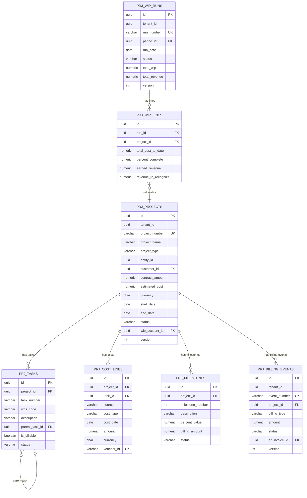

<!-- Template Meta
     Template-ID:   TPL-SVC
     Version:       1.0.0
     Last Updated:  2026-04-03
     Compliance:    ~95%
-->

# fi.prj - Project Accounting Domain / Service Specification

> **Conceptual Stack Layer:** Domain / Service
> **Space:** Platform
> **Owner:** FI Domain Engineering Team
> **Schema alignment:** `service-layer.schema.json`
> **Companion files:** `openapi.yaml`, `*.schema.json` (event contracts)
> **Referenced by:** Platform-Feature Spec SS5 (backend dependencies), BFF Contract
> **Belongs to:** FI Suite Spec (`_fi_suite.md`)

> **Meta Information**
> - **Version:** 2026-04-04
> - **Template:** `domain-service-spec.md` v1.0.0
> - **Template Compliance:** ~95% — Feature Dependency Register (§11.2) pending feature spec creation
> - **Author(s):** OpenLeap Architecture Team
> - **Status:** DRAFT
> - **Suite:** `fi`
> - **Domain:** `prj`
> - **Bounded Context Ref:** `bc:project-accounting`
> - **Service ID:** `fi-prj-svc`
> - **basePackage:** `io.openleap.fi.prj`
> - **API Base Path:** `/api/fi/prj/v1`
> - **OpenLeap Starter Version:** `v4.1.0`
> - **Port:** `8480`
> - **Repository:** `io.openleap.fi.prj`
> - **Tags:** `finance`, `project-accounting`, `wip`, `revenue-recognition`, `billing`
> - **Team:**
>   - Name: `team-fi`
>   - Email: `fi-team@openleap.io`
>   - Slack: `#fi-team`

---

## Specification Guidelines Compliance

> ### Non-Negotiables
> - Never invent facts. If required info is missing, add an **OPEN QUESTION** entry.
> - Preserve intent and decisions. Only change meaning when explicitly requested.
> - Do not remove normative constraints unless they are explicitly replaced.
> - Keep the spec **self-contained**: no "see chat", no implicit context.
>
> ### Source of Truth Priority
> When sources conflict:
> 1. Spec (explicit) wins
> 2. Starter specs (implementation constraints) next
> 3. Guidelines (best practices) last
>
> Record conflicts in the **Decisions & Conflicts** section (see Section 14).
>
> ### Style Guide
> - Prefer short sentences and lists.
> - Use MUST/SHOULD/MAY for normative statements.
> - Keep terminology consistent (Aggregate, Domain Service, Application Service, Command, Event).
> - Avoid ambiguous words ("often", "maybe") unless explicitly noting uncertainty.
> - Keep examples minimal and clearly marked as examples.
> - Do not add implementation code unless the chapter explicitly requires it.

---

## 0. Document Purpose & Scope

### 0.1 Purpose

This document specifies the **Project Accounting (fi.prj)** domain, which manages financial aspects of projects including cost collection, work-in-process (WIP) accounting, percentage-of-completion revenue recognition, project billing, and capitalization of project costs to fixed assets. It ensures accurate project profitability tracking and compliance with project accounting standards.

### 0.2 Target Audience
- Product Owners & Business Stakeholders (Finance, Project Management, Professional Services)
- System Architects & Technical Leads
- Integration Engineers
- Project Controllers and Cost Accountants
- Project Managers
- External Auditors

### 0.3 Scope

**In Scope:**
- **Project Master Data:** Projects, tasks/WBS, project types (CAPEX, OPEX, T&M, Fixed Price)
- **Cost Collection:** Capture costs from AP (vendor invoices), Payroll (labor), Inventory (materials)
- **WIP Accounting:** Work-in-process asset tracking, cost accumulation
- **Revenue Recognition Methods:** Percentage-of-Completion (POC), Completed Contract, Time & Materials
- **Project Billing:** Milestone billing, progress billing, T&M billing (integration with fi.ar)
- **Capitalization:** Transfer project costs to fixed assets (Construction-in-Progress to Fixed Assets)
- **Project Profitability:** Cost vs. revenue analysis, margin tracking
- **GL Integration:** Post WIP, revenue recognition, capitalization via fi.slc
- **Multi-Entity:** Support cross-entity projects (intercompany)

**Out of Scope:**
- Project planning and scheduling — PPM (Project Portfolio Management) system
- Resource management (capacity planning) — Resource management system
- Timesheet entry and approval — HR/Payroll system (fi.prj consumes timesheets)
- Procurement workflows — pur.procurement
- Detailed project execution — ops.projects (operational)

### 0.4 Related Documents
- `_fi_suite.md` - FI Suite architecture
- `fi_gl.md` - General Ledger specification
- `fi_slc.md` - Subledger core specification
- `fi_ar.md` - Accounts Receivable (billing)
- `fi_ap.md` - Accounts Payable (vendor costs)
- `fi_inv.md` - Inventory (material costs)
- `fi_fa.md` - Fixed Assets (capitalization)
- `fi_rvrc.md` - Revenue Recognition
- `TECHNICAL_STANDARDS.md` - Cross-cutting technical standards
- `EVENT_STANDARDS.md` - Event envelope and routing conventions

---

## 1. Business Context

### 1.1 Domain Purpose

**fi.prj** provides financial visibility and control for project-based work. Whether building construction, software implementation, consulting engagements, or R&D projects, organizations need to track costs, recognize revenue appropriately, and understand project profitability.

**Core Business Problems Solved:**
- **Project Profitability:** Is this project making money? (Cost vs. Revenue)
- **WIP Tracking:** What is the value of work-in-process?
- **Revenue Recognition:** When to recognize revenue for long-term projects?
- **Cost Allocation:** How to allocate overhead and indirect costs?
- **Billing Accuracy:** Bill customers correctly (milestones, T&M, progress)
- **Capitalization:** When to capitalize project costs as assets?
- **Project Portfolio:** Which projects are most profitable?

### 1.2 Business Value

**For the Organization:**
- **Profitability Insight:** Understand which projects/customers are profitable
- **Cash Flow:** Optimize billing schedules, reduce DSO
- **Compliance:** Meet ASC 606, IAS 11/IFRS 15 requirements
- **Cost Control:** Track project costs in real-time, prevent overruns
- **Resource Optimization:** Identify underutilized resources
- **Decision Making:** Bid on projects with confidence (historical data)

**For Users:**
- **Project Controller:** Track project costs, margins, WIP in real-time
- **Project Manager:** Understand budget vs. actual, forecast to complete
- **CFO:** Portfolio profitability, revenue forecasts
- **Revenue Accountant:** Automate POC revenue recognition
- **Auditor:** Complete audit trail from cost to revenue

### 1.3 Key Stakeholders

| Role | Responsibility | Primary Use Cases |
|------|----------------|-------------------|
| Project Controller | Project financials | Capture costs, run WIP, analyze profitability |
| Project Manager | Budget vs. actual | Monitor project performance, forecast |
| Revenue Accountant | Revenue recognition | Run POC calculations, post revenue |
| Billing Specialist | Customer invoicing | Generate milestone/progress invoices |
| CFO | Portfolio performance | Analyze project portfolio, margins |
| External Auditor | Financial audit | Verify WIP, revenue recognition |

### 1.4 Strategic Positioning

**fi.prj** sits **between** cost sources (AP, Payroll, Inventory) and revenue/assets (AR, Fixed Assets).



**Key Insight:** fi.prj aggregates costs from multiple sources and determines revenue recognition.

### 1.5 Service Context

| Property | Value |
|----------|-------|
| **Suite** | `fi` |
| **Domain** | `prj` |
| **Bounded Context** | `bc:project-accounting` |
| **Service ID** | `fi-prj-svc` |
| **Base Package** | `io.openleap.fi.prj` |

**Responsibilities:**
- Manage project master data (projects, tasks/WBS, milestones)
- Collect and allocate costs from multiple sources (AP, Payroll, Inventory)
- Calculate work-in-process (WIP) and percentage-of-completion (POC) revenue
- Generate billing events for milestone, progress, and T&M billing
- Capitalize completed CAPEX projects to fixed assets
- Post financial entries via fi.slc (WIP, revenue recognition, capitalization)

**Authoritative Sources:**
| Source Type | Description | Access Pattern |
|-------------|-------------|----------------|
| REST API | Project master data, cost lines, WIP runs, billing events | Synchronous |
| Database | Project, task, cost, WIP, milestone, billing data | Direct (owner) |
| Events | Cost captured, WIP posted, revenue posted, capitalized | Asynchronous |



---

## 2. Service Identity

| Property | Value | Schema Field |
|----------|-------|-------------|
| **Service ID** | `fi-prj-svc` | `metadata.id` |
| **Display Name** | `Project Accounting` | `metadata.name` |
| **Suite** | `fi` | `metadata.suite` |
| **Domain** | `prj` | `metadata.domain` |
| **Bounded Context** | `bc:project-accounting` | `metadata.bounded_context_ref` |
| **Version** | `1.0.0` | `metadata.version` |
| **Status** | DRAFT | `metadata.status` |
| **API Base Path** | `/api/fi/prj/v1` | `metadata.api_base_path` |
| **Repository** | `io.openleap.fi.prj` | `metadata.repository` |
| **Tags** | `finance`, `project-accounting`, `wip`, `poc`, `billing` | `metadata.tags` |

**Team:**
| Property | Value |
|----------|-------|
| **Name** | `team-fi` |
| **Email** | `fi-team@openleap.io` |
| **Slack Channel** | `#fi-team` |

---

## 3. Domain Model

### 3.1 Conceptual Overview

The project accounting domain model consists of six main pillars:

1. **Projects & Tasks:** Structure (WBS - Work Breakdown Structure)
2. **Cost Collection:** Capture costs from various sources
3. **WIP (Work-in-Process):** Accumulate project costs
4. **Revenue Recognition:** POC, Completed Contract, T&M methods
5. **Billing:** Milestone, Progress, T&M invoicing
6. **Capitalization:** Transfer WIP to Fixed Assets

**Key Principles:**
- **Cost Accumulation:** All project costs collected in WIP account
- **Matching Principle:** Match revenue with costs incurred (POC)
- **Project Types:** Different accounting for CAPEX, OPEX, Fixed Price, T&M
- **Milestone Tracking:** Revenue recognition tied to milestones
- **Profitability:** Revenue - Costs = Margin

### 3.2 Core Concepts



### 3.3 Aggregate Definitions

#### 3.3.1 Project

| Property | Value |
|----------|-------|
| **Aggregate ID** | `agg:project` |
| **Name** | `Project` |

**Business Purpose:**
Represents a customer project or internal capital project. Root for cost collection and revenue recognition. Inspired by SAP PS project definition and WBS header.

##### Aggregate Root

**Key Attributes:**

| Attribute | Type | Format | Description | Constraints | Required | Read-Only |
|-----------|------|--------|-------------|-------------|----------|-----------|
| id | string | uuid | Unique project identifier | Immutable | Yes | Yes |
| tenantId | string | uuid | Tenant ownership | Immutable | Yes | Yes |
| projectNumber | string | — | Sequential project number | max_length: 50, unique per tenant | Yes | No |
| projectName | string | — | Human-readable project name | max_length: 500 | Yes | No |
| projectType | string | — | Type of project | enum_ref: `ProjectType` | Yes | No |
| entityId | string | uuid | Legal entity | FK to entities | Yes | No |
| customerId | string | uuid | Customer for external projects | FK to customers; null for internal | No | No |
| contractAmount | number | decimal | Total contract value | precision: 19,4; required if FIXED_PRICE | No | No |
| estimatedCost | number | decimal | Estimated total cost | precision: 19,4 | No | No |
| currency | string | — | Project currency | pattern: `^[A-Z]{3}$`, ISO 4217 | Yes | No |
| startDate | string | date | Project start date | — | Yes | No |
| endDate | string | date | Planned end date | minimum: startDate | No | No |
| actualEndDate | string | date | Actual completion date | Set when COMPLETED | No | Yes |
| status | string | — | Current lifecycle state | enum_ref: `ProjectStatus` | Yes | No |
| wipAccountId | string | uuid | WIP GL account | FK to fi.gl.accounts | Yes | No |
| revenueRecMethod | string | — | Revenue recognition method | enum_ref: `RecMethod` | Yes | No |
| pocMethod | string | — | POC calculation method | enum_ref: `POCMethod`; required if revenueRecMethod = POC | No | No |
| billingMethod | string | — | How to bill customer | enum_ref: `BillingMethod` | No | No |
| isCapitalizable | boolean | — | Capitalize to FA when complete | default: false | Yes | No |
| version | integer | int64 | Optimistic locking version | — | Yes | Yes |
| createdAt | string | date-time | Creation timestamp | Auto-generated | Yes | Yes |
| updatedAt | string | date-time | Last update timestamp | Auto-generated | Yes | Yes |

**Lifecycle States:**

| Property | Value |
|----------|-------|
| **Initial State** | `PLANNING` |
| **Terminal States** | `CLOSED`, `CANCELLED` |



**State Descriptions:**

| State | Description | Business Meaning |
|-------|-------------|------------------|
| PLANNING | Initial creation state | Project is being set up; no costs can be captured yet |
| ACTIVE | Operational state | Costs are being captured, WIP accumulating, revenue recognized via POC |
| COMPLETED | Work finished | All work done; final billing and WIP clearing in progress |
| CLOSED | Financially closed | WIP = 0, all revenue recognized, profit/loss finalized; read-only |
| CANCELLED | Terminated early | Project abandoned; remaining WIP written off |

**Allowed Transitions:**

| From State | To State | Trigger | Guard / Business Preconditions |
|------------|----------|---------|-------------------------------|
| PLANNING | ACTIVE | `StartProject` command | All mandatory fields filled; WIP account valid |
| ACTIVE | COMPLETED | `CompleteProject` command | No pending cost events unprocessed |
| COMPLETED | CLOSED | `CloseProject` command | WIP = 0; all billing events invoiced or cancelled |
| ACTIVE | CANCELLED | `CancelProject` command | User has PRJ_ADMIN role |

**Invariants:**

| Rule ID | Description |
|---------|-------------|
| BR-PRJ-001 | endDate > startDate (if endDate provided) |
| BR-PRJ-002 | contractAmount required if projectType = FIXED_PRICE |
| BR-PRJ-003 | pocMethod required if revenueRecMethod = POC |

**Domain Events Emitted:**
- `fi.prj.project.created`
- `fi.prj.project.updated`
- `fi.prj.project.statusChanged`
- `fi.prj.project.capitalized`

**Project Types:**

| Type | Description | Revenue Recognition | Example |
|------|-------------|---------------------|---------|
| FIXED_PRICE | Fixed contract amount | POC or Completed Contract | Software implementation $100K |
| TIME_AND_MATERIALS | Bill based on hours/materials | As incurred | Consulting (hourly rate) |
| CAPEX | Capital expenditure | Capitalize to assets | Building construction |
| OPEX | Operating expenditure | Expense as incurred | R&D project |

**Example Scenarios:**

**Scenario 1: Fixed Price Software Implementation**
```json
{
  "projectNumber": "PRJ-2025-001",
  "projectName": "ERP Implementation for ACME Corp",
  "projectType": "FIXED_PRICE",
  "customerId": "customer-uuid",
  "contractAmount": 500000.00,
  "estimatedCost": 400000.00,
  "currency": "USD",
  "startDate": "2025-01-01",
  "endDate": "2025-12-31",
  "status": "ACTIVE",
  "revenueRecMethod": "POC",
  "pocMethod": "COST_TO_COST",
  "billingMethod": "MILESTONE"
}
```

**Scenario 2: Time & Materials Consulting**
```json
{
  "projectNumber": "PRJ-2025-002",
  "projectName": "IT Consulting Services",
  "projectType": "TIME_AND_MATERIALS",
  "customerId": "customer-uuid",
  "currency": "USD",
  "startDate": "2025-01-01",
  "status": "ACTIVE",
  "revenueRecMethod": "TIME_AND_MATERIALS",
  "billingMethod": "TIME_AND_MATERIALS"
}
```

##### Child Entities

###### Entity: Task

| Property | Value |
|----------|-------|
| **Entity ID** | `ent:task` |
| **Name** | `Task` |
| **Relationship to Root** | one_to_many |

**Business Purpose:**
Work breakdown structure (WBS) element within a project. Unit of cost allocation. Inspired by SAP PS WBS element (PRPS table).

**Attributes:**

| Attribute | Type | Format | Description | Constraints | Required |
|-----------|------|--------|-------------|-------------|----------|
| id | string | uuid | Unique identifier | Immutable | Yes |
| projectId | string | uuid | Parent project | FK to projects | Yes |
| taskNumber | string | — | Task number within project | max_length: 50, unique per project | Yes |
| wbsCode | string | — | WBS code (hierarchical) | pattern: `^\d+(\.\d+)*$`, e.g., "1.2.3" | Yes |
| description | string | — | Task description | max_length: 500 | Yes |
| parentTaskId | string | uuid | Parent task for hierarchy | FK to tasks; null for top-level | No |
| isBillable | boolean | — | Can be billed to customer | default: true | Yes |
| isCapitalizable | boolean | — | Can be capitalized to FA | default: false | Yes |
| estimatedHours | number | decimal | Estimated labor hours | precision: 10,2; minimum: 0 | No |
| estimatedCost | number | decimal | Estimated cost | precision: 19,4; minimum: 0 | No |
| actualCost | number | decimal | Actual cost to date | precision: 19,4; default: 0 | Yes |
| status | string | — | Current state | enum_ref: `TaskStatus` | Yes |

**Collection Constraints:**
- Minimum items: 1 (every project MUST have at least one task)
- Maximum items: 10000

**Invariants:**

| Rule ID | Description |
|---------|-------------|
| BR-TASK-001 | No circular parent-child references in WBS hierarchy |
| BR-TASK-002 | If parent task is not billable, child cannot be billable |

###### Entity: CostLine

| Property | Value |
|----------|-------|
| **Entity ID** | `ent:cost-line` |
| **Name** | `CostLine` |
| **Relationship to Root** | one_to_many |

**Business Purpose:**
Individual cost entry allocated to a project/task. Source of WIP accumulation. Inspired by SAP PS actual cost line items (COEP table).

**Attributes:**

| Attribute | Type | Format | Description | Constraints | Required |
|-----------|------|--------|-------------|-------------|----------|
| id | string | uuid | Unique identifier | Immutable | Yes |
| projectId | string | uuid | Parent project | FK to projects | Yes |
| taskId | string | uuid | Task allocation | FK to tasks | No |
| source | string | — | Cost source system | enum_ref: `SourceType` | Yes |
| sourceDocId | string | uuid | Source document ID (e.g., AP bill ID) | — | No |
| costType | string | — | Type of cost | enum_ref: `CostType` | Yes |
| costDate | string | date | Date cost was incurred | — | Yes |
| amount | number | decimal | Cost amount | precision: 19,4; minimum: 0 (exclusive) | Yes |
| currency | string | — | Cost currency | pattern: `^[A-Z]{3}$`, ISO 4217 | Yes |
| employeeId | string | uuid | Employee for labor costs | FK to employees | No |
| itemId | string | uuid | Inventory item for material costs | FK to items | No |
| quantity | number | decimal | Quantity consumed | precision: 19,6 | No |
| uom | string | — | Unit of measure | max_length: 10 | No |
| glJournalId | string | uuid | Posted GL journal reference | FK to fi.gl.journal_entries | No |
| voucherId | string | — | Idempotency key | max_length: 100, unique per tenant | Yes |
| dimensions | object | — | Cost dimensions (JSONB) | e.g., {"department": "IT"} | No |
| createdAt | string | date-time | Creation timestamp | Auto-generated | Yes |

**Collection Constraints:**
- Minimum items: 0
- Maximum items: unlimited

**Invariants:**

| Rule ID | Description |
|---------|-------------|
| BR-COST-001 | amount > 0 |
| BR-COST-002 | Unique constraint on (tenantId, voucherId) |

**Cost Types:**

| Type | Description | Source | Example |
|------|-------------|--------|---------|
| LABOR | Employee time | Payroll timesheets | Developer hours |
| MATERIAL | Inventory consumed | fi.inv | Steel, cement |
| SUBCONTRACTOR | Vendor services | fi.ap | External consultant |
| OVERHEAD | Indirect costs | Allocation | Office rent, utilities |

**Example Cost Capture (Labor):**
```json
{
  "projectId": "project-uuid",
  "taskId": "task-uuid",
  "source": "PAYROLL",
  "sourceDocId": "timesheet-uuid",
  "costType": "LABOR",
  "costDate": "2025-01-31",
  "amount": 5000.00,
  "currency": "USD",
  "employeeId": "employee-uuid",
  "quantity": 100.0,
  "uom": "HOURS"
}
```

**Posting:**
```
DR 1700 WIP $5,000
CR 2400 Accrued Payroll $5,000
```

###### Entity: Milestone

| Property | Value |
|----------|-------|
| **Entity ID** | `ent:milestone` |
| **Name** | `Milestone` |
| **Relationship to Root** | one_to_many |

**Business Purpose:**
Project milestone for billing and progress tracking. Used for milestone billing and POC measurement. Inspired by SAP PS milestone (MLST table).

**Attributes:**

| Attribute | Type | Format | Description | Constraints | Required |
|-----------|------|--------|-------------|-------------|----------|
| id | string | uuid | Unique identifier | Immutable | Yes |
| projectId | string | uuid | Parent project | FK to projects | Yes |
| milestoneNumber | integer | int32 | Milestone sequence | unique per project | Yes |
| description | string | — | Milestone description | max_length: 500 | Yes |
| plannedDate | string | date | Planned achievement date | — | No |
| achievedDate | string | date | Actual achievement date | Set when achieved | No |
| percentValue | number | decimal | Percentage of project completion | precision: 5,2; minimum: 0; maximum: 100 | No |
| billingAmount | number | decimal | Amount to bill when achieved | precision: 19,4; minimum: 0 | No |
| status | string | — | Current state | enum_ref: `MilestoneStatus` | Yes |

**Collection Constraints:**
- Minimum items: 0
- Maximum items: 100

**Invariants:**

| Rule ID | Description |
|---------|-------------|
| BR-MILE-001 | SUM(percentValue) for project = 100% (if using milestone-based POC) |

**Example Milestones:**
```
Project: Software Implementation

Milestone 1: Design Complete (30%, $150K billing)
Milestone 2: Development Complete (50%, $250K billing)
Milestone 3: Deployment Complete (20%, $100K billing)

Total: 100%, $500K
```

##### Value Objects

###### Value Object: Money

| Property | Value |
|----------|-------|
| **VO ID** | `vo:money` |
| **Name** | `Money` |

**Description:** Represents a monetary amount with currency. Used for contract amounts, costs, billing amounts, and WIP values.

**Attributes:**

| Attribute | Type | Format | Description | Constraints |
|-----------|------|--------|-------------|-------------|
| amount | number | decimal | Monetary amount | precision: 19,4 |
| currencyCode | string | — | ISO 4217 currency code | pattern: `^[A-Z]{3}$` |

**Validation Rules:**
- currencyCode MUST be a valid ISO 4217 code
- amount precision MUST NOT exceed 4 decimal places

###### Value Object: CostDimensions

| Property | Value |
|----------|-------|
| **VO ID** | `vo:cost-dimensions` |
| **Name** | `CostDimensions` |

**Description:** Represents additional cost dimensions for analysis and allocation (department, cost center, activity type).

**Attributes:**

| Attribute | Type | Format | Description | Constraints |
|-----------|------|--------|-------------|-------------|
| department | string | — | Department code | max_length: 50 |
| costCenter | string | — | Cost center code | max_length: 50 |
| activityType | string | — | Activity type | max_length: 50 |

**Validation Rules:**
- All fields are optional
- When provided, values MUST exist in reference data

---

#### 3.3.2 WIPRun

| Property | Value |
|----------|-------|
| **Aggregate ID** | `agg:wip-run` |
| **Name** | `WIPRun` |

**Business Purpose:**
Periodic calculation of WIP and revenue recognition. Runs monthly or quarterly. Analogous to SAP PS results analysis run (transaction KKA2).

##### Aggregate Root

**Key Attributes:**

| Attribute | Type | Format | Description | Constraints | Required | Read-Only |
|-----------|------|--------|-------------|-------------|----------|-----------|
| id | string | uuid | Unique identifier | Immutable | Yes | Yes |
| tenantId | string | uuid | Tenant ownership | Immutable | Yes | Yes |
| runNumber | string | — | Sequential run number | max_length: 50, unique per tenant | Yes | No |
| periodId | string | uuid | Fiscal period | FK to fi.gl.periods | Yes | No |
| runDate | string | date | As-of date for calculation | — | Yes | No |
| status | string | — | Current lifecycle state | enum_ref: `RunStatus` | Yes | No |
| totalWIP | number | decimal | Total WIP value across all projects | precision: 19,4; minimum: 0 | Yes | No |
| totalRevenue | number | decimal | Total revenue recognized this period | precision: 19,4; minimum: 0 | Yes | No |
| totalCost | number | decimal | Total cost to date across all projects | precision: 19,4; minimum: 0 | Yes | No |
| currency | string | — | Run currency | pattern: `^[A-Z]{3}$`, ISO 4217 | Yes | No |
| createdBy | string | uuid | User who created the run | FK to users | Yes | Yes |
| version | integer | int64 | Optimistic locking version | — | Yes | Yes |
| createdAt | string | date-time | Creation timestamp | Auto-generated | Yes | Yes |
| updatedAt | string | date-time | Last update timestamp | Auto-generated | Yes | Yes |
| postedAt | string | date-time | Posting timestamp | Set when POSTED | No | Yes |

**Lifecycle States:**

| Property | Value |
|----------|-------|
| **Initial State** | `DRAFT` |
| **Terminal States** | `REVERSED` |



**State Descriptions:**

| State | Description | Business Meaning |
|-------|-------------|------------------|
| DRAFT | Calculation complete, awaiting review | WIP/POC numbers computed but not yet posted to GL |
| POSTED | Posted to General Ledger | Revenue recognized, WIP balances updated; immutable |
| REVERSED | Correction reversal | Prior posted run reversed; new run must be created |

**Allowed Transitions:**

| From State | To State | Trigger | Guard / Business Preconditions |
|------------|----------|---------|-------------------------------|
| DRAFT | POSTED | `PostWIPRun` command | GL period is OPEN; user has PRJ_ADMIN role |
| DRAFT | DRAFT | `RecalculateWIPRun` command | Run has not been posted |
| POSTED | REVERSED | `ReverseWIPRun` command | User has PRJ_ADMIN role |

**Invariants:**

| Rule ID | Description |
|---------|-------------|
| BR-RUN-001 | One POSTED run per (tenant, periodId) |

**Domain Events Emitted:**
- `fi.prj.wipRun.created`
- `fi.prj.wipRun.posted`
- `fi.prj.wipRun.reversed`

##### Child Entities

###### Entity: WIPLine

| Property | Value |
|----------|-------|
| **Entity ID** | `ent:wip-line` |
| **Name** | `WIPLine` |
| **Relationship to Root** | one_to_many |

**Business Purpose:**
Per-project calculation within a WIP run. One line per active project. Contains POC calculation details.

**Attributes:**

| Attribute | Type | Format | Description | Constraints | Required |
|-----------|------|--------|-------------|-------------|----------|
| id | string | uuid | Unique identifier | Immutable | Yes |
| runId | string | uuid | Parent WIP run | FK to wip_runs | Yes |
| projectId | string | uuid | Project being calculated | FK to projects | Yes |
| totalCostToDate | number | decimal | Cumulative project cost | precision: 19,4; minimum: 0 | Yes |
| percentComplete | number | decimal | Completion percentage | precision: 5,2; minimum: 0; maximum: 100 | Yes |
| estimatedTotalCost | number | decimal | Revised total cost estimate | precision: 19,4; minimum: 0 (exclusive) | Yes |
| contractAmount | number | decimal | Contract value | precision: 19,4; required for Fixed Price | No |
| earnedRevenue | number | decimal | Revenue earned (POC) | precision: 19,4; minimum: 0 | Yes |
| billedToDate | number | decimal | Total invoiced to date | precision: 19,4; minimum: 0 | Yes |
| revenueToRecognize | number | decimal | Current period revenue recognition | precision: 19,4 | Yes |
| deferredRevenue | number | decimal | Billed but not yet earned | precision: 19,4; minimum: 0 | Yes |
| accruedRevenue | number | decimal | Earned but not yet billed | precision: 19,4; minimum: 0 | Yes |
| glJournalId | string | uuid | Posted GL journal reference | FK to fi.gl.journal_entries | No |

**Collection Constraints:**
- Minimum items: 1 (a WIP run must have at least one line)
- Maximum items: 10000

**Invariants:**

| Rule ID | Description |
|---------|-------------|
| BR-LINE-001 | 0 <= percentComplete <= 100 |
| BR-LINE-002 | earnedRevenue = contractAmount x (percentComplete / 100) for POC projects |

**POC Calculation (Cost-to-Cost Method):**
```
Percent Complete = Total Cost to Date / Estimated Total Cost
Earned Revenue = Contract Amount x Percent Complete
Revenue to Recognize = Earned Revenue - Previously Recognized Revenue
```

**Example POC Calculation:**
```
Project: $500K contract, $400K estimated cost

Month 1:
  Costs incurred: $100K
  Percent complete: $100K / $400K = 25%
  Earned revenue: $500K x 25% = $125K
  Revenue to recognize: $125K - $0 = $125K
  
Month 2:
  Costs incurred: $80K (total $180K)
  Percent complete: $180K / $400K = 45%
  Earned revenue: $500K x 45% = $225K
  Revenue to recognize: $225K - $125K = $100K
```

##### Value Objects

(WIPRun uses shared type `Money` for monetary fields.)

---

#### 3.3.3 BillingEvent

| Property | Value |
|----------|-------|
| **Aggregate ID** | `agg:billing-event` |
| **Name** | `BillingEvent` |

**Business Purpose:**
Triggers customer invoice creation. Link between project accounting and fi.ar. Inspired by SAP PS billing plan (FPLA/FPLR tables).

##### Aggregate Root

**Key Attributes:**

| Attribute | Type | Format | Description | Constraints | Required | Read-Only |
|-----------|------|--------|-------------|-------------|----------|-----------|
| id | string | uuid | Unique identifier | Immutable | Yes | Yes |
| tenantId | string | uuid | Tenant ownership | Immutable | Yes | Yes |
| eventNumber | string | — | Sequential billing event number | max_length: 50, unique per tenant | Yes | No |
| projectId | string | uuid | Parent project | FK to projects | Yes | No |
| billingType | string | — | Type of billing | enum_ref: `BillingType` | Yes | No |
| billingDate | string | date | Date of billing | — | Yes | No |
| amount | number | decimal | Billing amount | precision: 19,4; minimum: 0 (exclusive) | Yes | No |
| currency | string | — | Billing currency | pattern: `^[A-Z]{3}$`, ISO 4217 | Yes | No |
| description | string | — | Billing description | max_length: 500 | Yes | No |
| milestoneId | string | uuid | Related milestone | FK to milestones; required if billingType = MILESTONE | No | No |
| status | string | — | Current state | enum_ref: `EventStatus` | Yes | No |
| arInvoiceId | string | uuid | Generated AR invoice reference | FK to fi.ar.invoices | No | Yes |
| version | integer | int64 | Optimistic locking version | — | Yes | Yes |
| createdAt | string | date-time | Creation timestamp | Auto-generated | Yes | Yes |
| updatedAt | string | date-time | Last update timestamp | Auto-generated | Yes | Yes |

**Lifecycle States:**

| Property | Value |
|----------|-------|
| **Initial State** | `PENDING` |
| **Terminal States** | `INVOICED`, `CANCELLED` |

**State Descriptions:**

| State | Description | Business Meaning |
|-------|-------------|------------------|
| PENDING | Billing event created | Awaiting invoice generation in fi.ar |
| INVOICED | AR invoice created | Customer has been billed; arInvoiceId populated |
| CANCELLED | Billing cancelled | Event voided; no invoice generated |

**Allowed Transitions:**

| From State | To State | Trigger | Guard / Business Preconditions |
|------------|----------|---------|-------------------------------|
| PENDING | INVOICED | `InvoiceBillingEvent` command | fi.ar invoice creation succeeds |
| PENDING | CANCELLED | `CancelBillingEvent` command | User has PRJ_ADMIN role |

**Invariants:**

| Rule ID | Description |
|---------|-------------|
| BR-BILL-001 | amount > 0 |
| BR-BILL-002 | milestoneId required if billingType = MILESTONE |

**Domain Events Emitted:**
- `fi.prj.billingEvent.created`
- `fi.prj.billingEvent.invoiced`
- `fi.prj.billingEvent.cancelled`

**Billing Types:**

| Type | Description | When Used | Example |
|------|-------------|-----------|---------|
| MILESTONE | Bill when milestone achieved | Fixed price projects | Design phase complete, bill $150K |
| PROGRESS | Bill based on % complete | Fixed price projects | 25% complete, bill $125K |
| TIME_AND_MATERIALS | Bill based on hours/materials | T&M projects | 100 hours @ $150/hr = $15K |

---

### 3.4 Enumerations

#### ProjectType

**Description:** Classification of project for accounting treatment.

| Value | Description | Deprecated |
|-------|-------------|------------|
| `FIXED_PRICE` | Fixed contract amount; revenue via POC or completed contract | No |
| `TIME_AND_MATERIALS` | Billed based on hours and materials consumed | No |
| `CAPEX` | Capital expenditure; costs capitalized to fixed assets | No |
| `OPEX` | Operating expenditure; costs expensed as incurred | No |

#### ProjectStatus

**Description:** Lifecycle state of a project.

| Value | Description | Deprecated |
|-------|-------------|------------|
| `PLANNING` | Project is being set up; no cost capture allowed | No |
| `ACTIVE` | Project is operational; costs captured, WIP accumulates | No |
| `COMPLETED` | Work is finished; final billing and WIP clearing | No |
| `CLOSED` | Financially closed; WIP = 0, all revenue recognized | No |
| `CANCELLED` | Project terminated early; WIP written off | No |

#### TaskStatus

**Description:** Lifecycle state of a WBS task.

| Value | Description | Deprecated |
|-------|-------------|------------|
| `NOT_STARTED` | Task has not begun | No |
| `IN_PROGRESS` | Task is actively being worked | No |
| `COMPLETED` | Task work is finished | No |

#### SourceType

**Description:** Origin system of a cost line.

| Value | Description | Deprecated |
|-------|-------------|------------|
| `AP` | Vendor invoice from fi.ap | No |
| `PAYROLL` | Labor cost from payroll/timesheets | No |
| `INVENTORY` | Material cost from fi.inv | No |
| `MANUAL` | Manual cost entry by user | No |

#### CostType

**Description:** Classification of project cost.

| Value | Description | Deprecated |
|-------|-------------|------------|
| `LABOR` | Employee time and labor | No |
| `MATERIAL` | Physical materials consumed | No |
| `SUBCONTRACTOR` | External vendor services | No |
| `OVERHEAD` | Indirect/allocated costs | No |

#### RecMethod

**Description:** Revenue recognition method for the project.

| Value | Description | Deprecated |
|-------|-------------|------------|
| `POC` | Percentage-of-Completion (ASC 606 over time) | No |
| `COMPLETED_CONTRACT` | Recognize at project completion (ASC 606 point in time) | No |
| `TIME_AND_MATERIALS` | Recognize as services are rendered | No |

#### POCMethod

**Description:** Method for calculating percentage of completion.

| Value | Description | Deprecated |
|-------|-------------|------------|
| `COST_TO_COST` | % = Actual Cost / Estimated Total Cost | No |
| `UNITS_OF_DELIVERY` | % = Units Delivered / Total Units | No |
| `LABOR_HOURS` | % = Actual Hours / Estimated Total Hours | No |

#### BillingMethod

**Description:** How the customer is billed.

| Value | Description | Deprecated |
|-------|-------------|------------|
| `MILESTONE` | Bill upon milestone achievement | No |
| `PROGRESS` | Bill based on percentage complete | No |
| `TIME_AND_MATERIALS` | Bill based on hours and materials consumed | No |

#### BillingType

**Description:** Type classification of a billing event.

| Value | Description | Deprecated |
|-------|-------------|------------|
| `MILESTONE` | Milestone-triggered billing | No |
| `PROGRESS` | Progress-based billing | No |
| `TIME_AND_MATERIALS` | Time and materials billing | No |

#### RunStatus

**Description:** Lifecycle state of a WIP run.

| Value | Description | Deprecated |
|-------|-------------|------------|
| `DRAFT` | Calculated, awaiting review and posting | No |
| `POSTED` | Posted to General Ledger | No |
| `REVERSED` | Posted run has been reversed | No |

#### EventStatus

**Description:** Lifecycle state of a billing event.

| Value | Description | Deprecated |
|-------|-------------|------------|
| `PENDING` | Awaiting invoice generation | No |
| `INVOICED` | AR invoice created | No |
| `CANCELLED` | Billing cancelled | No |

#### MilestoneStatus

**Description:** Lifecycle state of a project milestone.

| Value | Description | Deprecated |
|-------|-------------|------------|
| `PENDING` | Milestone not yet achieved | No |
| `ACHIEVED` | Milestone achieved, awaiting billing | No |
| `BILLED` | Milestone billed to customer | No |

### 3.5 Shared Types

#### Money

| Property | Value |
|----------|-------|
| **Type ID** | `type:money` |
| **Name** | `Money` |

**Description:** Monetary amount with currency. Standard financial value representation.

**Attributes:**

| Attribute | Type | Format | Description | Constraints |
|-----------|------|--------|-------------|-------------|
| amount | number | decimal | Monetary value | precision: 19,4 |
| currencyCode | string | — | ISO 4217 currency code | pattern: `^[A-Z]{3}$` |

**Validation Rules:**
- amount precision MUST NOT exceed 4 decimal places
- currencyCode MUST be a valid, active ISO 4217 code

**Used By:**
- `agg:project` (contractAmount, estimatedCost)
- `agg:wip-run` (totalWIP, totalRevenue, totalCost)
- `agg:billing-event` (amount)

---

## 4. Business Rules & Constraints

### 4.1 Business Rules Catalog

| ID | Rule Name | Description | Scope | Enforcement | Error Code |
|----|-----------|-------------|-------|-------------|------------|
| BR-PRJ-001 | Date Sequence | endDate > startDate | Project | Create/Update | `PRJ_DATE_INVALID` |
| BR-PRJ-002 | Contract Amount Required | Fixed Price needs contract amount | Project | Create | `PRJ_CONTRACT_REQUIRED` |
| BR-PRJ-003 | POC Method Required | POC revenue needs POC method | Project | Create | `PRJ_POC_METHOD_REQUIRED` |
| BR-TASK-001 | WBS Hierarchy | No circular references | Task | Create/Update | `TASK_CIRCULAR_REF` |
| BR-TASK-002 | Billability Consistency | Child inherits parent non-billable | Task | Create | `TASK_BILLABILITY_INVALID` |
| BR-COST-001 | Positive Amount | Cost amount > 0 | CostLine | Create | `COST_AMOUNT_INVALID` |
| BR-COST-002 | Idempotency | Unique voucherId per tenant | CostLine | Create | `COST_DUPLICATE_VOUCHER` |
| BR-RUN-001 | Period Uniqueness | One posted run per period | WIPRun | Post | `WIP_PERIOD_DUPLICATE` |
| BR-LINE-001 | POC Range | 0 <= percentComplete <= 100 | WIPLine | Calculate | `WIP_POC_RANGE_INVALID` |
| BR-LINE-002 | Revenue Recognition | Earned = Contract x % Complete | WIPLine | Calculate | `WIP_REVENUE_MISMATCH` |
| BR-MILE-001 | Percent Sum | Milestones sum to 100% | Milestone | Validate | `MILE_PERCENT_SUM_INVALID` |
| BR-BILL-001 | Billing Amount Positive | Billing amount > 0 | BillingEvent | Create | `BILL_AMOUNT_INVALID` |
| BR-BILL-002 | Milestone Required | milestoneId required for MILESTONE billing | BillingEvent | Create | `BILL_MILESTONE_REQUIRED` |

### 4.2 Detailed Rule Definitions

#### BR-PRJ-001: Date Sequence

**Business Context:** Projects have a logical duration. The end date cannot precede the start date.

**Rule Statement:** If endDate is provided, endDate MUST be after startDate.

**Applies To:**
- Aggregate: Project
- Operations: Create, Update

**Enforcement:** CHECK constraint in database; validated in domain object.

**Validation Logic:** `endDate == null || endDate > startDate`

**Error Handling:**
- **Error Code:** `PRJ_DATE_INVALID`
- **Error Message:** "Project end date must be after start date"
- **User action:** Correct the end date to be after the start date

**Examples:**
- **Valid:** startDate = 2025-01-01, endDate = 2025-12-31
- **Invalid:** startDate = 2025-06-01, endDate = 2025-01-01

#### BR-PRJ-002: Contract Amount Required

**Business Context:** Fixed Price projects require a known contract amount for POC revenue recognition calculation.

**Rule Statement:** If projectType = FIXED_PRICE, contractAmount MUST be provided and > 0.

**Applies To:**
- Aggregate: Project
- Operations: Create

**Enforcement:** Validation in command handler.

**Validation Logic:** `projectType != 'FIXED_PRICE' || (contractAmount != null && contractAmount > 0)`

**Error Handling:**
- **Error Code:** `PRJ_CONTRACT_REQUIRED`
- **Error Message:** "Fixed Price projects require a contract amount"
- **User action:** Provide the contract amount or change the project type

**Examples:**
- **Valid:** projectType = FIXED_PRICE, contractAmount = 500000.00
- **Invalid:** projectType = FIXED_PRICE, contractAmount = null

#### BR-PRJ-003: POC Method Required

**Business Context:** POC revenue recognition requires a specific calculation method to determine percentage of completion.

**Rule Statement:** If revenueRecMethod = POC, pocMethod MUST be provided.

**Applies To:**
- Aggregate: Project
- Operations: Create

**Enforcement:** Validation in command handler.

**Validation Logic:** `revenueRecMethod != 'POC' || pocMethod != null`

**Error Handling:**
- **Error Code:** `PRJ_POC_METHOD_REQUIRED`
- **Error Message:** "POC revenue recognition requires a POC method (COST_TO_COST, UNITS_OF_DELIVERY, or LABOR_HOURS)"
- **User action:** Select a POC method

**Examples:**
- **Valid:** revenueRecMethod = POC, pocMethod = COST_TO_COST
- **Invalid:** revenueRecMethod = POC, pocMethod = null

#### BR-TASK-001: WBS Hierarchy

**Business Context:** WBS elements form a tree structure. Circular references would corrupt the hierarchy.

**Rule Statement:** A task's parentTaskId MUST NOT create a circular reference in the WBS tree.

**Applies To:**
- Aggregate: Project (Task entity)
- Operations: Create, Update

**Enforcement:** Cycle detection algorithm on parentTaskId chain.

**Validation Logic:** Traverse parentTaskId chain; MUST NOT encounter the current taskId.

**Error Handling:**
- **Error Code:** `TASK_CIRCULAR_REF`
- **Error Message:** "WBS hierarchy contains a circular reference"
- **User action:** Choose a different parent task

**Examples:**
- **Valid:** Task A -> Task B -> Task C (linear)
- **Invalid:** Task A -> Task B -> Task A (circular)

#### BR-COST-002: Idempotency

**Business Context:** Cost events from upstream systems (payroll, AP, inventory) may be delivered more than once. Duplicate costs would inflate WIP.

**Rule Statement:** Each (tenantId, voucherId) combination MUST be unique.

**Applies To:**
- Aggregate: Project (CostLine entity)
- Operations: Create

**Enforcement:** Unique constraint in database per ADR-014 (at-least-once delivery).

**Validation Logic:** `UNIQUE(tenant_id, voucher_id)` constraint.

**Error Handling:**
- **Error Code:** `COST_DUPLICATE_VOUCHER`
- **Error Message:** "Duplicate cost entry: voucherId already exists for this tenant"
- **User action:** This is typically an automated retry; the duplicate is safely rejected

**Examples:**
- **Valid:** First cost line with voucherId = "TS-2025-001-EMP123"
- **Invalid:** Second cost line with same voucherId for same tenant

#### BR-RUN-001: Period Uniqueness

**Business Context:** Double-posting revenue in the same period would overstate financial results. Only one posted WIP run is allowed per fiscal period.

**Rule Statement:** Only one WIPRun with status = POSTED is allowed per (tenantId, periodId).

**Applies To:**
- Aggregate: WIPRun
- Operations: Post (status transition)

**Enforcement:** Unique partial index on (tenant_id, period_id) WHERE status = 'POSTED'.

**Validation Logic:** No existing POSTED run for the same tenant and period.

**Error Handling:**
- **Error Code:** `WIP_PERIOD_DUPLICATE`
- **Error Message:** "A WIP run has already been posted for this period. Reverse the existing run first."
- **User action:** Reverse the existing posted run before posting a new one

**Examples:**
- **Valid:** First posted run for period 2025-01
- **Invalid:** Second posted run for period 2025-01 (without reversing the first)

#### BR-MILE-001: Percent Sum

**Business Context:** Milestones represent a complete breakdown of project work. Their percentages must total 100% for POC calculation to work correctly.

**Rule Statement:** For projects using milestone-based POC, SUM(milestone.percentValue) MUST equal 100.

**Applies To:**
- Aggregate: Project (Milestone entity)
- Operations: Validate (on project activation)

**Enforcement:** Validation when transitioning project to ACTIVE status.

**Validation Logic:** `SUM(milestones.percentValue WHERE projectId = X) == 100.0`

**Error Handling:**
- **Error Code:** `MILE_PERCENT_SUM_INVALID`
- **Error Message:** "Milestone percentages must sum to 100%. Current sum: {sum}%"
- **User action:** Adjust milestone percentages to total 100%

**Examples:**
- **Valid:** 30% + 50% + 20% = 100%
- **Invalid:** 30% + 50% = 80% (incomplete)

### 4.3 Data Validation Rules

**Field-Level Validations:**

| Field | Validation Rule | Error Message |
|-------|----------------|---------------|
| projectName | Required, max 500 chars | "Project name is required and cannot exceed 500 characters" |
| projectNumber | Required, max 50 chars | "Project number is required and cannot exceed 50 characters" |
| projectType | Required, must be valid enum | "Project type is required and must be one of: FIXED_PRICE, TIME_AND_MATERIALS, CAPEX, OPEX" |
| currency | Required, ISO 4217 pattern | "Currency must be a valid 3-letter ISO 4217 code" |
| startDate | Required, valid date | "Start date is required" |
| contractAmount | precision 19,4 | "Contract amount must not exceed 19 digits with 4 decimal places" |
| wbsCode | Required, matches `^\d+(\.\d+)*$` | "WBS code must follow hierarchical format (e.g., 1.2.3)" |
| amount (CostLine) | Required, > 0 | "Cost amount must be positive" |
| voucherId | Required, max 100 chars | "Voucher ID is required for idempotency" |
| percentComplete | 0 <= value <= 100 | "Percent complete must be between 0 and 100" |

**Cross-Field Validations:**
- If `endDate` is provided, it MUST be after `startDate`
- If `projectType` = FIXED_PRICE, `contractAmount` MUST be provided and > 0
- If `revenueRecMethod` = POC, `pocMethod` MUST be provided
- If `billingType` = MILESTONE, `milestoneId` MUST be provided
- `actualEndDate` MAY only be set when `status` = COMPLETED or later

### 4.4 Reference Data Dependencies

**Required Reference Data:**

| Catalog | Source Service | Fields Referencing | Validation |
|---------|----------------|-------------------|------------|
| Currencies (ISO 4217) | ref-data-svc | currency (Project, CostLine, BillingEvent, WIPRun) | Must exist and be active |
| Legal Entities | ref-data-svc | entityId (Project) | Must exist |
| GL Accounts | fi-gl-svc | wipAccountId (Project) | Must exist and be active posting account |
| Fiscal Periods | fi-gl-svc | periodId (WIPRun) | Must exist; must be OPEN for posting |
| Customers | bp-svc | customerId (Project) | Must exist (if provided) |
| Employees | hr-svc | employeeId (CostLine) | Must exist (if provided) |
| Items | fi-inv-svc | itemId (CostLine) | Must exist (if provided) |

---

## 5. Use Cases

> This section defines explicit use cases (WRITE/READ), mapping to domain operations/services.
> Each use case MUST follow the canonical format for code generation.

### 5.1 Business Logic Placement

| Logic Type | Placement | Examples |
|------------|-----------|----------|
| Aggregate invariants | Domain Object | Date validation, status transitions, amount checks |
| Cross-aggregate logic | Domain Service | POC calculation across WIPLine + Project + CostLine |
| Orchestration & transactions | Application Service | Cost capture (create CostLine + post to SLC + publish event) |

### 5.2 Use Cases (Canonical Format)

#### UC-PRJ-001: CreateProject

| Field | Value |
|-------|-------|
| **id** | `CreateProject` |
| **type** | WRITE |
| **trigger** | REST |
| **aggregate** | `Project` |
| **domainOperation** | `Project.create` |
| **inputs** | `projectName: String`, `projectType: ProjectType`, `entityId: UUID`, `customerId: UUID?`, `contractAmount: Decimal?`, `estimatedCost: Decimal?`, `currency: String`, `startDate: Date`, `endDate: Date?`, `revenueRecMethod: RecMethod`, `pocMethod: POCMethod?`, `billingMethod: BillingMethod?`, `wipAccountId: UUID`, `isCapitalizable: Boolean` |
| **outputs** | `project: Project` |
| **events** | `fi.prj.project.created` |
| **rest** | `POST /api/fi/prj/v1/projects` |
| **idempotency** | none |
| **errors** | `PRJ_CONTRACT_REQUIRED`, `PRJ_POC_METHOD_REQUIRED` |

**Actor:** Project Administrator (PRJ_ADMIN)

**Preconditions:**
- User has PRJ_ADMIN role
- Referenced entityId, customerId, wipAccountId exist

**Main Flow:**
1. Actor submits project creation request
2. System validates all business rules (BR-PRJ-001, BR-PRJ-002, BR-PRJ-003)
3. System generates projectNumber
4. System creates Project in PLANNING status
5. System publishes `fi.prj.project.created` event

**Postconditions:**
- Project exists in PLANNING status
- Project number assigned

**Business Rules Applied:**
- BR-PRJ-001: Date Sequence
- BR-PRJ-002: Contract Amount Required
- BR-PRJ-003: POC Method Required

**Alternative Flows:**
- **Alt-1:** If projectType = CAPEX, isCapitalizable defaults to true

**Exception Flows:**
- **Exc-1:** If contractAmount missing for FIXED_PRICE, return 422 with PRJ_CONTRACT_REQUIRED

---

#### UC-PRJ-002: CaptureLaborCost

| Field | Value |
|-------|-------|
| **id** | `CaptureLaborCost` |
| **type** | WRITE |
| **trigger** | Message |
| **aggregate** | `Project` |
| **domainOperation** | `Project.captureCost` |
| **inputs** | `projectId: UUID`, `taskId: UUID?`, `source: SourceType`, `costType: CostType`, `costDate: Date`, `amount: Decimal`, `currency: String`, `employeeId: UUID?`, `voucherId: String` |
| **outputs** | `costLine: CostLine` |
| **events** | `fi.prj.cost.captured` |
| **rest** | `POST /api/fi/prj/v1/costs/capture` |
| **idempotency** | required |
| **errors** | `PROJECT_NOT_ACTIVE`, `COST_AMOUNT_INVALID`, `COST_DUPLICATE_VOUCHER` |

**Actor:** System (automated, triggered by payroll event) or PRJ_POSTER

**Preconditions:**
- Project exists and is in ACTIVE status
- Employee timesheet approved (for labor costs)
- GL period is OPEN

**Main Flow:**
1. Payroll system posts timesheet (payroll.timesheet.posted event)
2. System consumes event
3. Event payload:
   ```json
   {
     "timesheetId": "ts-uuid",
     "employeeId": "emp-uuid",
     "periodStart": "2025-01-01",
     "periodEnd": "2025-01-31",
     "lines": [
       {
         "projectId": "project-uuid",
         "taskId": "task-uuid",
         "hours": 100.0,
         "amount": 5000.00
       }
     ]
   }
   ```
4. System creates CostLine:
   - source = PAYROLL
   - costType = LABOR
   - amount = $5,000
5. System calls fi.slc POST /posting:
   - eventType: fi.prj.cost.captured
   - DR 1700 WIP $5,000
   - CR 2400 Accrued Payroll $5,000
6. System updates CostLine: glJournalId
7. System updates Project/Task: actualCost += $5,000
8. System publishes fi.prj.cost.captured event

**Postconditions:**
- Cost captured in project
- WIP increased
- GL journal posted
- Event published

**Business Rules Applied:**
- BR-COST-001: Positive Amount
- BR-COST-002: Idempotency

**Alternative Flows:**
- **Alt-1:** If triggered via REST (manual cost entry), source = MANUAL

**Exception Flows:**
- **Exc-1:** If project not ACTIVE, reject with PROJECT_NOT_ACTIVE
- **Exc-2:** If duplicate voucherId, reject silently (idempotent)

---

#### UC-PRJ-003: RunWIPAndPOC

| Field | Value |
|-------|-------|
| **id** | `RunWIPAndPOC` |
| **type** | WRITE |
| **trigger** | REST |
| **aggregate** | `WIPRun` |
| **domainOperation** | `WIPRun.calculate` |
| **inputs** | `periodId: UUID`, `runDate: Date`, `simulate: Boolean` |
| **outputs** | `wipRun: WIPRun` |
| **events** | `fi.prj.wipRun.created` |
| **rest** | `POST /api/fi/prj/v1/wip/runs` |
| **idempotency** | none |
| **errors** | `WIP_PERIOD_DUPLICATE` |

**Actor:** Project Controller (PRJ_ADMIN)

**Preconditions:**
- Active projects exist
- Costs captured for period
- GL period OPEN

**Main Flow:**
1. User triggers WIP run (POST /wip/runs)
2. System creates WIPRun (status = DRAFT)
3. System queries all ACTIVE projects
4. For each project (Fixed Price, POC method):
   a. Calculate total cost to date: SUM(costLines.amount) = $180K
   b. Retrieve estimated total cost: $400K
   c. Calculate percent complete: $180K / $400K = 45%
   d. Retrieve contract amount: $500K
   e. Calculate earned revenue: $500K x 45% = $225K
   f. Retrieve previously recognized: $125K (from prior runs)
   g. Calculate revenue to recognize: $225K - $125K = $100K
   h. Create WIPLine with calculations
5. System aggregates totals for run
6. System publishes `fi.prj.wipRun.created` event

**Postconditions:**
- WIPRun created in DRAFT status
- WIPLines calculated for all active projects

**Business Rules Applied:**
- BR-LINE-001: POC Range
- BR-LINE-002: Revenue Recognition

**Alternative Flows:**
- **Alt-1:** If simulate = true, calculate but do not persist

**Exception Flows:**
- **Exc-1:** If no active projects, create empty run with totalWIP = 0

---

#### UC-PRJ-004: PostWIPRun

| Field | Value |
|-------|-------|
| **id** | `PostWIPRun` |
| **type** | WRITE |
| **trigger** | REST |
| **aggregate** | `WIPRun` |
| **domainOperation** | `WIPRun.post` |
| **inputs** | `runId: UUID` |
| **outputs** | `wipRun: WIPRun` |
| **events** | `fi.prj.wipRun.posted` |
| **rest** | `POST /api/fi/prj/v1/wip/runs/{id}:post` |
| **idempotency** | none |
| **errors** | `WIP_PERIOD_DUPLICATE`, `PERIOD_CLOSED` |

**Actor:** Project Controller (PRJ_ADMIN)

**Preconditions:**
- WIPRun exists in DRAFT status
- GL period is OPEN
- No other POSTED run for this period

**Main Flow:**
1. User reviews WIPRun (DRAFT), then posts
2. For each WIPLine with revenueToRecognize > 0:
   a. System calls fi.slc POST /posting:
      - eventType: fi.prj.revenue.posted
      - DR 2500 Deferred Revenue $100K (or DR 1210 Accrued Revenue if not billed)
      - CR 4000 Revenue $100K
   b. System updates WIPLine: glJournalId
3. System updates WIPRun: status = POSTED, postedAt = now()
4. System publishes fi.prj.wipRun.posted event

**Postconditions:**
- WIP run posted
- Revenue recognized (POC)
- GL journals created
- Events published

**Business Rules Applied:**
- BR-RUN-001: Period Uniqueness

**Exception Flows:**
- **Exc-1:** If GL period is closed, return 403 PERIOD_CLOSED
- **Exc-2:** If fi.slc posting fails, rollback; run remains DRAFT

---

#### UC-PRJ-005: CreateMilestoneBilling

| Field | Value |
|-------|-------|
| **id** | `CreateMilestoneBilling` |
| **type** | WRITE |
| **trigger** | REST |
| **aggregate** | `BillingEvent` |
| **domainOperation** | `BillingEvent.create` |
| **inputs** | `projectId: UUID`, `billingType: BillingType`, `milestoneId: UUID?`, `amount: Decimal`, `currency: String`, `description: String`, `billingDate: Date` |
| **outputs** | `billingEvent: BillingEvent` |
| **events** | `fi.prj.billingEvent.created` |
| **rest** | `POST /api/fi/prj/v1/billing/events` |
| **idempotency** | none |
| **errors** | `BILL_AMOUNT_INVALID`, `BILL_MILESTONE_REQUIRED` |

**Actor:** Billing Specialist (PRJ_POSTER)

**Preconditions:**
- Project milestone achieved (for MILESTONE billing)
- User has PRJ_POSTER role

**Main Flow:**
1. User marks milestone as achieved
2. System updates Milestone: achievedDate = today, status = ACHIEVED
3. User creates billing event (POST /billing/events)
4. System creates BillingEvent (status = PENDING)
5. System calls fi.ar POST /invoices:
   ```json
   {
     "customerId": "customer-uuid",
     "invoiceDate": "2025-03-31",
     "lines": [
       {
         "description": "Design Phase Complete - Milestone 1",
         "amount": 150000.00,
         "projectId": "project-uuid"
       }
     ]
   }
   ```
6. fi.ar creates invoice
7. fi.ar posts invoice:
   - DR 1200 AR $150K
   - CR 2500 Deferred Revenue $150K
8. System updates BillingEvent:
   - status = INVOICED
   - arInvoiceId = invoice ID
9. System updates Milestone: status = BILLED
10. System publishes fi.prj.billingEvent.invoiced event

**Postconditions:**
- Customer invoiced
- Deferred revenue created
- Billing event recorded

**Business Rules Applied:**
- BR-BILL-001: Billing Amount Positive
- BR-BILL-002: Milestone Required

**Alternative Flows:**
- **Alt-1:** For PROGRESS billing, amount derived from current % complete

**Exception Flows:**
- **Exc-1:** If fi.ar invoice creation fails, BillingEvent remains PENDING; retry later

---

#### UC-PRJ-006: CapitalizeProject

| Field | Value |
|-------|-------|
| **id** | `CapitalizeProject` |
| **type** | WRITE |
| **trigger** | REST |
| **aggregate** | `Project` |
| **domainOperation** | `Project.capitalize` |
| **inputs** | `projectId: UUID` |
| **outputs** | `project: Project` |
| **events** | `fi.prj.project.capitalized` |
| **rest** | `POST /api/fi/prj/v1/projects/{id}:capitalize` |
| **idempotency** | none |
| **errors** | `PROJECT_NOT_CAPITALIZABLE`, `PROJECT_NOT_COMPLETED` |

**Actor:** Project Controller (PRJ_ADMIN)

**Preconditions:**
- Project type = CAPEX
- Project status = COMPLETED
- isCapitalizable = true
- User has PRJ_ADMIN role

**Main Flow:**
1. User requests capitalization (POST /projects/{id}:capitalize)
2. System retrieves project total WIP: $2,000,000
3. System calls fi.fa POST /assets:
   ```json
   {
     "description": "New Manufacturing Plant - Building",
     "assetClass": "BUILDING",
     "acquisitionCost": 2000000.00,
     "sourceProjectId": "project-uuid"
   }
   ```
4. fi.fa creates asset
5. fi.fa posts capitalization:
   - DR 1600 Fixed Assets $2M
   - CR 1700 WIP $2M
6. System updates Project: status = CLOSED, actualCost = $2M
7. System publishes fi.prj.project.capitalized event

**Postconditions:**
- WIP cleared
- Fixed asset created
- Project closed

**Business Rules Applied:**
- Project must be CAPEX and COMPLETED
- isCapitalizable must be true

**Exception Flows:**
- **Exc-1:** If fi.fa asset creation fails, project remains COMPLETED; retry later

---

#### UC-PRJ-007: ListProjects

| Field | Value |
|-------|-------|
| **id** | `ListProjects` |
| **type** | READ |
| **trigger** | REST |
| **aggregate** | `Project` |
| **domainOperation** | `ProjectReadModel.list` |
| **inputs** | `projectType: ProjectType?`, `status: ProjectStatus?`, `customerId: UUID?`, `page: int`, `size: int` |
| **outputs** | `Page<ProjectSummary>` |
| **events** | — |
| **rest** | `GET /api/fi/prj/v1/projects` |
| **idempotency** | none |
| **errors** | — |

**Actor:** PRJ_VIEWER, PRJ_POSTER, PRJ_ADMIN

**Preconditions:**
- User has at least PRJ_VIEWER role

**Main Flow:**
1. Actor requests project list with optional filters
2. System queries read model with tenant isolation (RLS)
3. System returns paginated results

**Postconditions:**
- No state change

---

#### UC-PRJ-008: GetProjectProfitability

| Field | Value |
|-------|-------|
| **id** | `GetProjectProfitability` |
| **type** | READ |
| **trigger** | REST |
| **aggregate** | `Project` |
| **domainOperation** | `ProjectReadModel.profitability` |
| **inputs** | `projectId: UUID` |
| **outputs** | `ProjectProfitability` (cost, revenue, margin, % complete) |
| **events** | — |
| **rest** | `GET /api/fi/prj/v1/projects/{id}/profitability` |
| **idempotency** | none |
| **errors** | `PROJECT_NOT_FOUND` |

**Actor:** Project Controller (PRJ_VIEWER)

**Preconditions:**
- Project exists
- User has PRJ_VIEWER role

**Main Flow:**
1. Actor requests profitability report for a project
2. System aggregates cost lines, WIP run data, and billing data
3. System returns profitability summary

**Postconditions:**
- No state change

---

### 5.3 Process Flow Diagrams

#### Process: Cost Capture to Revenue Recognition



### 5.4 Cross-Domain Workflows

**Does this domain participate in multi-service workflows?** [X] YES

#### Workflow: Cost Capture from Upstream Sources

**Business Purpose:** Automatically capture project costs when upstream systems post financial events (payroll, vendor invoices, material issues).

**Orchestration Pattern:** [X] Choreography (EDA)

**Pattern Rationale:**
- Choreography is used because fi.prj reacts independently to cost events from multiple sources
- No multi-service transaction coordination is needed
- Each cost source publishes facts; fi.prj decides how to process them

**Participating Services:**

| Service | Role | Responsibilities |
|---------|------|------------------|
| Payroll | Publisher | Posts timesheet.posted events |
| fi.ap | Publisher | Posts bill.posted events |
| fi.inv | Publisher | Posts material.issued events |
| fi.prj | Consumer | Captures costs, posts to WIP via fi.slc |
| fi.slc | Participant | Account determination, GL posting |
| fi.gl | Participant | Journal entry acceptance |

**Workflow Steps:**
1. **Step 1:** Upstream system publishes cost event (e.g., `payroll.timesheet.posted`)
   - Success: Event delivered to fi.prj queue
   - Failure: Event remains in outbox; retried per ADR-013
2. **Step 2:** fi.prj creates CostLine and calls fi.slc POST /posting
   - Success: GL journal created; CostLine updated with glJournalId
   - Failure: Retry up to 3 times; then DLQ per ADR-014
3. **Step 3:** fi.prj publishes `fi.prj.cost.captured` event
   - Success: Downstream consumers (fi.rpt, t4.bi) notified

**Business Implications:**
- **Success Path:** Cost captured in WIP, GL updated, reporting current
- **Failure Path:** Cost remains in DLQ for manual intervention; WIP understated until resolved
- **Compensation:** No compensation needed (idempotent cost capture via voucherId)

#### Workflow: Project Capitalization

**Business Purpose:** Transfer completed CAPEX project costs to fixed assets.

**Orchestration Pattern:** [X] Choreography (EDA)

**Pattern Rationale:**
- Linear two-step process: fi.prj requests asset creation, fi.fa creates asset and posts
- No complex coordination needed

**Participating Services:**

| Service | Role | Responsibilities |
|---------|------|------------------|
| fi.prj | Initiator | Requests capitalization |
| fi.fa | Participant | Creates fixed asset, posts capitalization journal |
| fi.slc | Participant | Account determination for capitalization |
| fi.gl | Participant | Journal entry acceptance |

**Workflow Steps:**
1. **Step 1:** fi.prj calls fi.fa POST /assets with sourceProjectId
   - Success: Asset created
   - Failure: Project remains COMPLETED; retry later
2. **Step 2:** fi.fa posts capitalization journal (DR Fixed Assets, CR WIP)
   - Success: WIP cleared, asset on balance sheet
3. **Step 3:** fi.prj updates project status to CLOSED, publishes `fi.prj.project.capitalized`

**Business Implications:**
- **Success Path:** WIP cleared from balance sheet, fixed asset created for depreciation
- **Failure Path:** Project remains COMPLETED; manual intervention required

---

## 6. REST API

### 6.1 API Overview

**Base Path:** `/api/fi/prj/v1`

**Authentication:** OAuth2/JWT (Bearer token)

**Authorization:**
- Read operations: Requires scope `fi.prj:read`
- Write operations: Requires scope `fi.prj:write`
- Admin operations: Requires scope `fi.prj:admin`

### 6.2 Resource Operations

#### 6.2.1 Project - Create

```http
POST /api/fi/prj/v1/projects
Authorization: Bearer {token}
Content-Type: application/json
```

**Request Body:**
```json
{
  "projectName": "ERP Implementation",
  "projectType": "FIXED_PRICE",
  "entityId": "entity-uuid",
  "customerId": "customer-uuid",
  "contractAmount": 500000.00,
  "estimatedCost": 400000.00,
  "currency": "USD",
  "startDate": "2025-01-01",
  "endDate": "2025-12-31",
  "revenueRecMethod": "POC",
  "pocMethod": "COST_TO_COST",
  "billingMethod": "MILESTONE",
  "wipAccountId": "wip-account-uuid",
  "isCapitalizable": false
}
```

**Success Response:** `201 Created`
```json
{
  "id": "project-uuid",
  "version": 1,
  "projectNumber": "PRJ-2025-001",
  "projectName": "ERP Implementation",
  "projectType": "FIXED_PRICE",
  "status": "PLANNING",
  "createdAt": "2025-01-01T10:00:00Z",
  "_links": {
    "self": { "href": "/api/fi/prj/v1/projects/project-uuid" },
    "tasks": { "href": "/api/fi/prj/v1/projects/project-uuid/tasks" },
    "costs": { "href": "/api/fi/prj/v1/projects/project-uuid/costs" }
  }
}
```

**Response Headers:**
- `Location: /api/fi/prj/v1/projects/project-uuid`
- `ETag: "1"`

**Business Rules Checked:**
- BR-PRJ-001: Date Sequence
- BR-PRJ-002: Contract Amount Required
- BR-PRJ-003: POC Method Required

**Events Published:**
- `fi.prj.project.created`

**Error Responses:**
- `400 Bad Request` — Validation error (missing required fields)
- `409 Conflict` — Duplicate project number
- `422 Unprocessable Entity` — Business rule violation (PRJ_CONTRACT_REQUIRED, PRJ_POC_METHOD_REQUIRED)

#### 6.2.2 Project - Retrieve

```http
GET /api/fi/prj/v1/projects/{id}
Authorization: Bearer {token}
```

**Success Response:** `200 OK`
```json
{
  "id": "project-uuid",
  "version": 5,
  "projectNumber": "PRJ-2025-001",
  "projectName": "ERP Implementation",
  "projectType": "FIXED_PRICE",
  "customerId": "customer-uuid",
  "contractAmount": 500000.00,
  "estimatedCost": 400000.00,
  "currency": "USD",
  "startDate": "2025-01-01",
  "endDate": "2025-12-31",
  "status": "ACTIVE",
  "revenueRecMethod": "POC",
  "pocMethod": "COST_TO_COST",
  "billingMethod": "MILESTONE",
  "_links": {
    "self": { "href": "/api/fi/prj/v1/projects/project-uuid" },
    "tasks": { "href": "/api/fi/prj/v1/projects/project-uuid/tasks" },
    "costs": { "href": "/api/fi/prj/v1/projects/project-uuid/costs" },
    "profitability": { "href": "/api/fi/prj/v1/projects/project-uuid/profitability" }
  }
}
```

**Response Headers:**
- `ETag: "5"`
- `Cache-Control: private, max-age=300`

**Error Responses:**
- `404 Not Found` — Project does not exist

#### 6.2.3 Project - List

```http
GET /api/fi/prj/v1/projects?page=0&size=50&sort=createdAt,desc&status=ACTIVE
Authorization: Bearer {token}
```

**Query Parameters:**

| Parameter | Type | Description | Default |
|-----------|------|-------------|---------|
| page | integer | Page number (0-based) | 0 |
| size | integer | Page size (max 200) | 50 |
| sort | string | Sort field and direction | createdAt,desc |
| status | string | Filter by status | (all) |
| projectType | string | Filter by project type | (all) |
| customerId | string | Filter by customer | (all) |

**Success Response:** `200 OK`
```json
{
  "content": [
    {
      "id": "project-uuid-1",
      "projectNumber": "PRJ-2025-001",
      "projectName": "ERP Implementation",
      "projectType": "FIXED_PRICE",
      "status": "ACTIVE",
      "contractAmount": 500000.00,
      "currency": "USD"
    }
  ],
  "page": {
    "size": 50,
    "totalElements": 25,
    "totalPages": 1,
    "number": 0
  }
}
```

#### 6.2.4 Project - Update

```http
PATCH /api/fi/prj/v1/projects/{id}
Authorization: Bearer {token}
Content-Type: application/json
If-Match: "5"
```

**Request Body:**
```json
{
  "projectName": "ERP Implementation - Phase 2",
  "estimatedCost": 450000.00,
  "endDate": "2026-03-31"
}
```

**Success Response:** `200 OK`
```json
{
  "id": "project-uuid",
  "version": 6,
  "projectName": "ERP Implementation - Phase 2",
  "updatedAt": "2025-06-01T14:00:00Z"
}
```

**Response Headers:**
- `ETag: "6"`

**Business Rules Checked:**
- BR-PRJ-001: Date Sequence

**Events Published:**
- `fi.prj.project.updated`

**Error Responses:**
- `404 Not Found` — Project does not exist
- `412 Precondition Failed` — ETag mismatch (concurrent modification)
- `422 Unprocessable Entity` — Business rule violation

### 6.3 Business Operations

#### Operation: CaptureCost

```http
POST /api/fi/prj/v1/costs/capture
Authorization: Bearer {token}
Content-Type: application/json
```

**Business Purpose:** Capture a cost line against a project, posting the WIP entry to the General Ledger.

**Request Body:**
```json
{
  "projectId": "project-uuid",
  "taskId": "task-uuid",
  "source": "MANUAL",
  "costType": "LABOR",
  "costDate": "2025-01-31",
  "amount": 5000.00,
  "currency": "USD",
  "employeeId": "employee-uuid",
  "voucherId": "MANUAL-2025-001"
}
```

**Success Response:** `201 Created`
```json
{
  "id": "cost-line-uuid",
  "projectId": "project-uuid",
  "taskId": "task-uuid",
  "source": "MANUAL",
  "costType": "LABOR",
  "amount": 5000.00,
  "currency": "USD",
  "glJournalId": "journal-uuid",
  "createdAt": "2025-01-31T15:00:00Z"
}
```

**Business Rules Checked:**
- BR-COST-001: Positive Amount
- BR-COST-002: Idempotency

**Events Published:**
- `fi.prj.cost.captured`

**Error Responses:**
- `400 Bad Request` — PROJECT_NOT_ACTIVE
- `409 Conflict` — COST_DUPLICATE_VOUCHER
- `422 Unprocessable Entity` — COST_AMOUNT_INVALID

#### Operation: RunWIP

```http
POST /api/fi/prj/v1/wip/runs
Authorization: Bearer {token}
Content-Type: application/json
```

**Business Purpose:** Calculate WIP and POC revenue recognition for all active projects in a fiscal period.

**Request Body:**
```json
{
  "periodId": "period-uuid",
  "runDate": "2025-01-31",
  "simulate": false
}
```

**Success Response:** `201 Created`
```json
{
  "id": "run-uuid",
  "runNumber": "WIP-2025-01",
  "periodId": "period-uuid",
  "status": "DRAFT",
  "totalWIP": 1500000.00,
  "totalRevenue": 225000.00,
  "totalCost": 180000.00,
  "currency": "USD",
  "createdAt": "2025-01-31T23:00:00Z",
  "_links": {
    "self": { "href": "/api/fi/prj/v1/wip/runs/run-uuid" },
    "lines": { "href": "/api/fi/prj/v1/wip/runs/run-uuid/lines" },
    "post": { "href": "/api/fi/prj/v1/wip/runs/run-uuid:post" }
  }
}
```

**Business Rules Checked:**
- BR-LINE-001: POC Range
- BR-LINE-002: Revenue Recognition

**Events Published:**
- `fi.prj.wipRun.created`

**Error Responses:**
- `403 Forbidden` — PERIOD_CLOSED

#### Operation: PostWIPRun

```http
POST /api/fi/prj/v1/wip/runs/{id}:post
Authorization: Bearer {token}
```

**Business Purpose:** Post a draft WIP run to the General Ledger, recognizing revenue.

**Success Response:** `200 OK`
```json
{
  "id": "run-uuid",
  "status": "POSTED",
  "postedAt": "2025-01-31T23:30:00Z",
  "totalRevenue": 225000.00
}
```

**Business Rules Checked:**
- BR-RUN-001: Period Uniqueness

**Events Published:**
- `fi.prj.wipRun.posted`

**Error Responses:**
- `403 Forbidden` — PERIOD_CLOSED
- `409 Conflict` — WIP_PERIOD_DUPLICATE

**Side Effects:**
- GL journals created for revenue recognition
- WIPRun status transitions to POSTED
- Revenue recognized in General Ledger

#### Operation: CapitalizeProject

```http
POST /api/fi/prj/v1/projects/{id}:capitalize
Authorization: Bearer {token}
```

**Business Purpose:** Transfer completed CAPEX project costs to fixed assets, clearing WIP.

**Success Response:** `200 OK`
```json
{
  "id": "project-uuid",
  "status": "CLOSED",
  "actualCost": 2000000.00,
  "capitalizedAt": "2025-12-31T12:00:00Z"
}
```

**Events Published:**
- `fi.prj.project.capitalized`

**Error Responses:**
- `422 Unprocessable Entity` — PROJECT_NOT_CAPITALIZABLE, PROJECT_NOT_COMPLETED

**Side Effects:**
- Fixed asset created in fi.fa
- WIP cleared (DR Fixed Assets, CR WIP)
- Project status transitions to CLOSED

#### Operation: CreateBillingEvent

```http
POST /api/fi/prj/v1/billing/events
Authorization: Bearer {token}
Content-Type: application/json
```

**Business Purpose:** Create a billing event to trigger customer invoice generation in fi.ar.

**Request Body:**
```json
{
  "projectId": "project-uuid",
  "billingType": "MILESTONE",
  "milestoneId": "milestone-uuid",
  "amount": 150000.00,
  "currency": "USD",
  "description": "Design Phase Complete - Milestone 1",
  "billingDate": "2025-03-31"
}
```

**Success Response:** `201 Created`
```json
{
  "id": "billing-event-uuid",
  "eventNumber": "BILL-2025-001",
  "status": "PENDING",
  "amount": 150000.00,
  "createdAt": "2025-03-31T10:00:00Z",
  "_links": {
    "self": { "href": "/api/fi/prj/v1/billing/events/billing-event-uuid" },
    "project": { "href": "/api/fi/prj/v1/projects/project-uuid" }
  }
}
```

**Business Rules Checked:**
- BR-BILL-001: Billing Amount Positive
- BR-BILL-002: Milestone Required

**Events Published:**
- `fi.prj.billingEvent.created`

**Error Responses:**
- `422 Unprocessable Entity` — BILL_AMOUNT_INVALID, BILL_MILESTONE_REQUIRED

### 6.4 OpenAPI Specification

**Location:** `contracts/http/fi/prj/openapi.yaml`

**Version:** OpenAPI 3.1

**Documentation URL:** `https://api.openleap.io/docs/fi/prj`

---

## 7. Events & Integration

### 7.1 Event-Driven Architecture Pattern

**Pattern Used:** [X] Hybrid

**Follows Suite Pattern:** [X] YES

**Pattern Rationale:**
- **Asynchronous (Events):** fi.prj consumes cost events from upstream systems (payroll, fi.ap, fi.inv) and publishes domain events for downstream consumers (fi.rpt, t4.bi)
- **Synchronous (HTTP):** fi.prj calls fi.slc HTTP POST /posting for GL posting (needs immediate journalId confirmation)
- **Synchronous (HTTP):** fi.prj calls fi.ar POST /invoices for billing (needs invoice reference)
- **Synchronous (HTTP):** fi.prj calls fi.fa POST /assets for capitalization

**Message Broker:** RabbitMQ

### 7.2 Published Events

**Exchange:** `fi.prj.events` (topic)

#### Event: cost.captured

**Routing Key:** `fi.prj.cost.captured`

**Business Purpose:** Communicates that a new cost has been captured against a project and posted to WIP.

**When Published:**
- Emitted when: CostLine created and GL journal posted
- After: Successful transaction commit

**Payload Structure:**
```json
{
  "aggregateType": "fi.prj.project",
  "changeType": "costCaptured",
  "entityIds": ["project-uuid", "cost-line-uuid"],
  "version": 1,
  "occurredAt": "2025-01-31T15:00:00Z"
}
```

**Event Envelope:**
```json
{
  "eventId": "evt-uuid",
  "traceId": "trace-uuid",
  "tenantId": "tenant-uuid",
  "occurredAt": "2025-01-31T15:00:00Z",
  "producer": "fi.prj",
  "schemaRef": "https://schemas.openleap.io/fi/prj/cost-captured.schema.json",
  "payload": {
    "aggregateType": "fi.prj.project",
    "changeType": "costCaptured",
    "entityIds": ["project-uuid", "cost-line-uuid"],
    "projectId": "project-uuid",
    "costLineId": "cost-line-uuid",
    "costType": "LABOR",
    "amount": 5000.00,
    "currency": "USD"
  }
}
```

**Known Consumers:**

| Consumer Service | Handler | Purpose | Processing Type |
|-----------------|---------|---------|-----------------|
| fi-rpt-svc | CostCapturedHandler | Update project cost reports | Async/Immediate |
| t4-bi-svc | ProjectCostEventHandler | Project cost analytics | Async/Batch |

#### Event: wipRun.posted

**Routing Key:** `fi.prj.wipRun.posted`

**Business Purpose:** Communicates that a WIP run has been posted and revenue recognized for the period.

**When Published:**
- Emitted when: WIPRun status transitions to POSTED
- After: All GL journals for revenue recognition posted

**Payload Structure:**
```json
{
  "aggregateType": "fi.prj.wipRun",
  "changeType": "posted",
  "entityIds": ["run-uuid"],
  "version": 1,
  "occurredAt": "2025-01-31T23:59:59Z"
}
```

**Event Envelope:**
```json
{
  "eventId": "evt-uuid",
  "traceId": "trace-uuid",
  "tenantId": "tenant-uuid",
  "occurredAt": "2025-01-31T23:59:59Z",
  "producer": "fi.prj",
  "schemaRef": "https://schemas.openleap.io/fi/prj/wip-run-posted.schema.json",
  "payload": {
    "aggregateType": "fi.prj.wipRun",
    "changeType": "posted",
    "entityIds": ["run-uuid"],
    "runId": "run-uuid",
    "runNumber": "WIP-2025-01",
    "periodId": "period-uuid",
    "period": "2025-01",
    "totalWIP": 1500000.00,
    "totalRevenue": 225000.00,
    "totalCost": 180000.00,
    "currency": "USD",
    "projectCount": 25
  }
}
```

**Known Consumers:**

| Consumer Service | Handler | Purpose | Processing Type |
|-----------------|---------|---------|-----------------|
| fi-rpt-svc | WIPPostedHandler | Update WIP and revenue reports | Async/Immediate |
| t4-bi-svc | WIPRunEventHandler | Project analytics, margin analysis | Async/Batch |

#### Event: project.capitalized

**Routing Key:** `fi.prj.project.capitalized`

**Business Purpose:** Communicates that a CAPEX project has been capitalized to fixed assets and WIP cleared.

**When Published:**
- Emitted when: Project successfully capitalized and status = CLOSED
- After: Fixed asset created in fi.fa

**Payload Structure:**
```json
{
  "aggregateType": "fi.prj.project",
  "changeType": "capitalized",
  "entityIds": ["project-uuid"],
  "version": 1,
  "occurredAt": "2025-12-31T12:00:00Z"
}
```

**Event Envelope:**
```json
{
  "eventId": "evt-uuid",
  "traceId": "trace-uuid",
  "tenantId": "tenant-uuid",
  "occurredAt": "2025-12-31T12:00:00Z",
  "producer": "fi.prj",
  "schemaRef": "https://schemas.openleap.io/fi/prj/project-capitalized.schema.json",
  "payload": {
    "aggregateType": "fi.prj.project",
    "changeType": "capitalized",
    "entityIds": ["project-uuid"],
    "projectId": "project-uuid",
    "totalCapitalized": 2000000.00,
    "currency": "USD",
    "assetId": "asset-uuid"
  }
}
```

**Known Consumers:**

| Consumer Service | Handler | Purpose | Processing Type |
|-----------------|---------|---------|-----------------|
| fi-fa-svc | ProjectCapitalizedHandler | Confirm asset creation | Async/Immediate |
| fi-rpt-svc | CapitalizationHandler | Update capital reports | Async/Immediate |
| t4-bi-svc | CapitalizationEventHandler | Capital project analytics | Async/Batch |

#### Event: billingEvent.invoiced

**Routing Key:** `fi.prj.billingEvent.invoiced`

**Business Purpose:** Communicates that a billing event has been invoiced via fi.ar.

**When Published:**
- Emitted when: BillingEvent status transitions to INVOICED

**Payload Structure:**
```json
{
  "aggregateType": "fi.prj.billingEvent",
  "changeType": "invoiced",
  "entityIds": ["billing-event-uuid"],
  "version": 1,
  "occurredAt": "2025-03-31T10:30:00Z"
}
```

**Event Envelope:**
```json
{
  "eventId": "evt-uuid",
  "traceId": "trace-uuid",
  "tenantId": "tenant-uuid",
  "occurredAt": "2025-03-31T10:30:00Z",
  "producer": "fi.prj",
  "schemaRef": "https://schemas.openleap.io/fi/prj/billing-event-invoiced.schema.json",
  "payload": {
    "aggregateType": "fi.prj.billingEvent",
    "changeType": "invoiced",
    "entityIds": ["billing-event-uuid"],
    "billingEventId": "billing-event-uuid",
    "projectId": "project-uuid",
    "arInvoiceId": "ar-invoice-uuid",
    "amount": 150000.00,
    "currency": "USD"
  }
}
```

**Known Consumers:**

| Consumer Service | Handler | Purpose | Processing Type |
|-----------------|---------|---------|-----------------|
| fi-rpt-svc | BillingEventHandler | Update billing reports | Async/Immediate |
| t4-bi-svc | ProjectBillingEventHandler | Billing analytics | Async/Batch |

### 7.3 Consumed Events

#### Event: payroll.timesheet.posted

**Source Service:** Payroll system

**Routing Key:** `payroll.timesheet.posted`

**Handler:** `TimesheetPostedEventHandler`

**Business Purpose:** Capture labor costs from approved timesheets into project cost lines.

**Processing Strategy:** [X] Background Enrichment

**Business Logic:**
1. Extract project-allocated time entries from timesheet
2. For each entry, create CostLine (source=PAYROLL, costType=LABOR)
3. Post WIP journal via fi.slc
4. Publish `fi.prj.cost.captured` event

**Queue Configuration:**
- Name: `fi.prj.in.payroll.timesheet.posted`
- Durable: Yes
- Auto-delete: No

**Failure Handling:**
- Retry: Up to 3 times with exponential backoff (1s, 4s, 16s)
- Dead Letter: After max retries, move to `fi.prj.in.payroll.timesheet.posted.dlq`

#### Event: fi.ap.bill.posted

**Source Service:** `fi-ap-svc`

**Routing Key:** `fi.ap.bill.posted`

**Handler:** `APBillPostedEventHandler`

**Business Purpose:** Capture vendor/subcontractor costs from AP bills allocated to projects.

**Processing Strategy:** [X] Background Enrichment

**Business Logic:**
1. Check if AP bill has project allocation
2. Create CostLine (source=AP, costType=SUBCONTRACTOR)
3. Post WIP journal via fi.slc
4. Publish `fi.prj.cost.captured` event

**Queue Configuration:**
- Name: `fi.prj.in.fi.ap.bill.posted`
- Durable: Yes
- Auto-delete: No

**Failure Handling:**
- Retry: Up to 3 times with exponential backoff (1s, 4s, 16s)
- Dead Letter: After max retries, move to `fi.prj.in.fi.ap.bill.posted.dlq`

#### Event: fi.inv.material.issued

**Source Service:** `fi-inv-svc`

**Routing Key:** `fi.inv.material.issued`

**Handler:** `MaterialIssuedEventHandler`

**Business Purpose:** Capture material costs from inventory issues allocated to projects.

**Processing Strategy:** [X] Background Enrichment

**Business Logic:**
1. Check if material issue has project allocation
2. Create CostLine (source=INVENTORY, costType=MATERIAL)
3. Post WIP journal via fi.slc
4. Publish `fi.prj.cost.captured` event

**Queue Configuration:**
- Name: `fi.prj.in.fi.inv.material.issued`
- Durable: Yes
- Auto-delete: No

**Failure Handling:**
- Retry: Up to 3 times with exponential backoff (1s, 4s, 16s)
- Dead Letter: After max retries, move to `fi.prj.in.fi.inv.material.issued.dlq`

#### Event: fi.gl.period.closed

**Source Service:** `fi-gl-svc`

**Routing Key:** `fi.gl.period.closed`

**Handler:** `PeriodClosedEventHandler`

**Business Purpose:** Prevent posting to closed fiscal periods. Update local period status cache.

**Processing Strategy:** [X] Cache Invalidation

**Business Logic:**
1. Update local period status to CLOSED
2. Reject any pending WIP postings for this period

**Queue Configuration:**
- Name: `fi.prj.in.fi.gl.period.closed`
- Durable: Yes
- Auto-delete: No

**Failure Handling:**
- Retry: Up to 3 times with exponential backoff (1s, 4s, 16s)
- Dead Letter: After max retries, move to `fi.prj.in.fi.gl.period.closed.dlq`

### 7.4 Event Flow Diagrams



### 7.5 Integration Points Summary

**Upstream Dependencies (Services this domain calls):**

| Service | Purpose | Integration Type | Criticality | Endpoints Used | Fallback |
|---------|---------|------------------|-------------|----------------|----------|
| fi-slc-svc | GL posting (WIP, revenue) | sync_api | critical | `POST /api/fi/slc/v1/postings` | Retry with exponential backoff |
| fi-ar-svc | Customer billing | sync_api | high | `POST /api/fi/ar/v1/invoices` | Queue billing event for retry |
| fi-fa-svc | Asset capitalization | sync_api | high | `POST /api/fi/fa/v1/assets` | Project remains COMPLETED |
| fi-gl-svc | Period status check | sync_api | high | `GET /api/fi/gl/v1/periods/{id}` | Cached period status |
| ref-data-svc | Currency validation | sync_api | medium | `GET /api/ref/currencies` | Cached currency list |
| bp-svc | Customer validation | sync_api | medium | `GET /api/bp/v1/partners/{id}` | Accept if cached |

**Downstream Consumers (Services that consume this domain's events):**

| Service | Purpose | Integration Type | SLA |
|---------|---------|------------------|-----|
| fi-rpt-svc | Project reporting | async_event | < 5 seconds |
| t4-bi-svc | Project analytics | async_event | Best effort |
| fi-fa-svc | Capitalization confirmation | async_event | < 5 seconds |

---

## 8. Data Model

### 8.1 Storage Technology

**Database:** PostgreSQL (per ADR-016)

**Schema:** `fi_projects`

### 8.2 Conceptual Data Model



### 8.3 Table Definitions

#### Table: prj_projects

**Business Description:** Master record for each project. Stores project configuration, financial parameters, and lifecycle status.

**Columns:**

| Column | Type | Nullable | PK | FK | Description |
|--------|------|----------|----|----|-------------|
| id | UUID | No | Yes | — | Unique project identifier (OlUuid) |
| tenant_id | UUID | No | — | — | Tenant ownership (RLS) |
| project_number | VARCHAR(50) | No | — | — | Sequential human-readable project number |
| project_name | VARCHAR(500) | No | — | — | Project name |
| project_type | VARCHAR(30) | No | — | — | FIXED_PRICE, TIME_AND_MATERIALS, CAPEX, OPEX |
| entity_id | UUID | No | — | Yes | Legal entity FK |
| customer_id | UUID | Yes | — | Yes | Customer FK (null for internal projects) |
| contract_amount | NUMERIC(19,4) | Yes | — | — | Total contract value |
| estimated_cost | NUMERIC(19,4) | Yes | — | — | Estimated total cost |
| currency | CHAR(3) | No | — | — | ISO 4217 currency code |
| start_date | DATE | No | — | — | Project start date |
| end_date | DATE | Yes | — | — | Planned end date |
| actual_end_date | DATE | Yes | — | — | Actual completion date |
| status | VARCHAR(20) | No | — | — | Project lifecycle status |
| wip_account_id | UUID | No | — | Yes | WIP GL account FK |
| revenue_rec_method | VARCHAR(30) | No | — | — | POC, COMPLETED_CONTRACT, TIME_AND_MATERIALS |
| poc_method | VARCHAR(30) | Yes | — | — | COST_TO_COST, UNITS_OF_DELIVERY, LABOR_HOURS |
| billing_method | VARCHAR(30) | Yes | — | — | MILESTONE, PROGRESS, TIME_AND_MATERIALS |
| is_capitalizable | BOOLEAN | No | — | — | Whether project can be capitalized |
| custom_fields | JSONB | No | — | — | Extension fields (default '{}') |
| version | INTEGER | No | — | — | Optimistic locking |
| created_at | TIMESTAMPTZ | No | — | — | Creation timestamp |
| updated_at | TIMESTAMPTZ | No | — | — | Last update timestamp |

**Indexes:**

| Index Name | Columns | Unique |
|------------|---------|--------|
| pk_prj_projects | id | Yes |
| uk_prj_projects_tenant_number | tenant_id, project_number | Yes |
| idx_prj_projects_tenant_status | tenant_id, status | No |
| idx_prj_projects_customer | customer_id | No |
| idx_prj_projects_entity | entity_id | No |
| idx_prj_projects_custom_fields | custom_fields (GIN) | No |

**Relationships:**
- To prj_tasks: One-to-many via project_id FK
- To prj_cost_lines: One-to-many via project_id FK
- To prj_milestones: One-to-many via project_id FK
- To prj_billing_events: One-to-many via project_id FK

**Data Retention:**
- Soft delete: Status changed to CLOSED or CANCELLED
- Hard delete: Never (financial audit trail)
- Audit trail: Retained indefinitely per SOX compliance

#### Table: prj_tasks

**Business Description:** WBS elements within a project. Hierarchical structure for cost allocation.

**Columns:**

| Column | Type | Nullable | PK | FK | Description |
|--------|------|----------|----|----|-------------|
| id | UUID | No | Yes | — | Unique task identifier |
| project_id | UUID | No | — | Yes | Parent project FK |
| tenant_id | UUID | No | — | — | Tenant ownership (RLS) |
| task_number | VARCHAR(50) | No | — | — | Task number within project |
| wbs_code | VARCHAR(50) | No | — | — | Hierarchical WBS code (e.g., 1.2.3) |
| description | VARCHAR(500) | No | — | — | Task description |
| parent_task_id | UUID | Yes | — | Yes | Parent task FK (self-referencing) |
| is_billable | BOOLEAN | No | — | — | Whether costs can be billed |
| is_capitalizable | BOOLEAN | No | — | — | Whether costs can be capitalized |
| estimated_hours | NUMERIC(10,2) | Yes | — | — | Estimated labor hours |
| estimated_cost | NUMERIC(19,4) | Yes | — | — | Estimated cost |
| actual_cost | NUMERIC(19,4) | No | — | — | Actual cost to date (default 0) |
| status | VARCHAR(20) | No | — | — | NOT_STARTED, IN_PROGRESS, COMPLETED |
| version | INTEGER | No | — | — | Optimistic locking |
| created_at | TIMESTAMPTZ | No | — | — | Creation timestamp |
| updated_at | TIMESTAMPTZ | No | — | — | Last update timestamp |

**Indexes:**

| Index Name | Columns | Unique |
|------------|---------|--------|
| pk_prj_tasks | id | Yes |
| uk_prj_tasks_project_number | project_id, task_number | Yes |
| idx_prj_tasks_project | project_id | No |
| idx_prj_tasks_parent | parent_task_id | No |

**Relationships:**
- To prj_projects: Many-to-one via project_id
- To prj_tasks: Self-referencing via parent_task_id (hierarchy)

**Data Retention:**
- Cascade with parent project
- Audit trail: Retained indefinitely

#### Table: prj_cost_lines

**Business Description:** Individual cost entries allocated to projects. Each line represents a specific cost from payroll, AP, inventory, or manual entry.

**Columns:**

| Column | Type | Nullable | PK | FK | Description |
|--------|------|----------|----|----|-------------|
| id | UUID | No | Yes | — | Unique cost line identifier |
| project_id | UUID | No | — | Yes | Parent project FK |
| tenant_id | UUID | No | — | — | Tenant ownership (RLS) |
| task_id | UUID | Yes | — | Yes | Task allocation FK |
| source | VARCHAR(20) | No | — | — | AP, PAYROLL, INVENTORY, MANUAL |
| source_doc_id | UUID | Yes | — | — | Source document reference |
| cost_type | VARCHAR(20) | No | — | — | LABOR, MATERIAL, SUBCONTRACTOR, OVERHEAD |
| cost_date | DATE | No | — | — | Date cost incurred |
| amount | NUMERIC(19,4) | No | — | — | Cost amount (> 0) |
| currency | CHAR(3) | No | — | — | ISO 4217 currency |
| employee_id | UUID | Yes | — | — | Employee FK (for labor) |
| item_id | UUID | Yes | — | — | Inventory item FK (for material) |
| quantity | NUMERIC(19,6) | Yes | — | — | Quantity consumed |
| uom | VARCHAR(10) | Yes | — | — | Unit of measure |
| gl_journal_id | UUID | Yes | — | — | Posted GL journal FK |
| voucher_id | VARCHAR(100) | No | — | — | Idempotency key |
| dimensions | JSONB | Yes | — | — | Cost dimensions |
| created_at | TIMESTAMPTZ | No | — | — | Creation timestamp |

**Indexes:**

| Index Name | Columns | Unique |
|------------|---------|--------|
| pk_prj_cost_lines | id | Yes |
| uk_prj_cost_lines_voucher | tenant_id, voucher_id | Yes |
| idx_prj_cost_lines_project | project_id | No |
| idx_prj_cost_lines_date | cost_date | No |
| idx_prj_cost_lines_task | task_id | No |

**Relationships:**
- To prj_projects: Many-to-one via project_id
- To prj_tasks: Many-to-one via task_id (optional)

**Data Retention:**
- Hard delete: Never (financial audit trail)
- Audit trail: Retained indefinitely per SOX compliance

#### Table: prj_wip_runs

**Business Description:** Periodic WIP calculation runs. Each run calculates WIP and POC revenue for all active projects.

**Columns:**

| Column | Type | Nullable | PK | FK | Description |
|--------|------|----------|----|----|-------------|
| id | UUID | No | Yes | — | Unique run identifier |
| tenant_id | UUID | No | — | — | Tenant ownership (RLS) |
| run_number | VARCHAR(50) | No | — | — | Sequential run number |
| period_id | UUID | No | — | Yes | Fiscal period FK |
| run_date | DATE | No | — | — | As-of calculation date |
| status | VARCHAR(20) | No | — | — | DRAFT, POSTED, REVERSED |
| total_wip | NUMERIC(19,4) | No | — | — | Total WIP value |
| total_revenue | NUMERIC(19,4) | No | — | — | Total revenue recognized |
| total_cost | NUMERIC(19,4) | No | — | — | Total cost to date |
| currency | CHAR(3) | No | — | — | Run currency |
| created_by | UUID | No | — | — | User who created |
| posted_at | TIMESTAMPTZ | Yes | — | — | When posted to GL |
| version | INTEGER | No | — | — | Optimistic locking |
| created_at | TIMESTAMPTZ | No | — | — | Creation timestamp |
| updated_at | TIMESTAMPTZ | No | — | — | Last update timestamp |

**Indexes:**

| Index Name | Columns | Unique |
|------------|---------|--------|
| pk_prj_wip_runs | id | Yes |
| uk_prj_wip_runs_tenant_number | tenant_id, run_number | Yes |
| uk_prj_wip_runs_period_posted | tenant_id, period_id (WHERE status = 'POSTED') | Yes (partial) |
| idx_prj_wip_runs_period | period_id | No |

**Relationships:**
- To prj_wip_lines: One-to-many via run_id

**Data Retention:**
- Hard delete: Never (financial audit trail)
- Audit trail: Retained indefinitely

#### Table: prj_wip_lines

**Business Description:** Per-project calculation within a WIP run. Contains POC calculation details.

**Columns:**

| Column | Type | Nullable | PK | FK | Description |
|--------|------|----------|----|----|-------------|
| id | UUID | No | Yes | — | Unique line identifier |
| run_id | UUID | No | — | Yes | Parent WIP run FK |
| project_id | UUID | No | — | Yes | Project FK |
| total_cost_to_date | NUMERIC(19,4) | No | — | — | Cumulative project cost |
| percent_complete | NUMERIC(5,2) | No | — | — | Completion percentage (0-100) |
| estimated_total_cost | NUMERIC(19,4) | No | — | — | Revised total cost estimate |
| contract_amount | NUMERIC(19,4) | Yes | — | — | Contract value (Fixed Price) |
| earned_revenue | NUMERIC(19,4) | No | — | — | Revenue earned (POC) |
| billed_to_date | NUMERIC(19,4) | No | — | — | Total invoiced to date |
| revenue_to_recognize | NUMERIC(19,4) | No | — | — | Current period recognition |
| deferred_revenue | NUMERIC(19,4) | No | — | — | Billed but not earned |
| accrued_revenue | NUMERIC(19,4) | No | — | — | Earned but not billed |
| gl_journal_id | UUID | Yes | — | — | Posted GL journal FK |
| created_at | TIMESTAMPTZ | No | — | — | Creation timestamp |

**Indexes:**

| Index Name | Columns | Unique |
|------------|---------|--------|
| pk_prj_wip_lines | id | Yes |
| uk_prj_wip_lines_run_project | run_id, project_id | Yes |
| idx_prj_wip_lines_run | run_id | No |
| idx_prj_wip_lines_project | project_id | No |

**Relationships:**
- To prj_wip_runs: Many-to-one via run_id
- To prj_projects: Many-to-one via project_id

**Data Retention:**
- Cascade with parent WIP run

#### Table: prj_milestones

**Business Description:** Project milestones for billing and progress tracking.

**Columns:**

| Column | Type | Nullable | PK | FK | Description |
|--------|------|----------|----|----|-------------|
| id | UUID | No | Yes | — | Unique milestone identifier |
| project_id | UUID | No | — | Yes | Parent project FK |
| tenant_id | UUID | No | — | — | Tenant ownership (RLS) |
| milestone_number | INTEGER | No | — | — | Milestone sequence |
| description | VARCHAR(500) | No | — | — | Milestone description |
| planned_date | DATE | Yes | — | — | Planned achievement date |
| achieved_date | DATE | Yes | — | — | Actual achievement date |
| percent_value | NUMERIC(5,2) | Yes | — | — | Percentage of project |
| billing_amount | NUMERIC(19,4) | Yes | — | — | Amount to bill |
| status | VARCHAR(20) | No | — | — | PENDING, ACHIEVED, BILLED |
| version | INTEGER | No | — | — | Optimistic locking |
| created_at | TIMESTAMPTZ | No | — | — | Creation timestamp |
| updated_at | TIMESTAMPTZ | No | — | — | Last update timestamp |

**Indexes:**

| Index Name | Columns | Unique |
|------------|---------|--------|
| pk_prj_milestones | id | Yes |
| uk_prj_milestones_project_number | project_id, milestone_number | Yes |
| idx_prj_milestones_project | project_id | No |

**Relationships:**
- To prj_projects: Many-to-one via project_id

**Data Retention:**
- Cascade with parent project

#### Table: prj_billing_events

**Business Description:** Billing events that trigger customer invoice generation in fi.ar.

**Columns:**

| Column | Type | Nullable | PK | FK | Description |
|--------|------|----------|----|----|-------------|
| id | UUID | No | Yes | — | Unique billing event identifier |
| tenant_id | UUID | No | — | — | Tenant ownership (RLS) |
| event_number | VARCHAR(50) | No | — | — | Sequential billing number |
| project_id | UUID | No | — | Yes | Parent project FK |
| billing_type | VARCHAR(30) | No | — | — | MILESTONE, PROGRESS, TIME_AND_MATERIALS |
| billing_date | DATE | No | — | — | Date of billing |
| amount | NUMERIC(19,4) | No | — | — | Billing amount (> 0) |
| currency | CHAR(3) | No | — | — | ISO 4217 currency |
| description | VARCHAR(500) | No | — | — | Billing description |
| milestone_id | UUID | Yes | — | Yes | Related milestone FK |
| status | VARCHAR(20) | No | — | — | PENDING, INVOICED, CANCELLED |
| ar_invoice_id | UUID | Yes | — | — | Generated AR invoice FK |
| custom_fields | JSONB | No | — | — | Extension fields (default '{}') |
| version | INTEGER | No | — | — | Optimistic locking |
| created_at | TIMESTAMPTZ | No | — | — | Creation timestamp |
| updated_at | TIMESTAMPTZ | No | — | — | Last update timestamp |

**Indexes:**

| Index Name | Columns | Unique |
|------------|---------|--------|
| pk_prj_billing_events | id | Yes |
| uk_prj_billing_events_tenant_number | tenant_id, event_number | Yes |
| idx_prj_billing_events_project | project_id | No |
| idx_prj_billing_events_milestone | milestone_id | No |
| idx_prj_billing_events_custom_fields | custom_fields (GIN) | No |

**Relationships:**
- To prj_projects: Many-to-one via project_id
- To prj_milestones: Many-to-one via milestone_id (optional)

**Data Retention:**
- Hard delete: Never (financial audit trail)
- Audit trail: Retained indefinitely

#### Table: prj_outbox_events

**Business Description:** Transactional outbox for reliable event publishing per ADR-013.

**Columns:**

| Column | Type | Nullable | PK | FK | Description |
|--------|------|----------|----|----|-------------|
| id | UUID | No | Yes | — | Unique event identifier |
| tenant_id | UUID | No | — | — | Tenant ownership |
| aggregate_type | VARCHAR(100) | No | — | — | Aggregate type (e.g., fi.prj.project) |
| aggregate_id | UUID | No | — | — | Aggregate identifier |
| event_type | VARCHAR(100) | No | — | — | Event type (e.g., cost.captured) |
| payload | JSONB | No | — | — | Event payload |
| created_at | TIMESTAMPTZ | No | — | — | When event was created |
| published_at | TIMESTAMPTZ | Yes | — | — | When event was published |

**Indexes:**

| Index Name | Columns | Unique |
|------------|---------|--------|
| pk_prj_outbox_events | id | Yes |
| idx_prj_outbox_unpublished | published_at (WHERE published_at IS NULL) | No |

**Data Retention:**
- Published events: Deleted after 7 days
- Unpublished events: Retained until published or manually resolved

### 8.4 Reference Data Dependencies

**External Catalogs Required:**

| Catalog | Source Service | Fields Referencing | Validation |
|---------|----------------|-------------------|------------|
| Currencies (ISO 4217) | ref-data-svc | currency columns | Must exist and be active |
| Legal Entities | ref-data-svc | entity_id | Must exist |
| GL Accounts | fi-gl-svc | wip_account_id | Must exist and be active posting account |
| Fiscal Periods | fi-gl-svc | period_id | Must exist |
| Customers | bp-svc | customer_id | Must exist (if provided) |
| Employees | hr-svc | employee_id | Must exist (if provided) |

**Internal Code Lists:**

| Catalog | Managed By | Usage |
|---------|-----------|-------|
| project_status | This service | Project lifecycle states |
| project_type | This service | Project type classification |
| cost_type | This service | Cost classification |
| source_type | This service | Cost source classification |

---

## 9. Security & Compliance

### 9.1 Data Classification

**Overall Classification:** Confidential

**Sensitivity Levels:**

| Data Element | Classification | Rationale | Protection Measures |
|--------------|----------------|-----------|---------------------|
| Project ID, Run ID | Internal | Technical identifiers | Multi-tenancy isolation |
| Project Name, Description | Internal | Business data | Multi-tenancy isolation, RBAC |
| Contract Amount, Cost Amounts | Confidential | Financial data | Encryption at rest, RBAC, audit trail |
| Customer ID | Confidential | Customer relationship | RBAC, data isolation |
| Employee ID (labor costs) | Confidential | Personnel data | RBAC, need-to-know access |
| WIP/Revenue calculations | Restricted | Pre-release financial data | RBAC, period-end access controls |

### 9.2 Access Control

**Roles & Permissions:**

| Role | Permissions | Description |
|------|------------|-------------|
| PRJ_VIEWER | `read` | Read-only access to projects, costs, WIP runs |
| PRJ_POSTER | `read`, `create` (costs, billing) | Can capture costs and create billing events |
| PRJ_ADMIN | `read`, `create`, `update`, `delete` (drafts), `admin` | Full project administration |

**Permission Matrix (expanded):**

| Role | Read Projects | Create Projects | Update Projects | Capture Costs | Run WIP | Post WIP | Create Billing | Capitalize |
|------|--------------|----------------|----------------|--------------|---------|---------|----------------|-----------|
| PRJ_VIEWER | Y | N | N | N | N | N | N | N |
| PRJ_POSTER | Y (costs) | N | N | Y | N | N | Y | N |
| PRJ_ADMIN | Y (all) | Y | Y | Y | Y | Y | Y | Y |

**Data Isolation:**
- Multi-tenancy: Row-Level Security (RLS) via `tenant_id` on all tables
- Users can only access data within their tenant
- Admin operations restricted to PRJ_ADMIN role

### 9.3 Compliance Requirements

**Regulations:**
- [X] SOX (Financial) — Financial data integrity, audit trail, segregation of duties
- [X] IFRS 15 / ASC 606 — Revenue recognition standards for project accounting
- [ ] GDPR (EU) — Employee IDs in labor cost lines (limited PII)

**Suite Compliance References:**
- FI suite SOX compliance policy (see `_fi_suite.md`)
- FI suite audit trail requirements

**Compliance Controls:**

1. **Data Retention:**
   - Financial data: 10 years per SOX/regulatory requirements
   - Employee references: Until deletion request (GDPR Article 17)

2. **Audit Trail:**
   - All cost captures logged with source, user, timestamp
   - WIP run posted/reversed events logged
   - GL journal references maintained for complete audit chain
   - Logs retained for 10 years

3. **Segregation of Duties:**
   - Cost capture (PRJ_POSTER) separated from WIP posting (PRJ_ADMIN)
   - WIP calculation separated from WIP posting (review-then-post workflow)

4. **Revenue Recognition Compliance:**
   - POC calculations follow ASC 606 / IFRS 15 methodology
   - All recognition methods auditable via WIPRun/WIPLine history
   - Reversal capability for correction

---

## 10. Quality Attributes

### 10.1 Performance Requirements

**Response Time (95th percentile):**
- POST /projects: < 300ms
- POST /costs/capture: < 200ms
- POST /wip/runs: < 10 sec (for 1,000 projects)
- POST /wip/runs/{id}:post: < 30 sec (GL posting for 1,000 projects)
- GET /projects: < 500ms
- GET /projects/{id}/profitability: < 500ms

**Throughput:**
- Peak read requests: 200 req/sec
- Peak write requests: 50 req/sec
- Event processing: 100 events/sec (cost capture from upstream)

**Concurrency:**
- Simultaneous users: 50
- Concurrent WIP runs: 1 per tenant (sequential by design)

### 10.2 Availability & Reliability

**Availability Target:** 99.9% (excludes planned maintenance)

**Recovery Objectives:**
- RTO (Recovery Time Objective): < 15 minutes
- RPO (Recovery Point Objective): < 5 minutes

**Failure Scenarios:**

| Scenario | Impact | Mitigation |
|----------|--------|------------|
| Database failure | Service unavailable | Automatic failover to replica |
| RabbitMQ outage | Cost event processing paused | Outbox retries when broker available (ADR-013) |
| fi.slc unavailable | GL posting fails | Retry with exponential backoff; cost line created but unposted |
| fi.ar unavailable | Billing event stuck in PENDING | Retry later; billing event preserves state |
| fi.fa unavailable | Capitalization blocked | Project remains COMPLETED; manual retry |

### 10.3 Scalability

**Scaling Strategy:**
- Horizontal scaling: Add fi-prj-svc instances behind load balancer
- Database scaling: Read replicas for GET operations and profitability queries
- Event processing: Multiple consumers on cost capture queues

**Capacity Planning:**
- Data growth: ~500 projects/month, ~10,000 cost lines/month per tenant
- Storage: ~2 GB/year per tenant
- Event volume: ~10,000 cost events/day at peak (month-end)

### 10.4 Maintainability

**Versioning Strategy:**
- API versioning: `/v1`, `/v2` in URL path
- Backward compatibility: Maintained for 12 months
- Deprecation notice: 6 months before removal

**Monitoring & Alerting:**
- Health checks: `/actuator/health` endpoint
- Metrics: Response times, error rates, queue depths, WIP run duration
- Alerts: Error rate > 5%, WIP run duration > 60s, DLQ depth > 0

---

## 11. Feature Dependencies

### 11.1 Purpose

This section tracks all platform-features that call this service's endpoints or consume its events.
It is the inverse of the Platform-Feature Spec SS5 (Backend Dependencies & BFF Contract).

### 11.2 Feature Dependency Register

> OPEN QUESTION: See Q-PRJ-001 in §14.3

| Feature ID | Feature Name | Suite | Tier | Dependency Type | Status |
|------------|-------------|-------|------|-----------------|--------|
| F-FI-PRJ-001 | Project Cost Tracking | fi | core | sync_api | planned |
| F-FI-PRJ-002 | WIP & Revenue Recognition | fi | core | sync_api | planned |
| F-FI-PRJ-003 | Project Billing | fi | core | sync_api + async_event | planned |
| F-FI-PRJ-004 | Project Capitalization | fi | supporting | sync_api | planned |

### 11.3 Endpoints Used per Feature

#### Feature: F-FI-PRJ-001 — Project Cost Tracking

| Endpoint | Method | Purpose | Is Mutation | Failure Mode |
|----------|--------|---------|-------------|-------------|
| `/api/fi/prj/v1/projects` | GET | List projects for selection | No | Show empty state |
| `/api/fi/prj/v1/projects/{id}` | GET | View project details | No | Show error |
| `/api/fi/prj/v1/costs/capture` | POST | Manual cost capture | Yes | Show error, allow retry |
| `/api/fi/prj/v1/projects/{id}/profitability` | GET | View profitability | No | Show partial data |

**Events Consumed by Feature:**

| Event Routing Key | Purpose | Processing |
|-------------------|---------|------------|
| `fi.prj.cost.captured` | Refresh cost list | Real-time via WebSocket |

#### Feature: F-FI-PRJ-002 — WIP & Revenue Recognition

| Endpoint | Method | Purpose | Is Mutation | Failure Mode |
|----------|--------|---------|-------------|-------------|
| `/api/fi/prj/v1/wip/runs` | POST | Create WIP run | Yes | Show error, allow retry |
| `/api/fi/prj/v1/wip/runs/{id}:post` | POST | Post WIP run | Yes | Show error, allow retry |
| `/api/fi/prj/v1/wip/runs/{id}` | GET | View WIP run details | No | Show error |

### 11.4 BFF Aggregation Hints

| Feature ID | BFF View-Model Field | Source Endpoint | Caching | Notes |
|------------|---------------------|-----------------|---------|-------|
| F-FI-PRJ-001 | `projectSummary` | `GET /api/fi/prj/v1/projects/{id}` | 5 min | Combine with bp-svc customer data |
| F-FI-PRJ-001 | `costBreakdown` | `GET /api/fi/prj/v1/projects/{id}/profitability` | 1 min | Combine with fi.gl account names |

### 11.5 Impact Assessment

| Endpoint / Event | Breaking Change Planned | Affected Features | Migration Plan |
|-----------------|------------------------|-------------------|----------------|
| — | None planned | — | — |

---

## 12. Extension Points

### 12.1 Purpose

This section defines all hooks available for product-level customization of this service.
Products can listen to extension events, register aggregate hooks, or call extension API
endpoints to inject custom behaviour. The service follows the Open-Closed Principle: open for extension, closed for modification.

### 12.2 Custom Fields

#### Custom Fields: Project

**Extensible:** Yes

**Rationale:** Projects are customer-facing entities with high variance across deployments. Customers need to track industry-specific or organization-specific project attributes.

**Storage:** `custom_fields JSONB` column on `prj_projects`

**API Contract:**
- Custom fields included in aggregate REST responses under `customFields: { ... }`
- Custom fields accepted in create/update request bodies under `customFields: { ... }`
- Validation failures return HTTP 422

**Field-Level Security:** Custom field definitions carry `readPermission` and `writePermission`.
The BFF MUST filter custom fields based on the user's permissions.

**Event Propagation:** Custom field values included in event payload under `customFields`.

**Extension Candidates:**
- Internal cost center code
- Project manager name (denormalized)
- Customer PO number
- Industry-specific classification codes
- Internal approval reference number
- Risk rating

#### Custom Fields: BillingEvent

**Extensible:** Yes

**Rationale:** Billing events may need product-specific metadata for invoice generation (e.g., tax codes, billing group codes, customer PO references).

**Storage:** `custom_fields JSONB` column on `prj_billing_events`

**API Contract:**
- Custom fields included in REST responses under `customFields: { ... }`
- Custom fields accepted in create request bodies under `customFields: { ... }`
- Validation failures return HTTP 422

**Extension Candidates:**
- Tax exemption reference
- Customer PO line number
- Billing group code
- External approval ID

#### Custom Fields: WIPRun

**Extensible:** No

**Rationale:** WIP runs are internal calculation artifacts. Custom fields would complicate the automated POC calculation process.

#### Custom Fields: Task

**Extensible:** No

**Rationale:** Tasks are structural WBS elements. Product-specific data SHOULD be attached at the Project level.

### 12.3 Extension Events

| Event ID | Routing Key | Trigger | Payload | Extension Purpose |
|----------|-------------|---------|---------|-------------------|
| ext-prj-001 | `fi.prj.ext.post-cost-capture` | After cost line created and GL posted | projectId, costLineId, costType, amount | Product can trigger additional processing (e.g., budget check, approval workflow) |
| ext-prj-002 | `fi.prj.ext.pre-wip-post` | Before WIP run is posted to GL | runId, totalWIP, totalRevenue | Product can validate or enrich WIP data before posting |
| ext-prj-003 | `fi.prj.ext.post-billing-invoiced` | After billing event is invoiced | billingEventId, arInvoiceId, amount | Product can trigger custom post-billing actions (e.g., notification, ERP sync) |
| ext-prj-004 | `fi.prj.ext.post-capitalization` | After project capitalized | projectId, assetId, totalCapitalized | Product can trigger custom post-capitalization actions |

**Extension Event Contract:**
```json
{
  "eventId": "uuid",
  "extensionPoint": "post-cost-capture",
  "tenantId": "uuid",
  "occurredAt": "2025-01-31T15:00:00Z",
  "producer": "fi.prj",
  "payload": {
    "aggregateId": "project-uuid",
    "aggregateType": "Project",
    "context": {
      "costLineId": "cost-line-uuid",
      "costType": "LABOR",
      "amount": 5000.00
    }
  }
}
```

**Design Rules:**
- Extension events MUST be fire-and-forget (no blocking the core flow)
- Extension events SHOULD include enough context for the consumer to act without callbacks
- Extension events MUST NOT carry sensitive data beyond what the consumer role can access

### 12.4 Extension Rules

| Rule Slot ID | Aggregate | Lifecycle Point | Default Behavior | Product Override |
|-------------|-----------|----------------|-----------------|-----------------|
| rule-prj-001 | Project | pre-activate | No additional validation | Custom project activation criteria (e.g., budget approval required) |
| rule-prj-002 | CostLine | pre-capture | Accept all costs for active projects | Custom cost eligibility rules (e.g., budget ceiling check) |
| rule-prj-003 | BillingEvent | pre-create | Accept if milestone achieved | Custom billing approval rules |
| rule-prj-004 | WIPRun | pre-post | Accept if period open | Custom WIP posting approval (e.g., management sign-off) |

### 12.5 Extension Actions

| Action ID | Aggregate | Action Label | Description | Trigger |
|-----------|-----------|-------------|-------------|---------|
| action-prj-001 | Project | Export to Legacy PM | Export project data to legacy project management system | User-initiated |
| action-prj-002 | BillingEvent | Generate Custom Invoice PDF | Generate product-specific invoice format | User-initiated |
| action-prj-003 | WIPRun | Export WIP Report | Export WIP run to custom reporting format | User-initiated |

### 12.6 Aggregate Hooks

| Hook ID | Aggregate | Lifecycle Point | Hook Type | Description |
|---------|-----------|----------------|-----------|-------------|
| hook-prj-001 | Project | pre-create | validation | Validate project against custom business rules before creation |
| hook-prj-002 | Project | post-create | enrichment | Enrich project with product-specific defaults after creation |
| hook-prj-003 | Project | pre-transition (ACTIVE) | validation | Gate project activation with custom checks |
| hook-prj-004 | CostLine | post-create | notification | Notify product-specific systems after cost capture |
| hook-prj-005 | BillingEvent | pre-create | validation | Validate billing against product-specific rules |
| hook-prj-006 | WIPRun | pre-transition (POSTED) | validation | Gate WIP posting with custom approval |

**Hook Contract:**
```
Hook ID:       hook-prj-001
Aggregate:     Project
Trigger:       pre-create
Input:         CreateProjectCommand (all fields)
Output:        ValidationResult (errors[] or empty)
Timeout:       500ms
Failure Mode:  fail-closed
```

**Design Rules:**
- Hooks MUST have a bounded timeout to prevent degrading core service performance
- `fail-open` hooks: failure is logged but does not block the operation
- `fail-closed` hooks: failure aborts the operation and returns an error
- Hooks MUST NOT modify aggregate state directly; they return instructions to the core

### 12.7 Extension API Endpoints

| Endpoint | Method | Purpose | Auth Scope | Notes |
|----------|--------|---------|------------|-------|
| `/api/fi/prj/v1/extensions/{hook-name}` | POST | Register extension handler | `fi.prj:admin` | Product registers its callback |
| `/api/fi/prj/v1/extensions/{hook-name}/config` | GET/PUT | Extension configuration | `fi.prj:admin` | Per-tenant extension settings |

### 12.8 Extension Points Summary & Guidelines

| ID | Type | Aggregate | Lifecycle Point | Fail Mode | Timeout |
|----|------|-----------|----------------|-----------|---------|
| ext-prj-001 | event | Project | post-cost-capture | fire-and-forget | N/A |
| ext-prj-002 | event | WIPRun | pre-wip-post | fire-and-forget | N/A |
| ext-prj-003 | event | BillingEvent | post-billing-invoiced | fire-and-forget | N/A |
| ext-prj-004 | event | Project | post-capitalization | fire-and-forget | N/A |
| hook-prj-001 | hook | Project | pre-create | fail-closed | 500ms |
| hook-prj-002 | hook | Project | post-create | fail-open | 500ms |
| hook-prj-003 | hook | Project | pre-transition (ACTIVE) | fail-closed | 500ms |
| hook-prj-004 | hook | CostLine | post-create | fail-open | 500ms |
| hook-prj-005 | hook | BillingEvent | pre-create | fail-closed | 500ms |
| hook-prj-006 | hook | WIPRun | pre-transition (POSTED) | fail-closed | 500ms |
| rule-prj-001 | rule | Project | pre-activate | fail-closed | 500ms |
| rule-prj-002 | rule | CostLine | pre-capture | fail-closed | 500ms |
| rule-prj-003 | rule | BillingEvent | pre-create | fail-closed | 500ms |
| rule-prj-004 | rule | WIPRun | pre-post | fail-closed | 500ms |

**Extension Guidelines for Product Teams:**

1. **Prefer extension events** for asynchronous reactions that do not need to influence the core operation result.
2. **Use aggregate hooks** when the product needs to validate, enrich, or gate a core operation.
3. **Use extension rules** when the product needs custom validation beyond platform business rules.
4. **Register via extension API** to enable/disable extensions per tenant at runtime.
5. **Test extensions in isolation** using the extension event contracts and hook contracts defined above.
6. **Version your extensions** — when the core service publishes a new extension event schema version, adapt accordingly.

---

## 13. Migration & Evolution

### 13.1 Data Migration

**From Legacy System (SAP PS):**

| Source | Target | Mapping | Data Quality Issues |
|--------|--------|---------|---------------------|
| PROJ (Project Definition) | prj_projects | PSPID -> project_number, VBUKR -> entity_id | Legacy project types may not map 1:1 |
| PRPS (WBS Element) | prj_tasks | POSID -> wbs_code, PSPHI -> project_id | WBS hierarchy needs reconstruction |
| COEP (CO Line Items) | prj_cost_lines | BELNR -> voucher_id, WKGBTR -> amount | Multiple currencies need conversion |
| MLST (Milestone) | prj_milestones | MESSION -> description | Billing amounts may not be stored in SAP PS |

**Migration Strategy:**
1. Export project master data from SAP (PROJ, PRPS tables)
2. Export cost history from CO module (COEP, COBK tables)
3. Transform and validate against OpenLeap data model
4. Import in batches with validation
5. Calculate opening WIP balances
6. Reconciliation report: Total WIP = GL WIP account balance

**Rollback Plan:**
- Keep SAP PS available for 6 months post-migration
- Ability to revert to SAP if critical issues found
- Parallel run period for WIP/POC calculations

### 13.2 Deprecation & Sunset

**Deprecated Features:**

| Feature | Deprecated Date | Removal Date | Alternative |
|---------|----------------|--------------|-------------|
| — | — | — | — |

**Communication Plan:**
- 12 months notice to consumers
- Quarterly reminders
- Migration guide provided

**Future Evolution:**
- Multi-currency project support (projects with costs in multiple currencies)
- Budget management integration (budget vs. actual with alerts)
- Earned Value Management (EVM) calculations (CPI, SPI)
- Integration with external PPM tools

---

## 14. Decisions & Open Questions

### 14.1 Consistency Checks

| Check | Status | Notes |
|-------|--------|-------|
| Every REST WRITE endpoint maps to exactly one WRITE use case | Pass | UC-PRJ-001 through UC-PRJ-006 map to POST endpoints |
| Every WRITE use case maps to exactly one domain operation | Pass | Each UC maps to a specific Aggregate.method |
| Events listed in use cases appear in §7 with schema refs | Pass | cost.captured, wipRun.posted, project.capitalized, billingEvent.invoiced all in §7 |
| Persistence and multitenancy assumptions consistent | Pass | All tables have tenant_id; RLS documented in §9.2 |
| No chapter contradicts another | Pass | Hybrid pattern (sync GL posting + async events) consistent throughout |
| Feature dependencies (§11) align with feature spec SS5 refs | Pass | Feature IDs are provisional (no feature specs created yet) |
| Extension points (§12) do not duplicate integration events (§7) | Pass | Extension events use `ext.` prefix; integration events are domain facts |

### 14.2 Decisions & Conflicts

> Source priority: 1) Spec (explicit) -> 2) Starter specs -> 3) Guidelines

| ID | Conflict Description | Resolution | Rationale |
|----|---------------------|------------|-----------|
| DC-PRJ-001 | Section numbering differs from template (old spec used §2 for Domain Model) | Renumbered to match TPL-SVC v1.0.0 (§3 = Domain Model) | Template compliance |
| DC-PRJ-002 | Old spec combined Integration Architecture and Event Catalog | Split into §7 Events & Integration per template | Structural compliance |

### 14.3 Open Questions

| ID | Question | Why It Matters | Suggested Options | Owner |
|----|----------|----------------|-------------------|-------|
| Q-PRJ-001 | Which product features formally depend on fi-prj-svc endpoints? | Feature dependency register (§11.2) needs concrete feature IDs from feature specs | Create feature specs F-FI-PRJ-001 through F-FI-PRJ-004 | Product Team |
| Q-PRJ-002 | Should fi.prj support multi-currency projects (costs in different currencies than project currency)? | Affects POC calculation, WIP aggregation, and data model | A) Single currency only, B) Multi-currency with conversion at capture, C) Multi-currency with conversion at WIP run | Architecture Team |
| Q-PRJ-003 | What is the exact port assignment for fi-prj-svc? | Needed for service registry and local development | Port 8480 (provisional, based on FI suite range) | DevOps Team |
| Q-PRJ-004 | Should overhead allocation be an automated batch process or manual entry? | Affects UC design and event consumption | A) Manual entry only, B) Automated allocation via scheduled job, C) Both | Business Analysts |
| Q-PRJ-005 | How should fi.prj handle cost reversals (e.g., timesheet correction)? | Affects CostLine model (need negative amounts or separate reversal entity) | A) Allow negative CostLine amounts, B) Create CostReversal entity, C) Link reversal to original via sourceDocId | Architecture Team |
| Q-PRJ-006 | Should WIP run support project-level filtering (run WIP for subset of projects)? | May be needed for large organizations with many projects | A) Always all active projects, B) Optional project filter on run, C) Project group concept | Business Analysts |

### 14.4 Architectural Decision Records (ADRs)

#### ADR-PRJ-001: Revenue Recognition Methods

**Status:** Accepted

**Context:** Projects require different revenue recognition approaches based on project type and applicable accounting standards (ASC 606, IFRS 15).

**Decision:** Support multiple revenue recognition methods (POC, Completed Contract, T&M) configurable per project.

**Rationale:**
- Different project types require different methods
- ASC 606 allows flexibility based on transfer of control (over time vs. point in time)
- Provides maximum flexibility for customer deployments

**Consequences:**
- **Positive:**
  - Compliance with both ASC 606 and IFRS 15
  - Flexibility for different industries and project types
- **Negative:**
  - Increased complexity in WIP calculation logic
  - More testing scenarios required

**Alternatives Considered:**
1. POC only — Rejected because completed contract is required for certain project types
2. Single method per tenant — Rejected because organizations have mixed project types

#### ADR-PRJ-002: Choreography over Orchestration for Cost Capture

**Status:** Accepted

**Context:** fi.prj needs to capture costs from multiple upstream systems (payroll, AP, inventory).

**Decision:** Use event-driven choreography (not saga orchestration) for cost capture.

**Rationale:**
- Cost capture is a linear process: receive event -> create cost line -> post to GL
- No multi-service transaction coordination needed
- Each cost source is independent
- Idempotency via voucherId handles at-least-once delivery

**Consequences:**
- **Positive:**
  - Simple, decoupled architecture
  - Each cost source evolves independently
  - Natural idempotency
- **Negative:**
  - No centralized workflow visibility
  - DLQ monitoring required for failed captures

### 14.5 Suite-Level ADR References

| Suite ADR | Title | Relevance to This Service |
|-----------|-------|---------------------------|
| ADR-FI-001 | Hybrid Integration Pattern | fi.prj uses sync HTTP for GL posting and async events for cost capture |
| ADR-FI-002 | Subledger Posting via fi.slc | fi.prj posts all GL entries via fi.slc, not directly to fi.gl |
| ADR-FI-003 | Period-based Financial Controls | fi.prj validates period status before WIP posting |

---

## 15. Appendix

### 15.1 Glossary

| Term | Definition | Aliases |
|------|------------|---------|
| WIP | Work-in-Process — asset account accumulating project costs before revenue recognition | Work-in-Progress |
| POC | Percentage-of-Completion — revenue recognition method based on progress toward completion | — |
| WBS | Work Breakdown Structure — hierarchical decomposition of project scope into tasks | — |
| CIP | Construction-in-Progress — WIP account specifically for capital projects | — |
| T&M | Time and Materials — billing and revenue recognition based on hours and materials consumed | — |
| ASC 606 | US GAAP revenue recognition standard (Revenue from Contracts with Customers) | — |
| IFRS 15 | International accounting standard for revenue recognition | — |
| EVM | Earned Value Management — project performance measurement technique | — |
| DSO | Days Sales Outstanding — measure of average collection period | — |
| DLQ | Dead Letter Queue — queue for messages that cannot be processed after retries | — |

### 15.2 References

**Business Documents:**
- ASC 606 Revenue from Contracts with Customers
- IFRS 15 Revenue from Contracts with Customers
- IAS 11 Construction Contracts (superseded by IFRS 15)

**Technical Standards:**
- `TECHNICAL_STANDARDS.md` - Cross-cutting technical conventions
- `EVENT_STANDARDS.md` - Event structure and routing
- `microservice-developer-guideline.md` - Implementation guidelines
- `orchestration.md` - Orchestration patterns

**External Standards:**
- ISO 4217 (Currencies)
- RFC 3339 (Date/Time format)

**Schema:**
- `service-layer.schema.json` - Telos service layer schema

**Companion Files:**
- `contracts/http/fi/prj/openapi.yaml` - OpenAPI contract
- `contracts/events/fi/prj/*.schema.json` - Event contracts

### 15.3 Status Output Requirements

> When this spec is updated, the following artifacts MUST be produced:

**Required Output Files:**

| File | Purpose | When Required |
|------|---------|---------------|
| Updated spec file | The modified specification | Always |
| `status/spec-changelog.md` | Structured change log | Always |
| `status/spec-open-questions.md` | Open questions list | If any open questions exist |

### 15.4 Change Log

| Date | Version | Author | Changes |
|------|---------|--------|---------|
| 2025-12-05 | 0.1 | OpenLeap Architecture Team | Initial version |
| 2026-04-04 | 1.0 | OpenLeap Architecture Team | Upgraded to full TPL-SVC v1.0.0 compliance |

---

## Document Review & Approval

**Status:** DRAFT

**Review Schedule:** Quarterly or on major changes

**Reviewers:**
- Product Owner: TBD
- System Architect: TBD
- Technical Lead: TBD

**Approval:**
- Product Owner: TBD — [ ] Approved
- CTO/VP Engineering: TBD — [ ] Approved
