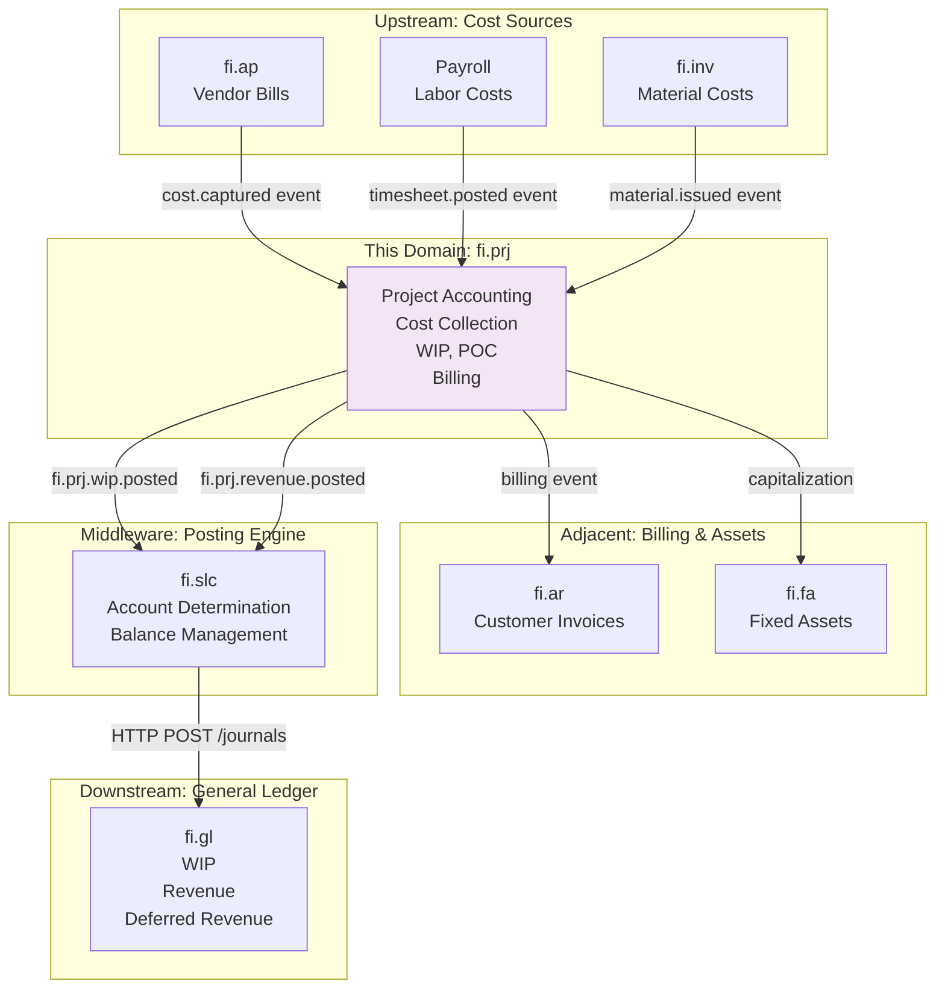
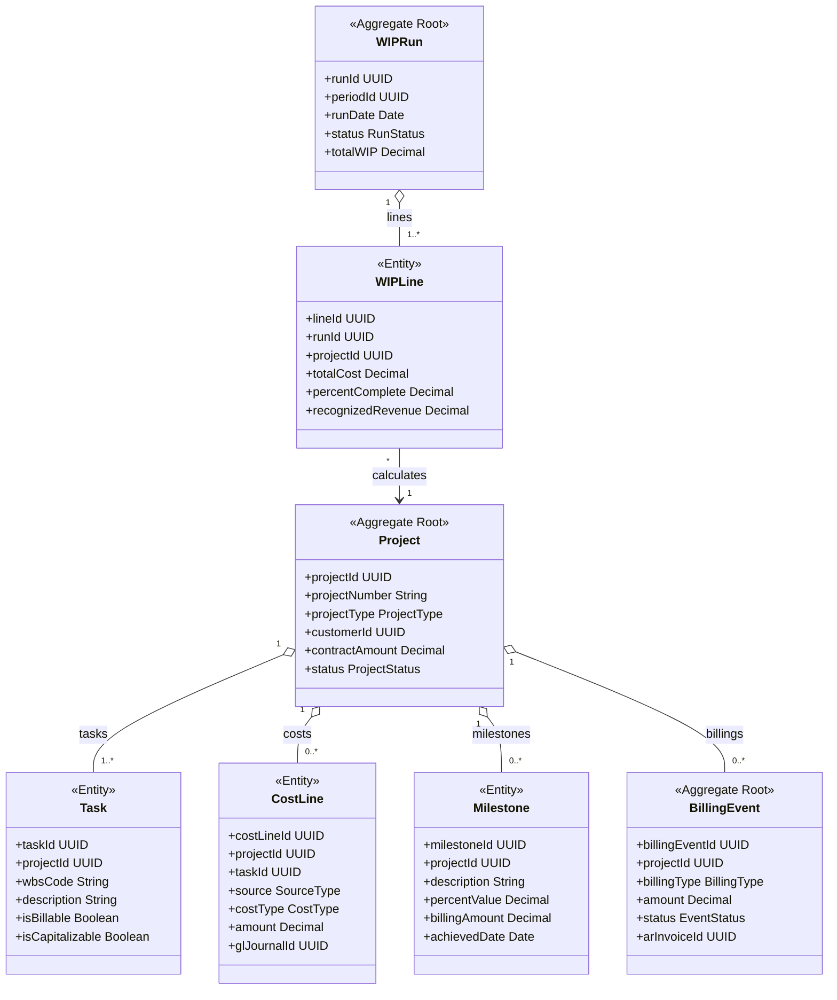
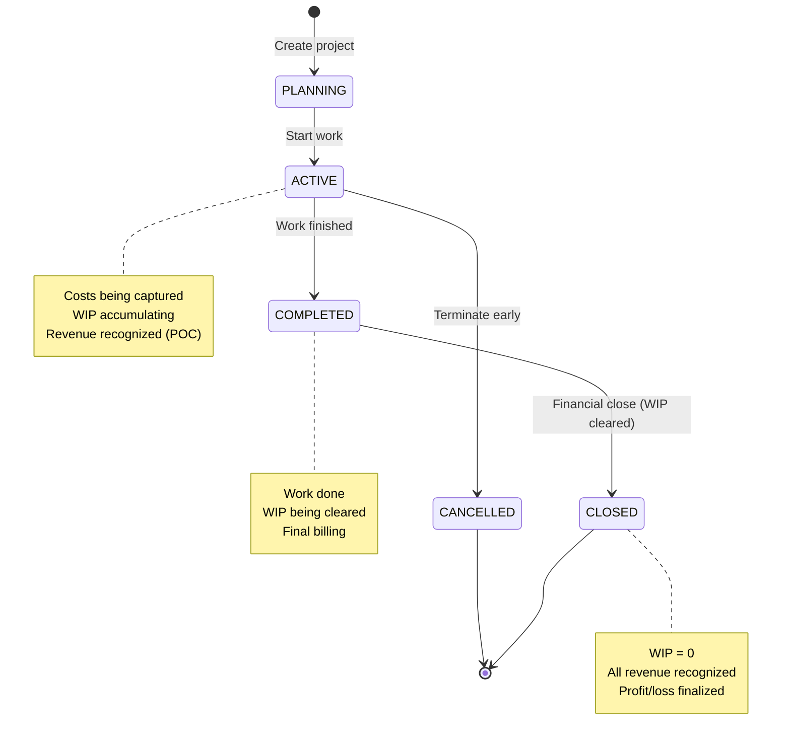
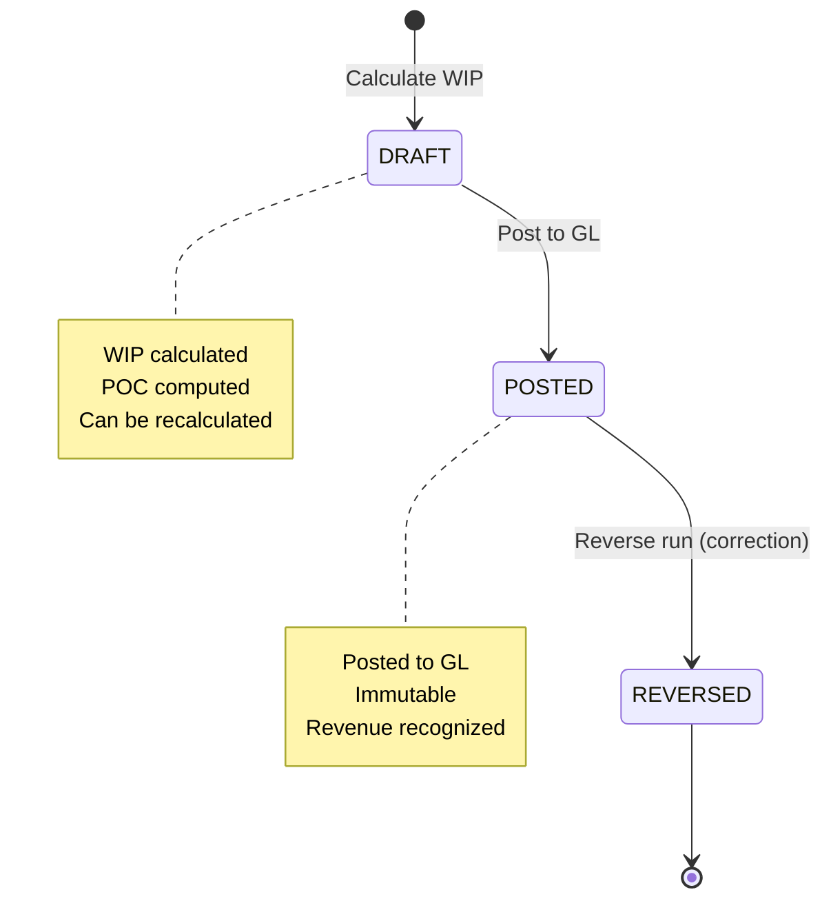
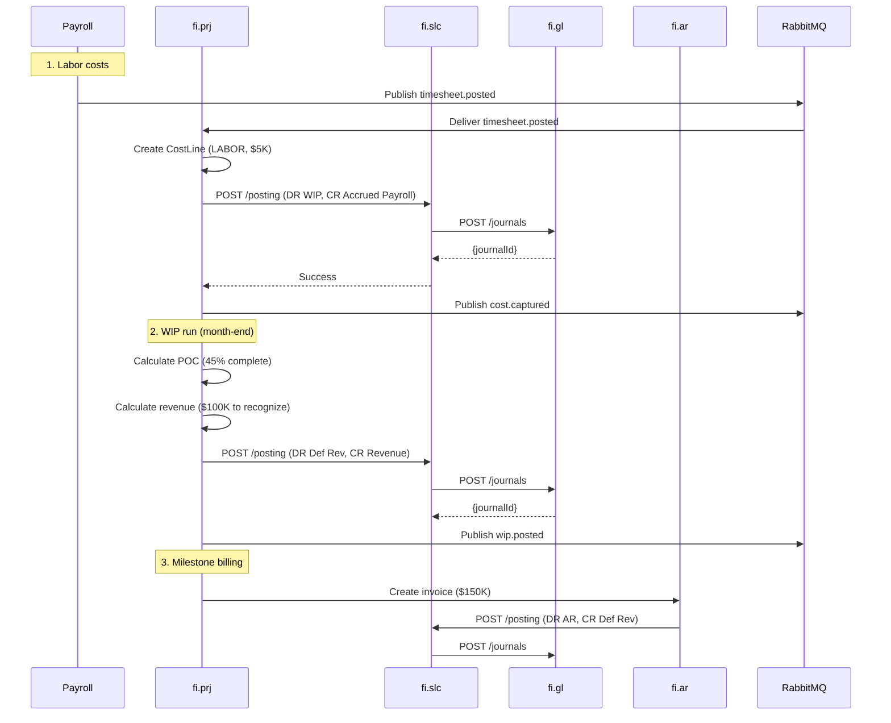

<!-- TEMPLATE COMPLIANCE: ~60%
Missing sections: §2 (Service Identity), §11 (Feature Dependencies), §12 (Extension Points)
Renumbering needed: §3 -> §5 (Use Cases), §5 -> §7 (Integration), §6 -> §7 (Events, merge), §7 -> §6 (REST API), §8 -> §8 (Data Model), §9 -> §9 (Security), §10 -> §10 (Quality), §11 -> §13 (Migration), §12 -> §14 (Decisions), §13 -> §15 (Appendix)
Action needed: Add full Meta header block, add Specification Guidelines Compliance block, add §2 Service Identity, renumber sections to §0-§15, add §11 Feature Dependencies stub, add §12 Extension Points stub
-->
# fi.prj - Project Accounting Domain Specification

> **Meta Information**
> - **Version:** 2025-12-05
> - **Template:** `domain-service-spec.md` v1.0.0
> - **Template Compliance:** ~60% — §2, §11, §12 missing
> - **Author(s):** OpenLeap Architecture Team
> - **Status:** DRAFT
> - **Suite:** `fi`
> - **Domain:** `projects`
> - **Service Name:** `fi-prj-svc`

---

## 0. Document Purpose & Scope

### 0.1 Purpose

This document specifies the **Project Accounting (fi.prj)** domain, which manages financial aspects of projects including cost collection, work-in-process (WIP) accounting, percentage-of-completion revenue recognition, project billing, and capitalization of project costs to fixed assets. It ensures accurate project profitability tracking and compliance with project accounting standards.

### 0.2 Target Audience
- Product Owners & Business Stakeholders (Finance, Project Management, Professional Services)
- System Architects & Technical Leads
- Integration Engineers
- Project Controllers and Cost Accountants
- Project Managers
- External Auditors

### 0.3 Scope

**In Scope:**
- **Project Master Data:** Projects, tasks/WBS, project types (CAPEX, OPEX, T&M, Fixed Price)
- **Cost Collection:** Capture costs from AP (vendor invoices), Payroll (labor), Inventory (materials)
- **WIP Accounting:** Work-in-process asset tracking, cost accumulation
- **Revenue Recognition Methods:** Percentage-of-Completion (POC), Completed Contract, Time & Materials
- **Project Billing:** Milestone billing, progress billing, T&M billing (integration with fi.ar)
- **Capitalization:** Transfer project costs to fixed assets (Construction-in-Progress → Fixed Assets)
- **Project Profitability:** Cost vs. revenue analysis, margin tracking
- **GL Integration:** Post WIP, revenue recognition, capitalization via fi.slc
- **Multi-Entity:** Support cross-entity projects (intercompany)

**Out of Scope:**
- Project planning and scheduling → PPM (Project Portfolio Management) system
- Resource management (capacity planning) → Resource management system
- Timesheet entry and approval → HR/Payroll system (fi.prj consumes timesheets)
- Procurement workflows → pur.procurement
- Detailed project execution → ops.projects (operational)

### 0.4 Related Documents
- `_fi_suite.md` - FI Suite architecture
- `fi_gl.md` - General Ledger specification
- `fi_slc.md` - Subledger core specification
- `fi_ar.md` - Accounts Receivable (billing)
- `fi_ap.md` - Accounts Payable (vendor costs)
- `fi_inv.md` - Inventory (material costs)
- `fi_fa.md` - Fixed Assets (capitalization)
- `fi_revrec.md` - Revenue Recognition

---

## 1. Business Context

### 1.1 Domain Purpose

**fi.prj** provides financial visibility and control for project-based work. Whether building construction, software implementation, consulting engagements, or R&D projects, organizations need to track costs, recognize revenue appropriately, and understand project profitability.

**Core Business Problems Solved:**
- **Project Profitability:** Is this project making money? (Cost vs. Revenue)
- **WIP Tracking:** What's the value of work-in-process?
- **Revenue Recognition:** When to recognize revenue for long-term projects?
- **Cost Allocation:** How to allocate overhead and indirect costs?
- **Billing Accuracy:** Bill customers correctly (milestones, T&M, progress)
- **Capitalization:** When to capitalize project costs as assets?
- **Project Portfolio:** Which projects are most profitable?

### 1.2 Business Value

**For the Organization:**
- **Profitability Insight:** Understand which projects/customers are profitable
- **Cash Flow:** Optimize billing schedules, reduce DSO
- **Compliance:** Meet ASC 606, IAS 11/IFRS 15 requirements
- **Cost Control:** Track project costs in real-time, prevent overruns
- **Resource Optimization:** Identify underutilized resources
- **Decision Making:** Bid on projects with confidence (historical data)

**For Users:**
- **Project Controller:** Track project costs, margins, WIP in real-time
- **Project Manager:** Understand budget vs. actual, forecast to complete
- **CFO:** Portfolio profitability, revenue forecasts
- **Revenue Accountant:** Automate POC revenue recognition
- **Auditor:** Complete audit trail from cost to revenue

### 1.3 Key Stakeholders

| Role | Responsibility | Primary Use Cases |
|------|----------------|-------------------|
| Project Controller | Project financials | Capture costs, run WIP, analyze profitability |
| Project Manager | Budget vs. actual | Monitor project performance, forecast |
| Revenue Accountant | Revenue recognition | Run POC calculations, post revenue |
| Billing Specialist | Customer invoicing | Generate milestone/progress invoices |
| CFO | Portfolio performance | Analyze project portfolio, margins |
| External Auditor | Financial audit | Verify WIP, revenue recognition |

### 1.4 Strategic Positioning

**fi.prj** sits **between** cost sources (AP, Payroll, Inventory) and revenue/assets (AR, Fixed Assets).



**Key Insight:** fi.prj aggregates costs from multiple sources and determines revenue recognition.

---

## 2. Domain Model

### 2.1 Conceptual Overview

The project accounting domain model consists of six main pillars:

1. **Projects & Tasks:** Structure (WBS - Work Breakdown Structure)
2. **Cost Collection:** Capture costs from various sources
3. **WIP (Work-in-Process):** Accumulate project costs
4. **Revenue Recognition:** POC, Completed Contract, T&M methods
5. **Billing:** Milestone, Progress, T&M invoicing
6. **Capitalization:** Transfer WIP to Fixed Assets

**Key Principles:**
- **Cost Accumulation:** All project costs collected in WIP account
- **Matching Principle:** Match revenue with costs incurred (POC)
- **Project Types:** Different accounting for CAPEX, OPEX, Fixed Price, T&M
- **Milestone Tracking:** Revenue recognition tied to milestones
- **Profitability:** Revenue - Costs = Margin

### 2.2 Core Concepts



### 2.3 Aggregate Definitions

#### 2.3.1 Project

**Business Purpose:**  
Represents a customer project or internal capital project. Root for cost collection and revenue recognition.

**Key Attributes:**

| Attribute | Type | Description | Constraints |
|-----------|------|-------------|-------------|
| projectId | UUID | Unique identifier | Required, immutable, PK |
| tenantId | UUID | Tenant ownership | Required, immutable |
| projectNumber | String | Sequential project number | Required, unique per tenant |
| projectName | String | Project name | Required |
| projectType | ProjectType | Type of project | Required, enum(FIXED_PRICE, TIME_AND_MATERIALS, CAPEX, OPEX) |
| entityId | UUID | Legal entity | Required, FK to entities |
| customerId | UUID | Customer | Optional, FK to customers (null for internal) |
| contractAmount | Decimal | Contract value | Optional, for Fixed Price |
| estimatedCost | Decimal | Estimated total cost | Optional |
| currency | String | Project currency | Required, ISO 4217 |
| startDate | Date | Project start | Required |
| endDate | Date | Project end (planned) | Optional |
| actualEndDate | Date | Actual completion date | Optional, set when COMPLETED |
| status | ProjectStatus | Current state | Required, enum(PLANNING, ACTIVE, COMPLETED, CLOSED, CANCELLED) |
| wipAccountId | UUID | WIP GL account | Required, FK to fi.gl.accounts |
| revenueRecMethod | RecMethod | Revenue recognition method | Required, enum(POC, COMPLETED_CONTRACT, TIME_AND_MATERIALS) |
| pocMethod | POCMethod | POC calculation method | Optional, enum(COST_TO_COST, UNITS_OF_DELIVERY, LABOR_HOURS) |
| billingMethod | BillingMethod | How to bill customer | Optional, enum(MILESTONE, PROGRESS, TIME_AND_MATERIALS) |
| isCapitalizable | Boolean | Capitalize to FA when complete | Required, default false |
| createdAt | Timestamp | Creation timestamp | Auto-generated |

**Project Types:**

| Type | Description | Revenue Recognition | Example |
|------|-------------|---------------------|---------|
| FIXED_PRICE | Fixed contract amount | POC or Completed Contract | Software implementation $100K |
| TIME_AND_MATERIALS | Bill based on hours/materials | As incurred | Consulting (hourly rate) |
| CAPEX | Capital expenditure | Capitalize to assets | Building construction |
| OPEX | Operating expenditure | Expense as incurred | R&D project |

**Lifecycle States:**



**Business Rules & Invariants:**

1. **BR-PRJ-001: Date Sequence**
   - *Rule:* If endDate provided, endDate > startDate
   - *Rationale:* Logical project duration
   - *Enforcement:* CHECK constraint

2. **BR-PRJ-002: Contract Amount for Fixed Price**
   - *Rule:* If projectType = FIXED_PRICE, contractAmount required
   - *Rationale:* Need total value for POC calculation
   - *Enforcement:* Validation on creation

3. **BR-PRJ-003: POC Method Required**
   - *Rule:* If revenueRecMethod = POC, pocMethod required
   - *Rationale:* Need to know how to calculate percentage
   - *Enforcement:* Validation on creation

**Example Scenarios:**

**Scenario 1: Fixed Price Software Implementation**
```json
{
  "projectNumber": "PRJ-2025-001",
  "projectName": "ERP Implementation for ACME Corp",
  "projectType": "FIXED_PRICE",
  "customerId": "customer-uuid",
  "contractAmount": 500000.00,
  "estimatedCost": 400000.00,
  "currency": "USD",
  "startDate": "2025-01-01",
  "endDate": "2025-12-31",
  "status": "ACTIVE",
  "revenueRecMethod": "POC",
  "pocMethod": "COST_TO_COST",
  "billingMethod": "MILESTONE"
}
```

**Scenario 2: Time & Materials Consulting**
```json
{
  "projectNumber": "PRJ-2025-002",
  "projectName": "IT Consulting Services",
  "projectType": "TIME_AND_MATERIALS",
  "customerId": "customer-uuid",
  "currency": "USD",
  "startDate": "2025-01-01",
  "status": "ACTIVE",
  "revenueRecMethod": "TIME_AND_MATERIALS",
  "billingMethod": "TIME_AND_MATERIALS"
}
```

---

#### 2.3.2 Task

**Business Purpose:**  
Work breakdown structure (WBS) element within a project. Unit of cost allocation.

**Key Attributes:**

| Attribute | Type | Description | Constraints |
|-----------|------|-------------|-------------|
| taskId | UUID | Unique identifier | Required, immutable, PK |
| projectId | UUID | Parent project | Required, FK to projects |
| taskNumber | String | Task number | Required, unique per project |
| wbsCode | String | WBS code | Required, e.g., "1.2.3" |
| description | String | Task description | Required |
| parentTaskId | UUID | Parent task (for hierarchy) | Optional, FK to tasks |
| isBillable | Boolean | Can be billed to customer | Required, default true |
| isCapitalizable | Boolean | Capitalize to FA | Required, default false |
| estimatedHours | Decimal | Estimated labor hours | Optional |
| estimatedCost | Decimal | Estimated cost | Optional |
| actualCost | Decimal | Actual cost to date | Required, default 0 |
| status | TaskStatus | Current state | Required, enum(NOT_STARTED, IN_PROGRESS, COMPLETED) |

**Business Rules:**

1. **BR-TASK-001: WBS Hierarchy**
   - *Rule:* Prevent circular parent-child references
   - *Rationale:* Maintain logical WBS structure
   - *Enforcement:* Cycle detection on creation

2. **BR-TASK-002: Billability Consistency**
   - *Rule:* If parent task not billable, child cannot be billable
   - *Rationale:* Inheritance of billing rules
   - *Enforcement:* Validation on creation

---

#### 2.3.3 CostLine

**Business Purpose:**  
Individual cost entry allocated to a project/task. Source of WIP accumulation.

**Key Attributes:**

| Attribute | Type | Description | Constraints |
|-----------|------|-------------|-------------|
| costLineId | UUID | Unique identifier | Required, immutable, PK |
| projectId | UUID | Project | Required, FK to projects |
| taskId | UUID | Task | Optional, FK to tasks |
| source | SourceType | Cost source | Required, enum(AP, PAYROLL, INVENTORY, MANUAL) |
| sourceDocId | UUID | Source document ID | Optional, e.g., AP bill ID |
| costType | CostType | Type of cost | Required, enum(LABOR, MATERIAL, SUBCONTRACTOR, OVERHEAD) |
| costDate | Date | Cost incurred date | Required |
| amount | Decimal | Cost amount | Required, > 0 |
| currency | String | Cost currency | Required, ISO 4217 |
| employeeId | UUID | Employee (for labor) | Optional, FK to employees |
| itemId | UUID | Item (for material) | Optional, FK to items |
| quantity | Decimal | Quantity | Optional, for materials |
| uom | String | Unit of measure | Optional |
| glJournalId | UUID | Posted GL journal | Optional, FK to fi.gl.journal_entries |
| voucherId | String | Idempotency key | Required, unique per tenant |
| dimensions | JSONB | Cost dimensions | Optional, e.g., {"department": "IT"} |
| createdAt | Timestamp | Creation timestamp | Auto-generated |

**Cost Types:**

| Type | Description | Source | Example |
|------|-------------|--------|---------|
| LABOR | Employee time | Payroll timesheets | Developer hours |
| MATERIAL | Inventory consumed | fi.inv | Steel, cement |
| SUBCONTRACTOR | Vendor services | fi.ap | External consultant |
| OVERHEAD | Indirect costs | Allocation | Office rent, utilities |

**Business Rules:**

1. **BR-COST-001: Positive Amount**
   - *Rule:* amount > 0
   - *Rationale:* Costs increase WIP
   - *Enforcement:* CHECK constraint

2. **BR-COST-002: Idempotency**
   - *Rule:* Unique constraint on (tenantId, voucherId)
   - *Rationale:* Prevent duplicate cost posting
   - *Enforcement:* Unique constraint

**Example Cost Capture (Labor):**
```json
{
  "projectId": "project-uuid",
  "taskId": "task-uuid",
  "source": "PAYROLL",
  "sourceDocId": "timesheet-uuid",
  "costType": "LABOR",
  "costDate": "2025-01-31",
  "amount": 5000.00,
  "currency": "USD",
  "employeeId": "employee-uuid",
  "quantity": 100.0,
  "uom": "HOURS"
}
```

**Posting:**
```
DR 1700 WIP $5,000
CR 2400 Accrued Payroll $5,000
```

---

#### 2.3.4 WIPRun

**Business Purpose:**  
Periodic calculation of WIP and revenue recognition. Runs monthly or quarterly.

**Key Attributes:**

| Attribute | Type | Description | Constraints |
|-----------|------|-------------|-------------|
| runId | UUID | Unique identifier | Required, immutable, PK |
| tenantId | UUID | Tenant ownership | Required, immutable |
| runNumber | String | Sequential run number | Required, unique per tenant |
| periodId | UUID | Fiscal period | Required, FK to fi.gl.periods |
| runDate | Date | As-of date | Required |
| status | RunStatus | Current state | Required, enum(DRAFT, POSTED, REVERSED) |
| totalWIP | Decimal | Total WIP value | Required, >= 0 |
| totalRevenue | Decimal | Total revenue recognized | Required, >= 0 |
| totalCost | Decimal | Total cost to date | Required, >= 0 |
| currency | String | Run currency | Required, ISO 4217 |
| createdBy | UUID | User who created run | Required |
| createdAt | Timestamp | Creation timestamp | Auto-generated |
| postedAt | Timestamp | Posting timestamp | Optional, set when POSTED |

**Lifecycle States:**



**Business Rules:**

1. **BR-RUN-001: Period Uniqueness**
   - *Rule:* One POSTED run per (tenant, periodId)
   - *Rationale:* Prevent double-recognition
   - *Enforcement:* Unique constraint

---

#### 2.3.5 WIPLine

**Business Purpose:**  
Per-project calculation within a WIP run. One line per active project.

**Key Attributes:**

| Attribute | Type | Description | Constraints |
|-----------|------|-------------|-------------|
| lineId | UUID | Unique identifier | Required, immutable, PK |
| runId | UUID | Parent run | Required, FK to wip_runs |
| projectId | UUID | Project | Required, FK to projects |
| totalCostToDate | Decimal | Cumulative project cost | Required, >= 0 |
| percentComplete | Decimal | Completion percentage | Required, 0-100 |
| estimatedTotalCost | Decimal | Revised total cost estimate | Required, > 0 |
| contractAmount | Decimal | Contract value | Required for Fixed Price |
| earnedRevenue | Decimal | Revenue earned (POC) | Required, >= 0 |
| billedToDate | Decimal | Invoiced to date | Required, >= 0 |
| revenueToRecognize | Decimal | Current period recognition | Required |
| deferredRevenue | Decimal | Billed but not earned | Required, >= 0 |
| accruedRevenue | Decimal | Earned but not billed | Required, >= 0 |
| glJournalId | UUID | Posted GL journal | Optional, FK to fi.gl.journal_entries |

**POC Calculation (Cost-to-Cost Method):**
```
Percent Complete = Total Cost to Date / Estimated Total Cost
Earned Revenue = Contract Amount × Percent Complete
Revenue to Recognize = Earned Revenue - Previously Recognized Revenue
```

**Example POC Calculation:**
```
Project: $500K contract, $400K estimated cost

Month 1:
  Costs incurred: $100K
  Percent complete: $100K / $400K = 25%
  Earned revenue: $500K × 25% = $125K
  Revenue to recognize: $125K - $0 = $125K
  
Month 2:
  Costs incurred: $80K (total $180K)
  Percent complete: $180K / $400K = 45%
  Earned revenue: $500K × 45% = $225K
  Revenue to recognize: $225K - $125K = $100K
```

**Business Rules:**

1. **BR-LINE-001: POC Range**
   - *Rule:* percentComplete >= 0 AND percentComplete <= 100
   - *Rationale:* Logical completion range
   - *Enforcement:* CHECK constraint

2. **BR-LINE-002: Revenue Recognition**
   - *Rule:* earnedRevenue = contractAmount × (percentComplete / 100)
   - *Rationale:* ASC 606 POC method
   - *Enforcement:* Calculated field validation

---

#### 2.3.6 Milestone

**Business Purpose:**  
Project milestone for billing and progress tracking. Used for milestone billing and POC.

**Key Attributes:**

| Attribute | Type | Description | Constraints |
|-----------|------|-------------|-------------|
| milestoneId | UUID | Unique identifier | Required, immutable, PK |
| projectId | UUID | Parent project | Required, FK to projects |
| milestoneNumber | Int | Milestone sequence | Required, unique per project |
| description | String | Milestone description | Required |
| plannedDate | Date | Planned achievement date | Optional |
| achievedDate | Date | Actual achievement date | Optional, set when achieved |
| percentValue | Decimal | % of project completion | Optional, for POC |
| billingAmount | Decimal | Amount to bill | Optional, for milestone billing |
| status | MilestoneStatus | Current state | Required, enum(PENDING, ACHIEVED, BILLED) |

**Business Rules:**

1. **BR-MILE-001: Percent Sum**
   - *Rule:* SUM(percentValue) for project = 100% (if using milestone POC)
   - *Rationale:* Complete project coverage
   - *Enforcement:* Validation when activating project

**Example Milestones:**
```
Project: Software Implementation

Milestone 1: Design Complete (30%, $150K billing)
Milestone 2: Development Complete (50%, $250K billing)
Milestone 3: Deployment Complete (20%, $100K billing)

Total: 100%, $500K
```

---

#### 2.3.7 BillingEvent

**Business Purpose:**  
Triggers customer invoice creation. Link between project and fi.ar.

**Key Attributes:**

| Attribute | Type | Description | Constraints |
|-----------|------|-------------|-------------|
| billingEventId | UUID | Unique identifier | Required, immutable, PK |
| tenantId | UUID | Tenant ownership | Required, immutable |
| eventNumber | String | Sequential number | Required, unique per tenant |
| projectId | UUID | Project | Required, FK to projects |
| billingType | BillingType | Type of billing | Required, enum(MILESTONE, PROGRESS, TIME_AND_MATERIALS) |
| billingDate | Date | Date of billing | Required |
| amount | Decimal | Billing amount | Required, > 0 |
| currency | String | Currency | Required, ISO 4217 |
| description | String | Billing description | Required |
| milestoneId | UUID | Related milestone | Optional, FK to milestones |
| status | EventStatus | Current state | Required, enum(PENDING, INVOICED, CANCELLED) |
| arInvoiceId | UUID | Generated AR invoice | Optional, FK to ar.invoices |
| createdAt | Timestamp | Creation timestamp | Auto-generated |

**Billing Types:**

| Type | Description | When Used | Example |
|------|-------------|-----------|---------|
| MILESTONE | Bill when milestone achieved | Fixed price projects | Design phase complete → Bill $150K |
| PROGRESS | Bill based on % complete | Fixed price projects | 25% complete → Bill $125K |
| TIME_AND_MATERIALS | Bill based on hours/materials | T&M projects | 100 hours @ $150/hr = $15K |

---

## 3. Business Processes & Use Cases

### 3.1 Primary Use Cases

#### UC-001: Capture Labor Costs from Payroll

**Actor:** System (automated, triggered by payroll event)

**Preconditions:**
- Project exists and active
- Employee timesheet approved
- Payroll posted

**Main Flow:**
1. Payroll system posts timesheet (payroll.timesheet.posted event)
2. System consumes event
3. Event payload:
   ```json
   {
     "timesheetId": "ts-uuid",
     "employeeId": "emp-uuid",
     "periodStart": "2025-01-01",
     "periodEnd": "2025-01-31",
     "lines": [
       {
         "projectId": "project-uuid",
         "taskId": "task-uuid",
         "hours": 100.0,
         "amount": 5000.00
       }
     ]
   }
   ```
4. System creates CostLine:
   - source = PAYROLL
   - costType = LABOR
   - amount = $5,000
5. System calls fi.slc POST /posting:
   - eventType: fi.prj.cost.captured
   - DR 1700 WIP $5,000
   - CR 2400 Accrued Payroll $5,000
6. System updates CostLine: glJournalId
7. System updates Project/Task: actualCost += $5,000
8. System publishes fi.prj.cost.captured event

**Postconditions:**
- Cost captured in project
- WIP increased
- GL journal posted
- Event published

---

#### UC-002: Run Monthly WIP and POC Revenue Recognition

**Actor:** Project Controller (scheduled job)

**Preconditions:**
- Active projects exist
- Costs captured for period
- GL period OPEN

**Main Flow:**
1. User triggers WIP run (POST /wip/run)
2. System creates WIPRun (status = DRAFT)
3. System queries all ACTIVE projects
4. For each project (Fixed Price, POC method):
   a. Calculate total cost to date: SUM(costLines.amount) = $180K
   b. Retrieve estimated total cost: $400K
   c. Calculate percent complete: $180K / $400K = 45%
   d. Retrieve contract amount: $500K
   e. Calculate earned revenue: $500K × 45% = $225K
   f. Retrieve previously recognized: $125K (from prior runs)
   g. Calculate revenue to recognize: $225K - $125K = $100K
   h. Create WIPLine with calculations
5. System aggregates totals for run
6. User reviews WIPRun (DRAFT), then posts
7. For each WIPLine with revenueToRecognize > 0:
   a. System calls fi.slc POST /posting:
      - eventType: fi.prj.revenue.posted
      - DR 2500 Deferred Revenue $100K (or DR 1210 Accrued Revenue if not billed)
      - CR 4000 Revenue $100K
   b. System updates WIPLine: glJournalId
8. System updates WIPRun: status = POSTED
9. System publishes fi.prj.wip.posted event

**Postconditions:**
- WIP run posted
- Revenue recognized (POC)
- GL journals created
- Events published

---

#### UC-003: Create Milestone Billing Event

**Actor:** Billing Specialist

**Preconditions:**
- Project milestone achieved
- User has PRJ_POSTER role

**Main Flow:**
1. User marks milestone as achieved
2. System updates Milestone: achievedDate = today, status = ACHIEVED
3. User creates billing event (POST /billing/events)
4. User specifies:
   - projectId
   - billingType = MILESTONE
   - milestoneId
   - amount = $150,000 (from milestone)
5. System creates BillingEvent (status = PENDING)
6. System calls fi.ar POST /invoices:
   ```json
   {
     "customerId": "customer-uuid",
     "invoiceDate": "2025-03-31",
     "lines": [
       {
         "description": "Design Phase Complete - Milestone 1",
         "amount": 150000.00,
         "projectId": "project-uuid"
       }
     ]
   }
   ```
7. fi.ar creates invoice
8. fi.ar posts invoice:
   - DR 1200 AR $150K
   - CR 2500 Deferred Revenue $150K
9. System updates BillingEvent:
   - status = INVOICED
   - arInvoiceId = invoice ID
10. System updates Milestone: status = BILLED

**Postconditions:**
- Customer invoiced
- Deferred revenue created
- Billing event recorded

---

#### UC-004: Capitalize Project to Fixed Assets

**Actor:** Project Controller

**Preconditions:**
- Project type = CAPEX
- Project status = COMPLETED
- isCapitalizable = true
- User has PRJ_ADMIN role

**Main Flow:**
1. User requests capitalization (POST /projects/{id}/capitalize)
2. System retrieves project total WIP: $2,000,000
3. System calls fi.fa POST /assets:
   ```json
   {
     "description": "New Manufacturing Plant - Building",
     "assetClass": "BUILDING",
     "acquisitionCost": 2000000.00,
     "sourceProjectId": "project-uuid"
   }
   ```
4. fi.fa creates asset
5. fi.fa posts capitalization:
   - DR 1600 Fixed Assets $2M
   - CR 1700 WIP $2M
6. System updates Project: status = CLOSED, actualCost = $2M
7. System publishes fi.prj.capitalized event

**Postconditions:**
- WIP cleared
- Fixed asset created
- Project closed

---

### 3.2 Process Flow Diagrams

#### Process: Cost Capture to Revenue Recognition



---

## 4. Business Rules & Constraints

### 4.1 Business Rules Catalog

| ID | Rule Name | Description | Scope | Enforcement |
|----|-----------|-------------|-------|-------------|
| BR-PRJ-001 | Date Sequence | endDate > startDate | Project | Create |
| BR-PRJ-002 | Contract Amount Required | Fixed Price needs contract amount | Project | Create |
| BR-PRJ-003 | POC Method Required | POC revenue needs POC method | Project | Create |
| BR-TASK-001 | WBS Hierarchy | No circular references | Task | Create |
| BR-TASK-002 | Billability Consistency | Child inherits parent non-billable | Task | Create |
| BR-COST-001 | Positive Amount | Cost amount > 0 | CostLine | Create |
| BR-COST-002 | Idempotency | Unique voucherId | CostLine | Create |
| BR-RUN-001 | Period Uniqueness | One posted run per period | WIPRun | Post |
| BR-LINE-001 | POC Range | 0 <= percentComplete <= 100 | WIPLine | Calculate |
| BR-LINE-002 | Revenue Recognition | Earned = Contract × % Complete | WIPLine | Calculate |
| BR-MILE-001 | Percent Sum | Milestones sum to 100% | Milestone | Validate |

---

## 5. Integration Architecture

### 5.1 Integration Pattern Decision

**Does this domain use orchestration (Saga/Temporal)?** [ ] YES [X] NO

**Pattern Used:** Event-Driven Architecture (Choreography)

**Rationale:**

fi.prj uses **pure Event-Driven Architecture** because:

✅ **PROJ is Event Consumer:**
- Consumes payroll.timesheet.posted, fi.ap.bill.posted, fi.inv.material.issued
- Reacts to cost events, accumulates WIP

✅ **PROJ is Event Publisher:**
- Publishes cost.captured, wip.posted, revenue.posted
- Downstream services react (fi.rpt, t4.bi)

✅ **Synchronous GL Posting:**
- Calls fi.slc HTTP POST /posting (synchronous)
- Waits for confirmation (need journalId)

❌ **Why NOT Orchestration:**
- No multi-service transaction
- Cost capture is: Event → Capture → Post (linear)
- WIP run is: Calculate → Post (single-step)

### 5.2 Event-Driven Integration

**Inbound Events (Consumed):**

| Event | Source | Purpose | Handling |
|-------|--------|---------|----------|
| payroll.timesheet.posted | Payroll | Capture labor costs | Create CostLine (LABOR) |
| fi.ap.bill.posted | fi.ap | Capture vendor costs | Create CostLine (SUBCONTRACTOR) |
| fi.inv.material.issued | fi.inv | Capture material costs | Create CostLine (MATERIAL) |
| fi.gl.period.closed | fi.gl | Prevent posting | Validate period status |

**Outbound Events (Published):**

| Event | When | Purpose | Consumers |
|-------|------|---------|-----------|
| fi.prj.cost.captured | Cost posted to WIP | Track cost events | fi.rpt, t4.bi |
| fi.prj.wip.posted | WIP run posted | Update WIP reports | fi.rpt, t4.bi |
| fi.prj.revenue.posted | Revenue recognized | Track earnings | fi.rpt, t4.bi |
| fi.prj.capitalized | Project capitalized to FA | Track asset creation | fi.fa, fi.rpt |

---

## 6. Event Catalog

### 6.1 Outbound Events

**Exchange:** `fi.prj.events` (RabbitMQ topic exchange)

#### Event: wip.posted

**Routing Key:** `fi.prj.wip.posted`

**When Published:** WIP run posted and revenue recognized

**Business Meaning:** Period-end WIP and revenue recognition complete

**Consumers:**
- fi.rpt (update project reports)
- t4.bi (project analytics)

**Payload:**
```json
{
  "eventId": "evt-uuid",
  "tenantId": "tenant-uuid",
  "occurredAt": "2025-01-31T23:59:59Z",
  "traceId": "trace-uuid",
  "producer": "fi.prj",
  "aggregateType": "wip_run",
  "changeType": "posted",
  "entityIds": ["run-uuid"],
  "version": 1,
  "payload": {
    "runId": "run-uuid",
    "runNumber": "WIP-2025-01",
    "periodId": "period-uuid",
    "period": "2025-01",
    "totalWIP": 1500000.00,
    "totalRevenue": 225000.00,
    "totalCost": 180000.00,
    "currency": "USD",
    "projectCount": 25
  }
}
```

---

## 7. API Specification

### 7.1 REST API

**Base Path:** `/api/fi/projects/v1`

**Authentication:** OAuth 2.0 Bearer Token

**Content Type:** `application/json`

#### 7.1.1 Projects

**POST /projects** - Create project
- **Role:** PRJ_ADMIN
- **Request Body:**
  ```json
  {
    "projectName": "ERP Implementation",
    "projectType": "FIXED_PRICE",
    "customerId": "customer-uuid",
    "contractAmount": 500000.00,
    "estimatedCost": 400000.00,
    "currency": "USD",
    "startDate": "2025-01-01",
    "endDate": "2025-12-31",
    "revenueRecMethod": "POC",
    "pocMethod": "COST_TO_COST",
    "billingMethod": "MILESTONE"
  }
  ```
- **Response:** 201 Created

**GET /projects** - List projects
- **Role:** PRJ_VIEWER
- **Query Params:** `projectType`, `status`, `customerId`, `page`, `size`
- **Response:** 200 OK

---

#### 7.1.2 Cost Capture

**POST /costs/capture** - Capture cost
- **Role:** PRJ_POSTER
- **Request Body:**
  ```json
  {
    "projectId": "project-uuid",
    "taskId": "task-uuid",
    "source": "PAYROLL",
    "costType": "LABOR",
    "costDate": "2025-01-31",
    "amount": 5000.00,
    "currency": "USD",
    "employeeId": "employee-uuid"
  }
  ```
- **Response:** 201 Created

---

#### 7.1.3 WIP

**POST /wip/run** - Run WIP calculation
- **Role:** PRJ_ADMIN
- **Request Body:**
  ```json
  {
    "periodId": "period-uuid",
    "runDate": "2025-01-31",
    "simulate": false
  }
  ```
- **Response:** 201 Created

---

### 7.2 Error Responses

| HTTP Status | Error Code | Description |
|-------------|------------|-------------|
| 400 | PROJECT_NOT_ACTIVE | Cannot capture costs to inactive project |
| 400 | POC_METHOD_MISSING | POC project needs POC method |
| 403 | PERIOD_CLOSED | Cannot post WIP to closed period |
| 404 | PROJECT_NOT_FOUND | Project does not exist |

---

## 8. Data Model

### 8.1 Storage Schema (PostgreSQL)

#### Schema: fi_projects

#### Table: prj_projects
```sql
CREATE TABLE fi_projects.prj_projects (
  project_id UUID PRIMARY KEY,
  tenant_id UUID NOT NULL,
  project_number VARCHAR(50) NOT NULL,
  project_name VARCHAR(500) NOT NULL,
  project_type VARCHAR(30) NOT NULL,
  entity_id UUID NOT NULL,
  customer_id UUID,
  contract_amount NUMERIC(19,4),
  estimated_cost NUMERIC(19,4),
  currency CHAR(3) NOT NULL,
  start_date DATE NOT NULL,
  end_date DATE,
  actual_end_date DATE,
  status VARCHAR(20) NOT NULL DEFAULT 'PLANNING',
  wip_account_id UUID NOT NULL,
  revenue_rec_method VARCHAR(30) NOT NULL,
  poc_method VARCHAR(30),
  billing_method VARCHAR(30),
  is_capitalizable BOOLEAN NOT NULL DEFAULT FALSE,
  created_at TIMESTAMP NOT NULL DEFAULT NOW(),
  UNIQUE (tenant_id, project_number),
  CHECK (status IN ('PLANNING', 'ACTIVE', 'COMPLETED', 'CLOSED', 'CANCELLED')),
  CHECK (project_type IN ('FIXED_PRICE', 'TIME_AND_MATERIALS', 'CAPEX', 'OPEX')),
  CHECK (end_date IS NULL OR end_date > start_date)
);

CREATE INDEX idx_projects_tenant ON fi_projects.prj_projects(tenant_id);
CREATE INDEX idx_projects_status ON fi_projects.prj_projects(status);
CREATE INDEX idx_projects_customer ON fi_projects.prj_projects(customer_id);
```

#### Table: prj_cost_lines
```sql
CREATE TABLE fi_projects.prj_cost_lines (
  cost_line_id UUID PRIMARY KEY,
  project_id UUID NOT NULL REFERENCES fi_projects.prj_projects(project_id),
  task_id UUID,
  source VARCHAR(20) NOT NULL,
  source_doc_id UUID,
  cost_type VARCHAR(20) NOT NULL,
  cost_date DATE NOT NULL,
  amount NUMERIC(19,4) NOT NULL,
  currency CHAR(3) NOT NULL,
  employee_id UUID,
  item_id UUID,
  quantity NUMERIC(19,6),
  uom VARCHAR(10),
  gl_journal_id UUID,
  voucher_id VARCHAR(100) NOT NULL,
  dimensions JSONB,
  created_at TIMESTAMP NOT NULL DEFAULT NOW(),
  UNIQUE (tenant_id, voucher_id),
  CHECK (source IN ('AP', 'PAYROLL', 'INVENTORY', 'MANUAL')),
  CHECK (cost_type IN ('LABOR', 'MATERIAL', 'SUBCONTRACTOR', 'OVERHEAD')),
  CHECK (amount > 0)
);

CREATE INDEX idx_costs_project ON fi_projects.prj_cost_lines(project_id);
CREATE INDEX idx_costs_date ON fi_projects.prj_cost_lines(cost_date);
```

---

## 9. Security & Compliance

### 9.1 Access Control

**Roles & Permissions:**

| Role | Read | Create | Update | Delete | Admin Operations |
|------|------|--------|--------|--------|------------------|
| PRJ_VIEWER | ✓ (all) | ✗ | ✗ | ✗ | ✗ |
| PRJ_POSTER | ✓ (costs) | ✓ (costs) | ✗ | ✗ | ✗ |
| PRJ_ADMIN | ✓ (all) | ✓ (all) | ✓ (all) | ✓ (drafts) | ✓ (close, capitalize) |

---

## 10. Quality Attributes

### 10.1 Performance Requirements

**Response Time (95th percentile):**
- POST /projects: < 300ms
- POST /wip/run: < 10 sec (for 1,000 projects)
- GET /projects: < 500ms

---

## 11. Migration & Evolution

### 11.1 Data Migration

**From Legacy:**
- Export project master data
- Export cost history
- Import as opening WIP balances
- Validate: Total WIP = GL WIP account

---

## 12. Open Questions & Decisions

### 12.1 ADRs

#### ADR-001: POC vs. Completed Contract

**Status:** Accepted

**Decision:** Support multiple revenue recognition methods (POC, Completed Contract, T&M)

**Rationale:**
- Different project types require different methods
- ASC 606 allows flexibility based on transfer of control
- Provides maximum flexibility

---

## 13. Appendix

### 13.1 Glossary

| Term | Definition |
|------|------------|
| WIP | Work-in-Process (asset account) |
| POC | Percentage-of-Completion |
| WBS | Work Breakdown Structure |
| CIP | Construction-in-Progress |
| T&M | Time and Materials |

---

**END OF DOCUMENT**

**Total Lines:** ~1550
