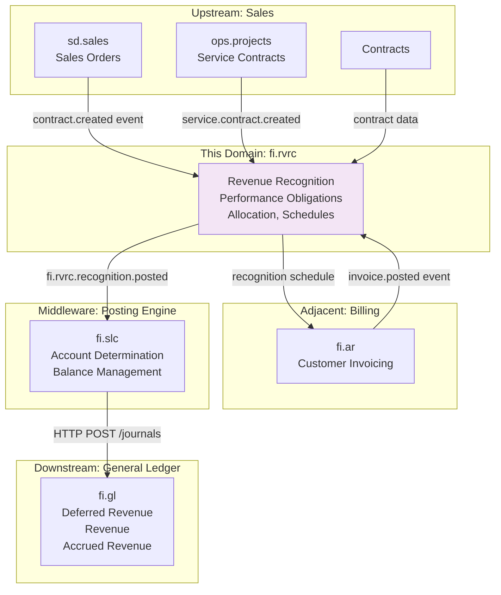
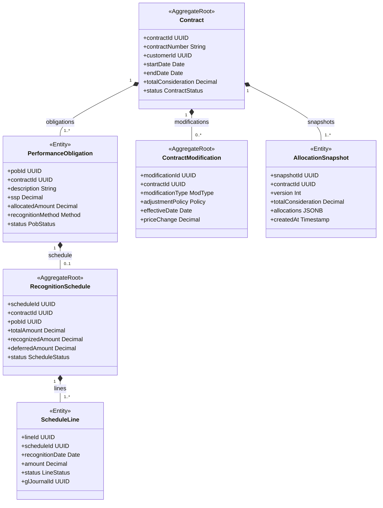
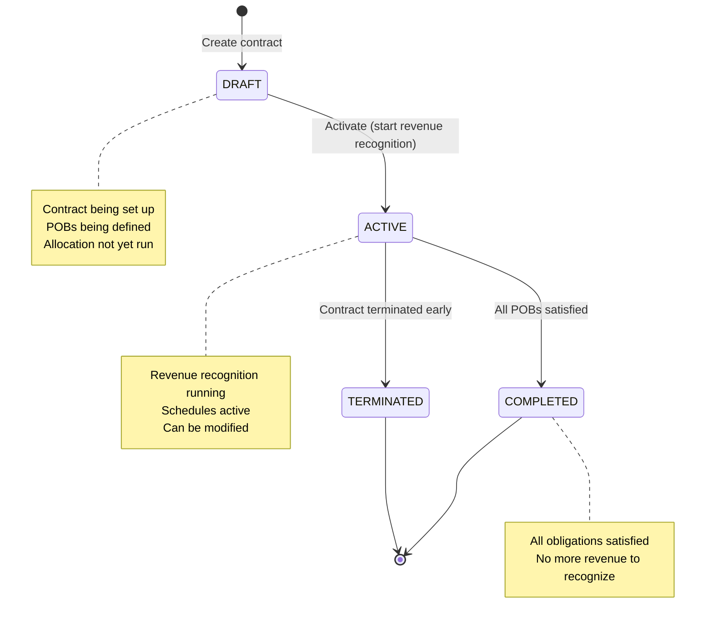
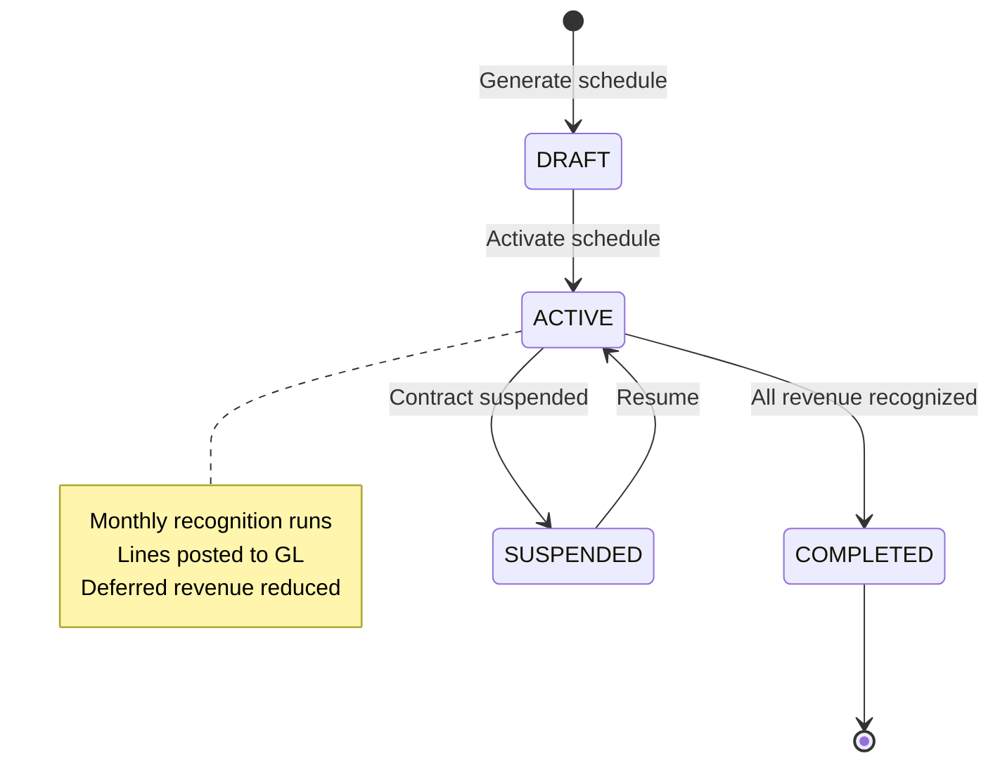
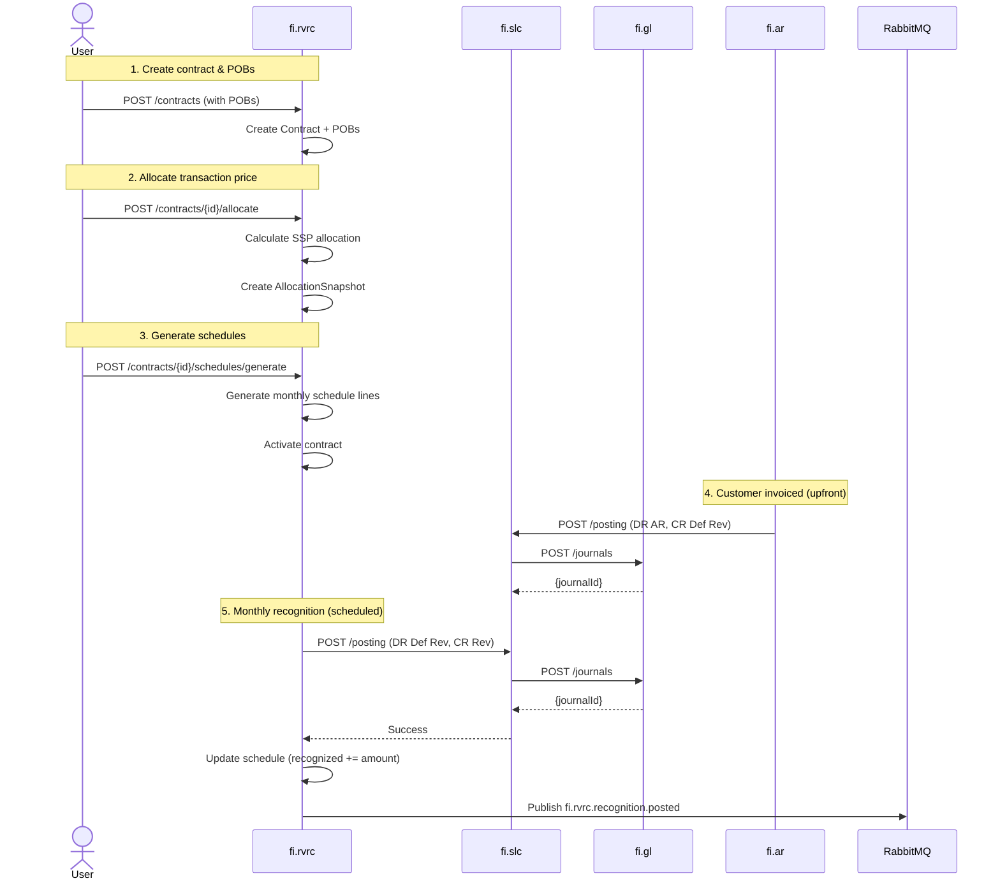

<!-- TEMPLATE COMPLIANCE: ~65%
Missing sections: §2 (Service Identity - partially in Meta), §11 (Feature Dependencies), §12 (Extension Points)
Renumbering needed: §3 -> §5 (Use Cases), §5 -> §7 (Integration), §6 -> §7 (Events, merge), §7 -> §6 (REST API), §8 -> §8 (Data Model), §9 -> §9 (Security), §10 -> §10 (Quality), §11 -> §13 (Migration), §12 -> §14 (Decisions), §13 -> §15 (Appendix)
Action needed: Expand Meta header block (Port, Repository, Tags, Team), add §2 Service Identity table, renumber sections to §0-§15, add §11 Feature Dependencies stub, add §12 Extension Points stub
-->
# Service Domain Specification — `fi.rvrc` (Revenue Recognition)

> **Meta Information**
> - **Version:** 2026-01-19
> - **Template:** `domain-service-spec.md` v1.0.0
> - **Template Compliance:** ~65% — §2, §11, §12 missing
> - **Author(s):** OpenLeap Architecture Team
> - **Status:** DRAFT
> - **Tier:** T3
> - **Suite:** `fi`
> - **Domain:** `rvrc`
> - **Service ID:** `fi-rvrc-svc`
> - **basePackage:** `io.openleap.fi.rvrc`
> - **API Base Path:** `/api/fi/rvrc/v1`

---

## Specification Guidelines Compliance

> **This specification MUST comply with the project-wide specification guidelines.**
>
> #### Non-negotiables
> - Never invent facts. If information is missing, add an **OPEN QUESTION** entry.
> - Use **MUST/SHOULD/MAY** for normative statements.
> - Keep the spec **self-contained**: no references to chat context.
> - Record decisions and boundaries explicitly (see Section 12).

---

## 0. Document Purpose & Scope

### 0.1 Purpose

This document specifies the **Revenue Recognition (`fi.rvrc`)** domain, which implements ASC 606 / IFRS 15 revenue recognition standards.

Postings MUST be executed in `fi.gl` via `fi.pst` (FI v2.1).

### 0.2 Target Audience
- Product Owners & Business Stakeholders (Finance, Revenue Accounting, Sales Operations)
- System Architects & Technical Leads
- Integration Engineers
- Revenue Accountants and Controllers
- External Auditors
- Compliance Officers

### 0.3 Scope

**In Scope:**
- **ASC 606 / IFRS 15 Compliance:** Five-step revenue recognition model
- **Contract Management:** Ingest contracts with performance obligations
- **Transaction Price Allocation:** Allocate consideration to obligations using SSP
- **Recognition Schedules:** Time-based, milestone-based, delivery-based, usage-based
- **Revenue Timing:** Over time vs. point in time recognition
- **Contract Modifications:** Handle changes, retrospective/prospective adjustments
- **Deferred Revenue:** Track liability, recognize over contract term
- **Accrued Revenue:** Recognize revenue before billing (work-in-progress)
- **GL Integration:** Generate posting requests for recognition entries via `fi.pst` (posting rules via `fi.slc`).
- **Reconciliation:** Deferred/Accrued revenue subledger to GL control accounts

**Out of Scope:**
- Billing and invoicing → fi.ar (consumes revenue recognition data)
- Order management → sd.sales
- Subscription management → Separate subscription domain
- Complex commission calculations → Separate domain
- Contract lifecycle (negotiation, approval) → CRM/CLM systems

### 0.4 Related Documents
- `platform/T3_Domains/FI/_fi_suite_v2_1.md` - FI Suite architecture (v2.1)
- `platform/T3_Domains/FI/fi_gl.md` - General Ledger
- `platform/T3_Domains/FI/fi_pst.md` - Posting orchestration
- `platform/T3_Domains/FI/fi_slc.md` - Posting semantics library
- `platform/T3_Domains/FI/fi_ar.md` - Accounts Receivable (billing)

---

## 1. Business Context

### 1.1 Domain Purpose

**fi.rvrc** ensures revenue is recognized in accordance with ASC 606 / IFRS 15, which fundamentally changed how companies recognize revenue. The core principle: recognize revenue when control of goods/services transfers to the customer, not just when cash is received or invoices are sent.

**Core Business Problems Solved:**
- **Compliance:** Meet ASC 606 / IFRS 15 requirements
- **Multi-Element Arrangements:** Properly allocate revenue across deliverables
- **Subscription Revenue:** Recognize ratably over subscription period
- **Long-Term Contracts:** Recognize revenue over time (percentage of completion)
- **Deferred Revenue:** Track unearned revenue liability
- **Contract Modifications:** Handle changes without violating standards
- **Audit Trail:** Provide complete documentation for revenue recognition

### 1.2 Business Value

**For the Organization:**
- **Compliance:** Avoid restatements, meet GAAP/IFRS requirements
- **Automation:** Eliminate manual revenue calculations (save 90% of time)
- **Accuracy:** Prevent revenue recognition errors and penalties
- **Visibility:** Real-time view of deferred and accrued revenue
- **Flexibility:** Handle complex multi-element contracts
- **Decision Making:** Understand true revenue performance

**For Users:**
- **Revenue Accountant:** Automated recognition schedules, one-click month-end
- **Controller:** Reconcile deferred revenue to GL, period close
- **Sales Ops:** Understand revenue impact of deal structures
- **CFO:** Accurate revenue forecasting, predictable earnings
- **Auditor:** Complete audit trail from contract to revenue

### 1.3 Key Stakeholders

| Role | Responsibility | Primary Use Cases |
|------|----------------|-------------------|
| Revenue Accountant | Revenue recognition | Create contracts, run recognition, reconcile |
| Controller | Month-end close | Review schedules, post to GL, close period |
| Sales Operations | Deal structuring | Understand revenue timing for contracts |
| CFO | Financial reporting | Monitor deferred revenue, revenue forecasts |
| External Auditor | Financial audit | Verify compliance with ASC 606/IFRS 15 |

### 1.4 Strategic Positioning

**fi.rvrc** sits **between** contracts/orders (upstream) and General Ledger (downstream).



**Key Insight:** fi.rvrc separates revenue recognition (when earned) from billing (when invoiced).

---

## 2. Domain Model

### 2.1 Conceptual Overview

The revenue recognition domain model follows the **ASC 606 five-step model:**

1. **Identify the contract** with a customer
2. **Identify performance obligations** (POBs) in the contract
3. **Determine the transaction price**
4. **Allocate transaction price** to performance obligations (using SSP)
5. **Recognize revenue** when/as performance obligations are satisfied

**Key Principles:**
- **Performance Obligations:** Distinct goods/services promised to customer
- **SSP (Standalone Selling Price):** Price at which entity would sell promised good/service separately
- **Transaction Price Allocation:** Allocate based on relative SSP
- **Over Time vs. Point in Time:** Recognize based on transfer of control
- **Contract Modifications:** Prospective or retrospective adjustments

### 2.2 Core Concepts



### 2.3 Aggregate Definitions

#### 2.3.1 Contract

**Business Purpose:**  
Represents a customer contract with performance obligations. Root for revenue recognition.

**Key Attributes:**

| Attribute | Type | Description | Constraints |
|-----------|------|-------------|-------------|
| contractId | UUID | Unique identifier | Required, immutable, PK |
| tenantId | UUID | Tenant ownership | Required, immutable |
| contractNumber | String | Sequential contract number | Required, unique per tenant |
| customerId | UUID | Customer | Required, FK to customers |
| entityId | UUID | Legal entity | Required, FK to entities |
| startDate | Date | Contract start date | Required |
| endDate | Date | Contract end date | Optional, null = open-ended |
| totalConsideration | Decimal | Total transaction price | Required, > 0 |
| variableConsideration | Decimal | Estimated variable portion | Optional, >= 0 |
| currency | String | Contract currency | Required, ISO 4217 |
| status | ContractStatus | Current state | Required, enum(DRAFT, ACTIVE, COMPLETED, TERMINATED) |
| sourceOrderId | UUID | Source sales order | Optional, FK to sd.orders |
| sourceProjectId | UUID | Source project | Optional, FK to ps.projects |
| terms | JSONB | Contract terms | Optional, structured data |
| createdAt | Timestamp | Creation timestamp | Auto-generated |
| activatedAt | Timestamp | Activation timestamp | Set when status → ACTIVE |

**Lifecycle States:**



**Business Rules & Invariants:**

1. **BR-CTR-001: Date Sequence**
   - *Rule:* If endDate provided, endDate > startDate
   - *Rationale:* Logical contract duration
   - *Enforcement:* CHECK constraint

2. **BR-CTR-002: Positive Consideration**
   - *Rule:* totalConsideration > 0
   - *Rationale:* Contract must have value
   - *Enforcement:* CHECK constraint

3. **BR-CTR-003: Active Prerequisites**
   - *Rule:* Cannot activate contract without at least one POB with allocation
   - *Rationale:* Need something to recognize
   - *Enforcement:* Validation on activation

**Example Scenarios:**

**Scenario 1: SaaS Subscription Contract**
```json
{
  "contractNumber": "CTR-2025-001",
  "customerId": "customer-uuid",
  "startDate": "2025-01-01",
  "endDate": "2025-12-31",
  "totalConsideration": 12000.00,
  "currency": "USD",
  "terms": {
    "billingFrequency": "MONTHLY",
    "paymentTerms": "NET_30"
  }
}
```

**POBs:**
- Software License: SSP $10,000, 12 months → Recognize ratably ($833.33/month)
- Implementation Services: SSP $2,000, delivered in January → Recognize at point in time

---

#### 2.3.2 PerformanceObligation (POB)

**Business Purpose:**  
A distinct good or service promised to the customer. Unit of revenue recognition.

**Key Attributes:**

| Attribute | Type | Description | Constraints |
|-----------|------|-------------|-------------|
| pobId | UUID | Unique identifier | Required, immutable, PK |
| contractId | UUID | Parent contract | Required, FK to contracts |
| pobNumber | Int | POB number within contract | Required, unique per contract |
| description | String | POB description | Required, e.g., "Software License - 12 months" |
| ssp | Decimal | Standalone selling price | Required, > 0 |
| allocatedAmount | Decimal | Allocated consideration | Required, > 0 (after allocation) |
| recognitionMethod | Method | How to recognize | Required, enum(TIME_BASED, MILESTONE, DELIVERY, USAGE) |
| recognitionBasis | Basis | When to recognize | Required, enum(OVER_TIME, POINT_IN_TIME) |
| measureType | MeasureType | Progress measurement | Optional, enum(TIME_ELAPSED, INPUT_HOURS, OUTPUT_UNITS) |
| totalMeasure | Decimal | Total measure (e.g., months, hours) | Optional, for over-time recognition |
| completedMeasure | Decimal | Completed measure to date | Optional, >= 0 |
| status | PobStatus | Current state | Required, enum(PENDING, ACTIVE, SATISFIED, TERMINATED) |
| satisfactionDate | Date | Date POB satisfied | Optional, set when SATISFIED |

**Recognition Methods:**

| Method | Basis | Description | Example |
|--------|-------|-------------|---------|
| TIME_BASED | OVER_TIME | Recognize ratably over time | SaaS subscription (12 months) |
| MILESTONE | OVER_TIME | Recognize at milestones | Project (design 30%, build 50%, deploy 20%) |
| DELIVERY | POINT_IN_TIME | Recognize when delivered | Software license key delivered |
| USAGE | OVER_TIME | Recognize based on usage | Cloud computing (per GB consumed) |

**Business Rules:**

1. **BR-POB-001: SSP Positivity**
   - *Rule:* ssp > 0
   - *Rationale:* Must have a price
   - *Enforcement:* CHECK constraint

2. **BR-POB-002: Allocation Completeness**
   - *Rule:* SUM(allocatedAmount) = Contract.totalConsideration
   - *Rationale:* All consideration must be allocated
   - *Enforcement:* Validation after allocation

3. **BR-POB-003: Progress Tracking**
   - *Rule:* completedMeasure <= totalMeasure
   - *Rationale:* Cannot complete more than total
   - *Enforcement:* CHECK constraint

**Example POB (SaaS License):**
```json
{
  "pobNumber": 1,
  "description": "SaaS Platform License - Annual",
  "ssp": 10000.00,
  "allocatedAmount": 10000.00,
  "recognitionMethod": "TIME_BASED",
  "recognitionBasis": "OVER_TIME",
  "measureType": "TIME_ELAPSED",
  "totalMeasure": 12.0,
  "completedMeasure": 0.0,
  "status": "ACTIVE"
}
```

---

#### 2.3.3 RecognitionSchedule

**Business Purpose:**  
Defines when and how much revenue to recognize for a performance obligation.

**Key Attributes:**

| Attribute | Type | Description | Constraints |
|-----------|------|-------------|-------------|
| scheduleId | UUID | Unique identifier | Required, immutable, PK |
| tenantId | UUID | Tenant ownership | Required, immutable |
| scheduleNumber | String | Sequential number | Required, unique per tenant |
| contractId | UUID | Parent contract | Required, FK to contracts |
| pobId | UUID | Performance obligation | Required, FK to performance_obligations |
| totalAmount | Decimal | Total to recognize | Required, = POB.allocatedAmount |
| recognizedAmount | Decimal | Amount recognized to date | Required, >= 0 |
| deferredAmount | Decimal | Remaining deferred | Required, >= 0 |
| currency | String | Currency | Required, ISO 4217 |
| status | ScheduleStatus | Current state | Required, enum(DRAFT, ACTIVE, COMPLETED, SUSPENDED) |
| startDate | Date | Recognition start | Required |
| endDate | Date | Recognition end | Optional |
| frequency | Frequency | Recognition frequency | Required, enum(DAILY, MONTHLY, QUARTERLY, EVENT_BASED) |
| createdAt | Timestamp | Creation timestamp | Auto-generated |

**Lifecycle States:**



**Business Rules:**

1. **BR-SCH-001: Amount Balance**
   - *Rule:* recognizedAmount + deferredAmount = totalAmount
   - *Rationale:* All revenue accounted for
   - *Enforcement:* Calculated field validation

2. **BR-SCH-002: Line Sum**
   - *Rule:* SUM(scheduleLine.amount) = totalAmount
   - *Rationale:* Schedule completeness
   - *Enforcement:* Validation after generation

---

#### 2.3.4 ScheduleLine

**Business Purpose:**  
Individual recognition event within a schedule. One line per recognition date.

**Key Attributes:**

| Attribute | Type | Description | Constraints |
|-----------|------|-------------|-------------|
| lineId | UUID | Unique identifier | Required, immutable, PK |
| scheduleId | UUID | Parent schedule | Required, FK to recognition_schedules |
| lineNumber | Int | Line number | Required, unique per schedule |
| recognitionDate | Date | Date to recognize revenue | Required |
| amount | Decimal | Revenue amount | Required, > 0 |
| currency | String | Currency | Required, ISO 4217 |
| status | LineStatus | Current state | Required, enum(PENDING, POSTED, REVERSED) |
| glJournalId | UUID | Posted GL journal | Optional, FK to fi.gl.journal_entries |
| postedAt | Timestamp | Posting timestamp | Optional, set when POSTED |
| notes | String | Manual notes | Optional |

**Lifecycle:** Lines are immutable once posted.

**Business Rules:**

1. **BR-LINE-001: Positive Amount**
   - *Rule:* amount > 0
   - *Rationale:* Recognition events increase revenue
   - *Enforcement:* CHECK constraint

2. **BR-LINE-002: Chronological Order**
   - *Rule:* recognitionDate for line N+1 > recognitionDate for line N
   - *Rationale:* Logical progression
   - *Enforcement:* Validation on generation

**Example Schedule Lines (Monthly Recognition):**
```
January 2025: $833.33 (POSTED)
February 2025: $833.33 (POSTED)
March 2025: $833.33 (PENDING)
April 2025: $833.33 (PENDING)
...
December 2025: $833.33 (PENDING)

Total: $10,000.00
```

---

#### 2.3.5 ContractModification

**Business Purpose:**  
Records changes to contract that affect revenue recognition. Triggers reallocation.

**Key Attributes:**

| Attribute | Type | Description | Constraints |
|-----------|------|-------------|-------------|
| modificationId | UUID | Unique identifier | Required, immutable, PK |
| tenantId | UUID | Tenant ownership | Required, immutable |
| modificationNumber | String | Sequential number | Required, unique per tenant |
| contractId | UUID | Modified contract | Required, FK to contracts |
| modificationType | ModType | Type of change | Required, enum(ADD_POB, REMOVE_POB, CHANGE_PRICE, EXTEND_TERM) |
| adjustmentPolicy | Policy | How to adjust | Required, enum(PROSPECTIVE, RETROSPECTIVE, CUMULATIVE_CATCHUP) |
| effectiveDate | Date | Effective date | Required |
| priceChange | Decimal | Change in consideration | Optional |
| newPobs | JSONB | New POBs added | Optional |
| removedPobs | JSONB | POBs removed | Optional |
| status | ModStatus | Current state | Required, enum(DRAFT, APPLIED) |
| appliedAt | Timestamp | Application timestamp | Optional, set when APPLIED |

**Modification Types:**

| Type | Description | Policy | Example |
|------|-------------|--------|---------|
| ADD_POB | Add new performance obligation | Prospective | Add training to existing software contract |
| REMOVE_POB | Remove unfulfilled obligation | Refund or credit | Cancel undelivered services |
| CHANGE_PRICE | Change transaction price | Retrospective or Prospective | Price increase mid-contract |
| EXTEND_TERM | Extend contract duration | Prospective | Extend subscription by 6 months |

**Adjustment Policies (per ASC 606-10-25-13):**

| Policy | Treatment | When Used | Example |
|--------|-----------|-----------|---------|
| PROSPECTIVE | Future only, no catch-up | Distinct addition | Add new service, recognize going forward |
| RETROSPECTIVE | Adjust past as if always existed | Not distinct | Price change, recalculate from start |
| CUMULATIVE_CATCHUP | Adjust to date, catch up in current period | Most common | Contract extension, catch up difference |

**Business Rules:**

1. **BR-MOD-001: Active Contract Only**
   - *Rule:* Can only modify ACTIVE contracts
   - *Rationale:* Logical state restriction
   - *Enforcement:* Validation on creation

2. **BR-MOD-002: Reallocation Required**
   - *Rule:* Modification triggers new allocation snapshot
   - *Rationale:* ASC 606 compliance
   - *Enforcement:* Automatic on applying modification

---

#### 2.3.6 AllocationSnapshot

**Business Purpose:**  
Captures SSP allocation at a point in time. Provides audit trail for allocation changes.

**Key Attributes:**

| Attribute | Type | Description | Constraints |
|-----------|------|-------------|-------------|
| snapshotId | UUID | Unique identifier | Required, immutable, PK |
| contractId | UUID | Parent contract | Required, FK to contracts |
| version | Int | Allocation version | Required, starts at 1 |
| totalConsideration | Decimal | Total transaction price | Required, > 0 |
| allocationMethod | String | Method used | Required, e.g., "RELATIVE_SSP" |
| allocations | JSONB | Allocation details | Required, array of {pobId, ssp, allocatedAmount} |
| createdAt | Timestamp | Creation timestamp | Auto-generated |
| createdBy | UUID | User who created | Required |

**Example Allocation:**
```json
{
  "contractId": "contract-uuid",
  "version": 1,
  "totalConsideration": 12000.00,
  "allocationMethod": "RELATIVE_SSP",
  "allocations": [
    {
      "pobId": "pob-1-uuid",
      "description": "Software License",
      "ssp": 10000.00,
      "allocatedAmount": 10000.00,
      "percentage": 83.33
    },
    {
      "pobId": "pob-2-uuid",
      "description": "Implementation",
      "ssp": 2000.00,
      "allocatedAmount": 2000.00,
      "percentage": 16.67
    }
  ]
}
```

---

## 3. Business Processes & Use Cases

### 3.1 Primary Use Cases

#### UC-001: Create Contract with Performance Obligations

**Actor:** Revenue Accountant

**Preconditions:**
- Sales order or contract signed
- Customer exists in system
- User has RVR_ADMIN role

**Main Flow:**
1. User creates contract (POST /contracts)
2. User specifies:
   - customerId, startDate, endDate
   - totalConsideration = $12,000
   - currency = "USD"
3. System creates Contract (status = DRAFT)
4. User adds performance obligations (POST /contracts/{id}/pobs)
   - POB 1: Software License, SSP = $10,000, TIME_BASED, 12 months
   - POB 2: Implementation, SSP = $2,000, DELIVERY, point in time
5. System creates PerformanceObligations
6. System validates: SUM(SSP) = $12,000 ✓

**Postconditions:**
- Contract created with 2 POBs
- Ready for allocation

**Business Rules Applied:**
- BR-CTR-001: Date sequence
- BR-CTR-002: Positive consideration
- BR-POB-001: SSP positivity

---

#### UC-002: Allocate Transaction Price

**Actor:** Revenue Accountant

**Preconditions:**
- Contract with POBs exists
- User has RVR_ADMIN role

**Main Flow:**
1. User requests allocation (POST /contracts/{id}/allocate)
2. System calculates relative SSP allocation:
   - Total SSP = $10,000 + $2,000 = $12,000
   - POB 1 allocation = ($10,000 / $12,000) × $12,000 = $10,000
   - POB 2 allocation = ($2,000 / $12,000) × $12,000 = $2,000
3. System creates AllocationSnapshot (version = 1)
4. System updates POBs:
   - POB 1: allocatedAmount = $10,000
   - POB 2: allocatedAmount = $2,000
5. System validates: SUM(allocatedAmount) = $12,000 ✓

**Postconditions:**
- Transaction price allocated to POBs
- Allocation snapshot created
- Ready for schedule generation

**Business Rules Applied:**
- BR-POB-002: Allocation completeness

---

#### UC-003: Generate Recognition Schedule

**Actor:** Revenue Accountant

**Preconditions:**
- Contract allocated
- User has RVR_ADMIN role

**Main Flow:**
1. User generates schedule (POST /contracts/{id}/schedules/generate)
2. For POB 1 (Software License - TIME_BASED):
   - Total amount: $10,000
   - Duration: 12 months (Jan 2025 - Dec 2025)
   - Monthly amount: $10,000 / 12 = $833.33
   - System creates RecognitionSchedule
   - System creates 12 ScheduleLines:
     * Jan 31, 2025: $833.33
     * Feb 28, 2025: $833.33
     * ...
     * Dec 31, 2025: $833.37 (rounding adjustment)
3. For POB 2 (Implementation - DELIVERY):
   - Total amount: $2,000
   - Recognition: Point in time (upon delivery)
   - System creates RecognitionSchedule
   - System creates 1 ScheduleLine:
     * Jan 15, 2025: $2,000 (expected delivery date)
4. System validates: SUM(line amounts) = $12,000 ✓
5. System activates Contract (status = ACTIVE)

**Postconditions:**
- Recognition schedules created
- Schedule lines pending
- Contract active

**Business Rules Applied:**
- BR-SCH-002: Line sum validation

---

#### UC-004: Run Monthly Revenue Recognition

**Actor:** System (scheduled job) or Revenue Accountant

**Preconditions:**
- Active contracts with PENDING schedule lines
- Current date = end of month
- GL period OPEN

**Main Flow:**
1. System queries all PENDING schedule lines where recognitionDate <= today
2. For each line:
   a. System retrieves schedule and contract
   b. System calls fi.slc POST /posting:
      ```json
      {
        "source": "fi.rvrc",
        "voucherId": "schedule-line-uuid",
        "eventType": "fi.rvrc.recognition.posted",
        "payload": {
          "scheduleLineId": "line-uuid",
          "contractId": "contract-uuid",
          "pobId": "pob-uuid",
          "amount": 833.33,
          "currency": "USD"
        }
      }
      ```
   c. fi.slc applies posting rule:
      - DR 2500 Deferred Revenue $833.33
      - CR 4000 Revenue $833.33
   d. fi.slc posts to fi.gl
   e. fi.gl returns journalId
   f. System updates ScheduleLine:
      - status = POSTED
      - glJournalId = journalId
      - postedAt = now
   g. System updates RecognitionSchedule:
      - recognizedAmount += $833.33
      - deferredAmount -= $833.33
3. System publishes fi.rvrc.recognition.posted event per line

**Postconditions:**
- Revenue recognized for the month
- Deferred revenue reduced
- GL journals created
- Events published

---

#### UC-005: Handle Contract Modification (Price Increase)

**Actor:** Revenue Accountant

**Preconditions:**
- Active contract
- Customer agrees to price increase
- User has RVR_ADMIN role

**Main Flow:**
1. User creates modification (POST /contracts/{id}/modifications)
2. User specifies:
   - modificationType = CHANGE_PRICE
   - priceChange = +$1,200 (10% increase)
   - effectiveDate = "2025-07-01" (mid-contract)
   - adjustmentPolicy = CUMULATIVE_CATCHUP
3. System calculates impact:
   - New totalConsideration = $12,000 + $1,200 = $13,200
   - Months elapsed (Jan-Jun): 6 months
   - Months remaining (Jul-Dec): 6 months
   - Old monthly recognition: $833.33
   - New monthly recognition: $13,200 / 12 = $1,100
   - Catch-up needed: ($1,100 - $833.33) × 6 = $1,600
4. System creates ContractModification (status = DRAFT)
5. User applies modification
6. System:
   a. Updates Contract: totalConsideration = $13,200
   b. Creates new AllocationSnapshot (version = 2)
   c. Reallocates to POBs (proportionally)
   d. Updates RecognitionSchedule
   e. Creates catch-up ScheduleLine for July 1, 2025: $1,600
   f. Updates future lines: $1,100 each (Jul-Dec)
7. System posts catch-up revenue:
   - DR 2500 Deferred Revenue $1,600
   - CR 4000 Revenue $1,600
8. System updates ContractModification: status = APPLIED

**Postconditions:**
- Contract modified
- Schedule adjusted
- Catch-up revenue recognized
- Future revenue increased

---

#### UC-006: Post Deferred Revenue on Billing

**Actor:** fi.ar (automated, when invoice posted)

**Preconditions:**
- Contract exists with recognition schedule
- Customer invoiced
- Billing ahead of revenue recognition

**Main Flow:**
1. fi.ar posts invoice for $12,000 (full contract upfront billing)
2. fi.ar checks if contract has deferred revenue
3. fi.ar calls fi.slc POST /posting:
   - DR 1200 Accounts Receivable $12,000
   - CR 2500 Deferred Revenue $12,000
4. Over next 12 months, fi.rvrc recognizes revenue:
   - DR 2500 Deferred Revenue $833.33
   - CR 4000 Revenue $833.33 (each month)
5. After 12 months: Deferred Revenue = $0, Revenue = $12,000

**Postconditions:**
- Cash collected upfront
- Revenue deferred
- Recognized over time per schedule

---

### 3.2 Process Flow Diagrams

#### Process: Contract to Revenue Recognition



---

## 4. Business Rules & Constraints

### 4.1 Business Rules Catalog

| ID | Rule Name | Description | Scope | Enforcement |
|----|-----------|-------------|-------|-------------|
| BR-CTR-001 | Date Sequence | endDate > startDate | Contract | Create/Update |
| BR-CTR-002 | Positive Consideration | totalConsideration > 0 | Contract | Create |
| BR-CTR-003 | Active Prerequisites | Cannot activate without POB + allocation | Contract | Activate |
| BR-POB-001 | SSP Positivity | SSP > 0 | PerformanceObligation | Create |
| BR-POB-002 | Allocation Completeness | SUM(allocatedAmount) = totalConsideration | PerformanceObligation | Allocate |
| BR-POB-003 | Progress Tracking | completedMeasure <= totalMeasure | PerformanceObligation | Update |
| BR-SCH-001 | Amount Balance | recognized + deferred = total | RecognitionSchedule | Always |
| BR-SCH-002 | Line Sum | SUM(line.amount) = totalAmount | RecognitionSchedule | Generate |
| BR-LINE-001 | Positive Amount | amount > 0 | ScheduleLine | Create |
| BR-LINE-002 | Chronological Order | lines in date order | ScheduleLine | Generate |
| BR-MOD-001 | Active Contract Only | Modify only ACTIVE contracts | ContractModification | Create |
| BR-MOD-002 | Reallocation Required | Modification triggers new snapshot | ContractModification | Apply |

---

## 5. Integration Architecture

### 5.1 Integration Pattern Decision

**Does this domain use orchestration (Saga/Temporal)?** [ ] YES [X] NO

**Pattern Used:** Event-Driven Architecture (Choreography)

**Rationale:**

fi.rvrc uses **pure Event-Driven Architecture** because:

✅ **REVREC is Event Consumer:**
- Consumes fi.ar.invoice.posted (link billing to revenue)
- Consumes sd.order.completed (trigger contract creation)

✅ **REVREC is Event Publisher:**
- Publishes recognition.posted, schedule.completed
- Downstream services react (fi.rpt, t4.bi)

✅ **Synchronous GL Posting:**
- Calls fi.slc HTTP POST /posting (synchronous)
- Waits for confirmation (need journalId)
- But this is single-call, not multi-step saga

❌ **Why NOT Orchestration:**
- No multi-service transaction
- Recognition is: Schedule → Post → GL (linear)
- Each step can be retried independently
- No compensation logic needed

### 5.2 Event-Driven Integration

**Inbound Events (Consumed):**

| Event | Source | Purpose | Handling |
|-------|--------|---------|----------|
| fi.ar.invoice.posted | fi.ar | Link billing to contract | Update billing status, may defer revenue |
| sd.order.completed | sd.sales | Trigger contract creation | Create contract from order |
| ops.milestone.achieved | ops.projects | Progress POB | Update completedMeasure, recognize revenue |
| fi.gl.period.closed | fi.gl | Prevent posting to closed period | Validate period status |

**Outbound Events (Published):**

| Event | When | Purpose | Consumers |
|-------|------|---------|-----------|
| fi.rvrc.recognition.posted | Revenue recognized | Notify of revenue event | fi.rpt, t4.bi |
| fi.rvrc.schedule.completed | All revenue recognized | Contract completed | fi.rpt, analytics |
| fi.rvrc.contract.modified | Contract modified | Track modifications | fi.rpt, audit |

---

## 6. Event Catalog

### 6.1 Outbound Events

**Exchange:** `fi.rvrc.events` (RabbitMQ topic exchange)

#### Event: recognition.posted

**Routing Key:** `fi.rvrc.recognition.posted`

**When Published:** Revenue recognized and posted to GL

**Business Meaning:** Revenue earned for the period

**Consumers:**
- fi.rpt (update revenue reports)
- t4.bi (revenue analytics)

**Payload:**
```json
{
  "eventId": "evt-uuid",
  "tenantId": "tenant-uuid",
  "occurredAt": "2025-01-31T23:59:59Z",
  "traceId": "trace-uuid",
  "producer": "fi.rvrc",
  "aggregateType": "schedule_line",
  "changeType": "posted",
  "entityIds": ["line-uuid"],
  "version": 1,
  "payload": {
    "scheduleLineId": "line-uuid",
    "scheduleId": "schedule-uuid",
    "contractId": "contract-uuid",
    "pobId": "pob-uuid",
    "recognitionDate": "2025-01-31",
    "amount": 833.33,
    "currency": "USD",
    "glJournalId": "journal-uuid"
  }
}
```

---

## 7. API Specification

### 7.1 REST API

**Base Path:** `/api/fi/revrec/v1`

**Authentication:** OAuth 2.0 Bearer Token

**Content Type:** `application/json`

#### 7.1.1 Contracts

**POST /contracts** - Create contract
- **Role:** RVR_ADMIN
- **Request Body:**
  ```json
  {
    "customerId": "customer-uuid",
    "entityId": "entity-uuid",
    "startDate": "2025-01-01",
    "endDate": "2025-12-31",
    "totalConsideration": 12000.00,
    "currency": "USD",
    "pobs": [
      {
        "description": "Software License",
        "ssp": 10000.00,
        "recognitionMethod": "TIME_BASED",
        "recognitionBasis": "OVER_TIME",
        "totalMeasure": 12.0
      }
    ]
  }
  ```
- **Response:** 201 Created

**POST /contracts/{id}/allocate** - Allocate transaction price
- **Role:** RVR_ADMIN
- **Response:** 200 OK (allocation details)

**POST /contracts/{id}/schedules/generate** - Generate schedules
- **Role:** RVR_ADMIN
- **Response:** 201 Created

**GET /contracts** - List contracts
- **Role:** RVR_VIEWER
- **Query Params:** `customerId`, `status`, `page`, `size`
- **Response:** 200 OK

---

#### 7.1.2 Recognition

**POST /schedules/run** - Run recognition for period
- **Role:** RVR_ADMIN
- **Request Body:**
  ```json
  {
    "periodEndDate": "2025-01-31",
    "simulate": false
  }
  ```
- **Response:** 200 OK (recognition summary)

**GET /schedules/{id}/lines** - Get schedule lines
- **Role:** RVR_VIEWER
- **Query Params:** `status`, `fromDate`, `toDate`
- **Response:** 200 OK

---

### 7.2 Error Responses

| HTTP Status | Error Code | Description |
|-------------|------------|-------------|
| 400 | ALLOCATION_INCOMPLETE | POBs not fully allocated |
| 400 | SCHEDULE_INVALID | Schedule generation failed |
| 403 | PERIOD_CLOSED | Cannot recognize in closed period |
| 404 | CONTRACT_NOT_FOUND | Contract does not exist |
| 409 | ALREADY_POSTED | Line already posted to GL |

---

## 8. Data Model

### 8.1 Storage Schema (PostgreSQL)

#### Schema: fi_rvrc

#### Table: rvr_contracts
```sql
CREATE TABLE fi_rvrc.rvr_contracts (
  contract_id UUID PRIMARY KEY,
  tenant_id UUID NOT NULL,
  contract_number VARCHAR(50) NOT NULL,
  customer_id UUID NOT NULL,
  entity_id UUID NOT NULL,
  start_date DATE NOT NULL,
  end_date DATE,
  total_consideration NUMERIC(19,4) NOT NULL,
  variable_consideration NUMERIC(19,4),
  currency CHAR(3) NOT NULL,
  status VARCHAR(20) NOT NULL DEFAULT 'DRAFT',
  source_order_id UUID,
  source_project_id UUID,
  terms JSONB,
  created_at TIMESTAMP NOT NULL DEFAULT NOW(),
  activated_at TIMESTAMP,
  UNIQUE (tenant_id, contract_number),
  CHECK (status IN ('DRAFT', 'ACTIVE', 'COMPLETED', 'TERMINATED')),
  CHECK (total_consideration > 0),
  CHECK (end_date IS NULL OR end_date > start_date)
);

CREATE INDEX idx_contracts_tenant ON fi_rvrc.rvr_contracts(tenant_id);
CREATE INDEX idx_contracts_customer ON fi_rvrc.rvr_contracts(customer_id);
CREATE INDEX idx_contracts_status ON fi_rvrc.rvr_contracts(status);
```

#### Table: rvr_performance_obligations
```sql
CREATE TABLE fi_rvrc.rvr_performance_obligations (
  pob_id UUID PRIMARY KEY,
  contract_id UUID NOT NULL REFERENCES fi_rvrc.rvr_contracts(contract_id) ON DELETE CASCADE,
  pob_number INT NOT NULL,
  description VARCHAR(500) NOT NULL,
  ssp NUMERIC(19,4) NOT NULL,
  allocated_amount NUMERIC(19,4),
  recognition_method VARCHAR(20) NOT NULL,
  recognition_basis VARCHAR(20) NOT NULL,
  measure_type VARCHAR(20),
  total_measure NUMERIC(19,6),
  completed_measure NUMERIC(19,6) DEFAULT 0,
  status VARCHAR(20) NOT NULL DEFAULT 'PENDING',
  satisfaction_date DATE,
  UNIQUE (contract_id, pob_number),
  CHECK (ssp > 0),
  CHECK (recognition_method IN ('TIME_BASED', 'MILESTONE', 'DELIVERY', 'USAGE')),
  CHECK (recognition_basis IN ('OVER_TIME', 'POINT_IN_TIME')),
  CHECK (status IN ('PENDING', 'ACTIVE', 'SATISFIED', 'TERMINATED')),
  CHECK (completed_measure <= total_measure)
);

CREATE INDEX idx_pobs_contract ON fi_rvrc.rvr_performance_obligations(contract_id);
```

#### Table: rvr_recognition_schedules
```sql
CREATE TABLE fi_rvrc.rvr_recognition_schedules (
  schedule_id UUID PRIMARY KEY,
  tenant_id UUID NOT NULL,
  schedule_number VARCHAR(50) NOT NULL,
  contract_id UUID NOT NULL,
  pob_id UUID NOT NULL,
  total_amount NUMERIC(19,4) NOT NULL,
  recognized_amount NUMERIC(19,4) NOT NULL DEFAULT 0,
  deferred_amount NUMERIC(19,4) NOT NULL,
  currency CHAR(3) NOT NULL,
  status VARCHAR(20) NOT NULL DEFAULT 'DRAFT',
  start_date DATE NOT NULL,
  end_date DATE,
  frequency VARCHAR(20) NOT NULL,
  created_at TIMESTAMP NOT NULL DEFAULT NOW(),
  UNIQUE (tenant_id, schedule_number),
  CHECK (status IN ('DRAFT', 'ACTIVE', 'COMPLETED', 'SUSPENDED')),
  CHECK (total_amount > 0),
  CHECK (recognized_amount >= 0),
  CHECK (deferred_amount >= 0),
  CHECK (recognized_amount + deferred_amount = total_amount)
);

CREATE INDEX idx_schedules_tenant ON fi_rvrc.rvr_recognition_schedules(tenant_id);
CREATE INDEX idx_schedules_contract ON fi_rvrc.rvr_recognition_schedules(contract_id);
```

#### Table: rvr_schedule_lines
```sql
CREATE TABLE fi_rvrc.rvr_schedule_lines (
  line_id UUID PRIMARY KEY,
  schedule_id UUID NOT NULL REFERENCES fi_rvrc.rvr_recognition_schedules(schedule_id) ON DELETE CASCADE,
  line_number INT NOT NULL,
  recognition_date DATE NOT NULL,
  amount NUMERIC(19,4) NOT NULL,
  currency CHAR(3) NOT NULL,
  status VARCHAR(20) NOT NULL DEFAULT 'PENDING',
  gl_journal_id UUID,
  posted_at TIMESTAMP,
  notes TEXT,
  UNIQUE (schedule_id, line_number),
  CHECK (status IN ('PENDING', 'POSTED', 'REVERSED')),
  CHECK (amount > 0)
);

CREATE INDEX idx_lines_schedule ON fi_rvrc.rvr_schedule_lines(schedule_id);
CREATE INDEX idx_lines_date ON fi_rvrc.rvr_schedule_lines(recognition_date);
CREATE INDEX idx_lines_status ON fi_rvrc.rvr_schedule_lines(status);
```

---

## 9. Security & Compliance

### 9.1 Access Control

**Roles & Permissions:**

| Role | Read | Create | Update | Delete | Admin Operations |
|------|------|--------|--------|--------|------------------|
| RVR_VIEWER | ✓ (all) | ✗ | ✗ | ✗ | ✗ |
| RVR_ADMIN | ✓ (all) | ✓ (all) | ✓ (all) | ✓ (drafts) | ✓ (run recognition) |

### 9.2 Compliance Requirements

**Regulations:**
- [X] ASC 606 (US GAAP) - Revenue from Contracts with Customers
- [X] IFRS 15 (IFRS) - Revenue from Contracts with Customers
- [X] SOX - Revenue recognition controls

---

## 10. Quality Attributes

### 10.1 Performance Requirements

**Response Time (95th percentile):**
- POST /contracts: < 300ms
- POST /schedules/generate: < 2 sec (for 100 lines)
- POST /schedules/run: < 10 sec (for 10K lines)

**Throughput:**
- Contract creation: 100 contracts/sec
- Recognition posting: 1,000 lines/min

---

## 11. Migration & Evolution

### 11.1 Data Migration

**From Legacy:**
- Export existing contracts with obligations
- Import as active contracts
- Generate schedules for remaining term
- Validate: Deferred revenue = GL balance

---

## 12. Open Questions & Decisions

### 12.1 ADRs

#### ADR-001: ASC 606 vs. Legacy

**Status:** Accepted

**Decision:** Implement full ASC 606 / IFRS 15 model

**Rationale:**
- Regulatory requirement for public companies
- Provides better revenue visibility
- Supports complex multi-element arrangements

---

## 13. Appendix

### 13.1 Glossary

| Term | Definition |
|------|------------|
| ASC 606 | Accounting Standards Codification Topic 606 (US GAAP) |
| IFRS 15 | International Financial Reporting Standard 15 |
| POB | Performance Obligation |
| SSP | Standalone Selling Price |
| Deferred Revenue | Liability for unearned revenue |
| Accrued Revenue | Asset for earned but not yet billed revenue |


