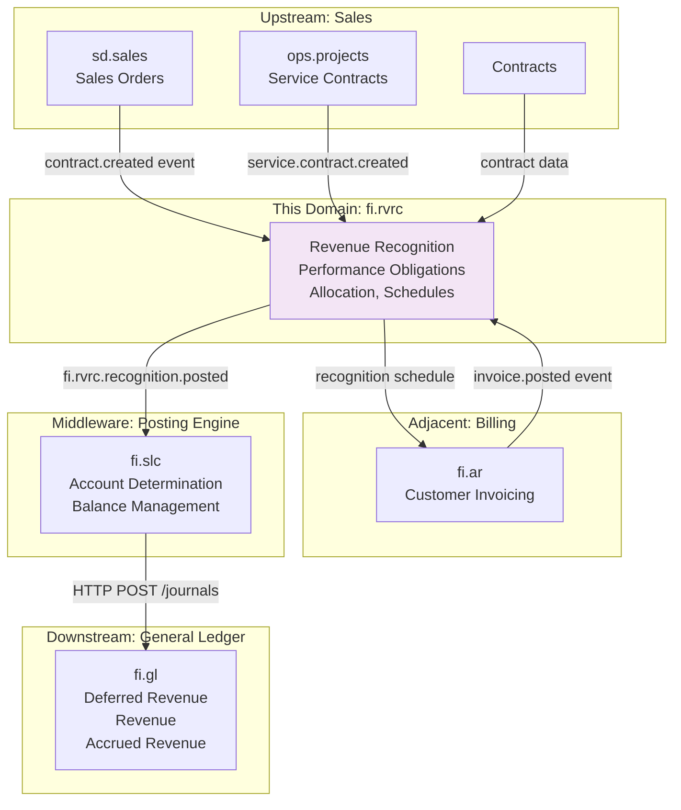
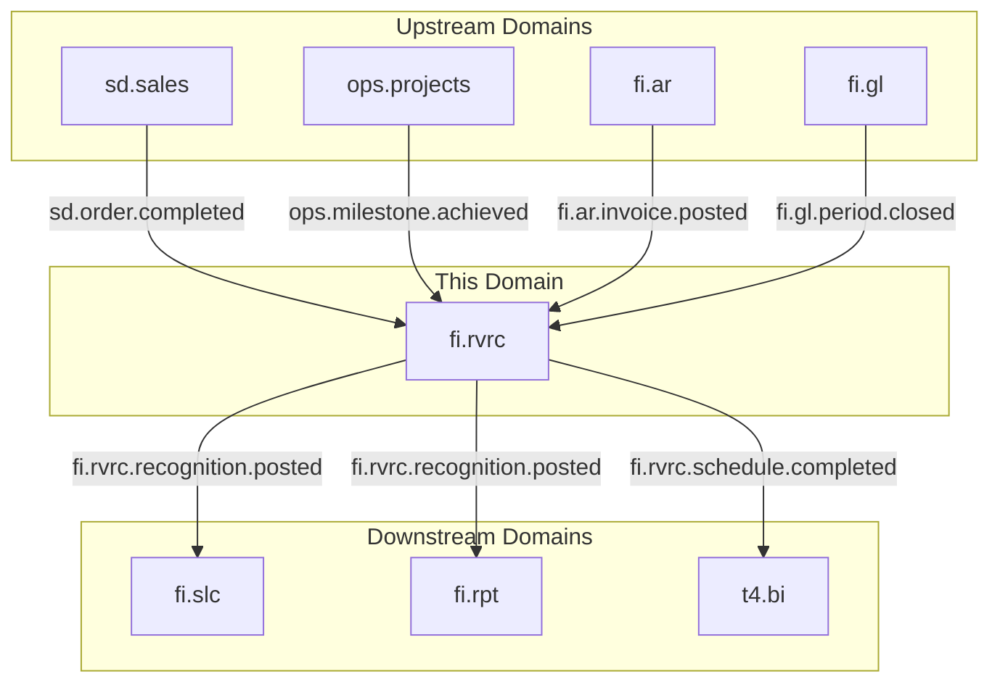
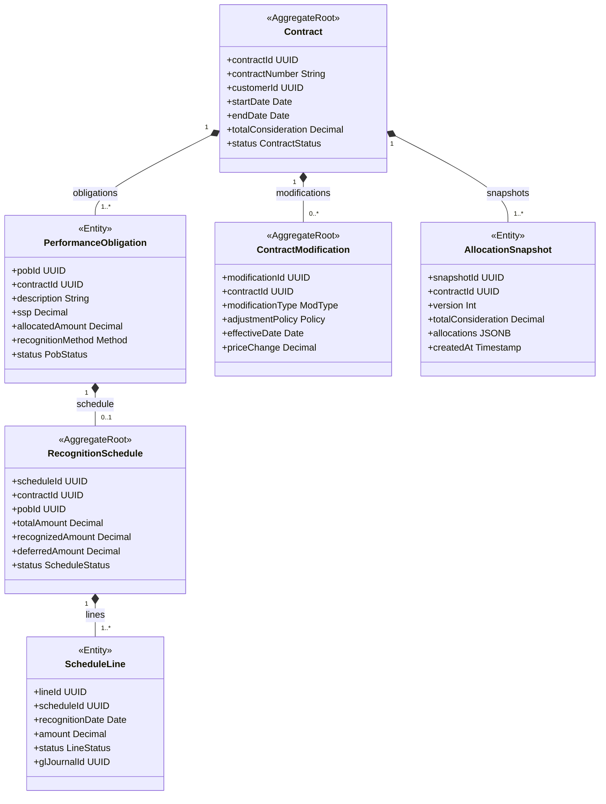
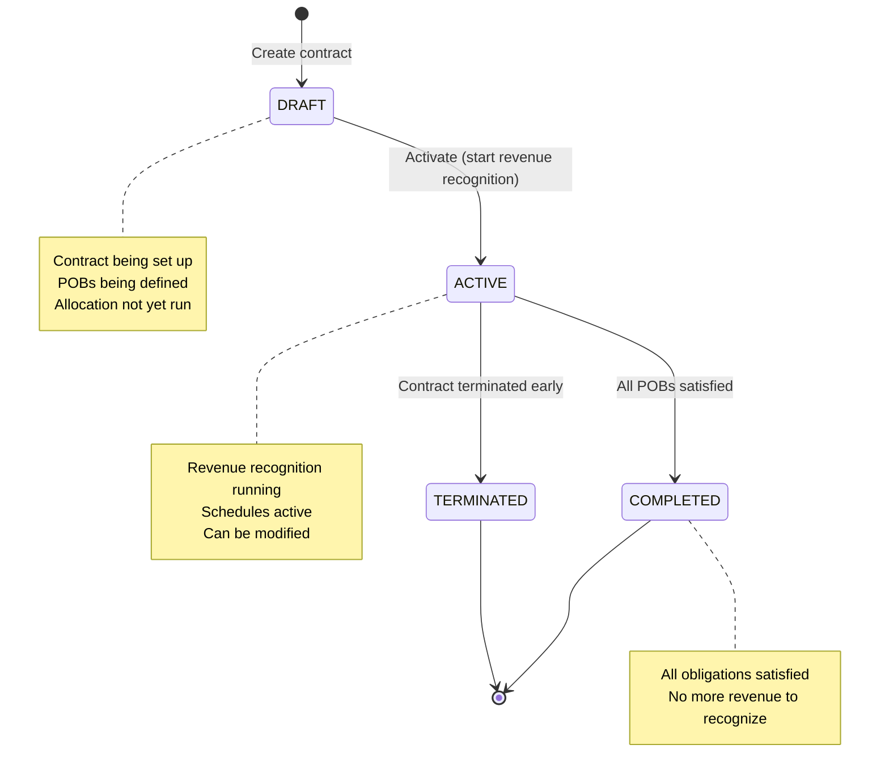
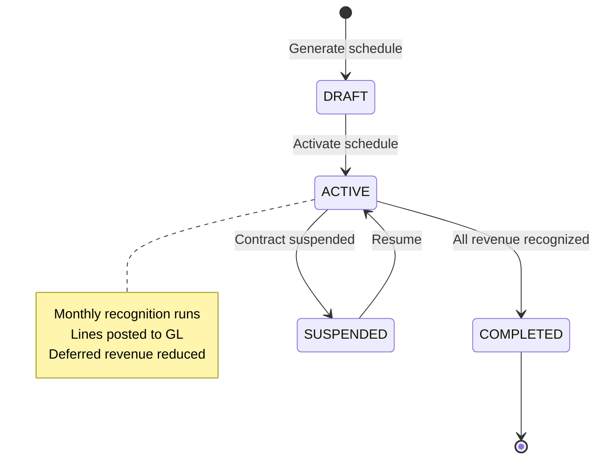
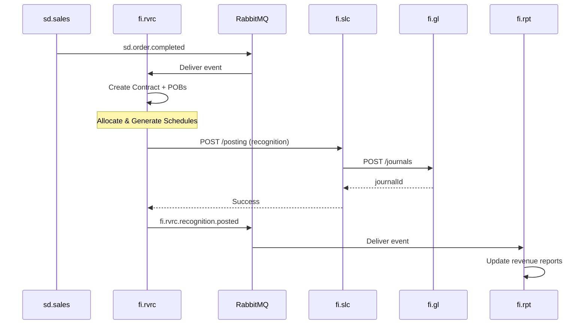
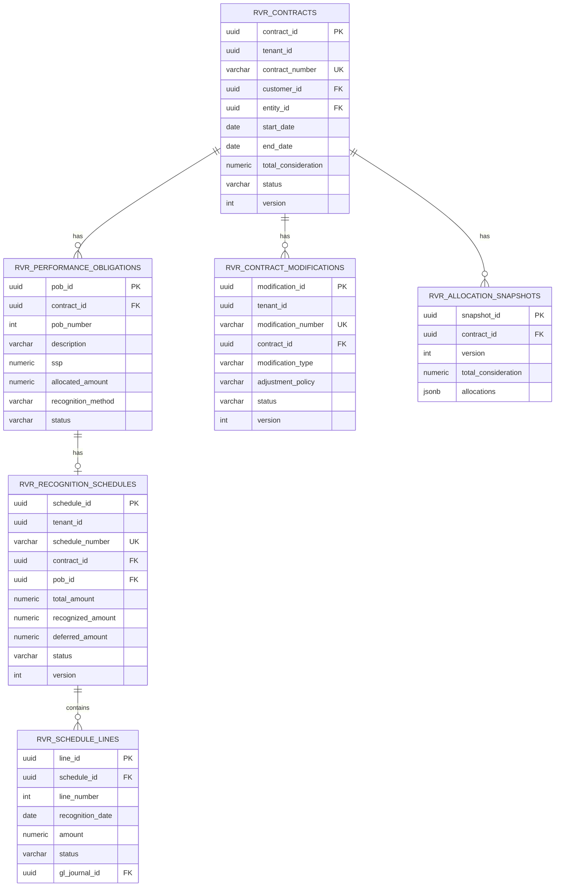

<!-- Template Meta
     Template-ID:   TPL-SVC
     Version:       1.0.0
     Last Updated:  2026-04-03
     Changelog:
       1.0.0 (2026-04-03) — Initial versioned baseline.
-->

# FI - RVRC Domain / Service Specification (Revenue Recognition)

> **Conceptual Stack Layer:** Domain / Service
> **Space:** Platform
> **Owner:** FI Domain Engineering Team
> **Schema alignment:** `service-layer.schema.json`
> **Companion files:** `openapi.yaml`, `*.schema.json` (event contracts)
> **Referenced by:** Platform-Feature Spec SS5 (backend dependencies), BFF Contract
> **Belongs to:** Suite Spec (`_fi_suite.md`)

> **Meta Information**
> - **Version:** 2026-04-04
> - **Template:** `domain-service-spec.md` v1.0.0
> - **Template Compliance:** ~95% — minor gaps in §11 feature register (pending feature specs)
> - **Author(s):** OpenLeap Architecture Team
> - **Status:** DRAFT
> - **Suite:** `fi`
> - **Domain:** `rvrc`
> - **Bounded Context Ref:** `bc:revenue-recognition`
> - **Service ID:** `fi-rvrc-svc`
> - **basePackage:** `io.openleap.fi.rvrc`
> - **API Base Path:** `/api/fi/rvrc/v1`
> - **OpenLeap Starter Version:** `v4.1.0`
> - **Port:** `8443`
> - **Repository:** `https://github.com/openleap/io.openleap.fi.rvrc`
> - **Tags:** `finance`, `revenue-recognition`, `asc606`, `ifrs15`, `deferred-revenue`
> - **Team:**
>   - Name: `team-fi`
>   - Email: `fi-team@openleap.io`
>   - Slack: `#fi-team`

---

## Specification Guidelines Compliance

> ### Non-Negotiables
> - Never invent facts. If required info is missing, add an **OPEN QUESTION** entry.
> - Preserve intent and decisions. Only change meaning when explicitly requested.
> - Do not remove normative constraints unless they are explicitly replaced.
> - Keep the spec **self-contained**: no "see chat", no implicit context.
>
> ### Source of Truth Priority
> When sources conflict:
> 1. Spec (explicit) wins
> 2. Starter specs (implementation constraints) next
> 3. Guidelines (best practices) last
>
> Record conflicts in the **Decisions & Conflicts** section (see Section 14).
>
> ### Style Guide
> - Prefer short sentences and lists.
> - Use MUST/SHOULD/MAY for normative statements.
> - Keep terminology consistent (Aggregate, Domain Service, Application Service, Command, Event).
> - Avoid ambiguous words ("often", "maybe") unless explicitly noting uncertainty.
> - Keep examples minimal and clearly marked as examples.
> - Do not add implementation code unless the chapter explicitly requires it.

---

## 0. Document Purpose & Scope

### 0.1 Purpose

This document specifies the **Revenue Recognition (`fi.rvrc`)** domain, which implements ASC 606 / IFRS 15 revenue recognition standards. It covers the five-step revenue recognition model: contract identification, performance obligation identification, transaction price determination, price allocation, and revenue recognition timing.

Postings MUST be executed in `fi.gl` via `fi.pst` (FI v2.1).

### 0.2 Target Audience
- Product Owners & Business Stakeholders (Finance, Revenue Accounting, Sales Operations)
- System Architects & Technical Leads
- Integration Engineers
- Revenue Accountants and Controllers
- External Auditors
- Compliance Officers

### 0.3 Scope

**In Scope:**
- **ASC 606 / IFRS 15 Compliance:** Five-step revenue recognition model
- **Contract Management:** Ingest contracts with performance obligations
- **Transaction Price Allocation:** Allocate consideration to obligations using SSP
- **Recognition Schedules:** Time-based, milestone-based, delivery-based, usage-based
- **Revenue Timing:** Over time vs. point in time recognition
- **Contract Modifications:** Handle changes, retrospective/prospective adjustments
- **Deferred Revenue:** Track liability, recognize over contract term
- **Accrued Revenue:** Recognize revenue before billing (work-in-progress)
- **GL Integration:** Generate posting requests for recognition entries via `fi.pst` (posting rules via `fi.slc`).
- **Reconciliation:** Deferred/Accrued revenue subledger to GL control accounts

**Out of Scope:**
- Billing and invoicing -> fi.ar (consumes revenue recognition data)
- Order management -> sd.sales
- Subscription management -> Separate subscription domain
- Complex commission calculations -> Separate domain
- Contract lifecycle (negotiation, approval) -> CRM/CLM systems

### 0.4 Related Documents
- `spec/T3_Domains/FI/_fi_suite.md` - FI Suite architecture
- `spec/T3_Domains/FI/domain-specs/core/fi_gl-spec.md` - General Ledger
- `spec/T3_Domains/FI/domain-specs/core/fi_pst-spec.md` - Posting orchestration
- `spec/T3_Domains/FI/domain-specs/core/fi_slc-spec.md` - Posting semantics library
- `spec/T3_Domains/FI/domain-specs/ext/fi_ar-spec.md` - Accounts Receivable (billing)

---

## 1. Business Context

### 1.1 Domain Purpose

**fi.rvrc** ensures revenue is recognized in accordance with ASC 606 / IFRS 15, which fundamentally changed how companies recognize revenue. The core principle: recognize revenue when control of goods/services transfers to the customer, not just when cash is received or invoices are sent.

**Core Business Problems Solved:**
- **Compliance:** Meet ASC 606 / IFRS 15 requirements
- **Multi-Element Arrangements:** Properly allocate revenue across deliverables
- **Subscription Revenue:** Recognize ratably over subscription period
- **Long-Term Contracts:** Recognize revenue over time (percentage of completion)
- **Deferred Revenue:** Track unearned revenue liability
- **Contract Modifications:** Handle changes without violating standards
- **Audit Trail:** Provide complete documentation for revenue recognition

### 1.2 Business Value

**For the Organization:**
- **Compliance:** Avoid restatements, meet GAAP/IFRS requirements
- **Automation:** Eliminate manual revenue calculations (save 90% of time)
- **Accuracy:** Prevent revenue recognition errors and penalties
- **Visibility:** Real-time view of deferred and accrued revenue
- **Flexibility:** Handle complex multi-element contracts
- **Decision Making:** Understand true revenue performance

**For Users:**
- **Revenue Accountant:** Automated recognition schedules, one-click month-end
- **Controller:** Reconcile deferred revenue to GL, period close
- **Sales Ops:** Understand revenue impact of deal structures
- **CFO:** Accurate revenue forecasting, predictable earnings
- **Auditor:** Complete audit trail from contract to revenue

### 1.3 Key Stakeholders

| Role | Responsibility | Primary Use Cases |
|------|----------------|-------------------|
| Revenue Accountant | Revenue recognition | Create contracts, run recognition, reconcile |
| Controller | Month-end close | Review schedules, post to GL, close period |
| Sales Operations | Deal structuring | Understand revenue timing for contracts |
| CFO | Financial reporting | Monitor deferred revenue, revenue forecasts |
| External Auditor | Financial audit | Verify compliance with ASC 606/IFRS 15 |

### 1.4 Strategic Positioning

**fi.rvrc** sits **between** contracts/orders (upstream) and General Ledger (downstream).



**Key Insight:** fi.rvrc separates revenue recognition (when earned) from billing (when invoiced).

### 1.5 Service Context

| Property | Value |
|----------|-------|
| **Suite** | `fi` |
| **Domain** | `rvrc` |
| **Bounded Context** | `bc:revenue-recognition` |
| **Service ID** | `fi-rvrc-svc` |
| **Base Package** | `io.openleap.fi.rvrc` |

**Responsibilities:**
- Manage revenue contracts with performance obligations (ASC 606 / IFRS 15)
- Allocate transaction prices to performance obligations using relative SSP
- Generate and execute revenue recognition schedules (time-based, milestone, delivery, usage)
- Handle contract modifications with prospective/retrospective/cumulative catch-up adjustments
- Maintain allocation snapshots for audit trail
- Integrate with fi.slc/fi.gl for GL postings of revenue recognition entries

**Authoritative Sources:**
| Source Type | Description | Access Pattern |
|-------------|-------------|----------------|
| REST API | Contract, schedule, and recognition data | Synchronous |
| Database | Revenue contracts, POBs, schedules, allocations | Direct (owner) |
| Events | Recognition posted, schedule completed, contract modified | Asynchronous |



---

## 2. Service Identity

| Property | Value | Schema Field |
|----------|-------|-------------|
| **Service ID** | `fi-rvrc-svc` | `metadata.id` |
| **Display Name** | `Revenue Recognition Service` | `metadata.name` |
| **Suite** | `fi` | `metadata.suite` |
| **Domain** | `rvrc` | `metadata.domain` |
| **Bounded Context** | `bc:revenue-recognition` | `metadata.bounded_context_ref` |
| **Version** | `1.0.0` | `metadata.version` |
| **Status** | DRAFT | `metadata.status` |
| **API Base Path** | `/api/fi/rvrc/v1` | `metadata.api_base_path` |
| **Repository** | `https://github.com/openleap/io.openleap.fi.rvrc` | `metadata.repository` |
| **Tags** | `finance`, `revenue-recognition`, `asc606`, `ifrs15` | `metadata.tags` |

**Team:**
| Property | Value |
|----------|-------|
| **Name** | `team-fi` |
| **Email** | `fi-team@openleap.io` |
| **Slack Channel** | `#fi-team` |

---

## 3. Domain Model

### 3.1 Conceptual Overview

The revenue recognition domain model follows the **ASC 606 five-step model:**

1. **Identify the contract** with a customer
2. **Identify performance obligations** (POBs) in the contract
3. **Determine the transaction price**
4. **Allocate transaction price** to performance obligations (using SSP)
5. **Recognize revenue** when/as performance obligations are satisfied

**Key Principles:**
- **Performance Obligations:** Distinct goods/services promised to customer
- **SSP (Standalone Selling Price):** Price at which entity would sell promised good/service separately
- **Transaction Price Allocation:** Allocate based on relative SSP
- **Over Time vs. Point in Time:** Recognize based on transfer of control
- **Contract Modifications:** Prospective or retrospective adjustments

### 3.2 Core Concepts



### 3.3 Aggregate Definitions

#### 3.3.1 Contract

| Property | Value |
|----------|-------|
| **Aggregate ID** | `agg:contract` |
| **Name** | `Contract` |

**Business Purpose:**
Represents a customer contract with performance obligations. Root entity for the ASC 606 / IFRS 15 revenue recognition process. A contract captures the agreement between the entity and a customer that creates enforceable rights and obligations.

##### Aggregate Root

**Key Attributes:**
| Attribute | Type | Format | Description | Constraints | Required | Read-Only |
|-----------|------|--------|-------------|-------------|----------|-----------|
| contractId | string | uuid | Unique identifier generated via OlUuid.create() | Immutable | Yes | Yes |
| tenantId | string | uuid | Tenant ownership for RLS isolation | Immutable | Yes | Yes |
| contractNumber | string | — | Sequential business key (e.g., CTR-2025-001) | max_length: 50, unique per tenant | Yes | No |
| customerId | string | uuid | Reference to customer in bp service | FK to bp.customers | Yes | No |
| entityId | string | uuid | Legal entity executing the contract | FK to legal entities | Yes | No |
| startDate | string | date | Contract effective start date | — | Yes | No |
| endDate | string | date | Contract effective end date | minimum: startDate; null = open-ended | No | No |
| totalConsideration | number | decimal | Total transaction price (fixed + variable) | precision: 19,4; minimum: 0.0001 | Yes | No |
| variableConsideration | number | decimal | Estimated variable portion (rebates, bonuses, penalties) | precision: 19,4; minimum: 0 | No | No |
| currency | string | — | Contract currency code | pattern: `^[A-Z]{3}$`, ISO 4217 | Yes | No |
| status | string | — | Current lifecycle state | enum_ref: `ContractStatus` | Yes | No |
| sourceOrderId | string | uuid | Originating sales order (if from sd.sales) | FK to sd.orders | No | No |
| sourceProjectId | string | uuid | Originating project (if from ops.projects) | FK to ps.projects | No | No |
| terms | object | — | Contract terms (billing frequency, payment terms) | JSONB structured data | No | No |
| version | integer | int64 | Optimistic locking version | Auto-incremented | Yes | Yes |
| createdAt | string | date-time | Creation timestamp | Auto-generated | Yes | Yes |
| updatedAt | string | date-time | Last update timestamp | Auto-generated | Yes | Yes |
| activatedAt | string | date-time | Timestamp when contract was activated | Set on DRAFT -> ACTIVE transition | No | Yes |

**Lifecycle States:**

| Property | Value |
|----------|-------|
| **Initial State** | `DRAFT` |
| **Terminal States** | `COMPLETED`, `TERMINATED` |



**State Descriptions:**
| State | Description | Business Meaning |
|-------|-------------|------------------|
| DRAFT | Initial creation state | Contract being set up, POBs being defined, allocation not yet run |
| ACTIVE | Operational state | Revenue recognition running, schedules active, can be modified |
| COMPLETED | All POBs satisfied | All obligations satisfied, no more revenue to recognize |
| TERMINATED | Early termination | Contract ended before all POBs satisfied, may require reversal |

**Allowed Transitions:**
| From State | To State | Trigger | Guard / Business Preconditions |
|------------|----------|---------|-------------------------------|
| DRAFT | ACTIVE | Activate contract | At least one POB with allocation exists (BR-CTR-003) |
| ACTIVE | COMPLETED | All POBs satisfied | Every POB status = SATISFIED |
| ACTIVE | TERMINATED | Early termination | User has RVR_ADMIN role |

**Invariants:**
| Rule ID | Description |
|---------|-------------|
| BR-CTR-001 | If endDate provided, endDate > startDate |
| BR-CTR-002 | totalConsideration > 0 |
| BR-CTR-003 | Cannot activate without at least one POB with allocation |

**Domain Events Emitted:**
- `fi.rvrc.contract.created`
- `fi.rvrc.contract.activated`
- `fi.rvrc.contract.completed`
- `fi.rvrc.contract.terminated`
- `fi.rvrc.contract.modified`

**Example Scenarios:**

**Scenario 1: SaaS Subscription Contract**
```json
{
  "contractNumber": "CTR-2025-001",
  "customerId": "customer-uuid",
  "startDate": "2025-01-01",
  "endDate": "2025-12-31",
  "totalConsideration": 12000.00,
  "currency": "USD",
  "terms": {
    "billingFrequency": "MONTHLY",
    "paymentTerms": "NET_30"
  }
}
```

**POBs:**
- Software License: SSP $10,000, 12 months -> Recognize ratably ($833.33/month)
- Implementation Services: SSP $2,000, delivered in January -> Recognize at point in time

##### Child Entities

###### Entity: PerformanceObligation

| Property | Value |
|----------|-------|
| **Entity ID** | `ent:performance-obligation` |
| **Name** | `PerformanceObligation` |
| **Relationship to Root** | one_to_many |

**Business Purpose:**
A distinct good or service promised to the customer. The unit of revenue recognition under ASC 606 / IFRS 15. Each POB represents a separable deliverable that the customer can benefit from on its own or together with other readily available resources.

**Attributes:**
| Attribute | Type | Format | Description | Constraints | Required |
|-----------|------|--------|-------------|-------------|----------|
| pobId | string | uuid | Unique identifier | Immutable | Yes |
| contractId | string | uuid | Parent contract reference | FK to contracts | Yes |
| pobNumber | integer | int32 | POB number within contract | unique per contract | Yes |
| description | string | — | Human-readable POB description | max_length: 500 | Yes |
| ssp | number | decimal | Standalone selling price | precision: 19,4; minimum: 0.0001 | Yes |
| allocatedAmount | number | decimal | Allocated consideration after SSP allocation | precision: 19,4; minimum: 0.0001 | Yes |
| recognitionMethod | string | — | How revenue is recognized | enum_ref: `RecognitionMethod` | Yes |
| recognitionBasis | string | — | When revenue is recognized | enum_ref: `RecognitionBasis` | Yes |
| measureType | string | — | Progress measurement type | enum_ref: `MeasureType` | No |
| totalMeasure | number | decimal | Total measure for over-time (months, hours, units) | precision: 19,6; minimum: 0 | No |
| completedMeasure | number | decimal | Completed measure to date | precision: 19,6; minimum: 0 | No |
| status | string | — | Current POB state | enum_ref: `PobStatus` | Yes |
| satisfactionDate | string | date | Date when POB was fully satisfied | Set when status -> SATISFIED | No |

**Collection Constraints:**
- Minimum items: 1 (a contract MUST have at least one POB)
- Maximum items: 100

**Invariants:**
| Rule ID | Description |
|---------|-------------|
| BR-POB-001 | SSP > 0 |
| BR-POB-002 | SUM(allocatedAmount) across all POBs = Contract.totalConsideration |
| BR-POB-003 | completedMeasure <= totalMeasure |

**Recognition Methods:**

| Method | Basis | Description | Example |
|--------|-------|-------------|---------|
| TIME_BASED | OVER_TIME | Recognize ratably over time | SaaS subscription (12 months) |
| MILESTONE | OVER_TIME | Recognize at milestones | Project (design 30%, build 50%, deploy 20%) |
| DELIVERY | POINT_IN_TIME | Recognize when delivered | Software license key delivered |
| USAGE | OVER_TIME | Recognize based on usage | Cloud computing (per GB consumed) |

**Example POB (SaaS License):**
```json
{
  "pobNumber": 1,
  "description": "SaaS Platform License - Annual",
  "ssp": 10000.00,
  "allocatedAmount": 10000.00,
  "recognitionMethod": "TIME_BASED",
  "recognitionBasis": "OVER_TIME",
  "measureType": "TIME_ELAPSED",
  "totalMeasure": 12.0,
  "completedMeasure": 0.0,
  "status": "ACTIVE"
}
```

###### Entity: AllocationSnapshot

| Property | Value |
|----------|-------|
| **Entity ID** | `ent:allocation-snapshot` |
| **Name** | `AllocationSnapshot` |
| **Relationship to Root** | one_to_many |

**Business Purpose:**
Captures SSP allocation at a point in time. Provides an immutable audit trail for allocation changes. Each contract modification triggers a new snapshot version.

**Attributes:**
| Attribute | Type | Format | Description | Constraints | Required |
|-----------|------|--------|-------------|-------------|----------|
| snapshotId | string | uuid | Unique identifier | Immutable | Yes |
| contractId | string | uuid | Parent contract reference | FK to contracts | Yes |
| version | integer | int32 | Allocation version number | starts at 1, monotonically increasing | Yes |
| totalConsideration | number | decimal | Total transaction price at time of allocation | precision: 19,4; minimum: 0.0001 | Yes |
| allocationMethod | string | — | Method used for allocation | e.g., RELATIVE_SSP | Yes |
| allocations | object | — | Allocation details per POB | JSONB array of {pobId, ssp, allocatedAmount} | Yes |
| createdAt | string | date-time | Creation timestamp | Auto-generated | Yes |
| createdBy | string | uuid | User who created the snapshot | — | Yes |

**Collection Constraints:**
- Minimum items: 1 (at least one allocation must exist before activation)
- Maximum items: unbounded

**Example Allocation:**
```json
{
  "contractId": "contract-uuid",
  "version": 1,
  "totalConsideration": 12000.00,
  "allocationMethod": "RELATIVE_SSP",
  "allocations": [
    {
      "pobId": "pob-1-uuid",
      "description": "Software License",
      "ssp": 10000.00,
      "allocatedAmount": 10000.00,
      "percentage": 83.33
    },
    {
      "pobId": "pob-2-uuid",
      "description": "Implementation",
      "ssp": 2000.00,
      "allocatedAmount": 2000.00,
      "percentage": 16.67
    }
  ]
}
```

##### Value Objects

###### Value Object: Money

| Property | Value |
|----------|-------|
| **VO ID** | `vo:money` |
| **Name** | `Money` |

**Description:**
Represents a monetary amount with currency. Used for all financial amounts in the revenue recognition domain.

**Attributes:**
| Attribute | Type | Format | Description | Constraints |
|-----------|------|--------|-------------|-------------|
| amount | number | decimal | Monetary value | precision: 19,4 |
| currencyCode | string | — | ISO 4217 currency code | pattern: `^[A-Z]{3}$` |

**Validation Rules:**
- amount MUST NOT be null
- currencyCode MUST be a valid ISO 4217 code
- Operations on Money MUST involve the same currency (no implicit conversion)

###### Value Object: ContractTerms

| Property | Value |
|----------|-------|
| **VO ID** | `vo:contract-terms` |
| **Name** | `ContractTerms` |

**Description:**
Encapsulates the contractual billing and payment terms associated with a revenue contract.

**Attributes:**
| Attribute | Type | Format | Description | Constraints |
|-----------|------|--------|-------------|-------------|
| billingFrequency | string | — | How often the customer is billed | enum: MONTHLY, QUARTERLY, ANNUALLY, UPFRONT |
| paymentTerms | string | — | Payment due terms | enum: NET_15, NET_30, NET_45, NET_60 |
| autoRenew | boolean | — | Whether contract auto-renews | — |

**Validation Rules:**
- billingFrequency MUST be a valid enum value
- paymentTerms MUST be a valid enum value

---

#### 3.3.2 RecognitionSchedule

| Property | Value |
|----------|-------|
| **Aggregate ID** | `agg:recognition-schedule` |
| **Name** | `RecognitionSchedule` |

**Business Purpose:**
Defines when and how much revenue to recognize for a performance obligation. Contains schedule lines representing individual recognition events. This is the operational aggregate that drives the monthly revenue recognition process.

##### Aggregate Root

**Key Attributes:**
| Attribute | Type | Format | Description | Constraints | Required | Read-Only |
|-----------|------|--------|-------------|-------------|----------|-----------|
| scheduleId | string | uuid | Unique identifier generated via OlUuid.create() | Immutable | Yes | Yes |
| tenantId | string | uuid | Tenant ownership for RLS isolation | Immutable | Yes | Yes |
| scheduleNumber | string | — | Sequential business key | max_length: 50, unique per tenant | Yes | No |
| contractId | string | uuid | Parent contract reference | FK to contracts | Yes | No |
| pobId | string | uuid | Performance obligation reference | FK to performance_obligations | Yes | No |
| totalAmount | number | decimal | Total revenue to recognize (= POB.allocatedAmount) | precision: 19,4; minimum: 0.0001 | Yes | No |
| recognizedAmount | number | decimal | Amount recognized to date | precision: 19,4; minimum: 0 | Yes | No |
| deferredAmount | number | decimal | Remaining deferred revenue | precision: 19,4; minimum: 0 | Yes | No |
| currency | string | — | Currency code | pattern: `^[A-Z]{3}$`, ISO 4217 | Yes | No |
| status | string | — | Current schedule state | enum_ref: `ScheduleStatus` | Yes | No |
| startDate | string | date | Recognition start date | — | Yes | No |
| endDate | string | date | Recognition end date | minimum: startDate | No | No |
| frequency | string | — | Recognition frequency | enum_ref: `RecognitionFrequency` | Yes | No |
| version | integer | int64 | Optimistic locking version | Auto-incremented | Yes | Yes |
| createdAt | string | date-time | Creation timestamp | Auto-generated | Yes | Yes |
| updatedAt | string | date-time | Last update timestamp | Auto-generated | Yes | Yes |

**Lifecycle States:**

| Property | Value |
|----------|-------|
| **Initial State** | `DRAFT` |
| **Terminal States** | `COMPLETED` |



**State Descriptions:**
| State | Description | Business Meaning |
|-------|-------------|------------------|
| DRAFT | Schedule generated but not yet active | Schedule lines created, awaiting activation |
| ACTIVE | Recognition running | Monthly recognition runs post lines to GL |
| COMPLETED | All revenue recognized | deferredAmount = 0, all lines posted |
| SUSPENDED | Temporarily paused | Contract under review, recognition paused |

**Allowed Transitions:**
| From State | To State | Trigger | Guard / Business Preconditions |
|------------|----------|---------|-------------------------------|
| DRAFT | ACTIVE | Activate schedule | Parent contract is ACTIVE |
| ACTIVE | COMPLETED | All lines posted | recognizedAmount = totalAmount |
| ACTIVE | SUSPENDED | Suspend schedule | User has RVR_ADMIN role |
| SUSPENDED | ACTIVE | Resume schedule | Parent contract is still ACTIVE |

**Invariants:**
| Rule ID | Description |
|---------|-------------|
| BR-SCH-001 | recognizedAmount + deferredAmount = totalAmount |
| BR-SCH-002 | SUM(scheduleLine.amount) = totalAmount |

**Domain Events Emitted:**
- `fi.rvrc.schedule.created`
- `fi.rvrc.schedule.activated`
- `fi.rvrc.schedule.completed`
- `fi.rvrc.schedule.suspended`

##### Child Entities

###### Entity: ScheduleLine

| Property | Value |
|----------|-------|
| **Entity ID** | `ent:schedule-line` |
| **Name** | `ScheduleLine` |
| **Relationship to Root** | one_to_many |

**Business Purpose:**
Individual recognition event within a schedule. One line per recognition date. Each line represents a distinct revenue recognition posting to the General Ledger. Lines are immutable once posted.

**Attributes:**
| Attribute | Type | Format | Description | Constraints | Required |
|-----------|------|--------|-------------|-------------|----------|
| lineId | string | uuid | Unique identifier | Immutable | Yes |
| scheduleId | string | uuid | Parent schedule reference | FK to recognition_schedules | Yes |
| lineNumber | integer | int32 | Sequential line number within schedule | unique per schedule | Yes |
| recognitionDate | string | date | Date on which revenue is recognized | — | Yes |
| amount | number | decimal | Revenue amount to recognize | precision: 19,4; minimum: 0.0001 | Yes |
| currency | string | — | Currency code | pattern: `^[A-Z]{3}$`, ISO 4217 | Yes |
| status | string | — | Line posting status | enum_ref: `LineStatus` | Yes |
| glJournalId | string | uuid | GL journal entry reference after posting | FK to fi.gl.journal_entries | No |
| postedAt | string | date-time | Timestamp when posted to GL | Set when status -> POSTED | No |
| notes | string | — | Optional manual notes | max_length: 2000 | No |

**Collection Constraints:**
- Minimum items: 1
- Maximum items: 3650 (10 years of daily recognition)

**Invariants:**
| Rule ID | Description |
|---------|-------------|
| BR-LINE-001 | amount > 0 |
| BR-LINE-002 | recognitionDate for line N+1 > recognitionDate for line N |

**Example Schedule Lines (Monthly Recognition):**
```
January 2025: $833.33 (POSTED)
February 2025: $833.33 (POSTED)
March 2025: $833.33 (PENDING)
April 2025: $833.33 (PENDING)
...
December 2025: $833.37 (PENDING) — rounding adjustment

Total: $10,000.00
```

---

#### 3.3.3 ContractModification

| Property | Value |
|----------|-------|
| **Aggregate ID** | `agg:contract-modification` |
| **Name** | `ContractModification` |

**Business Purpose:**
Records changes to contracts that affect revenue recognition. Triggers SSP reallocation per ASC 606-10-25-13. Modifications track the type of change and the adjustment policy used.

##### Aggregate Root

**Key Attributes:**
| Attribute | Type | Format | Description | Constraints | Required | Read-Only |
|-----------|------|--------|-------------|-------------|----------|-----------|
| modificationId | string | uuid | Unique identifier generated via OlUuid.create() | Immutable | Yes | Yes |
| tenantId | string | uuid | Tenant ownership for RLS isolation | Immutable | Yes | Yes |
| modificationNumber | string | — | Sequential business key | max_length: 50, unique per tenant | Yes | No |
| contractId | string | uuid | Modified contract reference | FK to contracts | Yes | No |
| modificationType | string | — | Type of contract change | enum_ref: `ModificationType` | Yes | No |
| adjustmentPolicy | string | — | How to adjust existing recognition | enum_ref: `AdjustmentPolicy` | Yes | No |
| effectiveDate | string | date | Date the modification takes effect | — | Yes | No |
| priceChange | number | decimal | Change in total consideration (+ or -) | precision: 19,4 | No | No |
| newPobs | object | — | New performance obligations added | JSONB array | No | No |
| removedPobs | object | — | Performance obligations removed | JSONB array | No | No |
| status | string | — | Modification processing state | enum_ref: `ModificationStatus` | Yes | No |
| appliedAt | string | date-time | Timestamp when modification was applied | Set when status -> APPLIED | No | Yes |
| version | integer | int64 | Optimistic locking version | Auto-incremented | Yes | Yes |
| createdAt | string | date-time | Creation timestamp | Auto-generated | Yes | Yes |
| updatedAt | string | date-time | Last update timestamp | Auto-generated | Yes | Yes |

**Lifecycle States:**

| Property | Value |
|----------|-------|
| **Initial State** | `DRAFT` |
| **Terminal States** | `APPLIED` |

**State Descriptions:**
| State | Description | Business Meaning |
|-------|-------------|------------------|
| DRAFT | Modification created but not yet applied | Under review, can be edited or cancelled |
| APPLIED | Modification applied to contract | Reallocation done, schedules adjusted |

**Allowed Transitions:**
| From State | To State | Trigger | Guard / Business Preconditions |
|------------|----------|---------|-------------------------------|
| DRAFT | APPLIED | Apply modification | Parent contract is ACTIVE (BR-MOD-001) |

**Invariants:**
| Rule ID | Description |
|---------|-------------|
| BR-MOD-001 | Can only modify ACTIVE contracts |
| BR-MOD-002 | Applying modification triggers new AllocationSnapshot |

**Modification Types:**

| Type | Description | Policy | Example |
|------|-------------|--------|---------|
| ADD_POB | Add new performance obligation | Prospective | Add training to existing software contract |
| REMOVE_POB | Remove unfulfilled obligation | Refund or credit | Cancel undelivered services |
| CHANGE_PRICE | Change transaction price | Retrospective or Prospective | Price increase mid-contract |
| EXTEND_TERM | Extend contract duration | Prospective | Extend subscription by 6 months |

**Adjustment Policies (per ASC 606-10-25-13):**

| Policy | Treatment | When Used | Example |
|--------|-----------|-----------|---------|
| PROSPECTIVE | Future only, no catch-up | Distinct addition | Add new service, recognize going forward |
| RETROSPECTIVE | Adjust past as if always existed | Not distinct | Price change, recalculate from start |
| CUMULATIVE_CATCHUP | Adjust to date, catch up in current period | Most common | Contract extension, catch up difference |

**Domain Events Emitted:**
- `fi.rvrc.modification.created`
- `fi.rvrc.modification.applied`

---

### 3.4 Enumerations

#### ContractStatus

**Description:** Lifecycle states for a revenue contract.

| Value | Description | Deprecated |
|-------|-------------|------------|
| `DRAFT` | Contract being set up, POBs and allocation pending | No |
| `ACTIVE` | Revenue recognition in progress, schedules running | No |
| `COMPLETED` | All performance obligations satisfied | No |
| `TERMINATED` | Contract terminated before completion | No |

#### PobStatus

**Description:** Lifecycle states for a performance obligation.

| Value | Description | Deprecated |
|-------|-------------|------------|
| `PENDING` | POB created, not yet active | No |
| `ACTIVE` | Revenue being recognized for this POB | No |
| `SATISFIED` | POB fully satisfied, all revenue recognized | No |
| `TERMINATED` | POB terminated (e.g., removed via modification) | No |

#### ScheduleStatus

**Description:** Lifecycle states for a recognition schedule.

| Value | Description | Deprecated |
|-------|-------------|------------|
| `DRAFT` | Schedule generated, not yet active | No |
| `ACTIVE` | Recognition running, lines being posted | No |
| `COMPLETED` | All lines posted, revenue fully recognized | No |
| `SUSPENDED` | Recognition temporarily paused | No |

#### LineStatus

**Description:** Posting status for an individual schedule line.

| Value | Description | Deprecated |
|-------|-------------|------------|
| `PENDING` | Line awaiting recognition posting | No |
| `POSTED` | Line posted to GL via fi.slc | No |
| `REVERSED` | Line reversed (e.g., due to modification) | No |

#### RecognitionMethod

**Description:** Method by which revenue is recognized for a performance obligation.

| Value | Description | Deprecated |
|-------|-------------|------------|
| `TIME_BASED` | Recognize ratably over a time period | No |
| `MILESTONE` | Recognize at achievement of defined milestones | No |
| `DELIVERY` | Recognize upon delivery of goods/services | No |
| `USAGE` | Recognize proportional to actual usage/consumption | No |

#### RecognitionBasis

**Description:** Whether revenue is recognized over time or at a point in time (ASC 606 core distinction).

| Value | Description | Deprecated |
|-------|-------------|------------|
| `OVER_TIME` | Revenue recognized progressively as obligation is satisfied | No |
| `POINT_IN_TIME` | Revenue recognized at a specific point when control transfers | No |

#### MeasureType

**Description:** How progress toward satisfaction of an over-time POB is measured.

| Value | Description | Deprecated |
|-------|-------------|------------|
| `TIME_ELAPSED` | Progress measured by elapsed time (input method) | No |
| `INPUT_HOURS` | Progress measured by labor hours incurred (input method) | No |
| `OUTPUT_UNITS` | Progress measured by units delivered (output method) | No |

#### RecognitionFrequency

**Description:** Frequency at which recognition schedule lines are generated.

| Value | Description | Deprecated |
|-------|-------------|------------|
| `DAILY` | One line per day | No |
| `MONTHLY` | One line per month (most common) | No |
| `QUARTERLY` | One line per quarter | No |
| `EVENT_BASED` | Lines generated on business events (milestone, delivery) | No |

#### ModificationType

**Description:** Type of contract modification per ASC 606.

| Value | Description | Deprecated |
|-------|-------------|------------|
| `ADD_POB` | Add new performance obligation to contract | No |
| `REMOVE_POB` | Remove unfulfilled performance obligation | No |
| `CHANGE_PRICE` | Change the transaction price | No |
| `EXTEND_TERM` | Extend the contract duration | No |

#### AdjustmentPolicy

**Description:** How existing recognition is adjusted when a contract is modified (ASC 606-10-25-13).

| Value | Description | Deprecated |
|-------|-------------|------------|
| `PROSPECTIVE` | Adjust future periods only, no catch-up | No |
| `RETROSPECTIVE` | Recalculate as if modification existed from start | No |
| `CUMULATIVE_CATCHUP` | Catch up difference in current period, adjust future | No |

#### ModificationStatus

**Description:** Processing state for a contract modification.

| Value | Description | Deprecated |
|-------|-------------|------------|
| `DRAFT` | Modification created, under review | No |
| `APPLIED` | Modification applied, reallocation done | No |

### 3.5 Shared Types

#### Money

| Property | Value |
|----------|-------|
| **Type ID** | `type:money` |
| **Name** | `Money` |

**Description:** Represents a monetary amount with currency. Used across all financial calculations in the revenue recognition domain.

**Attributes:**
| Attribute | Type | Format | Description | Constraints |
|-----------|------|--------|-------------|-------------|
| amount | number | decimal | Monetary value | precision: 19,4 |
| currencyCode | string | — | ISO 4217 currency code | pattern: `^[A-Z]{3}$` |

**Validation Rules:**
- amount MUST NOT be null
- currencyCode MUST be a valid ISO 4217 code
- Arithmetic operations on Money MUST involve the same currency

**Used By:**
- `agg:contract` (totalConsideration, variableConsideration)
- `agg:recognition-schedule` (totalAmount, recognizedAmount, deferredAmount)
- `agg:contract-modification` (priceChange)

---

## 4. Business Rules & Constraints

### 4.1 Business Rules Catalog

| ID | Rule Name | Description | Scope | Enforcement | Error Code |
|----|-----------|-------------|-------|-------------|------------|
| BR-CTR-001 | Date Sequence | endDate > startDate (if endDate provided) | Contract | Create/Update | `CONTRACT_INVALID_DATES` |
| BR-CTR-002 | Positive Consideration | totalConsideration > 0 | Contract | Create | `CONTRACT_ZERO_CONSIDERATION` |
| BR-CTR-003 | Active Prerequisites | Cannot activate without POB + allocation | Contract | Activate | `CONTRACT_MISSING_ALLOCATION` |
| BR-POB-001 | SSP Positivity | SSP > 0 | PerformanceObligation | Create | `POB_INVALID_SSP` |
| BR-POB-002 | Allocation Completeness | SUM(allocatedAmount) = totalConsideration | PerformanceObligation | Allocate | `ALLOCATION_INCOMPLETE` |
| BR-POB-003 | Progress Tracking | completedMeasure <= totalMeasure | PerformanceObligation | Update | `POB_PROGRESS_EXCEEDED` |
| BR-SCH-001 | Amount Balance | recognized + deferred = total | RecognitionSchedule | Always | `SCHEDULE_BALANCE_ERROR` |
| BR-SCH-002 | Line Sum | SUM(line.amount) = totalAmount | RecognitionSchedule | Generate | `SCHEDULE_LINE_SUM_MISMATCH` |
| BR-LINE-001 | Positive Amount | amount > 0 | ScheduleLine | Create | `LINE_INVALID_AMOUNT` |
| BR-LINE-002 | Chronological Order | lines in date order | ScheduleLine | Generate | `LINE_ORDER_VIOLATION` |
| BR-MOD-001 | Active Contract Only | Modify only ACTIVE contracts | ContractModification | Create | `MOD_INACTIVE_CONTRACT` |
| BR-MOD-002 | Reallocation Required | Modification triggers new snapshot | ContractModification | Apply | `MOD_REALLOCATION_MISSING` |

### 4.2 Detailed Rule Definitions

#### BR-CTR-001: Date Sequence

**Business Context:** Revenue contracts define a time period over which performance obligations are satisfied. An end date before the start date is logically impossible and would produce incorrect recognition schedules.

**Rule Statement:** If a contract specifies an endDate, then endDate MUST be strictly after startDate.

**Applies To:**
- Aggregate: Contract
- Operations: Create, Update

**Enforcement:** Database CHECK constraint + application-level validation.

**Validation Logic:** `endDate IS NULL OR endDate > startDate`

**Error Handling:**
- **Error Code:** `CONTRACT_INVALID_DATES`
- **Error Message:** "Contract end date must be after start date"
- **User action:** Correct the end date or leave it null for open-ended contracts

**Examples:**
- **Valid:** startDate = 2025-01-01, endDate = 2025-12-31
- **Invalid:** startDate = 2025-06-01, endDate = 2025-01-01

#### BR-CTR-002: Positive Consideration

**Business Context:** Under ASC 606, a contract must create enforceable rights and obligations. A zero or negative consideration is not a valid revenue contract.

**Rule Statement:** totalConsideration MUST be greater than zero.

**Applies To:**
- Aggregate: Contract
- Operations: Create

**Enforcement:** Database CHECK constraint + application-level validation.

**Validation Logic:** `totalConsideration > 0`

**Error Handling:**
- **Error Code:** `CONTRACT_ZERO_CONSIDERATION`
- **Error Message:** "Total consideration must be positive"
- **User action:** Enter a valid positive amount for the contract value

**Examples:**
- **Valid:** totalConsideration = 12000.00
- **Invalid:** totalConsideration = 0.00

#### BR-CTR-003: Active Prerequisites

**Business Context:** Activating a contract starts the revenue recognition process. Without at least one allocated performance obligation, there is nothing to recognize.

**Rule Statement:** A contract MUST have at least one PerformanceObligation with a non-null allocatedAmount before it can transition to ACTIVE status.

**Applies To:**
- Aggregate: Contract
- Operations: Activate (state transition)

**Enforcement:** Application-level validation on state transition.

**Validation Logic:** `COUNT(pobs WHERE allocatedAmount IS NOT NULL) >= 1`

**Error Handling:**
- **Error Code:** `CONTRACT_MISSING_ALLOCATION`
- **Error Message:** "Contract must have at least one allocated performance obligation before activation"
- **User action:** Add POBs and run allocation before activating

**Examples:**
- **Valid:** Contract with 2 POBs, allocation snapshot exists
- **Invalid:** Contract with 0 POBs, or POBs without allocation

#### BR-POB-002: Allocation Completeness

**Business Context:** ASC 606 Step 4 requires that the entire transaction price be allocated to performance obligations. Any unallocated amount would result in unrecognized revenue.

**Rule Statement:** The sum of all allocatedAmount values across a contract's POBs MUST equal the contract's totalConsideration.

**Applies To:**
- Aggregate: PerformanceObligation (cross-entity validation on Contract)
- Operations: Allocate

**Enforcement:** Application-level validation after allocation calculation.

**Validation Logic:** `ABS(SUM(pob.allocatedAmount) - contract.totalConsideration) < 0.01`

**Error Handling:**
- **Error Code:** `ALLOCATION_INCOMPLETE`
- **Error Message:** "Sum of allocated amounts ({sum}) does not equal total consideration ({total})"
- **User action:** Review SSP values and re-run allocation

**Examples:**
- **Valid:** 2 POBs with allocatedAmount $10,000 + $2,000 = totalConsideration $12,000
- **Invalid:** 2 POBs with allocatedAmount $10,000 + $1,500 != totalConsideration $12,000

#### BR-SCH-001: Amount Balance

**Business Context:** The fundamental accounting equation for deferred revenue: what has been recognized plus what remains deferred must equal the total. A violation indicates a calculation error.

**Rule Statement:** recognizedAmount + deferredAmount MUST equal totalAmount at all times.

**Applies To:**
- Aggregate: RecognitionSchedule
- Operations: Always (enforced on every mutation)

**Enforcement:** Database CHECK constraint + application-level calculation.

**Validation Logic:** `recognizedAmount + deferredAmount = totalAmount`

**Error Handling:**
- **Error Code:** `SCHEDULE_BALANCE_ERROR`
- **Error Message:** "Schedule amounts do not balance: recognized ({recognized}) + deferred ({deferred}) != total ({total})"
- **User action:** Contact system administrator, this indicates a system error

**Examples:**
- **Valid:** recognized = 5000, deferred = 5000, total = 10000
- **Invalid:** recognized = 6000, deferred = 5000, total = 10000

#### BR-MOD-001: Active Contract Only

**Business Context:** Only active contracts can be modified. DRAFT contracts should be edited directly. COMPLETED/TERMINATED contracts are immutable.

**Rule Statement:** ContractModification MUST only be created against contracts in ACTIVE status.

**Applies To:**
- Aggregate: ContractModification
- Operations: Create

**Enforcement:** Application-level validation.

**Validation Logic:** `contract.status == 'ACTIVE'`

**Error Handling:**
- **Error Code:** `MOD_INACTIVE_CONTRACT`
- **Error Message:** "Cannot modify contract in {status} status, only ACTIVE contracts can be modified"
- **User action:** For DRAFT contracts, edit directly. COMPLETED/TERMINATED contracts cannot be changed.

**Examples:**
- **Valid:** Modify a contract with status = ACTIVE
- **Invalid:** Modify a contract with status = DRAFT or COMPLETED

### 4.3 Data Validation Rules

**Field-Level Validations:**
| Field | Validation Rule | Error Message |
|-------|----------------|---------------|
| contractNumber | Required, max 50 chars | "Contract number is required and cannot exceed 50 characters" |
| customerId | Required, valid UUID | "Customer ID is required" |
| entityId | Required, valid UUID | "Entity ID is required" |
| startDate | Required, valid date | "Start date is required" |
| totalConsideration | Required, > 0, max precision 19,4 | "Total consideration must be positive" |
| currency | Required, ISO 4217, 3 chars | "Currency must be a valid ISO 4217 code" |
| ssp | Required, > 0 | "Standalone selling price must be positive" |
| recognitionMethod | Required, valid enum | "Recognition method must be one of: TIME_BASED, MILESTONE, DELIVERY, USAGE" |
| recognitionBasis | Required, valid enum | "Recognition basis must be OVER_TIME or POINT_IN_TIME" |
| amount (ScheduleLine) | Required, > 0 | "Schedule line amount must be positive" |
| recognitionDate | Required, valid date | "Recognition date is required" |

**Cross-Field Validations:**
- endDate MUST be after startDate (if provided)
- completedMeasure MUST be <= totalMeasure
- If recognitionBasis = OVER_TIME, then totalMeasure MUST be provided
- recognizedAmount + deferredAmount MUST equal totalAmount
- SUM(scheduleLine.amount) MUST equal schedule.totalAmount
- SUM(pob.allocatedAmount) MUST equal contract.totalConsideration

### 4.4 Reference Data Dependencies

**Required Reference Data:**
| Catalog | Source Service | Fields Referencing | Validation |
|---------|----------------|-------------------|------------|
| Currencies (ISO 4217) | ref-data-svc | currency | Must exist and be active |
| Customers | bp-svc | customerId | Must exist in business partner service |
| Legal Entities | org-svc | entityId | Must exist and be active |
| GL Accounts | fi-gl-svc | Account determination via fi.slc | Must be active posting accounts |
| Fiscal Periods | fi-gl-svc | recognitionDate validation | Period must be OPEN for posting |

---

## 5. Use Cases

> This section defines explicit use cases (WRITE/READ), mapping to domain operations/services.
> Each use case MUST follow the canonical format for code generation.

### 5.1 Business Logic Placement

| Logic Type | Placement | Examples |
|------------|-----------|----------|
| Aggregate invariants | Domain Object | Date validation, amount positivity, status transitions |
| Cross-aggregate logic | Domain Service | SSP allocation across POBs, schedule generation, modification reallocation |
| Orchestration & transactions | Application Service | Contract creation with POBs, recognition run coordination, GL posting via fi.slc |

### 5.2 Use Cases (Canonical Format)

#### UC-001: CreateContractWithPobs

| Field | Value |
|-------|-------|
| **id** | `CreateContractWithPobs` |
| **type** | WRITE |
| **trigger** | REST |
| **aggregate** | `Contract` |
| **domainOperation** | `Contract.create` |
| **inputs** | `customerId: UUID`, `entityId: UUID`, `startDate: Date`, `endDate: Date?`, `totalConsideration: Decimal`, `currency: String`, `pobs: List<PobInput>` |
| **outputs** | `Contract` (with embedded POBs) |
| **events** | `fi.rvrc.contract.created` |
| **rest** | `POST /api/fi/rvrc/v1/contracts` |
| **idempotency** | required |
| **errors** | `CONTRACT_INVALID_DATES`, `CONTRACT_ZERO_CONSIDERATION`, `POB_INVALID_SSP` |

**Actor:** Revenue Accountant

**Preconditions:**
- Sales order or contract signed
- Customer exists in system
- User has RVR_ADMIN role

**Main Flow:**
1. User creates contract (POST /contracts)
2. User specifies: customerId, startDate, endDate, totalConsideration, currency, POBs
3. System validates contract fields (BR-CTR-001, BR-CTR-002)
4. System validates each POB (BR-POB-001)
5. System creates Contract (status = DRAFT) with embedded POBs
6. System publishes `fi.rvrc.contract.created` event

**Postconditions:**
- Contract created with POBs in DRAFT status
- Ready for allocation

**Business Rules Applied:**
- BR-CTR-001: Date sequence
- BR-CTR-002: Positive consideration
- BR-POB-001: SSP positivity

**Alternative Flows:**
- **Alt-1:** If contract originates from sd.order.completed event, contract is auto-created from order data

**Exception Flows:**
- **Exc-1:** If customer does not exist, return 422 with error `CUSTOMER_NOT_FOUND`
- **Exc-2:** If validation fails, return 400 with specific error codes

---

#### UC-002: AllocateTransactionPrice

| Field | Value |
|-------|-------|
| **id** | `AllocateTransactionPrice` |
| **type** | WRITE |
| **trigger** | REST |
| **aggregate** | `Contract` |
| **domainOperation** | `AllocationService.allocate` |
| **inputs** | `contractId: UUID` |
| **outputs** | `AllocationSnapshot` |
| **events** | `fi.rvrc.contract.allocated` |
| **rest** | `POST /api/fi/rvrc/v1/contracts/{id}:allocate` |
| **idempotency** | required |
| **errors** | `CONTRACT_NOT_FOUND`, `ALLOCATION_INCOMPLETE` |

**Actor:** Revenue Accountant

**Preconditions:**
- Contract with POBs exists
- User has RVR_ADMIN role

**Main Flow:**
1. User requests allocation (POST /contracts/{id}:allocate)
2. System calculates relative SSP allocation:
   - Total SSP = SUM(pob.ssp)
   - Each POB allocatedAmount = (pob.ssp / totalSSP) * contract.totalConsideration
3. System creates AllocationSnapshot (version = next)
4. System updates POBs with allocatedAmount
5. System validates BR-POB-002: SUM(allocatedAmount) = totalConsideration
6. System publishes `fi.rvrc.contract.allocated` event

**Postconditions:**
- Transaction price allocated to POBs
- Allocation snapshot created for audit trail
- Ready for schedule generation

**Business Rules Applied:**
- BR-POB-002: Allocation completeness

**Alternative Flows:**
- **Alt-1:** If contract has variable consideration, system uses expected value or most likely amount method

**Exception Flows:**
- **Exc-1:** If rounding creates a mismatch, adjust the largest POB to balance

---

#### UC-003: GenerateRecognitionSchedule

| Field | Value |
|-------|-------|
| **id** | `GenerateRecognitionSchedule` |
| **type** | WRITE |
| **trigger** | REST |
| **aggregate** | `RecognitionSchedule` |
| **domainOperation** | `ScheduleGenerationService.generate` |
| **inputs** | `contractId: UUID` |
| **outputs** | `List<RecognitionSchedule>` (one per POB) |
| **events** | `fi.rvrc.schedule.created` |
| **rest** | `POST /api/fi/rvrc/v1/contracts/{id}/schedules:generate` |
| **idempotency** | required |
| **errors** | `CONTRACT_NOT_FOUND`, `SCHEDULE_INVALID` |

**Actor:** Revenue Accountant

**Preconditions:**
- Contract allocated (at least one AllocationSnapshot exists)
- User has RVR_ADMIN role

**Main Flow:**
1. User generates schedule (POST /contracts/{id}/schedules:generate)
2. For each POB (TIME_BASED):
   - Calculate monthly amount = allocatedAmount / months
   - Create RecognitionSchedule
   - Create ScheduleLines (one per period)
   - Apply rounding adjustment to last line
3. For each POB (DELIVERY / POINT_IN_TIME):
   - Create RecognitionSchedule
   - Create single ScheduleLine at expected delivery date
4. System validates BR-SCH-002: SUM(line amounts) = totalAmount
5. System activates Contract (status = ACTIVE)
6. System publishes `fi.rvrc.schedule.created` events

**Postconditions:**
- Recognition schedules created for all POBs
- Schedule lines in PENDING status
- Contract in ACTIVE status

**Business Rules Applied:**
- BR-SCH-002: Line sum validation
- BR-CTR-003: Active prerequisites (implicitly satisfied)

**Alternative Flows:**
- **Alt-1:** For MILESTONE POBs, lines are created at each milestone with weighted amounts

**Exception Flows:**
- **Exc-1:** If allocation not yet run, return 422 with `CONTRACT_MISSING_ALLOCATION`

---

#### UC-004: RunMonthlyRecognition

| Field | Value |
|-------|-------|
| **id** | `RunMonthlyRecognition` |
| **type** | WRITE |
| **trigger** | REST \| Internal (scheduled job) |
| **aggregate** | `RecognitionSchedule` |
| **domainOperation** | `RecognitionRunService.execute` |
| **inputs** | `periodEndDate: Date`, `simulate: Boolean` |
| **outputs** | `RecognitionRunSummary` |
| **events** | `fi.rvrc.recognition.posted` (per line) |
| **rest** | `POST /api/fi/rvrc/v1/schedules:run` |
| **idempotency** | required |
| **errors** | `PERIOD_CLOSED`, `ALREADY_POSTED` |

**Actor:** System (scheduled job) or Revenue Accountant

**Preconditions:**
- Active contracts with PENDING schedule lines
- recognitionDate <= periodEndDate
- GL period OPEN

**Main Flow:**
1. System queries all PENDING schedule lines where recognitionDate <= periodEndDate
2. For each line:
   a. System retrieves schedule and contract
   b. System calls fi.slc POST /posting:
      ```json
      {
        "source": "fi.rvrc",
        "voucherId": "schedule-line-uuid",
        "eventType": "fi.rvrc.recognition.posted",
        "payload": {
          "scheduleLineId": "line-uuid",
          "contractId": "contract-uuid",
          "pobId": "pob-uuid",
          "amount": 833.33,
          "currency": "USD"
        }
      }
      ```
   c. fi.slc applies posting rule:
      - DR 2500 Deferred Revenue $833.33
      - CR 4000 Revenue $833.33
   d. fi.slc posts to fi.gl
   e. fi.gl returns journalId
   f. System updates ScheduleLine: status = POSTED, glJournalId, postedAt
   g. System updates RecognitionSchedule: recognizedAmount += amount, deferredAmount -= amount
3. System publishes `fi.rvrc.recognition.posted` event per line
4. If all lines posted for a schedule: schedule status = COMPLETED

**Postconditions:**
- Revenue recognized for the period
- Deferred revenue reduced
- GL journals created
- Events published

**Business Rules Applied:**
- BR-SCH-001: Amount balance maintained
- BR-LINE-001: Positive amounts

**Alternative Flows:**
- **Alt-1:** If simulate = true, calculate and return summary without posting

**Exception Flows:**
- **Exc-1:** If GL period is closed, return 403 with `PERIOD_CLOSED`
- **Exc-2:** If fi.slc is unavailable, retry with exponential backoff

---

#### UC-005: ApplyContractModification

| Field | Value |
|-------|-------|
| **id** | `ApplyContractModification` |
| **type** | WRITE |
| **trigger** | REST |
| **aggregate** | `ContractModification` |
| **domainOperation** | `ContractModification.apply` |
| **inputs** | `contractId: UUID`, `modificationType: ModType`, `adjustmentPolicy: Policy`, `effectiveDate: Date`, `priceChange: Decimal?`, `newPobs: List?`, `removedPobs: List?` |
| **outputs** | `ContractModification` |
| **events** | `fi.rvrc.contract.modified` |
| **rest** | `POST /api/fi/rvrc/v1/contracts/{id}/modifications` |
| **idempotency** | required |
| **errors** | `MOD_INACTIVE_CONTRACT`, `CONTRACT_NOT_FOUND` |

**Actor:** Revenue Accountant

**Preconditions:**
- Active contract
- Customer agrees to change
- User has RVR_ADMIN role

**Main Flow:**
1. User creates modification (POST /contracts/{id}/modifications)
2. System validates contract is ACTIVE (BR-MOD-001)
3. System creates ContractModification (status = DRAFT)
4. User applies modification (POST /contracts/{id}/modifications/{modId}:apply)
5. System calculates impact based on adjustmentPolicy:
   - PROSPECTIVE: adjust future lines only
   - RETROSPECTIVE: recalculate from contract start
   - CUMULATIVE_CATCHUP: calculate cumulative difference, apply in current period
6. System updates Contract (totalConsideration, etc.)
7. System creates new AllocationSnapshot (BR-MOD-002)
8. System reallocates to POBs
9. System adjusts RecognitionSchedule lines
10. System publishes `fi.rvrc.contract.modified` event

**Postconditions:**
- Contract modified
- New allocation snapshot created
- Schedule adjusted per adjustment policy
- Catch-up revenue recognized if applicable

**Business Rules Applied:**
- BR-MOD-001: Active contract only
- BR-MOD-002: Reallocation required

**Alternative Flows:**
- **Alt-1:** For CUMULATIVE_CATCHUP, a catch-up ScheduleLine is created for the current period

**Exception Flows:**
- **Exc-1:** If contract is not ACTIVE, return 422 with `MOD_INACTIVE_CONTRACT`

---

#### UC-006: PostDeferredRevenueOnBilling

| Field | Value |
|-------|-------|
| **id** | `PostDeferredRevenueOnBilling` |
| **type** | WRITE |
| **trigger** | Message (fi.ar.invoice.posted event) |
| **aggregate** | `RecognitionSchedule` |
| **domainOperation** | `BillingLinkService.linkInvoice` |
| **inputs** | `invoiceId: UUID`, `contractId: UUID`, `amount: Decimal` |
| **outputs** | — |
| **events** | — |
| **rest** | — |
| **idempotency** | required |
| **errors** | `CONTRACT_NOT_FOUND` |

**Actor:** fi.ar (automated, when invoice posted)

**Preconditions:**
- Contract exists with recognition schedule
- Customer invoiced
- Billing ahead of revenue recognition

**Main Flow:**
1. fi.ar posts invoice for $12,000 (full contract upfront billing)
2. fi.ar checks if contract has deferred revenue
3. fi.ar calls fi.slc POST /posting:
   - DR 1200 Accounts Receivable $12,000
   - CR 2500 Deferred Revenue $12,000
4. Over next 12 months, fi.rvrc recognizes revenue:
   - DR 2500 Deferred Revenue $833.33
   - CR 4000 Revenue $833.33 (each month)
5. After 12 months: Deferred Revenue = $0, Revenue = $12,000

**Postconditions:**
- Cash collected upfront
- Revenue deferred
- Recognized over time per schedule

---

#### UC-007: ListContracts

| Field | Value |
|-------|-------|
| **id** | `ListContracts` |
| **type** | READ |
| **trigger** | REST |
| **aggregate** | `Contract` |
| **domainOperation** | `ContractQueryService.list` |
| **inputs** | `customerId: UUID?`, `status: ContractStatus?`, `page: Int`, `size: Int` |
| **outputs** | `Page<ContractSummary>` |
| **rest** | `GET /api/fi/rvrc/v1/contracts` |
| **idempotency** | none |
| **errors** | — |

**Actor:** Revenue Accountant, Controller, Auditor

**Preconditions:**
- User has RVR_VIEWER or RVR_ADMIN role

**Main Flow:**
1. User queries contracts with optional filters
2. System returns paginated list of contract summaries

**Postconditions:**
- Read-only query, no state change

---

#### UC-008: GetScheduleLines

| Field | Value |
|-------|-------|
| **id** | `GetScheduleLines` |
| **type** | READ |
| **trigger** | REST |
| **aggregate** | `RecognitionSchedule` |
| **domainOperation** | `ScheduleQueryService.getLines` |
| **inputs** | `scheduleId: UUID`, `status: LineStatus?`, `fromDate: Date?`, `toDate: Date?` |
| **outputs** | `List<ScheduleLine>` |
| **rest** | `GET /api/fi/rvrc/v1/schedules/{id}/lines` |
| **idempotency** | none |
| **errors** | `SCHEDULE_NOT_FOUND` |

**Actor:** Revenue Accountant, Controller, Auditor

**Preconditions:**
- User has RVR_VIEWER or RVR_ADMIN role
- Schedule exists

**Main Flow:**
1. User requests schedule lines with optional date/status filters
2. System returns schedule lines

**Postconditions:**
- Read-only query, no state change

### 5.3 Process Flow Diagrams

#### Process: Contract to Revenue Recognition


### 5.4 Cross-Domain Workflows

**Does this domain participate in multi-service workflows?** [X] YES

#### Workflow: Revenue Recognition Posting

**Business Purpose:** Post recognized revenue to the General Ledger via the posting engine (fi.slc -> fi.gl).

**Orchestration Pattern:** [X] Choreography (EDA)

**Pattern Rationale:**
Revenue recognition posting is a linear flow (Schedule -> fi.slc -> fi.gl) where each step can be retried independently. No multi-service compensation is needed. If posting fails, the schedule line remains PENDING and is retried in the next run.

**Participating Services:**
| Service | Role | Responsibilities |
|---------|------|------------------|
| fi.rvrc | Initiator | Identifies due schedule lines, initiates posting |
| fi.slc | Posting engine | Applies account determination rules, creates journal |
| fi.gl | Ledger | Records the double-entry journal |

**Workflow Steps:**
1. **Step 1:** fi.rvrc identifies PENDING schedule lines due for recognition
   - Success: Calls fi.slc POST /posting
   - Failure: Retry on next recognition run
2. **Step 2:** fi.slc applies posting rule (DR Deferred Revenue, CR Revenue)
   - Success: Posts to fi.gl, returns journalId
   - Failure: Returns error, fi.rvrc retries with exponential backoff
3. **Step 3:** fi.rvrc updates schedule line (POSTED), publishes event

**Business Implications:**
- **Success Path:** Revenue recognized, deferred revenue reduced, GL updated
- **Failure Path:** Schedule line remains PENDING, retried on next run
- **Compensation:** Not needed (idempotent posting via voucherId)

#### Workflow: Contract Auto-Creation from Sales Order

**Business Purpose:** Automatically create revenue contracts when sales orders are completed.

**Orchestration Pattern:** [X] Choreography (EDA)

**Participating Services:**
| Service | Role | Responsibilities |
|---------|------|------------------|
| sd.sales | Publisher | Publishes sd.order.completed event |
| fi.rvrc | Consumer | Creates contract from order data |

**Workflow Steps:**
1. **Step 1:** sd.sales completes an order, publishes `sd.order.completed`
2. **Step 2:** fi.rvrc consumes event, creates Contract + POBs from order line items
   - Success: Contract created in DRAFT status
   - Failure: Message sent to DLQ for manual review

**Business Implications:**
- **Success Path:** Revenue contract auto-created, ready for allocation
- **Failure Path:** DLQ message triggers manual contract creation

---

## 6. REST API

### 6.1 API Overview

**Base Path:** `/api/fi/rvrc/v1`

**Authentication:** OAuth2/JWT (Bearer token)

**Authorization:**
- Read operations: Requires scope `fi.rvrc:read`
- Write operations: Requires scope `fi.rvrc:write`
- Admin operations: Requires scope `fi.rvrc:admin`

### 6.2 Resource Operations

#### 6.2.1 Contracts - Create

```http
POST /api/fi/rvrc/v1/contracts
Authorization: Bearer {token}
Content-Type: application/json
```

**Request Body:**
```json
{
  "customerId": "550e8400-e29b-41d4-a716-446655440000",
  "entityId": "660e8400-e29b-41d4-a716-446655440000",
  "startDate": "2025-01-01",
  "endDate": "2025-12-31",
  "totalConsideration": 12000.00,
  "currency": "USD",
  "terms": {
    "billingFrequency": "MONTHLY",
    "paymentTerms": "NET_30"
  },
  "pobs": [
    {
      "description": "SaaS Platform License - Annual",
      "ssp": 10000.00,
      "recognitionMethod": "TIME_BASED",
      "recognitionBasis": "OVER_TIME",
      "measureType": "TIME_ELAPSED",
      "totalMeasure": 12.0
    },
    {
      "description": "Implementation Services",
      "ssp": 2000.00,
      "recognitionMethod": "DELIVERY",
      "recognitionBasis": "POINT_IN_TIME"
    }
  ]
}
```

**Success Response:** `201 Created`
```json
{
  "id": "770e8400-e29b-41d4-a716-446655440000",
  "version": 1,
  "contractNumber": "CTR-2025-001",
  "customerId": "550e8400-e29b-41d4-a716-446655440000",
  "entityId": "660e8400-e29b-41d4-a716-446655440000",
  "startDate": "2025-01-01",
  "endDate": "2025-12-31",
  "totalConsideration": 12000.00,
  "currency": "USD",
  "status": "DRAFT",
  "pobs": [
    {
      "pobId": "880e8400-e29b-41d4-a716-446655440001",
      "pobNumber": 1,
      "description": "SaaS Platform License - Annual",
      "ssp": 10000.00,
      "recognitionMethod": "TIME_BASED",
      "recognitionBasis": "OVER_TIME",
      "status": "PENDING"
    },
    {
      "pobId": "880e8400-e29b-41d4-a716-446655440002",
      "pobNumber": 2,
      "description": "Implementation Services",
      "ssp": 2000.00,
      "recognitionMethod": "DELIVERY",
      "recognitionBasis": "POINT_IN_TIME",
      "status": "PENDING"
    }
  ],
  "createdAt": "2025-01-01T10:00:00Z",
  "_links": {
    "self": { "href": "/api/fi/rvrc/v1/contracts/770e8400-e29b-41d4-a716-446655440000" }
  }
}
```

**Response Headers:**
- `Location: /api/fi/rvrc/v1/contracts/770e8400-e29b-41d4-a716-446655440000`
- `ETag: "1"`

**Business Rules Checked:**
- BR-CTR-001: Date sequence
- BR-CTR-002: Positive consideration
- BR-POB-001: SSP positivity

**Events Published:**
- `fi.rvrc.contract.created`

**Error Responses:**
- `400 Bad Request` — Validation error (missing fields, invalid format)
- `409 Conflict` — Duplicate contract number
- `422 Unprocessable Entity` — Business rule violation (e.g., invalid dates)

#### 6.2.2 Contracts - Retrieve

```http
GET /api/fi/rvrc/v1/contracts/{id}
Authorization: Bearer {token}
```

**Success Response:** `200 OK`
```json
{
  "id": "770e8400-e29b-41d4-a716-446655440000",
  "version": 3,
  "contractNumber": "CTR-2025-001",
  "customerId": "550e8400-e29b-41d4-a716-446655440000",
  "status": "ACTIVE",
  "totalConsideration": 12000.00,
  "currency": "USD",
  "startDate": "2025-01-01",
  "endDate": "2025-12-31",
  "pobs": [ ... ],
  "createdAt": "2025-01-01T10:00:00Z",
  "activatedAt": "2025-01-02T14:00:00Z",
  "_links": {
    "self": { "href": "/api/fi/rvrc/v1/contracts/770e8400-e29b-41d4-a716-446655440000" },
    "schedules": { "href": "/api/fi/rvrc/v1/contracts/770e8400-e29b-41d4-a716-446655440000/schedules" },
    "allocations": { "href": "/api/fi/rvrc/v1/contracts/770e8400-e29b-41d4-a716-446655440000/allocations" }
  }
}
```

**Response Headers:**
- `ETag: "3"`
- `Cache-Control: private, max-age=60`

**Error Responses:**
- `404 Not Found` — Contract does not exist

#### 6.2.3 Contracts - List

```http
GET /api/fi/rvrc/v1/contracts?page=0&size=50&sort=createdAt,desc&status=ACTIVE&customerId={uuid}
Authorization: Bearer {token}
```

**Query Parameters:**
| Parameter | Type | Description | Default |
|-----------|------|-------------|---------|
| page | integer | Page number (0-based) | 0 |
| size | integer | Page size (max 200) | 50 |
| sort | string | Sort field and direction | createdAt,desc |
| status | string | Filter by contract status | (all) |
| customerId | uuid | Filter by customer | (all) |

**Success Response:** `200 OK`
```json
{
  "content": [
    { "id": "uuid1", "contractNumber": "CTR-2025-001", "status": "ACTIVE", "totalConsideration": 12000.00 },
    { "id": "uuid2", "contractNumber": "CTR-2025-002", "status": "DRAFT", "totalConsideration": 5000.00 }
  ],
  "page": {
    "size": 50,
    "totalElements": 235,
    "totalPages": 5,
    "number": 0
  }
}
```

### 6.3 Business Operations

#### Operation: Allocate Transaction Price

```http
POST /api/fi/rvrc/v1/contracts/{id}:allocate
Authorization: Bearer {token}
Content-Type: application/json
```

**Business Purpose:** Calculate and apply SSP-based allocation of transaction price to performance obligations (ASC 606 Step 4).

**Request Body:** (none required, uses contract's current POB SSP values)

**Success Response:** `200 OK`
```json
{
  "contractId": "770e8400-e29b-41d4-a716-446655440000",
  "snapshotVersion": 1,
  "totalConsideration": 12000.00,
  "allocationMethod": "RELATIVE_SSP",
  "allocations": [
    { "pobId": "pob-1-uuid", "ssp": 10000.00, "allocatedAmount": 10000.00, "percentage": 83.33 },
    { "pobId": "pob-2-uuid", "ssp": 2000.00, "allocatedAmount": 2000.00, "percentage": 16.67 }
  ]
}
```

**Business Rules Checked:**
- BR-POB-002: Allocation completeness

**Events Published:**
- `fi.rvrc.contract.allocated`

**Error Responses:**
- `404 Not Found` — Contract does not exist
- `422 Unprocessable Entity` — Allocation failed (no POBs)

#### Operation: Generate Recognition Schedules

```http
POST /api/fi/rvrc/v1/contracts/{id}/schedules:generate
Authorization: Bearer {token}
Content-Type: application/json
```

**Business Purpose:** Generate recognition schedules and lines for all allocated POBs.

**Success Response:** `201 Created`
```json
{
  "contractId": "770e8400-e29b-41d4-a716-446655440000",
  "schedules": [
    {
      "scheduleId": "sch-1-uuid",
      "pobId": "pob-1-uuid",
      "totalAmount": 10000.00,
      "frequency": "MONTHLY",
      "lineCount": 12,
      "status": "ACTIVE"
    },
    {
      "scheduleId": "sch-2-uuid",
      "pobId": "pob-2-uuid",
      "totalAmount": 2000.00,
      "frequency": "EVENT_BASED",
      "lineCount": 1,
      "status": "ACTIVE"
    }
  ]
}
```

**Business Rules Checked:**
- BR-SCH-002: Line sum validation
- BR-CTR-003: Active prerequisites

**Events Published:**
- `fi.rvrc.schedule.created`

**Error Responses:**
- `404 Not Found` — Contract does not exist
- `422 Unprocessable Entity` — Allocation not yet run

#### Operation: Run Recognition

```http
POST /api/fi/rvrc/v1/schedules:run
Authorization: Bearer {token}
Content-Type: application/json
```

**Business Purpose:** Execute monthly revenue recognition by posting all due schedule lines to GL.

**Request Body:**
```json
{
  "periodEndDate": "2025-01-31",
  "simulate": false
}
```

**Success Response:** `200 OK`
```json
{
  "periodEndDate": "2025-01-31",
  "simulate": false,
  "linesProcessed": 150,
  "linesPosted": 148,
  "linesFailed": 2,
  "totalRevenue": 125000.00,
  "currency": "USD",
  "failedLines": [
    { "lineId": "uuid", "error": "PERIOD_CLOSED" }
  ]
}
```

**Business Rules Checked:**
- BR-SCH-001: Amount balance
- BR-LINE-001: Positive amount

**Events Published:**
- `fi.rvrc.recognition.posted` (per line)

**Error Responses:**
- `403 Forbidden` — Period closed for posting

#### Operation: Apply Contract Modification

```http
POST /api/fi/rvrc/v1/contracts/{id}/modifications
Authorization: Bearer {token}
Content-Type: application/json
```

**Business Purpose:** Create and apply a contract modification (price change, add/remove POB, extend term).

**Request Body:**
```json
{
  "modificationType": "CHANGE_PRICE",
  "adjustmentPolicy": "CUMULATIVE_CATCHUP",
  "effectiveDate": "2025-07-01",
  "priceChange": 1200.00
}
```

**Success Response:** `201 Created`
```json
{
  "modificationId": "mod-uuid",
  "contractId": "770e8400-e29b-41d4-a716-446655440000",
  "modificationType": "CHANGE_PRICE",
  "adjustmentPolicy": "CUMULATIVE_CATCHUP",
  "status": "DRAFT",
  "priceChange": 1200.00,
  "createdAt": "2025-06-15T10:00:00Z"
}
```

**Business Rules Checked:**
- BR-MOD-001: Active contract only

**Events Published:**
- `fi.rvrc.modification.created`

**Error Responses:**
- `404 Not Found` — Contract does not exist
- `422 Unprocessable Entity` — Contract not ACTIVE

#### Operation: Get Schedule Lines

```http
GET /api/fi/rvrc/v1/schedules/{id}/lines?status=PENDING&fromDate=2025-01-01&toDate=2025-12-31
Authorization: Bearer {token}
```

**Success Response:** `200 OK`
```json
{
  "content": [
    {
      "lineId": "line-1-uuid",
      "lineNumber": 1,
      "recognitionDate": "2025-01-31",
      "amount": 833.33,
      "currency": "USD",
      "status": "POSTED",
      "glJournalId": "journal-uuid",
      "postedAt": "2025-02-01T00:15:00Z"
    },
    {
      "lineId": "line-2-uuid",
      "lineNumber": 2,
      "recognitionDate": "2025-02-28",
      "amount": 833.33,
      "currency": "USD",
      "status": "PENDING"
    }
  ]
}
```

### 6.4 OpenAPI Specification

**Location:** `contracts/http/fi/rvrc/openapi.yaml`

**Version:** OpenAPI 3.1

**Documentation URL:** `https://api.openleap.io/docs/fi/rvrc`

---

## 7. Events & Integration

### 7.1 Event-Driven Architecture Pattern

**Pattern Used:** [X] Event-Driven (Choreography)

**Follows Suite Pattern:** [X] YES

**Pattern Rationale:**
fi.rvrc uses **pure Event-Driven Architecture** because:
- fi.rvrc is an event consumer (sd.order.completed, fi.ar.invoice.posted, ops.milestone.achieved)
- fi.rvrc is an event publisher (recognition.posted, schedule.completed, contract.modified)
- GL posting via fi.slc is a single synchronous HTTP call, not a multi-step saga
- Each step can be retried independently without compensation logic
- No multi-service transaction coordination needed

**Message Broker:** RabbitMQ

### 7.2 Published Events

**Exchange:** `fi.rvrc.events` (topic)

#### Event: ScheduleLine.Posted

**Routing Key:** `fi.rvrc.schedule-line.posted`

**Business Purpose:** Communicates that revenue has been recognized and posted to GL for a specific schedule line.

**When Published:** After a schedule line is successfully posted to GL via fi.slc.

**Payload Structure:**
```json
{
  "aggregateType": "fi.rvrc.schedule-line",
  "changeType": "posted",
  "entityIds": ["line-uuid"],
  "version": 1,
  "occurredAt": "2025-01-31T23:59:59Z"
}
```

**Event Envelope:**
```json
{
  "eventId": "evt-uuid",
  "traceId": "trace-uuid",
  "tenantId": "tenant-uuid",
  "occurredAt": "2025-01-31T23:59:59Z",
  "producer": "fi.rvrc",
  "schemaRef": "https://schemas.openleap.io/fi/rvrc/schedule-line-posted.schema.json",
  "payload": {
    "aggregateType": "fi.rvrc.schedule-line",
    "changeType": "posted",
    "entityIds": ["line-uuid"],
    "version": 1,
    "occurredAt": "2025-01-31T23:59:59Z",
    "scheduleLineId": "line-uuid",
    "scheduleId": "schedule-uuid",
    "contractId": "contract-uuid",
    "pobId": "pob-uuid",
    "recognitionDate": "2025-01-31",
    "amount": 833.33,
    "currency": "USD",
    "glJournalId": "journal-uuid"
  }
}
```

**Known Consumers:**
| Consumer Service | Handler | Purpose | Processing Type |
|-----------------|---------|---------|-----------------|
| fi.rpt | RevenueRecognitionEventHandler | Update revenue reports | Async/Immediate |
| t4.bi | RevenueAnalyticsHandler | Revenue analytics ETL | Async/Batch |

#### Event: Schedule.Completed

**Routing Key:** `fi.rvrc.schedule.completed`

**Business Purpose:** Communicates that all revenue for a performance obligation has been fully recognized.

**When Published:** When the last schedule line is posted and recognizedAmount = totalAmount.

**Payload Structure:**
```json
{
  "aggregateType": "fi.rvrc.schedule",
  "changeType": "completed",
  "entityIds": ["schedule-uuid"],
  "version": 1,
  "occurredAt": "2025-12-31T23:59:59Z"
}
```

**Event Envelope:**
```json
{
  "eventId": "evt-uuid",
  "traceId": "trace-uuid",
  "tenantId": "tenant-uuid",
  "occurredAt": "2025-12-31T23:59:59Z",
  "producer": "fi.rvrc",
  "schemaRef": "https://schemas.openleap.io/fi/rvrc/schedule-completed.schema.json",
  "payload": {
    "aggregateType": "fi.rvrc.schedule",
    "changeType": "completed",
    "entityIds": ["schedule-uuid"],
    "scheduleId": "schedule-uuid",
    "contractId": "contract-uuid",
    "pobId": "pob-uuid",
    "totalAmount": 10000.00,
    "currency": "USD"
  }
}
```

**Known Consumers:**
| Consumer Service | Handler | Purpose | Processing Type |
|-----------------|---------|---------|-----------------|
| fi.rpt | ScheduleCompletionHandler | Mark contract revenue complete | Async/Immediate |
| t4.bi | RevenueCompletionHandler | Analytics | Async/Batch |

#### Event: Contract.Modified

**Routing Key:** `fi.rvrc.contract.modified`

**Business Purpose:** Communicates that a contract has been modified, potentially affecting downstream revenue reports.

**When Published:** After a ContractModification is applied.

**Payload Structure:**
```json
{
  "aggregateType": "fi.rvrc.contract",
  "changeType": "modified",
  "entityIds": ["contract-uuid"],
  "version": 1,
  "occurredAt": "2025-07-01T10:00:00Z"
}
```

**Event Envelope:**
```json
{
  "eventId": "evt-uuid",
  "traceId": "trace-uuid",
  "tenantId": "tenant-uuid",
  "occurredAt": "2025-07-01T10:00:00Z",
  "producer": "fi.rvrc",
  "schemaRef": "https://schemas.openleap.io/fi/rvrc/contract-modified.schema.json",
  "payload": {
    "aggregateType": "fi.rvrc.contract",
    "changeType": "modified",
    "entityIds": ["contract-uuid"],
    "contractId": "contract-uuid",
    "modificationId": "mod-uuid",
    "modificationType": "CHANGE_PRICE",
    "adjustmentPolicy": "CUMULATIVE_CATCHUP"
  }
}
```

**Known Consumers:**
| Consumer Service | Handler | Purpose | Processing Type |
|-----------------|---------|---------|-----------------|
| fi.rpt | ContractModificationHandler | Update revenue reports | Async/Immediate |
| t4.bi | ContractChangeHandler | Audit analytics | Async/Batch |

### 7.3 Consumed Events

#### Event: sd.sales.order.completed

**Source Service:** `sd.sales`

**Routing Key:** `sd.sales.order.completed`

**Handler:** `SalesOrderCompletedHandler`

**Business Purpose:** Automatically create a revenue contract when a sales order is completed.

**Processing Strategy:** [X] Background Enrichment

**Business Logic:**
1. Extract order line items, customer, dates, amounts
2. Create Contract in DRAFT status
3. Create POBs from order lines (map product type to recognition method)

**Queue Configuration:**
- Name: `fi.rvrc.in.sd.sales.order-completed`
- Durable: Yes
- Auto-delete: No

**Failure Handling:**
- Retry: Up to 3 times with exponential backoff (1s, 4s, 16s)
- Dead Letter: After max retries, move to DLQ `fi.rvrc.in.sd.sales.order-completed.dlq` for manual intervention

#### Event: fi.ar.invoice.posted

**Source Service:** `fi.ar`

**Routing Key:** `fi.ar.invoice.posted`

**Handler:** `InvoicePostedHandler`

**Business Purpose:** Link billing events to revenue contracts. Update billing status on the contract for deferred revenue tracking.

**Processing Strategy:** [X] Background Enrichment

**Business Logic:**
1. Match invoice to contract via contractId or sourceOrderId
2. Update contract billing status
3. If billing ahead of recognition, deferred revenue is already posted by fi.ar

**Queue Configuration:**
- Name: `fi.rvrc.in.fi.ar.invoice-posted`
- Durable: Yes
- Auto-delete: No

**Failure Handling:**
- Retry: Up to 3 times with exponential backoff (1s, 4s, 16s)
- Dead Letter: After max retries, move to DLQ `fi.rvrc.in.fi.ar.invoice-posted.dlq`

#### Event: ops.projects.milestone.achieved

**Source Service:** `ops.projects`

**Routing Key:** `ops.projects.milestone.achieved`

**Handler:** `MilestoneAchievedHandler`

**Business Purpose:** Progress milestone-based performance obligations. Update completedMeasure and trigger recognition if milestone triggers a schedule line.

**Processing Strategy:** [X] Background Enrichment

**Business Logic:**
1. Match milestone to POB via projectId and milestone definition
2. Update POB completedMeasure
3. If milestone triggers recognition, mark corresponding schedule line as ready

**Queue Configuration:**
- Name: `fi.rvrc.in.ops.projects.milestone-achieved`
- Durable: Yes
- Auto-delete: No

**Failure Handling:**
- Retry: Up to 3 times with exponential backoff (1s, 4s, 16s)
- Dead Letter: After max retries, move to DLQ `fi.rvrc.in.ops.projects.milestone-achieved.dlq`

#### Event: fi.gl.period.closed

**Source Service:** `fi.gl`

**Routing Key:** `fi.gl.period.closed`

**Handler:** `PeriodClosedHandler`

**Business Purpose:** Prevent posting recognition entries to closed fiscal periods. Cache period status locally.

**Processing Strategy:** [X] Cache Invalidation

**Business Logic:**
1. Update local period status cache
2. Any pending recognition run for the closed period will fail with PERIOD_CLOSED

**Queue Configuration:**
- Name: `fi.rvrc.in.fi.gl.period-closed`
- Durable: Yes
- Auto-delete: No

**Failure Handling:**
- Retry: Up to 3 times with exponential backoff
- Dead Letter: After max retries, move to DLQ

### 7.4 Event Flow Diagrams



### 7.5 Integration Points Summary

**Upstream Dependencies (Services this domain calls):**
| Service | Purpose | Integration Type | Criticality | Endpoints Used | Fallback |
|---------|---------|------------------|-------------|----------------|----------|
| fi.slc | Post recognition journals to GL | sync_api | critical | `POST /api/fi/slc/v1/posting` | Retry with exponential backoff |
| bp-svc | Validate customer existence | sync_api | high | `GET /api/bp/customers/{id}` | Cached customer data |
| ref-data-svc | Currency validation | sync_api | medium | `GET /api/ref/currencies/{code}` | Cached currency list |

**Downstream Consumers (Services that consume events from this domain):**
| Service | Purpose | Integration Type | SLA |
|---------|---------|------------------|-----|
| fi.rpt | Revenue reporting | async_event | < 5 seconds |
| t4.bi | Revenue analytics | async_event | Best effort |
| fi.ar | Revenue schedule data (for billing alignment) | sync_api | < 200ms |

---

## 8. Data Model

### 8.1 Storage Technology

**Database:** PostgreSQL

**Schema:** `fi_rvrc`

**Standards Applied:**
- ADR-016: PostgreSQL as primary data store
- ADR-020: Dual-key pattern (UUID PK + business key UK)
- ADR-021: OlUuid.create() for UUID generation
- ADR-013: Outbox table for event publishing

### 8.2 Conceptual Data Model



### 8.3 Table Definitions

#### Table: rvr_contracts

**Business Description:** Revenue contracts representing agreements with customers that contain performance obligations subject to ASC 606 / IFRS 15 revenue recognition.

**Columns:**
| Column | Type | Nullable | PK | FK | Description |
|--------|------|----------|----|----|-------------|
| contract_id | UUID | No | Yes | — | Unique identifier (OlUuid) |
| tenant_id | UUID | No | — | — | Tenant ownership (RLS) |
| contract_number | VARCHAR(50) | No | — | — | Business key, sequential |
| customer_id | UUID | No | — | bp.customers | Customer reference |
| entity_id | UUID | No | — | org.entities | Legal entity reference |
| start_date | DATE | No | — | — | Contract effective start |
| end_date | DATE | Yes | — | — | Contract effective end (null = open-ended) |
| total_consideration | NUMERIC(19,4) | No | — | — | Total transaction price |
| variable_consideration | NUMERIC(19,4) | Yes | — | — | Estimated variable portion |
| currency | CHAR(3) | No | — | — | ISO 4217 currency code |
| status | VARCHAR(20) | No | — | — | Contract lifecycle state |
| source_order_id | UUID | Yes | — | sd.orders | Originating sales order |
| source_project_id | UUID | Yes | — | ps.projects | Originating project |
| terms | JSONB | Yes | — | — | Contract terms (billing, payment) |
| custom_fields | JSONB | No | — | — | Product-specific extension fields |
| version | INTEGER | No | — | — | Optimistic locking version |
| created_at | TIMESTAMPTZ | No | — | — | Creation timestamp |
| updated_at | TIMESTAMPTZ | No | — | — | Last update timestamp |
| activated_at | TIMESTAMPTZ | Yes | — | — | Activation timestamp |

**Indexes:**
| Index Name | Columns | Unique |
|------------|---------|--------|
| pk_rvr_contracts | contract_id | Yes |
| uk_rvr_contracts_tenant_number | tenant_id, contract_number | Yes |
| idx_rvr_contracts_tenant | tenant_id | No |
| idx_rvr_contracts_customer | customer_id | No |
| idx_rvr_contracts_status | tenant_id, status | No |
| idx_rvr_contracts_custom_fields | custom_fields | No (GIN) |

**Relationships:**
- **To rvr_performance_obligations:** One-to-many via contract_id FK
- **To rvr_contract_modifications:** One-to-many via contract_id FK
- **To rvr_allocation_snapshots:** One-to-many via contract_id FK

**Data Retention:**
- Soft delete: Status changed to TERMINATED (contracts are never hard-deleted)
- Retention period: 10 years minimum (SOX compliance, audit trail)
- Audit trail: Retained indefinitely

#### Table: rvr_performance_obligations

**Business Description:** Distinct goods or services promised to a customer within a contract. Each POB is the unit of revenue recognition.

**Columns:**
| Column | Type | Nullable | PK | FK | Description |
|--------|------|----------|----|----|-------------|
| pob_id | UUID | No | Yes | — | Unique identifier (OlUuid) |
| contract_id | UUID | No | — | rvr_contracts | Parent contract |
| pob_number | INTEGER | No | — | — | POB number within contract |
| description | VARCHAR(500) | No | — | — | Human-readable description |
| ssp | NUMERIC(19,4) | No | — | — | Standalone selling price |
| allocated_amount | NUMERIC(19,4) | Yes | — | — | Allocated consideration (after allocation) |
| recognition_method | VARCHAR(20) | No | — | — | TIME_BASED, MILESTONE, DELIVERY, USAGE |
| recognition_basis | VARCHAR(20) | No | — | — | OVER_TIME, POINT_IN_TIME |
| measure_type | VARCHAR(20) | Yes | — | — | TIME_ELAPSED, INPUT_HOURS, OUTPUT_UNITS |
| total_measure | NUMERIC(19,6) | Yes | — | — | Total measure for over-time |
| completed_measure | NUMERIC(19,6) | Yes | — | — | Completed measure to date |
| status | VARCHAR(20) | No | — | — | PENDING, ACTIVE, SATISFIED, TERMINATED |
| satisfaction_date | DATE | Yes | — | — | Date POB was fully satisfied |
| version | INTEGER | No | — | — | Optimistic locking version |
| created_at | TIMESTAMPTZ | No | — | — | Creation timestamp |
| updated_at | TIMESTAMPTZ | No | — | — | Last update timestamp |

**Indexes:**
| Index Name | Columns | Unique |
|------------|---------|--------|
| pk_rvr_pobs | pob_id | Yes |
| uk_rvr_pobs_contract_number | contract_id, pob_number | Yes |
| idx_rvr_pobs_contract | contract_id | No |

**Relationships:**
- **To rvr_contracts:** Many-to-one via contract_id FK (CASCADE delete)

**Data Retention:**
- Cascade with parent contract
- Retained for 10 years minimum

#### Table: rvr_recognition_schedules

**Business Description:** Revenue recognition schedules that define the timing and amount of revenue to recognize for each performance obligation.

**Columns:**
| Column | Type | Nullable | PK | FK | Description |
|--------|------|----------|----|----|-------------|
| schedule_id | UUID | No | Yes | — | Unique identifier (OlUuid) |
| tenant_id | UUID | No | — | — | Tenant ownership (RLS) |
| schedule_number | VARCHAR(50) | No | — | — | Business key, sequential |
| contract_id | UUID | No | — | rvr_contracts | Parent contract |
| pob_id | UUID | No | — | rvr_performance_obligations | Parent POB |
| total_amount | NUMERIC(19,4) | No | — | — | Total to recognize |
| recognized_amount | NUMERIC(19,4) | No | — | — | Amount recognized to date |
| deferred_amount | NUMERIC(19,4) | No | — | — | Remaining deferred |
| currency | CHAR(3) | No | — | — | ISO 4217 currency code |
| status | VARCHAR(20) | No | — | — | DRAFT, ACTIVE, COMPLETED, SUSPENDED |
| start_date | DATE | No | — | — | Recognition start |
| end_date | DATE | Yes | — | — | Recognition end |
| frequency | VARCHAR(20) | No | — | — | DAILY, MONTHLY, QUARTERLY, EVENT_BASED |
| version | INTEGER | No | — | — | Optimistic locking version |
| created_at | TIMESTAMPTZ | No | — | — | Creation timestamp |
| updated_at | TIMESTAMPTZ | No | — | — | Last update timestamp |

**Indexes:**
| Index Name | Columns | Unique |
|------------|---------|--------|
| pk_rvr_schedules | schedule_id | Yes |
| uk_rvr_schedules_tenant_number | tenant_id, schedule_number | Yes |
| idx_rvr_schedules_tenant | tenant_id | No |
| idx_rvr_schedules_contract | contract_id | No |
| idx_rvr_schedules_status | tenant_id, status | No |

**Relationships:**
- **To rvr_contracts:** Many-to-one via contract_id FK
- **To rvr_performance_obligations:** Many-to-one via pob_id FK
- **To rvr_schedule_lines:** One-to-many via schedule_id FK

**Data Retention:**
- Retained for 10 years minimum
- Soft delete via COMPLETED/SUSPENDED status

#### Table: rvr_schedule_lines

**Business Description:** Individual revenue recognition events within a schedule. Each line represents a posting to the GL on a specific date.

**Columns:**
| Column | Type | Nullable | PK | FK | Description |
|--------|------|----------|----|----|-------------|
| line_id | UUID | No | Yes | — | Unique identifier (OlUuid) |
| schedule_id | UUID | No | — | rvr_recognition_schedules | Parent schedule |
| line_number | INTEGER | No | — | — | Sequential line number |
| recognition_date | DATE | No | — | — | Date to recognize revenue |
| amount | NUMERIC(19,4) | No | — | — | Revenue amount |
| currency | CHAR(3) | No | — | — | ISO 4217 currency code |
| status | VARCHAR(20) | No | — | — | PENDING, POSTED, REVERSED |
| gl_journal_id | UUID | Yes | — | fi_gl.journal_entries | GL journal reference |
| posted_at | TIMESTAMPTZ | Yes | — | — | Posting timestamp |
| notes | TEXT | Yes | — | — | Optional notes |
| version | INTEGER | No | — | — | Optimistic locking version |
| created_at | TIMESTAMPTZ | No | — | — | Creation timestamp |
| updated_at | TIMESTAMPTZ | No | — | — | Last update timestamp |

**Indexes:**
| Index Name | Columns | Unique |
|------------|---------|--------|
| pk_rvr_lines | line_id | Yes |
| uk_rvr_lines_schedule_number | schedule_id, line_number | Yes |
| idx_rvr_lines_schedule | schedule_id | No |
| idx_rvr_lines_date | recognition_date | No |
| idx_rvr_lines_status | status | No |
| idx_rvr_lines_pending_date | status, recognition_date | No |

**Relationships:**
- **To rvr_recognition_schedules:** Many-to-one via schedule_id FK (CASCADE delete)

**Data Retention:**
- Cascade with parent schedule
- Posted lines are immutable

#### Table: rvr_contract_modifications

**Business Description:** Records of contract changes that affect revenue recognition, including price changes, POB additions/removals, and term extensions.

**Columns:**
| Column | Type | Nullable | PK | FK | Description |
|--------|------|----------|----|----|-------------|
| modification_id | UUID | No | Yes | — | Unique identifier (OlUuid) |
| tenant_id | UUID | No | — | — | Tenant ownership (RLS) |
| modification_number | VARCHAR(50) | No | — | — | Business key, sequential |
| contract_id | UUID | No | — | rvr_contracts | Modified contract |
| modification_type | VARCHAR(20) | No | — | — | ADD_POB, REMOVE_POB, CHANGE_PRICE, EXTEND_TERM |
| adjustment_policy | VARCHAR(20) | No | — | — | PROSPECTIVE, RETROSPECTIVE, CUMULATIVE_CATCHUP |
| effective_date | DATE | No | — | — | Modification effective date |
| price_change | NUMERIC(19,4) | Yes | — | — | Change in consideration |
| new_pobs | JSONB | Yes | — | — | New POBs added |
| removed_pobs | JSONB | Yes | — | — | POBs removed |
| status | VARCHAR(20) | No | — | — | DRAFT, APPLIED |
| applied_at | TIMESTAMPTZ | Yes | — | — | Application timestamp |
| version | INTEGER | No | — | — | Optimistic locking version |
| created_at | TIMESTAMPTZ | No | — | — | Creation timestamp |
| updated_at | TIMESTAMPTZ | No | — | — | Last update timestamp |

**Indexes:**
| Index Name | Columns | Unique |
|------------|---------|--------|
| pk_rvr_modifications | modification_id | Yes |
| uk_rvr_modifications_tenant_number | tenant_id, modification_number | Yes |
| idx_rvr_modifications_contract | contract_id | No |

**Relationships:**
- **To rvr_contracts:** Many-to-one via contract_id FK

**Data Retention:**
- Retained for 10 years minimum (audit trail)
- Never deleted

#### Table: rvr_allocation_snapshots

**Business Description:** Immutable records of SSP allocation calculations, providing an audit trail for how transaction price was distributed among performance obligations.

**Columns:**
| Column | Type | Nullable | PK | FK | Description |
|--------|------|----------|----|----|-------------|
| snapshot_id | UUID | No | Yes | — | Unique identifier (OlUuid) |
| contract_id | UUID | No | — | rvr_contracts | Parent contract |
| version | INTEGER | No | — | — | Allocation version (1, 2, ...) |
| total_consideration | NUMERIC(19,4) | No | — | — | Total transaction price |
| allocation_method | VARCHAR(50) | No | — | — | Method used (RELATIVE_SSP) |
| allocations | JSONB | No | — | — | Detailed allocation per POB |
| created_at | TIMESTAMPTZ | No | — | — | Creation timestamp |
| created_by | UUID | No | — | — | User who created snapshot |

**Indexes:**
| Index Name | Columns | Unique |
|------------|---------|--------|
| pk_rvr_snapshots | snapshot_id | Yes |
| uk_rvr_snapshots_contract_version | contract_id, version | Yes |
| idx_rvr_snapshots_contract | contract_id | No |

**Relationships:**
- **To rvr_contracts:** Many-to-one via contract_id FK

**Data Retention:**
- Immutable, never deleted
- Retained indefinitely (audit trail)

#### Table: rvr_outbox_events

**Business Description:** Outbox table for reliable event publishing per ADR-013. Events are written transactionally with aggregate changes and published asynchronously by the outbox poller.

**Columns:**
| Column | Type | Nullable | PK | FK | Description |
|--------|------|----------|----|----|-------------|
| event_id | UUID | No | Yes | — | Unique event identifier |
| aggregate_type | VARCHAR(100) | No | — | — | Source aggregate type |
| aggregate_id | UUID | No | — | — | Source aggregate ID |
| event_type | VARCHAR(100) | No | — | — | Event type (routing key) |
| payload | JSONB | No | — | — | Event payload |
| created_at | TIMESTAMPTZ | No | — | — | Event creation timestamp |
| published_at | TIMESTAMPTZ | Yes | — | — | When published to broker |

**Indexes:**
| Index Name | Columns | Unique |
|------------|---------|--------|
| pk_rvr_outbox | event_id | Yes |
| idx_rvr_outbox_unpublished | published_at | No |

**Data Retention:**
- Published events cleaned up after 7 days
- Unpublished events retained until published

### 8.4 Reference Data Dependencies

**External Catalogs Required:**
| Catalog | Source Service | Fields Referencing | Validation |
|---------|----------------|-------------------|------------|
| Currencies (ISO 4217) | ref-data-svc | currency | Must exist and be active |
| Customers | bp-svc | customer_id | Must exist |
| Legal Entities | org-svc | entity_id | Must exist and be active |
| GL Accounts | fi-gl-svc | Account determination via fi.slc | Must be active posting accounts |
| Fiscal Periods | fi-gl-svc | recognition_date | Period must be OPEN |

**Internal Code Lists:**
| Catalog | Managed By | Usage |
|---------|-----------|-------|
| ContractStatus | This service | Contract lifecycle states |
| PobStatus | This service | POB lifecycle states |
| ScheduleStatus | This service | Schedule lifecycle states |
| LineStatus | This service | Schedule line posting states |
| RecognitionMethod | This service | Revenue recognition methods |
| AdjustmentPolicy | This service | Modification adjustment policies |

---

## 9. Security & Compliance

### 9.1 Data Classification

**Overall Classification:** Restricted

**Sensitivity Levels:**
| Data Element | Classification | Rationale | Protection Measures |
|--------------|----------------|-----------|---------------------|
| Contract ID | Internal | Technical identifier | Multi-tenancy isolation |
| Contract Number | Internal | Business identifier | RLS, RBAC |
| Customer ID | Confidential | Customer reference | RLS, RBAC, audit trail |
| Total Consideration | Restricted | Financial data | Encryption at rest, RBAC, audit trail |
| Revenue Amounts | Restricted | Financial data | Encryption at rest, RBAC, audit trail |
| Allocation Details | Restricted | Financial calculation | Encryption at rest, RBAC, audit trail |
| Contract Terms | Confidential | Commercial terms | RLS, RBAC |

### 9.2 Access Control

**Roles & Permissions:**
| Role | Permissions | Description |
|------|------------|-------------|
| RVR_VIEWER | `read` | Read-only access to contracts, schedules, and reports |
| RVR_ADMIN | `read`, `create`, `update`, `delete`, `admin` | Full access including recognition runs |

**Permission Matrix (expanded):**
| Role | Read Contracts | Create Contracts | Run Allocation | Generate Schedules | Run Recognition | Modify Contract | Delete Draft |
|------|---------------|------------------|----------------|-------------------|-----------------|-----------------|-------------|
| RVR_VIEWER | Y | N | N | N | N | N | N |
| RVR_ADMIN | Y | Y | Y | Y | Y | Y | Y |

**Data Isolation:**
- Multi-tenancy: Row-Level Security (RLS) via `tenant_id` on all tables
- Users can only access data within their tenant
- Admin operations (recognition run) restricted to RVR_ADMIN role

### 9.3 Compliance Requirements

**Regulations:**
- [X] ASC 606 (US GAAP) — Revenue from Contracts with Customers
- [X] IFRS 15 (IFRS) — Revenue from Contracts with Customers
- [X] SOX (Financial) — Revenue recognition controls, audit trail
- [ ] GDPR (EU) — Limited PII (customer IDs reference bp service)

**Suite Compliance References:**
- FI Suite SOX controls for financial data integrity
- FI Suite audit trail requirements

**Compliance Controls:**
1. **Data Retention:**
   - Financial data: 10 years minimum (SOX, local regulations)
   - Allocation snapshots: Retained indefinitely (audit trail)

2. **Audit Trail:**
   - All contract create/update/modify operations logged
   - All recognition postings logged with GL journal references
   - Allocation snapshots provide complete allocation history
   - Logs retained for 10 years minimum
   - Includes: who, what, when, from where

3. **SOX Controls:**
   - Segregation of duties: contract creation vs. recognition run
   - Approval workflow for contract modifications
   - Period-end recognition must complete before GL period close
   - Reconciliation of deferred revenue to GL control account

---

## 10. Quality Attributes

### 10.1 Performance Requirements

**Response Time (95th percentile):**
- POST /contracts: < 300ms
- POST /contracts/{id}:allocate: < 500ms
- POST /contracts/{id}/schedules:generate: < 2 sec (for 100 lines)
- POST /schedules:run: < 10 sec (for 10K lines)
- GET /contracts: < 200ms (page size 50)
- GET /schedules/{id}/lines: < 200ms

**Throughput:**
- Contract creation: 100 contracts/sec
- Recognition posting: 1,000 lines/min
- Event processing: 500 events/sec

**Concurrency:**
- Simultaneous users: 50
- Concurrent recognition runs: 1 per tenant (serialized to prevent double-posting)

### 10.2 Availability & Reliability

**Availability Target:** 99.9% (excludes planned maintenance)

**Recovery Objectives:**
- RTO (Recovery Time Objective): < 15 minutes
- RPO (Recovery Point Objective): < 5 minutes

**Failure Scenarios:**
| Scenario | Impact | Mitigation |
|----------|--------|------------|
| Database failure | Service unavailable | Automatic failover to read replica |
| fi.slc unavailable | Recognition posting paused | Retry with exponential backoff; lines remain PENDING |
| RabbitMQ outage | Event publishing paused | Outbox table retries when broker recovers (ADR-013) |
| fi.gl period closed | Cannot post to closed period | Return PERIOD_CLOSED error; user waits for period reopen |

### 10.3 Scalability

**Scaling Strategy:**
- Horizontal scaling: Add service instances behind load balancer
- Database scaling: Read replicas for query endpoints
- Event processing: Multiple consumers on same queue (but recognition run serialized per tenant)

**Capacity Planning:**
- Data growth: ~1,000 contracts/month, ~10,000 schedule lines/month
- Storage: ~5 GB/year
- Event volume: ~50,000 recognition events/month at steady state

### 10.4 Maintainability

**Versioning Strategy:**
- API versioning: `/v1`, `/v2` in URL path
- Backward compatibility: Maintained for 12 months
- Deprecation notice: 6 months before removal

**Monitoring & Alerting:**
- Health checks: `/actuator/health` endpoint
- Metrics: Recognition run duration, lines posted per run, posting error rate
- Alerts:
  - Error rate > 5% on recognition runs
  - Recognition run duration > 60 seconds
  - Unprocessed PENDING lines older than 7 days
  - Outbox event backlog > 1000

---

## 11. Feature Dependencies

### 11.1 Purpose

This section tracks all platform-features that call this service's endpoints or consume its events.
It is the inverse of the Platform-Feature Spec SS5 (Backend Dependencies & BFF Contract).

### 11.2 Feature Dependency Register

> OPEN QUESTION: See Q-RVRC-001 in 14.3 — Feature specs for FI Revenue Recognition have not yet been created.

| Feature ID | Feature Name | Suite | Tier | Dependency Type | Status |
|------------|-------------|-------|------|-----------------|--------|
| F-FI-TBD-001 | Revenue Contract Management | fi | core | sync_api | planned |
| F-FI-TBD-002 | Revenue Recognition Run | fi | core | sync_api | planned |
| F-FI-TBD-003 | Revenue Reconciliation | fi | supporting | sync_api | planned |

### 11.3 Endpoints Used per Feature

> OPEN QUESTION: See Q-RVRC-001 — detailed endpoint-to-feature mapping pending feature spec creation.

#### Feature: F-FI-TBD-001 — Revenue Contract Management (estimated)

| Endpoint | Method | Purpose | Is Mutation | Failure Mode |
|----------|--------|---------|-------------|-------------|
| `/api/fi/rvrc/v1/contracts` | POST | Create contract with POBs | Yes | Show error, allow retry |
| `/api/fi/rvrc/v1/contracts` | GET | List contracts | No | Show empty state |
| `/api/fi/rvrc/v1/contracts/{id}` | GET | View contract detail | No | Show 404 message |
| `/api/fi/rvrc/v1/contracts/{id}:allocate` | POST | Allocate transaction price | Yes | Show error, allow retry |
| `/api/fi/rvrc/v1/contracts/{id}/schedules:generate` | POST | Generate schedules | Yes | Show error, allow retry |

### 11.4 BFF Aggregation Hints

| Feature ID | BFF View-Model Field | Source Endpoint | Caching | Notes |
|------------|---------------------|-----------------|---------|-------|
| F-FI-TBD-001 | `contract` | `GET /api/fi/rvrc/v1/contracts/{id}` | 1 min | Combine with customer data from bp-svc |
| F-FI-TBD-002 | `recognitionSummary` | `POST /api/fi/rvrc/v1/schedules:run` | no cache | Long-running, consider async pattern |

### 11.5 Impact Assessment

| Endpoint / Event | Breaking Change Planned | Affected Features | Migration Plan |
|-----------------|------------------------|-------------------|----------------|
| — | None planned | — | — |

---

## 12. Extension Points

### 12.1 Purpose

This section defines all hooks available for product-level customization of this service.
Products can listen to extension events, register aggregate hooks, or call extension API
endpoints to inject custom behaviour. Extension points follow the Open-Closed Principle:
the service is open for extension but closed for modification.

### 12.2 Custom Fields

#### Custom Fields: Contract

**Extensible:** Yes
**Rationale:** Revenue contracts vary significantly across industries and customer deployments. Product teams may need to track industry-specific attributes (e.g., grant reference numbers for government contracts, project codes for professional services).

**Storage:** `custom_fields JSONB` column on `rvr_contracts`

**API Contract:**
- Custom fields included in contract REST responses under `customFields: { ... }`
- Custom fields accepted in create/update request bodies under `customFields: { ... }`
- Validation failures return HTTP 422

**Field-Level Security:** Custom field definitions carry `readPermission` and `writePermission`.
The BFF MUST filter custom fields based on the user's permissions.

**Event Propagation:** Custom field values included in event payload under `customFields`.

**Extension Candidates:**
- Government contract reference number
- Internal cost center code
- Customer-specific revenue category
- Project management tool reference
- Industry-specific classification codes

#### Custom Fields: RecognitionSchedule

**Extensible:** No
**Rationale:** Recognition schedules are computation-driven entities generated from contract/POB data. Custom fields on schedules would complicate the generation and modification logic without clear business value.

#### Custom Fields: ContractModification

**Extensible:** No
**Rationale:** Modifications are audit records that should follow a strict structure. Custom fields could compromise audit integrity.

### 12.3 Extension Events

| Event ID | Routing Key | Trigger | Payload | Extension Purpose |
|----------|-------------|---------|---------|-------------------|
| ext-001 | `fi.rvrc.ext.pre-recognition` | Before recognition run posts lines | contractId, scheduleId, lineIds, amounts | Allow product to apply custom revenue deferrals or adjustments before posting |
| ext-002 | `fi.rvrc.ext.post-recognition` | After recognition run completes | contractId, linesPosted, totalRevenue | Trigger custom notifications, external system sync |
| ext-003 | `fi.rvrc.ext.pre-modification` | Before contract modification is applied | contractId, modificationId, modificationType | Allow product to validate custom business rules before modification |
| ext-004 | `fi.rvrc.ext.post-allocation` | After SSP allocation completes | contractId, snapshotVersion, allocations | Trigger custom allocation review workflows |

**Extension Event Contract:**
```json
{
  "eventId": "uuid",
  "extensionPoint": "pre-recognition",
  "tenantId": "uuid",
  "occurredAt": "2025-01-31T23:50:00Z",
  "producer": "fi.rvrc",
  "payload": {
    "aggregateId": "contract-uuid",
    "aggregateType": "Contract",
    "context": {
      "scheduleId": "schedule-uuid",
      "lineCount": 150,
      "periodEndDate": "2025-01-31"
    }
  }
}
```

**Design Rules:**
- Extension events MUST be fire-and-forget (no blocking the core flow)
- Extension events SHOULD include enough context for the consumer to act without callbacks
- Extension events MUST NOT carry sensitive data beyond what the consumer role can access

### 12.4 Extension Rules

| Rule Slot ID | Aggregate | Lifecycle Point | Default Behavior | Product Override |
|-------------|-----------|----------------|-----------------|-----------------|
| rule-001 | Contract | pre-create | Standard validation (BR-CTR-*) | Add custom contract eligibility rules |
| rule-002 | Contract | pre-activate | BR-CTR-003 (POB + allocation check) | Add custom activation gates (e.g., approval workflow) |
| rule-003 | ContractModification | pre-apply | BR-MOD-001 (active contract check) | Add custom modification approval rules |
| rule-004 | RecognitionSchedule | pre-recognition-run | Period open check | Add custom revenue deferral rules |

### 12.5 Extension Actions

| Action ID | Aggregate | Description | Surface |
|-----------|-----------|-------------|---------|
| action-001 | Contract | Export contract to external revenue system | Button on contract detail view |
| action-002 | Contract | Generate custom revenue report | Button on contract list view |
| action-003 | RecognitionSchedule | Export schedule to spreadsheet | Button on schedule detail view |

### 12.6 Aggregate Hooks

| Hook ID | Aggregate | Lifecycle Point | Hook Type | Description |
|---------|-----------|----------------|-----------|-------------|
| hook-001 | Contract | pre-create | validation | Custom contract validation before creation |
| hook-002 | Contract | post-create | notification | Notify external systems of new contract |
| hook-003 | Contract | pre-activate | validation | Custom activation gate (e.g., external approval) |
| hook-004 | Contract | post-activate | enrichment | Enrich contract with external data after activation |
| hook-005 | ContractModification | pre-apply | validation | Custom modification approval validation |
| hook-006 | RecognitionSchedule | post-complete | notification | Notify external systems when all revenue recognized |

**Hook Contract:**

```
Hook ID:       hook-001
Aggregate:     Contract
Trigger:       pre-create
Input:         Contract create command (all fields)
Output:        Validation errors list (empty = pass)
Timeout:       500ms
Failure Mode:  fail-closed
```

```
Hook ID:       hook-002
Aggregate:     Contract
Trigger:       post-create
Input:         Created Contract (read-only)
Output:        void
Timeout:       2000ms
Failure Mode:  fail-open
```

**Design Rules:**
- Hooks MUST have a bounded timeout to prevent degrading core service performance
- `fail-open` hooks: failure is logged but does not block the operation
- `fail-closed` hooks: failure aborts the operation and returns an error
- Hooks MUST NOT modify aggregate state directly; they return instructions to the core

### 12.7 Extension API Endpoints

| Endpoint | Method | Purpose | Auth Scope | Notes |
|----------|--------|---------|------------|-------|
| `/api/fi/rvrc/v1/extensions/{hook-name}` | POST | Register extension handler | `fi.rvrc:admin` | Product registers its callback |
| `/api/fi/rvrc/v1/extensions/{hook-name}/config` | GET/PUT | Extension configuration | `fi.rvrc:admin` | Per-tenant extension settings |

### 12.8 Extension Points Summary & Guidelines

| ID | Type | Aggregate | Lifecycle Point | Fail Mode | Timeout |
|----|------|-----------|----------------|-----------|---------|
| ext-001 | event | Contract/Schedule | pre-recognition | fire-and-forget | N/A |
| ext-002 | event | Contract/Schedule | post-recognition | fire-and-forget | N/A |
| ext-003 | event | ContractModification | pre-modification | fire-and-forget | N/A |
| ext-004 | event | Contract | post-allocation | fire-and-forget | N/A |
| hook-001 | hook | Contract | pre-create | fail-closed | 500ms |
| hook-002 | hook | Contract | post-create | fail-open | 2000ms |
| hook-003 | hook | Contract | pre-activate | fail-closed | 500ms |
| hook-004 | hook | Contract | post-activate | fail-open | 2000ms |
| hook-005 | hook | ContractModification | pre-apply | fail-closed | 500ms |
| hook-006 | hook | RecognitionSchedule | post-complete | fail-open | 2000ms |

**Guidelines for Product Teams:**
1. **Prefer extension events** for asynchronous reactions that do not need to influence the core operation result.
2. **Use aggregate hooks** when the product needs to validate, enrich, or gate a core operation.
3. **Register via extension API** to enable/disable extensions per tenant at runtime.
4. **Test extensions in isolation** using the extension event contracts and hook contracts defined above.
5. **Version your extensions** — when the core service publishes a new extension event schema version, adapt accordingly.

---

## 13. Migration & Evolution

### 13.1 Data Migration

**From Legacy Systems (SAP RAR / FI-RA equivalent):**
| Source | Target | Mapping | Data Quality Issues |
|--------|--------|---------|---------------------|
| SAP Revenue Accounting (FARR_COMMON) | rvr_contracts | Map RAR contract to Contract aggregate | Legacy contracts may lack POB granularity |
| SAP Performance Obligations | rvr_performance_obligations | Map RAR items to POBs | SSP values may need recalculation |
| SAP Revenue Schedules | rvr_recognition_schedules + rvr_schedule_lines | Map posted/pending amounts | Historical posted lines need GL journal references |
| SAP Allocation History | rvr_allocation_snapshots | Map allocation runs | Allocation method may differ (residual vs. relative SSP) |

**Migration Strategy:**
1. Export existing contracts with obligations from legacy system
2. Transform and validate: map legacy structures to fi.rvrc aggregates
3. Import as active contracts (preserve existing status)
4. Generate schedules for remaining contract term
5. Validate: Deferred revenue = GL balance (reconciliation step)
6. Parallel run: both systems active for one period to verify consistency

**Rollback Plan:**
- Keep legacy system available for 6 months after go-live
- Ability to revert to legacy if critical issues found

### 13.2 Deprecation & Sunset

**Deprecated Features:**
| Feature | Deprecated Date | Removal Date | Alternative |
|---------|----------------|--------------|-------------|
| — | — | — | No deprecated features |

**Communication Plan:**
- 12 months notice to consumers for breaking API changes
- Quarterly reminders
- Migration guide provided

---

## 14. Decisions & Open Questions

### 14.1 Consistency Checks

| Check | Status | Notes |
|-------|--------|-------|
| Every REST WRITE endpoint maps to exactly one WRITE use case | Pass | UC-001 through UC-006 cover all write endpoints |
| Every WRITE use case maps to exactly one domain operation | Pass | Each UC maps to a domain operation or domain service |
| Events listed in use cases appear in §7 with schema refs | Pass | recognition.posted, schedule.completed, contract.modified all documented in §7.2 |
| Persistence and multitenancy assumptions consistent | Pass | All tables have tenant_id, RLS documented |
| No chapter contradicts another | Pass | Choreography pattern consistent across §5.4 and §7.1 |
| Feature dependencies (§11) align with feature spec SS5 refs | Fail | Feature specs not yet created — see Q-RVRC-001 |
| Extension points (§12) do not duplicate integration events (§7) | Pass | Extension events use `ext.` prefix, integration events use aggregate routing keys |

### 14.2 Decisions & Conflicts

> Source priority: 1) Spec (explicit) -> 2) Starter specs -> 3) Guidelines

| ID | Conflict Description | Resolution | Rationale |
|----|---------------------|------------|-----------|
| DC-001 | API base path: `/api/fi/revrec/v1` (original) vs `/api/fi/rvrc/v1` (domain code) | Use `/api/fi/rvrc/v1` | Consistent with domain short code `rvrc` and naming conventions |
| DC-002 | Section numbering: original spec used non-standard numbering | Renumbered to TPL-SVC v1.0.0 standard (§0-§15) | Template compliance requirement |
| DC-003 | Bilingual state: spec content is English-only | No action needed | Original content was already in English |

### 14.3 Open Questions

| ID | Question | Why It Matters | Suggested Options | Owner |
|----|----------|----------------|-------------------|-------|
| Q-RVRC-001 | Which platform features depend on this service's endpoints? | Feature dependency register (§11) cannot be completed without feature specs | A) Create feature specs for revenue contract mgmt, recognition run, reconciliation; B) Defer until product spec is created | TBD |
| Q-RVRC-002 | Should variable consideration use the expected value or most likely amount method as default? | Affects allocation calculation for contracts with variable pricing | A) Expected value (weighted average); B) Most likely amount (single estimate); C) Configurable per contract | TBD |
| Q-RVRC-003 | What is the exact port assignment for fi-rvrc-svc? | Service registry and deployment configuration | A) 8443 (placeholder used); B) Assign from FI suite port range | TBD |
| Q-RVRC-004 | Should usage-based POBs integrate with a metering/usage tracking service? | USAGE recognition method requires external progress data | A) Consume usage events from a metering service; B) Accept manual usage updates via API; C) Both | TBD |
| Q-RVRC-005 | How should multi-currency contracts be handled when POBs are in different currencies? | Allocation requires a common currency for SSP comparison | A) Force all POBs to contract currency; B) Convert at allocation-time exchange rate; C) Reject multi-currency POBs | TBD |
| Q-RVRC-006 | Should fi.rvrc support the percentage-of-completion (POC) input method with cost-based measurement? | Some industries measure progress by costs incurred vs. estimated total costs | A) Support via MILESTONE method with cost-based milestones; B) Add explicit POC method; C) Defer to product extension | TBD |
| Q-RVRC-007 | What is the reconciliation process between fi.rvrc deferred revenue subledger and fi.gl control accounts? | Period-end close requires deferred revenue reconciliation | A) Automated reconciliation report endpoint; B) Manual reconciliation via fi.rpt; C) Both | TBD |
| Q-RVRC-008 | Should there be a separate RVR_OPERATOR role for running recognition without full admin access? | Segregation of duties for SOX compliance | A) Add RVR_OPERATOR with run-only permissions; B) Keep two-role model; C) Delegate to product-level RBAC | TBD |

### 14.4 Architectural Decision Records (ADRs)

#### ADR-001: ASC 606 Full Model

**Status:** Accepted

**Context:** Revenue recognition can be implemented as a simple time-based deferral engine or as a full ASC 606 / IFRS 15 five-step model with performance obligations, SSP allocation, and contract modifications.

**Decision:** Implement full ASC 606 / IFRS 15 model.

**Rationale:**
- Regulatory requirement for public companies
- Provides better revenue visibility
- Supports complex multi-element arrangements
- Future-proof for evolving accounting standards

**Consequences:**
- **Positive:**
  - Full compliance with ASC 606 / IFRS 15
  - Handles complex multi-element contracts
  - Supports all recognition methods (time, milestone, delivery, usage)
- **Negative:**
  - Higher implementation complexity
  - More domain concepts to manage

**Alternatives Considered:**
1. Simple deferral engine (time-based only) — Rejected because it does not handle multi-element arrangements or contract modifications per ASC 606
2. Hybrid approach (simple + optional advanced) — Rejected because the standard requires the five-step model for all contracts

#### ADR-002: Choreography over Orchestration

**Status:** Accepted

**Context:** Revenue recognition posting involves multiple services (fi.rvrc -> fi.slc -> fi.gl). This could be implemented as a saga or as simple choreography.

**Decision:** Use event-driven choreography with synchronous posting.

**Rationale:**
- Posting is a linear flow (schedule -> slc -> gl), not a distributed transaction
- Each step can be retried independently
- No compensation logic needed (failed lines remain PENDING)
- fi.slc call is synchronous single-call, not multi-step

**Consequences:**
- **Positive:**
  - Simpler implementation
  - Natural retry mechanism (next recognition run picks up failed lines)
- **Negative:**
  - No explicit workflow visibility (would need to query schedule line statuses)

### 14.5 Suite-Level ADR References

| Suite ADR | Title | Relevance to This Service |
|-----------|-------|---------------------------|
| ADR-FI-001 | GL-Owned Posting Accounts | fi.rvrc posts via fi.slc to GL-owned accounts; does not own GL accounts |
| ADR-FI-002 | Event-Driven Suite Integration | fi.rvrc follows suite event-driven pattern for inter-domain communication |

---

## 15. Appendix

### 15.1 Glossary

| Term | Definition | Aliases |
|------|------------|---------|
| ASC 606 | Accounting Standards Codification Topic 606 — US GAAP standard for revenue recognition | Revenue from Contracts with Customers |
| IFRS 15 | International Financial Reporting Standard 15 — IFRS standard for revenue recognition | — |
| POB | Performance Obligation — a distinct good or service promised to a customer | Performance Obligation |
| SSP | Standalone Selling Price — price at which an entity would sell a good/service separately | — |
| Deferred Revenue | Liability for revenue received but not yet earned | Unearned Revenue, Contract Liability |
| Accrued Revenue | Asset for revenue earned but not yet billed | Unbilled Revenue, Contract Asset |
| Relative SSP | Allocation method distributing transaction price based on proportion of each POB's SSP | — |
| ETag | HTTP header for optimistic concurrency control | Entity Tag |
| Idempotency | Property where operation can be applied multiple times without changing result | — |
| RLS | Row-Level Security — PostgreSQL feature for tenant data isolation | — |

### 15.2 References

**Business Documents:**
- ASC 606: Revenue from Contracts with Customers (FASB)
- IFRS 15: Revenue from Contracts with Customers (IASB)
- ASC 606-10-25-13: Contract Modifications guidance

**Technical Standards:**
- `TECHNICAL_STANDARDS.md` — Cross-cutting technical conventions
- `EVENT_STANDARDS.md` — Event structure and routing
- `microservice-developer-guideline.md` — Implementation guidelines

**External Standards:**
- ISO 4217 (Currencies)
- RFC 3339 (Date/Time format)
- OpenAPI 3.1 Specification

**Schema:**
- `service-layer.schema.json` — Telos service layer schema

**Companion Files:**
- `contracts/http/fi/rvrc/openapi.yaml` — OpenAPI contract (see §6)
- `contracts/events/fi/rvrc/*.schema.json` — Event contracts (see §7)

### 15.3 Status Output Requirements

> When this spec is updated, the following artifacts MUST be produced:

**Required Output Files:**
| File | Purpose | When Required |
|------|---------|---------------|
| Updated spec file | The modified specification | Always |
| `status/fi_rvrc-spec-changelog.md` | Structured change log | Always |
| `status/fi_rvrc-spec-open-questions.md` | Open questions list | If any open questions exist |

### 15.4 Change Log

| Date | Version | Author | Changes |
|------|---------|--------|---------|
| 2026-01-19 | 0.1 | OpenLeap Architecture Team | Initial version |
| 2026-04-04 | 1.0 | OpenLeap Architecture Team | Upgraded to full TPL-SVC v1.0.0 compliance |

---

## Document Review & Approval

**Status:** DRAFT

**Review Schedule:** Quarterly or on major changes

**Reviewers:**
- Product Owner: TBD
- System Architect: TBD
- Technical Lead: TBD

**Approval:**
- Product Owner: TBD - [ ] Approved
- CTO/VP Engineering: TBD - [ ] Approved
