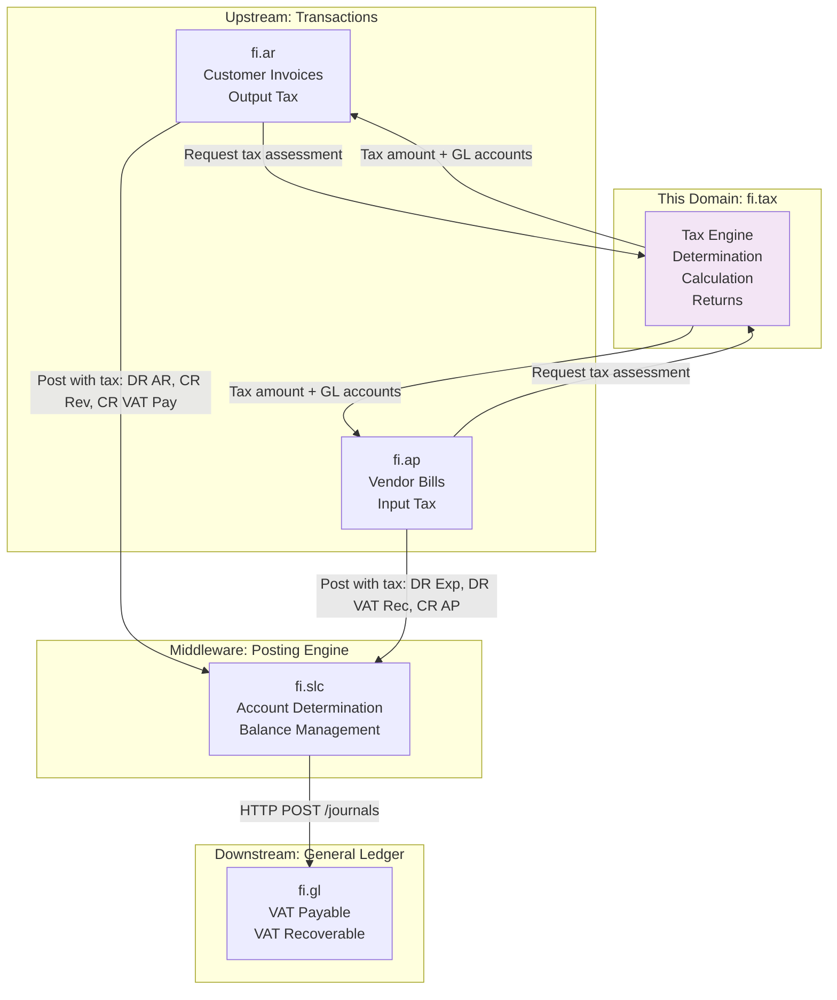
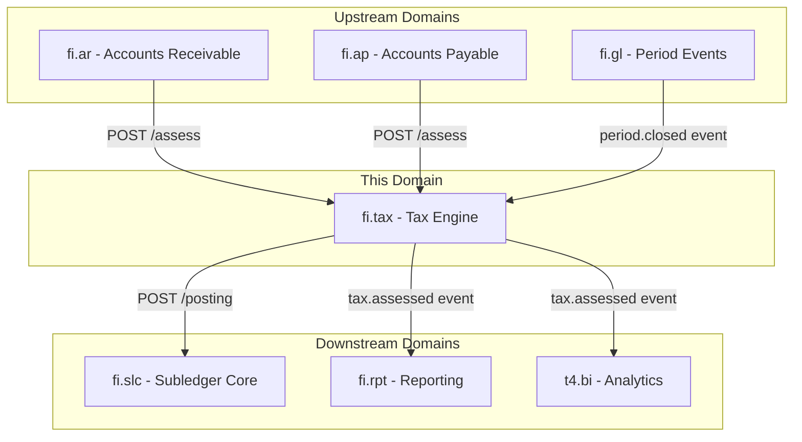
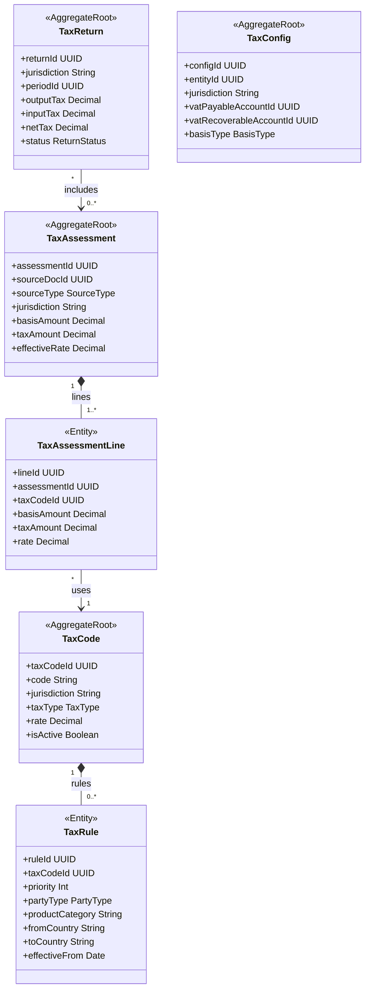
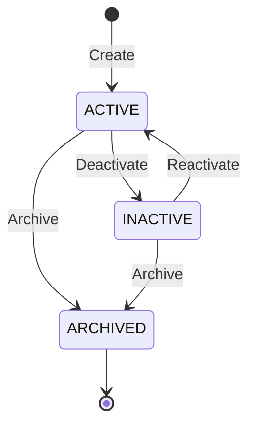
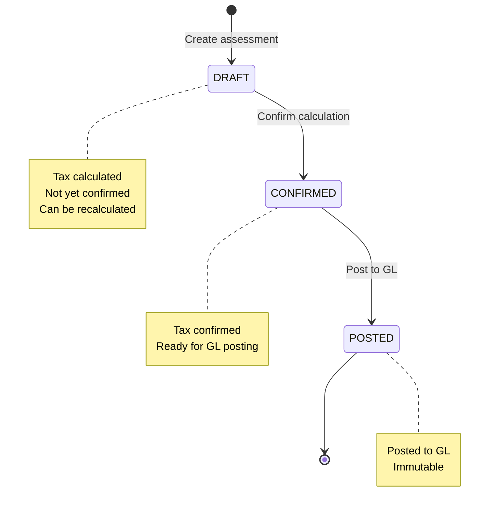
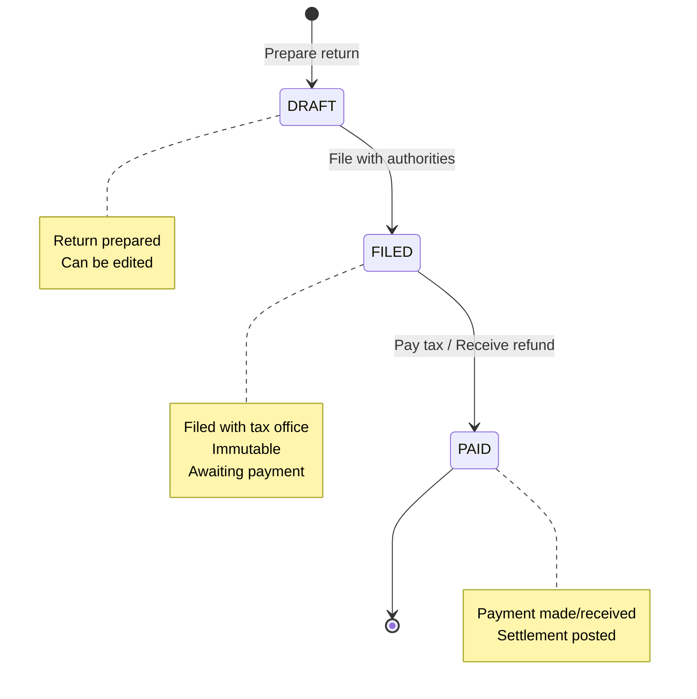
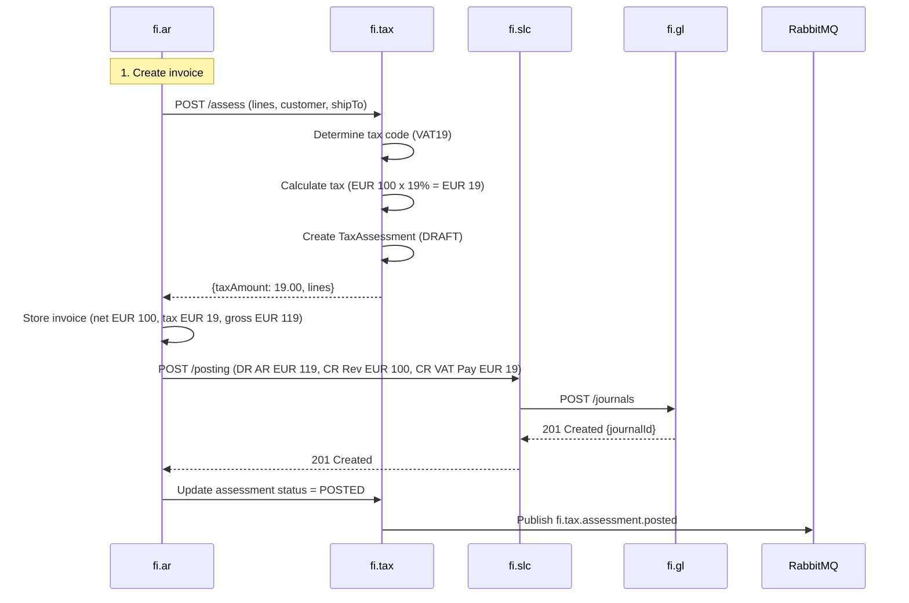
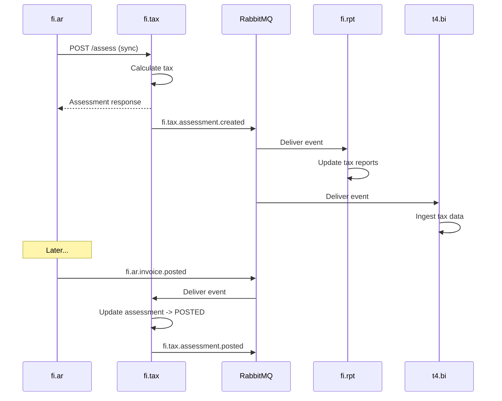

<!-- Template Meta
     Template-ID:   TPL-SVC
     Version:       1.0.0
     Last Updated:  2026-04-03
     Changelog:
       1.0.0 (2026-04-03) — Initial versioned baseline.
-->

# FI - TAX Domain / Service Specification (Indirect Tax Determination)

> **Conceptual Stack Layer:** Domain / Service
> **Space:** Platform
> **Owner:** FI Domain Engineering Team
> **Schema alignment:** `service-layer.schema.json`
> **Companion files:** `openapi.yaml`, `*.schema.json` (event contracts)
> **Referenced by:** Platform-Feature Spec SS5 (backend dependencies), BFF Contract
> **Belongs to:** FI Suite Spec

> **Meta Information**
> - **Version:** 2026-04-04
> - **Template:** `domain-service-spec.md` v1.0.0
> - **Template Compliance:** ~95% — all 16 sections present; feature dependency register awaits feature specs
> - **Author(s):** OpenLeap Architecture Team
> - **Status:** DRAFT
> - **Suite:** `fi`
> - **Domain:** `tax`
> - **Bounded Context Ref:** `bc:tax`
> - **Service ID:** `fi-tax-svc`
> - **basePackage:** `io.openleap.fi.tax`
> - **API Base Path:** `/api/fi/tax/v1`
> - **OpenLeap Starter Version:** `v4.1.0`
> - **Port:** `8460`
> - **Repository:** `https://github.com/openleap/io.openleap.fi.tax`
> - **Tags:** `tax`, `vat`, `gst`, `indirect-tax`, `compliance`, `fi-extend`
> - **Team:**
>   - Name: `team-fi`
>   - Email: `fi-team@openleap.io`
>   - Slack: `#fi-team`

---

## Specification Guidelines Compliance

> ### Non-Negotiables
> - Never invent facts. If required info is missing, add an **OPEN QUESTION** entry.
> - Preserve intent and decisions. Only change meaning when explicitly requested.
> - Do not remove normative constraints unless they are explicitly replaced.
> - Keep the spec **self-contained**: no "see chat", no implicit context.
>
> ### Source of Truth Priority
> When sources conflict:
> 1. Spec (explicit) wins
> 2. Starter specs (implementation constraints) next
> 3. Guidelines (best practices) last
>
> Record conflicts in the **Decisions & Conflicts** section (see Section 14).
>
> ### Style Guide
> - Prefer short sentences and lists.
> - Use MUST/SHOULD/MAY for normative statements.
> - Keep terminology consistent (Aggregate, Domain Service, Application Service, Command, Event).
> - Avoid ambiguous words ("often", "maybe") unless explicitly noting uncertainty.
> - Keep examples minimal and clearly marked as examples.
> - Do not add implementation code unless the chapter explicitly requires it.

---

## 0. Document Purpose & Scope

### 0.1 Purpose

This document specifies the **Tax Engine (`fi.tax`)** domain, which provides tax determination and calculation for indirect taxes (VAT, GST, Sales Tax, Use Tax).

In FI v2.1, `fi.tax` MUST provide tax determination outputs that can be used by upstream domains (`fi.ar`, `fi.ap`) and posting orchestration (`fi.pst`).

Tax postings MUST ultimately be executed in `fi.gl` (via `fi.pst`).

### 0.2 Target Audience
- Product Owners & Business Stakeholders (Finance, Tax, Accounting, Compliance)
- System Architects & Technical Leads
- Integration Engineers
- Tax Managers and Tax Accountants
- Controllers and Auditors
- Compliance Officers

### 0.3 Scope

**In Scope:**
- **Tax Determination:** Calculate applicable tax based on jurisdiction, party, product, place of supply
- **Indirect Taxes:** VAT (Value-Added Tax), GST (Goods and Services Tax), Sales Tax, Use Tax
- **Tax Calculation:** Line-level tax amounts, tax basis, effective rates
- **Tax posting requests:** Provide the information required to post tax (output/input) via `fi.pst` (exact posting workflow OPEN QUESTION).
- **Reverse Charge:** Self-assessment for cross-border transactions
- **Withholding Tax (WHT):** Basic WHT calculation and posting (vendor payments)
- **Tax Returns:** Period-based return preparation, aggregation, filing support
- **Reconciliation:** Tax subledger to GL control accounts (VAT Payable, VAT Recoverable)
- **Multiple Jurisdictions:** Support multi-country operations (EU, US, APAC, etc.)
- **Exemptions:** Tax-exempt transactions, zero-rated supplies

**Out of Scope:**
- Direct taxes (corporate income tax, payroll taxes) -> Separate tax domains
- E-filing API integration (phase 1) -> Future adapters to government systems
- Transfer pricing -> `fi.ic`
- Customs duties and import taxes -> Separate domain
- Real-time tax rate updates from external providers -> Configuration management

### 0.4 Related Documents
- `spec/T3_Domains/FI/_fi_suite.md` - FI Suite architecture
- `spec/T3_Domains/FI/domain-specs/fi_gl-spec.md` - General Ledger
- `spec/T3_Domains/FI/domain-specs/fi_slc-spec.md` - Subledger Core / Posting orchestration
- `spec/T3_Domains/FI/domain-specs/fi_ar-spec.md` - Accounts Receivable (output tax)
- `spec/T3_Domains/FI/domain-specs/fi_ap-spec.md` - Accounts Payable (input tax)
- `EVENT_STANDARDS.md` - Event envelope and routing conventions

---

## 1. Business Context

### 1.1 Domain Purpose

**fi.tax** is the authoritative source for tax rules and calculations. Every time a company sells goods (AR invoice) or purchases goods/services (AP bill), indirect taxes must be calculated and accounted for. This domain ensures accurate tax determination, proper accounting, and compliance with tax regulations across multiple jurisdictions.

**Core Business Problems Solved:**
- **Tax Compliance:** Meet VAT/GST/Sales Tax reporting requirements
- **Accurate Tax Calculation:** Prevent under/over-charging customers
- **Tax Recovery:** Maximize input tax recovery (deductible VAT)
- **Multi-Jurisdiction:** Handle complex cross-border tax rules
- **Audit Trail:** Provide complete documentation for tax audits
- **Cash Flow:** Manage tax payable/recoverable, optimize filing periods

### 1.2 Business Value

**For the Organization:**
- **Compliance:** Avoid penalties, interest, and audit issues
- **Automation:** Eliminate manual tax calculations (save 80% of time)
- **Accuracy:** Reduce tax errors, prevent customer complaints
- **Working Capital:** Optimize VAT recovery timing, reduce cash tied up
- **Risk Management:** Stay current with changing tax rates and rules
- **Multi-Country:** Support global expansion with local tax rules

**For Users:**
- **Tax Manager:** Automated tax returns, one-click reconciliation
- **Accountant:** Auto-calculate tax on invoices/bills, no manual lookup
- **Controller:** Reconcile tax accounts to GL, month-end close
- **Auditor:** Complete tax trail from invoice to return to payment
- **Compliance Officer:** Export tax data for statutory filings

### 1.3 Key Stakeholders

| Role | Responsibility | Primary Use Cases |
|------|----------------|-------------------|
| Tax Manager | Tax compliance, returns | Prepare tax returns, file with authorities, reconcile |
| Tax Accountant | Tax calculations | Configure tax codes, review assessments, post adjustments |
| Controller | Month-end close | Reconcile tax accounts, review variances |
| Accounts Payable Clerk | Vendor invoices | Auto-calculate input tax on AP bills |
| Accounts Receivable Clerk | Customer invoices | Auto-calculate output tax on AR invoices |
| Auditor | Tax audit | Verify tax calculations, trace to returns |

### 1.4 Strategic Positioning

**fi.tax** sits **between** AR/AP (tax triggers) and the General Ledger (tax accounts).



**Key Insight:** fi.tax provides tax determination as a service; AR/AP post the complete journal including tax.

### 1.5 Service Context

| Property | Value |
|----------|-------|
| **Suite** | `fi` |
| **Domain** | `tax` |
| **Bounded Context** | `bc:tax` |
| **Service ID** | `fi-tax-svc` |
| **Base Package** | `io.openleap.fi.tax` |

**Responsibilities:**
- Determine applicable tax code for a given transaction (jurisdiction, party type, product category, place of supply)
- Calculate line-level and document-level tax amounts
- Maintain tax code and tax rule master data
- Prepare, aggregate, and support filing of periodic tax returns (VAT/GST/Sales Tax)
- Post tax return settlements via `fi.slc`
- Provide tax reconciliation data for month-end close

**Authoritative Sources:**
| Source Type | Description | Access Pattern |
|-------------|-------------|----------------|
| REST API | Tax assessment calculation, tax code lookup, tax return management | Synchronous |
| Database | Tax codes, tax rules, tax assessments, tax returns, tax config | Direct (owner) |
| Events | Tax assessed, return filed, return settled | Asynchronous |



---

## 2. Service Identity

| Property | Value | Schema Field |
|----------|-------|-------------|
| **Service ID** | `fi-tax-svc` | `metadata.id` |
| **Display Name** | Tax Engine | `metadata.name` |
| **Suite** | `fi` | `metadata.suite` |
| **Domain** | `tax` | `metadata.domain` |
| **Bounded Context** | `bc:tax` | `metadata.bounded_context_ref` |
| **Version** | `0.1.0` | `metadata.version` |
| **Status** | DRAFT | `metadata.status` |
| **API Base Path** | `/api/fi/tax/v1` | `metadata.api_base_path` |
| **Repository** | `https://github.com/openleap/io.openleap.fi.tax` | `metadata.repository` |
| **Tags** | `tax`, `vat`, `gst`, `indirect-tax`, `compliance` | `metadata.tags` |

**Team:**
| Property | Value |
|----------|-------|
| **Name** | `team-fi` |
| **Email** | `fi-team@openleap.io` |
| **Slack Channel** | `#fi-team` |

---

## 3. Domain Model

### 3.1 Conceptual Overview

The tax engine domain model consists of five main pillars:

1. **Tax Codes:** Master data (jurisdiction, rate, type)
2. **Tax Rules:** Determination logic (party, product, place of supply)
3. **Tax Assessments:** Calculated tax for transactions
4. **Tax Returns:** Period aggregation and filing
5. **Tax Config:** GL account mappings and policies per entity/jurisdiction

**Key Principles:**
- **Jurisdiction-Based:** Tax rules vary by country, state, region
- **Place of Supply:** Tax based on where goods/services consumed
- **Accrual vs. Cash Basis:** Some jurisdictions tax on invoice, others on payment
- **Reverse Charge:** Self-assessment for cross-border B2B
- **Reconciliation:** Tax subledger must match GL control accounts

### 3.2 Core Concepts



### 3.3 Aggregate Definitions

#### 3.3.1 TaxCode

| Property | Value |
|----------|-------|
| **Aggregate ID** | `agg:tax-code` |
| **Name** | `TaxCode` |

**Business Purpose:**
Master data for tax types and rates. Represents a specific tax (e.g., "German VAT 19%", "California Sales Tax 7.25%"). Inspired by SAP FI tax code tables (T007A/T007B).

##### Aggregate Root

**Key Attributes:**

| Attribute | Type | Format | Description | Constraints | Required | Read-Only |
|-----------|------|--------|-------------|-------------|----------|-----------|
| taxCodeId | string | uuid | Unique identifier (OlUuid) | Immutable | Yes | Yes |
| tenantId | string | uuid | Tenant ownership for RLS | Immutable | Yes | Yes |
| code | string | — | Tax code short identifier | max_length: 50, unique per tenant | Yes | No |
| name | string | — | Descriptive name (e.g., "German VAT Standard Rate") | max_length: 200 | Yes | No |
| jurisdiction | string | — | Country or sub-national code | pattern: ISO 3166-1 alpha-2 or ISO 3166-2 (e.g., "DE", "US-CA") | Yes | No |
| taxType | string | — | Tax category | enum_ref: `TaxType` | Yes | No |
| rate | number | decimal | Tax rate as percentage | minimum: 0, maximum: 100, precision: 5,2 | Yes | No |
| isReverseCharge | boolean | — | Reverse charge indicator | — | Yes | No |
| isZeroRated | boolean | — | Zero-rated supply (0% but taxable) | — | Yes | No |
| isExempt | boolean | — | Tax-exempt indicator | — | Yes | No |
| effectiveFrom | string | date | Effective start date | — | Yes | No |
| effectiveTo | string | date | Effective end date; null means open-ended | minimum: effectiveFrom | No | No |
| isActive | boolean | — | Active for use in determination | — | Yes | No |
| version | integer | int64 | Optimistic locking version | — | Yes | Yes |
| createdAt | string | date-time | Creation timestamp | — | Yes | Yes |
| updatedAt | string | date-time | Last update timestamp | — | Yes | Yes |

**Lifecycle States:**

| Property | Value |
|----------|-------|
| **Initial State** | `ACTIVE` |
| **Terminal States** | `ARCHIVED` |



**State Descriptions:**
| State | Description | Business Meaning |
|-------|-------------|------------------|
| ACTIVE | Operational state | Available for tax determination; isActive=true |
| INACTIVE | Temporarily disabled | Not used in new determinations; existing assessments unaffected |
| ARCHIVED | Final state | Historical record; read-only for audit |

**Allowed Transitions:**
| From State | To State | Trigger | Guard / Business Preconditions |
|------------|----------|---------|-------------------------------|
| ACTIVE | INACTIVE | Manual deactivation | No in-flight assessments referencing this code |
| INACTIVE | ACTIVE | Manual reactivation | Effective date range still valid |
| ACTIVE/INACTIVE | ARCHIVED | Retention policy or manual | No active tax rules referencing this code |

**Invariants:**
| Rule ID | Description |
|---------|-------------|
| BR-CODE-001 | Rate MUST be between 0 and 100 inclusive |
| BR-CODE-002 | No overlapping effective periods for same (tenant, jurisdiction, taxType) |

**Domain Events Emitted:**
- `fi.tax.taxCode.created`
- `fi.tax.taxCode.updated`
- `fi.tax.taxCode.statusChanged`

##### Child Entities

###### Entity: TaxRule

| Property | Value |
|----------|-------|
| **Entity ID** | `ent:tax-rule` |
| **Name** | `TaxRule` |
| **Relationship to Root** | one_to_many |

**Business Purpose:**
Determines which tax code applies to a transaction based on conditions (party type, product category, place of supply). Rules are evaluated by priority; first match wins. Inspired by SAP condition technique (TAXCOM/TAXIND).

**Attributes:**
| Attribute | Type | Format | Description | Constraints | Required |
|-----------|------|--------|-------------|-------------|----------|
| ruleId | string | uuid | Unique identifier (OlUuid) | Immutable | Yes |
| taxCodeId | string | uuid | Parent tax code | FK to TaxCode | Yes |
| priority | integer | int32 | Rule priority (lower = higher priority) | minimum: 1 | Yes |
| partyType | string | — | Customer/vendor classification | enum_ref: `PartyType` | No |
| productCategory | string | — | Product/service category code | max_length: 100 | No |
| fromCountry | string | — | Seller country | pattern: ISO 3166-1 alpha-2 | No |
| toCountry | string | — | Buyer country | pattern: ISO 3166-1 alpha-2 | No |
| fromRegion | string | — | Seller state/province | pattern: ISO 3166-2 sub-division | No |
| toRegion | string | — | Buyer state/province | pattern: ISO 3166-2 sub-division | No |
| effectiveFrom | string | date | Rule effective date | — | Yes |
| effectiveTo | string | date | Rule end date; null means open-ended | minimum: effectiveFrom | No |

**Collection Constraints:**
- Minimum items: 0 (tax code may have no rules; used only for manual selection)
- Maximum items: 1000

**Invariants:**
| Rule ID | Description |
|---------|-------------|
| BR-RULE-001 | Priority MUST be unique within the same TaxCode for overlapping effective periods |

##### Value Objects

###### Value Object: TaxAddress

| Property | Value |
|----------|-------|
| **VO ID** | `vo:tax-address` |
| **Name** | `TaxAddress` |

**Description:**
Represents a location relevant for tax determination (bill-to, ship-to, bill-from).

**Attributes:**
| Attribute | Type | Format | Description | Constraints |
|-----------|------|--------|-------------|-------------|
| country | string | — | Country code | pattern: ISO 3166-1 alpha-2, required |
| region | string | — | State/province code | pattern: ISO 3166-2 sub-division |

**Validation Rules:**
- country MUST be a valid ISO 3166-1 alpha-2 code
- region, if provided, MUST be a valid sub-division of country

---

#### 3.3.2 TaxAssessment

| Property | Value |
|----------|-------|
| **Aggregate ID** | `agg:tax-assessment` |
| **Name** | `TaxAssessment` |

**Business Purpose:**
Result of tax determination and calculation for an AR invoice or AP bill. Stores computed tax amounts. This is the core output of the tax engine.

##### Aggregate Root

**Key Attributes:**

| Attribute | Type | Format | Description | Constraints | Required | Read-Only |
|-----------|------|--------|-------------|-------------|----------|-----------|
| assessmentId | string | uuid | Unique identifier (OlUuid) | Immutable | Yes | Yes |
| tenantId | string | uuid | Tenant ownership for RLS | Immutable | Yes | Yes |
| assessmentNumber | string | — | Sequential assessment number | max_length: 50, unique per tenant | Yes | Yes |
| sourceDocId | string | uuid | Source document ID (invoice or bill) | — | Yes | No |
| sourceType | string | — | Source document type | enum_ref: `SourceType` | Yes | No |
| jurisdiction | string | — | Primary tax jurisdiction | max_length: 10 | Yes | No |
| basisAmount | number | decimal | Total tax basis (net amount) | minimum: 0, precision: 19,4 | Yes | No |
| taxAmount | number | decimal | Total calculated tax amount | minimum: 0, precision: 19,4 | Yes | No |
| effectiveRate | number | decimal | Effective blended tax rate (%) | minimum: 0, precision: 5,2 | Yes | No |
| currency | string | — | Currency code | pattern: ISO 4217, max_length: 3 | Yes | No |
| assessmentDate | string | date | Date of tax assessment | — | Yes | No |
| status | string | — | Current lifecycle state | enum_ref: `AssessmentStatus` | Yes | No |
| isReverseCharge | boolean | — | Reverse charge transaction indicator | — | Yes | No |
| version | integer | int64 | Optimistic locking version | — | Yes | Yes |
| createdAt | string | date-time | Creation timestamp | — | Yes | Yes |
| updatedAt | string | date-time | Last update timestamp | — | Yes | Yes |

**Lifecycle States:**

| Property | Value |
|----------|-------|
| **Initial State** | `DRAFT` |
| **Terminal States** | `POSTED` |



**State Descriptions:**
| State | Description | Business Meaning |
|-------|-------------|------------------|
| DRAFT | Initial calculation state | Tax calculated but not yet confirmed; can be recalculated |
| CONFIRMED | Calculation confirmed | Tax amount locked; ready for GL posting |
| POSTED | Posted to General Ledger | Immutable; tax recorded in GL |

**Allowed Transitions:**
| From State | To State | Trigger | Guard / Business Preconditions |
|------------|----------|---------|-------------------------------|
| DRAFT | CONFIRMED | Confirm assessment | All lines calculated, effective rate validated |
| CONFIRMED | POSTED | GL posting confirmed | Source document posted via fi.slc |

**Invariants:**
| Rule ID | Description |
|---------|-------------|
| BR-ASMT-001 | effectiveRate MUST equal (taxAmount / basisAmount) x 100 (within rounding tolerance) |
| BR-ASMT-002 | currency MUST match source document currency |
| BR-ASMT-003 | taxAmount MUST equal sum of all line taxAmounts |

**Domain Events Emitted:**
- `fi.tax.assessment.created`
- `fi.tax.assessment.confirmed`
- `fi.tax.assessment.posted`

##### Child Entities

###### Entity: TaxAssessmentLine

| Property | Value |
|----------|-------|
| **Entity ID** | `ent:tax-assessment-line` |
| **Name** | `TaxAssessmentLine` |
| **Relationship to Root** | one_to_many |

**Business Purpose:**
Individual line-level tax calculation within an assessment. One line per tax code applied.

**Attributes:**
| Attribute | Type | Format | Description | Constraints | Required |
|-----------|------|--------|-------------|-------------|----------|
| lineId | string | uuid | Unique identifier (OlUuid) | Immutable | Yes |
| assessmentId | string | uuid | Parent assessment | FK to TaxAssessment | Yes |
| lineNumber | integer | int32 | Sequential line number | unique per assessment | Yes |
| taxCodeId | string | uuid | Applied tax code | FK to TaxCode | Yes |
| taxCode | string | — | Tax code (denormalized for display) | max_length: 50 | Yes |
| basisAmount | number | decimal | Line tax basis | minimum: 0, precision: 19,4 | Yes |
| rate | number | decimal | Tax rate applied (%) | minimum: 0, precision: 5,2 | Yes |
| taxAmount | number | decimal | Line tax amount | minimum: 0, precision: 19,4 | Yes |
| currency | string | — | Line currency | pattern: ISO 4217 | Yes |

**Collection Constraints:**
- Minimum items: 1 (at least one tax line per assessment)
- Maximum items: 1000

**Invariants:**
| Rule ID | Description |
|---------|-------------|
| BR-LINE-001 | taxAmount MUST equal basisAmount x (rate / 100) within rounding tolerance |

**Example Calculation:**

**AR Invoice (German VAT):**
```
Invoice Line 1: Product A EUR 100.00
  -> Tax Code: VAT19
  -> Basis: EUR 100.00
  -> Rate: 19%
  -> Tax: EUR 100.00 x 0.19 = EUR 19.00

Invoice Line 2: Product B EUR 50.00
  -> Tax Code: VAT19
  -> Basis: EUR 50.00
  -> Rate: 19%
  -> Tax: EUR 50.00 x 0.19 = EUR 9.50

Assessment:
  Total Basis: EUR 150.00
  Total Tax: EUR 28.50
  Effective Rate: 19%
```

---

#### 3.3.3 TaxReturn

| Property | Value |
|----------|-------|
| **Aggregate ID** | `agg:tax-return` |
| **Name** | `TaxReturn` |

**Business Purpose:**
Represents a tax return (VAT return, GST return, sales tax return) for a period and jurisdiction. Aggregates all assessments for the period. Inspired by SAP tax reporting (RFUMSV00).

##### Aggregate Root

**Key Attributes:**

| Attribute | Type | Format | Description | Constraints | Required | Read-Only |
|-----------|------|--------|-------------|-------------|----------|-----------|
| returnId | string | uuid | Unique identifier (OlUuid) | Immutable | Yes | Yes |
| tenantId | string | uuid | Tenant ownership for RLS | Immutable | Yes | Yes |
| returnNumber | string | — | Sequential return number | max_length: 50, unique per tenant | Yes | Yes |
| jurisdiction | string | — | Tax jurisdiction | max_length: 10 | Yes | No |
| periodId | string | uuid | Fiscal period reference | FK to fi.gl periods | Yes | No |
| periodStart | string | date | Period start date | — | Yes | No |
| periodEnd | string | date | Period end date | minimum: periodStart | Yes | No |
| outputTax | number | decimal | Sales tax collected (VAT payable) | minimum: 0, precision: 19,4 | Yes | No |
| inputTax | number | decimal | Purchase tax paid (VAT recoverable) | minimum: 0, precision: 19,4 | Yes | No |
| netTax | number | decimal | Net tax due (positive) or refund (negative) | precision: 19,4 | Yes | No |
| currency | string | — | Return currency | pattern: ISO 4217 | Yes | No |
| status | string | — | Current lifecycle state | enum_ref: `ReturnStatus` | Yes | No |
| dueDate | string | date | Filing deadline | — | No | No |
| filedDate | string | date | Date filed with authorities | — | No | No |
| paidDate | string | date | Date tax paid or refund received | — | No | No |
| settlementJournalId | string | uuid | GL journal for settlement posting | FK to fi.gl journal_entries | No | No |
| artifactRef | string | uuid | DMS document reference for filed return PDF | FK to dms documents | No | No |
| version | integer | int64 | Optimistic locking version | — | Yes | Yes |
| createdAt | string | date-time | Creation timestamp | — | Yes | Yes |
| updatedAt | string | date-time | Last update timestamp | — | Yes | Yes |

**Lifecycle States:**

| Property | Value |
|----------|-------|
| **Initial State** | `DRAFT` |
| **Terminal States** | `PAID` |



**State Descriptions:**
| State | Description | Business Meaning |
|-------|-------------|------------------|
| DRAFT | Return being prepared | Editable; assessments being aggregated |
| FILED | Filed with tax authority | Immutable; awaiting payment/refund |
| PAID | Tax paid or refund received | Settlement journal posted; fully closed |

**Allowed Transitions:**
| From State | To State | Trigger | Guard / Business Preconditions |
|------------|----------|---------|-------------------------------|
| DRAFT | FILED | File return | All assessments for period included; amounts reconciled |
| FILED | PAID | Post settlement | Payment confirmed; bank account specified |

**Invariants:**
| Rule ID | Description |
|---------|-------------|
| BR-RET-001 | netTax MUST equal outputTax - inputTax |
| BR-RET-002 | Only one FILED return per (tenant, jurisdiction, periodId) |

**Domain Events Emitted:**
- `fi.tax.return.created`
- `fi.tax.return.filed`
- `fi.tax.return.settled`

##### Value Objects

*None specific to TaxReturn aggregate.*

**Example Return (German VAT):**
```json
{
  "jurisdiction": "DE",
  "period": "2025-12",
  "periodStart": "2025-12-01",
  "periodEnd": "2025-12-31",
  "outputTax": 150000.00,
  "inputTax": 85000.00,
  "netTax": 65000.00,
  "currency": "EUR",
  "status": "FILED",
  "dueDate": "2026-01-10"
}
```

---

#### 3.3.4 TaxConfig

| Property | Value |
|----------|-------|
| **Aggregate ID** | `agg:tax-config` |
| **Name** | `TaxConfig` |

**Business Purpose:**
Configuration for tax accounting per legal entity and jurisdiction. Defines GL account mappings, tax basis type, and filing frequency. Inspired by SAP tax configuration (OB40).

##### Aggregate Root

**Key Attributes:**

| Attribute | Type | Format | Description | Constraints | Required | Read-Only |
|-----------|------|--------|-------------|-------------|----------|-----------|
| configId | string | uuid | Unique identifier (OlUuid) | Immutable | Yes | Yes |
| tenantId | string | uuid | Tenant ownership for RLS | Immutable | Yes | Yes |
| entityId | string | uuid | Legal entity reference | FK to entities | Yes | No |
| jurisdiction | string | — | Tax jurisdiction | max_length: 10 | Yes | No |
| basisType | string | — | Accrual or cash basis | enum_ref: `BasisType` | Yes | No |
| vatPayableAccountId | string | uuid | Output tax GL account | FK to fi.gl accounts | Yes | No |
| vatRecoverableAccountId | string | uuid | Input tax GL account | FK to fi.gl accounts | Yes | No |
| whtPayableAccountId | string | uuid | Withholding tax GL account | FK to fi.gl accounts | No | No |
| taxClearingAccountId | string | uuid | Clearing account for cash basis | FK to fi.gl accounts | No | No |
| returnFrequency | string | — | Filing frequency | enum_ref: `ReturnFrequency` | Yes | No |
| nextReturnDueDate | string | date | Next filing deadline | — | No | No |
| isActive | boolean | — | Active configuration | — | Yes | No |
| version | integer | int64 | Optimistic locking version | — | Yes | Yes |
| createdAt | string | date-time | Creation timestamp | — | Yes | Yes |
| updatedAt | string | date-time | Last update timestamp | — | Yes | Yes |

**Lifecycle States:**

| Property | Value |
|----------|-------|
| **Initial State** | `ACTIVE` |
| **Terminal States** | `ARCHIVED` |

**State Descriptions:**
| State | Description | Business Meaning |
|-------|-------------|------------------|
| ACTIVE | In use | Configuration active for the entity/jurisdiction |
| INACTIVE | Suspended | Temporarily disabled |
| ARCHIVED | Final state | Historical record |

**Allowed Transitions:**
| From State | To State | Trigger | Guard / Business Preconditions |
|------------|----------|---------|-------------------------------|
| ACTIVE | INACTIVE | Manual deactivation | No open draft returns for this config |
| INACTIVE | ACTIVE | Manual reactivation | GL accounts still valid |
| ACTIVE/INACTIVE | ARCHIVED | Retention policy | No open returns |

**Invariants:**
| Rule ID | Description |
|---------|-------------|
| BR-CFG-001 | Unique (tenant, entity, jurisdiction) - only one active config per entity/jurisdiction |
| BR-CFG-002 | vatPayableAccountId and vatRecoverableAccountId MUST reference active GL accounts |

**Domain Events Emitted:**
- `fi.tax.config.created`
- `fi.tax.config.updated`

**Basis Types:**

| Type | Description | When Tax Recognized | Example |
|------|-------------|---------------------|---------|
| ACCRUAL | Invoice-based | When invoice posted | Most VAT jurisdictions |
| CASH | Payment-based | When payment made/received | Some small business schemes |

---

### 3.4 Enumerations

#### TaxType

**Description:** Classification of indirect tax categories.

| Value | Description | Deprecated |
|-------|-------------|------------|
| `VAT` | Value-Added Tax (EU, UK, most countries) | No |
| `GST` | Goods and Services Tax (AU, NZ, IN, SG, CA) | No |
| `SALES_TAX` | Sales Tax (US states, some developing countries) | No |
| `USE_TAX` | Use Tax (US, purchaser self-assesses on out-of-state purchases) | No |
| `WHT` | Withholding Tax (vendor payment deductions) | No |

#### SourceType

**Description:** Type of source document triggering a tax assessment.

| Value | Description | Deprecated |
|-------|-------------|------------|
| `AR_INVOICE` | Accounts Receivable customer invoice (output tax) | No |
| `AP_BILL` | Accounts Payable vendor bill (input tax) | No |
| `ADJUSTMENT` | Manual tax adjustment or correction | No |

#### AssessmentStatus

**Description:** Lifecycle states for a tax assessment.

| Value | Description | Deprecated |
|-------|-------------|------------|
| `DRAFT` | Tax calculated, not yet confirmed | No |
| `CONFIRMED` | Tax confirmed, ready for GL posting | No |
| `POSTED` | Tax posted to GL, immutable | No |

#### ReturnStatus

**Description:** Lifecycle states for a tax return.

| Value | Description | Deprecated |
|-------|-------------|------------|
| `DRAFT` | Return being prepared, editable | No |
| `FILED` | Filed with tax authority, immutable | No |
| `PAID` | Tax paid or refund received, settlement posted | No |

#### PartyType

**Description:** Classification of transaction party for tax determination.

| Value | Description | Deprecated |
|-------|-------------|------------|
| `B2B` | Business-to-Business (VAT-registered) | No |
| `B2C` | Business-to-Consumer (end consumer) | No |
| `EXEMPT` | Tax-exempt organization (e.g., government, charity) | No |

#### BasisType

**Description:** Tax recognition basis.

| Value | Description | Deprecated |
|-------|-------------|------------|
| `ACCRUAL` | Tax recognized when invoice posted | No |
| `CASH` | Tax recognized when payment made/received | No |

#### ReturnFrequency

**Description:** Filing frequency for tax returns.

| Value | Description | Deprecated |
|-------|-------------|------------|
| `MONTHLY` | Monthly filing (most common for VAT) | No |
| `QUARTERLY` | Quarterly filing (small businesses) | No |
| `ANNUAL` | Annual filing (micro businesses) | No |

### 3.5 Shared Types

#### Money

| Property | Value |
|----------|-------|
| **Type ID** | `type:money` |
| **Name** | `Money` |

**Description:** Monetary value with currency. Used for tax amounts, basis amounts, and totals.

**Attributes:**
| Attribute | Type | Format | Description | Constraints |
|-----------|------|--------|-------------|-------------|
| amount | number | decimal | Monetary amount | precision: 19,4 |
| currencyCode | string | — | ISO 4217 currency code | pattern: `^[A-Z]{3}$` |

**Validation Rules:**
- currencyCode MUST be a valid ISO 4217 code
- amount precision MUST not exceed 4 decimal places

**Used By:**
- `agg:tax-assessment` (basisAmount, taxAmount)
- `agg:tax-assessment-line` (basisAmount, taxAmount)
- `agg:tax-return` (outputTax, inputTax, netTax)

---

## 4. Business Rules & Constraints

### 4.1 Business Rules Catalog

| ID | Rule Name | Description | Scope | Enforcement | Error Code |
|----|-----------|-------------|-------|-------------|------------|
| BR-CODE-001 | Rate Range | Tax rate MUST be 0-100% | TaxCode | Create/Update | `TAX_INVALID_RATE` |
| BR-CODE-002 | Effective Date Overlap | No overlapping effective periods for same (tenant, jurisdiction, taxType) | TaxCode | Create/Update | `TAX_DATE_OVERLAP` |
| BR-RULE-001 | Priority Uniqueness | Priority MUST be unique within TaxCode for overlapping effective periods | TaxRule | Create/Update | `TAX_PRIORITY_CONFLICT` |
| BR-ASMT-001 | Effective Rate Validation | effectiveRate = (taxAmount / basisAmount) x 100 | TaxAssessment | Validation | `TAX_RATE_MISMATCH` |
| BR-ASMT-002 | Currency Consistency | Assessment currency MUST match source document currency | TaxAssessment | Create | `TAX_CURRENCY_MISMATCH` |
| BR-ASMT-003 | Line Sum Validation | taxAmount MUST equal sum of all line taxAmounts | TaxAssessment | Validation | `TAX_SUM_MISMATCH` |
| BR-LINE-001 | Tax Calculation | taxAmount = basisAmount x (rate / 100) | TaxAssessmentLine | Create | `TAX_CALC_ERROR` |
| BR-RET-001 | Net Tax Calculation | netTax = outputTax - inputTax | TaxReturn | Always | `TAX_NET_MISMATCH` |
| BR-RET-002 | Period Uniqueness | One FILED return per (tenant, jurisdiction, periodId) | TaxReturn | File | `TAX_RETURN_DUPLICATE` |
| BR-CFG-001 | Config Uniqueness | One active config per (tenant, entity, jurisdiction) | TaxConfig | Create/Update | `TAX_CONFIG_DUPLICATE` |
| BR-CFG-002 | GL Account Validity | VAT account references MUST point to active GL accounts | TaxConfig | Create/Update | `TAX_INVALID_GL_ACCOUNT` |

### 4.2 Detailed Rule Definitions

#### BR-CODE-001: Rate Range

**Business Context:**
Tax rates are expressed as percentages. Negative rates are not valid for indirect taxes, and rates exceeding 100% would be economically nonsensical.

**Rule Statement:** The `rate` attribute of a TaxCode MUST be >= 0 and <= 100.

**Applies To:**
- Aggregate: TaxCode
- Operations: Create, Update

**Enforcement:** Database CHECK constraint and application-level validation.

**Validation Logic:** Check that 0 <= rate <= 100.

**Error Handling:**
- **Error Code:** `TAX_INVALID_RATE`
- **Error Message:** "Tax rate must be between 0 and 100 percent"
- **User action:** Correct the rate value

**Examples:**
- **Valid:** rate = 19.00 (German VAT standard rate)
- **Invalid:** rate = -5.00, rate = 150.00

#### BR-CODE-002: Effective Date Overlap

**Business Context:**
A jurisdiction/tax-type combination must have exactly one applicable rate at any point in time. Overlapping effective periods would create ambiguity in tax determination.

**Rule Statement:** For the same (tenant, jurisdiction, taxType), no two TaxCode records MAY have overlapping date ranges [effectiveFrom, effectiveTo].

**Applies To:**
- Aggregate: TaxCode
- Operations: Create, Update

**Enforcement:** PostgreSQL EXCLUDE constraint using GiST index on date ranges.

**Validation Logic:** Check that no existing TaxCode with the same (tenant, jurisdiction, taxType) has a date range that overlaps with the new/updated range.

**Error Handling:**
- **Error Code:** `TAX_DATE_OVERLAP`
- **Error Message:** "Tax code effective period overlaps with existing code {existingCode}"
- **User action:** Adjust effective dates or deactivate the conflicting code

**Examples:**
- **Valid:** VAT19 effective 2007-01-01 to 2020-06-30; VAT16 effective 2020-07-01 to 2020-12-31
- **Invalid:** VAT19 effective 2007-01-01 to null; VAT16 effective 2020-07-01 to 2020-12-31 (overlap)

#### BR-ASMT-001: Effective Rate Validation

**Business Context:**
The effective rate is a derived value used for reporting and audit. It must be consistent with the actual amounts.

**Rule Statement:** effectiveRate MUST equal (taxAmount / basisAmount) x 100, within a rounding tolerance of 0.01%.

**Applies To:**
- Aggregate: TaxAssessment
- Operations: Create (validation)

**Enforcement:** Application-level validation after calculation.

**Validation Logic:** Check that abs(effectiveRate - (taxAmount / basisAmount * 100)) < 0.01.

**Error Handling:**
- **Error Code:** `TAX_RATE_MISMATCH`
- **Error Message:** "Effective rate {effectiveRate}% does not match calculated rate"
- **User action:** Recalculate the assessment

**Examples:**
- **Valid:** basisAmount=100.00, taxAmount=19.00, effectiveRate=19.00
- **Invalid:** basisAmount=100.00, taxAmount=19.00, effectiveRate=20.00

#### BR-RET-001: Net Tax Calculation

**Business Context:**
The net tax due (or refund) is the difference between output tax (collected on sales) and input tax (paid on purchases). This is the fundamental VAT/GST calculation.

**Rule Statement:** netTax MUST equal outputTax - inputTax.

**Applies To:**
- Aggregate: TaxReturn
- Operations: Always (calculated field)

**Enforcement:** Calculated field; database CHECK constraint.

**Validation Logic:** Check that netTax = outputTax - inputTax.

**Error Handling:**
- **Error Code:** `TAX_NET_MISMATCH`
- **Error Message:** "Net tax {netTax} does not equal output tax {outputTax} minus input tax {inputTax}"
- **User action:** Recalculate the return

**Examples:**
- **Valid:** outputTax=150000, inputTax=85000, netTax=65000
- **Invalid:** outputTax=150000, inputTax=85000, netTax=70000

#### BR-RET-002: Period Uniqueness

**Business Context:**
Tax authorities accept one return per period per jurisdiction. Duplicate filings cause compliance issues.

**Rule Statement:** Only one TaxReturn with status FILED MAY exist per (tenant, jurisdiction, periodId).

**Applies To:**
- Aggregate: TaxReturn
- Operations: File (status transition)

**Enforcement:** Partial unique index WHERE status = 'FILED'.

**Validation Logic:** Before filing, check that no other return exists with status FILED for the same (tenant, jurisdiction, periodId).

**Error Handling:**
- **Error Code:** `TAX_RETURN_DUPLICATE`
- **Error Message:** "A return has already been filed for jurisdiction {jurisdiction} period {periodId}"
- **User action:** Review the existing filed return

**Examples:**
- **Valid:** Filing first return for DE, 2025-12
- **Invalid:** Filing second return for DE, 2025-12 when one already FILED

### 4.3 Data Validation Rules

**Field-Level Validations:**
| Field | Validation Rule | Error Message |
|-------|----------------|---------------|
| TaxCode.code | Required, max 50 chars, unique per tenant | "Tax code is required and must be unique" |
| TaxCode.name | Required, max 200 chars | "Tax code name is required" |
| TaxCode.jurisdiction | Required, valid ISO 3166 code | "Valid jurisdiction code is required" |
| TaxCode.rate | Required, 0-100 | "Rate must be between 0 and 100" |
| TaxCode.effectiveFrom | Required, valid date | "Effective from date is required" |
| TaxAssessment.sourceDocId | Required, valid UUID | "Source document ID is required" |
| TaxAssessment.sourceType | Required, valid enum | "Source type must be AR_INVOICE, AP_BILL, or ADJUSTMENT" |
| TaxAssessment.currency | Required, valid ISO 4217 | "Valid currency code is required" |
| TaxReturn.jurisdiction | Required | "Jurisdiction is required" |
| TaxReturn.periodId | Required, valid UUID | "Period ID is required" |
| TaxConfig.entityId | Required, valid UUID | "Entity ID is required" |
| TaxConfig.vatPayableAccountId | Required, valid UUID | "VAT payable account is required" |
| TaxConfig.vatRecoverableAccountId | Required, valid UUID | "VAT recoverable account is required" |

**Cross-Field Validations:**
- TaxCode.effectiveTo, if provided, MUST be >= effectiveFrom
- TaxReturn.periodEnd MUST be >= periodStart
- TaxConfig.whtPayableAccountId is required when any TaxCode of type WHT exists for the jurisdiction
- TaxAssessment.basisAmount and taxAmount MUST use the same currency

### 4.4 Reference Data Dependencies

**Required Reference Data:**
| Catalog | Source Service | Fields Referencing | Validation |
|---------|----------------|-------------------|------------|
| Countries (ISO 3166) | ref-data-svc | TaxCode.jurisdiction, TaxRule.fromCountry, TaxRule.toCountry | Must exist in ref-data-svc |
| Currencies (ISO 4217) | ref-data-svc | TaxAssessment.currency, TaxReturn.currency | Must exist and be active |
| GL Accounts | fi-gl-svc | TaxConfig.vatPayableAccountId, vatRecoverableAccountId | Must exist and be ACTIVE |
| Fiscal Periods | fi-gl-svc | TaxReturn.periodId | Must exist; period should be closed for return preparation |
| Business Partners | bp-svc | Assessment request partyId | Must exist for party type determination |

---

## 5. Use Cases

> This section defines explicit use cases (WRITE/READ), mapping to domain operations/services.
> Each use case MUST follow the canonical format for code generation.

### 5.1 Business Logic Placement

| Logic Type | Placement | Examples |
|------------|-----------|----------|
| Aggregate invariants | Domain Object | Rate validation, status transitions, net tax calculation |
| Cross-aggregate logic | Domain Service | Tax determination (queries TaxCode + TaxRule to produce TaxAssessment) |
| Orchestration & transactions | Application Service | Assessment creation workflow, return preparation, settlement posting |

### 5.2 Use Cases (Canonical Format)

#### UC-001: CalculateTaxAssessment

| Field | Value |
|-------|-------|
| **id** | `CalculateTaxAssessment` |
| **type** | WRITE |
| **trigger** | REST |
| **aggregate** | `TaxAssessment` |
| **domainOperation** | `TaxDeterminationService.assess` |
| **inputs** | `sourceType: SourceType`, `sourceDocId: UUID`, `partyId: UUID`, `billTo: TaxAddress`, `shipTo: TaxAddress`, `transactionDate: Date`, `lines: AssessmentLineRequest[]` |
| **outputs** | `TaxAssessment` (with lines) |
| **events** | `fi.tax.assessment.created` |
| **rest** | `POST /api/fi/tax/v1/assess` |
| **idempotency** | required (sourceDocId as idempotency key) |
| **errors** | `TAX_CODE_NOT_FOUND`: No applicable tax code, `TAX_CALC_ERROR`: Calculation error |

**Actor:** fi.ar or fi.ap service (automated, during invoice/bill creation)

**Preconditions:**
- Source document (invoice or bill) is being created
- Tax codes and rules configured for the relevant jurisdiction
- Calling service has TAX_POSTER role

**Main Flow:**
1. Calling service sends assessment request with source document details and line items
2. System validates request (sourceType, parties, addresses)
3. For each line, system queries TaxRules matching: fromCountry, toCountry, partyType, productCategory, transactionDate
4. System sorts matching rules by priority (ascending) and selects first match
5. System retrieves TaxCode for the matched rule
6. System calculates tax: taxAmount = basisAmount x (rate / 100)
7. System creates TaxAssessment aggregate (status = DRAFT) with TaxAssessmentLines
8. System validates BR-ASMT-001 (effective rate) and BR-ASMT-003 (line sum)
9. System publishes `fi.tax.assessment.created` event via outbox
10. System returns assessment response

**Postconditions:**
- TaxAssessment created in DRAFT status
- All assessment lines calculated
- Event published for downstream consumers

**Business Rules Applied:**
- BR-CODE-002: Effective date overlap (rule lookup)
- BR-ASMT-001: Effective rate validation
- BR-ASMT-002: Currency consistency
- BR-ASMT-003: Line sum validation
- BR-LINE-001: Tax calculation

**Alternative Flows:**
- **Alt-1:** If reverse charge applies (B2B cross-border EU), taxAmount = 0 and isReverseCharge = true
- **Alt-2:** If tax-exempt party, taxAmount = 0 and relevant exempt code applied
- **Alt-3:** If zero-rated supply, taxAmount = 0 with zero-rated code

**Exception Flows:**
- **Exc-1:** If no matching tax rule found, return 400 with `TAX_CODE_NOT_FOUND`
- **Exc-2:** If jurisdiction not configured, return 404 with `JURISDICTION_NOT_FOUND`

**Example Request:**
```json
{
  "sourceType": "AR_INVOICE",
  "sourceDocId": "invoice-uuid",
  "customerPartyId": "customer-uuid",
  "billTo": {"country": "DE", "region": null},
  "shipTo": {"country": "DE", "region": null},
  "invoiceDate": "2025-12-05",
  "lines": [
    {
      "lineNumber": 1,
      "productId": "product-uuid",
      "productCategory": "GOODS",
      "amount": 100.00,
      "currency": "EUR"
    }
  ]
}
```

**Example Response:**
```json
{
  "assessmentId": "assessment-uuid",
  "assessmentNumber": "ASMT-2025-001234",
  "basisAmount": 100.00,
  "taxAmount": 19.00,
  "effectiveRate": 19.00,
  "currency": "EUR",
  "status": "DRAFT",
  "lines": [
    {
      "lineNumber": 1,
      "taxCode": "VAT19",
      "rate": 19.00,
      "basisAmount": 100.00,
      "taxAmount": 19.00
    }
  ]
}
```

---

#### UC-002: CalculateTaxOnAPBill

| Field | Value |
|-------|-------|
| **id** | `CalculateTaxOnAPBill` |
| **type** | WRITE |
| **trigger** | REST |
| **aggregate** | `TaxAssessment` |
| **domainOperation** | `TaxDeterminationService.assess` |
| **inputs** | `sourceType: AP_BILL`, `sourceDocId: UUID`, `vendorPartyId: UUID`, `billFrom: TaxAddress`, `billTo: TaxAddress`, `billDate: Date`, `lines: AssessmentLineRequest[]` |
| **outputs** | `TaxAssessment` (with lines) |
| **events** | `fi.tax.assessment.created` |
| **rest** | `POST /api/fi/tax/v1/assess` |
| **idempotency** | required |
| **errors** | `TAX_CODE_NOT_FOUND`, `TAX_CALC_ERROR` |

**Actor:** fi.ap service (automated, during bill creation)

**Preconditions:**
- Vendor bill being created
- Tax codes configured for the relevant jurisdiction
- Calling service has TAX_POSTER role

**Main Flow:**
1. fi.ap sends assessment request with vendor bill details
2. System determines applicable tax code (same flow as UC-001)
3. System calculates input tax (recoverable VAT)
4. System creates TaxAssessment (status = DRAFT)
5. System returns assessment to fi.ap

**Postconditions:**
- Tax assessment created for AP bill
- Input tax (recoverable) calculated
- fi.ap uses tax amount to compose posting (DR Expense, DR VAT Recoverable, CR AP)

**Business Rules Applied:**
- BR-ASMT-001, BR-ASMT-002, BR-ASMT-003, BR-LINE-001

**Alternative Flows:**
- **Alt-1:** If reverse charge applies, buyer self-assesses: both VAT Payable and VAT Recoverable entries created (net zero)

**Exception Flows:**
- **Exc-1:** If no matching tax rule, return 400 with `TAX_CODE_NOT_FOUND`

---

#### UC-003: HandleReverseCharge

| Field | Value |
|-------|-------|
| **id** | `HandleReverseCharge` |
| **type** | WRITE |
| **trigger** | REST (via UC-001/UC-002) |
| **aggregate** | `TaxAssessment` |
| **domainOperation** | `TaxDeterminationService.assess` |
| **inputs** | Same as UC-001/UC-002 |
| **outputs** | `TaxAssessment` with isReverseCharge=true, taxAmount=0 |
| **events** | `fi.tax.assessment.created` |
| **rest** | `POST /api/fi/tax/v1/assess` |
| **idempotency** | required |
| **errors** | `TAX_CODE_NOT_FOUND` |

**Actor:** fi.ar or fi.ap (automated)

**Preconditions:**
- Cross-border B2B transaction (e.g., DE seller -> FR buyer)
- Both parties VAT registered
- Reverse charge rule configured

**Main Flow:**
1. Calling service sends assessment request (cross-border)
2. System determines: Reverse charge applies (B2B, cross-border EU, matching rule with isReverseCharge=true)
3. System creates assessment with taxAmount = 0, isReverseCharge = true
4. Returns assessment indicating reverse charge

**Postconditions:**
- No VAT charged by seller
- Assessment marked as reverse charge for reporting
- Buyer's system self-assesses VAT

**Business Rules Applied:**
- Reverse charge determination based on party type and country pair

**Alternative Flows:**
- **Alt-1:** If one-stop-shop (OSS) applies, seller charges destination country VAT instead

**Exception Flows:**
- **Exc-1:** If buyer VAT registration cannot be verified, fall back to standard VAT

---

#### UC-004: PrepareTaxReturn

| Field | Value |
|-------|-------|
| **id** | `PrepareTaxReturn` |
| **type** | WRITE |
| **trigger** | REST |
| **aggregate** | `TaxReturn` |
| **domainOperation** | `TaxReturn.create` |
| **inputs** | `jurisdiction: String`, `periodId: UUID`, `returnType: String` |
| **outputs** | `TaxReturn` |
| **events** | `fi.tax.return.created` |
| **rest** | `POST /api/fi/tax/v1/returns` |
| **idempotency** | optional |
| **errors** | `TAX_RETURN_DUPLICATE` |

**Actor:** Tax Manager

**Preconditions:**
- Period closed (all AR/AP posted)
- Tax assessments exist for the period
- User has TAX_ADMIN role

**Main Flow:**
1. User creates tax return specifying jurisdiction and period
2. System queries all assessments for the period and jurisdiction
3. System aggregates: outputTax = SUM(taxAmount WHERE sourceType = AR_INVOICE), inputTax = SUM(taxAmount WHERE sourceType = AP_BILL)
4. System calculates netTax = outputTax - inputTax
5. System creates TaxReturn (status = DRAFT)
6. System publishes `fi.tax.return.created` event

**Postconditions:**
- TaxReturn created in DRAFT status
- Output and input tax aggregated from assessments

**Business Rules Applied:**
- BR-RET-001: Net tax calculation
- BR-RET-002: Period uniqueness (checked on file, not create)

**Alternative Flows:**
- **Alt-1:** If no assessments found for period, create return with zero amounts

**Exception Flows:**
- **Exc-1:** If period not yet closed, return warning (SHOULD proceed but flag incomplete data)

---

#### UC-005: FileTaxReturn

| Field | Value |
|-------|-------|
| **id** | `FileTaxReturn` |
| **type** | WRITE |
| **trigger** | REST |
| **aggregate** | `TaxReturn` |
| **domainOperation** | `TaxReturn.file` |
| **inputs** | `returnId: UUID` |
| **outputs** | `TaxReturn` (updated) |
| **events** | `fi.tax.return.filed` |
| **rest** | `POST /api/fi/tax/v1/returns/{id}:file` |
| **idempotency** | required |
| **errors** | `TAX_RETURN_DUPLICATE`: Duplicate filed return |

**Actor:** Tax Manager

**Preconditions:**
- Tax return in DRAFT status
- User has TAX_ADMIN role

**Main Flow:**
1. User files the return
2. System validates BR-RET-002 (no existing FILED return for same period/jurisdiction)
3. System transitions status DRAFT -> FILED
4. System sets filedDate = today
5. System generates return report (PDF) and uploads to DMS (docType = "TAX_RETURN", retention = 10 years)
6. System stores artifactRef in TaxReturn
7. System publishes `fi.tax.return.filed` event

**Postconditions:**
- TaxReturn in FILED status
- Return document stored in DMS
- Downstream systems notified

**Business Rules Applied:**
- BR-RET-002: Period uniqueness

**Exception Flows:**
- **Exc-1:** If return already filed for period, return 409 with `TAX_RETURN_DUPLICATE`

---

#### UC-006: SettleTaxReturn

| Field | Value |
|-------|-------|
| **id** | `SettleTaxReturn` |
| **type** | WRITE |
| **trigger** | REST |
| **aggregate** | `TaxReturn` |
| **domainOperation** | `TaxReturn.settle` |
| **inputs** | `returnId: UUID`, `paymentAmount: Decimal`, `bankAccountId: UUID`, `paymentDate: Date` |
| **outputs** | `TaxReturn` (updated) |
| **events** | `fi.tax.return.settled` |
| **rest** | `POST /api/fi/tax/v1/returns/{id}:settle` |
| **idempotency** | required |
| **errors** | `RETURN_NOT_FILED`: Return must be filed first |

**Actor:** Tax Manager

**Preconditions:**
- Tax return in FILED status
- Payment amount confirmed
- User has TAX_ADMIN role

**Main Flow:**
1. User initiates settlement with payment details
2. System validates return is in FILED status
3. System calls fi.slc POST /posting:
   - eventType: fi.tax.return.settled
   - DR 2300 VAT Payable (netTax amount)
   - CR 1000 Bank (netTax amount)
4. System transitions status FILED -> PAID
5. System sets paidDate and settlementJournalId
6. System publishes `fi.tax.return.settled` event

**Postconditions:**
- TaxReturn in PAID status
- VAT payable cleared in GL
- Settlement journal posted

**Business Rules Applied:**
- Payment amount MUST equal netTax (or within tolerance for rounding)

**Exception Flows:**
- **Exc-1:** If fi.slc posting fails, return 500 and remain in FILED status

---

#### UC-007: CreateTaxCode

| Field | Value |
|-------|-------|
| **id** | `CreateTaxCode` |
| **type** | WRITE |
| **trigger** | REST |
| **aggregate** | `TaxCode` |
| **domainOperation** | `TaxCode.create` |
| **inputs** | `code: String`, `name: String`, `jurisdiction: String`, `taxType: TaxType`, `rate: Decimal`, `effectiveFrom: Date`, `effectiveTo: Date?`, `isReverseCharge: Boolean`, `isZeroRated: Boolean`, `isExempt: Boolean` |
| **outputs** | `TaxCode` |
| **events** | `fi.tax.taxCode.created` |
| **rest** | `POST /api/fi/tax/v1/tax-codes` |
| **idempotency** | optional |
| **errors** | `TAX_INVALID_RATE`, `TAX_DATE_OVERLAP` |

**Actor:** Tax Administrator

**Preconditions:**
- User has TAX_ADMIN role
- Jurisdiction exists in ref-data-svc

**Main Flow:**
1. User submits tax code details
2. System validates BR-CODE-001 (rate range) and BR-CODE-002 (date overlap)
3. System creates TaxCode (isActive = true)
4. System publishes `fi.tax.taxCode.created` event

**Postconditions:**
- TaxCode created and active
- Available for tax determination

**Business Rules Applied:**
- BR-CODE-001: Rate range
- BR-CODE-002: Effective date overlap

**Exception Flows:**
- **Exc-1:** If rate out of range, return 422 with `TAX_INVALID_RATE`
- **Exc-2:** If date overlap, return 409 with `TAX_DATE_OVERLAP`

---

#### UC-008: ListTaxAssessments

| Field | Value |
|-------|-------|
| **id** | `ListTaxAssessments` |
| **type** | READ |
| **trigger** | REST |
| **aggregate** | `TaxAssessment` |
| **domainOperation** | `TaxAssessmentQuery.list` |
| **inputs** | `sourceType: SourceType?`, `jurisdiction: String?`, `fromDate: Date?`, `toDate: Date?`, `page: Int`, `size: Int` |
| **outputs** | `Page<TaxAssessmentSummary>` |
| **rest** | `GET /api/fi/tax/v1/assessments` |
| **idempotency** | none |

**Actor:** Tax Viewer, Tax Manager, Auditor

**Preconditions:**
- User has TAX_VIEWER or TAX_ADMIN role

**Main Flow:**
1. User queries assessments with optional filters
2. System returns paginated list of assessment summaries

**Postconditions:**
- Read-only query; no state change

---

#### UC-009: ListTaxReturns

| Field | Value |
|-------|-------|
| **id** | `ListTaxReturns` |
| **type** | READ |
| **trigger** | REST |
| **aggregate** | `TaxReturn` |
| **domainOperation** | `TaxReturnQuery.list` |
| **inputs** | `jurisdiction: String?`, `periodId: UUID?`, `status: ReturnStatus?`, `page: Int`, `size: Int` |
| **outputs** | `Page<TaxReturnSummary>` |
| **rest** | `GET /api/fi/tax/v1/returns` |
| **idempotency** | none |

**Actor:** Tax Viewer, Tax Manager

**Preconditions:**
- User has TAX_VIEWER or TAX_ADMIN role

**Main Flow:**
1. User queries returns with optional filters
2. System returns paginated list of return summaries

**Postconditions:**
- Read-only query; no state change

---

### 5.3 Process Flow Diagrams

#### Process: AR Invoice with VAT



### 5.4 Cross-Domain Workflows

**Does this domain participate in multi-service workflows?** [X] YES

#### Workflow: Invoice Tax Assessment and Posting

**Business Purpose:**
Calculate tax on a customer invoice and post the resulting journal entry including tax lines to the GL.

**Orchestration Pattern:** [X] Choreography (EDA)

**Pattern Rationale:**
Tax assessment is a synchronous call within the AR invoice creation flow. AR orchestrates the full flow (assess tax -> post journal). No saga coordination needed because tax assessment is a single synchronous call, and posting is a separate operation by AR.

**Participating Services:**
| Service | Role | Responsibilities |
|---------|------|------------------|
| fi.ar | Orchestrator | Creates invoice, requests tax assessment, posts journal |
| fi.tax | Participant | Calculates tax, returns assessment |
| fi.slc | Participant | Determines accounts, posts to GL |
| fi.gl | Participant | Records journal entry |

**Workflow Steps:**
1. **Step 1:** fi.ar calls fi.tax POST /assess (synchronous)
   - Success: Assessment returned with tax amounts
   - Failure: Invoice creation aborted, user notified
2. **Step 2:** fi.ar calls fi.slc POST /posting (synchronous)
   - Success: Journal posted, voucher receipt returned
   - Failure: Invoice remains unposted; user can retry
3. **Step 3:** fi.ar notifies fi.tax to update assessment status = POSTED

**Business Implications:**
- **Success Path:** Invoice created with correct tax, journal posted to GL, tax recorded
- **Failure Path:** Invoice remains in draft; no tax assessment committed
- **Compensation:** Not needed; synchronous calls provide immediate feedback

#### Workflow: Tax Return Settlement

**Business Purpose:**
File a tax return with authorities and post the settlement journal to clear the VAT liability.

**Orchestration Pattern:** [X] Choreography (EDA)

**Participating Services:**
| Service | Role | Responsibilities |
|---------|------|------------------|
| fi.tax | Orchestrator | Prepares return, files, initiates settlement |
| fi.slc | Participant | Posts settlement journal |
| fi.gl | Participant | Records settlement journal |
| dms | Participant | Stores return PDF |

**Workflow Steps:**
1. **Step 1:** Tax Manager files return -> fi.tax generates PDF, uploads to DMS
2. **Step 2:** Tax Manager settles return -> fi.tax calls fi.slc to post settlement
3. **Step 3:** fi.tax publishes `fi.tax.return.settled` event

**Business Implications:**
- **Success Path:** VAT liability cleared, bank debited, return documented
- **Failure Path:** Settlement posting failure -> return remains FILED; retry allowed

---

## 6. REST API

### 6.1 API Overview

**Base Path:** `/api/fi/tax/v1`

**Authentication:** OAuth2/JWT (Bearer token)

**Authorization:**
- Read operations: Requires scope `fi.tax:read`
- Write operations: Requires scope `fi.tax:write`
- Admin operations: Requires scope `fi.tax:admin`

### 6.2 Resource Operations

#### 6.2.1 Tax Assessment - Create (Assess)

```http
POST /api/fi/tax/v1/assess
Authorization: Bearer {token}
Content-Type: application/json
```

**Request Body:**
```json
{
  "sourceType": "AR_INVOICE",
  "sourceDocId": "550e8400-e29b-41d4-a716-446655440000",
  "customerPartyId": "660e8400-e29b-41d4-a716-446655440001",
  "billTo": {"country": "DE", "region": null},
  "shipTo": {"country": "DE", "region": null},
  "invoiceDate": "2025-12-05",
  "lines": [
    {
      "lineNumber": 1,
      "productId": "770e8400-e29b-41d4-a716-446655440002",
      "productCategory": "GOODS",
      "amount": 100.00,
      "currency": "EUR"
    }
  ]
}
```

**Success Response:** `201 Created`
```json
{
  "assessmentId": "880e8400-e29b-41d4-a716-446655440003",
  "assessmentNumber": "ASMT-2025-001234",
  "version": 1,
  "sourceDocId": "550e8400-e29b-41d4-a716-446655440000",
  "sourceType": "AR_INVOICE",
  "jurisdiction": "DE",
  "basisAmount": 100.00,
  "taxAmount": 19.00,
  "effectiveRate": 19.00,
  "currency": "EUR",
  "assessmentDate": "2025-12-05",
  "status": "DRAFT",
  "isReverseCharge": false,
  "lines": [
    {
      "lineId": "990e8400-e29b-41d4-a716-446655440004",
      "lineNumber": 1,
      "taxCode": "VAT19",
      "rate": 19.00,
      "basisAmount": 100.00,
      "taxAmount": 19.00,
      "currency": "EUR"
    }
  ],
  "createdAt": "2025-12-05T10:30:00Z",
  "_links": {
    "self": { "href": "/api/fi/tax/v1/assessments/880e8400-e29b-41d4-a716-446655440003" }
  }
}
```

**Response Headers:**
- `Location: /api/fi/tax/v1/assessments/880e8400-e29b-41d4-a716-446655440003`
- `ETag: "1"`

**Business Rules Checked:**
- BR-CODE-002: Effective date overlap (during rule lookup)
- BR-ASMT-001: Effective rate validation
- BR-ASMT-002: Currency consistency
- BR-LINE-001: Tax calculation

**Events Published:**
- `fi.tax.assessment.created`

**Error Responses:**
- `400 Bad Request` — `TAX_CODE_NOT_FOUND`: No applicable tax code for transaction
- `404 Not Found` — `JURISDICTION_NOT_FOUND`: Jurisdiction not configured
- `422 Unprocessable Entity` — `TAX_CALC_ERROR`: Tax calculation error

#### 6.2.2 Tax Assessment - Retrieve

```http
GET /api/fi/tax/v1/assessments/{id}
Authorization: Bearer {token}
```

**Success Response:** `200 OK`
```json
{
  "assessmentId": "880e8400-e29b-41d4-a716-446655440003",
  "assessmentNumber": "ASMT-2025-001234",
  "version": 1,
  "sourceDocId": "550e8400-e29b-41d4-a716-446655440000",
  "sourceType": "AR_INVOICE",
  "jurisdiction": "DE",
  "basisAmount": 100.00,
  "taxAmount": 19.00,
  "effectiveRate": 19.00,
  "currency": "EUR",
  "status": "POSTED",
  "lines": [ ... ],
  "_links": {
    "self": { "href": "/api/fi/tax/v1/assessments/880e8400-e29b-41d4-a716-446655440003" },
    "return": { "href": "/api/fi/tax/v1/returns?sourceAssessmentId=880e8400..." }
  }
}
```

**Response Headers:**
- `ETag: "1"`
- `Cache-Control: private, max-age=300`

**Error Responses:**
- `404 Not Found` — Assessment does not exist

#### 6.2.3 Tax Assessment - List

```http
GET /api/fi/tax/v1/assessments?sourceType=AR_INVOICE&jurisdiction=DE&fromDate=2025-12-01&toDate=2025-12-31&page=0&size=50
Authorization: Bearer {token}
```

**Query Parameters:**
| Parameter | Type | Description | Default |
|-----------|------|-------------|---------|
| sourceType | string | Filter by source type (AR_INVOICE, AP_BILL, ADJUSTMENT) | (all) |
| jurisdiction | string | Filter by jurisdiction | (all) |
| fromDate | date | Assessment date from | (none) |
| toDate | date | Assessment date to | (none) |
| status | string | Filter by status | (all) |
| page | integer | Page number (0-based) | 0 |
| size | integer | Page size (max 200) | 50 |
| sort | string | Sort field and direction | assessmentDate,desc |

**Success Response:** `200 OK`
```json
{
  "content": [
    {
      "assessmentId": "uuid",
      "assessmentNumber": "ASMT-2025-001234",
      "sourceType": "AR_INVOICE",
      "jurisdiction": "DE",
      "basisAmount": 100.00,
      "taxAmount": 19.00,
      "effectiveRate": 19.00,
      "currency": "EUR",
      "status": "POSTED",
      "assessmentDate": "2025-12-05"
    }
  ],
  "page": {
    "size": 50,
    "totalElements": 1234,
    "totalPages": 25,
    "number": 0
  },
  "_links": {
    "first": { "href": "/api/fi/tax/v1/assessments?page=0&size=50" },
    "self": { "href": "/api/fi/tax/v1/assessments?page=0&size=50" },
    "next": { "href": "/api/fi/tax/v1/assessments?page=1&size=50" },
    "last": { "href": "/api/fi/tax/v1/assessments?page=24&size=50" }
  }
}
```

#### 6.2.4 Tax Return - Create

```http
POST /api/fi/tax/v1/returns
Authorization: Bearer {token}
Content-Type: application/json
```

**Request Body:**
```json
{
  "jurisdiction": "DE",
  "periodId": "period-uuid",
  "returnType": "VAT"
}
```

**Success Response:** `201 Created`
```json
{
  "returnId": "return-uuid",
  "returnNumber": "VAT-2025-12",
  "version": 1,
  "jurisdiction": "DE",
  "periodStart": "2025-12-01",
  "periodEnd": "2025-12-31",
  "outputTax": 150000.00,
  "inputTax": 85000.00,
  "netTax": 65000.00,
  "currency": "EUR",
  "status": "DRAFT",
  "dueDate": "2026-01-10",
  "createdAt": "2026-01-05T10:00:00Z",
  "_links": {
    "self": { "href": "/api/fi/tax/v1/returns/return-uuid" },
    "file": { "href": "/api/fi/tax/v1/returns/return-uuid:file" },
    "settle": { "href": "/api/fi/tax/v1/returns/return-uuid:settle" }
  }
}
```

**Response Headers:**
- `Location: /api/fi/tax/v1/returns/return-uuid`
- `ETag: "1"`

**Business Rules Checked:**
- BR-RET-001: Net tax calculation

**Events Published:**
- `fi.tax.return.created`

**Error Responses:**
- `422 Unprocessable Entity` — Period not closed or no assessments found

### 6.3 Business Operations

#### Operation: FileTaxReturn

```http
POST /api/fi/tax/v1/returns/{id}:file
Authorization: Bearer {token}
Content-Type: application/json
```

**Business Purpose:** File the tax return with authorities, making it immutable.

**Request Body:** *(empty)*

**Success Response:** `200 OK`
```json
{
  "returnId": "return-uuid",
  "version": 2,
  "status": "FILED",
  "filedDate": "2026-01-08",
  "artifactRef": "dms-artifact-uuid",
  "_links": {
    "self": { "href": "/api/fi/tax/v1/returns/return-uuid" },
    "settle": { "href": "/api/fi/tax/v1/returns/return-uuid:settle" },
    "document": { "href": "/api/dms/documents/dms-artifact-uuid" }
  }
}
```

**Business Rules Checked:**
- BR-RET-002: Period uniqueness (no duplicate FILED return)

**Events Published:**
- `fi.tax.return.filed`

**Error Responses:**
- `409 Conflict` — `TAX_RETURN_DUPLICATE`: Return already filed for this period
- `422 Unprocessable Entity` — Return not in DRAFT status

#### Operation: SettleTaxReturn

```http
POST /api/fi/tax/v1/returns/{id}:settle
Authorization: Bearer {token}
Content-Type: application/json
```

**Business Purpose:** Post the settlement journal to clear the VAT liability.

**Request Body:**
```json
{
  "paymentAmount": 65000.00,
  "bankAccountId": "bank-account-uuid",
  "paymentDate": "2026-01-10"
}
```

**Success Response:** `200 OK`
```json
{
  "returnId": "return-uuid",
  "version": 3,
  "status": "PAID",
  "paidDate": "2026-01-10",
  "settlementJournalId": "journal-uuid",
  "_links": {
    "self": { "href": "/api/fi/tax/v1/returns/return-uuid" },
    "journal": { "href": "/api/fi/gl/v1/journals/journal-uuid" }
  }
}
```

**Business Rules Checked:**
- Return MUST be in FILED status
- paymentAmount SHOULD equal netTax

**Events Published:**
- `fi.tax.return.settled`

**Error Responses:**
- `422 Unprocessable Entity` — Return not in FILED status
- `500 Internal Server Error` — fi.slc posting failed

#### Operation: CreateTaxCode

```http
POST /api/fi/tax/v1/tax-codes
Authorization: Bearer {token}
Content-Type: application/json
```

**Business Purpose:** Create a new tax code for a jurisdiction.

**Request Body:**
```json
{
  "code": "VAT19",
  "name": "German VAT Standard Rate",
  "jurisdiction": "DE",
  "taxType": "VAT",
  "rate": 19.00,
  "isReverseCharge": false,
  "isZeroRated": false,
  "isExempt": false,
  "effectiveFrom": "2007-01-01",
  "effectiveTo": null
}
```

**Success Response:** `201 Created`
```json
{
  "taxCodeId": "taxcode-uuid",
  "version": 1,
  "code": "VAT19",
  "name": "German VAT Standard Rate",
  "jurisdiction": "DE",
  "taxType": "VAT",
  "rate": 19.00,
  "isActive": true,
  "createdAt": "2025-12-01T09:00:00Z",
  "_links": {
    "self": { "href": "/api/fi/tax/v1/tax-codes/taxcode-uuid" }
  }
}
```

**Business Rules Checked:**
- BR-CODE-001: Rate range
- BR-CODE-002: Effective date overlap

**Events Published:**
- `fi.tax.taxCode.created`

**Error Responses:**
- `409 Conflict` — Duplicate code or date overlap
- `422 Unprocessable Entity` — `TAX_INVALID_RATE`

#### Operation: ListTaxCodes

```http
GET /api/fi/tax/v1/tax-codes?jurisdiction=DE&taxType=VAT&isActive=true
Authorization: Bearer {token}
```

**Query Parameters:**
| Parameter | Type | Description | Default |
|-----------|------|-------------|---------|
| jurisdiction | string | Filter by jurisdiction | (all) |
| taxType | string | Filter by tax type | (all) |
| isActive | boolean | Filter by active status | (all) |
| page | integer | Page number | 0 |
| size | integer | Page size | 50 |

**Success Response:** `200 OK` (paginated list of tax codes)

#### Operation: ListTaxReturns

```http
GET /api/fi/tax/v1/returns?jurisdiction=DE&status=FILED&page=0&size=50
Authorization: Bearer {token}
```

**Query Parameters:**
| Parameter | Type | Description | Default |
|-----------|------|-------------|---------|
| jurisdiction | string | Filter by jurisdiction | (all) |
| periodId | string | Filter by period | (all) |
| status | string | Filter by status | (all) |
| page | integer | Page number | 0 |
| size | integer | Page size | 50 |

**Success Response:** `200 OK` (paginated list of returns)

### 6.4 OpenAPI Specification

**Location:** `contracts/http/fi/tax/openapi.yaml`

**Version:** OpenAPI 3.1

**Documentation URL:** `https://api.openleap.io/docs/fi/tax`

---

## 7. Events & Integration

### 7.1 Event-Driven Architecture Pattern

**Pattern Used:** [X] Hybrid

**Follows Suite Pattern:** [X] YES

**Pattern Rationale:**
fi.tax uses **Hybrid Integration** because:
- **Synchronous (REST):** AR/AP call fi.tax POST /assess synchronously because they need the tax amount immediately to compose the invoice total and journal entry.
- **Asynchronous (Events):** fi.tax publishes domain events after assessment creation, return filing, and settlement. Downstream services (fi.rpt, t4.bi, compliance) react independently.
- **No Saga needed:** Tax assessment is a single synchronous call; no multi-service transaction coordination required.

**Message Broker:** RabbitMQ

### 7.2 Published Events

**Exchange:** `fi.tax.events` (topic)

#### Event: Assessment.Created

**Routing Key:** `fi.tax.assessment.created`

**Business Purpose:** Notify downstream systems that a tax assessment has been calculated for a transaction.

**When Published:** After a successful tax assessment calculation (POST /assess).

**Payload Structure:**
```json
{
  "aggregateType": "fi.tax.assessment",
  "changeType": "created",
  "entityIds": ["assessment-uuid"],
  "version": 1,
  "occurredAt": "2025-12-05T10:30:00Z"
}
```

**Event Envelope:**
```json
{
  "eventId": "evt-uuid",
  "traceId": "trace-uuid",
  "tenantId": "tenant-uuid",
  "occurredAt": "2025-12-05T10:30:00Z",
  "producer": "fi.tax",
  "schemaRef": "https://schemas.openleap.io/fi/tax/assessment-created.schema.json",
  "payload": {
    "aggregateType": "fi.tax.assessment",
    "changeType": "created",
    "entityIds": ["assessment-uuid"],
    "version": 1,
    "occurredAt": "2025-12-05T10:30:00Z",
    "assessmentId": "assessment-uuid",
    "sourceDocId": "invoice-uuid",
    "sourceType": "AR_INVOICE",
    "jurisdiction": "DE",
    "basisAmount": 100.00,
    "taxAmount": 19.00,
    "effectiveRate": 19.00,
    "currency": "EUR"
  }
}
```

**Known Consumers:**
| Consumer Service | Handler | Purpose | Processing Type |
|-----------------|---------|---------|-----------------|
| fi-rpt-svc | TaxAssessmentCreatedHandler | Update tax reports and dashboards | Async/Immediate |
| t4-bi-svc | TaxAnalyticsHandler | Tax analytics data ingestion | Async/Batch |

#### Event: Assessment.Posted

**Routing Key:** `fi.tax.assessment.posted`

**Business Purpose:** Confirm that a tax assessment has been posted to the General Ledger.

**When Published:** After the source document (invoice/bill) has been successfully posted via fi.slc, and the assessment status transitions to POSTED.

**Payload Structure:**
```json
{
  "aggregateType": "fi.tax.assessment",
  "changeType": "posted",
  "entityIds": ["assessment-uuid"],
  "version": 2,
  "occurredAt": "2025-12-05T10:35:00Z"
}
```

**Event Envelope:**
```json
{
  "eventId": "evt-uuid",
  "traceId": "trace-uuid",
  "tenantId": "tenant-uuid",
  "occurredAt": "2025-12-05T10:35:00Z",
  "producer": "fi.tax",
  "schemaRef": "https://schemas.openleap.io/fi/tax/assessment-posted.schema.json",
  "payload": {
    "aggregateType": "fi.tax.assessment",
    "changeType": "posted",
    "entityIds": ["assessment-uuid"],
    "version": 2,
    "occurredAt": "2025-12-05T10:35:00Z"
  }
}
```

**Known Consumers:**
| Consumer Service | Handler | Purpose | Processing Type |
|-----------------|---------|---------|-----------------|
| fi-rpt-svc | TaxAssessmentPostedHandler | Mark assessment as posted in reports | Async/Immediate |

#### Event: Return.Filed

**Routing Key:** `fi.tax.return.filed`

**Business Purpose:** Notify that a tax return has been filed with authorities for a given period and jurisdiction.

**When Published:** After Tax Manager files the return (POST /returns/{id}:file).

**Payload Structure:**
```json
{
  "aggregateType": "fi.tax.return",
  "changeType": "filed",
  "entityIds": ["return-uuid"],
  "version": 2,
  "occurredAt": "2026-01-08T15:00:00Z"
}
```

**Event Envelope:**
```json
{
  "eventId": "evt-uuid",
  "traceId": "trace-uuid",
  "tenantId": "tenant-uuid",
  "occurredAt": "2026-01-08T15:00:00Z",
  "producer": "fi.tax",
  "schemaRef": "https://schemas.openleap.io/fi/tax/return-filed.schema.json",
  "payload": {
    "aggregateType": "fi.tax.return",
    "changeType": "filed",
    "entityIds": ["return-uuid"],
    "version": 2,
    "occurredAt": "2026-01-08T15:00:00Z",
    "returnId": "return-uuid",
    "returnNumber": "VAT-2025-12",
    "jurisdiction": "DE",
    "period": "2025-12",
    "outputTax": 150000.00,
    "inputTax": 85000.00,
    "netTax": 65000.00,
    "currency": "EUR",
    "filedDate": "2026-01-08",
    "dueDate": "2026-01-10"
  }
}
```

**Known Consumers:**
| Consumer Service | Handler | Purpose | Processing Type |
|-----------------|---------|---------|-----------------|
| fi-rpt-svc | TaxReturnFiledHandler | Update compliance reports | Async/Immediate |
| compliance-svc | FilingTrackingHandler | Track filing deadlines and compliance | Async/Immediate |

#### Event: Return.Settled

**Routing Key:** `fi.tax.return.settled`

**Business Purpose:** Notify that a tax return has been settled (tax paid or refund received).

**When Published:** After Tax Manager settles the return (POST /returns/{id}:settle).

**Payload Structure:**
```json
{
  "aggregateType": "fi.tax.return",
  "changeType": "settled",
  "entityIds": ["return-uuid"],
  "version": 3,
  "occurredAt": "2026-01-10T09:00:00Z"
}
```

**Event Envelope:**
```json
{
  "eventId": "evt-uuid",
  "traceId": "trace-uuid",
  "tenantId": "tenant-uuid",
  "occurredAt": "2026-01-10T09:00:00Z",
  "producer": "fi.tax",
  "schemaRef": "https://schemas.openleap.io/fi/tax/return-settled.schema.json",
  "payload": {
    "aggregateType": "fi.tax.return",
    "changeType": "settled",
    "entityIds": ["return-uuid"],
    "version": 3,
    "occurredAt": "2026-01-10T09:00:00Z",
    "returnId": "return-uuid",
    "settlementJournalId": "journal-uuid",
    "paidDate": "2026-01-10"
  }
}
```

**Known Consumers:**
| Consumer Service | Handler | Purpose | Processing Type |
|-----------------|---------|---------|-----------------|
| fi-rpt-svc | TaxSettlementHandler | Update cash flow reports | Async/Immediate |
| treasury-svc | CashFlowUpdateHandler | Update treasury cash position | Async/Immediate |

### 7.3 Consumed Events

#### Event: fi.gl.period.closed

**Source Service:** `fi.gl`

**Routing Key:** `fi.gl.period.closed`

**Handler:** `PeriodClosedEventHandler`

**Business Purpose:** When a fiscal period is closed, notify the tax team that return preparation can begin.

**Processing Strategy:** [X] Background Enrichment

**Business Logic:**
- Check if any TaxConfig exists for the tenant with returnFrequency matching the closed period
- If yes, create a notification/task for the Tax Manager to prepare returns
- Optionally auto-create DRAFT returns for configured jurisdictions

**Queue Configuration:**
- Name: `fi.tax.in.fi.gl.period-closed`
- Durable: Yes
- Auto-delete: No

**Failure Handling:**
- Retry: Up to 3 times with exponential backoff (1s, 5s, 25s)
- Dead Letter: After max retries, move to DLQ `fi.tax.in.fi.gl.period-closed.dlq` for manual intervention

#### Event: fi.ar.invoice.posted

**Source Service:** `fi.ar`

**Routing Key:** `fi.ar.invoice.posted`

**Handler:** `InvoicePostedEventHandler`

**Business Purpose:** When an AR invoice is posted, update the associated tax assessment status to POSTED.

**Processing Strategy:** [X] Read Model Update

**Business Logic:**
- Look up TaxAssessment by sourceDocId matching the invoice ID
- Transition assessment status from CONFIRMED to POSTED
- Publish `fi.tax.assessment.posted` event

**Queue Configuration:**
- Name: `fi.tax.in.fi.ar.invoice-posted`
- Durable: Yes
- Auto-delete: No

**Failure Handling:**
- Retry: Up to 3 times with exponential backoff
- Dead Letter: After max retries, move to DLQ for manual intervention

#### Event: fi.ap.bill.posted

**Source Service:** `fi.ap`

**Routing Key:** `fi.ap.bill.posted`

**Handler:** `BillPostedEventHandler`

**Business Purpose:** When an AP bill is posted, update the associated tax assessment status to POSTED.

**Processing Strategy:** [X] Read Model Update

**Business Logic:**
- Look up TaxAssessment by sourceDocId matching the bill ID
- Transition assessment status from CONFIRMED to POSTED
- Publish `fi.tax.assessment.posted` event

**Queue Configuration:**
- Name: `fi.tax.in.fi.ap.bill-posted`
- Durable: Yes
- Auto-delete: No

**Failure Handling:**
- Retry: Up to 3 times with exponential backoff
- Dead Letter: After max retries, move to DLQ for manual intervention

### 7.4 Event Flow Diagrams



### 7.5 Integration Points Summary

**Upstream Dependencies (Services this domain calls):**
| Service | Purpose | Integration Type | Criticality | Endpoints Used | Fallback |
|---------|---------|------------------|-------------|----------------|----------|
| ref-data-svc | Country/currency validation | sync_api | high | `GET /api/ref/countries`, `GET /api/ref/currencies` | Cached values |
| fi-gl-svc | GL account validation for TaxConfig | sync_api | high | `GET /api/fi/gl/v1/accounts/{id}` | Fail if unavailable |
| fi-slc-svc | Post settlement journals | sync_api | critical | `POST /api/fi/slc/v1/posting` | Retry; return remains FILED |
| bp-svc | Party type determination (B2B/B2C) | sync_api | medium | `GET /api/bp/v1/partners/{id}` | Default to B2C |
| dms-svc | Store return PDF documents | sync_api | low | `POST /api/dms/v1/documents` | Filing succeeds; PDF upload retried |

**Downstream Consumers (Services that call this domain):**
| Service | Purpose | Integration Type | SLA |
|---------|---------|------------------|-----|
| fi-ar-svc | Tax assessment on invoices | sync_api | < 200ms |
| fi-ap-svc | Tax assessment on bills | sync_api | < 200ms |
| fi-rpt-svc | Tax reporting data | async_event | < 5 seconds |
| t4-bi-svc | Tax analytics | async_event | Best effort |
| compliance-svc | Filing tracking | async_event | < 5 seconds |

---

## 8. Data Model

### 8.1 Storage Technology

**Database:** PostgreSQL

**Schema:** `fi_tax`

### 8.2 Conceptual Data Model

```mermaid
erDiagram
    TAX_CODES ||--o{ TAX_RULES : "has rules"
    TAX_ASSESSMENTS ||--|{ TAX_ASSESSMENT_LINES : "has lines"
    TAX_ASSESSMENT_LINES }o--|| TAX_CODES : "references"
    TAX_RETURNS }o--o{ TAX_ASSESSMENTS : "includes"
    TAX_CONFIGS }o--|| TAX_CODES : "uses jurisdiction"

    TAX_CODES {
        uuid tax_code_id PK
        uuid tenant_id
        varchar code UK
        varchar name
        varchar jurisdiction
        varchar tax_type
        numeric rate
        boolean is_reverse_charge
        boolean is_zero_rated
        boolean is_exempt
        date effective_from
        date effective_to
        boolean is_active
        integer version
        timestamptz created_at
        timestamptz updated_at
    }

    TAX_RULES {
        uuid rule_id PK
        uuid tax_code_id FK
        integer priority
        varchar party_type
        varchar product_category
        varchar from_country
        varchar to_country
        varchar from_region
        varchar to_region
        date effective_from
        date effective_to
    }

    TAX_ASSESSMENTS {
        uuid assessment_id PK
        uuid tenant_id
        varchar assessment_number UK
        uuid source_doc_id
        varchar source_type
        varchar jurisdiction
        numeric basis_amount
        numeric tax_amount
        numeric effective_rate
        char currency
        date assessment_date
        varchar status
        boolean is_reverse_charge
        jsonb custom_fields
        integer version
        timestamptz created_at
        timestamptz updated_at
    }

    TAX_ASSESSMENT_LINES {
        uuid line_id PK
        uuid assessment_id FK
        integer line_number
        uuid tax_code_id
        varchar tax_code
        numeric basis_amount
        numeric rate
        numeric tax_amount
        char currency
    }

    TAX_RETURNS {
        uuid return_id PK
        uuid tenant_id
        varchar return_number UK
        varchar jurisdiction
        uuid period_id
        date period_start
        date period_end
        numeric output_tax
        numeric input_tax
        numeric net_tax
        char currency
        varchar status
        date due_date
        date filed_date
        date paid_date
        uuid settlement_journal_id
        uuid artifact_ref
        jsonb custom_fields
        integer version
        timestamptz created_at
        timestamptz updated_at
    }

    TAX_CONFIGS {
        uuid config_id PK
        uuid tenant_id
        uuid entity_id
        varchar jurisdiction
        varchar basis_type
        uuid vat_payable_account_id
        uuid vat_recoverable_account_id
        uuid wht_payable_account_id
        uuid tax_clearing_account_id
        varchar return_frequency
        date next_return_due_date
        boolean is_active
        integer version
        timestamptz created_at
        timestamptz updated_at
    }
```



### 8.3 Table Definitions

#### Table: tax_codes

**Business Description:** Master data for tax types and rates. Each record represents a specific indirect tax (e.g., "German VAT 19%").

**Columns:**
| Column | Type | Nullable | PK | FK | Description |
|--------|------|----------|----|----|-------------|
| tax_code_id | UUID | No | Yes | -- | Unique identifier (OlUuid.create()) |
| tenant_id | UUID | No | -- | -- | Tenant ownership (RLS) |
| code | VARCHAR(50) | No | -- | -- | Tax code identifier (e.g., "VAT19") |
| name | VARCHAR(200) | No | -- | -- | Descriptive name |
| jurisdiction | VARCHAR(10) | No | -- | -- | Country/region code (ISO 3166) |
| tax_type | VARCHAR(20) | No | -- | -- | Tax category (VAT, GST, SALES_TAX, USE_TAX, WHT) |
| rate | NUMERIC(5,2) | No | -- | -- | Tax rate percentage (0-100) |
| is_reverse_charge | BOOLEAN | No | -- | -- | Reverse charge indicator; default false |
| is_zero_rated | BOOLEAN | No | -- | -- | Zero-rated supply indicator; default false |
| is_exempt | BOOLEAN | No | -- | -- | Tax-exempt indicator; default false |
| effective_from | DATE | No | -- | -- | Effective start date |
| effective_to | DATE | Yes | -- | -- | Effective end date; null = open-ended |
| is_active | BOOLEAN | No | -- | -- | Active for determination; default true |
| version | INTEGER | No | -- | -- | Optimistic locking version |
| created_at | TIMESTAMPTZ | No | -- | -- | Creation timestamp |
| updated_at | TIMESTAMPTZ | No | -- | -- | Last update timestamp |

**Indexes:**
| Index Name | Columns | Unique |
|------------|---------|--------|
| pk_tax_codes | tax_code_id | Yes |
| uk_tax_codes_tenant_code | tenant_id, code | Yes |
| idx_tax_codes_jurisdiction | tenant_id, jurisdiction | No |
| idx_tax_codes_active | tenant_id, is_active | No |
| excl_tax_codes_date_overlap | tenant_id, jurisdiction, tax_type, daterange(effective_from, effective_to) | EXCLUDE (GiST) |

**Relationships:**
- To tax_rules: One-to-many via tax_code_id FK in tax_rules

**Data Retention:**
- Soft delete: is_active set to false, then status changed to ARCHIVED
- Hard delete: After 10 years in ARCHIVED state (tax retention period)
- Audit trail: Retained indefinitely

#### Table: tax_rules

**Business Description:** Determination rules that map transaction conditions to tax codes.

**Columns:**
| Column | Type | Nullable | PK | FK | Description |
|--------|------|----------|----|----|-------------|
| rule_id | UUID | No | Yes | -- | Unique identifier (OlUuid.create()) |
| tax_code_id | UUID | No | -- | tax_codes.tax_code_id | Parent tax code |
| priority | INTEGER | No | -- | -- | Rule priority (lower = higher) |
| party_type | VARCHAR(20) | Yes | -- | -- | B2B, B2C, EXEMPT |
| product_category | VARCHAR(100) | Yes | -- | -- | Product/service category |
| from_country | VARCHAR(2) | Yes | -- | -- | Seller country (ISO 3166-1) |
| to_country | VARCHAR(2) | Yes | -- | -- | Buyer country (ISO 3166-1) |
| from_region | VARCHAR(10) | Yes | -- | -- | Seller state/province |
| to_region | VARCHAR(10) | Yes | -- | -- | Buyer state/province |
| effective_from | DATE | No | -- | -- | Rule effective date |
| effective_to | DATE | Yes | -- | -- | Rule end date |

**Indexes:**
| Index Name | Columns | Unique |
|------------|---------|--------|
| pk_tax_rules | rule_id | Yes |
| idx_tax_rules_code | tax_code_id | No |
| idx_tax_rules_lookup | from_country, to_country, party_type, effective_from | No |

**Relationships:**
- To tax_codes: Many-to-one via tax_code_id FK (CASCADE delete)

**Data Retention:**
- Cascaded from parent tax_codes
- Audit trail: Retained indefinitely

#### Table: tax_assessments

**Business Description:** Calculated tax results for AR invoices and AP bills.

**Columns:**
| Column | Type | Nullable | PK | FK | Description |
|--------|------|----------|----|----|-------------|
| assessment_id | UUID | No | Yes | -- | Unique identifier (OlUuid.create()) |
| tenant_id | UUID | No | -- | -- | Tenant ownership (RLS) |
| assessment_number | VARCHAR(50) | No | -- | -- | Sequential assessment number |
| source_doc_id | UUID | No | -- | -- | Source document ID (invoice/bill) |
| source_type | VARCHAR(20) | No | -- | -- | AR_INVOICE, AP_BILL, ADJUSTMENT |
| jurisdiction | VARCHAR(10) | No | -- | -- | Primary tax jurisdiction |
| basis_amount | NUMERIC(19,4) | No | -- | -- | Total tax basis (net amount) |
| tax_amount | NUMERIC(19,4) | No | -- | -- | Total calculated tax |
| effective_rate | NUMERIC(5,2) | No | -- | -- | Effective blended rate |
| currency | CHAR(3) | No | -- | -- | ISO 4217 currency code |
| assessment_date | DATE | No | -- | -- | Date of assessment |
| status | VARCHAR(20) | No | -- | -- | DRAFT, CONFIRMED, POSTED |
| is_reverse_charge | BOOLEAN | No | -- | -- | Reverse charge indicator; default false |
| custom_fields | JSONB | No | -- | -- | Product-specific custom fields; default '{}' |
| version | INTEGER | No | -- | -- | Optimistic locking version |
| created_at | TIMESTAMPTZ | No | -- | -- | Creation timestamp |
| updated_at | TIMESTAMPTZ | No | -- | -- | Last update timestamp |

**Indexes:**
| Index Name | Columns | Unique |
|------------|---------|--------|
| pk_tax_assessments | assessment_id | Yes |
| uk_tax_assessments_tenant_number | tenant_id, assessment_number | Yes |
| idx_tax_assessments_source | tenant_id, source_doc_id | No |
| idx_tax_assessments_jurisdiction | tenant_id, jurisdiction | No |
| idx_tax_assessments_date | tenant_id, assessment_date | No |
| idx_tax_assessments_status | tenant_id, status | No |
| gin_tax_assessments_custom_fields | custom_fields | GIN |

**Relationships:**
- To tax_assessment_lines: One-to-many via assessment_id FK

**Data Retention:**
- Soft delete: Not applicable (assessments are immutable after POSTED)
- Hard delete: After 10 years (tax retention period)
- Audit trail: Retained indefinitely

#### Table: tax_assessment_lines

**Business Description:** Individual line-level tax calculations within an assessment.

**Columns:**
| Column | Type | Nullable | PK | FK | Description |
|--------|------|----------|----|----|-------------|
| line_id | UUID | No | Yes | -- | Unique identifier (OlUuid.create()) |
| assessment_id | UUID | No | -- | tax_assessments.assessment_id | Parent assessment |
| line_number | INTEGER | No | -- | -- | Sequential line number |
| tax_code_id | UUID | No | -- | -- | Applied tax code reference |
| tax_code | VARCHAR(50) | No | -- | -- | Tax code (denormalized) |
| basis_amount | NUMERIC(19,4) | No | -- | -- | Line tax basis |
| rate | NUMERIC(5,2) | No | -- | -- | Tax rate applied |
| tax_amount | NUMERIC(19,4) | No | -- | -- | Line tax amount |
| currency | CHAR(3) | No | -- | -- | ISO 4217 currency code |

**Indexes:**
| Index Name | Columns | Unique |
|------------|---------|--------|
| pk_tax_assessment_lines | line_id | Yes |
| uk_tax_assessment_lines_number | assessment_id, line_number | Yes |
| idx_tax_assessment_lines_assessment | assessment_id | No |

**Relationships:**
- To tax_assessments: Many-to-one via assessment_id FK (CASCADE delete)

**Data Retention:**
- Cascaded from parent tax_assessments

#### Table: tax_returns

**Business Description:** Periodic tax returns (VAT/GST/Sales Tax) filed with authorities.

**Columns:**
| Column | Type | Nullable | PK | FK | Description |
|--------|------|----------|----|----|-------------|
| return_id | UUID | No | Yes | -- | Unique identifier (OlUuid.create()) |
| tenant_id | UUID | No | -- | -- | Tenant ownership (RLS) |
| return_number | VARCHAR(50) | No | -- | -- | Sequential return number |
| jurisdiction | VARCHAR(10) | No | -- | -- | Tax jurisdiction |
| period_id | UUID | No | -- | -- | Fiscal period reference |
| period_start | DATE | No | -- | -- | Period start date |
| period_end | DATE | No | -- | -- | Period end date |
| output_tax | NUMERIC(19,4) | No | -- | -- | Sales tax collected (VAT payable) |
| input_tax | NUMERIC(19,4) | No | -- | -- | Purchase tax paid (VAT recoverable) |
| net_tax | NUMERIC(19,4) | No | -- | -- | Net tax due/refund |
| currency | CHAR(3) | No | -- | -- | ISO 4217 currency code |
| status | VARCHAR(20) | No | -- | -- | DRAFT, FILED, PAID |
| due_date | DATE | Yes | -- | -- | Filing deadline |
| filed_date | DATE | Yes | -- | -- | Date filed |
| paid_date | DATE | Yes | -- | -- | Date paid/received |
| settlement_journal_id | UUID | Yes | -- | -- | GL settlement journal reference |
| artifact_ref | UUID | Yes | -- | -- | DMS document reference |
| custom_fields | JSONB | No | -- | -- | Product-specific custom fields; default '{}' |
| version | INTEGER | No | -- | -- | Optimistic locking version |
| created_at | TIMESTAMPTZ | No | -- | -- | Creation timestamp |
| updated_at | TIMESTAMPTZ | No | -- | -- | Last update timestamp |

**Indexes:**
| Index Name | Columns | Unique |
|------------|---------|--------|
| pk_tax_returns | return_id | Yes |
| uk_tax_returns_tenant_number | tenant_id, return_number | Yes |
| uk_tax_returns_filed | tenant_id, jurisdiction, period_id WHERE status = 'FILED' | Yes (partial) |
| idx_tax_returns_jurisdiction | tenant_id, jurisdiction | No |
| idx_tax_returns_period | tenant_id, period_id | No |
| idx_tax_returns_status | tenant_id, status | No |
| gin_tax_returns_custom_fields | custom_fields | GIN |

**Relationships:**
- To tax_assessments: Logical relationship (assessments aggregated by period/jurisdiction)

**Data Retention:**
- Soft delete: Not applicable (returns are immutable after FILED)
- Hard delete: After 10 years (statutory retention)
- Audit trail: Retained indefinitely

#### Table: tax_configs

**Business Description:** Tax accounting configuration per legal entity and jurisdiction.

**Columns:**
| Column | Type | Nullable | PK | FK | Description |
|--------|------|----------|----|----|-------------|
| config_id | UUID | No | Yes | -- | Unique identifier (OlUuid.create()) |
| tenant_id | UUID | No | -- | -- | Tenant ownership (RLS) |
| entity_id | UUID | No | -- | -- | Legal entity reference |
| jurisdiction | VARCHAR(10) | No | -- | -- | Tax jurisdiction |
| basis_type | VARCHAR(20) | No | -- | -- | ACCRUAL or CASH |
| vat_payable_account_id | UUID | No | -- | -- | Output tax GL account |
| vat_recoverable_account_id | UUID | No | -- | -- | Input tax GL account |
| wht_payable_account_id | UUID | Yes | -- | -- | Withholding tax GL account |
| tax_clearing_account_id | UUID | Yes | -- | -- | Clearing account (cash basis) |
| return_frequency | VARCHAR(20) | No | -- | -- | MONTHLY, QUARTERLY, ANNUAL |
| next_return_due_date | DATE | Yes | -- | -- | Next filing deadline |
| is_active | BOOLEAN | No | -- | -- | Active configuration; default true |
| version | INTEGER | No | -- | -- | Optimistic locking version |
| created_at | TIMESTAMPTZ | No | -- | -- | Creation timestamp |
| updated_at | TIMESTAMPTZ | No | -- | -- | Last update timestamp |

**Indexes:**
| Index Name | Columns | Unique |
|------------|---------|--------|
| pk_tax_configs | config_id | Yes |
| uk_tax_configs_entity_jurisdiction | tenant_id, entity_id, jurisdiction | Yes |
| idx_tax_configs_active | tenant_id, is_active | No |

**Relationships:**
- To fi.gl.accounts (external): References via vat_payable_account_id, vat_recoverable_account_id

**Data Retention:**
- Soft delete: is_active set to false
- Hard delete: After 10 years
- Audit trail: Retained indefinitely

#### Table: fi_tax_outbox_events

**Business Description:** Transactional outbox for reliable event publishing (ADR-013).

**Columns:**
| Column | Type | Nullable | PK | FK | Description |
|--------|------|----------|----|----|-------------|
| id | UUID | No | Yes | -- | Unique event ID |
| aggregate_type | VARCHAR(100) | No | -- | -- | Aggregate type (e.g., "fi.tax.assessment") |
| aggregate_id | UUID | No | -- | -- | Aggregate instance ID |
| event_type | VARCHAR(100) | No | -- | -- | Event type (e.g., "created") |
| payload | JSONB | No | -- | -- | Event payload |
| created_at | TIMESTAMPTZ | No | -- | -- | Event creation timestamp |
| published_at | TIMESTAMPTZ | Yes | -- | -- | When event was published to broker |
| status | VARCHAR(20) | No | -- | -- | PENDING, PUBLISHED, FAILED |

**Indexes:**
| Index Name | Columns | Unique |
|------------|---------|--------|
| pk_fi_tax_outbox | id | Yes |
| idx_fi_tax_outbox_pending | status, created_at WHERE status = 'PENDING' | No |

**Data Retention:**
- Hard delete: Published events purged after 7 days
- Failed events: Retained until manually resolved

### 8.4 Reference Data Dependencies

**External Catalogs Required:**
| Catalog | Source Service | Fields Referencing | Validation |
|---------|----------------|-------------------|------------|
| Countries (ISO 3166) | ref-data-svc | jurisdiction, from_country, to_country | Must exist and be active |
| Currencies (ISO 4217) | ref-data-svc | currency | Must exist and be active |
| GL Accounts | fi-gl-svc | vat_payable_account_id, vat_recoverable_account_id, wht_payable_account_id, tax_clearing_account_id | Must exist and be ACTIVE in fi.gl |
| Fiscal Periods | fi-gl-svc | period_id | Must exist in fi.gl |

**Internal Code Lists:**
| Catalog | Managed By | Usage |
|---------|-----------|-------|
| tax_type | This service | Tax category classification |
| source_type | This service | Source document classification |
| assessment_status | This service | Assessment lifecycle states |
| return_status | This service | Return lifecycle states |
| basis_type | This service | Tax recognition basis |
| return_frequency | This service | Filing frequency |
| party_type | This service | Transaction party classification |

---

## 9. Security & Compliance

### 9.1 Data Classification

**Overall Classification:** Confidential

**Sensitivity Levels:**
| Data Element | Classification | Rationale | Protection Measures |
|--------------|----------------|-----------|---------------------|
| Assessment ID, Return ID | Internal | Technical identifiers | Multi-tenancy isolation (RLS) |
| Tax Code, Rate | Internal | Business configuration | Multi-tenancy isolation |
| Tax Amounts (basisAmount, taxAmount) | Confidential | Financial data | Encryption at rest, RBAC, audit trail |
| Source Document ID | Confidential | Links to invoices/bills | RBAC, audit trail |
| GL Account IDs | Confidential | Financial configuration | RBAC, admin-only access |
| Settlement Details | Restricted | Payment information | Encryption, RBAC, audit trail, SOX controls |

### 9.2 Access Control

**Roles & Permissions:**
| Role | Permissions | Description |
|------|------------|-------------|
| TAX_VIEWER | `read` | Read-only access to assessments, returns, codes |
| TAX_POSTER | `read`, `create` (assessments only) | Service-to-service role for AR/AP to request assessments |
| TAX_ADMIN | `read`, `create`, `update`, `delete`, `admin` | Full access: manage codes, rules, returns, config |

**Permission Matrix (expanded):**
| Role | Read | Create | Update | Delete | Admin Operations |
|------|------|--------|--------|--------|------------------|
| TAX_VIEWER | Y (all) | N | N | N | N |
| TAX_POSTER | Y (assessments) | Y (assessments) | N | N | N |
| TAX_ADMIN | Y (all) | Y (all) | Y (returns, codes, config) | Y (drafts only) | Y (file returns, settle) |

**Data Isolation:**
- Multi-tenancy: Row-Level Security (RLS) via `tenant_id` on all tables
- Users can only access data within their tenant
- Admin operations restricted to TAX_ADMIN role

### 9.3 Compliance Requirements

**Regulations:**
- [X] GDPR (EU) — Limited PII exposure (party references only; actual PII in bp-svc)
- [X] SOX (Financial) — Financial data integrity, audit trail, segregation of duties
- [X] VAT Directive (EU) — VAT calculation, reporting, and filing requirements
- [X] IFRS (tax disclosure) — Tax accounting disclosures in financial statements
- [X] Local GAAP — Country-specific tax accounting requirements
- [X] Tax Audit Requirements — Complete trail from invoice to return to payment

**Suite Compliance References:**
- FI Suite SOX compliance policy (segregation of duties between creation and approval)
- FI Suite data retention policy (10 years for financial records)

**Compliance Controls:**
1. **Data Retention:**
   - Tax records: 10 years per most jurisdictions (longest applicable period)
   - Assessments and returns: Immutable after POSTED/FILED

2. **Audit Trail:**
   - All tax calculations logged with full input/output
   - All status transitions recorded with timestamp, user, and reason
   - Logs retained for 10 years
   - Includes: who, what, when, from where

3. **Segregation of Duties:**
   - Tax code creation (TAX_ADMIN) separate from invoice posting (AR_POSTER/AP_POSTER)
   - Return filing requires TAX_ADMIN role

4. **Data Portability (GDPR Article 20):**
   - Tax data is linked to business partners via party IDs; actual PII export handled by bp-svc
   - fi.tax provides tax assessment data for a given sourceDocId

---

## 10. Quality Attributes

### 10.1 Performance Requirements

**Response Time (95th percentile):**
- POST /assess: < 200ms
- POST /returns: < 3 sec (for 10K assessments)
- GET /assessments: < 500ms
- GET /tax-codes: < 100ms

**Throughput:**
- Peak read requests: 500 req/sec
- Peak write requests (assessments): 1,000 req/sec
- Event processing: 200 events/sec

**Concurrency:**
- Simultaneous users: 200
- Concurrent tax assessments: 500

### 10.2 Availability & Reliability

**Availability Target:** 99.9% (excludes planned maintenance)

**Recovery Objectives:**
- RTO (Recovery Time Objective): < 15 minutes
- RPO (Recovery Point Objective): < 5 minutes

**Failure Scenarios:**
| Scenario | Impact | Mitigation |
|----------|--------|------------|
| Database failure | Service unavailable; no tax calculations | Automatic failover to replica; AR/AP cannot create invoices |
| Message broker outage | Event processing paused; assessments still created | Outbox pattern ensures events published when broker recovers |
| fi.slc unavailable | Cannot post settlement journals | Return remains FILED; retry settlement when available |
| ref-data-svc unavailable | Cannot validate jurisdictions | Use cached country/currency data; degrade gracefully |

### 10.3 Scalability

**Scaling Strategy:**
- Horizontal scaling: Add instances behind load balancer (stateless service)
- Database scaling: Read replicas for GET /assessments and GET /returns queries
- Event processing: Multiple consumers on same queue (competing consumers)

**Capacity Planning:**
- Data growth: ~50,000 assessments per month (medium enterprise)
- Storage: ~5 GB per year (assessments + lines + returns)
- Event volume: ~50,000 events per month

### 10.4 Maintainability

**Versioning Strategy:**
- API versioning: `/v1`, `/v2` in URL path
- Backward compatibility: Maintained for 12 months after new version
- Deprecation notice: 6 months before removal

**Monitoring & Alerting:**
- Health checks: `/actuator/health` endpoint
- Metrics: Assessment calculation time, return preparation time, event publish latency, queue depths
- Alerts: Error rate > 5%, assessment calculation time > 500ms, DLQ messages > 0

---

## 11. Feature Dependencies

### 11.1 Purpose

This section tracks all platform-features that call this service's endpoints or consume its events.
It is the inverse of the Platform-Feature Spec SS5 (Backend Dependencies & BFF Contract).

### 11.2 Feature Dependency Register

> OPEN QUESTION: See Q-TAX-001 in SS14.3 — Which product features depend on fi-tax-svc endpoints?

| Feature ID | Feature Name | Suite | Tier | Dependency Type | Status |
|------------|-------------|-------|------|-----------------|--------|
| F-FI-TAX-001 | Tax Code Management | fi | core | sync_api | planned |
| F-FI-TAX-002 | Tax Assessment View | fi | core | sync_api | planned |
| F-FI-TAX-003 | Tax Return Management | fi | core | sync_api | planned |
| F-FI-TAX-004 | Tax Reconciliation | fi | supporting | sync_api | planned |

### 11.3 Endpoints Used per Feature

#### Feature: F-FI-TAX-001 -- Tax Code Management

| Endpoint | Method | Purpose | Is Mutation | Failure Mode |
|----------|--------|---------|-------------|-------------|
| `/api/fi/tax/v1/tax-codes` | GET | List tax codes for configuration | No | Show empty state |
| `/api/fi/tax/v1/tax-codes` | POST | Create new tax code | Yes | Show error, allow retry |

#### Feature: F-FI-TAX-003 -- Tax Return Management

| Endpoint | Method | Purpose | Is Mutation | Failure Mode |
|----------|--------|---------|-------------|-------------|
| `/api/fi/tax/v1/returns` | GET | List returns | No | Show empty state |
| `/api/fi/tax/v1/returns` | POST | Prepare new return | Yes | Show error, allow retry |
| `/api/fi/tax/v1/returns/{id}:file` | POST | File return | Yes | Show confirmation dialog |
| `/api/fi/tax/v1/returns/{id}:settle` | POST | Settle return | Yes | Show error, allow retry |

### 11.4 BFF Aggregation Hints

| Feature ID | BFF View-Model Field | Source Endpoint | Caching | Notes |
|------------|---------------------|-----------------|---------|-------|
| F-FI-TAX-003 | `returnWithAssessments` | `GET /api/fi/tax/v1/returns/{id}` + `GET /api/fi/tax/v1/assessments?periodId=...` | 5 min | Combine return summary with assessment list |

### 11.5 Impact Assessment

| Endpoint / Event | Breaking Change Planned | Affected Features | Migration Plan |
|-----------------|------------------------|-------------------|----------------|
| `POST /api/fi/tax/v1/assess` | None planned | F-FI-TAX-002, fi.ar, fi.ap | N/A |
| `fi.tax.assessment.created` | None planned | F-FI-TAX-002 | N/A |

---

## 12. Extension Points

### 12.1 Purpose

This section defines all hooks available for product-level customization of this service.
Products can listen to extension events, register aggregate hooks, or call extension API
endpoints to inject custom behaviour.

Extension points follow the Open-Closed Principle: the service is open for
extension but closed for modification. Products fill these extension points in their
product spec (SS17.5).

### 12.2 Custom Fields

#### Custom Fields: TaxAssessment

**Extensible:** Yes
**Rationale:** Tax assessments are customer-facing financial documents. Different industries and jurisdictions require additional metadata (e.g., customs reference numbers, project codes, cost center allocations).

**Storage:** `custom_fields JSONB` column on `tax_assessments`

**API Contract:**
- Custom fields included in assessment REST responses under `customFields: { ... }`
- Custom fields accepted in create request bodies under `customFields: { ... }`
- Validation failures return HTTP 422

**Field-Level Security:** Custom field definitions carry `readPermission` and `writePermission`.
The BFF MUST filter custom fields based on the user's permissions.

**Event Propagation:** Custom field values included in event payload under `customFields`.

**Extension Candidates:**
- Project code for project-based tax tracking
- Cost center for internal allocation
- Customs reference number (import/export)
- Internal order number
- Industry-specific classification codes

#### Custom Fields: TaxReturn

**Extensible:** Yes
**Rationale:** Tax returns may need additional metadata for product-specific filing workflows (e.g., electronic filing reference, internal approval chain).

**Storage:** `custom_fields JSONB` column on `tax_returns`

**API Contract:**
- Custom fields included in return REST responses under `customFields: { ... }`
- Custom fields accepted in create/update request bodies under `customFields: { ... }`
- Validation failures return HTTP 422

**Field-Level Security:** Same as TaxAssessment.

**Extension Candidates:**
- Electronic filing reference number
- Internal approval chain reference
- External tax advisor reference
- Filing system reference

#### Custom Fields: TaxCode

**Extensible:** No
**Rationale:** Tax codes are platform master data with well-defined attributes. Custom fields would introduce ambiguity in tax determination logic.

#### Custom Fields: TaxConfig

**Extensible:** No
**Rationale:** Tax configuration is strictly defined by accounting standards and GL account mappings. Custom fields are not appropriate.

### 12.3 Extension Events

| Event ID | Routing Key | Trigger | Payload | Extension Purpose |
|----------|-------------|---------|---------|-------------------|
| ext-001 | `fi.tax.ext.post-assessment` | After tax assessment created | assessmentId, sourceDocId, jurisdiction, taxAmount | Product can trigger custom post-assessment actions (e.g., notify compliance, log to external system) |
| ext-002 | `fi.tax.ext.pre-return-file` | Before return filed | returnId, jurisdiction, period, netTax | Product can validate return before filing (e.g., custom approval workflow) |
| ext-003 | `fi.tax.ext.post-settlement` | After return settled | returnId, settlementJournalId, paidDate | Product can trigger post-settlement actions (e.g., update external tax portal) |

**Extension Event Contract:**
```json
{
  "eventId": "uuid",
  "extensionPoint": "post-assessment",
  "tenantId": "uuid",
  "occurredAt": "2025-12-05T10:30:00Z",
  "producer": "fi.tax",
  "payload": {
    "aggregateId": "assessment-uuid",
    "aggregateType": "TaxAssessment",
    "context": {
      "jurisdiction": "DE",
      "taxAmount": 19.00,
      "sourceDocId": "invoice-uuid"
    }
  }
}
```

**Design Rules:**
- Extension events MUST be fire-and-forget (no blocking the core flow)
- Extension events SHOULD include enough context for the consumer to act without callbacks
- Extension events MUST NOT carry sensitive data beyond what the consumer role can access

### 12.4 Extension Rules

| Rule Slot ID | Aggregate | Lifecycle Point | Default Behavior | Product Override |
|-------------|-----------|----------------|-----------------|-----------------|
| rule-001 | TaxAssessment | Pre-create validation | Standard tax code determination | Custom tax code override rules (e.g., industry-specific exemptions) |
| rule-002 | TaxReturn | Pre-file validation | Standard filing validation | Custom filing approval rules (e.g., management sign-off threshold) |

### 12.5 Extension Actions

| Action ID | Aggregate | Action Label | Description | Surface |
|-----------|-----------|-------------|-------------|---------|
| action-001 | TaxReturn | "Export to Tax Portal" | Export return data to external government filing portal | Return detail screen |
| action-002 | TaxAssessment | "Recalculate with Override" | Recalculate tax with manual rate override | Assessment detail screen |

### 12.6 Aggregate Hooks

| Hook ID | Aggregate | Lifecycle Point | Hook Type | Description |
|---------|-----------|----------------|-----------|-------------|
| hook-001 | TaxAssessment | pre-create | validation | Validate assessment request against product-specific rules before calculation |
| hook-002 | TaxAssessment | post-create | enrichment | Enrich assessment with product-specific metadata after calculation |
| hook-003 | TaxReturn | pre-file | validation | Gate filing behind product-specific approval workflow |
| hook-004 | TaxReturn | post-settle | notification | Notify product-specific systems after settlement |

**Hook Contract:**

```
Hook ID:       hook-001
Aggregate:     TaxAssessment
Trigger:       pre-create
Input:         Assessment request payload (sourceType, sourceDocId, lines)
Output:        Validation errors (list) or empty (pass)
Timeout:       500ms
Failure Mode:  fail-open (log warning, proceed with assessment)
```

```
Hook ID:       hook-003
Aggregate:     TaxReturn
Trigger:       pre-file
Input:         Return summary (returnId, jurisdiction, period, netTax)
Output:        Approval decision (approved/rejected with reason)
Timeout:       2000ms
Failure Mode:  fail-closed (block filing if hook fails)
```

**Design Rules:**
- Hooks MUST have a bounded timeout to prevent degrading core service performance
- `fail-open` hooks: failure is logged but does not block the operation
- `fail-closed` hooks: failure aborts the operation and returns an error
- Hooks MUST NOT modify aggregate state directly; they return instructions to the core

### 12.7 Extension API Endpoints

| Endpoint | Method | Purpose | Auth Scope | Notes |
|----------|--------|---------|------------|-------|
| `/api/fi/tax/v1/extensions/{hook-name}` | POST | Register extension handler | `fi.tax:admin` | Product registers its callback |
| `/api/fi/tax/v1/extensions/{hook-name}/config` | GET/PUT | Extension configuration | `fi.tax:admin` | Per-tenant extension settings |

### 12.8 Extension Points Summary & Guidelines

| ID | Type | Aggregate | Lifecycle Point | Fail Mode | Timeout |
|----|------|-----------|----------------|-----------|---------|
| ext-001 | event | TaxAssessment | post-create | fire-and-forget | N/A |
| ext-002 | event | TaxReturn | pre-file | fire-and-forget | N/A |
| ext-003 | event | TaxReturn | post-settle | fire-and-forget | N/A |
| hook-001 | hook | TaxAssessment | pre-create | fail-open | 500ms |
| hook-002 | hook | TaxAssessment | post-create | fail-open | 500ms |
| hook-003 | hook | TaxReturn | pre-file | fail-closed | 2000ms |
| hook-004 | hook | TaxReturn | post-settle | fail-open | 500ms |
| rule-001 | rule | TaxAssessment | pre-create | fail-open | 500ms |
| rule-002 | rule | TaxReturn | pre-file | fail-closed | 1000ms |
| action-001 | action | TaxReturn | user-initiated | N/A | N/A |
| action-002 | action | TaxAssessment | user-initiated | N/A | N/A |

**Guidelines for Product Teams:**
1. **Prefer extension events** for asynchronous reactions that do not need to influence the core operation result.
2. **Use aggregate hooks** when the product needs to validate, enrich, or gate a core operation.
3. **Register via extension API** to enable/disable extensions per tenant at runtime.
4. **Test extensions in isolation** using the extension event contracts and hook contracts defined above.
5. **Version your extensions** -- when the core service publishes a new extension event schema version, adapt accordingly.

---

## 13. Migration & Evolution

### 13.1 Data Migration

**From Legacy System (SAP FI Tax):**
| Source | Target | Mapping | Data Quality Issues |
|--------|--------|---------|---------------------|
| T007A (Tax Code Master) | tax_codes | Direct mapping: code, description, rate, jurisdiction | Inactive codes may lack jurisdiction mapping |
| T007B (Tax Rate by Country) | tax_codes + tax_rules | Rate -> TaxCode.rate, country -> TaxRule conditions | Historical rates need effective date reconstruction |
| BSET (Tax Line Items) | tax_assessments + tax_assessment_lines | Per-document tax data | Large volume; batch import required |
| S_ALR_87012357 (Tax Return Report) | tax_returns | Period-level aggregations | Report data needs reconciliation to GL |

**Migration Strategy:**
1. Export tax code master data from SAP T007A/T007B
2. Transform to OpenLeap tax_codes and tax_rules format
3. Import in batches with validation (jurisdiction, rate range, date overlap)
4. Export historical tax line items from BSET
5. Import as historical tax assessments (status = POSTED)
6. Reconciliation report: Compare migrated tax totals with GL tax account balances
7. Validate: Tax subledger totals = GL VAT Payable + VAT Recoverable balances

**Rollback Plan:**
- Keep SAP system available for 12 months during transition
- Ability to revert to SAP if critical issues found
- Dual-run period for first 3 months

### 13.2 Deprecation & Sunset

**Deprecated Features:**
| Feature | Deprecated Date | Removal Date | Alternative |
|---------|----------------|--------------|-------------|
| (none currently) | — | — | — |

**Communication Plan:**
- 12 months notice to consumers
- Quarterly reminders via email and Slack
- Migration guide provided

**Future Evolution:**
- Phase 2: E-filing adapters (direct government API integration)
- Phase 3: Deferred tax calculation (temporary differences, deferred tax assets/liabilities)
- Phase 4: External tax engine integration (Avalara, Vertex, Thomson Reuters ONESOURCE)

---

## 14. Decisions & Open Questions

### 14.1 Consistency Checks

| Check | Status | Notes |
|-------|--------|-------|
| Every REST WRITE endpoint maps to exactly one WRITE use case | Pass | POST /assess -> UC-001/UC-002, POST /returns -> UC-004, POST /returns/{id}:file -> UC-005, POST /returns/{id}:settle -> UC-006, POST /tax-codes -> UC-007 |
| Every WRITE use case maps to exactly one domain operation | Pass | Each UC maps to a single domain operation or domain service method |
| Events listed in use cases appear in SS7 with schema refs | Pass | assessment.created, return.filed, return.settled all documented in SS7 |
| Persistence and multitenancy assumptions consistent | Pass | All tables have tenant_id with RLS; UUIDs as PKs per ADR-020 |
| No chapter contradicts another | Pass | Hybrid integration pattern consistent across SS5, SS6, SS7 |
| Feature dependencies (SS11) align with Platform-Feature Spec SS5 references | Fail | Feature specs do not yet exist; SS11 entries are planned |
| Extension points (SS12) do not duplicate integration events (SS7) | Pass | Extension events (ext.*) are separate from integration events (assessment.created, etc.) |

### 14.2 Decisions & Conflicts

> Source priority: 1) Spec (explicit) -> 2) Starter specs -> 3) Guidelines

| ID | Conflict Description | Resolution | Rationale |
|----|---------------------|------------|-----------|
| DC-001 | Synchronous vs. async tax calculation | Synchronous API (POST /assess) | AR/AP need immediate tax amount for invoice total; user-facing operation; < 200ms target |
| DC-002 | TaxRule as separate aggregate vs. child entity | Child entity of TaxCode | Rules are always managed in context of a tax code; no independent lifecycle |
| DC-003 | Section numbering (original spec used different numbering) | Renumbered to TPL-SVC v1.0.0 standard (SS0-SS15) | Template compliance requirement |

### 14.3 Open Questions

| ID | Question | Why It Matters | Suggested Options | Owner |
|----|----------|----------------|-------------------|-------|
| Q-TAX-001 | Which product features depend on fi-tax-svc endpoints? | Needed to populate SS11 Feature Dependency Register fully | Derive from product specs when available | TBD |
| Q-TAX-002 | How does fi.tax interact with fi.pst (posting orchestration)? | The scope section mentions fi.pst but the current flow goes through fi.slc | Option A: fi.tax -> fi.slc (current), Option B: fi.tax -> fi.pst -> fi.slc | TBD |
| Q-TAX-003 | Should cash-basis tax recognition be supported in phase 1? | Affects TaxConfig.basisType usage and assessment lifecycle | Option A: Accrual only in phase 1, Option B: Both accrual and cash from start | TBD |
| Q-TAX-004 | How are tax rate changes handled for in-flight documents? | Rate changes mid-period could affect existing draft assessments | Option A: Lock rate at assessment time, Option B: Allow recalculation | TBD |
| Q-TAX-005 | What is the withholding tax (WHT) calculation workflow? | WHT is in scope but workflow not fully defined | Option A: Integrated with AP bill assessment, Option B: Separate WHT assessment endpoint | TBD |
| Q-TAX-006 | How are multi-tax scenarios handled (e.g., US state + county + city)? | Multiple tax codes per line item in jurisdictions with stacked taxes | Option A: Multiple TaxAssessmentLines per source line, Option B: Compound tax codes | TBD |
| Q-TAX-007 | Port assignment for fi-tax-svc | Port 8460 is assumed but not confirmed in infrastructure registry | Confirm with infra team | TBD |
| Q-TAX-008 | Should TaxConfig support multiple GL accounts per tax type? | Some jurisdictions require separate accounts for standard rate, reduced rate, etc. | Option A: One account per config, Option B: Account mapping table per tax type | TBD |

### 14.4 Architectural Decision Records (ADRs)

#### ADR-TAX-001: Synchronous Tax Assessment API

**Status:** Accepted

**Context:**
AR and AP services need to calculate tax amounts as part of invoice/bill creation. The tax amount is part of the document total shown to the user.

**Decision:** Use synchronous REST API call (POST /assess) for tax assessment.

**Rationale:**
- AR/AP need immediate tax amount for invoice total
- User-facing operation (cannot wait for async event)
- Tax calculation is fast (< 200ms target)
- Single-service call; no multi-service transaction needed

**Consequences:**
- **Positive:**
  - Immediate response; simple integration
  - No eventual consistency concerns for tax amounts
- **Negative:**
  - fi.tax becomes a synchronous dependency for AR/AP
  - Must maintain < 200ms response time under load

**Alternatives Considered:**
1. Async event-driven — Rejected: Too slow for user-facing invoice creation
2. Client-side calculation — Rejected: Tax rules are complex; must be centralized

### 14.5 Suite-Level ADR References

| Suite ADR | Title | Relevance to This Service |
|-----------|-------|---------------------------|
| ADR-FI-001 | Hybrid integration pattern | fi.tax follows suite hybrid pattern: sync for assessment, async for events |
| ADR-FI-002 | GL-owned posting accounts | fi.tax references GL accounts for VAT Payable/Recoverable via TaxConfig |
| ADR-FI-003 | Subledger posting via fi.slc | fi.tax uses fi.slc for settlement journal posting |

---

## 15. Appendix

### 15.1 Glossary

| Term | Definition | Aliases |
|------|------------|---------|
| VAT | Value-Added Tax; an indirect tax on the value added at each stage of production/distribution | Mehrwertsteuer (DE), TVA (FR) |
| GST | Goods and Services Tax; similar to VAT, used in AU, NZ, IN, SG, CA | — |
| Output Tax | Tax charged on sales (VAT payable to authorities) | Sales Tax, Umsatzsteuer |
| Input Tax | Tax paid on purchases (VAT recoverable from authorities) | Purchase Tax, Vorsteuer |
| Reverse Charge | Mechanism where buyer (not seller) accounts for VAT on cross-border B2B transactions | — |
| Place of Supply | Location where goods/services are consumed; determines applicable tax jurisdiction | — |
| Zero-Rated | Supply taxed at 0% but still considered a taxable supply (eligible for input tax recovery) | — |
| Exempt | Supply not subject to tax at all (no input tax recovery) | — |
| Withholding Tax | Tax deducted at source from vendor payments | WHT |
| Tax Basis | Net amount on which tax is calculated | Taxable Amount |
| Effective Rate | Blended tax rate across all lines of an assessment | — |
| Accrual Basis | Tax recognized when invoice posted (regardless of payment) | Invoice Basis |
| Cash Basis | Tax recognized when payment made/received | Payment Basis |
| Tax Return | Periodic declaration to tax authorities showing tax collected and paid | VAT Return, GST Return |
| Settlement | Journal entry to clear VAT payable/receivable against bank payment | — |

### 15.2 References

**Business Documents:**
- EU VAT Directive 2006/112/EC
- OECD International VAT/GST Guidelines
- US Streamlined Sales Tax (SST) Agreement

**Technical Standards:**
- `TECHNICAL_STANDARDS.md` — Cross-cutting technical conventions
- `EVENT_STANDARDS.md` — Event structure and routing
- `microservice-developer-guideline.md` — Implementation guidelines

**External Standards:**
- ISO 3166 (Countries)
- ISO 4217 (Currencies)
- RFC 3339 (Date/Time format)

**SAP Reference (Domain Inspiration):**
- SAP T007A/T007B — Tax Code Master Tables
- SAP BSET — Tax Item Table
- SAP RFUMSV00 — VAT Return Report
- SAP OB40 — Tax Account Determination

**Schema:**
- `service-layer.schema.json` — Telos service layer schema (this template aligns to it)

**Companion Files:**
- `contracts/http/fi/tax/openapi.yaml` — OpenAPI contract (see SS6)
- `contracts/events/fi/tax/*.schema.json` — Event contracts (see SS7)

### 15.3 Status Output Requirements

> When this spec is updated, the following artifacts MUST be produced:

**Required Output Files:**
| File | Purpose | When Required |
|------|---------|---------------|
| Updated spec file | The modified specification | Always |
| `status/fi_tax-spec-changelog.md` | Structured change log | Always |
| `status/fi_tax-spec-open-questions.md` | Open questions list | If any open questions exist |

### 15.4 Change Log

| Date | Version | Author | Changes |
|------|---------|--------|---------|
| 2026-01-19 | 0.1 | OpenLeap Architecture Team | Initial draft |
| 2026-04-04 | 0.2 | OpenLeap Architecture Team | Upgraded to full TPL-SVC v1.0.0 compliance |

---

## Document Review & Approval

**Status:** DRAFT

**Review Schedule:** Quarterly or on major changes

**Reviewers:**
- Product Owner: TBD
- System Architect: TBD
- Technical Lead: TBD

**Approval:**
- Product Owner: TBD - [ ] Approved
- CTO/VP Engineering: TBD - [ ] Approved
