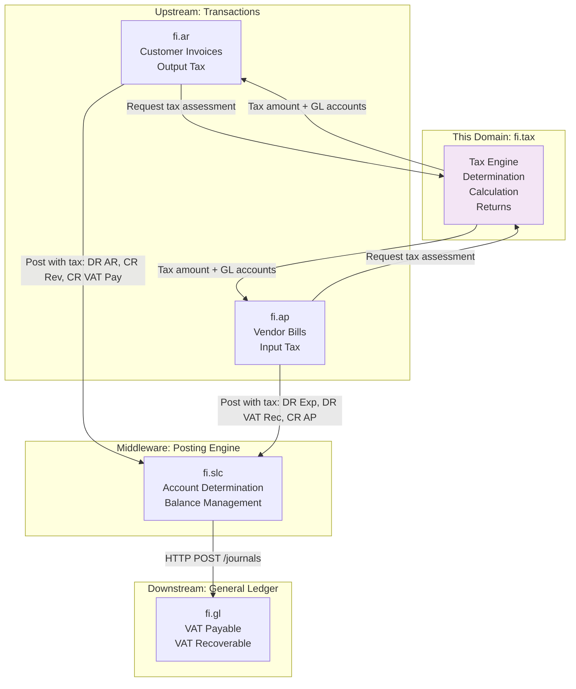
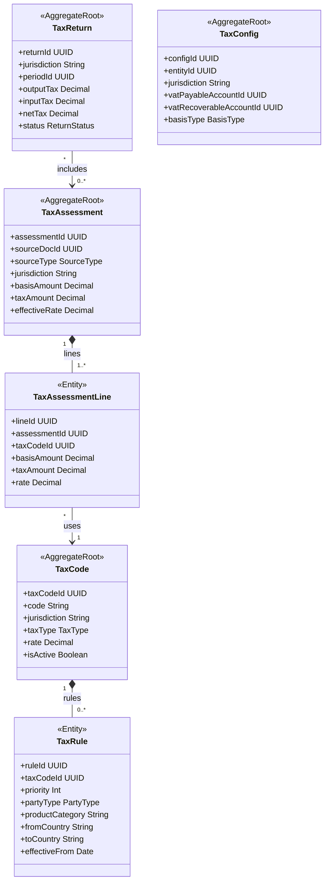
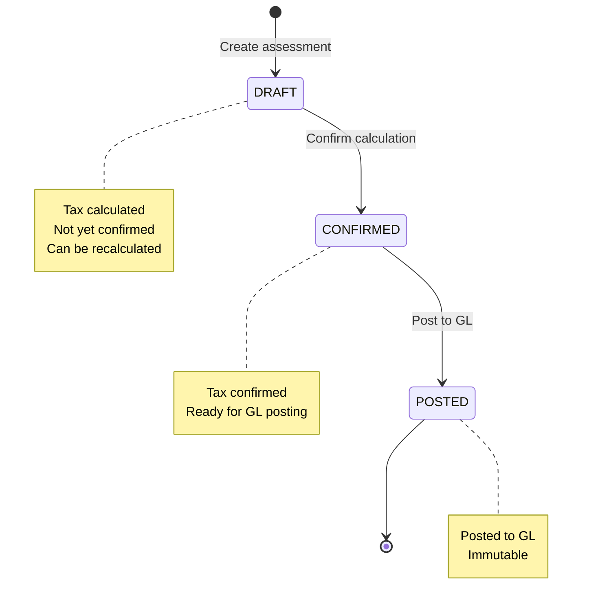
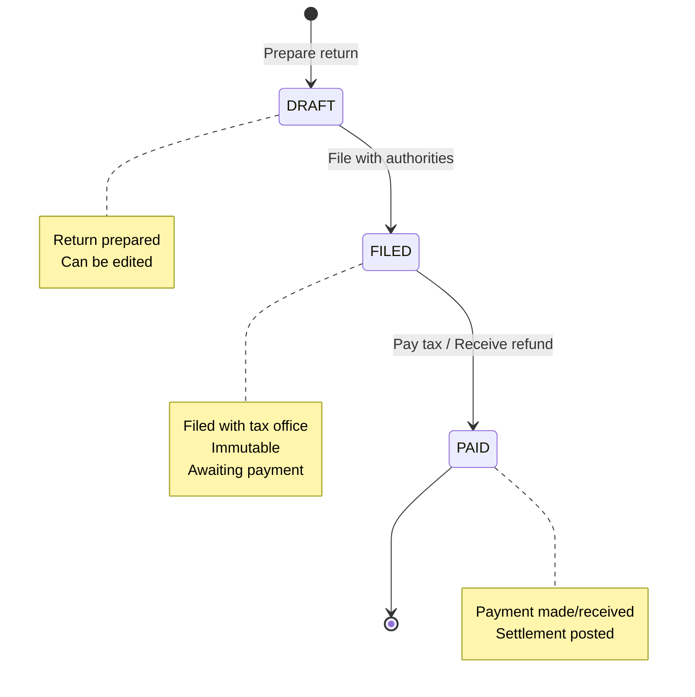
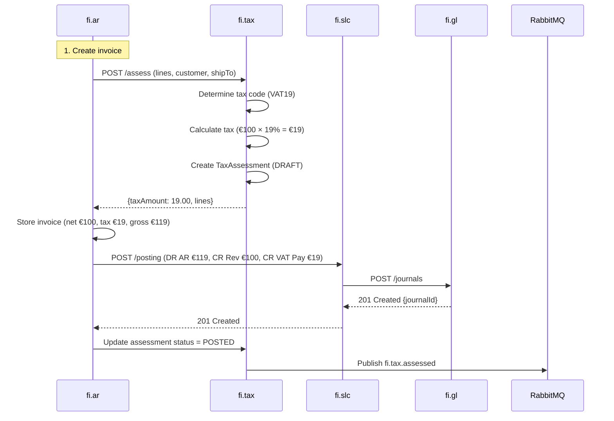

<!-- TEMPLATE COMPLIANCE: ~65%
Missing sections: §2 (Service Identity - partially in Meta), §11 (Feature Dependencies), §12 (Extension Points)
Renumbering needed: §3 -> §5 (Use Cases), §5 -> §7 (Integration), §6 -> §7 (Events, merge), §7 -> §6 (REST API), §8 -> §8 (Data Model), §9 -> §9 (Security), §10 -> §10 (Quality), §11 -> §13 (Migration), §12 -> §14 (Decisions), §13 -> §15 (Appendix)
Action needed: Expand Meta header block (Port, Repository, Tags, Team), add §2 Service Identity table, renumber sections to §0-§15, add §11 Feature Dependencies stub, add §12 Extension Points stub
-->
# Service Domain Specification — `fi.tax` (Indirect Tax Determination)

> **Meta Information**
> - **Version:** 2026-01-19
> - **Template:** `domain-service-spec.md` v1.0.0
> - **Template Compliance:** ~65% — §2, §11, §12 missing
> - **Author(s):** OpenLeap Architecture Team
> - **Status:** DRAFT
> - **Tier:** T3
> - **Suite:** `fi`
> - **Domain:** `tax`
> - **Service ID:** `fi-tax-svc`
> - **basePackage:** `io.openleap.fi.tax`
> - **API Base Path:** `/api/fi/tax/v1`

---

## Specification Guidelines Compliance

> **This specification MUST comply with the project-wide specification guidelines.**
>
> #### Non-negotiables
> - Never invent facts. If information is missing, add an **OPEN QUESTION** entry.
> - Use **MUST/SHOULD/MAY** for normative statements.
> - Keep the spec **self-contained**: no references to chat context.
> - Record decisions and boundaries explicitly (see Section 12).

---

## 0. Document Purpose & Scope

### 0.1 Purpose

This document specifies the **Tax Engine (`fi.tax`)** domain, which provides tax determination and calculation for indirect taxes (VAT, GST, Sales Tax, Use Tax).

In FI v2.1, `fi.tax` MUST provide tax determination outputs that can be used by upstream domains (`fi.ar`, `fi.ap`) and posting orchestration (`fi.pst`).

Tax postings MUST ultimately be executed in `fi.gl` (via `fi.pst`).

### 0.2 Target Audience
- Product Owners & Business Stakeholders (Finance, Tax, Accounting, Compliance)
- System Architects & Technical Leads
- Integration Engineers
- Tax Managers and Tax Accountants
- Controllers and Auditors
- Compliance Officers

### 0.3 Scope

**In Scope:**
- **Tax Determination:** Calculate applicable tax based on jurisdiction, party, product, place of supply
- **Indirect Taxes:** VAT (Value-Added Tax), GST (Goods and Services Tax), Sales Tax, Use Tax
- **Tax Calculation:** Line-level tax amounts, tax basis, effective rates
- **Tax posting requests:** Provide the information required to post tax (output/input) via `fi.pst` (exact posting workflow OPEN QUESTION).
- **Reverse Charge:** Self-assessment for cross-border transactions
- **Withholding Tax (WHT):** Basic WHT calculation and posting (vendor payments)
- **Tax Returns:** Period-based return preparation, aggregation, filing support
- **Reconciliation:** Tax subledger to GL control accounts (VAT Payable, VAT Recoverable)
- **Multiple Jurisdictions:** Support multi-country operations (EU, US, APAC, etc.)
- **Exemptions:** Tax-exempt transactions, zero-rated supplies

**Out of Scope:**
- Direct taxes (corporate income tax, payroll taxes) → Separate tax domains
- E-filing API integration (phase 1) → Future adapters to government systems
- Transfer pricing → `fi.ic`
- Customs duties and import taxes → Separate domain
- Real-time tax rate updates from external providers → Configuration management

### 0.4 Related Documents
- `platform/T3_Domains/FI/_fi_suite_v2_1.md` - FI Suite architecture (v2.1)
- `platform/T3_Domains/FI/fi_gl.md` - General Ledger
- `platform/T3_Domains/FI/fi_pst.md` - Posting orchestration
- `platform/T3_Domains/FI/fi_slc.md` - Posting semantics library
- `platform/T3_Domains/FI/fi_ar.md` - Accounts Receivable (output tax)
- `platform/T3_Domains/FI/fi_ap.md` - Accounts Payable (input tax)

---

## 1. Business Context

### 1.1 Domain Purpose

**fi.tax** is the authoritative source for tax rules and calculations. Every time a company sells goods (AR invoice) or purchases goods/services (AP bill), indirect taxes must be calculated and accounted for. This domain ensures accurate tax determination, proper accounting, and compliance with tax regulations across multiple jurisdictions.

**Core Business Problems Solved:**
- **Tax Compliance:** Meet VAT/GST/Sales Tax reporting requirements
- **Accurate Tax Calculation:** Prevent under/over-charging customers
- **Tax Recovery:** Maximize input tax recovery (deductible VAT)
- **Multi-Jurisdiction:** Handle complex cross-border tax rules
- **Audit Trail:** Provide complete documentation for tax audits
- **Cash Flow:** Manage tax payable/recoverable, optimize filing periods

### 1.2 Business Value

**For the Organization:**
- **Compliance:** Avoid penalties, interest, and audit issues
- **Automation:** Eliminate manual tax calculations (save 80% of time)
- **Accuracy:** Reduce tax errors, prevent customer complaints
- **Working Capital:** Optimize VAT recovery timing, reduce cash tied up
- **Risk Management:** Stay current with changing tax rates and rules
- **Multi-Country:** Support global expansion with local tax rules

**For Users:**
- **Tax Manager:** Automated tax returns, one-click reconciliation
- **Accountant:** Auto-calculate tax on invoices/bills, no manual lookup
- **Controller:** Reconcile tax accounts to GL, month-end close
- **Auditor:** Complete tax trail from invoice to return to payment
- **Compliance Officer:** Export tax data for statutory filings

### 1.3 Key Stakeholders

| Role | Responsibility | Primary Use Cases |
|------|----------------|-------------------|
| Tax Manager | Tax compliance, returns | Prepare tax returns, file with authorities, reconcile |
| Tax Accountant | Tax calculations | Configure tax codes, review assessments, post adjustments |
| Controller | Month-end close | Reconcile tax accounts, review variances |
| Accounts Payable Clerk | Vendor invoices | Auto-calculate input tax on AP bills |
| Accounts Receivable Clerk | Customer invoices | Auto-calculate output tax on AR invoices |
| Auditor | Tax audit | Verify tax calculations, trace to returns |

### 1.4 Strategic Positioning

**fi.tax** sits **between** AR/AP (tax triggers) and the General Ledger (tax accounts).



**Key Insight:** fi.tax provides tax determination as a service; AR/AP post the complete journal including tax.

---

## 2. Domain Model

### 2.1 Conceptual Overview

The tax engine domain model consists of five main pillars:

1. **Tax Codes:** Master data (jurisdiction, rate, type)
2. **Tax Rules:** Determination logic (party, product, place of supply)
3. **Tax Assessments:** Calculated tax for transactions
4. **Tax Returns:** Period aggregation and filing
5. **GL Integration:** Post tax via fi.slc

**Key Principles:**
- **Jurisdiction-Based:** Tax rules vary by country, state, region
- **Place of Supply:** Tax based on where goods/services consumed
- **Accrual vs. Cash Basis:** Some jurisdictions tax on invoice, others on payment
- **Reverse Charge:** Self-assessment for cross-border B2B
- **Reconciliation:** Tax subledger must match GL control accounts

### 2.2 Core Concepts



### 2.3 Aggregate Definitions

#### 2.3.1 TaxCode

**Business Purpose:**  
Master data for tax types and rates. Represents a specific tax (e.g., "German VAT 19%", "California Sales Tax 7.25%").

**Key Attributes:**

| Attribute | Type | Description | Constraints |
|-----------|------|-------------|-------------|
| taxCodeId | UUID | Unique identifier | Required, immutable, PK |
| tenantId | UUID | Tenant ownership | Required, immutable |
| code | String | Tax code | Required, unique per tenant, e.g., "VAT19", "GST5" |
| name | String | Descriptive name | Required, e.g., "German VAT Standard Rate" |
| jurisdiction | String | Country/region | Required, ISO 3166-1 alpha-2, e.g., "DE", "US-CA" |
| taxType | TaxType | Tax category | Required, enum(VAT, GST, SALES_TAX, USE_TAX, WHT) |
| rate | Decimal | Tax rate percentage | Required, >= 0, e.g., 19.00 (for 19%) |
| isReverseCharge | Boolean | Reverse charge indicator | Required, default false |
| isZeroRated | Boolean | Zero-rated (0% but taxable) | Required, default false |
| isExempt | Boolean | Tax-exempt | Required, default false |
| effectiveFrom | Date | Effective date | Required |
| effectiveTo | Date | End date | Optional, null = active |
| isActive | Boolean | Active for use | Required, default true |
| createdAt | Timestamp | Creation timestamp | Auto-generated |

**Tax Types:**

| Type | Description | Example | GL Treatment |
|------|-------------|---------|--------------|
| VAT | Value-Added Tax | EU VAT, UK VAT | Payable (AR), Recoverable (AP) |
| GST | Goods & Services Tax | Australia GST, India GST | Payable (AR), Recoverable (AP) |
| SALES_TAX | Sales Tax | US state sales tax | Payable (AR), Not recoverable (AP) |
| USE_TAX | Use Tax | US use tax (purchaser self-assess) | Payable (AP), Not on AR |
| WHT | Withholding Tax | Vendor payment WHT | Payable (AP), Withheld at source |

**Business Rules:**

1. **BR-CODE-001: Rate Range**
   - *Rule:* rate >= 0 AND rate <= 100
   - *Rationale:* Tax rates are percentages
   - *Enforcement:* CHECK constraint

2. **BR-CODE-002: Effective Date Overlap**
   - *Rule:* No overlapping effective periods for same (jurisdiction, taxType)
   - *Rationale:* Unambiguous tax rate at any point in time
   - *Enforcement:* EXCLUDE constraint on date ranges

**Example Scenarios:**

**German VAT:**
```json
{
  "code": "VAT19",
  "name": "German VAT Standard Rate",
  "jurisdiction": "DE",
  "taxType": "VAT",
  "rate": 19.00,
  "effectiveFrom": "2007-01-01",
  "effectiveTo": null,
  "isActive": true
}
```

**Reverse Charge VAT:**
```json
{
  "code": "VAT_RC",
  "name": "EU Reverse Charge VAT",
  "jurisdiction": "EU",
  "taxType": "VAT",
  "rate": 0.00,
  "isReverseCharge": true,
  "effectiveFrom": "2010-01-01"
}
```

---

#### 2.3.2 TaxRule

**Business Purpose:**  
Determines which tax code applies to a transaction based on conditions (party, product, place of supply).

**Key Attributes:**

| Attribute | Type | Description | Constraints |
|-----------|------|-------------|-------------|
| ruleId | UUID | Unique identifier | Required, immutable, PK |
| taxCodeId | UUID | Applicable tax code | Required, FK to tax_codes |
| priority | Int | Rule priority (lower = higher priority) | Required, > 0 |
| partyType | PartyType | Customer/vendor type | Optional, enum(B2B, B2C, EXEMPT) |
| productCategory | String | Product/service category | Optional |
| fromCountry | String | Seller country | Optional, ISO 3166-1 |
| toCountry | String | Buyer country | Optional, ISO 3166-1 |
| fromRegion | String | Seller state/province | Optional |
| toRegion | String | Buyer state/province | Optional |
| effectiveFrom | Date | Rule effective date | Required |
| effectiveTo | Date | Rule end date | Optional, null = active |

**Rule Evaluation Logic:**
1. System queries all active rules for transaction date
2. Filters by matching conditions (party, product, countries)
3. Sorts by priority (ascending)
4. Returns first matching rule's tax code

**Example Rules:**

**Rule 1: German domestic sales (B2C)**
```json
{
  "priority": 10,
  "taxCodeId": "VAT19",
  "partyType": "B2C",
  "fromCountry": "DE",
  "toCountry": "DE",
  "effectiveFrom": "2007-01-01"
}
```

**Rule 2: EU cross-border B2B (reverse charge)**
```json
{
  "priority": 5,
  "taxCodeId": "VAT_RC",
  "partyType": "B2B",
  "fromCountry": "DE",
  "toCountry": "FR",
  "effectiveFrom": "2010-01-01"
}
```

**Rule 3: US California sales tax**
```json
{
  "priority": 10,
  "taxCodeId": "CA_SALES_TAX",
  "fromRegion": "CA",
  "toRegion": "CA",
  "effectiveFrom": "2000-01-01"
}
```

---

#### 2.3.3 TaxAssessment

**Business Purpose:**  
Result of tax determination and calculation for an AR invoice or AP bill. Stores computed tax amounts.

**Key Attributes:**

| Attribute | Type | Description | Constraints |
|-----------|------|-------------|-------------|
| assessmentId | UUID | Unique identifier | Required, immutable, PK |
| tenantId | UUID | Tenant ownership | Required, immutable |
| assessmentNumber | String | Sequential number | Required, unique per tenant |
| sourceDocId | UUID | Source document ID | Required, FK to ar.invoices or ap.bills |
| sourceType | SourceType | Document type | Required, enum(AR_INVOICE, AP_BILL, ADJUSTMENT) |
| jurisdiction | String | Primary jurisdiction | Required |
| basisAmount | Decimal | Total tax basis (net amount) | Required, >= 0 |
| taxAmount | Decimal | Total tax amount | Required, >= 0 |
| effectiveRate | Decimal | Effective tax rate | Required, >= 0 |
| currency | String | Currency | Required, ISO 4217 |
| assessmentDate | Date | Assessment date | Required |
| status | AssessmentStatus | Current state | Required, enum(DRAFT, CONFIRMED, POSTED) |
| isReverseCharge | Boolean | Reverse charge transaction | Required, default false |
| createdAt | Timestamp | Creation timestamp | Auto-generated |

**Lifecycle States:**



**Business Rules:**

1. **BR-ASMT-001: Effective Rate Validation**
   - *Rule:* effectiveRate = (taxAmount / basisAmount) × 100
   - *Rationale:* Ensure calculation consistency
   - *Enforcement:* Calculated field validation

2. **BR-ASMT-002: Currency Consistency**
   - *Rule:* currency must match source document currency
   - *Rationale:* Prevent currency mismatch
   - *Enforcement:* Validation on creation

---

#### 2.3.4 TaxAssessmentLine

**Business Purpose:**  
Individual line-level tax calculation within an assessment. One line per tax code applied.

**Key Attributes:**

| Attribute | Type | Description | Constraints |
|-----------|------|-------------|-------------|
| lineId | UUID | Unique identifier | Required, immutable, PK |
| assessmentId | UUID | Parent assessment | Required, FK to tax_assessments |
| lineNumber | Int | Line number | Required, unique per assessment |
| taxCodeId | UUID | Applied tax code | Required, FK to tax_codes |
| taxCode | String | Tax code (denormalized) | Required |
| basisAmount | Decimal | Line tax basis | Required, >= 0 |
| rate | Decimal | Tax rate applied | Required, >= 0 |
| taxAmount | Decimal | Line tax amount | Required, >= 0 |
| currency | String | Line currency | Required, ISO 4217 |

**Business Rules:**

1. **BR-LINE-001: Tax Calculation**
   - *Rule:* taxAmount = basisAmount × (rate / 100)
   - *Rationale:* Standard tax calculation
   - *Enforcement:* Validation on creation

**Example Calculation:**

**AR Invoice (German VAT):**
```
Invoice Line 1: Product A €100.00
  → Tax Code: VAT19
  → Basis: €100.00
  → Rate: 19%
  → Tax: €100.00 × 0.19 = €19.00

Invoice Line 2: Product B €50.00
  → Tax Code: VAT19
  → Basis: €50.00
  → Rate: 19%
  → Tax: €50.00 × 0.19 = €9.50

Assessment:
  Total Basis: €150.00
  Total Tax: €28.50
  Effective Rate: 19%
```

---

#### 2.3.5 TaxReturn

**Business Purpose:**  
Represents a tax return (VAT return, GST return, sales tax return) for a period and jurisdiction. Aggregates all assessments.

**Key Attributes:**

| Attribute | Type | Description | Constraints |
|-----------|------|-------------|-------------|
| returnId | UUID | Unique identifier | Required, immutable, PK |
| tenantId | UUID | Tenant ownership | Required, immutable |
| returnNumber | String | Sequential number | Required, unique per tenant |
| jurisdiction | String | Tax jurisdiction | Required, e.g., "DE", "US-CA" |
| periodId | UUID | Fiscal period | Required, FK to fi.gl.periods |
| periodStart | Date | Period start date | Required |
| periodEnd | Date | Period end date | Required |
| outputTax | Decimal | Sales tax (VAT payable) | Required, >= 0 |
| inputTax | Decimal | Purchase tax (VAT recoverable) | Required, >= 0 |
| netTax | Decimal | Net tax due/refund | Required, = outputTax - inputTax |
| currency | String | Return currency | Required, ISO 4217 |
| status | ReturnStatus | Current state | Required, enum(DRAFT, FILED, PAID) |
| dueDate | Date | Filing due date | Optional |
| filedDate | Date | Date filed | Optional, set when FILED |
| paidDate | Date | Date paid | Optional, set when PAID |
| settlementJournalId | UUID | GL settlement journal | Optional, FK to fi.gl.journal_entries |
| artifactRef | UUID | DMS document reference | Optional, filed return PDF |
| createdAt | Timestamp | Creation timestamp | Auto-generated |

**Lifecycle States:**



**Business Rules:**

1. **BR-RET-001: Net Tax Calculation**
   - *Rule:* netTax = outputTax - inputTax
   - *Rationale:* Standard VAT return calculation
   - *Enforcement:* Calculated field

2. **BR-RET-002: Period Uniqueness**
   - *Rule:* One FILED return per (tenant, jurisdiction, periodId)
   - *Rationale:* Prevent duplicate filings
   - *Enforcement:* Unique constraint

**Example Return (German VAT):**
```json
{
  "jurisdiction": "DE",
  "period": "2025-12",
  "periodStart": "2025-12-01",
  "periodEnd": "2025-12-31",
  "outputTax": 150000.00,
  "inputTax": 85000.00,
  "netTax": 65000.00,
  "currency": "EUR",
  "status": "FILED",
  "dueDate": "2026-01-10"
}
```

---

#### 2.3.6 TaxConfig

**Business Purpose:**  
Configuration for tax accounting per entity/jurisdiction. Defines GL account mappings and policies.

**Key Attributes:**

| Attribute | Type | Description | Constraints |
|-----------|------|-------------|-------------|
| configId | UUID | Unique identifier | Required, immutable, PK |
| tenantId | UUID | Tenant ownership | Required, immutable |
| entityId | UUID | Legal entity | Required, FK to entities |
| jurisdiction | String | Tax jurisdiction | Required |
| basisType | BasisType | Accrual or cash | Required, enum(ACCRUAL, CASH) |
| vatPayableAccountId | UUID | Output tax account | Required, FK to fi.gl.accounts |
| vatRecoverableAccountId | UUID | Input tax account | Required, FK to fi.gl.accounts |
| whtPayableAccountId | UUID | Withholding tax account | Optional, FK to fi.gl.accounts |
| taxClearingAccountId | UUID | Clearing account | Optional, for cash basis |
| returnFrequency | String | Filing frequency | Required, enum(MONTHLY, QUARTERLY, ANNUAL) |
| nextReturnDueDate | Date | Next filing deadline | Optional |
| isActive | Boolean | Active configuration | Required, default true |

**Basis Types:**

| Type | Description | When Tax Recognized | Example |
|------|-------------|---------------------|---------|
| ACCRUAL | Invoice-based | When invoice posted | Most VAT jurisdictions |
| CASH | Payment-based | When payment made/received | Some small business schemes |

---

## 3. Business Processes & Use Cases

### 3.1 Primary Use Cases

#### UC-001: Calculate Tax on AR Invoice (Output Tax)

**Actor:** fi.ar (automated, during invoice creation)

**Preconditions:**
- Customer invoice being created
- Tax codes and rules configured
- User has AR_POSTER role

**Main Flow:**
1. fi.ar creates invoice with lines (POST /invoices)
2. fi.ar calls fi.tax POST /assess:
   ```json
   {
     "sourceType": "AR_INVOICE",
     "sourceDocId": "invoice-uuid",
     "customerPartyId": "customer-uuid",
     "billTo": {"country": "DE", "region": null},
     "shipTo": {"country": "DE", "region": null},
     "invoiceDate": "2025-12-05",
     "lines": [
       {
         "lineNumber": 1,
         "productId": "product-uuid",
         "productCategory": "GOODS",
         "amount": 100.00,
         "currency": "EUR"
       }
     ]
   }
   ```
3. fi.tax determines applicable tax:
   a. Query tax rules matching: fromCountry=DE, toCountry=DE, partyType=B2C
   b. Find tax code: VAT19 (19%)
4. fi.tax calculates tax:
   - Line 1 basis: €100.00
   - Rate: 19%
   - Tax: €19.00
5. fi.tax creates TaxAssessment (status = DRAFT)
6. fi.tax creates TaxAssessmentLine
7. fi.tax returns assessment:
   ```json
   {
     "assessmentId": "assessment-uuid",
     "basisAmount": 100.00,
     "taxAmount": 19.00,
     "effectiveRate": 19.00,
     "lines": [
       {
         "lineNumber": 1,
         "taxCode": "VAT19",
         "basisAmount": 100.00,
         "rate": 19.00,
         "taxAmount": 19.00
       }
     ]
   }
   ```
8. fi.ar stores tax amount in invoice (taxAmount = €19.00, totalAmount = €119.00)
9. fi.ar posts invoice via fi.slc:
   - DR 1200 Accounts Receivable €119.00
   - CR 4000 Revenue €100.00
   - CR 2300 VAT Payable €19.00
10. fi.tax updates TaxAssessment status = POSTED

**Postconditions:**
- Tax assessment created
- Invoice includes correct VAT
- GL journal posted (VAT payable increased)

**Business Rules Applied:**
- BR-CODE-002: Effective date overlap
- BR-ASMT-001: Effective rate validation
- BR-LINE-001: Tax calculation

---

#### UC-002: Calculate Tax on AP Bill (Input Tax)

**Actor:** fi.ap (automated, during bill creation)

**Preconditions:**
- Vendor bill being created
- Tax codes configured
- User has AP_POSTER role

**Main Flow:**
1. fi.ap creates bill with lines (POST /bills)
2. fi.ap calls fi.tax POST /assess:
   ```json
   {
     "sourceType": "AP_BILL",
     "sourceDocId": "bill-uuid",
     "vendorPartyId": "vendor-uuid",
     "billFrom": {"country": "DE", "region": null},
     "billTo": {"country": "DE", "region": null},
     "billDate": "2025-12-05",
     "lines": [
       {
         "lineNumber": 1,
         "productId": "product-uuid",
         "productCategory": "SERVICES",
         "amount": 1000.00,
         "currency": "EUR"
       }
     ]
   }
   ```
3. fi.tax determines tax code: VAT19
4. fi.tax calculates tax: €1,000 × 19% = €190
5. fi.tax returns assessment
6. fi.ap stores tax amount (taxAmount = €190, totalAmount = €1,190)
7. fi.ap posts bill via fi.slc:
   - DR 5000 Expenses €1,000
   - DR 2310 VAT Recoverable €190
   - CR 2100 Accounts Payable €1,190
8. fi.tax updates TaxAssessment status = POSTED

**Postconditions:**
- Tax assessment created
- Bill includes input VAT (recoverable)
- GL journal posted (VAT recoverable increased)

---

#### UC-003: Handle Reverse Charge (EU Cross-Border B2B)

**Actor:** fi.ar or fi.ap

**Preconditions:**
- Cross-border B2B transaction (e.g., DE → FR)
- Both parties VAT registered
- Reverse charge rule configured

**Main Flow:**
1. fi.ar creates invoice (German seller → French business customer)
2. fi.ar calls fi.tax POST /assess
3. fi.tax determines: Reverse charge applies (B2B, cross-border EU)
4. fi.tax returns: taxAmount = 0, isReverseCharge = true
5. fi.ar posts invoice:
   - DR 1200 Accounts Receivable €1,000 (no VAT charged)
   - CR 4000 Revenue €1,000
6. French buyer (in their system) self-assesses:
   - DR 2310 VAT Recoverable €190 (French VAT 19%)
   - CR 2300 VAT Payable €190
   - (Net zero, compliance only)

**Postconditions:**
- No VAT charged by seller
- Buyer self-assesses VAT (reverse charge)

---

#### UC-004: Prepare Tax Return

**Actor:** Tax Manager

**Preconditions:**
- Period closed (all AR/AP posted)
- Tax assessments exist for period
- User has TAX_ADMIN role

**Main Flow:**
1. User creates tax return (POST /returns)
2. User specifies: jurisdiction = "DE", periodId = "2025-12"
3. System queries all assessments for period:
   - Output tax (AR invoices): SUM(taxAmount WHERE sourceType = AR_INVOICE) = €150,000
   - Input tax (AP bills): SUM(taxAmount WHERE sourceType = AP_BILL) = €85,000
4. System calculates net tax:
   - Net tax due = €150,000 - €85,000 = €65,000
5. System creates TaxReturn (status = DRAFT)
6. User reviews return, then files
7. System updates TaxReturn status = FILED
8. System generates return report (PDF)
9. System uploads report to DMS:
   - docType = "TAX_RETURN"
   - retention = 10 years
10. System stores artifactRef in TaxReturn

**Postconditions:**
- Tax return prepared and filed
- Return document stored in DMS
- Ready for payment

---

#### UC-005: Post Tax Return Settlement

**Actor:** Tax Manager

**Preconditions:**
- Tax return filed
- Payment due
- User has TAX_ADMIN role

**Main Flow:**
1. User posts tax return settlement (POST /returns/{id}/settle)
2. User specifies: paymentAmount = €65,000, bankAccountId
3. System calls fi.slc POST /posting:
   - eventType: fi.tax.return.settled
   - DR 2300 VAT Payable €65,000
   - CR 1000 Bank €65,000
4. System updates TaxReturn:
   - status = PAID
   - paidDate = today
   - settlementJournalId = journalId
5. System publishes fi.tax.return.settled event

**Postconditions:**
- VAT payable cleared
- Bank account reduced
- Tax liability settled

---

### 3.2 Process Flow Diagrams

#### Process: AR Invoice with VAT



---

## 4. Business Rules & Constraints

### 4.1 Business Rules Catalog

| ID | Rule Name | Description | Scope | Enforcement |
|----|-----------|-------------|-------|-------------|
| BR-CODE-001 | Rate Range | Tax rate 0-100% | TaxCode | Create/Update |
| BR-CODE-002 | Effective Date Overlap | No overlapping effective periods | TaxCode | Create/Update |
| BR-ASMT-001 | Effective Rate Validation | effectiveRate = (taxAmount / basisAmount) × 100 | TaxAssessment | Validation |
| BR-ASMT-002 | Currency Consistency | Assessment currency = document currency | TaxAssessment | Create |
| BR-LINE-001 | Tax Calculation | taxAmount = basisAmount × (rate / 100) | TaxAssessmentLine | Create |
| BR-RET-001 | Net Tax Calculation | netTax = outputTax - inputTax | TaxReturn | Always |
| BR-RET-002 | Period Uniqueness | One filed return per (jurisdiction, period) | TaxReturn | File |

---

## 5. Integration Architecture

### 5.1 Integration Pattern Decision

**Does this domain use orchestration (Saga/Temporal)?** [ ] YES [X] NO

**Pattern Used:** Event-Driven Architecture (Choreography) + Synchronous API

**Rationale:**

fi.tax uses **Hybrid Integration** because:

✅ **Synchronous Tax Assessment:**
- AR/AP call fi.tax POST /assess (synchronous)
- Wait for tax calculation result
- Tax amount needed for invoice total

✅ **Event Publishing:**
- Publishes tax.assessed, tax.return.filed
- Downstream services react (fi.rpt, t4.bi)

❌ **Why NOT Pure EDA:**
- AR/AP need immediate tax calculation (can't wait for async event)
- Tax amount affects invoice total (user-facing)

❌ **Why NOT Orchestration:**
- No multi-service transaction
- Tax assessment is single call: Request → Calculate → Return

### 5.2 Event-Driven Integration

**Inbound Events (Consumed):**

| Event | Source | Purpose | Handling |
|-------|--------|---------|----------|
| fi.gl.period.closed | fi.gl | Trigger return preparation | Notify tax manager |
| fi.ar.invoice.posted | fi.ar | Update assessment status | Mark assessment POSTED |
| fi.ap.bill.posted | fi.ap | Update assessment status | Mark assessment POSTED |

**Outbound Events (Published):**

| Event | When | Purpose | Consumers |
|-------|------|---------|-----------|
| fi.tax.assessed | Tax calculated | Notify of tax calculation | fi.rpt, t4.bi |
| fi.tax.return.filed | Return filed with authorities | Track return status | fi.rpt, compliance |
| fi.tax.return.settled | Tax paid/refunded | Update cash flow | fi.rpt, treasury |

---

## 6. Event Catalog

### 6.1 Outbound Events

**Exchange:** `fi.tax.events` (RabbitMQ topic exchange)

#### Event: assessed

**Routing Key:** `fi.tax.assessed`

**When Published:** Tax assessment created and confirmed

**Business Meaning:** Tax calculated for transaction

**Consumers:**
- fi.rpt (update tax reports)
- t4.bi (tax analytics)

**Payload:**
```json
{
  "eventId": "evt-uuid",
  "tenantId": "tenant-uuid",
  "occurredAt": "2025-12-05T10:00:00Z",
  "traceId": "trace-uuid",
  "producer": "fi.tax",
  "aggregateType": "assessment",
  "changeType": "assessed",
  "entityIds": ["assessment-uuid"],
  "version": 1,
  "payload": {
    "assessmentId": "assessment-uuid",
    "sourceDocId": "invoice-uuid",
    "sourceType": "AR_INVOICE",
    "jurisdiction": "DE",
    "basisAmount": 100.00,
    "taxAmount": 19.00,
    "effectiveRate": 19.00,
    "currency": "EUR"
  }
}
```

---

#### Event: return.filed

**Routing Key:** `fi.tax.return.filed`

**When Published:** Tax return filed with authorities

**Business Meaning:** Tax return submitted for period

**Consumers:**
- fi.rpt (update compliance reports)
- compliance (track filing deadlines)

**Payload:**
```json
{
  "eventId": "evt-uuid",
  "tenantId": "tenant-uuid",
  "occurredAt": "2026-01-08T15:00:00Z",
  "traceId": "trace-uuid",
  "producer": "fi.tax",
  "aggregateType": "return",
  "changeType": "filed",
  "entityIds": ["return-uuid"],
  "version": 1,
  "payload": {
    "returnId": "return-uuid",
    "returnNumber": "VAT-2025-12",
    "jurisdiction": "DE",
    "period": "2025-12",
    "outputTax": 150000.00,
    "inputTax": 85000.00,
    "netTax": 65000.00,
    "currency": "EUR",
    "filedDate": "2026-01-08",
    "dueDate": "2026-01-10"
  }
}
```

---

## 7. API Specification

### 7.1 REST API

**Base Path:** `/api/fi/tax/v1`

**Authentication:** OAuth 2.0 Bearer Token

**Content Type:** `application/json`

#### 7.1.1 Tax Assessment

**POST /assess** - Calculate tax for transaction
- **Role:** TAX_POSTER (called by AR/AP services)
- **Request Body:**
  ```json
  {
    "sourceType": "AR_INVOICE",
    "sourceDocId": "invoice-uuid",
    "customerPartyId": "customer-uuid",
    "billTo": {"country": "DE", "region": null},
    "shipTo": {"country": "DE", "region": null},
    "invoiceDate": "2025-12-05",
    "lines": [
      {
        "lineNumber": 1,
        "productId": "product-uuid",
        "productCategory": "GOODS",
        "amount": 100.00,
        "currency": "EUR"
      }
    ]
  }
  ```
- **Response:** 201 Created
  ```json
  {
    "assessmentId": "assessment-uuid",
    "basisAmount": 100.00,
    "taxAmount": 19.00,
    "effectiveRate": 19.00,
    "currency": "EUR",
    "lines": [
      {
        "lineNumber": 1,
        "taxCode": "VAT19",
        "rate": 19.00,
        "basisAmount": 100.00,
        "taxAmount": 19.00
      }
    ]
  }
  ```

**GET /assessments** - List assessments
- **Role:** TAX_VIEWER
- **Query Params:** `sourceType`, `jurisdiction`, `fromDate`, `toDate`, `page`, `size`
- **Response:** 200 OK (array of assessments)

---

#### 7.1.2 Tax Returns

**POST /returns** - Prepare tax return
- **Role:** TAX_ADMIN
- **Request Body:**
  ```json
  {
    "jurisdiction": "DE",
    "periodId": "period-uuid",
    "returnType": "VAT"
  }
  ```
- **Response:** 201 Created

**POST /returns/{id}/file** - File return with authorities
- **Role:** TAX_ADMIN
- **Response:** 200 OK

**POST /returns/{id}/settle** - Post tax payment
- **Role:** TAX_ADMIN
- **Request Body:**
  ```json
  {
    "paymentAmount": 65000.00,
    "bankAccountId": "account-uuid",
    "paymentDate": "2026-01-10"
  }
  ```
- **Response:** 200 OK

**GET /returns** - List returns
- **Role:** TAX_VIEWER
- **Query Params:** `jurisdiction`, `periodId`, `status`, `page`, `size`
- **Response:** 200 OK

---

#### 7.1.3 Tax Codes

**GET /tax-codes** - List tax codes
- **Role:** TAX_VIEWER
- **Query Params:** `jurisdiction`, `taxType`, `isActive`
- **Response:** 200 OK

**POST /tax-codes** - Create tax code
- **Role:** TAX_ADMIN
- **Request Body:**
  ```json
  {
    "code": "VAT19",
    "name": "German VAT Standard Rate",
    "jurisdiction": "DE",
    "taxType": "VAT",
    "rate": 19.00,
    "effectiveFrom": "2007-01-01"
  }
  ```
- **Response:** 201 Created

---

### 7.2 Error Responses

| HTTP Status | Error Code | Description |
|-------------|------------|-------------|
| 400 | TAX_CODE_NOT_FOUND | No applicable tax code for transaction |
| 400 | INVALID_TAX_RATE | Tax rate outside valid range |
| 404 | JURISDICTION_NOT_FOUND | Jurisdiction not configured |
| 409 | RETURN_ALREADY_FILED | Cannot modify filed return |

---

## 8. Data Model

### 8.1 Storage Schema (PostgreSQL)

#### Schema: fi_tax

#### Table: tax_codes
```sql
CREATE TABLE fi_tax.tax_codes (
  tax_code_id UUID PRIMARY KEY,
  tenant_id UUID NOT NULL,
  code VARCHAR(50) NOT NULL,
  name VARCHAR(200) NOT NULL,
  jurisdiction VARCHAR(10) NOT NULL,
  tax_type VARCHAR(20) NOT NULL,
  rate NUMERIC(5,2) NOT NULL,
  is_reverse_charge BOOLEAN NOT NULL DEFAULT FALSE,
  is_zero_rated BOOLEAN NOT NULL DEFAULT FALSE,
  is_exempt BOOLEAN NOT NULL DEFAULT FALSE,
  effective_from DATE NOT NULL,
  effective_to DATE,
  is_active BOOLEAN NOT NULL DEFAULT TRUE,
  created_at TIMESTAMP NOT NULL DEFAULT NOW(),
  UNIQUE (tenant_id, code),
  CHECK (tax_type IN ('VAT', 'GST', 'SALES_TAX', 'USE_TAX', 'WHT')),
  CHECK (rate >= 0 AND rate <= 100),
  EXCLUDE USING gist (
    tenant_id WITH =,
    jurisdiction WITH =,
    tax_type WITH =,
    daterange(effective_from, effective_to, '[]') WITH &&
  )
);

CREATE INDEX idx_codes_tenant ON fi_tax.tax_codes(tenant_id);
CREATE INDEX idx_codes_jurisdiction ON fi_tax.tax_codes(jurisdiction);
CREATE INDEX idx_codes_active ON fi_tax.tax_codes(is_active);
```

#### Table: tax_assessments
```sql
CREATE TABLE fi_tax.tax_assessments (
  assessment_id UUID PRIMARY KEY,
  tenant_id UUID NOT NULL,
  assessment_number VARCHAR(50) NOT NULL,
  source_doc_id UUID NOT NULL,
  source_type VARCHAR(20) NOT NULL,
  jurisdiction VARCHAR(10) NOT NULL,
  basis_amount NUMERIC(19,4) NOT NULL,
  tax_amount NUMERIC(19,4) NOT NULL,
  effective_rate NUMERIC(5,2) NOT NULL,
  currency CHAR(3) NOT NULL,
  assessment_date DATE NOT NULL,
  status VARCHAR(20) NOT NULL DEFAULT 'DRAFT',
  is_reverse_charge BOOLEAN NOT NULL DEFAULT FALSE,
  created_at TIMESTAMP NOT NULL DEFAULT NOW(),
  UNIQUE (tenant_id, assessment_number),
  CHECK (source_type IN ('AR_INVOICE', 'AP_BILL', 'ADJUSTMENT')),
  CHECK (status IN ('DRAFT', 'CONFIRMED', 'POSTED')),
  CHECK (basis_amount >= 0),
  CHECK (tax_amount >= 0)
);

CREATE INDEX idx_assessments_tenant ON fi_tax.tax_assessments(tenant_id);
CREATE INDEX idx_assessments_source ON fi_tax.tax_assessments(source_doc_id);
CREATE INDEX idx_assessments_jurisdiction ON fi_tax.tax_assessments(jurisdiction);
```

#### Table: tax_assessment_lines
```sql
CREATE TABLE fi_tax.tax_assessment_lines (
  line_id UUID PRIMARY KEY,
  assessment_id UUID NOT NULL REFERENCES fi_tax.tax_assessments(assessment_id) ON DELETE CASCADE,
  line_number INT NOT NULL,
  tax_code_id UUID NOT NULL,
  tax_code VARCHAR(50) NOT NULL,
  basis_amount NUMERIC(19,4) NOT NULL,
  rate NUMERIC(5,2) NOT NULL,
  tax_amount NUMERIC(19,4) NOT NULL,
  currency CHAR(3) NOT NULL,
  UNIQUE (assessment_id, line_number),
  CHECK (basis_amount >= 0),
  CHECK (rate >= 0),
  CHECK (tax_amount >= 0)
);

CREATE INDEX idx_lines_assessment ON fi_tax.tax_assessment_lines(assessment_id);
```

#### Table: tax_returns
```sql
CREATE TABLE fi_tax.tax_returns (
  return_id UUID PRIMARY KEY,
  tenant_id UUID NOT NULL,
  return_number VARCHAR(50) NOT NULL,
  jurisdiction VARCHAR(10) NOT NULL,
  period_id UUID NOT NULL,
  period_start DATE NOT NULL,
  period_end DATE NOT NULL,
  output_tax NUMERIC(19,4) NOT NULL,
  input_tax NUMERIC(19,4) NOT NULL,
  net_tax NUMERIC(19,4) NOT NULL,
  currency CHAR(3) NOT NULL,
  status VARCHAR(20) NOT NULL DEFAULT 'DRAFT',
  due_date DATE,
  filed_date DATE,
  paid_date DATE,
  settlement_journal_id UUID,
  artifact_ref UUID,
  created_at TIMESTAMP NOT NULL DEFAULT NOW(),
  UNIQUE (tenant_id, return_number),
  UNIQUE (tenant_id, jurisdiction, period_id) WHERE status = 'FILED',
  CHECK (status IN ('DRAFT', 'FILED', 'PAID')),
  CHECK (output_tax >= 0),
  CHECK (input_tax >= 0),
  CHECK (net_tax = output_tax - input_tax)
);

CREATE INDEX idx_returns_tenant ON fi_tax.tax_returns(tenant_id);
CREATE INDEX idx_returns_jurisdiction ON fi_tax.tax_returns(jurisdiction);
CREATE INDEX idx_returns_period ON fi_tax.tax_returns(period_id);
```

---

## 9. Security & Compliance

### 9.1 Access Control

**Roles & Permissions:**

| Role | Read | Create | Update | Delete | Admin Operations |
|------|------|--------|--------|--------|------------------|
| TAX_VIEWER | ✓ (all) | ✗ | ✗ | ✗ | ✗ |
| TAX_POSTER | ✓ (assessments) | ✓ (assessments) | ✗ | ✗ | ✗ |
| TAX_ADMIN | ✓ (all) | ✓ (all) | ✓ (returns, codes) | ✓ (drafts) | ✓ (file returns) |

### 9.2 Compliance Requirements

**Regulations:**
- [X] VAT Directive (EU)
- [X] IFRS (tax disclosure)
- [X] Local GAAP (tax accounting)
- [X] Tax Audit Requirements

---

## 10. Quality Attributes

### 10.1 Performance Requirements

**Response Time (95th percentile):**
- POST /assess: < 200ms
- POST /returns: < 3 sec (for 10K assessments)
- GET /assessments: < 500ms

**Throughput:**
- Tax assessments: 1,000 assessments/sec
- Return preparation: 1 return/5 sec

---

## 11. Migration & Evolution

### 11.1 Data Migration

**From Legacy:**
- Export tax codes and rates
- Export historical assessments
- Import as opening balances
- Validate: Tax subledger = GL tax accounts

---

## 12. Open Questions & Decisions

### 12.1 ADRs

#### ADR-001: Synchronous vs. Async Tax Calculation

**Status:** Accepted

**Decision:** Use synchronous API call (POST /assess)

**Rationale:**
- AR/AP need immediate tax amount for invoice total
- User-facing operation (cannot wait for async event)
- Tax calculation is fast (< 200ms)

**Alternatives Rejected:**
- Async event-driven: Too slow for user-facing invoice creation

---

## 13. Appendix

### 13.1 Glossary

| Term | Definition |
|------|------------|
| VAT | Value-Added Tax |
| GST | Goods and Services Tax |
| Output Tax | Tax charged on sales (payable) |
| Input Tax | Tax paid on purchases (recoverable) |
| Reverse Charge | Buyer self-assesses VAT |
| Place of Supply | Location where goods/services consumed |
| Zero-Rated | 0% tax but taxable supply |
| Exempt | Not subject to tax |

