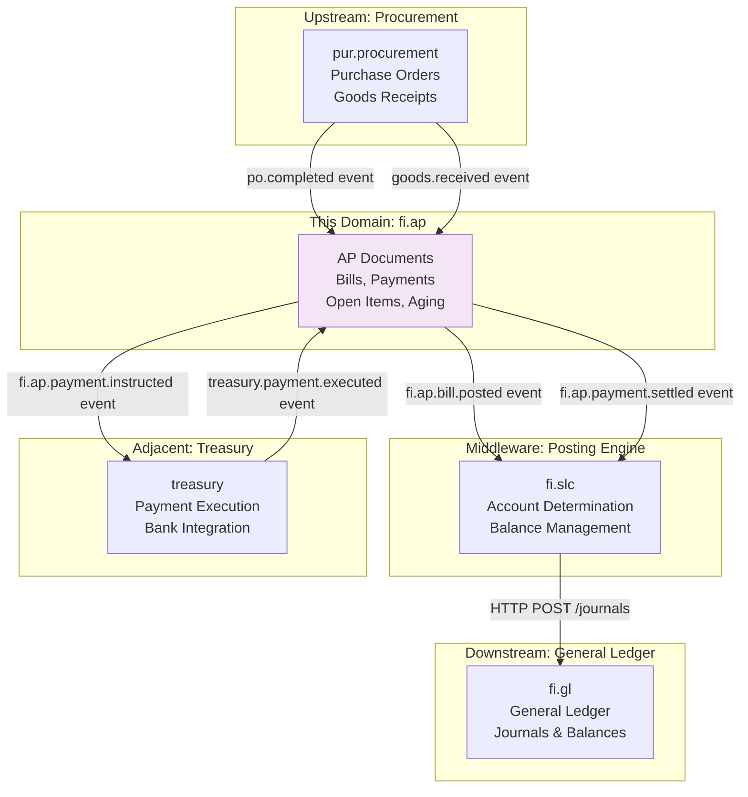
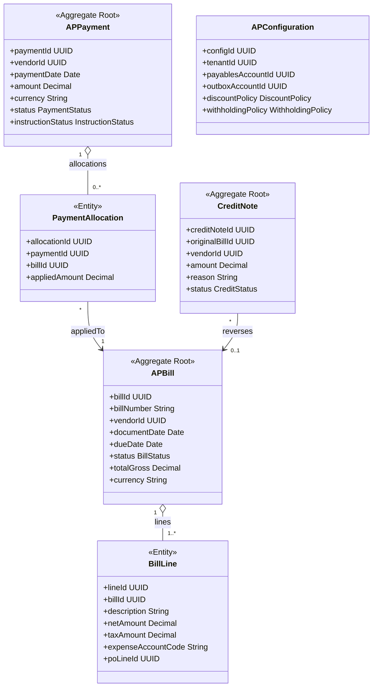
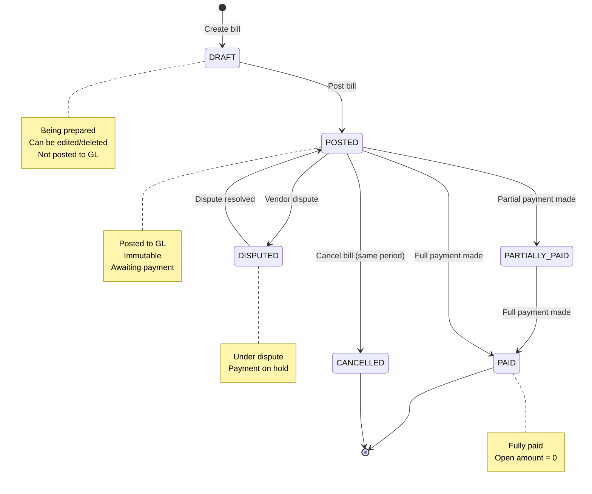
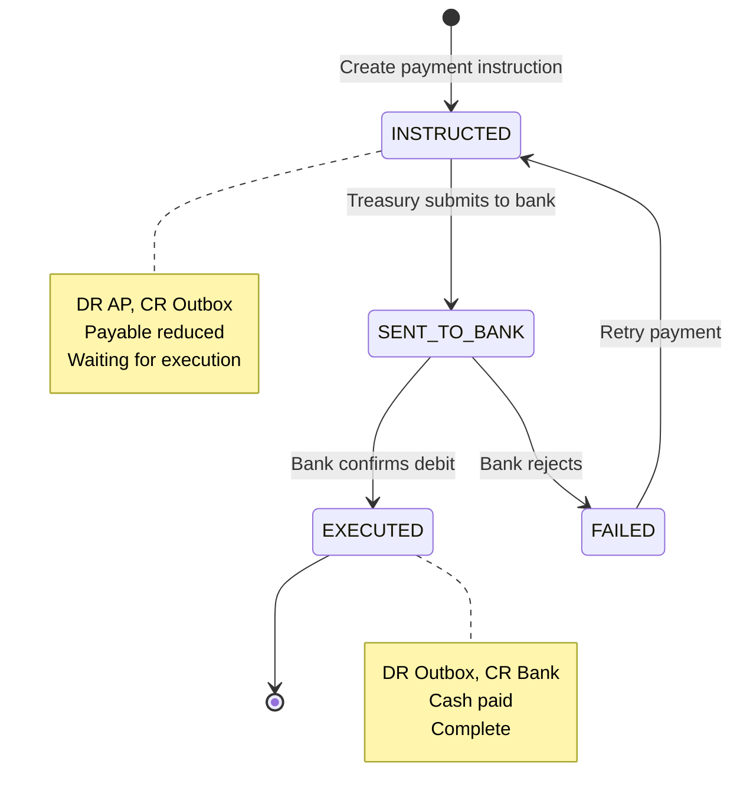
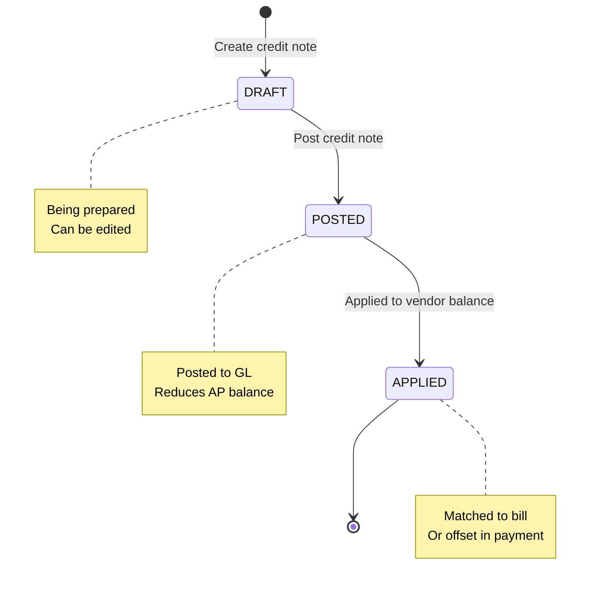
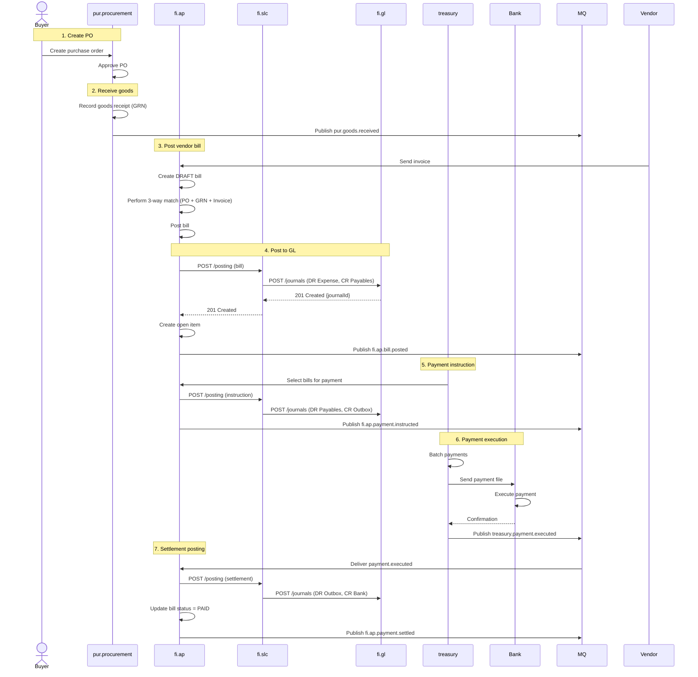

# FI - Accounts Payable (AP) Domain / Service Specification

> **Conceptual Stack Layer:** Domain / Service
> **Space:** Platform
> **Owner:** FI Domain Engineering Team
> **Schema alignment:** `service-layer.schema.json`
> **Companion files:** `openapi.yaml`, `*.schema.json` (event contracts)
> **Referenced by:** Platform-Feature Spec SS5 (backend dependencies), BFF Contract
> **Belongs to:** FI Suite Spec (`_fi_suite.md`)

> **Meta Information**
> - **Version:** 2026-04-01
> - **Template:** `domain-service-spec.md` v1.0.0
> - **Template Compliance:** ~95%
> - **Author(s):** OpenLeap Architecture Team
> - **Status:** DRAFT
> - **Suite:** `fi`
> - **Domain:** `ap`
> - **Bounded Context Ref:** `bc:payables`
> - **Service ID:** `fi-ap-svc`
> - **basePackage:** `io.openleap.fi.ap`
> - **API Base Path:** `/api/fi/ap/v1`
> - **OpenLeap Starter Version:** `v1.0`
> - **Port:** `8112`
> - **Repository:** `io.openleap.fi.ap`
> - **Tags:** `finance`, `accounts-payable`, `vendor`, `bills`, `payments`
> - **Team:**
>   - Name: `team-fi`
>   - Email: `fi-team@openleap.io`
>   - Slack: `#fi-team`

---

## Specification Guidelines Compliance

>
> ### Non-Negotiables
> - Never invent facts. If required info is missing, add an **OPEN QUESTION** entry.
> - Preserve intent and decisions. Only change meaning when explicitly requested.
> - Do not remove normative constraints unless they are explicitly replaced.
> - Keep the spec **self-contained**: no "see chat", no implicit context.
>
> ### Source of Truth Priority
> When sources conflict:
> 1. Spec (explicit) wins
> 2. Starter specs (implementation constraints) next
> 3. Guidelines (best practices) last
>
> ### Style Guide
> - Prefer short sentences and lists.
> - Use MUST/SHOULD/MAY for normative statements.

---

## 0. Document Purpose & Scope

### 0.1 Purpose

This document specifies the **Accounts Payable (fi.ap)** domain, which manages the complete lifecycle of vendor invoices, payments, credits, and payment execution. It serves as the operational subledger for vendor transactions, transforming business events into financial postings via fi.slc, and maintaining detailed vendor account statements.

### 0.2 Target Audience
- Product Owners & Business Stakeholders (Finance, Accounting, Procurement)
- System Architects & Technical Leads
- Integration Engineers
- Controllers and AP Accountants
- Treasury and Cash Management Teams

### 0.3 Scope

**In Scope:**
- **AP Documents:** Vendor bills/invoices, credit notes, debit memos, payments, adjustments
- **Payment Processing:** Payment instructions to treasury, settlement tracking, withholding tax
- **Cash Management:** Match payments to bills, handle prepayments and advances
- **Posting:** Transform AP events → GL journals (via fi.slc)
- **Open Items:** Track outstanding bills and payments (via fi.slc utilities)
- **Reconciliation:** Ensure AP subledger = GL control account
- **Multi-Currency:** Support foreign currency bills, revaluation
- **Procurement Integration:** 2-way and 3-way matching (PO, GRN, Invoice)

**Out of Scope:**
- General Ledger management (journals, periods, Chart of Accounts → fi.gl)
- Generic posting engine and account determination → fi.slc
- Financial reporting and statements → fi.rpt
- Tax calculation and compliance → fi.tax
- Vendor master data → bp (Business Partner)
- Full procurement workflows (PO creation, approvals → pur.procurement)
- Treasury payment execution (batch processing, bank format → treasury)

### 0.4 Related Documents
- `fi_gl_DOMAIN_SPEC_v2.0.md` - General Ledger specification
- `fi_slc_DOMAIN_SPEC_v2.0.md` - Posting engine specification
- `fi_ar_DOMAIN_SPEC_v2.0.md` - Accounts Receivable specification (symmetric)
- `BP_business_partner.md` - Vendor master data
- `FI_Suite_Specification_v2.0.md` - FI Suite architecture
- `https://github.com/openleap-io/io.openleap.dev.hub/blob/main/architecture/four-tier-architecture.md` - Platform conventions

---

## 1. Business Context

### 1.1 Domain Purpose

**fi.ap** is the operational heart of vendor transaction management. It represents the business truth of "what we owe vendors" and provides the detailed transaction-level view that complements the financial summary in fi.gl.

**Core Business Problems Solved:**
- **Invoice Processing:** Record vendor bills, verify against POs, handle discrepancies
- **Payment Execution:** Initiate payments to vendors, track settlement status
- **Cash Optimization:** Take early payment discounts, manage payment terms
- **Vendor Reconciliation:** Provide detailed statement to resolve disputes
- **Working Capital:** Optimize Days Payable Outstanding (DPO), manage cash flow
- **Audit Trail:** Complete history from bill to payment to GL

### 1.2 Business Value

**For the Organization:**
- **Cash Flow:** Optimize payment timing, capture discounts, forecast cash needs
- **Working Capital:** Optimize DPO, negotiate better terms with vendors
- **Cost Control:** Verify invoice accuracy, prevent duplicate payments
- **Vendor Relations:** Pay on time, resolve disputes quickly
- **Compliance:** Meet SOX requirements, withholding tax obligations

**For Users:**
- **AP Clerk:** Process vendor bills efficiently, match to POs
- **Treasury Manager:** Execute payment runs, optimize cash position
- **Procurement Team:** Verify invoice against PO and receipt (3-way match)
- **Controller:** Reconcile AP to GL, close periods with confidence
- **Auditors:** Trace from bill to GL journal to financial statement

### 1.3 Key Stakeholders

| Role | Responsibility | Primary Use Cases |
|------|----------------|-------------------|
| AP Clerk | Day-to-day AP processing | Post bills, match to POs, process credit notes |
| Treasury Manager | Payment execution | Run payment batches, optimize payment timing |
| Procurement Buyer | Invoice verification | 3-way match (PO + GRN + Invoice) |
| Cash Manager | Cash flow optimization | Take discounts, forecast payments |
| Controller | AP reconciliation | Reconcile AP to GL, close periods, investigate variances |
| Auditor | Financial audit | Review vendor balances, trace to GL, validate completeness |

### 1.4 Strategic Positioning

**fi.ap** sits **between** procurement (pur.procurement) and financial ledgers (fi.gl), acting as the **vendor transaction subledger**.



**Key Insight:** fi.ap coordinates with **treasury** for payment execution (two-step: instruction → settlement).

---

## 2. Service Identity

| Property | Value | Schema Field |
|----------|-------|-------------|
| **Service ID** | `fi-ap-svc` | `metadata.id` |
| **Display Name** | Accounts Payable | `metadata.name` |
| **Suite** | `fi` | `metadata.suite` |
| **Domain** | `ap` | `metadata.domain` |
| **Bounded Context** | `bc:payables` | `metadata.bounded_context_ref` |
| **Version** | `1.0.0` | `metadata.version` |
| **Status** | DRAFT | `metadata.status` |
| **API Base Path** | `/api/fi/ap/v1` | `metadata.api_base_path` |
| **Repository** | `io.openleap.fi.ap` | `metadata.repository` |
| **Tags** | `finance`, `accounts-payable`, `vendor`, `bills`, `payments` | `metadata.tags` |

**Team:**
| Property | Value |
|----------|-------|
| **Name** | `team-fi` |
| **Email** | `fi-team@openleap.io` |
| **Slack Channel** | `#fi-team` |

---

## 3. Domain Model

### 3.1 Conceptual Overview

The AP domain model consists of four main pillars:

1. **AP Documents:** Business truth (bills, payments, credits)
2. **Posting Integration:** Transform events → GL journals (via fi.slc)
3. **Vendor Accounts:** Detailed statements, open items, aging (via fi.slc utilities)
4. **Payment Orchestration:** Coordinate with treasury for payment execution

**Key Principles:**
- **Document-Centric:** Bills and payments are first-class entities
- **Immutable Events:** Once posted, documents cannot be changed (only reversed)
- **Open Item Accounting:** Track bills and payments separately, match when paid
- **Two-Step Payment:** 1) Instruction (AP→Outbox), 2) Settlement (Outbox→Bank)
- **Multi-Currency:** Support foreign currency bills with revaluation
- **Procurement Integration:** 2-way (PO vs Invoice) and 3-way (PO + GRN vs Invoice) matching

### 2.2 Core Concepts



### 2.3 Aggregate Definitions

#### 2.3.1 APBill

**Business Purpose:**  
Represents a vendor invoice/bill - the legal obligation to pay. Once posted, it creates an increase in vendor liability and triggers posting to GL.

**Key Attributes:**

| Attribute | Type | Description | Constraints |
|-----------|------|-------------|-------------|
| billId | UUID | Unique identifier | Required, immutable, PK |
| tenantId | UUID | Tenant ownership | Required, immutable |
| billNumber | String | Sequential bill number | Required, unique per tenant, auto-generated |
| vendorId | UUID | Vendor reference | Required, FK to bp.parties |
| documentDate | Date | Bill date | Required |
| dueDate | Date | Payment due date | Required, >= documentDate |
| paymentTermsId | UUID | Payment terms | Optional, determines due date |
| status | BillStatus | Current state | Required, enum(DRAFT, POSTED, PARTIALLY_PAID, PAID, DISPUTED, CANCELLED) |
| matchStatus | MatchStatus | Procurement match status | Optional, enum(UNMATCHED, PO_MATCHED, GRN_MATCHED, FULLY_MATCHED, VARIANCE) |
| totalNet | Decimal | Net amount (excl. tax) | Required, sum of line net amounts |
| totalTax | Decimal | Total tax amount | Required, sum of line tax amounts |
| totalGross | Decimal | Gross amount (incl. tax) | Required, totalNet + totalTax |
| currency | String | Bill currency | Required, ISO 4217 |
| exchangeRate | Decimal | FX rate (if not base currency) | Optional, rate to base currency |
| voucherId | String | Idempotency key | Required, unique per tenant |
| sourcePoId | UUID | Originating purchase order | Optional, FK to pur.orders |
| glJournalId | UUID | Posted GL journal | Optional, FK to fi.gl.journal_entries |
| dimensions | JSONB | Analytical attributes | Optional, e.g., {"costCenter": "OPS", "project": "P1"} |
| createdAt | Timestamp | Creation timestamp | Auto-generated |
| postedAt | Timestamp | Posting timestamp | Set when status → POSTED |

**Lifecycle States:**



**Business Rules & Invariants:**

1. **BR-BILL-001: Balance Validation**
    - *Rule:* totalGross = totalNet + totalTax (to the penny)
    - *Rationale:* Prevent calculation errors
    - *Enforcement:* Validation before posting

2. **BR-BILL-002: Due Date Logic**
    - *Rule:* dueDate = documentDate + payment terms days
    - *Rationale:* Consistent due date calculation
    - *Enforcement:* Auto-calculated if payment terms provided

3. **BR-BILL-003: Immutability After Posting**
    - *Rule:* Once POSTED, bill cannot be modified or deleted, only cancelled via credit note
    - *Rationale:* Maintain audit trail, prevent tampering
    - *Enforcement:* API blocks UPDATE/DELETE for POSTED bills

4. **BR-BILL-004: 3-Way Match Validation**
    - *Rule:* If 3-way match enabled, bill amount must match PO × GRN quantity (within tolerance)
    - *Rationale:* Prevent payment of incorrect invoices
    - *Enforcement:* Validation on posting, variances require approval

5. **BR-BILL-005: Currency Consistency**
    - *Rule:* All lines must use same currency as header
    - *Rationale:* Prevent mixed-currency bills
    - *Enforcement:* Validation on line creation

**Example Scenarios:**

**Scenario 1: Standard Bill Posting (with 3-way match)**
```json
{
  "vendorId": "party-uuid-67890",
  "documentDate": "2025-12-05",
  "dueDate": "2026-01-05",
  "paymentTermsId": "NET30",
  "currency": "EUR",
  "sourcePoId": "po-uuid-001",
  "lines": [
    {
      "description": "Office Supplies",
      "quantity": 100,
      "unitPrice": 10.00,
      "netAmount": 1000.00,
      "taxCode": "VAT19",
      "taxAmount": 190.00,
      "expenseAccountCode": "5100",
      "poLineId": "po-line-uuid-001",
      "grnLineId": "grn-line-uuid-001"
    }
  ],
  "totalNet": 1000.00,
  "totalTax": 190.00,
  "totalGross": 1190.00,
  "matchStatus": "FULLY_MATCHED"
}
```

**Result:**
- Bill created with status = DRAFT
- System validates 3-way match (PO qty × price = Invoice amount)
- User posts bill → status = POSTED
- System calls fi.slc to post:
    - DR 5100 Expense €1,000
    - DR 4900 VAT Recoverable €190
    - CR 2100 Payables €1,190
- glJournalId linked to bill

---

#### 2.3.2 APPayment

**Business Purpose:**  
Represents a payment to vendor. Uses **two-step process**: 1) Instruction (reduce payable, create outbox liability), 2) Settlement (reduce outbox, reduce bank). This allows treasury to batch and execute payments separately.

**Key Attributes:**

| Attribute | Type | Description | Constraints |
|-----------|------|-------------|-------------|
| paymentId | UUID | Unique identifier | Required, immutable, PK |
| tenantId | UUID | Tenant ownership | Required, immutable |
| paymentNumber | String | Sequential payment number | Required, unique per tenant |
| vendorId | UUID | Vendor reference | Required, FK to bp.parties |
| instructionDate | Date | Payment instruction date | Required |
| valueDate | Date | Requested payment date | Required, >= instructionDate |
| settledDate | Date | Actual settlement date | Optional, set when executed |
| amount | Decimal | Payment amount | Required, > 0 |
| currency | String | Payment currency | Required, ISO 4217 |
| status | PaymentStatus | Current state | Required, enum(UNAPPLIED, PARTIALLY_APPLIED, FULLY_APPLIED) |
| instructionStatus | InstructionStatus | Payment execution status | Required, enum(INSTRUCTED, SENT_TO_BANK, EXECUTED, FAILED) |
| appliedAmount | Decimal | Amount allocated to bills | Required, >= 0, <= amount |
| unappliedAmount | Decimal | Remaining unallocated | Required, = amount - appliedAmount |
| bankAccountId | UUID | Bank account | Required, FK to treasury.bank_accounts |
| withholdingTaxAmount | Decimal | Withheld tax amount | Optional, >= 0 |
| discountTaken | Decimal | Early payment discount | Optional, >= 0 |
| voucherId | String | Idempotency key | Required, unique per tenant |
| glJournalIdInstruction | UUID | Instruction GL journal | Optional, FK to fi.gl.journal_entries |
| glJournalIdSettlement | UUID | Settlement GL journal | Optional, FK to fi.gl.journal_entries |
| createdAt | Timestamp | Creation timestamp | Auto-generated |
| instructedAt | Timestamp | Instruction timestamp | Auto-generated |

**Lifecycle States:**



**Business Rules & Invariants:**

1. **BR-PAY-001: Amount Consistency**
    - *Rule:* appliedAmount + unappliedAmount = amount (always)
    - *Rationale:* Ensure all payment is accounted for
    - *Enforcement:* Computed field, validated on allocation

2. **BR-PAY-002: Two-Step Posting**
    - *Rule:* Payment creates TWO GL journals: 1) Instruction (AP→Outbox), 2) Settlement (Outbox→Bank)
    - *Rationale:* Separate accounting control from cash execution
    - *Enforcement:* Separate API calls, separate glJournalIds

3. **BR-PAY-003: Withholding Tax Validation**
    - *Rule:* If withholdingTaxAmount > 0, vendor must have WHT configured
    - *Rationale:* Compliance with tax regulations
    - *Enforcement:* Validation on payment creation

4. **BR-PAY-004: Currency Matching**
    - *Rule:* Can only allocate to bills in same currency (or with FX conversion)
    - *Rationale:* Prevent currency mismatch errors
    - *Enforcement:* Validation on allocation, FX rate required if different

**Example Scenarios:**

**Scenario 1: Payment with Withholding Tax**
```json
{
  "vendorId": "party-uuid-67890",
  "instructionDate": "2025-12-10",
  "valueDate": "2025-12-15",
  "amount": 1190.00,
  "currency": "EUR",
  "bankAccountId": "bank-account-uuid",
  "withholdingTaxAmount": 119.00,
  "allocations": [
    {
      "billId": "bill-uuid-001",
      "appliedAmount": 1190.00
    }
  ]
}
```

**Result:**
- Payment created with instructionStatus = INSTRUCTED
- System calls fi.slc to post instruction:
    - DR 2100 Payables €1,190
    - CR 2200 Outbox €1,071 (amount paid to vendor)
    - CR 2310 WHT Payable €119 (withheld for tax authority)
- Bill status updated to PAID
- System publishes fi.ap.payment.instructed event
- Treasury picks up event, executes payment
- Treasury publishes treasury.payment.executed event
- System calls fi.slc to post settlement:
    - DR 2200 Outbox €1,071
    - CR 1000 Bank €1,071

---

#### 2.3.3 CreditNote

**Business Purpose:**  
Represents a credit from vendor, either for returned goods, pricing correction, or vendor goodwill. Reduces vendor liability.

**Key Attributes:**

| Attribute | Type | Description | Constraints |
|-----------|------|-------------|-------------|
| creditNoteId | UUID | Unique identifier | Required, immutable, PK |
| tenantId | UUID | Tenant ownership | Required, immutable |
| creditNoteNumber | String | Sequential number | Required, unique per tenant |
| vendorId | UUID | Vendor reference | Required, FK to bp.parties |
| documentDate | Date | Credit note date | Required |
| originalBillId | UUID | Bill being credited | Optional, FK to ap_bills |
| reason | String | Reason for credit | Required, enum(RETURN, PRICE_ADJUSTMENT, VENDOR_GOODWILL, ERROR) |
| status | CreditStatus | Current state | Required, enum(DRAFT, POSTED, APPLIED) |
| totalGross | Decimal | Credit amount | Required, > 0 (credit is positive) |
| currency | String | Credit currency | Required, ISO 4217 |
| voucherId | String | Idempotency key | Required, unique per tenant |
| glJournalId | UUID | Posted GL journal | Optional, FK to fi.gl.journal_entries |
| createdAt | Timestamp | Creation timestamp | Auto-generated |
| postedAt | Timestamp | Posting timestamp | Set when status → POSTED |

**Lifecycle States:**



**Business Rules & Invariants:**

1. **BR-CRN-001: Amount Limitation**
    - *Rule:* If crediting specific bill, credit amount <= bill remaining balance
    - *Rationale:* Cannot credit more than billed
    - *Enforcement:* Validation on creation

2. **BR-CRN-002: Immutability After Posting**
    - *Rule:* Once POSTED, credit note cannot be modified
    - *Rationale:* Maintain audit trail
    - *Enforcement:* API blocks UPDATE for POSTED credit notes

---

## 5. Use Cases

### 3.1 Primary Use Cases

#### UC-001: Post Vendor Bill (with 3-Way Match)

**Actor:** AP Clerk

**Preconditions:**
- Purchase order exists (PO created, approved)
- Goods received (GRN recorded)
- Vendor bill received
- User has AP_POSTER role

**Main Flow:**
1. AP clerk receives vendor bill (PDF, e-invoice)
2. System creates DRAFT bill
3. System links to PO (sourcePoId)
4. System performs 3-way match:
    - Validates: PO quantity × GRN quantity × Invoice quantity
    - Validates: PO price ≈ Invoice price (within tolerance)
5. If match OK, clerk posts bill
6. System updates status = POSTED
7. System generates voucherId
8. System calls fi.slc POST /posting with:
    - eventType: fi.ap.bill.posted
    - payload: bill data
9. fi.slc applies posting rule:
    - DR 5100 Expense
    - DR 4900 VAT Recoverable
    - CR 2100 Payables
10. fi.slc posts to fi.gl
11. fi.gl returns journalId
12. System stores glJournalId in bill
13. System creates subledger entry (INCREASE) via fi.slc
14. System creates open item via fi.slc
15. System publishes fi.ap.bill.posted event

**Postconditions:**
- Bill status = POSTED
- GL journal created (DR Expense/VAT, CR Payables)
- Subledger entry created
- Open item created (awaiting payment)
- Vendor balance increased
- Event published for downstream consumers

**Business Rules Applied:**
- BR-BILL-001: Balance validation (Net + Tax = Gross)
- BR-BILL-003: Immutability after posting
- BR-BILL-004: 3-way match validation

**Alternative Flows:**
- **Alt-1:** If 3-way match fails → Variance approval required
- **Alt-2:** If period closed → 403 PERIOD_CLOSED
- **Alt-3:** If balance validation fails → 400 BILL_UNBALANCED

---

#### UC-002: Execute Vendor Payment (Two-Step)

**Actor:** Treasury Manager

**Preconditions:**
- Bill(s) posted and approved for payment
- Bank account configured
- User has AP_CASH role

**Main Flow - Step 1: Payment Instruction:**
1. Treasury manager selects bills for payment run
2. System displays open bills with due dates
3. Manager selects bills and payment date
4. System calculates total payment amount
5. System checks for early payment discounts
6. Manager confirms payment instruction
7. System creates payment record with instructionStatus = INSTRUCTED
8. System calls fi.slc POST /posting (instruction):
    - DR 2100 Payables
    - CR 2200 Outbox
9. System creates payment allocation (links to bills)
10. System calls fi.slc POST /open-items/match
11. Bill status updated (PARTIALLY_PAID or PAID)
12. System publishes fi.ap.payment.instructed event

**Main Flow - Step 2: Payment Settlement:**
13. Treasury system picks up fi.ap.payment.instructed event
14. Treasury batches payments, generates bank file
15. Treasury sends to bank
16. Bank executes payment, sends confirmation
17. Treasury publishes treasury.payment.executed event
18. System consumes treasury.payment.executed event
19. System updates instructionStatus = EXECUTED
20. System calls fi.slc POST /posting (settlement):
    - DR 2200 Outbox
    - CR 1000 Bank
21. System updates settledDate
22. System publishes fi.ap.payment.settled event

**Postconditions:**
- Payment instructed (AP reduced, Outbox created)
- Payment executed (Outbox reduced, Bank reduced)
- Bill(s) paid
- Cash flow recorded
- Events published

**Business Rules Applied:**
- BR-PAY-001: Amount consistency
- BR-PAY-002: Two-step posting
- BR-PAY-003: Withholding tax validation

---

#### UC-003: Process Vendor Credit Note

**Actor:** AP Clerk

**Preconditions:**
- Vendor sends credit note (return, price adjustment)
- Original bill exists (optional)
- User has AP_POSTER role

**Main Flow:**
1. AP clerk receives vendor credit note
2. System creates DRAFT credit note
3. If linked to bill, system validates amount <= bill balance
4. Clerk posts credit note
5. System updates status = POSTED
6. System calls fi.slc POST /posting:
    - DR 2100 Payables
    - CR 5100 Expense (or 5200 Returns)
    - CR 4900 VAT Recoverable
7. System creates subledger entry (DECREASE)
8. System removes from open items (or reduces amount)
9. System publishes fi.ap.creditnote.posted event
10. If linked to bill, bill balance reduced

**Postconditions:**
- Credit note posted
- GL expense reduced
- Vendor balance reduced
- Event published

---

### 3.2 Process Flow Diagrams

#### Process: Procure to Pay



---

### 3.3 Cross-Domain Workflows

**Does this domain participate in multi-service workflows?** [X] YES [ ] NO

#### Workflow: Month-End Close

**Business Purpose:**  
Ensure all AP transactions posted, bills aged, reconciliation complete before GL close.

**Orchestration Pattern:** [X] Choreography (EDA) [ ] Orchestration (Saga)

**Pattern Rationale:**  
Uses **choreography** because:
- Each domain closes independently
- No multi-step transaction requiring rollback
- Sequence managed by time-based dependencies (AP before GL)
- Each service publishes "close complete" event

**Participating Services:**

| Service | Role | Responsibilities |
|---------|------|------------------|
| fi.ap | Subledger Close | Match all payments, run aging, reconcile to GL |
| fi.slc | Snapshot Creation | Create AP snapshot as-of period end |
| fi.gl | GL Close | Close period, create ledger snapshot |
| fi.rpt | Reporting | Generate AP aging report, DPO metrics |

---

## 4. Business Rules & Constraints

### 4.1 Business Rules Catalog

| ID | Rule Name | Description | Scope | Enforcement |
|----|-----------|-------------|-------|-------------|
| BR-BILL-001 | Balance Validation | totalGross = totalNet + totalTax | APBill | Create/Update |
| BR-BILL-002 | Due Date Logic | dueDate = documentDate + terms | APBill | Create |
| BR-BILL-003 | Immutability After Posting | Posted bills cannot be modified | APBill | Update/Delete |
| BR-BILL-004 | 3-Way Match Validation | Invoice = PO × GRN (within tolerance) | APBill | Posting |
| BR-BILL-005 | Currency Consistency | All lines same currency as header | APBill | Line Create |
| BR-PAY-001 | Amount Consistency | applied + unapplied = amount | APPayment | Always |
| BR-PAY-002 | Two-Step Posting | Instruction + Settlement separate | APPayment | Posting |
| BR-PAY-003 | Withholding Tax Validation | WHT requires vendor config | APPayment | Create |
| BR-PAY-004 | Currency Matching | Allocation requires currency match | APPayment | Allocation |
| BR-CRN-001 | Amount Limitation | Credit <= bill remaining balance | CreditNote | Create |
| BR-CRN-002 | Immutability After Posting | Posted credits cannot be modified | CreditNote | Update |

---

## 7. Events & Integration

### 5.1 Integration Pattern Decision

**Does this domain use orchestration (Saga/Temporal)?** [ ] YES [X] NO

**Pattern Used:** Event-Driven Architecture (Choreography)

**Rationale:**

fi.ap uses **pure Event-Driven Architecture** because:

✅ **AP is Event Publisher:**
- Publishes bill.posted, payment.instructed, payment.settled
- Other services react (treasury, fi.rpt, t4.bi)
- No multi-service coordination

✅ **AP is Event Consumer:**
- Consumes pur.goods.received (3-way match)
- Consumes treasury.payment.executed (settlement)
- Reacts independently to each event

✅ **Synchronous GL Posting:**
- Calls fi.slc HTTP POST /posting (synchronous)
- Waits for confirmation (need journalId)
- But this is single-call, not multi-step saga

❌ **Why NOT Orchestration:**
- No multi-service transaction requiring compensation
- Bill posting is: AP → fi.slc → fi.gl (linear flow)
- Payment is: AP → treasury → AP (event-based coordination)
- Each step can be retried independently
- No long-running process (milliseconds)

### 5.2 Event-Driven Integration

**Inbound Events (Consumed):**

| Event | Source | Purpose | Handling |
|-------|--------|---------|----------|
| pur.goods.received | pur.procurement | Enable 3-way match (PO + GRN + Invoice) | Store GRN reference, validate on bill posting |
| treasury.payment.executed | treasury | Mark payment as executed (bank confirmed) | Post settlement journal (Outbox → Bank) |
| fi.gl.period.closed | fi.gl | Prevent posting to closed period | Validate period status before posting |
| fi.gl.account.status.changed | fi.gl | React to control account changes | Delegated to fi.slc |

**Outbound Events (Published):**

| Event | When | Purpose | Consumers |
|-------|------|---------|-----------|
| fi.ap.bill.posted | Bill successfully posted to GL | Notify of new payable | fi.rpt, co.cca, t4.bi |
| fi.ap.payment.instructed | Payment instructed (AP→Outbox) | Notify treasury to execute | treasury, fi.rpt |
| fi.ap.payment.settled | Payment settled (Outbox→Bank) | Notify of cash paid | fi.rpt, treasury, t4.bi |
| fi.ap.creditnote.posted | Credit note posted | Notify of payable reduction | fi.rpt, t4.bi |
| fi.ap.close.completed | AP period close done | Signal readiness for GL close | fi.gl (coordination) |

---

<!-- Event Catalog (continuation of §7 Events & Integration) -->

### 6.1 Outbound Events

**Exchange:** `fi.ap.events` (RabbitMQ topic exchange)

#### Event: bill.posted

**Routing Key:** `fi.ap.bill.posted`

**When Published:** Bill successfully posted to GL

**Business Meaning:** Vendor has been invoiced, payable created

**Consumers:**
- fi.rpt (update AP aging, DPO metrics)
- co.cca (allocate expenses by cost center)
- t4.bi (ingest for analytics)

**Payload:**
```json
{
  "eventId": "evt-uuid",
  "tenantId": "tenant-uuid",
  "occurredAt": "2025-12-05T10:00:00Z",
  "traceId": "trace-uuid",
  "producer": "fi.ap",
  "aggregateType": "bill",
  "changeType": "posted",
  "entityIds": ["bill-uuid"],
  "version": 1,
  "payload": {
    "billId": "bill-uuid",
    "billNumber": "BILL-2025-001",
    "vendorId": "party-uuid-67890",
    "vendorName": "Office Supplies Inc",
    "documentDate": "2025-12-05",
    "dueDate": "2026-01-05",
    "currency": "EUR",
    "totalNet": 1000.00,
    "totalTax": 190.00,
    "totalGross": 1190.00,
    "paymentTerms": "NET30",
    "glJournalId": "journal-uuid",
    "sourcePoId": "po-uuid",
    "matchStatus": "FULLY_MATCHED",
    "dimensions": {
      "costCenter": "OPS",
      "project": "P1"
    }
  }
}
```

---

#### Event: payment.instructed

**Routing Key:** `fi.ap.payment.instructed`

**When Published:** Payment instructed (AP→Outbox posting done)

**Business Meaning:** Payment ready for treasury execution

**Consumers:**
- treasury (execute payment via bank)
- fi.rpt (track payment timing)
- t4.bi (analytics)

**Payload:**
```json
{
  "eventId": "evt-uuid",
  "tenantId": "tenant-uuid",
  "occurredAt": "2025-12-10T10:00:00Z",
  "traceId": "trace-uuid",
  "producer": "fi.ap",
  "aggregateType": "payment",
  "changeType": "instructed",
  "entityIds": ["payment-uuid"],
  "version": 1,
  "payload": {
    "paymentId": "payment-uuid",
    "paymentNumber": "PAY-2025-001",
    "vendorId": "party-uuid-67890",
    "instructionDate": "2025-12-10",
    "valueDate": "2025-12-15",
    "amount": 1190.00,
    "withholdingTaxAmount": 119.00,
    "netPayment": 1071.00,
    "currency": "EUR",
    "bankAccountId": "bank-account-uuid",
    "instructionStatus": "INSTRUCTED",
    "glJournalId": "journal-uuid",
    "allocations": [
      {
        "billId": "bill-uuid",
        "billNumber": "BILL-2025-001",
        "appliedAmount": 1190.00
      }
    ]
  }
}
```

---

#### Event: payment.settled

**Routing Key:** `fi.ap.payment.settled`

**When Published:** Payment settled (Outbox→Bank posting done, bank confirmed)

**Business Meaning:** Cash paid to vendor

**Consumers:**
- fi.rpt (update cash flow)
- treasury (reconciliation)
- t4.bi (analytics)

**Payload:**
```json
{
  "eventId": "evt-uuid",
  "tenantId": "tenant-uuid",
  "occurredAt": "2025-12-15T10:00:00Z",
  "traceId": "trace-uuid",
  "producer": "fi.ap",
  "aggregateType": "payment",
  "changeType": "settled",
  "entityIds": ["payment-uuid"],
  "version": 1,
  "payload": {
    "paymentId": "payment-uuid",
    "paymentNumber": "PAY-2025-001",
    "settledDate": "2025-12-15",
    "amount": 1071.00,
    "currency": "EUR",
    "instructionStatus": "EXECUTED",
    "glJournalIdSettlement": "journal-uuid-settlement"
  }
}
```

---

### 6.2 Inbound Events

#### Event: pur.goods.received

**Source:** pur.procurement
**Purpose:** Enable 3-way match (PO + GRN + Invoice)
**Handling:**
1. Receive event with GRN details
2. Store GRN reference in system
3. When bill arrives, validate against PO + GRN
4. Calculate variance (qty, price)

#### Event: treasury.payment.executed

**Source:** treasury
**Purpose:** Mark payment as executed by bank
**Handling:**
1. Receive event with payment confirmation
2. Update instructionStatus = EXECUTED
3. Post settlement journal (DR Outbox, CR Bank)
4. Publish fi.ap.payment.settled event

---

## 6. REST API

### 7.1 REST API

**Base Path:** `/api/fi/ap/v1`

**Authentication:** OAuth 2.0 Bearer Token

**Content Type:** `application/json`

#### 7.1.1 Bills

**POST /bills** - Create and post bill
- **Role:** AP_POSTER
- **Headers:** `Idempotency-Key`, `Trace-Id`
- **Request Body:**
  ```json
  {
    "vendorId": "party-uuid",
    "documentDate": "2025-12-05",
    "dueDate": "2026-01-05",
    "paymentTermsId": "terms-uuid",
    "currency": "EUR",
    "sourcePoId": "po-uuid",
    "lines": [
      {
        "description": "Office Supplies",
        "quantity": 100,
        "unitPrice": 10.00,
        "netAmount": 1000.00,
        "taxCode": "VAT19",
        "taxAmount": 190.00,
        "expenseAccountCode": "5100",
        "poLineId": "po-line-uuid",
        "grnLineId": "grn-line-uuid",
        "dimensions": {"costCenter": "OPS"}
      }
    ],
    "dimensions": {"project": "P1"}
  }
  ```
- **Response:** 201 Created
  ```json
  {
    "billId": "bill-uuid",
    "billNumber": "BILL-2025-001",
    "status": "POSTED",
    "matchStatus": "FULLY_MATCHED",
    "glJournalId": "journal-uuid"
  }
  ```

**GET /bills** - List bills
- **Role:** AP_VIEWER
- **Query Params:** `vendorId`, `status`, `matchStatus`, `fromDate`, `toDate`, `currency`, `page`, `size`
- **Response:** 200 OK (array of bills)

**GET /bills/{id}** - Get bill details
- **Role:** AP_VIEWER
- **Response:** 200 OK (bill with lines)

---

#### 7.1.2 Payments

**POST /payments** - Instruct payment (Step 1: AP→Outbox)
- **Role:** AP_CASH
- **Request Body:**
  ```json
  {
    "vendorId": "party-uuid",
    "instructionDate": "2025-12-10",
    "valueDate": "2025-12-15",
    "amount": 1190.00,
    "currency": "EUR",
    "bankAccountId": "bank-account-uuid",
    "withholdingTaxAmount": 119.00,
    "discountTaken": 0.00,
    "allocations": [
      {
        "billId": "bill-uuid",
        "appliedAmount": 1190.00
      }
    ]
  }
  ```
- **Response:** 201 Created
  ```json
  {
    "paymentId": "payment-uuid",
    "paymentNumber": "PAY-2025-001",
    "instructionStatus": "INSTRUCTED",
    "glJournalIdInstruction": "journal-uuid"
  }
  ```

**POST /payments/{id}/settle** - Settle payment (Step 2: Outbox→Bank)
- **Role:** AP_SYSTEM (internal, triggered by treasury.payment.executed event)
- **Request Body:**
  ```json
  {
    "settledDate": "2025-12-15",
    "bankTransactionId": "bank-txn-uuid"
  }
  ```
- **Response:** 200 OK
  ```json
  {
    "paymentId": "payment-uuid",
    "instructionStatus": "EXECUTED",
    "glJournalIdSettlement": "journal-uuid-settlement"
  }
  ```

---

#### 7.1.3 Credit Notes

**POST /credit-notes** - Create credit note
- **Role:** AP_POSTER
- **Request Body:**
  ```json
  {
    "vendorId": "party-uuid",
    "documentDate": "2025-12-08",
    "originalBillId": "bill-uuid",
    "reason": "RETURN",
    "currency": "EUR",
    "lines": [
      {
        "description": "Returned goods",
        "netAmount": 1000.00,
        "taxAmount": 190.00,
        "expenseAccountCode": "5200"
      }
    ]
  }
  ```
- **Response:** 201 Created

---

#### 7.1.4 Reporting

**GET /aging** - AP aging report
- **Role:** AP_VIEWER
- **Query Params:** `asOf`, `vendorId`, `currency`, `groupBy`
- **Response:** 200 OK
  ```json
  {
    "asOf": "2025-12-31",
    "currency": "EUR",
    "buckets": [0, 30, 60, 90, 120],
    "results": [
      {
        "vendorId": "party-uuid",
        "vendorName": "Office Supplies Inc",
        "current": 10000.00,
        "days_1_30": 5000.00,
        "days_31_60": 2000.00,
        "days_61_90": 1000.00,
        "days_91_120": 500.00,
        "over_120": 200.00,
        "total": 18700.00
      }
    ]
  }
  ```

**GET /reconciliation** - AP to GL reconciliation
- **Role:** AP_ADMIN
- **Query Params:** `periodId`
- **Response:** 200 OK
  ```json
  {
    "periodId": "period-uuid",
    "period": "2025-12",
    "apSubledgerBalance": 100000.00,
    "glControlAccountBalance": 100000.00,
    "variance": 0.00,
    "currency": "EUR"
  }
  ```

---

### 7.2 Error Responses

| HTTP Status | Error Code | Description |
|-------------|------------|-------------|
| 400 | BILL_UNBALANCED | totalGross ≠ totalNet + totalTax |
| 400 | MATCH_VARIANCE_EXCEEDED | 3-way match variance > tolerance |
| 400 | WITHHOLDING_POLICY_MISSING | WHT requested but not configured |
| 403 | PERIOD_CLOSED | Cannot post to closed period |
| 404 | VENDOR_NOT_FOUND | Vendor does not exist |
| 404 | BILL_NOT_FOUND | Bill does not exist |
| 409 | IDEMPOTENT_REPLAY | Duplicate idempotency key with different payload |
| 422 | VALIDATION_ERROR | Generic validation failure |

---

## 8. Data Model


### 8.1 Storage Schema (PostgreSQL)

#### Schema: fi_ap

All tables in schema `fi_ap`.

#### Table: ap_bills
```sql
CREATE TABLE fi_ap.ap_bills (
  bill_id UUID PRIMARY KEY,
  tenant_id UUID NOT NULL,
  bill_number VARCHAR(50) NOT NULL,
  vendor_id UUID NOT NULL,
  document_date DATE NOT NULL,
  due_date DATE NOT NULL,
  payment_terms_id UUID,
  status VARCHAR(20) NOT NULL DEFAULT 'DRAFT',
  match_status VARCHAR(20),
  total_net NUMERIC(19,4) NOT NULL,
  total_tax NUMERIC(19,4) NOT NULL,
  total_gross NUMERIC(19,4) NOT NULL,
  currency CHAR(3) NOT NULL,
  exchange_rate NUMERIC(15,6),
  voucher_id VARCHAR(100) NOT NULL,
  source_po_id UUID,
  gl_journal_id UUID,
  dimensions JSONB,
  created_at TIMESTAMP NOT NULL DEFAULT NOW(),
  posted_at TIMESTAMP,
  UNIQUE (tenant_id, bill_number),
  UNIQUE (tenant_id, voucher_id),
  CHECK (status IN ('DRAFT', 'POSTED', 'PARTIALLY_PAID', 'PAID', 'DISPUTED', 'CANCELLED')),
  CHECK (match_status IN ('UNMATCHED', 'PO_MATCHED', 'GRN_MATCHED', 'FULLY_MATCHED', 'VARIANCE')),
  CHECK (total_gross = total_net + total_tax),
  CHECK (due_date >= document_date)
);

CREATE INDEX idx_bills_tenant ON fi_ap.ap_bills(tenant_id);
CREATE INDEX idx_bills_vendor ON fi_ap.ap_bills(vendor_id);
CREATE INDEX idx_bills_status ON fi_ap.ap_bills(tenant_id, status);
CREATE INDEX idx_bills_due_date ON fi_ap.ap_bills(due_date) WHERE status IN ('POSTED', 'PARTIALLY_PAID');
```

#### Table: ap_bill_lines
```sql
CREATE TABLE fi_ap.ap_bill_lines (
  line_id UUID PRIMARY KEY,
  bill_id UUID NOT NULL REFERENCES fi_ap.ap_bills(bill_id) ON DELETE CASCADE,
  line_number INT NOT NULL,
  description TEXT NOT NULL,
  quantity NUMERIC(19,4),
  unit_price NUMERIC(19,4),
  net_amount NUMERIC(19,4) NOT NULL,
  tax_code VARCHAR(20),
  tax_amount NUMERIC(19,4) NOT NULL DEFAULT 0,
  expense_account_code VARCHAR(50),
  po_line_id UUID,
  grn_line_id UUID,
  dimensions JSONB,
  UNIQUE (bill_id, line_number),
  CHECK (net_amount >= 0),
  CHECK (tax_amount >= 0)
);

CREATE INDEX idx_bill_lines_bill ON fi_ap.ap_bill_lines(bill_id);
```

#### Table: ap_payments
```sql
CREATE TABLE fi_ap.ap_payments (
  payment_id UUID PRIMARY KEY,
  tenant_id UUID NOT NULL,
  payment_number VARCHAR(50) NOT NULL,
  vendor_id UUID NOT NULL,
  instruction_date DATE NOT NULL,
  value_date DATE NOT NULL,
  settled_date DATE,
  amount NUMERIC(19,4) NOT NULL,
  currency CHAR(3) NOT NULL,
  status VARCHAR(20) NOT NULL DEFAULT 'UNAPPLIED',
  instruction_status VARCHAR(20) NOT NULL DEFAULT 'INSTRUCTED',
  applied_amount NUMERIC(19,4) NOT NULL DEFAULT 0,
  unapplied_amount NUMERIC(19,4) NOT NULL,
  bank_account_id UUID NOT NULL,
  withholding_tax_amount NUMERIC(19,4) DEFAULT 0,
  discount_taken NUMERIC(19,4) DEFAULT 0,
  voucher_id VARCHAR(100) NOT NULL,
  gl_journal_id_instruction UUID,
  gl_journal_id_settlement UUID,
  created_at TIMESTAMP NOT NULL DEFAULT NOW(),
  instructed_at TIMESTAMP,
  UNIQUE (tenant_id, payment_number),
  UNIQUE (tenant_id, voucher_id),
  CHECK (status IN ('UNAPPLIED', 'PARTIALLY_APPLIED', 'FULLY_APPLIED')),
  CHECK (instruction_status IN ('INSTRUCTED', 'SENT_TO_BANK', 'EXECUTED', 'FAILED')),
  CHECK (amount > 0),
  CHECK (applied_amount >= 0),
  CHECK (unapplied_amount >= 0),
  CHECK (applied_amount + unapplied_amount = amount),
  CHECK (withholding_tax_amount >= 0),
  CHECK (discount_taken >= 0)
);

CREATE INDEX idx_payments_tenant ON fi_ap.ap_payments(tenant_id);
CREATE INDEX idx_payments_vendor ON fi_ap.ap_payments(vendor_id);
CREATE INDEX idx_payments_status ON fi_ap.ap_payments(tenant_id, status);
CREATE INDEX idx_payments_instruction ON fi_ap.ap_payments(tenant_id, instruction_status);
```

#### Table: ap_payment_allocations
```sql
CREATE TABLE fi_ap.ap_payment_allocations (
  allocation_id UUID PRIMARY KEY,
  tenant_id UUID NOT NULL,
  payment_id UUID NOT NULL REFERENCES fi_ap.ap_payments(payment_id),
  bill_id UUID NOT NULL REFERENCES fi_ap.ap_bills(bill_id),
  applied_amount NUMERIC(19,4) NOT NULL,
  created_at TIMESTAMP NOT NULL DEFAULT NOW(),
  created_by UUID NOT NULL,
  CHECK (applied_amount > 0)
);

CREATE INDEX idx_allocations_payment ON fi_ap.ap_payment_allocations(payment_id);
CREATE INDEX idx_allocations_bill ON fi_ap.ap_payment_allocations(bill_id);
```

#### Table: ap_credit_notes
```sql
CREATE TABLE fi_ap.ap_credit_notes (
  credit_note_id UUID PRIMARY KEY,
  tenant_id UUID NOT NULL,
  credit_note_number VARCHAR(50) NOT NULL,
  vendor_id UUID NOT NULL,
  document_date DATE NOT NULL,
  original_bill_id UUID REFERENCES fi_ap.ap_bills(bill_id),
  reason VARCHAR(20) NOT NULL,
  status VARCHAR(20) NOT NULL DEFAULT 'DRAFT',
  total_gross NUMERIC(19,4) NOT NULL,
  currency CHAR(3) NOT NULL,
  voucher_id VARCHAR(100) NOT NULL,
  gl_journal_id UUID,
  created_at TIMESTAMP NOT NULL DEFAULT NOW(),
  posted_at TIMESTAMP,
  UNIQUE (tenant_id, credit_note_number),
  UNIQUE (tenant_id, voucher_id),
  CHECK (status IN ('DRAFT', 'POSTED', 'APPLIED')),
  CHECK (reason IN ('RETURN', 'PRICE_ADJUSTMENT', 'VENDOR_GOODWILL', 'ERROR')),
  CHECK (total_gross > 0)
);

CREATE INDEX idx_credit_notes_tenant ON fi_ap.ap_credit_notes(tenant_id);
CREATE INDEX idx_credit_notes_vendor ON fi_ap.ap_credit_notes(vendor_id);
```

#### Table: ap_configurations
```sql
CREATE TABLE fi_ap.ap_configurations (
  config_id UUID PRIMARY KEY,
  tenant_id UUID NOT NULL UNIQUE,
  payables_account_id UUID NOT NULL,
  outbox_account_id UUID NOT NULL,
  discount_policy VARCHAR(20) NOT NULL DEFAULT 'OTHER_INCOME',
  writeoff_threshold NUMERIC(19,4) NOT NULL DEFAULT 100.00,
  withholding_policy VARCHAR(20),
  match_tolerance_pct NUMERIC(5,2) NOT NULL DEFAULT 5.00,
  created_at TIMESTAMP NOT NULL DEFAULT NOW(),
  updated_at TIMESTAMP,
  CHECK (discount_policy IN ('OTHER_INCOME', 'EXPENSE_REDUCTION')),
  CHECK (match_tolerance_pct >= 0 AND match_tolerance_pct <= 100)
);
```

---

## 9. Security & Compliance

### 9.1 Data Classification

| Data Element | Classification | Protection |
|--------------|----------------|------------|
| Bill ID, Number | Internal | Multi-tenancy |
| Vendor ID | Internal | Multi-tenancy, RBAC |
| Bill Amount | Confidential | Encryption, audit trail |
| Payment Amount | Confidential | Encryption, audit trail |
| Vendor Balance | Confidential | Encryption, RBAC |

### 9.2 Access Control

**Roles & Permissions:**

| Role | Read | Create | Update | Delete | Admin Operations |
|------|------|--------|--------|--------|------------------|
| AP_VIEWER | ✓ (all) | ✗ | ✗ | ✗ | ✗ |
| AP_POSTER | ✓ (bills) | ✓ (bills, credits) | ✗ | ✗ | ✗ |
| AP_CASH | ✓ (payments) | ✓ (payments) | ✓ (allocations) | ✓ (allocations) | ✗ |
| AP_ADMIN | ✓ (all) | ✓ (all) | ✓ (adjustments) | ✗ | ✓ (write-offs) |

**Segregation of Duties:**
- Bill poster ≠ Payment approver (prevent fraud)
- Payment instruction ≠ Settlement confirmation (controlled by treasury)

### 9.3 Compliance Requirements

**Regulations:**
- [X] SOX - Segregation of duties, audit trail
- [X] IFRS/GAAP - Expense recognition, accrual accounting
- [X] GDPR - Right to erasure (anonymize vendor data)
- [X] Tax - Withholding tax reporting, VAT recovery

**Compliance Controls:**
1. **3-Way Matching:** Prevent payment of incorrect invoices
2. **Immutability:** Posted bills cannot be changed
3. **Audit Trail:** Complete trace from bill to GL
4. **Retention:** Bills retained 10 years

---

## 10. Quality Attributes

### 10.1 Performance Requirements

**Response Time (95th percentile):**
- POST /bills: < 300ms (including GL posting)
- POST /payments: < 250ms (instruction)
- GET /aging: < 2 sec (for 10K bills)
- GET /reconciliation: < 1 sec

**Throughput:**
- Bill posting: 500 bills/sec
- Payment processing: 1,000 payments/sec

### 10.2 Availability & Reliability

**Availability Target:** 99.9%

**Recovery Objectives:**
- RTO: < 10 minutes
- RPO: < 5 minutes

---

## 11. Feature Dependencies

### 11.1 Purpose

This section tracks all platform-features that call this service's endpoints or consume its events.

### 11.2 Feature Dependency Register

> OPEN QUESTION: Feature IDs (F-FI-NNN) have not been defined yet.

| Feature ID | Feature Name | Suite | Tier | Dependency Type | Status |
|------------|-------------|-------|------|-----------------|--------|
| — | — | — | — | — | — |

---

## 12. Extension Points

### 12.1 Purpose

This section defines all hooks available for product-level customization of this service.

### 12.2 Extension Events

> OPEN QUESTION: Extension events for fi.ap have not been defined yet.

### 12.3 Aggregate Hooks

> OPEN QUESTION: Aggregate hooks for fi.ap have not been defined yet.

---

## 13. Migration & Evolution

### 11.1 Data Migration

**From Legacy:**
- Export open bills with balances
- Export open payments
- Import as opening entries
- Reconcile to GL control account

---

## 14. Decisions & Open Questions

### 12.1 ADRs

#### ADR-001: Two-Step Payment Process (Instruction + Settlement)

**Status:** Accepted

**Decision:** Payment uses two GL postings: 1) Instruction (AP→Outbox), 2) Settlement (Outbox→Bank)

**Rationale:**
- Separate accounting control from treasury execution
- Allows treasury to batch payments
- Enables payment tracking (instructed but not yet settled)

**Alternatives Rejected:**
- Single-step posting: No visibility of payment pipeline

---

## 15. Appendix

### 13.1 Glossary

| Term | Definition |
|------|------------|
| Accounts Payable | Amounts owed to vendors |
| 3-Way Match | PO + GRN + Invoice verification |
| DPO | Days Payable Outstanding |
| Outbox | Liability account for payments in flight |
| Withholding Tax | Tax withheld from vendor payment |
| GRN | Goods Receipt Note |

---


