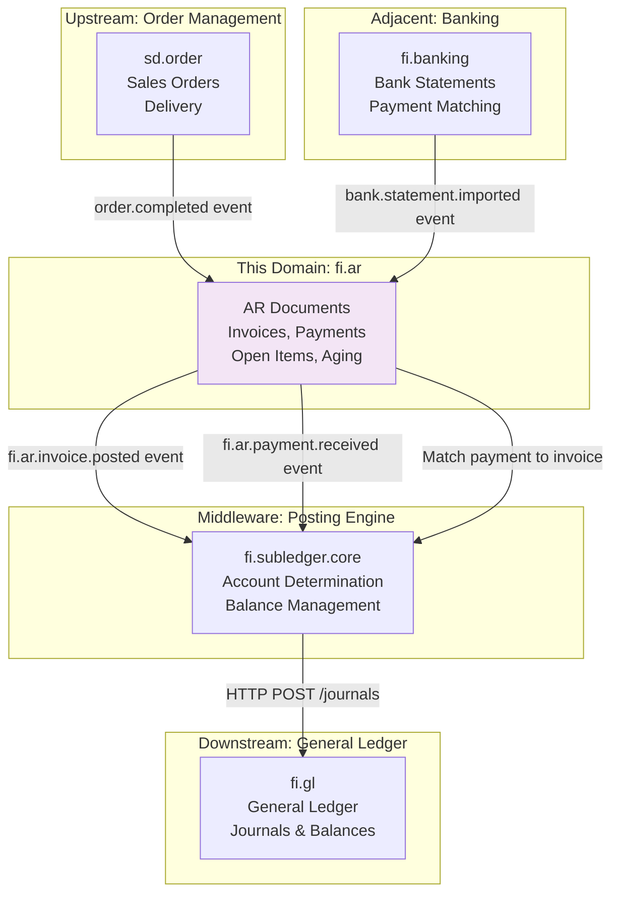
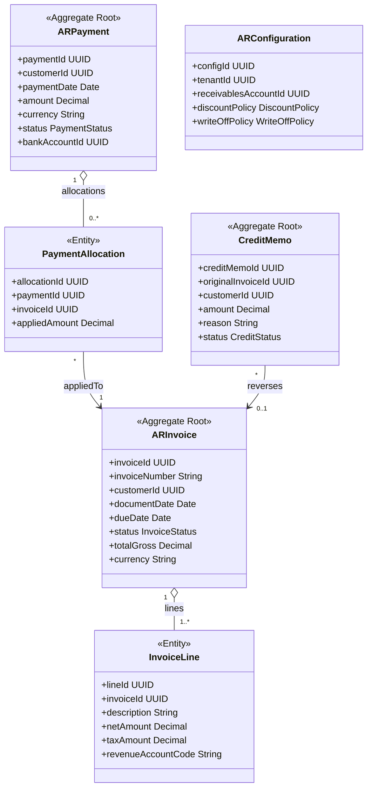
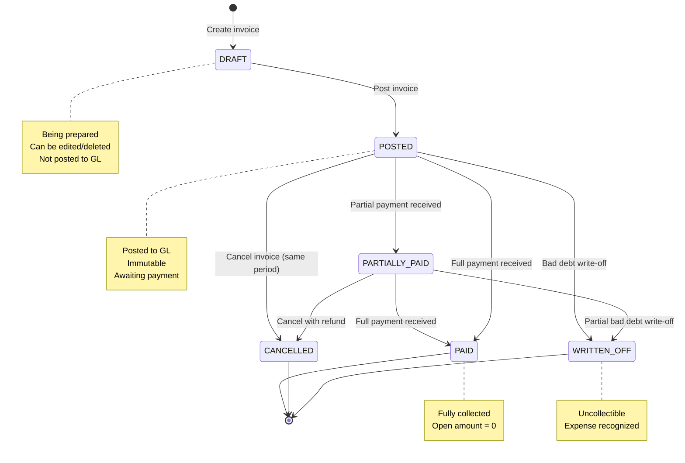
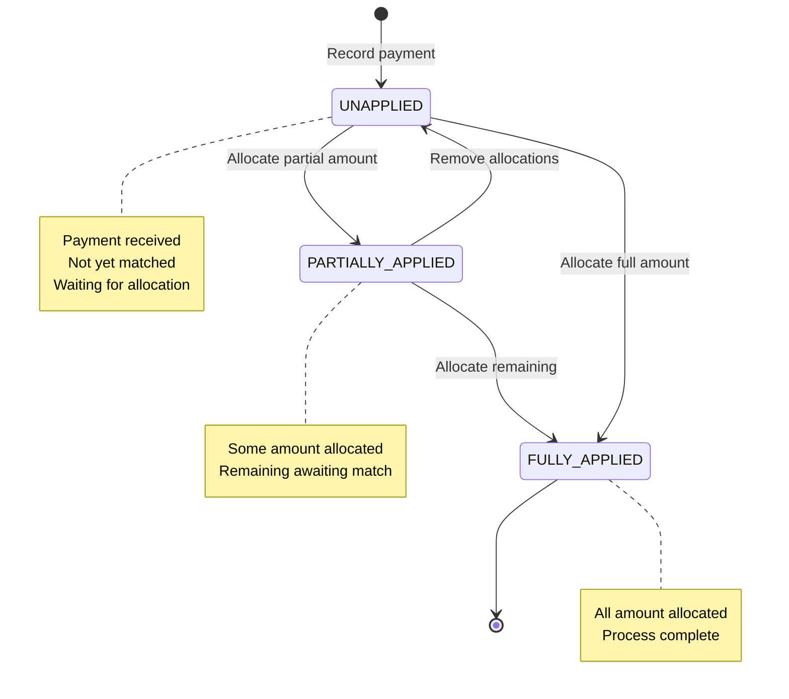
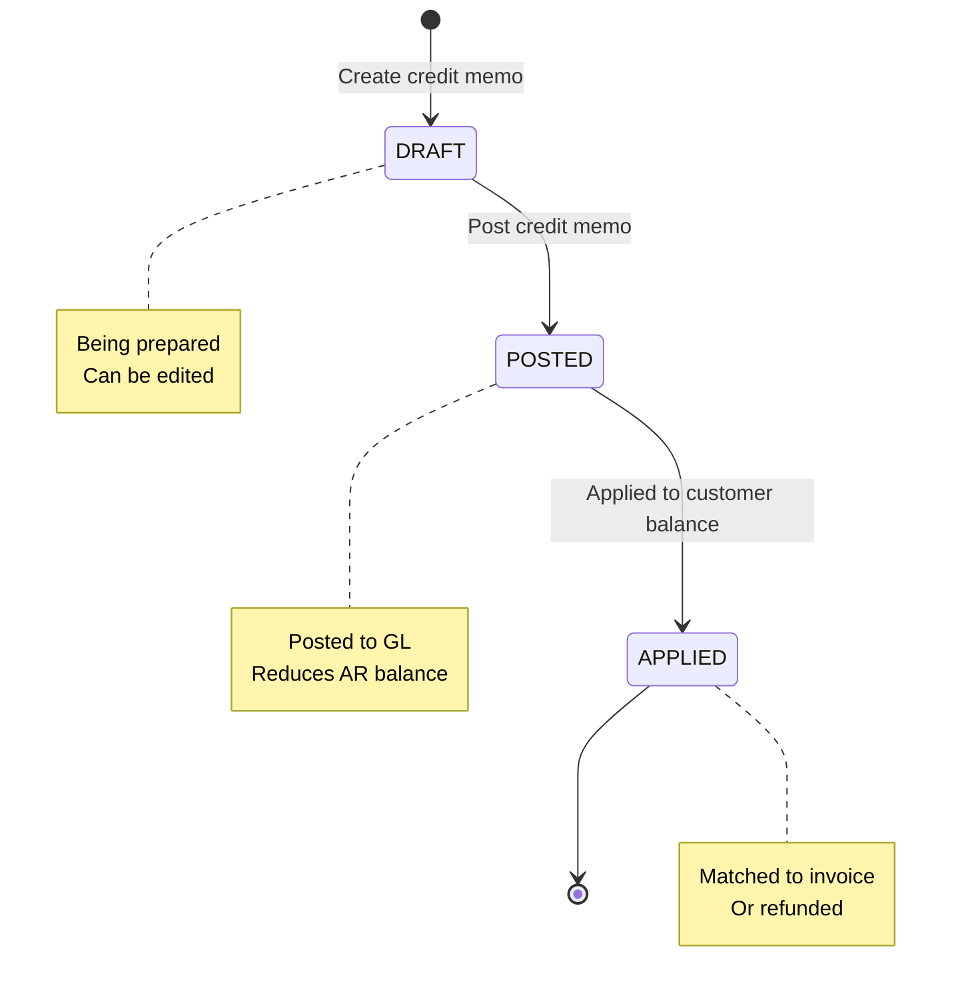
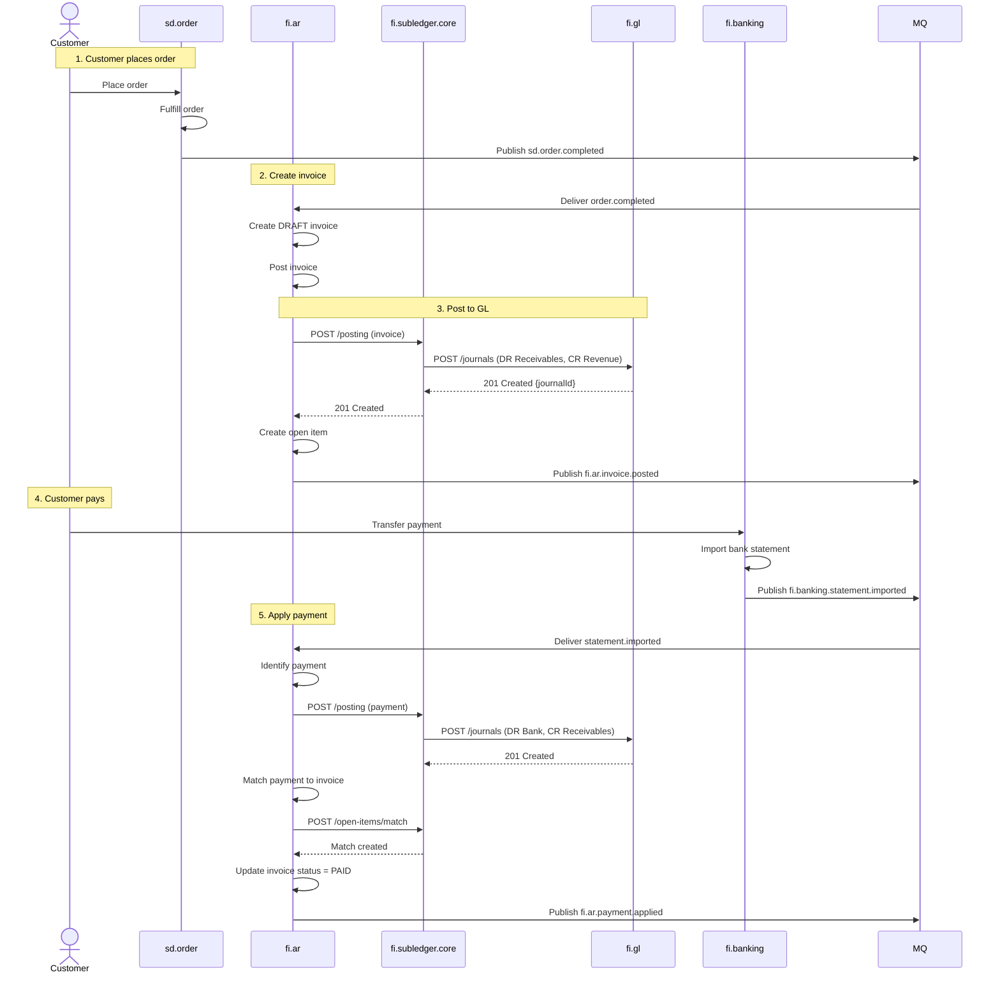

# FI - Accounts Receivable (AR) Domain / Service Specification

> **Conceptual Stack Layer:** Domain / Service
> **Space:** Platform
> **Owner:** FI Domain Engineering Team
> **Schema alignment:** `service-layer.schema.json`
> **Companion files:** `openapi.yaml`, `*.schema.json` (event contracts)
> **Referenced by:** Platform-Feature Spec SS5 (backend dependencies), BFF Contract
> **Belongs to:** FI Suite Spec (`_fi_suite.md`)

> **Meta Information**
> - **Version:** 2026-04-01
> - **Template:** `domain-service-spec.md` v1.0.0
> - **Template Compliance:** ~95%
> - **Author(s):** OpenLeap Architecture Team
> - **Status:** DRAFT
> - **Suite:** `fi`
> - **Domain:** `ar`
> - **Bounded Context Ref:** `bc:receivables`
> - **Service ID:** `fi-ar-svc`
> - **basePackage:** `io.openleap.fi.ar`
> - **API Base Path:** `/api/fi/ar/v1`
> - **OpenLeap Starter Version:** `v1.0`
> - **Port:** `8111`
> - **Repository:** `io.openleap.fi.ar`
> - **Tags:** `finance`, `accounts-receivable`, `customer`, `invoices`, `payments`
> - **Team:**
>   - Name: `team-fi`
>   - Email: `fi-team@openleap.io`
>   - Slack: `#fi-team`

---

## Specification Guidelines Compliance

>
> ### Non-Negotiables
> - Never invent facts. If required info is missing, add an **OPEN QUESTION** entry.
> - Preserve intent and decisions. Only change meaning when explicitly requested.
> - Do not remove normative constraints unless they are explicitly replaced.
> - Keep the spec **self-contained**: no "see chat", no implicit context.
>
> ### Source of Truth Priority
> When sources conflict:
> 1. Spec (explicit) wins
> 2. Starter specs (implementation constraints) next
> 3. Guidelines (best practices) last
>
> ### Style Guide
> - Prefer short sentences and lists.
> - Use MUST/SHOULD/MAY for normative statements.

---

## 0. Document Purpose & Scope

### 0.1 Purpose

This document specifies the **Accounts Receivable (fi.ar)** domain, which manages the complete lifecycle of customer invoices, payments, credits, and collections. It serves as the operational subledger for customer transactions, transforming business events into financial postings via fi.subledger.core, and maintaining detailed customer account statements.

### 0.2 Target Audience
- Product Owners & Business Stakeholders (Finance, Accounting, Collections)
- System Architects & Technical Leads
- Integration Engineers
- Controllers and AR Accountants
- Collections and Credit Management Teams

### 0.3 Scope

**In Scope:**
- **AR Documents:** Invoices, credit memos, debit memos, payments, adjustments
- **Cash Application:** Record customer payments, match to invoices, handle partial payments
- **Collections:** Aging reports, dunning workflows, write-offs
- **Posting:** Transform AR events → GL journals (via fi.subledger.core)
- **Open Items:** Track outstanding invoices and payments (via fi.subledger.core utilities)
- **Reconciliation:** Ensure AR subledger = GL control account
- **Multi-Currency:** Support foreign currency invoices, revaluation

**Out of Scope:**
- General Ledger management (journals, periods, Chart of Accounts → fi.gl)
- Generic posting engine and account determination → fi.subledger.core
- Financial reporting and statements → fi.rpt
- Tax calculation and compliance → fi.tax
- Customer master data → bp (Business Partner)
- Full credit risk and collections workflows → Future credit.collections domain

### 0.4 Related Documents
- `_fi_suite.md` - FI Suite architecture
- `fi_gl.md` - General Ledger specification
- `fi_slc.md` - Posting engine specification
- `shared_bp.md` - Customer master data


---

## 1. Business Context

### 1.1 Domain Purpose

**fi.ar** is the operational heart of customer transaction management. It represents the business truth of "what customers owe us" and provides the detailed transaction-level view that complements the financial summary in fi.gl.

**Core Business Problems Solved:**
- **Revenue Recognition:** Record customer invoices immediately upon delivery
- **Cash Application:** Match incoming payments to outstanding invoices
- **Collections Management:** Identify overdue invoices, prioritize collection efforts
- **Customer Reconciliation:** Provide detailed statement to resolve disputes
- **Working Capital:** Track Days Sales Outstanding (DSO), aging analysis
- **Audit Trail:** Complete history from invoice to payment to GL

### 1.2 Business Value

**For the Organization:**
- **Cash Flow:** Faster collections through aging analysis and dunning
- **Working Capital:** Optimize DSO, reduce overdue receivables
- **Revenue Assurance:** Accurate invoicing, prevent revenue leakage
- **Customer Service:** Quick resolution of payment disputes
- **Compliance:** Meet SOX requirements for segregation of duties

**For Users:**
- **AR Clerk:** Process customer payments efficiently, match to invoices
- **Collections Manager:** Prioritize collection calls based on aging
- **Customer Service:** Provide accurate account statement to customers
- **Controller:** Reconcile AR to GL, close periods with confidence
- **Auditors:** Trace from invoice to GL journal to financial statement

### 1.3 Key Stakeholders

| Role | Responsibility | Primary Use Cases |
|------|----------------|-------------------|
| AR Clerk | Day-to-day AR processing | Post invoices, apply payments, match to invoices |
| Collections Manager | Overdue receivables | Run aging reports, initiate dunning, prioritize calls |
| Credit Manager | Credit risk | Review customer credit limits, approve high-value invoices |
| Customer Service | Dispute resolution | Provide account statements, investigate discrepancies |
| Controller | AR reconciliation | Reconcile AR to GL, close periods, investigate variances |
| Auditor | Financial audit | Review customer balances, trace to GL, validate completeness |

### 1.4 Strategic Positioning

**fi.ar** sits **between** operational order management (sd.order) and financial ledgers (fi.gl), acting as the **customer transaction subledger**.



**Key Insight:** fi.ar is **event-driven** (reacts to order.completed, bank.statement) and **event-publishing** (publishes invoice.posted, payment.received).

---

## 2. Service Identity

| Property | Value | Schema Field |
|----------|-------|-------------|
| **Service ID** | `fi-ar-svc` | `metadata.id` |
| **Display Name** | Accounts Receivable | `metadata.name` |
| **Suite** | `fi` | `metadata.suite` |
| **Domain** | `ar` | `metadata.domain` |
| **Bounded Context** | `bc:receivables` | `metadata.bounded_context_ref` |
| **Version** | `1.0.0` | `metadata.version` |
| **Status** | DRAFT | `metadata.status` |
| **API Base Path** | `/api/fi/ar/v1` | `metadata.api_base_path` |
| **Repository** | `io.openleap.fi.ar` | `metadata.repository` |
| **Tags** | `finance`, `accounts-receivable`, `customer`, `invoices`, `payments` | `metadata.tags` |

**Team:**
| Property | Value |
|----------|-------|
| **Name** | `team-fi` |
| **Email** | `fi-team@openleap.io` |
| **Slack Channel** | `#fi-team` |

---

## 3. Domain Model

### 3.1 Conceptual Overview

The AR domain model consists of three main pillars:

1. **AR Documents:** Business truth (invoices, payments, credits)
2. **Posting Integration:** Transform events → GL journals (via fi.subledger.core)
3. **Customer Accounts:** Detailed statements, open items, aging (via fi.subledger.core utilities)

**Key Principles:**
- **Document-Centric:** Invoices and payments are first-class entities
- **Immutable Events:** Once posted, documents cannot be changed (only reversed)
- **Open Item Accounting:** Track invoices and payments separately, match when paid
- **Multi-Currency:** Support foreign currency invoices with revaluation
- **Audit Trail:** Complete traceability from source document to GL

### 2.2 Core Concepts



### 2.3 Aggregate Definitions

#### 2.3.1 ARInvoice

**Business Purpose:**  
Represents a customer invoice - the legal claim for payment. Once posted, it creates an increase in customer balance and triggers posting to GL.

**Key Attributes:**

| Attribute | Type | Description | Constraints |
|-----------|------|-------------|-------------|
| invoiceId | UUID | Unique identifier | Required, immutable, PK |
| tenantId | UUID | Tenant ownership | Required, immutable |
| invoiceNumber | String | Sequential invoice number | Required, unique per tenant, auto-generated |
| customerId | UUID | Customer reference | Required, FK to bp.parties |
| documentDate | Date | Invoice date | Required |
| dueDate | Date | Payment due date | Required, >= documentDate |
| paymentTermsId | UUID | Payment terms | Optional, determines due date |
| status | InvoiceStatus | Current state | Required, enum(DRAFT, POSTED, PARTIALLY_PAID, PAID, CANCELLED, WRITTEN_OFF) |
| totalNet | Decimal | Net amount (excl. tax) | Required, sum of line net amounts |
| totalTax | Decimal | Total tax amount | Required, sum of line tax amounts |
| totalGross | Decimal | Gross amount (incl. tax) | Required, totalNet + totalTax |
| currency | String | Invoice currency | Required, ISO 4217 |
| exchangeRate | Decimal | FX rate (if not base currency) | Optional, rate to base currency |
| voucherId | String | Idempotency key | Required, unique per tenant |
| sourceOrderId | UUID | Originating sales order | Optional, FK to sd.orders |
| glJournalId | UUID | Posted GL journal | Optional, FK to fi.gl.journal_entries |
| dimensions | JSONB | Analytical attributes | Optional, e.g., {"costCenter": "CC1", "region": "EMEA"} |
| createdAt | Timestamp | Creation timestamp | Auto-generated |
| postedAt | Timestamp | Posting timestamp | Set when status → POSTED |

**Lifecycle States:**



**Business Rules & Invariants:**

1. **BR-INV-001: Balance Validation**
   - *Rule:* totalGross = totalNet + totalTax (to the penny)
   - *Rationale:* Prevent calculation errors
   - *Enforcement:* Validation before posting

2. **BR-INV-002: Due Date Logic**
   - *Rule:* dueDate = documentDate + payment terms days (e.g., NET30 = +30 days)
   - *Rationale:* Consistent due date calculation
   - *Enforcement:* Auto-calculated if payment terms provided

3. **BR-INV-003: Immutability After Posting**
   - *Rule:* Once POSTED, invoice cannot be modified or deleted, only cancelled via credit memo
   - *Rationale:* Maintain audit trail, prevent tampering
   - *Enforcement:* API blocks UPDATE/DELETE for POSTED invoices

4. **BR-INV-004: Sequential Invoice Numbers**
   - *Rule:* Invoice numbers must be sequential per tenant, no gaps
   - *Rationale:* Regulatory requirement in many countries
   - *Enforcement:* Database sequence with gap-less generation

5. **BR-INV-005: Currency Consistency**
   - *Rule:* All lines must use same currency as header
   - *Rationale:* Prevent mixed-currency invoices
   - *Enforcement:* Validation on line creation

**Example Scenarios:**

**Scenario 1: Standard Invoice Posting**
```json
{
  "customerId": "party-uuid-12345",
  "documentDate": "2025-12-05",
  "paymentTermsId": "NET30",
  "currency": "EUR",
  "lines": [
    {
      "description": "Product SKU-001",
      "quantity": 10,
      "unitPrice": 100.00,
      "netAmount": 1000.00,
      "taxCode": "VAT19",
      "taxAmount": 190.00,
      "revenueAccountCode": "4000"
    }
  ],
  "totalNet": 1000.00,
  "totalTax": 190.00,
  "totalGross": 1190.00
}
```

**Result:**
- Invoice created with status = DRAFT
- User posts invoice → status = POSTED
- System calls fi.subledger.core to post:
  - DR 1100 Receivables €1,190
  - CR 4000 Revenue €1,000
  - CR 4800 VAT Payable €190
- glJournalId linked to invoice

---

#### 2.3.2 ARPayment

**Business Purpose:**  
Represents a customer payment (receipt). Can be allocated to one or multiple invoices, or remain unapplied if no matching invoice exists.

**Key Attributes:**

| Attribute | Type | Description | Constraints |
|-----------|------|-------------|-------------|
| paymentId | UUID | Unique identifier | Required, immutable, PK |
| tenantId | UUID | Tenant ownership | Required, immutable |
| paymentNumber | String | Sequential payment number | Required, unique per tenant |
| customerId | UUID | Customer reference | Required, FK to bp.parties |
| paymentDate | Date | Payment received date | Required |
| valueDate | Date | Bank value date | Required, typically = paymentDate |
| amount | Decimal | Payment amount | Required, > 0 |
| currency | String | Payment currency | Required, ISO 4217 |
| status | PaymentStatus | Current state | Required, enum(UNAPPLIED, PARTIALLY_APPLIED, FULLY_APPLIED) |
| appliedAmount | Decimal | Amount allocated to invoices | Required, >= 0, <= amount |
| unappliedAmount | Decimal | Remaining unallocated | Required, = amount - appliedAmount |
| bankAccountId | UUID | Bank account | Optional, FK to fi.banking.accounts |
| bankStatementLineId | UUID | Bank statement reference | Optional, FK to fi.banking.statement_lines |
| paymentMethod | String | Payment method | Optional, e.g., "WIRE", "CHECK", "CARD" |
| referenceNumber | String | Customer reference | Optional, e.g., invoice number mentioned |
| voucherId | String | Idempotency key | Required, unique per tenant |
| glJournalId | UUID | Posted GL journal | Optional, FK to fi.gl.journal_entries |
| createdAt | Timestamp | Creation timestamp | Auto-generated |
| postedAt | Timestamp | Posting timestamp | Auto-generated |

**Lifecycle States:**



**Business Rules & Invariants:**

1. **BR-PAY-001: Amount Consistency**
   - *Rule:* appliedAmount + unappliedAmount = amount (always)
   - *Rationale:* Ensure all payment is accounted for
   - *Enforcement:* Computed field, validated on allocation

2. **BR-PAY-002: No Overapplication**
   - *Rule:* Cannot allocate more than unappliedAmount to invoices
   - *Rationale:* Prevent double-allocation
   - *Enforcement:* Validation on allocation creation

3. **BR-PAY-003: Currency Matching**
   - *Rule:* Can only allocate to invoices in same currency (or with FX conversion)
   - *Rationale:* Prevent currency mismatch errors
   - *Enforcement:* Validation on allocation, FX rate required if different

4. **BR-PAY-004: Payment Date Validation**
   - *Rule:* paymentDate cannot be in future
   - *Rationale:* Payments are historical facts
   - *Enforcement:* Validation on creation

**Example Scenarios:**

**Scenario 1: Full Payment Application**
```json
{
  "customerId": "party-uuid-12345",
  "paymentDate": "2025-12-10",
  "amount": 1190.00,
  "currency": "EUR",
  "allocations": [
    {
      "invoiceId": "invoice-uuid-001",
      "appliedAmount": 1190.00
    }
  ]
}
```

**Result:**
- Payment created with status = FULLY_APPLIED
- System calls fi.subledger.core to post:
  - DR 1000 Bank €1,190
  - CR 1100 Receivables €1,190
- Allocation created linking payment → invoice
- fi.subledger.core creates match link in open items
- Invoice status updated to PAID

---

#### 2.3.3 CreditMemo

**Business Purpose:**  
Represents a reduction in customer's debt, either for returned goods, pricing correction, or goodwill gesture. Acts as a reversal or partial reversal of an invoice.

**Key Attributes:**

| Attribute | Type | Description | Constraints |
|-----------|------|-------------|-------------|
| creditMemoId | UUID | Unique identifier | Required, immutable, PK |
| tenantId | UUID | Tenant ownership | Required, immutable |
| creditMemoNumber | String | Sequential number | Required, unique per tenant |
| customerId | UUID | Customer reference | Required, FK to bp.parties |
| documentDate | Date | Credit memo date | Required |
| originalInvoiceId | UUID | Invoice being credited | Optional, FK to ar_invoices |
| reason | String | Reason for credit | Required, enum(RETURN, PRICE_ADJUSTMENT, GOODWILL, ERROR) |
| status | CreditStatus | Current state | Required, enum(DRAFT, POSTED, APPLIED) |
| totalGross | Decimal | Credit amount | Required, > 0 (credit is positive) |
| currency | String | Credit currency | Required, ISO 4217 |
| voucherId | String | Idempotency key | Required, unique per tenant |
| glJournalId | UUID | Posted GL journal | Optional, FK to fi.gl.journal_entries |
| createdAt | Timestamp | Creation timestamp | Auto-generated |
| postedAt | Timestamp | Posting timestamp | Set when status → POSTED |

**Lifecycle States:**



**Business Rules & Invariants:**

1. **BR-CRM-001: Amount Limitation**
   - *Rule:* If crediting specific invoice, credit amount <= invoice remaining balance
   - *Rationale:* Cannot credit more than invoiced
   - *Enforcement:* Validation on creation

2. **BR-CRM-002: Immutability After Posting**
   - *Rule:* Once POSTED, credit memo cannot be modified
   - *Rationale:* Maintain audit trail
   - *Enforcement:* API blocks UPDATE for POSTED credit memos

3. **BR-CRM-003: Invoice Reference Optional**
   - *Rule:* Credit memo can be standalone (no originalInvoiceId) for goodwill credits
   - *Rationale:* Support general credits not tied to specific invoice
   - *Enforcement:* originalInvoiceId nullable

**Example Scenarios:**

**Scenario 1: Product Return Credit**
```json
{
  "customerId": "party-uuid-12345",
  "documentDate": "2025-12-08",
  "originalInvoiceId": "invoice-uuid-001",
  "reason": "RETURN",
  "currency": "EUR",
  "lines": [
    {
      "description": "Product SKU-001 returned",
      "netAmount": 1000.00,
      "taxAmount": 190.00,
      "revenueAccountCode": "4100"  // Sales Returns
    }
  ],
  "totalGross": 1190.00
}
```

**Result:**
- Credit memo created with status = DRAFT
- User posts credit memo → status = POSTED
- System calls fi.subledger.core to post:
  - DR 4100 Sales Returns €1,000
  - DR 4800 VAT Payable €190
  - CR 1100 Receivables €1,190
- Invoice balance reduced by €1,190

---

## 5. Use Cases

### 3.1 Primary Use Cases

#### UC-001: Post Customer Invoice

**Actor:** AR Clerk

**Preconditions:**
- Sales order completed and delivered (sd.order published order.completed event)
- Customer exists in bp
- User has AR_POSTER role

**Main Flow:**
1. AR clerk receives order.completed event from sd.order
2. System creates DRAFT invoice from order data
3. System calculates totals (net, tax, gross)
4. System generates sequential invoice number
5. Clerk reviews and posts invoice
6. System updates status = POSTED
7. System generates voucherId
8. System calls fi.subledger.core POST /posting with:
   - eventType: fi.ar.invoice.posted
   - payload: invoice data
9. fi.subledger.core applies posting rule:
   - DR 1100 Receivables
   - CR 4000 Revenue
   - CR 4800 VAT Payable
10. fi.subledger.core posts to fi.gl
11. fi.gl returns journalId
12. System stores glJournalId in invoice
13. System creates subledger entry (INCREASE) via fi.subledger.core
14. System creates open item via fi.subledger.core
15. System publishes fi.ar.invoice.posted event
16. System sends invoice to customer (email/print)

**Postconditions:**
- Invoice status = POSTED
- GL journal created (DR Receivables, CR Revenue/VAT)
- Subledger entry created
- Open item created (awaiting payment)
- Customer balance increased
- Event published for downstream consumers

**Business Rules Applied:**
- BR-INV-001: Balance validation (Net + Tax = Gross)
- BR-INV-003: Immutability after posting
- BR-INV-004: Sequential invoice numbering

**Alternative Flows:**
- **Alt-1:** If period closed → 403 PERIOD_CLOSED
- **Alt-2:** If customer credit limit exceeded → Requires credit manager approval
- **Alt-3:** If balance validation fails → 400 INVOICE_UNBALANCED

---

#### UC-002: Apply Customer Payment

**Actor:** AR Clerk or Automated (from bank statement)

**Preconditions:**
- Payment received (bank statement imported)
- Customer identified
- User has AR_CASH role

**Main Flow:**
1. System receives fi.banking.statement.imported event
2. System identifies customer from bank reference
3. System creates payment record with status = UNAPPLIED
4. System calls fi.subledger.core POST /posting:
   - DR 1000 Bank
   - CR 1100 Receivables
5. Clerk searches for open invoices for customer
6. System displays open invoices via fi.subledger.core open items
7. Clerk selects invoice(s) to allocate payment
8. System validates allocation (amount, currency)
9. System creates payment allocation
10. System calls fi.subledger.core POST /open-items/match
11. fi.subledger.core updates open amounts
12. Invoice status updated (PARTIALLY_PAID or PAID)
13. Payment status updated (PARTIALLY_APPLIED or FULLY_APPLIED)
14. System publishes fi.ar.payment.applied event

**Postconditions:**
- Payment allocated to invoice(s)
- Invoice open amount reduced
- Open item status updated
- Bank GL posted
- Event published

**Business Rules Applied:**
- BR-PAY-001: Amount consistency
- BR-PAY-002: No overapplication
- BR-PAY-003: Currency matching

**Alternative Flows:**
- **Alt-1:** If no matching invoice → Payment remains UNAPPLIED (liability)
- **Alt-2:** If partial payment → Invoice status = PARTIALLY_PAID
- **Alt-3:** If overpayment → Excess remains unapplied

---

#### UC-003: Write Off Bad Debt

**Actor:** Collections Manager

**Preconditions:**
- Invoice long overdue (e.g., >120 days)
- Collection efforts exhausted
- User has AR_ADMIN role

**Main Flow:**
1. Collections manager identifies invoice for write-off
2. System displays invoice details and aging
3. Manager enters write-off reason
4. System creates write-off adjustment
5. System calls fi.subledger.core POST /posting:
   - DR 5100 Bad Debt Expense
   - CR 1100 Receivables
6. System updates invoice status = WRITTEN_OFF
7. System creates subledger entry (DECREASE)
8. System removes from open items (or marks as written off)
9. System publishes fi.ar.adjustment.posted event
10. System sends notification to credit manager

**Postconditions:**
- Invoice written off
- GL expense recognized
- Customer balance reduced
- No longer in collections queue
- Event published

**Business Rules Applied:**
- Write-off threshold policy (e.g., >€100 requires approval)
- Segregation of duties (poster ≠ approver)

---

### 3.2 Process Flow Diagrams

#### Process: Order to Cash



---

### 3.3 Cross-Domain Workflows

**Does this domain participate in multi-service workflows?** [X] YES [ ] NO

#### Workflow: Month-End Close

**Business Purpose:**  
Ensure all AR transactions posted, invoices aged, reconciliation complete before GL close.

**Orchestration Pattern:** [X] Choreography (EDA) [ ] Orchestration (Saga)

**Pattern Rationale:**  
Uses **choreography** because:
- Each domain closes independently
- No multi-step transaction requiring rollback
- Sequence managed by time-based dependencies (AR before GL)
- Each service publishes "close complete" event

**Participating Services:**

| Service | Role | Responsibilities |
|---------|------|------------------|
| fi.ar | Subledger Close | Match all payments, run aging, reconcile to GL |
| fi.subledger.core | Snapshot Creation | Create AR snapshot as-of period end |
| fi.gl | GL Close | Close period, create ledger snapshot |
| fi.rpt | Reporting | Generate AR aging report, DSO metrics |

**Workflow Steps:**

1. **Step 1:** AR matches all pending payments (manual or auto)
   - Success: All payments allocated
   - Failure: Report unmatched payments for manual review

2. **Step 2:** AR creates snapshot (POST /snapshots)
   - fi.subledger.core freezes AR balances as-of date
   - Success: Snapshot ID returned

3. **Step 3:** AR runs reconciliation
   - Compare AR snapshot to GL control account
   - Success: Variance = 0
   - Failure: Investigate discrepancies

4. **Step 4:** AR publishes fi.ar.close.completed event
   - Signals AR is ready for GL close

5. **Step 5:** fi.gl consumes fi.ar.close.completed
   - Waits for all subledgers (AR, AP, FA, INV)
   - Closes period
   - Publishes fi.gl.period.closed

**Business Implications:**
- **Success Path:** Clean close, accurate financials
- **Failure Path:** Cannot close GL until AR reconciles
- **Compensation:** Not needed (each step independent)

---

## 4. Business Rules & Constraints

### 4.1 Business Rules Catalog

| ID | Rule Name | Description | Scope | Enforcement |
|----|-----------|-------------|-------|-------------|
| BR-INV-001 | Balance Validation | totalGross = totalNet + totalTax | ARInvoice | Create/Update |
| BR-INV-002 | Due Date Logic | dueDate = documentDate + terms | ARInvoice | Create |
| BR-INV-003 | Immutability After Posting | Posted invoices cannot be modified | ARInvoice | Update/Delete |
| BR-INV-004 | Sequential Invoice Numbers | No gaps in invoice sequence | ARInvoice | Create |
| BR-INV-005 | Currency Consistency | All lines same currency as header | ARInvoice | Line Create |
| BR-PAY-001 | Amount Consistency | applied + unapplied = amount | ARPayment | Always |
| BR-PAY-002 | No Overapplication | Cannot allocate > unappliedAmount | ARPayment | Allocation |
| BR-PAY-003 | Currency Matching | Allocation requires currency match | ARPayment | Allocation |
| BR-PAY-004 | Payment Date Validation | paymentDate not in future | ARPayment | Create |
| BR-CRM-001 | Amount Limitation | Credit <= invoice remaining balance | CreditMemo | Create |
| BR-CRM-002 | Immutability After Posting | Posted credits cannot be modified | CreditMemo | Update |

---

## 7. Events & Integration

### 5.1 Integration Pattern Decision

**Does this domain use orchestration (Saga/Temporal)?** [ ] YES [X] NO

**Pattern Used:** Event-Driven Architecture (Choreography)

**Rationale:**

fi.ar uses **pure Event-Driven Architecture** because:

✅ **AR is Event Publisher:**
- Publishes invoice.posted, payment.received, adjustment.posted
- Other services react (fi.rpt, t4.bi)
- No multi-service coordination

✅ **AR is Event Consumer:**
- Consumes sd.order.completed (create invoice)
- Consumes fi.banking.statement.imported (apply payment)
- Reacts independently to each event

✅ **Synchronous GL Posting:**
- Calls fi.subledger.core HTTP POST /posting (synchronous)
- Waits for confirmation (need journalId)
- But this is single-call, not multi-step saga

❌ **Why NOT Orchestration:**
- No multi-service transaction requiring compensation
- Invoice posting is: AR → fi.subledger.core → fi.gl (linear flow)
- Each step can be retried independently
- No long-running process (milliseconds)
- No human approvals (validation is automated)

### 5.2 Event-Driven Integration

**Inbound Events (Consumed):**

| Event | Source | Purpose | Handling |
|-------|--------|---------|----------|
| sd.order.completed | sd.order | Create invoice from delivered order | Create DRAFT invoice, await posting |
| fi.banking.statement.imported | fi.banking | Apply customer payment | Create payment record, match to invoices |
| fi.gl.period.closed | fi.gl | Prevent posting to closed period | Validate period status before posting |
| fi.gl.account.status.changed | fi.gl | React to control account changes | Delegated to fi.subledger.core |

**Outbound Events (Published):**

| Event | When | Purpose | Consumers |
|-------|------|---------|-----------|
| fi.ar.invoice.posted | Invoice successfully posted to GL | Notify of new receivable | fi.rpt, co.cca, t4.bi |
| fi.ar.payment.received | Customer payment recorded | Notify of cash received | fi.rpt, treasury, t4.bi |
| fi.ar.payment.applied | Payment matched to invoice | Notify of allocation | fi.rpt, dashboards |
| fi.ar.adjustment.posted | Write-off or adjustment | Notify of balance change | fi.rpt, credit manager |
| fi.ar.close.completed | AR period close done | Signal readiness for GL close | fi.gl (coordination) |

---

<!-- Event Catalog (continuation of §7 Events & Integration) -->

### 6.1 Outbound Events

**Exchange:** `fi.ar.events` (RabbitMQ topic exchange)

#### Event: invoice.posted

**Routing Key:** `fi.ar.invoice.posted`

**When Published:** Invoice successfully posted to GL

**Business Meaning:** Customer has been invoiced, receivable created

**Consumers:**
- fi.rpt (update AR aging, DSO metrics)
- co.cca (allocate revenue by cost center)
- t4.bi (ingest for analytics)
- credit.collections (add to dunning queue if high-value)

**Payload:**
```json
{
  "eventId": "evt-uuid",
  "tenantId": "tenant-uuid",
  "occurredAt": "2025-12-05T10:00:00Z",
  "traceId": "trace-uuid",
  "producer": "fi.ar",
  "aggregateType": "invoice",
  "changeType": "posted",
  "entityIds": ["invoice-uuid"],
  "version": 1,
  "payload": {
    "invoiceId": "invoice-uuid",
    "invoiceNumber": "INV-2025-001",
    "customerId": "party-uuid-12345",
    "customerName": "ACME Corp",
    "documentDate": "2025-12-05",
    "dueDate": "2026-01-04",
    "currency": "EUR",
    "totalNet": 1000.00,
    "totalTax": 190.00,
    "totalGross": 1190.00,
    "paymentTerms": "NET30",
    "glJournalId": "journal-uuid",
    "sourceOrderId": "order-uuid",
    "dimensions": {
      "costCenter": "CC1",
      "region": "EMEA",
      "product": "SKU-001"
    }
  }
}
```

---

#### Event: payment.received

**Routing Key:** `fi.ar.payment.received`

**When Published:** Customer payment recorded and posted to GL

**Business Meaning:** Cash received, receivable pending reduction

**Consumers:**
- fi.rpt (update cash flow, DSO)
- treasury (cash position)
- t4.bi (analytics)

**Payload:**
```json
{
  "eventId": "evt-uuid",
  "tenantId": "tenant-uuid",
  "occurredAt": "2025-12-10T10:00:00Z",
  "traceId": "trace-uuid",
  "producer": "fi.ar",
  "aggregateType": "payment",
  "changeType": "received",
  "entityIds": ["payment-uuid"],
  "version": 1,
  "payload": {
    "paymentId": "payment-uuid",
    "paymentNumber": "PAY-2025-001",
    "customerId": "party-uuid-12345",
    "paymentDate": "2025-12-10",
    "amount": 1190.00,
    "currency": "EUR",
    "bankAccountId": "bank-account-uuid",
    "paymentMethod": "WIRE",
    "status": "UNAPPLIED",
    "glJournalId": "journal-uuid"
  }
}
```

---

#### Event: payment.applied

**Routing Key:** `fi.ar.payment.applied`

**When Published:** Payment matched to invoice(s)

**Business Meaning:** Outstanding invoice(s) cleared or partially cleared

**Consumers:**
- fi.rpt (update aging report)
- Dashboards (real-time collection metrics)

**Payload:**
```json
{
  "eventId": "evt-uuid",
  "tenantId": "tenant-uuid",
  "occurredAt": "2025-12-10T11:00:00Z",
  "traceId": "trace-uuid",
  "producer": "fi.ar",
  "aggregateType": "payment",
  "changeType": "applied",
  "entityIds": ["payment-uuid", "invoice-uuid"],
  "version": 1,
  "payload": {
    "paymentId": "payment-uuid",
    "allocations": [
      {
        "invoiceId": "invoice-uuid",
        "invoiceNumber": "INV-2025-001",
        "appliedAmount": 1190.00,
        "invoiceStatus": "PAID",
        "invoiceOpenAmount": 0.00
      }
    ],
    "paymentStatus": "FULLY_APPLIED",
    "unappliedAmount": 0.00
  }
}
```

---

### 6.2 Inbound Events

#### Event: sd.order.completed

**Source:** sd.order
**Purpose:** Create invoice from delivered order
**Handling:**
1. Receive event with order details
2. Create DRAFT invoice
3. Map order lines to invoice lines
4. Calculate totals (net, tax, gross)
5. Wait for user to post invoice

---

## 6. REST API

### 7.1 REST API

**Base Path:** `/api/fi/ar/v1`

**Authentication:** OAuth 2.0 Bearer Token

**Content Type:** `application/json`

#### 7.1.1 Invoices

**POST /invoices** - Create and post invoice
- **Role:** AR_POSTER
- **Headers:** `Idempotency-Key`, `Trace-Id`
- **Request Body:**
  ```json
  {
    "customerId": "party-uuid",
    "documentDate": "2025-12-05",
    "paymentTermsId": "terms-uuid",
    "currency": "EUR",
    "lines": [
      {
        "description": "Product SKU-001",
        "quantity": 10,
        "unitPrice": 100.00,
        "netAmount": 1000.00,
        "taxCode": "VAT19",
        "taxAmount": 190.00,
        "revenueAccountCode": "4000",
        "dimensions": {"product": "SKU-001"}
      }
    ],
    "dimensions": {"costCenter": "CC1"}
  }
  ```
- **Response:** 201 Created
  ```json
  {
    "invoiceId": "invoice-uuid",
    "invoiceNumber": "INV-2025-001",
    "status": "POSTED",
    "glJournalId": "journal-uuid"
  }
  ```

**GET /invoices** - List invoices
- **Role:** AR_VIEWER
- **Query Params:** `customerId`, `status`, `fromDate`, `toDate`, `currency`, `page`, `size`
- **Response:** 200 OK (array of invoices)

**GET /invoices/{id}** - Get invoice details
- **Role:** AR_VIEWER
- **Response:** 200 OK (invoice with lines)

---

#### 7.1.2 Payments

**POST /payments** - Record customer payment
- **Role:** AR_CASH
- **Request Body:**
  ```json
  {
    "customerId": "party-uuid",
    "paymentDate": "2025-12-10",
    "amount": 1190.00,
    "currency": "EUR",
    "bankAccountId": "bank-account-uuid",
    "paymentMethod": "WIRE",
    "referenceNumber": "INV-2025-001",
    "allocations": [
      {
        "invoiceId": "invoice-uuid",
        "appliedAmount": 1190.00
      }
    ]
  }
  ```
- **Response:** 201 Created

**POST /payments/{id}/allocate** - Allocate payment to invoices
- **Role:** AR_CASH
- **Request Body:**
  ```json
  {
    "allocations": [
      {
        "invoiceId": "invoice-uuid",
        "appliedAmount": 1190.00
      }
    ]
  }
  ```
- **Response:** 200 OK

**DELETE /payments/{paymentId}/allocations/{allocationId}** - Remove allocation
- **Role:** AR_CASH
- **Response:** 200 OK

---

#### 7.1.3 Credit Memos

**POST /credit-memos** - Create credit memo
- **Role:** AR_POSTER
- **Request Body:**
  ```json
  {
    "customerId": "party-uuid",
    "documentDate": "2025-12-08",
    "originalInvoiceId": "invoice-uuid",
    "reason": "RETURN",
    "currency": "EUR",
    "lines": [
      {
        "description": "Product SKU-001 returned",
        "netAmount": 1000.00,
        "taxAmount": 190.00,
        "revenueAccountCode": "4100"
      }
    ]
  }
  ```
- **Response:** 201 Created

---

#### 7.1.4 Adjustments

**POST /adjustments/write-off** - Write off bad debt
- **Role:** AR_ADMIN
- **Request Body:**
  ```json
  {
    "invoiceId": "invoice-uuid",
    "amount": 1190.00,
    "reason": "Uncollectible after 180 days",
    "approvedBy": "manager-user-uuid"
  }
  ```
- **Response:** 201 Created

---

#### 7.1.5 Reporting

**GET /aging** - AR aging report
- **Role:** AR_VIEWER
- **Query Params:** `asOf`, `customerId`, `currency`, `groupBy`
- **Response:** 200 OK
  ```json
  {
    "asOf": "2025-12-31",
    "currency": "EUR",
    "buckets": [0, 30, 60, 90, 120],
    "results": [
      {
        "customerId": "party-uuid",
        "customerName": "ACME Corp",
        "current": 10000.00,
        "days_1_30": 5000.00,
        "days_31_60": 2000.00,
        "days_61_90": 1000.00,
        "days_91_120": 500.00,
        "over_120": 200.00,
        "total": 18700.00
      }
    ]
  }
  ```

**GET /reconciliation** - AR to GL reconciliation
- **Role:** AR_ADMIN
- **Query Params:** `periodId`
- **Response:** 200 OK
  ```json
  {
    "periodId": "period-uuid",
    "period": "2025-12",
    "arSubledgerBalance": 100000.00,
    "glControlAccountBalance": 100000.00,
    "variance": 0.00,
    "currency": "EUR"
  }
  ```

---

### 7.2 Error Responses

| HTTP Status | Error Code | Description |
|-------------|------------|-------------|
| 400 | INVOICE_UNBALANCED | totalGross ≠ totalNet + totalTax |
| 400 | OVERAPPLICATION | Allocating more than unapplied amount |
| 400 | CURRENCY_MISMATCH | Payment and invoice currencies don't match |
| 403 | PERIOD_CLOSED | Cannot post to closed period |
| 403 | CREDIT_LIMIT_EXCEEDED | Customer credit limit exceeded |
| 404 | CUSTOMER_NOT_FOUND | Customer does not exist |
| 404 | INVOICE_NOT_FOUND | Invoice does not exist |
| 409 | IDEMPOTENT_REPLAY | Duplicate idempotency key with different payload |
| 422 | VALIDATION_ERROR | Generic validation failure |

---

## 8. Data Model

### 8.1 Storage Schema (PostgreSQL)

#### Schema: fi_ar

All tables in schema `fi_ar`.

#### Table: ar_invoices
```sql
CREATE TABLE fi_ar.ar_invoices (
  invoice_id UUID PRIMARY KEY,
  tenant_id UUID NOT NULL,
  invoice_number VARCHAR(50) NOT NULL,
  customer_id UUID NOT NULL,
  document_date DATE NOT NULL,
  due_date DATE NOT NULL,
  payment_terms_id UUID,
  status VARCHAR(20) NOT NULL DEFAULT 'DRAFT',
  total_net NUMERIC(19,4) NOT NULL,
  total_tax NUMERIC(19,4) NOT NULL,
  total_gross NUMERIC(19,4) NOT NULL,
  currency CHAR(3) NOT NULL,
  exchange_rate NUMERIC(15,6),
  voucher_id VARCHAR(100) NOT NULL,
  source_order_id UUID,
  gl_journal_id UUID,
  dimensions JSONB,
  created_at TIMESTAMP NOT NULL DEFAULT NOW(),
  posted_at TIMESTAMP,
  UNIQUE (tenant_id, invoice_number),
  UNIQUE (tenant_id, voucher_id),
  CHECK (status IN ('DRAFT', 'POSTED', 'PARTIALLY_PAID', 'PAID', 'CANCELLED', 'WRITTEN_OFF')),
  CHECK (total_gross = total_net + total_tax),
  CHECK (due_date >= document_date)
);

CREATE INDEX idx_invoices_tenant ON fi_ar.ar_invoices(tenant_id);
CREATE INDEX idx_invoices_customer ON fi_ar.ar_invoices(customer_id);
CREATE INDEX idx_invoices_status ON fi_ar.ar_invoices(tenant_id, status);
CREATE INDEX idx_invoices_due_date ON fi_ar.ar_invoices(due_date) WHERE status IN ('POSTED', 'PARTIALLY_PAID');
```

#### Table: ar_invoice_lines
```sql
CREATE TABLE fi_ar.ar_invoice_lines (
  line_id UUID PRIMARY KEY,
  invoice_id UUID NOT NULL REFERENCES fi_ar.ar_invoices(invoice_id) ON DELETE CASCADE,
  line_number INT NOT NULL,
  description TEXT NOT NULL,
  quantity NUMERIC(19,4),
  unit_price NUMERIC(19,4),
  net_amount NUMERIC(19,4) NOT NULL,
  tax_code VARCHAR(20),
  tax_amount NUMERIC(19,4) NOT NULL DEFAULT 0,
  revenue_account_code VARCHAR(50),
  dimensions JSONB,
  UNIQUE (invoice_id, line_number),
  CHECK (net_amount >= 0),
  CHECK (tax_amount >= 0)
);

CREATE INDEX idx_invoice_lines_invoice ON fi_ar.ar_invoice_lines(invoice_id);
```

#### Table: ar_payments
```sql
CREATE TABLE fi_ar.ar_payments (
  payment_id UUID PRIMARY KEY,
  tenant_id UUID NOT NULL,
  payment_number VARCHAR(50) NOT NULL,
  customer_id UUID NOT NULL,
  payment_date DATE NOT NULL,
  value_date DATE NOT NULL,
  amount NUMERIC(19,4) NOT NULL,
  currency CHAR(3) NOT NULL,
  status VARCHAR(20) NOT NULL DEFAULT 'UNAPPLIED',
  applied_amount NUMERIC(19,4) NOT NULL DEFAULT 0,
  unapplied_amount NUMERIC(19,4) NOT NULL,
  bank_account_id UUID,
  bank_statement_line_id UUID,
  payment_method VARCHAR(20),
  reference_number VARCHAR(100),
  voucher_id VARCHAR(100) NOT NULL,
  gl_journal_id UUID,
  created_at TIMESTAMP NOT NULL DEFAULT NOW(),
  posted_at TIMESTAMP,
  UNIQUE (tenant_id, payment_number),
  UNIQUE (tenant_id, voucher_id),
  CHECK (status IN ('UNAPPLIED', 'PARTIALLY_APPLIED', 'FULLY_APPLIED')),
  CHECK (amount > 0),
  CHECK (applied_amount >= 0),
  CHECK (unapplied_amount >= 0),
  CHECK (applied_amount + unapplied_amount = amount)
);

CREATE INDEX idx_payments_tenant ON fi_ar.ar_payments(tenant_id);
CREATE INDEX idx_payments_customer ON fi_ar.ar_payments(customer_id);
CREATE INDEX idx_payments_status ON fi_ar.ar_payments(tenant_id, status);
```

#### Table: ar_payment_allocations
```sql
CREATE TABLE fi_ar.ar_payment_allocations (
  allocation_id UUID PRIMARY KEY,
  tenant_id UUID NOT NULL,
  payment_id UUID NOT NULL REFERENCES fi_ar.ar_payments(payment_id),
  invoice_id UUID NOT NULL REFERENCES fi_ar.ar_invoices(invoice_id),
  applied_amount NUMERIC(19,4) NOT NULL,
  created_at TIMESTAMP NOT NULL DEFAULT NOW(),
  created_by UUID NOT NULL,
  CHECK (applied_amount > 0)
);

CREATE INDEX idx_allocations_payment ON fi_ar.ar_payment_allocations(payment_id);
CREATE INDEX idx_allocations_invoice ON fi_ar.ar_payment_allocations(invoice_id);
```

#### Table: ar_credit_memos
```sql
CREATE TABLE fi_ar.ar_credit_memos (
  credit_memo_id UUID PRIMARY KEY,
  tenant_id UUID NOT NULL,
  credit_memo_number VARCHAR(50) NOT NULL,
  customer_id UUID NOT NULL,
  document_date DATE NOT NULL,
  original_invoice_id UUID REFERENCES fi_ar.ar_invoices(invoice_id),
  reason VARCHAR(20) NOT NULL,
  status VARCHAR(20) NOT NULL DEFAULT 'DRAFT',
  total_gross NUMERIC(19,4) NOT NULL,
  currency CHAR(3) NOT NULL,
  voucher_id VARCHAR(100) NOT NULL,
  gl_journal_id UUID,
  created_at TIMESTAMP NOT NULL DEFAULT NOW(),
  posted_at TIMESTAMP,
  UNIQUE (tenant_id, credit_memo_number),
  UNIQUE (tenant_id, voucher_id),
  CHECK (status IN ('DRAFT', 'POSTED', 'APPLIED')),
  CHECK (reason IN ('RETURN', 'PRICE_ADJUSTMENT', 'GOODWILL', 'ERROR')),
  CHECK (total_gross > 0)
);

CREATE INDEX idx_credit_memos_tenant ON fi_ar.ar_credit_memos(tenant_id);
CREATE INDEX idx_credit_memos_customer ON fi_ar.ar_credit_memos(customer_id);
```

#### Table: ar_configurations
```sql
CREATE TABLE fi_ar.ar_configurations (
  config_id UUID PRIMARY KEY,
  tenant_id UUID NOT NULL UNIQUE,
  receivables_account_id UUID NOT NULL,
  discount_policy VARCHAR(20) NOT NULL DEFAULT 'CONTRA_REVENUE',
  writeoff_threshold NUMERIC(19,4) NOT NULL DEFAULT 100.00,
  writeoff_policy VARCHAR(20) NOT NULL DEFAULT 'APPROVAL_REQUIRED',
  chargeback_policy VARCHAR(20),
  unapplied_cash_account_id UUID,
  created_at TIMESTAMP NOT NULL DEFAULT NOW(),
  updated_at TIMESTAMP,
  CHECK (discount_policy IN ('CONTRA_REVENUE', 'FINANCIAL_INCOME')),
  CHECK (writeoff_policy IN ('APPROVAL_REQUIRED', 'AUTO_UNDER_THRESHOLD'))
);
```

---

## 9. Security & Compliance

### 9.1 Data Classification

| Data Element | Classification | Protection |
|--------------|----------------|------------|
| Invoice ID, Number | Internal | Multi-tenancy |
| Customer ID | Internal | Multi-tenancy, RBAC |
| Invoice Amount | Confidential | Encryption, audit trail |
| Payment Amount | Confidential | Encryption, audit trail |
| Customer Balance | Confidential | Encryption, RBAC |

### 9.2 Access Control

**Roles & Permissions:**

| Role | Read | Create | Update | Delete | Admin Operations |
|------|------|--------|--------|--------|------------------|
| AR_VIEWER | ✓ (all) | ✗ | ✗ | ✗ | ✗ |
| AR_POSTER | ✓ (invoices) | ✓ (invoices, credits) | ✗ | ✗ | ✗ |
| AR_CASH | ✓ (payments) | ✓ (payments) | ✓ (allocations) | ✓ (allocations) | ✗ |
| AR_ADMIN | ✓ (all) | ✓ (all) | ✓ (adjustments) | ✗ | ✓ (write-offs) |

**Segregation of Duties:**
- Invoice poster ≠ Payment applier (prevent fraud)
- Write-off requires approval (maker-checker)

### 9.3 Compliance Requirements

**Regulations:**
- [X] SOX - Segregation of duties, audit trail
- [X] IFRS/GAAP - Revenue recognition, bad debt
- [X] GDPR - Right to erasure (anonymize customer data)
- [X] Tax - Invoice numbering, retention

**Compliance Controls:**
1. **Sequential Invoice Numbering:** Required in many jurisdictions
2. **Immutability:** Posted invoices cannot be changed
3. **Audit Trail:** Complete trace from invoice to GL
4. **Retention:** Invoices retained 10 years

---

## 10. Quality Attributes

### 10.1 Performance Requirements

**Response Time (95th percentile):**
- POST /invoices: < 300ms (including GL posting)
- POST /payments: < 250ms
- GET /aging: < 2 sec (for 10K invoices)
- GET /reconciliation: < 1 sec

**Throughput:**
- Invoice posting: 500 invoices/sec
- Payment application: 1,000 payments/sec

### 10.2 Availability & Reliability

**Availability Target:** 99.9%

**Recovery Objectives:**
- RTO: < 10 minutes
- RPO: < 5 minutes

---

## 11. Feature Dependencies

### 11.1 Purpose

This section tracks all platform-features that call this service's endpoints or consume its events.

### 11.2 Feature Dependency Register

> OPEN QUESTION: Feature IDs (F-FI-NNN) have not been defined yet.

| Feature ID | Feature Name | Suite | Tier | Dependency Type | Status |
|------------|-------------|-------|------|-----------------|--------|
| — | — | — | — | — | — |

---

## 12. Extension Points

### 12.1 Purpose

This section defines all hooks available for product-level customization of this service.

### 12.2 Extension Events

> OPEN QUESTION: Extension events for fi.ar have not been defined yet.

### 12.3 Aggregate Hooks

> OPEN QUESTION: Aggregate hooks for fi.ar have not been defined yet.

---

## 13. Migration & Evolution

### 11.1 Data Migration

**From Legacy:**
- Export open invoices with balances
- Export open payments
- Import as opening entries
- Reconcile to GL control account

---

## 14. Decisions & Open Questions

### 12.1 ADRs

#### ADR-001: Use Event-Driven Architecture (no orchestration)

**Status:** Accepted

**Decision:** Use EDA for all integration

**Rationale:**
- No multi-step transaction requiring rollback
- Simple linear flow: AR → fi.subledger.core → fi.gl
- Events enable loose coupling with consumers

---

## 15. Appendix

### 13.1 Glossary

| Term | Definition |
|------|------------|
| Accounts Receivable | Amounts owed by customers |
| Aging | Analysis of overdue invoices by time |
| Cash Application | Matching payments to invoices |
| Credit Memo | Reduction in customer debt |
| DSO | Days Sales Outstanding |
| Dunning | Collection reminder process |
| Open Item | Outstanding invoice or payment |
| Write-Off | Recognize bad debt expense |


