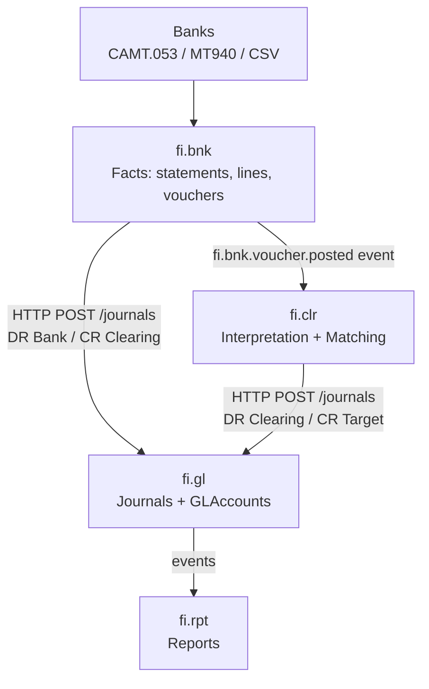
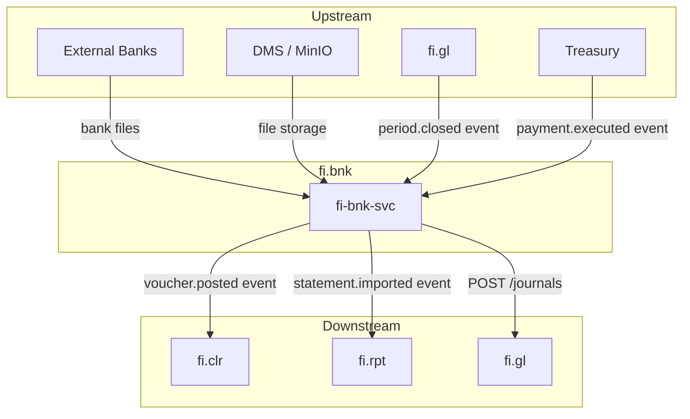
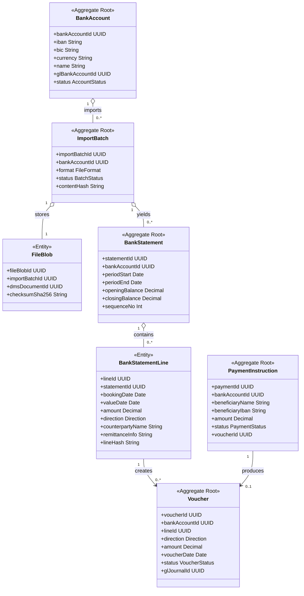
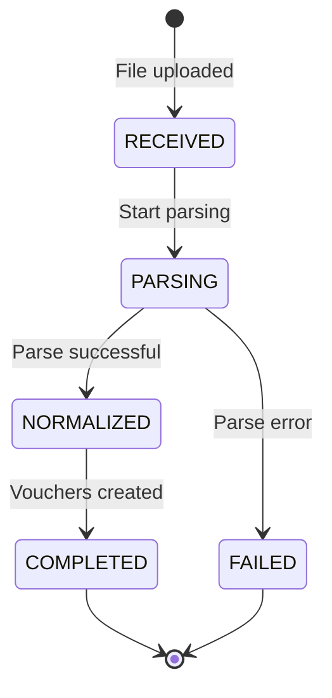
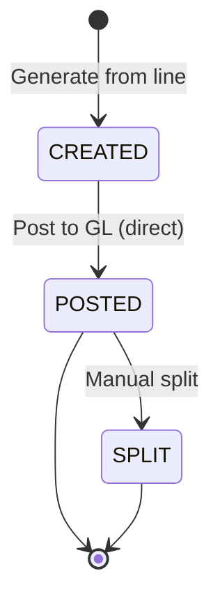
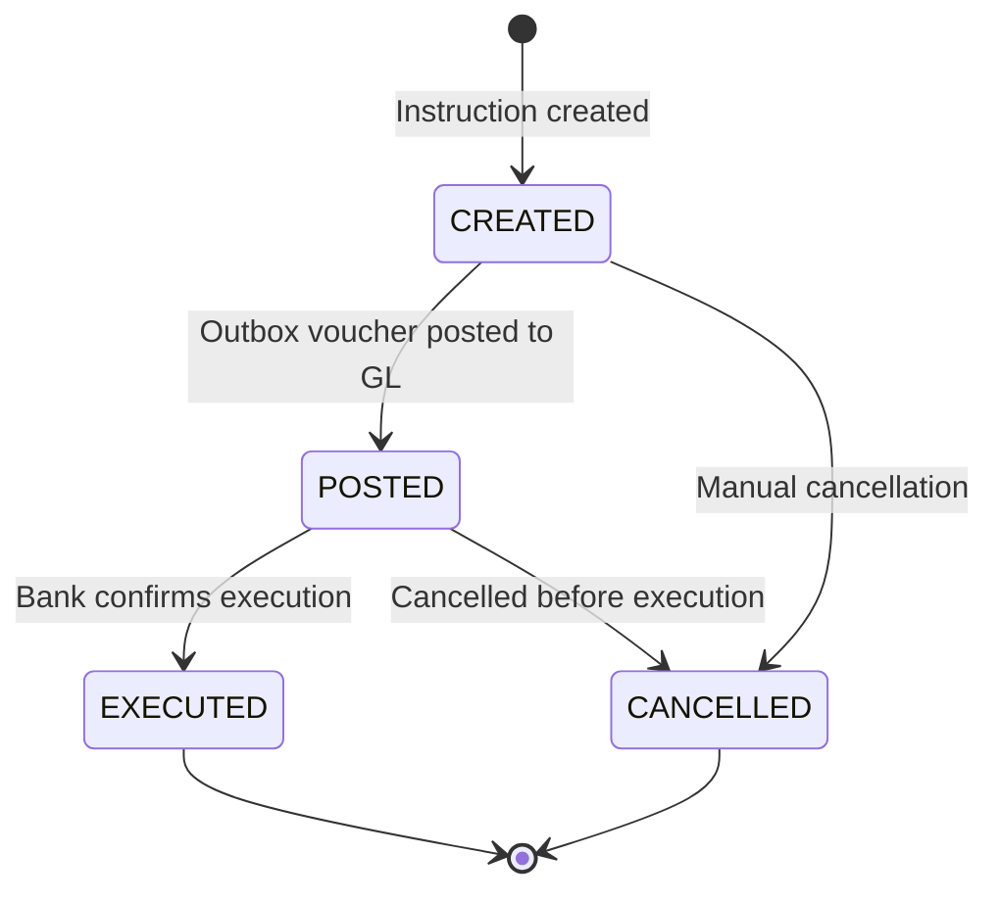
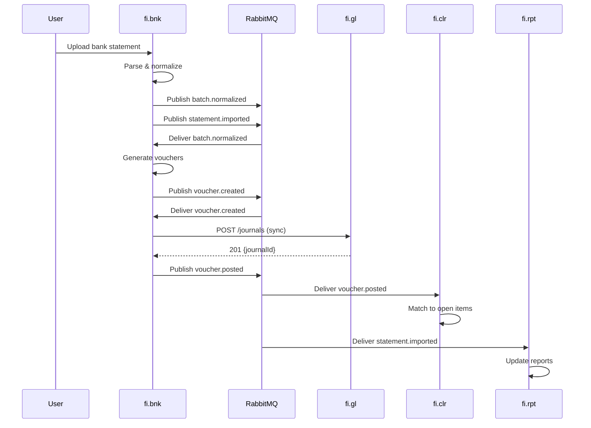
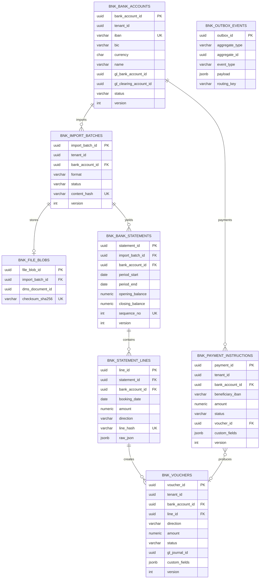

# fi.bnk -- Banking (Bank Facts & Statement Import) Domain / Service Specification

> **Conceptual Stack Layer:** Domain / Service
> **Space:** Platform
> **Owner:** FI Domain Engineering Team
> **Schema alignment:** `service-layer.schema.json`
> **Companion files:** `openapi.yaml`, `*.schema.json` (event contracts)
> **Referenced by:** Platform-Feature Spec SS5 (backend dependencies), BFF Contract
> **Belongs to:** FI Suite Spec (`_fi_suite.md`)

> **Meta Information**
> - **Version:** 2026-04-04 (v4.0)
> - **Template:** `domain-service-spec.md` v1.0.0
> - **Template Compliance:** ~95% -- fully compliant structure; minor open questions remain for feature dependency details
> - **Author(s):** OpenLeap Architecture Team
> - **Status:** DRAFT
> - **Suite:** `fi`
> - **Domain:** `bnk`
> - **Bounded Context Ref:** `bc:banking`
> - **Service ID:** `fi-bnk-svc`
> - **basePackage:** `io.openleap.fi.bnk`
> - **API Base Path:** `/api/fi/bnk/v1`
> - **OpenLeap Starter Version:** `v4.1.0`
> - **Port:** `8210`
> - **Repository:** `https://github.com/openleap/io.openleap.fi.bnk`
> - **Tags:** `banking`, `bank-statement`, `cash-management`, `payment`, `direct-posting`
> - **Team:**
>   - Name: `team-fi`
>   - Email: `fi-team@openleap.io`
>   - Slack: `#fi-team`

---

## Specification Guidelines Compliance

> ### Non-Negotiables
> - Never invent facts. If required info is missing, add an **OPEN QUESTION** entry.
> - Preserve intent and decisions. Only change meaning when explicitly requested.
> - Do not remove normative constraints unless they are explicitly replaced.
> - Keep the spec **self-contained**: no "see chat", no implicit context.
>
> ### Source of Truth Priority
> When sources conflict:
> 1. Spec (explicit) wins
> 2. Starter specs (implementation constraints) next
> 3. Guidelines (best practices) last
>
> Record conflicts in the **Decisions & Conflicts** section (see Section 14).
>
> ### Style Guide
> - Prefer short sentences and lists.
> - Use MUST/SHOULD/MAY for normative statements.
> - Keep terminology consistent (Aggregate, Domain Service, Application Service, Command, Event).
> - Avoid ambiguous words ("often", "maybe") unless explicitly noting uncertainty.
> - Keep examples minimal and clearly marked as examples.
> - Do not add implementation code unless the chapter explicitly requires it.

---

## 0. Document Purpose & Scope

### 0.1 Purpose

This document specifies the **Banking (fi.bnk)** domain, which is the **system of record for bank statement facts** (files -> statements -> lines -> vouchers). fi.bnk imports bank statements, normalizes them, creates accounting vouchers, and posts initial bank journals directly to fi.gl.

**v3.0 Posting Architecture:** fi.bnk is a **direct-posting domain** -- it posts balanced journals directly to fi.gl via HTTP POST, without going through fi.slc. This is because bank statements are externally reconciled data (the bank IS the subledger), so no internal subledger layer is needed.

**Key Principle:** fi.bnk stores **facts only**. Matching, allocation, and interpretation of bank transactions are the exclusive responsibility of fi.clr (Clearing & Matching).

### 0.2 Target Audience
- Product Owners & Business Stakeholders (Finance, Treasury, Accounting)
- System Architects & Technical Leads
- Integration Engineers
- Accountants and Cash Management Teams
- External Auditors

### 0.3 Scope

**In Scope:**
- Import & normalize bank statements (CAMT.053, MT940, CSV)
- WORM storage of raw files via DMS (hashes, parser versions)
- Statement validation: opening + sum(lines) = closing, sequence/gap checks
- Bank vouchers derived from statement lines
- **Direct GL posting** of initial bank journals:
  - Inbound: DR Bank / CR Clearing.Unassigned
  - Outbound: DR Clearing.Outbox / CR Bank
- Payment instruction tracking (execution tracking only)

**Out of Scope:**
- Matching/allocation to AR/AP -> `fi.clr`
- Subledger open items -> `fi.ar`, `fi.ap`
- Subledger bookkeeping, posting rules -> `fi.slc` (fi.bnk does NOT use fi.slc)
- Journals, balances, periods, GLAccount lifecycle -> `fi.gl`
- Bank-GL reconciliation reports -> `fi.rpt`

### 0.4 Related Documents
- `_fi_suite.md` -- FI Suite architecture overview
- `fi_gl-spec.md` -- General Ledger specification
- `fi_clr-spec.md` -- Clearing & Matching
- `fi_slc-spec.md` -- Subledger Core (fi.bnk does NOT use fi.slc)
- `fi_ar-spec.md` -- Accounts Receivable
- `fi_ap-spec.md` -- Accounts Payable
- `Audit_Tracing_spec.md` -- End-to-end audit trail
- `DMS_Spec_MinIO.md` -- Document Management Service (WORM storage)

---

## 1. Business Context

### 1.1 Domain Purpose

**fi.bnk** bridges the gap between bank transactions (the external reality) and the accounting system (the internal reality), ensuring every euro/dollar that moves through bank accounts is properly recorded in the General Ledger.

**Core Business Problems Solved:**
- **Bank Statement Processing:** Automate import and normalization of bank files
- **Cash Visibility:** Real-time view of bank balances and transactions
- **Reconciliation Foundation:** Ensure bank balance = GL bank account balance
- **Audit Trail:** Complete traceability from bank file to GL journal
- **Payment Tracking:** Track outgoing payments from instruction to execution
- **Fraud Detection:** Detect duplicate imports, unexpected transactions

### 1.2 Business Value

**For the Organization:**
- **Automation:** Eliminate manual bank statement entry (save 80%+ of time)
- **Accuracy:** Prevent data entry errors, ensure all transactions captured
- **Speed:** Real-time bank balance visibility (was: next-day reconciliation)
- **Compliance:** Complete audit trail meets SOX/IFRS requirements

**For Users:**
- **Accountant:** Auto-import bank statements, one-click voucher generation
- **Treasurer:** Real-time cash position across all bank accounts
- **Controller:** Automated bank-to-GL reconciliation foundation
- **Auditor:** Complete trace from bank file to GL journal entry

### 1.3 Key Stakeholders

| Role | Responsibility | Primary Use Cases |
|------|----------------|-------------------|
| Accountant | Daily bank processing | Import statements, create vouchers, post to GL |
| Treasurer | Cash management | Monitor balances, track payments |
| Controller | Month-end close | Bank reconciliation, investigate variances |
| Payment Manager | Payment execution | Create payment instructions, track execution |
| External Auditor | Financial audit | Verify bank statement trail to GL |

### 1.4 Strategic Positioning

fi.bnk sits at the **boundary between external banking systems and the FI suite**. It is a **facts-only** service that converts raw bank files into structured, auditable accounting data.

**Two posting paths exist in the FI suite. fi.bnk uses the direct path:**
1. **Direct to fi.gl** (fi.bnk, fi.clr): Bank/Clearing -> fi.gl (no subledger needed)
2. **Via fi.slc** (fi.ar, fi.ap, fi.fa): Subledger domains -> fi.slc -> fi.gl



**Key v3.0 Insights:**
- **fi.bnk posts directly to fi.gl** -- bank is externally reconciled, no subledger layer needed
- **fi.bnk does NOT use fi.slc** -- no posting rules or subledger accounts involved
- **fi.bnk stores facts only** -- matching/allocation is fi.clr's responsibility
- **fi.clr also posts directly to fi.gl** -- reclassification journals go straight to GL

### 1.5 Service Context

| Property | Value |
|----------|-------|
| **Suite** | `fi` |
| **Domain** | `bnk` |
| **Bounded Context** | `bc:banking` |
| **Service ID** | `fi-bnk-svc` |
| **Base Package** | `io.openleap.fi.bnk` |

**Responsibilities:**
- Import and normalize bank statement files (CAMT.053, MT940, CSV)
- Store raw bank files immutably via DMS (WORM)
- Validate statement integrity (balance equation, sequence checks)
- Create accounting vouchers from statement lines
- Post initial bank journals directly to fi.gl
- Track outgoing payment instructions

**Authoritative Sources:**
| Source Type | Description | Access Pattern |
|-------------|-------------|----------------|
| REST API | Bank accounts, statements, vouchers, payment instructions | Synchronous |
| Database | All banking entities (statements, lines, vouchers, payments) | Direct (owner) |
| Events | Batch normalized, voucher created/posted, payment instructed | Asynchronous |



---

## 2. Service Identity

| Property | Value | Schema Field |
|----------|-------|-------------|
| **Service ID** | `fi-bnk-svc` | `metadata.id` |
| **Display Name** | `Banking (Bank Facts & Statement Import)` | `metadata.name` |
| **Suite** | `fi` | `metadata.suite` |
| **Domain** | `bnk` | `metadata.domain` |
| **Bounded Context** | `bc:banking` | `metadata.bounded_context_ref` |
| **Version** | `4.0.0` | `metadata.version` |
| **Status** | DRAFT | `metadata.status` |
| **API Base Path** | `/api/fi/bnk/v1` | `metadata.api_base_path` |
| **Repository** | `https://github.com/openleap/io.openleap.fi.bnk` | `metadata.repository` |
| **Tags** | `banking`, `bank-statement`, `cash-management`, `payment`, `direct-posting` | `metadata.tags` |

**Team:**
| Property | Value |
|----------|-------|
| **Name** | `team-fi` |
| **Email** | `fi-team@openleap.io` |
| **Slack Channel** | `#fi-team` |

---

## 3. Domain Model

### 3.1 Conceptual Overview

The fi.bnk domain model captures the full lifecycle of bank statement processing:

1. **BankAccount:** Company bank account configuration with GL mapping
2. **ImportBatch -> FileBlob:** Import tracking and WORM file storage
3. **BankStatement -> BankStatementLine:** Structured bank data
4. **Voucher:** Accounting-ready entry for GL posting
5. **PaymentInstruction:** Outgoing payment tracking

**Key Principles:**
- **Append-Only:** Bank lines and vouchers are immutable once created
- **Facts Only:** No matching state, no interpretation, no targetRef
- **WORM Storage:** Original bank files stored immutably in DMS/MinIO
- **Deduplication:** Content hash (files) and line hash (transactions) prevent duplicates

### 3.2 Core Concepts



### 3.3 Aggregate Definitions

#### 3.3.1 BankAccount

| Property | Value |
|----------|-------|
| **Aggregate ID** | `agg:bank-account` |
| **Name** | `BankAccount` |

**Business Purpose:** Represents a company bank account. Links to GL Bank Account and GL Clearing Account for posting. Configures import and posting capabilities per account.

##### Aggregate Root

**Key Attributes:**
| Attribute | Type | Format | Description | Constraints | Required | Read-Only |
|-----------|------|--------|-------------|-------------|----------|-----------|
| bankAccountId | string | uuid | Unique identifier | Immutable | Yes | Yes |
| tenantId | string | uuid | Tenant ownership | Immutable | Yes | Yes |
| iban | string | -- | International Bank Account Number | `pattern: ^[A-Z]{2}[0-9]{2}[A-Z0-9]{4,30}$`, max_length: 34, unique per tenant | Yes | No |
| bic | string | -- | Bank Identifier Code (SWIFT) | `pattern: ^[A-Z]{4}[A-Z]{2}[A-Z0-9]{2}([A-Z0-9]{3})?$`, max_length: 11 | No | No |
| currency | string | -- | Account currency (ISO 4217) | `pattern: ^[A-Z]{3}$` | Yes | No |
| name | string | -- | Human-readable account name | max_length: 200 | Yes | No |
| glBankAccountId | string | uuid | GL bank asset account for posting | FK to fi.gl GLAccounts, must be ACTIVE and type ASSET | Yes | No |
| glClearingAccountId | string | uuid | GL clearing interim account | FK to fi.gl GLAccounts, must be ACTIVE | Yes | No |
| postingEnabled | boolean | -- | Whether vouchers can be posted from this account | -- | Yes | No |
| importEnabled | boolean | -- | Whether imports are accepted for this account | -- | Yes | No |
| status | string | -- | Current lifecycle state | enum_ref: `AccountStatus` | Yes | No |
| version | integer | int64 | Optimistic locking version | -- | Yes | Yes |
| createdAt | string | date-time | Creation timestamp | -- | Yes | Yes |
| updatedAt | string | date-time | Last modification timestamp | -- | No | Yes |

**Lifecycle States:**

| Property | Value |
|----------|-------|
| **Initial State** | `ACTIVE` |
| **Terminal States** | `INACTIVE` |

**State Descriptions:**
| State | Description | Business Meaning |
|-------|-------------|------------------|
| ACTIVE | Operational state | Account accepts imports and generates vouchers |
| INACTIVE | Deactivated state | No imports or postings allowed; historical data retained |

**Allowed Transitions:**
| From State | To State | Trigger | Guard / Business Preconditions |
|------------|----------|---------|-------------------------------|
| ACTIVE | INACTIVE | Manual deactivation | No pending imports in RECEIVED or PARSING state |
| INACTIVE | ACTIVE | Manual reactivation | GL accounts still valid and ACTIVE |

**Invariants:**
| Rule ID | Description |
|---------|-------------|
| BR-ACC-001 | IBAN unique per tenant |
| BR-ACC-002 | glBankAccountId must reference valid, ACTIVE GL account of type ASSET |

**Domain Events Emitted:**
- `fi.bnk.bankAccount.created`
- `fi.bnk.bankAccount.updated`
- `fi.bnk.bankAccount.statusChanged`

##### Child Entities

_BankAccount has no child entities._

##### Value Objects

_BankAccount uses shared value objects defined in section 3.5._

---

#### 3.3.2 ImportBatch

| Property | Value |
|----------|-------|
| **Aggregate ID** | `agg:import-batch` |
| **Name** | `ImportBatch` |

**Business Purpose:** Represents a bank statement file import. Tracks parsing progress from file upload through normalization to voucher generation.

##### Aggregate Root

**Key Attributes:**
| Attribute | Type | Format | Description | Constraints | Required | Read-Only |
|-----------|------|--------|-------------|-------------|----------|-----------|
| importBatchId | string | uuid | Unique identifier | Immutable | Yes | Yes |
| tenantId | string | uuid | Tenant ownership | Immutable | Yes | Yes |
| bankAccountId | string | uuid | Target bank account | FK to BankAccount | Yes | Yes |
| format | string | -- | File format | enum_ref: `FileFormat` | Yes | Yes |
| status | string | -- | Current processing state | enum_ref: `BatchStatus` | Yes | No |
| contentHash | string | -- | SHA-256 hash of file content | max_length: 64, unique per (tenant, bankAccount) | Yes | Yes |
| parserVersion | string | -- | Version of parser used | max_length: 50 | No | Yes |
| errorMessage | string | -- | Error details if FAILED | -- | No | No |
| version | integer | int64 | Optimistic locking version | -- | Yes | Yes |
| receivedAt | string | date-time | Upload timestamp | -- | Yes | Yes |
| normalizedAt | string | date-time | Parse completion timestamp | -- | No | Yes |

**Lifecycle States:**

| Property | Value |
|----------|-------|
| **Initial State** | `RECEIVED` |
| **Terminal States** | `COMPLETED`, `FAILED` |



**State Descriptions:**
| State | Description | Business Meaning |
|-------|-------------|------------------|
| RECEIVED | File uploaded, awaiting processing | File stored in DMS, hash checked |
| PARSING | Parser is processing the file | Extracting statements and lines |
| NORMALIZED | Parse complete, statements/lines created | Ready for voucher generation |
| COMPLETED | All vouchers created | Fully processed import |
| FAILED | Parse or validation error | Requires manual investigation |

**Allowed Transitions:**
| From State | To State | Trigger | Guard / Business Preconditions |
|------------|----------|---------|-------------------------------|
| RECEIVED | PARSING | Async job pickup | File accessible in DMS |
| PARSING | NORMALIZED | Parse success | Balance equation valid for all statements |
| PARSING | FAILED | Parse error | Error logged in errorMessage |
| NORMALIZED | COMPLETED | Voucher generation complete | All lines processed |

**Invariants:**
| Rule ID | Description |
|---------|-------------|
| BR-BATCH-001 | Content hash unique per (tenant, bankAccount) |
| BR-BATCH-002 | Status only progresses forward (monotonic) |

**Domain Events Emitted:**
- `fi.bnk.batch.received`
- `fi.bnk.batch.normalized`
- `fi.bnk.batch.completed`
- `fi.bnk.batch.failed`

##### Child Entities

###### Entity: FileBlob

| Property | Value |
|----------|-------|
| **Entity ID** | `ent:file-blob` |
| **Name** | `FileBlob` |
| **Relationship to Root** | one_to_one |

**Business Purpose:** Stores metadata about the raw bank file stored in DMS. Enables audit trail back to the original document.

**Attributes:**
| Attribute | Type | Format | Description | Constraints | Required |
|-----------|------|--------|-------------|-------------|----------|
| fileBlobId | string | uuid | Unique identifier | Immutable | Yes |
| importBatchId | string | uuid | Parent import batch | FK to ImportBatch | Yes |
| dmsDocumentId | string | uuid | DMS document reference | FK to DMS | Yes |
| filename | string | -- | Original file name | max_length: 255 | Yes |
| contentType | string | -- | MIME type | max_length: 100 | Yes |
| size | integer | int64 | File size in bytes | minimum: 1 | Yes |
| checksumSha256 | string | -- | SHA-256 checksum | max_length: 64, unique | Yes |
| receivedAt | string | date-time | Upload timestamp | -- | Yes |

**Collection Constraints:**
- Minimum items: 1
- Maximum items: 1

**Invariants:**
| Rule ID | Description |
|---------|-------------|
| BR-BATCH-001 | Checksum must match contentHash on parent ImportBatch |

##### Value Objects

_ImportBatch uses no aggregate-specific value objects._

---

#### 3.3.3 BankStatement

| Property | Value |
|----------|-------|
| **Aggregate ID** | `agg:bank-statement` |
| **Name** | `BankStatement` |

**Business Purpose:** Represents a bank statement for a period. Contains opening/closing balance and validates the balance equation.

##### Aggregate Root

**Key Attributes:**
| Attribute | Type | Format | Description | Constraints | Required | Read-Only |
|-----------|------|--------|-------------|-------------|----------|-----------|
| statementId | string | uuid | Unique identifier | Immutable | Yes | Yes |
| tenantId | string | uuid | Tenant ownership | Immutable | Yes | Yes |
| importBatchId | string | uuid | Source import batch | FK to ImportBatch | Yes | Yes |
| bankAccountId | string | uuid | Bank account | FK to BankAccount | Yes | Yes |
| periodStart | string | date | Statement period start | -- | Yes | Yes |
| periodEnd | string | date | Statement period end | minimum: periodStart | Yes | Yes |
| openingBalance | number | decimal | Balance at period start | precision: 19,4 | Yes | Yes |
| closingBalance | number | decimal | Balance at period end | precision: 19,4 | Yes | Yes |
| currency | string | -- | Statement currency (ISO 4217) | `pattern: ^[A-Z]{3}$` | Yes | Yes |
| sequenceNo | integer | int32 | Statement sequence number | Monotonic per bankAccount | No | Yes |
| status | string | -- | Processing state | enum_ref: `StatementStatus` | Yes | No |
| version | integer | int64 | Optimistic locking version | -- | Yes | Yes |
| createdAt | string | date-time | Creation timestamp | -- | Yes | Yes |

**Lifecycle States:**

| Property | Value |
|----------|-------|
| **Initial State** | `IMPORTED` |
| **Terminal States** | `VOUCHERED` |

**State Descriptions:**
| State | Description | Business Meaning |
|-------|-------------|------------------|
| IMPORTED | Statement parsed and stored | Lines available, vouchers not yet generated |
| VOUCHERED | All lines have vouchers | Fully processed, ready for GL posting |

**Allowed Transitions:**
| From State | To State | Trigger | Guard / Business Preconditions |
|------------|----------|---------|-------------------------------|
| IMPORTED | VOUCHERED | Voucher generation complete | All lines processed |

**Invariants:**
| Rule ID | Description |
|---------|-------------|
| BR-STMT-001 | closingBalance = openingBalance + sum(credits) - sum(debits) |
| BR-STMT-002 | sequenceNo increases monotonically per bank account |

**Domain Events Emitted:**
- `fi.bnk.statement.imported`

##### Child Entities

###### Entity: BankStatementLine

| Property | Value |
|----------|-------|
| **Entity ID** | `ent:bank-statement-line` |
| **Name** | `BankStatementLine` |
| **Relationship to Root** | one_to_many |

**Business Purpose:** Individual bank transaction. Core unit for voucher creation. Immutable once created. Stores the raw parsed data for audit purposes.

**Attributes:**
| Attribute | Type | Format | Description | Constraints | Required |
|-----------|------|--------|-------------|-------------|----------|
| lineId | string | uuid | Unique identifier | Immutable | Yes |
| statementId | string | uuid | Parent statement | FK to BankStatement | Yes |
| bankAccountId | string | uuid | Bank account (denormalized for query) | FK to BankAccount | Yes |
| bookingDate | string | date | Transaction booking date | -- | Yes |
| valueDate | string | date | Value/settlement date | -- | Yes |
| amount | number | decimal | Transaction amount (always positive) | precision: 19,4, minimum: 0.0001 | Yes |
| currency | string | -- | Transaction currency (ISO 4217) | `pattern: ^[A-Z]{3}$` | Yes |
| direction | string | -- | Credit or debit | enum_ref: `Direction` | Yes |
| counterpartyName | string | -- | Name of the other party | max_length: 200 | No |
| counterpartyIban | string | -- | IBAN of the other party | max_length: 34 | No |
| remittanceInfo | string | -- | Payment reference / remittance information | Searchable (full-text) | No |
| purposeCode | string | -- | ISO 20022 purpose code (e.g., SALA, SUPP) | max_length: 20 | No |
| endToEndId | string | -- | End-to-end transaction ID from CAMT | max_length: 100 | No |
| lineHash | string | -- | SHA-256 hash of key fields for dedup | max_length: 64, unique per (tenant, bankAccount) | Yes |
| duplicateOfLineId | string | uuid | Reference to original if duplicate detected | FK to BankStatementLine | No |
| rawJson | object | -- | Original parsed data from bank file | JSONB, audit retention | Yes |
| createdAt | string | date-time | Creation timestamp | -- | Yes |

**Collection Constraints:**
- Minimum items: 0 (empty statements are valid)
- Maximum items: unbounded (statements may contain thousands of lines)

**Invariants:**
| Rule ID | Description |
|---------|-------------|
| BR-LINE-001 | lineHash unique per (tenant, bankAccount) |
| BR-LINE-002 | CREDIT increases bank balance, DEBIT decreases |

##### Value Objects

_BankStatement uses shared value objects defined in section 3.5._

---

#### 3.3.4 Voucher

| Property | Value |
|----------|-------|
| **Aggregate ID** | `agg:voucher` |
| **Name** | `Voucher` |

**Business Purpose:** Accounting-ready entry derived from a bank statement line or payment instruction. Source for direct GL posting. Represents the accounting interpretation of a bank transaction.

##### Aggregate Root

**Key Attributes:**
| Attribute | Type | Format | Description | Constraints | Required | Read-Only |
|-----------|------|--------|-------------|-------------|----------|-----------|
| voucherId | string | uuid | Unique identifier | Immutable | Yes | Yes |
| tenantId | string | uuid | Tenant ownership | Immutable | Yes | Yes |
| source | string | -- | Voucher source type | enum_ref: `VoucherSource` | Yes | Yes |
| bankAccountId | string | uuid | Bank account | FK to BankAccount | Yes | Yes |
| lineId | string | uuid | Source bank statement line | FK to BankStatementLine | No | Yes |
| direction | string | -- | Inbound (credit) or outbound (debit) | enum_ref: `VoucherDirection` | Yes | Yes |
| amount | number | decimal | Transaction amount (always positive) | precision: 19,4, minimum: 0.0001 | Yes | Yes |
| currency | string | -- | Transaction currency (ISO 4217) | `pattern: ^[A-Z]{3}$` | Yes | Yes |
| voucherDate | string | date | Accounting date for the voucher | -- | Yes | Yes |
| status | string | -- | Current lifecycle state | enum_ref: `VoucherStatus` | Yes | No |
| glJournalId | string | uuid | GL journal entry reference | Set when status = POSTED | No | Yes |
| notes | string | -- | Manual operator notes | max_length: 1000 | No | No |
| version | integer | int64 | Optimistic locking version | -- | Yes | Yes |
| createdAt | string | date-time | Creation timestamp | -- | Yes | Yes |
| postedAt | string | date-time | GL posting timestamp | Set when status = POSTED | No | Yes |

**Lifecycle States:**

| Property | Value |
|----------|-------|
| **Initial State** | `CREATED` |
| **Terminal States** | `POSTED`, `SPLIT` |



**State Descriptions:**
| State | Description | Business Meaning |
|-------|-------------|------------------|
| CREATED | Voucher generated from bank line | Awaiting GL posting |
| POSTED | GL journal created successfully | Clearing account loaded, ready for fi.clr matching |
| SPLIT | Original voucher split into multiple | Manual intervention applied; child vouchers created |

**Allowed Transitions:**
| From State | To State | Trigger | Guard / Business Preconditions |
|------------|----------|---------|-------------------------------|
| CREATED | POSTED | GL posting success | fi.gl returns journalId, period is open |
| POSTED | SPLIT | Manual split operation | Operator has BNK_ADMIN role |

**v3.0 Changes (vs. v2.1):**
- **Removed:** `matchConfidence`, `targetRef` -- matching state lives exclusively in fi.clr
- **Removed:** VoucherStatus `MATCHED` -- matching is fi.clr's responsibility
- **Changed:** Posting goes **directly to fi.gl** (was: via fi.pst)

**Invariants:**
| Rule ID | Description |
|---------|-------------|
| BR-VCH-001 | Unique constraint on (lineId, direction, amount, currency) |
| BR-VCH-002 | IN -> DR Bank / CR Clearing.Unassigned; OUT -> DR Clearing.Outbox / CR Bank |

**Domain Events Emitted:**
- `fi.bnk.voucher.created`
- `fi.bnk.voucher.posted`
- `fi.bnk.voucher.hintSubmitted`

##### Child Entities

_Voucher has no child entities._

##### Value Objects

_Voucher uses shared value objects defined in section 3.5._

---

#### 3.3.5 PaymentInstruction

| Property | Value |
|----------|-------|
| **Aggregate ID** | `agg:payment-instruction` |
| **Name** | `PaymentInstruction` |

**Business Purpose:** Outgoing payment instruction (vendor payment, salary, tax). Creates an outbox voucher when posted. Tracks execution status via bank confirmation events.

##### Aggregate Root

**Key Attributes:**
| Attribute | Type | Format | Description | Constraints | Required | Read-Only |
|-----------|------|--------|-------------|-------------|----------|-----------|
| paymentId | string | uuid | Unique identifier | Immutable | Yes | Yes |
| tenantId | string | uuid | Tenant ownership | Immutable | Yes | Yes |
| bankAccountId | string | uuid | Source bank account | FK to BankAccount | Yes | Yes |
| beneficiaryName | string | -- | Payee name | max_length: 200 | Yes | No |
| beneficiaryIban | string | -- | Payee IBAN | max_length: 34, `pattern: ^[A-Z]{2}[0-9]{2}[A-Z0-9]{4,30}$` | Yes | No |
| amount | number | decimal | Payment amount | precision: 19,4, minimum: 0.0001 | Yes | Yes |
| currency | string | -- | Payment currency (ISO 4217) | `pattern: ^[A-Z]{3}$` | Yes | Yes |
| requestedDate | string | date | Requested execution date | minimum: today | Yes | No |
| status | string | -- | Current lifecycle state | enum_ref: `PaymentStatus` | Yes | No |
| executionRef | string | -- | Bank-assigned execution reference | max_length: 100 | No | Yes |
| voucherId | string | uuid | Associated outbox voucher | FK to Voucher | No | Yes |
| sourceDocumentRef | string | -- | Source document (e.g., "ap.bill.uuid") | max_length: 200 | No | Yes |
| version | integer | int64 | Optimistic locking version | -- | Yes | Yes |
| createdAt | string | date-time | Creation timestamp | -- | Yes | Yes |

**Lifecycle States:**

| Property | Value |
|----------|-------|
| **Initial State** | `CREATED` |
| **Terminal States** | `EXECUTED`, `CANCELLED` |



**State Descriptions:**
| State | Description | Business Meaning |
|-------|-------------|------------------|
| CREATED | Payment instruction registered | Awaiting voucher creation and GL posting |
| POSTED | Outbox voucher posted to GL | DR Clearing.Outbox / CR Bank recorded |
| EXECUTED | Bank has confirmed execution | Payment sent to beneficiary |
| CANCELLED | Payment cancelled before execution | No financial impact if pre-posting; reversal if post-posting |

**Allowed Transitions:**
| From State | To State | Trigger | Guard / Business Preconditions |
|------------|----------|---------|-------------------------------|
| CREATED | POSTED | Voucher posted to GL | GL period open, bank account active |
| POSTED | EXECUTED | treasury.payment.executed event | executionRef provided by bank |
| CREATED | CANCELLED | Manual cancellation | No voucher yet posted |
| POSTED | CANCELLED | Manual cancellation | Reversal journal must be posted |

**Invariants:**
| Rule ID | Description |
|---------|-------------|
| BR-PMT-001 | Amount must be positive |
| BR-PMT-002 | beneficiaryIban must be valid IBAN format |

**Domain Events Emitted:**
- `fi.bnk.payment.instructed`
- `fi.bnk.payment.posted`
- `fi.bnk.payment.executed`
- `fi.bnk.payment.cancelled`

##### Child Entities

_PaymentInstruction has no child entities._

##### Value Objects

_PaymentInstruction uses shared value objects defined in section 3.5._

---

### 3.4 Enumerations

#### AccountStatus

**Description:** Lifecycle states for a BankAccount.

| Value | Description | Deprecated |
|-------|-------------|------------|
| `ACTIVE` | Account is operational; accepts imports and postings | No |
| `INACTIVE` | Account is deactivated; read-only, no imports or postings | No |

#### FileFormat

**Description:** Supported bank statement file formats.

| Value | Description | Deprecated |
|-------|-------------|------------|
| `CAMT053` | ISO 20022 CAMT.053 XML format (bank-to-customer statement) | No |
| `MT940` | SWIFT MT940 format (legacy bank statement) | No |
| `CSV` | Comma-separated values (bank-specific layout) | No |

#### BatchStatus

**Description:** Processing states for an import batch.

| Value | Description | Deprecated |
|-------|-------------|------------|
| `RECEIVED` | File uploaded, content hash checked, awaiting parsing | No |
| `PARSING` | Parser is extracting statements and lines from file | No |
| `NORMALIZED` | Parse complete, statements and lines created, balance validated | No |
| `COMPLETED` | Vouchers generated for all lines | No |
| `FAILED` | Parse or validation error; see errorMessage | No |

#### StatementStatus

**Description:** Processing states for a bank statement.

| Value | Description | Deprecated |
|-------|-------------|------------|
| `IMPORTED` | Statement parsed and stored with lines | No |
| `VOUCHERED` | All statement lines have corresponding vouchers | No |

#### Direction

**Description:** Transaction direction on a bank statement line.

| Value | Description | Deprecated |
|-------|-------------|------------|
| `CREDIT` | Money received into the account (increases balance) | No |
| `DEBIT` | Money sent from the account (decreases balance) | No |

#### VoucherDirection

**Description:** Voucher posting direction.

| Value | Description | Deprecated |
|-------|-------------|------------|
| `IN` | Inbound (from CREDIT line): DR Bank / CR Clearing.Unassigned | No |
| `OUT` | Outbound (from DEBIT line): DR Clearing.Outbox / CR Bank | No |

#### VoucherSource

**Description:** Origin of the voucher.

| Value | Description | Deprecated |
|-------|-------------|------------|
| `BANK` | Generated from a bank statement line | No |
| `PAYMENT` | Generated from a payment instruction | No |
| `MANUAL` | Manually created by operator | No |

#### VoucherStatus

**Description:** Lifecycle states for a voucher.

| Value | Description | Deprecated |
|-------|-------------|------------|
| `CREATED` | Voucher generated, awaiting GL posting | No |
| `POSTED` | GL journal created; glJournalId set | No |
| `SPLIT` | Voucher has been manually split into sub-vouchers | No |

#### PaymentStatus

**Description:** Lifecycle states for a payment instruction.

| Value | Description | Deprecated |
|-------|-------------|------------|
| `CREATED` | Instruction registered, awaiting posting | No |
| `POSTED` | Outbox voucher posted to GL | No |
| `EXECUTED` | Bank confirmed payment execution | No |
| `CANCELLED` | Payment cancelled | No |

### 3.5 Shared Types

#### Money

| Property | Value |
|----------|-------|
| **Type ID** | `type:money` |
| **Name** | `Money` |

**Description:** Represents a monetary amount with currency. Used wherever financial amounts appear.

**Attributes:**
| Attribute | Type | Format | Description | Constraints |
|-----------|------|--------|-------------|-------------|
| amount | number | decimal | Monetary amount | precision: 19,4, minimum: 0 |
| currency | string | -- | ISO 4217 currency code | `pattern: ^[A-Z]{3}$` |

**Validation Rules:**
- Amount MUST be non-negative
- Currency MUST be a valid ISO 4217 code
- Currency MUST be active in ref-data-svc

**Used By:**
- `agg:voucher`
- `agg:payment-instruction`
- `agg:bank-statement` (opening/closing balance)
- `ent:bank-statement-line`

---

## 4. Business Rules & Constraints

### 4.1 Business Rules Catalog

| ID | Rule Name | Description | Scope | Enforcement | Error Code |
|----|-----------|-------------|-------|-------------|------------|
| BR-ACC-001 | IBAN Uniqueness | IBAN unique per tenant | BankAccount | Create | `DUPLICATE_IBAN` |
| BR-ACC-002 | GL Mapping | glBankAccountId must be valid GL account | BankAccount | Create, Update | `INVALID_GL_ACCOUNT` |
| BR-BATCH-001 | Content Hash Uniqueness | Prevent duplicate imports | ImportBatch | Create | `DUPLICATE_IMPORT` |
| BR-BATCH-002 | Status Monotonicity | Status only progresses forward | ImportBatch | Update | `INVALID_STATUS_TRANSITION` |
| BR-STMT-001 | Balance Equation | Closing = Opening + Credits - Debits | BankStatement | Validate | `BALANCE_EQUATION_FAILED` |
| BR-STMT-002 | Sequence Monotonicity | sequenceNo increases | BankStatement | Create | `SEQUENCE_GAP` |
| BR-LINE-001 | Line Hash Uniqueness | Detect duplicate lines | BankStatementLine | Create | `DUPLICATE_LINE` |
| BR-LINE-002 | Direction Consistency | CREDIT increases bank balance | BankStatementLine | Create | `INVALID_DIRECTION` |
| BR-VCH-001 | Idempotency | Unique voucher per line + direction + amount + currency | Voucher | Create | `DUPLICATE_VOUCHER` |
| BR-VCH-002 | Direction Posting | IN -> DR Bank/CR Clearing; OUT -> DR Clearing/CR Bank | Voucher | Post | `INVALID_POSTING` |
| BR-PMT-001 | Payment Amount | Amount must be positive | PaymentInstruction | Create | `INVALID_AMOUNT` |
| BR-PMT-002 | Beneficiary IBAN | beneficiaryIban must be valid IBAN format | PaymentInstruction | Create | `INVALID_IBAN` |

### 4.2 Detailed Rule Definitions

#### BR-ACC-001: IBAN Uniqueness

**Business Context:** A company cannot register the same bank account twice. The IBAN uniquely identifies a bank account in the real world.

**Rule Statement:** Within a single tenant, no two BankAccount records MAY have the same IBAN.

**Applies To:**
- Aggregate: BankAccount
- Operations: Create

**Enforcement:** Database unique constraint on (tenant_id, iban).

**Validation Logic:** Before creating a BankAccount, check that no existing BankAccount with the same tenant_id and iban exists.

**Error Handling:**
- **Error Code:** `DUPLICATE_IBAN`
- **Error Message:** "A bank account with IBAN {iban} already exists for this tenant."
- **User action:** Verify the IBAN or update the existing bank account.

**Examples:**
- **Valid:** Creating a BankAccount with IBAN DE89370400440532013000 when no other account has this IBAN.
- **Invalid:** Creating a second BankAccount with IBAN DE89370400440532013000 for the same tenant.

#### BR-BATCH-001: Content Hash Uniqueness

**Business Context:** Prevents the same bank statement file from being imported twice, which would create duplicate transactions and incorrect balances.

**Rule Statement:** Within a single tenant and bank account, no two ImportBatch records MAY have the same contentHash.

**Applies To:**
- Aggregate: ImportBatch
- Operations: Create

**Enforcement:** Database unique constraint on (tenant_id, bank_account_id, content_hash).

**Validation Logic:** Compute SHA-256 hash of uploaded file content. Check for existing ImportBatch with same hash for same tenant and bank account.

**Error Handling:**
- **Error Code:** `DUPLICATE_IMPORT`
- **Error Message:** "A file with the same content has already been imported for this bank account."
- **User action:** Verify this is not a duplicate file. If intentional re-import is needed, contact administrator.

**Examples:**
- **Valid:** Importing a January statement file for the first time.
- **Invalid:** Re-uploading the same January statement file.

#### BR-STMT-001: Balance Equation

**Business Context:** The fundamental integrity check for bank statements. The closing balance MUST equal the opening balance plus all credits minus all debits. This is the same validation banks perform internally.

**Rule Statement:** For every BankStatement: closingBalance = openingBalance + SUM(lines where direction=CREDIT) - SUM(lines where direction=DEBIT).

**Applies To:**
- Aggregate: BankStatement
- Operations: Validate (during import)

**Enforcement:** Application-level validation during statement parsing.

**Validation Logic:** After parsing all lines, compute the expected closing balance and compare with the declared closing balance. Tolerance: zero (exact match at 4 decimal places).

**Error Handling:**
- **Error Code:** `BALANCE_EQUATION_FAILED`
- **Error Message:** "Statement balance equation failed: expected {expected}, got {actual}. Difference: {diff}."
- **User action:** Verify the source bank file is not corrupted. Contact bank if discrepancy persists.

**Examples:**
- **Valid:** Opening 1000.00, 3 credits totaling 500.00, 2 debits totaling 200.00, closing 1300.00.
- **Invalid:** Opening 1000.00, credits 500.00, debits 200.00, closing 1400.00 (off by 100.00).

#### BR-VCH-001: Idempotency

**Business Context:** Ensures that processing the same bank statement line does not create duplicate vouchers. Critical for at-least-once delivery guarantees in event-driven processing.

**Rule Statement:** Only one Voucher MAY exist for a given combination of (lineId, direction, amount, currency).

**Applies To:**
- Aggregate: Voucher
- Operations: Create

**Enforcement:** Database unique constraint on (line_id, direction, amount, currency).

**Validation Logic:** Before creating a Voucher, check the unique constraint. If a matching voucher exists, return the existing voucher (idempotent).

**Error Handling:**
- **Error Code:** `DUPLICATE_VOUCHER`
- **Error Message:** "A voucher already exists for this bank line."
- **User action:** No action needed; this is expected during retry scenarios.

**Examples:**
- **Valid:** Creating first voucher for line X with direction IN, amount 100.00, currency EUR.
- **Invalid:** Creating a second voucher for the same line/direction/amount/currency combination.

#### BR-VCH-002: Direction Posting

**Business Context:** Implements the standard double-entry bookkeeping pattern for bank transactions. Inbound payments (credits) increase the bank asset account and load the clearing suspense. Outbound payments (debits) reduce the bank account and load the outbox clearing account.

**Rule Statement:** When posting a voucher to fi.gl: IN direction MUST create journal DR Bank / CR Clearing.Unassigned; OUT direction MUST create journal DR Clearing.Outbox / CR Bank.

**Applies To:**
- Aggregate: Voucher
- Operations: Post (GL journal creation)

**Enforcement:** Application-level journal composition in the posting service.

**Validation Logic:** Based on voucher direction, compose the correct debit/credit journal lines using the BankAccount's glBankAccountId and glClearingAccountId.

**Error Handling:**
- **Error Code:** `INVALID_POSTING`
- **Error Message:** "Invalid posting direction: {direction}."
- **User action:** Contact system administrator; this indicates a system error.

**Examples:**
- **Valid:** IN voucher for 500 EUR creates: DR bank-gl-account 500 / CR clearing-unassigned 500.
- **Invalid:** IN voucher creating DR clearing / CR bank (reversed).

### 4.3 Data Validation Rules

**Field-Level Validations:**
| Field | Validation Rule | Error Message |
|-------|----------------|---------------|
| iban | Required, pattern `^[A-Z]{2}[0-9]{2}[A-Z0-9]{4,30}$`, max 34 chars | "IBAN is required and must be a valid IBAN format" |
| bic | Optional, pattern `^[A-Z]{4}[A-Z]{2}[A-Z0-9]{2}([A-Z0-9]{3})?$`, max 11 chars | "BIC must be a valid SWIFT BIC format" |
| currency | Required, pattern `^[A-Z]{3}$` | "Currency must be a valid 3-letter ISO 4217 code" |
| name | Required, max 200 chars | "Account name is required and cannot exceed 200 characters" |
| amount (all entities) | Required, > 0 | "Amount must be positive" |
| beneficiaryIban | Required (PaymentInstruction), valid IBAN | "Beneficiary IBAN is required and must be valid" |
| beneficiaryName | Required (PaymentInstruction), max 200 chars | "Beneficiary name is required" |
| contentHash | Required, max 64 chars | "Content hash is required" |
| lineHash | Required, max 64 chars | "Line hash is required" |
| voucherDate | Required, valid date | "Voucher date is required" |
| requestedDate | Required, >= today | "Requested date must be today or in the future" |

**Cross-Field Validations:**
- `periodEnd` MUST be >= `periodStart` on BankStatement
- `closingBalance` MUST equal `openingBalance + SUM(CREDIT lines) - SUM(DEBIT lines)`
- `glJournalId` MUST be set when `status = POSTED` on Voucher
- `voucherId` SHOULD be set when `status = POSTED` on PaymentInstruction
- `executionRef` MUST be set when `status = EXECUTED` on PaymentInstruction

### 4.4 Reference Data Dependencies

**Required Reference Data:**
| Catalog | Source Service | Fields Referencing | Validation |
|---------|----------------|-------------------|------------|
| Currencies (ISO 4217) | ref-data-svc | currency fields on all entities | Must exist and be active |
| GLAccounts | fi.gl | glBankAccountId, glClearingAccountId | Must be ACTIVE, correct account type |
| Countries (ISO 3166) | ref-data-svc | Derived from IBAN country prefix | Used for format validation |

---

## 5. Use Cases

> This section defines explicit use cases (WRITE/READ), mapping to domain operations/services.
> Each use case MUST follow the canonical format for code generation.

### 5.1 Business Logic Placement

| Logic Type | Placement | Examples |
|------------|-----------|----------|
| Aggregate invariants | Domain Object | IBAN validation, balance equation, hash uniqueness |
| Cross-aggregate logic | Domain Service | Voucher generation from statement lines, GL journal composition |
| Orchestration & transactions | Application Service | Import orchestration, posting coordination, event publishing |

### 5.2 Use Cases (Canonical Format)

#### UC-001: ImportBankStatement

| Field | Value |
|-------|-------|
| **id** | `ImportBankStatement` |
| **type** | WRITE |
| **trigger** | REST |
| **aggregate** | `ImportBatch` |
| **domainOperation** | `ImportBatch.create` |
| **inputs** | `bankAccountId: UUID`, `file: MultipartFile` |
| **outputs** | `importBatchId: UUID`, `status: BatchStatus` |
| **events** | `batch.received` |
| **rest** | `POST /api/fi/bnk/v1/bank-accounts/{bankAccountId}/imports` |
| **idempotency** | required (contentHash) |
| **errors** | `DUPLICATE_IMPORT`: file already imported, `INVALID_FILE_FORMAT`: unsupported format, `BANK_ACCOUNT_NOT_FOUND`: account does not exist |

**Actor:** Accountant

**Preconditions:**
- User has BNK_IMPORTER or BNK_ADMIN role
- BankAccount exists and has status ACTIVE
- BankAccount has importEnabled = true

**Main Flow:**
1. Accountant uploads bank statement file (CAMT.053, MT940, or CSV)
2. System stores file in DMS with WORM / Object Lock
3. System computes SHA-256 content hash
4. System checks content hash for duplicate -> 409 if duplicate
5. System creates ImportBatch (status = RECEIVED)
6. System publishes fi.bnk.batch.received event
7. System returns 202 Accepted with importBatchId

**Postconditions:**
- ImportBatch in RECEIVED state
- FileBlob created with DMS reference
- Async parsing triggered

**Business Rules Applied:**
- BR-BATCH-001: Content Hash Uniqueness

**Alternative Flows:**
- **Alt-1:** If file format is not recognized, return 400 INVALID_FILE_FORMAT

**Exception Flows:**
- **Exc-1:** If DMS is unavailable, return 503 Service Unavailable and log for retry

---

#### UC-002: ParseAndNormalize

| Field | Value |
|-------|-------|
| **id** | `ParseAndNormalize` |
| **type** | WRITE |
| **trigger** | Internal (async, triggered by batch.received) |
| **aggregate** | `ImportBatch`, `BankStatement` |
| **domainOperation** | `ImportBatch.parse`, `BankStatement.create` |
| **inputs** | `importBatchId: UUID` |
| **outputs** | `statementIds: List<UUID>` |
| **events** | `batch.normalized`, `statement.imported`, `batch.failed` |
| **rest** | -- |
| **idempotency** | required (importBatchId) |
| **errors** | `PARSE_ERROR`: file parsing failed, `BALANCE_EQUATION_FAILED`: balance mismatch |

**Actor:** fi.bnk (automated)

**Preconditions:**
- ImportBatch exists in RECEIVED state
- File accessible in DMS

**Main Flow:**
1. System retrieves file from DMS
2. System updates ImportBatch status to PARSING
3. System parses file into BankStatement(s) and BankStatementLine(s)
4. System validates balance equation for each statement (BR-STMT-001)
5. System deduplicates lines via lineHash (BR-LINE-001)
6. System creates BankStatement(s) and BankStatementLine(s)
7. System updates ImportBatch status to NORMALIZED
8. System publishes fi.bnk.batch.normalized and fi.bnk.statement.imported events

**Postconditions:**
- BankStatement(s) in IMPORTED state
- BankStatementLine(s) created with lineHash
- ImportBatch in NORMALIZED state

**Business Rules Applied:**
- BR-STMT-001: Balance Equation
- BR-STMT-002: Sequence Monotonicity
- BR-LINE-001: Line Hash Uniqueness
- BR-LINE-002: Direction Consistency

**Alternative Flows:**
- **Alt-1:** If duplicate lines detected, mark as duplicate (set duplicateOfLineId) but continue processing

**Exception Flows:**
- **Exc-1:** If parse fails, set ImportBatch status to FAILED with errorMessage, publish batch.failed

---

#### UC-003: GenerateVouchers

| Field | Value |
|-------|-------|
| **id** | `GenerateVouchers` |
| **type** | WRITE |
| **trigger** | Message (triggered by batch.normalized) |
| **aggregate** | `Voucher` |
| **domainOperation** | `Voucher.createFromLine` |
| **inputs** | `importBatchId: UUID` |
| **outputs** | `voucherIds: List<UUID>` |
| **events** | `voucher.created` |
| **rest** | -- |
| **idempotency** | required (lineId + direction + amount + currency) |
| **errors** | `DUPLICATE_VOUCHER`: voucher already exists for line |

**Actor:** fi.bnk (automated, triggered by batch.normalized)

**Preconditions:**
- ImportBatch in NORMALIZED state
- BankStatementLines exist

**Main Flow:**
1. For each non-duplicate BankStatementLine:
   - Determine direction: CREDIT -> IN, DEBIT -> OUT
   - Create Voucher (status = CREATED)
   - Check idempotency (lineId, direction, amount, currency)
2. Publish fi.bnk.voucher.created for each voucher
3. Update ImportBatch status = COMPLETED

**Postconditions:**
- Voucher(s) in CREATED state
- ImportBatch in COMPLETED state

**Business Rules Applied:**
- BR-VCH-001: Idempotency

**Alternative Flows:**
- **Alt-1:** If voucher already exists for a line (idempotent), skip creation and continue

**Exception Flows:**
- **Exc-1:** If Voucher creation fails for a line, log error and continue with remaining lines

---

#### UC-004: PostInitialGLEntry

| Field | Value |
|-------|-------|
| **id** | `PostInitialGLEntry` |
| **type** | WRITE |
| **trigger** | Message (triggered by voucher.created) |
| **aggregate** | `Voucher` |
| **domainOperation** | `Voucher.postToGL` |
| **inputs** | `voucherId: UUID` |
| **outputs** | `glJournalId: UUID` |
| **events** | `voucher.posted` |
| **rest** | -- |
| **idempotency** | required (fi.bnk\|voucher-uuid\|gl-post) |
| **errors** | `GL_POSTING_FAILED`: fi.gl rejected the journal, `PERIOD_CLOSED`: target period is closed |

**Actor:** fi.bnk (automated, triggered by voucher.created)

**Preconditions:**
- Voucher exists in CREATED state
- GL period is open for voucherDate

**Main Flow:**
1. System determines posting based on direction:
   - IN: DR Bank (glBankAccountId) / CR Clearing.Unassigned
   - OUT: DR Clearing.Outbox / CR Bank (glBankAccountId)
2. System calls **fi.gl POST /journals** directly:
   ```json
   {
     "source": "fi.bnk",
     "sourceDocumentId": "voucher-uuid",
     "idempotencyKey": "fi.bnk|voucher-uuid|gl-post",
     "postingDate": "2025-10-16",
     "lines": [
       {"accountId": "bank-gl-account-uuid", "debitAmount": "1000.00", "creditAmount": "0.00", "currency": "EUR"},
       {"accountId": "clearing-gl-account-uuid", "debitAmount": "0.00", "creditAmount": "1000.00", "currency": "EUR"}
     ]
   }
   ```
3. fi.gl validates, persists, returns journalId
4. System updates Voucher: status = POSTED, glJournalId = journalId
5. System publishes fi.bnk.voucher.posted event

**Postconditions:**
- Voucher in POSTED state with glJournalId
- GL journal created with balanced DR/CR
- Clearing account loaded, ready for fi.clr matching

**Business Rules Applied:**
- BR-VCH-002: Direction Posting

**Alternative Flows:**
- **Alt-1:** If fi.gl returns idempotent response (same idempotencyKey), treat as success

**Exception Flows:**
- **Exc-1:** If fi.gl is unavailable, retry with exponential backoff (3 attempts), then move to DLQ
- **Exc-2:** If fi.gl rejects (period closed), keep voucher in CREATED, publish posting.failed event

---

#### UC-005: CreatePaymentInstruction

| Field | Value |
|-------|-------|
| **id** | `CreatePaymentInstruction` |
| **type** | WRITE |
| **trigger** | REST |
| **aggregate** | `PaymentInstruction` |
| **domainOperation** | `PaymentInstruction.create` |
| **inputs** | `bankAccountId: UUID`, `beneficiaryName: String`, `beneficiaryIban: String`, `amount: Decimal`, `currency: String`, `requestedDate: Date`, `sourceDocumentRef: String` |
| **outputs** | `paymentId: UUID`, `status: PaymentStatus` |
| **events** | `payment.instructed` |
| **rest** | `POST /api/fi/bnk/v1/payment-instructions` |
| **idempotency** | optional |
| **errors** | `INVALID_IBAN`: beneficiary IBAN invalid, `INVALID_AMOUNT`: amount not positive, `BANK_ACCOUNT_NOT_FOUND`: account not found |

**Actor:** Payment Manager

**Preconditions:**
- User has BNK_ADMIN role
- BankAccount exists and has status ACTIVE

**Main Flow:**
1. Payment Manager submits payment instruction
2. System validates beneficiary IBAN format (BR-PMT-002)
3. System validates amount is positive (BR-PMT-001)
4. System creates PaymentInstruction (status = CREATED)
5. System publishes fi.bnk.payment.instructed event

**Postconditions:**
- PaymentInstruction in CREATED state
- Treasury notified via event

**Business Rules Applied:**
- BR-PMT-001: Payment Amount
- BR-PMT-002: Beneficiary IBAN

**Alternative Flows:**
- **Alt-1:** If sourceDocumentRef provided, link to originating document (e.g., AP bill)

**Exception Flows:**
- **Exc-1:** If IBAN validation fails, return 400 with INVALID_IBAN

---

#### UC-006: SubmitMatchingHint

| Field | Value |
|-------|-------|
| **id** | `SubmitMatchingHint` |
| **type** | WRITE |
| **trigger** | REST |
| **aggregate** | `Voucher` |
| **domainOperation** | `Voucher.submitHint` |
| **inputs** | `voucherId: UUID`, `hint: String` |
| **outputs** | `status: String` |
| **events** | `voucher.hintSubmitted` |
| **rest** | `POST /api/fi/bnk/v1/vouchers/{voucherId}/hints` |
| **idempotency** | none |
| **errors** | `VOUCHER_NOT_FOUND`: voucher does not exist |

**Actor:** Accountant

**Preconditions:**
- User has BNK_IMPORTER or BNK_ADMIN role
- Voucher exists in POSTED state

**Main Flow:**
1. Accountant submits a matching hint for a voucher (e.g., "This is invoice INV-2025-001")
2. System publishes fi.bnk.voucher.hintSubmitted event with hint payload
3. System returns 202 Accepted

**Postconditions:**
- Hint event published for fi.clr consumption (non-authoritative)

**Business Rules Applied:**
- None (hints are advisory only)

**Alternative Flows:**
- None

**Exception Flows:**
- **Exc-1:** If voucher not found, return 404

---

#### UC-007: ListStatements (READ)

| Field | Value |
|-------|-------|
| **id** | `ListStatements` |
| **type** | READ |
| **trigger** | REST |
| **aggregate** | `BankStatement` |
| **domainOperation** | `StatementQuery.list` |
| **inputs** | `bankAccountId: UUID`, `fromDate: Date`, `toDate: Date`, `page: int`, `size: int` |
| **outputs** | `statements: Page<BankStatementReadModel>` |
| **events** | -- |
| **rest** | `GET /api/fi/bnk/v1/statements` |
| **idempotency** | none |
| **errors** | -- |

**Actor:** Accountant, Treasurer, Controller, Auditor

**Preconditions:**
- User has BNK_VIEWER, BNK_IMPORTER, or BNK_ADMIN role

**Main Flow:**
1. Actor queries statements with optional filters (bankAccountId, date range)
2. System returns paginated list of statements with summary data

**Postconditions:**
- Read-only query; no state changes

---

#### UC-008: GetStatementLines (READ)

| Field | Value |
|-------|-------|
| **id** | `GetStatementLines` |
| **type** | READ |
| **trigger** | REST |
| **aggregate** | `BankStatement` |
| **domainOperation** | `StatementLineQuery.listByStatement` |
| **inputs** | `statementId: UUID`, `search: String`, `page: int`, `size: int` |
| **outputs** | `lines: Page<BankStatementLineReadModel>` |
| **events** | -- |
| **rest** | `GET /api/fi/bnk/v1/statements/{statementId}/lines` |
| **idempotency** | none |
| **errors** | `STATEMENT_NOT_FOUND`: statement does not exist |

**Actor:** Accountant, Auditor

**Preconditions:**
- User has BNK_VIEWER, BNK_IMPORTER, or BNK_ADMIN role
- BankStatement exists

**Main Flow:**
1. Actor queries lines for a statement, optionally searching remittanceInfo (full-text)
2. System returns paginated list of lines

**Postconditions:**
- Read-only query; no state changes

---

#### UC-009: ListVouchers (READ)

| Field | Value |
|-------|-------|
| **id** | `ListVouchers` |
| **type** | READ |
| **trigger** | REST |
| **aggregate** | `Voucher` |
| **domainOperation** | `VoucherQuery.list` |
| **inputs** | `bankAccountId: UUID`, `status: VoucherStatus`, `fromDate: Date`, `toDate: Date`, `page: int`, `size: int` |
| **outputs** | `vouchers: Page<VoucherReadModel>` |
| **events** | -- |
| **rest** | `GET /api/fi/bnk/v1/vouchers` |
| **idempotency** | none |
| **errors** | -- |

**Actor:** Accountant, Treasurer, Auditor

**Preconditions:**
- User has BNK_VIEWER, BNK_IMPORTER, or BNK_ADMIN role

**Main Flow:**
1. Actor queries vouchers with optional filters
2. System returns paginated list of vouchers

**Postconditions:**
- Read-only query; no state changes

---

### 5.3 Process Flow Diagrams

#### Process: Statement Import to GL Posting


### 5.4 Cross-Domain Workflows

**Does this domain participate in multi-service workflows?** [X] YES

#### Workflow: Bank Payment to AR Clearing

**Business Purpose:** Process an inbound bank payment from receipt through GL posting to AR invoice clearing.

**Orchestration Pattern:** [X] Choreography (EDA)

**Pattern Rationale:** Each service reacts independently to facts. fi.bnk publishes voucher.posted; fi.clr independently decides how to match. No coordinator is needed because each step is autonomous and idempotent.

**Participating Services:**
| Service | Role | Responsibilities |
|---------|------|------------------|
| fi.bnk | Fact Publisher | Import statement, create voucher, post initial bank journal |
| fi.clr | Matcher | Match bank voucher to AR open items, post reclassification |
| fi.gl | Ledger | Accept and persist journals |
| fi.ar | Subledger | Provide open items for matching |

**Workflow Steps:**
1. **Step 1:** fi.bnk imports statement, creates voucher, posts DR Bank / CR Clearing to fi.gl
   - Success: Emits `fi.bnk.voucher.posted`
   - Failure: Voucher stays in CREATED; retry via DLQ
2. **Step 2:** fi.clr consumes voucher.posted, matches to open AR invoice
   - Success: Posts reclassification DR Clearing / CR Receivables directly to fi.gl
   - Failure: Unmatched voucher stays in clearing suspense
3. **Step 3:** fi.clr persists MatchGroup (audit link)

**Business Implications:**
- **Success Path:** Bank payment fully cleared against AR invoice; clearing account zeroed out
- **Failure Path:** Unmatched payment remains in clearing suspense until manually matched
- **Compensation:** No compensation needed; clearing suspense is the safe default

#### Workflow: Payment Instruction Execution

**Business Purpose:** Track outgoing payment from instruction through bank execution.

**Orchestration Pattern:** [X] Choreography (EDA)

**Pattern Rationale:** Treasury and bank confirmation are external systems. fi.bnk reacts to execution events asynchronously.

**Participating Services:**
| Service | Role | Responsibilities |
|---------|------|------------------|
| fi.bnk | Instruction Creator | Create payment instruction, post outbox voucher |
| treasury | Executor | Submit to bank, report execution |
| fi.gl | Ledger | Accept and persist journals |

**Workflow Steps:**
1. **Step 1:** fi.bnk creates PaymentInstruction, generates outbox voucher, posts DR Clearing.Outbox / CR Bank
   - Success: Emits `fi.bnk.payment.instructed`
   - Failure: Payment stays in CREATED
2. **Step 2:** Treasury submits to bank and emits `treasury.payment.executed`
   - Success: fi.bnk marks PaymentInstruction as EXECUTED
   - Failure: Payment remains in POSTED state

**Business Implications:**
- **Success Path:** Payment confirmed by bank, instruction marked EXECUTED
- **Failure Path:** Payment remains in POSTED/CREATED; treasury investigates
- **Compensation:** If payment fails post-posting, reversal journal must be posted

---

## 6. REST API

### 6.1 API Overview

**Base Path:** `/api/fi/bnk/v1`

**Authentication:** OAuth2/JWT (Bearer token)

**Authorization:**
- Read operations: Requires scope `fi.bnk:read`
- Write operations: Requires scope `fi.bnk:write`
- Admin operations: Requires scope `fi.bnk:admin`

**Content Type:** `application/json`, `multipart/form-data` (imports)

### 6.2 Resource Operations

#### 6.2.1 Bank Accounts - Create

```http
POST /api/fi/bnk/v1/bank-accounts
Authorization: Bearer {token}
Content-Type: application/json
```

**Request Body:**
```json
{
  "iban": "DE89370400440532013000",
  "bic": "COBADEFFXXX",
  "currency": "EUR",
  "name": "Main Operating Account",
  "glBankAccountId": "550e8400-e29b-41d4-a716-446655440001",
  "glClearingAccountId": "550e8400-e29b-41d4-a716-446655440002",
  "postingEnabled": true,
  "importEnabled": true
}
```

**Success Response:** `201 Created`
```json
{
  "bankAccountId": "550e8400-e29b-41d4-a716-446655440000",
  "version": 1,
  "iban": "DE89370400440532013000",
  "bic": "COBADEFFXXX",
  "currency": "EUR",
  "name": "Main Operating Account",
  "glBankAccountId": "550e8400-e29b-41d4-a716-446655440001",
  "glClearingAccountId": "550e8400-e29b-41d4-a716-446655440002",
  "postingEnabled": true,
  "importEnabled": true,
  "status": "ACTIVE",
  "createdAt": "2025-10-16T10:30:00Z",
  "_links": {
    "self": { "href": "/api/fi/bnk/v1/bank-accounts/550e8400-e29b-41d4-a716-446655440000" }
  }
}
```

**Response Headers:**
- `Location: /api/fi/bnk/v1/bank-accounts/550e8400-e29b-41d4-a716-446655440000`
- `ETag: "1"`

**Business Rules Checked:**
- BR-ACC-001: IBAN Uniqueness
- BR-ACC-002: GL Mapping

**Events Published:**
- `fi.bnk.bankAccount.created`

**Error Responses:**
- `400 Bad Request` -- Validation error (invalid IBAN format, missing required fields)
- `409 Conflict` -- Duplicate IBAN for this tenant
- `422 Unprocessable Entity` -- GL account not found or not ACTIVE

#### 6.2.2 Bank Accounts - List

```http
GET /api/fi/bnk/v1/bank-accounts?status=ACTIVE&currency=EUR&page=0&size=50
Authorization: Bearer {token}
```

**Query Parameters:**
| Parameter | Type | Description | Default |
|-----------|------|-------------|---------|
| status | string | Filter by AccountStatus | (all) |
| currency | string | Filter by currency code | (all) |
| page | integer | Page number (0-based) | 0 |
| size | integer | Page size (max 200) | 50 |

**Success Response:** `200 OK`
```json
{
  "content": [
    {
      "bankAccountId": "550e8400-e29b-41d4-a716-446655440000",
      "iban": "DE89370400440532013000",
      "currency": "EUR",
      "name": "Main Operating Account",
      "status": "ACTIVE"
    }
  ],
  "page": { "size": 50, "totalElements": 3, "totalPages": 1, "number": 0 }
}
```

#### 6.2.3 Bank Accounts - Get

```http
GET /api/fi/bnk/v1/bank-accounts/{bankAccountId}
Authorization: Bearer {token}
```

**Success Response:** `200 OK`
```json
{
  "bankAccountId": "550e8400-e29b-41d4-a716-446655440000",
  "version": 1,
  "iban": "DE89370400440532013000",
  "bic": "COBADEFFXXX",
  "currency": "EUR",
  "name": "Main Operating Account",
  "glBankAccountId": "550e8400-e29b-41d4-a716-446655440001",
  "glClearingAccountId": "550e8400-e29b-41d4-a716-446655440002",
  "postingEnabled": true,
  "importEnabled": true,
  "status": "ACTIVE",
  "createdAt": "2025-10-16T10:30:00Z",
  "_links": {
    "self": { "href": "/api/fi/bnk/v1/bank-accounts/550e8400-e29b-41d4-a716-446655440000" },
    "imports": { "href": "/api/fi/bnk/v1/bank-accounts/550e8400-e29b-41d4-a716-446655440000/imports" }
  }
}
```

**Response Headers:**
- `ETag: "1"`

**Error Responses:**
- `404 Not Found` -- Bank account does not exist

#### 6.2.4 Bank Accounts - Update

```http
PATCH /api/fi/bnk/v1/bank-accounts/{bankAccountId}
Authorization: Bearer {token}
Content-Type: application/json
If-Match: "1"
```

**Request Body:**
```json
{
  "name": "Main Operating Account - EUR",
  "postingEnabled": false
}
```

**Success Response:** `200 OK`
```json
{
  "bankAccountId": "550e8400-e29b-41d4-a716-446655440000",
  "version": 2,
  "name": "Main Operating Account - EUR",
  "postingEnabled": false,
  "updatedAt": "2025-10-17T09:00:00Z"
}
```

**Response Headers:**
- `ETag: "2"`

**Business Rules Checked:**
- BR-ACC-002: GL Mapping (if GL account IDs changed)

**Events Published:**
- `fi.bnk.bankAccount.updated`

**Error Responses:**
- `404 Not Found` -- Bank account does not exist
- `412 Precondition Failed` -- ETag mismatch (concurrent modification)
- `422 Unprocessable Entity` -- Invalid GL account reference

#### 6.2.5 Statement Import - Upload

```http
POST /api/fi/bnk/v1/bank-accounts/{bankAccountId}/imports
Authorization: Bearer {token}
Content-Type: multipart/form-data
```

**Request Body:** Multipart form with `file` field containing the bank statement file.

**Success Response:** `202 Accepted`
```json
{
  "importBatchId": "660e8400-e29b-41d4-a716-446655440099",
  "status": "RECEIVED",
  "contentHash": "a1b2c3d4e5f6...",
  "_links": {
    "self": { "href": "/api/fi/bnk/v1/imports/660e8400-e29b-41d4-a716-446655440099" }
  }
}
```

**Response Headers:**
- `Location: /api/fi/bnk/v1/imports/660e8400-e29b-41d4-a716-446655440099`

**Business Rules Checked:**
- BR-BATCH-001: Content Hash Uniqueness

**Events Published:**
- `fi.bnk.batch.received`

**Error Responses:**
- `400 Bad Request` -- INVALID_FILE_FORMAT: unsupported file format
- `404 Not Found` -- BANK_ACCOUNT_NOT_FOUND
- `409 Conflict` -- DUPLICATE_IMPORT: file already imported

#### 6.2.6 Import Batch - Get Status

```http
GET /api/fi/bnk/v1/imports/{importBatchId}
Authorization: Bearer {token}
```

**Success Response:** `200 OK`
```json
{
  "importBatchId": "660e8400-e29b-41d4-a716-446655440099",
  "bankAccountId": "550e8400-e29b-41d4-a716-446655440000",
  "format": "CAMT053",
  "status": "COMPLETED",
  "contentHash": "a1b2c3d4e5f6...",
  "receivedAt": "2025-10-16T10:30:00Z",
  "normalizedAt": "2025-10-16T10:30:15Z",
  "fileBlob": {
    "filename": "2025-10-statement.xml",
    "contentType": "application/xml",
    "size": 45678,
    "checksumSha256": "a1b2c3d4e5f6..."
  },
  "_links": {
    "self": { "href": "/api/fi/bnk/v1/imports/660e8400-e29b-41d4-a716-446655440099" },
    "statements": { "href": "/api/fi/bnk/v1/statements?importBatchId=660e8400-e29b-41d4-a716-446655440099" }
  }
}
```

**Error Responses:**
- `404 Not Found` -- Import batch does not exist

#### 6.2.7 Statements - List

```http
GET /api/fi/bnk/v1/statements?bankAccountId={id}&fromDate=2025-10-01&toDate=2025-10-31&page=0&size=50
Authorization: Bearer {token}
```

**Query Parameters:**
| Parameter | Type | Description | Default |
|-----------|------|-------------|---------|
| bankAccountId | uuid | Filter by bank account | (all) |
| importBatchId | uuid | Filter by import batch | (all) |
| fromDate | date | Period start from | (unbounded) |
| toDate | date | Period end to | (unbounded) |
| page | integer | Page number | 0 |
| size | integer | Page size | 50 |

**Success Response:** `200 OK`
```json
{
  "content": [
    {
      "statementId": "770e8400-e29b-41d4-a716-446655440011",
      "bankAccountId": "550e8400-e29b-41d4-a716-446655440000",
      "periodStart": "2025-10-01",
      "periodEnd": "2025-10-15",
      "openingBalance": "50000.00",
      "closingBalance": "53500.00",
      "currency": "EUR",
      "sequenceNo": 42,
      "status": "VOUCHERED",
      "lineCount": 15
    }
  ],
  "page": { "size": 50, "totalElements": 2, "totalPages": 1, "number": 0 }
}
```

#### 6.2.8 Statement Lines - List

```http
GET /api/fi/bnk/v1/statements/{statementId}/lines?search=invoice&page=0&size=50
Authorization: Bearer {token}
```

**Query Parameters:**
| Parameter | Type | Description | Default |
|-----------|------|-------------|---------|
| search | string | Full-text search on remittanceInfo | (none) |
| direction | string | Filter by CREDIT/DEBIT | (all) |
| page | integer | Page number | 0 |
| size | integer | Page size | 50 |

**Success Response:** `200 OK`
```json
{
  "content": [
    {
      "lineId": "880e8400-e29b-41d4-a716-446655440022",
      "bookingDate": "2025-10-10",
      "valueDate": "2025-10-10",
      "amount": "1500.00",
      "currency": "EUR",
      "direction": "CREDIT",
      "counterpartyName": "Acme Corp",
      "counterpartyIban": "DE12345678901234567890",
      "remittanceInfo": "Invoice INV-2025-001",
      "isDuplicate": false
    }
  ],
  "page": { "size": 50, "totalElements": 15, "totalPages": 1, "number": 0 }
}
```

#### 6.2.9 Vouchers - List

```http
GET /api/fi/bnk/v1/vouchers?bankAccountId={id}&status=POSTED&fromDate=2025-10-01&toDate=2025-10-31&page=0&size=50
Authorization: Bearer {token}
```

**Success Response:** `200 OK`
```json
{
  "content": [
    {
      "voucherId": "990e8400-e29b-41d4-a716-446655440033",
      "bankAccountId": "550e8400-e29b-41d4-a716-446655440000",
      "direction": "IN",
      "amount": "1500.00",
      "currency": "EUR",
      "voucherDate": "2025-10-10",
      "status": "POSTED",
      "glJournalId": "aa0e8400-e29b-41d4-a716-446655440044"
    }
  ],
  "page": { "size": 50, "totalElements": 15, "totalPages": 1, "number": 0 }
}
```

### 6.3 Business Operations

#### Operation: Submit Matching Hint

```http
POST /api/fi/bnk/v1/vouchers/{voucherId}/hints
Authorization: Bearer {token}
Content-Type: application/json
```

**Business Purpose:** Allows an operator to submit a non-authoritative matching hint for a voucher, which is forwarded to fi.clr via event.

**Request Body:**
```json
{
  "hint": "This payment relates to Invoice INV-2025-001 from Acme Corp",
  "suggestedMatchType": "AR_INVOICE",
  "suggestedDocumentRef": "ar.invoice.uuid-here"
}
```

**Success Response:** `202 Accepted`
```json
{
  "voucherId": "990e8400-e29b-41d4-a716-446655440033",
  "hintAccepted": true,
  "message": "Hint submitted to clearing service"
}
```

**Events Published:**
- `fi.bnk.voucher.hintSubmitted`

**Error Responses:**
- `404 Not Found` -- Voucher does not exist

#### Operation: Add Voucher Notes

```http
POST /api/fi/bnk/v1/vouchers/{voucherId}/notes
Authorization: Bearer {token}
Content-Type: application/json
```

**Business Purpose:** Allows an operator to add notes to a voucher for audit or clarification purposes.

**Request Body:**
```json
{
  "notes": "Confirmed with treasury: this is the quarterly tax payment"
}
```

**Success Response:** `200 OK`
```json
{
  "voucherId": "990e8400-e29b-41d4-a716-446655440033",
  "notes": "Confirmed with treasury: this is the quarterly tax payment",
  "updatedAt": "2025-10-17T14:00:00Z"
}
```

**Error Responses:**
- `404 Not Found` -- Voucher does not exist

#### Operation: Create Payment Instruction

```http
POST /api/fi/bnk/v1/payment-instructions
Authorization: Bearer {token}
Content-Type: application/json
```

**Business Purpose:** Register an outgoing payment instruction for execution by treasury.

**Request Body:**
```json
{
  "bankAccountId": "550e8400-e29b-41d4-a716-446655440000",
  "beneficiaryName": "Supplier GmbH",
  "beneficiaryIban": "DE75512108001245126199",
  "amount": "25000.00",
  "currency": "EUR",
  "requestedDate": "2025-10-20",
  "sourceDocumentRef": "ap.bill.bb0e8400-e29b-41d4-a716-446655440055"
}
```

**Success Response:** `201 Created`
```json
{
  "paymentId": "cc0e8400-e29b-41d4-a716-446655440066",
  "bankAccountId": "550e8400-e29b-41d4-a716-446655440000",
  "beneficiaryName": "Supplier GmbH",
  "beneficiaryIban": "DE75512108001245126199",
  "amount": "25000.00",
  "currency": "EUR",
  "requestedDate": "2025-10-20",
  "status": "CREATED",
  "createdAt": "2025-10-16T15:00:00Z",
  "_links": {
    "self": { "href": "/api/fi/bnk/v1/payment-instructions/cc0e8400-e29b-41d4-a716-446655440066" }
  }
}
```

**Response Headers:**
- `Location: /api/fi/bnk/v1/payment-instructions/cc0e8400-e29b-41d4-a716-446655440066`

**Business Rules Checked:**
- BR-PMT-001: Payment Amount
- BR-PMT-002: Beneficiary IBAN

**Events Published:**
- `fi.bnk.payment.instructed`

**Error Responses:**
- `400 Bad Request` -- Validation error (invalid IBAN, invalid amount)
- `404 Not Found` -- Bank account not found

### 6.4 OpenAPI Specification

**Location:** `contracts/http/fi/bnk/openapi.yaml`

**Version:** OpenAPI 3.1

**Documentation URL:** `https://api.openleap.io/docs/fi/bnk`

### 6.5 Error Responses

| HTTP Status | Error Code | Description |
|-------------|------------|-------------|
| 400 | INVALID_FILE_FORMAT | File format not supported |
| 400 | BALANCE_EQUATION_FAILED | Statement closing balance incorrect |
| 400 | INVALID_IBAN | IBAN format invalid |
| 400 | INVALID_AMOUNT | Amount not positive |
| 404 | BANK_ACCOUNT_NOT_FOUND | Bank account does not exist |
| 404 | VOUCHER_NOT_FOUND | Voucher does not exist |
| 404 | STATEMENT_NOT_FOUND | Statement does not exist |
| 409 | DUPLICATE_IMPORT | Import with same contentHash already exists |
| 409 | DUPLICATE_IBAN | Bank account with same IBAN already exists |
| 412 | PRECONDITION_FAILED | ETag mismatch (concurrent modification) |
| 422 | PARSE_ERROR | Failed to parse CAMT/MT940 file |
| 422 | INVALID_GL_ACCOUNT | GL account not found or not ACTIVE |

---

## 7. Events & Integration

### 7.1 Event-Driven Architecture Pattern

**Pattern Used:** [X] Hybrid (Event-Driven Choreography + Synchronous HTTP for GL posting)

**Follows Suite Pattern:** [X] YES

**Pattern Rationale:** fi.bnk publishes events for downstream consumers (fi.clr, fi.rpt) to react independently. GL posting uses synchronous HTTP to fi.gl to guarantee journalId confirmation before updating voucher state. This hybrid approach ensures data consistency for the critical accounting path while maintaining loose coupling for downstream consumers.

**Message Broker:** RabbitMQ

### 7.2 Published Events

**Exchange:** `fi.bnk.events` (RabbitMQ topic exchange)

#### Event: Batch.Normalized

**Routing Key:** `fi.bnk.batch.normalized`

**Business Purpose:** Communicates that a bank statement file has been successfully parsed, normalized, and validated. Statements and lines are available.

**When Published:**
- Emitted when: ImportBatch transitions from PARSING to NORMALIZED
- After: Successful transaction commit

**Payload Structure:**
```json
{
  "aggregateType": "fi.bnk.importBatch",
  "changeType": "normalized",
  "entityIds": ["import-batch-uuid"],
  "statementIds": ["statement-uuid-1", "statement-uuid-2"],
  "bankAccountId": "bank-account-uuid",
  "lineCount": 42,
  "version": 1,
  "occurredAt": "2025-10-16T10:30:15Z"
}
```

**Event Envelope:**
```json
{
  "eventId": "uuid",
  "traceId": "string",
  "tenantId": "uuid",
  "occurredAt": "2025-10-16T10:30:15Z",
  "producer": "fi.bnk",
  "schemaRef": "https://schemas.openleap.io/fi/bnk/batch-normalized.schema.json",
  "payload": { "..." }
}
```

**Known Consumers:**
| Consumer Service | Handler | Purpose | Processing Type |
|-----------------|---------|---------|-----------------|
| fi.bnk (internal) | VoucherGenerationHandler | Trigger voucher creation | Async/Immediate |
| fi.rpt | BankImportReportHandler | Update import dashboard | Async/Batch |

#### Event: Voucher.Created

**Routing Key:** `fi.bnk.voucher.created`

**Business Purpose:** Communicates that a new accounting voucher has been generated from a bank statement line and is ready for GL posting.

**When Published:**
- Emitted when: Voucher created in CREATED state
- After: Successful transaction commit

**Payload Structure:**
```json
{
  "aggregateType": "fi.bnk.voucher",
  "changeType": "created",
  "entityIds": ["voucher-uuid"],
  "bankAccountId": "bank-account-uuid",
  "lineId": "line-uuid",
  "direction": "IN",
  "amount": "1500.00",
  "currency": "EUR",
  "version": 1,
  "occurredAt": "2025-10-16T10:30:20Z"
}
```

**Event Envelope:**
```json
{
  "eventId": "uuid",
  "traceId": "string",
  "tenantId": "uuid",
  "occurredAt": "2025-10-16T10:30:20Z",
  "producer": "fi.bnk",
  "schemaRef": "https://schemas.openleap.io/fi/bnk/voucher-created.schema.json",
  "payload": { "..." }
}
```

**Known Consumers:**
| Consumer Service | Handler | Purpose | Processing Type |
|-----------------|---------|---------|-----------------|
| fi.bnk (internal) | GLPostingHandler | Trigger GL posting | Async/Immediate |

#### Event: Voucher.Posted

**Routing Key:** `fi.bnk.voucher.posted`

**Business Purpose:** Communicates that a voucher has been successfully posted to the General Ledger. The clearing account is now loaded and the voucher is ready for matching by fi.clr.

**When Published:**
- Emitted when: Voucher transitions from CREATED to POSTED
- After: Successful GL posting and transaction commit

**Payload Structure:**
```json
{
  "aggregateType": "fi.bnk.voucher",
  "changeType": "posted",
  "entityIds": ["voucher-uuid"],
  "bankAccountId": "bank-account-uuid",
  "glJournalId": "gl-journal-uuid",
  "direction": "IN",
  "amount": "1500.00",
  "currency": "EUR",
  "version": 2,
  "occurredAt": "2025-10-16T10:30:25Z"
}
```

**Event Envelope:**
```json
{
  "eventId": "uuid",
  "traceId": "string",
  "tenantId": "uuid",
  "occurredAt": "2025-10-16T10:30:25Z",
  "producer": "fi.bnk",
  "schemaRef": "https://schemas.openleap.io/fi/bnk/voucher-posted.schema.json",
  "payload": { "..." }
}
```

**Known Consumers:**
| Consumer Service | Handler | Purpose | Processing Type |
|-----------------|---------|---------|-----------------|
| fi.clr | VoucherPostedMatchHandler | Match bank voucher to open items | Async/Immediate |
| fi.rpt | BankPostingReportHandler | Update bank posting reports | Async/Batch |

#### Event: Voucher.HintSubmitted

**Routing Key:** `fi.bnk.voucher.hintSubmitted`

**Business Purpose:** Communicates that an operator has submitted a non-authoritative matching hint for a voucher.

**When Published:**
- Emitted when: Operator submits a matching hint via REST
- After: Successful transaction commit

**Payload Structure:**
```json
{
  "aggregateType": "fi.bnk.voucher",
  "changeType": "hintSubmitted",
  "entityIds": ["voucher-uuid"],
  "hint": "This is invoice INV-2025-001",
  "suggestedMatchType": "AR_INVOICE",
  "suggestedDocumentRef": "ar-invoice-uuid",
  "version": 3,
  "occurredAt": "2025-10-17T14:00:00Z"
}
```

**Known Consumers:**
| Consumer Service | Handler | Purpose | Processing Type |
|-----------------|---------|---------|-----------------|
| fi.clr | MatchHintHandler | Consider hint during matching | Async/Immediate (optional) |

#### Event: Statement.Imported

**Routing Key:** `fi.bnk.statement.imported`

**Business Purpose:** Communicates that a new bank statement has been stored with its lines.

**When Published:**
- Emitted when: BankStatement created in IMPORTED state
- After: Successful transaction commit

**Payload Structure:**
```json
{
  "aggregateType": "fi.bnk.statement",
  "changeType": "imported",
  "entityIds": ["statement-uuid"],
  "bankAccountId": "bank-account-uuid",
  "periodStart": "2025-10-01",
  "periodEnd": "2025-10-15",
  "lineCount": 15,
  "version": 1,
  "occurredAt": "2025-10-16T10:30:15Z"
}
```

**Known Consumers:**
| Consumer Service | Handler | Purpose | Processing Type |
|-----------------|---------|---------|-----------------|
| fi.rpt | StatementMonitorHandler | Track bank statement coverage | Async/Batch |

#### Event: Payment.Instructed

**Routing Key:** `fi.bnk.payment.instructed`

**Business Purpose:** Communicates that a new payment instruction has been created and is awaiting execution.

**When Published:**
- Emitted when: PaymentInstruction created in CREATED state
- After: Successful transaction commit

**Payload Structure:**
```json
{
  "aggregateType": "fi.bnk.paymentInstruction",
  "changeType": "instructed",
  "entityIds": ["payment-uuid"],
  "bankAccountId": "bank-account-uuid",
  "amount": "25000.00",
  "currency": "EUR",
  "beneficiaryName": "Supplier GmbH",
  "version": 1,
  "occurredAt": "2025-10-16T15:00:00Z"
}
```

**Known Consumers:**
| Consumer Service | Handler | Purpose | Processing Type |
|-----------------|---------|---------|-----------------|
| treasury | PaymentExecutionHandler | Submit to bank for execution | Async/Immediate |

### 7.3 Consumed Events

#### Event: treasury.payment.executed

**Source Service:** `treasury`

**Routing Key:** `treasury.payment.executed`

**Handler:** `PaymentExecutedEventHandler`

**Business Purpose:** Marks a payment instruction as executed after the bank confirms payment.

**Processing Strategy:** [X] Background Enrichment

**Business Logic:**
1. Look up PaymentInstruction by payment reference
2. Update status from POSTED to EXECUTED
3. Set executionRef from bank confirmation

**Queue Configuration:**
- Name: `fi.bnk.in.treasury.payment.executed`
- Durable: Yes
- Auto-delete: No

**Failure Handling:**
- Retry: Up to 3 times with exponential backoff (1s, 2s, 4s)
- Dead Letter: After max retries, move to DLQ `fi.bnk.in.treasury.payment.executed.dlq` for manual intervention

#### Event: fi.gl.period.closed

**Source Service:** `fi.gl`

**Routing Key:** `fi.gl.period.closed`

**Handler:** `PeriodClosedEventHandler`

**Business Purpose:** Prevents posting vouchers to closed GL periods. When a period is closed, any vouchers with voucherDate in that period MUST NOT be posted.

**Processing Strategy:** [X] Cache Invalidation

**Business Logic:**
1. Update local cache of closed periods
2. Any pending voucher postings for the closed period are rejected

**Queue Configuration:**
- Name: `fi.bnk.in.fi.gl.period.closed`
- Durable: Yes
- Auto-delete: No

**Failure Handling:**
- Retry: Up to 3 times with exponential backoff (1s, 2s, 4s)
- Dead Letter: After max retries, move to DLQ `fi.bnk.in.fi.gl.period.closed.dlq` for manual intervention

### 7.4 Event Flow Diagrams



### 7.5 Integration Points Summary

**Upstream Dependencies (Services this domain calls):**
| Service | Purpose | Integration Type | Criticality | Endpoints Used | Fallback |
|---------|---------|------------------|-------------|----------------|----------|
| fi.gl | Post bank journals | sync_api | critical | `POST /api/fi/gl/v1/journals` | Retry + DLQ; voucher stays CREATED |
| DMS (MinIO) | Store/retrieve bank files | sync_api | critical | `POST /documents`, `GET /documents/{id}` | Reject import; file must be stored |
| ref-data-svc | Currency validation | sync_api | medium | `GET /api/ref/currencies/{code}` | Cached currency list |

**Downstream Consumers (Services that call this domain):**
| Service | Purpose | Integration Type | SLA |
|---------|---------|------------------|-----|
| fi.clr | Query posted vouchers for matching | sync_api (GET /vouchers) + async_event (voucher.posted) | < 5 seconds |
| fi.rpt | Track bank transactions for reporting | async_event (statement.imported, voucher.posted) | Best effort |
| treasury | Receive payment instructions | async_event (payment.instructed) | < 10 seconds |

---

## 8. Data Model

### 8.1 Storage Technology

**Database:** PostgreSQL

**Schema:** `fi_bnk`

**Standards:** ADR-016 (PostgreSQL), ADR-020 (dual-key: UUID PK + business key UK), ADR-021 (OlUuid.create() for UUID generation), ADR-013 (outbox table for event publishing).

### 8.2 Conceptual Data Model



### 8.3 Table Definitions

#### Table: bnk_bank_accounts

**Business Description:** Company bank account configuration. Maps to GL bank and clearing accounts for posting.

**Columns:**
| Column | Type | Nullable | PK | FK | Description |
|--------|------|----------|----|----|-------------|
| bank_account_id | UUID | No | Yes | -- | Unique identifier (OlUuid) |
| tenant_id | UUID | No | -- | -- | Tenant ownership (RLS) |
| iban | VARCHAR(34) | No | -- | -- | International Bank Account Number |
| bic | VARCHAR(11) | Yes | -- | -- | SWIFT Bank Identifier Code |
| currency | CHAR(3) | No | -- | -- | Account currency (ISO 4217) |
| name | VARCHAR(200) | No | -- | -- | Human-readable account name |
| gl_bank_account_id | UUID | No | -- | fi.gl | GL bank asset account |
| gl_clearing_account_id | UUID | No | -- | fi.gl | GL clearing interim account |
| status | VARCHAR(20) | No | -- | -- | ACTIVE or INACTIVE |
| posting_enabled | BOOLEAN | No | -- | -- | Whether posting is allowed |
| import_enabled | BOOLEAN | No | -- | -- | Whether imports are accepted |
| custom_fields | JSONB | No | -- | -- | Extension fields (ADR-067) |
| version | INTEGER | No | -- | -- | Optimistic locking |
| created_at | TIMESTAMPTZ | No | -- | -- | Creation timestamp |
| updated_at | TIMESTAMPTZ | Yes | -- | -- | Last update timestamp |

**Indexes:**
| Index Name | Columns | Unique |
|------------|---------|--------|
| pk_bnk_bank_accounts | bank_account_id | Yes |
| uk_bnk_bank_accounts_tenant_iban | tenant_id, iban | Yes |
| idx_bnk_bank_accounts_tenant_status | tenant_id, status | No |
| idx_bnk_bank_accounts_custom_fields | custom_fields (GIN) | No |

**Relationships:**
- **To bnk_import_batches:** One-to-many via `bank_account_id` FK
- **To bnk_payment_instructions:** One-to-many via `bank_account_id` FK

**Data Retention:**
- Soft delete: Status changed to INACTIVE
- Hard delete: Never (financial audit trail)
- Audit trail: Retained indefinitely

#### Table: bnk_import_batches

**Business Description:** Tracks bank statement file imports from upload through parsing to completion.

**Columns:**
| Column | Type | Nullable | PK | FK | Description |
|--------|------|----------|----|----|-------------|
| import_batch_id | UUID | No | Yes | -- | Unique identifier (OlUuid) |
| tenant_id | UUID | No | -- | -- | Tenant ownership (RLS) |
| bank_account_id | UUID | No | -- | bnk_bank_accounts | Target bank account |
| format | VARCHAR(20) | No | -- | -- | File format (CAMT053, MT940, CSV) |
| status | VARCHAR(20) | No | -- | -- | Processing state |
| content_hash | VARCHAR(64) | No | -- | -- | SHA-256 of file content |
| parser_version | VARCHAR(50) | Yes | -- | -- | Parser version used |
| error_message | TEXT | Yes | -- | -- | Error details if FAILED |
| version | INTEGER | No | -- | -- | Optimistic locking |
| received_at | TIMESTAMPTZ | No | -- | -- | Upload timestamp |
| normalized_at | TIMESTAMPTZ | Yes | -- | -- | Parse completion timestamp |

**Indexes:**
| Index Name | Columns | Unique |
|------------|---------|--------|
| pk_bnk_import_batches | import_batch_id | Yes |
| uk_bnk_import_batches_hash | tenant_id, bank_account_id, content_hash | Yes |
| idx_bnk_import_batches_status | tenant_id, status | No |
| idx_bnk_import_batches_bank_account | bank_account_id | No |

**Relationships:**
- **To bnk_bank_accounts:** Many-to-one via `bank_account_id` FK
- **To bnk_file_blobs:** One-to-one via `import_batch_id` FK
- **To bnk_bank_statements:** One-to-many via `import_batch_id` FK

**Data Retention:**
- Soft delete: Not applicable (immutable once created)
- Hard delete: After 10 years (financial retention)
- Audit trail: Retained indefinitely

#### Table: bnk_file_blobs

**Business Description:** Metadata about raw bank files stored in DMS. Enables audit trail back to original document.

**Columns:**
| Column | Type | Nullable | PK | FK | Description |
|--------|------|----------|----|----|-------------|
| file_blob_id | UUID | No | Yes | -- | Unique identifier (OlUuid) |
| import_batch_id | UUID | No | -- | bnk_import_batches | Parent import batch |
| dms_document_id | UUID | No | -- | DMS | External DMS reference |
| filename | VARCHAR(255) | No | -- | -- | Original file name |
| content_type | VARCHAR(100) | No | -- | -- | MIME type |
| size | BIGINT | No | -- | -- | File size in bytes |
| checksum_sha256 | VARCHAR(64) | No | -- | -- | SHA-256 checksum |
| received_at | TIMESTAMPTZ | No | -- | -- | Upload timestamp |

**Indexes:**
| Index Name | Columns | Unique |
|------------|---------|--------|
| pk_bnk_file_blobs | file_blob_id | Yes |
| uk_bnk_file_blobs_checksum | checksum_sha256 | Yes |
| idx_bnk_file_blobs_batch | import_batch_id | No |

**Relationships:**
- **To bnk_import_batches:** Many-to-one (one-to-one in practice) via `import_batch_id` FK (CASCADE delete)

**Data Retention:**
- Hard delete: After 10 years (follows import batch retention)

#### Table: bnk_bank_statements

**Business Description:** Parsed bank statements with period boundaries and balance data.

**Columns:**
| Column | Type | Nullable | PK | FK | Description |
|--------|------|----------|----|----|-------------|
| statement_id | UUID | No | Yes | -- | Unique identifier (OlUuid) |
| tenant_id | UUID | No | -- | -- | Tenant ownership (RLS) |
| import_batch_id | UUID | No | -- | bnk_import_batches | Source import batch |
| bank_account_id | UUID | No | -- | bnk_bank_accounts | Bank account |
| period_start | DATE | No | -- | -- | Statement period start |
| period_end | DATE | No | -- | -- | Statement period end |
| opening_balance | NUMERIC(19,4) | No | -- | -- | Balance at period start |
| closing_balance | NUMERIC(19,4) | No | -- | -- | Balance at period end |
| currency | CHAR(3) | No | -- | -- | Statement currency |
| sequence_no | INTEGER | Yes | -- | -- | Statement sequence (monotonic per account) |
| status | VARCHAR(20) | No | -- | -- | IMPORTED or VOUCHERED |
| version | INTEGER | No | -- | -- | Optimistic locking |
| created_at | TIMESTAMPTZ | No | -- | -- | Creation timestamp |

**Indexes:**
| Index Name | Columns | Unique |
|------------|---------|--------|
| pk_bnk_bank_statements | statement_id | Yes |
| uk_bnk_bank_statements_seq | bank_account_id, sequence_no | Yes |
| idx_bnk_bank_statements_period | bank_account_id, period_start, period_end | No |
| idx_bnk_bank_statements_batch | import_batch_id | No |

**Relationships:**
- **To bnk_import_batches:** Many-to-one via `import_batch_id` FK
- **To bnk_bank_accounts:** Many-to-one via `bank_account_id` FK
- **To bnk_statement_lines:** One-to-many via `statement_id` FK

**Data Retention:**
- Hard delete: After 10 years (financial retention)

#### Table: bnk_statement_lines

**Business Description:** Individual bank transactions parsed from statements. Immutable once created. Core unit for voucher generation.

**Columns:**
| Column | Type | Nullable | PK | FK | Description |
|--------|------|----------|----|----|-------------|
| line_id | UUID | No | Yes | -- | Unique identifier (OlUuid) |
| tenant_id | UUID | No | -- | -- | Tenant ownership (RLS) |
| statement_id | UUID | No | -- | bnk_bank_statements | Parent statement |
| bank_account_id | UUID | No | -- | bnk_bank_accounts | Bank account (denormalized) |
| booking_date | DATE | No | -- | -- | Transaction booking date |
| value_date | DATE | No | -- | -- | Value/settlement date |
| amount | NUMERIC(19,4) | No | -- | -- | Transaction amount (> 0) |
| currency | CHAR(3) | No | -- | -- | Transaction currency |
| direction | VARCHAR(10) | No | -- | -- | CREDIT or DEBIT |
| counterparty_name | VARCHAR(200) | Yes | -- | -- | Other party name |
| counterparty_iban | VARCHAR(34) | Yes | -- | -- | Other party IBAN |
| remittance_info | TEXT | Yes | -- | -- | Payment reference (full-text searchable) |
| purpose_code | VARCHAR(20) | Yes | -- | -- | ISO 20022 purpose code |
| end_to_end_id | VARCHAR(100) | Yes | -- | -- | End-to-end transaction ID |
| line_hash | VARCHAR(64) | No | -- | -- | SHA-256 hash of key fields |
| duplicate_of_line_id | UUID | Yes | -- | bnk_statement_lines | Original line if duplicate |
| raw_json | JSONB | No | -- | -- | Original parsed data |
| created_at | TIMESTAMPTZ | No | -- | -- | Creation timestamp |

**Indexes:**
| Index Name | Columns | Unique |
|------------|---------|--------|
| pk_bnk_statement_lines | line_id | Yes |
| uk_bnk_statement_lines_hash | bank_account_id, line_hash | Yes |
| idx_bnk_statement_lines_statement | statement_id | No |
| idx_bnk_statement_lines_booking | bank_account_id, booking_date | No |
| idx_bnk_statement_lines_search | to_tsvector('english', remittance_info) (GIN) | No |

**Relationships:**
- **To bnk_bank_statements:** Many-to-one via `statement_id` FK (CASCADE delete)
- **To bnk_bank_accounts:** Many-to-one via `bank_account_id` FK
- **To bnk_statement_lines (self):** Optional self-ref via `duplicate_of_line_id` FK

**Data Retention:**
- Hard delete: After 10 years (financial retention)

#### Table: bnk_vouchers

**Business Description:** Accounting-ready entries derived from bank statement lines or payment instructions. Source for direct GL posting.

**Columns:**
| Column | Type | Nullable | PK | FK | Description |
|--------|------|----------|----|----|-------------|
| voucher_id | UUID | No | Yes | -- | Unique identifier (OlUuid) |
| tenant_id | UUID | No | -- | -- | Tenant ownership (RLS) |
| source | VARCHAR(20) | No | -- | -- | BANK, PAYMENT, or MANUAL |
| bank_account_id | UUID | No | -- | bnk_bank_accounts | Bank account |
| line_id | UUID | Yes | -- | bnk_statement_lines | Source bank line |
| direction | VARCHAR(10) | No | -- | -- | IN or OUT |
| amount | NUMERIC(19,4) | No | -- | -- | Transaction amount (> 0) |
| currency | CHAR(3) | No | -- | -- | Transaction currency |
| voucher_date | DATE | No | -- | -- | Accounting date |
| status | VARCHAR(20) | No | -- | -- | CREATED, POSTED, or SPLIT |
| gl_journal_id | UUID | Yes | -- | fi.gl | Posted GL journal reference |
| notes | TEXT | Yes | -- | -- | Operator notes |
| custom_fields | JSONB | No | -- | -- | Extension fields (ADR-067) |
| version | INTEGER | No | -- | -- | Optimistic locking |
| created_at | TIMESTAMPTZ | No | -- | -- | Creation timestamp |
| posted_at | TIMESTAMPTZ | Yes | -- | -- | GL posting timestamp |

**Indexes:**
| Index Name | Columns | Unique |
|------------|---------|--------|
| pk_bnk_vouchers | voucher_id | Yes |
| uk_bnk_vouchers_idempotency | line_id, direction, amount, currency | Yes |
| idx_bnk_vouchers_bank_account | bank_account_id, voucher_date | No |
| idx_bnk_vouchers_status | tenant_id, status | No |
| idx_bnk_vouchers_gl_journal | gl_journal_id | No |
| idx_bnk_vouchers_custom_fields | custom_fields (GIN) | No |

**Relationships:**
- **To bnk_bank_accounts:** Many-to-one via `bank_account_id` FK
- **To bnk_statement_lines:** Many-to-one via `line_id` FK (optional)

**Data Retention:**
- Hard delete: After 10 years (financial retention)
- Audit trail: Retained indefinitely

#### Table: bnk_payment_instructions

**Business Description:** Outgoing payment instructions for vendor payments, salary, tax, etc.

**Columns:**
| Column | Type | Nullable | PK | FK | Description |
|--------|------|----------|----|----|-------------|
| payment_id | UUID | No | Yes | -- | Unique identifier (OlUuid) |
| tenant_id | UUID | No | -- | -- | Tenant ownership (RLS) |
| bank_account_id | UUID | No | -- | bnk_bank_accounts | Source bank account |
| beneficiary_name | VARCHAR(200) | No | -- | -- | Payee name |
| beneficiary_iban | VARCHAR(34) | No | -- | -- | Payee IBAN |
| amount | NUMERIC(19,4) | No | -- | -- | Payment amount (> 0) |
| currency | CHAR(3) | No | -- | -- | Payment currency |
| requested_date | DATE | No | -- | -- | Requested execution date |
| status | VARCHAR(20) | No | -- | -- | CREATED, POSTED, EXECUTED, CANCELLED |
| execution_ref | VARCHAR(100) | Yes | -- | -- | Bank execution reference |
| voucher_id | UUID | Yes | -- | bnk_vouchers | Associated outbox voucher |
| source_document_ref | VARCHAR(200) | Yes | -- | -- | Source (e.g., ap.bill.uuid) |
| custom_fields | JSONB | No | -- | -- | Extension fields (ADR-067) |
| version | INTEGER | No | -- | -- | Optimistic locking |
| created_at | TIMESTAMPTZ | No | -- | -- | Creation timestamp |

**Indexes:**
| Index Name | Columns | Unique |
|------------|---------|--------|
| pk_bnk_payment_instructions | payment_id | Yes |
| idx_bnk_payment_instructions_bank_account | bank_account_id, status | No |
| idx_bnk_payment_instructions_status | tenant_id, status | No |
| idx_bnk_payment_instructions_custom_fields | custom_fields (GIN) | No |

**Relationships:**
- **To bnk_bank_accounts:** Many-to-one via `bank_account_id` FK
- **To bnk_vouchers:** One-to-one via `voucher_id` FK (optional)

**Data Retention:**
- Hard delete: After 10 years (financial retention)

#### Table: bnk_outbox_events

**Business Description:** Outbox table for transactional event publishing per ADR-013. Events are written in the same transaction as aggregate changes and polled by the outbox publisher.

**Columns:**
| Column | Type | Nullable | PK | FK | Description |
|--------|------|----------|----|----|-------------|
| outbox_id | UUID | No | Yes | -- | Unique identifier |
| aggregate_type | VARCHAR(50) | No | -- | -- | Aggregate type (e.g., fi.bnk.voucher) |
| aggregate_id | UUID | No | -- | -- | Aggregate instance ID |
| event_type | VARCHAR(100) | No | -- | -- | Event type (e.g., voucher.posted) |
| payload | JSONB | No | -- | -- | Event payload |
| routing_key | VARCHAR(200) | No | -- | -- | RabbitMQ routing key |
| created_at | TIMESTAMPTZ | No | -- | -- | Event creation timestamp |
| processed_at | TIMESTAMPTZ | Yes | -- | -- | When the event was published |
| retry_count | INTEGER | No | -- | -- | Number of publish attempts |
| last_error | TEXT | Yes | -- | -- | Last publish error |

**Indexes:**
| Index Name | Columns | Unique |
|------------|---------|--------|
| pk_bnk_outbox_events | outbox_id | Yes |
| idx_bnk_outbox_unprocessed | processed_at IS NULL, created_at | No |

**Relationships:**
- None (generic outbox table)

**Data Retention:**
- Hard delete: Processed events purged after 7 days

### 8.4 Reference Data Dependencies

**External Catalogs Required:**
| Catalog | Source Service | Fields Referencing | Validation |
|---------|----------------|-------------------|------------|
| Currencies (ISO 4217) | ref-data-svc | currency fields on all entities | Must exist and be active |
| GLAccounts | fi.gl | glBankAccountId, glClearingAccountId | Must be ACTIVE, correct account type |

**Internal Code Lists:**
| Catalog | Managed By | Usage |
|---------|-----------|-------|
| AccountStatus | This service | BankAccount lifecycle |
| BatchStatus | This service | ImportBatch processing state |
| VoucherStatus | This service | Voucher lifecycle |
| PaymentStatus | This service | PaymentInstruction lifecycle |
| FileFormat | This service | Supported bank file formats |
| Direction | This service | Transaction direction (CREDIT/DEBIT) |
| VoucherDirection | This service | Voucher direction (IN/OUT) |

---

## 9. Security & Compliance

### 9.1 Data Classification

**Overall Classification:** Confidential

**Sensitivity Levels:**
| Data Element | Classification | Rationale | Protection Measures |
|--------------|----------------|-----------|---------------------|
| IBAN, BIC | Confidential | Bank account identifiers | Encryption at rest, RBAC, audit trail |
| Bank Balances | Confidential | Financial position data | Encryption at rest, RBAC, audit trail |
| Counterparty Names | PII (Confidential) | Personal data of transaction parties | GDPR compliance, encryption, access logging |
| Counterparty IBANs | PII (Confidential) | Financial identifier of third parties | GDPR compliance, encryption |
| Remittance Info | Internal | May contain invoice references | Multi-tenancy isolation |
| Bank Files (raw) | Highly Confidential | Original bank documents | WORM storage, immutable, encryption |
| Payment Instructions | Confidential | Outgoing payment details | RBAC, dual-control for large amounts |

### 9.2 Access Control

**Roles & Permissions:**
| Role | Permissions | Description |
|------|------------|-------------|
| BNK_VIEWER | `fi.bnk:read` | Read-only access to all banking data |
| BNK_IMPORTER | `fi.bnk:read`, `fi.bnk:import` | Can upload bank statements and submit hints |
| BNK_ADMIN | `fi.bnk:read`, `fi.bnk:write`, `fi.bnk:admin` | Full access including account management and payments |

**Permission Matrix (expanded):**
| Role | Read All | Import Statements | Submit Hints | Manage Accounts | Create Payments | Admin |
|------|----------|-------------------|--------------|-----------------|-----------------|-------|
| BNK_VIEWER | Y | N | N | N | N | N |
| BNK_IMPORTER | Y (imports, statements) | Y | Y | N | N | N |
| BNK_ADMIN | Y | Y | Y | Y | Y | Y |

**Data Isolation:**
- Multi-tenancy: Row-Level Security (RLS) via `tenant_id`
- Users can only access data within their tenant
- Admin operations restricted to BNK_ADMIN role

### 9.3 Compliance Requirements

**Regulations:**
- [X] SOX (Financial) -- Financial data integrity, audit trail, immutability
- [X] GDPR (EU) -- Personal data protection (counterparty names, IBANs)
- [X] AML (Anti-Money Laundering) -- Transaction monitoring, suspicious activity detection
- [ ] PSD2 (EU) -- Payment services directive (future: open banking API)

**Suite Compliance References:**
- FI Suite compliance policy (see `_fi_suite.md` section on regulatory compliance)

**Compliance Controls:**
1. **Data Retention:**
   - Bank files: 10 years (SOX/regulatory requirement)
   - Financial data (statements, vouchers): 10 years
   - Personal data (counterparty info): retained with financial data; anonymization on GDPR request after legal retention period

2. **Right to Erasure (GDPR Article 17):**
   - Counterparty personal data (names, IBANs) can be anonymized after legal retention period
   - Financial transaction data MUST be retained per SOX requirements (10 years)
   - Endpoint: `DELETE /api/fi/bnk/v1/gdpr/erase/{counterpartyId}` (anonymizes, does not delete)

3. **Data Portability (GDPR Article 20):**
   - Endpoint: `GET /api/fi/bnk/v1/gdpr/export/{counterpartyId}`
   - Returns counterparty transaction data in machine-readable format (JSON)

4. **Audit Trail:**
   - DMS WORM Storage: Bank files stored with MinIO Object Lock (immutable)
   - Complete trace from bank file to GL journal entry
   - SHA-256 verification via DMS for tamper evidence
   - All data access logged with who, what, when, from where
   - Logs retained for 10 years

---

## 10. Quality Attributes

### 10.1 Performance Requirements

**Response Time (95th percentile):**
- POST /imports: < 200ms (file upload acknowledgment)
- GET /bank-accounts: < 100ms
- GET /statements/{id}/lines: < 500ms (1K lines)
- GET /vouchers: < 300ms (page size 50)
- GL posting (per voucher): < 150ms

**Throughput:**
- Peak read requests: 200 req/sec
- Peak write requests: 50 req/sec
- Statement import: 1,000 files/day
- Statement parsing: 10M lines/day
- Event processing: 500 events/sec

**Concurrency:**
- Simultaneous users: 50
- Concurrent imports: 10

### 10.2 Availability & Reliability

**Availability Target:** 99.9% (excludes planned maintenance)

**Recovery Objectives:**
- RTO (Recovery Time Objective): < 10 minutes
- RPO (Recovery Point Objective): < 5 minutes

**Failure Scenarios:**
| Scenario | Impact | Mitigation |
|----------|--------|------------|
| Database failure | Service unavailable | Automatic failover to PostgreSQL replica |
| RabbitMQ outage | Event processing paused | Outbox pattern ensures no events lost; retry when available |
| fi.gl unavailable | Voucher posting paused | Circuit breaker; vouchers stay in CREATED; retry via DLQ |
| DMS unavailable | Import rejected | Return 503; user retries later |
| Parser error | Single import fails | ImportBatch marked FAILED; other imports unaffected |

### 10.3 Scalability

**Scaling Strategy:**
- Horizontal scaling: Add fi-bnk-svc instances behind load balancer
- Database scaling: Read replicas for GET /statements and GET /vouchers queries
- Event processing: Multiple consumers on voucher.created queue for parallel GL posting

**Capacity Planning:**
- Data growth: ~50,000 statement lines per month (mid-size enterprise)
- Storage: ~2 GB per year (lines + vouchers + raw JSON)
- Event volume: ~100,000 events per day at peak
- Bank files: ~50 GB per year (raw CAMT/MT940 in DMS)

### 10.4 Maintainability

**Versioning Strategy:**
- API versioning: `/v1`, `/v2` in URL path
- Backward compatibility: Maintained for 12 months
- Deprecation notice: 6 months before removal

**Monitoring & Alerting:**
- Health checks: `/actuator/health` endpoint
- Metrics: Import success/failure rate, voucher creation latency, GL posting latency, queue depth
- Alerts:
  - Error rate > 5% (import failures)
  - GL posting latency > 500ms
  - DLQ depth > 10 messages
  - Import queue depth > 100

---

## 11. Feature Dependencies

### 11.1 Purpose

This section tracks all platform-features that call this service's endpoints or consume its events.
It is the inverse of the Platform-Feature Spec SS5 (Backend Dependencies & BFF Contract).

### 11.2 Feature Dependency Register

> OPEN QUESTION: See Q-BNK-003 in section 14.3

| Feature ID | Feature Name | Suite | Tier | Dependency Type | Status |
|------------|-------------|-------|------|-----------------|--------|
| F-FI-BNK-001 | Bank Statement Import | fi | core | sync_api | planned |
| F-FI-BNK-002 | Cash Position Dashboard | fi | supporting | sync_api | planned |
| F-FI-BNK-003 | Payment Instruction Management | fi | core | sync_api | planned |

### 11.3 Endpoints Used per Feature

#### Feature: F-FI-BNK-001 -- Bank Statement Import

| Endpoint | Method | Purpose | Is Mutation | Failure Mode |
|----------|--------|---------|-------------|-------------|
| `/api/fi/bnk/v1/bank-accounts` | GET | List bank accounts for selection | No | Show empty state |
| `/api/fi/bnk/v1/bank-accounts/{id}/imports` | POST | Upload bank statement file | Yes | Show error, allow retry |
| `/api/fi/bnk/v1/imports/{id}` | GET | Poll import status | No | Show loading state |
| `/api/fi/bnk/v1/statements` | GET | View imported statements | No | Show empty state |
| `/api/fi/bnk/v1/statements/{id}/lines` | GET | View statement lines | No | Show empty state |

**Events Consumed by Feature:**
| Event Routing Key | Purpose | Processing |
|-------------------|---------|------------|
| `fi.bnk.batch.completed` | Refresh import status | Real-time via WebSocket |

#### Feature: F-FI-BNK-002 -- Cash Position Dashboard

| Endpoint | Method | Purpose | Is Mutation | Failure Mode |
|----------|--------|---------|-------------|-------------|
| `/api/fi/bnk/v1/bank-accounts` | GET | List all bank accounts with balances | No | Show cached data |
| `/api/fi/bnk/v1/vouchers` | GET | Recent voucher activity | No | Show empty state |

#### Feature: F-FI-BNK-003 -- Payment Instruction Management

| Endpoint | Method | Purpose | Is Mutation | Failure Mode |
|----------|--------|---------|-------------|-------------|
| `/api/fi/bnk/v1/payment-instructions` | POST | Create payment instruction | Yes | Show error, allow retry |
| `/api/fi/bnk/v1/payment-instructions` | GET | List payment instructions | No | Show empty state |
| `/api/fi/bnk/v1/payment-instructions/{id}` | GET | View instruction details | No | Show 404 |

### 11.4 BFF Aggregation Hints

| Feature ID | BFF View-Model Field | Source Endpoint | Caching | Notes |
|------------|---------------------|-----------------|---------|-------|
| F-FI-BNK-001 | `importStatus` | `GET /api/fi/bnk/v1/imports/{id}` | No cache (polling) | Combine with DMS file metadata |
| F-FI-BNK-002 | `bankAccounts` | `GET /api/fi/bnk/v1/bank-accounts` | 1 min | Combine with fi.gl balance data |
| F-FI-BNK-003 | `paymentInstructions` | `GET /api/fi/bnk/v1/payment-instructions` | 30 sec | Combine with treasury execution status |

### 11.5 Impact Assessment

| Endpoint / Event | Breaking Change Planned | Affected Features | Migration Plan |
|-----------------|------------------------|-------------------|----------------|
| `GET /api/fi/bnk/v1/vouchers` | None planned | F-FI-BNK-002 | -- |
| `fi.bnk.voucher.posted` | None planned | fi.clr, fi.rpt | -- |

---

## 12. Extension Points

### 12.1 Purpose

This section defines all hooks available for product-level customization of fi-bnk-svc.
Products can listen to extension events, register aggregate hooks, or call extension API
endpoints to inject custom behaviour. Extension points follow the Open-Closed Principle:
the service is open for extension but closed for modification.

### 12.2 Custom Fields

#### Custom Fields: Voucher

**Extensible:** Yes
**Rationale:** Vouchers are the primary customer-facing accounting artifact from bank processing. Different organizations may need to tag vouchers with cost centers, project codes, or custom classification.

**Storage:** `custom_fields JSONB` column on `bnk_vouchers`

**API Contract:**
- Custom fields included in voucher REST responses under `customFields: { ... }`
- Custom fields accepted in voucher update request bodies under `customFields: { ... }`
- Validation failures return HTTP 422

**Field-Level Security:** Custom field definitions carry `readPermission` and `writePermission`.
The BFF MUST filter custom fields based on the user's permissions.

**Event Propagation:** Custom field values included in event payload under `customFields`.

**Extension Candidates:**
- Cost center code (for management accounting integration with CO suite)
- Project code (for project accounting)
- Custom transaction category (beyond ISO 20022 purpose codes)
- Internal reference number

#### Custom Fields: PaymentInstruction

**Extensible:** Yes
**Rationale:** Payment instructions vary significantly across organizations. Products may need to add approval workflows, budget codes, or custom routing information.

**Storage:** `custom_fields JSONB` column on `bnk_payment_instructions`

**API Contract:**
- Custom fields included in payment instruction REST responses under `customFields: { ... }`
- Custom fields accepted in create/update request bodies under `customFields: { ... }`
- Validation failures return HTTP 422

**Field-Level Security:** Custom field definitions carry `readPermission` and `writePermission`.

**Event Propagation:** Custom field values included in event payload under `customFields`.

**Extension Candidates:**
- Approval chain reference
- Budget code
- Payment priority level
- Custom beneficiary classification

#### Custom Fields: BankAccount

**Extensible:** Yes
**Rationale:** Bank account configurations may need customer-specific metadata such as department ownership, approval limits, or custom GL mapping overrides.

**Storage:** `custom_fields JSONB` column on `bnk_bank_accounts`

**API Contract:**
- Custom fields included in bank account REST responses under `customFields: { ... }`
- Custom fields accepted in create/update request bodies under `customFields: { ... }`
- Validation failures return HTTP 422

**Extension Candidates:**
- Department/division ownership
- Transaction limit thresholds
- Custom import schedule metadata

#### Custom Fields: ImportBatch

**Extensible:** No
**Rationale:** Import batches are internal processing artifacts. Extending them with custom fields adds complexity without clear business value.

#### Custom Fields: BankStatement / BankStatementLine

**Extensible:** No
**Rationale:** Statements and lines are immutable facts from the bank. Custom fields on facts would create confusion about what is bank-provided vs. user-added. Vouchers are the correct extension point for user annotations.

### 12.3 Extension Events

| Event ID | Routing Key | Trigger | Payload | Extension Purpose |
|----------|-------------|---------|---------|-------------------|
| ext-001 | `fi.bnk.ext.post-voucher-creation` | After voucher created from bank line | `{ voucherId, lineId, direction, amount, currency }` | Product can enrich voucher with custom fields, trigger custom notifications |
| ext-002 | `fi.bnk.ext.post-gl-posting` | After successful GL posting | `{ voucherId, glJournalId, direction, amount }` | Product can trigger downstream processing (e.g., custom reports, notifications) |
| ext-003 | `fi.bnk.ext.post-payment-instruction` | After payment instruction created | `{ paymentId, bankAccountId, amount, currency, beneficiaryName }` | Product can trigger approval workflows, fraud checks |

**Extension Event Contract:**
```json
{
  "eventId": "uuid",
  "extensionPoint": "post-voucher-creation",
  "tenantId": "uuid",
  "occurredAt": "2025-10-16T10:30:20Z",
  "producer": "fi.bnk",
  "payload": {
    "aggregateId": "voucher-uuid",
    "aggregateType": "Voucher",
    "context": {
      "direction": "IN",
      "amount": "1500.00",
      "currency": "EUR",
      "lineId": "line-uuid"
    }
  }
}
```

**Design Rules:**
- Extension events MUST be fire-and-forget (no blocking the core flow)
- Extension events SHOULD include enough context for the consumer to act without callbacks
- Extension events MUST NOT carry sensitive data beyond what the consumer role can access

### 12.4 Extension Rules

| Rule Slot ID | Aggregate | Lifecycle Point | Default Behavior | Product Override |
|-------------|-----------|----------------|-----------------|-----------------|
| ext-rule-001 | Voucher | pre-posting | Post all vouchers | Custom posting eligibility (e.g., skip vouchers below threshold) |
| ext-rule-002 | PaymentInstruction | pre-create | Accept all instructions | Custom payment approval rules (e.g., dual control for amounts > 10K) |
| ext-rule-003 | ImportBatch | post-normalize | Generate vouchers for all lines | Custom line filtering (e.g., skip specific transaction types) |

### 12.5 Extension Actions

| Action ID | Aggregate | Action Name | Description | Surface In UI |
|-----------|-----------|-------------|-------------|---------------|
| ext-action-001 | Voucher | Export to Legacy | Export voucher data to legacy treasury system | Voucher detail screen |
| ext-action-002 | PaymentInstruction | Submit for Approval | Route payment through custom approval workflow | Payment detail screen |
| ext-action-003 | BankAccount | Sync GL Mapping | Synchronize GL account mapping from external system | Account configuration screen |

### 12.6 Aggregate Hooks

| Hook ID | Aggregate | Lifecycle Point | Hook Type | Description |
|---------|-----------|----------------|-----------|-------------|
| hook-001 | Voucher | pre-create | validation | Validate voucher before creation (e.g., custom amount thresholds) |
| hook-002 | Voucher | post-create | enrichment | Enrich voucher with custom fields after creation |
| hook-003 | Voucher | pre-transition (CREATED->POSTED) | validation | Gate GL posting (e.g., require approval for large amounts) |
| hook-004 | PaymentInstruction | pre-create | validation | Custom payment validation (e.g., sanctions screening) |
| hook-005 | PaymentInstruction | post-create | notification | Custom notification after payment instruction |
| hook-006 | BankAccount | pre-create | validation | Custom bank account validation |

**Hook Contract:**

```
Hook ID:       hook-001
Aggregate:     Voucher
Trigger:       pre-create
Input:         VoucherCreateCommand { lineId, direction, amount, currency, bankAccountId }
Output:        ValidationResult { valid: boolean, errors: string[] }
Timeout:       500ms
Failure Mode:  fail-open (log and proceed)
```

```
Hook ID:       hook-003
Aggregate:     Voucher
Trigger:       pre-transition (CREATED -> POSTED)
Input:         VoucherPostCommand { voucherId, glBankAccountId, glClearingAccountId }
Output:        ValidationResult { valid: boolean, errors: string[] }
Timeout:       500ms
Failure Mode:  fail-closed (block posting if hook fails)
```

```
Hook ID:       hook-004
Aggregate:     PaymentInstruction
Trigger:       pre-create
Input:         PaymentInstructionCreateCommand { bankAccountId, beneficiaryName, beneficiaryIban, amount, currency }
Output:        ValidationResult { valid: boolean, errors: string[] }
Timeout:       1000ms
Failure Mode:  fail-closed (block payment if sanctions check fails)
```

**Design Rules:**
- Hooks MUST have a bounded timeout to prevent degrading core service performance
- `fail-open` hooks: failure is logged but does not block the operation
- `fail-closed` hooks: failure aborts the operation and returns an error
- Hooks MUST NOT modify aggregate state directly; they return instructions to the core

### 12.7 Extension API Endpoints

| Endpoint | Method | Purpose | Auth Scope | Notes |
|----------|--------|---------|------------|-------|
| `/api/fi/bnk/v1/extensions/{hook-name}` | POST | Register extension handler | `fi.bnk:admin` | Product registers its callback |
| `/api/fi/bnk/v1/extensions/{hook-name}/config` | GET/PUT | Extension configuration | `fi.bnk:admin` | Per-tenant extension settings |

### 12.8 Extension Points Summary & Guidelines

| ID | Type | Aggregate | Lifecycle Point | Fail Mode | Timeout |
|----|------|-----------|----------------|-----------|---------|
| ext-001 | event | Voucher | post-create | fire-and-forget | N/A |
| ext-002 | event | Voucher | post-gl-posting | fire-and-forget | N/A |
| ext-003 | event | PaymentInstruction | post-create | fire-and-forget | N/A |
| ext-rule-001 | rule | Voucher | pre-posting | fail-open | 500ms |
| ext-rule-002 | rule | PaymentInstruction | pre-create | fail-closed | 1000ms |
| ext-rule-003 | rule | ImportBatch | post-normalize | fail-open | 500ms |
| hook-001 | hook | Voucher | pre-create | fail-open | 500ms |
| hook-002 | hook | Voucher | post-create | fail-open | 500ms |
| hook-003 | hook | Voucher | pre-transition | fail-closed | 500ms |
| hook-004 | hook | PaymentInstruction | pre-create | fail-closed | 1000ms |
| hook-005 | hook | PaymentInstruction | post-create | fail-open | 500ms |
| hook-006 | hook | BankAccount | pre-create | fail-open | 500ms |

**Guidelines for Product Teams:**

1. **Prefer extension events** for asynchronous reactions that do not need to influence the core operation result.
2. **Use aggregate hooks** when the product needs to validate, enrich, or gate a core operation.
3. **Register via extension API** to enable/disable extensions per tenant at runtime.
4. **Test extensions in isolation** using the extension event contracts and hook contracts defined above.
5. **Version your extensions** -- when the core service publishes a new extension event schema version, adapt accordingly.
6. **Custom fields on Voucher and PaymentInstruction** are the primary extension surface for product-specific data. Do NOT store business-critical data in custom fields.

---

## 13. Migration & Evolution

### 13.1 Data Migration

**From Legacy System (SAP FI-BL / Electronic Bank Statement):**

| Source | Target | Mapping | Data Quality Issues |
|--------|--------|---------|---------------------|
| FEBEP (bank statement line items) | bnk_statement_lines | Map FEBEP fields to line attributes; direction from SHKZG | Legacy may lack lineHash; compute on import |
| FEBKO (bank statement header) | bnk_bank_statements | Map FEBKO period/balance fields | Sequence numbers may have gaps |
| T012 (house banks) | bnk_bank_accounts | Map house bank + account to BankAccount | GL mapping may differ; manual review needed |
| PAYR (payment medium) | bnk_payment_instructions | Map outgoing payments | Status mapping from SAP payment status codes |

**Migration Strategy:**
1. Export bank statements from legacy system (last 12-24 months)
2. Transform and validate using CSV import format
3. Import in batches with balance equation validation
4. Create vouchers in POSTED status with existing GL journal references
5. Reconciliation report: compare legacy GL balances with migrated data

**Rollback Plan:**
- Keep legacy system available for 6 months post-migration
- Ability to revert to legacy if critical discrepancies found
- Parallel run period: 1 month (import to both systems)

### 13.2 Deprecation & Sunset

**Deprecated Features:**
| Feature | Deprecated Date | Removal Date | Alternative |
|---------|----------------|--------------|-------------|
| POST /recon-runs | v2.1 (2026-01) | Phase 2 | fi.rpt read models |
| fi.pst as posting intermediary | v3.0 (2026-02) | Immediate | fi.bnk posts directly to fi.gl |

**Communication Plan:**
- 12 months notice to consumers for API deprecation
- Quarterly reminders via team channels
- Migration guide provided for each deprecated endpoint

---

## 14. Decisions & Open Questions

### 14.1 Consistency Checks

| Check | Status | Notes |
|-------|--------|-------|
| Every REST WRITE endpoint maps to exactly one WRITE use case | Pass | POST /bank-accounts -> UC-001-like (CreateBankAccount implied), POST /imports -> UC-001, POST /payment-instructions -> UC-005, POST /hints -> UC-006 |
| Every WRITE use case maps to exactly one domain operation | Pass | Each UC maps to a single aggregate method |
| Events listed in use cases appear in section 7 with schema refs | Pass | All events in UC-001 through UC-006 appear in section 7.2 |
| Persistence and multitenancy assumptions consistent | Pass | All tables have tenant_id, RLS documented in section 9.2 |
| No chapter contradicts another | Pass | Hybrid pattern (sync GL posting + async events) consistent throughout |
| Feature dependencies (section 11) align with feature spec SS5 refs | Partial | Feature specs not yet created; section 11 has planned entries |
| Extension points (section 12) do not duplicate integration events (section 7) | Pass | Extension events use `ext.` prefix routing keys; integration events use domain routing keys |

### 14.2 Decisions & Conflicts

> Source priority: 1) Spec (explicit) -> 2) Starter specs -> 3) Guidelines

| ID | Conflict Description | Resolution | Rationale |
|----|---------------------|------------|-----------|
| DC-001 | fi.bnk section numbering did not match TPL-SVC template | Renumbered all sections to match template sections 0-15 | Template compliance requirement |
| DC-002 | Original spec had Domain Model at section 2; template has Service Identity at section 2 | Added section 2 Service Identity, moved Domain Model to section 3 | Template structure takes precedence |
| DC-003 | BankStatementLine lacks tenant_id in original DDL | Added tenant_id to bnk_statement_lines for RLS consistency | ADR-016 requires RLS on all tables |

### 14.3 Open Questions

| ID | Question | Why It Matters | Suggested Options | Owner |
|----|----------|----------------|-------------------|-------|
| Q-BNK-001 | Should fi.bnk support real-time bank feeds (PSD2/API) in addition to file import? | Affects API design (webhook endpoints), event model, and ImportBatch lifecycle | A) Phase 2 feature with new aggregate (BankFeed), B) Extend ImportBatch with STREAMING format | TBD |
| Q-BNK-002 | Should reconciliation features move entirely to fi.rpt or stay as raw measures in fi.bnk? | Determines whether fi.bnk exposes balance comparison endpoints | A) fi.rpt owns all recon views, B) fi.bnk provides raw balance endpoints for BFF | TBD |
| Q-BNK-003 | Which product features depend on this service's endpoints? | Needed for section 11 feature dependency completeness | Create feature specs for F-FI-BNK-001/002/003 | TBD |
| Q-BNK-004 | Should voucher splitting (POSTED -> SPLIT) be a standard platform feature or product extension? | Affects whether split logic is in core domain or extension hook | A) Core platform with BNK_ADMIN role, B) Product extension via hook-003 | TBD |
| Q-BNK-005 | What is the exact port assignment for fi-bnk-svc? | Needed for service registry and deployment | Port 8210 assumed based on FI suite port range | TBD |
| Q-BNK-006 | Should fi.bnk support multi-currency statements (one statement with lines in different currencies)? | Affects balance equation validation and voucher currency handling | A) Single-currency per statement (current), B) Multi-currency with exchange rates | TBD |
| Q-BNK-007 | What is the exact parser version strategy for CAMT/MT940 parsers? | Affects ImportBatch.parserVersion tracking and regression testing | A) SemVer per parser, B) Global parser version | TBD |

### 14.4 Architectural Decision Records (ADRs)

#### ADR-BNK-001: Use DMS for WORM Storage of Bank Files

**Status:** Accepted

**Context:** Bank files must be stored immutably for audit and regulatory compliance. Options were custom file storage, S3-compatible storage, or the platform DMS service.

**Decision:** Store bank files in DMS (Document Management Service) with MinIO Object Lock instead of custom file storage.

**Rationale:** DMS provides battle-tested WORM, content-addressed storage, and centralized document management. Using the platform service avoids building custom retention/immutability logic.

**Consequences:**
- **Positive:**
  - Battle-tested WORM with 10+ year retention
  - Content-addressed storage with SHA-256 verification
  - Centralized document management
- **Negative:**
  - Dependency on DMS availability for imports

**Alternatives Considered:**
1. Custom S3 storage with Object Lock -- Rejected because it duplicates DMS functionality
2. Database BLOB storage -- Rejected because PostgreSQL is not optimized for large binary objects

#### ADR-BNK-002: Bank Facts Only -- No Interpretation

**Status:** Accepted

**Context:** Early designs included matching state (matchConfidence, targetRef) on the Voucher aggregate. This created coupling between fi.bnk and fi.clr.

**Decision:** fi.bnk stores facts only. No matching state, no matchConfidence, no targetRef. Matching lives exclusively in fi.clr.

**Rationale:** Clean separation of concerns. The bank provides facts; interpretation is a separate domain responsibility.

**Consequences:**
- **Positive:**
  - Clean bounded context boundary
  - fi.bnk simpler and more focused
  - Operator hints are non-authoritative (event-based)
- **Negative:**
  - fi.clr must maintain its own mapping of vouchers to matches

#### ADR-BNK-003: fi.clr Owns Matching

**Status:** Accepted

**Context:** Matching bank vouchers to AR/AP open items requires complex logic (auto-matching, manual matching, partial matching). This is a distinct domain concern.

**Decision:** All matching, allocation, and interpretation of bank vouchers is performed by fi.clr. fi.bnk creates vouchers and posts initial bank journals; fi.clr handles reclassification.

**Consequences:**
- **Positive:**
  - Matching logic isolated in dedicated domain
  - fi.bnk remains a simple fact store
- **Negative:**
  - Two-hop clearing process (fi.bnk posts to clearing, fi.clr reclassifies)

#### ADR-BNK-004: Direct GL Posting (fi.pst Deprecated)

**Status:** Accepted (v3.0)

**Context:** The v2.1 architecture routed all postings through fi.pst. After architectural review, fi.pst was deprecated (no domain model, pure technical routing). fi.bnk is a direct-posting domain because bank statements are externally reconciled -- no subledger layer needed.

**Decision:** fi.bnk posts balanced journals directly to fi.gl via HTTP POST /journals. Idempotency is enforced via idempotency key in fi.gl (not a separate orchestrator).

**Rationale:** Eliminates unnecessary network hop. fi.gl's idempotency key handles duplicate prevention. Consistent with Audit Tracing spec.

**Consequences:**
- **Positive:**
  - One fewer network hop (fi.bnk -> fi.gl instead of fi.bnk -> fi.pst -> fi.gl)
  - fi.gl's idempotency key handles duplicate prevention
  - Consistent with Audit Tracing spec (fi.bank -> fi.acc direct path)
- **Negative:**
  - fi.bnk must compose journal entries (DR/CR logic)

### 14.5 Suite-Level ADR References

| Suite ADR | Title | Relevance to This Service |
|-----------|-------|---------------------------|
| ADR-FI-001 | GL-Owned Posting Accounts | fi.bnk references GL accounts for bank and clearing; accounts owned by fi.gl |
| ADR-FI-002 | Direct vs. Subledger Posting | fi.bnk uses direct posting path (no fi.slc) |
| ADR-FI-003 | Clearing Architecture | fi.bnk posts to clearing accounts; fi.clr reclassifies |

---

## 15. Appendix

### 15.1 Glossary

| Term | Definition | Aliases |
|------|------------|---------|
| CAMT.053 | ISO 20022 bank-to-customer statement format (XML) | CAMT |
| MT940 | SWIFT bank statement message format (legacy) | -- |
| WORM | Write-Once-Read-Many storage; ensures immutability | -- |
| Unassigned | Suspense/clearing account for unmatched inbound payments | Clearing.Unassigned |
| Outbox | Liability/clearing account for pending outbound payment instructions | Clearing.Outbox |
| Line Hash | SHA-256 hash of key bank statement line fields for deduplication | -- |
| Content Hash | SHA-256 hash of bank statement file content for deduplication | -- |
| Direct Posting | fi.bnk posts journal entries directly to fi.gl without fi.slc intermediary | -- |
| Voucher | Accounting-ready entry derived from a bank transaction; intermediate between raw bank line and GL journal | Bank Voucher |
| Clearing | Process of matching bank transactions to open items (AR invoices, AP bills) | Bank Reconciliation |
| Idempotency Key | Unique key ensuring the same journal posting is not processed twice in fi.gl | -- |
| PSD2 | EU Payment Services Directive 2; enables open banking APIs | Open Banking |

### 15.2 References

**Business Documents:**
- SAP FI-BL (Bank Accounting) module documentation
- ISO 20022 CAMT.053 specification
- SWIFT MT940 format specification

**Technical Standards:**
- `TECHNICAL_STANDARDS.md` -- Cross-cutting technical conventions
- `EVENT_STANDARDS.md` -- Event structure and routing
- `microservice-developer-guideline.md` -- Implementation guidelines
- `orchestration.md` -- Orchestration patterns

**External Standards:**
- ISO 20022 (Financial messaging)
- ISO 4217 (Currencies)
- ISO 13616 (IBAN format)
- SWIFT BIC (ISO 9362)
- RFC 3339 (Date/Time format)

**Schema:**
- `service-layer.schema.json` -- Telos service layer schema

**Companion Files:**
- `contracts/http/fi/bnk/openapi.yaml` -- OpenAPI contract
- `contracts/events/fi/bnk/*.schema.json` -- Event contracts

### 15.3 Status Output Requirements

> When this spec is updated, the following artifacts MUST be produced:

**Required Output Files:**
| File | Purpose | When Required |
|------|---------|---------------|
| Updated spec file | The modified specification | Always |
| `status/fi_bnk-spec-changelog.md` | Structured change log | Always |
| `status/fi_bnk-spec-open-questions.md` | Open questions list | If any open questions exist |

### 15.4 Change Log

| Date | Version | Author | Changes |
|------|---------|--------|---------|
| 2026-01-19 | 2.1 | Architecture Team | v2.1 alignment, facts-only principle, fi.pst routing |
| 2026-02-24 | 3.0 | Architecture Team | fi.pst deprecated, direct GL posting, template compliance, voucher DDL cleaned |
| 2026-04-04 | 4.0 | Architecture Team | Upgraded to full TPL-SVC v1.0.0 compliance; added sections 2, 11, 12; expanded sections 3-10, 13-15 |

---

## Document Review & Approval

**Status:** DRAFT

**Review Schedule:** Quarterly or on major changes

**Reviewers:**
- Product Owner (Finance): {Name} - {Date} - [ ] Approved
- System Architect: {Name} - {Date} - [ ] Approved
- Technical Lead (FI): {Name} - {Date} - [ ] Approved

**Approval:**
- Product Owner: {Name} - {Date} - [ ] Approved
- CTO/VP Engineering: {Name} - {Date} - [ ] Approved
