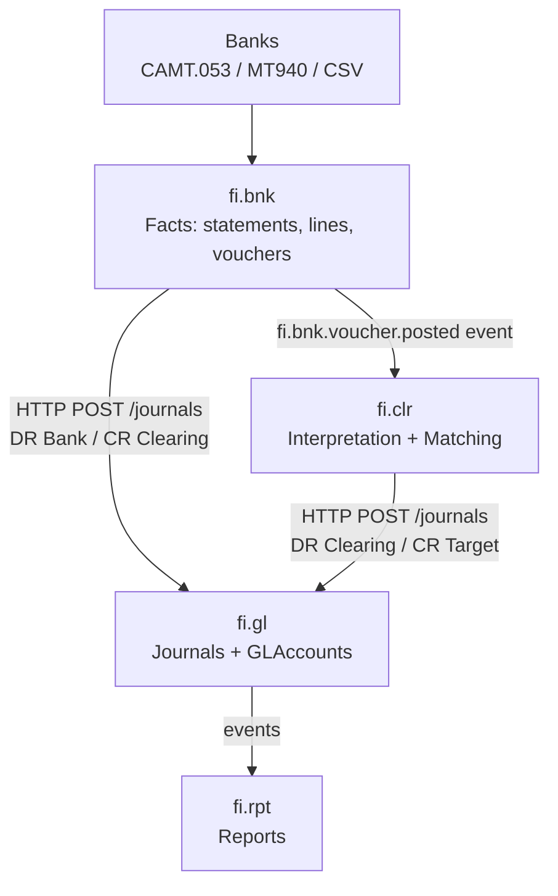
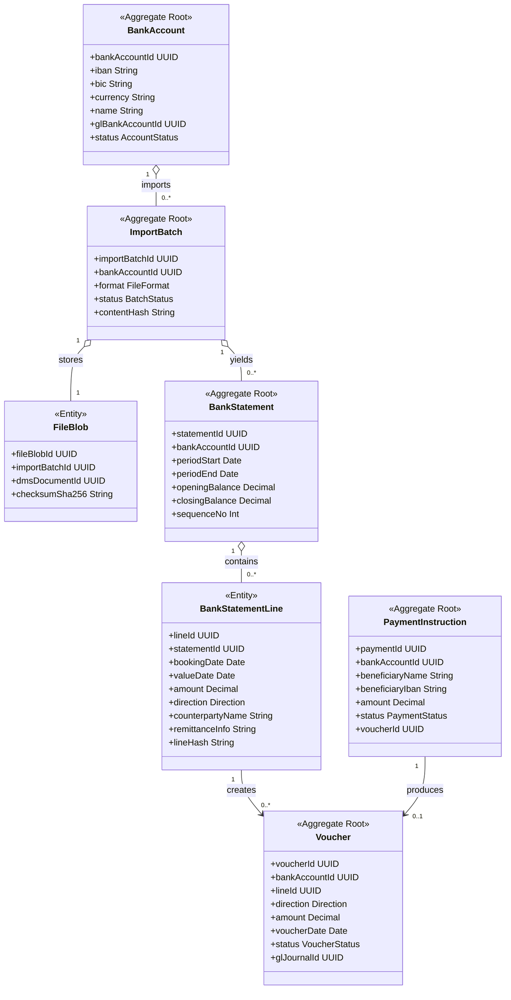
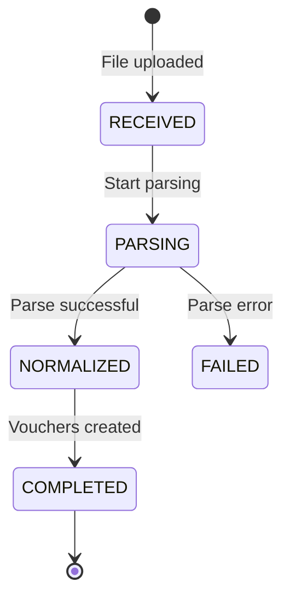
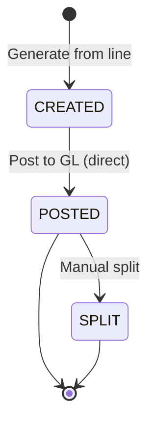
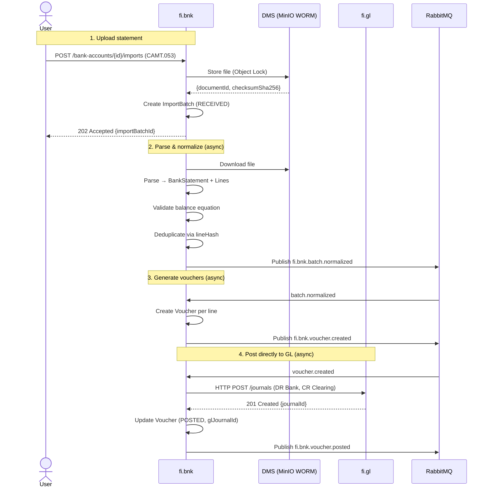
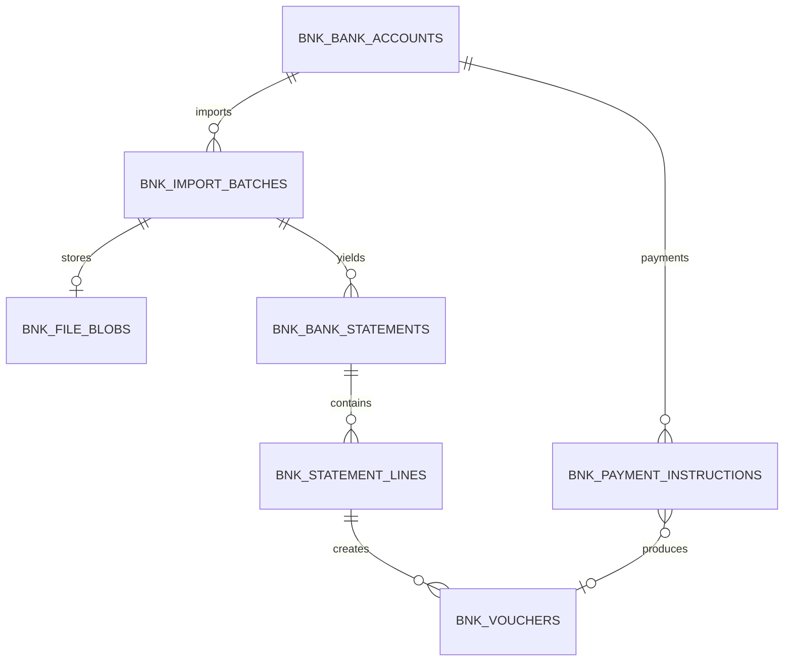

<!-- TEMPLATE COMPLIANCE: ~60%
Missing sections: §2 (Service Identity), §11 (Feature Dependencies), §12 (Extension Points)
Renumbering needed: §3 -> §5 (Use Cases), §5 -> §6 (REST API), §6 -> §7 (Events), §7 -> §8 (Data Model), §8 -> §9 (Security), §9 -> §10 (Quality), §10 -> §13 (Migration), §11 -> §14 (Decisions), §12 -> §15 (Appendix)
Action needed: Add Meta header block (Conceptual Stack Layer, Bounded Context Ref, basePackage, Port, Repository, Tags, Team), add Specification Guidelines Compliance block, add §2 Service Identity, renumber §3-§12 to match template §4-§15, add §11 Feature Dependencies stub, add §12 Extension Points stub
-->
# fi.bnk — Banking (Bank Facts & Statement Import) Domain Specification

> **Meta Information**
> - **Version:** 2026-02-24 (v3.0)
> - **Template:** `domain-service-spec.md` v1.0.0
> - **Template Compliance:** ~60% — §2, §11, §12 missing
> - **Author(s):** OpenLeap Architecture Team
> - **Status:** DRAFT
> - **Suite:** `fi`
> - **Domain:** `bnk`
> - **Service Name:** `fi-bnk-svc`

---

## 0. Document Purpose & Scope

### 0.1 Purpose

This document specifies the **Banking (fi.bnk)** domain, which is the **system of record for bank statement facts** (files → statements → lines → vouchers). fi.bnk imports bank statements, normalizes them, creates accounting vouchers, and posts initial bank journals directly to fi.gl.

**v3.0 Posting Architecture:** fi.bnk is a **direct-posting domain** — it posts balanced journals directly to fi.gl via HTTP POST, without going through fi.slc. This is because bank statements are externally reconciled data (the bank IS the subledger), so no internal subledger layer is needed.

**Key Principle:** fi.bnk stores **facts only**. Matching, allocation, and interpretation of bank transactions are the exclusive responsibility of fi.clr (Clearing & Matching).

### 0.2 Target Audience
- Product Owners & Business Stakeholders (Finance, Treasury, Accounting)
- System Architects & Technical Leads
- Integration Engineers
- Accountants and Cash Management Teams
- External Auditors

### 0.3 Scope

**In Scope:**
- Import & normalize bank statements (CAMT.053, MT940, CSV)
- WORM storage of raw files via DMS (hashes, parser versions)
- Statement validation: opening + Σ(lines) = closing, sequence/gap checks
- Bank vouchers derived from statement lines
- **Direct GL posting** of initial bank journals:
  - Inbound: DR Bank / CR Clearing.Unassigned
  - Outbound: DR Clearing.Outbox / CR Bank
- Payment instruction tracking (execution tracking only)

**Out of Scope:**
- Matching/allocation to AR/AP → `fi.clr`
- Subledger open items → `fi.ar`, `fi.ap`
- Subledger bookkeeping, posting rules → `fi.slc` (fi.bnk does NOT use fi.slc)
- Journals, balances, periods, GLAccount lifecycle → `fi.gl`
- Bank↔GL reconciliation reports → `fi.rpt`

### 0.4 Related Documents
- `_fi_suite.md` — FI Suite architecture overview
- `fi_gl.md` — General Ledger specification
- `fi_clr.md` — Clearing & Matching
- `fi_slc.md` — Subledger Core (fi.bnk does NOT use fi.slc)
- `fi_ar.md` — Accounts Receivable
- `fi_ap.md` — Accounts Payable
- `Audit_Tracing_spec.md` — End-to-end audit trail
- `DMS_Spec_MinIO.md` — Document Management Service (WORM storage)

---

## 1. Business Context

### 1.1 Domain Purpose

**fi.bnk** bridges the gap between bank transactions (the external reality) and the accounting system (the internal reality), ensuring every euro/dollar that moves through bank accounts is properly recorded in the General Ledger.

**Core Business Problems Solved:**
- **Bank Statement Processing:** Automate import and normalization of bank files
- **Cash Visibility:** Real-time view of bank balances and transactions
- **Reconciliation Foundation:** Ensure bank balance = GL bank account balance
- **Audit Trail:** Complete traceability from bank file to GL journal
- **Payment Tracking:** Track outgoing payments from instruction to execution
- **Fraud Detection:** Detect duplicate imports, unexpected transactions

### 1.2 Business Value

**For the Organization:**
- **Automation:** Eliminate manual bank statement entry (save 80%+ of time)
- **Accuracy:** Prevent data entry errors, ensure all transactions captured
- **Speed:** Real-time bank balance visibility (was: next-day reconciliation)
- **Compliance:** Complete audit trail meets SOX/IFRS requirements

**For Users:**
- **Accountant:** Auto-import bank statements, one-click voucher generation
- **Treasurer:** Real-time cash position across all bank accounts
- **Controller:** Automated bank-to-GL reconciliation foundation
- **Auditor:** Complete trace from bank file to GL journal entry

### 1.3 Key Stakeholders

| Role | Responsibility | Primary Use Cases |
|------|----------------|-------------------|
| Accountant | Daily bank processing | Import statements, create vouchers, post to GL |
| Treasurer | Cash management | Monitor balances, track payments |
| Controller | Month-end close | Bank reconciliation, investigate variances |
| Payment Manager | Payment execution | Create payment instructions, track execution |
| External Auditor | Financial audit | Verify bank statement trail to GL |

### 1.4 Strategic Positioning

fi.bnk sits at the **boundary between external banking systems and the FI suite**. It is a **facts-only** service that converts raw bank files into structured, auditable accounting data.

**Two posting paths exist in the FI suite. fi.bnk uses the direct path:**
1. **Direct to fi.gl** (fi.bnk, fi.clr): Bank/Clearing → fi.gl (no subledger needed)
2. **Via fi.slc** (fi.ar, fi.ap, fi.fa): Subledger domains → fi.slc → fi.gl



**Key v3.0 Insights:**
- **fi.bnk posts directly to fi.gl** — bank is externally reconciled, no subledger layer needed
- **fi.bnk does NOT use fi.slc** — no posting rules or subledger accounts involved
- **fi.bnk stores facts only** — matching/allocation is fi.clr's responsibility
- **fi.clr also posts directly to fi.gl** — reclassification journals go straight to GL

---

## 2. Domain Model

### 2.1 Conceptual Overview

The fi.bnk domain model captures the full lifecycle of bank statement processing:

1. **BankAccount:** Company bank account configuration with GL mapping
2. **ImportBatch → FileBlob:** Import tracking and WORM file storage
3. **BankStatement → BankStatementLine:** Structured bank data
4. **Voucher:** Accounting-ready entry for GL posting
5. **PaymentInstruction:** Outgoing payment tracking

**Key Principles:**
- **Append-Only:** Bank lines and vouchers are immutable once created
- **Facts Only:** No matching state, no interpretation, no targetRef
- **WORM Storage:** Original bank files stored immutably in DMS/MinIO
- **Deduplication:** Content hash (files) and line hash (transactions) prevent duplicates

### 2.2 Core Concepts



### 2.3 Aggregate Definitions

#### 2.3.1 BankAccount

**Business Purpose:** Represents a company bank account. Links to GL Bank Account for posting.

**Key Attributes:**

| Attribute | Type | Description | Constraints |
|-----------|------|-------------|-------------|
| bankAccountId | UUID | Unique identifier | Required, immutable, PK |
| tenantId | UUID | Tenant ownership | Required, immutable |
| iban | String | International Bank Account Number | Required, unique per tenant |
| bic | String | Bank Identifier Code | Optional |
| currency | String | Account currency | Required, ISO 4217 |
| name | String | Account name | Required |
| glBankAccountId | UUID | GL account mapping | Required, FK to fi.gl GLAccounts |
| glClearingAccountId | UUID | Clearing interim account | Required, FK to fi.gl GLAccounts |
| status | AccountStatus | Current state | Required, enum(ACTIVE, INACTIVE) |

**Business Rules:**
1. **BR-ACC-001: IBAN Uniqueness** — IBAN unique per tenant
2. **BR-ACC-002: GL Mapping** — glBankAccountId must reference valid, ACTIVE GL account of type ASSET

---

#### 2.3.2 ImportBatch

**Business Purpose:** Represents a bank statement file import. Tracks parsing progress.

**Key Attributes:**

| Attribute | Type | Description | Constraints |
|-----------|------|-------------|-------------|
| importBatchId | UUID | Unique identifier | Required, immutable, PK |
| tenantId | UUID | Tenant ownership | Required, immutable |
| bankAccountId | UUID | Target bank account | Required, FK |
| format | FileFormat | File format | Required, enum(CAMT053, MT940, CSV) |
| status | BatchStatus | Current state | Required, enum(RECEIVED, PARSING, NORMALIZED, COMPLETED, FAILED) |
| contentHash | String | SHA-256 of file | Required, deduplication |

**Lifecycle:**



**Business Rules:**
1. **BR-BATCH-001: Content Hash Uniqueness** — contentHash unique per (tenant, bankAccount)
2. **BR-BATCH-002: Status Monotonicity** — Status only progresses forward

---

#### 2.3.3 BankStatement

**Business Purpose:** Represents a bank statement for a period. Contains opening/closing balance.

**Key Attributes:**

| Attribute | Type | Description | Constraints |
|-----------|------|-------------|-------------|
| statementId | UUID | Unique identifier | Required, immutable, PK |
| importBatchId | UUID | Source import | Required, FK |
| bankAccountId | UUID | Bank account | Required, FK |
| periodStart | Date | Statement start | Required |
| periodEnd | Date | Statement end | Required, >= periodStart |
| openingBalance | Decimal | Balance at start | Required |
| closingBalance | Decimal | Balance at end | Required |
| sequenceNo | Int | Statement sequence | Optional, monotonic per account |

**Business Rules:**
1. **BR-STMT-001: Balance Equation** — closingBalance = openingBalance + Σ(credits) - Σ(debits)
2. **BR-STMT-002: Sequence Monotonicity** — sequenceNo increases monotonically per bank account

---

#### 2.3.4 BankStatementLine

**Business Purpose:** Individual bank transaction. Core unit for voucher creation. Immutable once created.

**Key Attributes:**

| Attribute | Type | Description | Constraints |
|-----------|------|-------------|-------------|
| lineId | UUID | Unique identifier | Required, immutable, PK |
| statementId | UUID | Parent statement | Required, FK |
| bookingDate | Date | Transaction booking date | Required |
| valueDate | Date | Value date | Required |
| amount | Decimal | Transaction amount | Required, > 0 |
| direction | Direction | CREDIT or DEBIT | Required, enum(CREDIT, DEBIT) |
| counterpartyName | String | Other party name | Optional |
| counterpartyIban | String | Other party IBAN | Optional |
| remittanceInfo | String | Payment reference | Optional, searchable |
| endToEndId | String | End-to-end ID | Optional |
| lineHash | String | Hash of key fields | Required, deduplication |
| duplicateOfLineId | UUID | If duplicate, reference to original | Optional, FK |
| rawJson | JSONB | Original parsed data | Required, audit |

**Business Rules:**
1. **BR-LINE-001: Line Hash Uniqueness** — lineHash unique per (tenant, bankAccount)
2. **BR-LINE-002: Direction Consistency** — CREDIT increases bank balance, DEBIT decreases

---

#### 2.3.5 Voucher

**Business Purpose:** Accounting-ready entry from bank line. Source for direct GL posting.

**Key Attributes:**

| Attribute | Type | Description | Constraints |
|-----------|------|-------------|-------------|
| voucherId | UUID | Unique identifier | Required, immutable, PK |
| tenantId | UUID | Tenant ownership | Required, immutable |
| bankAccountId | UUID | Bank account | Required, FK |
| lineId | UUID | Source bank line | Optional, FK |
| direction | Direction | IN (credit) or OUT (debit) | Required, enum(IN, OUT) |
| amount | Decimal | Transaction amount | Required, > 0 |
| currency | String | Transaction currency | Required, ISO 4217 |
| voucherDate | Date | Accounting date | Required |
| status | VoucherStatus | Current state | Required, enum(CREATED, POSTED, SPLIT) |
| glJournalId | UUID | Posted GL journal reference | Optional, set when POSTED |
| notes | String | Manual operator notes | Optional |

**Lifecycle:**



**v3.0 Changes (vs. v2.1):**
- **Removed:** `matchConfidence`, `targetRef` — matching state lives exclusively in fi.clr
- **Removed:** VoucherStatus `MATCHED` — matching is fi.clr's responsibility
- **Changed:** Posting goes **directly to fi.gl** (was: via fi.pst)

**Business Rules:**
1. **BR-VCH-001: Idempotency** — Unique constraint on (lineId, direction, amount, currency)
2. **BR-VCH-002: Direction Posting** — IN → DR Bank / CR Clearing.Unassigned; OUT → DR Clearing.Outbox / CR Bank

---

#### 2.3.6 PaymentInstruction

**Business Purpose:** Outgoing payment instruction (vendor payment, salary). Creates Outbox voucher.

**Key Attributes:**

| Attribute | Type | Description | Constraints |
|-----------|------|-------------|-------------|
| paymentId | UUID | Unique identifier | Required, immutable, PK |
| bankAccountId | UUID | Source bank account | Required, FK |
| beneficiaryName | String | Payee name | Required |
| beneficiaryIban | String | Payee IBAN | Required |
| amount | Decimal | Payment amount | Required, > 0 |
| status | PaymentStatus | Current state | Required, enum(CREATED, POSTED, EXECUTED, CANCELLED) |
| voucherId | UUID | Outbox voucher | Optional, FK |
| sourceDocumentRef | String | Source (e.g., "ap.bill.uuid") | Optional |

---

## 3. Business Processes & Use Cases

### 3.1 Primary Use Cases

#### UC-001: Import Bank Statement

**Actor:** Accountant

**Main Flow:**
1. User uploads CAMT.053/MT940/CSV file (POST /bank-accounts/{id}/imports)
2. System stores file in DMS (MinIO Object Lock / WORM)
3. System creates ImportBatch (status = RECEIVED)
4. System checks contentHash for duplicate → 409 if duplicate
5. Async: Parse file, create BankStatement + Lines, validate balance equation
6. System deduplicates via lineHash
7. System updates ImportBatch status = NORMALIZED
8. System publishes fi.bnk.batch.normalized event

**Business Rules Applied:** BR-BATCH-001, BR-STMT-001, BR-LINE-001

---

#### UC-002: Generate Vouchers

**Actor:** fi.bnk (automated, triggered by batch.normalized)

**Main Flow:**
1. For each non-duplicate BankStatementLine:
   - Determine direction: CREDIT → IN, DEBIT → OUT
   - Create Voucher (status = CREATED)
   - Check idempotency (lineId, direction, amount, currency)
2. Publish fi.bnk.voucher.created for each voucher
3. Update ImportBatch status = COMPLETED

---

#### UC-003: Post Initial GL Entry (Direct to fi.gl)

**Actor:** fi.bnk (automated, triggered by voucher.created)

**Main Flow:**
1. System determines posting based on direction:
   - IN: DR Bank (glBankAccountId) / CR Clearing.Unassigned
   - OUT: DR Clearing.Outbox / CR Bank (glBankAccountId)
2. System calls **fi.gl POST /journals** directly:
   ```json
   {
     "source": "fi.bnk",
     "sourceDocumentId": "voucher-uuid",
     "idempotencyKey": "fi.bnk|voucher-uuid|gl-post",
     "postingDate": "2025-10-16",
     "lines": [
       {"accountId": "bank-gl-account-uuid", "debitAmount": "1000.00", "creditAmount": "0.00", "currency": "EUR"},
       {"accountId": "clearing-gl-account-uuid", "debitAmount": "0.00", "creditAmount": "1000.00", "currency": "EUR"}
     ]
   }
   ```
3. fi.gl validates, persists, returns journalId
4. System updates Voucher: status = POSTED, glJournalId = journalId
5. System publishes fi.bnk.voucher.posted event

**Postconditions:** GL journal created, clearing account loaded, ready for fi.clr matching.

---

### 3.2 Process Flow Diagrams

#### Process: Statement Import to GL Posting



### 3.3 Cross-Domain Workflows

**Does this domain participate in multi-service workflows?** [X] YES

#### Workflow: Bank Payment to AR Clearing

**Orchestration Pattern:** [X] Choreography (EDA)

1. fi.bnk imports statement, creates voucher, posts DR Bank / CR Clearing to fi.gl
2. fi.bnk publishes fi.bnk.voucher.posted event
3. fi.clr consumes event, matches to open AR invoice
4. fi.clr posts reclassification DR Clearing / CR Receivables directly to fi.gl
5. fi.clr persists MatchGroup (audit link)

---

## 4. Business Rules & Constraints

### 4.1 Business Rules Catalog

| ID | Rule Name | Description | Scope | Enforcement |
|----|-----------|-------------|-------|-------------|
| BR-ACC-001 | IBAN Uniqueness | IBAN unique per tenant | BankAccount | Create |
| BR-ACC-002 | GL Mapping | glBankAccountId must be valid GL account | BankAccount | Create |
| BR-BATCH-001 | Content Hash Uniqueness | Prevent duplicate imports | ImportBatch | Create |
| BR-BATCH-002 | Status Monotonicity | Status only progresses forward | ImportBatch | Update |
| BR-STMT-001 | Balance Equation | Closing = Opening + Credits - Debits | BankStatement | Validate |
| BR-STMT-002 | Sequence Monotonicity | sequenceNo increases | BankStatement | Create |
| BR-LINE-001 | Line Hash Uniqueness | Detect duplicate lines | BankStatementLine | Create |
| BR-LINE-002 | Direction Consistency | CREDIT increases bank balance | BankStatementLine | Create |
| BR-VCH-001 | Idempotency | Unique voucher per line | Voucher | Create |
| BR-VCH-002 | Direction Posting | IN → DR Bank/CR Clearing; OUT → DR Clearing/CR Bank | Voucher | Post |

---

## 5. API Contracts

### 5.1 API Overview

**Base Path:** `/api/fi/bnk/v1`

**Authentication:** OAuth 2.0 Bearer Token

**Content Type:** `application/json`, `multipart/form-data` (imports)

### 5.2 Resource Operations

#### 5.2.1 Bank Accounts

- `GET /bank-accounts` — List bank accounts (filter: status, currency)
- `POST /bank-accounts` — Create bank account
- `GET /bank-accounts/{id}` — Get bank account
- `PATCH /bank-accounts/{id}` — Update bank account

#### 5.2.2 Statement Import

- `POST /bank-accounts/{id}/imports` — Import bank statement (multipart/form-data)
  - Response: `202 Accepted {importBatchId}`
- `GET /imports/{importBatchId}` — Get import batch status

#### 5.2.3 Statements & Lines

- `GET /statements` — List statements (filter: bankAccountId, fromDate, toDate)
- `GET /statements/{statementId}/lines` — Get lines (search: remittanceInfo full-text)

#### 5.2.4 Vouchers

- `GET /vouchers` — List vouchers (filter: bankAccountId, status, fromDate, toDate)
- `POST /vouchers/{voucherId}/notes` — Add operator notes
- `POST /vouchers/{voucherId}/hints` — Submit matching hint to fi.clr (emits event only)

#### 5.2.5 Payment Instructions

- `POST /payment-instructions` — Create payment instruction
- `GET /payment-instructions` — List instructions (filter: status, bankAccountId)
- `GET /payment-instructions/{id}` — Get instruction details

### 5.3 Error Responses

| HTTP Status | Error Code | Description |
|-------------|------------|-------------|
| 400 | INVALID_FILE_FORMAT | File format not supported |
| 400 | BALANCE_EQUATION_FAILED | Statement closing balance incorrect |
| 409 | DUPLICATE_IMPORT | Import with same contentHash already exists |
| 422 | PARSE_ERROR | Failed to parse CAMT/MT940 file |
| 404 | BANK_ACCOUNT_NOT_FOUND | Bank account does not exist |

---

## 6. Events & Integration

### 6.1 Event-Driven Architecture Pattern

**Pattern Used:** Event-Driven Architecture (Choreography) + Synchronous HTTP for GL posting

**Rationale:** fi.bnk publishes events for downstream consumers (fi.clr, fi.rpt). GL posting is synchronous HTTP to fi.gl to guarantee journalId confirmation.

### 6.2 Published Events

**Exchange:** `fi.bnk.events` (RabbitMQ topic exchange)

| Event | Routing Key | When | Consumers |
|-------|-------------|------|-----------|
| batch.normalized | fi.bnk.batch.normalized | Statement parsed | fi.bnk (internal), fi.rpt |
| voucher.created | fi.bnk.voucher.created | Voucher generated | fi.bnk (internal GL posting) |
| voucher.posted | fi.bnk.voucher.posted | GL journal created | fi.clr (matching), fi.rpt |
| voucher.hintSubmitted | fi.bnk.voucher.hintSubmitted | Operator hint | fi.clr (optional) |
| statement.imported | fi.bnk.statement.imported | Statement stored | fi.rpt (monitoring) |
| payment.instructed | fi.bnk.payment.instructed | Payment instruction created | treasury |

### 6.3 Consumed Events

| Event | Source | Purpose | Handling |
|-------|--------|---------|----------|
| treasury.payment.executed | treasury | Mark payment as executed | Match instruction to bank line |
| fi.gl.period.closed | fi.gl | Prevent posting to closed period | Reject voucher posting |

### 6.4 Integration Points Summary

**Outbound Dependencies (Services that fi.bnk calls):**

| Service | Integration Type | Purpose |
|---------|------------------|---------|
| fi.gl | HTTP POST /journals | Post bank journals directly (DR Bank / CR Clearing) |
| DMS | HTTP POST/GET | Store/retrieve bank files (WORM) |

**Inbound Dependencies (Services that call fi.bnk):**

| Service | Integration Type | Purpose |
|---------|------------------|---------|
| fi.clr | HTTP GET /vouchers | Query posted vouchers for matching |
| fi.rpt | Events | Track bank transactions for reporting |

---

## 7. Data Model

### 7.1 Conceptual Data Model



### 7.2 Storage Schema (PostgreSQL)

**Schema:** `fi_bnk`

#### Table: bnk_bank_accounts
```sql
CREATE TABLE fi_bnk.bnk_bank_accounts (
  bank_account_id UUID PRIMARY KEY,
  tenant_id UUID NOT NULL,
  iban VARCHAR(34) NOT NULL,
  bic VARCHAR(11),
  currency CHAR(3) NOT NULL,
  name VARCHAR(200) NOT NULL,
  gl_bank_account_id UUID NOT NULL,
  gl_clearing_account_id UUID NOT NULL,
  status VARCHAR(20) NOT NULL DEFAULT 'ACTIVE',
  posting_enabled BOOLEAN NOT NULL DEFAULT TRUE,
  import_enabled BOOLEAN NOT NULL DEFAULT TRUE,
  created_at TIMESTAMP NOT NULL DEFAULT NOW(),
  updated_at TIMESTAMP,
  UNIQUE (tenant_id, iban),
  CHECK (status IN ('ACTIVE', 'INACTIVE'))
);
```

#### Table: bnk_import_batches
```sql
CREATE TABLE fi_bnk.bnk_import_batches (
  import_batch_id UUID PRIMARY KEY,
  tenant_id UUID NOT NULL,
  bank_account_id UUID NOT NULL REFERENCES fi_bnk.bnk_bank_accounts(bank_account_id),
  format VARCHAR(20) NOT NULL,
  status VARCHAR(20) NOT NULL DEFAULT 'RECEIVED',
  content_hash VARCHAR(64) NOT NULL,
  parser_version VARCHAR(50),
  error_message TEXT,
  received_at TIMESTAMP NOT NULL DEFAULT NOW(),
  normalized_at TIMESTAMP,
  UNIQUE (tenant_id, bank_account_id, content_hash),
  CHECK (status IN ('RECEIVED', 'PARSING', 'NORMALIZED', 'COMPLETED', 'FAILED')),
  CHECK (format IN ('CAMT053', 'MT940', 'CSV'))
);
```

#### Table: bnk_file_blobs
```sql
CREATE TABLE fi_bnk.bnk_file_blobs (
  file_blob_id UUID PRIMARY KEY,
  import_batch_id UUID NOT NULL REFERENCES fi_bnk.bnk_import_batches(import_batch_id) ON DELETE CASCADE,
  dms_document_id UUID NOT NULL,
  filename VARCHAR(255) NOT NULL,
  content_type VARCHAR(100) NOT NULL,
  size BIGINT NOT NULL,
  checksum_sha256 VARCHAR(64) NOT NULL,
  received_at TIMESTAMP NOT NULL DEFAULT NOW(),
  UNIQUE (checksum_sha256)
);
```

#### Table: bnk_bank_statements
```sql
CREATE TABLE fi_bnk.bnk_bank_statements (
  statement_id UUID PRIMARY KEY,
  import_batch_id UUID NOT NULL REFERENCES fi_bnk.bnk_import_batches(import_batch_id),
  bank_account_id UUID NOT NULL REFERENCES fi_bnk.bnk_bank_accounts(bank_account_id),
  period_start DATE NOT NULL,
  period_end DATE NOT NULL,
  opening_balance NUMERIC(19,4) NOT NULL,
  closing_balance NUMERIC(19,4) NOT NULL,
  currency CHAR(3) NOT NULL,
  sequence_no INT,
  status VARCHAR(20) NOT NULL DEFAULT 'IMPORTED',
  UNIQUE (bank_account_id, sequence_no),
  CHECK (period_end >= period_start),
  CHECK (status IN ('IMPORTED', 'VOUCHERED'))
);
```

#### Table: bnk_statement_lines
```sql
CREATE TABLE fi_bnk.bnk_statement_lines (
  line_id UUID PRIMARY KEY,
  statement_id UUID NOT NULL REFERENCES fi_bnk.bnk_bank_statements(statement_id) ON DELETE CASCADE,
  bank_account_id UUID NOT NULL REFERENCES fi_bnk.bnk_bank_accounts(bank_account_id),
  booking_date DATE NOT NULL,
  value_date DATE NOT NULL,
  amount NUMERIC(19,4) NOT NULL,
  currency CHAR(3) NOT NULL,
  direction VARCHAR(10) NOT NULL,
  counterparty_name VARCHAR(200),
  counterparty_iban VARCHAR(34),
  remittance_info TEXT,
  purpose_code VARCHAR(20),
  end_to_end_id VARCHAR(100),
  line_hash VARCHAR(64) NOT NULL,
  duplicate_of_line_id UUID REFERENCES fi_bnk.bnk_statement_lines(line_id),
  raw_json JSONB NOT NULL,
  created_at TIMESTAMP NOT NULL DEFAULT NOW(),
  UNIQUE (bank_account_id, line_hash),
  CHECK (direction IN ('CREDIT', 'DEBIT')),
  CHECK (amount > 0)
);

CREATE INDEX idx_lines_search ON fi_bnk.bnk_statement_lines USING gin(to_tsvector('english', remittance_info));
```

#### Table: bnk_vouchers
```sql
CREATE TABLE fi_bnk.bnk_vouchers (
  voucher_id UUID PRIMARY KEY,
  tenant_id UUID NOT NULL,
  source VARCHAR(20) NOT NULL DEFAULT 'BANK',
  bank_account_id UUID NOT NULL REFERENCES fi_bnk.bnk_bank_accounts(bank_account_id),
  line_id UUID REFERENCES fi_bnk.bnk_statement_lines(line_id),
  direction VARCHAR(10) NOT NULL,
  amount NUMERIC(19,4) NOT NULL,
  currency CHAR(3) NOT NULL,
  voucher_date DATE NOT NULL,
  status VARCHAR(20) NOT NULL DEFAULT 'CREATED',
  gl_journal_id UUID,
  notes TEXT,
  created_at TIMESTAMP NOT NULL DEFAULT NOW(),
  posted_at TIMESTAMP,
  UNIQUE (line_id, direction, amount, currency),
  CHECK (direction IN ('IN', 'OUT')),
  CHECK (status IN ('CREATED', 'POSTED', 'SPLIT')),
  CHECK (amount > 0)
);
```

#### Table: bnk_payment_instructions
```sql
CREATE TABLE fi_bnk.bnk_payment_instructions (
  payment_id UUID PRIMARY KEY,
  tenant_id UUID NOT NULL,
  bank_account_id UUID NOT NULL REFERENCES fi_bnk.bnk_bank_accounts(bank_account_id),
  beneficiary_name VARCHAR(200) NOT NULL,
  beneficiary_iban VARCHAR(34) NOT NULL,
  amount NUMERIC(19,4) NOT NULL,
  currency CHAR(3) NOT NULL,
  requested_date DATE NOT NULL,
  status VARCHAR(20) NOT NULL DEFAULT 'CREATED',
  execution_ref VARCHAR(100),
  voucher_id UUID REFERENCES fi_bnk.bnk_vouchers(voucher_id),
  source_document_ref VARCHAR(200),
  created_at TIMESTAMP NOT NULL DEFAULT NOW(),
  CHECK (status IN ('CREATED', 'POSTED', 'EXECUTED', 'CANCELLED')),
  CHECK (amount > 0)
);
```

#### Table: bnk_outbox
```sql
CREATE TABLE fi_bnk.bnk_outbox (
  outbox_id UUID PRIMARY KEY,
  aggregate_type VARCHAR(50) NOT NULL,
  aggregate_id UUID NOT NULL,
  event_type VARCHAR(100) NOT NULL,
  payload JSONB NOT NULL,
  routing_key VARCHAR(200) NOT NULL,
  created_at TIMESTAMP NOT NULL DEFAULT NOW(),
  processed_at TIMESTAMP,
  retry_count INT NOT NULL DEFAULT 0,
  last_error TEXT
);
```

### 7.3 Reference Data Dependencies

| Catalog | Source Service | Fields Referencing | Validation |
|---------|----------------|-------------------|------------|
| currencies | ref-data-svc | currency fields | Must exist and be active |
| GLAccounts | fi.gl | glBankAccountId, glClearingAccountId | Must be ACTIVE |

---

## 8. Security & Compliance

### 8.1 Data Classification

| Data Element | Classification | Protection |
|--------------|----------------|------------|
| IBAN, BIC | Confidential | Encryption, RBAC |
| Bank Balances | Confidential | Encryption, audit trail |
| Counterparty Names | PII | GDPR compliance |
| Bank Files | Highly Confidential | WORM storage, immutable |

### 8.2 Access Control

| Role | Read | Create | Update | Delete | Admin |
|------|------|--------|--------|--------|-------|
| BNK_VIEWER | ✓ (all) | ✗ | ✗ | ✗ | ✗ |
| BNK_IMPORTER | ✓ (imports) | ✓ (imports) | ✗ | ✗ | ✗ |
| BNK_ADMIN | ✓ (all) | ✓ (all) | ✓ (accounts) | ✗ | ✓ |

### 8.3 Compliance Requirements

- [X] SOX — Audit trail, immutability
- [X] GDPR — Right to erasure, data minimization
- [X] AML — Transaction monitoring

**Controls:**
1. **DMS WORM Storage:** Bank files stored with MinIO Object Lock (immutable)
2. **Audit Trail:** Complete trace from file to GL journal
3. **Retention:** Bank files retained 10 years
4. **Tamper Evidence:** SHA-256 verification via DMS

---

## 9. Quality Attributes

### 9.1 Performance Requirements

**Response Time (95th percentile):**
- POST /imports: < 200ms (file upload acknowledgment)
- GET /statements/{id}/lines: < 500ms (1K lines)
- GL posting (per voucher): < 150ms

**Throughput:**
- Statement import: 1,000 files/day
- Statement parsing: 10M lines/day

### 9.2 Availability & Reliability

**Availability Target:** 99.9%

**Recovery Objectives:**
- RTO: < 10 minutes
- RPO: < 5 minutes

---

## 10. Migration & Evolution

### 10.1 Data Migration

**From Legacy:**
- Export bank statements (last 12 months)
- Import via CSV format
- Create vouchers in POSTED status
- Link to existing GL journals

### 10.2 Deprecation & Sunset

| Feature | Deprecated Date | Removal Date | Alternative |
|---------|----------------|--------------|-------------|
| POST /recon-runs | v2.1 | Phase 2 | fi.rpt read models |
| fi.pst as posting intermediary | v3.0 | Immediate | fi.bnk posts directly to fi.gl |

---

## 11. Open Questions & Decisions

### 11.1 Open Questions

| ID | Question | Impact | Decision Needed By |
|----|----------|--------|---------------------|
| Q-001 | Should fi.bnk support real-time bank feeds (PSD2/API) in addition to file import? | Medium | Phase 2 |
| Q-002 | Should reconciliation features move entirely to fi.rpt or stay as raw measures in fi.bnk? | Low | Phase 2 |

### 11.2 Architectural Decision Records (ADRs)

#### ADR-001: Use DMS for WORM Storage of Bank Files

**Status:** Accepted

**Decision:** Store bank files in DMS (Document Management Service) with MinIO Object Lock instead of custom file storage.

**Consequences:** Battle-tested WORM, content-addressed storage, 10+ year retention, centralized document management.

---

#### ADR-002: Bank Facts Only — No Interpretation

**Status:** Accepted

**Decision:** fi.bnk stores facts only. No matching state, no matchConfidence, no targetRef. Matching lives exclusively in fi.clr.

**Consequences:** Clean separation of concerns. Operator hints emitted as events to fi.clr (non-authoritative).

---

#### ADR-003: fi.clr Owns Matching

**Status:** Accepted

**Decision:** All matching, allocation, and interpretation of bank vouchers is performed by fi.clr. fi.bnk creates vouchers and posts initial bank journals; fi.clr handles reclassification.

---

#### ADR-004: Direct GL Posting (fi.pst Deprecated)

**Status:** Accepted (v3.0)

**Context:** The v2.1 architecture routed all postings through fi.pst. After architectural review, fi.pst was deprecated (no domain model, pure technical routing). fi.bnk is a direct-posting domain because bank statements are externally reconciled — no subledger layer needed.

**Decision:** fi.bnk posts balanced journals directly to fi.gl via HTTP POST /journals. Idempotency is enforced via idempotency key in fi.gl (not a separate orchestrator).

**Consequences:**
- One fewer network hop (fi.bnk → fi.gl instead of fi.bnk → fi.pst → fi.gl)
- fi.gl's idempotency key handles duplicate prevention
- Consistent with Audit Tracing spec (which shows fi.bank → fi.acc direct path)

---

## 12. Appendix

### 12.1 Glossary

| Term | Definition |
|------|------------|
| CAMT.053 | ISO 20022 bank statement format (XML) |
| MT940 | SWIFT bank statement format (legacy) |
| WORM | Write-Once-Read-Many storage |
| Unassigned | Suspense/clearing account for unmatched inflows |
| Outbox | Liability account for payment instructions |
| Line Hash | SHA-256 hash of transaction key fields |
| Content Hash | SHA-256 hash of statement file |
| Direct Posting | fi.bnk posts to fi.gl without fi.slc intermediary |

### 12.2 Change Log

| Date | Version | Author | Changes |
|------|---------|--------|---------|
| 2026-01-19 | 2.1 | Architecture Team | v2.1 alignment, facts-only principle, fi.pst routing |
| 2026-02-24 | 3.0 | Architecture Team | fi.pst deprecated, direct GL posting, template compliance, voucher DDL cleaned |

---

## Document Review & Approval

**Status:** DRAFT

**Reviewers:**
- Product Owner (Finance): {Name} - {Date} - [ ] Approved
- System Architect: {Name} - {Date} - [ ] Approved
- Technical Lead (FI): {Name} - {Date} - [ ] Approved
