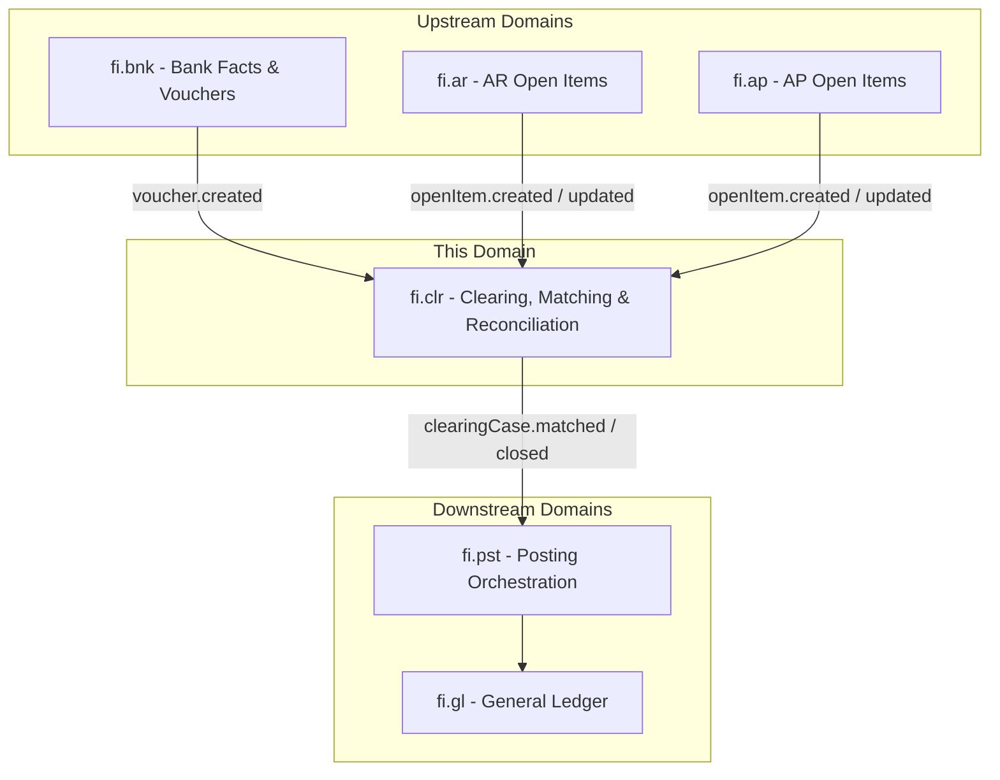
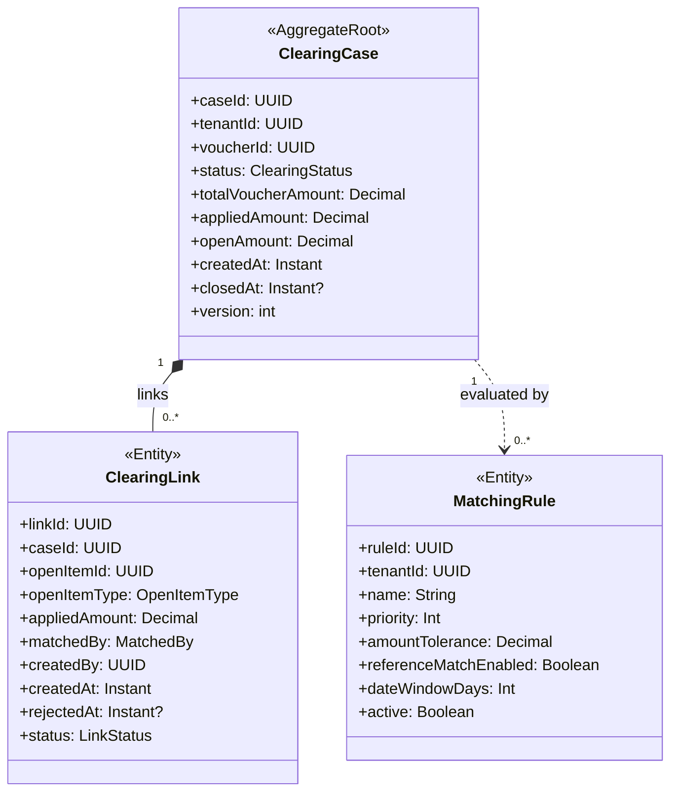
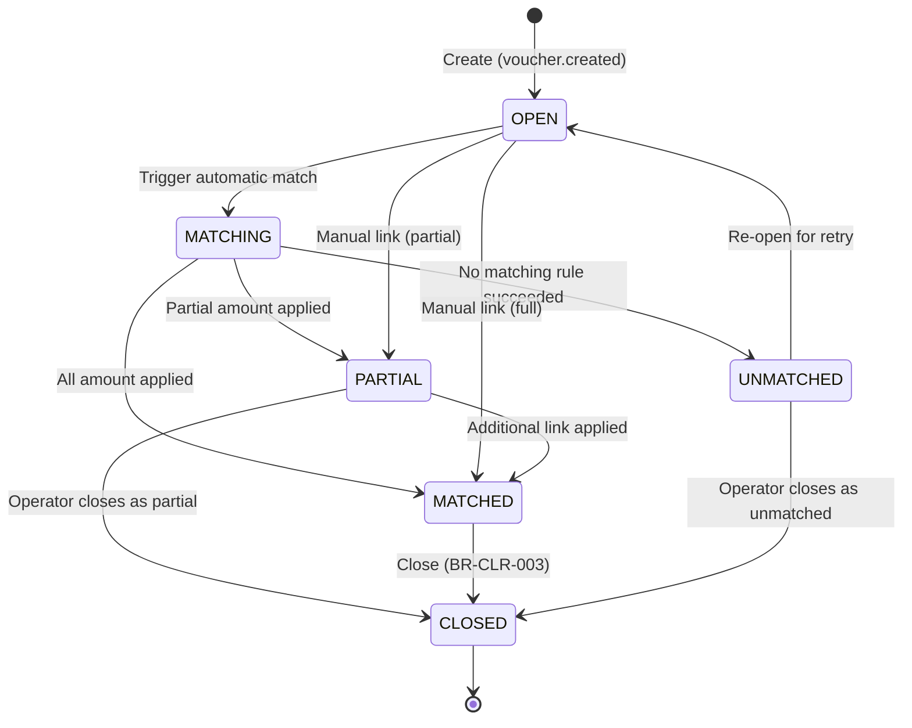
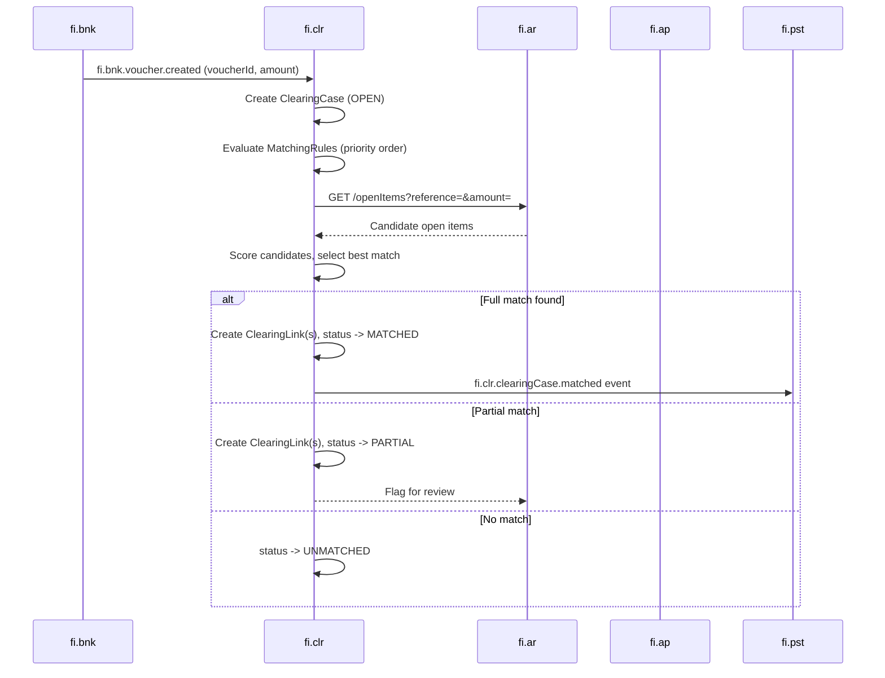
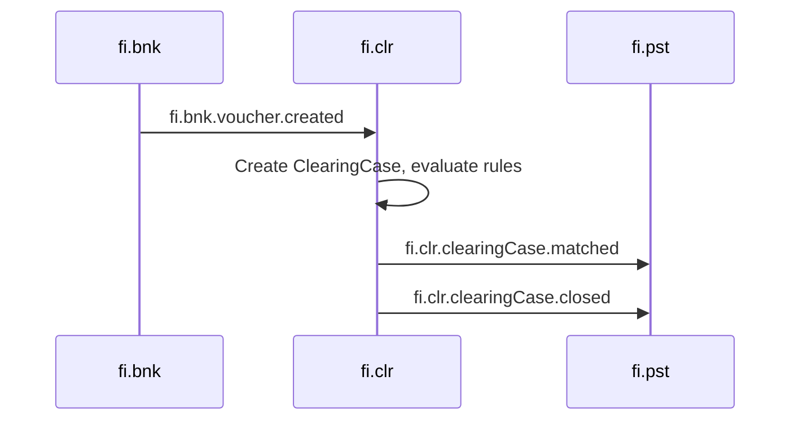
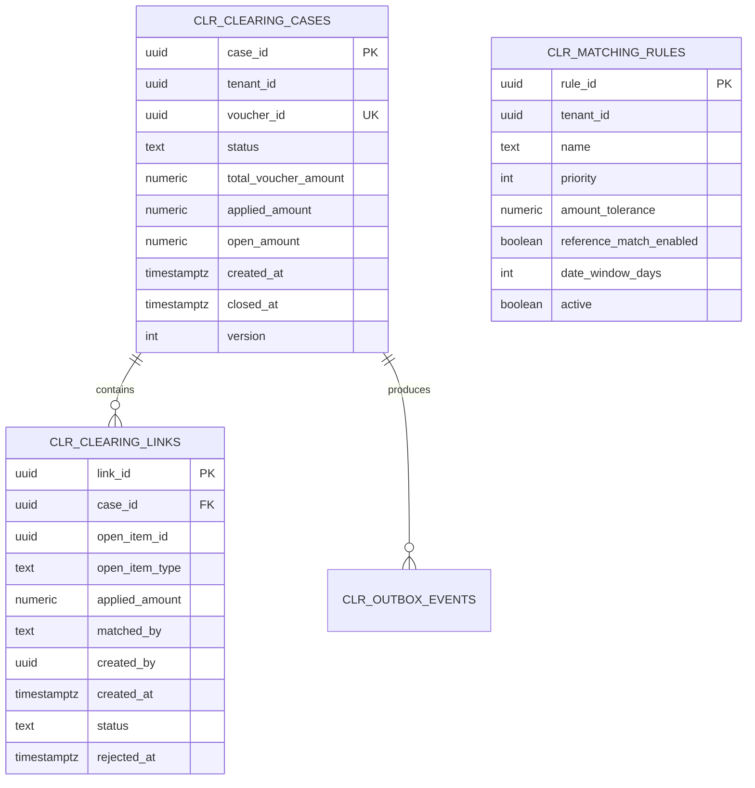

<!-- TEMPLATE COMPLIANCE: ~92%
All sections present per TPL-SVC v1.0.0: §0 Purpose/Scope, §1 Business Context, §2 Service Identity, §3 Domain Model (aggregate definitions, lifecycle, invariants), §4 Business Rules, §5 Use Cases (6 UCs), §6 REST API (endpoint table + examples), §7 Events (outbound schemas + inbound catalog), §8 Data Model (table-level), §9 Security (permission matrix), §10 Quality Attributes, §11 Feature Dependencies, §12 Extension Points, §13 Migration Notes, §14 Decisions & Open Questions, §15 Appendix
Minor gaps: Port and repository TBD (OPEN QUESTION)
-->
# FI.CLR - Clearing, Matching & Reconciliation Domain / Service Specification

> **Conceptual Stack Layer:** Domain / Service
> **Space:** Platform
> **Owner:** Domain Engineering Team
> **Schema alignment:** `service-layer.schema.json`
> **Companion files:** `openapi.yaml`, `*.schema.json` (event contracts)
> **Referenced by:** Platform-Feature Spec SS5 (backend dependencies), BFF Contract
> **Belongs to:** FI Suite Spec (`_fi_suite_v2_1.md`)

> **Meta Information**
> - **Version:** 2026-04-04
> - **Template:** `domain-service-spec.md` v1.0.0
> - **Template Compliance:** ~92%
> - **Author(s):** OpenLeap Architecture Team
> - **Status:** DRAFT
> - **Tier:** T3
> - **Suite:** `fi`
> - **Domain:** `clr`
> - **Bounded Context Ref:** `bc:clearing-reconciliation`
> - **Service ID:** `fi-clr-svc`
> - **basePackage:** `io.openleap.fi.clr`
> - **API Base Path:** `/api/fi/clr/v1`
> - **OpenLeap Starter Version:** `v1`
> - **Port:** OPEN QUESTION
> - **Repository:** OPEN QUESTION
> - **Tags:** `fi`, `clearing`, `matching`, `reconciliation`, `ar`, `ap`, `bank`
> - **Team:**
>   - Name: `team-fi`
>   - Email: `fi-team@openleap.io`
>   - Slack: `#fi-team`

---

## Specification Guidelines Compliance

> ### Non-Negotiables
> - Never invent facts. If required info is missing, add an **OPEN QUESTION** entry.
> - Preserve intent and decisions. Only change meaning when explicitly requested.
> - Do not remove normative constraints unless they are explicitly replaced.
> - Keep the spec **self-contained**: no "see chat", no implicit context.
>
> ### Source of Truth Priority
> When sources conflict:
> 1. Spec (explicit) wins
> 2. Starter specs (implementation constraints) next
> 3. Guidelines (best practices) last
>
> ### Style Guide
> - Prefer short sentences and lists.
> - Use MUST/SHOULD/MAY for normative statements.
> - Keep terminology consistent (Aggregate, Domain Service, Application Service, Command, Event).
> - Avoid ambiguous words ("often", "maybe") unless explicitly noting uncertainty.

---

## 0. Document Purpose & Scope

### 0.1 Purpose
`fi.clr` specifies the FI v2.1 domain for **clearing, matching, and reconciliation** across open items and bank statement facts. It receives vouchers produced by `fi.bnk` and links them to open items owned by `fi.ar` and `fi.ap`, reducing outstanding balances and producing auditable clearing outcomes. It is the domain that transforms raw bank activity into financial meaning within the FI suite.

### 0.2 Target Audience
- Finance Operations (AR/AP and Treasury)
- System Architects & Technical Leads
- Integration Engineers

### 0.3 Scope

**In Scope:**
- ClearingCase lifecycle management (create, match, partial match, close, unlink)
- Automatic matching of bank vouchers to AR/AP open items via configurable MatchingRules
- Manual override workflows: operator-driven link creation, rejection, and closure
- Clearing suggestions API (explainable matching candidates)
- Event-driven integration with `fi.bnk` (upstream) and `fi.pst` / `fi.ar` / `fi.ap` (downstream)

**Out of Scope:**
- Raw bank statement ingestion → `fi.bnk`
- Open item ownership and balance management → `fi.ar`, `fi.ap`
- Journal entry persistence and GL balances → `fi.gl`
- Posting orchestration → `fi.pst`
- Payment initiation → `fi.pay`

### 0.4 Terms & Acronyms
- **Voucher:** A normalized bank statement line "fact" created by `fi.bnk`.
- **Open Item:** An outstanding AR or AP balance (invoice, credit note) owned by `fi.ar` / `fi.ap`.
- **Clearing:** Linking a payment/credit voucher to an open item to reduce its outstanding balance.
- **ClearingCase:** The aggregate root representing a clearing attempt for one voucher.
- **ClearingLink:** An entity connecting a voucher to a specific open item with an applied amount.
- **MatchingRule:** A configurable rule that drives automatic voucher-to-open-item matching logic.
- **Reconciliation:** Verifying that subledger state (open items) matches bank facts (vouchers).

### 0.5 Related Documents
- Suite architecture: `T3_Domains/FI/_fi_suite_v2_1.md`
- Neighbor specs: `fi_bnk-spec.md`, `fi_ar-spec.md`, `fi_ap-spec.md`, `fi_pst-spec.md`, `fi_gl-spec.md`
- Platform architecture: [system-topology.md](https://github.com/openleap-io/io.openleap.dev.hub/blob/main/architecture/system-topology.md)

---

## 1. Business Context

### 1.1 Domain Purpose
`fi.clr` bridges **bank activity** and **open item balances**. When a customer pays an invoice, the payment arrives as a voucher in `fi.bnk`. `fi.clr` matches that voucher to the corresponding AR open item, producing a clearing outcome that drives balance reduction and audit trail. Without clearing, AR/AP open items accumulate regardless of actual payments received.

### 1.2 Business Value
- Automated matching reduces manual AR/AP reconciliation workload
- Accurate open item status enables correct aging reports and dunning decisions
- Full clearing audit trail supports financial audits and SOX compliance
- Partial match handling prevents stuck items and flags exceptions proactively
- Explainable matching suggestions accelerate operator review

### 1.3 Key Stakeholders

| Role | Responsibility | Primary Use Cases |
|------|----------------|-------------------|
| AR/AP Clerk | Review and approve automatic matches, handle exceptions | UC-CLR-001, UC-CLR-002, UC-CLR-005 |
| Finance Manager | Oversee clearing queue, approve partial matches | UC-CLR-004, UC-CLR-006 |
| Treasury | Monitor bank reconciliation completeness | UC-CLR-006 |
| System / Integration Engineer | Configure matching rules, monitor events | UC-CLR-001 |

### 1.4 Strategic Positioning



### 1.5 Service Context

| Field | Value |
|-------|-------|
| Suite | `fi` (Finance) |
| Domain | `clr` (Clearing, Matching & Reconciliation) |
| Bounded Context | `bc:clearing-reconciliation` |
| Service ID | `fi-clr-svc` |
| Base Package | `io.openleap.fi.clr` |
| Authoritative Sources | FI Suite Spec (`_fi_suite_v2_1.md`), SAP FI-GL clearing and reconciliation patterns |

---

## 2. Service Identity

| Field | Value |
|-------|-------|
| **Service ID** | `fi-clr-svc` |
| **Display Name** | Clearing, Matching & Reconciliation Service |
| **Suite** | `fi` |
| **Domain** | `clr` |
| **Bounded Context Ref** | `bc:clearing-reconciliation` |
| **Version** | 2026-04-04 |
| **Status** | DRAFT |
| **API Base Path** | `/api/fi/clr/v1` |
| **Repository** | OPEN QUESTION |
| **Tags** | `fi`, `clearing`, `matching`, `reconciliation`, `ar`, `ap`, `bank` |
| **Team Name** | `team-fi` |
| **Team Email** | `fi-team@openleap.io` |
| **Team Slack** | `#fi-team` |

---

## 3. Domain Model

### 3.1 Conceptual Overview

The domain centers on the **ClearingCase** aggregate — a clearing attempt for a single bank voucher. Each case contains one or more **ClearingLinks** connecting the voucher to specific AR/AP open items with an applied amount. **MatchingRules** configure automatic matching logic (amount tolerance, reference matching, date window). A case progresses from OPEN through matching states until it is MATCHED (fully cleared), PARTIAL (partially cleared), UNMATCHED (no match found), or CLOSED.



### 3.2 Core Concepts

| Concept | Owner | Description | Glossary Ref |
|---------|-------|-------------|--------------|
| ClearingCase | fi-clr-svc | Aggregate root representing a clearing attempt for one voucher | Clearing Case |
| ClearingLink | fi-clr-svc | Link connecting a voucher to a specific open item with an applied amount | Clearing Link |
| MatchingRule | fi-clr-svc | Configurable rule driving automatic voucher-to-open-item matching | Matching Rule |
| Voucher | fi.bnk | Normalized bank statement line fact (referenced by ID only) | Voucher |
| Open Item | fi.ar / fi.ap | Outstanding AR or AP balance (referenced by ID only) | Open Item |

### 3.3 Aggregate Definitions

#### 3.3.1 Aggregate: ClearingCase

**Aggregate ID:** `agg:clearing-case`
**Business Purpose:** Represents the full clearing lifecycle for a single bank voucher. Orchestrates matching rules evaluation, ClearingLink management, and clearing outcome determination.

**Aggregate Root Attributes:**

| Attribute | Type | Format | Required | Description | Example | Constraints |
|-----------|------|--------|----------|-------------|---------|-------------|
| caseId | UUID | uuid | Yes | Unique identifier | `c1b2-...` | Immutable after create, `OlUuid.create()` |
| tenantId | UUID | uuid | Yes | Tenant ownership | `t1-uuid` | Immutable, RLS-enforced |
| voucherId | UUID | uuid | Yes | Reference to fi.bnk voucher | `v1-uuid` | Immutable, unique per tenant (BR-CLR-007) |
| status | Enum | — | Yes | Lifecycle state | `OPEN` | OPEN, MATCHING, MATCHED, PARTIAL, UNMATCHED, CLOSED |
| totalVoucherAmount | Decimal | (18,4) | Yes | Full amount of the voucher | `1500.00` | > 0, set at create |
| appliedAmount | Decimal | (18,4) | Yes | Sum of active ClearingLink.appliedAmount | `1500.00` | >= 0, <= totalVoucherAmount |
| openAmount | Decimal | (18,4) | Yes | totalVoucherAmount - appliedAmount | `0.00` | Computed, >= 0 |
| createdAt | Timestamptz | ISO 8601 | Yes | Creation timestamp | `2026-04-01T10:00:00Z` | System-managed |
| closedAt | Timestamptz | ISO 8601 | No | Closure timestamp | `2026-04-01T11:00:00Z` | Set on CLOSED transition |
| version | Integer | — | Yes | Optimistic locking version | `1` | Auto-incremented |

**Lifecycle States:**



**State Transitions:**

| From | To | Trigger | Guard / Precondition | Side Effects |
|------|----|---------|---------------------|--------------|
| — | OPEN | `fi.bnk.voucher.created` event or REST POST | Valid voucherId, unique per tenant (BR-CLR-007) | — |
| OPEN | MATCHING | Automatic match triggered (UC-CLR-001) | MatchingRules exist and are active | Emits no event yet |
| MATCHING | MATCHED | All voucher amount applied | appliedAmount == totalVoucherAmount | Emits `clearingCase.matched` |
| MATCHING | PARTIAL | Partial amount applied | 0 < appliedAmount < totalVoucherAmount | Emits `clearingCase.partiallyMatched` |
| MATCHING | UNMATCHED | No rules produce a match | appliedAmount == 0 | Emits `clearingCase.unmatched` |
| OPEN/PARTIAL | MATCHED | Manual link closes full amount (UC-CLR-002) | appliedAmount == totalVoucherAmount | Emits `clearingCase.matched` |
| OPEN/PARTIAL | PARTIAL | Manual link (UC-CLR-002) | 0 < appliedAmount < totalVoucherAmount | Emits `clearingCase.partiallyMatched` |
| MATCHED/PARTIAL/UNMATCHED | CLOSED | Close command (UC-CLR-003) | At least one active link for MATCHED (BR-CLR-003) | Emits `clearingCase.closed` |
| CLOSED | — | — | MUST NOT reopen (BR-CLR-001) | — |

**Invariants:**
- INV-CLR-001: A CLOSED ClearingCase MUST NOT be reopened (BR-CLR-001)
- INV-CLR-002: appliedAmount MUST NOT exceed totalVoucherAmount (BR-CLR-002)
- INV-CLR-003: At least one active ClearingLink is required to close with status MATCHED (BR-CLR-003)
- INV-CLR-004: voucherId MUST be unique per tenant — one ClearingCase per voucher (BR-CLR-007)
- INV-CLR-005: openAmount MUST equal totalVoucherAmount - appliedAmount at all times

**Domain Events Emitted:**

| Event | Routing Key | When | Key Payload |
|-------|-------------|------|-------------|
| ClearingCaseCreated | `fi.clr.clearingCase.created` | Case created | caseId, voucherId, tenantId |
| ClearingCaseMatched | `fi.clr.clearingCase.matched` | Full match achieved | caseId, voucherId, links[] |
| ClearingCasePartiallyMatched | `fi.clr.clearingCase.partiallyMatched` | Partial match | caseId, voucherId, appliedAmount, openAmount |
| ClearingCaseUnmatched | `fi.clr.clearingCase.unmatched` | No match found | caseId, voucherId, tenantId |
| ClearingCaseClosed | `fi.clr.clearingCase.closed` | Case closed | caseId, closedAt, finalStatus |

#### 3.3.2 Entity: ClearingLink (child of ClearingCase)

**Business Purpose:** Represents the applied amount from a voucher to a specific AR/AP open item. Carries the matching provenance (auto or manual) and supports rejection/unlinking.

| Attribute | Type | Format | Required | Description | Example | Constraints |
|-----------|------|--------|----------|-------------|---------|-------------|
| linkId | UUID | uuid | Yes | Unique identifier | `lnk-uuid` | Immutable, `OlUuid.create()` |
| caseId | UUID | uuid | Yes | Parent clearing case | `case-uuid` | FK to ClearingCase |
| openItemId | UUID | uuid | Yes | Open item reference (fi.ar or fi.ap) | `oi-uuid` | Immutable after create |
| openItemType | Enum | — | Yes | AR or AP open item | `AR` | AR, AP |
| appliedAmount | Decimal | (18,4) | Yes | Amount applied to open item | `750.00` | > 0, <= open item outstanding balance (BR-CLR-002) |
| matchedBy | Enum | — | Yes | Matching provenance | `AUTOMATIC` | AUTOMATIC, MANUAL |
| createdBy | UUID | uuid | Yes | Principal who created the link | `usr-uuid` | FK logical to iam.principal |
| createdAt | Timestamptz | ISO 8601 | Yes | Link creation time | `2026-04-01T10:05:00Z` | System-managed |
| status | Enum | — | Yes | Link lifecycle state | `ACTIVE` | ACTIVE, REJECTED |
| rejectedAt | Timestamptz | ISO 8601 | No | Rejection timestamp | `2026-04-01T10:10:00Z` | Set on REJECTED transition |

**Lifecycle States:**

| From | To | Trigger | Guard |
|------|----|---------|-------|
| — | ACTIVE | Link created (UC-CLR-002 or auto-match) | appliedAmount <= open item outstanding balance (BR-CLR-002) |
| ACTIVE | REJECTED | Operator rejects link (UC-CLR-005) | Case must not be CLOSED (BR-CLR-001) |

#### 3.3.3 Entity: MatchingRule

**Business Purpose:** Configures automatic matching logic for a tenant. Rules are evaluated in priority order during automatic matching.

| Attribute | Type | Format | Required | Description | Example | Constraints |
|-----------|------|--------|----------|-------------|---------|-------------|
| ruleId | UUID | uuid | Yes | Unique identifier | `rule-uuid` | `OlUuid.create()` |
| tenantId | UUID | uuid | Yes | Tenant ownership | `t1-uuid` | RLS-enforced |
| name | String | — | Yes | Human-readable rule name | `"Exact Amount + Reference Match"` | Max 200 chars |
| priority | Integer | — | Yes | Evaluation order (lower = higher priority) | `10` | > 0, unique per tenant |
| amountTolerance | Decimal | (5,4) | No | Allowed amount deviation (fraction) | `0.0100` (1%) | >= 0, default 0 |
| referenceMatchEnabled | Boolean | — | Yes | Match on payment reference / invoice number | `true` | — |
| dateWindowDays | Integer | — | No | Max days between voucher date and open item due date | `30` | >= 0 |
| active | Boolean | — | Yes | Whether rule is in use | `true` | — |

### 3.4 Enumerations

| Enum | Values | Description |
|------|--------|-------------|
| ClearingStatus | OPEN, MATCHING, MATCHED, PARTIAL, UNMATCHED, CLOSED | ClearingCase lifecycle state |
| LinkStatus | ACTIVE, REJECTED | ClearingLink lifecycle state |
| OpenItemType | AR, AP | Source subledger of the open item |
| MatchedBy | AUTOMATIC, MANUAL | How the clearing link was created |

---

## 4. Business Rules & Constraints

### 4.1 Business Rules Catalog

| ID | Rule Name | Description | Scope | Enforcement | Error Code |
|----|-----------|-------------|-------|-------------|------------|
| BR-CLR-001 | Closed Case Immutable | A CLOSED ClearingCase MUST NOT be reopened or modified | ClearingCase | Update / Close | `CLR-BIZ-001` |
| BR-CLR-002 | Applied Amount Constraint | ClearingLink.appliedAmount MUST NOT exceed the open item's outstanding balance | ClearingLink | Create | `CLR-BIZ-002` |
| BR-CLR-003 | At Least One Link to Close Matched | Closing a case as MATCHED requires at least one active ClearingLink | ClearingCase | Close | `CLR-BIZ-003` |
| BR-CLR-004 | Partial Match Review Flag | Partial matches (PARTIAL status) SHOULD be flagged for operator review | ClearingCase | Matching | `CLR-BIZ-004` |
| BR-CLR-005 | Total Applied Not Exceeded | Sum of all active ClearingLinks MUST NOT exceed totalVoucherAmount | ClearingCase | Link Create | `CLR-BIZ-005` |
| BR-CLR-006 | Rejected Link Excluded | REJECTED links MUST NOT count toward appliedAmount | ClearingCase | Link Reject | `CLR-BIZ-006` |
| BR-CLR-007 | One Case Per Voucher | A voucher MUST NOT have more than one ClearingCase per tenant | ClearingCase | Create | `CLR-VAL-007` |
| BR-CLR-008 | Positive Applied Amount | ClearingLink.appliedAmount MUST be > 0 | ClearingLink | Create | `CLR-VAL-008` |

### 4.2 Detailed Rule Definitions

#### BR-CLR-001: Closed Case Immutable
**Context:** Closed clearing cases are included in period-end reconciliation reports and audit trails. Reopening them would invalidate already-posted corrections.
**Rule Statement:** Once a ClearingCase reaches CLOSED status, no attribute may be changed and no links may be added or rejected.
**Applies To:** ClearingCase aggregate
**Enforcement:** Domain service rejects any command targeting a CLOSED ClearingCase.
**Validation Logic:** `if (clearingCase.status == CLOSED) throw ClosedCaseException`
**Error Handling:**
- Code: `CLR-BIZ-001`
- Message: `"Clearing case {id} is CLOSED and cannot be modified."`
- HTTP: 409 Conflict

#### BR-CLR-002: Applied Amount Constraint
**Context:** Applying more than the outstanding balance of an open item would over-clear it, creating a credit balance that distorts AR/AP reports.
**Rule Statement:** `ClearingLink.appliedAmount` MUST NOT exceed the open item's current outstanding balance at the time of link creation.
**Applies To:** ClearingLink entity (on create)
**Enforcement:** Application Service reads the open item's outstanding balance from `fi.ar` or `fi.ap` via REST before creating the link.
**Validation Logic:** `if (link.appliedAmount > openItem.outstandingBalance) throw OverClearingException`
**Error Handling:**
- Code: `CLR-BIZ-002`
- Message: `"Applied amount {amount} exceeds outstanding balance {balance} of open item {openItemId}."`
- HTTP: 422 Unprocessable Entity

#### BR-CLR-003: At Least One Link to Close Matched
**Context:** A MATCHED case closure triggers posting orchestration in `fi.pst`. Without at least one link, there is no financial basis for the posting.
**Rule Statement:** A ClearingCase MUST have at least one ACTIVE ClearingLink before it can be closed with outcome MATCHED.
**Applies To:** ClearingCase aggregate (Close transition)
**Enforcement:** Domain service checks for active links before allowing CLOSED transition.
**Validation Logic:** `if (clearingCase.status == MATCHED && clearingCase.activeLinks().isEmpty()) throw NoActiveLinksException`
**Error Handling:**
- Code: `CLR-BIZ-003`
- Message: `"Cannot close clearing case {id} as MATCHED: no active clearing links exist."`
- HTTP: 409 Conflict

### 4.3 Data Validation Rules

| Field | Validation Rule | Error Code | Error Message |
|-------|----------------|------------|---------------|
| voucherId | Required, valid UUID, unique per tenant | `CLR-VAL-007` | `"A clearing case for voucher {voucherId} already exists"` |
| totalVoucherAmount | Required, > 0 | `CLR-VAL-009` | `"Voucher amount must be greater than zero"` |
| openItemId (link) | Required, valid UUID, resolvable in fi.ar or fi.ap | `CLR-VAL-010` | `"Open item {openItemId} not found"` |
| appliedAmount (link) | Required, > 0, <= outstanding balance | `CLR-VAL-008` | `"Applied amount must be positive and not exceed open item balance"` |
| openItemType (link) | Required, AR or AP | `CLR-VAL-011` | `"Open item type must be AR or AP"` |

### 4.4 Reference Data Dependencies

| Catalog | Usage | Provider Service | Validation |
|---------|-------|-----------------|------------|
| Tenants | tenantId on all aggregates | iam-svc (T1) | Existence check |
| Principals | createdBy on ClearingLink | iam-svc (T1) | Active status check |
| AR Open Items | openItemId validation and outstanding balance | fi-ar-svc (T3) | Balance read |
| AP Open Items | openItemId validation and outstanding balance | fi-ap-svc (T3) | Balance read |
| Vouchers | voucherId validation | fi-bnk-svc (T3) | Existence check |

---

## 5. Use Cases

### 5.1 Business Logic Placement

| Layer | Responsibilities |
|-------|-----------------|
| Application Service | Command validation, aggregate loading, event publishing, orchestration (triggering automatic match on voucher.created) |
| Domain Service | MatchingRule evaluation (cross-entity), outstanding balance read from fi.ar/fi.ap, suggestion scoring |
| Aggregate | State transitions, invariant enforcement, applied amount calculation |

### 5.2 Use Cases

#### UC-CLR-001: Trigger Automatic Matching for Voucher

| Field | Value |
|-------|-------|
| **ID** | UC-CLR-001 |
| **Type** | WRITE (event-driven) |
| **Trigger** | Event (`fi.bnk.voucher.created`) |
| **Aggregate** | ClearingCase |
| **Domain Operation** | `ClearingCase.triggerAutoMatch(voucherId, amount, matchingRules[])` |
| **Inputs** | voucherId, totalVoucherAmount, tenantId (from event) |
| **Outputs** | ClearingCase created in MATCHED, PARTIAL, or UNMATCHED state |
| **Events** | `clearingCase.created`, then `clearingCase.matched` / `clearingCase.partiallyMatched` / `clearingCase.unmatched` |
| **REST** | N/A (event-driven only) |
| **Idempotency** | Deduplicated by voucherId per tenant (BR-CLR-007) |
| **Errors** | DLQ + alert on duplicate voucherId, invalid tenant |

#### UC-CLR-002: Manually Link Voucher to Open Item

| Field | Value |
|-------|-------|
| **ID** | UC-CLR-002 |
| **Type** | WRITE |
| **Trigger** | REST |
| **Aggregate** | ClearingCase (ClearingLink child) |
| **Domain Operation** | `ClearingCase.addLink(openItemId, openItemType, appliedAmount)` |
| **Inputs** | caseId, openItemId, openItemType (AR/AP), appliedAmount |
| **Outputs** | Created ClearingLink (ACTIVE); case status updated |
| **Events** | `clearingCase.matched` or `clearingCase.partiallyMatched` (depending on resulting appliedAmount) |
| **REST** | `POST /api/fi/clr/v1/clearingCases/{id}/links` -> 201 Created |
| **Idempotency** | Idempotency-Key header |
| **Errors** | 404 (case not found), 409 (BR-CLR-001 closed), 422 (BR-CLR-002 over-clearing, BR-CLR-005 total exceeded, BR-CLR-008 non-positive amount) |

#### UC-CLR-003: Close Clearing Case (Fully Matched)

| Field | Value |
|-------|-------|
| **ID** | UC-CLR-003 |
| **Type** | WRITE |
| **Trigger** | REST or automatic (on MATCHED state) |
| **Aggregate** | ClearingCase |
| **Domain Operation** | `ClearingCase.close()` |
| **Inputs** | caseId |
| **Outputs** | ClearingCase in CLOSED state with closedAt timestamp |
| **Events** | `clearingCase.closed` |
| **REST** | `POST /api/fi/clr/v1/clearingCases/{id}/close` -> 200 OK |
| **Idempotency** | Idempotent (re-close of CLOSED is no-op) |
| **Errors** | 404 (not found), 409 (BR-CLR-003 no active links when closing MATCHED) |

#### UC-CLR-004: Handle Partial Match

| Field | Value |
|-------|-------|
| **ID** | UC-CLR-004 |
| **Type** | WRITE |
| **Trigger** | REST (operator decision after PARTIAL state) |
| **Aggregate** | ClearingCase |
| **Domain Operation** | `ClearingCase.close()` or `ClearingCase.addLink(...)` |
| **Inputs** | caseId; optionally additional link details |
| **Outputs** | Case closed as PARTIAL (operator accepted) or transitioned to MATCHED (additional link applied) |
| **Events** | `clearingCase.partiallyMatched` (if still partial), `clearingCase.matched` (if completed), `clearingCase.closed` |
| **REST** | `POST /api/fi/clr/v1/clearingCases/{id}/links` (add more) or `POST /api/fi/clr/v1/clearingCases/{id}/close` (accept partial) |
| **Idempotency** | Idempotency-Key header on link creation |
| **Errors** | 404, 409 (BR-CLR-001 closed), 422 (BR-CLR-002 over-clearing) |

#### UC-CLR-005: Reject / Unlink a Clearing Link

| Field | Value |
|-------|-------|
| **ID** | UC-CLR-005 |
| **Type** | WRITE |
| **Trigger** | REST |
| **Aggregate** | ClearingCase (ClearingLink child) |
| **Domain Operation** | `ClearingCase.rejectLink(linkId)` |
| **Inputs** | caseId, linkId |
| **Outputs** | ClearingLink in REJECTED status; appliedAmount recalculated; case status may revert to OPEN or PARTIAL |
| **Events** | `clearingCase.partiallyMatched` or `clearingCase.unmatched` (if all links rejected) |
| **REST** | `DELETE /api/fi/clr/v1/clearingCases/{id}/links/{linkId}` -> 200 OK |
| **Idempotency** | Idempotent (re-reject of REJECTED is no-op) |
| **Errors** | 404 (case or link not found), 409 (BR-CLR-001 case is CLOSED) |

#### UC-CLR-006: Query Clearing Status and Suggestions

| Field | Value |
|-------|-------|
| **ID** | UC-CLR-006 |
| **Type** | READ |
| **Trigger** | REST |
| **Aggregate** | ClearingCase |
| **Domain Operation** | Query projection + matching suggestion scoring |
| **Inputs** | caseId (single), or voucherId / status filters (list); caseId (suggestions) |
| **Outputs** | ClearingCase detail with links; or paginated list; or suggestion candidates with scores |
| **Events** | — |
| **REST** | `GET /api/fi/clr/v1/clearingCases/{id}`, `GET /api/fi/clr/v1/clearingCases?voucherId=&status=`, `GET /api/fi/clr/v1/clearingCases/{id}/suggestions` -> 200 OK |
| **Idempotency** | Inherently idempotent (GET) |
| **Errors** | 400 (invalid filter), 404 (case not found) |

### 5.3 Process Flow: Automatic Matching on Voucher Created



### 5.4 Cross-Domain Workflows

**Does this domain participate in multi-service workflows?** Yes

#### Workflow: Bank Voucher to GL Posting (Clearing-to-Close)

**Orchestration Pattern:** Choreography (EDA)

**Participating Services:**

| Service | Role | Responsibilities |
|---------|------|------------------|
| fi.bnk | Initiator | Publishes voucher.created |
| fi.clr | Core processor | Creates case, evaluates rules, produces clearing outcome |
| fi.ar / fi.ap | Data provider | Supplies open item balances for matching |
| fi.pst | Downstream reactor | Creates GL correction postings on clearingCase.matched/closed |

---

## 6. REST API

### 6.1 API Overview

| Field | Value |
|-------|-------|
| Base Path | `/api/fi/clr/v1` |
| Authentication | OAuth2/JWT (Bearer token) |
| Authorization | Roles: `FI_CLR_VIEWER`, `FI_CLR_OPERATOR`, `FI_CLR_ADMIN` |
| Content Type | `application/json` |
| Versioning | URL path (`v1`) |

### 6.2 Resource Operations

#### ClearingCase Resource

| Method | Path | Summary | Role Required | Events Published |
|--------|------|---------|---------------|-----------------|
| POST | `/clearingCases` | Create clearing case manually for a voucher | `FI_CLR_OPERATOR` | `ClearingCaseCreated` |
| GET | `/clearingCases/{id}` | Retrieve case with links | `FI_CLR_VIEWER` | — |
| GET | `/clearingCases` | Search/filter cases | `FI_CLR_VIEWER` | — |

**Query Parameters (GET /clearingCases):**

| Parameter | Type | Description |
|-----------|------|-------------|
| voucherId | UUID | Filter by voucher |
| status | Enum | Filter by ClearingStatus |
| page | Integer | Page number (default 0) |
| size | Integer | Page size (default 20, max 50) |

**Create ClearingCase — Request:**
```json
{
  "voucherId": "v1b2c3d4-e5f6-7890-abcd-ef1234567890",
  "totalVoucherAmount": 1500.00
}
```

**Create ClearingCase — Response (201 Created):**
```json
{
  "caseId": "a1b2c3d4-e5f6-7890-abcd-ef1234567890",
  "voucherId": "v1b2c3d4-e5f6-7890-abcd-ef1234567890",
  "status": "OPEN",
  "totalVoucherAmount": 1500.00,
  "appliedAmount": 0.00,
  "openAmount": 1500.00,
  "links": [],
  "version": 1,
  "createdAt": "2026-04-01T10:00:00Z",
  "_links": {
    "self": { "href": "/api/fi/clr/v1/clearingCases/a1b2c3d4-..." },
    "suggestions": { "href": "/api/fi/clr/v1/clearingCases/a1b2c3d4-.../suggestions" }
  }
}
```

#### ClearingLink Resource

| Method | Path | Summary | Role Required | Events Published |
|--------|------|---------|---------------|-----------------|
| POST | `/clearingCases/{id}/links` | Add a clearing link (manual) | `FI_CLR_OPERATOR` | `ClearingCaseMatched` / `ClearingCasePartiallyMatched` |
| DELETE | `/clearingCases/{id}/links/{linkId}` | Reject / unlink a clearing link | `FI_CLR_OPERATOR` | `ClearingCasePartiallyMatched` / `ClearingCaseUnmatched` |

**Add ClearingLink — Request:**
```json
{
  "openItemId": "oi-uuid-1234",
  "openItemType": "AR",
  "appliedAmount": 750.00
}
```

#### Suggestions Resource

| Method | Path | Summary | Role Required |
|--------|------|---------|---------------|
| GET | `/clearingCases/{id}/suggestions` | Return scored matching candidates | `FI_CLR_VIEWER` |

**Suggestions — Response (200 OK):**
```json
{
  "caseId": "a1b2c3d4-...",
  "suggestions": [
    {
      "openItemId": "oi-uuid-1234",
      "openItemType": "AR",
      "outstandingBalance": 1500.00,
      "score": 0.98,
      "matchedBy": ["AMOUNT_EXACT", "REFERENCE_MATCH"]
    }
  ]
}
```

### 6.3 Business Operations

| Method | Path | Summary | Role Required | Events Published |
|--------|------|---------|---------------|-----------------|
| POST | `/clearingCases/{id}/close` | Close a clearing case | `FI_CLR_OPERATOR` | `ClearingCaseClosed` |

**Close — Request Body:** (empty or `{}`)

### 6.4 Error Responses

| HTTP Status | Error Code | Description |
|-------------|------------|-------------|
| 400 | `CLR-VAL-*` | Validation error (field-level) |
| 401 | — | Authentication required |
| 403 | — | Forbidden (insufficient role) |
| 404 | — | Resource not found |
| 409 | `CLR-BIZ-001`, `CLR-BIZ-003` | Conflict (closed case, no active links) |
| 422 | `CLR-BIZ-002`, `CLR-BIZ-005`, `CLR-BIZ-008` | Business rule violation |

### 6.5 OpenAPI Specification
**Location:** `contracts/http/fi/clr/openapi.yaml`
**OpenAPI Version:** 3.1.0

---

## 7. Events & Integration

### 7.1 Event-Driven Architecture Pattern
**Pattern Decision:** Choreography (EDA)
**Rationale:** Clearing is triggered by upstream bank events and produces outcomes consumed independently by `fi.pst` and audit sinks. Each domain reacts asynchronously. At-least-once delivery with idempotent consumers.

### 7.2 Published Events

**Exchange:** `fi.clr.events` (topic)

#### ClearingCaseCreated
- **Routing Key:** `fi.clr.clearingCase.created`
- **Business Meaning:** A new clearing case has been opened for a voucher
- **When Published:** ClearingCase created (UC-CLR-001 or manual POST)
- **Payload Schema:**
```json
{
  "caseId": "uuid",
  "tenantId": "uuid",
  "voucherId": "uuid",
  "totalVoucherAmount": 1500.00,
  "createdAt": "2026-04-01T10:00:00Z"
}
```
- **Consumers:** Audit sink, analytics

#### ClearingCaseMatched
- **Routing Key:** `fi.clr.clearingCase.matched`
- **Business Meaning:** Voucher has been fully matched to open items — clearing is complete
- **When Published:** appliedAmount == totalVoucherAmount (UC-CLR-001, UC-CLR-002)
- **Payload Schema:**
```json
{
  "caseId": "uuid",
  "tenantId": "uuid",
  "voucherId": "uuid",
  "totalVoucherAmount": 1500.00,
  "links": [
    { "linkId": "uuid", "openItemId": "uuid", "openItemType": "AR", "appliedAmount": 1500.00, "matchedBy": "AUTOMATIC" }
  ],
  "matchedAt": "2026-04-01T10:02:00Z"
}
```
- **Consumers:** fi.pst (trigger clearing posting), fi.ar/fi.ap (update open item balance)

#### ClearingCasePartiallyMatched
- **Routing Key:** `fi.clr.clearingCase.partiallyMatched`
- **Business Meaning:** Voucher is partially matched — operator review required
- **When Published:** 0 < appliedAmount < totalVoucherAmount
- **Payload Schema:**
```json
{
  "caseId": "uuid",
  "tenantId": "uuid",
  "voucherId": "uuid",
  "totalVoucherAmount": 1500.00,
  "appliedAmount": 750.00,
  "openAmount": 750.00
}
```
- **Consumers:** fi.pst (partial posting), notification service (flag for review per BR-CLR-004)

#### ClearingCaseUnmatched
- **Routing Key:** `fi.clr.clearingCase.unmatched`
- **Business Meaning:** No matching rule succeeded — manual intervention required
- **When Published:** Automatic match produces no candidates
- **Payload Schema:**
```json
{
  "caseId": "uuid",
  "tenantId": "uuid",
  "voucherId": "uuid",
  "totalVoucherAmount": 1500.00
}
```
- **Consumers:** Notification service, exception queue dashboard

#### ClearingCaseClosed
- **Routing Key:** `fi.clr.clearingCase.closed`
- **Business Meaning:** Clearing case has been finalized (no further changes allowed)
- **When Published:** Close command executed (UC-CLR-003)
- **Payload Schema:**
```json
{
  "caseId": "uuid",
  "tenantId": "uuid",
  "voucherId": "uuid",
  "finalStatus": "MATCHED",
  "closedAt": "2026-04-01T11:00:00Z"
}
```
- **Consumers:** fi.pst (finalize posting), audit sink, analytics

### 7.3 Consumed Events

| Source Event | Source Service | Handler | Purpose | Queue |
|-------------|---------------|---------|---------|-------|
| `fi.bnk.voucher.created` | fi.bnk | VoucherCreatedHandler | Create ClearingCase and trigger auto-match | `fi.clr.in.bnk.voucher` |
| `fi.ar.openItem.created` | fi.ar | OpenItemCacheHandler | Update local open item cache for matching | `fi.clr.in.ar.openItem` |
| `fi.ar.openItem.updated` | fi.ar | OpenItemCacheHandler | Refresh outstanding balance cache | `fi.clr.in.ar.openItem` |
| `fi.ap.openItem.created` | fi.ap | OpenItemCacheHandler | Update local open item cache for matching | `fi.clr.in.ap.openItem` |
| `fi.ap.openItem.updated` | fi.ap | OpenItemCacheHandler | Refresh outstanding balance cache | `fi.clr.in.ap.openItem` |

### 7.4 Event Flow Diagram



### 7.5 Integration Points Summary

**Upstream Dependencies:**

| Service | Tier | Purpose | Type | Criticality | Fallback |
|---------|------|---------|------|-------------|----------|
| fi-bnk-svc | T3 | Voucher validation | REST + Event | High | DLQ on event failure |
| fi-ar-svc | T3 | Open item balance read | REST | High | Fail link creation |
| fi-ap-svc | T3 | Open item balance read | REST | High | Fail link creation |
| iam-svc | T1 | Principal resolution | REST + Cache | Medium | Use cached token claims |

**Downstream Consumers:**

| Service | Tier | Purpose | Type | SLA |
|---------|------|---------|------|-----|
| fi.pst | T3 | Trigger clearing postings | Event | < 5s processing |
| fi.ar / fi.ap | T3 | Balance reduction notifications | Event | < 5s processing |

---

## 8. Data Model

### 8.1 Storage Technology

| Aspect | Choice |
|--------|--------|
| Database | PostgreSQL 16+ |
| Multi-tenancy | `tenant_id` column + PostgreSQL RLS |
| Soft Delete | No — CLOSED/REJECTED are terminal states |
| Audit Trail | All status transitions logged via domain events |
| Outbox | `clr_outbox_events` table for reliable event publishing (ADR-013) |

### 8.2 Conceptual Data Model



### 8.3 Table Definitions

#### Table: `clr_clearing_cases`

| Column | Type | Nullable | Default | Description | Constraints |
|--------|------|----------|---------|-------------|-------------|
| case_id | uuid | NOT NULL | `OlUuid.create()` | Primary key | PK |
| tenant_id | uuid | NOT NULL | — | Tenant discriminator | RLS policy |
| voucher_id | uuid | NOT NULL | — | Reference to fi.bnk voucher | UNIQUE per tenant |
| status | text | NOT NULL | `'OPEN'` | Lifecycle state | CHECK(status IN ('OPEN','MATCHING','MATCHED','PARTIAL','UNMATCHED','CLOSED')) |
| total_voucher_amount | numeric(18,4) | NOT NULL | — | Full voucher amount | CHECK(total_voucher_amount > 0) |
| applied_amount | numeric(18,4) | NOT NULL | `0` | Sum of active links | CHECK(applied_amount >= 0) |
| open_amount | numeric(18,4) | NOT NULL | — | Computed: total - applied | CHECK(open_amount >= 0) |
| created_at | timestamptz | NOT NULL | `now()` | Creation timestamp | — |
| closed_at | timestamptz | NULL | — | Closure timestamp | — |
| version | integer | NOT NULL | 1 | Optimistic lock | — |

**Indexes:**

| Index Name | Columns | Type | Condition |
|------------|---------|------|-----------|
| uq_clr_case_tenant_voucher | (tenant_id, voucher_id) | btree unique | — |
| idx_clr_case_tenant_status | (tenant_id, status) | btree | — |
| idx_clr_case_tenant_created | (tenant_id, created_at DESC) | btree | — |

#### Table: `clr_clearing_links`

| Column | Type | Nullable | Default | Description | Constraints |
|--------|------|----------|---------|-------------|-------------|
| link_id | uuid | NOT NULL | `OlUuid.create()` | Primary key | PK |
| case_id | uuid | NOT NULL | — | Parent clearing case | FK to clr_clearing_cases |
| open_item_id | uuid | NOT NULL | — | Open item reference | — |
| open_item_type | text | NOT NULL | — | AR or AP | CHECK(open_item_type IN ('AR','AP')) |
| applied_amount | numeric(18,4) | NOT NULL | — | Amount applied to open item | CHECK(applied_amount > 0) |
| matched_by | text | NOT NULL | — | AUTOMATIC or MANUAL | CHECK(matched_by IN ('AUTOMATIC','MANUAL')) |
| created_by | uuid | NOT NULL | — | Principal who created link | FK logical to iam.principal |
| created_at | timestamptz | NOT NULL | `now()` | Creation timestamp | — |
| status | text | NOT NULL | `'ACTIVE'` | Link lifecycle state | CHECK(status IN ('ACTIVE','REJECTED')) |
| rejected_at | timestamptz | NULL | — | Rejection timestamp | — |

**Indexes:**

| Index Name | Columns | Type | Condition |
|------------|---------|------|-----------|
| idx_clr_link_case | (case_id) | btree | — |
| idx_clr_link_open_item | (open_item_id, open_item_type) | btree | WHERE status = 'ACTIVE' |

#### Table: `clr_matching_rules`

| Column | Type | Nullable | Default | Description | Constraints |
|--------|------|----------|---------|-------------|-------------|
| rule_id | uuid | NOT NULL | `OlUuid.create()` | Primary key | PK |
| tenant_id | uuid | NOT NULL | — | Tenant ownership | RLS policy |
| name | text | NOT NULL | — | Rule name | MAX 200 |
| priority | integer | NOT NULL | — | Evaluation order | UNIQUE per tenant |
| amount_tolerance | numeric(5,4) | NULL | `0` | Allowed deviation fraction | CHECK(amount_tolerance >= 0) |
| reference_match_enabled | boolean | NOT NULL | `false` | Enable reference matching | — |
| date_window_days | integer | NULL | — | Date proximity window | CHECK(date_window_days >= 0) |
| active | boolean | NOT NULL | `true` | Rule active flag | — |

**Indexes:**

| Index Name | Columns | Type | Condition |
|------------|---------|------|-----------|
| uq_clr_rule_tenant_priority | (tenant_id, priority) | btree unique | WHERE active = true |
| idx_clr_rule_tenant_active | (tenant_id, active) | btree | — |

#### Table: `clr_outbox_events`

Standard outbox pattern per platform guidelines (ADR-013).

### 8.4 Data Retention

| Entity | Retention Period | Legal Basis | Action After Expiry |
|--------|-----------------|-------------|---------------------|
| ClearingCases (open/partial) | Retained until closed | Operational | — |
| ClearingCases (closed) | 7 years (configurable per tenant) | Financial audit, tax regulations | Archive then delete |
| ClearingLinks | Same as parent case | — | Cascade with case |
| MatchingRules | Retained while active | Configuration | Deactivate, retain for audit |
| Outbox Events | 30 days after publish | Operational | Delete |

---

## 9. Security & Compliance

### 9.1 Data Classification

| Data Element | Classification | Protection |
|--------------|----------------|------------|
| ClearingCase ID | Internal | Multi-tenancy isolation (RLS) |
| Voucher ID | Confidential | RLS, audit trail |
| Open Item ID | Confidential | RLS, tenant-scoped access |
| Applied Amount | Confidential | RLS, audit trail |
| createdBy (principal) | Internal | RLS |

### 9.2 Access Control

**Roles & Permissions Matrix:**

| Role | Read Cases | Create Case | Add Link | Reject Link | Close Case | Manage Rules |
|------|------------|-------------|----------|-------------|------------|--------------|
| FI_CLR_VIEWER | Yes | — | — | — | — | — |
| FI_CLR_OPERATOR | Yes | Yes | Yes | Yes | Yes | — |
| FI_CLR_ADMIN | Yes | Yes | Yes | Yes | Yes | Yes |

**Scope mappings:**
- `FI_CLR_VIEWER` → read-only access to all `fi.clr` resources
- `FI_CLR_OPERATOR` → full clearing operations (create, link, unlink, close)
- `FI_CLR_ADMIN` → includes MatchingRule management and administrative overrides

### 9.3 Compliance Requirements

| Regulation | Requirement | Implementation |
|------------|-------------|----------------|
| GDPR | No PII stored directly; customer IDs referenced via fi.ar/fi.ap | Tenant-scoped RLS; no PII in CLR tables |
| SOX | Immutable closed cases; full audit trail of clearing decisions | BR-CLR-001 immutability, event-based audit trail |
| Tax | Clearing records as supporting documents | 7-year retention, immutability after closure |
| Data Isolation | Tenant data must never leak | PostgreSQL RLS enforced on `tenant_id` |

### 9.4 Audit Trail

| Aspect | Implementation |
|--------|----------------|
| Who | `createdBy` (principal UUID) from JWT token |
| What | Status transition (from -> to) + link action |
| When | Timestamped domain event |
| Old/New Value | Captured in domain event payload |
| Retention | Indefinite (aligned with compliance requirements) |
| Legal Basis | Financial audit requirements, SOX compliance |

---

## 10. Quality Attributes

### 10.1 Performance Requirements

| Operation | Target (p95) | Notes |
|-----------|-------------|-------|
| Read (GET single case) | < 100ms | Includes links |
| List (GET with filters) | < 300ms | Paginated, max 50 per page |
| Add clearing link | < 300ms | Includes outstanding balance read from fi.ar/fi.ap |
| Auto-match (event-driven) | < 2s end-to-end | From voucher.created to matching outcome event |
| Suggestions query | < 500ms | Scoring across open item candidates |

### 10.2 Throughput

| Metric | Target |
|--------|--------|
| Peak clearing cases/day | 50,000 |
| Peak events/second | 100 |
| Concurrent users | 1,000 |

### 10.3 Availability

| Metric | Target |
|--------|--------|
| Uptime SLA | 99.9% |
| Planned maintenance window | Sunday 02:00-04:00 UTC |

### 10.4 Recovery Objectives

| Metric | Target |
|--------|--------|
| RTO (Recovery Time Objective) | < 15 minutes |
| RPO (Recovery Point Objective) | < 5 minutes |
| Failure mode | Idempotent events + reliable outbox pattern (ADR-013) |

### 10.5 Scalability

| Aspect | Strategy |
|--------|----------|
| Horizontal scaling | Stateless application instances behind load balancer |
| Database scaling | Read replicas for suggestion queries; partitioning by tenant_id for large tenants |
| Event throughput | Partitioned topic by tenant_id |

### 10.6 Maintainability

| Aspect | Implementation |
|--------|----------------|
| API versioning | URL path versioning (`/v1`), backward-compatible changes within version |
| Schema evolution | Event schema versioning with backward compatibility |
| Traceability | voucherId -> caseId -> linkId -> postingId |
| Key metrics | Auto-match rate, manual intervention rate, average time-to-close, PARTIAL case backlog |
| Alerts | UNMATCHED backlog > 200, PARTIAL review queue > 500, DLQ depth > 0 |

---

## 11. Feature Dependencies

### 11.1 Purpose
This section answers: "Which features depend on this service?" It is the inverse of Platform-Feature Spec SS5 and helps the domain team assess the blast radius of API changes.

### 11.2 Feature Dependency Register

> **OPEN QUESTION:** Feature dependencies will be populated when feature specs (Phase 3) are authored for the FI suite. The following is a preliminary mapping based on expected feature compositions.

| Feature ID | Feature Name | Suite | Tier | Dependency Type | Status |
|------------|-------------|-------|------|-----------------|--------|
| F-FI-TBD | Auto-Match Vouchers | fi | core | async_event | planned |
| F-FI-TBD | Manual Clearing | fi | core | sync_api | planned |
| F-FI-TBD | Close Clearing Case | fi | core | sync_api | planned |
| F-FI-TBD | Clearing Suggestions | fi | supporting | sync_api | planned |
| F-FI-TBD | Partial Match Review | fi | supporting | sync_api + async_event | planned |

---

## 12. Extension Points

### 12.1 Purpose
Extension points follow the Open-Closed Principle: the service is open for extension via events and hooks but closed for direct modification.

### 12.2 Extension Events

| Event ID | Routing Key | Trigger | Payload | Purpose |
|----------|-------------|---------|---------|---------|
| EXT-CLR-001 | `fi.clr.clearingCase.matched` | Full match achieved | Full case snapshot | External reconciliation systems, bank portal sync |
| EXT-CLR-002 | `fi.clr.clearingCase.partiallyMatched` | Partial match | Case summary with amounts | Operator notification, escalation workflows |
| EXT-CLR-003 | `fi.clr.clearingCase.unmatched` | No match found | Voucher details | Exception management dashboard, manual review queue |
| EXT-CLR-004 | `fi.clr.clearingCase.closed` | Case finalized | Final case state | Analytics, period-end reconciliation reports |

### 12.3 Aggregate Hooks

| Hook ID | Aggregate | Lifecycle Point | Hook Type | Description |
|---------|-----------|-----------------|-----------|-------------|
| HOOK-CLR-001 | ClearingCase | Pre-AutoMatch | validation | Tenant-specific pre-match validation (e.g., block matching during period lock) |
| HOOK-CLR-002 | ClearingCase | Post-Matched | notification | Notify AR/AP team of successful clearing via preferred channel |
| HOOK-CLR-003 | ClearingCase | Post-PartialMatch | enrichment | Enrich partial match with suggested additional open items |
| HOOK-CLR-004 | ClearingCase | Post-Unmatched | notification | Route unmatched vouchers to configurable exception inbox |

**Design Rules:**
- Hooks are fire-and-forget (notification) or bounded-timeout (validation: 2s, enrichment: 5s)
- Validation hooks fail-closed (block on timeout)
- Notification hooks fail-open (log and continue)
- Hooks do not modify aggregate state directly

### 12.4 Extension Points Summary

| ID | Type | Aggregate | Lifecycle Point | Fail Mode | Timeout |
|----|------|-----------|-----------------|-----------|---------|
| EXT-CLR-001 | event | ClearingCase | matched | n/a | n/a |
| EXT-CLR-002 | event | ClearingCase | partiallyMatched | n/a | n/a |
| EXT-CLR-003 | event | ClearingCase | unmatched | n/a | n/a |
| EXT-CLR-004 | event | ClearingCase | closed | n/a | n/a |
| HOOK-CLR-001 | validation | ClearingCase | pre-autoMatch | fail-closed | 2s |
| HOOK-CLR-002 | notification | ClearingCase | post-matched | fail-open | 5s |
| HOOK-CLR-003 | enrichment | ClearingCase | post-partialMatch | fail-open | 5s |
| HOOK-CLR-004 | notification | ClearingCase | post-unmatched | fail-open | 5s |

---

## 13. Migration & Evolution

### 13.1 Data Migration

**Legacy Source:** No direct legacy migration defined for greenfield FI v2.1. If migrating from a legacy clearing system, ClearingCases for already-closed vouchers SHOULD be imported as CLOSED with a synthetic ClearingLink and `matchedBy: MANUAL`.

### 13.2 Deprecation & Sunset

| Deprecated Feature | Replacement | Removal Timeline | Communication Plan |
|-------------------|-------------|------------------|-------------------|
| — | — | — | — |

### 13.3 Future Extensions
- ML-based matching suggestion scoring (replace rule engine with model)
- Multi-voucher clearing (group multiple vouchers against one open item)
- Bulk auto-match batch endpoint for period-end reconciliation
- Cross-currency clearing with FX tolerance rules
- Integration with bank direct debit mandates (SEPA)
- Periodic reconciliation report generation via `fi.rpt`

---

## 14. Decisions & Open Questions

### 14.1 Consistency Checks

| Check | Status | Notes |
|-------|--------|-------|
| Every WRITE endpoint maps to exactly one use case | Yes | UC-CLR-001 through UC-CLR-006 |
| Events in use cases appear in section 7 with schema refs | Yes | All events documented |
| Business rules referenced in aggregate invariants | Yes | BR-CLR-001 through BR-CLR-008 |
| All aggregates have lifecycle states + transitions | Yes | ClearingCase, ClearingLink |

### 14.2 Decisions & Conflicts

| ID | Conflict Description | Resolution | Rationale |
|----|---------------------|------------|-----------|
| D-CLR-001 | Clearing and bank ingestion separated | `fi.bnk` owns ingestion; `fi.clr` owns matching | Single Responsibility; clearing rules evolve independently of bank format parsing |
| D-CLR-002 | Open item balance read: sync vs. cache | Sync REST call on link creation; cache on matching suggestions | Accuracy is critical on link creation; suggestions can tolerate slight staleness |
| D-CLR-003 | One ClearingCase per voucher (not per open item) | Case is voucher-centric | Natural: bank pays one amount; clearing resolves how that one amount distributes across open items |

### 14.3 Open Questions

| ID | Question | Why It Matters | Suggested Options | Owner |
|----|----------|----------------|-------------------|-------|
| OQ-CLR-001 | What is the canonical event name set for vouchers in FI v2.1? | Affects consumed event handler routing | Align with fi.bnk spec authors | Architecture Team |
| OQ-CLR-002 | How are manual overrides secured (role + approval workflow)? | Clearing is a financial control | 1) Role only, 2) Role + second-approver, 3) Configurable per tenant | Finance Compliance |
| OQ-CLR-003 | Port assignment for fi-clr-svc | Deployment planning | Follow platform port registry | Architecture Team |
| OQ-CLR-004 | Should PARTIAL cases auto-escalate after N days without closure? | Exception backlog management | 1) No auto-escalation, 2) Configurable TTL + notification | Product Owner |

### 14.4 Architecture Decision Records

#### ADR-FI-CLR-001: Voucher-Centric ClearingCase Aggregate

**Status:** Accepted

**Context:** Bank statement lines (vouchers) carry a single amount. Open items are on the subledger side. The clearing process must decide how to distribute the voucher amount.

**Decision:** ClearingCase is structured around the voucher (one case per voucher), not around the open item. ClearingLinks within the case distribute the voucher amount to one or more open items.

**Rationale:**
- Mirrors bank reconciliation semantics: start from bank activity, resolve to subledger
- Prevents duplicate case creation for the same bank entry
- Enables partial matching within a single aggregate without cross-aggregate coordination

**Consequences:**
- Positive: Clear ownership, simple idempotency (voucherId uniqueness check)
- Negative: If one voucher should clear multiple tenants' open items, a tenant-split mechanism is needed (future extension)

---

## 15. Appendix

### 15.1 Glossary

| Term | Definition | Aliases |
|------|------------|---------|
| ClearingCase | Aggregate root representing a clearing attempt for one bank voucher | Clearing Record |
| ClearingLink | Entity connecting a voucher to an AR/AP open item with an applied amount | Clearing Entry |
| MatchingRule | Configurable rule driving automatic voucher-to-open-item matching | Matching Config |
| Voucher | Normalized bank statement line fact produced by fi.bnk | Bank Fact, Statement Line |
| Open Item | Outstanding AR or AP balance (invoice, credit note) awaiting payment | Offener Posten |
| Clearing | Reducing an open item's outstanding balance by applying a payment/credit | Settlement |
| Reconciliation | Verifying subledger state matches bank activity | Abstimmung |
| Applied Amount | The portion of a voucher's amount assigned to a specific open item | — |
| Outstanding Balance | Remaining unpaid amount on an open item | Open Balance |

### 15.2 References

| Type | Reference |
|------|-----------|
| Business | FI Suite Spec (`_fi_suite_v2_1.md`) |
| Neighbor Specs | `fi_bnk-spec.md`, `fi_ar-spec.md`, `fi_ap-spec.md`, `fi_pst-spec.md` |
| Technical | OpenLeap Starter (ADR-002 CQRS, ADR-013 Outbox, ADR-014 At-least-once, ADR-020 Dual-key, ADR-021 OlUuid) |
| External | SAP FI-GL clearing and bank reconciliation patterns; SEPA payment standards |
| Schema | `contracts/http/fi/clr/openapi.yaml`, `contracts/events/fi/clr/*.schema.json` |

### 15.3 Change Log

| Date | Version | Author | Changes |
|------|---------|--------|---------|
| 2026-04-04 | 2.0 | Architecture Team | Full template compliance upgrade — added §2 Service Identity, §4 Business Rules (catalog + detailed definitions), §5 Use Cases (6 UCs with canonical format), expanded §6 REST API (endpoint tables + JSON examples), expanded §7 Events (full schemas + consumed events), §8 Data Model (table-level definitions + indexes), §9 Security (permission matrix), §10 Quality Attributes, §11 Feature Dependencies, §12 Extension Points, §13 Migration, §14 Decisions & ADR |
| 2026-01-19 | 1.0 | Architecture Team | Initial draft (~30% compliance) |

### 15.4 Document Review & Approval

**Status:** DRAFT

| Role | Reviewer | Date | Status |
|------|----------|------|--------|
| Product Owner | — | — | Pending |
| Architecture Lead | — | — | Pending |
| Finance Domain Lead | — | — | Pending |

**Approval:**
- [ ] Product Owner approved
- [ ] Architecture Lead approved
- [ ] Finance Domain Lead approved
