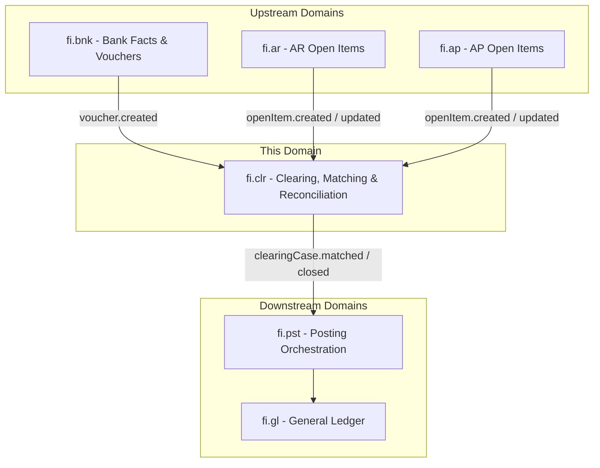
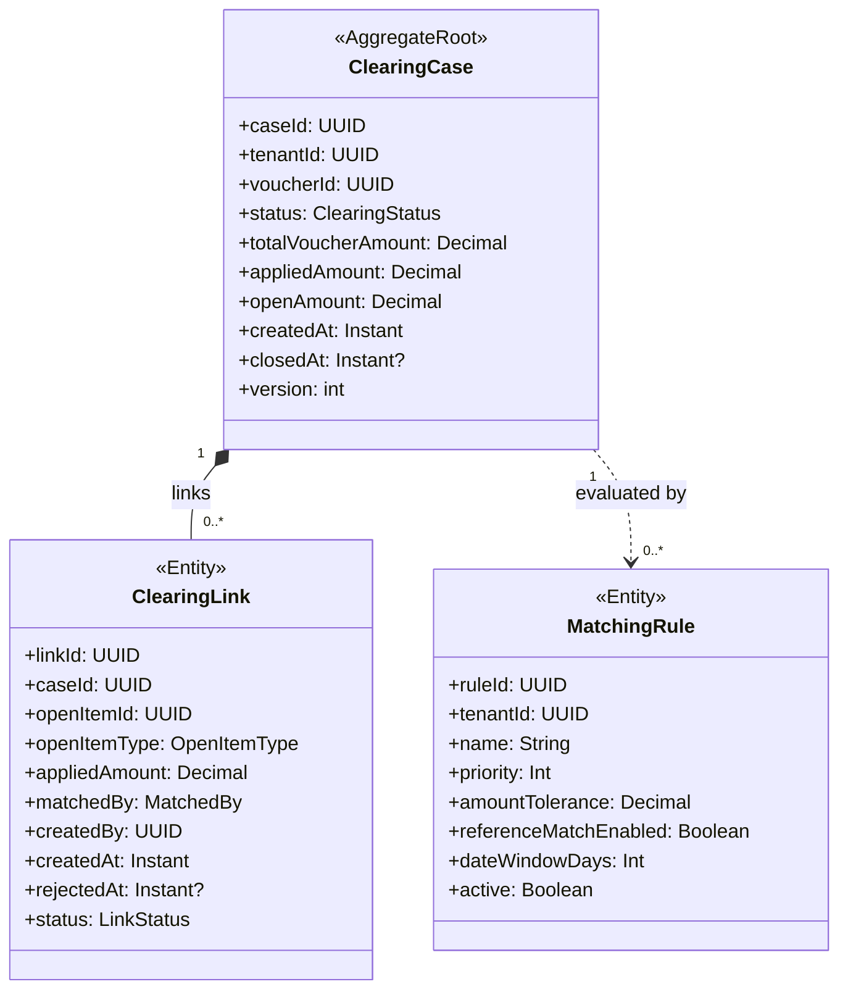
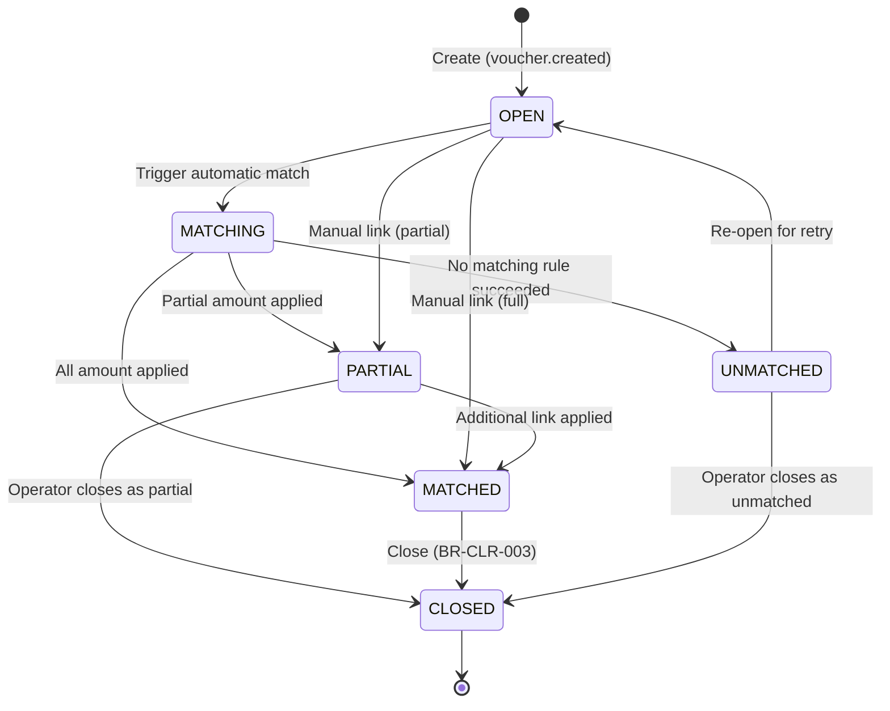
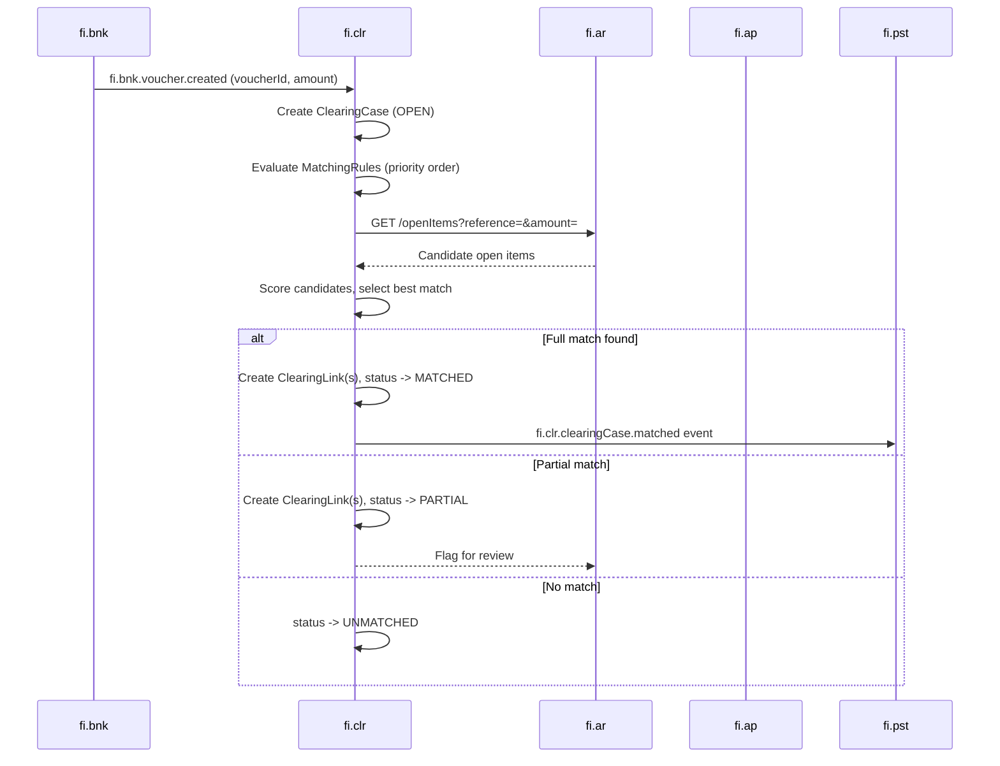
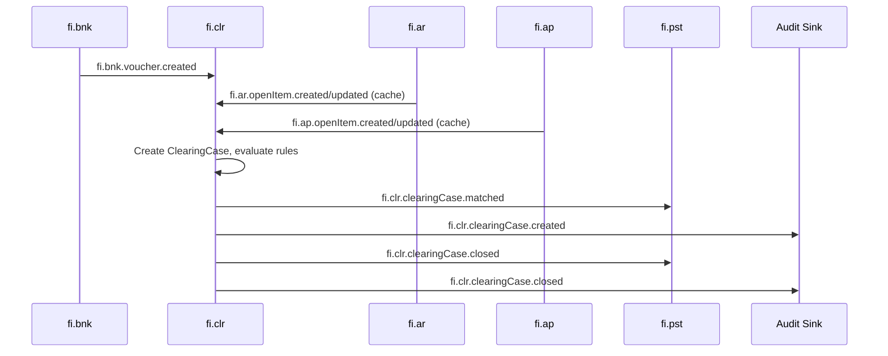
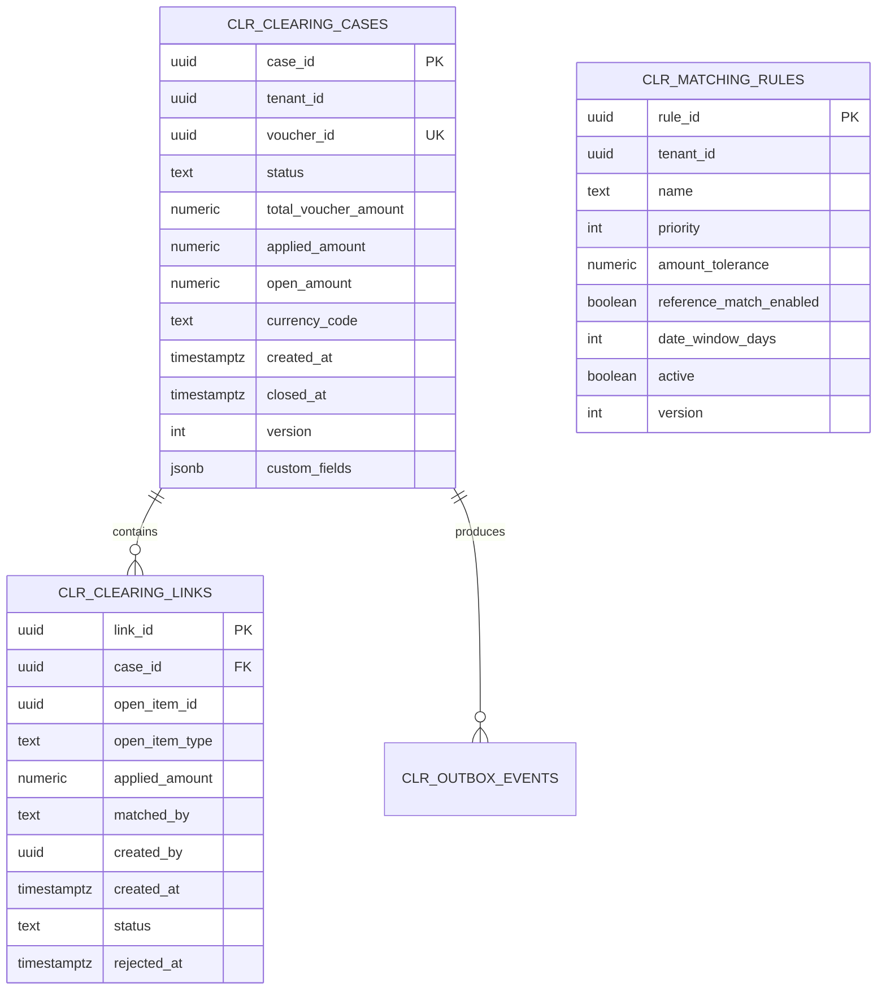

<!-- TEMPLATE COMPLIANCE: ~95%
All sections present per TPL-SVC v1.0.0: §0 Purpose/Scope, §1 Business Context, §2 Service Identity, §3 Domain Model (aggregate definitions, lifecycle, invariants, value objects, enumerations, shared types), §4 Business Rules (catalog + detailed definitions + data validation + reference data), §5 Use Cases (6 UCs with full Actor/Flow/Postconditions), §6 REST API (full request/response bodies), §7 Events (envelope format + consumed event detail), §8 Data Model (table-level + custom_fields), §9 Security (permission matrix + compliance), §10 Quality Attributes (failure scenarios), §11 Feature Dependencies, §12 Extension Points (all 5 types), §13 Migration Notes, §14 Decisions & Open Questions (consistency checks + suite ADR refs), §15 Appendix
Minor gaps: Port and repository TBD (OPEN QUESTION), Feature IDs TBD pending Phase 3
-->
# FI.CLR - Clearing, Matching & Reconciliation Domain / Service Specification

> **Conceptual Stack Layer:** Domain / Service
> **Space:** Platform
> **Owner:** Domain Engineering Team
> **Schema alignment:** `service-layer.schema.json`
> **Companion files:** `openapi.yaml`, `*.schema.json` (event contracts)
> **Referenced by:** Platform-Feature Spec SS5 (backend dependencies), BFF Contract
> **Belongs to:** FI Suite Spec (`_fi_suite_v2_1.md`)

> **Meta Information**
> - **Version:** 2026-04-04
> - **Template:** `domain-service-spec.md` v1.0.0
> - **Template Compliance:** ~95% — Port and repository TBD; Feature IDs pending Phase 3
> - **Author(s):** OpenLeap Architecture Team
> - **Status:** DRAFT
> - **Tier:** T3
> - **Suite:** `fi`
> - **Domain:** `clr`
> - **Bounded Context Ref:** `bc:clearing-reconciliation`
> - **Service ID:** `fi-clr-svc`
> - **basePackage:** `io.openleap.fi.clr`
> - **API Base Path:** `/api/fi/clr/v1`
> - **OpenLeap Starter Version:** `v1`
> - **Port:** OPEN QUESTION
> - **Repository:** OPEN QUESTION
> - **Tags:** `fi`, `clearing`, `matching`, `reconciliation`, `ar`, `ap`, `bank`
> - **Team:**
>   - Name: `team-fi`
>   - Email: `fi-team@openleap.io`
>   - Slack: `#fi-team`

---

## Specification Guidelines Compliance

> ### Non-Negotiables
> - Never invent facts. If required info is missing, add an **OPEN QUESTION** entry.
> - Preserve intent and decisions. Only change meaning when explicitly requested.
> - Do not remove normative constraints unless they are explicitly replaced.
> - Keep the spec **self-contained**: no "see chat", no implicit context.
>
> ### Source of Truth Priority
> When sources conflict:
> 1. Spec (explicit) wins
> 2. Starter specs (implementation constraints) next
> 3. Guidelines (best practices) last
>
> Record conflicts in the **Decisions & Conflicts** section (see Section 14).
>
> ### Style Guide
> - Prefer short sentences and lists.
> - Use MUST/SHOULD/MAY for normative statements.
> - Keep terminology consistent (Aggregate, Domain Service, Application Service, Command, Event).
> - Avoid ambiguous words ("often", "maybe") unless explicitly noting uncertainty.
> - Keep examples minimal and clearly marked as examples.
> - Do not add implementation code unless the chapter explicitly requires it.

---

## 0. Document Purpose & Scope

### 0.1 Purpose
`fi.clr` specifies the FI v2.1 domain for **clearing, matching, and reconciliation** across open items and bank statement facts. It receives vouchers produced by `fi.bnk` and links them to open items owned by `fi.ar` and `fi.ap`, reducing outstanding balances and producing auditable clearing outcomes. It is the domain that transforms raw bank activity into financial meaning within the FI suite.

### 0.2 Target Audience
- Finance Operations (AR/AP and Treasury)
- System Architects & Technical Leads
- Integration Engineers

### 0.3 Scope

**In Scope:**
- ClearingCase lifecycle management (create, match, partial match, close, unlink)
- Automatic matching of bank vouchers to AR/AP open items via configurable MatchingRules
- Manual override workflows: operator-driven link creation, rejection, and closure
- Clearing suggestions API (explainable matching candidates)
- Event-driven integration with `fi.bnk` (upstream) and `fi.pst` / `fi.ar` / `fi.ap` (downstream)

**Out of Scope:**
- Raw bank statement ingestion -> `fi.bnk`
- Open item ownership and balance management -> `fi.ar`, `fi.ap`
- Journal entry persistence and GL balances -> `fi.gl`
- Posting orchestration -> `fi.pst`
- Payment initiation -> `fi.pay`

### 0.4 Terms & Acronyms
- **Voucher:** A normalized bank statement line "fact" created by `fi.bnk`.
- **Open Item:** An outstanding AR or AP balance (invoice, credit note) owned by `fi.ar` / `fi.ap`.
- **Clearing:** Linking a payment/credit voucher to an open item to reduce its outstanding balance.
- **ClearingCase:** The aggregate root representing a clearing attempt for one voucher.
- **ClearingLink:** An entity connecting a voucher to a specific open item with an applied amount.
- **MatchingRule:** A configurable rule that drives automatic voucher-to-open-item matching logic.
- **Reconciliation:** Verifying that subledger state (open items) matches bank facts (vouchers).

### 0.5 Related Documents
- Suite architecture: `spec/T3_Domains/FI/_fi_suite_v2_1.md`
- Neighbor specs: `fi_bnk-spec.md`, `fi_ar-spec.md`, `fi_ap-spec.md`, `fi_pst-spec.md`, `fi_gl-spec.md`
- Platform architecture: `SYSTEM_OVERVIEW.md`
- Technical standards: `TECHNICAL_STANDARDS.md`, `EVENT_STANDARDS.md`

---

## 1. Business Context

### 1.1 Domain Purpose
`fi.clr` bridges **bank activity** and **open item balances**. When a customer pays an invoice, the payment arrives as a voucher in `fi.bnk`. `fi.clr` matches that voucher to the corresponding AR open item, producing a clearing outcome that drives balance reduction and audit trail. Without clearing, AR/AP open items accumulate regardless of actual payments received.

### 1.2 Business Value
- Automated matching reduces manual AR/AP reconciliation workload
- Accurate open item status enables correct aging reports and dunning decisions
- Full clearing audit trail supports financial audits and SOX compliance
- Partial match handling prevents stuck items and flags exceptions proactively
- Explainable matching suggestions accelerate operator review

### 1.3 Key Stakeholders

| Role | Responsibility | Primary Use Cases |
|------|----------------|-------------------|
| AR/AP Clerk | Review and approve automatic matches, handle exceptions | UC-CLR-001, UC-CLR-002, UC-CLR-005 |
| Finance Manager | Oversee clearing queue, approve partial matches | UC-CLR-004, UC-CLR-006 |
| Treasury | Monitor bank reconciliation completeness | UC-CLR-006 |
| System / Integration Engineer | Configure matching rules, monitor events | UC-CLR-001 |

### 1.4 Strategic Positioning



### 1.5 Service Context

| Field | Value |
|-------|-------|
| Suite | `fi` (Finance) |
| Domain | `clr` (Clearing, Matching & Reconciliation) |
| Bounded Context | `bc:clearing-reconciliation` |
| Service ID | `fi-clr-svc` |
| Base Package | `io.openleap.fi.clr` |
| Authoritative Sources | FI Suite Spec (`_fi_suite_v2_1.md`), SAP FI-GL clearing and reconciliation patterns |

**Responsibilities:**
- Create and manage ClearingCase aggregates for bank vouchers
- Evaluate configurable MatchingRules to automatically match vouchers to open items
- Provide explainable matching suggestions with confidence scores
- Support manual link creation, rejection, and closure workflows
- Publish clearing outcome events for downstream posting orchestration

**Authoritative Sources:**

| Source Type | Description | Access Pattern |
|-------------|-------------|----------------|
| REST API | ClearingCase CRUD, link management, suggestions | Synchronous |
| Database | ClearingCases, ClearingLinks, MatchingRules | Direct (owner) |
| Events | Clearing outcome events (matched, partial, unmatched, closed) | Asynchronous |

---

## 2. Service Identity

| Field | Value |
|-------|-------|
| **Service ID** | `fi-clr-svc` |
| **Display Name** | Clearing, Matching & Reconciliation Service |
| **Suite** | `fi` |
| **Domain** | `clr` |
| **Bounded Context Ref** | `bc:clearing-reconciliation` |
| **Version** | 2026-04-04 |
| **Status** | DRAFT |
| **API Base Path** | `/api/fi/clr/v1` |
| **Repository** | OPEN QUESTION |
| **Tags** | `fi`, `clearing`, `matching`, `reconciliation`, `ar`, `ap`, `bank` |
| **Team Name** | `team-fi` |
| **Team Email** | `fi-team@openleap.io` |
| **Team Slack** | `#fi-team` |

---

## 3. Domain Model

### 3.1 Conceptual Overview

The domain centers on the **ClearingCase** aggregate -- a clearing attempt for a single bank voucher. Each case contains one or more **ClearingLinks** connecting the voucher to specific AR/AP open items with an applied amount. **MatchingRules** configure automatic matching logic (amount tolerance, reference matching, date window). A case progresses from OPEN through matching states until it is MATCHED (fully cleared), PARTIAL (partially cleared), UNMATCHED (no match found), or CLOSED.



### 3.2 Core Concepts

| Concept | Owner | Description | Glossary Ref |
|---------|-------|-------------|--------------|
| ClearingCase | fi-clr-svc | Aggregate root representing a clearing attempt for one voucher | Clearing Case |
| ClearingLink | fi-clr-svc | Link connecting a voucher to a specific open item with an applied amount | Clearing Link |
| MatchingRule | fi-clr-svc | Configurable rule driving automatic voucher-to-open-item matching | Matching Rule |
| Voucher | fi.bnk | Normalized bank statement line fact (referenced by ID only) | Voucher |
| Open Item | fi.ar / fi.ap | Outstanding AR or AP balance (referenced by ID only) | Open Item |

### 3.3 Aggregate Definitions

#### 3.3.1 Aggregate: ClearingCase

| Property | Value |
|----------|-------|
| **Aggregate ID** | `agg:clearing-case` |
| **Name** | `ClearingCase` |

**Business Purpose:** Represents the full clearing lifecycle for a single bank voucher. Orchestrates matching rules evaluation, ClearingLink management, and clearing outcome determination.

##### Aggregate Root

**Key Attributes:**

| Attribute | Type | Format | Description | Constraints | Required | Read-Only |
|-----------|------|--------|-------------|-------------|----------|-----------|
| caseId | string | uuid | Unique identifier for this clearing case | Immutable after create, `OlUuid.create()` | Yes | Yes |
| tenantId | string | uuid | Tenant ownership discriminator | Immutable, RLS-enforced | Yes | Yes |
| voucherId | string | uuid | Reference to the fi.bnk voucher being cleared | Immutable, unique per tenant (BR-CLR-007) | Yes | Yes |
| status | string | -- | Current lifecycle state of the clearing case | enum_ref: `ClearingStatus` | Yes | No |
| totalVoucherAmount | number | decimal(18,4) | Full monetary amount of the bank voucher | > 0, set at create, immutable | Yes | Yes |
| appliedAmount | number | decimal(18,4) | Sum of all active ClearingLink.appliedAmount values | >= 0, <= totalVoucherAmount, computed | Yes | Yes |
| openAmount | number | decimal(18,4) | Remaining uncleared amount: totalVoucherAmount - appliedAmount | Computed, >= 0 | Yes | Yes |
| currencyCode | string | -- | ISO 4217 currency code of the voucher amount | 3-char uppercase, from ref-data-svc | Yes | Yes |
| createdAt | string | date-time | Timestamp when the clearing case was created | System-managed, immutable | Yes | Yes |
| closedAt | string | date-time | Timestamp when the clearing case was closed | Set on CLOSED transition only | No | Yes |
| version | integer | int32 | Optimistic locking version counter | Auto-incremented on each mutation | Yes | Yes |
| customFields | object | -- | Tenant-specific extension fields | JSONB, max 10KB | No | No |

**Lifecycle States:**



**State Descriptions:**

| State | Description | Business Meaning |
|-------|-------------|------------------|
| OPEN | Initial creation state; no matching attempted yet | Voucher received, awaiting matching |
| MATCHING | Automatic matching rules are being evaluated | System is processing matching candidates |
| MATCHED | All voucher amount has been applied to open items | Fully cleared; ready for closure and posting |
| PARTIAL | Some but not all voucher amount has been applied | Requires operator review for remaining amount |
| UNMATCHED | Automatic matching found no candidates | Requires manual intervention or rule adjustment |
| CLOSED | Terminal state; case is finalized and immutable | Included in reconciliation reports and audit trail |

**Allowed Transitions:**

| From State | To State | Trigger | Guard / Business Preconditions |
|------------|----------|---------|-------------------------------|
| -- | OPEN | `fi.bnk.voucher.created` event or REST POST | Valid voucherId, unique per tenant (BR-CLR-007) |
| OPEN | MATCHING | Automatic match triggered (UC-CLR-001) | MatchingRules exist and are active |
| MATCHING | MATCHED | All voucher amount applied | appliedAmount == totalVoucherAmount |
| MATCHING | PARTIAL | Partial amount applied | 0 < appliedAmount < totalVoucherAmount |
| MATCHING | UNMATCHED | No rules produce a match | appliedAmount == 0 |
| OPEN/PARTIAL | MATCHED | Manual link closes full amount (UC-CLR-002) | appliedAmount == totalVoucherAmount |
| OPEN/PARTIAL | PARTIAL | Manual link (UC-CLR-002) | 0 < appliedAmount < totalVoucherAmount |
| MATCHED/PARTIAL/UNMATCHED | CLOSED | Close command (UC-CLR-003) | At least one active link for MATCHED (BR-CLR-003) |
| UNMATCHED | OPEN | Re-open for retry | Operator decision |
| CLOSED | -- | -- | MUST NOT reopen (BR-CLR-001) |

**Invariants:**

| Rule ID | Description |
|---------|-------------|
| INV-CLR-001 | A CLOSED ClearingCase MUST NOT be reopened (BR-CLR-001) |
| INV-CLR-002 | appliedAmount MUST NOT exceed totalVoucherAmount (BR-CLR-002, BR-CLR-005) |
| INV-CLR-003 | At least one active ClearingLink is required to close with status MATCHED (BR-CLR-003) |
| INV-CLR-004 | voucherId MUST be unique per tenant -- one ClearingCase per voucher (BR-CLR-007) |
| INV-CLR-005 | openAmount MUST equal totalVoucherAmount - appliedAmount at all times |

**Domain Events Emitted:**

| Event | Routing Key | When | Key Payload |
|-------|-------------|------|-------------|
| ClearingCaseCreated | `fi.clr.clearingCase.created` | Case created | caseId, voucherId, tenantId |
| ClearingCaseMatched | `fi.clr.clearingCase.matched` | Full match achieved | caseId, voucherId, links[] |
| ClearingCasePartiallyMatched | `fi.clr.clearingCase.partiallyMatched` | Partial match | caseId, voucherId, appliedAmount, openAmount |
| ClearingCaseUnmatched | `fi.clr.clearingCase.unmatched` | No match found | caseId, voucherId, tenantId |
| ClearingCaseClosed | `fi.clr.clearingCase.closed` | Case closed | caseId, closedAt, finalStatus |

##### Child Entities

###### Entity: ClearingLink

| Property | Value |
|----------|-------|
| **Entity ID** | `ent:clearing-link` |
| **Name** | `ClearingLink` |
| **Relationship to Root** | one_to_many |

**Business Purpose:** Represents the applied amount from a voucher to a specific AR/AP open item. Carries the matching provenance (auto or manual) and supports rejection/unlinking.

**Attributes:**

| Attribute | Type | Format | Description | Constraints | Required |
|-----------|------|--------|-------------|-------------|----------|
| linkId | string | uuid | Unique identifier for this link | Immutable, `OlUuid.create()` | Yes |
| caseId | string | uuid | Parent clearing case reference | FK to ClearingCase | Yes |
| openItemId | string | uuid | Reference to the AR or AP open item | Immutable after create | Yes |
| openItemType | string | -- | Whether the open item is from AR or AP | enum_ref: `OpenItemType` | Yes |
| appliedAmount | number | decimal(18,4) | Amount applied from voucher to this open item | > 0, <= open item outstanding balance (BR-CLR-002) | Yes |
| matchedBy | string | -- | How this link was created | enum_ref: `MatchedBy` | Yes |
| createdBy | string | uuid | Principal who created or approved the link | FK logical to iam.principal | Yes |
| createdAt | string | date-time | Timestamp of link creation | System-managed | Yes |
| status | string | -- | Current link lifecycle state | enum_ref: `LinkStatus` | Yes |
| rejectedAt | string | date-time | Timestamp when the link was rejected | Set on REJECTED transition only | No |

**Collection Constraints:**
- Minimum items: 0 (OPEN/UNMATCHED cases have no links)
- Maximum items: Unbounded (practical limit: number of open items matching the voucher)

**Lifecycle States:**

| From | To | Trigger | Guard |
|------|----|---------|-------|
| -- | ACTIVE | Link created (UC-CLR-002 or auto-match) | appliedAmount <= open item outstanding balance (BR-CLR-002) |
| ACTIVE | REJECTED | Operator rejects link (UC-CLR-005) | Case must not be CLOSED (BR-CLR-001) |

**Invariants:**

| Rule ID | Description |
|---------|-------------|
| BR-CLR-002 | appliedAmount MUST NOT exceed the open item outstanding balance |
| BR-CLR-006 | REJECTED links MUST NOT count toward appliedAmount |
| BR-CLR-008 | appliedAmount MUST be > 0 |

###### Entity: MatchingRule

| Property | Value |
|----------|-------|
| **Entity ID** | `ent:matching-rule` |
| **Name** | `MatchingRule` |
| **Relationship to Root** | Independent (not child of ClearingCase) |

**Business Purpose:** Configures automatic matching logic for a tenant. Rules are evaluated in priority order during automatic matching. Based on SAP FI-GL automatic clearing concepts (F.13 transaction equivalent).

**Attributes:**

| Attribute | Type | Format | Description | Constraints | Required |
|-----------|------|--------|-------------|-------------|----------|
| ruleId | string | uuid | Unique identifier for this rule | `OlUuid.create()` | Yes |
| tenantId | string | uuid | Tenant ownership | RLS-enforced | Yes |
| name | string | -- | Human-readable rule name | Max 200 chars | Yes |
| priority | integer | int32 | Evaluation order (lower = higher priority) | > 0, unique per tenant among active rules | Yes |
| amountTolerance | number | decimal(5,4) | Allowed amount deviation as fraction (e.g. 0.01 = 1%) | >= 0, default 0 | No |
| referenceMatchEnabled | boolean | -- | Whether to match on payment reference / invoice number | -- | Yes |
| dateWindowDays | integer | int32 | Max days between voucher date and open item due date | >= 0 | No |
| active | boolean | -- | Whether this rule participates in matching | -- | Yes |
| version | integer | int32 | Optimistic locking version | Auto-incremented | Yes |

##### Value Objects

###### Value Object: Money

| Property | Value |
|----------|-------|
| **VO ID** | `vo:money` |
| **Name** | `Money` |

**Description:** Represents a monetary amount with currency. Used for totalVoucherAmount, appliedAmount, openAmount, and link appliedAmount fields.

**Attributes:**

| Attribute | Type | Format | Description | Constraints |
|-----------|------|--------|-------------|-------------|
| amount | number | decimal(18,4) | Monetary value | Precision 18, scale 4 |
| currencyCode | string | -- | ISO 4217 currency code | 3-char uppercase, must be active in ref-data-svc |

**Validation Rules:**
- amount MUST be non-negative for balance fields (appliedAmount, openAmount)
- amount MUST be positive for totalVoucherAmount and link appliedAmount
- currencyCode MUST be a valid, active ISO 4217 code

###### Value Object: MatchScore

| Property | Value |
|----------|-------|
| **VO ID** | `vo:match-score` |
| **Name** | `MatchScore` |

**Description:** Represents the confidence score and matching criteria for a clearing suggestion. Used in the suggestions API response.

**Attributes:**

| Attribute | Type | Format | Description | Constraints |
|-----------|------|--------|-------------|-------------|
| score | number | decimal(3,2) | Overall confidence score (0.00 to 1.00) | >= 0.00, <= 1.00 |
| matchedCriteria | array | -- | List of criteria that contributed to the match | Items from MatchCriteria enum |

**Validation Rules:**
- score MUST be between 0.00 and 1.00 inclusive
- matchedCriteria MUST contain at least one value when score > 0

### 3.4 Enumerations

#### ClearingStatus

**Description:** Lifecycle state of a ClearingCase aggregate.

| Value | Description | Deprecated |
|-------|-------------|------------|
| `OPEN` | Case created; no matching attempted or links added yet | No |
| `MATCHING` | Automatic matching rules are being evaluated | No |
| `MATCHED` | All voucher amount has been fully applied to open items | No |
| `PARTIAL` | Some voucher amount applied; remainder awaits matching or operator decision | No |
| `UNMATCHED` | Automatic matching found no candidates; manual intervention required | No |
| `CLOSED` | Terminal state; case finalized, immutable, included in audit trail | No |

#### LinkStatus

**Description:** Lifecycle state of a ClearingLink entity within a ClearingCase.

| Value | Description | Deprecated |
|-------|-------------|------------|
| `ACTIVE` | Link is in effect and counts toward the case appliedAmount | No |
| `REJECTED` | Link has been rejected by an operator; excluded from appliedAmount calculation | No |

#### OpenItemType

**Description:** Identifies the source subledger of the open item being cleared.

| Value | Description | Deprecated |
|-------|-------------|------------|
| `AR` | Accounts Receivable open item (customer invoice, credit memo) | No |
| `AP` | Accounts Payable open item (vendor bill, credit note) | No |

#### MatchedBy

**Description:** Provenance of how a ClearingLink was created.

| Value | Description | Deprecated |
|-------|-------------|------------|
| `AUTOMATIC` | Created by the automatic matching engine based on MatchingRules | No |
| `MANUAL` | Created by an operator through the manual link API | No |

#### MatchCriteria

**Description:** Individual matching criteria used in scoring clearing suggestions.

| Value | Description | Deprecated |
|-------|-------------|------------|
| `AMOUNT_EXACT` | Voucher amount exactly matches open item outstanding balance | No |
| `AMOUNT_TOLERANCE` | Voucher amount matches within the configured tolerance | No |
| `REFERENCE_MATCH` | Payment reference matches invoice number or open item reference | No |
| `DATE_WINDOW` | Open item due date falls within the configured date window | No |
| `CUSTOMER_MATCH` | Voucher sender matches the open item's business partner | No |

### 3.5 Shared Types

#### Money

| Property | Value |
|----------|-------|
| **Type ID** | `type:money` |
| **Name** | `Money` |

**Description:** Monetary amount with currency code. Standard shared type used across the FI suite for all financial amounts.

**Attributes:**

| Attribute | Type | Format | Description | Constraints |
|-----------|------|--------|-------------|-------------|
| amount | number | decimal(18,4) | Monetary value | Precision 18, scale 4 |
| currencyCode | string | -- | ISO 4217 currency code | 3-char uppercase |

**Validation Rules:**
- currencyCode MUST be a valid ISO 4217 code
- currencyCode MUST be active in ref-data-svc

**Used By:**
- `agg:clearing-case` (totalVoucherAmount, appliedAmount, openAmount)
- `ent:clearing-link` (appliedAmount)

---

## 4. Business Rules & Constraints

### 4.1 Business Rules Catalog

| ID | Rule Name | Description | Scope | Enforcement | Error Code |
|----|-----------|-------------|-------|-------------|------------|
| BR-CLR-001 | Closed Case Immutable | A CLOSED ClearingCase MUST NOT be reopened or modified | ClearingCase | Update / Close | `CLR-BIZ-001` |
| BR-CLR-002 | Applied Amount Constraint | ClearingLink.appliedAmount MUST NOT exceed the open item's outstanding balance | ClearingLink | Create | `CLR-BIZ-002` |
| BR-CLR-003 | At Least One Link to Close Matched | Closing a case as MATCHED requires at least one active ClearingLink | ClearingCase | Close | `CLR-BIZ-003` |
| BR-CLR-004 | Partial Match Review Flag | Partial matches (PARTIAL status) SHOULD be flagged for operator review | ClearingCase | Matching | `CLR-BIZ-004` |
| BR-CLR-005 | Total Applied Not Exceeded | Sum of all active ClearingLinks MUST NOT exceed totalVoucherAmount | ClearingCase | Link Create | `CLR-BIZ-005` |
| BR-CLR-006 | Rejected Link Excluded | REJECTED links MUST NOT count toward appliedAmount | ClearingCase | Link Reject | `CLR-BIZ-006` |
| BR-CLR-007 | One Case Per Voucher | A voucher MUST NOT have more than one ClearingCase per tenant | ClearingCase | Create | `CLR-VAL-007` |
| BR-CLR-008 | Positive Applied Amount | ClearingLink.appliedAmount MUST be > 0 | ClearingLink | Create | `CLR-VAL-008` |

### 4.2 Detailed Rule Definitions

#### BR-CLR-001: Closed Case Immutable

**Business Context:** Closed clearing cases are included in period-end reconciliation reports and audit trails. Reopening them would invalidate already-posted corrections.

**Rule Statement:** Once a ClearingCase reaches CLOSED status, no attribute may be changed and no links may be added or rejected.

**Applies To:**
- Aggregate: ClearingCase
- Operations: Update, Close, AddLink, RejectLink

**Enforcement:** Domain service rejects any command targeting a CLOSED ClearingCase.

**Validation Logic:** `if (clearingCase.status == CLOSED) throw ClosedCaseException`

**Error Handling:**
- **Error Code:** `CLR-BIZ-001`
- **Error Message:** "Clearing case {id} is CLOSED and cannot be modified."
- **If violated:** System returns HTTP 409 Conflict
- **User action:** Create a new clearing case if re-clearing is needed for the same voucher (requires voiding the original via `fi.pst` reversal first)

**Examples:**
- **Valid:** Closing an OPEN case with no links (closes as UNMATCHED).
- **Invalid:** Attempting to add a ClearingLink to a CLOSED case.

#### BR-CLR-002: Applied Amount Constraint

**Business Context:** Applying more than the outstanding balance of an open item would over-clear it, creating a credit balance that distorts AR/AP reports.

**Rule Statement:** `ClearingLink.appliedAmount` MUST NOT exceed the open item's current outstanding balance at the time of link creation.

**Applies To:**
- Aggregate: ClearingLink (on create)
- Operations: Create

**Enforcement:** Application Service reads the open item's outstanding balance from `fi.ar` or `fi.ap` via REST before creating the link.

**Validation Logic:** `if (link.appliedAmount > openItem.outstandingBalance) throw OverClearingException`

**Error Handling:**
- **Error Code:** `CLR-BIZ-002`
- **Error Message:** "Applied amount {amount} exceeds outstanding balance {balance} of open item {openItemId}."
- **If violated:** System returns HTTP 422 Unprocessable Entity
- **User action:** Reduce applied amount to be within the open item's outstanding balance

**Examples:**
- **Valid:** Open item has outstanding balance of 1500.00; link applies 1500.00.
- **Invalid:** Open item has outstanding balance of 1000.00; link attempts to apply 1500.00.

#### BR-CLR-003: At Least One Link to Close Matched

**Business Context:** A MATCHED case closure triggers posting orchestration in `fi.pst`. Without at least one link, there is no financial basis for the posting.

**Rule Statement:** A ClearingCase MUST have at least one ACTIVE ClearingLink before it can be closed with outcome MATCHED.

**Applies To:**
- Aggregate: ClearingCase (Close transition)
- Operations: Close

**Enforcement:** Domain service checks for active links before allowing CLOSED transition.

**Validation Logic:** `if (clearingCase.status == MATCHED && clearingCase.activeLinks().isEmpty()) throw NoActiveLinksException`

**Error Handling:**
- **Error Code:** `CLR-BIZ-003`
- **Error Message:** "Cannot close clearing case {id} as MATCHED: no active clearing links exist."
- **If violated:** System returns HTTP 409 Conflict
- **User action:** Add at least one clearing link before closing, or close as UNMATCHED instead

**Examples:**
- **Valid:** Case has two active links totaling totalVoucherAmount; close succeeds.
- **Invalid:** All links have been rejected; attempting to close as MATCHED fails.

#### BR-CLR-004: Partial Match Review Flag

**Business Context:** Partial matches indicate that some voucher amount remains uncleared. Left unattended, partial cases create reconciliation discrepancies at period-end. Flagging ensures timely operator review.

**Rule Statement:** When a ClearingCase transitions to PARTIAL status, the system SHOULD emit a notification event for operator review.

**Applies To:**
- Aggregate: ClearingCase
- Operations: Matching, AddLink

**Enforcement:** Application Service publishes `clearingCase.partiallyMatched` event, which notification service consumes.

**Validation Logic:** `if (clearingCase.status == PARTIAL) publishPartialMatchNotification()`

**Error Handling:**
- **Error Code:** `CLR-BIZ-004`
- **Error Message:** N/A (non-blocking rule; notification failure does not block the operation)
- **User action:** Review the partial match in the clearing queue

**Examples:**
- **Valid:** Voucher for 1500.00 is partially matched with 750.00; operator receives notification.
- **Invalid:** N/A (this is a SHOULD rule, not enforced as a hard constraint)

#### BR-CLR-005: Total Applied Not Exceeded

**Business Context:** The sum of all active ClearingLinks must not exceed the voucher amount. Over-application would double-clear the same bank amount.

**Rule Statement:** `SUM(active ClearingLinks.appliedAmount)` MUST NOT exceed `totalVoucherAmount`.

**Applies To:**
- Aggregate: ClearingCase
- Operations: AddLink

**Enforcement:** Domain object checks aggregate invariant before accepting a new link.

**Validation Logic:** `if (appliedAmount + newLink.appliedAmount > totalVoucherAmount) throw TotalExceededException`

**Error Handling:**
- **Error Code:** `CLR-BIZ-005`
- **Error Message:** "Adding {amount} would exceed total voucher amount {total}. Current applied: {applied}."
- **If violated:** System returns HTTP 422 Unprocessable Entity
- **User action:** Reduce the applied amount or reject existing links first

**Examples:**
- **Valid:** totalVoucherAmount = 1500.00, existing applied = 750.00, new link = 750.00 (total = 1500.00).
- **Invalid:** totalVoucherAmount = 1500.00, existing applied = 1000.00, new link = 600.00 (total = 1600.00).

#### BR-CLR-006: Rejected Link Excluded

**Business Context:** When an operator rejects a ClearingLink, the applied amount must be recalculated excluding rejected links. This ensures the case status accurately reflects the clearing state.

**Rule Statement:** REJECTED ClearingLinks MUST NOT count toward the ClearingCase's `appliedAmount`.

**Applies To:**
- Aggregate: ClearingCase
- Operations: RejectLink

**Enforcement:** Domain object recalculates `appliedAmount` as `SUM(links WHERE status = ACTIVE)` after each rejection.

**Validation Logic:** `appliedAmount = links.stream().filter(l -> l.status == ACTIVE).mapToDecimal(ClearingLink::appliedAmount).sum()`

**Error Handling:**
- **Error Code:** `CLR-BIZ-006`
- **Error Message:** N/A (invariant enforcement, no user-facing error)
- **User action:** N/A

**Examples:**
- **Valid:** Case has two links (500.00 ACTIVE, 500.00 REJECTED); appliedAmount = 500.00.
- **Invalid:** N/A (automatically enforced)

#### BR-CLR-007: One Case Per Voucher

**Business Context:** Each bank voucher represents a single financial fact. Creating multiple clearing cases for the same voucher would lead to double-clearing and distorted subledger balances.

**Rule Statement:** A voucher MUST NOT have more than one ClearingCase per tenant.

**Applies To:**
- Aggregate: ClearingCase
- Operations: Create

**Enforcement:** Unique constraint on (tenant_id, voucher_id) in the database; domain service checks before creation.

**Validation Logic:** `if (existsByCaseByTenantAndVoucher(tenantId, voucherId)) throw DuplicateCaseException`

**Error Handling:**
- **Error Code:** `CLR-VAL-007`
- **Error Message:** "A clearing case for voucher {voucherId} already exists."
- **If violated:** System returns HTTP 409 Conflict
- **User action:** Locate the existing clearing case for this voucher

**Examples:**
- **Valid:** First case created for voucher V-001 in tenant T-001.
- **Invalid:** Second case creation attempted for voucher V-001 in tenant T-001.

#### BR-CLR-008: Positive Applied Amount

**Business Context:** A zero or negative applied amount on a ClearingLink has no financial meaning. All clearing links must apply a positive amount toward the open item.

**Rule Statement:** `ClearingLink.appliedAmount` MUST be greater than zero.

**Applies To:**
- Aggregate: ClearingLink
- Operations: Create

**Enforcement:** Domain object validates on construction.

**Validation Logic:** `if (link.appliedAmount <= 0) throw NonPositiveAmountException`

**Error Handling:**
- **Error Code:** `CLR-VAL-008`
- **Error Message:** "Applied amount must be positive and not exceed open item balance."
- **If violated:** System returns HTTP 422 Unprocessable Entity
- **User action:** Provide a positive amount

**Examples:**
- **Valid:** appliedAmount = 750.00
- **Invalid:** appliedAmount = 0.00 or appliedAmount = -100.00

### 4.3 Data Validation Rules

**Field-Level Validations:**

| Field | Validation Rule | Error Code | Error Message |
|-------|----------------|------------|---------------|
| voucherId | Required, valid UUID, unique per tenant | `CLR-VAL-007` | "A clearing case for voucher {voucherId} already exists" |
| totalVoucherAmount | Required, > 0 | `CLR-VAL-009` | "Voucher amount must be greater than zero" |
| openItemId (link) | Required, valid UUID, resolvable in fi.ar or fi.ap | `CLR-VAL-010` | "Open item {openItemId} not found" |
| appliedAmount (link) | Required, > 0, <= outstanding balance | `CLR-VAL-008` | "Applied amount must be positive and not exceed open item balance" |
| openItemType (link) | Required, AR or AP | `CLR-VAL-011` | "Open item type must be AR or AP" |
| name (rule) | Required, max 200 chars | `CLR-VAL-012` | "Matching rule name is required and must not exceed 200 characters" |
| priority (rule) | Required, > 0, unique per tenant among active rules | `CLR-VAL-013` | "Priority must be positive and unique among active rules" |
| amountTolerance (rule) | >= 0 if provided | `CLR-VAL-014` | "Amount tolerance must be non-negative" |
| dateWindowDays (rule) | >= 0 if provided | `CLR-VAL-015` | "Date window must be non-negative" |

**Cross-Field Validations:**
- appliedAmount (sum of active links) MUST NOT exceed totalVoucherAmount (BR-CLR-005)
- openAmount MUST equal totalVoucherAmount - appliedAmount at all times (INV-CLR-005)
- closedAt MUST only be set when status transitions to CLOSED
- rejectedAt on ClearingLink MUST only be set when link status transitions to REJECTED

### 4.4 Reference Data Dependencies

| Catalog | Usage | Provider Service | Validation |
|---------|-------|-----------------|------------|
| Tenants | tenantId on all aggregates | iam-svc (T1) | Existence check |
| Principals | createdBy on ClearingLink | iam-svc (T1) | Active status check |
| AR Open Items | openItemId validation and outstanding balance | fi-ar-svc (T3) | Balance read |
| AP Open Items | openItemId validation and outstanding balance | fi-ap-svc (T3) | Balance read |
| Vouchers | voucherId validation | fi-bnk-svc (T3) | Existence check |
| Currencies | currencyCode validation | ref-data-svc (T1) | Active currency check |

---

## 5. Use Cases

### 5.1 Business Logic Placement

| Logic Type | Placement | Examples |
|------------|-----------|----------|
| Aggregate invariants | Domain Object | State transitions, applied amount calculation, immutability enforcement |
| Cross-aggregate logic | Domain Service | MatchingRule evaluation (cross-entity), outstanding balance read from fi.ar/fi.ap, suggestion scoring |
| Orchestration & transactions | Application Service | Command validation, aggregate loading, event publishing, triggering automatic match on voucher.created |

### 5.2 Use Cases

#### UC-CLR-001: Trigger Automatic Matching for Voucher

| Field | Value |
|-------|-------|
| **ID** | UC-CLR-001 |
| **Type** | WRITE (event-driven) |
| **Trigger** | Event (`fi.bnk.voucher.created`) |
| **Aggregate** | ClearingCase |
| **Domain Operation** | `ClearingCase.triggerAutoMatch(voucherId, amount, matchingRules[])` |
| **Inputs** | voucherId, totalVoucherAmount, tenantId (from event) |
| **Outputs** | ClearingCase created in MATCHED, PARTIAL, or UNMATCHED state |
| **Events** | `clearingCase.created`, then `clearingCase.matched` / `clearingCase.partiallyMatched` / `clearingCase.unmatched` |
| **REST** | N/A (event-driven only) |
| **Idempotency** | Deduplicated by voucherId per tenant (BR-CLR-007) |
| **Errors** | DLQ + alert on duplicate voucherId, invalid tenant |

**Actor:** System (triggered by `fi.bnk.voucher.created` event)

**Preconditions:**
- Voucher exists in `fi.bnk` with status = NORMALIZED
- At least one active MatchingRule exists for the tenant
- No existing ClearingCase for this voucherId + tenantId combination

**Main Flow:**
1. System receives `fi.bnk.voucher.created` event
2. System creates a new ClearingCase in OPEN status
3. System retrieves all active MatchingRules for the tenant, ordered by priority
4. System evaluates each rule against AR/AP open items (reads from fi.ar/fi.ap)
5. System creates ClearingLinks for matching candidates
6. System transitions case to MATCHED, PARTIAL, or UNMATCHED based on applied amount
7. System publishes the corresponding clearing outcome event

**Postconditions:**
- ClearingCase exists with one of: MATCHED, PARTIAL, or UNMATCHED status
- ClearingLinks created for any matched open items
- Clearing outcome event published for downstream consumers

**Business Rules Applied:**
- BR-CLR-007: One Case Per Voucher (idempotency guard)
- BR-CLR-002: Applied Amount Constraint (per link)
- BR-CLR-005: Total Applied Not Exceeded
- BR-CLR-004: Partial Match Review Flag (if PARTIAL)

**Alternative Flows:**
- **Alt-1:** If no MatchingRules are active, case remains in OPEN status (no automatic matching attempted), awaiting manual intervention

**Exception Flows:**
- **Exc-1:** If voucherId already has a case (BR-CLR-007), event is deduplicated and discarded
- **Exc-2:** If fi.ar/fi.ap is unavailable, event is retried with exponential backoff; sent to DLQ after 3 failures

#### UC-CLR-002: Manually Link Voucher to Open Item

| Field | Value |
|-------|-------|
| **ID** | UC-CLR-002 |
| **Type** | WRITE |
| **Trigger** | REST |
| **Aggregate** | ClearingCase (ClearingLink child) |
| **Domain Operation** | `ClearingCase.addLink(openItemId, openItemType, appliedAmount)` |
| **Inputs** | caseId, openItemId, openItemType (AR/AP), appliedAmount |
| **Outputs** | Created ClearingLink (ACTIVE); case status updated |
| **Events** | `clearingCase.matched` or `clearingCase.partiallyMatched` (depending on resulting appliedAmount) |
| **REST** | `POST /api/fi/clr/v1/clearingCases/{id}/links` -> 201 Created |
| **Idempotency** | Idempotency-Key header |
| **Errors** | 404 (case not found), 409 (BR-CLR-001 closed), 422 (BR-CLR-002 over-clearing, BR-CLR-005 total exceeded, BR-CLR-008 non-positive amount) |

**Actor:** AR/AP Clerk (role: `FI_CLR_OPERATOR`)

**Preconditions:**
- ClearingCase exists and is not CLOSED (BR-CLR-001)
- Open item exists in fi.ar or fi.ap with sufficient outstanding balance
- User has `FI_CLR_OPERATOR` role

**Main Flow:**
1. Operator selects a ClearingCase from the clearing queue
2. Operator reviews matching suggestions (UC-CLR-006) or identifies an open item manually
3. Operator submits a link with openItemId, openItemType, and appliedAmount
4. System validates the open item exists and has sufficient outstanding balance (BR-CLR-002)
5. System validates total applied would not exceed totalVoucherAmount (BR-CLR-005)
6. System creates ClearingLink in ACTIVE status
7. System recalculates appliedAmount and updates case status
8. System publishes clearing outcome event

**Postconditions:**
- New ClearingLink exists with status ACTIVE
- ClearingCase appliedAmount updated
- ClearingCase status reflects new clearing state (MATCHED or PARTIAL)

**Business Rules Applied:**
- BR-CLR-001: Closed Case Immutable (guard)
- BR-CLR-002: Applied Amount Constraint
- BR-CLR-005: Total Applied Not Exceeded
- BR-CLR-008: Positive Applied Amount

**Alternative Flows:**
- **Alt-1:** If applied amount completes the full voucher amount, case transitions to MATCHED

**Exception Flows:**
- **Exc-1:** If open item balance is insufficient, return 422 with CLR-BIZ-002
- **Exc-2:** If fi.ar/fi.ap service is unavailable, return 503 Service Unavailable

#### UC-CLR-003: Close Clearing Case (Fully Matched)

| Field | Value |
|-------|-------|
| **ID** | UC-CLR-003 |
| **Type** | WRITE |
| **Trigger** | REST or automatic (on MATCHED state) |
| **Aggregate** | ClearingCase |
| **Domain Operation** | `ClearingCase.close()` |
| **Inputs** | caseId |
| **Outputs** | ClearingCase in CLOSED state with closedAt timestamp |
| **Events** | `clearingCase.closed` |
| **REST** | `POST /api/fi/clr/v1/clearingCases/{id}/close` -> 200 OK |
| **Idempotency** | Idempotent (re-close of CLOSED is no-op) |
| **Errors** | 404 (not found), 409 (BR-CLR-003 no active links when closing MATCHED) |

**Actor:** AR/AP Clerk or Finance Manager (role: `FI_CLR_OPERATOR`)

**Preconditions:**
- ClearingCase exists
- If case is MATCHED, at least one active ClearingLink exists (BR-CLR-003)
- User has `FI_CLR_OPERATOR` role

**Main Flow:**
1. Operator or system initiates close command for a ClearingCase
2. System validates case is not already CLOSED
3. System validates at least one active link exists if status is MATCHED (BR-CLR-003)
4. System transitions case to CLOSED and sets closedAt timestamp
5. System publishes `clearingCase.closed` event

**Postconditions:**
- ClearingCase is in CLOSED state
- closedAt is set
- Case is immutable (BR-CLR-001)
- Downstream `fi.pst` receives closed event for posting orchestration

**Business Rules Applied:**
- BR-CLR-001: Closed Case Immutable (makes it so)
- BR-CLR-003: At Least One Link to Close Matched

**Alternative Flows:**
- **Alt-1:** If case is already CLOSED, operation is a no-op (idempotent)
- **Alt-2:** Closing a PARTIAL or UNMATCHED case does not require active links

**Exception Flows:**
- **Exc-1:** If case is MATCHED with no active links (all rejected), return 409 with CLR-BIZ-003

#### UC-CLR-004: Handle Partial Match

| Field | Value |
|-------|-------|
| **ID** | UC-CLR-004 |
| **Type** | WRITE |
| **Trigger** | REST (operator decision after PARTIAL state) |
| **Aggregate** | ClearingCase |
| **Domain Operation** | `ClearingCase.close()` or `ClearingCase.addLink(...)` |
| **Inputs** | caseId; optionally additional link details |
| **Outputs** | Case closed as PARTIAL (operator accepted) or transitioned to MATCHED (additional link applied) |
| **Events** | `clearingCase.partiallyMatched` (if still partial), `clearingCase.matched` (if completed), `clearingCase.closed` |
| **REST** | `POST /api/fi/clr/v1/clearingCases/{id}/links` (add more) or `POST /api/fi/clr/v1/clearingCases/{id}/close` (accept partial) |
| **Idempotency** | Idempotency-Key header on link creation |
| **Errors** | 404, 409 (BR-CLR-001 closed), 422 (BR-CLR-002 over-clearing) |

**Actor:** Finance Manager (role: `FI_CLR_OPERATOR`)

**Preconditions:**
- ClearingCase exists with status PARTIAL
- User has `FI_CLR_OPERATOR` role

**Main Flow:**
1. Operator receives notification of partial match (BR-CLR-004)
2. Operator reviews the clearing case and its existing links
3. Operator decides whether to add more links or accept as partial
4. If adding links: follow UC-CLR-002 main flow
5. If accepting partial: operator closes the case (UC-CLR-003)

**Postconditions:**
- Case is either MATCHED (if additional links complete it) or CLOSED as PARTIAL

**Business Rules Applied:**
- BR-CLR-001: Closed Case Immutable (on close)
- BR-CLR-002: Applied Amount Constraint (on add link)
- BR-CLR-004: Partial Match Review Flag
- BR-CLR-005: Total Applied Not Exceeded (on add link)

**Alternative Flows:**
- **Alt-1:** Operator rejects some existing links (UC-CLR-005) and adds different ones

**Exception Flows:**
- **Exc-1:** If open item balance has changed since initial match, return 422

#### UC-CLR-005: Reject / Unlink a Clearing Link

| Field | Value |
|-------|-------|
| **ID** | UC-CLR-005 |
| **Type** | WRITE |
| **Trigger** | REST |
| **Aggregate** | ClearingCase (ClearingLink child) |
| **Domain Operation** | `ClearingCase.rejectLink(linkId)` |
| **Inputs** | caseId, linkId |
| **Outputs** | ClearingLink in REJECTED status; appliedAmount recalculated; case status may revert to OPEN or PARTIAL |
| **Events** | `clearingCase.partiallyMatched` or `clearingCase.unmatched` (if all links rejected) |
| **REST** | `DELETE /api/fi/clr/v1/clearingCases/{id}/links/{linkId}` -> 200 OK |
| **Idempotency** | Idempotent (re-reject of REJECTED is no-op) |
| **Errors** | 404 (case or link not found), 409 (BR-CLR-001 case is CLOSED) |

**Actor:** AR/AP Clerk (role: `FI_CLR_OPERATOR`)

**Preconditions:**
- ClearingCase exists and is not CLOSED (BR-CLR-001)
- ClearingLink exists and is in ACTIVE status
- User has `FI_CLR_OPERATOR` role

**Main Flow:**
1. Operator identifies an incorrect or disputed ClearingLink
2. Operator submits reject command for the link
3. System validates case is not CLOSED (BR-CLR-001)
4. System transitions link to REJECTED status and sets rejectedAt
5. System recalculates appliedAmount excluding rejected links (BR-CLR-006)
6. System updates case status based on new appliedAmount
7. System publishes updated clearing outcome event

**Postconditions:**
- ClearingLink is in REJECTED status
- ClearingCase appliedAmount recalculated
- Case status may revert to PARTIAL or UNMATCHED (if all links rejected)

**Business Rules Applied:**
- BR-CLR-001: Closed Case Immutable (guard)
- BR-CLR-006: Rejected Link Excluded

**Alternative Flows:**
- **Alt-1:** If link is already REJECTED, operation is a no-op (idempotent)

**Exception Flows:**
- **Exc-1:** If case is CLOSED, return 409 with CLR-BIZ-001

#### UC-CLR-006: Query Clearing Status and Suggestions

| Field | Value |
|-------|-------|
| **ID** | UC-CLR-006 |
| **Type** | READ |
| **Trigger** | REST |
| **Aggregate** | ClearingCase |
| **Domain Operation** | Query projection + matching suggestion scoring |
| **Inputs** | caseId (single), or voucherId / status filters (list); caseId (suggestions) |
| **Outputs** | ClearingCase detail with links; or paginated list; or suggestion candidates with scores |
| **Events** | -- |
| **REST** | `GET /api/fi/clr/v1/clearingCases/{id}`, `GET /api/fi/clr/v1/clearingCases?voucherId=&status=`, `GET /api/fi/clr/v1/clearingCases/{id}/suggestions` -> 200 OK |
| **Idempotency** | Inherently idempotent (GET) |
| **Errors** | 400 (invalid filter), 404 (case not found) |

**Actor:** AR/AP Clerk, Finance Manager, Treasury (role: `FI_CLR_VIEWER` or above)

**Preconditions:**
- User has `FI_CLR_VIEWER` role (or higher)
- For suggestions: ClearingCase exists and is not CLOSED

**Main Flow:**
1. Actor queries for a specific case by ID, or searches by filters (voucherId, status)
2. System retrieves data from the read model
3. For suggestions: System evaluates active MatchingRules against current open items
4. System returns results with HATEOAS links

**Postconditions:**
- No state change (read-only operation)

**Business Rules Applied:**
- None (read-only)

**Alternative Flows:**
- **Alt-1:** If no cases match the filter criteria, return empty paginated result

**Exception Flows:**
- **Exc-1:** If caseId does not exist, return 404

### 5.3 Process Flow: Automatic Matching on Voucher Created



### 5.4 Cross-Domain Workflows

**Does this domain participate in multi-service workflows?** Yes

#### Workflow: Bank Voucher to GL Posting (Clearing-to-Close)

**Business Purpose:** Transform bank activity into posted journal entries that reduce open item balances in the subledger and general ledger.

**Orchestration Pattern:** Choreography (EDA)

**Pattern Rationale:** Each domain reacts independently to upstream facts. No centralized coordinator is needed because the flow is a linear pipeline (bnk -> clr -> pst -> gl) where each service publishes a fact and the next service reacts.

**Participating Services:**

| Service | Role | Responsibilities |
|---------|------|------------------|
| fi.bnk | Initiator | Publishes voucher.created |
| fi.clr | Core processor | Creates case, evaluates rules, produces clearing outcome |
| fi.ar / fi.ap | Data provider | Supplies open item balances for matching |
| fi.pst | Downstream reactor | Creates GL correction postings on clearingCase.matched/closed |

**Workflow Steps:**
1. **Step 1:** `fi.bnk` publishes `voucher.created` event after bank statement normalization
   - Success: Event delivered to `fi.clr` queue
   - Failure: Outbox retry (ADR-013)

2. **Step 2:** `fi.clr` creates ClearingCase and evaluates matching rules
   - Success: Publishes `clearingCase.matched` / `clearingCase.partiallyMatched` / `clearingCase.unmatched`
   - Failure: DLQ for manual investigation

3. **Step 3:** `fi.pst` reacts to `clearingCase.matched` / `clearingCase.closed` and creates clearing journal entries
   - Success: Journal posted, balance reduced
   - Failure: `fi.pst` retries independently; clearing case remains unaffected

**Business Implications:**
- **Success Path:** Voucher is matched, case is closed, GL journal posted, open item balance reduced
- **Failure Path:** Unmatched vouchers accumulate in the clearing queue for manual review
- **Compensation:** Not applicable (choreography); each domain handles its own failures independently

---

## 6. REST API

### 6.1 API Overview

| Field | Value |
|-------|-------|
| Base Path | `/api/fi/clr/v1` |
| Authentication | OAuth2/JWT (Bearer token) |
| Authorization | Roles: `FI_CLR_VIEWER`, `FI_CLR_OPERATOR`, `FI_CLR_ADMIN` |
| Content Type | `application/json` |
| Versioning | URL path (`v1`) |

### 6.2 Resource Operations

#### 6.2.1 ClearingCase - Create

```http
POST /api/fi/clr/v1/clearingCases
Authorization: Bearer {token}
Content-Type: application/json
Idempotency-Key: {uuid}
```

**Request Body:**
```json
{
  "voucherId": "v1b2c3d4-e5f6-7890-abcd-ef1234567890",
  "totalVoucherAmount": 1500.00,
  "currencyCode": "EUR"
}
```

**Success Response:** `201 Created`
```json
{
  "caseId": "a1b2c3d4-e5f6-7890-abcd-ef1234567890",
  "voucherId": "v1b2c3d4-e5f6-7890-abcd-ef1234567890",
  "status": "OPEN",
  "totalVoucherAmount": 1500.00,
  "appliedAmount": 0.00,
  "openAmount": 1500.00,
  "currencyCode": "EUR",
  "links": [],
  "version": 1,
  "createdAt": "2026-04-01T10:00:00Z",
  "_links": {
    "self": { "href": "/api/fi/clr/v1/clearingCases/a1b2c3d4-..." },
    "suggestions": { "href": "/api/fi/clr/v1/clearingCases/a1b2c3d4-.../suggestions" }
  }
}
```

**Response Headers:**
- `Location: /api/fi/clr/v1/clearingCases/a1b2c3d4-...`
- `ETag: "1"`

**Business Rules Checked:**
- BR-CLR-007: One Case Per Voucher
- BR-CLR-008: (implicit) totalVoucherAmount > 0

**Events Published:**
- `fi.clr.clearingCase.created`

**Error Responses:**
- `400 Bad Request` -- Validation error (missing required fields)
- `409 Conflict` -- Duplicate voucherId per tenant (CLR-VAL-007)
- `422 Unprocessable Entity` -- Invalid totalVoucherAmount (CLR-VAL-009)

#### 6.2.2 ClearingCase - Retrieve

```http
GET /api/fi/clr/v1/clearingCases/{id}
Authorization: Bearer {token}
```

**Success Response:** `200 OK`
```json
{
  "caseId": "a1b2c3d4-e5f6-7890-abcd-ef1234567890",
  "voucherId": "v1b2c3d4-e5f6-7890-abcd-ef1234567890",
  "status": "MATCHED",
  "totalVoucherAmount": 1500.00,
  "appliedAmount": 1500.00,
  "openAmount": 0.00,
  "currencyCode": "EUR",
  "links": [
    {
      "linkId": "lnk-uuid-1",
      "openItemId": "oi-uuid-1234",
      "openItemType": "AR",
      "appliedAmount": 1500.00,
      "matchedBy": "AUTOMATIC",
      "status": "ACTIVE",
      "createdAt": "2026-04-01T10:02:00Z"
    }
  ],
  "version": 3,
  "createdAt": "2026-04-01T10:00:00Z",
  "_links": {
    "self": { "href": "/api/fi/clr/v1/clearingCases/a1b2c3d4-..." },
    "suggestions": { "href": "/api/fi/clr/v1/clearingCases/a1b2c3d4-.../suggestions" },
    "close": { "href": "/api/fi/clr/v1/clearingCases/a1b2c3d4-.../close" }
  }
}
```

**Response Headers:**
- `ETag: "3"`
- `Cache-Control: private, max-age=60`

**Error Responses:**
- `404 Not Found` -- ClearingCase does not exist

#### 6.2.3 ClearingCase - List

```http
GET /api/fi/clr/v1/clearingCases?status=PARTIAL&page=0&size=20&sort=createdAt,desc
Authorization: Bearer {token}
```

**Query Parameters:**

| Parameter | Type | Description | Default |
|-----------|------|-------------|---------|
| voucherId | UUID | Filter by voucher | -- |
| status | Enum | Filter by ClearingStatus | (all) |
| page | Integer | Page number (0-based) | 0 |
| size | Integer | Page size (max 50) | 20 |
| sort | String | Sort field and direction | createdAt,desc |

**Success Response:** `200 OK`
```json
{
  "content": [
    {
      "caseId": "a1b2c3d4-...",
      "voucherId": "v1b2c3d4-...",
      "status": "PARTIAL",
      "totalVoucherAmount": 1500.00,
      "appliedAmount": 750.00,
      "openAmount": 750.00,
      "currencyCode": "EUR",
      "createdAt": "2026-04-01T10:00:00Z"
    }
  ],
  "page": {
    "size": 20,
    "totalElements": 42,
    "totalPages": 3,
    "number": 0
  },
  "_links": {
    "first": { "href": "/api/fi/clr/v1/clearingCases?page=0&size=20" },
    "self": { "href": "/api/fi/clr/v1/clearingCases?status=PARTIAL&page=0&size=20" },
    "next": { "href": "/api/fi/clr/v1/clearingCases?status=PARTIAL&page=1&size=20" },
    "last": { "href": "/api/fi/clr/v1/clearingCases?status=PARTIAL&page=2&size=20" }
  }
}
```

#### 6.2.4 ClearingLink - Add

```http
POST /api/fi/clr/v1/clearingCases/{id}/links
Authorization: Bearer {token}
Content-Type: application/json
Idempotency-Key: {uuid}
```

**Request Body:**
```json
{
  "openItemId": "oi-uuid-1234",
  "openItemType": "AR",
  "appliedAmount": 750.00
}
```

**Success Response:** `201 Created`
```json
{
  "linkId": "lnk-uuid-5678",
  "caseId": "a1b2c3d4-...",
  "openItemId": "oi-uuid-1234",
  "openItemType": "AR",
  "appliedAmount": 750.00,
  "matchedBy": "MANUAL",
  "status": "ACTIVE",
  "createdBy": "usr-uuid-9999",
  "createdAt": "2026-04-01T10:05:00Z",
  "_links": {
    "self": { "href": "/api/fi/clr/v1/clearingCases/a1b2c3d4-.../links/lnk-uuid-5678" },
    "case": { "href": "/api/fi/clr/v1/clearingCases/a1b2c3d4-..." }
  }
}
```

**Response Headers:**
- `Location: /api/fi/clr/v1/clearingCases/a1b2c3d4-.../links/lnk-uuid-5678`

**Business Rules Checked:**
- BR-CLR-001: Closed Case Immutable
- BR-CLR-002: Applied Amount Constraint
- BR-CLR-005: Total Applied Not Exceeded
- BR-CLR-008: Positive Applied Amount

**Events Published:**
- `fi.clr.clearingCase.matched` (if appliedAmount == totalVoucherAmount)
- `fi.clr.clearingCase.partiallyMatched` (if 0 < appliedAmount < totalVoucherAmount)

**Error Responses:**
- `404 Not Found` -- ClearingCase does not exist
- `409 Conflict` -- Case is CLOSED (CLR-BIZ-001)
- `422 Unprocessable Entity` -- Over-clearing (CLR-BIZ-002), total exceeded (CLR-BIZ-005), non-positive amount (CLR-VAL-008)

#### 6.2.5 ClearingLink - Reject

```http
DELETE /api/fi/clr/v1/clearingCases/{id}/links/{linkId}
Authorization: Bearer {token}
```

**Success Response:** `200 OK`
```json
{
  "linkId": "lnk-uuid-5678",
  "status": "REJECTED",
  "rejectedAt": "2026-04-01T10:10:00Z",
  "caseStatus": "PARTIAL",
  "appliedAmount": 750.00,
  "openAmount": 750.00
}
```

**Business Rules Checked:**
- BR-CLR-001: Closed Case Immutable
- BR-CLR-006: Rejected Link Excluded

**Events Published:**
- `fi.clr.clearingCase.partiallyMatched` or `fi.clr.clearingCase.unmatched`

**Error Responses:**
- `404 Not Found` -- Case or link not found
- `409 Conflict` -- Case is CLOSED (CLR-BIZ-001)

#### 6.2.6 Suggestions - Query

```http
GET /api/fi/clr/v1/clearingCases/{id}/suggestions
Authorization: Bearer {token}
```

**Success Response:** `200 OK`
```json
{
  "caseId": "a1b2c3d4-...",
  "suggestions": [
    {
      "openItemId": "oi-uuid-1234",
      "openItemType": "AR",
      "outstandingBalance": 1500.00,
      "currencyCode": "EUR",
      "score": 0.98,
      "matchedCriteria": ["AMOUNT_EXACT", "REFERENCE_MATCH"],
      "openItemReference": "INV-2026-001",
      "dueDate": "2026-04-15"
    },
    {
      "openItemId": "oi-uuid-5678",
      "openItemType": "AR",
      "outstandingBalance": 1480.00,
      "currencyCode": "EUR",
      "score": 0.72,
      "matchedCriteria": ["AMOUNT_TOLERANCE", "DATE_WINDOW"],
      "openItemReference": "INV-2026-002",
      "dueDate": "2026-04-20"
    }
  ],
  "_links": {
    "self": { "href": "/api/fi/clr/v1/clearingCases/a1b2c3d4-.../suggestions" },
    "case": { "href": "/api/fi/clr/v1/clearingCases/a1b2c3d4-..." }
  }
}
```

**Error Responses:**
- `404 Not Found` -- ClearingCase does not exist

### 6.3 Business Operations

#### Operation: Close Clearing Case

```http
POST /api/fi/clr/v1/clearingCases/{id}/close
Authorization: Bearer {token}
Content-Type: application/json
```

**Business Purpose:** Finalize a clearing case, making it immutable and triggering downstream posting orchestration.

**Request Body:** (empty or `{}`)

**Success Response:** `200 OK`
```json
{
  "caseId": "a1b2c3d4-...",
  "status": "CLOSED",
  "closedAt": "2026-04-01T11:00:00Z",
  "totalVoucherAmount": 1500.00,
  "appliedAmount": 1500.00,
  "openAmount": 0.00,
  "version": 4,
  "_links": {
    "self": { "href": "/api/fi/clr/v1/clearingCases/a1b2c3d4-..." }
  }
}
```

**Business Rules Checked:**
- BR-CLR-001: Closed Case Immutable (idempotent on re-close)
- BR-CLR-003: At Least One Link to Close Matched

**Events Published:**
- `fi.clr.clearingCase.closed`

**Error Responses:**
- `404 Not Found` -- ClearingCase does not exist
- `409 Conflict` -- No active links when closing MATCHED case (CLR-BIZ-003)

#### MatchingRule Management

| Method | Path | Summary | Role Required | Events Published |
|--------|------|---------|---------------|-----------------|
| POST | `/matchingRules` | Create a new matching rule | `FI_CLR_ADMIN` | -- |
| GET | `/matchingRules` | List matching rules for tenant | `FI_CLR_VIEWER` | -- |
| GET | `/matchingRules/{id}` | Retrieve a matching rule | `FI_CLR_VIEWER` | -- |
| PATCH | `/matchingRules/{id}` | Update a matching rule | `FI_CLR_ADMIN` | -- |
| DELETE | `/matchingRules/{id}` | Deactivate a matching rule | `FI_CLR_ADMIN` | -- |

### 6.4 Error Responses

| HTTP Status | Error Code | Description |
|-------------|------------|-------------|
| 400 | `CLR-VAL-*` | Validation error (field-level) |
| 401 | -- | Authentication required |
| 403 | -- | Forbidden (insufficient role) |
| 404 | -- | Resource not found |
| 409 | `CLR-BIZ-001`, `CLR-BIZ-003`, `CLR-VAL-007` | Conflict (closed case, no active links, duplicate voucher) |
| 412 | -- | Precondition Failed (ETag mismatch) |
| 422 | `CLR-BIZ-002`, `CLR-BIZ-005`, `CLR-VAL-008` | Business rule violation |
| 503 | -- | Upstream service unavailable (fi.ar, fi.ap) |

### 6.5 OpenAPI Specification

**Location:** `contracts/http/fi/clr/openapi.yaml`
**OpenAPI Version:** 3.1.0
**Documentation URL:** `https://api.openleap.io/docs/fi/clr`

---

## 7. Events & Integration

### 7.1 Event-Driven Architecture Pattern

**Pattern Used:** Event-Driven (Choreography)

**Follows Suite Pattern:** Yes

**Pattern Rationale:** Clearing is triggered by upstream bank events and produces outcomes consumed independently by `fi.pst` and audit sinks. Each domain reacts asynchronously. At-least-once delivery with idempotent consumers per ADR-014.

**Message Broker:** RabbitMQ

### 7.2 Published Events

**Exchange:** `fi.clr.events` (topic)

#### Event: ClearingCase.Created

**Routing Key:** `fi.clr.clearingCase.created`

**Business Purpose:** A new clearing case has been opened for a voucher.

**When Published:**
- Emitted when: ClearingCase created (UC-CLR-001 or manual POST)
- After: Successful transaction commit

**Payload Structure:**
```json
{
  "aggregateType": "fi.clr.clearingCase",
  "changeType": "created",
  "entityIds": ["caseId-uuid"],
  "version": 1,
  "occurredAt": "2026-04-01T10:00:00Z"
}
```

**Event Envelope:**
```json
{
  "eventId": "evt-uuid-001",
  "traceId": "trace-uuid-001",
  "tenantId": "tenant-uuid",
  "occurredAt": "2026-04-01T10:00:00Z",
  "producer": "fi.clr",
  "schemaRef": "https://schemas.openleap.io/fi/clr/clearingCase-created.schema.json",
  "payload": {
    "caseId": "case-uuid",
    "tenantId": "tenant-uuid",
    "voucherId": "voucher-uuid",
    "totalVoucherAmount": 1500.00,
    "currencyCode": "EUR",
    "createdAt": "2026-04-01T10:00:00Z"
  }
}
```

**Known Consumers:**

| Consumer Service | Handler | Purpose | Processing Type |
|-----------------|---------|---------|-----------------|
| Audit sink | AuditEventHandler | Record clearing case creation | Async/Immediate |
| Analytics | ClearingAnalyticsHandler | Track clearing volume metrics | Async/Batch |

#### Event: ClearingCase.Matched

**Routing Key:** `fi.clr.clearingCase.matched`

**Business Purpose:** Voucher has been fully matched to open items -- clearing is complete.

**When Published:**
- Emitted when: appliedAmount == totalVoucherAmount (UC-CLR-001, UC-CLR-002)
- After: Successful transaction commit

**Payload Structure:**
```json
{
  "aggregateType": "fi.clr.clearingCase",
  "changeType": "matched",
  "entityIds": ["caseId-uuid"],
  "version": 2,
  "occurredAt": "2026-04-01T10:02:00Z"
}
```

**Event Envelope:**
```json
{
  "eventId": "evt-uuid-002",
  "traceId": "trace-uuid-001",
  "tenantId": "tenant-uuid",
  "occurredAt": "2026-04-01T10:02:00Z",
  "producer": "fi.clr",
  "schemaRef": "https://schemas.openleap.io/fi/clr/clearingCase-matched.schema.json",
  "payload": {
    "caseId": "case-uuid",
    "tenantId": "tenant-uuid",
    "voucherId": "voucher-uuid",
    "totalVoucherAmount": 1500.00,
    "links": [
      { "linkId": "link-uuid", "openItemId": "oi-uuid", "openItemType": "AR", "appliedAmount": 1500.00, "matchedBy": "AUTOMATIC" }
    ],
    "matchedAt": "2026-04-01T10:02:00Z"
  }
}
```

**Known Consumers:**

| Consumer Service | Handler | Purpose | Processing Type |
|-----------------|---------|---------|-----------------|
| fi.pst | ClearingMatchedHandler | Trigger clearing posting (journal entry) | Async/Immediate |
| fi.ar / fi.ap | BalanceReductionHandler | Update open item balance | Async/Immediate |
| Audit sink | AuditEventHandler | Record match decision | Async/Immediate |

#### Event: ClearingCase.PartiallyMatched

**Routing Key:** `fi.clr.clearingCase.partiallyMatched`

**Business Purpose:** Voucher is partially matched -- operator review required.

**When Published:**
- Emitted when: 0 < appliedAmount < totalVoucherAmount
- After: Successful transaction commit

**Payload Structure:**
```json
{
  "aggregateType": "fi.clr.clearingCase",
  "changeType": "partiallyMatched",
  "entityIds": ["caseId-uuid"],
  "version": 2,
  "occurredAt": "2026-04-01T10:02:00Z"
}
```

**Event Envelope:**
```json
{
  "eventId": "evt-uuid-003",
  "traceId": "trace-uuid-001",
  "tenantId": "tenant-uuid",
  "occurredAt": "2026-04-01T10:02:00Z",
  "producer": "fi.clr",
  "schemaRef": "https://schemas.openleap.io/fi/clr/clearingCase-partiallyMatched.schema.json",
  "payload": {
    "caseId": "case-uuid",
    "tenantId": "tenant-uuid",
    "voucherId": "voucher-uuid",
    "totalVoucherAmount": 1500.00,
    "appliedAmount": 750.00,
    "openAmount": 750.00
  }
}
```

**Known Consumers:**

| Consumer Service | Handler | Purpose | Processing Type |
|-----------------|---------|---------|-----------------|
| fi.pst | PartialClearingHandler | Create partial posting if configured | Async/Immediate |
| Notification service | PartialMatchNotifier | Flag for operator review (BR-CLR-004) | Async/Immediate |

#### Event: ClearingCase.Unmatched

**Routing Key:** `fi.clr.clearingCase.unmatched`

**Business Purpose:** No matching rule succeeded -- manual intervention required.

**When Published:**
- Emitted when: Automatic match produces no candidates
- After: Successful transaction commit

**Payload Structure:**
```json
{
  "aggregateType": "fi.clr.clearingCase",
  "changeType": "unmatched",
  "entityIds": ["caseId-uuid"],
  "version": 1,
  "occurredAt": "2026-04-01T10:01:00Z"
}
```

**Event Envelope:**
```json
{
  "eventId": "evt-uuid-004",
  "traceId": "trace-uuid-001",
  "tenantId": "tenant-uuid",
  "occurredAt": "2026-04-01T10:01:00Z",
  "producer": "fi.clr",
  "schemaRef": "https://schemas.openleap.io/fi/clr/clearingCase-unmatched.schema.json",
  "payload": {
    "caseId": "case-uuid",
    "tenantId": "tenant-uuid",
    "voucherId": "voucher-uuid",
    "totalVoucherAmount": 1500.00
  }
}
```

**Known Consumers:**

| Consumer Service | Handler | Purpose | Processing Type |
|-----------------|---------|---------|-----------------|
| Notification service | UnmatchedNotifier | Alert operators of unmatched voucher | Async/Immediate |
| Exception queue | ExceptionQueueHandler | Add to exception dashboard | Async/Immediate |

#### Event: ClearingCase.Closed

**Routing Key:** `fi.clr.clearingCase.closed`

**Business Purpose:** Clearing case has been finalized (no further changes allowed).

**When Published:**
- Emitted when: Close command executed (UC-CLR-003)
- After: Successful transaction commit

**Payload Structure:**
```json
{
  "aggregateType": "fi.clr.clearingCase",
  "changeType": "closed",
  "entityIds": ["caseId-uuid"],
  "version": 4,
  "occurredAt": "2026-04-01T11:00:00Z"
}
```

**Event Envelope:**
```json
{
  "eventId": "evt-uuid-005",
  "traceId": "trace-uuid-001",
  "tenantId": "tenant-uuid",
  "occurredAt": "2026-04-01T11:00:00Z",
  "producer": "fi.clr",
  "schemaRef": "https://schemas.openleap.io/fi/clr/clearingCase-closed.schema.json",
  "payload": {
    "caseId": "case-uuid",
    "tenantId": "tenant-uuid",
    "voucherId": "voucher-uuid",
    "finalStatus": "MATCHED",
    "closedAt": "2026-04-01T11:00:00Z"
  }
}
```

**Known Consumers:**

| Consumer Service | Handler | Purpose | Processing Type |
|-----------------|---------|---------|-----------------|
| fi.pst | ClearingClosedHandler | Finalize posting orchestration | Async/Immediate |
| Audit sink | AuditEventHandler | Record case closure | Async/Immediate |
| Analytics | ClearingAnalyticsHandler | Track closure metrics | Async/Batch |

### 7.3 Consumed Events

#### Event: fi.bnk.voucher.created

**Source Service:** `fi.bnk`

**Routing Key:** `fi.bnk.voucher.created`

**Handler:** `VoucherCreatedHandler`

**Business Purpose:** Trigger automatic clearing when a new bank voucher is created.

**Processing Strategy:** Saga Participation (initiates ClearingCase lifecycle)

**Business Logic:**
1. Extract voucherId, totalVoucherAmount, tenantId from event payload
2. Check for existing ClearingCase for this voucherId (idempotency)
3. Create ClearingCase and trigger automatic matching (UC-CLR-001)

**Queue Configuration:**
- Name: `fi.clr.in.fi.bnk.voucher`
- Durable: Yes
- Auto-delete: No
- Prefetch: 10

**Failure Handling:**
- Retry: Up to 3 times with exponential backoff (1s, 4s, 16s)
- Dead Letter: After max retries, move to `fi.clr.in.fi.bnk.voucher.dlq` for manual intervention
- Alert: DLQ depth > 0 triggers ops alert

#### Event: fi.ar.openItem.created

**Source Service:** `fi.ar`

**Routing Key:** `fi.ar.openItem.created`

**Handler:** `OpenItemCacheHandler`

**Business Purpose:** Update local open item cache to improve matching accuracy and suggestion scoring.

**Processing Strategy:** Cache Invalidation / Read Model Update

**Business Logic:**
1. Extract openItemId, outstandingBalance, reference, dueDate from event payload
2. Upsert into local open item cache (read model)

**Queue Configuration:**
- Name: `fi.clr.in.fi.ar.openItem`
- Durable: Yes
- Auto-delete: No
- Prefetch: 50

**Failure Handling:**
- Retry: Up to 3 times with exponential backoff (1s, 4s, 16s)
- Dead Letter: After max retries, move to `fi.clr.in.fi.ar.openItem.dlq`
- Impact: Stale cache; matching still works via live REST read from fi.ar

#### Event: fi.ar.openItem.updated

**Source Service:** `fi.ar`

**Routing Key:** `fi.ar.openItem.updated`

**Handler:** `OpenItemCacheHandler`

**Business Purpose:** Refresh outstanding balance cache when open item balances change.

**Processing Strategy:** Cache Invalidation / Read Model Update

**Business Logic:**
1. Extract openItemId, updated outstandingBalance from event payload
2. Update local open item cache

**Queue Configuration:**
- Name: `fi.clr.in.fi.ar.openItem`
- Durable: Yes
- Auto-delete: No

**Failure Handling:**
- Retry: Up to 3 times with exponential backoff
- Dead Letter: `fi.clr.in.fi.ar.openItem.dlq`

#### Event: fi.ap.openItem.created

**Source Service:** `fi.ap`

**Routing Key:** `fi.ap.openItem.created`

**Handler:** `OpenItemCacheHandler`

**Business Purpose:** Update local AP open item cache for matching.

**Processing Strategy:** Cache Invalidation / Read Model Update

**Queue Configuration:**
- Name: `fi.clr.in.fi.ap.openItem`
- Durable: Yes
- Auto-delete: No
- Prefetch: 50

**Failure Handling:**
- Retry: Up to 3 times with exponential backoff
- Dead Letter: `fi.clr.in.fi.ap.openItem.dlq`

#### Event: fi.ap.openItem.updated

**Source Service:** `fi.ap`

**Routing Key:** `fi.ap.openItem.updated`

**Handler:** `OpenItemCacheHandler`

**Business Purpose:** Refresh AP outstanding balance cache.

**Processing Strategy:** Cache Invalidation / Read Model Update

**Queue Configuration:**
- Name: `fi.clr.in.fi.ap.openItem`
- Durable: Yes
- Auto-delete: No

**Failure Handling:**
- Retry: Up to 3 times with exponential backoff
- Dead Letter: `fi.clr.in.fi.ap.openItem.dlq`

### 7.4 Event Flow Diagram



### 7.5 Integration Points Summary

**Upstream Dependencies (Services this domain calls):**

| Service | Purpose | Integration Type | Criticality | Endpoints Used | Fallback |
|---------|---------|------------------|-------------|----------------|----------|
| fi-bnk-svc | Voucher validation | REST + Event | High | Event: `fi.bnk.voucher.created` | DLQ on event failure |
| fi-ar-svc | Open item balance read | REST + Event | High | `GET /api/fi/ar/v1/openItems`, Event: `fi.ar.openItem.*` | Fail link creation on REST failure; stale cache on event failure |
| fi-ap-svc | Open item balance read | REST + Event | High | `GET /api/fi/ap/v1/openItems`, Event: `fi.ap.openItem.*` | Fail link creation on REST failure; stale cache on event failure |
| iam-svc | Principal resolution | REST + Cache | Medium | Token validation | Use cached token claims |
| ref-data-svc | Currency validation | REST + Cache | Low | `GET /api/ref/currencies` | Cached values |

**Downstream Consumers (Services that call this domain):**

| Service | Purpose | Integration Type | SLA |
|---------|---------|------------------|-----|
| fi.pst | Trigger clearing postings (journal entries) | async_event | < 5s processing |
| fi.ar / fi.ap | Balance reduction notifications | async_event | < 5s processing |
| Audit sink | Audit trail | async_event | Best effort |
| Analytics | Clearing metrics | async_event | Best effort |

---

## 8. Data Model

### 8.1 Storage Technology

| Aspect | Choice |
|--------|--------|
| Database | PostgreSQL 16+ |
| Multi-tenancy | `tenant_id` column + PostgreSQL RLS |
| Soft Delete | No -- CLOSED/REJECTED are terminal states |
| Audit Trail | All status transitions logged via domain events |
| Outbox | `clr_outbox_events` table for reliable event publishing (ADR-013) |

### 8.2 Conceptual Data Model



### 8.3 Table Definitions

#### Table: `clr_clearing_cases`

**Business Description:** Stores clearing case aggregates, each representing a clearing attempt for a single bank voucher. One row per voucher per tenant.

**Columns:**

| Column | Type | Nullable | Default | Description | Constraints |
|--------|------|----------|---------|-------------|-------------|
| case_id | uuid | NOT NULL | `OlUuid.create()` | Primary key | PK |
| tenant_id | uuid | NOT NULL | -- | Tenant discriminator | RLS policy |
| voucher_id | uuid | NOT NULL | -- | Reference to fi.bnk voucher | UNIQUE per tenant |
| status | text | NOT NULL | `'OPEN'` | Lifecycle state | CHECK(status IN ('OPEN','MATCHING','MATCHED','PARTIAL','UNMATCHED','CLOSED')) |
| total_voucher_amount | numeric(18,4) | NOT NULL | -- | Full voucher amount | CHECK(total_voucher_amount > 0) |
| applied_amount | numeric(18,4) | NOT NULL | `0` | Sum of active links | CHECK(applied_amount >= 0) |
| open_amount | numeric(18,4) | NOT NULL | -- | Computed: total - applied | CHECK(open_amount >= 0) |
| currency_code | text | NOT NULL | -- | ISO 4217 currency code | CHECK(length(currency_code) = 3) |
| created_at | timestamptz | NOT NULL | `now()` | Creation timestamp | -- |
| closed_at | timestamptz | NULL | -- | Closure timestamp | -- |
| version | integer | NOT NULL | 1 | Optimistic lock | -- |
| custom_fields | jsonb | NOT NULL | `'{}'` | Tenant-specific extension fields (ADR-067) | -- |

**Indexes:**

| Index Name | Columns | Type | Condition |
|------------|---------|------|-----------|
| uq_clr_case_tenant_voucher | (tenant_id, voucher_id) | btree unique | -- |
| idx_clr_case_tenant_status | (tenant_id, status) | btree | -- |
| idx_clr_case_tenant_created | (tenant_id, created_at DESC) | btree | -- |
| idx_clr_case_custom_fields | (custom_fields) | gin | -- |

**Relationships:**
- **To clr_clearing_links:** One-to-many via `case_id` FK
- **To clr_outbox_events:** One-to-many via `aggregate_id`

**Data Retention:**
- Soft delete: Not applicable (CLOSED is terminal)
- Hard delete: After 7 years in CLOSED state (configurable per tenant)
- Audit trail: Retained via domain events indefinitely

#### Table: `clr_clearing_links`

**Business Description:** Stores individual clearing links connecting a voucher (via its parent ClearingCase) to a specific AR/AP open item with an applied amount.

**Columns:**

| Column | Type | Nullable | Default | Description | Constraints |
|--------|------|----------|---------|-------------|-------------|
| link_id | uuid | NOT NULL | `OlUuid.create()` | Primary key | PK |
| case_id | uuid | NOT NULL | -- | Parent clearing case | FK to clr_clearing_cases |
| open_item_id | uuid | NOT NULL | -- | Open item reference | -- |
| open_item_type | text | NOT NULL | -- | AR or AP | CHECK(open_item_type IN ('AR','AP')) |
| applied_amount | numeric(18,4) | NOT NULL | -- | Amount applied to open item | CHECK(applied_amount > 0) |
| matched_by | text | NOT NULL | -- | AUTOMATIC or MANUAL | CHECK(matched_by IN ('AUTOMATIC','MANUAL')) |
| created_by | uuid | NOT NULL | -- | Principal who created link | FK logical to iam.principal |
| created_at | timestamptz | NOT NULL | `now()` | Creation timestamp | -- |
| status | text | NOT NULL | `'ACTIVE'` | Link lifecycle state | CHECK(status IN ('ACTIVE','REJECTED')) |
| rejected_at | timestamptz | NULL | -- | Rejection timestamp | -- |

**Indexes:**

| Index Name | Columns | Type | Condition |
|------------|---------|------|-----------|
| idx_clr_link_case | (case_id) | btree | -- |
| idx_clr_link_open_item | (open_item_id, open_item_type) | btree | WHERE status = 'ACTIVE' |

**Relationships:**
- **To clr_clearing_cases:** Many-to-one via `case_id` FK (CASCADE DELETE)

**Data Retention:**
- Same as parent clearing case (cascade)

#### Table: `clr_matching_rules`

**Business Description:** Stores tenant-configurable matching rules that drive automatic voucher-to-open-item matching. Rules are evaluated in priority order.

**Columns:**

| Column | Type | Nullable | Default | Description | Constraints |
|--------|------|----------|---------|-------------|-------------|
| rule_id | uuid | NOT NULL | `OlUuid.create()` | Primary key | PK |
| tenant_id | uuid | NOT NULL | -- | Tenant ownership | RLS policy |
| name | text | NOT NULL | -- | Rule name | MAX 200 |
| priority | integer | NOT NULL | -- | Evaluation order | UNIQUE per tenant among active rules |
| amount_tolerance | numeric(5,4) | NULL | `0` | Allowed deviation fraction | CHECK(amount_tolerance >= 0) |
| reference_match_enabled | boolean | NOT NULL | `false` | Enable reference matching | -- |
| date_window_days | integer | NULL | -- | Date proximity window | CHECK(date_window_days >= 0) |
| active | boolean | NOT NULL | `true` | Rule active flag | -- |
| version | integer | NOT NULL | 1 | Optimistic lock | -- |
| created_at | timestamptz | NOT NULL | `now()` | Creation timestamp | -- |
| updated_at | timestamptz | NOT NULL | `now()` | Last update timestamp | -- |

**Indexes:**

| Index Name | Columns | Type | Condition |
|------------|---------|------|-----------|
| uq_clr_rule_tenant_priority | (tenant_id, priority) | btree unique | WHERE active = true |
| idx_clr_rule_tenant_active | (tenant_id, active) | btree | -- |

**Relationships:**
- None (independent entity)

**Data Retention:**
- Retained while active; deactivated rules kept for audit
- Hard delete: After 3 years of inactivity

#### Table: `clr_outbox_events`

**Business Description:** Outbox table for reliable event publishing per ADR-013. Events are written transactionally with aggregate state changes and published by a polling publisher.

**Columns:**

| Column | Type | Nullable | Default | Description | Constraints |
|--------|------|----------|---------|-------------|-------------|
| event_id | uuid | NOT NULL | `OlUuid.create()` | Primary key | PK |
| aggregate_type | text | NOT NULL | -- | Aggregate type identifier | -- |
| aggregate_id | uuid | NOT NULL | -- | Reference to source aggregate | -- |
| event_type | text | NOT NULL | -- | Event routing key | -- |
| payload | jsonb | NOT NULL | -- | Serialized event payload | -- |
| created_at | timestamptz | NOT NULL | `now()` | Event creation time | -- |
| published_at | timestamptz | NULL | -- | Time event was published to broker | -- |

**Indexes:**

| Index Name | Columns | Type | Condition |
|------------|---------|------|-----------|
| idx_clr_outbox_unpublished | (created_at) | btree | WHERE published_at IS NULL |

**Data Retention:**
- Published events: 30 days after publish
- Unpublished events: Retained indefinitely until published or manually resolved

### 8.4 Data Retention

| Entity | Retention Period | Legal Basis | Action After Expiry |
|--------|-----------------|-------------|---------------------|
| ClearingCases (open/partial) | Retained until closed | Operational | -- |
| ClearingCases (closed) | 7 years (configurable per tenant) | Financial audit, tax regulations | Archive then delete |
| ClearingLinks | Same as parent case | -- | Cascade with case |
| MatchingRules | Retained while active | Configuration | Deactivate, retain for audit |
| Outbox Events | 30 days after publish | Operational | Delete |

### 8.5 Reference Data Dependencies

**External Catalogs Required:**

| Catalog | Source Service | Fields Referencing | Validation |
|---------|----------------|-------------------|------------|
| Currencies | ref-data-svc | currency_code | Must exist and be active |
| Tenants | iam-svc | tenant_id | Must exist |
| Principals | iam-svc | created_by | Must be active |

---

## 9. Security & Compliance

### 9.1 Data Classification

**Overall Classification:** Confidential

**Sensitivity Levels:**

| Data Element | Classification | Rationale | Protection Measures |
|--------------|----------------|-----------|---------------------|
| ClearingCase ID | Internal | Technical identifier | Multi-tenancy isolation (RLS) |
| Voucher ID | Confidential | Links to bank transaction data | RLS, audit trail |
| Open Item ID | Confidential | Links to AR/AP financial data | RLS, tenant-scoped access |
| Applied Amount | Confidential | Financial clearing amount | RLS, audit trail |
| createdBy (principal) | Internal | User identity reference | RLS |
| Custom Fields | Confidential | May contain tenant-specific data | RLS, field-level security via BFF |

### 9.2 Access Control

**Roles & Permissions:**

| Role | Permissions | Description |
|------|------------|-------------|
| FI_CLR_VIEWER | `read` | Read-only access to all `fi.clr` resources |
| FI_CLR_OPERATOR | `read`, `create`, `update`, `close` | Full clearing operations (create, link, unlink, close) |
| FI_CLR_ADMIN | `read`, `create`, `update`, `close`, `admin` | Includes MatchingRule management and administrative overrides |

**Permission Matrix (expanded):**

| Role | Read Cases | Create Case | Add Link | Reject Link | Close Case | Manage Rules |
|------|------------|-------------|----------|-------------|------------|--------------|
| FI_CLR_VIEWER | Yes | -- | -- | -- | -- | -- |
| FI_CLR_OPERATOR | Yes | Yes | Yes | Yes | Yes | -- |
| FI_CLR_ADMIN | Yes | Yes | Yes | Yes | Yes | Yes |

**Scope mappings:**
- `FI_CLR_VIEWER` -> read-only access to all `fi.clr` resources
- `FI_CLR_OPERATOR` -> full clearing operations (create, link, unlink, close)
- `FI_CLR_ADMIN` -> includes MatchingRule management and administrative overrides

**Data Isolation:**
- Multi-tenancy: Row-Level Security (RLS) via `tenant_id`
- Users can only access data within their tenant
- Admin operations restricted to system administrators

### 9.3 Compliance Requirements

| Regulation | Requirement | Implementation |
|------------|-------------|----------------|
| GDPR | No PII stored directly; customer IDs referenced via fi.ar/fi.ap | Tenant-scoped RLS; no PII in CLR tables |
| SOX | Immutable closed cases; full audit trail of clearing decisions | BR-CLR-001 immutability, event-based audit trail |
| Tax | Clearing records as supporting documents | 7-year retention, immutability after closure |
| Data Isolation | Tenant data must never leak | PostgreSQL RLS enforced on `tenant_id` |

**Compliance Controls:**

1. **Data Retention:**
   - Clearing cases: 7 years per financial audit regulations
   - Domain events: Indefinite retention for audit trail

2. **Right to Erasure (GDPR Article 17):**
   - Not applicable: CLR does not store PII directly. Customer references are UUIDs only. Erasure requests MUST be handled by `fi.ar` and `fi.ap` which own the customer data.

3. **Audit Trail:**
   - All clearing decisions logged via domain events
   - Events include: who (createdBy), what (status transition, link action), when (timestamp)
   - Audit logs retained indefinitely

### 9.4 Audit Trail

| Aspect | Implementation |
|--------|----------------|
| Who | `createdBy` (principal UUID) from JWT token |
| What | Status transition (from -> to) + link action |
| When | Timestamped domain event |
| Old/New Value | Captured in domain event payload |
| Retention | Indefinite (aligned with compliance requirements) |
| Legal Basis | Financial audit requirements, SOX compliance |

---

## 10. Quality Attributes

### 10.1 Performance Requirements

| Operation | Target (p95) | Notes |
|-----------|-------------|-------|
| Read (GET single case) | < 100ms | Includes links |
| List (GET with filters) | < 300ms | Paginated, max 50 per page |
| Add clearing link | < 300ms | Includes outstanding balance read from fi.ar/fi.ap |
| Auto-match (event-driven) | < 2s end-to-end | From voucher.created to matching outcome event |
| Suggestions query | < 500ms | Scoring across open item candidates |

**Throughput:**

| Metric | Target |
|--------|--------|
| Peak read requests | 200 req/sec |
| Peak write requests | 50 req/sec |
| Event processing | 100 events/sec |

**Concurrency:**

| Metric | Target |
|--------|--------|
| Simultaneous users | 1,000 |
| Concurrent clearing cases | 10,000 active |

### 10.2 Availability & Reliability

| Metric | Target |
|--------|--------|
| Uptime SLA | 99.9% |
| Planned maintenance window | Sunday 02:00-04:00 UTC |
| RTO (Recovery Time Objective) | < 15 minutes |
| RPO (Recovery Point Objective) | < 5 minutes |

**Failure Scenarios:**

| Scenario | Impact | Mitigation |
|----------|--------|------------|
| Database failure | Service unavailable; no clearing operations | Automatic failover to PostgreSQL replica; outbox events preserved |
| Message broker outage | Event processing paused; no auto-matching | Outbox retries when broker recovers; manual clearing still available via REST |
| fi.ar/fi.ap unavailable | Cannot validate outstanding balance; link creation fails | Circuit breaker returns 503; operator retries; suggestion cache may be stale |
| DLQ accumulation | Vouchers not being cleared automatically | Ops alert on DLQ depth > 0; manual reprocessing |

### 10.3 Scalability

| Aspect | Strategy |
|--------|----------|
| Horizontal scaling | Stateless application instances behind load balancer |
| Database scaling | Read replicas for suggestion queries; partitioning by tenant_id for large tenants |
| Event throughput | Partitioned topic by tenant_id |

**Capacity Planning:**

| Metric | Estimate |
|--------|----------|
| Data growth | ~50,000 clearing cases/month (peak tenant) |
| Storage | ~2 GB/year per tenant (cases + links + outbox) |
| Event volume | ~200,000 events/day (all tenants combined) |

### 10.4 Maintainability

| Aspect | Implementation |
|--------|----------------|
| API versioning | URL path versioning (`/v1`), backward-compatible changes within version |
| Schema evolution | Event schema versioning with backward compatibility |
| Traceability | voucherId -> caseId -> linkId -> postingId |
| Key metrics | Auto-match rate, manual intervention rate, average time-to-close, PARTIAL case backlog |
| Alerts | UNMATCHED backlog > 200, PARTIAL review queue > 500, DLQ depth > 0 |

**Monitoring & Alerting:**
- Health checks: `/actuator/health` endpoint
- Metrics: Response times, error rates, queue depths, auto-match rate
- Alerts: Error rate > 5%, response time > 500ms, DLQ depth > 0

---

## 11. Feature Dependencies

### 11.1 Purpose
This section answers: "Which features depend on this service?" It is the inverse of Platform-Feature Spec SS5 and helps the domain team assess the blast radius of API changes.

### 11.2 Feature Dependency Register

> **OPEN QUESTION:** Feature dependencies will be populated when feature specs (Phase 3) are authored for the FI suite. The following is a preliminary mapping based on expected feature compositions.

| Feature ID | Feature Name | Suite | Tier | Dependency Type | Status |
|------------|-------------|-------|------|-----------------|--------|
| F-FI-TBD | Auto-Match Vouchers | fi | core | async_event | planned |
| F-FI-TBD | Manual Clearing | fi | core | sync_api | planned |
| F-FI-TBD | Close Clearing Case | fi | core | sync_api | planned |
| F-FI-TBD | Clearing Suggestions | fi | supporting | sync_api | planned |
| F-FI-TBD | Partial Match Review | fi | supporting | sync_api + async_event | planned |

### 11.3 Endpoints Used per Feature

> OPEN QUESTION: See Q-CLR-005 in section 14.3. Detailed endpoint-per-feature mapping requires feature specs.

#### Feature: F-FI-TBD -- Manual Clearing (preliminary)

| Endpoint | Method | Purpose | Is Mutation | Failure Mode |
|----------|--------|---------|-------------|-------------|
| `/api/fi/clr/v1/clearingCases` | GET | List clearing cases for operator queue | No | Show empty state |
| `/api/fi/clr/v1/clearingCases/{id}` | GET | View case details and links | No | Show 404 message |
| `/api/fi/clr/v1/clearingCases/{id}/suggestions` | GET | Show matching suggestions | No | Show empty suggestions |
| `/api/fi/clr/v1/clearingCases/{id}/links` | POST | Add manual clearing link | Yes | Show error, allow retry |
| `/api/fi/clr/v1/clearingCases/{id}/links/{linkId}` | DELETE | Reject a clearing link | Yes | Show error, allow retry |
| `/api/fi/clr/v1/clearingCases/{id}/close` | POST | Close clearing case | Yes | Show conflict resolution |

### 11.4 BFF Aggregation Hints

| Feature ID | BFF View-Model Field | Source Endpoint | Caching | Notes |
|------------|---------------------|-----------------|---------|-------|
| F-FI-TBD (Manual Clearing) | `clearingCase` | `GET /api/fi/clr/v1/clearingCases/{id}` | 30s | Combine with fi.bnk voucher detail for full context |
| F-FI-TBD (Manual Clearing) | `suggestions` | `GET /api/fi/clr/v1/clearingCases/{id}/suggestions` | No cache | Real-time scoring |

### 11.5 Impact Assessment

| Endpoint / Event | Breaking Change Planned | Affected Features | Migration Plan |
|-----------------|------------------------|-------------------|----------------|
| None currently planned | -- | -- | -- |

---

## 12. Extension Points

### 12.1 Purpose

This section defines all hooks available for product-level customization of the clearing service. Products can listen to extension events, register aggregate hooks, add custom fields, inject custom rules, or call extension API endpoints to customize behavior.

Extension points follow the Open-Closed Principle: the service is open for extension via events, hooks, and custom fields but closed for direct modification.

### 12.2 Custom Fields (extension-field)

#### Custom Fields: ClearingCase

**Extensible:** Yes

**Rationale:** ClearingCase is the primary customer-facing aggregate. Different tenants may need to track additional clearing metadata such as internal cost center codes, project references, or custom categorization fields for reconciliation reports.

**Storage:** `custom_fields JSONB` column on `clr_clearing_cases`

**API Contract:**
- Custom fields included in aggregate REST responses under `customFields: { ... }`
- Custom fields accepted in create/update request bodies under `customFields: { ... }`
- Validation failures return HTTP 422

**Field-Level Security:** Custom field definitions carry `readPermission` and `writePermission`. The BFF MUST filter custom fields based on the user's permissions.

**Event Propagation:** Custom field values included in event payload under `customFields`.

**Extension Candidates:**
- Internal cost center code (for management accounting cross-reference)
- Project reference (for project accounting integration)
- Custom clearing category (e.g., "inter-company", "third-party", "employee reimbursement")
- Legacy system reference number (for migration reconciliation)

#### Custom Fields: MatchingRule

**Extensible:** No

**Rationale:** MatchingRules are tenant-configuration entities, not customer-facing business data. The existing attribute set covers the core matching dimensions. Custom matching criteria SHOULD be addressed via extension rules (section 12.4) rather than custom fields.

### 12.3 Extension Events

| Event ID | Routing Key | Trigger | Payload | Extension Purpose |
|----------|-------------|---------|---------|-------------------|
| EXT-CLR-001 | `fi.clr.ext.pre-auto-match` | Before automatic matching evaluation | caseId, voucherId, tenantId, totalVoucherAmount | Allow product-level pre-match enrichment (e.g., lookup additional reference data) |
| EXT-CLR-002 | `fi.clr.ext.post-match-decision` | After matching outcome determined | caseId, voucherId, status, appliedAmount, links[] | Custom notifications, dashboard updates, escalation workflows |
| EXT-CLR-003 | `fi.clr.ext.post-close` | After case closure | caseId, voucherId, finalStatus, closedAt | Custom report generation, legacy system sync, archive triggers |
| EXT-CLR-004 | `fi.clr.ext.link-rejected` | After a ClearingLink is rejected | caseId, linkId, openItemId, rejectedBy | Custom dispute tracking, compliance logging |

**Extension Event Contract:**
```json
{
  "eventId": "uuid",
  "extensionPoint": "pre-auto-match",
  "tenantId": "uuid",
  "occurredAt": "2026-04-01T10:00:00Z",
  "producer": "fi.clr",
  "payload": {
    "aggregateId": "uuid",
    "aggregateType": "ClearingCase",
    "context": { }
  }
}
```

**Design Rules:**
- Extension events MUST be fire-and-forget (no blocking the core flow)
- Extension events SHOULD include enough context for the consumer to act without callbacks
- Extension events MUST NOT carry sensitive data beyond what the consumer role can access

### 12.4 Extension Rules

| Rule Slot ID | Aggregate | Lifecycle Point | Default Behavior | Product Override |
|-------------|-----------|----------------|-----------------|-----------------|
| RULE-CLR-001 | ClearingCase | Pre-AutoMatch | Accept all vouchers for matching | Custom eligibility check (e.g., block matching during period lock, limit by amount threshold) |
| RULE-CLR-002 | ClearingLink | Pre-LinkCreate | Validate appliedAmount against outstanding balance | Additional validation (e.g., require approval for amounts > threshold, restrict to specific open item types) |
| RULE-CLR-003 | ClearingCase | Pre-Close | Standard closure validation (BR-CLR-003) | Additional closure conditions (e.g., require manager approval for partial close, enforce minimum documentation) |

### 12.5 Extension Actions

| Action Slot ID | Aggregate | UI Context | Default Behavior | Product Override |
|---------------|-----------|------------|-----------------|-----------------|
| ACT-CLR-001 | ClearingCase | Case detail view | None | "Export to Legacy TMS" -- export clearing case to legacy reconciliation system |
| ACT-CLR-002 | ClearingCase | Case list view | None | "Bulk Re-Match" -- trigger re-evaluation of matching rules for selected cases |
| ACT-CLR-003 | ClearingLink | Link detail | None | "Escalate to Manager" -- flag a disputed link for manager review |

### 12.6 Aggregate Hooks

| Hook ID | Aggregate | Lifecycle Point | Hook Type | Description |
|---------|-----------|-----------------|-----------|-------------|
| HOOK-CLR-001 | ClearingCase | Pre-AutoMatch | validation | Tenant-specific pre-match validation (e.g., block matching during period lock) |
| HOOK-CLR-002 | ClearingCase | Post-Matched | notification | Notify AR/AP team of successful clearing via preferred channel |
| HOOK-CLR-003 | ClearingCase | Post-PartialMatch | enrichment | Enrich partial match with suggested additional open items |
| HOOK-CLR-004 | ClearingCase | Post-Unmatched | notification | Route unmatched vouchers to configurable exception inbox |
| HOOK-CLR-005 | ClearingCase | Pre-Close | validation | Custom closure gate (e.g., require reconciliation sign-off) |
| HOOK-CLR-006 | ClearingLink | Post-Create | notification | Notify when a manual link is created (compliance tracking) |

**Hook Contract:**

```
Hook ID:       HOOK-CLR-001
Aggregate:     ClearingCase
Trigger:       pre-autoMatch
Input:         ClearingCase (caseId, voucherId, tenantId, totalVoucherAmount)
Output:        ValidationResult (pass/fail + error message)
Timeout:       2000ms
Failure Mode:  fail-closed (blocks matching if hook fails)

Hook ID:       HOOK-CLR-002
Aggregate:     ClearingCase
Trigger:       post-matched
Input:         ClearingCase (caseId, voucherId, links[], totalVoucherAmount)
Output:        void
Timeout:       5000ms
Failure Mode:  fail-open (log and continue)

Hook ID:       HOOK-CLR-003
Aggregate:     ClearingCase
Trigger:       post-partialMatch
Input:         ClearingCase (caseId, voucherId, appliedAmount, openAmount)
Output:        EnrichmentResult (suggested open items)
Timeout:       5000ms
Failure Mode:  fail-open (log and continue)

Hook ID:       HOOK-CLR-004
Aggregate:     ClearingCase
Trigger:       post-unmatched
Input:         ClearingCase (caseId, voucherId, tenantId)
Output:        void
Timeout:       5000ms
Failure Mode:  fail-open (log and continue)

Hook ID:       HOOK-CLR-005
Aggregate:     ClearingCase
Trigger:       pre-close
Input:         ClearingCase (caseId, status, appliedAmount)
Output:        ValidationResult (pass/fail + error message)
Timeout:       2000ms
Failure Mode:  fail-closed (blocks closure if hook fails)

Hook ID:       HOOK-CLR-006
Aggregate:     ClearingLink
Trigger:       post-create
Input:         ClearingLink (linkId, caseId, openItemId, appliedAmount, matchedBy)
Output:        void
Timeout:       5000ms
Failure Mode:  fail-open (log and continue)
```

**Design Rules:**
- Hooks MUST have a bounded timeout to prevent degrading core service performance
- `fail-open` hooks: failure is logged but does not block the operation
- `fail-closed` hooks: failure aborts the operation and returns an error
- Hooks MUST NOT modify aggregate state directly; they return instructions to the core

### 12.7 Extension API Endpoints

| Endpoint | Method | Purpose | Auth Scope | Notes |
|----------|--------|---------|------------|-------|
| `/api/fi/clr/v1/extensions/{hook-name}` | POST | Register extension handler | `fi.clr:admin` | Product registers its callback URL |
| `/api/fi/clr/v1/extensions/{hook-name}/config` | GET/PUT | Extension configuration | `fi.clr:admin` | Per-tenant extension settings |
| `/api/fi/clr/v1/extensions/custom-fields/schema` | GET/PUT | Custom field schema management | `fi.clr:admin` | Define custom field schema per tenant |

### 12.8 Extension Points Summary & Guidelines

| ID | Type | Aggregate | Lifecycle Point | Fail Mode | Timeout |
|----|------|-----------|-----------------|-----------|---------|
| EXT-CLR-001 | extension-event | ClearingCase | pre-auto-match | fire-and-forget | N/A |
| EXT-CLR-002 | extension-event | ClearingCase | post-match-decision | fire-and-forget | N/A |
| EXT-CLR-003 | extension-event | ClearingCase | post-close | fire-and-forget | N/A |
| EXT-CLR-004 | extension-event | ClearingLink | link-rejected | fire-and-forget | N/A |
| HOOK-CLR-001 | aggregate-hook | ClearingCase | pre-autoMatch | fail-closed | 2s |
| HOOK-CLR-002 | aggregate-hook | ClearingCase | post-matched | fail-open | 5s |
| HOOK-CLR-003 | aggregate-hook | ClearingCase | post-partialMatch | fail-open | 5s |
| HOOK-CLR-004 | aggregate-hook | ClearingCase | post-unmatched | fail-open | 5s |
| HOOK-CLR-005 | aggregate-hook | ClearingCase | pre-close | fail-closed | 2s |
| HOOK-CLR-006 | aggregate-hook | ClearingLink | post-create | fail-open | 5s |
| RULE-CLR-001 | extension-rule | ClearingCase | pre-autoMatch | fail-closed | 2s |
| RULE-CLR-002 | extension-rule | ClearingLink | pre-linkCreate | fail-closed | 2s |
| RULE-CLR-003 | extension-rule | ClearingCase | pre-close | fail-closed | 2s |
| ACT-CLR-001 | extension-action | ClearingCase | case-detail | N/A | N/A |
| ACT-CLR-002 | extension-action | ClearingCase | case-list | N/A | N/A |
| ACT-CLR-003 | extension-action | ClearingLink | link-detail | N/A | N/A |

**Guidelines for Product Teams:**

1. **Prefer extension events** for asynchronous reactions that do not need to influence the core operation result.
2. **Use aggregate hooks** when the product needs to validate, enrich, or gate a core operation.
3. **Use extension rules** when the product needs to add custom business validation beyond platform rules.
4. **Use extension actions** to add custom UI operations on clearing entities.
5. **Use custom fields** to store tenant-specific metadata on ClearingCase aggregates.
6. **Register via extension API** to enable/disable extensions per tenant at runtime.
7. **Test extensions in isolation** using the extension event contracts and hook contracts defined above.
8. **Version your extensions** -- when the core service publishes a new extension event schema version, adapt accordingly.

---

## 13. Migration & Evolution

### 13.1 Data Migration

**Legacy Source:** No direct legacy migration defined for greenfield FI v2.1. If migrating from a legacy clearing system, ClearingCases for already-closed vouchers SHOULD be imported as CLOSED with a synthetic ClearingLink and `matchedBy: MANUAL`.

**SAP FI-GL Migration Reference:**

| SAP Source | Target | Mapping | Data Quality Issues |
|-----------|--------|---------|---------------------|
| BSEG (document line items) | ClearingLink | BSEG-AUGDT (clearing date) -> closedAt; BSEG-AUGBL (clearing document) -> caseId | SAP uses document-centric clearing; needs restructuring to voucher-centric model |
| BKPF (document header) | ClearingCase | BKPF-BELNR (document number) -> voucherId reference; BKPF-BUDAT (posting date) -> createdAt | SAP clearing documents may span multiple vouchers; split required |
| F.13 auto-clear log | MatchingRule | Rule parameters from F.13 configuration | SAP rules are ABAP-based; need translation to declarative format |

**Migration Strategy:**
1. Export cleared items from SAP via BAPI_GL_ACC_GETKEYFIGURES or custom RFC
2. Transform SAP document-centric structure to voucher-centric ClearingCase model
3. Import in batches with status CLOSED and synthetic links
4. Reconciliation report comparing SAP clearing totals with imported totals

### 13.2 Deprecation & Sunset

| Deprecated Feature | Replacement | Removal Timeline | Communication Plan |
|-------------------|-------------|------------------|-------------------|
| -- | -- | -- | -- |

### 13.3 Future Extensions
- ML-based matching suggestion scoring (replace rule engine with model)
- Multi-voucher clearing (group multiple vouchers against one open item)
- Bulk auto-match batch endpoint for period-end reconciliation
- Cross-currency clearing with FX tolerance rules
- Integration with bank direct debit mandates (SEPA)
- Periodic reconciliation report generation via `fi.rpt`

---

## 14. Decisions & Open Questions

### 14.1 Consistency Checks

| Check | Status | Notes |
|-------|--------|-------|
| Every REST WRITE endpoint maps to exactly one WRITE use case | Pass | POST /clearingCases -> UC-CLR-001; POST /links -> UC-CLR-002; DELETE /links/{id} -> UC-CLR-005; POST /close -> UC-CLR-003 |
| Every WRITE use case maps to exactly one domain operation | Pass | UC-CLR-001 -> triggerAutoMatch; UC-CLR-002 -> addLink; UC-CLR-003 -> close; UC-CLR-005 -> rejectLink |
| Events listed in use cases appear in section 7 with schema refs | Pass | All 5 events documented with envelope format |
| Persistence and multitenancy assumptions consistent | Pass | tenant_id + RLS on all tables; ADR-016 PostgreSQL |
| No chapter contradicts another | Pass | Choreography pattern consistent across sections 5.4, 7.1 |
| Feature dependencies (section 11) align with feature spec SS5 references | N/A | Feature specs not yet authored (Phase 3) |
| Extension points (section 12) do not duplicate integration events (section 7) | Pass | Extension events use `fi.clr.ext.*` routing; integration events use `fi.clr.clearingCase.*` |

### 14.2 Decisions & Conflicts

> Source priority: 1) Spec (explicit) -> 2) Starter specs -> 3) Guidelines

| ID | Conflict Description | Resolution | Rationale |
|----|---------------------|------------|-----------|
| D-CLR-001 | Clearing and bank ingestion separated | `fi.bnk` owns ingestion; `fi.clr` owns matching | Single Responsibility; clearing rules evolve independently of bank format parsing |
| D-CLR-002 | Open item balance read: sync vs. cache | Sync REST call on link creation; cache on matching suggestions | Accuracy is critical on link creation; suggestions can tolerate slight staleness |
| D-CLR-003 | One ClearingCase per voucher (not per open item) | Case is voucher-centric | Natural: bank pays one amount; clearing resolves how that one amount distributes across open items |
| D-CLR-004 | Extension events vs. integration events | Separate routing key namespaces (`ext.*` vs. `clearingCase.*`) | Extension events are for product-level customization; integration events are domain facts. Mixing them would conflate responsibilities. |

### 14.3 Open Questions

| ID | Question | Why It Matters | Suggested Options | Owner |
|----|----------|----------------|-------------------|-------|
| Q-CLR-001 | What is the canonical event name set for vouchers in FI v2.1? | Affects consumed event handler routing | Align with fi.bnk spec authors | Architecture Team |
| Q-CLR-002 | How are manual overrides secured (role + approval workflow)? | Clearing is a financial control | 1) Role only, 2) Role + second-approver, 3) Configurable per tenant | Finance Compliance |
| Q-CLR-003 | Port assignment for fi-clr-svc | Deployment planning | Follow platform port registry | Architecture Team |
| Q-CLR-004 | Should PARTIAL cases auto-escalate after N days without closure? | Exception backlog management | 1) No auto-escalation, 2) Configurable TTL + notification | Product Owner |
| Q-CLR-005 | Which product features depend on this service's endpoints? | Feature dependency register (section 11) requires feature spec IDs | Populate after Phase 3 feature spec authoring | Product Owner |
| Q-CLR-006 | Should ClearingCase support multi-currency clearing? | Cross-currency payments are common in international trade | 1) Single currency only (v1), 2) Add FX tolerance field to MatchingRule, 3) Separate cross-currency clearing domain | Architecture Team |
| Q-CLR-007 | What is the maximum custom_fields JSONB size limit? | Impacts storage and query performance | 1) 10KB default, 2) Configurable per tenant | Architecture Team |
| Q-CLR-008 | Should MatchingRule support customer/vendor-based matching criteria? | Improves auto-match accuracy for recurring payments | 1) Add customerMatch field, 2) Defer to ML-based scoring | Product Owner |

### 14.4 Architecture Decision Records

#### ADR-FI-CLR-001: Voucher-Centric ClearingCase Aggregate

**Status:** Accepted

**Context:** Bank statement lines (vouchers) carry a single amount. Open items are on the subledger side. The clearing process must decide how to distribute the voucher amount.

**Decision:** ClearingCase is structured around the voucher (one case per voucher), not around the open item. ClearingLinks within the case distribute the voucher amount to one or more open items.

**Rationale:**
- Mirrors bank reconciliation semantics: start from bank activity, resolve to subledger
- Prevents duplicate case creation for the same bank entry
- Enables partial matching within a single aggregate without cross-aggregate coordination

**Consequences:**
- **Positive:** Clear ownership, simple idempotency (voucherId uniqueness check)
- **Negative:** If one voucher should clear multiple tenants' open items, a tenant-split mechanism is needed (future extension)

**Alternatives Considered:**
1. Open item-centric aggregate -- Rejected because one payment may apply to multiple open items, creating N aggregates for one bank event
2. Batch-centric aggregate (group vouchers) -- Rejected because it complicates partial matching and audit trail per voucher

### 14.5 Suite-Level ADR References

| Suite ADR | Title | Relevance to This Service |
|-----------|-------|---------------------------|
| ADR-FI-001 | GL-owned posting accounts | CLR does not own GL accounts; clearing outcomes are posted via fi.pst which interacts with fi.gl |
| ADR-FI-002 | Event-driven suite integration | CLR uses choreography pattern for voucher -> clearing -> posting flow |
| ADR-FI-003 | Subledger Core as shared service | CLR references open items managed by fi.ar/fi.ap via fi.slc subledger abstraction |

> OPEN QUESTION: Suite-level ADR IDs are preliminary. Confirm with FI suite spec authors.

---

## 15. Appendix

### 15.1 Glossary

| Term | Definition | Aliases |
|------|------------|---------|
| ClearingCase | Aggregate root representing a clearing attempt for one bank voucher | Clearing Record |
| ClearingLink | Entity connecting a voucher to an AR/AP open item with an applied amount | Clearing Entry |
| MatchingRule | Configurable rule driving automatic voucher-to-open-item matching | Matching Config |
| Voucher | Normalized bank statement line fact produced by fi.bnk | Bank Fact, Statement Line |
| Open Item | Outstanding AR or AP balance (invoice, credit note) awaiting payment | Offener Posten |
| Clearing | Reducing an open item's outstanding balance by applying a payment/credit | Settlement |
| Reconciliation | Verifying subledger state matches bank activity | Abstimmung |
| Applied Amount | The portion of a voucher's amount assigned to a specific open item | -- |
| Outstanding Balance | Remaining unpaid amount on an open item | Open Balance |
| Match Score | Confidence score for a clearing suggestion (0.00 to 1.00) | -- |
| Custom Fields | Tenant-specific extension fields stored as JSONB | Extension Fields |

### 15.2 References

| Type | Reference |
|------|-----------|
| Business | FI Suite Spec (`_fi_suite_v2_1.md`) |
| Neighbor Specs | `fi_bnk-spec.md`, `fi_ar-spec.md`, `fi_ap-spec.md`, `fi_pst-spec.md` |
| Technical | OpenLeap Starter (ADR-002 CQRS, ADR-013 Outbox, ADR-014 At-least-once, ADR-020 Dual-key, ADR-021 OlUuid, ADR-067 Extensibility) |
| External | SAP FI-GL clearing and bank reconciliation patterns (F.13, FBRA); SEPA payment standards |
| Schema | `contracts/http/fi/clr/openapi.yaml`, `contracts/events/fi/clr/*.schema.json` |

### 15.3 Status Output Requirements

**Required Output Files:**

| File | Purpose | When Required |
|------|---------|---------------|
| Updated spec file | The modified specification | Always |
| `status/fi_clr-spec-changelog.md` | Structured change log | Always |
| `status/fi_clr-spec-open-questions.md` | Open questions list | If any open questions exist |

### 15.4 Change Log

| Date | Version | Author | Changes |
|------|---------|--------|---------|
| 2026-04-04 | 3.0 | Architecture Team | Full TPL-SVC v1.0.0 compliance upgrade: added detailed enum tables (section 3.4), value objects and shared types (sections 3.3, 3.5), completed all 8 business rule detailed definitions (section 4.2), added Actor/Flow/Postconditions to all 6 use cases, expanded REST API with full request/response for all endpoints (section 6), added event envelope format and consumed event queue config (section 7), added custom_fields JSONB column and outbox table details (section 8), added failure scenarios (section 10.2), expanded extension points with all 5 types -- custom fields, extension events, extension rules, extension actions, aggregate hooks (section 12), added SAP migration reference (section 13), added consistency checks and suite-level ADR references (section 14), added new open questions Q-CLR-005 through Q-CLR-008 |
| 2026-04-04 | 2.0 | Architecture Team | Full template compliance upgrade -- added section 2 Service Identity, section 4 Business Rules (catalog + detailed definitions), section 5 Use Cases (6 UCs with canonical format), expanded section 6 REST API (endpoint tables + JSON examples), expanded section 7 Events (full schemas + consumed events), section 8 Data Model (table-level definitions + indexes), section 9 Security (permission matrix), section 10 Quality Attributes, section 11 Feature Dependencies, section 12 Extension Points, section 13 Migration, section 14 Decisions & ADR |
| 2026-01-19 | 1.0 | Architecture Team | Initial draft (~30% compliance) |

### 15.5 Document Review & Approval

**Status:** DRAFT

| Role | Reviewer | Date | Status |
|------|----------|------|--------|
| Product Owner | -- | -- | Pending |
| Architecture Lead | -- | -- | Pending |
| Finance Domain Lead | -- | -- | Pending |

**Approval:**
- [ ] Product Owner approved
- [ ] Architecture Lead approved
- [ ] Finance Domain Lead approved
