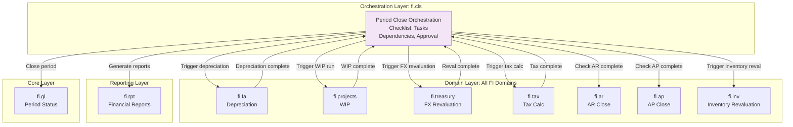
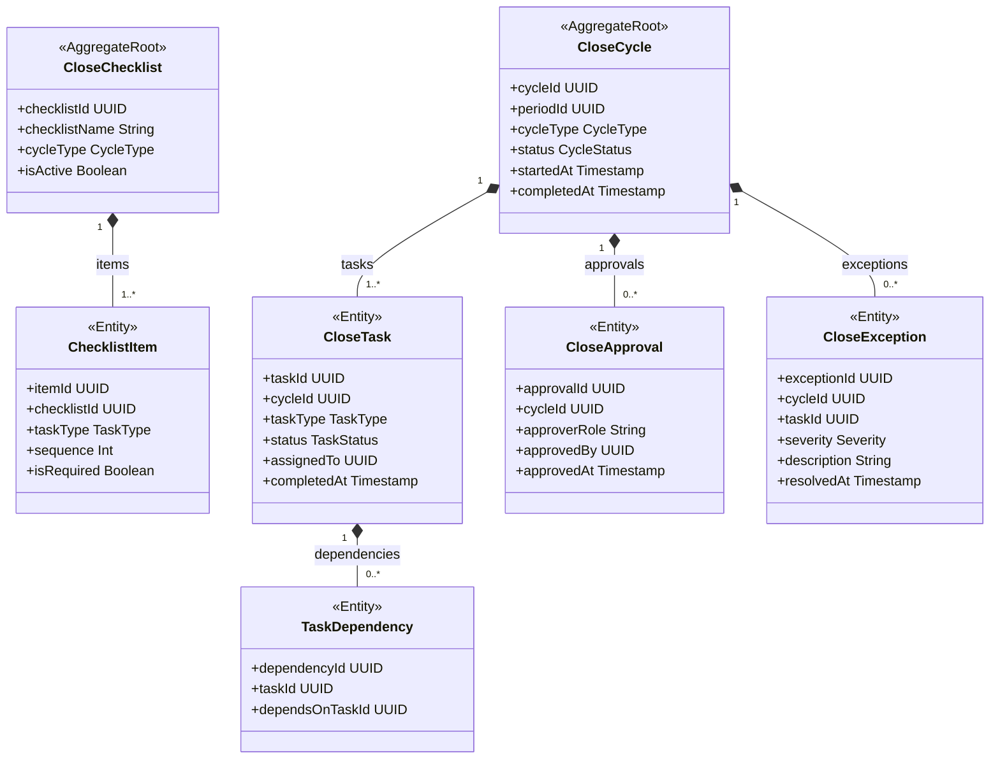
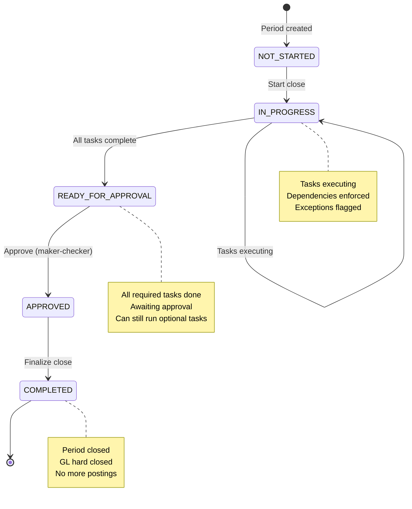
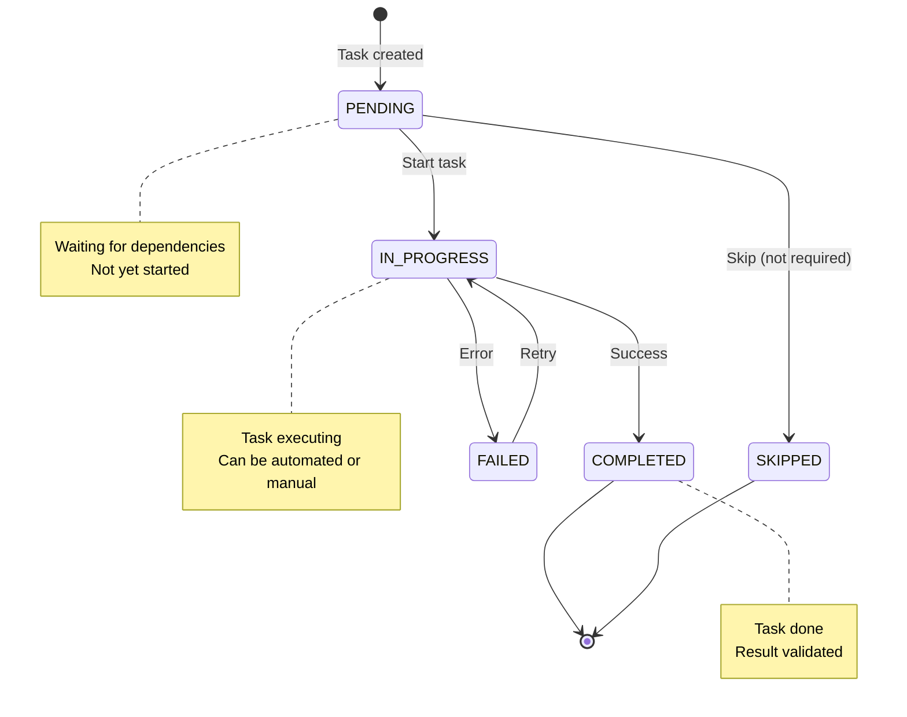
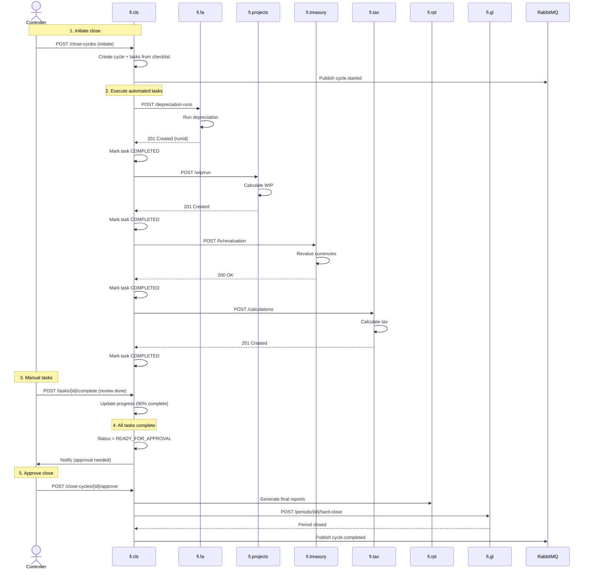

<!-- TEMPLATE COMPLIANCE: ~65%
Missing sections: §2 (Service Identity), §11 (Feature Dependencies), §12 (Extension Points)
Renumbering needed: §3 -> §5 (Use Cases), §5 -> §7 (Integration/Events), §6 -> §7 (Event Catalog, merge), §7 -> §6 (REST API), §8 -> §8 (Data Model), §9 -> §9 (Security), §10 -> §10 (Quality), §11 -> §13 (Migration), §12 -> §14 (Decisions), §13 -> §15 (Appendix)
Action needed: Add full Meta header block, add Specification Guidelines Compliance block, add §2 Service Identity, renumber all sections to match template §0-§15, add §11 Feature Dependencies stub, add §12 Extension Points stub
-->
# Service Domain Specification — `fi.cls` (Period Close Orchestration)

> **Meta Information**
> - **Version:** 2026-01-19
> - **Template:** `domain-service-spec.md` v1.0.0
> - **Template Compliance:** ~65% — §2, §11, §12 missing
> - **Author(s):** OpenLeap Architecture Team
> - **Status:** DRAFT
> - **Tier:** T3
> - **Suite:** `fi`
> - **Domain:** `cls`
> - **Service ID:** `fi-cls-svc`
> - **basePackage:** `io.openleap.fi.cls`
> - **API Base Path:** `/api/fi/cls/v1`

---

## Specification Guidelines Compliance

> **This specification MUST comply with the project-wide specification guidelines.**
>
> #### Non-negotiables
> - Never invent facts. If information is missing, add an **OPEN QUESTION** entry.
> - Use **MUST/SHOULD/MAY** for normative statements.
> - Keep the spec **self-contained**: no references to chat context.
> - Record decisions and boundaries explicitly (see Section 12).

---

## 0. Document Purpose & Scope

### 0.1 Purpose

This document specifies the **Period Close Orchestration (fi.cls)** domain, which orchestrates and automates the month-end, quarter-end, and year-end financial close process. It coordinates all subledger closes, runs depreciation and WIP calculations, executes currency revaluations, generates reports, and manages the close checklist to ensure a complete, accurate, and timely financial close.

### 0.2 Target Audience
- Product Owners & Business Stakeholders (Finance, Accounting, Controllership)
- System Architects & Technical Leads
- Integration Engineers
- Controllers and Financial Close Managers
- Accounting Operations Teams
- External Auditors
- CFOs and Finance Leadership

### 0.3 Scope

**In Scope:**
- **Close Process Orchestration:** Coordinate all month-end/quarter-end/year-end activities
- **Close Checklist:** Track completion of required tasks (depreciation, WIP, revaluation, reconciliations)
- **Task Dependencies:** Enforce task sequence (e.g., AR close before revenue recognition)
- **Automated Close Tasks:** Trigger depreciation runs, WIP runs, FX revaluation, tax calculations
- **Close Monitoring:** Real-time dashboard of close progress
- **Close Approval:** Maker-checker approval workflow for close completion
- **Period Status Management:** Open → Soft Close → Hard Close progression
- **Variance Analysis:** Compare actuals vs. forecast, period-over-period
- **Close Timeline:** Track close speed, SLA compliance (close within N days)
- **Audit Trail:** Complete trail of who did what when during close

**Out of Scope:**
- Individual transaction posting → `fi.pst` / `fi.gl` (initiated by subledger domains)
- Financial statement generation → `fi.rpt`
- Budget vs. actual analysis → Separate budgeting/planning domain
- Intercompany elimination → `fi.ic`
- Consolidation → `fi.cnsl`
- External reporting (10-K, 10-Q) → Regulatory reporting domain

### 0.4 Related Documents
- `platform/T3_Domains/FI/_fi_suite_v2_1.md` - FI Suite architecture (v2.1)
- `platform/T3_Domains/FI/fi_gl.md` - General Ledger
- `platform/T3_Domains/FI/fi_pst.md` - Posting orchestration
- `platform/T3_Domains/FI/fi_rpt.md` - Financial reporting read models
- `platform/T3_Domains/FI/fi_fa.md` - Fixed Assets (depreciation)
- `platform/T3_Domains/FI/fi_prj.md` - Project Accounting (WIP)
- `platform/T3_Domains/FI/fi_tax.md` - Tax Engine
- (OPEN QUESTION) Treasury domain spec file path/name in FI v2.1

---

## 1. Business Context

### 1.1 Domain Purpose

**fi.cls** automates and orchestrates the financial close process. Every month, companies must close their books: complete all transactions, run depreciation, reconcile accounts, calculate taxes, generate reports, and lock the period. This is a complex, time-sensitive process with many dependencies. This domain ensures close is completed accurately, completely, and on time.

**Core Business Problems Solved:**
- **Close Speed:** Reduce time to close (from 10 days to 3 days)
- **Close Accuracy:** Ensure all tasks completed, nothing missed
- **Visibility:** Real-time view of close progress
- **Automation:** Eliminate manual checklists, automate tasks
- **Compliance:** Ensure SOX controls, maker-checker approval
- **Predictability:** Know when close will complete
- **Audit Trail:** Document who did what when

### 1.2 Business Value

**For the Organization:**
- **Faster Close:** Reduce close cycle time by 70% (10 days → 3 days)
- **Cost Reduction:** Automate manual tasks, reduce overtime
- **Risk Reduction:** Prevent errors, ensure completeness
- **Compliance:** Meet SOX requirements, audit readiness
- **Decision Making:** Faster access to financial results
- **Scalability:** Support growth without adding headcount

**For Users:**
- **Controller:** Automated close orchestration, real-time progress tracking
- **Close Manager:** Task assignment, dependency management, SLA tracking
- **Accountant:** Clear checklist, automated tasks, no manual tracking
- **CFO:** On-time close, confidence in accuracy
- **Auditor:** Complete audit trail, controls documentation

### 1.3 Key Stakeholders

| Role | Responsibility | Primary Use Cases |
|------|----------------|-------------------|
| Controller | Overall close process | Initiate close, monitor progress, approve close |
| Close Manager | Task coordination | Assign tasks, track dependencies, resolve issues |
| Accountant | Execute tasks | Run depreciation, reconcile accounts, review variances |
| Tax Accountant | Tax tasks | Tax calculations, tax returns |
| Treasurer | Treasury tasks | FX revaluation, bank reconciliation |
| CFO | Close approval | Final approval, results review |
| External Auditor | Financial audit | Verify controls, review close process |

### 1.4 Strategic Positioning

**fi.cls** sits **above** all other FI domains, orchestrating their month-end activities.



**Key Insight:** fi.cls is the conductor of the close orchestra.

---

## 2. Domain Model

### 2.1 Conceptual Overview

The period close domain model consists of six main pillars:

1. **Close Cycle:** Represents a month/quarter/year close
2. **Close Tasks:** Individual activities in the close process
3. **Task Dependencies:** Sequence and prerequisites
4. **Close Checklist:** Template of required tasks
5. **Close Approvals:** Maker-checker workflow
6. **Close Monitoring:** Real-time progress tracking

**Key Principles:**
- **Orchestration Not Execution:** Coordinates, doesn't do the work
- **Task Dependencies:** Tasks execute in correct order
- **Automation:** Auto-trigger tasks where possible
- **Exception Management:** Flag issues, prevent auto-close
- **Audit Trail:** Complete documentation of close process
- **Maker-Checker:** Approval workflow for close completion

### 2.2 Core Concepts



### 2.3 Aggregate Definitions

#### 2.3.1 CloseCycle

**Business Purpose:**  
Represents a single close cycle (month-end, quarter-end, year-end). Tracks overall close progress.

**Key Attributes:**

| Attribute | Type | Description | Constraints |
|-----------|------|-------------|-------------|
| cycleId | UUID | Unique identifier | Required, immutable, PK |
| tenantId | UUID | Tenant ownership | Required, immutable |
| cycleNumber | String | Sequential number | Required, unique per tenant |
| periodId | UUID | Fiscal period | Required, FK to fi.gl.periods |
| entityId | UUID | Legal entity | Required, FK to entities |
| cycleType | CycleType | Type of close | Required, enum(MONTH_END, QUARTER_END, YEAR_END) |
| fiscalMonth | String | Fiscal period | Required, e.g., "2025-12" |
| status | CycleStatus | Current state | Required, enum(NOT_STARTED, IN_PROGRESS, READY_FOR_APPROVAL, APPROVED, COMPLETED) |
| targetCloseDate | Date | Target completion date | Required |
| actualCloseDate | Date | Actual completion date | Optional, set when COMPLETED |
| totalTasks | Int | Number of tasks | Required, >= 0 |
| completedTasks | Int | Completed tasks | Required, >= 0 |
| failedTasks | Int | Failed tasks | Required, >= 0 |
| percentComplete | Decimal | Completion percentage | Required, 0-100 |
| checklistId | UUID | Close checklist template | Required, FK to close_checklists |
| initiatedBy | UUID | User who started close | Required |
| initiatedAt | Timestamp | Initiation timestamp | Auto-generated |
| completedBy | UUID | User who completed close | Optional, set when COMPLETED |
| completedAt | Timestamp | Completion timestamp | Optional |
| slaStatus | SLAStatus | SLA compliance | Required, enum(ON_TIME, AT_RISK, OVERDUE) |

**Lifecycle States:**



**Business Rules & Invariants:**

1. **BR-CYCLE-001: Progress Calculation**
   - *Rule:* percentComplete = (completedTasks / totalTasks) × 100
   - *Rationale:* Track close progress
   - *Enforcement:* Calculated field

2. **BR-CYCLE-002: SLA Tracking**
   - *Rule:* If actualCloseDate > targetCloseDate, slaStatus = OVERDUE
   - *Rationale:* Monitor close speed
   - *Enforcement:* Automatic calculation

3. **BR-CYCLE-003: Approval Prerequisites**
   - *Rule:* Cannot approve if failedTasks > 0 or required tasks incomplete
   - *Rationale:* Ensure complete close
   - *Enforcement:* Validation on approval

**Example Close Cycle:**
```json
{
  "cycleNumber": "CLOSE-2025-12",
  "periodId": "period-uuid",
  "entityId": "entity-uuid",
  "cycleType": "MONTH_END",
  "fiscalMonth": "2025-12",
  "status": "IN_PROGRESS",
  "targetCloseDate": "2026-01-05",
  "totalTasks": 25,
  "completedTasks": 18,
  "failedTasks": 0,
  "percentComplete": 72.0,
  "slaStatus": "ON_TIME"
}
```

---

#### 2.3.2 CloseTask

**Business Purpose:**  
Individual activity within a close cycle. Represents a specific action to be completed.

**Key Attributes:**

| Attribute | Type | Description | Constraints |
|-----------|------|-------------|-------------|
| taskId | UUID | Unique identifier | Required, immutable, PK |
| cycleId | UUID | Parent cycle | Required, FK to close_cycles |
| taskNumber | Int | Task sequence | Required, unique per cycle |
| taskType | TaskType | Type of task | Required, enum(DEPRECIATION, WIP, FX_REVALUATION, TAX_CALC, RECONCILIATION, REPORT_GEN, MANUAL) |
| taskName | String | Task description | Required |
| status | TaskStatus | Current state | Required, enum(PENDING, IN_PROGRESS, COMPLETED, FAILED, SKIPPED) |
| isRequired | Boolean | Required for close | Required, default true |
| isAutomated | Boolean | Auto-triggered | Required, default false |
| assignedTo | UUID | Assigned user | Optional, FK to users |
| estimatedDuration | Int | Expected minutes | Optional |
| startedAt | Timestamp | Start timestamp | Optional, set when IN_PROGRESS |
| completedAt | Timestamp | Completion timestamp | Optional, set when COMPLETED |
| failedAt | Timestamp | Failure timestamp | Optional, set when FAILED |
| errorMessage | String | Failure reason | Optional, if FAILED |
| notes | String | User notes | Optional |
| targetDomainService | String | Service to call | Optional, for automated tasks, e.g., "fi.fa" |
| targetEndpoint | String | Endpoint to call | Optional, e.g., "/depreciation-runs" |

**Task Types:**

| Type | Description | Automated? | Example |
|------|-------------|------------|---------|
| DEPRECIATION | Run fixed asset depreciation | Yes | fi.fa POST /depreciation-runs |
| WIP | Run project WIP calculation | Yes | fi.projects POST /wip/run |
| FX_REVALUATION | Revalue foreign currency accounts | Yes | fi.treasury POST /fx/revaluation |
| TAX_CALC | Calculate tax accruals | Yes | fi.tax POST /calculations |
| RECONCILIATION | Reconcile subledger to GL | Manual | Accountant reviews variances |
| REPORT_GEN | Generate financial reports | Yes | fi.rpt POST /reports/generate |
| MANUAL | Manual task (e.g., journal entry) | Manual | Accountant posts adjustments |

**Lifecycle States:**



**Business Rules:**

1. **BR-TASK-001: Dependency Check**
   - *Rule:* Cannot start task if dependencies not complete
   - *Rationale:* Enforce sequence
   - *Enforcement:* Validation on start

2. **BR-TASK-002: Required Task**
   - *Rule:* Cannot complete cycle if required tasks not done
   - *Rationale:* Ensure complete close
   - *Enforcement:* Validation on approval

**Example Tasks:**

```
Task 1: Run Depreciation (AUTOMATED)
  Type: DEPRECIATION
  Assigned To: System
  Target: fi.fa POST /depreciation-runs
  Status: COMPLETED
  Duration: 2 minutes

Task 2: Run WIP Calculation (AUTOMATED)
  Type: WIP
  Assigned To: System
  Target: fi.projects POST /wip/run
  Status: COMPLETED
  Duration: 5 minutes

Task 3: Review AR Aging (MANUAL)
  Type: RECONCILIATION
  Assigned To: John Smith (Accountant)
  Status: IN_PROGRESS
  Notes: "Reviewing 90+ day items"

Task 4: FX Revaluation (AUTOMATED)
  Type: FX_REVALUATION
  Assigned To: System
  Target: fi.treasury POST /fx/revaluation
  Status: PENDING
  Dependencies: Task 1, Task 2 must complete first
```

---

#### 2.3.3 TaskDependency

**Business Purpose:**  
Defines prerequisite relationships between tasks. Ensures correct sequencing.

**Key Attributes:**

| Attribute | Type | Description | Constraints |
|-----------|------|-------------|-------------|
| dependencyId | UUID | Unique identifier | Required, immutable, PK |
| taskId | UUID | Dependent task | Required, FK to close_tasks |
| dependsOnTaskId | UUID | Prerequisite task | Required, FK to close_tasks |
| dependencyType | DepType | Type of dependency | Required, enum(HARD, SOFT) |

**Dependency Types:**

| Type | Description | Enforcement |
|------|-------------|-------------|
| HARD | Must complete before | Blocks task start if dependency not complete |
| SOFT | Should complete before | Warning if dependency not complete, but allows start |

**Example Dependencies:**

```
Task Graph:

Start Close
  ↓
Task 1: AR Close (HARD)
  ↓
Task 2: Revenue Recognition (HARD) ← depends on AR Close
  ↓
Task 3: Tax Calculation (HARD) ← depends on Revenue Recognition
  ↓
Task 4: Report Generation (SOFT) ← depends on Tax Calculation
  ↓
End Close
```

**Business Rules:**

1. **BR-DEP-001: No Circular Dependencies**
   - *Rule:* Dependency graph must be acyclic (DAG)
   - *Rationale:* Prevent deadlock
   - *Enforcement:* Cycle detection on creation

---

#### 2.3.4 CloseChecklist

**Business Purpose:**  
Template defining required tasks for a close type. Reusable across periods.

**Key Attributes:**

| Attribute | Type | Description | Constraints |
|-----------|------|-------------|-------------|
| checklistId | UUID | Unique identifier | Required, immutable, PK |
| tenantId | UUID | Tenant ownership | Required, immutable |
| checklistName | String | Checklist name | Required |
| cycleType | CycleType | Applicable close type | Required, enum(MONTH_END, QUARTER_END, YEAR_END) |
| entityId | UUID | Entity (if entity-specific) | Optional, FK to entities |
| version | Int | Checklist version | Required, starts at 1 |
| isActive | Boolean | Active for use | Required, default true |
| createdAt | Timestamp | Creation timestamp | Auto-generated |

**Example Checklist:**
```json
{
  "checklistName": "Standard Month-End Close",
  "cycleType": "MONTH_END",
  "version": 1,
  "isActive": true
}
```

---

#### 2.3.5 ChecklistItem

**Business Purpose:**  
Individual task definition within a checklist template.

**Key Attributes:**

| Attribute | Type | Description | Constraints |
|-----------|------|-------------|-------------|
| itemId | UUID | Unique identifier | Required, immutable, PK |
| checklistId | UUID | Parent checklist | Required, FK to close_checklists |
| itemNumber | Int | Item sequence | Required, unique per checklist |
| taskType | TaskType | Type of task | Required |
| taskName | String | Task description | Required |
| isRequired | Boolean | Required for close | Required, default true |
| isAutomated | Boolean | Auto-triggered | Required, default false |
| assignedRole | String | Role to assign to | Optional, e.g., "ACCOUNTANT" |
| estimatedDuration | Int | Expected minutes | Optional |
| dependencies | JSONB | Prerequisite items | Optional, array of item numbers |
| automationConfig | JSONB | Automation settings | Optional, {service, endpoint, payload} |

**Example Checklist Items:**

```json
[
  {
    "itemNumber": 1,
    "taskType": "DEPRECIATION",
    "taskName": "Run Fixed Asset Depreciation",
    "isRequired": true,
    "isAutomated": true,
    "assignedRole": "SYSTEM",
    "estimatedDuration": 2,
    "automationConfig": {
      "service": "fi.fa",
      "endpoint": "/depreciation-runs",
      "payload": {"periodId": "${periodId}", "bookType": "IFRS"}
    }
  },
  {
    "itemNumber": 2,
    "taskType": "WIP",
    "taskName": "Run Project WIP Calculation",
    "isRequired": true,
    "isAutomated": true,
    "assignedRole": "SYSTEM",
    "estimatedDuration": 5,
    "dependencies": [1],
    "automationConfig": {
      "service": "fi.projects",
      "endpoint": "/wip/run",
      "payload": {"periodId": "${periodId}"}
    }
  },
  {
    "itemNumber": 3,
    "taskType": "RECONCILIATION",
    "taskName": "Review AR Aging Report",
    "isRequired": true,
    "isAutomated": false,
    "assignedRole": "AR_ACCOUNTANT",
    "estimatedDuration": 30,
    "dependencies": [1]
  }
]
```

---

#### 2.3.6 CloseApproval

**Business Purpose:**  
Tracks approvals in the close process. Maker-checker workflow.

**Key Attributes:**

| Attribute | Type | Description | Constraints |
|-----------|------|-------------|-------------|
| approvalId | UUID | Unique identifier | Required, immutable, PK |
| cycleId | UUID | Close cycle | Required, FK to close_cycles |
| approverRole | String | Required approver role | Required, e.g., "CONTROLLER" |
| approvedBy | UUID | User who approved | Optional, FK to users |
| approvedAt | Timestamp | Approval timestamp | Optional |
| comments | String | Approval comments | Optional |
| status | ApprovalStatus | Current state | Required, enum(PENDING, APPROVED, REJECTED) |

**Approval Workflow:**
```
Step 1: Close Manager marks cycle READY_FOR_APPROVAL
  - All required tasks complete
  - No failed tasks
  - Status: READY_FOR_APPROVAL

Step 2: Controller reviews and approves
  - Reviews financial results
  - Checks for exceptions
  - Approves cycle
  - Status: APPROVED

Step 3: System finalizes close
  - Generates final reports
  - Closes GL period (hard close)
  - Status: COMPLETED
```

**Business Rules:**

1. **BR-APPR-001: Maker-Checker**
   - *Rule:* approvedBy != cycle.initiatedBy
   - *Rationale:* Segregation of duties
   - *Enforcement:* Validation on approval

---

#### 2.3.7 CloseException

**Business Purpose:**  
Captures issues and exceptions during close. Prevents auto-close if critical.

**Key Attributes:**

| Attribute | Type | Description | Constraints |
|-----------|------|-------------|-------------|
| exceptionId | UUID | Unique identifier | Required, immutable, PK |
| cycleId | UUID | Close cycle | Required, FK to close_cycles |
| taskId | UUID | Related task | Optional, FK to close_tasks |
| severity | Severity | Issue severity | Required, enum(INFO, WARNING, CRITICAL) |
| exceptionType | ExceptionType | Type of issue | Required, enum(TASK_FAILED, VARIANCE_THRESHOLD, RECONCILIATION_FAILED, DATA_QUALITY) |
| description | String | Issue description | Required |
| detectedAt | Timestamp | Detection timestamp | Auto-generated |
| resolvedBy | UUID | User who resolved | Optional, FK to users |
| resolvedAt | Timestamp | Resolution timestamp | Optional |
| resolutionNotes | String | How resolved | Optional |

**Severity Levels:**

| Severity | Description | Impact |
|----------|-------------|--------|
| INFO | Informational only | No impact on close |
| WARNING | Requires attention | Flag for review, but allows close |
| CRITICAL | Blocking issue | Prevents close approval |

**Example Exceptions:**

```
Exception 1: Depreciation Task Failed
  Severity: CRITICAL
  Type: TASK_FAILED
  Description: "Depreciation run failed: Asset A-123 has no depreciation method"
  Resolution: "Updated asset depreciation method, reran task"

Exception 2: AR Aging Variance
  Severity: WARNING
  Type: VARIANCE_THRESHOLD
  Description: "AR balance increased 15% vs. last month (threshold: 10%)"
  Resolution: "Reviewed, confirmed due to large sale to Customer XYZ"

Exception 3: Bank Reconciliation Failed
  Severity: CRITICAL
  Type: RECONCILIATION_FAILED
  Description: "Bank account balance variance: $5,000"
  Resolution: "Found unrecorded bank fee, posted adjustment"
```

---

## 3. Business Processes & Use Cases

### 3.1 Primary Use Cases

#### UC-001: Initiate Month-End Close

**Actor:** Controller

**Preconditions:**
- Period exists and OPEN
- Close checklist configured
- User has CLOSE_ADMIN role

**Main Flow:**
1. User initiates close (POST /close-cycles)
2. User specifies:
   - periodId (e.g., "2025-12")
   - checklistId (template)
   - targetCloseDate (e.g., "2026-01-05")
3. System creates CloseCycle (status = NOT_STARTED)
4. System retrieves ChecklistItems from template
5. System creates CloseTasks (one per checklist item)
6. System creates TaskDependencies based on checklist
7. System validates dependency graph (acyclic)
8. System calculates totalTasks, percentComplete = 0%
9. User starts close
10. System updates CloseCycle: status = IN_PROGRESS
11. System publishes fi.cls.cycle.started event
12. System triggers automated tasks with no dependencies

**Postconditions:**
- Close cycle created
- Tasks ready to execute
- Automated tasks triggered
- Events published

---

#### UC-002: Execute Automated Task (Depreciation)

**Actor:** System (automated)

**Preconditions:**
- Close cycle IN_PROGRESS
- Task dependencies satisfied
- Task isAutomated = true

**Main Flow:**
1. System checks task dependencies
2. All dependencies COMPLETED ✓
3. System updates CloseTask: status = IN_PROGRESS
4. System retrieves automationConfig:
   ```json
   {
     "service": "fi.fa",
     "endpoint": "/depreciation-runs",
     "payload": {"periodId": "period-uuid", "bookType": "IFRS"}
   }
   ```
5. System calls fi.fa POST /depreciation-runs
6. fi.fa executes depreciation run
7. fi.fa returns: 201 Created {runId}
8. System polls fi.fa GET /depreciation-runs/{runId} for status
9. fi.fa run status = POSTED
10. System updates CloseTask:
    - status = COMPLETED
    - completedAt = now
11. System updates CloseCycle:
    - completedTasks += 1
    - percentComplete = (18 / 25) × 100 = 72%
12. System publishes fi.cls.task.completed event
13. System checks dependent tasks
14. System triggers next automated task (WIP)

**Postconditions:**
- Depreciation run complete
- Task marked COMPLETED
- Progress updated
- Next task triggered

---

#### UC-003: Execute Manual Task

**Actor:** Accountant

**Preconditions:**
- Task assigned to user
- Dependencies satisfied
- User has required role

**Main Flow:**
1. User views assigned tasks (GET /close-cycles/{id}/tasks/my-tasks)
2. User sees task: "Review AR Aging Report"
3. User starts task (POST /tasks/{id}/start)
4. System updates CloseTask: status = IN_PROGRESS
5. User performs work:
   - Reviews AR aging report
   - Investigates large balances
   - Posts adjustments if needed
6. User completes task (POST /tasks/{id}/complete)
7. User provides notes: "Reviewed, all items validated"
8. System validates: No blocking issues
9. System updates CloseTask:
   - status = COMPLETED
   - completedAt = now
   - notes = user notes
10. System updates CloseCycle: completedTasks += 1
11. System publishes fi.cls.task.completed event

**Postconditions:**
- Manual task complete
- Notes recorded
- Progress updated

---

#### UC-004: Handle Task Failure

**Actor:** System (automated error handling)

**Preconditions:**
- Automated task executing
- Task fails with error

**Main Flow:**
1. System calls fi.fa POST /depreciation-runs
2. fi.fa returns: 400 Bad Request
   ```json
   {
     "error": "ASSET_MISSING_DEPRECIATION_METHOD",
     "message": "Asset A-123 has no depreciation method configured"
   }
   ```
3. System updates CloseTask:
   - status = FAILED
   - failedAt = now
   - errorMessage = error.message
4. System creates CloseException:
   - severity = CRITICAL
   - exceptionType = TASK_FAILED
   - description = error.message
5. System updates CloseCycle:
   - failedTasks += 1
   - slaStatus = AT_RISK (if approaching target)
6. System notifies assigned users (email/Slack)
7. System publishes fi.cls.task.failed event
8. User fixes issue (updates asset depreciation method)
9. User retries task (POST /tasks/{id}/retry)
10. System resets task: status = PENDING
11. System re-triggers task
12. Task succeeds
13. System updates CloseException: resolvedAt = now

**Postconditions:**
- Task failure recorded
- Exception created
- User notified
- Issue resolved
- Task retried successfully

---

#### UC-005: Approve and Complete Close

**Actor:** Controller

**Preconditions:**
- All required tasks COMPLETED
- No CRITICAL exceptions
- User has CLOSE_ADMIN role

**Main Flow:**
1. System calculates close readiness:
   - completedTasks = 25, totalTasks = 25 ✓
   - failedTasks = 0 ✓
   - CRITICAL exceptions = 0 ✓
2. System updates CloseCycle: status = READY_FOR_APPROVAL
3. System notifies Controller (approval needed)
4. Controller reviews close:
   - Reviews financial results
   - Checks variance reports
   - Reviews exceptions (2 WARNING, resolved)
5. Controller approves (POST /close-cycles/{id}/approve)
6. System validates: approvedBy != initiatedBy ✓
7. System creates CloseApproval:
   - approverRole = "CONTROLLER"
   - approvedBy = user
   - status = APPROVED
8. System updates CloseCycle: status = APPROVED
9. System finalizes close:
   a. Generates final reports (POST fi.rpt /reports/generate)
   b. Closes GL period (POST fi.gl /periods/{id}/hard-close)
   c. Updates CloseCycle:
      - status = COMPLETED
      - actualCloseDate = today
      - completedBy = user
      - completedAt = now
10. System calculates SLA:
    - Target: 2026-01-05
    - Actual: 2026-01-03
    - slaStatus = ON_TIME (2 days early)
11. System publishes fi.cls.cycle.completed event

**Postconditions:**
- Close approved and completed
- GL period hard closed
- Final reports generated
- SLA tracked
- Events published

---

### 3.2 Process Flow Diagrams

#### Process: Month-End Close Orchestration



---

## 4. Business Rules & Constraints

### 4.1 Business Rules Catalog

| ID | Rule Name | Description | Scope | Enforcement |
|----|-----------|-------------|-------|-------------|
| BR-CYCLE-001 | Progress Calculation | % = (completed / total) × 100 | CloseCycle | Always |
| BR-CYCLE-002 | SLA Tracking | OVERDUE if actual > target | CloseCycle | Always |
| BR-CYCLE-003 | Approval Prerequisites | No approval if failed tasks or critical exceptions | CloseCycle | Approve |
| BR-TASK-001 | Dependency Check | Cannot start if dependencies incomplete | CloseTask | Start |
| BR-TASK-002 | Required Task | Cannot close if required tasks incomplete | CloseTask | Approve |
| BR-DEP-001 | No Circular Dependencies | Dependency graph must be acyclic | TaskDependency | Create |
| BR-APPR-001 | Maker-Checker | Approver != Initiator | CloseApproval | Approve |

---

## 5. Integration Architecture

### 5.1 Integration Pattern Decision

**Does this domain use orchestration (Saga/Temporal)?** [X] YES [ ] NO

**Pattern Used:** Orchestration (Saga/Workflow)

**Rationale:**

fi.cls uses **Orchestration** because:

✅ **Multi-Service Coordination:**
- Calls fi.fa, fi.projects, fi.treasury, fi.tax, fi.rpt in sequence
- Needs to track completion of each service
- Requires compensating actions if tasks fail

✅ **Complex Dependencies:**
- Task A must complete before Task B
- Conditional logic (skip if not required)
- Parallel execution where possible

✅ **Long-Running Process:**
- Close can take hours or days
- Need persistent state
- Must handle retries and failures

✅ **Central Control:**
- fi.cls is the conductor
- Manages state, progress, dependencies
- Single source of truth for close status

**Technology:** Temporal (workflow orchestration)

### 5.2 Orchestration Flow

**Temporal Workflow:**
```python
@workflow
def monthly_close_workflow(cycle_id, checklist):
    # Phase 1: Subledger closes
    tasks_phase1 = [
        start_task("DEPRECIATION", "fi.fa"),
        start_task("WIP", "fi.projects"),
        start_task("INVENTORY_REVAL", "fi.inv")
    ]
    await asyncio.gather(*tasks_phase1)  # Parallel
    
    # Phase 2: Revenue & tax (depends on phase 1)
    tasks_phase2 = [
        start_task("REVENUE_RECOGNITION", "fi.revrec"),
        start_task("TAX_CALC", "fi.tax")
    ]
    await asyncio.gather(*tasks_phase2)
    
    # Phase 3: FX revaluation
    await start_task("FX_REVALUATION", "fi.treasury")
    
    # Phase 4: Reports
    await start_task("REPORT_GEN", "fi.rpt")
    
    # Phase 5: Wait for manual tasks
    await wait_for_manual_tasks()
    
    # Phase 6: Finalize
    await close_period()
```

**Outbound Events (Published):**

| Event | When | Purpose | Consumers |
|-------|------|---------|-----------|
| fi.cls.cycle.started | Close initiated | Track close start | fi.rpt, notifications |
| fi.cls.task.completed | Task done | Track progress | Dashboard, notifications |
| fi.cls.task.failed | Task failed | Alert users | Notifications, escalations |
| fi.cls.cycle.completed | Close finalized | Period closed | All FI domains, reports |

---

## 6. Event Catalog

### 6.1 Outbound Events

**Exchange:** `fi.cls.events` (RabbitMQ topic exchange)

#### Event: cycle.completed

**Routing Key:** `fi.cls.cycle.completed`

**When Published:** Close cycle approved and period hard closed

**Business Meaning:** Financial period successfully closed

**Consumers:**
- fi.rpt (generate final reports)
- All FI domains (period locked, no more postings)
- Notifications (notify stakeholders)

**Payload:**
```json
{
  "eventId": "evt-uuid",
  "tenantId": "tenant-uuid",
  "occurredAt": "2026-01-03T18:00:00Z",
  "traceId": "trace-uuid",
  "producer": "fi.cls",
  "aggregateType": "close_cycle",
  "changeType": "completed",
  "entityIds": ["cycle-uuid"],
  "version": 1,
  "payload": {
    "cycleId": "cycle-uuid",
    "cycleNumber": "CLOSE-2025-12",
    "periodId": "period-uuid",
    "fiscalMonth": "2025-12",
    "cycleType": "MONTH_END",
    "actualCloseDate": "2026-01-03",
    "targetCloseDate": "2026-01-05",
    "slaStatus": "ON_TIME",
    "totalTasks": 25,
    "completedTasks": 25,
    "durationHours": 48
  }
}
```

---

## 7. API Specification

### 7.1 REST API

**Base Path:** `/api/fi/closing/v1`

**Authentication:** OAuth 2.0 Bearer Token

**Content Type:** `application/json`

#### 7.1.1 Close Cycles

**POST /close-cycles** - Initiate close
- **Role:** CLOSE_ADMIN
- **Request Body:**
  ```json
  {
    "periodId": "period-uuid",
    "checklistId": "checklist-uuid",
    "targetCloseDate": "2026-01-05"
  }
  ```
- **Response:** 201 Created

**POST /close-cycles/{id}/start** - Start close execution
- **Role:** CLOSE_ADMIN
- **Response:** 200 OK

**POST /close-cycles/{id}/approve** - Approve close
- **Role:** CLOSE_ADMIN
- **Response:** 200 OK

**GET /close-cycles** - List cycles
- **Role:** CLOSE_VIEWER
- **Query Params:** `status`, `fiscalMonth`, `page`, `size`
- **Response:** 200 OK

**GET /close-cycles/{id}** - Get cycle details
- **Role:** CLOSE_VIEWER
- **Response:** 200 OK

---

#### 7.1.2 Tasks

**GET /close-cycles/{id}/tasks** - List cycle tasks
- **Role:** CLOSE_VIEWER
- **Query Params:** `status`, `taskType`, `assignedTo`
- **Response:** 200 OK

**GET /tasks/my-tasks** - Get my assigned tasks
- **Role:** USER
- **Response:** 200 OK

**POST /tasks/{id}/start** - Start manual task
- **Role:** TASK_ASSIGNEE
- **Response:** 200 OK

**POST /tasks/{id}/complete** - Complete task
- **Role:** TASK_ASSIGNEE
- **Request Body:**
  ```json
  {
    "notes": "Reviewed AR aging, all items validated"
  }
  ```
- **Response:** 200 OK

**POST /tasks/{id}/retry** - Retry failed task
- **Role:** CLOSE_ADMIN
- **Response:** 200 OK

---

### 7.2 Error Responses

| HTTP Status | Error Code | Description |
|-------------|------------|-------------|
| 400 | DEPENDENCIES_NOT_MET | Cannot start task, dependencies incomplete |
| 400 | CRITICAL_EXCEPTIONS_EXIST | Cannot approve close with critical exceptions |
| 403 | MAKER_CHECKER_VIOLATION | Same user cannot initiate and approve |
| 404 | CYCLE_NOT_FOUND | Close cycle does not exist |
| 409 | CYCLE_ALREADY_COMPLETED | Cannot modify completed cycle |

---

## 8. Data Model

### 8.1 Storage Schema (PostgreSQL)

#### Schema: fi_cls

#### Table: close_cycles
```sql
CREATE TABLE fi_cls.close_cycles (
  cycle_id UUID PRIMARY KEY,
  tenant_id UUID NOT NULL,
  cycle_number VARCHAR(50) NOT NULL,
  period_id UUID NOT NULL,
  entity_id UUID NOT NULL,
  cycle_type VARCHAR(20) NOT NULL,
  fiscal_month VARCHAR(7) NOT NULL,
  status VARCHAR(30) NOT NULL DEFAULT 'NOT_STARTED',
  target_close_date DATE NOT NULL,
  actual_close_date DATE,
  total_tasks INT NOT NULL DEFAULT 0,
  completed_tasks INT NOT NULL DEFAULT 0,
  failed_tasks INT NOT NULL DEFAULT 0,
  percent_complete NUMERIC(5,2) NOT NULL DEFAULT 0,
  checklist_id UUID NOT NULL,
  initiated_by UUID NOT NULL,
  initiated_at TIMESTAMP NOT NULL DEFAULT NOW(),
  completed_by UUID,
  completed_at TIMESTAMP,
  sla_status VARCHAR(20) NOT NULL DEFAULT 'ON_TIME',
  UNIQUE (tenant_id, cycle_number),
  CHECK (status IN ('NOT_STARTED', 'IN_PROGRESS', 'READY_FOR_APPROVAL', 'APPROVED', 'COMPLETED')),
  CHECK (cycle_type IN ('MONTH_END', 'QUARTER_END', 'YEAR_END')),
  CHECK (percent_complete >= 0 AND percent_complete <= 100)
);

CREATE INDEX idx_cycles_tenant ON fi_cls.close_cycles(tenant_id);
CREATE INDEX idx_cycles_period ON fi_cls.close_cycles(period_id);
CREATE INDEX idx_cycles_status ON fi_cls.close_cycles(status);
```

#### Table: close_tasks
```sql
CREATE TABLE fi_cls.close_tasks (
  task_id UUID PRIMARY KEY,
  cycle_id UUID NOT NULL REFERENCES fi_cls.close_cycles(cycle_id),
  task_number INT NOT NULL,
  task_type VARCHAR(30) NOT NULL,
  task_name VARCHAR(200) NOT NULL,
  status VARCHAR(20) NOT NULL DEFAULT 'PENDING',
  is_required BOOLEAN NOT NULL DEFAULT TRUE,
  is_automated BOOLEAN NOT NULL DEFAULT FALSE,
  assigned_to UUID,
  estimated_duration INT,
  started_at TIMESTAMP,
  completed_at TIMESTAMP,
  failed_at TIMESTAMP,
  error_message TEXT,
  notes TEXT,
  target_domain_service VARCHAR(50),
  target_endpoint VARCHAR(200),
  UNIQUE (cycle_id, task_number),
  CHECK (status IN ('PENDING', 'IN_PROGRESS', 'COMPLETED', 'FAILED', 'SKIPPED'))
);

CREATE INDEX idx_tasks_cycle ON fi_cls.close_tasks(cycle_id);
CREATE INDEX idx_tasks_status ON fi_cls.close_tasks(status);
CREATE INDEX idx_tasks_assigned ON fi_cls.close_tasks(assigned_to);
```

---

## 9. Security & Compliance

### 9.1 Access Control

**Roles & Permissions:**

| Role | Read | Create | Update | Delete | Admin Operations |
|------|------|--------|--------|--------|------------------|
| CLOSE_VIEWER | ✓ (all) | ✗ | ✗ | ✗ | ✗ |
| CLOSE_ADMIN | ✓ (all) | ✓ (cycles) | ✓ (cycles) | ✗ | ✓ (approve, retry) |
| TASK_ASSIGNEE | ✓ (assigned) | ✗ | ✓ (assigned tasks) | ✗ | ✗ |

---

## 10. Quality Attributes

### 10.1 Performance Requirements

**Response Time (95th percentile):**
- POST /close-cycles: < 500ms
- GET /close-cycles/{id}: < 200ms
- POST /tasks/{id}/start: < 300ms

**Close Duration:**
- Target: 3-5 business days
- Current (manual): 10 business days
- Goal: 70% reduction

---

## 11. Migration & Evolution

### 11.1 Data Migration

**From Legacy:**
- Export manual close checklists
- Import as CloseChecklists
- Configure automated tasks
- Train users on new process

---

## 12. Open Questions & Decisions

### 12.1 ADRs

#### ADR-001: Orchestration vs. Choreography

**Status:** Accepted

**Decision:** Use orchestration (Temporal) for close process

**Rationale:**
- Complex dependencies between tasks
- Need central coordination
- Long-running process with state
- Easier to visualize and debug

---

## 13. Appendix

### 13.1 Glossary

| Term | Definition |
|------|------------|
| Close Cycle | Complete month/quarter/year end process |
| Hard Close | Period locked, no more postings |
| Soft Close | Initial close, can still adjust |
| SLA | Service Level Agreement (close timing) |
| Maker-Checker | Two-person approval workflow |

