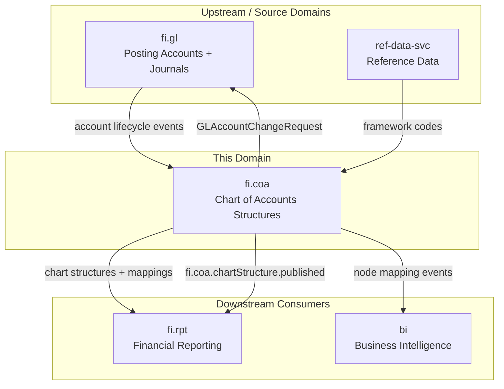
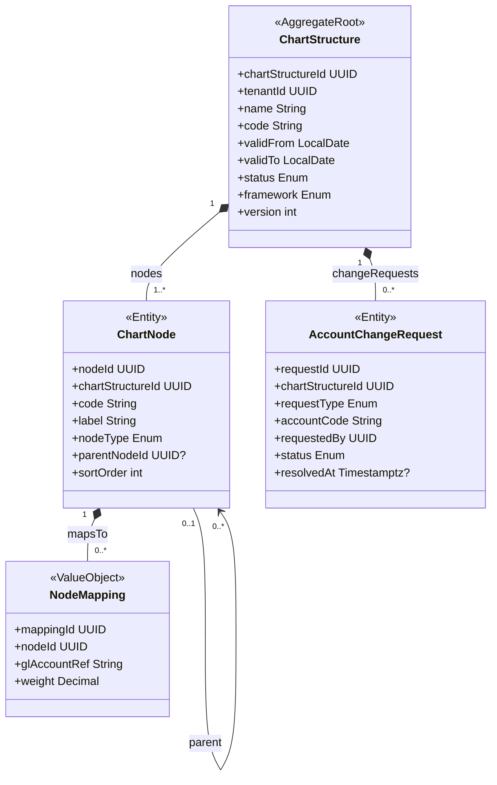
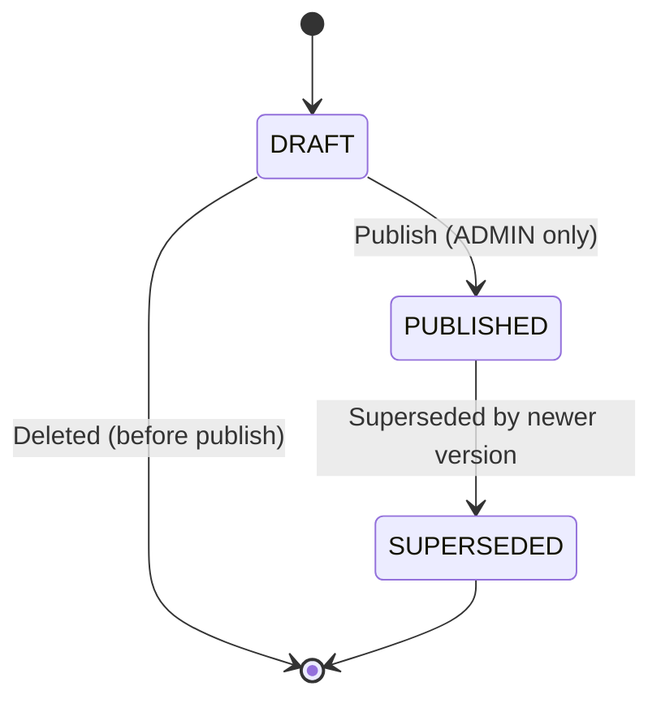
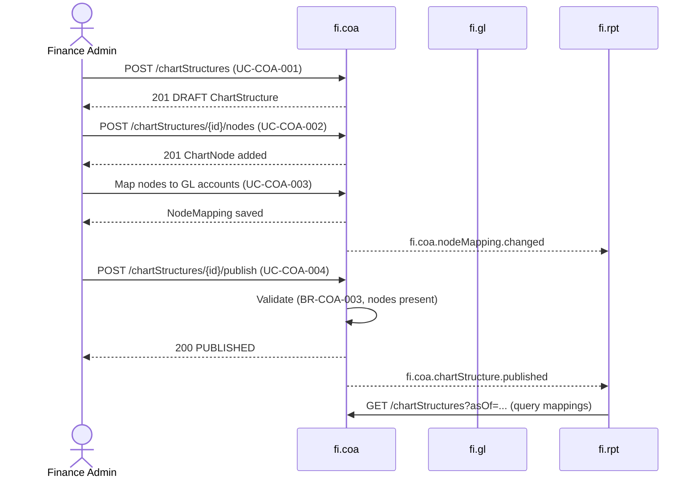
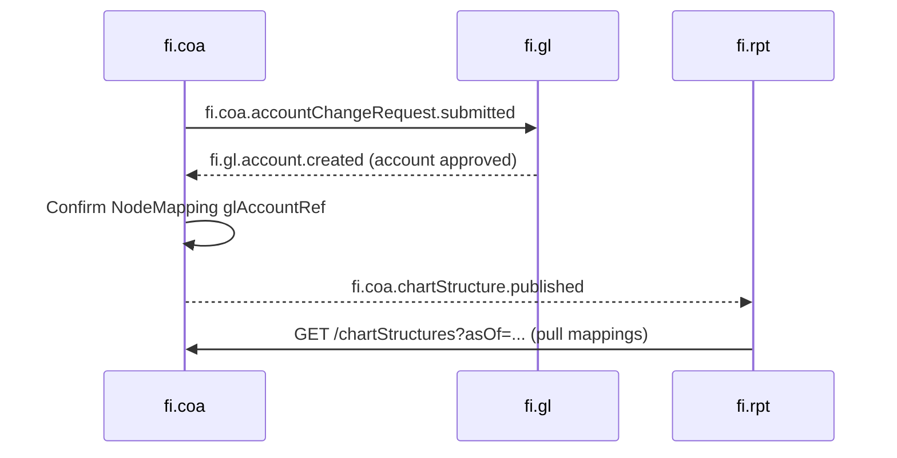
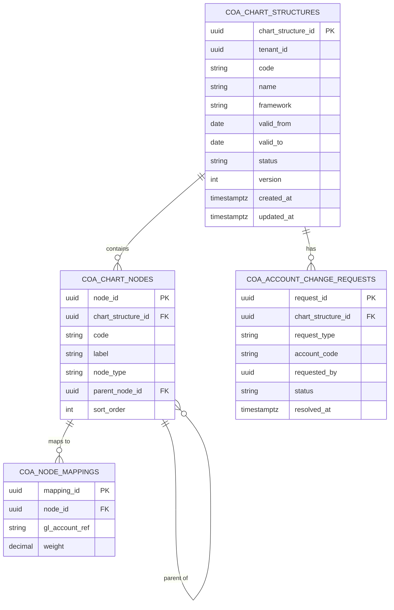

<!-- TEMPLATE COMPLIANCE: ~95%
Present sections: §0–§15 all present with full sub-section hierarchy per TPL-SVC v1.0.0.
Content depth: Full attribute tables, request/response JSON, event envelopes, table definitions, extension points (all 5 types), cross-domain workflows, use case detail flows.
Remaining gaps: Port and Repository not yet assigned (OPEN QUESTION); feature IDs TBD pending Phase 3 feature specs.
-->
# FI.COA - Chart of Accounts Structures Domain / Service Specification

> **Conceptual Stack Layer:** Domain / Service
> **Space:** Platform
> **Owner:** Domain Engineering Team
> **Schema alignment:** `service-layer.schema.json`
> **Companion files:** `openapi.yaml`, `*.schema.json` (event contracts)
> **Referenced by:** Platform-Feature Spec SS5 (backend dependencies), BFF Contract
> **Belongs to:** FI Suite Spec (`_fi_suiteV2.md`)

> **Meta Information**
> - **Version:** 2026-04-04
> - **Template:** `domain-service-spec.md` v1.0.0
> - **Template Compliance:** ~95% — remaining gaps: port/repository assignment, feature IDs pending Phase 3
> - **Author(s):** OpenLeap Architecture Team
> - **Status:** DRAFT
> - **Suite:** `fi`
> - **Domain:** `coa`
> - **Bounded Context Ref:** `bc:chart-of-accounts`
> - **Service ID:** `fi-coa-svc`
> - **basePackage:** `io.openleap.fi.coa`
> - **API Base Path:** `/api/fi/coa/v1`
> - **OpenLeap Starter Version:** `v1`
> - **Port:** OPEN QUESTION
> - **Repository:** OPEN QUESTION
> - **Tags:** `fi`, `chart-of-accounts`, `reporting-structure`, `account-hierarchy`, `versioning`
> - **Team:**
>   - Name: `team-fi`
>   - Email: `fi-team@openleap.io`
>   - Slack: `#fi-team`

---

## Specification Guidelines Compliance

> ### Non-Negotiables
> - Never invent facts. If required info is missing, add an **OPEN QUESTION** entry.
> - Preserve intent and decisions. Only change meaning when explicitly requested.
> - Do not remove normative constraints unless they are explicitly replaced.
> - Keep the spec **self-contained**: no "see chat", no implicit context.
>
> ### Source of Truth Priority
> When sources conflict:
> 1. Spec (explicit) wins
> 2. Starter specs (implementation constraints) next
> 3. Guidelines (best practices) last
>
> Record conflicts in the **Decisions & Open Questions** section (see Section 14).
>
> ### Style Guide
> - Prefer short sentences and lists.
> - Use MUST/SHOULD/MAY for normative statements.
> - Keep terminology consistent (Aggregate, Domain Service, Application Service, Command, Event).
> - Avoid ambiguous words ("often", "maybe") unless explicitly noting uncertainty.
> - Keep examples minimal and clearly marked as examples.
> - Do not add implementation code unless the chapter explicitly requires it.

---

## 0. Document Purpose & Scope

### 0.1 Purpose
`fi.coa` specifies the Chart of Accounts **structures** used for classification, grouping, and reporting of postings in the FI suite. It provides versioned hierarchical structures (chart structures) that map reporting groups and nodes to authoritative posting accounts owned by `fi.gl`. `fi.coa` is NOT the authoritative store for posting accounts — that responsibility belongs exclusively to `fi.gl`.

### 0.2 Target Audience
- Product Owners & Business Stakeholders (Finance)
- System Architects & Technical Leads
- Integration Engineers
- Reporting Engineers building financial statement models

### 0.3 Scope

**In Scope:**
- Versioned chart structures (trees/hierarchies) for reporting and grouping
- Effective-dating (validFrom/validTo) of chart structure versions
- Controlled mapping of chart nodes to `fi.gl` posting accounts (by reference/code)
- Query APIs for chart navigation, node lookup, and mapping retrieval
- Finance Admin workflow to draft and submit GL account create/update requests to `fi.gl`
- Framework classification (IFRS, GAAP, LOCAL, MGMT) per structure

**Out of Scope:**
- Authoritative store (system of record) for posting accounts (`GLAccount`) — belongs to `fi.gl`
- Applying account lifecycle changes without `fi.gl` approval
- Posting journals or changing ledger balances — belongs to `fi.gl`
- Financial statement rendering — belongs to `fi.rpt`
- Validating debit/credit rules or posting invariants

### 0.4 Terms & Acronyms
- **Posting Account:** A ledger account used in journal lines; owned and authoritative in `fi.gl`.
- **Chart Structure:** A versioned hierarchy used for reporting (e.g., Balance Sheet groupings, P&L groupings).
- **Chart Node:** A single grouping element (e.g., "Revenue", "Cash and Cash Equivalents") within a chart structure.
- **NodeMapping:** A rule linking a chart node to one or more `fi.gl` posting account codes (by reference).
- **Effective Dating:** Versioning pattern where structures are valid within a date range (validFrom/validTo).
- **Framework:** The accounting framework a structure targets (IFRS/GAAP/LOCAL/MGMT).
- **AccountChangeRequest:** A request submitted from `fi.coa` to `fi.gl` to create, update, or deactivate a GL posting account.

### 0.5 Related Documents
- Suite architecture: `spec/T3_Domains/FI/_fi_suiteV2.md`
- Neighbor domain specs: `spec/T3_Domains/FI/domain-specs/fi_gl-spec.md`, `spec/T3_Domains/FI/domain-specs/fi_rpt-spec.md`
- Platform architecture: `SYSTEM_OVERVIEW.md`
- Event standards: `EVENT_STANDARDS.md`

---

## 1. Business Context

### 1.1 Domain Purpose
`fi.coa` bridges the gap between **how a company organises its ledger** (`fi.gl`) and **how financial information is reported** (`fi.rpt`). Finance Admins maintain stable, governed chart structures so that reporting and groupings remain consistent even as operational domains and GL account lists evolve. Effective-dating allows multiple versions to coexist for different reporting periods and frameworks.

### 1.2 Business Value
- Enables consistent financial statement structures across periods and legal entities.
- Decouples posting integrity (`fi.gl`) from reporting classification (`fi.coa`), reducing coupling risk.
- Provides a governed workflow to steer GL account lifecycle changes while preserving `fi.gl` as the authority.
- Supports multi-framework reporting (IFRS and local GAAP simultaneously) via separate versioned structures.
- Gives `fi.rpt` a stable, queryable mapping to build financial reports without direct GL coupling.

### 1.3 Key Stakeholders

| Role | Responsibility | Primary Use Cases |
|------|----------------|-------------------|
| Finance Admin | Maintain chart structures; steer GL account changes | UC-COA-001, UC-COA-002, UC-COA-003, UC-COA-004, UC-COA-005 |
| Controller / Accountant | Use reporting structures for period-end reporting | UC-COA-006 |
| Reporting Engineer | Consume node-to-GL mappings for financial report models | UC-COA-006 |
| Auditor | Inspect versioned chart structures for governance | UC-COA-006 |

### 1.4 Strategic Positioning



### 1.5 Service Context

| Field | Value |
|-------|-------|
| Suite | `fi` (Finance) |
| Domain | `coa` (Chart of Accounts Structures) |
| Bounded Context | `bc:chart-of-accounts` |
| Service ID | `fi-coa-svc` |
| Base Package | `io.openleap.fi.coa` |

**Responsibilities:**
- Maintain versioned, effective-dated chart structures (hierarchies) for financial reporting
- Manage chart node trees (GROUP / SUMMARY / LEAF) within structures
- Map LEAF nodes to `fi.gl` posting account codes (by reference)
- Provide query APIs for chart navigation, node lookup, and mapping retrieval
- Steer GL account lifecycle changes via AccountChangeRequest workflow to `fi.gl`
- Support multi-framework reporting structures (IFRS, GAAP, LOCAL, MGMT)

**Authoritative Sources:**

| Source Type | Description | Access Pattern |
|-------------|-------------|----------------|
| REST API | Chart structures, nodes, mappings, account change requests | Synchronous |
| Database | `coa_chart_structures`, `coa_chart_nodes`, `coa_node_mappings`, `coa_account_change_requests` | Direct (owner) |
| Events | `fi.coa.chartStructure.*`, `fi.coa.nodeMapping.*`, `fi.coa.accountChangeRequest.*` | Asynchronous |

---

## 2. Service Identity

| Field | Value |
|-------|-------|
| **Service ID** | `fi-coa-svc` |
| **Display Name** | Chart of Accounts Structures Service |
| **Suite** | `fi` |
| **Domain** | `coa` |
| **Bounded Context Ref** | `bc:chart-of-accounts` |
| **Version** | 2026-04-04 |
| **Status** | DRAFT |
| **API Base Path** | `/api/fi/coa/v1` |
| **Repository** | OPEN QUESTION |
| **Tags** | `fi`, `chart-of-accounts`, `reporting-structure`, `account-hierarchy`, `versioning` |
| **Team Name** | `team-fi` |
| **Team Email** | `fi-team@openleap.io` |
| **Team Slack** | `#fi-team` |

---

## 3. Domain Model

### 3.1 Conceptual Overview

The domain centres on the **ChartStructure** aggregate — a versioned, effective-dated hierarchy of chart nodes used for financial reporting. Each structure contains one or more **ChartNodes** forming a tree (GROUP → SUMMARY → LEAF). LEAF nodes carry **NodeMappings** that reference `fi.gl` posting account codes. The **AccountChangeRequest** entity supports a governed workflow for Finance Admins to request GL account changes via `fi.coa` without owning the GL accounts.



### 3.2 Core Concepts

| Concept | Owner | Description |
|---------|-------|-------------|
| ChartStructure | fi-coa-svc | A versioned hierarchy for reporting groupings; effective-dated and framework-specific |
| ChartNode | fi-coa-svc | A single grouping node (GROUP/SUMMARY/LEAF) within a chart structure |
| NodeMapping | fi-coa-svc | Value object linking a LEAF node to a `fi.gl` posting account code with optional weight |
| AccountChangeRequest | fi-coa-svc | Request submitted to `fi.gl` to create/update/deactivate a GL account, managed here as a workflow record |

### 3.3 Aggregate Definitions

#### 3.3.1 Aggregate: ChartStructure

**Aggregate ID:** `agg:chart-structure`
**Business Purpose:** Represents a complete, versioned chart of accounts hierarchy valid for a given period and accounting framework. It is the entry point for all structure mutations and the authoritative source for reporting group definitions.

**Aggregate Root Attributes:**

| Attribute | Type | Format | Required | Description | Example | Constraints |
|-----------|------|--------|----------|-------------|---------|-------------|
| chartStructureId | UUID | uuid | Yes | Unique identifier | `cs-uuid` | Immutable after create, `OlUuid.create()` |
| tenantId | UUID | uuid | Yes | Tenant ownership | `t1-uuid` | Immutable, RLS-enforced |
| name | String | — | Yes | Human-readable name | `"IFRS Balance Sheet 2026"` | Max 255 chars |
| code | String | — | Yes | Business code | `"BS-IFRS"` | Max 50 chars, unique per tenant+framework |
| validFrom | LocalDate | ISO 8601 date | Yes | Effective start date | `2026-01-01` | Must be before validTo if set |
| validTo | LocalDate | ISO 8601 date | No | Effective end date | `2026-12-31` | Must be >= validFrom |
| status | Enum | — | Yes | Lifecycle state | `DRAFT` | DRAFT, PUBLISHED, SUPERSEDED |
| framework | Enum | — | Yes | Accounting framework | `IFRS` | IFRS, GAAP, LOCAL, MGMT |
| version | Integer | — | Yes | Optimistic locking version | `1` | Auto-incremented |
| createdAt | Timestamptz | ISO 8601 | Yes | Creation timestamp | `2026-01-01T10:00:00Z` | System-managed |
| updatedAt | Timestamptz | ISO 8601 | Yes | Last update timestamp | `2026-01-01T10:00:00Z` | System-managed |

**Lifecycle States:**



**State Descriptions:**

| State | Description | Business Meaning |
|-------|-------------|------------------|
| DRAFT | Initial creation state | Structure is being prepared; nodes and mappings can be added, modified, or removed freely |
| PUBLISHED | Active operational state | Structure is locked, immutable, and available for reporting consumers |
| SUPERSEDED | Terminal archival state | Structure has been replaced by a newer published version; retained for historical audit |

**State Transitions:**

| From | To | Trigger | Guard / Precondition | Side Effects |
|------|----|---------|---------------------|--------------|
| — | DRAFT | Create | Valid code+framework+validFrom, no overlapping validity (BR-COA-001) | — |
| DRAFT | PUBLISHED | Publish | FI_COA_ADMIN role (BR-COA-003), at least one ChartNode exists | Emits `fi.coa.chartStructure.published`; previous active version PUBLISHED→SUPERSEDED |
| PUBLISHED | SUPERSEDED | Superseded | Newer PUBLISHED structure with same code+framework effective | Emits `fi.coa.chartStructure.superseded` |

**Invariants:**
- INV-CS-001: No two ChartStructures MUST share the same `code` + `framework` combination with overlapping `validFrom`/`validTo` periods (BR-COA-001)
- INV-CS-002: A PUBLISHED ChartStructure MUST be read-only — no field mutations or node changes (BR-COA-004)
- INV-CS-003: Only a principal with role `FI_COA_ADMIN` MAY publish a ChartStructure (BR-COA-003)

**Domain Events Emitted:**

| Event | Routing Key | When | Key Payload |
|-------|-------------|------|-------------|
| ChartStructureCreated | `fi.coa.chartStructure.created` | New structure created | chartStructureId, code, framework, validFrom |
| ChartStructurePublished | `fi.coa.chartStructure.published` | DRAFT → PUBLISHED | chartStructureId, code, framework, validFrom, validTo |
| ChartStructureSuperseded | `fi.coa.chartStructure.superseded` | PUBLISHED → SUPERSEDED | chartStructureId, supersededBy |

#### 3.3.2 Entity: ChartNode (child of ChartStructure)

**Business Purpose:** Represents a single element in the reporting hierarchy — a GROUP (top-level), SUMMARY (intermediate), or LEAF (maps to GL accounts). Forms a tree via `parentNodeId`.

| Attribute | Type | Format | Required | Description | Example | Constraints |
|-----------|------|--------|----------|-------------|---------|-------------|
| nodeId | UUID | uuid | Yes | Unique identifier | `node-uuid` | Immutable, `OlUuid.create()` |
| chartStructureId | UUID | uuid | Yes | Parent structure | `cs-uuid` | FK to ChartStructure |
| code | String | — | Yes | Node code | `"1000"` | Unique within structure (BR-COA-002), max 50 chars |
| label | String | — | Yes | Human-readable label | `"Revenue"` | Max 255 chars |
| nodeType | Enum | — | Yes | Node classification | `GROUP` | GROUP, SUMMARY, LEAF |
| parentNodeId | UUID | uuid | No | Parent node reference | `parent-uuid` | Null for root nodes; FK to ChartNode |
| sortOrder | Integer | — | Yes | Display ordering | `10` | Default 0 |

**Invariants:**
- INV-CN-001: `code` MUST be unique within a `ChartStructure` (BR-COA-002)
- INV-CN-002: A ChartNode belonging to a PUBLISHED ChartStructure is read-only (BR-COA-004)

#### 3.3.3 Value Object: NodeMapping (child of ChartNode)

**VO ID:** `vo:node-mapping`
**Business Purpose:** Maps a LEAF chart node to a `fi.gl` posting account code, with an optional weight for proportional allocations. Not persisted as a standalone aggregate — belongs to a ChartNode.

| Attribute | Type | Format | Required | Description | Example | Constraints |
|-----------|------|--------|----------|-------------|---------|-------------|
| mappingId | UUID | uuid | Yes | Unique identifier | `map-uuid` | `OlUuid.create()` |
| nodeId | UUID | uuid | Yes | Owning chart node | `node-uuid` | FK to ChartNode |
| glAccountRef | String | — | Yes | GL account code reference | `"10100"` | Reference to `fi.gl` account code; max 50 chars |
| weight | Decimal | (10,6) | No | Proportional weight | `1.000000` | 0 < weight <= 1.0; SHOULD sum to 1.0 per node (BR-COA-005) |

**Validation Rules:**
- `glAccountRef` MUST reference a code in `fi.gl` (validated via fi.gl.account.created/statusChanged events or synchronous lookup)
- `weight` SHOULD sum to 1.0 across all NodeMappings for the same `nodeId` when multiple mappings exist

**Domain Events Emitted:**

| Event | Routing Key | When | Key Payload |
|-------|-------------|------|-------------|
| NodeMappingChanged | `fi.coa.nodeMapping.changed` | Mapping added/updated/removed on DRAFT structure | chartStructureId, nodeId, glAccountRef |

#### 3.3.4 Entity: AccountChangeRequest (child of ChartStructure)

**Business Purpose:** Represents a Finance Admin's request to create, update, or deactivate a GL posting account in `fi.gl`. `fi.coa` owns the request lifecycle; `fi.gl` is authoritative and may accept or reject.

| Attribute | Type | Format | Required | Description | Example | Constraints |
|-----------|------|--------|----------|-------------|---------|-------------|
| requestId | UUID | uuid | Yes | Unique identifier | `req-uuid` | Immutable, `OlUuid.create()` |
| chartStructureId | UUID | uuid | Yes | Associated chart structure | `cs-uuid` | FK to ChartStructure |
| requestType | Enum | — | Yes | Type of GL change | `CREATE` | CREATE, UPDATE, DEACTIVATE |
| accountCode | String | — | Yes | Target GL account code | `"10100"` | Max 50 chars |
| requestedBy | UUID | uuid | Yes | Principal who submitted | `user-uuid` | FK to iam.principal |
| status | Enum | — | Yes | Request lifecycle state | `PENDING` | PENDING, ACCEPTED, REJECTED |
| resolvedAt | Timestamptz | ISO 8601 | No | When fi.gl responded | `2026-01-15T10:00:00Z` | System-managed on resolution |

**Domain Events Emitted:**

| Event | Routing Key | When | Key Payload |
|-------|-------------|------|-------------|
| AccountChangeRequestSubmitted | `fi.coa.accountChangeRequest.submitted` | Request created | requestId, chartStructureId, requestType, accountCode |

### 3.4 Enumerations

#### ChartStructureStatus

**Description:** Lifecycle state of a chart structure version.

| Value | Description | Deprecated |
|-------|-------------|------------|
| `DRAFT` | Structure is being prepared; mutable. Nodes and mappings can be added, updated, or removed. | No |
| `PUBLISHED` | Structure is active and locked. Available for reporting consumers. Immutable (BR-COA-004). | No |
| `SUPERSEDED` | Structure has been replaced by a newer published version with the same code+framework. Retained for audit. | No |

#### AccountingFramework

**Description:** The accounting standard or reporting framework a chart structure targets. Inspired by SAP FI-GL chart of accounts types (operating chart, group chart, country chart).

| Value | Description | Deprecated |
|-------|-------------|------------|
| `IFRS` | International Financial Reporting Standards. Used for consolidated, internationally comparable financial statements. Equivalent to SAP "group chart of accounts". | No |
| `GAAP` | Generally Accepted Accounting Principles (US GAAP or equivalent national standard). Used for statutory reporting in jurisdictions following GAAP. | No |
| `LOCAL` | Local/country-specific statutory chart (e.g., German SKR03/SKR04, French PCG). Equivalent to SAP "country chart of accounts". | No |
| `MGMT` | Management reporting framework. Internal, non-statutory groupings used for cost center analysis, segment reporting, or executive dashboards. | No |

#### NodeType

**Description:** Classification of a chart node within the reporting hierarchy.

| Value | Description | Deprecated |
|-------|-------------|------------|
| `GROUP` | Top-level grouping node (e.g., "Assets", "Liabilities & Equity", "Revenue"). Has no direct GL mappings. Contains SUMMARY or LEAF children. | No |
| `SUMMARY` | Intermediate roll-up node (e.g., "Current Assets", "Non-Current Assets"). Aggregates child LEAF or SUMMARY nodes. No direct GL mappings. | No |
| `LEAF` | Terminal node that carries NodeMappings to `fi.gl` posting account codes. Represents the lowest level of the reporting hierarchy (e.g., "Cash and Cash Equivalents", "Trade Receivables"). | No |

#### AccountChangeRequestType

**Description:** Type of GL account lifecycle change being requested from `fi.coa` to `fi.gl`.

| Value | Description | Deprecated |
|-------|-------------|------------|
| `CREATE` | Request `fi.gl` to create a new posting account with the specified account code. | No |
| `UPDATE` | Request `fi.gl` to update an existing posting account (e.g., change name, account group). | No |
| `DEACTIVATE` | Request `fi.gl` to deactivate a posting account so it can no longer receive postings. | No |

#### AccountChangeRequestStatus

**Description:** Resolution state of an AccountChangeRequest.

| Value | Description | Deprecated |
|-------|-------------|------------|
| `PENDING` | Request has been submitted to `fi.gl` and is awaiting processing. | No |
| `ACCEPTED` | `fi.gl` has processed the request successfully. The GL account has been created, updated, or deactivated. | No |
| `REJECTED` | `fi.gl` has rejected the request (e.g., duplicate account code, policy violation). | No |

### 3.5 Shared Types

#### EffectiveDateRange

| Property | Value |
|----------|-------|
| **Type ID** | `type:effective-date-range` |
| **Name** | `EffectiveDateRange` |

**Description:** A date range representing the validity period of a versioned entity. Used across financial domain aggregates to control effective-dating of structures and configurations.

**Attributes:**

| Attribute | Type | Format | Description | Constraints |
|-----------|------|--------|-------------|-------------|
| validFrom | string | date | Effective start date (inclusive) | Required, ISO 8601 |
| validTo | string | date | Effective end date (inclusive) | Optional; MUST be >= validFrom if provided |

**Validation Rules:**
- `validFrom` MUST be a valid ISO 8601 date
- `validTo` MUST be >= `validFrom` when provided
- If `validTo` is null, the range is open-ended (no expiry)

**Used By:**
- `agg:chart-structure` (validFrom, validTo attributes)

---

## 4. Business Rules & Constraints

### 4.1 Business Rules Catalog

| ID | Rule Name | Description | Scope | Enforcement | Error Code |
|----|-----------|-------------|-------|-------------|------------|
| BR-COA-001 | No Overlapping Validity | Two ChartStructures with the same code+framework MUST NOT have overlapping validFrom/validTo periods | ChartStructure | Create/Update | `COA-BIZ-001` |
| BR-COA-002 | Node Code Unique Within Structure | ChartNode codes MUST be unique within a ChartStructure | ChartNode | Create/Update | `COA-VAL-002` |
| BR-COA-003 | Admin-Only Publish | Only a principal with role FI_COA_ADMIN MAY publish a ChartStructure | ChartStructure | Publish | `COA-BIZ-003` |
| BR-COA-004 | Published Structure Read-Only | A PUBLISHED ChartStructure and its nodes MUST be immutable | ChartStructure, ChartNode | Any mutating operation | `COA-BIZ-004` |
| BR-COA-005 | Mapping Weight Sum | NodeMapping weights SHOULD sum to 1.0 per node when multiple GL accounts are mapped | NodeMapping | Create/Update | `COA-WARN-005` |
| BR-COA-006 | GL Account Ref Validity | A NodeMapping glAccountRef SHOULD reference an active GL account in fi.gl | NodeMapping | Create/Update | `COA-WARN-006` |

### 4.2 Detailed Rule Definitions

#### BR-COA-001: No Overlapping Validity
**Business Context:** Financial reporting requires exactly one active chart structure per code+framework for any given date. Overlapping structures would make it ambiguous which version to use for a given reporting date.
**Rule Statement:** Two `ChartStructure` records with the same `code` and `framework` MUST NOT have `validFrom`/`validTo` date ranges that overlap.
**Applies To:** ChartStructure aggregate, Create and Update operations.
**Enforcement:** Application Service checks for existing structures with matching code+framework before creating or updating validity dates.
**Validation Logic:** `if existsOverlap(code, framework, validFrom, validTo, excludeId) throw OverlappingValidityException`
**Error Handling:**
- Code: `COA-BIZ-001`
- Message: `"A ChartStructure with code '{code}' and framework '{framework}' already exists for the given validity period."`
- HTTP: 409 Conflict

#### BR-COA-002: Node Code Unique Within Structure

**Business Context:** Each chart node must be uniquely identifiable within its parent structure for unambiguous reporting reference and lookup. Duplicate codes would make it impossible to determine which node a mapping or report line refers to.

**Rule Statement:** `ChartNode.code` MUST be unique within the scope of a single `ChartStructure`.

**Applies To:**
- Aggregate: ChartStructure (ChartNode child)
- Operations: Create, Update

**Enforcement:** Unique constraint at database level (`uq_coa_node_struct_code`) plus Application Service pre-check.

**Validation Logic:** `if existsNodeWithCode(chartStructureId, code, excludeNodeId) throw DuplicateNodeCodeException`

**Error Handling:**
- **Error Code:** `COA-VAL-002`
- **Error Message:** `"Node code '{code}' already exists in chart structure '{chartStructureId}'."`
- **User action:** Choose a different node code or update the existing node.

**Examples:**
- **Valid:** Adding node code `"1100"` to a structure that does not yet contain a node with that code.
- **Invalid:** Adding node code `"1000"` when a node with code `"1000"` already exists in the same structure.

#### BR-COA-003: Admin-Only Publish

**Business Context:** Publishing a chart structure makes it available for reporting and locks it permanently (BR-COA-004). This is a high-impact, irreversible operation that must be restricted to authorized finance administrators.

**Rule Statement:** Only a principal with role `FI_COA_ADMIN` MAY transition a ChartStructure from DRAFT to PUBLISHED.

**Applies To:**
- Aggregate: ChartStructure
- Operations: Publish

**Enforcement:** Application Service checks principal roles from JWT claims before executing the publish command.

**Validation Logic:** `if !currentPrincipal.hasRole('FI_COA_ADMIN') throw InsufficientPrivilegeException`

**Error Handling:**
- **Error Code:** `COA-BIZ-003`
- **Error Message:** `"Only principals with role FI_COA_ADMIN may publish a chart structure."`
- **User action:** Contact a Finance Administrator to publish the structure.

**Examples:**
- **Valid:** User with role `FI_COA_ADMIN` publishes a DRAFT structure.
- **Invalid:** User with role `FI_COA_EDITOR` attempts to publish — rejected with 403.

#### BR-COA-004: Published Structure Read-Only
**Business Context:** Published chart structures serve as audit-stable reporting references. Once published, they must not change to ensure consistent historical reporting.
**Rule Statement:** Once a ChartStructure transitions to PUBLISHED, no mutations MUST be permitted on the structure or its ChartNodes/NodeMappings.
**Applies To:** ChartStructure, ChartNode, NodeMapping — any write operation.
**Enforcement:** Domain service rejects any mutating command targeting a PUBLISHED structure.
**Validation Logic:** `if (chartStructure.status == PUBLISHED) throw ImmutableChartStructureException`
**Error Handling:**
- Code: `COA-BIZ-004`
- Message: `"ChartStructure '{id}' is PUBLISHED and cannot be modified. Create a new version instead."`
- HTTP: 409 Conflict

#### BR-COA-005: Mapping Weight Sum

**Business Context:** When a LEAF node maps to multiple GL accounts (proportional allocation), the weights should sum to 1.0 to ensure complete reporting coverage. A sum less than 1.0 means some portion of the account balance is unallocated; a sum greater than 1.0 means over-allocation.

**Rule Statement:** When multiple NodeMappings exist for the same `nodeId`, their `weight` values SHOULD sum to 1.0.

**Applies To:**
- Value Object: NodeMapping
- Operations: Create, Update

**Enforcement:** Application Service emits a warning (not a hard error) when weight sum deviates from 1.0. See OQ-COA-004 for strictness decision.

**Validation Logic:** `if sum(weights for nodeId) != 1.0 emit WARNING`

**Error Handling:**
- **Error Code:** `COA-WARN-005`
- **Error Message:** `"NodeMapping weights for node '{nodeId}' sum to {actualSum}, expected 1.0. Reporting may be incomplete."`
- **User action:** Adjust weights to sum to 1.0, or acknowledge the warning if intentional.

**Examples:**
- **Valid:** Two mappings with weights 0.6 and 0.4 (sum = 1.0).
- **Warning:** Two mappings with weights 0.5 and 0.3 (sum = 0.8 — 20% unallocated).

#### BR-COA-006: GL Account Ref Validity

**Business Context:** NodeMappings reference `fi.gl` posting account codes. If a referenced account does not exist or is inactive, the mapping is unreliable for reporting purposes.

**Rule Statement:** A `NodeMapping.glAccountRef` SHOULD reference an active GL account in `fi.gl`.

**Applies To:**
- Value Object: NodeMapping
- Operations: Create, Update

**Enforcement:** Async validation via consumed `fi.gl.account.created` and `fi.gl.account.statusChanged` events. Optionally validated synchronously via REST lookup (see OQ-COA-001).

**Validation Logic:** `if !glAccountExists(glAccountRef) OR glAccountStatus != ACTIVE emit WARNING`

**Error Handling:**
- **Error Code:** `COA-WARN-006`
- **Error Message:** `"GL account code '{glAccountRef}' could not be confirmed as active in fi.gl. Mapping may be invalid."`
- **User action:** Verify the GL account code exists and is active in `fi.gl`.

**Examples:**
- **Valid:** Mapping to account code `"10100"` which is ACTIVE in `fi.gl`.
- **Warning:** Mapping to account code `"99999"` which does not exist in `fi.gl`.

### 4.3 Data Validation Rules

**Field-Level Validations:**

| Field | Validation Rule | Error Code | Error Message |
|-------|----------------|------------|---------------|
| code (structure) | Required, max 50 chars, pattern `[A-Z0-9_-]+` | `COA-VAL-010` | `"Structure code is required (uppercase alphanumeric/dash/underscore, max 50)"` |
| name (structure) | Required, max 255 chars | `COA-VAL-016` | `"Structure name is required (max 255 characters)"` |
| validFrom | Required, ISO 8601 date | `COA-VAL-011` | `"Valid effective start date required"` |
| validTo | Must be >= validFrom if provided | `COA-VAL-012` | `"Effective end date must be on or after start date"` |
| framework | Required, valid enum | `COA-VAL-013` | `"Valid framework required (IFRS, GAAP, LOCAL, MGMT)"` |
| nodeType | Required, valid enum | `COA-VAL-014` | `"Valid node type required (GROUP, SUMMARY, LEAF)"` |
| code (node) | Required, max 50 chars, unique within structure | `COA-VAL-002` | `"Node code must be unique within the chart structure"` |
| label (node) | Required, max 255 chars | `COA-VAL-017` | `"Node label is required (max 255 characters)"` |
| glAccountRef | Required, max 50 chars | `COA-VAL-018` | `"GL account reference is required (max 50 characters)"` |
| weight | 0 < weight <= 1.0 if provided | `COA-VAL-015` | `"Mapping weight must be between 0 (exclusive) and 1.0 (inclusive)"` |

**Cross-Field Validations:**
- `validTo` MUST be >= `validFrom` when both are provided (COA-VAL-012)
- `code` + `framework` + overlapping `validFrom`/`validTo` MUST be unique per tenant (BR-COA-001)
- `parentNodeId` MUST reference a node within the same `chartStructureId` (structural integrity)
- NodeMappings SHOULD only be assigned to nodes with `nodeType = LEAF` (GROUP and SUMMARY nodes aggregate, not map directly)

### 4.4 Reference Data Dependencies

| Catalog | Usage | Provider Service | Validation |
|---------|-------|-----------------|------------|
| GL Account Codes | `glAccountRef` in NodeMapping | fi-gl-svc (T3) | Code existence; active status preferred |
| IAM Principals | `requestedBy` in AccountChangeRequest | iam-svc (T1) | Principal existence |
| Tenants | `tenantId` | cfg-svc (T1) | Tenant existence |

---

## 5. Use Cases

### 5.1 Business Logic Placement

| Layer | Responsibilities |
|-------|-----------------|
| Application Service | Command validation, aggregate loading, event publishing, orchestration |
| Domain Service | Overlap detection (cross-aggregate: validFrom/validTo across multiple structures), GL account ref validation |
| Aggregate | State transitions, invariant enforcement (immutability of PUBLISHED, node code uniqueness) |

### 5.2 Use Cases

#### UC-COA-001: Create Chart Structure Version

| Field | Value |
|-------|-------|
| **ID** | UC-COA-001 |
| **Type** | WRITE |
| **Trigger** | REST |
| **Aggregate** | ChartStructure |
| **Domain Operation** | `ChartStructure.create(code, framework, name, validFrom, validTo?)` |
| **Inputs** | code, framework, name, validFrom, validTo? |
| **Outputs** | Created ChartStructure in DRAFT state |
| **Events** | `ChartStructureCreated` → `fi.coa.chartStructure.created` |
| **REST** | `POST /api/fi/coa/v1/chartStructures` → 201 Created |
| **Idempotency** | Client-supplied `Idempotency-Key` header; deduplicate on code+framework+validFrom per tenant |
| **Errors** | 400 (validation), 409 (BR-COA-001 overlapping validity) |

**Actor:** Finance Admin (FI_COA_EDITOR or FI_COA_ADMIN)

**Preconditions:**
- User has `fi.coa:write` scope
- No existing ChartStructure with same code+framework has overlapping validity period

**Main Flow:**
1. Finance Admin submits POST request with code, framework, name, validFrom, and optional validTo
2. System validates field-level rules (COA-VAL-010 through COA-VAL-013)
3. Domain Service checks for overlapping validity periods (BR-COA-001)
4. System creates ChartStructure in DRAFT state with `OlUuid.create()` as PK
5. System publishes `ChartStructureCreated` event via outbox
6. System returns 201 Created with the new ChartStructure

**Postconditions:**
- ChartStructure exists in DRAFT state
- `ChartStructureCreated` event queued in outbox

**Business Rules Applied:**
- BR-COA-001: No Overlapping Validity

**Alternative Flows:**
- **Alt-1:** If validTo is omitted, the structure has an open-ended validity (no expiry)

**Exception Flows:**
- **Exc-1:** If overlapping validity detected, return 409 Conflict with COA-BIZ-001
- **Exc-2:** If validation fails, return 400 Bad Request with COA-VAL-* codes

#### UC-COA-002: Add / Update Chart Nodes

| Field | Value |
|-------|-------|
| **ID** | UC-COA-002 |
| **Type** | WRITE |
| **Trigger** | REST |
| **Aggregate** | ChartStructure (ChartNode child) |
| **Domain Operation** | `ChartStructure.addNode(code, label, nodeType, parentNodeId?, sortOrder?)` |
| **Inputs** | chartStructureId, code, label, nodeType, parentNodeId?, sortOrder? |
| **Outputs** | Created/Updated ChartNode |
| **Events** | — |
| **REST** | `POST /api/fi/coa/v1/chartStructures/{id}/nodes` → 201 Created |
| **Idempotency** | Idempotency-Key header |
| **Errors** | 404 (structure not found), 409 (BR-COA-004 published), 422 (BR-COA-002 duplicate node code) |

**Actor:** Finance Admin (FI_COA_EDITOR or FI_COA_ADMIN)

**Preconditions:**
- Target ChartStructure exists and is in DRAFT state
- User has `fi.coa:write` scope

**Main Flow:**
1. Finance Admin submits POST request with code, label, nodeType, optional parentNodeId and sortOrder
2. System validates the target structure is in DRAFT state (BR-COA-004)
3. System validates node code uniqueness within the structure (BR-COA-002)
4. If parentNodeId is provided, system validates the parent node exists within the same structure
5. System creates ChartNode under the target ChartStructure
6. System returns 201 Created with the new ChartNode

**Postconditions:**
- ChartNode exists within the target structure's node tree

**Business Rules Applied:**
- BR-COA-002: Node Code Unique Within Structure
- BR-COA-004: Published Structure Read-Only

**Alternative Flows:**
- **Alt-1:** If parentNodeId is null, the node becomes a root-level node in the structure

**Exception Flows:**
- **Exc-1:** If structure is PUBLISHED, return 409 Conflict with COA-BIZ-004
- **Exc-2:** If duplicate node code, return 422 with COA-VAL-002

#### UC-COA-003: Map Chart Nodes to GL Accounts

| Field | Value |
|-------|-------|
| **ID** | UC-COA-003 |
| **Type** | WRITE |
| **Trigger** | REST |
| **Aggregate** | ChartStructure (NodeMapping on ChartNode child) |
| **Domain Operation** | `ChartNode.addMapping(glAccountRef, weight?)` |
| **Inputs** | chartStructureId, nodeId, glAccountRef, weight? |
| **Outputs** | Created/Updated NodeMapping |
| **Events** | `NodeMappingChanged` → `fi.coa.nodeMapping.changed` |
| **REST** | `POST /api/fi/coa/v1/chartStructures/{id}/nodes` + mappings sub-resource (see §6) |
| **Idempotency** | Idempotency-Key header |
| **Errors** | 404 (structure or node not found), 409 (BR-COA-004 published), 422 (weight out of range, BR-COA-005 warning) |

**Actor:** Finance Admin (FI_COA_EDITOR or FI_COA_ADMIN)

**Preconditions:**
- Target ChartStructure exists and is in DRAFT state
- Target ChartNode exists and has nodeType LEAF

**Main Flow:**
1. Finance Admin submits POST request with glAccountRef and optional weight
2. System validates the target structure is in DRAFT state (BR-COA-004)
3. System validates weight range if provided (0 < weight <= 1.0)
4. System creates NodeMapping on the target ChartNode
5. System checks weight sum for the node and emits warning if not 1.0 (BR-COA-005)
6. System validates glAccountRef against known `fi.gl` accounts (BR-COA-006, async)
7. System publishes `NodeMappingChanged` event via outbox
8. System returns 201 Created with the new NodeMapping

**Postconditions:**
- NodeMapping exists on the target ChartNode
- `NodeMappingChanged` event queued in outbox

**Business Rules Applied:**
- BR-COA-004: Published Structure Read-Only
- BR-COA-005: Mapping Weight Sum (warning)
- BR-COA-006: GL Account Ref Validity (warning)

**Exception Flows:**
- **Exc-1:** If structure is PUBLISHED, return 409 Conflict with COA-BIZ-004
- **Exc-2:** If weight out of range, return 422 with COA-VAL-015

#### UC-COA-004: Publish Chart Structure Version

| Field | Value |
|-------|-------|
| **ID** | UC-COA-004 |
| **Type** | WRITE |
| **Trigger** | REST |
| **Aggregate** | ChartStructure |
| **Domain Operation** | `ChartStructure.publish()` |
| **Inputs** | chartStructureId |
| **Outputs** | ChartStructure in PUBLISHED state; previous PUBLISHED version (if any) → SUPERSEDED |
| **Events** | `ChartStructurePublished` → `fi.coa.chartStructure.published`; `ChartStructureSuperseded` → `fi.coa.chartStructure.superseded` |
| **REST** | `POST /api/fi/coa/v1/chartStructures/{id}/publish` → 200 OK |
| **Idempotency** | Idempotent (re-publish of PUBLISHED is no-op) |
| **Errors** | 404, 403 (BR-COA-003 not ADMIN), 409 (not in DRAFT state, no nodes present) |

**Actor:** Finance Admin (FI_COA_ADMIN only)

**Preconditions:**
- Target ChartStructure exists and is in DRAFT state
- Structure contains at least one ChartNode
- User has `fi.coa:admin` scope (BR-COA-003)

**Main Flow:**
1. Finance Admin submits POST request to publish the structure
2. System validates the user has FI_COA_ADMIN role (BR-COA-003)
3. System validates the structure is in DRAFT state
4. System validates at least one ChartNode exists
5. System transitions structure to PUBLISHED state
6. System identifies any previous PUBLISHED structure with same code+framework and transitions it to SUPERSEDED
7. System publishes `ChartStructurePublished` event; if supersession occurred, also `ChartStructureSuperseded`
8. System returns 200 OK with the published ChartStructure

**Postconditions:**
- ChartStructure is in PUBLISHED state (immutable)
- Previous active version (if any) is in SUPERSEDED state
- Downstream consumers (`fi.rpt`, `bi`) are notified via events

**Business Rules Applied:**
- BR-COA-003: Admin-Only Publish
- BR-COA-004: Published Structure Read-Only (enforced from this point forward)

**Alternative Flows:**
- **Alt-1:** If no previous PUBLISHED version exists, no supersession occurs

**Exception Flows:**
- **Exc-1:** If user lacks FI_COA_ADMIN role, return 403 Forbidden
- **Exc-2:** If structure has no nodes, return 409 Conflict

#### UC-COA-005: Submit GL Account Change Request

| Field | Value |
|-------|-------|
| **ID** | UC-COA-005 |
| **Type** | WRITE |
| **Trigger** | REST |
| **Aggregate** | ChartStructure (AccountChangeRequest child) |
| **Domain Operation** | `ChartStructure.submitAccountChangeRequest(requestType, accountCode)` |
| **Inputs** | chartStructureId, requestType (CREATE/UPDATE/DEACTIVATE), accountCode, requestedBy |
| **Outputs** | Created AccountChangeRequest in PENDING state |
| **Events** | `AccountChangeRequestSubmitted` → `fi.coa.accountChangeRequest.submitted` |
| **REST** | `POST /api/fi/coa/v1/accountChangeRequests` → 201 Created |
| **Idempotency** | Idempotency-Key header |
| **Errors** | 400 (validation), 404 (structure not found), 409 (PENDING request for same accountCode already exists) |

**Actor:** Finance Admin (FI_COA_EDITOR or FI_COA_ADMIN)

**Preconditions:**
- Target ChartStructure exists
- No PENDING AccountChangeRequest for the same accountCode already exists
- User has `fi.coa:write` scope

**Main Flow:**
1. Finance Admin submits POST request with requestType, accountCode, and chartStructureId
2. System validates no duplicate PENDING request exists for the same accountCode
3. System creates AccountChangeRequest in PENDING state
4. System publishes `AccountChangeRequestSubmitted` event via outbox
5. `fi.gl` consumes the event and processes the request asynchronously
6. System returns 201 Created with the new AccountChangeRequest

**Postconditions:**
- AccountChangeRequest exists in PENDING state
- `fi.gl` has been notified via event to process the request

**Business Rules Applied:**
- No duplicate PENDING requests for the same accountCode

**Exception Flows:**
- **Exc-1:** If duplicate PENDING request exists, return 409 Conflict
- **Exc-2:** If structure not found, return 404 Not Found

#### UC-COA-006: Query Chart Structure for Reporting

| Field | Value |
|-------|-------|
| **ID** | UC-COA-006 |
| **Type** | READ |
| **Trigger** | REST |
| **Aggregate** | ChartStructure |
| **Domain Operation** | Query projection |
| **Inputs** | framework?, asOf (date)?, status?, page, size |
| **Outputs** | Paginated list of ChartStructures with nodes and mappings |
| **Events** | — |
| **REST** | `GET /api/fi/coa/v1/chartStructures?framework=IFRS&asOf=2026-01-01` → 200 OK |
| **Idempotency** | Inherently idempotent (GET) |
| **Errors** | 400 (invalid filter params) |

**Actor:** Controller, Reporting Engineer, Auditor (FI_COA_VIEWER or above)

**Preconditions:**
- User has `fi.coa:read` scope

**Main Flow:**
1. Consumer submits GET request with optional filters (framework, asOf date, status)
2. System queries read model with pagination
3. System returns paginated list of ChartStructures with nested nodes and mappings

**Postconditions:**
- No state changes (read-only operation)

**Business Rules Applied:**
- None (read operation)

### 5.3 Process Flow Diagrams



### 5.4 Cross-Domain Workflows

**Does this domain participate in multi-service workflows?** [X] YES

#### Workflow: GL Account Change Request

**Business Purpose:** Finance Admins request GL account lifecycle changes (create, update, deactivate) from `fi.coa`, which forwards the request to `fi.gl` for authoritative processing. This decouples chart structure maintenance from GL account lifecycle management.

**Orchestration Pattern:** [X] Choreography (EDA)

**Pattern Rationale:** The workflow involves two services (`fi.coa` and `fi.gl`) with a simple request-response pattern. `fi.gl` independently decides whether to accept or reject the request. No compensation or multi-step coordination is needed.

**Participating Services:**

| Service | Role | Responsibilities |
|---------|------|------------------|
| fi-coa-svc | Initiator | Creates AccountChangeRequest, publishes request event |
| fi-gl-svc | Processor | Receives request, validates, creates/updates/deactivates GL account, publishes result event |

**Workflow Steps:**
1. **Step 1:** `fi.coa` creates AccountChangeRequest in PENDING state
   - Success: Publishes `fi.coa.accountChangeRequest.submitted`
   - Failure: Returns validation error to user

2. **Step 2:** `fi.gl` consumes the request event and processes the GL account change
   - Success: Publishes `fi.gl.account.created` or `fi.gl.account.statusChanged`
   - Failure: Publishes rejection event (see OQ-COA-003)

3. **Step 3:** `fi.coa` consumes the `fi.gl` response event
   - Success: Updates AccountChangeRequest to ACCEPTED
   - Rejection: Updates AccountChangeRequest to REJECTED

**Business Implications:**
- **Success Path:** GL account is created/updated/deactivated; NodeMappings referencing the account are confirmed valid
- **Failure Path:** AccountChangeRequest remains PENDING until `fi.gl` responds; Finance Admin can check status
- **Compensation:** None needed — `fi.gl` is authoritative; rejection is the final state

---

## 6. REST API

### 6.1 API Overview

| Field | Value |
|-------|-------|
| Base Path | `/api/fi/coa/v1` |
| Authentication | OAuth2/JWT (Bearer token) |
| Authorization | Roles: `FI_COA_VIEWER`, `FI_COA_EDITOR`, `FI_COA_ADMIN` |
| Content Type | `application/json` |
| Versioning | URL path (`v1`) |

### 6.2 Resource Operations

#### Chart Structure Resource

| Endpoint | Method | Path | Summary | Role Required | Events Published |
|----------|--------|------|---------|---------------|-----------------|
| Create Chart Structure | POST | `/chartStructures` | Create DRAFT chart structure version | `FI_COA_EDITOR` | `ChartStructureCreated` |
| Get Chart Structure | GET | `/chartStructures/{id}` | Retrieve structure with nodes | `FI_COA_VIEWER` | — |
| Update Chart Structure | PATCH | `/chartStructures/{id}` | Update mutable fields (DRAFT only) | `FI_COA_EDITOR` | — |
| Publish Chart Structure | POST | `/chartStructures/{id}/publish` | Transition DRAFT → PUBLISHED | `FI_COA_ADMIN` | `ChartStructurePublished`, `ChartStructureSuperseded` |
| List Chart Structures | GET | `/chartStructures` | Search by framework, asOf date, status | `FI_COA_VIEWER` | — |

**Create Chart Structure — Request:**
```json
{
  "code": "BS-IFRS",
  "name": "IFRS Balance Sheet 2026",
  "framework": "IFRS",
  "validFrom": "2026-01-01",
  "validTo": "2026-12-31"
}
```

**Create Chart Structure — Response (201 Created):**
```json
{
  "chartStructureId": "a1b2c3d4-e5f6-7890-abcd-ef1234567890",
  "code": "BS-IFRS",
  "name": "IFRS Balance Sheet 2026",
  "framework": "IFRS",
  "validFrom": "2026-01-01",
  "validTo": "2026-12-31",
  "status": "DRAFT",
  "version": 1,
  "createdAt": "2026-01-10T09:00:00Z",
  "_links": {
    "self": { "href": "/api/fi/coa/v1/chartStructures/a1b2c3d4-..." },
    "nodes": { "href": "/api/fi/coa/v1/chartStructures/a1b2c3d4-.../nodes" },
    "publish": { "href": "/api/fi/coa/v1/chartStructures/a1b2c3d4-.../publish" }
  }
}
```

#### Chart Node Resource

| Endpoint | Method | Path | Summary | Role Required | Events Published |
|----------|--------|------|---------|---------------|-----------------|
| Add Chart Node | POST | `/chartStructures/{id}/nodes` | Add node to DRAFT structure | `FI_COA_EDITOR` | — |
| List Chart Nodes | GET | `/chartStructures/{id}/nodes` | List all nodes in structure | `FI_COA_VIEWER` | — |
| Get Node Mappings | GET | `/chartStructures/{id}/nodes/{nodeId}/mappings` | Get GL mappings for node | `FI_COA_VIEWER` | — |
| Add Node Mapping | POST | `/chartStructures/{id}/nodes/{nodeId}/mappings` | Map LEAF node to GL account | `FI_COA_EDITOR` | `NodeMappingChanged` |

**Add Chart Node — Request:**
```http
POST /api/fi/coa/v1/chartStructures/{id}/nodes
Authorization: Bearer {token}
Content-Type: application/json
Idempotency-Key: {uuid}
```

```json
{
  "code": "1100",
  "label": "Current Assets",
  "nodeType": "SUMMARY",
  "parentNodeId": "parent-uuid-or-null",
  "sortOrder": 10
}
```

**Add Chart Node — Response (201 Created):**
```json
{
  "nodeId": "b2c3d4e5-f6a7-8901-bcde-f12345678901",
  "chartStructureId": "a1b2c3d4-e5f6-7890-abcd-ef1234567890",
  "code": "1100",
  "label": "Current Assets",
  "nodeType": "SUMMARY",
  "parentNodeId": "parent-uuid",
  "sortOrder": 10,
  "_links": {
    "self": { "href": "/api/fi/coa/v1/chartStructures/a1b2c3d4-.../nodes/b2c3d4e5-..." },
    "mappings": { "href": "/api/fi/coa/v1/chartStructures/a1b2c3d4-.../nodes/b2c3d4e5-.../mappings" }
  }
}
```

**Business Rules Checked:**
- BR-COA-002: Node Code Unique Within Structure
- BR-COA-004: Published Structure Read-Only

**Add Node Mapping — Request:**
```http
POST /api/fi/coa/v1/chartStructures/{id}/nodes/{nodeId}/mappings
Authorization: Bearer {token}
Content-Type: application/json
Idempotency-Key: {uuid}
```

```json
{
  "glAccountRef": "10100",
  "weight": 1.0
}
```

**Add Node Mapping — Response (201 Created):**
```json
{
  "mappingId": "c3d4e5f6-a7b8-9012-cdef-123456789012",
  "nodeId": "b2c3d4e5-f6a7-8901-bcde-f12345678901",
  "glAccountRef": "10100",
  "weight": 1.0,
  "_links": {
    "self": { "href": "/api/fi/coa/v1/chartStructures/.../nodes/.../mappings/c3d4e5f6-..." }
  }
}
```

**Business Rules Checked:**
- BR-COA-004: Published Structure Read-Only
- BR-COA-005: Mapping Weight Sum (warning)
- BR-COA-006: GL Account Ref Validity (warning)

**Events Published:**
- `fi.coa.nodeMapping.changed`

**Publish Chart Structure — Request:**
```http
POST /api/fi/coa/v1/chartStructures/{id}/publish
Authorization: Bearer {token}
```

**Publish Chart Structure — Response (200 OK):**
```json
{
  "chartStructureId": "a1b2c3d4-e5f6-7890-abcd-ef1234567890",
  "code": "BS-IFRS",
  "name": "IFRS Balance Sheet 2026",
  "framework": "IFRS",
  "status": "PUBLISHED",
  "version": 2,
  "updatedAt": "2026-01-15T14:00:00Z",
  "_links": {
    "self": { "href": "/api/fi/coa/v1/chartStructures/a1b2c3d4-..." }
  }
}
```

**Business Rules Checked:**
- BR-COA-003: Admin-Only Publish
- BR-COA-004: Published Structure Read-Only (enforced from this point)

**Events Published:**
- `fi.coa.chartStructure.published`
- `fi.coa.chartStructure.superseded` (if previous version existed)

**Response Headers:**
- `ETag: "2"`

**Error Responses:**
- `403 Forbidden` — User lacks FI_COA_ADMIN role
- `409 Conflict` — Structure not in DRAFT state or has no nodes

#### Account Change Request Resource

| Endpoint | Method | Path | Summary | Role Required | Events Published |
|----------|--------|------|---------|---------------|-----------------|
| Submit Change Request | POST | `/accountChangeRequests` | Submit GL account change request | `FI_COA_EDITOR` | `AccountChangeRequestSubmitted` |
| Get Change Request | GET | `/accountChangeRequests/{id}` | Retrieve request by ID | `FI_COA_VIEWER` | — |
| List Change Requests | GET | `/accountChangeRequests` | List requests with filters | `FI_COA_VIEWER` | — |

**Submit Change Request — Request:**
```http
POST /api/fi/coa/v1/accountChangeRequests
Authorization: Bearer {token}
Content-Type: application/json
Idempotency-Key: {uuid}
```

```json
{
  "chartStructureId": "a1b2c3d4-e5f6-7890-abcd-ef1234567890",
  "requestType": "CREATE",
  "accountCode": "10150"
}
```

**Submit Change Request — Response (201 Created):**
```json
{
  "requestId": "d4e5f6a7-b8c9-0123-def0-123456789abc",
  "chartStructureId": "a1b2c3d4-e5f6-7890-abcd-ef1234567890",
  "requestType": "CREATE",
  "accountCode": "10150",
  "requestedBy": "user-uuid-from-jwt",
  "status": "PENDING",
  "resolvedAt": null,
  "_links": {
    "self": { "href": "/api/fi/coa/v1/accountChangeRequests/d4e5f6a7-..." }
  }
}
```

**Business Rules Checked:**
- No duplicate PENDING request for same accountCode

**Events Published:**
- `fi.coa.accountChangeRequest.submitted`

**Error Responses:**
- `400 Bad Request` — Validation error
- `404 Not Found` — ChartStructure not found
- `409 Conflict` — PENDING request for same accountCode already exists

### 6.3 Business Operations

**Beyond standard CRUD, this domain supports the following business operations:**

- **Publish** (`POST /chartStructures/{id}/publish`): Transitions a DRAFT structure to PUBLISHED state. See Chart Structure Resource above.

### 6.5 Error Responses

| HTTP Status | Error Code | Description |
|-------------|------------|-------------|
| 400 | `COA-VAL-*` | Field-level validation error |
| 401 | — | Authentication required |
| 403 | — | Insufficient role (e.g., non-ADMIN attempting publish) |
| 404 | — | Resource not found |
| 409 | `COA-BIZ-001`, `COA-BIZ-004` | Conflict (overlapping validity, published structure immutable) |
| 412 | — | Precondition Failed — ETag mismatch (concurrent modification) |
| 422 | `COA-BIZ-*` | Business rule violation |

### 6.6 OpenAPI Specification

**Location:** `contracts/http/fi/coa/openapi.yaml`
**Version:** OpenAPI 3.1
**Documentation URL:** `https://api.openleap.io/docs/fi/coa`

---

## 7. Events & Integration

### 7.1 Event-Driven Architecture Pattern
**Pattern Decision:** Choreography (EDA)
**Rationale:** Chart structure lifecycle changes are low-frequency, high-value events. Downstream consumers (`fi.rpt`, `bi`) react independently. No distributed transaction coordination needed. At-least-once delivery with idempotent consumers.

### 7.2 Published Events

**Exchange:** `fi.coa.events` (topic)

#### Event: ChartStructure.Created

**Routing Key:** `fi.coa.chartStructure.created`

**Business Purpose:** Communicates that a new chart structure version has been created in DRAFT state.

**When Published:** New ChartStructure created (UC-COA-001), after successful transaction commit.

**Payload Structure:**
```json
{
  "aggregateType": "fi.coa.chartStructure",
  "changeType": "created",
  "entityIds": ["chartStructureId-uuid"],
  "version": 1,
  "occurredAt": "2026-01-10T09:00:00Z"
}
```

**Event Envelope:**
```json
{
  "eventId": "evt-uuid",
  "traceId": "trace-uuid",
  "tenantId": "tenant-uuid",
  "occurredAt": "2026-01-10T09:00:00Z",
  "producer": "fi.coa",
  "schemaRef": "https://schemas.openleap.io/fi/coa/chartStructure-created.schema.json",
  "payload": {
    "aggregateType": "fi.coa.chartStructure",
    "changeType": "created",
    "entityIds": ["a1b2c3d4-e5f6-7890-abcd-ef1234567890"],
    "chartStructureId": "a1b2c3d4-e5f6-7890-abcd-ef1234567890",
    "code": "BS-IFRS",
    "framework": "IFRS",
    "validFrom": "2026-01-01",
    "version": 1,
    "occurredAt": "2026-01-10T09:00:00Z"
  }
}
```

**Known Consumers:**

| Consumer Service | Handler | Purpose | Processing Type |
|-----------------|---------|---------|-----------------|
| — | — | No known consumers for DRAFT creation events | — |

#### Event: ChartStructure.Published

**Routing Key:** `fi.coa.chartStructure.published`

**Business Purpose:** Communicates that a chart structure version is now active and available for reporting use.

**When Published:** DRAFT → PUBLISHED transition (UC-COA-004), after successful transaction commit.

**Payload Structure:**
```json
{
  "aggregateType": "fi.coa.chartStructure",
  "changeType": "published",
  "entityIds": ["chartStructureId-uuid"],
  "version": 2,
  "occurredAt": "2026-01-15T14:00:00Z"
}
```

**Event Envelope:**
```json
{
  "eventId": "evt-uuid",
  "traceId": "trace-uuid",
  "tenantId": "tenant-uuid",
  "occurredAt": "2026-01-15T14:00:00Z",
  "producer": "fi.coa",
  "schemaRef": "https://schemas.openleap.io/fi/coa/chartStructure-published.schema.json",
  "payload": {
    "aggregateType": "fi.coa.chartStructure",
    "changeType": "published",
    "entityIds": ["a1b2c3d4-e5f6-7890-abcd-ef1234567890"],
    "chartStructureId": "a1b2c3d4-e5f6-7890-abcd-ef1234567890",
    "code": "BS-IFRS",
    "framework": "IFRS",
    "validFrom": "2026-01-01",
    "validTo": "2026-12-31",
    "version": 2,
    "occurredAt": "2026-01-15T14:00:00Z"
  }
}
```

**Known Consumers:**

| Consumer Service | Handler | Purpose | Processing Type |
|-----------------|---------|---------|-----------------|
| fi-rpt-svc | ChartStructurePublishedHandler | Rebuild reporting model from published structure | Async/Immediate |
| bi-svc | CoaDimensionRefreshHandler | Refresh chart dimension tables for analytics | Async/Batch |

#### Event: ChartStructure.Superseded

**Routing Key:** `fi.coa.chartStructure.superseded`

**Business Purpose:** Communicates that a previously active structure has been replaced by a newer published version.

**When Published:** PUBLISHED → SUPERSEDED transition (cascade from UC-COA-004), after successful transaction commit.

**Payload Structure:**
```json
{
  "aggregateType": "fi.coa.chartStructure",
  "changeType": "superseded",
  "entityIds": ["chartStructureId-uuid"],
  "version": 3,
  "occurredAt": "2026-01-15T14:00:00Z"
}
```

**Event Envelope:**
```json
{
  "eventId": "evt-uuid",
  "traceId": "trace-uuid",
  "tenantId": "tenant-uuid",
  "occurredAt": "2026-01-15T14:00:00Z",
  "producer": "fi.coa",
  "schemaRef": "https://schemas.openleap.io/fi/coa/chartStructure-superseded.schema.json",
  "payload": {
    "aggregateType": "fi.coa.chartStructure",
    "changeType": "superseded",
    "entityIds": ["old-structure-uuid"],
    "chartStructureId": "old-structure-uuid",
    "code": "BS-IFRS",
    "framework": "IFRS",
    "supersededBy": "new-structure-uuid",
    "version": 3,
    "occurredAt": "2026-01-15T14:00:00Z"
  }
}
```

**Known Consumers:**

| Consumer Service | Handler | Purpose | Processing Type |
|-----------------|---------|---------|-----------------|
| fi-rpt-svc | ChartStructureSupersededHandler | Archive old reporting model version | Async/Immediate |
| bi-svc | CoaDimensionArchiveHandler | Mark superseded dimension records | Async/Batch |

#### Event: NodeMapping.Changed

**Routing Key:** `fi.coa.nodeMapping.changed`

**Business Purpose:** Communicates that a LEAF node's GL account mapping has been added, updated, or removed.

**When Published:** NodeMapping created/updated/deleted on DRAFT structure (UC-COA-003), after successful transaction commit.

**Payload Structure:**
```json
{
  "aggregateType": "fi.coa.nodeMapping",
  "changeType": "changed",
  "entityIds": ["mappingId-uuid"],
  "version": 1,
  "occurredAt": "2026-01-12T11:00:00Z"
}
```

**Event Envelope:**
```json
{
  "eventId": "evt-uuid",
  "traceId": "trace-uuid",
  "tenantId": "tenant-uuid",
  "occurredAt": "2026-01-12T11:00:00Z",
  "producer": "fi.coa",
  "schemaRef": "https://schemas.openleap.io/fi/coa/nodeMapping-changed.schema.json",
  "payload": {
    "aggregateType": "fi.coa.nodeMapping",
    "changeType": "changed",
    "entityIds": ["mapping-uuid"],
    "chartStructureId": "structure-uuid",
    "nodeId": "node-uuid",
    "nodeCode": "1110",
    "glAccountRef": "10100",
    "mappingChangeType": "ADDED",
    "version": 1,
    "occurredAt": "2026-01-12T11:00:00Z"
  }
}
```

**Known Consumers:**

| Consumer Service | Handler | Purpose | Processing Type |
|-----------------|---------|---------|-----------------|
| fi-rpt-svc | NodeMappingChangedHandler | Live mapping preview for draft structures | Async/Immediate |

#### Event: AccountChangeRequest.Submitted

**Routing Key:** `fi.coa.accountChangeRequest.submitted`

**Business Purpose:** Communicates that a Finance Admin has submitted a GL account create/update/deactivate request to `fi.gl`.

**When Published:** AccountChangeRequest created in PENDING state (UC-COA-005), after successful transaction commit.

**Payload Structure:**
```json
{
  "aggregateType": "fi.coa.accountChangeRequest",
  "changeType": "submitted",
  "entityIds": ["requestId-uuid"],
  "version": 1,
  "occurredAt": "2026-01-13T09:00:00Z"
}
```

**Event Envelope:**
```json
{
  "eventId": "evt-uuid",
  "traceId": "trace-uuid",
  "tenantId": "tenant-uuid",
  "occurredAt": "2026-01-13T09:00:00Z",
  "producer": "fi.coa",
  "schemaRef": "https://schemas.openleap.io/fi/coa/accountChangeRequest-submitted.schema.json",
  "payload": {
    "aggregateType": "fi.coa.accountChangeRequest",
    "changeType": "submitted",
    "entityIds": ["request-uuid"],
    "requestId": "request-uuid",
    "chartStructureId": "structure-uuid",
    "requestType": "CREATE",
    "accountCode": "10150",
    "requestedBy": "user-uuid",
    "version": 1,
    "occurredAt": "2026-01-13T09:00:00Z"
  }
}
```

**Known Consumers:**

| Consumer Service | Handler | Purpose | Processing Type |
|-----------------|---------|---------|-----------------|
| fi-gl-svc | AccountChangeRequestHandler | Process GL account lifecycle change | Async/Immediate |

### 7.3 Consumed Events

#### Event: fi.gl.account.created

**Source Service:** `fi.gl`

**Routing Key:** `fi.gl.account.created`

**Handler:** `GlAccountCreatedHandler`

**Business Purpose:** Validates and confirms NodeMapping `glAccountRef` references. When `fi.gl` creates a new account (potentially in response to an AccountChangeRequest from `fi.coa`), this handler confirms the mapping reference is now valid and updates the corresponding AccountChangeRequest to ACCEPTED.

**Processing Strategy:** [X] Background Enrichment [X] Read Model Update

**Business Logic:**
1. Look up all NodeMappings referencing the created `accountCode`
2. Mark those mappings as "confirmed" (GL account exists)
3. Look up any PENDING AccountChangeRequests with matching `accountCode` and `requestType = CREATE`
4. Transition matching requests to ACCEPTED, set `resolvedAt`

**Queue Configuration:**
- Name: `fi.coa.in.fi.gl.account`
- Durable: Yes
- Auto-delete: No

**Failure Handling:**
- Retry: Up to 3 times with exponential backoff (1s, 2s, 4s)
- Dead Letter: After max retries, move to `fi.coa.in.fi.gl.account.dlq` for manual intervention
- Idempotency: Handler checks if request is already ACCEPTED before transitioning

#### Event: fi.gl.account.statusChanged

**Source Service:** `fi.gl`

**Routing Key:** `fi.gl.account.statusChanged`

**Handler:** `GlAccountStatusChangedHandler`

**Business Purpose:** Detects if mapped GL accounts have been deactivated or blocked. Flags affected NodeMappings so Finance Admins can update their chart structures. Also resolves PENDING AccountChangeRequests for UPDATE/DEACTIVATE request types.

**Processing Strategy:** [X] Background Enrichment

**Business Logic:**
1. Look up all NodeMappings referencing the changed `accountCode`
2. If new status is DEACTIVATED or BLOCKED, flag affected mappings with a warning
3. Look up any PENDING AccountChangeRequests with matching `accountCode`
4. Transition matching requests to ACCEPTED or REJECTED based on the status change outcome

**Queue Configuration:**
- Name: `fi.coa.in.fi.gl.account`
- Durable: Yes
- Auto-delete: No

**Failure Handling:**
- Retry: Up to 3 times with exponential backoff (1s, 2s, 4s)
- Dead Letter: After max retries, move to `fi.coa.in.fi.gl.account.dlq` for manual intervention

### 7.4 Event Flow Diagram



### 7.5 Integration Points Summary

**Upstream Dependencies:**

| Service | Tier | Purpose | Type | Criticality | Fallback |
|---------|------|---------|------|-------------|----------|
| fi-gl-svc | T3 | GL account code validation | Event (consumed) + optional REST | Medium | Allow mapping with warning; re-validate on next event |
| iam-svc | T1 | Principal identity for requestedBy | JWT claims | High | Reject request |

**Downstream Consumers:**

| Service | Tier | Purpose | Type | SLA |
|---------|------|---------|------|-----|
| fi.rpt | T3 | Rebuild reporting model on structure publish | Event | < 10s processing |
| bi | T4 | Refresh dimension tables | Event | < 30s processing |
| fi.gl | T3 | Receive account change requests | Event | < 5s processing |

---

## 8. Data Model

### 8.1 Storage Technology

| Aspect | Choice |
|--------|--------|
| Database | PostgreSQL 16+ |
| Multi-tenancy | `tenant_id` column + PostgreSQL RLS |
| Soft Delete | No — SUPERSEDED is the terminal state for replaced structures; DRAFT may be deleted before publishing |
| Audit Trail | Status transitions logged via domain events |
| Outbox | `coa_outbox_events` table for reliable event publishing (ADR-013) |

### 8.2 Conceptual Data Model



### 8.3 Table Definitions

#### Table: `coa_chart_structures`

| Column | Type | Nullable | Default | Description | Constraints |
|--------|------|----------|---------|-------------|-------------|
| chart_structure_id | uuid | NOT NULL | `OlUuid.create()` | Primary key | PK |
| tenant_id | uuid | NOT NULL | — | Tenant discriminator | RLS policy |
| code | text | NOT NULL | — | Business code | Max 50; pattern `[A-Z0-9_-]+` |
| name | text | NOT NULL | — | Human-readable name | Max 255 |
| framework | text | NOT NULL | — | Accounting framework | CHECK(framework IN ('IFRS','GAAP','LOCAL','MGMT')) |
| valid_from | date | NOT NULL | — | Effective start date | — |
| valid_to | date | NULL | — | Effective end date | CHECK(valid_to >= valid_from) |
| status | text | NOT NULL | `'DRAFT'` | Lifecycle state | CHECK(status IN ('DRAFT','PUBLISHED','SUPERSEDED')) |
| custom_fields | jsonb | NOT NULL | `'{}'` | Extensible custom fields (ADR-067) | GIN index |
| version | integer | NOT NULL | 1 | Optimistic lock | — |
| created_at | timestamptz | NOT NULL | `now()` | Creation timestamp | — |
| updated_at | timestamptz | NOT NULL | `now()` | Last update | — |

**Indexes:**

| Index Name | Columns | Type | Condition |
|------------|---------|------|-----------|
| uq_coa_cs_tenant_code_fw_from | (tenant_id, code, framework, valid_from) | btree unique | — |
| idx_coa_cs_tenant_status | (tenant_id, status) | btree | — |
| idx_coa_cs_tenant_fw_valid | (tenant_id, framework, valid_from, valid_to) | btree | WHERE status = 'PUBLISHED' |
| idx_coa_cs_custom_fields | (custom_fields) | GIN | — |

**Relationships:**
- To `coa_chart_nodes`: One-to-many via `chart_structure_id` FK
- To `coa_account_change_requests`: One-to-many via `chart_structure_id` FK

**Data Retention:**
- PUBLISHED: Retained indefinitely (financial audit, regulatory compliance)
- SUPERSEDED: 10 years, then archive and delete
- DRAFT: May be deleted before publishing; no mandatory retention

#### Table: `coa_chart_nodes`

**Business Description:** Represents a single element in the reporting hierarchy (GROUP, SUMMARY, or LEAF node). Forms a tree via self-referencing `parent_node_id`.

| Column | Type | Nullable | Default | Description | Constraints |
|--------|------|----------|---------|-------------|-------------|
| node_id | uuid | NOT NULL | `OlUuid.create()` | Primary key | PK |
| tenant_id | uuid | NOT NULL | — | Tenant discriminator | RLS policy |
| chart_structure_id | uuid | NOT NULL | — | Parent structure | FK to coa_chart_structures |
| code | text | NOT NULL | — | Node code | Max 50; UNIQUE within structure |
| label | text | NOT NULL | — | Display label | Max 255 |
| node_type | text | NOT NULL | — | Node classification | CHECK(node_type IN ('GROUP','SUMMARY','LEAF')) |
| parent_node_id | uuid | NULL | — | Parent node reference | FK to coa_chart_nodes (self-ref) |
| sort_order | integer | NOT NULL | 0 | Display order | — |

**Indexes:**

| Index Name | Columns | Type | Condition |
|------------|---------|------|-----------|
| uq_coa_node_struct_code | (chart_structure_id, code) | btree unique | — |
| idx_coa_node_struct_parent | (chart_structure_id, parent_node_id) | btree | — |

**Relationships:**
- To `coa_chart_structures`: Many-to-one via `chart_structure_id` FK
- To `coa_chart_nodes` (self): Many-to-one via `parent_node_id` FK (tree structure)
- To `coa_node_mappings`: One-to-many via `node_id` FK

**Data Retention:**
- Same as parent ChartStructure (cascade delete/archive)

#### Table: `coa_node_mappings`

**Business Description:** Maps a LEAF chart node to a `fi.gl` posting account code with optional proportional weight for split allocations.

| Column | Type | Nullable | Default | Description | Constraints |
|--------|------|----------|---------|-------------|-------------|
| mapping_id | uuid | NOT NULL | `OlUuid.create()` | Primary key | PK |
| tenant_id | uuid | NOT NULL | — | Tenant discriminator | RLS policy |
| node_id | uuid | NOT NULL | — | Owning chart node | FK to coa_chart_nodes |
| gl_account_ref | text | NOT NULL | — | GL account code reference | Max 50 |
| weight | numeric(10,6) | NULL | NULL | Proportional weight | CHECK(weight > 0 AND weight <= 1.0) |

**Indexes:**

| Index Name | Columns | Type | Condition |
|------------|---------|------|-----------|
| idx_coa_map_node | (node_id) | btree | — |
| uq_coa_map_node_glaccount | (node_id, gl_account_ref) | btree unique | — |

**Relationships:**
- To `coa_chart_nodes`: Many-to-one via `node_id` FK

**Data Retention:**
- Same as parent ChartNode/ChartStructure (cascade delete/archive)

#### Table: `coa_account_change_requests`

**Business Description:** Tracks GL account lifecycle change requests submitted by Finance Admins via `fi.coa` to `fi.gl` for authoritative processing.

| Column | Type | Nullable | Default | Description | Constraints |
|--------|------|----------|---------|-------------|-------------|
| request_id | uuid | NOT NULL | `OlUuid.create()` | Primary key | PK |
| tenant_id | uuid | NOT NULL | — | Tenant discriminator | RLS policy |
| chart_structure_id | uuid | NOT NULL | — | Associated structure | FK to coa_chart_structures |
| request_type | text | NOT NULL | — | GL change type | CHECK(request_type IN ('CREATE','UPDATE','DEACTIVATE')) |
| account_code | text | NOT NULL | — | Target GL account code | Max 50 |
| requested_by | uuid | NOT NULL | — | Submitting principal | FK logical to iam.principal |
| status | text | NOT NULL | `'PENDING'` | Request state | CHECK(status IN ('PENDING','ACCEPTED','REJECTED')) |
| resolved_at | timestamptz | NULL | — | Resolution timestamp | — |

**Indexes:**

| Index Name | Columns | Type | Condition |
|------------|---------|------|-----------|
| idx_coa_acr_struct | (chart_structure_id) | btree | — |
| idx_coa_acr_status | (status) | btree | WHERE status = 'PENDING' |

**Relationships:**
- To `coa_chart_structures`: Many-to-one via `chart_structure_id` FK

**Data Retention:**
- 7 years (financial audit compliance), then archive and delete

#### Table: `coa_outbox_events`

**Business Description:** Transactional outbox for reliable event publishing per ADR-013. Events are written atomically with the business transaction and published asynchronously by the outbox poller.

| Column | Type | Nullable | Default | Description | Constraints |
|--------|------|----------|---------|-------------|-------------|
| event_id | uuid | NOT NULL | `OlUuid.create()` | Primary key | PK |
| tenant_id | uuid | NOT NULL | — | Tenant discriminator | — |
| aggregate_type | text | NOT NULL | — | Aggregate type (e.g., `fi.coa.chartStructure`) | — |
| aggregate_id | uuid | NOT NULL | — | Aggregate instance ID | — |
| event_type | text | NOT NULL | — | Event type (e.g., `published`) | — |
| routing_key | text | NOT NULL | — | AMQP routing key | — |
| payload | jsonb | NOT NULL | — | Event payload (thin: IDs + changeType per ADR-011) | — |
| created_at | timestamptz | NOT NULL | `now()` | Event creation timestamp | — |
| published_at | timestamptz | NULL | — | When event was published to broker | NULL = not yet published |

**Indexes:**

| Index Name | Columns | Type | Condition |
|------------|---------|------|-----------|
| idx_coa_outbox_unpublished | (created_at) | btree | WHERE published_at IS NULL |

**Data Retention:**
- 30 days after `published_at`, then delete

### 8.4 Reference Data Dependencies

**External Catalogs Required:**

| Catalog | Source Service | Fields Referencing | Validation |
|---------|----------------|-------------------|------------|
| GL Account Codes | fi-gl-svc (T3) | `gl_account_ref` in `coa_node_mappings` | Code existence; active status preferred (eventual consistency) |
| IAM Principals | iam-svc (T1) | `requested_by` in `coa_account_change_requests` | Principal existence via JWT claims |
| Tenants | cfg-svc (T1) | `tenant_id` (all tables) | Tenant existence via RLS context |

**Internal Code Lists:**

| Catalog | Managed By | Usage |
|---------|-----------|-------|
| ChartStructureStatus | This service | Lifecycle states (DRAFT, PUBLISHED, SUPERSEDED) |
| AccountingFramework | This service | Framework classification (IFRS, GAAP, LOCAL, MGMT) |
| NodeType | This service | Node classification (GROUP, SUMMARY, LEAF) |
| AccountChangeRequestType | This service | Request types (CREATE, UPDATE, DEACTIVATE) |
| AccountChangeRequestStatus | This service | Request states (PENDING, ACCEPTED, REJECTED) |

### 8.5 Data Retention

| Entity | Retention Period | Legal Basis | Action After Expiry |
|--------|-----------------|-------------|---------------------|
| Chart Structures (active/published) | Retained indefinitely | Financial audit, regulatory | — |
| Chart Structures (superseded) | 10 years | Financial audit, tax compliance | Archive then delete |
| Chart Nodes | Same as parent structure | — | Cascade |
| Node Mappings | Same as parent structure | — | Cascade |
| Account Change Requests | 7 years | Financial audit | Archive then delete |
| Outbox Events | 30 days after publish | Operational | Delete |

---

## 9. Security & Compliance

### 9.1 Data Classification

**Overall Classification:** Internal

**Sensitivity Levels:**

| Data Element | Classification | Rationale | Protection Measures |
|--------------|----------------|-----------|---------------------|
| Chart Structure ID / Code | Internal | Technical and business identifier | Multi-tenancy isolation (RLS) |
| GL Account Ref | Internal | Reference to external GL account codes | RLS, audit trail |
| Node Labels / Structure Names | Internal | Business naming of reporting groups | RLS |
| AccountChangeRequest details | Confidential | Contains finance workflow data and principal references | RLS, role-based access (ADMIN), audit trail |
| requestedBy (principal ID) | Confidential | Personal identifier reference | RLS, IAM-managed, not PII itself (UUID reference) |

### 9.2 Access Control

**Roles & Permissions Matrix:**

| Role | Read Structures | Create/Update DRAFT | Add Nodes & Mappings | Publish | Submit Change Request | Admin |
|------|-----------------|---------------------|----------------------|---------|----------------------|-------|
| FI_COA_VIEWER | Yes | — | — | — | — | — |
| FI_COA_EDITOR | Yes | Yes | Yes | — | Yes | — |
| FI_COA_ADMIN | Yes | Yes | Yes | Yes | Yes | Yes |

**Scope-to-Role Mapping:**

| OAuth2 Scope | Maps to Role |
|-------------|-------------|
| `fi.coa:read` | FI_COA_VIEWER |
| `fi.coa:write` | FI_COA_EDITOR |
| `fi.coa:admin` | FI_COA_ADMIN |

### 9.3 Compliance Requirements

| Regulation | Requirement | Implementation |
|------------|-------------|----------------|
| GDPR | GL account codes are not PII; no personal data in chart structures | Tenant-scoped RLS; requestedBy is principal reference only |
| SOX | Immutable published chart structures; full audit trail | BR-COA-004 immutability, event-based audit trail |
| Financial Audit | Chart structure versions must be traceable and immutable | PUBLISHED status locks structure; 10-year retention |
| Data Isolation | Tenant data must never leak | PostgreSQL RLS enforced on `tenant_id` |

### 9.4 Audit Trail

| Aspect | Implementation |
|--------|----------------|
| Who | `currentPrincipal` from JWT token |
| What | Status transitions (DRAFT → PUBLISHED, PUBLISHED → SUPERSEDED) + changed fields |
| When | Timestamped domain event |
| Old/New Value | Captured in domain event payload |
| Retention | Indefinite (financial audit compliance) |

---

## 10. Quality Attributes

### 10.1 Performance Requirements

| Operation | Target (p95) | Notes |
|-----------|-------------|-------|
| Read chart structure (GET single) | < 100ms | Includes full node tree |
| List chart structures (GET with filters) | < 200ms | Paginated, max 50 per page |
| Query nodes for reporting (GET nodes) | < 150ms | Tree traversal optimized via index |
| Create/Update DRAFT structure | < 300ms | — |
| Publish chart structure | < 500ms | Includes supersession of previous version + event publish |

### 10.2 Throughput

| Metric | Target |
|--------|--------|
| Chart structure reads/second | 500 |
| Chart structure writes/day | 1,000 (low-frequency admin operations) |
| Peak concurrent reporting consumers | 200 |

### 10.3 Availability & Reliability

| Metric | Target |
|--------|--------|
| Uptime SLA | 99.9% (excludes planned maintenance) |
| Planned maintenance window | Sunday 02:00–04:00 UTC |

**Failure Scenarios:**

| Scenario | Impact | Mitigation |
|----------|--------|------------|
| Database failure | Service unavailable; no reads or writes | Automatic failover to PostgreSQL replica; RTO < 15 min |
| Message broker outage | Event publishing paused; chart publishes succeed but downstream notification delayed | Outbox pattern (ADR-013) retries when broker recovers; no data loss |
| fi-gl-svc unavailable | GL account ref validation degraded; AccountChangeRequests remain PENDING | Allow mapping with warning (BR-COA-006); re-validate on next fi.gl event |
| fi-rpt-svc unavailable | Reporting model not updated on publish | fi.rpt consumes events independently; catches up when available |

### 10.4 Recovery Objectives

| Metric | Target |
|--------|--------|
| RTO | < 15 minutes |
| RPO | < 5 minutes |
| Failure mode | Idempotent events + reliable outbox (ADR-013) |

### 10.5 Scalability

| Aspect | Strategy |
|--------|----------|
| Horizontal scaling | Stateless application instances behind load balancer |
| Read scaling | Read replicas for reporting query load |
| Event throughput | Partitioned topic by `tenantId` |

**Capacity Planning:**

| Metric | Estimate |
|--------|----------|
| Chart structures per tenant | 10–50 (across frameworks and periods) |
| Nodes per structure | 50–500 (typical balance sheet: ~100; full P&L: ~300) |
| Mappings per structure | 100–2,000 (one per LEAF node, sometimes multiple) |
| Data growth | ~500 KB per structure version per tenant |
| Event volume | < 100 events/day per tenant (low-frequency admin operations) |

### 10.6 Maintainability

| Aspect | Implementation |
|--------|----------------|
| API versioning | URL path versioning (`/v1`), backward-compatible changes within version |
| Schema evolution | Event schema versioning with backward compatibility |
| Key metrics | chart publish rate, mapping change rate, account change request acceptance rate |
| Alerts | DLQ depth > 0, failed GL account validations > 10/hour |

---

## 11. Feature Dependencies

### 11.1 Purpose
This section answers: "Which features depend on this service?" It is the inverse of Platform-Feature Spec SS5 and helps the domain team assess the blast radius of API changes.

### 11.2 Feature Dependency Register

> **OPEN QUESTION:** Feature dependencies will be populated when feature specs (Phase 3) are authored for the FI suite. The following is a preliminary mapping based on expected feature compositions.

| Feature ID | Feature Name | Suite | Tier | Dependency Type | Status |
|------------|-------------|-------|------|-----------------|--------|
| F-FI-TBD | Manage Chart Structures | fi | core | sync_api | planned |
| F-FI-TBD | Publish Chart Structure | fi | core | sync_api | planned |
| F-FI-TBD | Map Nodes to GL Accounts | fi | core | sync_api | planned |
| F-FI-TBD | Query Chart for Reporting | fi | core | sync_api | planned |
| F-FI-TBD | Submit GL Account Change | fi | supporting | sync_api + async_event | planned |

### 11.3 Endpoints Used per Feature

> OPEN QUESTION: See Q-COA-005 in §14.3. Endpoint-to-feature mapping will be finalized when feature specs are authored.

#### Feature: F-FI-TBD — Manage Chart Structures

| Endpoint | Method | Purpose | Is Mutation | Failure Mode |
|----------|--------|---------|-------------|-------------|
| `/api/fi/coa/v1/chartStructures` | POST | Create DRAFT structure | Yes | Show error, allow retry |
| `/api/fi/coa/v1/chartStructures/{id}` | GET | Retrieve structure detail | No | Show empty state |
| `/api/fi/coa/v1/chartStructures/{id}` | PATCH | Update DRAFT structure fields | Yes | Show conflict resolution |
| `/api/fi/coa/v1/chartStructures` | GET | List structures with filters | No | Show empty state |

#### Feature: F-FI-TBD — Map Nodes to GL Accounts

| Endpoint | Method | Purpose | Is Mutation | Failure Mode |
|----------|--------|---------|-------------|-------------|
| `/api/fi/coa/v1/chartStructures/{id}/nodes` | POST | Add chart node | Yes | Show error, allow retry |
| `/api/fi/coa/v1/chartStructures/{id}/nodes` | GET | List nodes in structure | No | Show empty state |
| `/api/fi/coa/v1/chartStructures/{id}/nodes/{nodeId}/mappings` | POST | Add GL mapping | Yes | Show error, allow retry |
| `/api/fi/coa/v1/chartStructures/{id}/nodes/{nodeId}/mappings` | GET | List mappings for node | No | Show empty state |

### 11.4 BFF Aggregation Hints

| Feature ID | BFF View-Model Field | Source Endpoint | Caching | Notes |
|------------|---------------------|-----------------|---------|-------|
| F-FI-TBD (Manage) | `chartStructure` | `GET /api/fi/coa/v1/chartStructures/{id}` | 5 min | Combine with fi.gl account names for mapping display |
| F-FI-TBD (Query) | `reportingStructure` | `GET /api/fi/coa/v1/chartStructures?framework=IFRS&asOf=...` | 10 min | Used by fi.rpt BFF for reporting tree |

### 11.5 Impact Assessment

| Endpoint / Event | Breaking Change Planned | Affected Features | Migration Plan |
|-----------------|------------------------|-------------------|----------------|
| — | None planned | — | — |

---

## 12. Extension Points

### 12.1 Purpose

This section defines all hooks available for product-level customization of this service. Products can listen to extension events, register aggregate hooks, add custom fields, define extension rules, or add custom actions — all without modifying the core platform service. Extension points follow the Open-Closed Principle: the service is open for extension but closed for modification.

### 12.2 Custom Fields (extension-field)

#### Custom Fields: ChartStructure

**Extensible:** Yes
**Rationale:** ChartStructure is the primary aggregate and customer deployments may need to attach metadata such as regulatory reference codes, internal department codes, or ERP migration identifiers.

**Storage:** `custom_fields JSONB` column on `coa_chart_structures`

**API Contract:**
- Custom fields included in aggregate REST responses under `customFields: { ... }`
- Custom fields accepted in create/update request bodies under `customFields: { ... }`
- Validation failures return HTTP 422

**Field-Level Security:** Custom field definitions carry `readPermission` and `writePermission`. The BFF MUST filter custom fields based on the user's permissions.

**Event Propagation:** Custom field values included in event payload under `customFields`.

**Extension Candidates:**
- Regulatory reference code (e.g., BaFin reporting code, SEC filing reference)
- Internal department/cost center ownership code
- ERP migration source system identifier
- External audit firm reference code

#### Custom Fields: ChartNode

**Extensible:** No
**Rationale:** ChartNode is a child entity within the aggregate boundary. Custom metadata at the node level adds complexity without clear product-level need. If needed in the future, this decision can be revisited.

#### Custom Fields: AccountChangeRequest

**Extensible:** No
**Rationale:** AccountChangeRequest is a workflow entity with a short lifecycle (PENDING → ACCEPTED/REJECTED). Custom fields on transient workflow entities add complexity without benefit.

### 12.3 Extension Events

| Event ID | Routing Key | Trigger | Payload | Extension Purpose |
|----------|-------------|---------|---------|-------------------|
| EXT-COA-001 | `fi.coa.ext.post-publish` | Structure published | chartStructureId, code, framework, validFrom, validTo | External reporting systems, ERP sync, BI dimension refresh |
| EXT-COA-002 | `fi.coa.ext.post-mapping-change` | Mapping updated | chartStructureId, nodeId, glAccountRef, changeType | Live preview tools, BI pipeline incremental refresh |
| EXT-COA-003 | `fi.coa.ext.post-change-request` | Change request created | requestId, requestType, accountCode | Workflow notifications, GL approval queue integration |

**Extension Event Contract:**
```json
{
  "eventId": "uuid",
  "extensionPoint": "post-publish",
  "tenantId": "uuid",
  "occurredAt": "2026-01-15T14:00:00Z",
  "producer": "fi.coa",
  "payload": {
    "aggregateId": "uuid",
    "aggregateType": "ChartStructure",
    "context": {
      "code": "BS-IFRS",
      "framework": "IFRS",
      "validFrom": "2026-01-01",
      "validTo": "2026-12-31"
    }
  }
}
```

**Design Rules:**
- Extension events MUST be fire-and-forget (no blocking the core flow)
- Extension events SHOULD include enough context for the consumer to act without callbacks
- Extension events MUST NOT carry sensitive data beyond what the consumer role can access

### 12.4 Extension Rules

| Rule Slot ID | Aggregate | Lifecycle Point | Default Behavior | Product Override |
|-------------|-----------|----------------|-----------------|-----------------|
| RULE-COA-001 | ChartStructure | Pre-Publish validation | Platform validates: at least one node, ADMIN role, DRAFT state | Product can add: mandatory GL account coverage checks, minimum node count, framework-specific validation |
| RULE-COA-002 | NodeMapping | Pre-Create validation | Platform validates: weight range, DRAFT state | Product can add: GL account whitelist/blacklist per framework, mandatory weight specification |

### 12.5 Extension Actions

| Action ID | Aggregate | Action Name | Description | Surface |
|-----------|-----------|-------------|-------------|---------|
| ACT-COA-001 | ChartStructure | Export to Legacy | Export structure to CSV/Excel for legacy ERP import | Button on structure detail screen |
| ACT-COA-002 | ChartStructure | Compare Versions | Side-by-side comparison of two structure versions | Button on structure list screen |
| ACT-COA-003 | ChartStructure | Clone Structure | Create a new DRAFT structure by copying an existing one | Button on structure detail screen |

### 12.6 Aggregate Hooks

| Hook ID | Aggregate | Lifecycle Point | Hook Type | Description |
|---------|-----------|-----------------|-----------|-------------|
| HOOK-COA-001 | ChartStructure | Pre-Publish | validation | Custom tenant-specific validation rules (e.g., mandatory node coverage for specific accounts, minimum depth requirements) |
| HOOK-COA-002 | ChartStructure | Post-Publish | notification | Notify reporting stakeholders via preferred channel (email, Slack, Teams) |
| HOOK-COA-003 | AccountChangeRequest | Post-Submit | notification | Notify GL Admin of pending account change request |
| HOOK-COA-004 | ChartStructure | Pre-Create | enrichment | Auto-populate default node template based on framework (e.g., standard IFRS balance sheet skeleton) |

**Hook Contract:**

```
Hook ID:       HOOK-COA-001
Aggregate:     ChartStructure
Trigger:       pre-publish
Input:         ChartStructure aggregate (id, code, framework, nodes[], mappings[])
Output:        List<ValidationError> (empty = pass)
Timeout:       2000ms
Failure Mode:  fail-closed (block publish on timeout)
```

```
Hook ID:       HOOK-COA-002
Aggregate:     ChartStructure
Trigger:       post-publish
Input:         ChartStructure aggregate (id, code, framework, validFrom, validTo)
Output:        void
Timeout:       5000ms
Failure Mode:  fail-open (log and continue)
```

**Design Rules:**
- Hooks MUST have a bounded timeout to prevent degrading core service performance
- `fail-open` hooks: failure is logged but does not block the operation
- `fail-closed` hooks: failure aborts the operation and returns an error
- Hooks MUST NOT modify aggregate state directly; they return instructions to the core

### 12.7 Extension API Endpoints

| Endpoint | Method | Purpose | Auth Scope | Notes |
|----------|--------|---------|------------|-------|
| `/api/fi/coa/v1/extensions/{hook-name}` | POST | Register extension handler | `fi.coa:admin` | Product registers its callback URL |
| `/api/fi/coa/v1/extensions/{hook-name}/config` | GET/PUT | Extension configuration | `fi.coa:admin` | Per-tenant extension settings |

### 12.8 Extension Points Summary & Guidelines

| ID | Type | Aggregate | Lifecycle Point | Fail Mode | Timeout |
|----|------|-----------|-----------------|-----------|---------|
| EXT-COA-001 | extension-event | ChartStructure | post-publish | fire-and-forget | N/A |
| EXT-COA-002 | extension-event | ChartNode | post-mapping-change | fire-and-forget | N/A |
| EXT-COA-003 | extension-event | AccountChangeRequest | post-change-request | fire-and-forget | N/A |
| RULE-COA-001 | extension-rule | ChartStructure | pre-publish | fail-closed | 2s |
| RULE-COA-002 | extension-rule | NodeMapping | pre-create | fail-closed | 1s |
| ACT-COA-001 | extension-action | ChartStructure | user-initiated | fire-and-forget | N/A |
| ACT-COA-002 | extension-action | ChartStructure | user-initiated | fire-and-forget | N/A |
| ACT-COA-003 | extension-action | ChartStructure | user-initiated | fire-and-forget | N/A |
| HOOK-COA-001 | aggregate-hook | ChartStructure | pre-publish | fail-closed | 2s |
| HOOK-COA-002 | aggregate-hook | ChartStructure | post-publish | fail-open | 5s |
| HOOK-COA-003 | aggregate-hook | AccountChangeRequest | post-submit | fail-open | 5s |
| HOOK-COA-004 | aggregate-hook | ChartStructure | pre-create | fail-open | 3s |
| CF-COA-001 | extension-field | ChartStructure | all operations | N/A | N/A |

**Guidelines for Product Teams:**
1. **Prefer extension events** for asynchronous reactions that do not need to influence the core operation result.
2. **Use aggregate hooks** when the product needs to validate, enrich, or gate a core operation.
3. **Use extension rules** for product-specific business validations beyond platform defaults.
4. **Register via extension API** to enable/disable extensions per tenant at runtime.
5. **Test extensions in isolation** using the extension event contracts and hook contracts defined above.
6. **Version your extensions** — when the core service publishes a new extension event schema version, adapt accordingly.
7. **Custom fields MUST NOT store business-critical data** — they are for product-specific additions only.

---

## 13. Migration & Evolution

### 13.1 Data Migration
**Legacy Source:** No direct legacy migration. New greenfield service in FI v2.1 architecture.

If migrating from an existing CoA system, structures MUST be imported in DRAFT state first, reviewed, and published deliberately. GL account codes in NodeMappings MUST be validated against `fi.gl` before publishing.

### 13.2 Deprecation & Sunset

| Deprecated Feature | Replacement | Removal Timeline | Communication Plan |
|-------------------|-------------|------------------|-------------------|
| — | — | — | — |

### 13.3 Future Extensions
- Bulk import of chart nodes from CSV/Excel for initial setup
- Multi-language labels on ChartNodes (i18n support via i18n suite)
- Automatic node code suggestion based on parent node numbering conventions
- Approval workflow for AccountChangeRequests within `fi.coa` before forwarding to `fi.gl`
- Comparison view between two published chart structure versions
- Mapping coverage report: identify LEAF nodes without any NodeMapping

---

## 14. Decisions & Open Questions

### 14.1 Consistency Checks

| Check | Status | Notes |
|-------|--------|-------|
| Every REST WRITE endpoint maps to exactly one WRITE use case | Pass | POST /chartStructures → UC-COA-001; POST .../nodes → UC-COA-002; POST .../mappings → UC-COA-003; POST .../publish → UC-COA-004; POST /accountChangeRequests → UC-COA-005 |
| Every WRITE use case maps to exactly one domain operation | Pass | Each UC maps to a single aggregate method |
| Events listed in use cases appear in §7 with schema refs | Pass | ChartStructureCreated, ChartStructurePublished, ChartStructureSuperseded, NodeMappingChanged, AccountChangeRequestSubmitted — all in §7.2 with envelope format |
| Persistence and multitenancy assumptions consistent | Pass | All tables have tenant_id, RLS enforced, dual-key pattern (UUID PK + business key UK) |
| No chapter contradicts another | Pass | Choreography pattern consistent across §5.4 and §7.1 |
| Feature dependencies (§11) align with feature spec SS5 refs | N/A | Feature specs not yet authored (Phase 3); §11 uses TBD placeholders |
| Extension points (§12) do not duplicate integration events (§7) | Pass | §12.3 extension events use distinct `ext.*` routing keys; §7.2 integration events use standard routing keys |

### 14.2 Decisions & Conflicts

| ID | Conflict Description | Resolution | Rationale |
|----|---------------------|------------|-----------|
| DEC-COA-001 | Posting accounts are owned by `fi.gl`; `fi.coa` owns only structures and mappings | Accepted (2026-01-19) | Preserves single source of truth for GL; prevents dual-write conflicts |
| DEC-COA-002 | NodeMapping stores glAccountRef as a String code (not a UUID FK) | Accepted | fi.coa is a different bounded context from fi.gl; cross-BC references MUST be by stable code, not internal UUID |
| DEC-COA-003 | PUBLISHED structures are immutable — new version must be created for changes | Accepted | Financial reporting integrity requires stable, auditable structure versions |

### 14.3 Open Questions

| ID | Question | Why It Matters | Suggested Options | Owner |
|----|----------|----------------|-------------------|-------|
| OQ-COA-001 | Should `fi.coa` validate glAccountRef synchronously against `fi.gl` at write time, or asynchronously via events? | Determines latency and coupling profile | 1) Sync REST lookup (tight coupling), 2) Async validation on fi.gl.account.created (eventual consistency) | Architecture Team |
| OQ-COA-002 | Port assignment for fi-coa-svc | Deployment | Follow platform port registry | Architecture Team |
| OQ-COA-003 | Should AccountChangeRequest resolution (ACCEPTED/REJECTED) be driven by fi.gl publishing an event or by a REST callback? | Determines integration pattern | 1) Event-driven (fi.gl.account.created implies ACCEPTED), 2) REST callback from fi.gl | FI Domain Team |
| OQ-COA-004 | Should NodeMapping weight validation (sum to 1.0) be MUST or SHOULD? | Strictness affects Finance Admin UX | 1) Hard validation (MUST), 2) Warning only (SHOULD, current) | Finance Product Owner |
| OQ-COA-005 | Which feature IDs depend on fi-coa-svc endpoints? | Feature dependency register (§11) incomplete until Phase 3 feature specs are authored | Populate during FI feature spec authoring | FI Feature Team |
| OQ-COA-006 | Should ChartNode be extensible with custom_fields? | Some deployments may need extra metadata on nodes (e.g., regulatory tag, department code) | 1) Keep non-extensible (current), 2) Add custom_fields to coa_chart_nodes | Architecture Team |
| OQ-COA-007 | Should fi.coa support bulk import of chart nodes from CSV/Excel? | Initial setup of large chart structures is labor-intensive | 1) REST-only (current), 2) Add bulk import endpoint, 3) Offline tool + REST | Finance Product Owner |

### 14.4 Architecture Decision Records

#### ADR-FI-COA-001: COA Owns Structures, GL Owns Accounts
**Status:** Accepted

**Context:** In earlier FI designs, the chart of accounts was maintained in a single service. FI v2.1 separates posting integrity from reporting classification.

**Decision:** `fi.coa` owns chart structures, hierarchies, and mappings. `fi.gl` owns posting accounts. `fi.coa` references GL accounts by code (cross-BC reference), not by UUID FK.

**Rationale:**
- Prevents dual-write conflicts on GL accounts
- Allows independent evolution of reporting structures vs. operational GL
- Enables multi-framework reporting without polluting the GL

**Consequences:**
- Positive: Loose coupling, independent deployability, clear audit trail
- Negative: GL account ref validation is eventually consistent (not transactional)

### 14.5 Suite-Level ADR References

| Suite ADR | Title | Relevance to This Service |
|-----------|-------|---------------------------|
| ADR-FI-001 | GL Owns Posting Accounts | fi.coa references GL accounts by code, not UUID FK; fi.gl is authoritative |
| ADR-FI-002 | Choreography for FI Inter-Domain Events | fi.coa publishes events; consumers react independently (no saga orchestration needed for chart lifecycle) |

---

## 15. Appendix

### 15.1 Glossary

| Term | Definition | Aliases |
|------|------------|---------|
| Chart Structure | A versioned, effective-dated hierarchy of chart nodes used for financial reporting | CoA Version, Kontenrahmen |
| Chart Node | A single element in the reporting hierarchy (GROUP/SUMMARY/LEAF) | Reporting Node, Kontengruppe |
| Node Mapping | A rule linking a LEAF chart node to a `fi.gl` posting account code | GL Account Mapping |
| Effective Dating | Versioning pattern where structures are valid within a defined date range | — |
| Framework | The accounting standard a structure targets (IFRS, GAAP, LOCAL, MGMT) | Accounting Framework |
| AccountChangeRequest | A workflow record for requesting GL account lifecycle changes via `fi.coa` | GL Account Request |
| Posting Account | A ledger account used in journal entries; authoritative in `fi.gl` | GL Account, Sachkonto |

### 15.2 References

| Type | Reference |
|------|-----------|
| Business | FI Suite Spec (`_fi_suiteV2.md`) |
| Technical | OpenLeap Starter (ADR-002 CQRS, ADR-013 Outbox, ADR-014 At-least-once, ADR-020 Dual-key, ADR-021 OlUuid) |
| External | IFRS Foundation (chart of accounts standards), HGB/German GAAP (Kontenrahmen SKR03/SKR04) |
| Schema | `contracts/http/fi/coa/openapi.yaml`, `contracts/events/fi/coa/*.schema.json` |

### 15.3 Status Output Requirements

> When this spec is updated, the following artifacts MUST be produced:

**Required Output Files:**

| File | Purpose | When Required |
|------|---------|---------------|
| Updated spec file | The modified specification | Always |
| `status/fi_coa-spec-changelog.md` | Structured change log | Always |
| `status/fi_coa-spec-open-questions.md` | Open questions list | If any open questions exist |

### 15.4 Change Log

| Date | Version | Author | Changes |
|------|---------|--------|---------|
| 2026-04-04 | 3.0 | Architecture Team | Full TPL-SVC v1.0.0 compliance upgrade: expanded §3.4 enumerations with per-value tables, added §3.5 Shared Types, added detailed BR definitions (BR-COA-002/003/005/006), added cross-field validations, added UC detail flows (Actor/Preconditions/Main Flow/Postconditions), added §5.4 Cross-Domain Workflows, expanded §6 REST with full request/response for all endpoints and §6.3 Business Operations, added event envelope format to all §7.2 events, expanded §7.3 consumed events with queue config and failure handling, added tenant_id + custom_fields to tables, expanded outbox table definition, added §8.4 Reference Data Dependencies, added §10 failure scenarios and capacity planning, expanded §11 with endpoint mapping and BFF hints, expanded §12 to cover all 5 extension types (custom fields, events, rules, actions, hooks), added §14.5 Suite-Level ADR References, added §15.3 Status Output Requirements; compliance raised to ~95% |
| 2026-04-04 | 2.0 | Architecture Team | Full upgrade to TPL-SVC v1.0.0 compliance — added §2 Service Identity, §4 Business Rules (catalog + detailed definitions), §5 Use Cases (6 canonical UCs), expanded §6 REST API with endpoint tables + request/response examples, §7 Events with full payload schemas, §8 Data Model (table-level with columns, constraints, indexes), §9 Security with permission matrix, §10 Quality Attributes, §11 Feature Dependencies, §12 Extension Points, §13 Migration Notes, §14 Decisions & Open Questions (incl. ADRs); compliance raised to ~92% |
| 2026-01-19 | 1.0 | Architecture Team | Initial draft (~35% compliance) |

### 15.5 Document Review & Approval

| Role | Name | Date | Status |
|------|------|------|--------|
| Domain Lead | OPEN QUESTION | — | Pending |
| Architecture Review | OPEN QUESTION | — | Pending |
| Finance Product Owner | OPEN QUESTION | — | Pending |
