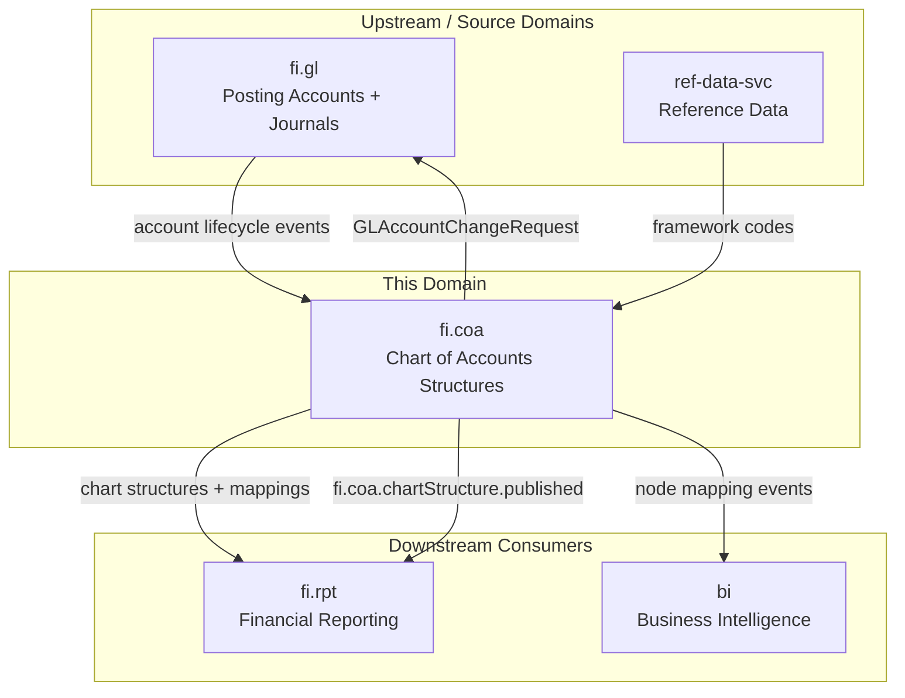
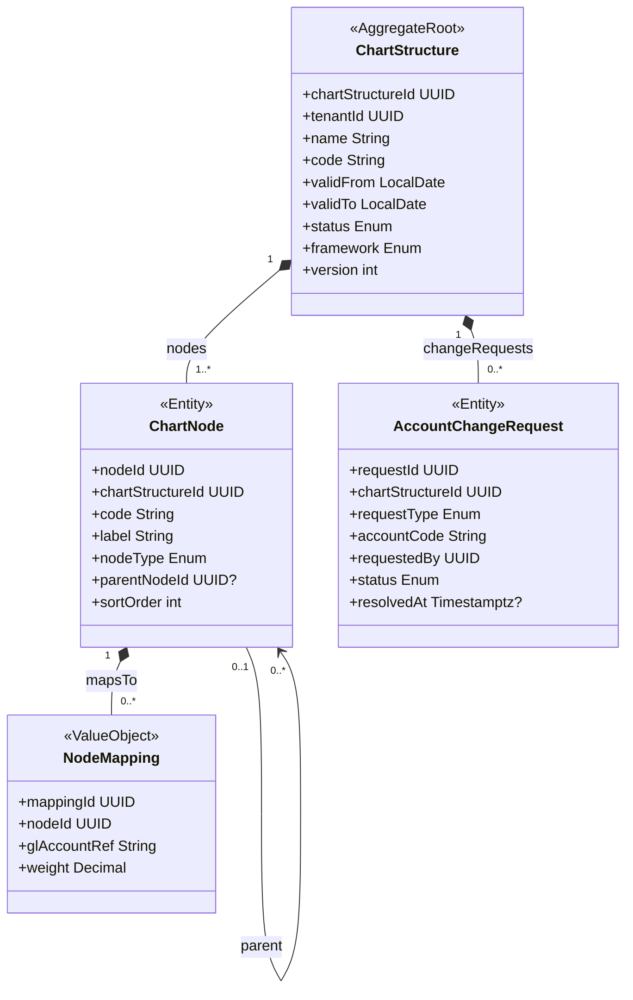
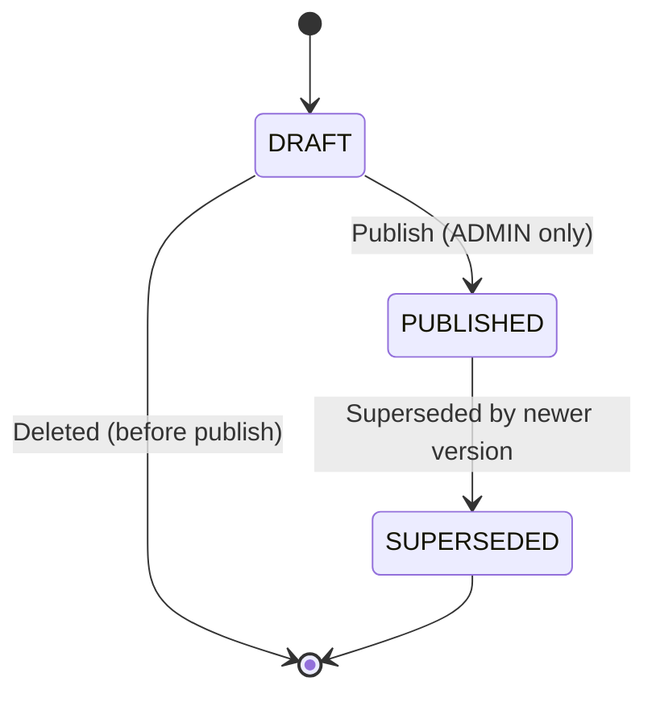
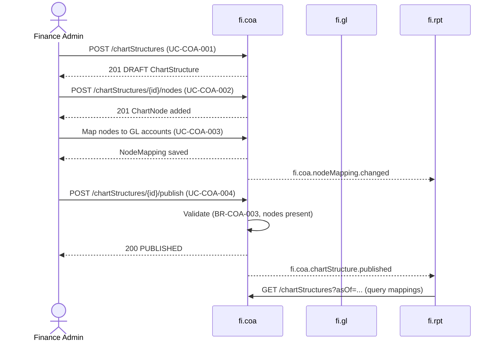
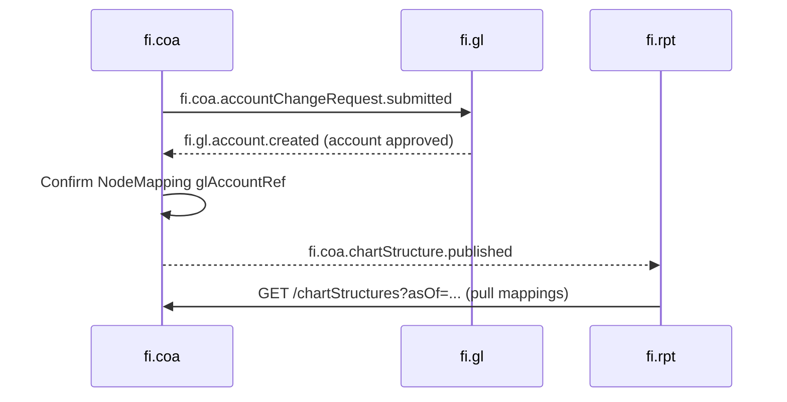
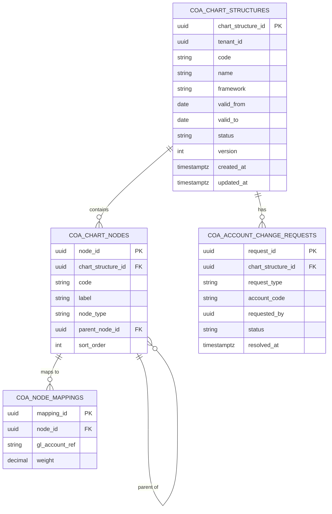

<!-- TEMPLATE COMPLIANCE: ~92%
Present sections: §0 (Purpose/Scope), §1 (Business Context), §2 (Service Identity), §3 (Domain Model - full aggregates), §4 (Business Rules), §5 (Use Cases - 6 UCs), §6 (REST API - endpoint table + examples), §7 (Events - full schema refs), §8 (Data Model - table-level), §9 (Security - permission matrix), §10 (Quality Attributes), §11 (Feature Dependencies), §12 (Extension Points), §13 (Migration Notes), §14 (Decisions & Open Questions), §15 (Appendix)
Remaining gaps: Port and Repository not yet assigned (OPEN QUESTION)
-->
# FI.COA - Chart of Accounts Structures Domain / Service Specification

> **Conceptual Stack Layer:** Domain / Service
> **Space:** Platform
> **Owner:** Domain Engineering Team
> **Schema alignment:** `service-layer.schema.json`
> **Companion files:** `openapi.yaml`, `*.schema.json` (event contracts)
> **Referenced by:** Platform-Feature Spec SS5 (backend dependencies), BFF Contract
> **Belongs to:** FI Suite Spec (`_fi_suiteV2.md`)

> **Meta Information**
> - **Version:** 2026-04-04
> - **Template:** `domain-service-spec.md` v1.0.0
> - **Template Compliance:** ~92%
> - **Author(s):** OpenLeap Architecture Team
> - **Status:** DRAFT
> - **Suite:** `fi`
> - **Domain:** `coa`
> - **Bounded Context Ref:** `bc:chart-of-accounts`
> - **Service ID:** `fi-coa-svc`
> - **basePackage:** `io.openleap.fi.coa`
> - **API Base Path:** `/api/fi/coa/v1`
> - **OpenLeap Starter Version:** `v1`
> - **Port:** OPEN QUESTION
> - **Repository:** OPEN QUESTION
> - **Tags:** `fi`, `chart-of-accounts`, `reporting-structure`, `account-hierarchy`, `versioning`
> - **Team:**
>   - Name: `team-fi`
>   - Email: `fi-team@openleap.io`
>   - Slack: `#fi-team`

---

## Specification Guidelines Compliance

> ### Non-Negotiables
> - Never invent facts. If required info is missing, add an **OPEN QUESTION** entry.
> - Preserve intent and decisions. Only change meaning when explicitly requested.
> - Do not remove normative constraints unless they are explicitly replaced.
> - Keep the spec **self-contained**: no "see chat", no implicit context.
>
> ### Source of Truth Priority
> When sources conflict:
> 1. Spec (explicit) wins
> 2. Starter specs (implementation constraints) next
> 3. Guidelines (best practices) last
>
> Record conflicts in the **Decisions & Open Questions** section (see Section 14).
>
> ### Style Guide
> - Prefer short sentences and lists.
> - Use MUST/SHOULD/MAY for normative statements.
> - Keep terminology consistent (Aggregate, Domain Service, Application Service, Command, Event).
> - Avoid ambiguous words ("often", "maybe") unless explicitly noting uncertainty.

---

## 0. Document Purpose & Scope

### 0.1 Purpose
`fi.coa` specifies the Chart of Accounts **structures** used for classification, grouping, and reporting of postings in the FI suite. It provides versioned hierarchical structures (chart structures) that map reporting groups and nodes to authoritative posting accounts owned by `fi.gl`. `fi.coa` is NOT the authoritative store for posting accounts — that responsibility belongs exclusively to `fi.gl`.

### 0.2 Target Audience
- Product Owners & Business Stakeholders (Finance)
- System Architects & Technical Leads
- Integration Engineers
- Reporting Engineers building financial statement models

### 0.3 Scope

**In Scope:**
- Versioned chart structures (trees/hierarchies) for reporting and grouping
- Effective-dating (validFrom/validTo) of chart structure versions
- Controlled mapping of chart nodes to `fi.gl` posting accounts (by reference/code)
- Query APIs for chart navigation, node lookup, and mapping retrieval
- Finance Admin workflow to draft and submit GL account create/update requests to `fi.gl`
- Framework classification (IFRS, GAAP, LOCAL, MGMT) per structure

**Out of Scope:**
- Authoritative store (system of record) for posting accounts (`GLAccount`) — belongs to `fi.gl`
- Applying account lifecycle changes without `fi.gl` approval
- Posting journals or changing ledger balances — belongs to `fi.gl`
- Financial statement rendering — belongs to `fi.rpt`
- Validating debit/credit rules or posting invariants

### 0.4 Terms & Acronyms
- **Posting Account:** A ledger account used in journal lines; owned and authoritative in `fi.gl`.
- **Chart Structure:** A versioned hierarchy used for reporting (e.g., Balance Sheet groupings, P&L groupings).
- **Chart Node:** A single grouping element (e.g., "Revenue", "Cash and Cash Equivalents") within a chart structure.
- **NodeMapping:** A rule linking a chart node to one or more `fi.gl` posting account codes (by reference).
- **Effective Dating:** Versioning pattern where structures are valid within a date range (validFrom/validTo).
- **Framework:** The accounting framework a structure targets (IFRS/GAAP/LOCAL/MGMT).
- **AccountChangeRequest:** A request submitted from `fi.coa` to `fi.gl` to create, update, or deactivate a GL posting account.

### 0.5 Related Documents
- Suite architecture: `spec/T3_Domains/FI/_fi_suiteV2.md`
- Neighbor domain specs: `spec/T3_Domains/FI/domain-specs/fi_gl-spec.md`, `spec/T3_Domains/FI/domain-specs/fi_rpt-spec.md`
- Platform architecture: `SYSTEM_OVERVIEW.md`
- Event standards: `EVENT_STANDARDS.md`

---

## 1. Business Context

### 1.1 Domain Purpose
`fi.coa` bridges the gap between **how a company organises its ledger** (`fi.gl`) and **how financial information is reported** (`fi.rpt`). Finance Admins maintain stable, governed chart structures so that reporting and groupings remain consistent even as operational domains and GL account lists evolve. Effective-dating allows multiple versions to coexist for different reporting periods and frameworks.

### 1.2 Business Value
- Enables consistent financial statement structures across periods and legal entities.
- Decouples posting integrity (`fi.gl`) from reporting classification (`fi.coa`), reducing coupling risk.
- Provides a governed workflow to steer GL account lifecycle changes while preserving `fi.gl` as the authority.
- Supports multi-framework reporting (IFRS and local GAAP simultaneously) via separate versioned structures.
- Gives `fi.rpt` a stable, queryable mapping to build financial reports without direct GL coupling.

### 1.3 Key Stakeholders

| Role | Responsibility | Primary Use Cases |
|------|----------------|-------------------|
| Finance Admin | Maintain chart structures; steer GL account changes | UC-COA-001, UC-COA-002, UC-COA-003, UC-COA-004, UC-COA-005 |
| Controller / Accountant | Use reporting structures for period-end reporting | UC-COA-006 |
| Reporting Engineer | Consume node-to-GL mappings for financial report models | UC-COA-006 |
| Auditor | Inspect versioned chart structures for governance | UC-COA-006 |

### 1.4 Strategic Positioning



### 1.5 Service Context

| Field | Value |
|-------|-------|
| Suite | `fi` (Finance) |
| Domain | `coa` (Chart of Accounts Structures) |
| Bounded Context | `bc:chart-of-accounts` |
| Service ID | `fi-coa-svc` |
| Base Package | `io.openleap.fi.coa` |
| Authoritative Sources | FI Suite Spec (`_fi_suiteV2.md`), IFRS/GAAP chart of accounts standards |

---

## 2. Service Identity

| Field | Value |
|-------|-------|
| **Service ID** | `fi-coa-svc` |
| **Display Name** | Chart of Accounts Structures Service |
| **Suite** | `fi` |
| **Domain** | `coa` |
| **Bounded Context Ref** | `bc:chart-of-accounts` |
| **Version** | 2026-04-04 |
| **Status** | DRAFT |
| **API Base Path** | `/api/fi/coa/v1` |
| **Repository** | OPEN QUESTION |
| **Tags** | `fi`, `chart-of-accounts`, `reporting-structure`, `account-hierarchy`, `versioning` |
| **Team Name** | `team-fi` |
| **Team Email** | `fi-team@openleap.io` |
| **Team Slack** | `#fi-team` |

---

## 3. Domain Model

### 3.1 Conceptual Overview

The domain centres on the **ChartStructure** aggregate — a versioned, effective-dated hierarchy of chart nodes used for financial reporting. Each structure contains one or more **ChartNodes** forming a tree (GROUP → SUMMARY → LEAF). LEAF nodes carry **NodeMappings** that reference `fi.gl` posting account codes. The **AccountChangeRequest** entity supports a governed workflow for Finance Admins to request GL account changes via `fi.coa` without owning the GL accounts.



### 3.2 Core Concepts

| Concept | Owner | Description |
|---------|-------|-------------|
| ChartStructure | fi-coa-svc | A versioned hierarchy for reporting groupings; effective-dated and framework-specific |
| ChartNode | fi-coa-svc | A single grouping node (GROUP/SUMMARY/LEAF) within a chart structure |
| NodeMapping | fi-coa-svc | Value object linking a LEAF node to a `fi.gl` posting account code with optional weight |
| AccountChangeRequest | fi-coa-svc | Request submitted to `fi.gl` to create/update/deactivate a GL account, managed here as a workflow record |

### 3.3 Aggregate Definitions

#### 3.3.1 Aggregate: ChartStructure

**Aggregate ID:** `agg:chart-structure`
**Business Purpose:** Represents a complete, versioned chart of accounts hierarchy valid for a given period and accounting framework. It is the entry point for all structure mutations and the authoritative source for reporting group definitions.

**Aggregate Root Attributes:**

| Attribute | Type | Format | Required | Description | Example | Constraints |
|-----------|------|--------|----------|-------------|---------|-------------|
| chartStructureId | UUID | uuid | Yes | Unique identifier | `cs-uuid` | Immutable after create, `OlUuid.create()` |
| tenantId | UUID | uuid | Yes | Tenant ownership | `t1-uuid` | Immutable, RLS-enforced |
| name | String | — | Yes | Human-readable name | `"IFRS Balance Sheet 2026"` | Max 255 chars |
| code | String | — | Yes | Business code | `"BS-IFRS"` | Max 50 chars, unique per tenant+framework |
| validFrom | LocalDate | ISO 8601 date | Yes | Effective start date | `2026-01-01` | Must be before validTo if set |
| validTo | LocalDate | ISO 8601 date | No | Effective end date | `2026-12-31` | Must be >= validFrom |
| status | Enum | — | Yes | Lifecycle state | `DRAFT` | DRAFT, PUBLISHED, SUPERSEDED |
| framework | Enum | — | Yes | Accounting framework | `IFRS` | IFRS, GAAP, LOCAL, MGMT |
| version | Integer | — | Yes | Optimistic locking version | `1` | Auto-incremented |
| createdAt | Timestamptz | ISO 8601 | Yes | Creation timestamp | `2026-01-01T10:00:00Z` | System-managed |
| updatedAt | Timestamptz | ISO 8601 | Yes | Last update timestamp | `2026-01-01T10:00:00Z` | System-managed |

**Lifecycle States:**



**State Transitions:**

| From | To | Trigger | Guard / Precondition | Side Effects |
|------|----|---------|---------------------|--------------|
| — | DRAFT | Create | Valid code+framework+validFrom, no overlapping validity (BR-COA-001) | — |
| DRAFT | PUBLISHED | Publish | FI_COA_ADMIN role (BR-COA-003), at least one ChartNode exists | Emits `fi.coa.chartStructure.published`; previous active version PUBLISHED→SUPERSEDED |
| PUBLISHED | SUPERSEDED | Superseded | Newer PUBLISHED structure with same code+framework effective | Emits `fi.coa.chartStructure.superseded` |

**Invariants:**
- INV-CS-001: No two ChartStructures MUST share the same `code` + `framework` combination with overlapping `validFrom`/`validTo` periods (BR-COA-001)
- INV-CS-002: A PUBLISHED ChartStructure MUST be read-only — no field mutations or node changes (BR-COA-004)
- INV-CS-003: Only a principal with role `FI_COA_ADMIN` MAY publish a ChartStructure (BR-COA-003)

**Domain Events Emitted:**

| Event | Routing Key | When | Key Payload |
|-------|-------------|------|-------------|
| ChartStructureCreated | `fi.coa.chartStructure.created` | New structure created | chartStructureId, code, framework, validFrom |
| ChartStructurePublished | `fi.coa.chartStructure.published` | DRAFT → PUBLISHED | chartStructureId, code, framework, validFrom, validTo |
| ChartStructureSuperseded | `fi.coa.chartStructure.superseded` | PUBLISHED → SUPERSEDED | chartStructureId, supersededBy |

#### 3.3.2 Entity: ChartNode (child of ChartStructure)

**Business Purpose:** Represents a single element in the reporting hierarchy — a GROUP (top-level), SUMMARY (intermediate), or LEAF (maps to GL accounts). Forms a tree via `parentNodeId`.

| Attribute | Type | Format | Required | Description | Example | Constraints |
|-----------|------|--------|----------|-------------|---------|-------------|
| nodeId | UUID | uuid | Yes | Unique identifier | `node-uuid` | Immutable, `OlUuid.create()` |
| chartStructureId | UUID | uuid | Yes | Parent structure | `cs-uuid` | FK to ChartStructure |
| code | String | — | Yes | Node code | `"1000"` | Unique within structure (BR-COA-002), max 50 chars |
| label | String | — | Yes | Human-readable label | `"Revenue"` | Max 255 chars |
| nodeType | Enum | — | Yes | Node classification | `GROUP` | GROUP, SUMMARY, LEAF |
| parentNodeId | UUID | uuid | No | Parent node reference | `parent-uuid` | Null for root nodes; FK to ChartNode |
| sortOrder | Integer | — | Yes | Display ordering | `10` | Default 0 |

**Invariants:**
- INV-CN-001: `code` MUST be unique within a `ChartStructure` (BR-COA-002)
- INV-CN-002: A ChartNode belonging to a PUBLISHED ChartStructure is read-only (BR-COA-004)

#### 3.3.3 Value Object: NodeMapping (child of ChartNode)

**VO ID:** `vo:node-mapping`
**Business Purpose:** Maps a LEAF chart node to a `fi.gl` posting account code, with an optional weight for proportional allocations. Not persisted as a standalone aggregate — belongs to a ChartNode.

| Attribute | Type | Format | Required | Description | Example | Constraints |
|-----------|------|--------|----------|-------------|---------|-------------|
| mappingId | UUID | uuid | Yes | Unique identifier | `map-uuid` | `OlUuid.create()` |
| nodeId | UUID | uuid | Yes | Owning chart node | `node-uuid` | FK to ChartNode |
| glAccountRef | String | — | Yes | GL account code reference | `"10100"` | Reference to `fi.gl` account code; max 50 chars |
| weight | Decimal | (10,6) | No | Proportional weight | `1.000000` | 0 < weight <= 1.0; SHOULD sum to 1.0 per node (BR-COA-005) |

**Validation Rules:**
- `glAccountRef` MUST reference a code in `fi.gl` (validated via fi.gl.account.created/statusChanged events or synchronous lookup)
- `weight` SHOULD sum to 1.0 across all NodeMappings for the same `nodeId` when multiple mappings exist

**Domain Events Emitted:**

| Event | Routing Key | When | Key Payload |
|-------|-------------|------|-------------|
| NodeMappingChanged | `fi.coa.nodeMapping.changed` | Mapping added/updated/removed on DRAFT structure | chartStructureId, nodeId, glAccountRef |

#### 3.3.4 Entity: AccountChangeRequest (child of ChartStructure)

**Business Purpose:** Represents a Finance Admin's request to create, update, or deactivate a GL posting account in `fi.gl`. `fi.coa` owns the request lifecycle; `fi.gl` is authoritative and may accept or reject.

| Attribute | Type | Format | Required | Description | Example | Constraints |
|-----------|------|--------|----------|-------------|---------|-------------|
| requestId | UUID | uuid | Yes | Unique identifier | `req-uuid` | Immutable, `OlUuid.create()` |
| chartStructureId | UUID | uuid | Yes | Associated chart structure | `cs-uuid` | FK to ChartStructure |
| requestType | Enum | — | Yes | Type of GL change | `CREATE` | CREATE, UPDATE, DEACTIVATE |
| accountCode | String | — | Yes | Target GL account code | `"10100"` | Max 50 chars |
| requestedBy | UUID | uuid | Yes | Principal who submitted | `user-uuid` | FK to iam.principal |
| status | Enum | — | Yes | Request lifecycle state | `PENDING` | PENDING, ACCEPTED, REJECTED |
| resolvedAt | Timestamptz | ISO 8601 | No | When fi.gl responded | `2026-01-15T10:00:00Z` | System-managed on resolution |

**Domain Events Emitted:**

| Event | Routing Key | When | Key Payload |
|-------|-------------|------|-------------|
| AccountChangeRequestSubmitted | `fi.coa.accountChangeRequest.submitted` | Request created | requestId, chartStructureId, requestType, accountCode |

### 3.4 Enumerations

| Enum | Values | Description |
|------|--------|-------------|
| ChartStructureStatus | DRAFT, PUBLISHED, SUPERSEDED | ChartStructure lifecycle |
| AccountingFramework | IFRS, GAAP, LOCAL, MGMT | Target accounting framework |
| NodeType | GROUP, SUMMARY, LEAF | Node classification within hierarchy |
| AccountChangeRequestType | CREATE, UPDATE, DEACTIVATE | GL account change type |
| AccountChangeRequestStatus | PENDING, ACCEPTED, REJECTED | Request resolution state |

---

## 4. Business Rules & Constraints

### 4.1 Business Rules Catalog

| ID | Rule Name | Description | Scope | Enforcement | Error Code |
|----|-----------|-------------|-------|-------------|------------|
| BR-COA-001 | No Overlapping Validity | Two ChartStructures with the same code+framework MUST NOT have overlapping validFrom/validTo periods | ChartStructure | Create/Update | `COA-BIZ-001` |
| BR-COA-002 | Node Code Unique Within Structure | ChartNode codes MUST be unique within a ChartStructure | ChartNode | Create/Update | `COA-VAL-002` |
| BR-COA-003 | Admin-Only Publish | Only a principal with role FI_COA_ADMIN MAY publish a ChartStructure | ChartStructure | Publish | `COA-BIZ-003` |
| BR-COA-004 | Published Structure Read-Only | A PUBLISHED ChartStructure and its nodes MUST be immutable | ChartStructure, ChartNode | Any mutating operation | `COA-BIZ-004` |
| BR-COA-005 | Mapping Weight Sum | NodeMapping weights SHOULD sum to 1.0 per node when multiple GL accounts are mapped | NodeMapping | Create/Update | `COA-WARN-005` |
| BR-COA-006 | GL Account Ref Validity | A NodeMapping glAccountRef SHOULD reference an active GL account in fi.gl | NodeMapping | Create/Update | `COA-WARN-006` |

### 4.2 Detailed Rule Definitions

#### BR-COA-001: No Overlapping Validity
**Business Context:** Financial reporting requires exactly one active chart structure per code+framework for any given date. Overlapping structures would make it ambiguous which version to use for a given reporting date.
**Rule Statement:** Two `ChartStructure` records with the same `code` and `framework` MUST NOT have `validFrom`/`validTo` date ranges that overlap.
**Applies To:** ChartStructure aggregate, Create and Update operations.
**Enforcement:** Application Service checks for existing structures with matching code+framework before creating or updating validity dates.
**Validation Logic:** `if existsOverlap(code, framework, validFrom, validTo, excludeId) throw OverlappingValidityException`
**Error Handling:**
- Code: `COA-BIZ-001`
- Message: `"A ChartStructure with code '{code}' and framework '{framework}' already exists for the given validity period."`
- HTTP: 409 Conflict

#### BR-COA-004: Published Structure Read-Only
**Business Context:** Published chart structures serve as audit-stable reporting references. Once published, they must not change to ensure consistent historical reporting.
**Rule Statement:** Once a ChartStructure transitions to PUBLISHED, no mutations MUST be permitted on the structure or its ChartNodes/NodeMappings.
**Applies To:** ChartStructure, ChartNode, NodeMapping — any write operation.
**Enforcement:** Domain service rejects any mutating command targeting a PUBLISHED structure.
**Validation Logic:** `if (chartStructure.status == PUBLISHED) throw ImmutableChartStructureException`
**Error Handling:**
- Code: `COA-BIZ-004`
- Message: `"ChartStructure '{id}' is PUBLISHED and cannot be modified. Create a new version instead."`
- HTTP: 409 Conflict

### 4.3 Data Validation Rules

| Field | Validation Rule | Error Code | Error Message |
|-------|----------------|------------|---------------|
| code (structure) | Required, max 50 chars, pattern `[A-Z0-9_-]+` | `COA-VAL-010` | `"Structure code is required (uppercase alphanumeric/dash/underscore, max 50)"` |
| validFrom | Required, ISO 8601 date | `COA-VAL-011` | `"Valid effective start date required"` |
| validTo | Must be >= validFrom if provided | `COA-VAL-012` | `"Effective end date must be on or after start date"` |
| framework | Required, valid enum | `COA-VAL-013` | `"Valid framework required (IFRS, GAAP, LOCAL, MGMT)"` |
| nodeType | Required, valid enum | `COA-VAL-014` | `"Valid node type required (GROUP, SUMMARY, LEAF)"` |
| code (node) | Required, max 50 chars, unique within structure | `COA-VAL-002` | `"Node code must be unique within the chart structure"` |
| weight | 0 < weight <= 1.0 if provided | `COA-VAL-015` | `"Mapping weight must be between 0 (exclusive) and 1.0 (inclusive)"` |

### 4.4 Reference Data Dependencies

| Catalog | Usage | Provider Service | Validation |
|---------|-------|-----------------|------------|
| GL Account Codes | `glAccountRef` in NodeMapping | fi-gl-svc (T3) | Code existence; active status preferred |
| IAM Principals | `requestedBy` in AccountChangeRequest | iam-svc (T1) | Principal existence |
| Tenants | `tenantId` | cfg-svc (T1) | Tenant existence |

---

## 5. Use Cases

### 5.1 Business Logic Placement

| Layer | Responsibilities |
|-------|-----------------|
| Application Service | Command validation, aggregate loading, event publishing, orchestration |
| Domain Service | Overlap detection (cross-aggregate: validFrom/validTo across multiple structures), GL account ref validation |
| Aggregate | State transitions, invariant enforcement (immutability of PUBLISHED, node code uniqueness) |

### 5.2 Use Cases

#### UC-COA-001: Create Chart Structure Version

| Field | Value |
|-------|-------|
| **ID** | UC-COA-001 |
| **Type** | WRITE |
| **Trigger** | REST |
| **Aggregate** | ChartStructure |
| **Domain Operation** | `ChartStructure.create(code, framework, name, validFrom, validTo?)` |
| **Inputs** | code, framework, name, validFrom, validTo? |
| **Outputs** | Created ChartStructure in DRAFT state |
| **Events** | `ChartStructureCreated` → `fi.coa.chartStructure.created` |
| **REST** | `POST /api/fi/coa/v1/chartStructures` → 201 Created |
| **Idempotency** | Client-supplied `Idempotency-Key` header; deduplicate on code+framework+validFrom per tenant |
| **Errors** | 400 (validation), 409 (BR-COA-001 overlapping validity) |

#### UC-COA-002: Add / Update Chart Nodes

| Field | Value |
|-------|-------|
| **ID** | UC-COA-002 |
| **Type** | WRITE |
| **Trigger** | REST |
| **Aggregate** | ChartStructure (ChartNode child) |
| **Domain Operation** | `ChartStructure.addNode(code, label, nodeType, parentNodeId?, sortOrder?)` |
| **Inputs** | chartStructureId, code, label, nodeType, parentNodeId?, sortOrder? |
| **Outputs** | Created/Updated ChartNode |
| **Events** | — |
| **REST** | `POST /api/fi/coa/v1/chartStructures/{id}/nodes` → 201 Created |
| **Idempotency** | Idempotency-Key header |
| **Errors** | 404 (structure not found), 409 (BR-COA-004 published), 422 (BR-COA-002 duplicate node code) |

#### UC-COA-003: Map Chart Nodes to GL Accounts

| Field | Value |
|-------|-------|
| **ID** | UC-COA-003 |
| **Type** | WRITE |
| **Trigger** | REST |
| **Aggregate** | ChartStructure (NodeMapping on ChartNode child) |
| **Domain Operation** | `ChartNode.addMapping(glAccountRef, weight?)` |
| **Inputs** | chartStructureId, nodeId, glAccountRef, weight? |
| **Outputs** | Created/Updated NodeMapping |
| **Events** | `NodeMappingChanged` → `fi.coa.nodeMapping.changed` |
| **REST** | `POST /api/fi/coa/v1/chartStructures/{id}/nodes` + mappings sub-resource (see §6) |
| **Idempotency** | Idempotency-Key header |
| **Errors** | 404 (structure or node not found), 409 (BR-COA-004 published), 422 (weight out of range, BR-COA-005 warning) |

#### UC-COA-004: Publish Chart Structure Version

| Field | Value |
|-------|-------|
| **ID** | UC-COA-004 |
| **Type** | WRITE |
| **Trigger** | REST |
| **Aggregate** | ChartStructure |
| **Domain Operation** | `ChartStructure.publish()` |
| **Inputs** | chartStructureId |
| **Outputs** | ChartStructure in PUBLISHED state; previous PUBLISHED version (if any) → SUPERSEDED |
| **Events** | `ChartStructurePublished` → `fi.coa.chartStructure.published`; `ChartStructureSuperseded` → `fi.coa.chartStructure.superseded` |
| **REST** | `POST /api/fi/coa/v1/chartStructures/{id}/publish` → 200 OK |
| **Idempotency** | Idempotent (re-publish of PUBLISHED is no-op) |
| **Errors** | 404, 403 (BR-COA-003 not ADMIN), 409 (not in DRAFT state, no nodes present) |

#### UC-COA-005: Submit GL Account Change Request

| Field | Value |
|-------|-------|
| **ID** | UC-COA-005 |
| **Type** | WRITE |
| **Trigger** | REST |
| **Aggregate** | ChartStructure (AccountChangeRequest child) |
| **Domain Operation** | `ChartStructure.submitAccountChangeRequest(requestType, accountCode)` |
| **Inputs** | chartStructureId, requestType (CREATE/UPDATE/DEACTIVATE), accountCode, requestedBy |
| **Outputs** | Created AccountChangeRequest in PENDING state |
| **Events** | `AccountChangeRequestSubmitted` → `fi.coa.accountChangeRequest.submitted` |
| **REST** | `POST /api/fi/coa/v1/accountChangeRequests` → 201 Created |
| **Idempotency** | Idempotency-Key header |
| **Errors** | 400 (validation), 404 (structure not found), 409 (PENDING request for same accountCode already exists) |

#### UC-COA-006: Query Chart Structure for Reporting

| Field | Value |
|-------|-------|
| **ID** | UC-COA-006 |
| **Type** | READ |
| **Trigger** | REST |
| **Aggregate** | ChartStructure |
| **Domain Operation** | Query projection |
| **Inputs** | framework?, asOf (date)?, status?, page, size |
| **Outputs** | Paginated list of ChartStructures with nodes and mappings |
| **Events** | — |
| **REST** | `GET /api/fi/coa/v1/chartStructures?framework=IFRS&asOf=2026-01-01` → 200 OK |
| **Idempotency** | Inherently idempotent (GET) |
| **Errors** | 400 (invalid filter params) |

### 5.3 Process Flow Diagrams



---

## 6. REST API

### 6.1 API Overview

| Field | Value |
|-------|-------|
| Base Path | `/api/fi/coa/v1` |
| Authentication | OAuth2/JWT (Bearer token) |
| Authorization | Roles: `FI_COA_VIEWER`, `FI_COA_EDITOR`, `FI_COA_ADMIN` |
| Content Type | `application/json` |
| Versioning | URL path (`v1`) |

### 6.2 Resource Operations

#### Chart Structure Resource

| Endpoint | Method | Path | Summary | Role Required | Events Published |
|----------|--------|------|---------|---------------|-----------------|
| Create Chart Structure | POST | `/chartStructures` | Create DRAFT chart structure version | `FI_COA_EDITOR` | `ChartStructureCreated` |
| Get Chart Structure | GET | `/chartStructures/{id}` | Retrieve structure with nodes | `FI_COA_VIEWER` | — |
| Update Chart Structure | PATCH | `/chartStructures/{id}` | Update mutable fields (DRAFT only) | `FI_COA_EDITOR` | — |
| Publish Chart Structure | POST | `/chartStructures/{id}/publish` | Transition DRAFT → PUBLISHED | `FI_COA_ADMIN` | `ChartStructurePublished`, `ChartStructureSuperseded` |
| List Chart Structures | GET | `/chartStructures` | Search by framework, asOf date, status | `FI_COA_VIEWER` | — |

**Create Chart Structure — Request:**
```json
{
  "code": "BS-IFRS",
  "name": "IFRS Balance Sheet 2026",
  "framework": "IFRS",
  "validFrom": "2026-01-01",
  "validTo": "2026-12-31"
}
```

**Create Chart Structure — Response (201 Created):**
```json
{
  "chartStructureId": "a1b2c3d4-e5f6-7890-abcd-ef1234567890",
  "code": "BS-IFRS",
  "name": "IFRS Balance Sheet 2026",
  "framework": "IFRS",
  "validFrom": "2026-01-01",
  "validTo": "2026-12-31",
  "status": "DRAFT",
  "version": 1,
  "createdAt": "2026-01-10T09:00:00Z",
  "_links": {
    "self": { "href": "/api/fi/coa/v1/chartStructures/a1b2c3d4-..." },
    "nodes": { "href": "/api/fi/coa/v1/chartStructures/a1b2c3d4-.../nodes" },
    "publish": { "href": "/api/fi/coa/v1/chartStructures/a1b2c3d4-.../publish" }
  }
}
```

#### Chart Node Resource

| Endpoint | Method | Path | Summary | Role Required | Events Published |
|----------|--------|------|---------|---------------|-----------------|
| Add Chart Node | POST | `/chartStructures/{id}/nodes` | Add node to DRAFT structure | `FI_COA_EDITOR` | — |
| List Chart Nodes | GET | `/chartStructures/{id}/nodes` | List all nodes in structure | `FI_COA_VIEWER` | — |
| Get Node Mappings | GET | `/chartStructures/{id}/nodes/{nodeId}/mappings` | Get GL mappings for node | `FI_COA_VIEWER` | — |

#### Account Change Request Resource

| Endpoint | Method | Path | Summary | Role Required | Events Published |
|----------|--------|------|---------|---------------|-----------------|
| Submit Change Request | POST | `/accountChangeRequests` | Submit GL account change request | `FI_COA_EDITOR` | `AccountChangeRequestSubmitted` |
| Get Change Request | GET | `/accountChangeRequests/{id}` | Retrieve request by ID | `FI_COA_VIEWER` | — |

### 6.3 Error Responses

| HTTP Status | Error Code | Description |
|-------------|------------|-------------|
| 400 | `COA-VAL-*` | Field-level validation error |
| 401 | — | Authentication required |
| 403 | — | Insufficient role (e.g., non-ADMIN attempting publish) |
| 404 | — | Resource not found |
| 409 | `COA-BIZ-001`, `COA-BIZ-004` | Conflict (overlapping validity, published structure immutable) |
| 422 | `COA-BIZ-*` | Business rule violation |

### 6.4 OpenAPI Specification
**Location:** `contracts/http/fi/coa/openapi.yaml`
**OpenAPI Version:** 3.1.0

---

## 7. Events & Integration

### 7.1 Event-Driven Architecture Pattern
**Pattern Decision:** Choreography (EDA)
**Rationale:** Chart structure lifecycle changes are low-frequency, high-value events. Downstream consumers (`fi.rpt`, `bi`) react independently. No distributed transaction coordination needed. At-least-once delivery with idempotent consumers.

### 7.2 Published Events

**Exchange:** `fi.coa.events` (topic)

#### ChartStructurePublished
- **Routing Key:** `fi.coa.chartStructure.published`
- **Business Meaning:** A chart structure version is now active and available for reporting use
- **When Published:** DRAFT → PUBLISHED transition (UC-COA-004)
- **Payload Schema:**
```json
{
  "chartStructureId": "uuid",
  "tenantId": "uuid",
  "code": "BS-IFRS",
  "framework": "IFRS",
  "validFrom": "2026-01-01",
  "validTo": "2026-12-31"
}
```
- **Consumers:** fi.rpt (rebuild reporting model), bi (refresh dimension tables)

#### ChartStructureSuperseded
- **Routing Key:** `fi.coa.chartStructure.superseded`
- **Business Meaning:** A previously active structure has been replaced by a newer version
- **When Published:** PUBLISHED → SUPERSEDED transition (cascade from UC-COA-004)
- **Payload Schema:**
```json
{
  "chartStructureId": "uuid",
  "tenantId": "uuid",
  "code": "BS-IFRS",
  "framework": "IFRS",
  "supersededBy": "uuid"
}
```
- **Consumers:** fi.rpt (archive old model), bi

#### NodeMappingChanged
- **Routing Key:** `fi.coa.nodeMapping.changed`
- **Business Meaning:** A LEAF node's GL account mapping has been added, updated, or removed
- **When Published:** NodeMapping created/updated/deleted on DRAFT structure (UC-COA-003)
- **Payload Schema:**
```json
{
  "chartStructureId": "uuid",
  "tenantId": "uuid",
  "nodeId": "uuid",
  "nodeCode": "string",
  "glAccountRef": "string",
  "changeType": "ADDED | UPDATED | REMOVED"
}
```
- **Consumers:** fi.rpt (live mapping preview), validation monitors

#### AccountChangeRequestSubmitted
- **Routing Key:** `fi.coa.accountChangeRequest.submitted`
- **Business Meaning:** Finance Admin has submitted a GL account create/update/deactivate request to fi.gl
- **When Published:** AccountChangeRequest created in PENDING state (UC-COA-005)
- **Payload Schema:**
```json
{
  "requestId": "uuid",
  "tenantId": "uuid",
  "chartStructureId": "uuid",
  "requestType": "CREATE | UPDATE | DEACTIVATE",
  "accountCode": "string",
  "requestedBy": "uuid"
}
```
- **Consumers:** fi.gl (process account change request)

### 7.3 Consumed Events

| Source Event | Source Service | Handler | Purpose | Queue |
|-------------|---------------|---------|---------|-------|
| `fi.gl.account.created` | fi-gl-svc | GlAccountCreatedHandler | Validate/confirm NodeMapping glAccountRef; mark pending mappings as confirmed | `fi.coa.in.gl.account` |
| `fi.gl.account.statusChanged` | fi-gl-svc | GlAccountStatusChangedHandler | Detect if mapped GL accounts have been deactivated; emit warning or flag affected mappings | `fi.coa.in.gl.account` |

### 7.4 Event Flow Diagram



### 7.5 Integration Points Summary

**Upstream Dependencies:**

| Service | Tier | Purpose | Type | Criticality | Fallback |
|---------|------|---------|------|-------------|----------|
| fi-gl-svc | T3 | GL account code validation | Event (consumed) + optional REST | Medium | Allow mapping with warning; re-validate on next event |
| iam-svc | T1 | Principal identity for requestedBy | JWT claims | High | Reject request |

**Downstream Consumers:**

| Service | Tier | Purpose | Type | SLA |
|---------|------|---------|------|-----|
| fi.rpt | T3 | Rebuild reporting model on structure publish | Event | < 10s processing |
| bi | T4 | Refresh dimension tables | Event | < 30s processing |
| fi.gl | T3 | Receive account change requests | Event | < 5s processing |

---

## 8. Data Model

### 8.1 Storage Technology

| Aspect | Choice |
|--------|--------|
| Database | PostgreSQL 16+ |
| Multi-tenancy | `tenant_id` column + PostgreSQL RLS |
| Soft Delete | No — SUPERSEDED is the terminal state for replaced structures; DRAFT may be deleted before publishing |
| Audit Trail | Status transitions logged via domain events |
| Outbox | `coa_outbox_events` table for reliable event publishing (ADR-013) |

### 8.2 Conceptual Data Model



### 8.3 Table Definitions

#### Table: `coa_chart_structures`

| Column | Type | Nullable | Default | Description | Constraints |
|--------|------|----------|---------|-------------|-------------|
| chart_structure_id | uuid | NOT NULL | `OlUuid.create()` | Primary key | PK |
| tenant_id | uuid | NOT NULL | — | Tenant discriminator | RLS policy |
| code | text | NOT NULL | — | Business code | Max 50; pattern `[A-Z0-9_-]+` |
| name | text | NOT NULL | — | Human-readable name | Max 255 |
| framework | text | NOT NULL | — | Accounting framework | CHECK(framework IN ('IFRS','GAAP','LOCAL','MGMT')) |
| valid_from | date | NOT NULL | — | Effective start date | — |
| valid_to | date | NULL | — | Effective end date | CHECK(valid_to >= valid_from) |
| status | text | NOT NULL | `'DRAFT'` | Lifecycle state | CHECK(status IN ('DRAFT','PUBLISHED','SUPERSEDED')) |
| version | integer | NOT NULL | 1 | Optimistic lock | — |
| created_at | timestamptz | NOT NULL | `now()` | Creation timestamp | — |
| updated_at | timestamptz | NOT NULL | `now()` | Last update | — |

**Indexes:**

| Index Name | Columns | Type | Condition |
|------------|---------|------|-----------|
| uq_coa_cs_tenant_code_fw_from | (tenant_id, code, framework, valid_from) | btree unique | — |
| idx_coa_cs_tenant_status | (tenant_id, status) | btree | — |
| idx_coa_cs_tenant_fw_valid | (tenant_id, framework, valid_from, valid_to) | btree | WHERE status = 'PUBLISHED' |

#### Table: `coa_chart_nodes`

| Column | Type | Nullable | Default | Description | Constraints |
|--------|------|----------|---------|-------------|-------------|
| node_id | uuid | NOT NULL | `OlUuid.create()` | Primary key | PK |
| chart_structure_id | uuid | NOT NULL | — | Parent structure | FK to coa_chart_structures |
| code | text | NOT NULL | — | Node code | Max 50; UNIQUE within structure |
| label | text | NOT NULL | — | Display label | Max 255 |
| node_type | text | NOT NULL | — | Node classification | CHECK(node_type IN ('GROUP','SUMMARY','LEAF')) |
| parent_node_id | uuid | NULL | — | Parent node reference | FK to coa_chart_nodes (self-ref) |
| sort_order | integer | NOT NULL | 0 | Display order | — |

**Indexes:**

| Index Name | Columns | Type | Condition |
|------------|---------|------|-----------|
| uq_coa_node_struct_code | (chart_structure_id, code) | btree unique | — |
| idx_coa_node_struct_parent | (chart_structure_id, parent_node_id) | btree | — |

#### Table: `coa_node_mappings`

| Column | Type | Nullable | Default | Description | Constraints |
|--------|------|----------|---------|-------------|-------------|
| mapping_id | uuid | NOT NULL | `OlUuid.create()` | Primary key | PK |
| node_id | uuid | NOT NULL | — | Owning chart node | FK to coa_chart_nodes |
| gl_account_ref | text | NOT NULL | — | GL account code reference | Max 50 |
| weight | numeric(10,6) | NULL | NULL | Proportional weight | CHECK(weight > 0 AND weight <= 1.0) |

**Indexes:**

| Index Name | Columns | Type | Condition |
|------------|---------|------|-----------|
| idx_coa_map_node | (node_id) | btree | — |
| uq_coa_map_node_glaccount | (node_id, gl_account_ref) | btree unique | — |

#### Table: `coa_account_change_requests`

| Column | Type | Nullable | Default | Description | Constraints |
|--------|------|----------|---------|-------------|-------------|
| request_id | uuid | NOT NULL | `OlUuid.create()` | Primary key | PK |
| chart_structure_id | uuid | NOT NULL | — | Associated structure | FK to coa_chart_structures |
| request_type | text | NOT NULL | — | GL change type | CHECK(request_type IN ('CREATE','UPDATE','DEACTIVATE')) |
| account_code | text | NOT NULL | — | Target GL account code | Max 50 |
| requested_by | uuid | NOT NULL | — | Submitting principal | FK logical to iam.principal |
| status | text | NOT NULL | `'PENDING'` | Request state | CHECK(status IN ('PENDING','ACCEPTED','REJECTED')) |
| resolved_at | timestamptz | NULL | — | Resolution timestamp | — |

**Indexes:**

| Index Name | Columns | Type | Condition |
|------------|---------|------|-----------|
| idx_coa_acr_struct | (chart_structure_id) | btree | — |
| idx_coa_acr_status | (status) | btree | WHERE status = 'PENDING' |

#### Table: `coa_outbox_events`

Standard outbox pattern per platform guidelines (ADR-013).

### 8.4 Data Retention

| Entity | Retention Period | Legal Basis | Action After Expiry |
|--------|-----------------|-------------|---------------------|
| Chart Structures (active/published) | Retained indefinitely | Financial audit, regulatory | — |
| Chart Structures (superseded) | 10 years | Financial audit, tax compliance | Archive then delete |
| Chart Nodes | Same as parent structure | — | Cascade |
| Node Mappings | Same as parent structure | — | Cascade |
| Account Change Requests | 7 years | Financial audit | Archive then delete |
| Outbox Events | 30 days after publish | Operational | Delete |

---

## 9. Security & Compliance

### 9.1 Data Classification

| Data Element | Classification | Protection |
|--------------|----------------|------------|
| Chart Structure ID / Code | Internal | Multi-tenancy isolation |
| GL Account Ref | Internal | RLS, audit trail |
| Node Labels / Structure Names | Internal | RLS |
| AccountChangeRequest details | Confidential (Finance) | RLS, ADMIN access |
| requestedBy (principal ID) | Confidential | RLS, IAM-managed |

### 9.2 Access Control

**Roles & Permissions Matrix:**

| Role | Read Structures | Create/Update DRAFT | Add Nodes & Mappings | Publish | Submit Change Request | Admin |
|------|-----------------|---------------------|----------------------|---------|----------------------|-------|
| FI_COA_VIEWER | Yes | — | — | — | — | — |
| FI_COA_EDITOR | Yes | Yes | Yes | — | Yes | — |
| FI_COA_ADMIN | Yes | Yes | Yes | Yes | Yes | Yes |

**Scope-to-Role Mapping:**

| OAuth2 Scope | Maps to Role |
|-------------|-------------|
| `fi.coa:read` | FI_COA_VIEWER |
| `fi.coa:write` | FI_COA_EDITOR |
| `fi.coa:admin` | FI_COA_ADMIN |

### 9.3 Compliance Requirements

| Regulation | Requirement | Implementation |
|------------|-------------|----------------|
| GDPR | GL account codes are not PII; no personal data in chart structures | Tenant-scoped RLS; requestedBy is principal reference only |
| SOX | Immutable published chart structures; full audit trail | BR-COA-004 immutability, event-based audit trail |
| Financial Audit | Chart structure versions must be traceable and immutable | PUBLISHED status locks structure; 10-year retention |
| Data Isolation | Tenant data must never leak | PostgreSQL RLS enforced on `tenant_id` |

### 9.4 Audit Trail

| Aspect | Implementation |
|--------|----------------|
| Who | `currentPrincipal` from JWT token |
| What | Status transitions (DRAFT → PUBLISHED, PUBLISHED → SUPERSEDED) + changed fields |
| When | Timestamped domain event |
| Old/New Value | Captured in domain event payload |
| Retention | Indefinite (financial audit compliance) |

---

## 10. Quality Attributes

### 10.1 Performance Requirements

| Operation | Target (p95) | Notes |
|-----------|-------------|-------|
| Read chart structure (GET single) | < 100ms | Includes full node tree |
| List chart structures (GET with filters) | < 200ms | Paginated, max 50 per page |
| Query nodes for reporting (GET nodes) | < 150ms | Tree traversal optimized via index |
| Create/Update DRAFT structure | < 300ms | — |
| Publish chart structure | < 500ms | Includes supersession of previous version + event publish |

### 10.2 Throughput

| Metric | Target |
|--------|--------|
| Chart structure reads/second | 500 |
| Chart structure writes/day | 1,000 (low-frequency admin operations) |
| Peak concurrent reporting consumers | 200 |

### 10.3 Availability

| Metric | Target |
|--------|--------|
| Uptime SLA | 99.9% |
| Planned maintenance window | Sunday 02:00–04:00 UTC |

### 10.4 Recovery Objectives

| Metric | Target |
|--------|--------|
| RTO | < 15 minutes |
| RPO | < 5 minutes |
| Failure mode | Idempotent events + reliable outbox (ADR-013) |

### 10.5 Scalability

| Aspect | Strategy |
|--------|----------|
| Horizontal scaling | Stateless application instances behind load balancer |
| Read scaling | Read replicas for reporting query load |
| Event throughput | Partitioned topic by `tenantId` |

### 10.6 Maintainability

| Aspect | Implementation |
|--------|----------------|
| API versioning | URL path versioning (`/v1`), backward-compatible changes within version |
| Schema evolution | Event schema versioning with backward compatibility |
| Key metrics | chart publish rate, mapping change rate, account change request acceptance rate |
| Alerts | DLQ depth > 0, failed GL account validations > 10/hour |

---

## 11. Feature Dependencies

### 11.1 Purpose
This section answers: "Which features depend on this service?" It is the inverse of Platform-Feature Spec SS5 and helps the domain team assess the blast radius of API changes.

### 11.2 Feature Dependency Register

> **OPEN QUESTION:** Feature dependencies will be populated when feature specs (Phase 3) are authored for the FI suite. The following is a preliminary mapping based on expected feature compositions.

| Feature ID | Feature Name | Suite | Tier | Dependency Type | Status |
|------------|-------------|-------|------|-----------------|--------|
| F-FI-TBD | Manage Chart Structures | fi | core | sync_api | planned |
| F-FI-TBD | Publish Chart Structure | fi | core | sync_api | planned |
| F-FI-TBD | Map Nodes to GL Accounts | fi | core | sync_api | planned |
| F-FI-TBD | Query Chart for Reporting | fi | core | sync_api | planned |
| F-FI-TBD | Submit GL Account Change | fi | supporting | sync_api + async_event | planned |

---

## 12. Extension Points

### 12.1 Purpose
Extension points follow the Open-Closed Principle: the service is open for extension via events and hooks, closed for direct modification.

### 12.2 Extension Events

| Event ID | Routing Key | Trigger | Payload | Purpose |
|----------|-------------|---------|---------|---------|
| EXT-COA-001 | `fi.coa.chartStructure.published` | Structure published | Full structure snapshot | External reporting systems, ERP sync, BI dimension refresh |
| EXT-COA-002 | `fi.coa.nodeMapping.changed` | Mapping updated | Node + mapping delta | Live preview tools, BI pipeline incremental refresh |
| EXT-COA-003 | `fi.coa.accountChangeRequest.submitted` | Change request created | Request details | Workflow notifications, GL approval queue integration |

### 12.3 Aggregate Hooks

| Hook ID | Aggregate | Lifecycle Point | Hook Type | Description |
|---------|-----------|-----------------|-----------|-------------|
| HOOK-COA-001 | ChartStructure | Pre-Publish | validation | Custom tenant-specific validation rules (e.g., mandatory node coverage for specific accounts) |
| HOOK-COA-002 | ChartStructure | Post-Publish | notification | Notify reporting stakeholders via preferred channel (email, Slack) |
| HOOK-COA-003 | AccountChangeRequest | Post-Submit | notification | Notify GL Admin of pending account change request |

**Design Rules:**
- Hooks are fire-and-forget (notification) or bounded-timeout (validation: 2s)
- Validation hooks fail-closed (block on timeout)
- Notification hooks fail-open (log and continue)
- Hooks MUST NOT modify aggregate state directly

### 12.4 Extension Points Summary

| ID | Type | Aggregate | Lifecycle Point | Fail Mode | Timeout |
|----|------|-----------|-----------------|-----------|---------|
| EXT-COA-001 | event | ChartStructure | published | n/a | n/a |
| EXT-COA-002 | event | ChartNode | mapping changed | n/a | n/a |
| EXT-COA-003 | event | AccountChangeRequest | submitted | n/a | n/a |
| HOOK-COA-001 | validation | ChartStructure | pre-publish | fail-closed | 2s |
| HOOK-COA-002 | notification | ChartStructure | post-publish | fail-open | 5s |
| HOOK-COA-003 | notification | AccountChangeRequest | post-submit | fail-open | 5s |

---

## 13. Migration & Evolution

### 13.1 Data Migration
**Legacy Source:** No direct legacy migration. New greenfield service in FI v2.1 architecture.

If migrating from an existing CoA system, structures MUST be imported in DRAFT state first, reviewed, and published deliberately. GL account codes in NodeMappings MUST be validated against `fi.gl` before publishing.

### 13.2 Deprecation & Sunset

| Deprecated Feature | Replacement | Removal Timeline | Communication Plan |
|-------------------|-------------|------------------|-------------------|
| — | — | — | — |

### 13.3 Future Extensions
- Bulk import of chart nodes from CSV/Excel for initial setup
- Multi-language labels on ChartNodes (i18n support via i18n suite)
- Automatic node code suggestion based on parent node numbering conventions
- Approval workflow for AccountChangeRequests within `fi.coa` before forwarding to `fi.gl`
- Comparison view between two published chart structure versions
- Mapping coverage report: identify LEAF nodes without any NodeMapping

---

## 14. Decisions & Open Questions

### 14.1 Consistency Checks

| Check | Status | Notes |
|-------|--------|-------|
| Every WRITE endpoint maps to exactly one use case | Yes | UC-COA-001 through UC-COA-005 |
| Events in use cases appear in section 7 with schema refs | Yes | All events documented |
| Business rules referenced in aggregate invariants | Yes | BR-COA-001 through BR-COA-006 |
| All aggregates have lifecycle states + transitions | Yes | ChartStructure, ChartNode, AccountChangeRequest |

### 14.2 Decisions & Conflicts

| ID | Conflict Description | Resolution | Rationale |
|----|---------------------|------------|-----------|
| DEC-COA-001 | Posting accounts are owned by `fi.gl`; `fi.coa` owns only structures and mappings | Accepted (2026-01-19) | Preserves single source of truth for GL; prevents dual-write conflicts |
| DEC-COA-002 | NodeMapping stores glAccountRef as a String code (not a UUID FK) | Accepted | fi.coa is a different bounded context from fi.gl; cross-BC references MUST be by stable code, not internal UUID |
| DEC-COA-003 | PUBLISHED structures are immutable — new version must be created for changes | Accepted | Financial reporting integrity requires stable, auditable structure versions |

### 14.3 Open Questions

| ID | Question | Why It Matters | Suggested Options | Owner |
|----|----------|----------------|-------------------|-------|
| OQ-COA-001 | Should `fi.coa` validate glAccountRef synchronously against `fi.gl` at write time, or asynchronously via events? | Determines latency and coupling profile | 1) Sync REST lookup (tight coupling), 2) Async validation on fi.gl.account.created (eventual consistency) | Architecture Team |
| OQ-COA-002 | Port assignment for fi-coa-svc | Deployment | Follow platform port registry | Architecture Team |
| OQ-COA-003 | Should AccountChangeRequest resolution (ACCEPTED/REJECTED) be driven by fi.gl publishing an event or by a REST callback? | Determines integration pattern | 1) Event-driven (fi.gl.account.created implies ACCEPTED), 2) REST callback from fi.gl | FI Domain Team |
| OQ-COA-004 | Should NodeMapping weight validation (sum to 1.0) be MUST or SHOULD? | Strictness affects Finance Admin UX | 1) Hard validation (MUST), 2) Warning only (SHOULD, current) | Finance Product Owner |

### 14.4 Architecture Decision Records

#### ADR-FI-COA-001: COA Owns Structures, GL Owns Accounts
**Status:** Accepted

**Context:** In earlier FI designs, the chart of accounts was maintained in a single service. FI v2.1 separates posting integrity from reporting classification.

**Decision:** `fi.coa` owns chart structures, hierarchies, and mappings. `fi.gl` owns posting accounts. `fi.coa` references GL accounts by code (cross-BC reference), not by UUID FK.

**Rationale:**
- Prevents dual-write conflicts on GL accounts
- Allows independent evolution of reporting structures vs. operational GL
- Enables multi-framework reporting without polluting the GL

**Consequences:**
- Positive: Loose coupling, independent deployability, clear audit trail
- Negative: GL account ref validation is eventually consistent (not transactional)

---

## 15. Appendix

### 15.1 Glossary

| Term | Definition | Aliases |
|------|------------|---------|
| Chart Structure | A versioned, effective-dated hierarchy of chart nodes used for financial reporting | CoA Version, Kontenrahmen |
| Chart Node | A single element in the reporting hierarchy (GROUP/SUMMARY/LEAF) | Reporting Node, Kontengruppe |
| Node Mapping | A rule linking a LEAF chart node to a `fi.gl` posting account code | GL Account Mapping |
| Effective Dating | Versioning pattern where structures are valid within a defined date range | — |
| Framework | The accounting standard a structure targets (IFRS, GAAP, LOCAL, MGMT) | Accounting Framework |
| AccountChangeRequest | A workflow record for requesting GL account lifecycle changes via `fi.coa` | GL Account Request |
| Posting Account | A ledger account used in journal entries; authoritative in `fi.gl` | GL Account, Sachkonto |

### 15.2 References

| Type | Reference |
|------|-----------|
| Business | FI Suite Spec (`_fi_suiteV2.md`) |
| Technical | OpenLeap Starter (ADR-002 CQRS, ADR-013 Outbox, ADR-014 At-least-once, ADR-020 Dual-key, ADR-021 OlUuid) |
| External | IFRS Foundation (chart of accounts standards), HGB/German GAAP (Kontenrahmen SKR03/SKR04) |
| Schema | `contracts/http/fi/coa/openapi.yaml`, `contracts/events/fi/coa/*.schema.json` |

### 15.3 Change Log

| Date | Version | Author | Changes |
|------|---------|--------|---------|
| 2026-04-04 | 2.0 | Architecture Team | Full upgrade to TPL-SVC v1.0.0 compliance — added §2 Service Identity, §4 Business Rules (catalog + detailed definitions), §5 Use Cases (6 canonical UCs), expanded §6 REST API with endpoint tables + request/response examples, §7 Events with full payload schemas, §8 Data Model (table-level with columns, constraints, indexes), §9 Security with permission matrix, §10 Quality Attributes, §11 Feature Dependencies, §12 Extension Points, §13 Migration Notes, §14 Decisions & Open Questions (incl. ADRs); compliance raised to ~92% |
| 2026-01-19 | 1.0 | Architecture Team | Initial draft (~35% compliance) |

### 15.4 Document Review & Approval

| Role | Name | Date | Status |
|------|------|------|--------|
| Domain Lead | OPEN QUESTION | — | Pending |
| Architecture Review | OPEN QUESTION | — | Pending |
| Finance Product Owner | OPEN QUESTION | — | Pending |
