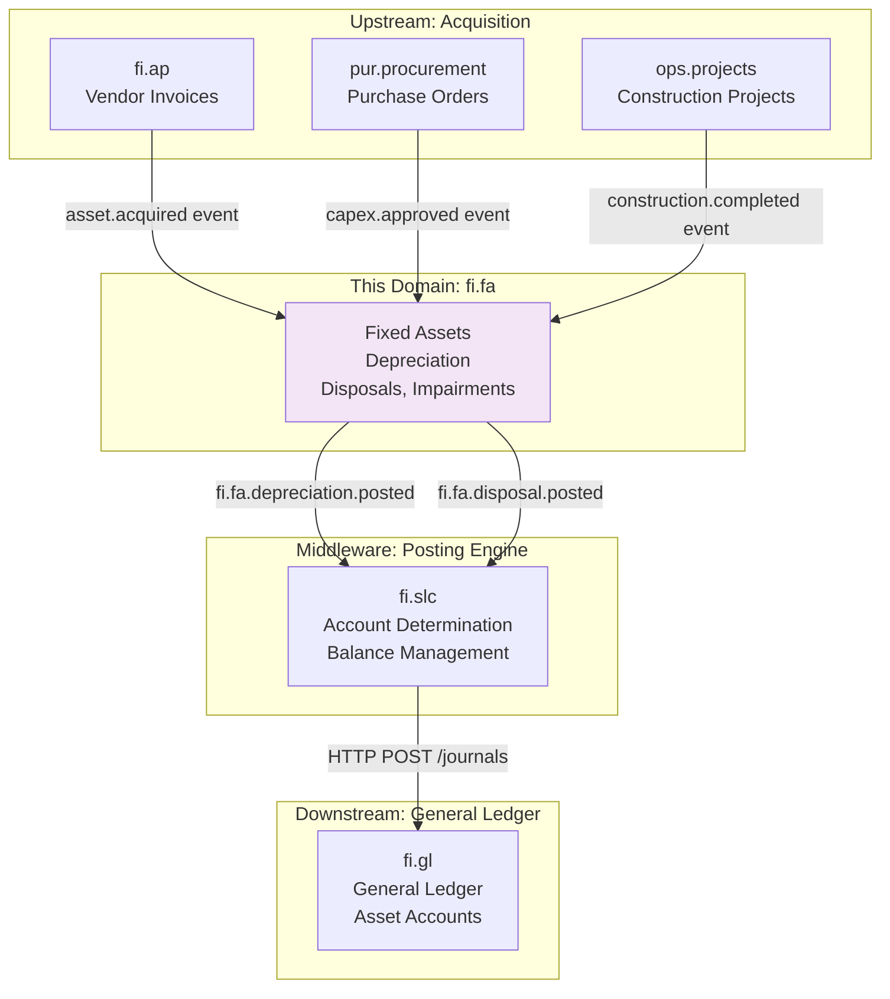
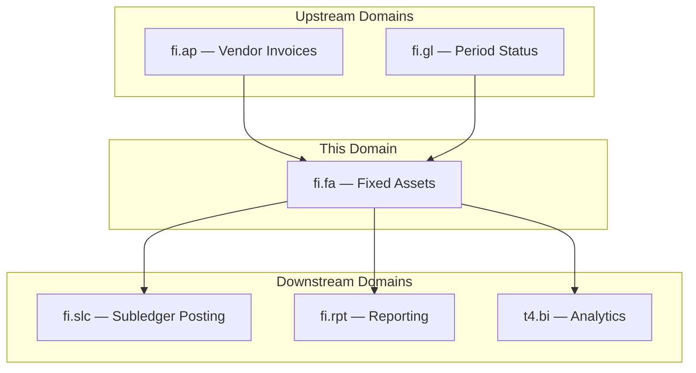
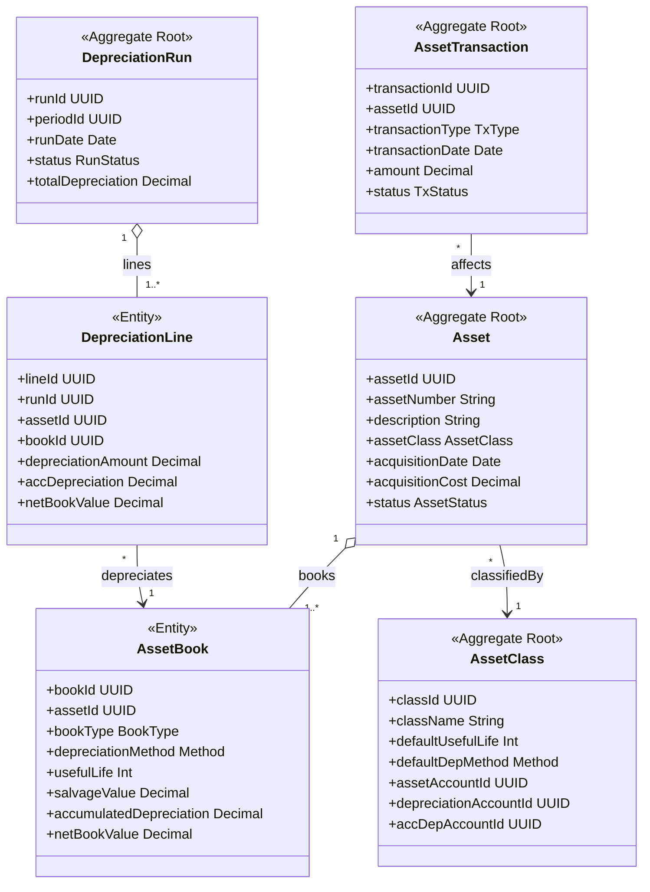
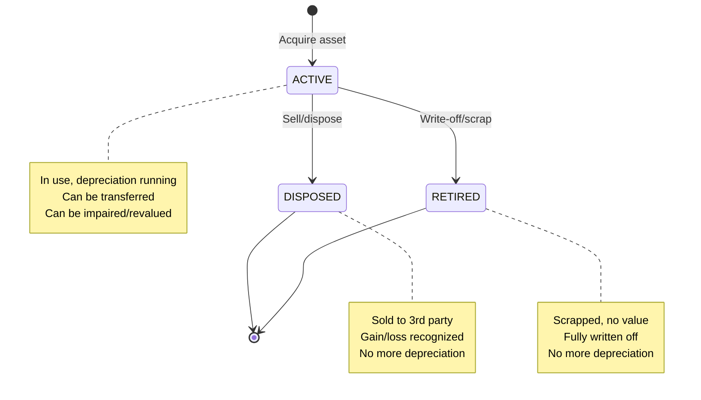
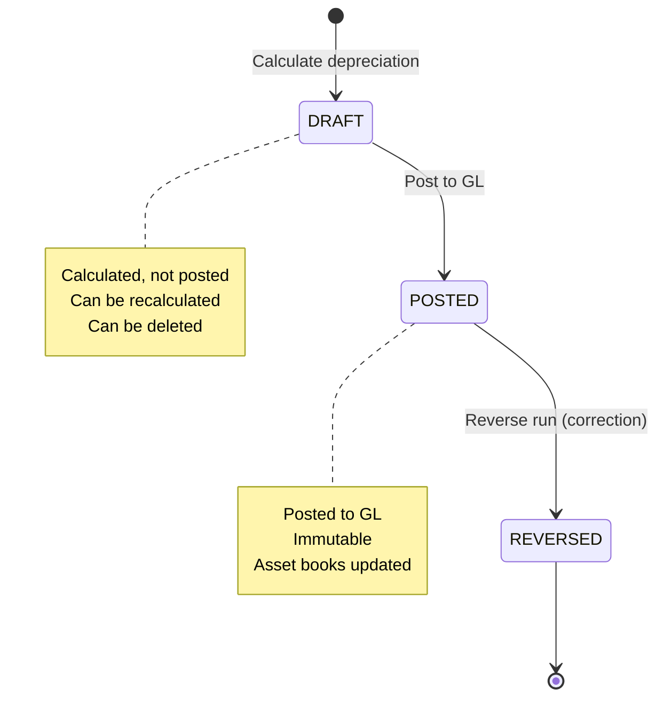
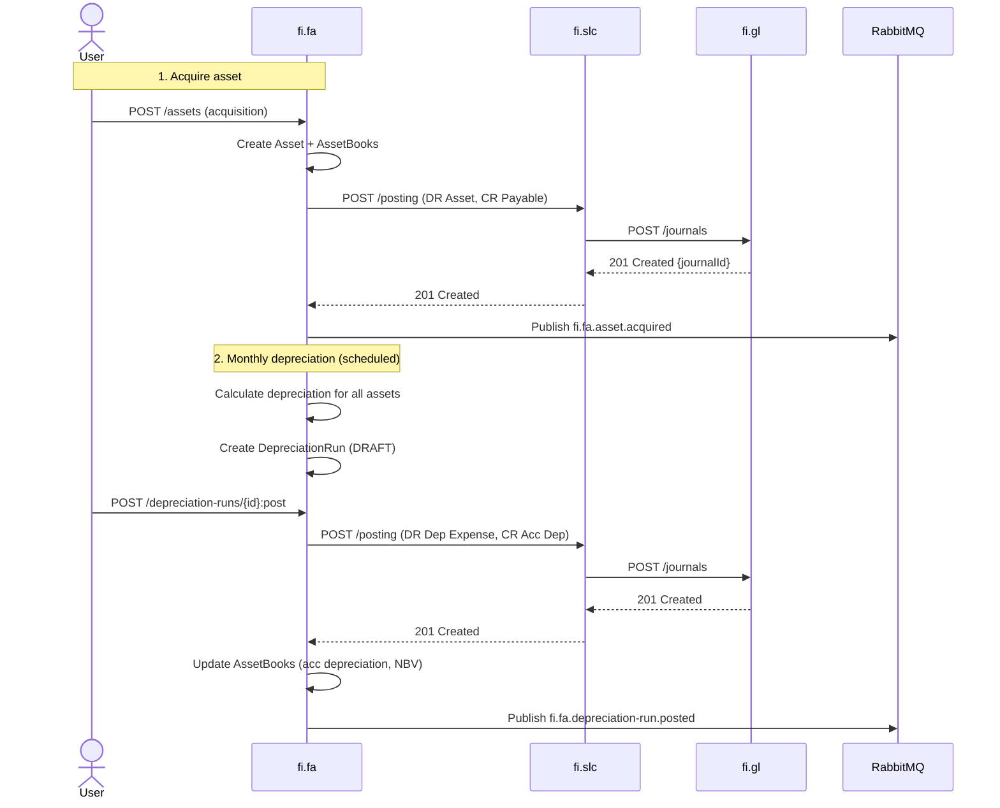
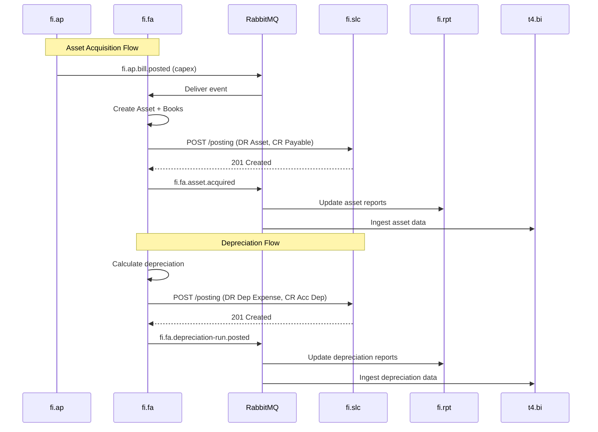
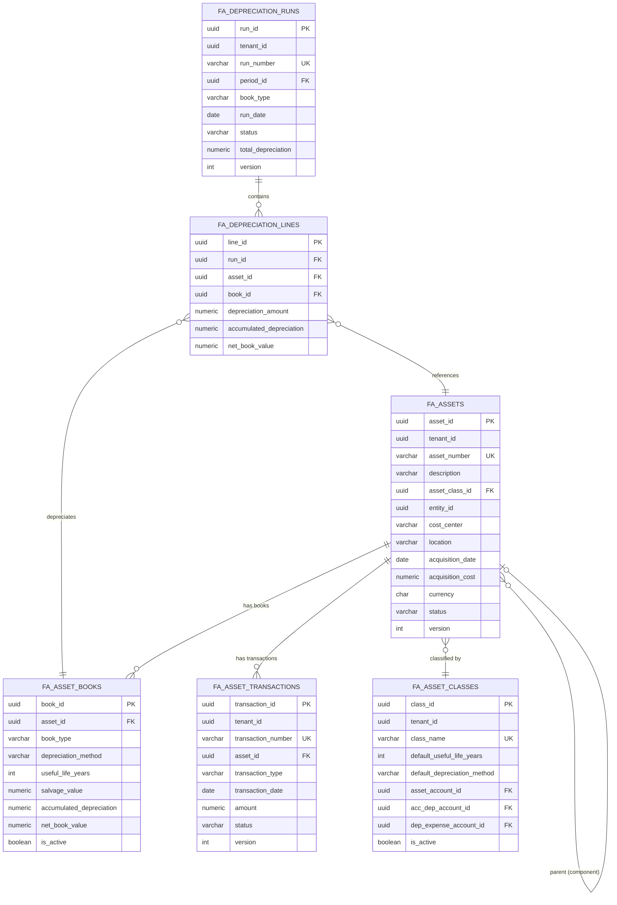

<!-- Template Meta
     Template-ID:   TPL-SVC
     Version:       1.0.0
     Last Updated:  2026-04-03
     Changelog:
       1.0.0 (2026-04-03) — Initial versioned baseline.
-->

# fi.fa - Fixed Assets Domain / Service Specification

> **Conceptual Stack Layer:** Domain / Service
> **Space:** Platform
> **Owner:** FI Domain Engineering Team
> **Schema alignment:** `service-layer.schema.json`
> **Companion files:** `openapi.yaml`, `*.schema.json` (event contracts)
> **Referenced by:** Platform-Feature Spec SS5 (backend dependencies), BFF Contract
> **Belongs to:** FI Suite Spec (`_fi_suite.md`)

> **Meta Information**
> - **Version:** 2026-04-04
> - **Template:** `domain-service-spec.md` v1.0.0
> - **Template Compliance:** ~95% — all 16 sections present with content; minor open questions remain for feature dependencies
> - **Author(s):** OpenLeap Architecture Team
> - **Status:** DRAFT
> - **Suite:** `fi`
> - **Domain:** `fa`
> - **Bounded Context Ref:** `bc:fixed-assets`
> - **Service ID:** `fi-fa-svc`
> - **basePackage:** `io.openleap.fi.fa`
> - **API Base Path:** `/api/fi/fa/v1`
> - **OpenLeap Starter Version:** `v4.1.0`
> - **Port:** `8440`
> - **Repository:** `io.openleap.fi.fa`
> - **Tags:** `fixed-assets`, `depreciation`, `asset-accounting`, `PP&E`, `IAS16`
> - **Team:**
>   - Name: `team-fi`
>   - Email: `fi-team@openleap.io`
>   - Slack: `#fi-team`

---

## Specification Guidelines Compliance

> ### Non-Negotiables
> - Never invent facts. If required info is missing, add an **OPEN QUESTION** entry.
> - Preserve intent and decisions. Only change meaning when explicitly requested.
> - Do not remove normative constraints unless they are explicitly replaced.
> - Keep the spec **self-contained**: no "see chat", no implicit context.
>
> ### Source of Truth Priority
> When sources conflict:
> 1. Spec (explicit) wins
> 2. Starter specs (implementation constraints) next
> 3. Guidelines (best practices) last
>
> Record conflicts in the **Decisions & Conflicts** section (see Section 14).
>
> ### Style Guide
> - Prefer short sentences and lists.
> - Use MUST/SHOULD/MAY for normative statements.
> - Keep terminology consistent (Aggregate, Domain Service, Application Service, Command, Event).
> - Avoid ambiguous words ("often", "maybe") unless explicitly noting uncertainty.
> - Keep examples minimal and clearly marked as examples.
> - Do not add implementation code unless the chapter explicitly requires it.

---

## 0. Document Purpose & Scope

### 0.1 Purpose

This document specifies the **Fixed Assets (fi.fa)** domain, which manages the complete lifecycle of fixed assets from acquisition to disposal. It handles depreciation calculations, asset transfers, impairments, revaluations, and ensures compliance with IFRS/GAAP accounting standards for property, plant, and equipment (PP&E).

### 0.2 Target Audience
- Product Owners & Business Stakeholders (Finance, Accounting, Asset Management)
- System Architects & Technical Leads
- Integration Engineers
- Controllers and Fixed Asset Accountants
- Tax Accountants
- External Auditors

### 0.3 Scope

**In Scope:**
- **Asset Lifecycle:** Acquisition, Capitalization, Depreciation, Disposal, Retirement
- **Depreciation Methods:** Straight-Line, Declining Balance, Units of Production, Sum-of-Years-Digits
- **Asset Transfers:** Between cost centers, locations, entities (with intercompany)
- **Impairments:** Recognition and reversal of impairment losses (IAS 36)
- **Revaluations:** Fair value adjustments (IAS 16)
- **GL Integration:** Automatic posting of depreciation, disposals, impairments via fi.slc
- **Multi-Book Accounting:** Separate depreciation for IFRS, Local GAAP, Tax purposes
- **Asset Classes:** Buildings, Machinery, Vehicles, IT Equipment, Furniture
- **Sub-Assets:** Component accounting (e.g., building = structure + roof + HVAC)

**Out of Scope:**
- Physical asset tracking (RFID, barcodes) — Asset management system
- Maintenance planning and work orders — Maintenance management
- Lease accounting (IFRS 16) — fi.lease (separate domain)
- Intangible assets (IAS 38) — fi.intangible (separate domain)
- Investment property (IAS 40) — fi.investment (separate domain)

### 0.4 Related Documents
- `_fi_suite.md` - FI Suite architecture
- `fi_gl-spec.md` - General Ledger specification
- `fi_slc-spec.md` - Subledger core specification
- `fi_ap-spec.md` - Accounts Payable (asset acquisition)

---

## 1. Business Context

### 1.1 Domain Purpose

**fi.fa** manages the financial accounting of long-term tangible assets (property, plant, and equipment). Every time an organization purchases a building, machine, or vehicle, the cost must be capitalized and depreciated over its useful life. This domain ensures accurate asset valuation, proper expense recognition (depreciation), and compliance with accounting standards.

**Core Business Problems Solved:**
- **Asset Valuation:** What is the book value of our fixed assets?
- **Depreciation Expense:** How much depreciation should we recognize this period?
- **Compliance:** Meet IFRS/GAAP requirements for PP&E accounting
- **Tax Optimization:** Calculate tax depreciation (accelerated methods)
- **Disposal Accounting:** Recognize gain/loss on asset sale or retirement
- **Audit Trail:** Provide complete lifecycle documentation for auditors

### 1.2 Business Value

**For the Organization:**
- **Accurate Balance Sheet:** Proper asset valuation (major balance sheet item)
- **Expense Matching:** Depreciation expense matches asset usage (accrual accounting)
- **Tax Compliance:** Optimized tax depreciation, deferred tax calculations
- **Investment Decisions:** Understand ROI, asset utilization, replacement needs
- **Regulatory Compliance:** Meet IAS 16, ASC 360, local GAAP requirements

**For Users:**
- **Asset Accountant:** Automated depreciation runs, disposal accounting
- **Controller:** Period-end depreciation posting, asset reconciliation
- **Tax Accountant:** Tax depreciation reports, deferred tax calculations
- **CFO:** Asset portfolio analysis, capex planning
- **Auditor:** Complete asset lifecycle trail, IFRS/GAAP compliance verification

### 1.3 Key Stakeholders

| Role | Responsibility | Primary Use Cases |
|------|----------------|-------------------|
| Asset Accountant | Asset master data, depreciation | Create assets, run depreciation, post to GL |
| Controller | Month-end close | Review depreciation, reconcile to GL, close period |
| Tax Accountant | Tax depreciation | Calculate tax depreciation, prepare tax reports |
| Facility Manager | Asset transfers | Transfer assets between locations/cost centers |
| CFO | Capital planning | Analyze asset portfolio, plan replacements |
| External Auditor | Financial audit | Verify asset valuation, depreciation calculations |

### 1.4 Strategic Positioning

**fi.fa** sits **between** asset acquisition (fi.ap, procurement) and the General Ledger (fi.gl).



**Key Insight:** fi.fa capitalizes purchases and spreads cost over useful life via depreciation.

### 1.5 Service Context

| Property | Value |
|----------|-------|
| **Suite** | `fi` |
| **Domain** | `fa` |
| **Bounded Context** | `bc:fixed-assets` |
| **Service ID** | `fi-fa-svc` |
| **Base Package** | `io.openleap.fi.fa` |

**Responsibilities:**
- Manage asset master data and classification
- Calculate and post periodic depreciation (multi-book)
- Process asset transactions (acquisition, disposal, impairment, revaluation, transfer)
- Provide asset valuation data for financial statements
- Support component accounting (sub-assets per IAS 16)

**Authoritative Sources:**
| Source Type | Description | Access Pattern |
|-------------|-------------|----------------|
| REST API | Asset master data, depreciation runs, transactions | Synchronous |
| Database | Owned asset, book, run, and transaction records | Direct (owner) |
| Events | Asset lifecycle events (acquired, depreciated, disposed, impaired) | Asynchronous |



---

## 2. Service Identity

| Property | Value | Schema Field |
|----------|-------|-------------|
| **Service ID** | `fi-fa-svc` | `metadata.id` |
| **Display Name** | `Fixed Assets Service` | `metadata.name` |
| **Suite** | `fi` | `metadata.suite` |
| **Domain** | `fa` | `metadata.domain` |
| **Bounded Context** | `bc:fixed-assets` | `metadata.bounded_context_ref` |
| **Version** | `1.0.0` | `metadata.version` |
| **Status** | DRAFT | `metadata.status` |
| **API Base Path** | `/api/fi/fa/v1` | `metadata.api_base_path` |
| **Repository** | `io.openleap.fi.fa` | `metadata.repository` |
| **Tags** | `fixed-assets`, `depreciation`, `asset-accounting` | `metadata.tags` |

**Team:**
| Property | Value |
|----------|-------|
| **Name** | `team-fi` |
| **Email** | `fi-team@openleap.io` |
| **Slack Channel** | `#fi-team` |

---

## 3. Domain Model

### 3.1 Conceptual Overview

The fixed assets domain model consists of five main pillars:

1. **Asset Master:** Core asset data (description, class, location, cost)
2. **Depreciation:** Periodic expense calculation and posting
3. **Transactions:** Acquisition, Disposal, Transfer, Impairment, Revaluation
4. **Books:** Multi-book accounting (IFRS, Tax, Local GAAP)
5. **GL Integration:** Post depreciation and transactions to GL via fi.slc

**Key Principles:**
- **Multi-Book:** Separate depreciation for financial (IFRS) and tax purposes
- **Component Accounting:** Assets can have sub-assets (IAS 16)
- **Immutability:** Posted depreciation cannot be changed, only adjusted with correcting runs
- **Event-Driven:** Asset transactions trigger GL postings
- **Subledger Pattern:** Detailed asset records, summarized to GL asset accounts

### 3.2 Core Concepts



### 3.3 Aggregate Definitions

#### 3.3.1 Asset

| Property | Value |
|----------|-------|
| **Aggregate ID** | `agg:asset` |
| **Name** | `Asset` |

**Business Purpose:**
Represents a fixed asset (tangible long-term asset). Core master data for depreciation and lifecycle management. Corresponds to an individual item of property, plant, or equipment capitalized on the balance sheet.

##### Aggregate Root

**Key Attributes:**

| Attribute | Type | Format | Description | Constraints | Required | Read-Only |
|-----------|------|--------|-------------|-------------|----------|-----------|
| assetId | string | uuid | Unique identifier generated via OlUuid.create() | Immutable | Yes | Yes |
| tenantId | string | uuid | Tenant ownership for RLS | Immutable | Yes | Yes |
| assetNumber | string | — | Sequential asset number, human-readable identifier | max_length: 50, unique per tenant | Yes | No |
| description | string | — | Asset description (e.g., "Dell Laptop XPS 15") | max_length: 500, min_length: 1 | Yes | No |
| assetClassId | string | uuid | Asset classification reference | FK to asset_classes | Yes | No |
| entityId | string | uuid | Legal entity owner | FK to entities | Yes | No |
| costCenter | string | — | Responsible cost center | max_length: 50 | Yes | No |
| location | string | — | Physical location (e.g., "Building A, Floor 3") | max_length: 200 | No | No |
| acquisitionDate | string | date | Date placed in service | — | Yes | No |
| acquisitionCost | number | decimal | Original cost of the asset | minimum: 0.01, precision: 19,4 | Yes | No |
| currency | string | — | Cost currency | pattern: `^[A-Z]{3}$`, ISO 4217 | Yes | No |
| status | string | — | Current lifecycle state | enum_ref: `AssetStatus` | Yes | No |
| serialNumber | string | — | Manufacturer serial number | max_length: 100 | No | No |
| parentAssetId | string | uuid | Parent asset for component accounting | FK to assets, no circular refs | No | No |
| supplierId | string | uuid | Vendor reference | FK to suppliers (bp) | No | No |
| sourcePoId | string | uuid | Purchase order reference | — | No | No |
| sourceApBillId | string | uuid | AP invoice reference | FK to fi.ap bills | No | No |
| warrantyEndDate | string | date | Warranty expiration date | — | No | No |
| disposalDate | string | date | Date of disposal | Set when status = DISPOSED | No | No |
| disposalProceeds | number | decimal | Sale proceeds on disposal | precision: 19,4, >= 0 | No | No |
| version | integer | int64 | Optimistic locking version | — | Yes | Yes |
| createdAt | string | date-time | Creation timestamp | — | Yes | Yes |
| updatedAt | string | date-time | Last update timestamp | — | Yes | Yes |

**Lifecycle States:**

| Property | Value |
|----------|-------|
| **Initial State** | `ACTIVE` |
| **Terminal States** | `DISPOSED`, `RETIRED` |



**State Descriptions:**
| State | Description | Business Meaning |
|-------|-------------|------------------|
| ACTIVE | Asset in use | Depreciation running, can be transferred, impaired, or revalued |
| DISPOSED | Asset sold to third party | Gain/loss recognized, no further depreciation |
| RETIRED | Asset scrapped or written off | Fully written off, no residual value, no further depreciation |

**Allowed Transitions:**
| From State | To State | Trigger | Guard / Business Preconditions |
|------------|----------|---------|-------------------------------|
| ACTIVE | DISPOSED | Asset sale or disposal transaction posted | Valid disposal transaction with proceeds amount |
| ACTIVE | RETIRED | Asset write-off or scrap transaction posted | Valid retirement transaction |

**Invariants:**
| Rule ID | Description |
|---------|-------------|
| BR-AST-001 | Acquisition cost cannot be changed after initial capitalization |
| BR-AST-002 | No circular parent-child references in component hierarchy |
| BR-AST-003 | Only ACTIVE assets can be disposed or retired |

**Domain Events Emitted:**
- `fi.fa.asset.acquired`
- `fi.fa.asset.updated`
- `fi.fa.asset.disposed`
- `fi.fa.asset.retired`
- `fi.fa.asset.transferred`

**Asset Classes (Examples):**

| Class | Description | Typical Useful Life | Depreciation Method |
|-------|-------------|---------------------|---------------------|
| BUILDING | Buildings, structures | 40 years | Straight-Line |
| MACHINERY | Manufacturing equipment | 10 years | Straight-Line |
| VEHICLE | Cars, trucks | 5 years | Declining Balance |
| IT_EQUIPMENT | Computers, servers | 3 years | Straight-Line |
| FURNITURE | Office furniture | 7 years | Straight-Line |

##### Child Entities

###### Entity: AssetBook

| Property | Value |
|----------|-------|
| **Entity ID** | `ent:asset-book` |
| **Name** | `AssetBook` |
| **Relationship to Root** | one_to_many |

**Business Purpose:**
Represents depreciation and valuation for one accounting book (IFRS, Tax, Local GAAP). Each asset MUST have at least one book. Multi-book accounting allows separate depreciation calculations for financial reporting and tax purposes.

**Attributes:**
| Attribute | Type | Format | Description | Constraints | Required |
|-----------|------|--------|-------------|-------------|----------|
| bookId | string | uuid | Unique identifier | Immutable | Yes |
| assetId | string | uuid | Parent asset reference | FK to assets | Yes |
| bookType | string | — | Accounting standard | enum_ref: `BookType` | Yes |
| depreciationMethod | string | — | Calculation method | enum_ref: `DepreciationMethod` | Yes |
| usefulLifeYears | integer | int32 | Asset useful life in years | minimum: 1 | Yes |
| usefulLifeUnits | number | decimal | Total production units (for UOP method) | precision: 19,6, > 0 | No |
| salvageValue | number | decimal | Residual value at end of useful life | precision: 19,4, >= 0 | Yes |
| depreciationStartDate | string | date | Date depreciation begins | >= asset.acquisitionDate | Yes |
| accumulatedDepreciation | number | decimal | Total depreciation charged to date | precision: 19,4, >= 0 | Yes |
| netBookValue | number | decimal | Acquisition cost minus accumulated depreciation | precision: 19,4, >= 0 | Yes |
| lastDepreciationDate | string | date | Date of last depreciation run | — | No |
| fullyDepreciatedDate | string | date | Date asset became fully depreciated | — | No |
| isActive | boolean | — | Whether this book is active for depreciation | default: true | Yes |

**Collection Constraints:**
- Minimum items: 1 (BR-BOOK-001)
- Maximum items: 4 (one per BookType)

**Invariants:**
| Rule ID | Description |
|---------|-------------|
| BR-BOOK-001 | Each asset MUST have at least one book |
| BR-BOOK-002 | netBookValue = acquisitionCost - accumulatedDepreciation |
| BR-BOOK-003 | When fully depreciated, set isActive = false |

**Depreciation Methods:**

| Method | Code | Description | Formula |
|--------|------|-------------|---------|
| Straight-Line | SL | Equal expense per period | (Cost - Salvage) / Useful Life |
| Declining Balance | DB | Percentage of NBV per period | NBV x Rate (e.g., 200% / useful life) |
| Units of Production | UOP | Based on actual usage | (Cost - Salvage) x Units Used / Total Units |
| Sum-of-Years-Digits | SYD | Accelerated depreciation | (Cost - Salvage) x (Remaining Life / SYD Sum) |

**Example Scenarios:**

**Scenario 1: Computer Purchase (Multi-Book)**
```json
{
  "asset": {
    "description": "Dell Laptop XPS 15",
    "assetClass": "IT_EQUIPMENT",
    "acquisitionDate": "2025-01-01",
    "acquisitionCost": 2000.00,
    "currency": "EUR"
  },
  "books": [
    {
      "bookType": "IFRS",
      "depreciationMethod": "SL",
      "usefulLifeYears": 3,
      "salvageValue": 200.00,
      "depreciationStartDate": "2025-01-01"
    },
    {
      "bookType": "TAX",
      "depreciationMethod": "DB",
      "usefulLifeYears": 2,
      "salvageValue": 0.00,
      "depreciationStartDate": "2025-01-01"
    }
  ]
}
```

**Result:**
- IFRS Book: EUR 1,800 / 3 years = EUR 600/year straight-line
- Tax Book: EUR 2,000 x 50% = EUR 1,000 year 1, EUR 1,000 x 50% = EUR 500 year 2 (accelerated)

##### Value Objects

###### Value Object: Money

| Property | Value |
|----------|-------|
| **VO ID** | `vo:money` |
| **Name** | `Money` |

**Description:**
Represents a monetary amount with currency. Used for acquisition cost, salvage value, depreciation amounts, and disposal proceeds.

**Attributes:**
| Attribute | Type | Format | Description | Constraints |
|-----------|------|--------|-------------|-------------|
| amount | number | decimal | Monetary amount | precision: 19,4 |
| currencyCode | string | — | ISO 4217 currency code | pattern: `^[A-Z]{3}$` |

**Validation Rules:**
- amount MUST be non-negative for asset values
- currencyCode MUST be a valid ISO 4217 code
- Currency MUST be consistent within a single asset (all books use asset's currency)

---

#### 3.3.2 DepreciationRun

| Property | Value |
|----------|-------|
| **Aggregate ID** | `agg:depreciation-run` |
| **Name** | `DepreciationRun` |

**Business Purpose:**
Represents a periodic depreciation calculation and posting. Runs monthly, quarterly, or annually. Groups all individual asset depreciation lines for a given period and book type into a single postable batch.

##### Aggregate Root

**Key Attributes:**

| Attribute | Type | Format | Description | Constraints | Required | Read-Only |
|-----------|------|--------|-------------|-------------|----------|-----------|
| runId | string | uuid | Unique identifier generated via OlUuid.create() | Immutable | Yes | Yes |
| tenantId | string | uuid | Tenant ownership for RLS | Immutable | Yes | Yes |
| runNumber | string | — | Sequential run number (e.g., "DEP-2025-12") | max_length: 50, unique per tenant | Yes | No |
| periodId | string | uuid | Fiscal period reference | FK to fi.gl.periods | Yes | No |
| bookType | string | — | Which accounting book to depreciate | enum_ref: `BookType` | Yes | No |
| runDate | string | date | Depreciation as-of date | — | Yes | No |
| status | string | — | Current lifecycle state | enum_ref: `RunStatus` | Yes | No |
| totalDepreciation | number | decimal | Sum of all line amounts | precision: 19,4, >= 0 | Yes | No |
| currency | string | — | Run currency | pattern: `^[A-Z]{3}$`, ISO 4217 | Yes | No |
| glJournalId | string | uuid | Posted GL journal reference | FK to fi.gl.journal_entries | No | No |
| createdBy | string | uuid | User who created run | — | Yes | Yes |
| version | integer | int64 | Optimistic locking version | — | Yes | Yes |
| createdAt | string | date-time | Creation timestamp | — | Yes | Yes |
| updatedAt | string | date-time | Last update timestamp | — | Yes | Yes |
| postedAt | string | date-time | Posting timestamp | Set when status = POSTED | No | Yes |

**Lifecycle States:**

| Property | Value |
|----------|-------|
| **Initial State** | `DRAFT` |
| **Terminal States** | `REVERSED` |



**State Descriptions:**
| State | Description | Business Meaning |
|-------|-------------|------------------|
| DRAFT | Depreciation calculated but not posted | Can be reviewed, recalculated, or deleted |
| POSTED | Depreciation posted to GL | Immutable, asset books updated with new accumulated depreciation |
| REVERSED | Posted run reversed via correction | Original posting cancelled, new correcting journal created |

**Allowed Transitions:**
| From State | To State | Trigger | Guard / Business Preconditions |
|------------|----------|---------|-------------------------------|
| DRAFT | POSTED | User posts depreciation run | GL period MUST be OPEN (BR-RUN-002) |
| POSTED | REVERSED | User reverses posted run | Reversal journal MUST be created |

**Invariants:**
| Rule ID | Description |
|---------|-------------|
| BR-RUN-001 | One POSTED run per (tenant, periodId, bookType) |
| BR-RUN-002 | Cannot post depreciation if GL period is CLOSED |

**Domain Events Emitted:**
- `fi.fa.depreciation-run.created`
- `fi.fa.depreciation-run.posted`
- `fi.fa.depreciation-run.reversed`

##### Child Entities

###### Entity: DepreciationLine

| Property | Value |
|----------|-------|
| **Entity ID** | `ent:depreciation-line` |
| **Name** | `DepreciationLine` |
| **Relationship to Root** | one_to_many |

**Business Purpose:**
Individual asset depreciation within a run. One line per active asset book. Records the depreciation amount, updated accumulated depreciation, and resulting net book value for audit trail purposes.

**Attributes:**
| Attribute | Type | Format | Description | Constraints | Required |
|-----------|------|--------|-------------|-------------|----------|
| lineId | string | uuid | Unique identifier | Immutable | Yes |
| runId | string | uuid | Parent depreciation run | FK to depreciation_runs | Yes |
| assetId | string | uuid | Depreciated asset | FK to assets | Yes |
| bookId | string | uuid | Asset book being depreciated | FK to asset_books | Yes |
| depreciationAmount | number | decimal | Current period depreciation | precision: 19,4, >= 0 | Yes |
| accumulatedDepreciation | number | decimal | Total accumulated after this run | precision: 19,4, >= 0 | Yes |
| netBookValue | number | decimal | NBV after this run | precision: 19,4, >= 0 | Yes |
| usedUnits | number | decimal | Units used this period (for UOP) | precision: 19,6 | No |

**Collection Constraints:**
- Minimum items: 1 (a run with zero lines is meaningless)
- Maximum items: unbounded (limited by active asset count)

**Invariants:**
| Rule ID | Description |
|---------|-------------|
| BR-BOOK-002 | NBV = acquisitionCost - accumulatedDepreciation |
| BR-BOOK-003 | When fully depreciated, mark book as inactive |

**Depreciation Calculation Examples:**

**Straight-Line:**
```
Acquisition Cost: EUR 10,000
Salvage Value: EUR 1,000
Useful Life: 5 years
Annual Depreciation: (EUR 10,000 - EUR 1,000) / 5 = EUR 1,800/year
Monthly Depreciation: EUR 1,800 / 12 = EUR 150/month
```

**Declining Balance (200%):**
```
Year 1: EUR 10,000 x 40% = EUR 4,000
Year 2: (EUR 10,000 - EUR 4,000) x 40% = EUR 2,400
Year 3: (EUR 6,000 - EUR 2,400) x 40% = EUR 1,440
...
```

**Units of Production:**
```
Acquisition Cost: EUR 100,000
Salvage Value: EUR 10,000
Total Units: 100,000 units
Units Used This Month: 5,000 units
Depreciation: (EUR 100,000 - EUR 10,000) x 5,000 / 100,000 = EUR 4,500
```

---

#### 3.3.3 AssetTransaction

| Property | Value |
|----------|-------|
| **Aggregate ID** | `agg:asset-transaction` |
| **Name** | `AssetTransaction` |

**Business Purpose:**
Records non-depreciation asset events (acquisition, disposal, impairment, revaluation, transfer). Each transaction produces a GL journal entry via fi.slc when posted.

##### Aggregate Root

**Key Attributes:**

| Attribute | Type | Format | Description | Constraints | Required | Read-Only |
|-----------|------|--------|-------------|-------------|----------|-----------|
| transactionId | string | uuid | Unique identifier generated via OlUuid.create() | Immutable | Yes | Yes |
| tenantId | string | uuid | Tenant ownership for RLS | Immutable | Yes | Yes |
| transactionNumber | string | — | Sequential transaction number | max_length: 50, unique per tenant | Yes | No |
| assetId | string | uuid | Affected asset | FK to assets | Yes | No |
| transactionType | string | — | Type of transaction | enum_ref: `TransactionType` | Yes | No |
| transactionDate | string | date | Transaction effective date | — | Yes | No |
| amount | number | decimal | Transaction amount | precision: 19,4 | Yes | No |
| currency | string | — | Transaction currency | pattern: `^[A-Z]{3}$`, ISO 4217 | Yes | No |
| status | string | — | Current lifecycle state | enum_ref: `TransactionStatus` | Yes | No |
| glJournalId | string | uuid | Posted GL journal reference | FK to fi.gl.journal_entries | No | No |
| fromCostCenter | string | — | Source cost center (for transfers) | max_length: 50 | No | No |
| toCostCenter | string | — | Destination cost center (for transfers) | max_length: 50 | No | No |
| fromEntity | string | uuid | Source entity (for inter-entity transfers) | — | No | No |
| toEntity | string | uuid | Destination entity (for inter-entity transfers) | — | No | No |
| impairmentReason | string | — | Reason for impairment | max_length: 500 | No | No |
| revaluationBasis | string | — | Revaluation basis (e.g., "Fair value per appraisal") | max_length: 500 | No | No |
| version | integer | int64 | Optimistic locking version | — | Yes | Yes |
| createdAt | string | date-time | Creation timestamp | — | Yes | Yes |
| updatedAt | string | date-time | Last update timestamp | — | Yes | Yes |

**Lifecycle States:**

| Property | Value |
|----------|-------|
| **Initial State** | `DRAFT` |
| **Terminal States** | `POSTED` |

**State Descriptions:**
| State | Description | Business Meaning |
|-------|-------------|------------------|
| DRAFT | Transaction created but not yet posted | Can be reviewed and edited |
| POSTED | Transaction posted to GL via fi.slc | Immutable, GL journal created |

**Allowed Transitions:**
| From State | To State | Trigger | Guard / Business Preconditions |
|------------|----------|---------|-------------------------------|
| DRAFT | POSTED | User posts the transaction | GL period MUST be OPEN, asset MUST be ACTIVE (for disposals/transfers) |

**Invariants:**
| Rule ID | Description |
|---------|-------------|
| BR-AST-003 | Only ACTIVE assets can be subject to disposal, impairment, revaluation, or transfer |
| BR-TX-001 | Transfer transactions MUST specify fromCostCenter and toCostCenter |
| BR-TX-002 | Impairment transactions MUST specify impairmentReason |

**Domain Events Emitted:**
- `fi.fa.transaction.created`
- `fi.fa.transaction.posted`

**Transaction Types:**

| Type | Description | GL Impact | Example |
|------|-------------|-----------|---------|
| ACQUISITION | Initial capitalization | DR Asset, CR Payable | Purchase machine EUR 50,000 |
| DISPOSAL | Sale or scrap | DR Cash/Proceeds, CR Asset, DR/CR Gain/Loss | Sell vehicle for EUR 10,000 |
| IMPAIRMENT | Reduce asset value (IAS 36) | DR Impairment Loss, CR Accumulated Impairment | Write down EUR 20,000 |
| REVALUATION | Fair value adjustment (IAS 16) | DR Asset, CR Revaluation Reserve | Increase building value EUR 100,000 |
| TRANSFER | Move between cost centers | DR Asset (new CC), CR Asset (old CC) | Transfer laptop to sales dept |

---

#### 3.3.4 AssetClass

| Property | Value |
|----------|-------|
| **Aggregate ID** | `agg:asset-class` |
| **Name** | `AssetClass` |

**Business Purpose:**
Template for asset configuration. Defines default depreciation parameters and GL account mappings. Asset classes reduce data entry and ensure consistent accounting treatment for similar assets. Equivalent to SAP FI-AA asset class (ANLKL).

##### Aggregate Root

**Key Attributes:**

| Attribute | Type | Format | Description | Constraints | Required | Read-Only |
|-----------|------|--------|-------------|-------------|----------|-----------|
| classId | string | uuid | Unique identifier generated via OlUuid.create() | Immutable | Yes | Yes |
| tenantId | string | uuid | Tenant ownership for RLS | Immutable | Yes | Yes |
| className | string | — | Class name (e.g., "BUILDING", "VEHICLE") | max_length: 100, unique per tenant | Yes | No |
| description | string | — | Class description | max_length: 500 | No | No |
| defaultUsefulLifeYears | integer | int32 | Default useful life | minimum: 1 | Yes | No |
| defaultDepreciationMethod | string | — | Default depreciation method | enum_ref: `DepreciationMethod` | Yes | No |
| assetAccountId | string | uuid | Asset GL account (balance sheet) | FK to fi.gl.accounts | Yes | No |
| accumulatedDepreciationAccountId | string | uuid | Accumulated depreciation GL account | FK to fi.gl.accounts | Yes | No |
| depreciationExpenseAccountId | string | uuid | Depreciation expense GL account (P&L) | FK to fi.gl.accounts | Yes | No |
| disposalGainAccountId | string | uuid | Gain on disposal GL account | FK to fi.gl.accounts | No | No |
| disposalLossAccountId | string | uuid | Loss on disposal GL account | FK to fi.gl.accounts | No | No |
| impairmentLossAccountId | string | uuid | Impairment loss GL account | FK to fi.gl.accounts | No | No |
| revaluationReserveAccountId | string | uuid | Revaluation reserve GL account | FK to fi.gl.accounts | No | No |
| isActive | boolean | — | Whether this class is active for use | default: true | Yes | No |
| version | integer | int64 | Optimistic locking version | — | Yes | Yes |
| createdAt | string | date-time | Creation timestamp | — | Yes | Yes |
| updatedAt | string | date-time | Last update timestamp | — | Yes | Yes |

**Invariants:**
| Rule ID | Description |
|---------|-------------|
| BR-CLS-001 | Cannot deactivate asset class if active assets reference it |
| BR-CLS-002 | GL account references MUST be valid and active |

**Domain Events Emitted:**
- `fi.fa.asset-class.created`
- `fi.fa.asset-class.updated`

---

### 3.4 Enumerations

#### AssetStatus

**Description:** Lifecycle states of a fixed asset.

| Value | Description | Deprecated |
|-------|-------------|------------|
| `ACTIVE` | Asset is in use, depreciation running | No |
| `DISPOSED` | Asset sold to third party, gain/loss recognized | No |
| `RETIRED` | Asset scrapped or written off with no residual value | No |

#### BookType

**Description:** Accounting standard/purpose for a depreciation book.

| Value | Description | Deprecated |
|-------|-------------|------------|
| `IFRS` | International Financial Reporting Standards book | No |
| `TAX` | Tax depreciation book (accelerated methods for tax deductions) | No |
| `LOCAL_GAAP` | Local Generally Accepted Accounting Principles book | No |
| `MANAGEMENT` | Management/internal reporting book | No |

#### DepreciationMethod

**Description:** Method used to calculate periodic depreciation expense.

| Value | Description | Deprecated |
|-------|-------------|------------|
| `SL` | Straight-Line: equal expense per period | No |
| `DB` | Declining Balance: percentage of net book value per period | No |
| `UOP` | Units of Production: based on actual usage/output | No |
| `SYD` | Sum-of-Years-Digits: accelerated, front-loaded depreciation | No |

#### RunStatus

**Description:** Lifecycle states of a depreciation run.

| Value | Description | Deprecated |
|-------|-------------|------------|
| `DRAFT` | Calculated but not yet posted to GL | No |
| `POSTED` | Posted to GL, asset books updated | No |
| `REVERSED` | Previously posted run has been reversed | No |

#### TransactionType

**Description:** Types of non-depreciation asset transactions.

| Value | Description | Deprecated |
|-------|-------------|------------|
| `ACQUISITION` | Initial capitalization of a new asset | No |
| `DISPOSAL` | Sale or disposal of an existing asset | No |
| `IMPAIRMENT` | Write-down of asset value per IAS 36 | No |
| `REVALUATION` | Fair value adjustment per IAS 16 | No |
| `TRANSFER` | Transfer between cost centers or legal entities | No |

#### TransactionStatus

**Description:** Lifecycle states of an asset transaction.

| Value | Description | Deprecated |
|-------|-------------|------------|
| `DRAFT` | Transaction created but not yet posted | No |
| `POSTED` | Transaction posted to GL via fi.slc | No |

### 3.5 Shared Types

#### Money

| Property | Value |
|----------|-------|
| **Type ID** | `type:money` |
| **Name** | `Money` |

**Description:** Represents a monetary amount with currency code. Reused across all aggregates that handle financial values.

**Attributes:**
| Attribute | Type | Format | Description | Constraints |
|-----------|------|--------|-------------|-------------|
| amount | number | decimal | Monetary amount | precision: 19,4 |
| currencyCode | string | — | ISO 4217 currency code | pattern: `^[A-Z]{3}$` |

**Validation Rules:**
- amount precision MUST NOT exceed 19 digits with 4 decimal places
- currencyCode MUST be a valid, active ISO 4217 code

**Used By:**
- `agg:asset` (acquisitionCost, disposalProceeds)
- `agg:depreciation-run` (totalDepreciation)
- `agg:asset-transaction` (amount)

---

## 4. Business Rules & Constraints

### 4.1 Business Rules Catalog

| ID | Rule Name | Description | Scope | Enforcement | Error Code |
|----|-----------|-------------|-------|-------------|------------|
| BR-AST-001 | Acquisition Cost Immutability | Cost cannot be changed after capitalization | Asset | Update | `ACQUISITION_COST_IMMUTABLE` |
| BR-AST-002 | Component Hierarchy | Prevent circular parent-child references | Asset | Create/Update | `CIRCULAR_COMPONENT_REF` |
| BR-AST-003 | Disposal Prerequisites | Only ACTIVE assets can be disposed/retired | Asset | State transition | `ASSET_NOT_ACTIVE` |
| BR-BOOK-001 | Multi-Book Requirement | Each asset needs at least one book | AssetBook | Create | `NO_BOOK_DEFINED` |
| BR-BOOK-002 | NBV Calculation | NBV = Cost - Accumulated Depreciation | AssetBook | Always | `NBV_MISMATCH` |
| BR-BOOK-003 | Fully Depreciated | Stop depreciation when acc dep = depreciable amount | AssetBook | Depreciation run | `ALREADY_FULLY_DEPRECIATED` |
| BR-RUN-001 | Period Uniqueness | One posted run per (period, book type) | DepreciationRun | Post | `DUPLICATE_RUN` |
| BR-RUN-002 | Period Status | Cannot post if GL period closed | DepreciationRun | Post | `PERIOD_CLOSED` |
| BR-CLS-001 | Active Class Protection | Cannot deactivate class with active assets | AssetClass | Update | `CLASS_IN_USE` |
| BR-CLS-002 | GL Account Validity | GL account references must be valid and active | AssetClass | Create/Update | `INVALID_GL_ACCOUNT` |
| BR-TX-001 | Transfer Fields Required | Transfers must specify from/to cost center | AssetTransaction | Create | `TRANSFER_FIELDS_MISSING` |
| BR-TX-002 | Impairment Reason Required | Impairments must specify reason | AssetTransaction | Create | `IMPAIRMENT_REASON_MISSING` |

### 4.2 Detailed Rule Definitions

#### BR-AST-001: Acquisition Cost Immutability

**Business Context:** Historical cost principle in accounting requires that the original cost of an asset be preserved for audit trail and financial statement purposes. Cost adjustments are only permitted via formal revaluation transactions (IAS 16.31).

**Rule Statement:** The acquisitionCost attribute of an Asset MUST NOT be modified after the initial acquisition transaction is posted.

**Applies To:**
- Aggregate: Asset
- Operations: Update

**Enforcement:** API rejects any PATCH request that attempts to modify acquisitionCost. Only revaluation transactions (AssetTransaction with type=REVALUATION) can adjust the effective cost basis.

**Validation Logic:** On Asset update, check if acquisitionCost field is included in the request body. If so, reject.

**Error Handling:**
- **Error Code:** `ACQUISITION_COST_IMMUTABLE`
- **Error Message:** "Acquisition cost cannot be modified after capitalization. Use a revaluation transaction to adjust asset value."
- **User action:** Create a REVALUATION transaction instead of directly editing the asset.

**Examples:**
- **Valid:** Update asset description from "Laptop" to "Dell Laptop XPS 15"
- **Invalid:** Change acquisitionCost from 2000.00 to 2500.00 via PATCH /assets/{id}

#### BR-AST-003: Disposal Prerequisites

**Business Context:** An asset that has already been disposed or retired cannot be disposed again. This prevents double-counting of disposal gains/losses.

**Rule Statement:** An asset MUST be in ACTIVE status before it can be disposed or retired.

**Applies To:**
- Aggregate: Asset
- Operations: State transition (ACTIVE -> DISPOSED, ACTIVE -> RETIRED)

**Enforcement:** State machine validation before creating disposal/retirement transactions.

**Validation Logic:** Check asset.status == ACTIVE before allowing disposal or retirement transaction creation.

**Error Handling:**
- **Error Code:** `ASSET_NOT_ACTIVE`
- **Error Message:** "Asset {assetNumber} is in status {status} and cannot be disposed. Only ACTIVE assets can be disposed."
- **User action:** Verify correct asset is selected.

**Examples:**
- **Valid:** Dispose asset with status=ACTIVE
- **Invalid:** Dispose asset with status=DISPOSED (already sold)

#### BR-RUN-001: Period Uniqueness

**Business Context:** Double-depreciation within the same period and book would overstate expense and accumulated depreciation. One posted run per combination ensures accurate financial statements.

**Rule Statement:** Only one depreciation run with status=POSTED MAY exist per combination of (tenantId, periodId, bookType).

**Applies To:**
- Aggregate: DepreciationRun
- Operations: Post (transition DRAFT -> POSTED)

**Enforcement:** Partial unique index on (tenant_id, period_id, book_type) WHERE status = 'POSTED'.

**Validation Logic:** Before posting, query for existing POSTED run with same tenant/period/bookType.

**Error Handling:**
- **Error Code:** `DUPLICATE_RUN`
- **Error Message:** "A depreciation run for period {periodId} and book type {bookType} has already been posted."
- **User action:** Review the existing posted run. If incorrect, reverse it first.

**Examples:**
- **Valid:** Post first IFRS depreciation run for January 2025
- **Invalid:** Post second IFRS depreciation run for January 2025 (one already POSTED)

#### BR-RUN-002: Period Status

**Business Context:** Posting to closed periods would violate period-end close procedures and audit requirements.

**Rule Statement:** A depreciation run MUST NOT be posted if the referenced GL period is CLOSED.

**Applies To:**
- Aggregate: DepreciationRun
- Operations: Post (transition DRAFT -> POSTED)

**Enforcement:** Validation call to fi.gl to check period status before posting.

**Validation Logic:** Call fi.gl GET /periods/{periodId} and verify status != CLOSED.

**Error Handling:**
- **Error Code:** `PERIOD_CLOSED`
- **Error Message:** "Cannot post depreciation to closed period {periodId}. Reopen the period first."
- **User action:** Contact Controller to reopen the GL period.

**Examples:**
- **Valid:** Post depreciation run for period with status=OPEN
- **Invalid:** Post depreciation run for period with status=CLOSED

### 4.3 Data Validation Rules

**Field-Level Validations:**
| Field | Validation Rule | Error Message |
|-------|----------------|---------------|
| Asset.description | Required, max 500 chars | "Description is required and cannot exceed 500 characters" |
| Asset.assetNumber | Required, max 50 chars, unique per tenant | "Asset number is required and must be unique" |
| Asset.acquisitionCost | Required, > 0 | "Acquisition cost must be positive" |
| Asset.currency | Required, ISO 4217 format | "Invalid currency code" |
| AssetBook.usefulLifeYears | Required, >= 1 | "Useful life must be at least 1 year" |
| AssetBook.salvageValue | Required, >= 0 | "Salvage value cannot be negative" |
| AssetBook.depreciationStartDate | Required, >= acquisitionDate | "Depreciation start date cannot precede acquisition date" |
| DepreciationRun.runNumber | Required, max 50 chars, unique per tenant | "Run number is required and must be unique" |
| AssetTransaction.amount | Required | "Transaction amount is required" |
| AssetClass.defaultUsefulLifeYears | Required, >= 1 | "Default useful life must be at least 1 year" |

**Cross-Field Validations:**
- AssetBook.depreciationStartDate MUST be >= Asset.acquisitionDate
- AssetBook.salvageValue MUST be < Asset.acquisitionCost
- AssetTransaction.fromCostCenter and toCostCenter MUST be specified when transactionType = TRANSFER
- AssetTransaction.impairmentReason MUST be specified when transactionType = IMPAIRMENT
- DepreciationLine.accumulatedDepreciation + depreciationAmount MUST NOT exceed (acquisitionCost - salvageValue)

### 4.4 Reference Data Dependencies

**Required Reference Data:**
| Catalog | Source Service | Fields Referencing | Validation |
|---------|----------------|-------------------|------------|
| Currencies (ISO 4217) | ref-data-svc | Asset.currency, DepreciationRun.currency, AssetTransaction.currency | Must exist and be active |
| GL Accounts | fi.gl | AssetClass.assetAccountId, accumulatedDepreciationAccountId, depreciationExpenseAccountId, etc. | Must exist, be active, and be correct account type |
| Fiscal Periods | fi.gl | DepreciationRun.periodId | Must exist and be OPEN for posting |
| Legal Entities | org-svc | Asset.entityId | Must exist and be active |
| Cost Centers | co.cc | Asset.costCenter | Must exist within the entity |

---

## 5. Use Cases

> This section defines explicit use cases (WRITE/READ), mapping to domain operations/services.
> Each use case MUST follow the canonical format for code generation.

### 5.1 Business Logic Placement

| Logic Type | Placement | Examples |
|------------|-----------|----------|
| Aggregate invariants | Domain Object | Status transitions, cost immutability, NBV calculation |
| Cross-aggregate logic | Domain Service | Depreciation calculation across all assets, disposal gain/loss calculation |
| Orchestration & transactions | Application Service | Use case coordination, fi.slc posting, event publishing |

### 5.2 Use Cases (Canonical Format)

#### UC-001: AcquireFixedAsset

| Field | Value |
|-------|-------|
| **id** | `AcquireFixedAsset` |
| **type** | WRITE |
| **trigger** | REST |
| **aggregate** | `Asset` |
| **domainOperation** | `Asset.acquire` |
| **inputs** | `description: String`, `assetClassId: UUID`, `entityId: UUID`, `costCenter: String`, `location: String?`, `acquisitionDate: Date`, `acquisitionCost: Decimal`, `currency: String`, `sourceApBillId: UUID?`, `books: List<BookConfig>` |
| **outputs** | `asset: Asset`, `assetBooks: List<AssetBook>`, `transaction: AssetTransaction` |
| **events** | `fi.fa.asset.acquired` |
| **rest** | `POST /api/fi/fa/v1/assets` |
| **idempotency** | required |
| **errors** | `NO_BOOK_DEFINED`: No book configured, `INVALID_GL_ACCOUNT`: Class GL accounts invalid |

**Actor:** Asset Accountant

**Preconditions:**
- AP invoice posted for asset purchase
- Asset class configured with valid GL accounts
- User has FA_ADMIN role

**Main Flow:**
1. User creates asset (POST /assets) with description, class, dates, cost, and book configuration
2. System retrieves asset class defaults (useful life, depreciation method, GL accounts)
3. System creates Asset aggregate with status = ACTIVE
4. System creates AssetBook entities (one per configured book type)
5. System creates AssetTransaction (type = ACQUISITION, status = DRAFT)
6. System calls fi.slc POST /posting: DR Fixed Assets (acquisitionCost), CR Payables
7. System updates AssetTransaction status = POSTED with glJournalId
8. System publishes fi.fa.asset.acquired event

**Postconditions:**
- Asset created with status = ACTIVE
- Asset books configured for each book type
- GL journal posted (capitalize asset)
- fi.fa.asset.acquired event published

**Business Rules Applied:**
- BR-BOOK-001: Multi-book requirement (at least one book)
- BR-CLS-002: GL account validity

**Alternative Flows:**
- **Alt-1:** If sourceApBillId is provided, link asset to AP invoice for traceability
- **Alt-2:** If parentAssetId is provided, validate no circular reference (BR-AST-002)

**Exception Flows:**
- **Exc-1:** If fi.slc returns error, rollback asset creation and return 422

---

#### UC-002: RunPeriodicDepreciation

| Field | Value |
|-------|-------|
| **id** | `RunPeriodicDepreciation` |
| **type** | WRITE |
| **trigger** | REST |
| **aggregate** | `DepreciationRun` |
| **domainOperation** | `DepreciationRun.calculate` |
| **inputs** | `periodId: UUID`, `bookType: BookType`, `runDate: Date` |
| **outputs** | `depreciationRun: DepreciationRun`, `lines: List<DepreciationLine>` |
| **events** | `fi.fa.depreciation-run.created` |
| **rest** | `POST /api/fi/fa/v1/depreciation-runs` |
| **idempotency** | required |
| **errors** | `DUPLICATE_RUN`: Run already posted for period, `PERIOD_CLOSED`: GL period closed |

**Actor:** Asset Accountant (or scheduled job)

**Preconditions:**
- Assets exist with active books for the specified book type
- GL period is OPEN
- User has FA_POSTER role

**Main Flow:**
1. System creates depreciation run (scheduled monthly or user-initiated)
2. System specifies: periodId (current month), bookType (e.g., IFRS)
3. System queries all active assets with isActive = true books matching bookType
4. For each asset book:
   a. Retrieve depreciation parameters (method, useful life, salvage)
   b. Calculate current period depreciation:
      - SL: (cost - salvage - accDep) / remaining periods
      - DB: NBV x rate
      - UOP: (cost - salvage) x units used / total units
      - SYD: (cost - salvage) x (remaining life / SYD sum)
   c. Check if fully depreciated: accDep + current >= (cost - salvage)
   d. Create DepreciationLine
5. System calculates totalDepreciation = sum of all line amounts
6. System creates DepreciationRun (status = DRAFT)
7. System publishes fi.fa.depreciation-run.created event

**Postconditions:**
- Depreciation run created with status = DRAFT
- All depreciation lines calculated
- Event published

**Business Rules Applied:**
- BR-RUN-001: Period uniqueness (checked on posting)
- BR-BOOK-003: Fully depreciated detection

**Alternative Flows:**
- **Alt-1:** If no active assets found, create run with totalDepreciation = 0

**Exception Flows:**
- **Exc-1:** If period validation fails, return 422 with PERIOD_CLOSED

---

#### UC-003: PostDepreciationRun

| Field | Value |
|-------|-------|
| **id** | `PostDepreciationRun` |
| **type** | WRITE |
| **trigger** | REST |
| **aggregate** | `DepreciationRun` |
| **domainOperation** | `DepreciationRun.post` |
| **inputs** | `runId: UUID` |
| **outputs** | `depreciationRun: DepreciationRun` |
| **events** | `fi.fa.depreciation-run.posted` |
| **rest** | `POST /api/fi/fa/v1/depreciation-runs/{id}:post` |
| **idempotency** | required |
| **errors** | `DUPLICATE_RUN`: Already posted for period, `PERIOD_CLOSED`: GL period closed |

**Actor:** Asset Accountant

**Preconditions:**
- Depreciation run exists with status = DRAFT
- GL period is OPEN
- User has FA_POSTER role

**Main Flow:**
1. User reviews DRAFT depreciation run
2. User posts the run (POST /depreciation-runs/{id}:post)
3. System validates period is OPEN (BR-RUN-002)
4. System validates no other POSTED run for same period/bookType (BR-RUN-001)
5. System calls fi.slc POST /posting: DR Depreciation Expense, CR Accumulated Depreciation
6. System updates DepreciationRun status = POSTED, sets glJournalId and postedAt
7. System updates each AssetBook: accumulatedDepreciation += lineAmount, recalculate NBV
8. System marks fully depreciated books as isActive = false
9. System publishes fi.fa.depreciation-run.posted event

**Postconditions:**
- Depreciation run status = POSTED
- Asset books updated with new accumulated depreciation and NBV
- GL journal created via fi.slc
- fi.fa.depreciation-run.posted event published

**Business Rules Applied:**
- BR-RUN-001: Period uniqueness
- BR-RUN-002: Period status validation
- BR-BOOK-002: NBV calculation
- BR-BOOK-003: Fully depreciated detection

**Exception Flows:**
- **Exc-1:** If fi.slc returns error, keep run as DRAFT and return 422

---

#### UC-004: DisposeAsset

| Field | Value |
|-------|-------|
| **id** | `DisposeAsset` |
| **type** | WRITE |
| **trigger** | REST |
| **aggregate** | `AssetTransaction` |
| **domainOperation** | `AssetTransaction.createDisposal` |
| **inputs** | `assetId: UUID`, `transactionDate: Date`, `amount: Decimal` (proceeds), `currency: String` |
| **outputs** | `transaction: AssetTransaction` |
| **events** | `fi.fa.asset.disposed` |
| **rest** | `POST /api/fi/fa/v1/transactions` |
| **idempotency** | required |
| **errors** | `ASSET_NOT_ACTIVE`: Asset not in ACTIVE status |

**Actor:** Asset Accountant

**Preconditions:**
- Asset status = ACTIVE (BR-AST-003)
- User has FA_ADMIN role

**Main Flow:**
1. User creates disposal transaction (POST /transactions) with transactionType = DISPOSAL
2. System retrieves asset current state (cost, accumulated depreciation, NBV)
3. System calculates gain/loss: Proceeds - NBV
4. System creates AssetTransaction (status = DRAFT)
5. User posts transaction
6. System calls fi.slc POST /posting:
   - DR Cash/Bank (proceeds)
   - DR Accumulated Depreciation (clear)
   - CR Fixed Assets (remove asset cost)
   - CR/DR Gain/Loss on Disposal
7. System updates Asset: status = DISPOSED, disposalDate, disposalProceeds
8. System updates all AssetBooks: isActive = false
9. System publishes fi.fa.asset.disposed event

**Postconditions:**
- Asset status = DISPOSED
- GL journal posted (remove asset, recognize gain/loss)
- fi.fa.asset.disposed event published

**Business Rules Applied:**
- BR-AST-003: Disposal prerequisites

**Gain/Loss Calculation:**
```
If Proceeds > NBV: Gain (Credit)
If Proceeds < NBV: Loss (Debit)
If Proceeds = NBV: No gain/loss
```

---

#### UC-005: RecordImpairment

| Field | Value |
|-------|-------|
| **id** | `RecordImpairment` |
| **type** | WRITE |
| **trigger** | REST |
| **aggregate** | `AssetTransaction` |
| **domainOperation** | `AssetTransaction.createImpairment` |
| **inputs** | `assetId: UUID`, `transactionDate: Date`, `amount: Decimal` (impairment loss), `currency: String`, `impairmentReason: String` |
| **outputs** | `transaction: AssetTransaction` |
| **events** | `fi.fa.impairment.posted` |
| **rest** | `POST /api/fi/fa/v1/transactions` |
| **idempotency** | required |
| **errors** | `ASSET_NOT_ACTIVE`: Asset not in ACTIVE status, `IMPAIRMENT_REASON_MISSING`: No reason provided |

**Actor:** Asset Accountant

**Preconditions:**
- Asset value impaired (recoverable amount < carrying amount per IAS 36)
- Impairment test performed and documented
- User has FA_ADMIN role

**Main Flow:**
1. User creates impairment transaction (POST /transactions) with transactionType = IMPAIRMENT
2. System validates asset is ACTIVE and impairmentReason is provided
3. System creates AssetTransaction (status = DRAFT)
4. User posts transaction
5. System calls fi.slc POST /posting: DR Impairment Loss, CR Accumulated Impairment
6. System updates AssetBook: adjust NBV, recalculate future depreciation base
7. System publishes fi.fa.impairment.posted event

**Postconditions:**
- Impairment recorded
- Asset NBV reduced
- GL journal posted
- Future depreciation adjusted to lower base

**Business Rules Applied:**
- BR-AST-003: Asset must be ACTIVE
- BR-TX-002: Impairment reason required

---

#### UC-006: TransferAsset

| Field | Value |
|-------|-------|
| **id** | `TransferAsset` |
| **type** | WRITE |
| **trigger** | REST |
| **aggregate** | `AssetTransaction` |
| **domainOperation** | `AssetTransaction.createTransfer` |
| **inputs** | `assetId: UUID`, `transactionDate: Date`, `fromCostCenter: String`, `toCostCenter: String` |
| **outputs** | `transaction: AssetTransaction` |
| **events** | `fi.fa.asset.transferred` |
| **rest** | `POST /api/fi/fa/v1/transactions` |
| **idempotency** | required |
| **errors** | `ASSET_NOT_ACTIVE`: Asset not active, `TRANSFER_FIELDS_MISSING`: Missing from/to cost center |

**Actor:** Facility Manager

**Preconditions:**
- Asset status = ACTIVE
- User has FA_TRANSFER role

**Main Flow:**
1. User creates transfer transaction (POST /transactions) with transactionType = TRANSFER
2. System validates fromCostCenter and toCostCenter are specified (BR-TX-001)
3. System creates AssetTransaction (status = DRAFT)
4. User posts transaction
5. System updates Asset: costCenter = toCostCenter
6. If different GL accounts by cost center: System calls fi.slc POST /posting
7. System publishes fi.fa.asset.transferred event

**Postconditions:**
- Asset cost center updated
- GL transfer posted (if different accounts)
- fi.fa.asset.transferred event published

**Business Rules Applied:**
- BR-AST-003: Asset must be ACTIVE
- BR-TX-001: Transfer fields required

---

#### UC-007: ListAssets

| Field | Value |
|-------|-------|
| **id** | `ListAssets` |
| **type** | READ |
| **trigger** | REST |
| **aggregate** | `Asset` |
| **domainOperation** | `AssetReadModel.list` |
| **inputs** | `assetClass: String?`, `status: AssetStatus?`, `costCenter: String?`, `page: Int`, `size: Int` |
| **outputs** | `Page<AssetSummary>` |
| **rest** | `GET /api/fi/fa/v1/assets` |
| **idempotency** | none |
| **errors** | — |

**Actor:** Asset Accountant, Controller, Auditor

**Preconditions:**
- User has FA_VIEWER role

**Main Flow:**
1. User requests asset list with optional filters
2. System queries read model with filters and pagination
3. System returns paginated asset summaries

**Postconditions:**
- No state changes

#### UC-008: GetAssetDetail

| Field | Value |
|-------|-------|
| **id** | `GetAssetDetail` |
| **type** | READ |
| **trigger** | REST |
| **aggregate** | `Asset` |
| **domainOperation** | `AssetReadModel.getById` |
| **inputs** | `assetId: UUID` |
| **outputs** | `AssetDetail` (includes books) |
| **rest** | `GET /api/fi/fa/v1/assets/{id}` |
| **idempotency** | none |
| **errors** | `404`: Asset not found |

**Actor:** Asset Accountant, Controller, Auditor

**Preconditions:**
- User has FA_VIEWER role

**Main Flow:**
1. User requests asset detail by ID
2. System retrieves asset with all associated books
3. System returns full asset detail

**Postconditions:**
- No state changes

### 5.3 Process Flow Diagrams

#### Process: Asset Acquisition to Depreciation



### 5.4 Cross-Domain Workflows

**Does this domain participate in multi-service workflows?** [X] YES [ ] NO

#### Workflow: Asset Acquisition from AP Invoice

**Business Purpose:** When an AP invoice for a capital expenditure is posted, automatically create the corresponding fixed asset.

**Orchestration Pattern:** [X] Choreography (EDA) [ ] Orchestration (Saga)

**Pattern Rationale:**
fi.fa reacts to the fi.ap.bill.posted event independently. No multi-step coordination is needed because asset creation is a single-service operation. If the asset creation fails, it does not need to compensate the AP posting (the invoice is valid regardless).

**Participating Services:**
| Service | Role | Responsibilities |
|---------|------|------------------|
| fi.ap | Publisher | Posts vendor invoices, publishes fi.ap.bill.posted event |
| fi.fa | Consumer | Creates fixed asset from invoice data if flagged as capital expenditure |

**Workflow Steps:**
1. **Step 1:** fi.ap posts vendor invoice with capex flag
   - Success: Emits `fi.ap.bill.posted` with capex metadata
   - Failure: No event (invoice stays in DRAFT)

2. **Step 2:** fi.fa receives event, creates asset if capex flag present
   - Success: Asset created, `fi.fa.asset.acquired` published
   - Failure: Logged to DLQ for manual review; does not affect AP

**Business Implications:**
- **Success Path:** Asset automatically capitalized from AP invoice
- **Failure Path:** Asset must be created manually by Asset Accountant
- **Compensation:** Not required (AP invoice valid regardless of asset creation outcome)

---

## 6. REST API

### 6.1 API Overview

**Base Path:** `/api/fi/fa/v1`

**Authentication:** OAuth2/JWT (Bearer token)

**Authorization:**
- Read operations: Requires scope `fi.fa:read`
- Write operations: Requires scope `fi.fa:write`
- Admin operations: Requires scope `fi.fa:admin`

### 6.2 Resource Operations

#### 6.2.1 Assets - Create

```http
POST /api/fi/fa/v1/assets
Authorization: Bearer {token}
Content-Type: application/json
```

**Request Body:**
```json
{
  "description": "Dell Laptop XPS 15",
  "assetClassId": "3fa85f64-5717-4562-b3fc-2c963f66afa6",
  "entityId": "6ba7b810-9dad-11d1-80b4-00c04fd430c8",
  "costCenter": "IT",
  "location": "HQ Floor 3",
  "acquisitionDate": "2025-01-01",
  "acquisitionCost": 2000.00,
  "currency": "EUR",
  "sourceApBillId": "7c9e6679-7425-40de-944b-e07fc1f90ae7",
  "books": [
    {
      "bookType": "IFRS",
      "depreciationMethod": "SL",
      "usefulLifeYears": 3,
      "salvageValue": 200.00,
      "depreciationStartDate": "2025-01-01"
    },
    {
      "bookType": "TAX",
      "depreciationMethod": "DB",
      "usefulLifeYears": 2,
      "salvageValue": 0.00,
      "depreciationStartDate": "2025-01-01"
    }
  ]
}
```

**Success Response:** `201 Created`
```json
{
  "assetId": "550e8400-e29b-41d4-a716-446655440000",
  "version": 1,
  "assetNumber": "AST-2025-00001",
  "description": "Dell Laptop XPS 15",
  "assetClassId": "3fa85f64-5717-4562-b3fc-2c963f66afa6",
  "entityId": "6ba7b810-9dad-11d1-80b4-00c04fd430c8",
  "costCenter": "IT",
  "location": "HQ Floor 3",
  "acquisitionDate": "2025-01-01",
  "acquisitionCost": 2000.00,
  "currency": "EUR",
  "status": "ACTIVE",
  "books": [
    {
      "bookId": "a1b2c3d4-e5f6-7890-abcd-ef1234567890",
      "bookType": "IFRS",
      "depreciationMethod": "SL",
      "usefulLifeYears": 3,
      "salvageValue": 200.00,
      "netBookValue": 2000.00
    }
  ],
  "createdAt": "2025-01-01T10:30:00Z",
  "_links": {
    "self": { "href": "/api/fi/fa/v1/assets/550e8400-e29b-41d4-a716-446655440000" }
  }
}
```

**Response Headers:**
- `Location: /api/fi/fa/v1/assets/550e8400-e29b-41d4-a716-446655440000`
- `ETag: "1"`

**Business Rules Checked:**
- BR-BOOK-001: Multi-book requirement
- BR-CLS-002: GL account validity

**Events Published:**
- `fi.fa.asset.acquired`

**Error Responses:**
- `400 Bad Request` — Validation error (missing required fields)
- `409 Conflict` — Duplicate asset number
- `422 Unprocessable Entity` — Business rule violation (e.g., invalid GL accounts)

#### 6.2.2 Assets - Retrieve

```http
GET /api/fi/fa/v1/assets/{id}
Authorization: Bearer {token}
```

**Success Response:** `200 OK`
```json
{
  "assetId": "550e8400-e29b-41d4-a716-446655440000",
  "version": 3,
  "assetNumber": "AST-2025-00001",
  "description": "Dell Laptop XPS 15",
  "status": "ACTIVE",
  "acquisitionDate": "2025-01-01",
  "acquisitionCost": 2000.00,
  "currency": "EUR",
  "costCenter": "IT",
  "books": [
    {
      "bookId": "a1b2c3d4-e5f6-7890-abcd-ef1234567890",
      "bookType": "IFRS",
      "depreciationMethod": "SL",
      "usefulLifeYears": 3,
      "salvageValue": 200.00,
      "accumulatedDepreciation": 600.00,
      "netBookValue": 1400.00,
      "lastDepreciationDate": "2025-12-31"
    }
  ],
  "_links": {
    "self": { "href": "/api/fi/fa/v1/assets/550e8400-e29b-41d4-a716-446655440000" },
    "transactions": { "href": "/api/fi/fa/v1/transactions?assetId=550e8400-e29b-41d4-a716-446655440000" }
  }
}
```

**Response Headers:**
- `ETag: "3"`
- `Cache-Control: private, max-age=300`

**Error Responses:**
- `404 Not Found` — Asset does not exist

#### 6.2.3 Assets - Update

```http
PATCH /api/fi/fa/v1/assets/{id}
Authorization: Bearer {token}
Content-Type: application/json
If-Match: "3"
```

**Request Body:**
```json
{
  "description": "Dell Laptop XPS 15 (2025 Model)",
  "location": "Building B, Floor 1"
}
```

**Success Response:** `200 OK`
```json
{
  "assetId": "550e8400-e29b-41d4-a716-446655440000",
  "version": 4,
  "description": "Dell Laptop XPS 15 (2025 Model)",
  "location": "Building B, Floor 1",
  "updatedAt": "2025-06-15T14:00:00Z"
}
```

**Response Headers:**
- `ETag: "4"`

**Business Rules Checked:**
- BR-AST-001: Acquisition cost immutability (rejects cost changes)

**Events Published:**
- `fi.fa.asset.updated`

**Error Responses:**
- `412 Precondition Failed` — ETag mismatch (concurrent modification)
- `422 Unprocessable Entity` — Attempted to modify immutable field

#### 6.2.4 Assets - List

```http
GET /api/fi/fa/v1/assets?page=0&size=50&sort=assetNumber,asc&status=ACTIVE&assetClassId={uuid}&costCenter=IT
Authorization: Bearer {token}
```

**Query Parameters:**
| Parameter | Type | Description | Default |
|-----------|------|-------------|---------|
| page | integer | Page number (0-based) | 0 |
| size | integer | Page size (max 200) | 50 |
| sort | string | Sort field and direction | assetNumber,asc |
| status | string | Filter by asset status | (all) |
| assetClassId | uuid | Filter by asset class | (all) |
| costCenter | string | Filter by cost center | (all) |
| entityId | uuid | Filter by legal entity | (all) |

**Success Response:** `200 OK`
```json
{
  "content": [
    {
      "assetId": "uuid1",
      "assetNumber": "AST-2025-00001",
      "description": "Dell Laptop XPS 15",
      "status": "ACTIVE",
      "acquisitionCost": 2000.00,
      "netBookValue": 1400.00,
      "costCenter": "IT"
    }
  ],
  "page": {
    "size": 50,
    "totalElements": 235,
    "totalPages": 5,
    "number": 0
  },
  "_links": {
    "first": { "href": "/api/fi/fa/v1/assets?page=0&size=50" },
    "self": { "href": "/api/fi/fa/v1/assets?page=0&size=50" },
    "next": { "href": "/api/fi/fa/v1/assets?page=1&size=50" },
    "last": { "href": "/api/fi/fa/v1/assets?page=4&size=50" }
  }
}
```

### 6.3 Business Operations

#### Operation: Post Depreciation Run

```http
POST /api/fi/fa/v1/depreciation-runs/{id}:post
Authorization: Bearer {token}
Content-Type: application/json
```

**Business Purpose:** Post a DRAFT depreciation run to the General Ledger, updating asset book values and creating the GL journal entry.

**Success Response:** `200 OK`
```json
{
  "runId": "uuid",
  "version": 2,
  "status": "POSTED",
  "totalDepreciation": 15000.00,
  "glJournalId": "journal-uuid",
  "postedAt": "2025-12-31T23:59:59Z"
}
```

**Business Rules Checked:**
- BR-RUN-001: Period uniqueness
- BR-RUN-002: Period status

**Events Published:**
- `fi.fa.depreciation-run.posted`

**Side Effects:**
- Updates all AssetBook accumulated depreciation and NBV
- Marks fully depreciated books as inactive
- Creates GL journal via fi.slc

**Error Responses:**
- `409 Conflict` — Depreciation run already posted for this period/book (DUPLICATE_RUN)
- `422 Unprocessable Entity` — Period closed (PERIOD_CLOSED)

#### Operation: Create Depreciation Run

```http
POST /api/fi/fa/v1/depreciation-runs
Authorization: Bearer {token}
Content-Type: application/json
```

**Request Body:**
```json
{
  "periodId": "period-uuid",
  "bookType": "IFRS",
  "runDate": "2025-12-31"
}
```

**Success Response:** `201 Created`
```json
{
  "runId": "uuid",
  "version": 1,
  "runNumber": "DEP-2025-12-IFRS",
  "periodId": "period-uuid",
  "bookType": "IFRS",
  "runDate": "2025-12-31",
  "status": "DRAFT",
  "totalDepreciation": 15000.00,
  "currency": "EUR",
  "lineCount": 120,
  "createdAt": "2025-12-31T10:00:00Z",
  "_links": {
    "self": { "href": "/api/fi/fa/v1/depreciation-runs/uuid" },
    "post": { "href": "/api/fi/fa/v1/depreciation-runs/uuid:post" }
  }
}
```

**Response Headers:**
- `Location: /api/fi/fa/v1/depreciation-runs/{runId}`
- `ETag: "1"`

**Events Published:**
- `fi.fa.depreciation-run.created`

#### Operation: Create Asset Transaction

```http
POST /api/fi/fa/v1/transactions
Authorization: Bearer {token}
Content-Type: application/json
```

**Request Body:**
```json
{
  "assetId": "asset-uuid",
  "transactionType": "DISPOSAL",
  "transactionDate": "2025-12-31",
  "amount": 8000.00,
  "currency": "EUR"
}
```

**Success Response:** `201 Created`
```json
{
  "transactionId": "uuid",
  "version": 1,
  "transactionNumber": "TX-2025-00042",
  "assetId": "asset-uuid",
  "transactionType": "DISPOSAL",
  "transactionDate": "2025-12-31",
  "amount": 8000.00,
  "currency": "EUR",
  "status": "DRAFT",
  "createdAt": "2025-12-31T11:00:00Z",
  "_links": {
    "self": { "href": "/api/fi/fa/v1/transactions/uuid" },
    "post": { "href": "/api/fi/fa/v1/transactions/uuid:post" }
  }
}
```

**Events Published:**
- `fi.fa.transaction.created`

### 6.4 OpenAPI Specification

**Location:** `contracts/http/fi/fa/openapi.yaml`

**Version:** OpenAPI 3.1

**Documentation URL:** `https://api.openleap.io/docs/fi/fa`

---

## 7. Events & Integration

### 7.1 Event-Driven Architecture Pattern

**Pattern Used:** [X] Event-Driven (Choreography) [ ] Orchestration (Saga) [ ] Hybrid

**Follows Suite Pattern:** [X] YES [ ] NO

**Pattern Rationale:**
fi.fa uses **pure Event-Driven Architecture (Choreography)** because:
- FA is primarily an event publisher; downstream services (fi.rpt, t4.bi) react independently
- Synchronous GL posting via fi.slc is a single HTTP call, not a multi-step saga
- Asset lifecycle is linear: Acquire -> Depreciate -> Dispose (each step is independent)
- No compensation logic is needed; each step can be retried independently

**Message Broker:** RabbitMQ

### 7.2 Published Events

**Exchange:** `fi.fa.events` (topic)

#### Event: Asset.Acquired

**Routing Key:** `fi.fa.asset.acquired`

**Business Purpose:** Communicates that a new fixed asset has been capitalized and its initial GL posting completed.

**When Published:**
- Emitted when: Asset creation and initial GL posting via fi.slc succeed
- After: Successful transaction commit

**Payload Structure:**
```json
{
  "aggregateType": "fi.fa.asset",
  "changeType": "acquired",
  "entityIds": ["asset-uuid"],
  "version": 1,
  "occurredAt": "2025-01-01T10:30:00Z"
}
```

**Event Envelope:**
```json
{
  "eventId": "evt-uuid",
  "traceId": "trace-uuid",
  "tenantId": "tenant-uuid",
  "occurredAt": "2025-01-01T10:30:00Z",
  "producer": "fi.fa",
  "schemaRef": "https://schemas.openleap.io/fi/fa/asset-acquired.schema.json",
  "payload": {
    "aggregateType": "fi.fa.asset",
    "changeType": "acquired",
    "entityIds": ["asset-uuid"],
    "version": 1,
    "occurredAt": "2025-01-01T10:30:00Z"
  }
}
```

**Known Consumers:**
| Consumer Service | Handler | Purpose | Processing Type |
|-----------------|---------|---------|-----------------|
| fi.rpt | AssetAcquiredHandler | Update asset register reports | Async/Immediate |
| t4.bi | FaAssetAcquiredHandler | Analytics data ingestion | Async/Batch |

#### Event: DepreciationRun.Posted

**Routing Key:** `fi.fa.depreciation-run.posted`

**Business Purpose:** Communicates that periodic depreciation has been calculated and posted to the GL.

**When Published:**
- Emitted when: Depreciation run transitions to POSTED and GL journal is created
- After: Successful transaction commit

**Payload Structure:**
```json
{
  "aggregateType": "fi.fa.depreciation-run",
  "changeType": "posted",
  "entityIds": ["run-uuid"],
  "version": 1,
  "occurredAt": "2025-12-31T23:59:59Z"
}
```

**Event Envelope:**
```json
{
  "eventId": "evt-uuid",
  "traceId": "trace-uuid",
  "tenantId": "tenant-uuid",
  "occurredAt": "2025-12-31T23:59:59Z",
  "producer": "fi.fa",
  "schemaRef": "https://schemas.openleap.io/fi/fa/depreciation-run-posted.schema.json",
  "payload": {
    "aggregateType": "fi.fa.depreciation-run",
    "changeType": "posted",
    "entityIds": ["run-uuid"],
    "version": 1,
    "occurredAt": "2025-12-31T23:59:59Z"
  }
}
```

**Known Consumers:**
| Consumer Service | Handler | Purpose | Processing Type |
|-----------------|---------|---------|-----------------|
| fi.rpt | DepreciationPostedHandler | Update depreciation reports and asset register | Async/Immediate |
| fi.tax | DepreciationPostedHandler | Calculate deferred tax on book/tax differences | Async/Immediate |
| t4.bi | FaDepreciationPostedHandler | Analytics data ingestion | Async/Batch |

#### Event: Asset.Disposed

**Routing Key:** `fi.fa.asset.disposed`

**Business Purpose:** Communicates that an asset has been sold or otherwise disposed, with gain/loss recognized.

**When Published:**
- Emitted when: Disposal transaction posted and asset status changed to DISPOSED
- After: Successful transaction commit

**Payload Structure:**
```json
{
  "aggregateType": "fi.fa.asset",
  "changeType": "disposed",
  "entityIds": ["asset-uuid"],
  "version": 1,
  "occurredAt": "2025-12-31T11:00:00Z"
}
```

**Event Envelope:**
```json
{
  "eventId": "evt-uuid",
  "traceId": "trace-uuid",
  "tenantId": "tenant-uuid",
  "occurredAt": "2025-12-31T11:00:00Z",
  "producer": "fi.fa",
  "schemaRef": "https://schemas.openleap.io/fi/fa/asset-disposed.schema.json",
  "payload": {
    "aggregateType": "fi.fa.asset",
    "changeType": "disposed",
    "entityIds": ["asset-uuid"],
    "version": 1,
    "occurredAt": "2025-12-31T11:00:00Z"
  }
}
```

**Known Consumers:**
| Consumer Service | Handler | Purpose | Processing Type |
|-----------------|---------|---------|-----------------|
| fi.rpt | AssetDisposedHandler | Remove from active asset reports | Async/Immediate |
| t4.bi | FaAssetDisposedHandler | Analytics data ingestion | Async/Batch |

#### Event: Impairment.Posted

**Routing Key:** `fi.fa.impairment.posted`

**Business Purpose:** Communicates that an asset impairment has been recognized per IAS 36.

**When Published:**
- Emitted when: Impairment transaction posted to GL
- After: Successful transaction commit

**Payload Structure:**
```json
{
  "aggregateType": "fi.fa.asset-transaction",
  "changeType": "impairment.posted",
  "entityIds": ["transaction-uuid"],
  "version": 1,
  "occurredAt": "2025-06-30T15:00:00Z"
}
```

**Event Envelope:**
```json
{
  "eventId": "evt-uuid",
  "traceId": "trace-uuid",
  "tenantId": "tenant-uuid",
  "occurredAt": "2025-06-30T15:00:00Z",
  "producer": "fi.fa",
  "schemaRef": "https://schemas.openleap.io/fi/fa/impairment-posted.schema.json",
  "payload": {
    "aggregateType": "fi.fa.asset-transaction",
    "changeType": "impairment.posted",
    "entityIds": ["transaction-uuid"],
    "version": 1,
    "occurredAt": "2025-06-30T15:00:00Z"
  }
}
```

**Known Consumers:**
| Consumer Service | Handler | Purpose | Processing Type |
|-----------------|---------|---------|-----------------|
| fi.rpt | ImpairmentPostedHandler | Update impairment tracking reports | Async/Immediate |
| t4.bi | FaImpairmentPostedHandler | Analytics data ingestion | Async/Batch |

### 7.3 Consumed Events

#### Event: fi.gl.Period.Closed

**Source Service:** `fi.gl`

**Routing Key:** `fi.gl.period.closed`

**Handler:** `PeriodClosedEventHandler`

**Business Purpose:** fi.fa needs to know when GL periods are closed to prevent posting depreciation or transactions to closed periods (BR-RUN-002).

**Processing Strategy:** [X] Cache Invalidation [ ] Background Enrichment [ ] Saga Participation [ ] Read Model Update

**Business Logic:** Update local period status cache. Any in-progress depreciation runs targeting the closed period are flagged with a warning.

**Queue Configuration:**
- Name: `fi.fa.in.fi.gl.period-closed`
- Durable: Yes
- Auto-delete: No

**Failure Handling:**
- Retry: Up to 3 times with exponential backoff (1s, 4s, 16s)
- Dead Letter: After max retries, move to DLQ `fi.fa.in.fi.gl.period-closed.dlq` for manual intervention

#### Event: fi.ap.Bill.Posted

**Source Service:** `fi.ap`

**Routing Key:** `fi.ap.bill.posted`

**Handler:** `ApBillPostedEventHandler`

**Business Purpose:** When an AP invoice flagged as capital expenditure is posted, fi.fa can optionally auto-create the corresponding fixed asset or link the bill to an existing asset.

**Processing Strategy:** [ ] Cache Invalidation [X] Background Enrichment [ ] Saga Participation [ ] Read Model Update

**Business Logic:** If the bill has a capex flag and references a purchase order for capital goods, create a new Asset aggregate with ACTIVE status and link the sourceApBillId.

**Queue Configuration:**
- Name: `fi.fa.in.fi.ap.bill-posted`
- Durable: Yes
- Auto-delete: No

**Failure Handling:**
- Retry: Up to 3 times with exponential backoff (1s, 4s, 16s)
- Dead Letter: After max retries, move to DLQ `fi.fa.in.fi.ap.bill-posted.dlq` for manual intervention

### 7.4 Event Flow Diagrams



### 7.5 Integration Points Summary

**Upstream Dependencies (Services this domain calls):**
| Service | Purpose | Integration Type | Criticality | Endpoints Used | Fallback |
|---------|---------|------------------|-------------|----------------|----------|
| fi.slc | GL posting (depreciation, disposals, etc.) | sync_api | critical | `POST /api/fi/slc/v1/posting` | Retry with exponential backoff |
| fi.gl | Period status validation | sync_api | high | `GET /api/fi/gl/v1/periods/{id}` | Cached period status |
| ref-data-svc | Currency validation | sync_api | medium | `GET /api/ref/currencies/{code}` | Cached currency list |

**Downstream Consumers (Services that consume this domain's events):**
| Service | Purpose | Integration Type | SLA |
|---------|---------|------------------|-----|
| fi.rpt | Asset register, depreciation reports | async_event | < 5 seconds |
| fi.tax | Deferred tax calculation (book vs. tax differences) | async_event | < 10 seconds |
| t4.bi | Analytics and BI data warehouse | async_event | Best effort |

---

## 8. Data Model

### 8.1 Storage Technology

**Database:** PostgreSQL

**Schema:** `fi_fa`

### 8.2 Conceptual Data Model



### 8.3 Table Definitions

#### Table: fa_assets

**Business Description:** Master table for fixed assets (property, plant, and equipment). Each row represents one capitalized asset.

**Columns:**
| Column | Type | Nullable | PK | FK | Description |
|--------|------|----------|----|----|-------------|
| asset_id | UUID | No | Yes | — | Unique identifier (OlUuid.create()) |
| tenant_id | UUID | No | — | — | Tenant ownership (RLS) |
| asset_number | VARCHAR(50) | No | — | — | Human-readable sequential number |
| description | VARCHAR(500) | No | — | — | Asset description |
| asset_class_id | UUID | No | — | fa_asset_classes | Asset class reference |
| entity_id | UUID | No | — | — | Legal entity owner |
| cost_center | VARCHAR(50) | No | — | — | Responsible cost center |
| location | VARCHAR(200) | Yes | — | — | Physical location |
| acquisition_date | DATE | No | — | — | Date placed in service |
| acquisition_cost | NUMERIC(19,4) | No | — | — | Original cost (> 0) |
| currency | CHAR(3) | No | — | — | ISO 4217 currency code |
| status | VARCHAR(20) | No | — | — | ACTIVE, DISPOSED, RETIRED |
| serial_number | VARCHAR(100) | Yes | — | — | Manufacturer serial |
| parent_asset_id | UUID | Yes | — | fa_assets | Component accounting parent |
| supplier_id | UUID | Yes | — | — | Vendor reference (bp) |
| source_po_id | UUID | Yes | — | — | Purchase order reference |
| source_ap_bill_id | UUID | Yes | — | — | AP invoice reference |
| warranty_end_date | DATE | Yes | — | — | Warranty expiration |
| disposal_date | DATE | Yes | — | — | Date of disposal |
| disposal_proceeds | NUMERIC(19,4) | Yes | — | — | Sale proceeds |
| custom_fields | JSONB | No | — | — | Product-level custom fields (default '{}') |
| version | INTEGER | No | — | — | Optimistic locking |
| created_at | TIMESTAMPTZ | No | — | — | Creation timestamp |
| updated_at | TIMESTAMPTZ | No | — | — | Last update timestamp |

**Indexes:**
| Index Name | Columns | Unique |
|------------|---------|--------|
| pk_fa_assets | asset_id | Yes |
| uk_fa_assets_tenant_number | tenant_id, asset_number | Yes |
| idx_fa_assets_tenant | tenant_id | No |
| idx_fa_assets_class | asset_class_id | No |
| idx_fa_assets_status | status | No |
| idx_fa_assets_entity | entity_id | No |
| idx_fa_assets_custom_fields | custom_fields (GIN) | No |

**Relationships:**
- To fa_asset_books: One-to-many via asset_id
- To fa_asset_transactions: One-to-many via asset_id
- To fa_asset_classes: Many-to-one via asset_class_id
- To fa_assets (self): Many-to-one via parent_asset_id (component hierarchy)

**Data Retention:**
- Soft delete: Status changed to DISPOSED or RETIRED (no hard delete)
- Retention period: Financial records retained for 10 years per statutory requirements
- Audit trail: Retained indefinitely via event log

#### Table: fa_asset_books

**Business Description:** Depreciation book configuration per asset. Supports multi-book accounting (IFRS, Tax, Local GAAP, Management).

**Columns:**
| Column | Type | Nullable | PK | FK | Description |
|--------|------|----------|----|----|-------------|
| book_id | UUID | No | Yes | — | Unique identifier |
| asset_id | UUID | No | — | fa_assets | Parent asset |
| book_type | VARCHAR(20) | No | — | — | IFRS, TAX, LOCAL_GAAP, MANAGEMENT |
| depreciation_method | VARCHAR(10) | No | — | — | SL, DB, UOP, SYD |
| useful_life_years | INTEGER | No | — | — | Asset useful life (> 0) |
| useful_life_units | NUMERIC(19,6) | Yes | — | — | Total units (UOP method) |
| salvage_value | NUMERIC(19,4) | No | — | — | Residual value (>= 0) |
| depreciation_start_date | DATE | No | — | — | Start date for depreciation |
| accumulated_depreciation | NUMERIC(19,4) | No | — | — | Total depreciation to date |
| net_book_value | NUMERIC(19,4) | No | — | — | Cost minus accumulated |
| last_depreciation_date | DATE | Yes | — | — | Last run date |
| fully_depreciated_date | DATE | Yes | — | — | Date fully depreciated |
| is_active | BOOLEAN | No | — | — | Active for depreciation (default true) |
| version | INTEGER | No | — | — | Optimistic locking |
| created_at | TIMESTAMPTZ | No | — | — | Creation timestamp |
| updated_at | TIMESTAMPTZ | No | — | — | Last update timestamp |

**Indexes:**
| Index Name | Columns | Unique |
|------------|---------|--------|
| pk_fa_asset_books | book_id | Yes |
| uk_fa_asset_books_asset_type | asset_id, book_type | Yes |
| idx_fa_asset_books_asset | asset_id | No |
| idx_fa_asset_books_type | book_type | No |
| idx_fa_asset_books_active | is_active | No |

**Relationships:**
- To fa_assets: Many-to-one via asset_id (ON DELETE CASCADE)
- To fa_depreciation_lines: One-to-many via book_id

**Data Retention:**
- Retained as long as parent asset record exists
- No independent deletion

#### Table: fa_depreciation_runs

**Business Description:** Depreciation batch run records. One run per period per book type.

**Columns:**
| Column | Type | Nullable | PK | FK | Description |
|--------|------|----------|----|----|-------------|
| run_id | UUID | No | Yes | — | Unique identifier |
| tenant_id | UUID | No | — | — | Tenant ownership (RLS) |
| run_number | VARCHAR(50) | No | — | — | Sequential run number |
| period_id | UUID | No | — | — | GL fiscal period reference |
| book_type | VARCHAR(20) | No | — | — | IFRS, TAX, LOCAL_GAAP, MANAGEMENT |
| run_date | DATE | No | — | — | As-of depreciation date |
| status | VARCHAR(20) | No | — | — | DRAFT, POSTED, REVERSED |
| total_depreciation | NUMERIC(19,4) | No | — | — | Sum of all line amounts |
| currency | CHAR(3) | No | — | — | ISO 4217 currency |
| gl_journal_id | UUID | Yes | — | — | GL journal reference |
| created_by | UUID | No | — | — | User who created run |
| posted_at | TIMESTAMPTZ | Yes | — | — | Posting timestamp |
| version | INTEGER | No | — | — | Optimistic locking |
| created_at | TIMESTAMPTZ | No | — | — | Creation timestamp |
| updated_at | TIMESTAMPTZ | No | — | — | Last update timestamp |

**Indexes:**
| Index Name | Columns | Unique |
|------------|---------|--------|
| pk_fa_depreciation_runs | run_id | Yes |
| uk_fa_dep_runs_tenant_number | tenant_id, run_number | Yes |
| uk_fa_dep_runs_posted | tenant_id, period_id, book_type (WHERE status = 'POSTED') | Yes (partial) |
| idx_fa_dep_runs_tenant | tenant_id | No |
| idx_fa_dep_runs_period | period_id | No |
| idx_fa_dep_runs_status | status | No |

**Relationships:**
- To fa_depreciation_lines: One-to-many via run_id

**Data Retention:**
- Financial records retained for 10 years per statutory requirements
- REVERSED runs retained for audit trail

#### Table: fa_depreciation_lines

**Business Description:** Individual asset depreciation line items within a run.

**Columns:**
| Column | Type | Nullable | PK | FK | Description |
|--------|------|----------|----|----|-------------|
| line_id | UUID | No | Yes | — | Unique identifier |
| run_id | UUID | No | — | fa_depreciation_runs | Parent depreciation run |
| asset_id | UUID | No | — | fa_assets | Depreciated asset |
| book_id | UUID | No | — | fa_asset_books | Asset book |
| depreciation_amount | NUMERIC(19,4) | No | — | — | Current period depreciation |
| accumulated_depreciation | NUMERIC(19,4) | No | — | — | Total after this run |
| net_book_value | NUMERIC(19,4) | No | — | — | NBV after this run |
| used_units | NUMERIC(19,6) | Yes | — | — | Units used (UOP method) |
| created_at | TIMESTAMPTZ | No | — | — | Creation timestamp |

**Indexes:**
| Index Name | Columns | Unique |
|------------|---------|--------|
| pk_fa_depreciation_lines | line_id | Yes |
| idx_fa_dep_lines_run | run_id | No |
| idx_fa_dep_lines_asset | asset_id | No |
| idx_fa_dep_lines_book | book_id | No |

**Relationships:**
- To fa_depreciation_runs: Many-to-one via run_id (ON DELETE CASCADE)
- To fa_assets: Many-to-one via asset_id
- To fa_asset_books: Many-to-one via book_id

**Data Retention:**
- Retained as long as parent run record exists

#### Table: fa_asset_transactions

**Business Description:** Non-depreciation asset transactions (acquisition, disposal, impairment, revaluation, transfer).

**Columns:**
| Column | Type | Nullable | PK | FK | Description |
|--------|------|----------|----|----|-------------|
| transaction_id | UUID | No | Yes | — | Unique identifier |
| tenant_id | UUID | No | — | — | Tenant ownership (RLS) |
| transaction_number | VARCHAR(50) | No | — | — | Sequential transaction number |
| asset_id | UUID | No | — | fa_assets | Affected asset |
| transaction_type | VARCHAR(20) | No | — | — | ACQUISITION, DISPOSAL, IMPAIRMENT, REVALUATION, TRANSFER |
| transaction_date | DATE | No | — | — | Effective date |
| amount | NUMERIC(19,4) | No | — | — | Transaction amount |
| currency | CHAR(3) | No | — | — | ISO 4217 currency |
| status | VARCHAR(20) | No | — | — | DRAFT, POSTED |
| gl_journal_id | UUID | Yes | — | — | GL journal reference |
| from_cost_center | VARCHAR(50) | Yes | — | — | Source cost center (transfers) |
| to_cost_center | VARCHAR(50) | Yes | — | — | Target cost center (transfers) |
| from_entity | UUID | Yes | — | — | Source entity (IC transfers) |
| to_entity | UUID | Yes | — | — | Target entity (IC transfers) |
| impairment_reason | VARCHAR(500) | Yes | — | — | Reason for impairment |
| revaluation_basis | VARCHAR(500) | Yes | — | — | Revaluation basis |
| version | INTEGER | No | — | — | Optimistic locking |
| created_at | TIMESTAMPTZ | No | — | — | Creation timestamp |
| updated_at | TIMESTAMPTZ | No | — | — | Last update timestamp |

**Indexes:**
| Index Name | Columns | Unique |
|------------|---------|--------|
| pk_fa_asset_transactions | transaction_id | Yes |
| uk_fa_transactions_tenant_number | tenant_id, transaction_number | Yes |
| idx_fa_transactions_tenant | tenant_id | No |
| idx_fa_transactions_asset | asset_id | No |
| idx_fa_transactions_type | transaction_type | No |
| idx_fa_transactions_status | status | No |

**Relationships:**
- To fa_assets: Many-to-one via asset_id

**Data Retention:**
- Financial records retained for 10 years per statutory requirements
- No hard delete

#### Table: fa_asset_classes

**Business Description:** Asset classification templates defining default depreciation parameters and GL account mappings.

**Columns:**
| Column | Type | Nullable | PK | FK | Description |
|--------|------|----------|----|----|-------------|
| class_id | UUID | No | Yes | — | Unique identifier |
| tenant_id | UUID | No | — | — | Tenant ownership (RLS) |
| class_name | VARCHAR(100) | No | — | — | Class name (e.g., BUILDING) |
| description | VARCHAR(500) | Yes | — | — | Class description |
| default_useful_life_years | INTEGER | No | — | — | Default useful life |
| default_depreciation_method | VARCHAR(10) | No | — | — | Default method (SL, DB, etc.) |
| asset_account_id | UUID | No | — | — | Asset GL account |
| acc_dep_account_id | UUID | No | — | — | Accumulated depreciation account |
| dep_expense_account_id | UUID | No | — | — | Depreciation expense account |
| disposal_gain_account_id | UUID | Yes | — | — | Gain on disposal account |
| disposal_loss_account_id | UUID | Yes | — | — | Loss on disposal account |
| impairment_loss_account_id | UUID | Yes | — | — | Impairment loss account |
| revaluation_reserve_account_id | UUID | Yes | — | — | Revaluation reserve account |
| is_active | BOOLEAN | No | — | — | Active for use (default true) |
| version | INTEGER | No | — | — | Optimistic locking |
| created_at | TIMESTAMPTZ | No | — | — | Creation timestamp |
| updated_at | TIMESTAMPTZ | No | — | — | Last update timestamp |

**Indexes:**
| Index Name | Columns | Unique |
|------------|---------|--------|
| pk_fa_asset_classes | class_id | Yes |
| uk_fa_asset_classes_tenant_name | tenant_id, class_name | Yes |
| idx_fa_asset_classes_tenant | tenant_id | No |
| idx_fa_asset_classes_active | is_active | No |

**Relationships:**
- To fa_assets: One-to-many via class_id

**Data Retention:**
- Soft delete: Set is_active = false (cannot hard delete if referenced by assets)
- Retained indefinitely

#### Table: fa_outbox_events

**Business Description:** Outbox table for reliable event publishing per ADR-013.

**Columns:**
| Column | Type | Nullable | PK | FK | Description |
|--------|------|----------|----|----|-------------|
| event_id | UUID | No | Yes | — | Event unique identifier |
| aggregate_type | VARCHAR(100) | No | — | — | Aggregate type (e.g., fi.fa.asset) |
| aggregate_id | UUID | No | — | — | Aggregate instance ID |
| event_type | VARCHAR(100) | No | — | — | Event type (e.g., acquired, posted) |
| payload | JSONB | No | — | — | Event payload |
| created_at | TIMESTAMPTZ | No | — | — | Event creation time |
| published_at | TIMESTAMPTZ | Yes | — | — | When event was published to broker |

**Indexes:**
| Index Name | Columns | Unique |
|------------|---------|--------|
| pk_fa_outbox_events | event_id | Yes |
| idx_fa_outbox_unpublished | published_at (WHERE published_at IS NULL) | No |

**Data Retention:**
- Published events retained for 30 days, then purged
- Unpublished events retained until successfully published

### 8.4 Reference Data Dependencies

**External Catalogs Required:**
| Catalog | Source Service | Fields Referencing | Validation |
|---------|----------------|-------------------|------------|
| Currencies (ISO 4217) | ref-data-svc | currency columns | Must exist and be active |
| GL Accounts | fi.gl | asset_account_id, acc_dep_account_id, dep_expense_account_id, etc. | Must exist, be active, correct type |
| Fiscal Periods | fi.gl | period_id | Must exist; must be OPEN for posting |
| Legal Entities | org-svc | entity_id | Must exist and be active |

**Internal Code Lists:**
| Catalog | Managed By | Usage |
|---------|-----------|-------|
| AssetStatus | This service | Asset lifecycle states |
| BookType | This service | Accounting book types |
| DepreciationMethod | This service | Depreciation calculation methods |
| TransactionType | This service | Asset transaction types |
| TransactionStatus | This service | Transaction lifecycle states |
| RunStatus | This service | Depreciation run lifecycle states |

---

## 9. Security & Compliance

### 9.1 Data Classification

**Overall Classification:** Restricted (financial data)

**Sensitivity Levels:**
| Data Element | Classification | Rationale | Protection Measures |
|--------------|----------------|-----------|---------------------|
| Asset ID, Asset Number | Internal | Technical/business identifier | Multi-tenancy isolation |
| Asset Description, Location | Internal | Business data | Multi-tenancy isolation |
| Acquisition Cost, NBV, Depreciation | Restricted | Financial data, balance sheet items | Encryption at rest, RBAC, audit trail |
| Disposal Proceeds, Gain/Loss | Restricted | Financial data | Encryption at rest, RBAC, audit trail |
| Supplier ID | Confidential | Vendor relationship | RBAC, audit trail |

### 9.2 Access Control

**Roles & Permissions:**
| Role | Permissions | Description |
|------|------------|-------------|
| FA_VIEWER | `read` | Read-only access to all asset data |
| FA_POSTER | `read`, `create` (runs), `update` (post runs) | Create and post depreciation runs |
| FA_TRANSFER | `read`, `update` (transfers only) | Transfer assets between cost centers |
| FA_ADMIN | `read`, `create`, `update`, `delete` (drafts), `admin` | Full administrative access |

**Permission Matrix (expanded):**
| Role | Read | Create | Update | Delete | Admin Operations |
|------|------|--------|--------|--------|------------------|
| FA_VIEWER | Y (all) | N | N | N | N |
| FA_POSTER | Y (runs) | Y (runs) | N | N | N |
| FA_TRANSFER | Y (assets) | N | Y (transfers) | N | N |
| FA_ADMIN | Y (all) | Y (all) | Y (all) | Y (drafts only) | Y (dispose, impair, revalue) |

**Data Isolation:**
- Multi-tenancy: Row-Level Security (RLS) via `tenant_id`
- Users can only access assets within their tenant
- Admin operations restricted to users with FA_ADMIN role

### 9.3 Compliance Requirements

**Regulations:**
- [X] IAS 16 — Property, Plant and Equipment (recognition, measurement, depreciation)
- [X] IAS 36 — Impairment of Assets (impairment testing, write-downs)
- [X] ASC 360 — Property, Plant, and Equipment (US GAAP equivalent)
- [X] SOX — Financial data integrity, audit trail, segregation of duties
- [ ] GDPR — Limited applicability (assets are not personal data; supplier references handled via bp)

**Suite Compliance References:**
- FI Suite SOX compliance policy (journal immutability, period close controls)
- FI Suite audit trail requirements (all financial transactions logged)

**Compliance Controls:**
1. **Data Retention:**
   - Financial asset records: 10 years per statutory requirements
   - Depreciation records: 10 years (audit trail)

2. **Audit Trail:**
   - All asset lifecycle events captured via domain events
   - GL postings traceable from asset transaction to journal entry
   - Immutable: Posted depreciation runs and transactions cannot be modified, only reversed

3. **Segregation of Duties:**
   - Asset creation (FA_ADMIN) separated from depreciation posting (FA_POSTER)
   - Period close controlled by fi.gl (separate team)

4. **Period Close Controls:**
   - Cannot post to closed periods (BR-RUN-002)
   - Period status enforced via fi.gl integration

---

## 10. Quality Attributes

### 10.1 Performance Requirements

**Response Time (95th percentile):**
- POST /assets: < 300ms
- POST /depreciation-runs: < 5s (for 10,000 assets)
- POST /depreciation-runs/{id}:post: < 10s (includes fi.slc call)
- GET /assets: < 500ms
- GET /assets/{id}: < 100ms

**Throughput:**
- Peak read requests: 200 req/sec
- Peak write requests: 50 req/sec
- Asset creation: 100 assets/sec
- Depreciation calculation: 10,000 assets/min
- Event processing: 100 events/sec

**Concurrency:**
- Simultaneous users: 50
- Concurrent depreciation runs: 1 per book type (serialized to prevent conflicts)

### 10.2 Availability & Reliability

**Availability Target:** 99.9% (excludes planned maintenance)

**Recovery Objectives:**
- RTO (Recovery Time Objective): < 15 minutes
- RPO (Recovery Point Objective): < 5 minutes

**Failure Scenarios:**
| Scenario | Impact | Mitigation |
|----------|--------|------------|
| Database failure | Service unavailable | Automatic failover to PostgreSQL replica |
| fi.slc unavailable | Cannot post depreciation/transactions | Circuit breaker; retry with exponential backoff; runs stay in DRAFT |
| fi.gl unavailable | Cannot validate period status | Cached period status (stale for max 5 min) |
| RabbitMQ outage | Event publishing paused | Outbox pattern ensures events are published when broker recovers |

### 10.3 Scalability

**Scaling Strategy:**
- Horizontal scaling: Add instances behind load balancer (stateless service)
- Database scaling: Read replicas for query-heavy asset list operations
- Event processing: Multiple consumers on same queue for inbound events

**Capacity Planning:**
- Data growth: ~1,000 new assets per month (mid-size enterprise)
- Storage: ~500 MB per year (assets + depreciation lines + transactions)
- Event volume: ~5,000 events per day (peak during month-end depreciation)

### 10.4 Maintainability

**Versioning Strategy:**
- API versioning: `/v1`, `/v2` in URL path
- Backward compatibility: Maintained for 12 months after new version release
- Deprecation notice: 6 months before endpoint removal

**Monitoring & Alerting:**
- Health checks: `/actuator/health` endpoint
- Metrics: Response times, error rates, depreciation run duration, queue depths
- Alerts:
  - Error rate > 5% for 5 minutes
  - Response time p95 > 1s
  - Depreciation run duration > 30 minutes
  - Outbox event backlog > 100 unpublished events

---

## 11. Feature Dependencies

### 11.1 Purpose

This section tracks all platform-features that call this service's endpoints or consume its events.
It is the inverse of the Platform-Feature Spec SS5 (Backend Dependencies & BFF Contract).

### 11.2 Feature Dependency Register

> OPEN QUESTION: See Q-FA-001 in section 14.3

| Feature ID | Feature Name | Suite | Tier | Dependency Type | Status |
|------------|-------------|-------|------|-----------------|--------|
| F-FI-TBD | Asset Management | fi | core | sync_api | planned |
| F-FI-TBD | Depreciation Processing | fi | core | sync_api | planned |
| F-FI-TBD | Asset Disposal | fi | supporting | sync_api | planned |
| F-FI-TBD | Asset Reporting | fi | supporting | async_event | planned |

### 11.3 Endpoints Used per Feature

> OPEN QUESTION: See Q-FA-001 in section 14.3. Feature specs not yet created.

#### Feature: Asset Management (planned)

| Endpoint | Method | Purpose | Is Mutation | Failure Mode |
|----------|--------|---------|-------------|-------------|
| `/api/fi/fa/v1/assets` | GET | List assets | No | Show empty state |
| `/api/fi/fa/v1/assets` | POST | Create new asset | Yes | Show error, allow retry |
| `/api/fi/fa/v1/assets/{id}` | GET | Asset detail | No | Show 404 page |
| `/api/fi/fa/v1/assets/{id}` | PATCH | Update asset | Yes | Show conflict resolution |

### 11.4 BFF Aggregation Hints

| Feature ID | BFF View-Model Field | Source Endpoint | Caching | Notes |
|------------|---------------------|-----------------|---------|-------|
| F-FI-TBD | `assetDetail` | `GET /api/fi/fa/v1/assets/{id}` | 5 min | Combine with asset class data |
| F-FI-TBD | `depreciationSchedule` | `GET /api/fi/fa/v1/depreciation-runs?assetId={id}` | 1 min | Show alongside asset detail |

### 11.5 Impact Assessment

| Endpoint / Event | Breaking Change Planned | Affected Features | Migration Plan |
|-----------------|------------------------|-------------------|----------------|
| None planned | — | — | — |

---

## 12. Extension Points

### 12.1 Purpose

This section defines all hooks available for product-level customization of the fi.fa service.
Products can listen to extension events, register aggregate hooks, add custom fields, or call extension API
endpoints to inject custom behaviour. The service follows the Open-Closed Principle: open for
extension but closed for modification.

### 12.2 Custom Fields

#### Custom Fields: Asset

**Extensible:** Yes

**Rationale:** Assets are customer-facing entities with significant variance across deployments. Different industries track different metadata (e.g., insurance policy numbers, environmental compliance codes, project references).

**Storage:** `custom_fields JSONB` column on `fa_assets`

**API Contract:**
- Custom fields included in asset REST responses under `customFields: { ... }`
- Custom fields accepted in create/update request bodies under `customFields: { ... }`
- Validation failures return HTTP 422

**Field-Level Security:** Custom field definitions carry `readPermission` and `writePermission`.
The BFF MUST filter custom fields based on the user's permissions.

**Event Propagation:** Custom field values included in event payload under `customFields`.

**Extension Candidates:**
- Insurance policy number (for insured assets)
- Environmental compliance code (for regulated equipment)
- Project reference (linking asset to capex project)
- Internal tracking code (customer-specific asset tagging)
- Barcode/QR code reference (for physical tracking integration)

#### Custom Fields: AssetClass

**Extensible:** No

**Rationale:** Asset classes are configuration/template entities managed by administrators. Custom fields on classes would create complexity without clear business value.

#### Custom Fields: DepreciationRun

**Extensible:** No

**Rationale:** Depreciation runs are batch processing records with a fixed, well-defined structure. Extending them would risk compliance issues with financial audit requirements.

#### Custom Fields: AssetTransaction

**Extensible:** Yes

**Rationale:** Asset transactions may require additional context specific to the customer's processes (e.g., approval references, external system identifiers).

**Storage:** `custom_fields JSONB` column on `fa_asset_transactions`

**API Contract:**
- Custom fields included in transaction REST responses under `customFields: { ... }`
- Custom fields accepted in create request bodies under `customFields: { ... }`
- Validation failures return HTTP 422

**Field-Level Security:** Custom field definitions carry `readPermission` and `writePermission`.

**Event Propagation:** Custom field values included in event payload under `customFields`.

**Extension Candidates:**
- Approval reference number
- External system transaction ID (for migration tracking)
- Disposal method detail (auction, trade-in, donation)

### 12.3 Extension Events

| Event ID | Routing Key | Trigger | Payload | Extension Purpose |
|----------|-------------|---------|---------|-------------------|
| ext-001 | `fi.fa.ext.pre-depreciation-posting` | Before depreciation run is posted to GL | runId, periodId, bookType, totalDepreciation | Product can validate or enrich before posting |
| ext-002 | `fi.fa.ext.post-asset-acquisition` | After asset is acquired and GL posting complete | assetId, assetNumber, acquisitionCost, assetClassId | Product can trigger downstream processes (e.g., insurance enrollment, maintenance setup) |
| ext-003 | `fi.fa.ext.post-disposal` | After asset disposal is posted | assetId, transactionId, disposalProceeds, gainLoss | Product can trigger cleanup (e.g., remove from insurance, notify facility management) |

**Design Rules:**
- Extension events MUST be fire-and-forget (no blocking the core flow)
- Extension events SHOULD include enough context for the consumer to act without callbacks
- Extension events MUST NOT carry sensitive data beyond what the consumer role can access

### 12.4 Extension Rules

| Rule Slot ID | Aggregate | Lifecycle Point | Default Behavior | Product Override |
|-------------|-----------|----------------|-----------------|-----------------|
| rule-001 | Asset | pre-create validation | Standard field validation only | Custom capitalization threshold rules (e.g., items < EUR 500 expensed, not capitalized) |
| rule-002 | AssetTransaction | pre-disposal validation | Check asset is ACTIVE | Custom disposal approval workflow (e.g., require manager sign-off for assets > EUR 10,000) |
| rule-003 | DepreciationRun | pre-post validation | Period open check | Custom depreciation freeze rules (e.g., no depreciation during audit period) |

### 12.5 Extension Actions

| Action ID | Aggregate | Action Name | Default Behavior | Extension Purpose |
|-----------|-----------|-------------|-----------------|-------------------|
| action-001 | Asset | Export to Legacy | Not available | Export asset data to legacy fixed asset system |
| action-002 | Asset | Generate Asset Label | Not available | Generate printable asset label/barcode |
| action-003 | DepreciationRun | Generate Tax Report | Not available | Generate custom tax depreciation report |

### 12.6 Aggregate Hooks

| Hook ID | Aggregate | Lifecycle Point | Hook Type | Description |
|---------|-----------|----------------|-----------|-------------|
| hook-001 | Asset | pre-create | validation | Validate custom capitalization rules before asset creation |
| hook-002 | Asset | post-create | enrichment | Enrich asset with external data (e.g., manufacturer warranty lookup) |
| hook-003 | Asset | pre-transition (ACTIVE->DISPOSED) | validation | Custom disposal approval gate |
| hook-004 | DepreciationRun | pre-transition (DRAFT->POSTED) | validation | Custom depreciation freeze period check |
| hook-005 | AssetTransaction | post-create | notification | Notify external systems of new transactions |

**Hook Contract:**

```
Hook ID:       hook-001
Aggregate:     Asset
Trigger:       pre-create
Input:         CreateAssetCommand (description, assetClassId, acquisitionCost, etc.)
Output:        ValidationResult (errors[] or empty)
Timeout:       500ms
Failure Mode:  fail-closed (validation must pass)
```

```
Hook ID:       hook-002
Aggregate:     Asset
Trigger:       post-create
Input:         Asset (full aggregate state after creation)
Output:        void
Timeout:       2000ms
Failure Mode:  fail-open (enrichment failure logged, does not block)
```

```
Hook ID:       hook-003
Aggregate:     Asset
Trigger:       pre-transition (ACTIVE->DISPOSED)
Input:         DisposeAssetCommand (assetId, proceeds, disposalDate)
Output:        ValidationResult (errors[] or empty)
Timeout:       500ms
Failure Mode:  fail-closed (approval must pass)
```

**Design Rules:**
- Hooks MUST have a bounded timeout to prevent degrading core service performance
- `fail-open` hooks: failure is logged but does not block the operation
- `fail-closed` hooks: failure aborts the operation and returns an error
- Hooks MUST NOT modify aggregate state directly; they return instructions to the core

### 12.7 Extension API Endpoints

| Endpoint | Method | Purpose | Auth Scope | Notes |
|----------|--------|---------|------------|-------|
| `/api/fi/fa/v1/extensions/{hook-name}` | POST | Register extension handler | `fi.fa:admin` | Product registers its callback |
| `/api/fi/fa/v1/extensions/{hook-name}/config` | GET/PUT | Extension configuration | `fi.fa:admin` | Per-tenant extension settings |

### 12.8 Extension Points Summary & Guidelines

| ID | Type | Aggregate | Lifecycle Point | Fail Mode | Timeout |
|----|------|-----------|----------------|-----------|---------|
| ext-001 | event | DepreciationRun | pre-posting | fire-and-forget | N/A |
| ext-002 | event | Asset | post-acquisition | fire-and-forget | N/A |
| ext-003 | event | Asset | post-disposal | fire-and-forget | N/A |
| hook-001 | hook | Asset | pre-create | fail-closed | 500ms |
| hook-002 | hook | Asset | post-create | fail-open | 2000ms |
| hook-003 | hook | Asset | pre-transition | fail-closed | 500ms |
| hook-004 | hook | DepreciationRun | pre-transition | fail-closed | 500ms |
| hook-005 | hook | AssetTransaction | post-create | fail-open | 1000ms |
| rule-001 | rule | Asset | pre-create | fail-closed | 500ms |
| rule-002 | rule | AssetTransaction | pre-disposal | fail-closed | 500ms |
| rule-003 | rule | DepreciationRun | pre-post | fail-closed | 500ms |

**Extension Guidelines for Product Teams:**
1. **Prefer extension events** for asynchronous reactions that do not need to influence the core operation result.
2. **Use aggregate hooks** when the product needs to validate, enrich, or gate a core operation.
3. **Register via extension API** to enable/disable extensions per tenant at runtime.
4. **Test extensions in isolation** using the extension event contracts and hook contracts defined above.
5. **Version your extensions** — when the core service publishes a new extension event schema version, adapt accordingly.

---

## 13. Migration & Evolution

### 13.1 Data Migration

**From Legacy System (SAP FI-AA):**
| Source | Target | Mapping | Data Quality Issues |
|--------|--------|---------|---------------------|
| ANLA (Asset Master) | fa_assets | ANLN1 -> assetNumber, TXT50 -> description, AKTIV -> acquisitionDate, KANSW -> acquisitionCost | Date format conversion; currency normalization |
| ANLB (Depreciation Areas) | fa_asset_books | AFABE -> bookType (map SAP dep areas to book types), NDJAR -> usefulLifeYears, NAFAV -> accumulatedDepreciation | SAP depreciation area codes need mapping; NBV recalculation |
| ANLC (Depreciation Values) | fa_depreciation_lines | Historical depreciation records for migration period | High volume; batch import required |
| ANLZ (Time-Dependent Assignments) | fa_asset_transactions (TRANSFER) | Cost center assignment history | Retroactive transfers may need special handling |
| ANKA (Asset Classes) | fa_asset_classes | ANLKL -> className, AFABE -> default method | GL account mapping required |

**Migration Strategy:**
1. Export asset master data, depreciation areas, and accumulated values from SAP
2. Map SAP depreciation areas to OpenLeap book types (01=IFRS, 20=TAX, etc.)
3. Transform and validate all records (currency codes, GL account mapping)
4. Import as opening balances with cut-over date
5. Reconciliation: Total asset NBV per book MUST equal GL Fixed Assets balance

**Rollback Plan:**
- Keep legacy SAP FI-AA module active for 6 months post-migration
- Ability to revert to SAP if critical issues found
- Parallel depreciation runs for first 3 months

### 13.2 Deprecation & Sunset

**Deprecated Features:**
| Feature | Deprecated Date | Removal Date | Alternative |
|---------|----------------|--------------|-------------|
| None currently | — | — | — |

**Communication Plan:**
- 12 months notice to consumers before any breaking API change
- Quarterly reminders via release notes
- Migration guide provided for all deprecated endpoints

---

## 14. Decisions & Open Questions

### 14.1 Consistency Checks

| Check | Status | Notes |
|-------|--------|-------|
| Every REST WRITE endpoint maps to exactly one WRITE use case | Pass | POST /assets -> UC-001, POST /depreciation-runs -> UC-002, POST /depreciation-runs/{id}:post -> UC-003, POST /transactions -> UC-004/005/006 |
| Every WRITE use case maps to exactly one domain operation | Pass | Each UC maps to a specific aggregate method |
| Events listed in use cases appear in section 7 with schema refs | Pass | All events (asset.acquired, depreciation-run.posted, asset.disposed, impairment.posted) documented in section 7.2 |
| Persistence and multitenancy assumptions consistent | Pass | All tables have tenant_id, RLS enforced |
| No chapter contradicts another | Pass | EDA pattern consistent across sections 5, 7; synchronous fi.slc call documented consistently |
| Feature dependencies (section 11) align with feature spec references | Fail | Feature specs not yet created; see Q-FA-001 |
| Extension points (section 12) do not duplicate integration events (section 7) | Pass | Extension events (ext-*) are distinct from integration events; ext events are pre/post hooks, integration events are state facts |

### 14.2 Decisions & Conflicts

> Source priority: 1) Spec (explicit) -> 2) Starter specs -> 3) Guidelines

| ID | Conflict Description | Resolution | Rationale |
|----|---------------------|------------|-----------|
| DC-FA-001 | Transaction POST creates multiple transaction types via single endpoint | Use transactionType discriminator in request body | Simpler API surface; type-specific validation in handler |
| DC-FA-002 | Depreciation run post is a business operation, not standard CRUD | Use `POST /depreciation-runs/{id}:post` action pattern | Follows ADR-004 hybrid ingress; clearly distinguishes from CRUD |

### 14.3 Open Questions

| ID | Question | Why It Matters | Suggested Options | Owner |
|----|----------|----------------|-------------------|-------|
| Q-FA-001 | Which product features depend on fi.fa's endpoints? | Feature dependency register (section 11) cannot be populated until feature specs exist | Wait for FI feature specs; populate section 11 when available | Product Team |
| Q-FA-002 | Should fi.fa support automatic asset creation from AP bill events? | Determines whether the fi.ap.bill.posted handler creates assets automatically or only links bills to manually created assets | A) Auto-create if capex flag set, B) Always manual with optional bill linking | Architecture Team |
| Q-FA-003 | What is the exact port assignment for fi-fa-svc? | Port 8440 is a placeholder; needs confirmation from platform team | Confirm with platform team port allocation table | Platform Team |
| Q-FA-004 | Should depreciation runs support partial posting (subset of assets)? | Affects UC-002 and UC-003 design; current design assumes all-or-nothing | A) All assets in one run (current), B) Allow asset selection per run | Domain Team |
| Q-FA-005 | How should inter-entity (intercompany) asset transfers be handled? | Current spec supports fromEntity/toEntity fields but does not detail IC posting logic | A) fi.fa handles IC posting via fi.slc, B) Delegate to fi.ic (intercompany domain) | Architecture Team |
| Q-FA-006 | Should the custom_fields column be added to fa_asset_transactions? | Section 12.2 marks AssetTransaction as extensible | A) Add custom_fields JSONB to fa_asset_transactions (consistent with section 12), B) Defer until product need is clear | Domain Team |
| Q-FA-007 | What is the depreciation run scheduling mechanism? | UC-002 mentions "scheduled monthly" but does not specify how | A) Cron job in infrastructure, B) Built-in scheduler in fi.fa service, C) External workflow trigger | Platform Team |

### 14.4 Architectural Decision Records (ADRs)

#### ADR-FA-001: Multi-Book Accounting

**Status:** Accepted

**Context:** Different stakeholders require different depreciation calculations for the same asset. Financial reporting (IFRS) may use straight-line, while tax authorities may accept or require accelerated methods.

**Decision:** Support multiple depreciation books per asset (IFRS, Tax, Local GAAP, Management).

**Rationale:**
- IFRS requires different depreciation than tax law
- Tax allows accelerated depreciation for deductions, creating deferred tax differences
- Management may want different useful lives for internal decision-making

**Consequences:**
- **Positive:**
  - Single asset record with multiple valuation perspectives
  - Enables deferred tax calculations (book vs. tax differences)
  - Flexible enough for multi-jurisdiction reporting
- **Negative:**
  - Increased storage per asset (one row per book in fa_asset_books)
  - Depreciation runs must be executed per book type
  - More complex reconciliation

**Alternatives Considered:**
1. Single-book with adjustment entries — Rejected because it does not provide separate depreciation schedules per standard
2. Separate asset records per book — Rejected because it duplicates master data and complicates transfers

#### ADR-FA-002: Synchronous GL Posting via fi.slc

**Status:** Accepted

**Context:** fi.fa needs to post journal entries to the GL for depreciation, disposals, and other transactions.

**Decision:** Use synchronous HTTP POST to fi.slc for GL posting rather than async event-based posting.

**Rationale:**
- fi.fa needs the journalId back to store on the transaction/run record
- Single-call interaction (not multi-step), so saga orchestration is unnecessary
- fi.slc handles account determination and fi.gl posting internally

**Consequences:**
- **Positive:**
  - Immediate confirmation of GL posting
  - Simple error handling (HTTP status codes)
  - Journal ID available for audit trail
- **Negative:**
  - fi.slc availability is critical for posting operations
  - Must implement circuit breaker and retry logic

### 14.5 Suite-Level ADR References

| Suite ADR | Title | Relevance to This Service |
|-----------|-------|---------------------------|
| ADR-FI-001 | GL-Owned Posting Accounts | fi.fa references GL accounts via fi.slc account determination rules |
| ADR-FI-002 | Subledger Integration Pattern | fi.fa follows the subledger pattern: detailed records in fi.fa, summarized postings to fi.gl via fi.slc |
| ADR-FI-003 | Period Close Controls | fi.fa respects period status from fi.gl to prevent posting to closed periods |

---

## 15. Appendix

### 15.1 Glossary

| Term | Definition | Aliases |
|------|------------|---------|
| NBV | Net Book Value = Acquisition Cost - Accumulated Depreciation | Carrying Amount |
| PP&E | Property, Plant & Equipment — tangible long-term assets | Fixed Assets |
| SL | Straight-Line depreciation method | Linear depreciation |
| DB | Declining Balance depreciation method | Reducing balance |
| UOP | Units of Production depreciation method | Activity-based |
| SYD | Sum-of-Years-Digits depreciation method | — |
| IAS 16 | International Accounting Standard for PP&E | — |
| IAS 36 | International Accounting Standard for Impairment of Assets | — |
| ASC 360 | US GAAP standard for PP&E | — |
| IFRS | International Financial Reporting Standards | — |
| GAAP | Generally Accepted Accounting Principles | — |
| Depreciable Amount | Acquisition Cost minus Salvage Value | Depreciable base |
| Salvage Value | Estimated residual value at end of useful life | Residual value, scrap value |
| Component Accounting | Depreciation of significant parts of an asset separately (IAS 16.44) | Sub-asset accounting |
| Depreciation Area | SAP term for a depreciation book (mapped to BookType in OpenLeap) | Book, Depreciation Book |

### 15.2 References

**Business Documents:**
- IAS 16 — Property, Plant and Equipment (IFRS Foundation)
- IAS 36 — Impairment of Assets (IFRS Foundation)
- ASC 360 — Property, Plant, and Equipment (FASB)

**Technical Standards:**
- `TECHNICAL_STANDARDS.md` — Cross-cutting technical conventions
- `EVENT_STANDARDS.md` — Event envelope and routing conventions
- `microservice-developer-guideline.md` — Implementation guidelines

**External Standards:**
- ISO 4217 (Currencies)
- RFC 3339 (Date/Time format)

**Schema:**
- `service-layer.schema.json` — Telos service layer schema (this template aligns to it)

**Companion Files:**
- `contracts/http/fi/fa/openapi.yaml` — OpenAPI contract (see section 6)
- `contracts/events/fi/fa/*.schema.json` — Event contracts (see section 7)

### 15.3 Status Output Requirements

> When this spec is updated, the following artifacts MUST be produced:

**Required Output Files:**
| File | Purpose | When Required |
|------|---------|---------------|
| Updated spec file | The modified specification | Always |
| `status/fi_fa-spec-changelog.md` | Structured change log | Always |
| `status/fi_fa-spec-open-questions.md` | Open questions list | If any open questions exist |

### 15.4 Change Log

| Date | Version | Author | Changes |
|------|---------|--------|---------|
| 2025-12-05 | 0.6 | OpenLeap Architecture Team | Initial version (~60% compliance) |
| 2026-04-04 | 1.0 | OpenLeap Architecture Team | Upgraded to full TPL-SVC v1.0.0 compliance |

---

## Document Review & Approval

**Status:** DRAFT

**Review Schedule:** Quarterly or on major changes

**Reviewers:**
- Product Owner: TBD
- System Architect: TBD
- Technical Lead: TBD

**Approval:**
- Product Owner: TBD - [ ] Approved
- CTO/VP Engineering: TBD - [ ] Approved
