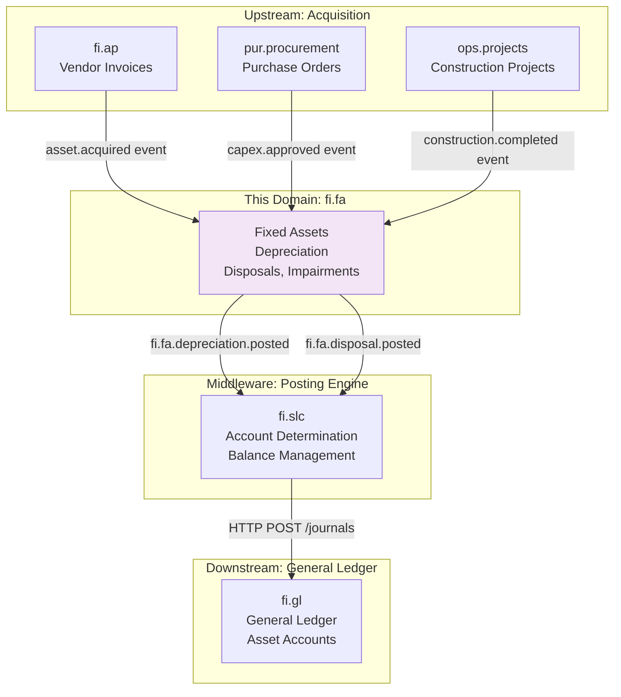
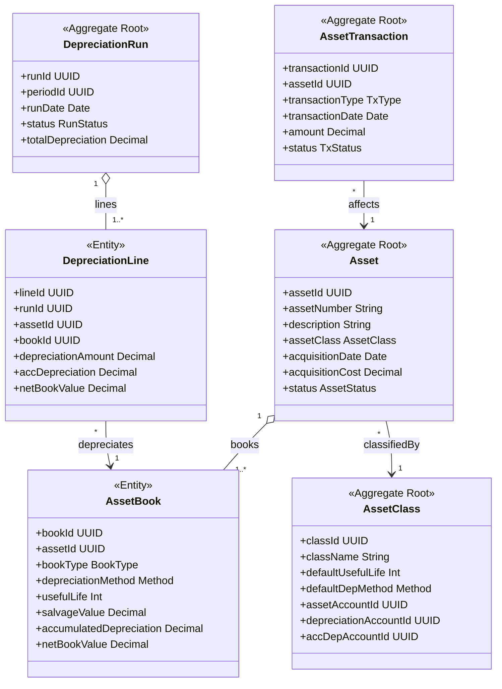
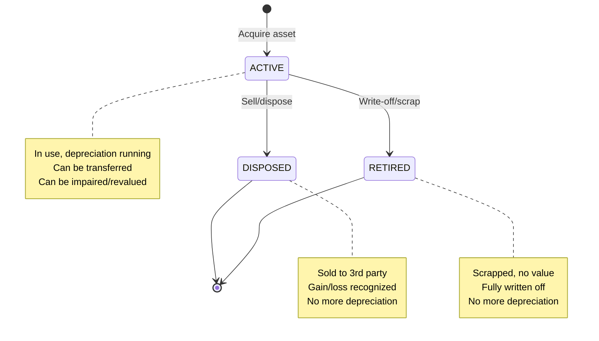
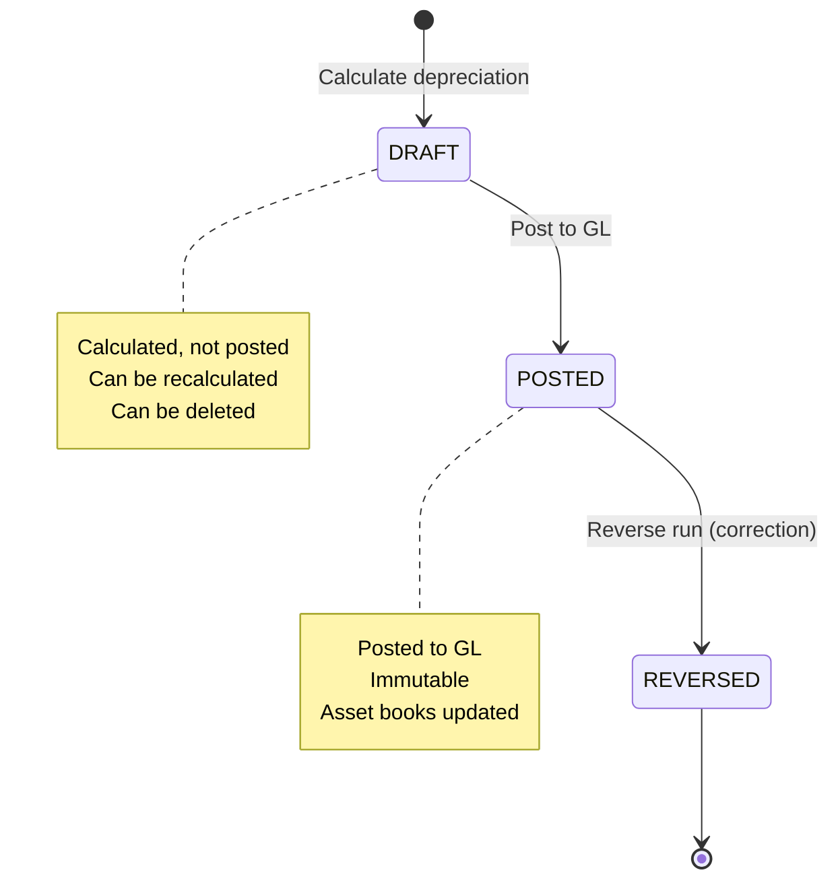

<!-- TEMPLATE COMPLIANCE: ~60%
Missing sections: §2 (Service Identity), §11 (Feature Dependencies), §12 (Extension Points)
Renumbering needed: §3 -> §5 (Use Cases), §5 -> §7 (Integration/Events), §6 -> §7 (Event Catalog, merge), §7 -> §6 (REST API), §8 -> §8 (Data Model), §9 -> §9 (Security), §10 -> §10 (Quality), §11 -> §13 (Migration), §12 -> §14 (Decisions), §13 -> §15 (Appendix)
Action needed: Add full Meta header block (Conceptual Stack Layer, Bounded Context Ref, basePackage, Port, Repository, Tags, Team), add Specification Guidelines Compliance block, add §2 Service Identity, renumber all sections to match template §0-§15, add §11 Feature Dependencies stub, add §12 Extension Points stub
-->
# fi.fa - Fixed Assets Domain Specification

> **Meta Information**
> - **Version:** 2025-12-05
> - **Template:** `domain-service-spec.md` v1.0.0
> - **Template Compliance:** ~60% — §2, §11, §12 missing
> - **Author(s):** OpenLeap Architecture Team
> - **Status:** DRAFT
> - **Suite:** `fi`
> - **Domain:** `fa`
> - **Service Name:** `fi-fa-svc`

---

## 0. Document Purpose & Scope

### 0.1 Purpose

This document specifies the **Fixed Assets (fi.fa)** domain, which manages the complete lifecycle of fixed assets from acquisition to disposal. It handles depreciation calculations, asset transfers, impairments, revaluations, and ensures compliance with IFRS/GAAP accounting standards for property, plant, and equipment (PP&E).

### 0.2 Target Audience
- Product Owners & Business Stakeholders (Finance, Accounting, Asset Management)
- System Architects & Technical Leads
- Integration Engineers
- Controllers and Fixed Asset Accountants
- Tax Accountants
- External Auditors

### 0.3 Scope

**In Scope:**
- **Asset Lifecycle:** Acquisition, Capitalization, Depreciation, Disposal, Retirement
- **Depreciation Methods:** Straight-Line, Declining Balance, Units of Production, Sum-of-Years-Digits
- **Asset Transfers:** Between cost centers, locations, entities (with intercompany)
- **Impairments:** Recognition and reversal of impairment losses (IAS 36)
- **Revaluations:** Fair value adjustments (IAS 16)
- **GL Integration:** Automatic posting of depreciation, disposals, impairments via fi.slc
- **Multi-Book Accounting:** Separate depreciation for IFRS, Local GAAP, Tax purposes
- **Asset Classes:** Buildings, Machinery, Vehicles, IT Equipment, Furniture
- **Sub-Assets:** Component accounting (e.g., building = structure + roof + HVAC)

**Out of Scope:**
- Physical asset tracking (RFID, barcodes) → Asset management system
- Maintenance planning and work orders → Maintenance management
- Lease accounting (IFRS 16) → fi.lease (separate domain)
- Intangible assets (IAS 38) → fi.intangible (separate domain)
- Investment property (IAS 40) → fi.investment (separate domain)

### 0.4 Related Documents
- `_fi_suite.md` - FI Suite architecture
- `fi_gl.md` - General Ledger specification
- `fi_slc.md` - Subledger core specification
- `fi_ap.md` - Accounts Payable (asset acquisition)

---

## 1. Business Context

### 1.1 Domain Purpose

**fi.fa** manages the financial accounting of long-term tangible assets (property, plant, and equipment). Every time an organization purchases a building, machine, or vehicle, the cost must be capitalized and depreciated over its useful life. This domain ensures accurate asset valuation, proper expense recognition (depreciation), and compliance with accounting standards.

**Core Business Problems Solved:**
- **Asset Valuation:** What's the book value of our fixed assets?
- **Depreciation Expense:** How much depreciation should we recognize this period?
- **Compliance:** Meet IFRS/GAAP requirements for PP&E accounting
- **Tax Optimization:** Calculate tax depreciation (accelerated methods)
- **Disposal Accounting:** Recognize gain/loss on asset sale or retirement
- **Audit Trail:** Provide complete lifecycle documentation for auditors

### 1.2 Business Value

**For the Organization:**
- **Accurate Balance Sheet:** Proper asset valuation (major balance sheet item)
- **Expense Matching:** Depreciation expense matches asset usage (accrual accounting)
- **Tax Compliance:** Optimized tax depreciation, deferred tax calculations
- **Investment Decisions:** Understand ROI, asset utilization, replacement needs
- **Regulatory Compliance:** Meet IAS 16, ASC 360, local GAAP requirements

**For Users:**
- **Asset Accountant:** Automated depreciation runs, disposal accounting
- **Controller:** Period-end depreciation posting, asset reconciliation
- **Tax Accountant:** Tax depreciation reports, deferred tax calculations
- **CFO:** Asset portfolio analysis, capex planning
- **Auditor:** Complete asset lifecycle trail, IFRS/GAAP compliance verification

### 1.3 Key Stakeholders

| Role | Responsibility | Primary Use Cases |
|------|----------------|-------------------|
| Asset Accountant | Asset master data, depreciation | Create assets, run depreciation, post to GL |
| Controller | Month-end close | Review depreciation, reconcile to GL, close period |
| Tax Accountant | Tax depreciation | Calculate tax depreciation, prepare tax reports |
| Facility Manager | Asset transfers | Transfer assets between locations/cost centers |
| CFO | Capital planning | Analyze asset portfolio, plan replacements |
| External Auditor | Financial audit | Verify asset valuation, depreciation calculations |

### 1.4 Strategic Positioning

**fi.fa** sits **between** asset acquisition (fi.ap, procurement) and the General Ledger (fi.gl).



**Key Insight:** fi.fa capitalizes purchases and spreads cost over useful life via depreciation.

---

## 2. Domain Model

### 2.1 Conceptual Overview

The fixed assets domain model consists of five main pillars:

1. **Asset Master:** Core asset data (description, class, location, cost)
2. **Depreciation:** Periodic expense calculation and posting
3. **Transactions:** Acquisition, Disposal, Transfer, Impairment, Revaluation
4. **Books:** Multi-book accounting (IFRS, Tax, Local GAAP)
5. **GL Integration:** Post depreciation and transactions to GL via fi.slc

**Key Principles:**
- **Multi-Book:** Separate depreciation for financial (IFRS) and tax purposes
- **Component Accounting:** Assets can have sub-assets (IAS 16)
- **Immutability:** Posted depreciation cannot be changed, only adjusted with correcting runs
- **Event-Driven:** Asset transactions trigger GL postings
- **Subledger Pattern:** Detailed asset records, summarized to GL asset accounts

### 2.2 Core Concepts



### 2.3 Aggregate Definitions

#### 2.3.1 Asset

**Business Purpose:**  
Represents a fixed asset (tangible long-term asset). Core master data for depreciation and lifecycle management.

**Key Attributes:**

| Attribute | Type | Description | Constraints |
|-----------|------|-------------|-------------|
| assetId | UUID | Unique identifier | Required, immutable, PK |
| tenantId | UUID | Tenant ownership | Required, immutable |
| assetNumber | String | Sequential asset number | Required, unique per tenant |
| description | String | Asset description | Required, e.g., "Dell Laptop XPS 15" |
| assetClassId | UUID | Asset classification | Required, FK to asset_classes |
| entityId | UUID | Legal entity owner | Required, FK to entities |
| costCenter | String | Responsible cost center | Required |
| location | String | Physical location | Optional, e.g., "Building A, Floor 3" |
| acquisitionDate | Date | Date placed in service | Required |
| acquisitionCost | Decimal | Original cost | Required, > 0 |
| currency | String | Cost currency | Required, ISO 4217 |
| status | AssetStatus | Current state | Required, enum(ACTIVE, DISPOSED, RETIRED) |
| serialNumber | String | Manufacturer serial | Optional |
| parentAssetId | UUID | Parent asset (for components) | Optional, FK to assets |
| supplierId | UUID | Vendor reference | Optional, FK to suppliers |
| sourcePoId | UUID | Purchase order reference | Optional |
| sourceApBillId | UUID | AP invoice reference | Optional |
| warrantyEndDate | Date | Warranty expiration | Optional |
| disposalDate | Date | Date of disposal | Optional, set when DISPOSED |
| disposalProceeds | Decimal | Sale proceeds | Optional, set on disposal |
| createdAt | Timestamp | Creation timestamp | Auto-generated |

**Lifecycle States:**



**Business Rules & Invariants:**

1. **BR-AST-001: Acquisition Cost Immutability**
   - *Rule:* acquisitionCost cannot be changed after initial capitalization (only via revaluation transaction)
   - *Rationale:* Historical cost principle
   - *Enforcement:* API blocks direct updates

2. **BR-AST-002: Component Hierarchy**
   - *Rule:* Asset can have parentAssetId; circular references prevented
   - *Rationale:* IAS 16 component accounting
   - *Enforcement:* CHECK constraint, cycle detection

3. **BR-AST-003: Disposal Prerequisites**
   - *Rule:* Cannot dispose asset if status != ACTIVE
   - *Rationale:* Logical state transition
   - *Enforcement:* State machine validation

**Asset Classes (Examples):**

| Class | Description | Typical Useful Life | Depreciation Method |
|-------|-------------|---------------------|---------------------|
| BUILDING | Buildings, structures | 40 years | Straight-Line |
| MACHINERY | Manufacturing equipment | 10 years | Straight-Line |
| VEHICLE | Cars, trucks | 5 years | Declining Balance |
| IT_EQUIPMENT | Computers, servers | 3 years | Straight-Line |
| FURNITURE | Office furniture | 7 years | Straight-Line |

---

#### 2.3.2 AssetBook

**Business Purpose:**  
Represents depreciation and valuation for one book (IFRS, Tax, Local GAAP). Each asset has multiple books.

**Key Attributes:**

| Attribute | Type | Description | Constraints |
|-----------|------|-------------|-------------|
| bookId | UUID | Unique identifier | Required, immutable, PK |
| assetId | UUID | Parent asset | Required, FK to assets |
| bookType | BookType | Accounting standard | Required, enum(IFRS, TAX, LOCAL_GAAP, MANAGEMENT) |
| depreciationMethod | DepMethod | Calculation method | Required, enum(SL, DB, UOP, SYD) |
| usefulLifeYears | Int | Asset useful life | Required, > 0 |
| usefulLifeUnits | Decimal | For units of production | Optional, for UOP method |
| salvageValue | Decimal | Residual value | Required, >= 0 |
| depreciationStartDate | Date | Start depreciation | Required, >= acquisitionDate |
| accumulatedDepreciation | Decimal | Total depreciation to date | Required, >= 0 |
| netBookValue | Decimal | Cost - AccDepreciation | Required, = cost - accumulated |
| lastDepreciationDate | Date | Last depreciation run | Optional |
| fullyDepreciatedDate | Date | Date fully depreciated | Optional |
| isActive | Boolean | Active for depreciation | Required, default true |

**Depreciation Methods:**

| Method | Code | Description | Formula |
|--------|------|-------------|---------|
| Straight-Line | SL | Equal expense per period | (Cost - Salvage) / Useful Life |
| Declining Balance | DB | % of NBV per period | NBV × Rate (e.g., 20%) |
| Units of Production | UOP | Based on usage | (Cost - Salvage) × Units Used / Total Units |
| Sum-of-Years-Digits | SYD | Accelerated depreciation | (Cost - Salvage) × (Remaining Life / SYD) |

**Business Rules:**

1. **BR-BOOK-001: Multi-Book Requirement**
   - *Rule:* Each asset must have at least one book (typically IFRS or LOCAL_GAAP)
   - *Rationale:* Compliance requirement
   - *Enforcement:* Validation on asset creation

2. **BR-BOOK-002: NBV Calculation**
   - *Rule:* netBookValue = acquisitionCost - accumulatedDepreciation
   - *Rationale:* Fundamental accounting equation
   - *Enforcement:* Calculated field, CHECK constraint

3. **BR-BOOK-003: Fully Depreciated**
   - *Rule:* When accumulatedDepreciation = (acquisitionCost - salvageValue), set fullyDepreciatedDate, isActive = false
   - *Rationale:* Stop depreciation when fully depreciated
   - *Enforcement:* Logic in depreciation run

**Example Scenarios:**

**Scenario 1: Computer Purchase (Multi-Book)**
```json
{
  "asset": {
    "description": "Dell Laptop XPS 15",
    "assetClass": "IT_EQUIPMENT",
    "acquisitionDate": "2025-01-01",
    "acquisitionCost": 2000.00,
    "currency": "EUR"
  },
  "books": [
    {
      "bookType": "IFRS",
      "depreciationMethod": "SL",
      "usefulLifeYears": 3,
      "salvageValue": 200.00,
      "depreciationStartDate": "2025-01-01"
    },
    {
      "bookType": "TAX",
      "depreciationMethod": "DB",
      "usefulLifeYears": 2,
      "salvageValue": 0.00,
      "depreciationStartDate": "2025-01-01"
    }
  ]
}
```

**Result:**
- IFRS Book: €1,800 / 3 years = €600/year straight-line
- Tax Book: €2,000 × 50% = €1,000 year 1, €1,000 × 50% = €500 year 2 (accelerated)

---

#### 2.3.3 DepreciationRun

**Business Purpose:**  
Represents a periodic depreciation calculation and posting. Runs monthly, quarterly, or annually.

**Key Attributes:**

| Attribute | Type | Description | Constraints |
|-----------|------|-------------|-------------|
| runId | UUID | Unique identifier | Required, immutable, PK |
| tenantId | UUID | Tenant ownership | Required, immutable |
| runNumber | String | Sequential run number | Required, unique per tenant |
| periodId | UUID | Fiscal period | Required, FK to fi.gl.periods |
| bookType | BookType | Which book to depreciate | Required, enum(IFRS, TAX, etc.) |
| runDate | Date | Depreciation as-of date | Required |
| status | RunStatus | Current state | Required, enum(DRAFT, POSTED, REVERSED) |
| totalDepreciation | Decimal | Sum of all line amounts | Required, >= 0 |
| currency | String | Run currency | Required, ISO 4217 |
| glJournalId | UUID | Posted GL journal | Optional, FK to fi.gl.journal_entries |
| createdBy | UUID | User who created run | Required |
| createdAt | Timestamp | Creation timestamp | Auto-generated |
| postedAt | Timestamp | Posting timestamp | Set when status → POSTED |

**Lifecycle States:**



**Business Rules:**

1. **BR-RUN-001: Period Uniqueness**
   - *Rule:* One POSTED run per (tenant, periodId, bookType)
   - *Rationale:* Prevent double-depreciation
   - *Enforcement:* Unique constraint

2. **BR-RUN-002: Period Status**
   - *Rule:* Cannot post depreciation if GL period is CLOSED
   - *Rationale:* Prevent posting to closed periods
   - *Enforcement:* Validation on posting

---

#### 2.3.4 DepreciationLine

**Business Purpose:**  
Individual asset depreciation within a run. One line per active asset per book.

**Key Attributes:**

| Attribute | Type | Description | Constraints |
|-----------|------|-------------|-------------|
| lineId | UUID | Unique identifier | Required, immutable, PK |
| runId | UUID | Parent run | Required, FK to depreciation_runs |
| assetId | UUID | Depreciated asset | Required, FK to assets |
| bookId | UUID | Asset book | Required, FK to asset_books |
| depreciationAmount | Decimal | Current period depreciation | Required, >= 0 |
| accumulatedDepreciation | Decimal | Total accumulated after this run | Required, >= 0 |
| netBookValue | Decimal | NBV after this run | Required, >= 0 |
| usedUnits | Decimal | Units used this period | Optional, for UOP method |

**Depreciation Calculation Examples:**

**Straight-Line:**
```
Acquisition Cost: €10,000
Salvage Value: €1,000
Useful Life: 5 years
Annual Depreciation: (€10,000 - €1,000) / 5 = €1,800/year
Monthly Depreciation: €1,800 / 12 = €150/month
```

**Declining Balance (200%):**
```
Year 1: €10,000 × 40% = €4,000
Year 2: (€10,000 - €4,000) × 40% = €2,400
Year 3: (€6,000 - €2,400) × 40% = €1,440
...
```

**Units of Production:**
```
Acquisition Cost: €100,000
Salvage Value: €10,000
Total Units: 100,000 units
Units Used This Month: 5,000 units
Depreciation: (€100,000 - €10,000) × 5,000 / 100,000 = €4,500
```

---

#### 2.3.5 AssetTransaction

**Business Purpose:**  
Records non-depreciation asset events (acquisition, disposal, impairment, revaluation, transfer).

**Key Attributes:**

| Attribute | Type | Description | Constraints |
|-----------|------|-------------|-------------|
| transactionId | UUID | Unique identifier | Required, immutable, PK |
| tenantId | UUID | Tenant ownership | Required, immutable |
| transactionNumber | String | Sequential number | Required, unique per tenant |
| assetId | UUID | Affected asset | Required, FK to assets |
| transactionType | TxType | Transaction type | Required, enum(ACQUISITION, DISPOSAL, IMPAIRMENT, REVALUATION, TRANSFER) |
| transactionDate | Date | Transaction date | Required |
| amount | Decimal | Transaction amount | Required |
| currency | String | Transaction currency | Required, ISO 4217 |
| status | TxStatus | Current state | Required, enum(DRAFT, POSTED) |
| glJournalId | UUID | Posted GL journal | Optional, FK to fi.gl.journal_entries |
| fromCostCenter | String | Source cost center | Optional, for transfers |
| toCostCenter | String | Destination cost center | Optional, for transfers |
| fromEntity | UUID | Source entity | Optional, for inter-entity transfers |
| toEntity | UUID | Destination entity | Optional, for inter-entity transfers |
| impairmentReason | String | Reason for impairment | Optional, for impairments |
| revaluationBasis | String | Revaluation basis | Optional, e.g., "Fair value per appraisal" |
| createdAt | Timestamp | Creation timestamp | Auto-generated |

**Transaction Types:**

| Type | Description | GL Impact | Example |
|------|-------------|-----------|---------|
| ACQUISITION | Initial capitalization | DR Asset, CR Payable | Purchase machine €50,000 |
| DISPOSAL | Sale or scrap | DR Cash/Proceeds, CR Asset, DR/CR Gain/Loss | Sell vehicle for €10,000 |
| IMPAIRMENT | Reduce asset value (IAS 36) | DR Impairment Loss, CR Accumulated Impairment | Write down €20,000 |
| REVALUATION | Fair value adjustment (IAS 16) | DR Asset, CR Revaluation Reserve | Increase building value €100,000 |
| TRANSFER | Move between cost centers | DR Asset (new CC), CR Asset (old CC) | Transfer laptop to sales dept |

---

#### 2.3.6 AssetClass

**Business Purpose:**  
Template for asset configuration. Defines default depreciation parameters and GL accounts.

**Key Attributes:**

| Attribute | Type | Description | Constraints |
|-----------|------|-------------|-------------|
| classId | UUID | Unique identifier | Required, immutable, PK |
| tenantId | UUID | Tenant ownership | Required, immutable |
| className | String | Class name | Required, unique per tenant |
| description | String | Class description | Optional |
| defaultUsefulLifeYears | Int | Default useful life | Required, > 0 |
| defaultDepreciationMethod | DepMethod | Default method | Required |
| assetAccountId | UUID | Asset GL account | Required, FK to fi.gl.accounts |
| accumulatedDepreciationAccountId | UUID | Accumulated depreciation | Required, FK to fi.gl.accounts |
| depreciationExpenseAccountId | UUID | Depreciation expense | Required, FK to fi.gl.accounts |
| disposalGainAccountId | UUID | Gain on disposal | Optional, FK to fi.gl.accounts |
| disposalLossAccountId | UUID | Loss on disposal | Optional, FK to fi.gl.accounts |
| impairmentLossAccountId | UUID | Impairment loss | Optional, FK to fi.gl.accounts |
| revaluationReserveAccountId | UUID | Revaluation reserve | Optional, FK to fi.gl.accounts |
| isActive | Boolean | Active for use | Required, default true |

---

## 3. Business Processes & Use Cases

### 3.1 Primary Use Cases

#### UC-001: Acquire Fixed Asset

**Actor:** Asset Accountant

**Preconditions:**
- AP invoice posted for asset purchase
- Asset class configured
- User has FA_ADMIN role

**Main Flow:**
1. User creates asset (POST /assets)
2. User specifies:
   - description, assetClass, acquisitionDate, acquisitionCost
   - entityId, costCenter, location
   - sourceApBillId (link to AP invoice)
3. System retrieves asset class defaults (useful life, depreciation method, GL accounts)
4. User configures books:
   - IFRS Book: SL, 5 years, €1,000 salvage
   - TAX Book: DB 200%, 3 years, €0 salvage
5. System creates Asset (status = ACTIVE)
6. System creates AssetBooks (one per book type)
7. System creates AssetTransaction (type = ACQUISITION)
8. System calls fi.slc POST /posting:
   - eventType: fi.fa.asset.acquired
   - DR 1600 Fixed Assets (acquisition cost)
   - CR 2100 Payables (or 1510 GR/IR if not yet invoiced)
9. System updates AssetTransaction status = POSTED
10. System publishes fi.fa.asset.acquired event

**Postconditions:**
- Asset created with status = ACTIVE
- Asset books configured
- GL journal posted (capitalize asset)
- Event published

**Business Rules Applied:**
- BR-AST-001: Acquisition cost immutability
- BR-BOOK-001: Multi-book requirement

---

#### UC-002: Run Periodic Depreciation

**Actor:** Asset Accountant (scheduled job)

**Preconditions:**
- Assets exist with active books
- GL period OPEN
- User has FA_POSTER role

**Main Flow:**
1. System creates depreciation run (scheduled monthly)
2. System specifies: periodId (current month), bookType (IFRS)
3. System queries all active assets with isActive = true books
4. For each asset book:
   a. Retrieve depreciation parameters (method, useful life, salvage)
   b. Calculate current period depreciation:
      - SL: (cost - salvage - accDep) / remaining periods
      - DB: NBV × rate
      - UOP: (cost - salvage) × units used / total units
   c. Check if fully depreciated: accDep + current >= (cost - salvage)
   d. Create DepreciationLine
5. System calculates totalDepreciation = Σ(line amounts)
6. System creates DepreciationRun (status = DRAFT)
7. User reviews run, then posts
8. System calls fi.slc POST /posting:
   - eventType: fi.fa.depreciation.posted
   - DR 6100 Depreciation Expense (total)
   - CR 1610 Accumulated Depreciation (total)
9. System updates DepreciationRun status = POSTED
10. System updates each AssetBook:
    - accumulatedDepreciation += line.depreciationAmount
    - netBookValue = cost - accumulatedDepreciation
    - lastDepreciationDate = run.runDate
    - If fully depreciated: isActive = false, fullyDepreciatedDate = run.runDate
11. System publishes fi.fa.depreciation.posted event

**Postconditions:**
- Depreciation run posted
- Asset books updated (accumulated depreciation, NBV)
- GL journal created
- Event published

**Business Rules Applied:**
- BR-RUN-001: Period uniqueness
- BR-RUN-002: Period status validation
- BR-BOOK-003: Fully depreciated detection

---

#### UC-003: Dispose Asset (Sale)

**Actor:** Asset Accountant

**Preconditions:**
- Asset status = ACTIVE
- Asset sold or scrapped
- User has FA_ADMIN role

**Main Flow:**
1. User creates disposal transaction (POST /transactions)
2. User specifies:
   - assetId, transactionType = DISPOSAL
   - transactionDate (disposal date)
   - amount = sale proceeds (e.g., €8,000)
3. System retrieves asset current state:
   - Acquisition cost: €10,000
   - Accumulated depreciation: €6,000
   - Net book value: €4,000
4. System calculates gain/loss:
   - Proceeds: €8,000
   - NBV: €4,000
   - Gain on disposal: €8,000 - €4,000 = €4,000
5. System creates AssetTransaction (status = DRAFT)
6. User posts transaction
7. System calls fi.slc POST /posting:
   - eventType: fi.fa.asset.disposed
   - DR 1000 Cash/Bank €8,000 (proceeds)
   - DR 1610 Accumulated Depreciation €6,000 (clear)
   - CR 1600 Fixed Assets €10,000 (remove)
   - CR 8100 Gain on Disposal €4,000 (recognize gain)
8. System updates Asset:
   - status = DISPOSED
   - disposalDate = transaction.transactionDate
   - disposalProceeds = €8,000
9. System updates AssetBooks: isActive = false (stop depreciation)
10. System publishes fi.fa.asset.disposed event

**Postconditions:**
- Asset status = DISPOSED
- GL journal posted (remove asset, recognize gain/loss)
- Event published

**Gain/Loss Calculation:**
```
If Proceeds > NBV: Gain (Credit)
If Proceeds < NBV: Loss (Debit)
If Proceeds = NBV: No gain/loss
```

---

#### UC-004: Record Asset Impairment (IAS 36)

**Actor:** Asset Accountant

**Preconditions:**
- Asset value impaired (recoverable amount < carrying amount)
- Impairment test performed
- User has FA_ADMIN role

**Main Flow:**
1. User creates impairment transaction (POST /transactions)
2. User specifies:
   - assetId, transactionType = IMPAIRMENT
   - amount = impairment loss (e.g., €15,000)
   - impairmentReason = "Fair value declined due to technological obsolescence"
3. System retrieves asset NBV: €50,000
4. System creates AssetTransaction (status = DRAFT)
5. User posts transaction
6. System calls fi.slc POST /posting:
   - eventType: fi.fa.impairment.posted
   - DR 6200 Impairment Loss €15,000
   - CR 1620 Accumulated Impairment €15,000
7. System updates AssetBook: Adjust NBV = €50,000 - €15,000 = €35,000
8. System adjusts future depreciation (lower base)
9. System publishes fi.fa.impairment.posted event

**Postconditions:**
- Impairment recorded
- Asset NBV reduced
- GL journal posted
- Future depreciation adjusted

---

#### UC-005: Transfer Asset Between Cost Centers

**Actor:** Facility Manager

**Preconditions:**
- Asset status = ACTIVE
- User has FA_TRANSFER role

**Main Flow:**
1. User creates transfer transaction (POST /transactions)
2. User specifies:
   - assetId, transactionType = TRANSFER
   - fromCostCenter = "IT", toCostCenter = "Sales"
3. System creates AssetTransaction (status = DRAFT)
4. User posts transaction
5. System updates Asset: costCenter = "Sales"
6. If different GL accounts by cost center:
   - System calls fi.slc POST /posting:
     - DR 1600 Fixed Assets (Sales) NBV
     - CR 1600 Fixed Assets (IT) NBV
7. System publishes fi.fa.asset.transferred event

**Postconditions:**
- Asset cost center updated
- GL transfer posted (if different accounts)
- Event published

---

### 3.2 Process Flow Diagrams

#### Process: Asset Acquisition to Depreciation


---

## 4. Business Rules & Constraints

### 4.1 Business Rules Catalog

| ID | Rule Name | Description | Scope | Enforcement |
|----|-----------|-------------|-------|-------------|
| BR-AST-001 | Acquisition Cost Immutability | Cost cannot be changed after capitalization | Asset | Update |
| BR-AST-002 | Component Hierarchy | Prevent circular parent-child references | Asset | Create/Update |
| BR-AST-003 | Disposal Prerequisites | Only ACTIVE assets can be disposed | Asset | State transition |
| BR-BOOK-001 | Multi-Book Requirement | Each asset needs at least one book | AssetBook | Create |
| BR-BOOK-002 | NBV Calculation | NBV = Cost - Accumulated Depreciation | AssetBook | Always |
| BR-BOOK-003 | Fully Depreciated | Stop depreciation when acc dep = depreciable amount | AssetBook | Depreciation run |
| BR-RUN-001 | Period Uniqueness | One posted run per (period, book type) | DepreciationRun | Post |
| BR-RUN-002 | Period Status | Cannot post if GL period closed | DepreciationRun | Post |

---

## 5. Integration Architecture

### 5.1 Integration Pattern Decision

**Does this domain use orchestration (Saga/Temporal)?** [ ] YES [X] NO

**Pattern Used:** Event-Driven Architecture (Choreography)

**Rationale:**

fi.fa uses **pure Event-Driven Architecture** because:

✅ **FA is Event Consumer:**
- Minimal inbound events (fi.gl.period.closed for period validation)

✅ **FA is Event Publisher:**
- Publishes asset.acquired, depreciation.posted, asset.disposed
- Downstream services react (fi.rpt, t4.bi)

✅ **Synchronous GL Posting:**
- Calls fi.slc HTTP POST /posting (synchronous)
- Waits for confirmation (need journalId)
- But this is single-call, not multi-step saga

❌ **Why NOT Orchestration:**
- No multi-service transaction
- Asset lifecycle is: Acquire → Depreciate → Dispose (linear, independent steps)
- Each step can be retried independently
- No compensation logic needed

### 5.2 Event-Driven Integration

**Inbound Events (Consumed):**

| Event | Source | Purpose | Handling |
|-------|--------|---------|----------|
| fi.gl.period.closed | fi.gl | Prevent depreciation posting | Validate period status |
| fi.ap.bill.posted | fi.ap | Link asset to AP invoice | Optional reference link |

**Outbound Events (Published):**

| Event | When | Purpose | Consumers |
|-------|------|---------|-----------|
| fi.fa.asset.acquired | Asset capitalized | Notify of new asset | fi.rpt, t4.bi |
| fi.fa.depreciation.posted | Depreciation run posted | Update reports | fi.rpt, tax, t4.bi |
| fi.fa.asset.disposed | Asset sold/retired | Notify of disposal | fi.rpt, t4.bi |
| fi.fa.impairment.posted | Impairment recorded | Track impairments | fi.rpt, t4.bi |

---

## 6. Event Catalog

### 6.1 Outbound Events

**Exchange:** `fi.fa.events` (RabbitMQ topic exchange)

#### Event: depreciation.posted

**Routing Key:** `fi.fa.depreciation.posted`

**When Published:** Depreciation run successfully posted to GL

**Business Meaning:** Depreciation expense recognized for the period

**Consumers:**
- fi.rpt (update fixed asset reports)
- tax (calculate deferred tax)
- t4.bi (analytics)

**Payload:**
```json
{
  "eventId": "evt-uuid",
  "tenantId": "tenant-uuid",
  "occurredAt": "2025-12-31T23:59:59Z",
  "traceId": "trace-uuid",
  "producer": "fi.fa",
  "aggregateType": "depreciation_run",
  "changeType": "posted",
  "entityIds": ["run-uuid"],
  "version": 1,
  "payload": {
    "runId": "run-uuid",
    "runNumber": "DEP-2025-12",
    "periodId": "period-uuid",
    "period": "2025-12",
    "bookType": "IFRS",
    "runDate": "2025-12-31",
    "totalDepreciation": 15000.00,
    "currency": "EUR",
    "glJournalId": "journal-uuid",
    "lineCount": 120,
    "assetCount": 120
  }
}
```

---

## 7. API Specification

### 7.1 REST API

**Base Path:** `/api/fi/fa/v1`

**Authentication:** OAuth 2.0 Bearer Token

**Content Type:** `application/json`

#### 7.1.1 Assets

**POST /assets** - Create asset
- **Role:** FA_ADMIN
- **Request Body:**
  ```json
  {
    "description": "Dell Laptop XPS 15",
    "assetClassId": "class-uuid",
    "entityId": "entity-uuid",
    "costCenter": "IT",
    "location": "HQ Floor 3",
    "acquisitionDate": "2025-01-01",
    "acquisitionCost": 2000.00,
    "currency": "EUR",
    "sourceApBillId": "bill-uuid",
    "books": [
      {
        "bookType": "IFRS",
        "depreciationMethod": "SL",
        "usefulLifeYears": 3,
        "salvageValue": 200.00
      }
    ]
  }
  ```
- **Response:** 201 Created

**GET /assets** - List assets
- **Role:** FA_VIEWER
- **Query Params:** `assetClass`, `status`, `costCenter`, `page`, `size`
- **Response:** 200 OK (array of assets)

**GET /assets/{id}** - Get asset details
- **Role:** FA_VIEWER
- **Response:** 200 OK (asset with books)

---

#### 7.1.2 Depreciation Runs

**POST /depreciation-runs** - Create depreciation run
- **Role:** FA_POSTER
- **Request Body:**
  ```json
  {
    "periodId": "period-uuid",
    "bookType": "IFRS",
    "runDate": "2025-12-31"
  }
  ```
- **Response:** 201 Created

**POST /depreciation-runs/{id}/post** - Post run to GL
- **Role:** FA_POSTER
- **Response:** 200 OK

**GET /depreciation-runs** - List runs
- **Role:** FA_VIEWER
- **Query Params:** `periodId`, `bookType`, `status`, `page`, `size`
- **Response:** 200 OK

---

#### 7.1.3 Transactions

**POST /transactions** - Create transaction (disposal, impairment, etc.)
- **Role:** FA_ADMIN
- **Request Body:**
  ```json
  {
    "assetId": "asset-uuid",
    "transactionType": "DISPOSAL",
    "transactionDate": "2025-12-31",
    "amount": 8000.00,
    "currency": "EUR"
  }
  ```
- **Response:** 201 Created

---

### 7.2 Error Responses

| HTTP Status | Error Code | Description |
|-------------|------------|-------------|
| 400 | ASSET_ALREADY_DISPOSED | Cannot dispose already disposed asset |
| 400 | FULLY_DEPRECIATED | Cannot depreciate fully depreciated asset |
| 403 | PERIOD_CLOSED | Cannot post to closed period |
| 409 | DUPLICATE_RUN | Depreciation run already exists for period |

---

## 8. Data Model

### 8.1 Storage Schema (PostgreSQL)

#### Schema: fi_fa

#### Table: fa_assets
```sql
CREATE TABLE fi_fa.fa_assets (
  asset_id UUID PRIMARY KEY,
  tenant_id UUID NOT NULL,
  asset_number VARCHAR(50) NOT NULL,
  description VARCHAR(500) NOT NULL,
  asset_class_id UUID NOT NULL,
  entity_id UUID NOT NULL,
  cost_center VARCHAR(50) NOT NULL,
  location VARCHAR(200),
  acquisition_date DATE NOT NULL,
  acquisition_cost NUMERIC(19,4) NOT NULL,
  currency CHAR(3) NOT NULL,
  status VARCHAR(20) NOT NULL DEFAULT 'ACTIVE',
  serial_number VARCHAR(100),
  parent_asset_id UUID REFERENCES fi_fa.fa_assets(asset_id),
  supplier_id UUID,
  source_po_id UUID,
  source_ap_bill_id UUID,
  warranty_end_date DATE,
  disposal_date DATE,
  disposal_proceeds NUMERIC(19,4),
  created_at TIMESTAMP NOT NULL DEFAULT NOW(),
  UNIQUE (tenant_id, asset_number),
  CHECK (status IN ('ACTIVE', 'DISPOSED', 'RETIRED')),
  CHECK (acquisition_cost > 0)
);

CREATE INDEX idx_assets_tenant ON fi_fa.fa_assets(tenant_id);
CREATE INDEX idx_assets_class ON fi_fa.fa_assets(asset_class_id);
CREATE INDEX idx_assets_status ON fi_fa.fa_assets(status);
```

#### Table: fa_asset_books
```sql
CREATE TABLE fi_fa.fa_asset_books (
  book_id UUID PRIMARY KEY,
  asset_id UUID NOT NULL REFERENCES fi_fa.fa_assets(asset_id) ON DELETE CASCADE,
  book_type VARCHAR(20) NOT NULL,
  depreciation_method VARCHAR(10) NOT NULL,
  useful_life_years INT NOT NULL,
  useful_life_units NUMERIC(19,6),
  salvage_value NUMERIC(19,4) NOT NULL,
  depreciation_start_date DATE NOT NULL,
  accumulated_depreciation NUMERIC(19,4) NOT NULL DEFAULT 0,
  net_book_value NUMERIC(19,4) NOT NULL,
  last_depreciation_date DATE,
  fully_depreciated_date DATE,
  is_active BOOLEAN NOT NULL DEFAULT TRUE,
  UNIQUE (asset_id, book_type),
  CHECK (book_type IN ('IFRS', 'TAX', 'LOCAL_GAAP', 'MANAGEMENT')),
  CHECK (depreciation_method IN ('SL', 'DB', 'UOP', 'SYD')),
  CHECK (useful_life_years > 0),
  CHECK (salvage_value >= 0),
  CHECK (accumulated_depreciation >= 0)
);

CREATE INDEX idx_books_asset ON fi_fa.fa_asset_books(asset_id);
CREATE INDEX idx_books_type ON fi_fa.fa_asset_books(book_type);
CREATE INDEX idx_books_active ON fi_fa.fa_asset_books(is_active);
```

#### Table: fa_depreciation_runs
```sql
CREATE TABLE fi_fa.fa_depreciation_runs (
  run_id UUID PRIMARY KEY,
  tenant_id UUID NOT NULL,
  run_number VARCHAR(50) NOT NULL,
  period_id UUID NOT NULL,
  book_type VARCHAR(20) NOT NULL,
  run_date DATE NOT NULL,
  status VARCHAR(20) NOT NULL DEFAULT 'DRAFT',
  total_depreciation NUMERIC(19,4) NOT NULL,
  currency CHAR(3) NOT NULL,
  gl_journal_id UUID,
  created_by UUID NOT NULL,
  created_at TIMESTAMP NOT NULL DEFAULT NOW(),
  posted_at TIMESTAMP,
  UNIQUE (tenant_id, run_number),
  UNIQUE (tenant_id, period_id, book_type) WHERE status = 'POSTED',
  CHECK (status IN ('DRAFT', 'POSTED', 'REVERSED')),
  CHECK (total_depreciation >= 0)
);

CREATE INDEX idx_runs_tenant ON fi_fa.fa_depreciation_runs(tenant_id);
CREATE INDEX idx_runs_period ON fi_fa.fa_depreciation_runs(period_id);
CREATE INDEX idx_runs_status ON fi_fa.fa_depreciation_runs(status);
```

#### Table: fa_depreciation_lines
```sql
CREATE TABLE fi_fa.fa_depreciation_lines (
  line_id UUID PRIMARY KEY,
  run_id UUID NOT NULL REFERENCES fi_fa.fa_depreciation_runs(run_id) ON DELETE CASCADE,
  asset_id UUID NOT NULL,
  book_id UUID NOT NULL,
  depreciation_amount NUMERIC(19,4) NOT NULL,
  accumulated_depreciation NUMERIC(19,4) NOT NULL,
  net_book_value NUMERIC(19,4) NOT NULL,
  used_units NUMERIC(19,6),
  CHECK (depreciation_amount >= 0),
  CHECK (accumulated_depreciation >= 0),
  CHECK (net_book_value >= 0)
);

CREATE INDEX idx_lines_run ON fi_fa.fa_depreciation_lines(run_id);
CREATE INDEX idx_lines_asset ON fi_fa.fa_depreciation_lines(asset_id);
```

---

## 9. Security & Compliance

### 9.1 Access Control

**Roles & Permissions:**

| Role | Read | Create | Update | Delete | Admin Operations |
|------|------|--------|--------|--------|------------------|
| FA_VIEWER | ✓ (all) | ✗ | ✗ | ✗ | ✗ |
| FA_POSTER | ✓ (runs) | ✓ (runs) | ✗ | ✗ | ✗ |
| FA_TRANSFER | ✓ (assets) | ✗ | ✓ (transfers) | ✗ | ✗ |
| FA_ADMIN | ✓ (all) | ✓ (all) | ✓ (all) | ✓ (drafts only) | ✓ (dispose, impair) |

### 9.2 Compliance Requirements

**Regulations:**
- [X] IAS 16 - Property, Plant and Equipment
- [X] IAS 36 - Impairment of Assets
- [X] ASC 360 - Property, Plant, and Equipment (US GAAP)
- [X] Tax - Accelerated depreciation, tax vs. book differences

---

## 10. Quality Attributes

### 10.1 Performance Requirements

**Response Time (95th percentile):**
- POST /assets: < 300ms
- POST /depreciation-runs: < 5 sec (for 10,000 assets)
- GET /assets: < 500ms

**Throughput:**
- Asset creation: 100 assets/sec
- Depreciation calculation: 10,000 assets/min

---

## 11. Migration & Evolution

### 11.1 Data Migration

**From Legacy:**
- Export asset master data, acquisition dates, costs
- Export accumulated depreciation by book
- Import as opening balances
- Validate: Total asset NBV = GL Fixed Assets balance

---

## 12. Open Questions & Decisions

### 12.1 ADRs

#### ADR-001: Multi-Book Accounting

**Status:** Accepted

**Decision:** Support multiple depreciation books per asset (IFRS, Tax, Local GAAP)

**Rationale:**
- IFRS requires different depreciation than tax
- Tax allows accelerated depreciation for deductions
- Management may want different useful lives

---

## 13. Appendix

### 13.1 Glossary

| Term | Definition |
|------|------------|
| NBV | Net Book Value = Cost - Accumulated Depreciation |
| PP&E | Property, Plant & Equipment |
| SL | Straight-Line depreciation |
| DB | Declining Balance depreciation |
| UOP | Units of Production depreciation |
| IAS 16 | International Accounting Standard for PP&E |
| IAS 36 | International Accounting Standard for Impairments |


