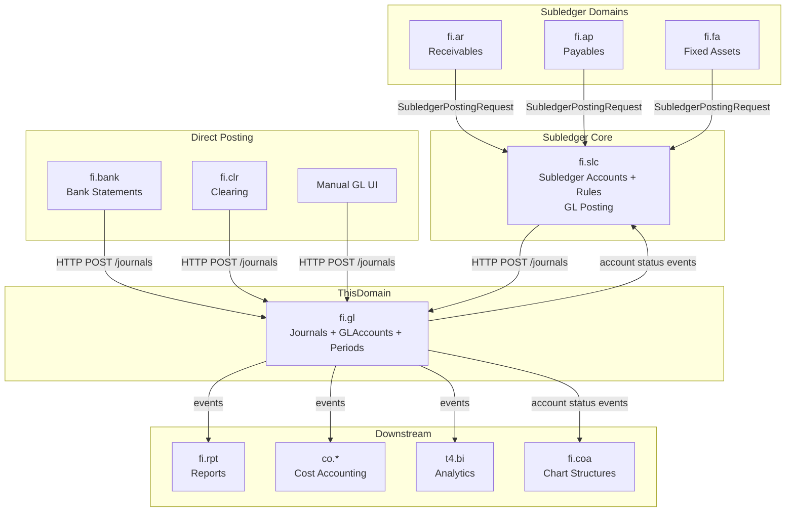
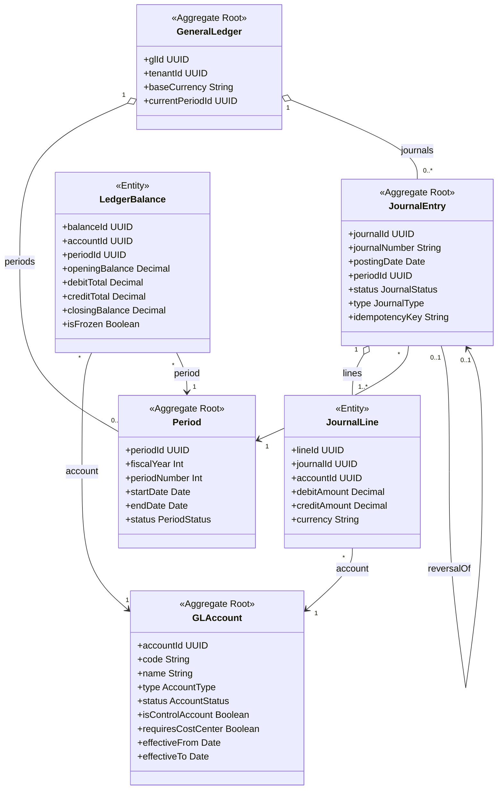
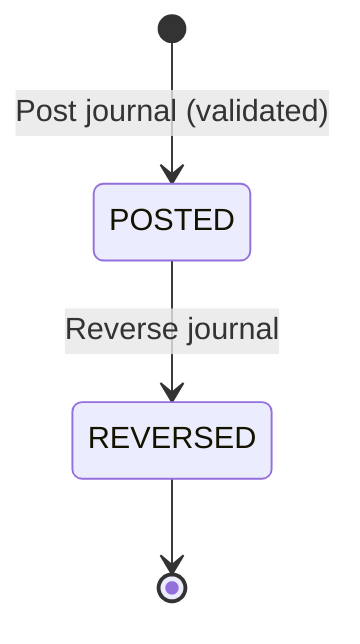
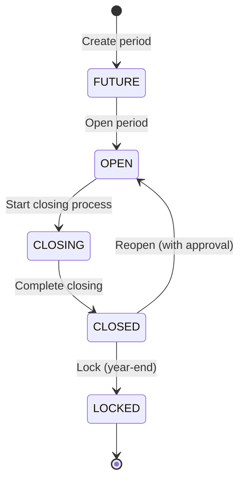
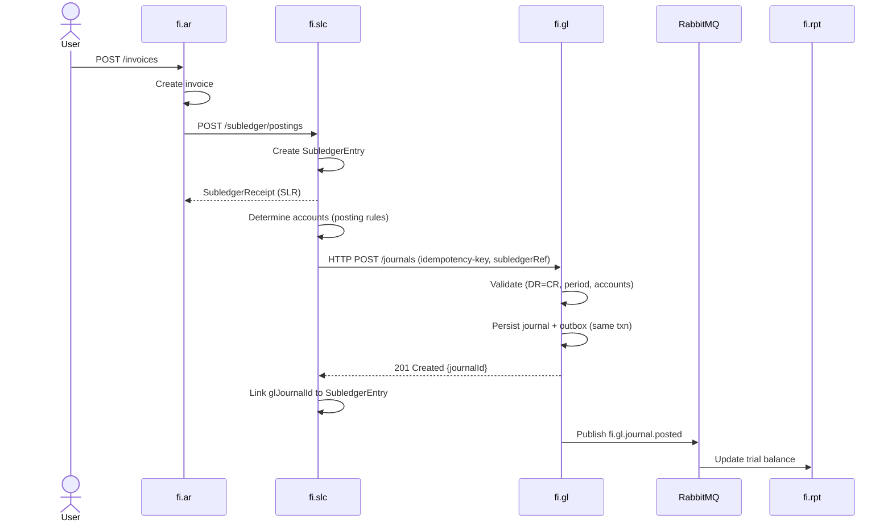
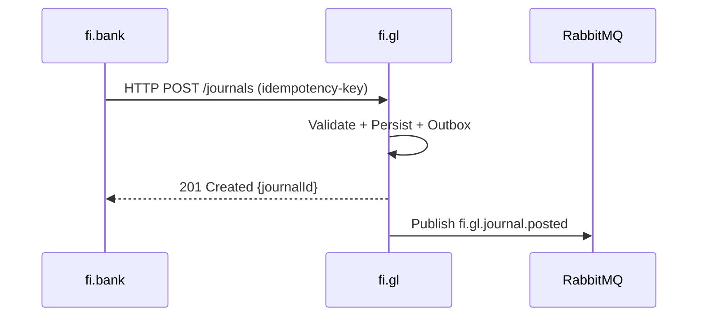
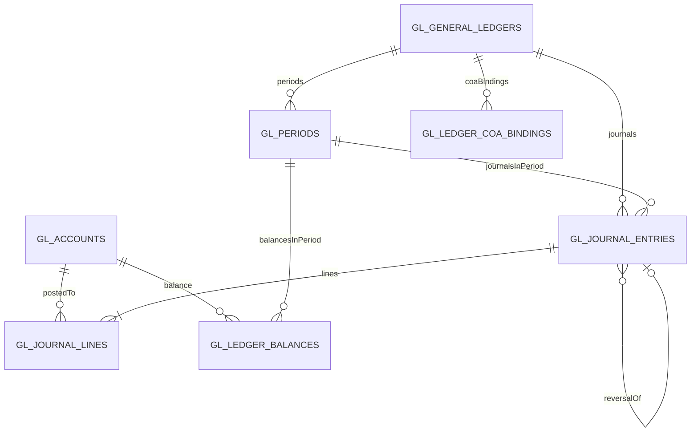

# FI - General Ledger (GL) Domain / Service Specification

> **Conceptual Stack Layer:** Domain / Service
> **Space:** Platform
> **Owner:** FI Domain Engineering Team
> **Schema alignment:** `service-layer.schema.json`
> **Companion files:** `openapi.yaml`, `*.schema.json` (event contracts)
> **Referenced by:** Platform-Feature Spec SS5 (backend dependencies), BFF Contract
> **Belongs to:** FI Suite Spec (`_fi_suite.md`)

> **Meta Information**
> - **Version:** 2026-04-01 (v3.1)
> - **Template:** `domain-service-spec.md` v1.0.0
> - **Template Compliance:** ~95%
> - **Author(s):** OpenLeap Architecture Team
> - **Status:** DRAFT
> - **Suite:** `fi`
> - **Domain:** `gl`
> - **Bounded Context Ref:** `bc:accounting`
> - **Service ID:** `fi-gl-svc`
> - **basePackage:** `io.openleap.fi.gl`
> - **API Base Path:** `/api/fi/gl/v3`
> - **OpenLeap Starter Version:** `v1.0`
> - **Port:** `8110`
> - **Repository:** `io.openleap.fi.gl`
> - **Tags:** `finance`, `general-ledger`, `accounting`, `double-entry`, `journal`
> - **Team:**
>   - Name: `team-fi`
>   - Email: `fi-team@openleap.io`
>   - Slack: `#fi-team`

---

## Specification Guidelines Compliance

>
> ### Non-Negotiables
> - Never invent facts. If required info is missing, add an **OPEN QUESTION** entry.
> - Preserve intent and decisions. Only change meaning when explicitly requested.
> - Do not remove normative constraints unless they are explicitly replaced.
> - Keep the spec **self-contained**: no "see chat", no implicit context.
>
> ### Source of Truth Priority
> When sources conflict:
> 1. Spec (explicit) wins
> 2. Starter specs (implementation constraints) next
> 3. Guidelines (best practices) last
>
> Record conflicts in the **Decisions & Conflicts** section (see Section 14).
>
> ### Style Guide
> - Prefer short sentences and lists.
> - Use MUST/SHOULD/MAY for normative statements.
> - Keep terminology consistent (Aggregate, Domain Service, Application Service, Command, Event).
> - Avoid ambiguous words ("often", "maybe") unless explicitly noting uncertainty.
> - Keep examples minimal and clearly marked as examples.
> - Do not add implementation code unless the chapter explicitly requires it.

---

## 0. Document Purpose & Scope

### 0.1 Purpose

This document specifies the **General Ledger (fi.gl)** domain, which serves as the authoritative source of truth for all financial transactions in the OpenLeap platform. It implements double-entry bookkeeping, maintains immutable journals, **owns and manages all GLAccounts (posting accounts) with full lifecycle and audit trail**, and provides the foundation for all financial reporting.

**Posting Architecture (v3.0):** GL accepts balanced journals from two posting paths:
1. **Subledger path:** fi.ar/fi.ap/fi.fa/fi.inv → `fi.slc` (Subledger Core) → fi.gl
2. **Direct path:** fi.bank/fi.clr → fi.gl (no subledger needed)
3. **Manual path:** Manual GL UI → fi.gl

GL is a **passive receiver** of balanced journals and an **active publisher** of accounting events. It does not orchestrate workflows or perform account determination.

### 0.2 Target Audience
- Product Owners & Business Stakeholders (Finance, Accounting)
- System Architects & Technical Leads
- Integration Engineers
- CFO/Controller and Accounting Teams

### 0.3 Scope

**In Scope:**
- **GLAccount lifecycle management:** Create, activate, deactivate posting accounts with full audit trail
- Journal entry posting (balanced double-entry transactions)
- Account balances and ledgers (per period, account, currency)
- Fiscal period management and closing processes
- COA version validation and ledger binding (posting eligibility checks for fi.coa)
- Event-driven integration with subledgers and reporting
- Multi-currency, multi-chart, multi-tenant support
- Idempotent journal posting

**Out of Scope:**
- Account structure/hierarchy/grouping → `fi.coa` (structural/reporting only)
- Financial reporting and statements → `fi.rpt`
- Subledger business logic (AR, AP, FA, INV) → respective subledger domains
- Subledger bookkeeping, account determination, posting rules → `fi.slc`
- Tax calculation → `fi.tax`
- Cost accounting and management reporting → CO Suite
- Budget and planning → Future Planning Suite

**v3.0 Architectural Clarification:**
- **GL owns GLAccounts** (posting accounts) — creation, activation, deactivation, audit trail
- **CoA (`fi.coa`) is structural/reporting only** — provides trees, groupings, and reporting views on top of GL-owned accounts
- **`fi.slc` is the posting service** for subledger-based flows — handles subledger bookkeeping, account determination, and journal submission to GL
- **fi.bank, fi.clr post directly** to fi.gl (no subledger needed)
- **`fi.pst` is deprecated** — its responsibilities are absorbed by fi.slc (see ADR-004)

### 0.4 Related Documents
- `_fi_suite.md` — FI Suite architecture overview
- `fi_coa.md` — Chart of Accounts (structural/reporting)
- `fi_slc.md` — Subledger Core (posting service + subledger bookkeeping)
- `fi_rpt.md` — Financial reporting and Trial Balance
- `fi_clr.md` — Clearing & Matching
- `Audit_Tracing_spec.md` — End-to-end audit trail
- `REF_reference_data.md` — Reference data catalogs

---

## 1. Business Context

### 1.1 Domain Purpose

The **General Ledger (fi.gl)** is the central nervous system of financial accounting. It records every financial transaction in accordance with double-entry bookkeeping principles, ensuring that all business activities have a complete and auditable financial representation.

**Core Business Problems Solved:**
- **Financial Truth:** Single source of truth for all financial transactions
- **Legal Compliance:** Meet IFRS, GAAP, and local accounting standards
- **Audit Trail:** Complete trail from source document to financial statement
- **Multi-Dimensional Accounting:** Support multiple charts, currencies, and legal entities
- **Period Integrity:** Ensure period closing and year-end processes are bulletproof

### 1.2 Business Value

**For the Organization:**
- **Compliance:** Meet statutory and regulatory reporting requirements
- **Decision Making:** Provide accurate financial data for management decisions
- **Investor Confidence:** Produce auditable financial statements
- **Risk Management:** Detect and prevent financial irregularities
- **Efficiency:** Automate journal posting from operational systems

**For Users:**
- **Controllers:** Close periods and produce financial statements with confidence
- **Accountants:** Post adjusting entries and reconcile accounts efficiently
- **Auditors:** Access complete audit trail from source to statement
- **CFO/Finance Leadership:** Trust the numbers for strategic planning

### 1.3 Key Stakeholders

| Role | Responsibility | Primary Use Cases |
|------|----------------|-------------------|
| Controller | Period closing, financial statements | Close period, post adjusting entries, produce reports |
| Staff Accountant | Day-to-day accounting operations | Post manual journals, reconcile accounts, review balances |
| External Auditor | Audit financial statements | Review journal entries, validate balances, trace to source |
| CFO | Financial leadership and strategy | Review financial position, analyze trends, board reporting |
| System Administrator | GLAccount and period management | Create accounts, configure periods |
| Integration Engineer | Event-driven integrations | Configure event consumers, monitor event flows |

### 1.4 Strategic Positioning (v3.0)

**fi.gl** is the **terminal node** in the financial data flow. All operational systems generate business transactions that ultimately flow TO fi.gl. GL does not orchestrate workflows or perform account determination; it receives pre-validated, balanced journals, persists them immutably, and publishes events.

**Two posting paths exist in the FI suite:**
1. **Via fi.slc** (subledger path): fi.ar, fi.ap, fi.fa, fi.inv → fi.slc → fi.gl
2. **Direct to fi.gl** (non-subledger path): fi.bank, fi.clr, Manual UI → fi.gl



**Key v3.0 Insights:**
- **fi.gl is a passive receiver** (HTTP POST) and **active publisher** (Events). It does NOT call other business services.
- **fi.slc orchestrates subledger posting** — subledger domains send posting requests to fi.slc, which determines accounts, creates subledger entries, and submits balanced journals to GL.
- **fi.bank/fi.clr post directly** to fi.gl — these domains do not need a subledger layer.
- **GL owns GLAccounts** — CoA (`fi.coa`) provides structural/reporting views but does not own posting accounts.

---

## 2. Service Identity

| Property | Value | Schema Field |
|----------|-------|-------------|
| **Service ID** | `fi-gl-svc` | `metadata.id` |
| **Display Name** | General Ledger | `metadata.name` |
| **Suite** | `fi` | `metadata.suite` |
| **Domain** | `gl` | `metadata.domain` |
| **Bounded Context** | `bc:accounting` | `metadata.bounded_context_ref` |
| **Version** | `3.1.0` | `metadata.version` |
| **Status** | DRAFT | `metadata.status` |
| **API Base Path** | `/api/fi/gl/v3` | `metadata.api_base_path` |
| **Repository** | `io.openleap.fi.gl` | `metadata.repository` |
| **Tags** | `finance`, `general-ledger`, `accounting`, `double-entry`, `journal` | `metadata.tags` |

**Team:**
| Property | Value |
|----------|-------|
| **Name** | `team-fi` |
| **Email** | `fi-team@openleap.io` |
| **Slack Channel** | `#fi-team` |

---

## 3. Domain Model

### 2.1 Conceptual Overview

The General Ledger domain model is built around five core concepts:

1. **GLAccount (Posting Account):** Accounts used in journal lines with full lifecycle management (ACTIVE → BLOCKED → DEACTIVATED) — **owned by GL**
2. **JournalEntry:** Immutable, balanced double-entry transaction (DR = CR)
3. **Period:** Fiscal time boundary with status (FUTURE → OPEN → CLOSED → LOCKED)
4. **LedgerBalance:** Derived aggregation of journal lines per (account, period, currency)
5. **GeneralLedger:** Root configuration entity (tenant, base currency, current period)

**Key Principles:**
- **Immutability:** Journals are append-only; corrections via reversal
- **Double-Entry:** Every posting must balance (Σ debit = Σ credit)
- **Event-Driven:** All state changes publish domain events
- **Audit Trail:** Complete traceability from source to statement

**Architectural Separation:**
- **GL owns GLAccounts** (posting accounts): creation, activation, deactivation, audit trail, posting eligibility
- **CoA (`fi.coa`) owns structures** (trees/hierarchies): grouping, reporting views, multiple parallel structures (IFRS, Local, Mgmt)
- **Relationship:** CoA references GLAccounts by ID/code but never creates or deletes them

### 2.2 Core Concepts



### 2.3 Aggregate Definitions

#### 2.3.1 GLAccount (Posting Account)

**Business Purpose:**
Represents a posting account in the General Ledger. GLAccounts are the atomic units that journal lines reference. GL owns the full lifecycle; CoA (`fi.coa`) provides structural grouping on top.

**Key Attributes:**

| Attribute | Type | Description | Constraints |
|-----------|------|-------------|-------------|
| accountId | UUID | Unique identifier | Required, immutable, PK |
| tenantId | UUID | Tenant ownership | Required, immutable |
| code | String | Account code | Required, unique per tenant, max 50 chars |
| name | String | Account name | Required, max 255 chars |
| type | AccountType | Classification | Required, enum(ASSET, LIABILITY, EQUITY, REVENUE, EXPENSE) |
| accountClass | AccountClass | Derived from type | Auto-computed, enum(BALANCE_SHEET, PROFIT_LOSS) |
| isControlAccount | Boolean | Subledger control flag | Required, default false |
| requiresCostCenter | Boolean | Mandatory dimension | Required, default false |
| status | AccountStatus | Current state | Required, enum(ACTIVE, BLOCKED, DEACTIVATED) |
| effectiveFrom | Date | Effective start | Required |
| effectiveTo | Date | Effective end | Optional |

**Business Rules & Invariants:**

1. **BR-ACCT-001: Type Determines Class** — ASSET/LIABILITY/EQUITY → BALANCE_SHEET; REVENUE/EXPENSE → PROFIT_LOSS
2. **BR-ACCT-002: Control Account Protection** — Control accounts reject manual (source="manual") postings
3. **BR-ACCT-003: No Deletion** — GLAccounts cannot be deleted, only deactivated

---

#### 2.3.2 JournalEntry

**Business Purpose:**
Represents a single financial transaction recorded as a balanced set of debits and credits. Journals are the immutable building blocks of the General Ledger.

**Key Attributes:**

| Attribute | Type | Description | Constraints |
|-----------|------|-------------|-------------|
| journalId | UUID | Unique identifier | Required, immutable, PK |
| tenantId | UUID | Tenant ownership | Required, immutable |
| journalNumber | String | Sequential number | Auto-generated, unique per tenant |
| voucherId | String | External document reference | Optional, max 100 chars |
| postingDate | Date | Date of posting | Required |
| documentDate | Date | Date of original document | Required |
| periodId | UUID | Fiscal period | Required, FK |
| source | String | Originating system | Required, e.g., "fi.slc", "fi.bank", "fi.clr", "manual" |
| sourceDocumentId | String | Source document ID | Optional, max 100 chars |
| type | JournalType | Classification | Required, enum(NORMAL, CLOSING, OPENING, REVERSAL, ADJUSTMENT) |
| status | JournalStatus | Current state | Required, enum(POSTED, REVERSED) |
| idempotencyKey | String | Idempotency key | Optional, unique per tenant |

**Lifecycle States:**



**Business Rules & Invariants:**

1. **BR-JRNL-001: Balance Validation** — Σ(debit) = Σ(credit) per currency, exact match (no rounding tolerance)
2. **BR-JRNL-002: Period Status Validation** — Can only post to OPEN periods (exception: CLOSING type journals)
3. **BR-JRNL-003: Immutability** — Posted journals cannot be modified or deleted, only reversed
4. **BR-JRNL-004: Control Account Protection** — Manual journals cannot post to control accounts
5. **BR-JRNL-005: Reversal Rules** — Cannot reverse a reversal, cannot reverse closing entries, reversal creates mirror journal (DR ↔ CR)
6. **BR-JRNL-006: Idempotency** — Duplicate key + same payload → 200 OK (return existing); different payload → 409 Conflict

---

#### 2.3.3 Period

**Business Purpose:**
Represents a fiscal time boundary (typically a month) within which financial transactions are recorded.

**Key Attributes:**

| Attribute | Type | Description | Constraints |
|-----------|------|-------------|-------------|
| periodId | UUID | Unique identifier | Required, immutable, PK |
| tenantId | UUID | Tenant ownership | Required, immutable |
| fiscalYear | Int | Fiscal year | Required |
| periodNumber | Int | Period number (1-14) | Required, 1-12 normal, 13-14 special |
| startDate | Date | Period start date | Required |
| endDate | Date | Period end date | Required, >= startDate |
| status | PeriodStatus | Lifecycle state | Required, enum(FUTURE, OPEN, CLOSING, CLOSED, LOCKED) |

**Lifecycle States:**



**Business Rules & Invariants:**

1. **BR-PRD-001: Sequential Periods** — Cannot skip periods
2. **BR-PRD-002: One Open Period** — Only ONE period can be OPEN per GL at a time
3. **BR-PRD-003: Sequential Closing** — Cannot close period N if period N-1 is not CLOSED
4. **BR-PRD-004: Year-End Closing** — Period 12 close triggers: close P&L accounts to "Profit & Loss Summary", transfer net result to "Retained Earnings", carry forward BS accounts
5. **BR-PRD-005: Special Period Rules** — Special periods (13, 14) only after period 12 is CLOSED

---

## 4. Business Rules & Constraints

### 4.1 Business Rules Catalog

| ID | Rule Name | Description | Scope | Enforcement |
|----|-----------|-------------|-------|-------------|
| BR-ACCT-001 | Type Determines Class | Account class derived from type | GLAccount | Create/Update |
| BR-ACCT-002 | Control Account Protection | Control accounts reject manual postings | GLAccount | Journal Posting |
| BR-ACCT-003 | No Deletion | Deactivation is the only retirement path | GLAccount | Deactivate |
| BR-JRNL-001 | Balance Validation | DR = CR per currency | JournalEntry | Create |
| BR-JRNL-002 | Period Status Validation | Can only post to OPEN periods | JournalEntry | Create |
| BR-JRNL-003 | Immutability | Posted journals cannot be modified | JournalEntry | Update/Delete |
| BR-JRNL-004 | Control Account Protection | Manual posts rejected for control accounts | JournalEntry | Create |
| BR-JRNL-005 | Reversal Rules | Cannot reverse a reversal or closing entry | JournalEntry | Reverse |
| BR-JRNL-006 | Idempotency | Duplicate key handling | JournalEntry | Create |
| BR-PRD-001 | Sequential Periods | Cannot skip periods | Period | Create |
| BR-PRD-002 | One Open Period | Only one OPEN period at a time | Period | Open |
| BR-PRD-003 | Sequential Closing | Must close in order | Period | Close |
| BR-PRD-004 | Year-End Closing | Special processing for period 12 | Period | Close |
| BR-PRD-005 | Special Period Rules | Periods 13-14 only after period 12 closed | Period | Open |
| BR-COA-VAL-001 | COA Validation | COA versions must reference posting-eligible GLAccounts | Ledger Config | Validate |

---

## 5. Use Cases

### 5.1 Business Logic Placement

| Logic Type | Placement | Examples |
|------------|-----------|----------|
| Aggregate invariants | Domain Object | DR=CR validation, period status checks, account status checks |
| Cross-aggregate logic | Domain Service | Period closing (freezes balances, posts closing entries) |
| Orchestration & transactions | Application Service | Journal posting coordination, event publishing |

### 5.2 Use Cases (Canonical Format)

#### UC-001: Post Journal Entry

**Actor:** System (fi.slc, fi.bank, fi.clr), Staff Accountant (manual)

**Preconditions:**
- Referenced GLAccounts exist and are ACTIVE
- Period is OPEN (or CLOSING for closing entries)
- Caller has GL_POSTER or GL_SYSTEM role

**Main Flow:**
1. Caller submits journal (HTTP POST /journals)
2. GL validates journal structure (DR = CR, accounts exist, period open)
3. GL checks idempotency key
4. GL persists journal entry (append-only) and writes to outbox (same transaction)
5. GL returns 201 Created with journalId
6. Outbox processor publishes `fi.gl.journal.posted` event
7. Consumers (fi.rpt, co.cca, t4.bi) react to event

**Postconditions:**
- Journal entry is POSTED and immutable
- Ledger balances updated (async)
- Downstream systems notified via event

**Business Rules Applied:** BR-JRNL-001, BR-JRNL-002, BR-JRNL-004, BR-JRNL-006

**Alternative Flows:**
- **Alt-1:** Period CLOSED -> 403 PERIOD_CLOSED
- **Alt-2:** Balance invalid -> 400 ENTRY_UNBALANCED
- **Alt-3:** Account not found -> 404 ACCOUNT_NOT_FOUND
- **Alt-4:** Idempotency key duplicate, same payload -> 200 OK (return existing)
- **Alt-5:** Idempotency key duplicate, different payload -> 409 IDEMPOTENT_REPLAY

**Exception Flows:**
- **Exc-1:** Database failure -> transaction rolls back, no event published
- **Exc-2:** RabbitMQ down -> outbox retries publishing later

---

#### UC-002: Close Fiscal Period

**Actor:** Controller

**Preconditions:**
- Period status = OPEN
- Previous period is CLOSED (except for period 1)
- User has GL_ADMIN role

**Main Flow:**
1. Controller initiates period close (POST /periods/{id}/close)
2. GL validates prerequisites (previous period closed)
3. GL posts closing entries (depreciation, accruals, etc.)
4. GL creates ledger snapshots (freeze balances)
5. GL updates period status = CLOSED
6. GL writes outbox events (period.closed, snapshot.created)
7. Consumers (fi.rpt, subledgers) react to events

**Business Rules Applied:** BR-PRD-003, BR-PRD-004

---

#### UC-003: Validate COA Version (Posting Eligibility)

**Actor:** fi.coa (system-to-system)

**Main Flow:**
1. fi.coa submits validation request (POST /coa/validate)
2. GL validates that all referenced glAccountIds exist, are ACTIVE, and are posting-enabled
3. GL returns validation result (VALID/INVALID) with per-account error codes

**Postconditions:** No GL state change. fi.coa decides whether to commit the COA version.

---

#### UC-004: Bind COA Version to Ledger

**Actor:** System Administrator (or fi.coa via admin workflow)

**Main Flow:**
1. Actor requests ledger binding (POST /ledgers/{ledgerId}/coa/bind)
2. GL stores the binding {ledgerId, coaVersionId, effectiveFrom}
3. GL publishes event fi.gl.ledger.coa.bound

---

### 5.3 Process Flow Diagrams

#### Process: Subledger to GL Posting Flow



#### Process: Direct GL Posting (Bank Statement)



### 5.4 Cross-Domain Workflows

**Does this domain participate in multi-service workflows?** [X] YES

#### Workflow: Period Close Coordination

**Orchestration Pattern:** [X] Choreography (EDA)

**Pattern Rationale:** GL closes its own period independently (single-service operation), publishes `period.closed` event, and subledgers react independently to prevent further postings. No multi-service transaction requiring compensation.

**Participating Services:**

| Service | Role | Responsibilities |
|---------|------|------------------|
| fi.gl | Event Publisher | Closes period, creates snapshots, publishes events |
| fi.slc | Event Consumer | Prevents subledger posting to closed period |
| fi.ar/fi.ap | Event Consumer | Prevents posting to closed period |
| fi.rpt | Event Consumer | Generates final financial statements |

---

## 6. REST API

### 6.1 API Overview

**Base Path:** `/api/fi/gl/v3`

**Authentication:** OAuth 2.0 Bearer Token

**Authorization:**
- Read operations: scope `fi.gl:read`
- Journal posting: scope `fi.gl:post`
- Admin operations: scope `fi.gl:admin`
- System operations: scope `fi.gl:system`

### 6.2 Resource Operations

#### 5.2.1 COA Validation & Ledger Binding

**POST /coa/validate** — Validate COA version posting eligibility
- **Role:** GL_SYSTEM (fi.coa)
- **Request:** `{coaVersionId, ledgerId, effectiveFrom, glAccountIds[]}`
- **Response:** `200 OK {coaVersionId, status: "VALID"|"INVALID", errors[], warnings[]}`

**POST /ledgers/{ledgerId}/coa/bind** — Bind COA version to ledger
- **Role:** GL_ADMIN
- **Request:** `{coaVersionId, effectiveFrom}`
- **Response:** `200 OK`, publishes `fi.gl.ledger.coa.bound`

---

#### 5.2.2 GLAccounts (Posting Accounts)

**POST /accounts** — Create GLAccount
- **Role:** GL_ADMIN
- **Request:** `{code, name, type, isControlAccount, requiresCostCenter}`
- **Response:** `201 Created`, publishes `fi.gl.account.created`

**GET /accounts** — List GLAccounts
- **Role:** GL_VIEWER
- **Query Params:** `type`, `status`, `isControlAccount`, `page`, `size`

**GET /accounts/{id}** — Get GLAccount

**PATCH /accounts/{id}** — Update GLAccount (restricted fields)

**POST /accounts/{id}/deactivate** — Deactivate GLAccount
- **Response:** `200 OK`, publishes `fi.gl.account.deactivated`

**POST /accounts/{id}/status** — Change status (ACTIVE/BLOCKED)
- **Response:** `200 OK`, publishes `fi.gl.account.status.changed`

---

#### 5.2.3 Periods

**POST /periods** — Create periods for fiscal year
- **Role:** GL_ADMIN

**GET /periods** — List periods (filter: year, status)

**GET /periods/current** — Get current open period

**POST /periods/{id}/open** — Open period
- Validation: Previous period must be closed

**POST /periods/{id}/close** — Close period
- Publishes: `period.closed`, `snapshot.created`

**POST /periods/{id}/reopen** — Reopen closed period (with approval)

---

#### 5.2.4 Journals (Core Transactional API)

**POST /journals** — Post journal entry
- **Role:** GL_POSTER, GL_SYSTEM
- **Headers:** `Idempotency-Key`, `Trace-Id`
- **Request Body:**
```json
{
  "voucherId": "INV-2025-001",
  "postingDate": "2025-12-05",
  "documentDate": "2025-12-04",
  "periodId": "period-uuid",
  "source": "fi.slc",
  "sourceDocumentId": "SLR-AR-INV-0001",
  "description": "Customer invoice #12345",
  "subledgerRef": {
    "subledgerReceiptId": "SLR-AR-INV-0001",
    "subledgerEntryId": "SLE-10001",
    "originSourceSystem": "fi.ar",
    "originSourceDocumentRef": "INV-2025-00123"
  },
  "lines": [
    {
      "accountId": "acc-uuid-1",
      "debitAmount": "10000.00",
      "creditAmount": "0.00",
      "currency": "EUR",
      "text": "Accounts Receivable"
    },
    {
      "accountId": "acc-uuid-2",
      "debitAmount": "0.00",
      "creditAmount": "8403.36",
      "currency": "EUR",
      "text": "Product Revenue"
    }
  ]
}
```
- **Response:** `201 Created`
```json
{
  "journalId": "journal-uuid",
  "journalNumber": "2025-12-0001",
  "status": "POSTED"
}
```
- **Event Published:** `fi.gl.journal.posted`

**POST /journals/validate** — Dry-run validation (no persist)
- Same request body as POST /journals
- **Response:** `200 OK {isValid, errors[], warnings[]}`

**POST /journals/{id}/reverse** — Reverse journal
- **Role:** GL_ADMIN
- **Request:** `{reason, postingDate}`
- **Response:** `201 Created` (reversal journal)

**GET /journals/{id}** — Get journal details (with lines)

**GET /journals** — Search journals (filter: periodId, fromDate, toDate, source, accountId)

---

#### 5.2.5 Ledger Queries (Read-Only)

**GET /ledgers/trial-balance** — Trial Balance
- **Query Params:** `periodId` (required)

**GET /ledgers/balances** — Account balance
- **Query Params:** `periodId`, `accountId`, `currency`

**GET /ledgers/opening-balances** — Opening balances for period

---

### 6.3 Error Responses

| HTTP Status | Error Code | Description |
|-------------|------------|-------------|
| 400 | ENTRY_UNBALANCED | DR ≠ CR |
| 400 | VALIDATION_ERROR | Generic validation failure |
| 400 | PERIOD_SEQUENCE_ERROR | Cannot open/close out of sequence |
| 403 | ACCOUNT_LOCKED | Account locked, cannot post |
| 403 | PERIOD_CLOSED | Period closed, cannot post |
| 403 | CONTROL_ACCOUNT_MANUAL_POST | Control accounts reject manual posts |
| 404 | ACCOUNT_NOT_FOUND | Account does not exist |
| 404 | PERIOD_NOT_FOUND | Period does not exist |
| 409 | IDEMPOTENT_REPLAY | Duplicate idempotency key with different payload |

**Error Response Format:**
```json
{
  "code": "ENTRY_UNBALANCED",
  "message": "Journal entry is not balanced",
  "details": {"totalDebit": "10000.00", "totalCredit": "9000.00", "difference": "1000.00"},
  "traceId": "trace-uuid",
  "timestamp": "2025-12-05T10:00:00Z"
}
```

---

## 7. Events & Integration

### 7.1 Event-Driven Architecture Pattern

**Pattern Used:** Event-Driven Architecture (Choreography)

**Rationale:**
- GL is the *destination* of financial data, not the *coordinator*
- Services POST journals TO GL (synchronous HTTP)
- GL publishes events AFTER successful posting (asynchronous)
- GL does NOT orchestrate multi-service workflows
- Posted journals are immutable facts — no compensation logic needed

### 7.2 Published Events

**Exchange:** `fi.gl.events` (RabbitMQ topic exchange)

#### Event: journal.posted
- **Routing Key:** `fi.gl.journal.posted`
- **When:** Journal entry successfully posted
- **Consumers:** fi.rpt, co.cca, t4.bi, fi.slc (tracks completion), fi.coa

#### Event: journal.reversed
- **Routing Key:** `fi.gl.journal.reversed`
- **When:** Journal cancelled via reversal
- **Consumers:** fi.rpt, source subledger (via fi.slc)

#### Event: period.closed
- **Routing Key:** `fi.gl.period.closed`
- **When:** Period transitioned OPEN → CLOSED
- **Consumers:** fi.slc, fi.ar, fi.ap, fi.fa, fi.rpt

#### Event: ledger.snapshot.created
- **Routing Key:** `fi.gl.ledger.snapshot.created`
- **When:** Ledger snapshot frozen at period close
- **Consumers:** fi.rpt, t4.bi

#### Event: ledger.coa.bound
- **Routing Key:** `fi.gl.ledger.coa.bound`
- **When:** COA version bound to ledger
- **Consumers:** fi.coa, fi.rpt, fi.slc

#### Event: account.created
- **Routing Key:** `fi.gl.account.created`
- **When:** New GLAccount created
- **Consumers:** fi.coa, fi.slc (updates posting rules), fi.rpt

#### Event: account.status.changed
- **Routing Key:** `fi.gl.account.status.changed`
- **When:** GLAccount status changed (ACTIVE → BLOCKED → DEACTIVATED)
- **Consumers:** fi.slc (revalidates posting rules), fi.coa, fi.rpt

#### Event: account.deactivated
- **Routing Key:** `fi.gl.account.deactivated`
- **When:** GLAccount permanently deactivated
- **Consumers:** fi.coa, fi.slc (removes from active posting rules), fi.rpt

### 7.3 Consumed Events

**fi.gl does NOT consume events from other business domains.**

GL is the authoritative destination for financial data. Other services POST TO GL via HTTP; GL does not react to their business events.

**Exception:** GL may consume infrastructure events (e.g., tenant provisioning).

### 7.4 Integration Points Summary

**Inbound Dependencies (Services that call fi.gl):**

| Service | Integration Type | Endpoint | Purpose |
|---------|------------------|----------|---------|
| fi.slc | HTTP POST | /journals | Post journals from subledger flows (primary) |
| fi.bank | HTTP POST | /journals | Post bank statement journals (direct) |
| fi.clr | HTTP POST | /journals | Post clearing/matching journals (direct) |
| Manual (UI) | HTTP POST | /journals | Post manual adjustments |
| fi.coa | HTTP POST | /coa/validate | Validate GLAccount posting eligibility |
| fi.coa / Admin | HTTP POST | /ledgers/{id}/coa/bind | Bind COA version to ledger |

**Outbound Dependencies (Services that fi.gl calls):**

| Service | Integration Type | Usage | Pattern |
|---------|------------------|-------|---------|
| ref-data-svc | HTTP GET | Validate currency codes | Sync lookup |
| RabbitMQ | Topic exchange | Publish domain events | Async notification |

**Note:** fi.gl does NOT call other business services. It only publishes events and exposes APIs.

---

## 8. Data Model

### 8.1 Conceptual Data Model



### 8.2 Storage Schema (PostgreSQL)

#### Table: gl_accounts
```sql
CREATE TABLE gl_accounts (
  account_id UUID PRIMARY KEY,
  tenant_id UUID NOT NULL,
  code VARCHAR(50) NOT NULL,
  name VARCHAR(255) NOT NULL,
  description TEXT,
  type VARCHAR(20) NOT NULL,
  account_class VARCHAR(20) NOT NULL,
  is_control_account BOOLEAN NOT NULL DEFAULT FALSE,
  is_statistical BOOLEAN NOT NULL DEFAULT FALSE,
  requires_cost_center BOOLEAN NOT NULL DEFAULT FALSE,
  requires_project BOOLEAN NOT NULL DEFAULT FALSE,
  status VARCHAR(20) NOT NULL DEFAULT 'ACTIVE',
  valid_from DATE NOT NULL,
  valid_to DATE,
  currency CHAR(3),
  category VARCHAR(50),
  attributes JSONB,
  created_at TIMESTAMP NOT NULL DEFAULT NOW(),
  created_by UUID NOT NULL,
  last_modified_at TIMESTAMP,
  last_modified_by UUID,
  UNIQUE (tenant_id, code),
  CHECK (type IN ('ASSET', 'LIABILITY', 'EQUITY', 'REVENUE', 'EXPENSE')),
  CHECK (account_class IN ('BALANCE_SHEET', 'PROFIT_LOSS')),
  CHECK (status IN ('ACTIVE', 'BLOCKED', 'DEACTIVATED'))
);
```

#### Table: gl_general_ledgers
```sql
CREATE TABLE gl_general_ledgers (
  ledger_id UUID PRIMARY KEY,
  tenant_id UUID NOT NULL UNIQUE,
  base_currency CHAR(3) NOT NULL,
  current_period_id UUID,
  allow_multi_currency BOOLEAN NOT NULL DEFAULT FALSE,
  enforce_control_accounts BOOLEAN NOT NULL DEFAULT TRUE,
  max_special_periods INT NOT NULL DEFAULT 2,
  created_at TIMESTAMP NOT NULL DEFAULT NOW(),
  CHECK (base_currency ~ '^[A-Z]{3}$')
);
```

#### Table: gl_ledger_coa_bindings
```sql
CREATE TABLE gl_ledger_coa_bindings (
  binding_id UUID PRIMARY KEY,
  ledger_id UUID NOT NULL REFERENCES gl_general_ledgers(ledger_id),
  coa_version_id UUID NOT NULL,
  effective_from DATE NOT NULL,
  created_at TIMESTAMP NOT NULL DEFAULT NOW(),
  created_by UUID NOT NULL,
  UNIQUE (ledger_id, effective_from)
);
```

#### Table: gl_periods
```sql
CREATE TABLE gl_periods (
  period_id UUID PRIMARY KEY,
  tenant_id UUID NOT NULL,
  ledger_id UUID NOT NULL REFERENCES gl_general_ledgers(ledger_id),
  fiscal_year INT NOT NULL,
  period_number INT NOT NULL,
  is_special_period BOOLEAN NOT NULL DEFAULT FALSE,
  start_date DATE NOT NULL,
  end_date DATE NOT NULL,
  status VARCHAR(20) NOT NULL DEFAULT 'FUTURE',
  closed_at TIMESTAMP,
  closed_by UUID,
  snapshot_id UUID,
  created_at TIMESTAMP NOT NULL DEFAULT NOW(),
  UNIQUE (tenant_id, fiscal_year, period_number),
  CHECK (status IN ('FUTURE', 'OPEN', 'CLOSING', 'CLOSED', 'LOCKED')),
  CHECK (period_number BETWEEN 1 AND 14)
);
```

#### Table: gl_journal_entries
```sql
CREATE TABLE gl_journal_entries (
  journal_id UUID PRIMARY KEY,
  tenant_id UUID NOT NULL,
  ledger_id UUID NOT NULL REFERENCES gl_general_ledgers(ledger_id),
  journal_number VARCHAR(50) NOT NULL,
  voucher_id VARCHAR(100),
  posting_date DATE NOT NULL,
  document_date DATE NOT NULL,
  period_id UUID NOT NULL REFERENCES gl_periods(period_id),
  source VARCHAR(50) NOT NULL,
  source_document_id VARCHAR(100),
  type VARCHAR(20) NOT NULL DEFAULT 'NORMAL',
  status VARCHAR(20) NOT NULL DEFAULT 'POSTED',
  description TEXT,
  reversal_of_journal_id UUID REFERENCES gl_journal_entries(journal_id),
  reversed_by_journal_id UUID REFERENCES gl_journal_entries(journal_id),
  created_at TIMESTAMP NOT NULL DEFAULT NOW(),
  created_by UUID NOT NULL,
  idempotency_key VARCHAR(100),
  subledger_ref JSONB,
  UNIQUE (tenant_id, journal_number),
  UNIQUE (tenant_id, idempotency_key),
  CHECK (type IN ('NORMAL', 'CLOSING', 'OPENING', 'REVERSAL', 'ADJUSTMENT')),
  CHECK (status IN ('POSTED', 'REVERSED'))
);
```

#### Table: gl_journal_lines
```sql
CREATE TABLE gl_journal_lines (
  line_id UUID PRIMARY KEY,
  journal_id UUID NOT NULL REFERENCES gl_journal_entries(journal_id) ON DELETE CASCADE,
  line_number INT NOT NULL,
  account_id UUID NOT NULL REFERENCES gl_accounts(account_id),
  debit_amount NUMERIC(19,4) NOT NULL DEFAULT 0,
  credit_amount NUMERIC(19,4) NOT NULL DEFAULT 0,
  currency CHAR(3) NOT NULL,
  cost_center_id UUID,
  profit_center_id UUID,
  project_id UUID,
  partner_id UUID,
  tax_code_id UUID,
  text TEXT,
  reference VARCHAR(100),
  quantity NUMERIC(19,4),
  unit_of_measure VARCHAR(20),
  attributes JSONB,
  UNIQUE (journal_id, line_number),
  CHECK (currency ~ '^[A-Z]{3}$'),
  CHECK ((debit_amount > 0 AND credit_amount = 0) OR (credit_amount > 0 AND debit_amount = 0))
);
```

#### Table: gl_ledger_balances
```sql
CREATE TABLE gl_ledger_balances (
  balance_id UUID PRIMARY KEY,
  tenant_id UUID NOT NULL,
  account_id UUID NOT NULL REFERENCES gl_accounts(account_id),
  period_id UUID NOT NULL REFERENCES gl_periods(period_id),
  opening_balance NUMERIC(19,4) NOT NULL DEFAULT 0,
  debit_total NUMERIC(19,4) NOT NULL DEFAULT 0,
  credit_total NUMERIC(19,4) NOT NULL DEFAULT 0,
  closing_balance NUMERIC(19,4) NOT NULL DEFAULT 0,
  currency CHAR(3) NOT NULL,
  is_frozen BOOLEAN NOT NULL DEFAULT FALSE,
  frozen_at TIMESTAMP,
  transaction_count INT NOT NULL DEFAULT 0,
  last_updated_at TIMESTAMP NOT NULL DEFAULT NOW(),
  UNIQUE (account_id, period_id, currency),
  CHECK (currency ~ '^[A-Z]{3}$')
);
```

#### Table: gl_outbox
```sql
CREATE TABLE gl_outbox (
  outbox_id UUID PRIMARY KEY,
  aggregate_type VARCHAR(50) NOT NULL,
  aggregate_id UUID NOT NULL,
  event_type VARCHAR(100) NOT NULL,
  payload JSONB NOT NULL,
  routing_key VARCHAR(200) NOT NULL,
  created_at TIMESTAMP NOT NULL DEFAULT NOW(),
  processed_at TIMESTAMP,
  retry_count INT NOT NULL DEFAULT 0,
  last_error TEXT
);
```

### 8.3 Reference Data Dependencies

| Catalog | Source Service | Fields Referencing | Validation |
|---------|----------------|-------------------|------------|
| currencies | ref-data-svc | currency fields | Must exist and be active |
| countries | ref-data-svc | country_code (entities) | Must exist and be active |

---

## 9. Security & Compliance

### 9.1 Data Classification

| Data Element | Classification | Rationale | Protection Measures |
|--------------|----------------|-----------|---------------------|
| Account ID | Public | Technical identifier | None required |
| Account Code, Name | Internal | Business names | Multi-tenancy isolation |
| Journal Entry | Confidential | Financial transaction | Encryption, audit trail, RBAC |
| Ledger Balance | Confidential | Financial position | Encryption, audit trail, RBAC |

### 9.2 Access Control

| Role | Read | Create | Update | Delete | Admin |
|------|------|--------|--------|--------|-------|
| GL_VIEWER | ✓ (all) | ✗ | ✗ | ✗ | ✗ |
| GL_POSTER | ✓ (journals) | ✓ (journals) | ✗ | ✗ | ✗ |
| GL_ADMIN | ✓ (all) | ✓ (accounts, periods) | ✓ (accounts) | ✗ | ✓ (reverse, close, lock) |
| GL_SYSTEM | ✓ (all) | ✓ (system journals) | ✗ | ✗ | ✓ (all) |

**Data Isolation:** Multi-tenancy via `tenant_id` with Row-Level Security (RLS).

### 9.3 Compliance Requirements

- [X] SOX (Sarbanes-Oxley) — Financial data integrity
- [X] IFRS/GAAP — Accounting standards
- [X] GDPR — Right to erasure (limited: aggregate financial data)
- [X] Local tax regulations — Audit trail

**Controls:**
1. **Data Retention:** Journal entries 10 years, ledger snapshots permanent
2. **Audit Trail:** All journals record createdBy, createdAt, source; all account changes logged
3. **Immutability:** Posted journals cannot be modified or deleted; corrections via reversal only
4. **Segregation of Duties:** Poster ≠ Approver (enforced by roles)

---

## 10. Quality Attributes

### 10.1 Performance Requirements

**Response Time (95th percentile):**
- Journal posting: < 100ms
- Journal validation: < 50ms
- Trial Balance query: < 2 sec
- Account balance query: < 100ms
- Period close: < 5 min (automated steps)

**Throughput:**
- Journal posting: 1,000 req/sec peak
- Event publishing: 5,000 events/sec

### 10.2 Availability & Reliability

**Availability Target:** 99.95% (excludes planned maintenance)

**Recovery Objectives:**
- RTO: < 15 minutes
- RPO: < 5 minutes

**Failure Scenarios:**

| Scenario | Impact | Mitigation |
|----------|--------|------------|
| Database failure | Service unavailable | Automatic failover to replica (< 1 min) |
| RabbitMQ outage | Event publishing paused | Outbox retries when available |
| API server crash | Requests timeout | Load balancer redirects to healthy instance |

### 10.3 Scalability

**Scaling Strategy:**
- Horizontal scaling: Add API server instances (stateless)
- Database scaling: Read replicas for queries (trial balance, balances)
- Event processing: Multiple outbox processors

**Capacity Planning:**
- Journals per month: 1 million
- Accounts per chart: 1,000
- Storage growth: 5 GB per month

### 10.4 Maintainability

**Versioning Strategy:**
- API versioning: `/v1`, `/v2`, `/v3` in URL path
- Backward compatibility: 24 months
- Deprecation notice: 12 months before removal

**Monitoring & Alerting:**
- Health checks: `/actuator/health`
- Metrics: Journal posting latency, outbox lag, error rate
- Alerts: Error rate > 1%, outbox lag > 5 min, posting latency > 500ms

---

## 11. Feature Dependencies

### 11.1 Purpose

This section tracks all platform-features that call this service's endpoints or consume its events.
It is the inverse of the Platform-Feature Spec SS5 (Backend Dependencies & BFF Contract).

### 11.2 Feature Dependency Register

> OPEN QUESTION: Feature IDs (F-FI-NNN) have not been defined yet. This section will be populated when the FI Feature Catalog is authored.

| Feature ID | Feature Name | Suite | Tier | Dependency Type | Status |
|------------|-------------|-------|------|-----------------|--------|
| — | — | — | — | — | — |

### 11.3 Endpoints Used per Feature

> OPEN QUESTION: Content for this section has not been authored yet.

### 11.4 BFF Aggregation Hints

> OPEN QUESTION: Content for this section has not been authored yet.

### 11.5 Impact Assessment

> OPEN QUESTION: Content for this section has not been authored yet.

---

## 12. Extension Points

### 12.1 Purpose

This section defines all hooks available for product-level customization of this service.
Products can listen to extension events, register aggregate hooks, or call extension API
endpoints to inject custom behaviour.

### 12.2 Extension Events

> OPEN QUESTION: Extension events for fi.gl have not been defined yet. Candidate extension points include: pre-journal-post validation hooks, custom account validation, custom period close steps.

| Event ID | Routing Key | Trigger | Payload | Extension Purpose |
|----------|-------------|---------|---------|-------------------|
| — | — | — | — | — |

### 12.3 Aggregate Hooks

> OPEN QUESTION: Aggregate hooks for fi.gl have not been defined yet.

| Hook ID | Aggregate | Lifecycle Point | Hook Type | Description |
|---------|-----------|----------------|-----------|-------------|
| — | — | — | — | — |

### 12.4 Extension API Endpoints

> OPEN QUESTION: Content for this section has not been authored yet.

### 12.5 Extension Points Summary

> OPEN QUESTION: Content for this section has not been authored yet.

### 12.6 Extension Guidelines for Product Teams

> OPEN QUESTION: Content for this section has not been authored yet.

---

## 13. Migration & Evolution

### 13.1 Data Migration

**From Legacy System (SAP, Oracle, etc.):**

| Source | Target | Mapping | Data Quality Issues |
|--------|--------|---------|---------------------|
| SKR03 Chart | GLAccount | Direct mapping | Inactive accounts to filter |
| BSIS/BSAS | JournalEntry | Line items → Journal lines | Balances need recalculation |
| T001 | GeneralLedger | Company code → Tenant | Multi-chart setup required |

**Migration Strategy:**
1. Export Chart of Accounts from legacy
2. Create GLAccounts in fi.gl
3. Validate account mappings
4. Export opening balances (beginning of year)
5. Import as opening journals
6. Parallel run for 1 month (dual posting)
7. Reconcile daily
8. Cutover (go-live)

### 13.2 Deprecation & Sunset

**Deprecated Features:**

| Feature | Deprecated Date | Removal Date | Alternative |
|---------|----------------|--------------|-------------|
| fi.pst as posting entrypoint | 2026-02-24 | Immediate | fi.slc (subledger path) or direct to fi.gl |
| API v2.1 | 2026-02-24 | 2027-02-24 | API v3 |

---

## 14. Decisions & Open Questions

### 14.1 Consistency Checks

| Check | Status | Notes |
|-------|--------|-------|
| Every REST WRITE endpoint maps to exactly one WRITE use case | [ ] Pass / [ ] Fail | |
| Every WRITE use case maps to exactly one domain operation or one domain service + domain operation | [ ] Pass / [ ] Fail | |
| Events listed in use cases appear in the Events & Integration chapter and have schema refs | [ ] Pass / [ ] Fail | |
| Persistence and multitenancy assumptions are consistent with starter constraints | [ ] Pass / [ ] Fail | |
| No chapter contradicts another (e.g., saga orchestration vs event-driven reactions) | [ ] Pass / [ ] Fail | |
| Feature dependencies (SS11) align with Platform-Feature Spec SS5 references | [ ] Pass / [ ] Fail | |
| Extension points (SS12) do not duplicate integration events (SS7) | [ ] Pass / [ ] Fail | |

### 14.2 Decisions & Conflicts

| ID | Conflict Description | Resolution | Rationale |
|----|---------------------|------------|-----------|
| DC-001 | fi.pst vs fi.slc posting responsibilities | fi.pst deprecated, fi.slc unified posting service | fi.pst had no domain model; pure technical layer |

### 14.3 Open Questions

| ID | Question | Impact | Decision Needed By |
|----|----------|--------|---------------------|
| Q-001 | Should we support multiple base currencies per tenant? | Medium | Phase 2 |
| Q-002 | Should GL accept the subledgerRef field and persist it, or treat it as opaque metadata? | Medium | Phase 1 |

### 14.4 Architectural Decision Records (ADRs)

#### ADR-001: Use Event-Driven Architecture (EDA)

**Status:** Accepted

**Decision:** fi.gl uses pure Event-Driven Architecture (choreography, no orchestration). GL is a terminal node: receives HTTP POSTs, publishes events. Does not orchestrate workflows.

**Consequences:**
- Positive: Loose coupling, easy to add consumers, high scalability
- Negative: Eventual consistency, harder to trace end-to-end
- Risks: Event ordering (mitigated by traceId correlation)

---

#### ADR-002: ChartOfAccounts as Explicit Aggregate Root

**Status:** Superseded by ADR-003

---

#### ADR-003: GL Owns GLAccounts, CoA Owns Structures

**Status:** Accepted

**Decision:** GL owns posting accounts (creation, activation, deactivation, audit trail). CoA (`fi.coa`) owns structures (trees, hierarchies, reporting views). CoA references GLAccounts by ID/code but never creates or deletes them.

**Consequences:**
- Positive: Clear audit ownership, multiple parallel CoA views without duplicating accounts
- Negative: Coordination needed when creating new accounts

---

#### ADR-004: fi.slc as Unified Posting Service (fi.pst Deprecated)

**Status:** Accepted (v3.0)

**Context:**
The v2.1 architecture introduced fi.pst as a separate posting orchestration service. After analysis, fi.pst had no domain model of its own — it was a technical routing layer without business semantics. fi.slc already owned subledger accounts, entries, balances, and posting rules. Splitting orchestration from subledger bookkeeping created redundancy and confusion.

**Decision:**
- **fi.slc** is the unified posting service for subledger-based flows (handles subledger bookkeeping, account determination, validation, and journal submission to GL)
- **fi.bank, fi.clr** post directly to fi.gl (no subledger needed)
- **fi.pst** is deprecated

**Consequences:**
- Positive: One service instead of two, clear domain ownership, consistent with Audit Tracing spec
- Negative: fi.slc is somewhat larger (but well-scoped)

**Alternatives Considered:**
1. Keep fi.pst separate — Rejected (no domain model, pure technical layer)
2. Merge fi.slc into fi.gl — Rejected (GL should be passive receiver)
3. fi.slc as library in each subledger — Rejected (loses central posting rule management)

### 14.5 Key Decisions Summary

| Decision ID | Title | Impact |
|-------------|-------|--------|
| DEC-001 | GL owns GLAccounts; CoA is structural/reporting only | HIGH |
| DEC-002 | Subledger posting entrypoint is fi.slc; fi.bank/fi.clr post directly to GL | HIGH |
| DEC-003 | GL does not call other business services; publishes events only | MEDIUM |
| DEC-004 | fi.slc is unified posting service (fi.pst deprecated) | HIGH |

---

## 15. Appendix

### 15.1 Glossary

| Term | Definition | Aliases |
|------|------------|---------|
| Aggregate Root | DDD concept: cluster of objects treated as a unit with single entry point | — |
| Balance Sheet | Financial statement showing assets, liabilities, equity at point in time | BS |
| Chart of Accounts | Master list of all accounts used for financial recording | CoA |
| Closing Entry | Journal entry posted at period/year-end to close temporary accounts | — |
| Control Account | GL account that summarizes subledger (AR, AP, FA, INV) | — |
| Credit | Right side of double-entry, increases liabilities/equity/revenue | CR |
| Debit | Left side of double-entry, increases assets/expenses | DR |
| Double-Entry | Accounting principle: every transaction has equal debits and credits | — |
| Fiscal Period | Time boundary (typically month) for financial recording | Period |
| General Ledger | Complete record of all financial transactions | GL |
| GLAccount | Posting account owned by GL with full lifecycle | — |
| Idempotency | Property where operation can be applied multiple times without changing result | — |
| Journal Entry | Single financial transaction with balanced debits and credits | Journal |
| Ledger Balance | Aggregated balance for account in period | — |
| Outbox Pattern | Transactional event publishing pattern ensuring at-least-once delivery | — |
| Profit & Loss | Financial statement showing revenue and expenses for period | P&L |
| Reversal | Cancellation journal (DR ↔ CR swapped) | — |
| SubledgerReceipt (SLR) | Confirmation from fi.slc after subledger entry | — |
| Trial Balance | List of all account balances (should balance to zero) | TB |
| VoucherReceipt (VR) | Confirmation from fi.gl after journal posting | — |

### 15.2 References

**Technical Standards:**
- `DOMAIN_SPEC_TEMPLATE.md` — Domain specification template
- `Audit_Tracing_spec.md` — End-to-end audit trail documentation
- `EVENT_STANDARDS.md` — Event structure and routing
- JSR 354 (Java Money API)

**External Standards:**
- ISO 4217 (Currencies)
- ISO 3166 (Countries)
- RFC 3339 (Date/Time format)
- IFRS Standards (https://www.ifrs.org/)
- GAAP Standards (https://www.fasb.org/)

### 15.3 Change Log

| Date | Version | Author | Changes |
|------|---------|--------|---------|
| 2025-11-01 | 1.0 | Architecture Team | Initial version |
| 2025-12-05 | 2.0 | Architecture Team | Complete rewrite per DOMAIN_SPEC_TEMPLATE.md |
| 2026-01-28 | 2.2 | Architecture Team | GL-owned accounts, CoA separation, fi.pst references |
| 2026-02-24 | 3.0 | Architecture Team | fi.pst deprecated, fi.slc as unified posting service, template compliance, class diagram fixed, section numbering fixed |

---

## Document Review & Approval

**Status:** DRAFT

**Review Schedule:** Quarterly or on major changes

**Reviewers:**
- Product Owner (Finance): {Name} - {Date} - [ ] Approved
- System Architect: {Name} - {Date} - [ ] Approved
- Technical Lead (FI): {Name} - {Date} - [ ] Approved
- CFO/Controller: {Name} - {Date} - [ ] Approved

**Approval:**
- Product Owner: {Name} - {Date} - [ ] Approved
- CTO/VP Engineering: {Name} - {Date} - [ ] Approved
