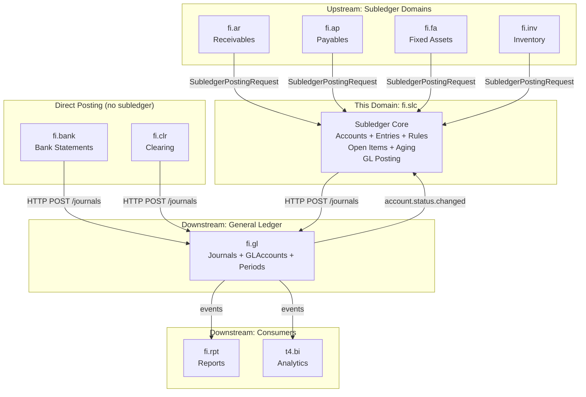
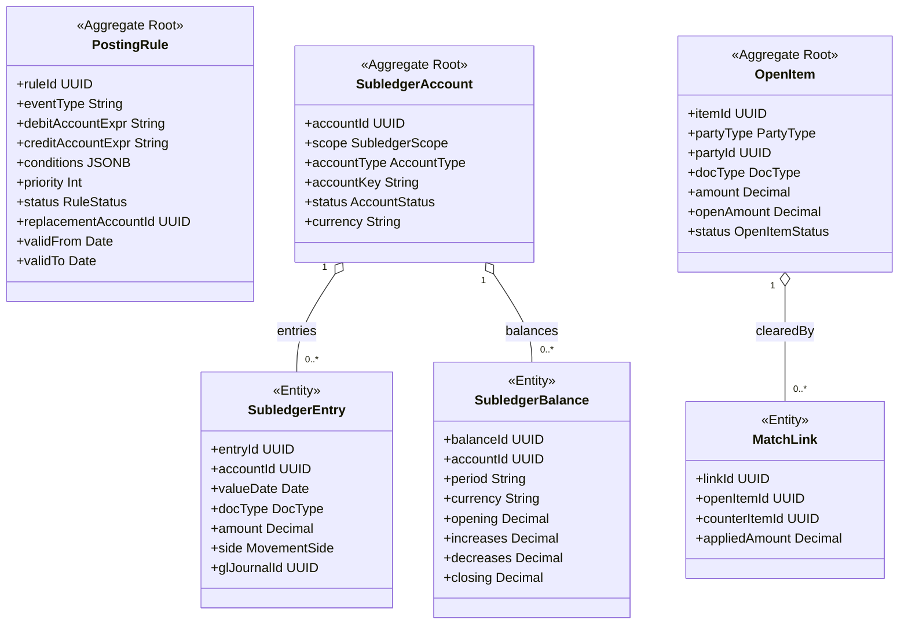
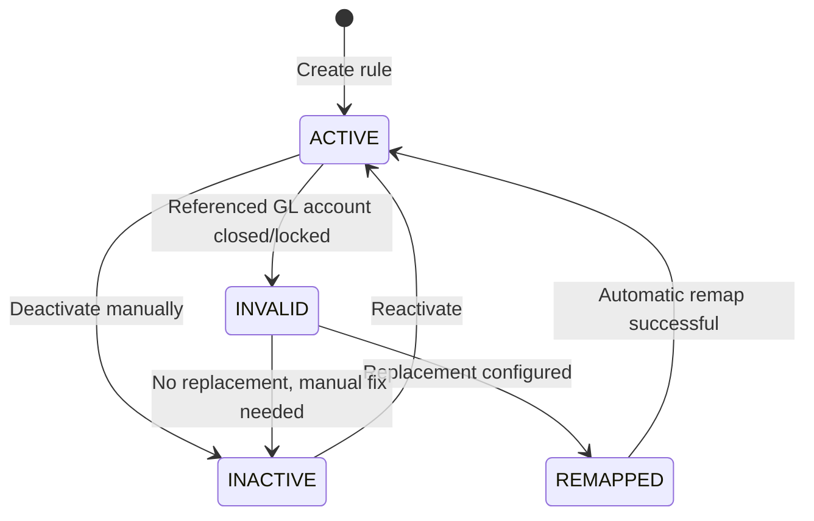
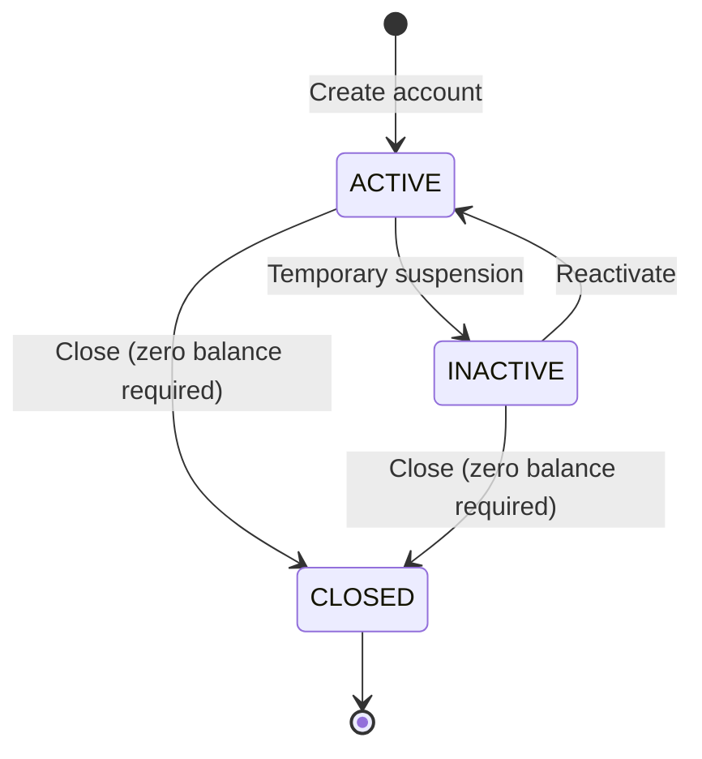
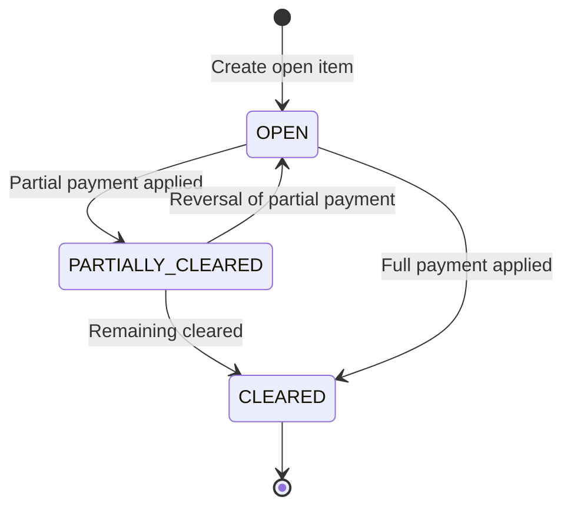
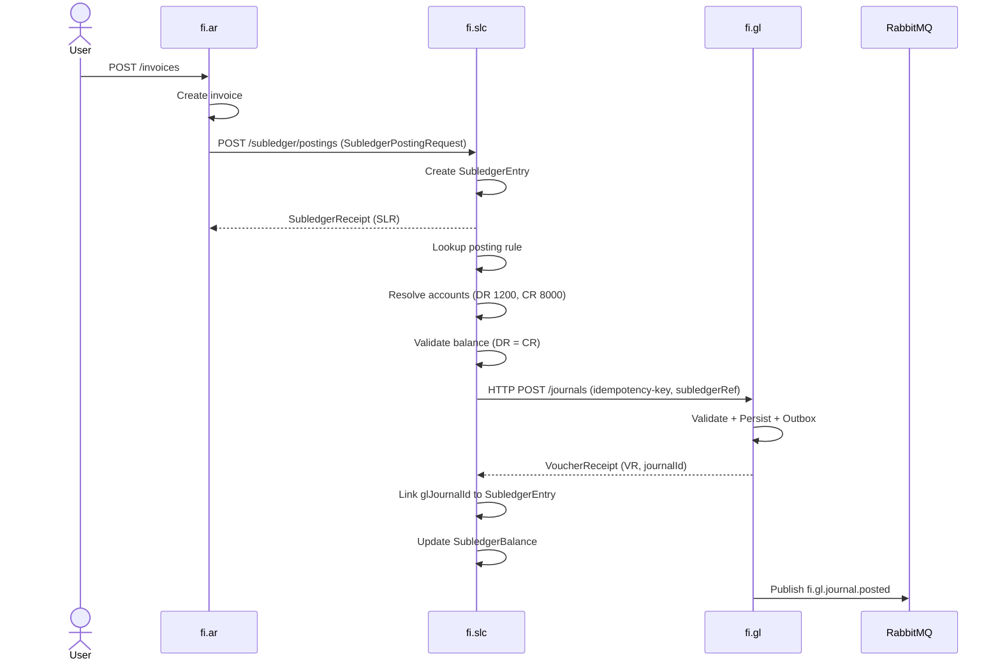
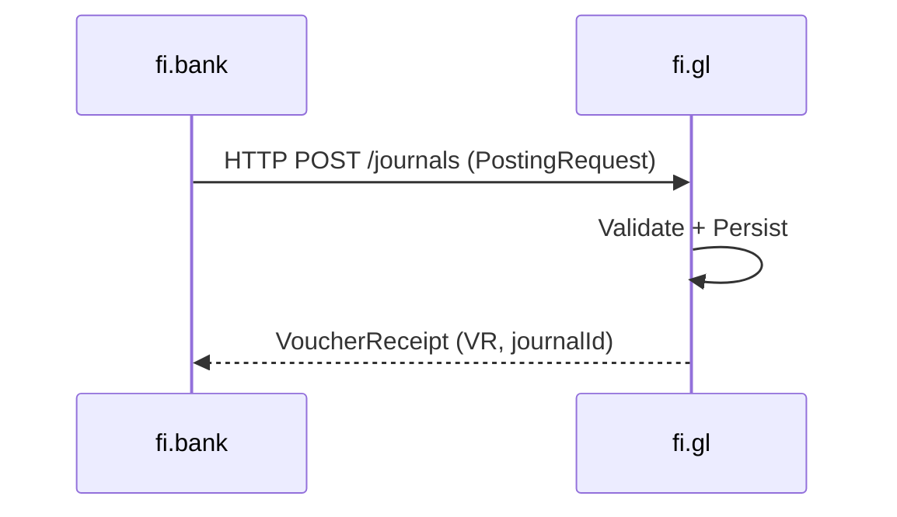
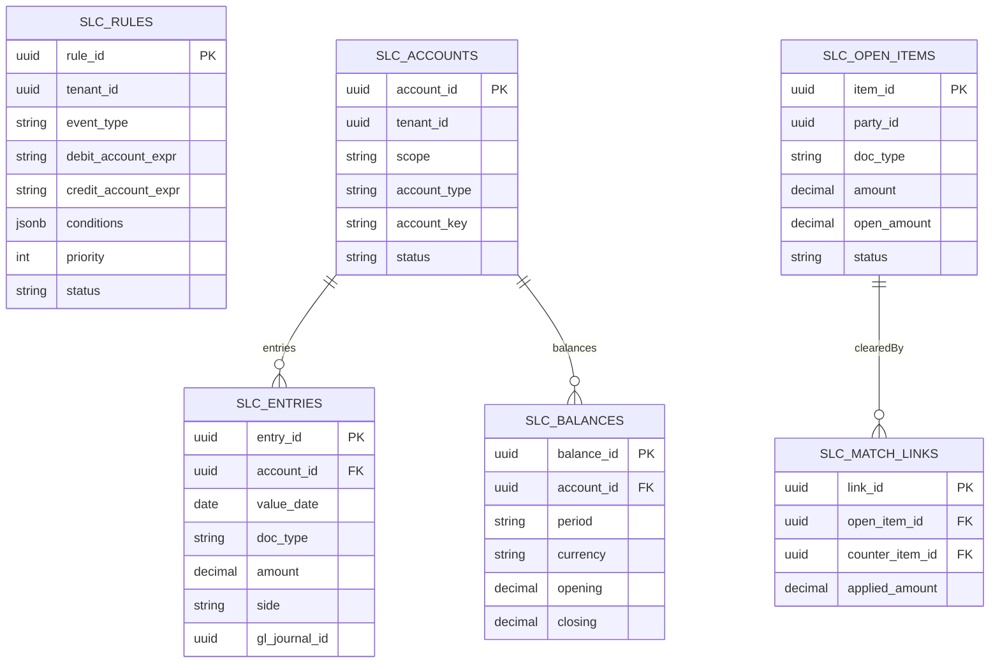

# FI - Subledger Core (SLC) Domain / Service Specification

> **Conceptual Stack Layer:** Domain / Service
> **Space:** Platform
> **Owner:** FI Domain Engineering Team
> **Schema alignment:** `service-layer.schema.json`
> **Companion files:** `openapi.yaml`, `*.schema.json` (event contracts)
> **Referenced by:** Platform-Feature Spec SS5 (backend dependencies), BFF Contract
> **Belongs to:** FI Suite Spec (`_fi_suite.md`)

> **Meta Information**
> - **Version:** 2026-04-01
> - **Template:** `domain-service-spec.md` v1.0.0
> - **Template Compliance:** ~95%
> - **Author(s):** OpenLeap Architecture Team
> - **Status:** DRAFT
> - **Suite:** `fi`
> - **Domain:** `slc`
> - **Bounded Context Ref:** `bc:subledger`
> - **Service ID:** `fi-slc-svc`
> - **basePackage:** `io.openleap.fi.slc`
> - **API Base Path:** `/api/fi/slc/v1`
> - **OpenLeap Starter Version:** `v1.0`
> - **Port:** `8113`
> - **Repository:** `io.openleap.fi.slc`
> - **Tags:** `finance`, `subledger`, `posting-rules`, `account-determination`, `open-items`
> - **Team:**
>   - Name: `team-fi`
>   - Email: `fi-team@openleap.io`
>   - Slack: `#fi-team`

---

## Specification Guidelines Compliance

>
> ### Non-Negotiables
> - Never invent facts. If required info is missing, add an **OPEN QUESTION** entry.
> - Preserve intent and decisions. Only change meaning when explicitly requested.
> - Do not remove normative constraints unless they are explicitly replaced.
> - Keep the spec **self-contained**: no "see chat", no implicit context.
>
> ### Source of Truth Priority
> When sources conflict:
> 1. Spec (explicit) wins
> 2. Starter specs (implementation constraints) next
> 3. Guidelines (best practices) last
>
> ### Style Guide
> - Prefer short sentences and lists.
> - Use MUST/SHOULD/MAY for normative statements.

---

## 0. Document Purpose & Scope

### 0.1 Purpose

This document specifies the **Subledger Core (fi.slc)** domain. fi.slc is the **central posting service** of the FI suite: it receives posting requests from subledger domains (fi.ar, fi.ap, fi.fa, fi.inv), manages subledger accounts, determines GL accounts via configurable posting rules, and submits balanced journals to fi.gl.

fi.slc is the **only** service that posts to fi.gl on behalf of subledger domains. Domains that do not require a subledger layer (fi.bank, fi.clr) post directly to fi.gl.

**v3.0 Architectural Decision:** fi.slc replaces the previously planned fi.pst (Posting Orchestration) service. fi.pst is deprecated. All posting orchestration, account determination, idempotency, and subledger bookkeeping responsibilities are consolidated in fi.slc. See ADR-002.

### 0.2 Target Audience
- Product Owners & Business Stakeholders (Finance, Accounting)
- System Architects & Technical Leads
- Integration Engineers
- Subledger Domain Teams (AR, AP, FA, INV)
- Controllers and Accountants

### 0.3 Scope

**In Scope:**
- **Subledger Accounts:** Customer/vendor/asset/inventory accounts with full lifecycle
- **Subledger Entries:** Append-only transaction log per subledger account
- **Subledger Balances:** Per-account, per-period, per-currency balance aggregation
- **Posting Rules:** Configurable account determination (event type → GL account mapping)
- **GL Posting:** Submit balanced journals to fi.gl via HTTP, handle idempotency and retries
- **Open Item Engine:** Match invoices/bills with payments (AR/AP)
- **Aging Framework:** Bucketed aging analysis (AR/AP)
- **Simulation / Explain:** Dry-run posting to preview GL impact without persisting

**Out of Scope:**
- Domain-specific business logic (dunning → fi.ar, depreciation → fi.fa)
- Financial statements and reporting (Trial Balance, P&L, BS → fi.rpt)
- General Ledger core (journals, periods, GLAccounts → fi.gl)
- Master data (Chart of Accounts structures → fi.coa, Parties → bp)
- Direct GL posting for non-subledger domains (fi.bank, fi.clr post directly to fi.gl)

### 0.4 Related Documents
- `_fi_suite.md` — FI Suite architecture
- `fi_gl.md` — General Ledger specification
- `fi_ar.md` — Accounts Receivable specification
- `fi_ap.md` — Accounts Payable specification
- `fi_fa.md` — Fixed Assets specification
- `Audit_Tracing_spec.md` — End-to-end audit trail (Invoice → Payment → Clearing)

---

## 1. Business Context

### 1.1 Domain Purpose

fi.slc is the **translation and subledger layer** between operational business processes and financial accounting. It bridges the gap between what happened (business event: "invoice created") and what it means financially (GL posting: "DR Receivables, CR Revenue"), while maintaining a full subledger record of customer/vendor/asset positions.

**Core Business Problems Solved:**
- **Account Determination:** Map business events to GL accounts automatically via configurable rules
- **Posting Validation:** Ensure all postings balance (DR = CR) before hitting GL
- **Idempotency:** Prevent duplicate postings from retries
- **Subledger Transparency:** Detailed transaction view per customer/vendor/asset
- **Open Item Management:** Track outstanding invoices vs. payments
- **Aging Analysis:** Overdue invoice bucketing for collections prioritization

### 1.2 Business Value

**For the Organization:**
- **Automation:** Reduce manual journal entries by 90%+ through rule-based posting
- **Accuracy:** Eliminate posting errors through pre-validation
- **Consistency:** Same posting logic across all subledgers
- **Traceability:** Complete audit trail from source document to GL journal
- **Real-Time Visibility:** Customer/vendor positions without waiting for month-end

**For Users:**
- **Controllers:** Trust that subledgers reconcile to GL automatically
- **Accountants:** Investigate discrepancies at subledger level (drill-down)
- **Collections Team:** Prioritize overdue invoices using aging reports
- **AP Clerks:** See vendor open items to avoid duplicate payments
- **Auditors:** Trace from GL journal back to source invoice/payment

### 1.3 Key Stakeholders

| Role | Responsibility | Primary Use Cases |
|------|----------------|-------------------|
| Controller | Subledger reconciliation | Reconcile AR/AP/FA to GL, investigate variances |
| Staff Accountant | Posting rule configuration | Define account mappings, validate postings |
| Collections Manager | AR aging analysis | Prioritize overdue invoices, dunning campaigns |
| AP Clerk | Vendor open items | Verify what's unpaid, prevent duplicate payments |
| System Administrator | Rule maintenance | Update rules when Chart of Accounts changes |
| Integration Engineer | Subledger integration | Configure posting flows from AR/AP/FA/INV |

### 1.4 Strategic Positioning

fi.slc sits **between** operational subledger domains and fi.gl. It is the single posting gateway for all subledger-based flows.

**Two posting paths exist in the FI suite:**
1. **Via fi.slc** (subledger path): fi.ar, fi.ap, fi.fa, fi.inv → fi.slc → fi.gl
2. **Direct to fi.gl** (non-subledger path): fi.bank, fi.clr → fi.gl



---

## 2. Service Identity

| Property | Value | Schema Field |
|----------|-------|-------------|
| **Service ID** | `fi-slc-svc` | `metadata.id` |
| **Display Name** | Subledger Core | `metadata.name` |
| **Suite** | `fi` | `metadata.suite` |
| **Domain** | `slc` | `metadata.domain` |
| **Bounded Context** | `bc:subledger` | `metadata.bounded_context_ref` |
| **Version** | `3.0.0` | `metadata.version` |
| **Status** | DRAFT | `metadata.status` |
| **API Base Path** | `/api/fi/slc/v1` | `metadata.api_base_path` |
| **Repository** | `io.openleap.fi.slc` | `metadata.repository` |
| **Tags** | `finance`, `subledger`, `posting-rules`, `account-determination`, `open-items` | `metadata.tags` |

**Team:**
| Property | Value |
|----------|-------|
| **Name** | `team-fi` |
| **Email** | `fi-team@openleap.io` |
| **Slack Channel** | `#fi-team` |

---

## 3. Domain Model

### 3.1 Conceptual Overview

The fi.slc domain model consists of three pillars:

1. **Posting Engine:** Rules + account determination + GL submission
2. **Subledger Ledger:** Customer/vendor/asset accounts with entries and balances
3. **Operational Views:** Open items + aging (AR/AP working views)

**Key Principles:**
- **Generic Design:** Works for AR, AP, FA, INV without domain-specific code
- **Append-Only:** All subledger entries are immutable; corrections via new entries
- **Multi-Currency:** Each account can have balances in multiple currencies
- **Synchronous GL Posting:** Calls fi.gl via HTTP POST, waits for confirmation
- **Idempotent:** Same idempotency key → same result, no duplicate postings

### 3.2 Core Concepts



### 3.3 Aggregate Definitions

#### 3.3.1 PostingRule

**Business Purpose:**
Defines how a subledger posting request is translated into GL journal lines. Rules specify which accounts to debit/credit based on event type and optional conditions.

**Key Attributes:**

| Attribute | Type | Description | Constraints |
|-----------|------|-------------|-------------|
| ruleId | UUID | Unique identifier | Required, immutable, PK |
| tenantId | UUID | Tenant ownership | Required, immutable |
| eventType | String | Subledger event type | Required, e.g., "fi.ar.invoice.posted" |
| debitAccountExpr | String | Debit account expression | Required, e.g., "1200" or "payload.revenueAccountCode" |
| creditAccountExpr | String | Credit account expression | Required |
| conditions | JSONB | Optional conditions | Optional, e.g., {"country": "DE"} |
| priority | Int | Rule evaluation priority | Required, default 100, lower = higher priority |
| status | RuleStatus | Current state | Required, enum(ACTIVE, INACTIVE, INVALID, REMAPPED) |
| replacementAccountId | UUID | Replacement if account closed | Optional |
| validFrom | Date | Effective start date | Required |
| validTo | Date | Effective end date | Optional |

**Lifecycle States:**



**Business Rules & Invariants:**

1. **BR-RULE-001: Event Type Uniqueness**
   - *Rule:* For each (tenant, eventType, conditions), only ONE rule can be ACTIVE with same priority
   - *Rationale:* Prevent ambiguous posting
   - *Enforcement:* Unique constraint on (tenant_id, event_type, priority, conditions) WHERE status='ACTIVE'

2. **BR-RULE-002: Account Expression Validity**
   - *Rule:* Account expressions must resolve to valid, active GLAccount codes in fi.gl
   - *Rationale:* Prevent posting failures at runtime
   - *Enforcement:* Validation on rule creation; simulation mode validates before activation

3. **BR-RULE-003: Balance Validation**
   - *Rule:* Rule must produce balanced journal (total DR = total CR)
   - *Rationale:* Fundamental double-entry requirement
   - *Enforcement:* Simulation mode validates before activation

4. **BR-RULE-004: Automatic Revalidation**
   - *Rule:* When GLAccount status changes in fi.gl, rules referencing that account must be revalidated
   - *Rationale:* Prevent posting to closed/locked accounts
   - *Enforcement:* Event consumer for fi.gl.account.status.changed

---

#### 3.3.2 SubledgerAccount

**Business Purpose:**
Represents a single customer, vendor, asset, or inventory item in the subledger. This is the "who" or "what" that transactions are posted to.

**Key Attributes:**

| Attribute | Type | Description | Constraints |
|-----------|------|-------------|-------------|
| accountId | UUID | Unique identifier | Required, immutable, PK |
| tenantId | UUID | Tenant ownership | Required, immutable |
| scope | SubledgerScope | Subledger type | Required, enum(AR, AP, FA, INV) |
| accountType | AccountType | Classification | Required, enum(CUSTOMER, VENDOR, ASSET, INVENTORY) |
| accountKey | String | Business key | Required, e.g., partyId, assetId |
| status | AccountStatus | Current state | Required, enum(ACTIVE, INACTIVE, CLOSED) |
| currency | String | Primary currency | Optional, ISO 4217 |
| dimensions | JSONB | Analytical attributes | Optional |

**Lifecycle States:**



**Business Rules & Invariants:**

1. **BR-ACCT-001: Unique Account Key** — Account key must be unique per (tenant, scope, accountType)
2. **BR-ACCT-002: Scope-Type Consistency** — AR→CUSTOMER, AP→VENDOR, FA→ASSET, INV→INVENTORY
3. **BR-ACCT-003: Closure Prerequisite** — Balance must be zero in all currencies to close

---

#### 3.3.3 SubledgerEntry

**Business Purpose:**
Immutable, append-only transaction record on a subledger account.

**Key Attributes:**

| Attribute | Type | Description | Constraints |
|-----------|------|-------------|-------------|
| entryId | UUID | Unique identifier | Required, immutable, PK |
| tenantId | UUID | Tenant ownership | Required, immutable |
| accountId | UUID | Parent subledger account | Required, FK |
| valueDate | Date | Effective date | Required |
| docType | DocType | Transaction type | Required, enum(INVOICE, PAYMENT, CREDIT, BILL, DEPRECIATION, WRITE_OFF, DISPOSAL, ACQUISITION, ADJUSTMENT) |
| docId | UUID | Source document ID | Required |
| source | String | Originating system | Required, e.g., "fi.ar" |
| amount | Decimal | Transaction amount | Required, always positive |
| currency | String | Transaction currency | Required, ISO 4217 |
| side | MovementSide | Direction | Required, enum(INCREASE, DECREASE) |
| glJournalId | UUID | Related GL journal | Set after successful GL posting |

**Business Rules:**
1. **BR-ENTRY-001: Immutability** — Once created, entries cannot be modified or deleted
2. **BR-ENTRY-002: Positive Amounts** — Amount must always be positive; side determines direction
3. **BR-ENTRY-003: Document Reference** — Every entry must reference source document (docId) and system (source)

---

#### 3.3.4 OpenItem

**Business Purpose:**
Represents an outstanding invoice, bill, or payment awaiting clearing. Used for AR collections and AP payment scheduling.

**Key Attributes:**

| Attribute | Type | Description | Constraints |
|-----------|------|-------------|-------------|
| itemId | UUID | Unique identifier | Required, immutable, PK |
| tenantId | UUID | Tenant ownership | Required, immutable |
| partyType | PartyType | Customer or vendor | Required, enum(CUSTOMER, VENDOR) |
| partyId | UUID | Party reference | Required, FK to bp.parties |
| docType | DocType | Document type | Required, enum(INVOICE, BILL, PAYMENT, CREDIT, ADJUSTMENT) |
| amount | Decimal | Original amount | Required, positive |
| openAmount | Decimal | Remaining open amount | Required, >= 0, <= amount |
| currency | String | Currency | Required, ISO 4217 |
| dueDate | Date | Payment due date | Optional |
| status | OpenItemStatus | Current state | Required, enum(OPEN, PARTIALLY_CLEARED, CLEARED) |

**Lifecycle States:**



**Business Rules:**
1. **BR-OITEM-001: Open Amount Constraint** — 0 <= openAmount <= amount
2. **BR-OITEM-002: Status Consistency** — Status derived from openAmount (OPEN if openAmount=amount, CLEARED if openAmount=0)
3. **BR-OITEM-003: Matching Rules** — Only match opposite types (INVOICE ↔ PAYMENT, BILL ↔ PAYMENT)

---

## 5. Use Cases

### 5.1 Primary Use Cases

#### UC-001: Post Subledger Transaction to GL

**Actor:** fi.slc (triggered by subledger domain via HTTP)

**Preconditions:**
- Posting rule exists for the source event type
- Rule status = ACTIVE
- Referenced GL accounts exist and are ACTIVE in fi.gl

**Main Flow:**
1. Subledger domain (e.g., fi.ar) sends SubledgerPostingRequest to fi.slc via HTTP POST
2. fi.slc creates SubledgerEntry (append-only)
3. fi.slc returns SubledgerReceipt (SLR) with subledgerEntryId to caller
4. fi.slc looks up posting rule by source/event type
5. fi.slc evaluates account expressions against request payload
6. fi.slc validates balance (DR = CR)
7. fi.slc calls fi.gl POST /journals (with idempotency key, subledgerRef)
8. fi.gl validates, persists journal, returns VoucherReceipt (VR) with journalEntryId
9. fi.slc stores glJournalId on SubledgerEntry
10. fi.slc updates SubledgerBalance

**Postconditions:**
- SubledgerEntry created with glJournalId link
- GL journal posted and immutable
- Subledger balance updated
- Full traceability chain: sourceDocument → SLR → VR → GLJ

**Business Rules Applied:**
- BR-RULE-001, BR-RULE-002, BR-RULE-003

**Alternative Flows:**
- **Alt-1:** No rule found → 422 RULE_NOT_FOUND
- **Alt-2:** Rule invalid → 403 RULE_INVALID
- **Alt-3:** Balance invalid → 400 JOURNAL_UNBALANCED
- **Alt-4:** Idempotency key duplicate with same payload → 200 OK (return existing SLR)
- **Alt-5:** Idempotency key duplicate with different payload → 409 IDEMPOTENT_CONFLICT

**Exception Flows:**
- **Exc-1:** fi.gl returns 500 → retry with exponential backoff (max 3 attempts)
- **Exc-2:** fi.gl timeout → retry with exponential backoff

---

#### UC-002: Match Open Items (Invoice + Payment)

**Actor:** Collections Clerk (AR) or AP Clerk (AP)

**Preconditions:**
- Open items exist (invoices and payments)
- User has SUBLEDGER_ADMIN role

**Main Flow:**
1. User searches for open items (GET /open-items?partyId=...)
2. User selects invoice and payment to match
3. User submits match request (POST /open-items/match)
4. System validates openAmount >= appliedAmount, same party, same currency
5. System creates match link, updates openAmount and status on both items
6. System publishes fi.slc.openitems.updated event

**Business Rules Applied:** BR-OITEM-001, BR-OITEM-002, BR-OITEM-003

---

#### UC-003: Revalidate Rules on GLAccount Status Change

**Actor:** fi.slc (automated, triggered by fi.gl event)

**Preconditions:**
- fi.gl closes or locks a GLAccount
- Posting rules reference that account

**Main Flow:**
1. fi.gl publishes fi.gl.account.status.changed event
2. fi.slc consumes event
3. fi.slc finds all rules referencing the accountId
4. For each rule: if replacementAccountId configured → status=REMAPPED; else → status=INVALID
5. fi.slc publishes fi.slc.rules.invalid event for invalid rules
6. Admin notified to fix invalid rules

---

### 5.2 Process Flow Diagrams

#### Process: Subledger Posting (AR Invoice Example)



#### Process: Direct GL Posting (Bank Statement — bypasses fi.slc)



### 5.3 Cross-Domain Workflows

**Does this domain participate in multi-service workflows?** [X] YES

#### Workflow: Subledger to GL Posting

**Orchestration Pattern:** [X] Choreography (EDA) for inbound events; Synchronous HTTP for GL posting

**Pattern Rationale:**
fi.slc uses a **hybrid pattern**: synchronous HTTP from subledger domains for posting requests (ensuring confirmation), and event-driven reactions to GL account status changes. GL posting is synchronous to guarantee confirmation (journalId) before subledger entry is finalized.

---

## 4. Business Rules & Constraints

### 4.1 Business Rules Catalog

| ID | Rule Name | Description | Scope | Enforcement |
|----|-----------|-------------|-------|-------------|
| BR-RULE-001 | Event Type Uniqueness | One ACTIVE rule per (tenant, eventType, priority) | PostingRule | Create/Activate |
| BR-RULE-002 | Account Expression Validity | Expressions must resolve to valid GL accounts | PostingRule | Create/Validate |
| BR-RULE-003 | Balance Validation | Rules must produce balanced journals (DR=CR) | PostingRule | Simulation |
| BR-RULE-004 | Automatic Revalidation | Rules revalidated when GL account status changes | PostingRule | Event Consumer |
| BR-ACCT-001 | Unique Account Key | One subledger account per (tenant, scope, type, key) | SubledgerAccount | Create |
| BR-ACCT-002 | Scope-Type Consistency | Account type must match scope | SubledgerAccount | Create |
| BR-ACCT-003 | Closure Prerequisite | Balance must be zero to close | SubledgerAccount | Close |
| BR-ENTRY-001 | Immutability | Entries cannot be modified after creation | SubledgerEntry | Update/Delete |
| BR-ENTRY-002 | Positive Amounts | Amount must always be positive | SubledgerEntry | Create |
| BR-OITEM-001 | Open Amount Constraint | 0 <= openAmount <= amount | OpenItem | Match |
| BR-OITEM-002 | Status Consistency | Status derived from openAmount | OpenItem | Update |
| BR-OITEM-003 | Matching Rules | Only match opposite types | OpenItem | Match |

### 4.2 Data Validation Rules

**Field-Level Validations:**

| Field | Validation Rule | Error Message |
|-------|----------------|---------------|
| amount | > 0, NUMERIC(19,4) | "Amount must be positive" |
| currency | ISO 4217, 3 chars | "Invalid currency code" |
| scope | IN (AR, AP, FA, INV) | "Invalid subledger scope" |
| openAmount | >= 0, <= amount | "Open amount out of range" |

### 4.3 Reference Data Dependencies

| Catalog | Source | Usage | Validation |
|---------|--------|-------|------------|
| currencies | ref-data-svc | SubledgerEntry.currency | Must exist and be active |
| GLAccounts | fi.gl | PostingRule account expressions | Must exist and be ACTIVE |

---

## 6. REST API

### 6.1 API Overview

**Base Path:** `/api/fi/slc/v1`

**Authentication:** OAuth2/JWT (Bearer token)

**Authorization:**
- Read operations: scope `fi.slc:read`
- Write operations: scope `fi.slc:write`
- Admin operations: scope `fi.slc:admin`
- System (posting): scope `fi.slc:system`

### 6.2 Resource Operations

#### 6.2.1 Subledger Postings (Core Transactional API)

```http
POST /api/fi/slc/v1/subledger/postings
Authorization: Bearer {token}
Idempotency-Key: fi.ar|INV-2025-00123|subledger
```

**Request Body:**
```json
{
  "sourceSystem": "fi.ar",
  "sourceDocumentRef": "INV-2025-00123",
  "idempotencyKey": "fi.ar|INV-2025-00123|subledger",
  "bookingDate": "2025-10-15",
  "postingPeriod": "2025-10",
  "lines": [
    {
      "account": {"code": "1200"},
      "direction": "DR",
      "amount": "1000.00",
      "currency": "EUR",
      "meta": {"invoiceId": "INV-2025-00123", "customerId": "CUST-9876"}
    },
    {
      "account": {"code": "8000"},
      "direction": "CR",
      "amount": "1000.00",
      "currency": "EUR",
      "meta": {"invoiceId": "INV-2025-00123", "revenueType": "SALES"}
    }
  ]
}
```

**Success Response:** `201 Created`
```json
{
  "subledgerReceiptId": "SLR-AR-INV-0001",
  "subledgerEntryId": "SLE-10001",
  "sourceSystem": "fi.ar",
  "sourceDocumentRef": "INV-2025-00123",
  "status": "RECORDED",
  "voucherReceipt": {
    "voucherReceiptId": "VR-AR-INV-0001",
    "journalEntryId": "GLJ-10001",
    "status": "POSTED"
  },
  "linesSnapshot": [
    {"lineId": "SLE-10001-1", "account": {"code": "1200"}, "direction": "DR", "amount": "1000.00"},
    {"lineId": "SLE-10001-2", "account": {"code": "8000"}, "direction": "CR", "amount": "1000.00"}
  ]
}
```

**Error Responses:**
- `400` JOURNAL_UNBALANCED — DR ≠ CR
- `403` RULE_INVALID — Posting rule invalid
- `404` RULE_NOT_FOUND — No rule for event type
- `409` IDEMPOTENT_CONFLICT — Duplicate key, different payload
- `422` VALIDATION_ERROR — Generic validation failure

---

#### 6.2.2 Posting Simulation

```http
POST /api/fi/slc/v1/subledger/postings/simulate
```

Same request body as postings. Returns preview without persisting.

**Response:** `200 OK`
```json
{
  "isValid": true,
  "previewJournal": {
    "debit": [{"account": "1200", "amount": "1000.00"}],
    "credit": [{"account": "8000", "amount": "1000.00"}]
  },
  "appliedRuleId": "rule-uuid",
  "warnings": []
}
```

---

#### 6.2.3 Posting Rules

- `GET /rules` — List posting rules (filter: eventType, status)
- `POST /rules` — Create posting rule
- `PATCH /rules/{id}` — Update rule (restricted fields)
- `POST /rules/{id}/simulate` — Test rule against sample payload
- `POST /rules/impact` — Analyze impact of GLAccount closure

---

#### 6.2.4 Subledger Accounts

- `GET /subledger/accounts` — List accounts (filter: scope, accountType, status)
- `GET /subledger/accounts/{id}` — Get account details
- `GET /subledger/accounts/{id}/ledger` — Account statement (entries over period)
- `GET /subledger/accounts/{id}/balances` — Balances by period

---

#### 6.2.5 Open Items

- `GET /open-items` — List open items (filter: partyId, partyType, status)
- `POST /open-items` — Create open item
- `POST /open-items/match` — Match invoice with payment
- `DELETE /open-items/match/{matchId}` — Unmatch (reversal)

---

#### 6.2.6 Aging

- `GET /aging/run` — Calculate aging (params: scope, asOf, groupBy)
- `POST /aging/config` — Configure aging buckets

---

### 6.3 Error Responses

| HTTP Status | Error Code | Description |
|-------------|------------|-------------|
| 400 | JOURNAL_UNBALANCED | DR ≠ CR |
| 400 | OVERAPPLICATION | Applied > open amount |
| 400 | CURRENCY_MISMATCH | Matching items in different currencies |
| 403 | RULE_INVALID | Posting rule invalid (account closed) |
| 404 | RULE_NOT_FOUND | No posting rule for event type |
| 409 | IDEMPOTENT_CONFLICT | Duplicate idempotency key, different payload |
| 422 | VALIDATION_ERROR | Generic validation failure |

---

## 7. Events & Integration

### 7.1 Event-Driven Architecture Pattern

**Pattern Used:** Hybrid (Synchronous HTTP input + Event-Driven reactions)

**Rationale:**
- Subledger domains call fi.slc synchronously (HTTP POST) to get confirmed SubledgerReceipts
- fi.slc calls fi.gl synchronously (HTTP POST) to get confirmed VoucherReceipts
- fi.slc reacts to fi.gl account status events asynchronously (revalidate rules)

### 7.2 Published Events

**Exchange:** `fi.slc.events` (RabbitMQ topic exchange)

| Event | Routing Key | When | Consumers |
|-------|-------------|------|-----------|
| rules.updated | fi.slc.rules.updated | Rule auto-remapped | Monitoring |
| rules.invalid | fi.slc.rules.invalid | Rule invalidated, admin must fix | Alerting |
| openitems.updated | fi.slc.openitems.updated | Open items matched/cleared | fi.rpt, dashboards |
| entry.posted | fi.slc.entry.posted | Subledger entry created + GL posted | t4.bi |

### 7.3 Consumed Events

| Event | Source | Purpose | Handling |
|-------|--------|---------|----------|
| fi.gl.account.status.changed | fi.gl | Revalidate posting rules | Remap or invalidate affected rules |
| fi.gl.account.deactivated | fi.gl | Revalidate posting rules | Same as above |

### 7.4 Integration Points Summary

**Inbound (Services that call fi.slc):**

| Service | Integration Type | Purpose |
|---------|------------------|---------|
| fi.ar | HTTP POST | Post invoices, payments to subledger + GL |
| fi.ap | HTTP POST | Post bills, payments to subledger + GL |
| fi.fa | HTTP POST | Post depreciation, disposals |
| fi.inv | HTTP POST | Post revaluations |
| Manual (UI/API) | HTTP | Configure rules, match open items |

**Outbound (Services that fi.slc calls):**

| Service | Integration Type | Purpose |
|---------|------------------|---------|
| fi.gl | HTTP POST /journals | Submit balanced journals |
| fi.gl (events) | RabbitMQ | Consume account status changes |

---

## 8. Data Model

### 8.1 Conceptual Data Model



### 8.2 Storage Schema (PostgreSQL)

**Schema:** `fi_slc`

All tables include `tenant_id` with Row-Level Security (RLS). See original fi_slc spec for full DDL (tables: slc_rules, slc_accounts, slc_entries, slc_balances, slc_open_items, slc_match_links).

### 8.3 Reference Data Dependencies

| Catalog | Source Service | Fields Referencing | Validation |
|---------|----------------|-------------------|------------|
| currencies | ref-data-svc | currency fields | Must exist and be active |
| GLAccounts | fi.gl | PostingRule expressions | Must be ACTIVE |
| Parties | bp | OpenItem.partyId | Must exist |

---

## 9. Security & Compliance

### 9.1 Data Classification

| Data Element | Classification | Rationale | Protection Measures |
|--------------|----------------|-----------|---------------------|
| Posting Rule | Internal | Configuration data | Multi-tenancy, RBAC |
| Subledger Account | Internal | Customer/vendor accounts | Multi-tenancy, RBAC |
| Subledger Entry | Confidential | Financial transaction | Encryption, audit trail |
| Open Item | Confidential | Outstanding invoices/payments | Encryption, RBAC |
| Balance | Confidential | Financial position | Encryption, RBAC |

### 9.2 Access Control

| Role | Read | Create | Update | Delete | Admin |
|------|------|--------|--------|--------|-------|
| SUBLEDGER_VIEWER | ✓ | ✗ | ✗ | ✗ | ✗ |
| SUBLEDGER_ADMIN | ✓ | ✓ (rules, OI) | ✓ (rules) | ✗ | ✓ (match/unmatch) |
| SUBLEDGER_SYSTEM | ✓ | ✓ (entries, balances) | ✗ | ✗ | ✓ (posting) |

### 9.3 Compliance Requirements

- [X] SOX — Audit trail for all postings
- [X] IFRS/GAAP — Accurate subledger-to-GL reconciliation
- [X] GDPR — Right to erasure (anonymize party references)

**Controls:**
1. **Immutability:** Subledger entries append-only
2. **Audit Trail:** Every entry links to source document + GL journal
3. **Reconciliation:** Subledger balances MUST equal GL control accounts (automated checks)
4. **Retention:** Entries retained 10 years

---

## 10. Quality Attributes

### 10.1 Performance Requirements

**Response Time (95th percentile):**
- POST /subledger/postings: < 250ms (excluding fi.gl latency)
- POST /subledger/postings/simulate: < 150ms
- GET /open-items: < 200ms
- GET /aging/run: < 2 sec (for 10K items)

**Throughput:**
- Subledger postings: 1,000 req/sec peak
- Concurrent GL postings: 1,000 req/sec

### 10.2 Availability & Reliability

**Availability Target:** 99.9%

**Recovery Objectives:**
- RTO: < 10 minutes
- RPO: < 5 minutes

### 10.3 Scalability

- Horizontal scaling: Multiple API server instances
- Database: Read replicas for queries
- GL posting: Parallel posting with idempotency keys

---

## 11. Feature Dependencies

### 11.1 Purpose

This section tracks all platform-features that call this service's endpoints or consume its events.

### 11.2 Feature Dependency Register

> OPEN QUESTION: Feature IDs (F-FI-NNN) have not been defined yet.

| Feature ID | Feature Name | Suite | Tier | Dependency Type | Status |
|------------|-------------|-------|------|-----------------|--------|
| — | — | — | — | — | — |

---

## 12. Extension Points

### 12.1 Purpose

This section defines all hooks available for product-level customization of this service.

### 12.2 Extension Events

> OPEN QUESTION: Extension events for fi.slc have not been defined yet.

### 12.3 Aggregate Hooks

> OPEN QUESTION: Aggregate hooks for fi.slc have not been defined yet.

---

## 13. Migration & Evolution

### 13.1 Data Migration

**From Legacy:**
- Export subledger balances (AR/AP/FA) from legacy system
- Import as opening entries via POST /subledger/postings
- Reconcile to GL control accounts

### 13.2 Deprecation & Sunset

| Feature | Deprecated Date | Removal Date | Alternative |
|---------|----------------|--------------|-------------|
| fi.pst (Posting Orchestration) | 2026-02-24 | Immediate | fi.slc absorbs all fi.pst responsibilities |

---

## 14. Decisions & Open Questions

### 14.1 Open Questions

| ID | Question | Impact | Decision Needed By |
|----|----------|--------|---------------------|
| Q-001 | Should fi.slc support non-subledger posting requests (as a pass-through to fi.gl for domains that want a single posting gateway)? | Medium | Phase 2 |
| Q-002 | Should simulation/explain be a separate read-only endpoint or part of the posting flow? | Low | Phase 1 |

### 14.2 Architectural Decision Records (ADRs)

#### ADR-001: Hybrid Integration Pattern (HTTP Input + HTTP Output)

**Status:** Accepted

**Context:** fi.slc needs to receive posting requests from subledgers and submit journals to fi.gl.

**Decision:** Use synchronous HTTP for both inbound (from subledgers) and outbound (to fi.gl). Event-driven only for GL account status change reactions.

**Consequences:**
- Positive: Guaranteed confirmation (SubledgerReceipt, VoucherReceipt), transactional consistency, simple retry logic
- Negative: Synchronous coupling between subledger → fi.slc → fi.gl
- Risks: fi.gl downtime blocks all subledger posting (mitigated by retry + circuit breaker)

---

#### ADR-002: fi.slc Replaces fi.pst (No Separate Posting Orchestration Service)

**Status:** Accepted (v3.0)

**Context:**
The v2.1 architecture introduced fi.pst as a separate posting orchestration service. After analysis, fi.pst had no domain model of its own — it was a technical routing layer without business semantics. Meanwhile, fi.slc already owned subledger accounts, entries, balances, and posting rules. Splitting orchestration from subledger bookkeeping created redundancy and confusion about boundaries.

**Decision:**
Consolidate all posting orchestration into fi.slc. fi.pst is deprecated. fi.slc is the single posting service for all subledger-based flows. Non-subledger domains (fi.bank, fi.clr) continue to post directly to fi.gl.

**Consequences:**
- Positive: One service instead of two, clear domain ownership, consistent with Audit Tracing spec flows, fi.slc has real domain substance
- Negative: fi.slc is somewhat "larger" (but well-scoped)
- Risks: None significant — fi.slc already had most of the capabilities

**Alternatives Considered:**
1. Keep fi.pst separate — Rejected (no domain model, pure technical layer, added complexity)
2. Merge fi.slc into fi.gl — Rejected (GL should be passive receiver, not own subledger logic)
3. fi.slc as library embedded in each subledger — Rejected (loses central open-item view and posting rule management)

---

## 15. Appendix

### 15.1 Glossary

| Term | Definition | Aliases |
|------|------------|---------|
| Posting Rule | Configuration mapping source event type to GL accounts | Account Determination Rule |
| Subledger Account | Customer/vendor/asset account in the subledger | SL Account |
| Subledger Entry | Immutable transaction record on a subledger account | SL Entry |
| SubledgerReceipt (SLR) | Confirmation returned to caller after subledger posting | — |
| VoucherReceipt (VR) | Confirmation returned by fi.gl after journal posting | — |
| Open Item | Outstanding invoice/bill awaiting payment | — |
| Aging | Analysis of overdue invoices by time buckets | — |

### 15.2 References

**Technical Standards:**
- `DOMAIN_SPEC_TEMPLATE.md` — Domain specification template
- `Audit_Tracing_spec.md` — End-to-end audit trail documentation
- `EVENT_STANDARDS.md` — Event structure and routing

**External Standards:**
- ISO 4217 (Currencies)
- RFC 3339 (Date/Time format)

### 15.3 Change Log

| Date | Version | Author | Changes |
|------|---------|--------|---------|
| 2025-12-05 | 1.0 | Architecture Team | Initial version (fi.slc as posting engine + subledger) |
| 2026-02-24 | 3.0 | Architecture Team | v3.0: Absorb fi.pst responsibilities, template compliance, clarify two posting paths |

---

## Document Review & Approval

**Status:** DRAFT

**Review Schedule:** Quarterly or on major changes

**Reviewers:**
- Product Owner (Finance): {Name} - {Date} - [ ] Approved
- System Architect: {Name} - {Date} - [ ] Approved
- Technical Lead (FI): {Name} - {Date} - [ ] Approved

**Approval:**
- Product Owner: {Name} - {Date} - [ ] Approved
- CTO/VP Engineering: {Name} - {Date} - [ ] Approved
