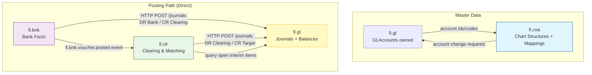
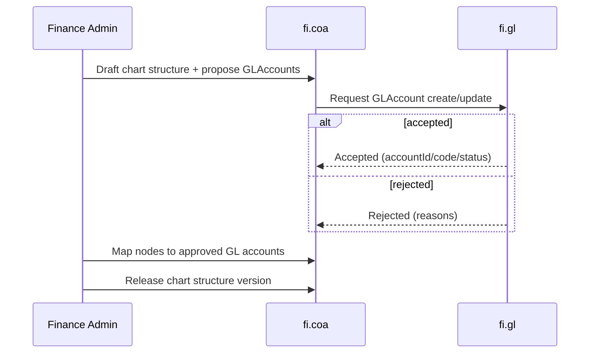
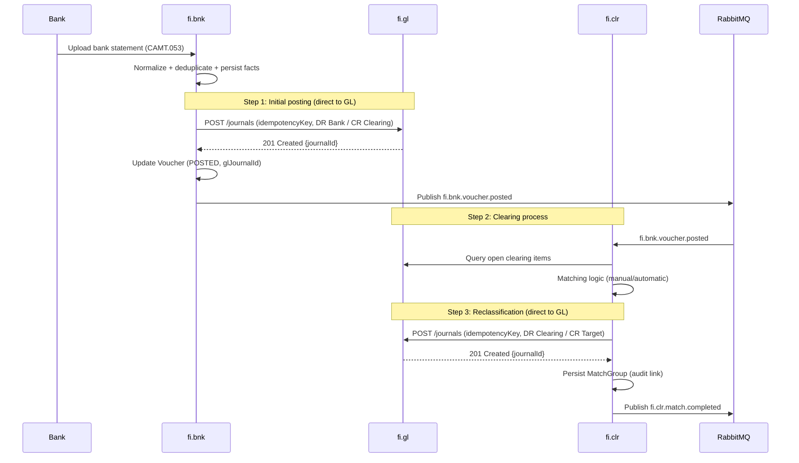
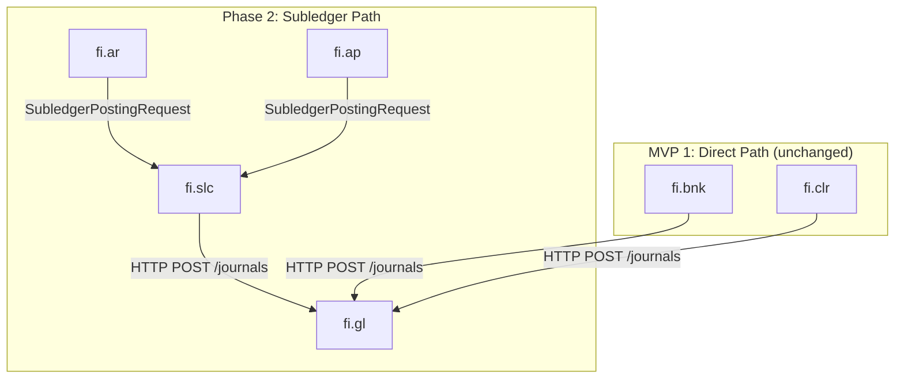

<!-- NOTE: This file is an MVP scoping document, not a domain/service spec or suite spec.
It does NOT follow the suite-spec.md or domain-service-spec.md templates.
This appears STILL RELEVANT as of 2026-04-01: it defines the MVP 1 scope (fi.gl, fi.bnk, fi.clr, fi.coa)
and is aligned with the v3.0 architectural decisions (fi.pst deprecated, fi.slc as posting service for Phase 2).
Recommendation: Keep as a planning/scoping companion document alongside _fi_suite.md §10 Roadmap.
No template restructuring needed — this is not a spec file but a release-planning document.
-->
# FI Suite – MVP 1 Specification (v3.0)

> **Meta Information**
> - **Version:** 2026-02-24
> - **Template:** `domain-service-spec.md` v1.0.0
> - **Template Compliance:** ~10% — §1-§15 mostly missing (MVP planning doc, not a service spec)
> - **Status:** DRAFT
> - **Alignment:** FI Suite v3.0 (fi.slc as posting service, fi.pst deprecated)

---

## 0. Purpose

MVP 1 implements the **end-to-end money flow** from bank statement import to **auditable double-entry posting in `fi.gl`**, including the **single interpretation step in `fi.clr`**.

This MVP is aligned with the FI v3.0 architectural decisions:

> - **All posting accounts (`GLAccounts`) are owned and lifecycle-managed by `fi.gl`.**
> - **`fi.bnk` and `fi.clr` post directly to `fi.gl`** (no subledger layer, no fi.pst intermediary).
> - **`fi.slc` is the posting service for subledger flows** (fi.ar, fi.ap — not in MVP 1 scope).
> - **`fi.pst` is deprecated** — its responsibilities are absorbed by fi.slc (subledger path) or eliminated (direct path).

---

## 1. Components in MVP 1

### 1.1 Included (MVP 1)

| Component | Purpose | Posting Path |
|-----------|---------|--------------|
| **`fi.gl`** | Accounting authority (double-entry, period integrity, GLAccounts, balances) | — (destination) |
| **`fi.bnk`** | Import bank statements as facts; post initial DR Bank / CR Clearing journals | **Direct → fi.gl** |
| **`fi.clr`** | Match bank lines to open items; post reclassification DR Clearing / CR Target | **Direct → fi.gl** |
| **`fi.coa`** | Maintain chart structures and mappings referencing GL-owned accounts | — (master data) |

### 1.2 Not in MVP 1 (future phases)

| Component | Reason |
|-----------|--------|
| `fi.slc` | Subledger Core — needed when fi.ar/fi.ap are introduced (Phase 2) |
| `fi.ar` / `fi.ap` | Open item management — Phase 2 |
| `fi.rpt` | Full reporting service (beyond basic GL read models) — Phase 2 |
| `fi.pst` | **DEPRECATED** — not implemented |
| Tax, revenue recognition, fixed assets, treasury, consolidation | Future phases |

---

## 2. Architecture Overview

### 2.1 Responsibility and Ownership (v3.0)

- `fi.gl` is the **single source of truth** for double-entry and legal period integrity.
- `fi.gl` **owns GLAccounts** (create/activate/deactivate, effective dating, audit trail).
- `fi.coa` **MUST NOT** be the system of record for posting accounts; it structures/maps by reference.
- `fi.bnk` and `fi.clr` **post directly to `fi.gl`** via HTTP POST /journals.
- Idempotency is enforced by `fi.gl` (idempotency key on journal entries).

### 2.2 MVP 1 Interaction Diagram

**Key Difference vs. v2.1:** No `fi.pst` layer. fi.bnk and fi.clr post directly to fi.gl. Idempotency is handled by fi.gl's idempotency key mechanism.

---

## 3. MVP 1 Core Features (per domain)

### 3.1 `fi.gl` — General Ledger (Accounting Authority)

- Accepts journal postings via HTTP POST /journals from any authorized caller.
- Stores immutable posting evidence (journal entries, journal lines).
- Validates invariants: DR = CR, no posting into closed periods, no posting to deactivated accounts.
- Enforces idempotency via `idempotencyKey` on journal entries.
- Maintains balances per period.
- Publishes events: journal.posted, period.closed, account.status.changed.

### 3.2 `fi.bnk` — Banking (Facts Only)

- Imports CAMT/MT940/CSV, deduplicates, stores raw facts in DMS (WORM).
- Ensures statement completeness and sequencing (balance equation validation).
- Creates vouchers from statement lines.
- Posts initial journals **directly to fi.gl**:
  - Inbound: DR Bank / CR Clearing.Unassigned
  - Outbound: DR Clearing.Outbox / CR Bank
- Publishes fi.bnk.voucher.posted event (consumed by fi.clr).

### 3.3 `fi.clr` — Clearing & Matching

- Consumes fi.bnk.voucher.posted events.
- Queries fi.gl for open interim items on clearing accounts.
- Matches bank lines to open items (manual/automatic rules).
- Persists `MatchGroup` (audit link from source facts to resulting postings).
- Posts reclassification journals **directly to fi.gl**:
  - DR Clearing.Unassigned / CR Target (e.g., Receivables, Revenue, Expense)
- Publishes fi.clr.match.completed event.

### 3.4 `fi.coa` — Chart of Accounts (Structures & Reporting)

- Maintains hierarchical chart structures with versioning.
- Maintains mappings: chart node → fi.gl GLAccount references.
- Does **not** create, delete, activate, or deactivate posting accounts unilaterally.
- MAY submit account creation/modification requests to fi.gl.

---

## 4. Typical Interactions (Sequences)

### 4.1 Initial Setup (Accounts + Structures)

### 4.2 End-to-End Payment Flow (Bank Import → Interim → Clearing → Target)

---

## 5. MVP 1 Invariants & Audit

1. **Single source of double-entry truth:** only `fi.gl` persists journals and balances.
2. **GLAccount ownership:** GLAccounts are created/activated/deactivated only in `fi.gl`.
3. **Append-only accounting facts:** posted journals are immutable; corrections via reversals.
4. **Idempotency:** fi.gl enforces idempotency via `idempotencyKey` on journal entries. Each import and reclassification has a stable key.
5. **Bank statement completeness:** `fi.bnk` validates opening + Σ(lines) = closing.
6. **End-to-end traceability:** `BankFile → BankLine → Voucher → GL Journal → MatchGroup → Reclassification Journal → GLAccount → CoA Structure`.
7. **Direct posting:** fi.bnk and fi.clr post directly to fi.gl. No intermediary service.

---

## 6. Phase 2 Preview

When fi.ar and fi.ap are introduced (Phase 2), the **subledger posting path** via fi.slc activates:

Both paths coexist. fi.slc handles subledger bookkeeping, account determination, and GL posting for AR/AP. fi.bnk and fi.clr continue to post directly.

---

## 7. References

- `fi_gl.md` — General Ledger specification (v3.0)
- `fi_bnk.md` — Banking specification (v3.0)
- `fi_clr.md` — Clearing & Matching specification
- `fi_slc.md` — Subledger Core specification (v3.0, for Phase 2)
- `fi_coa.md` — Chart of Accounts structures
- `Audit_Tracing_spec.md` — End-to-end audit trail
